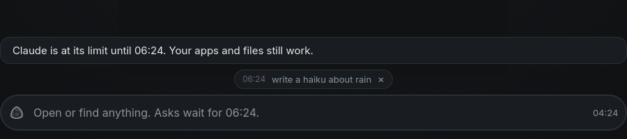
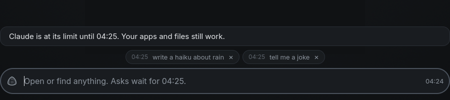
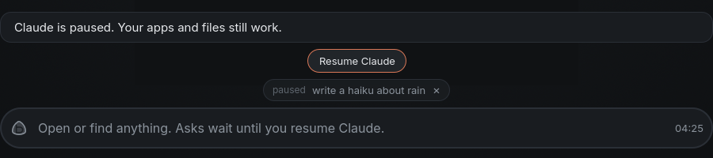
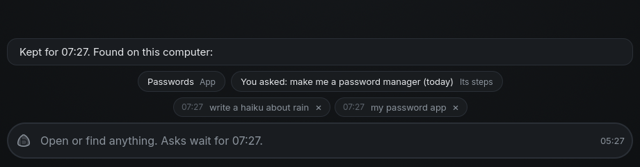
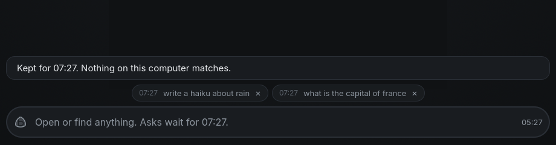
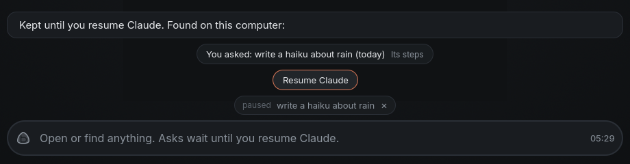

# Architecture

## Decisions (2026-09-27)

| Choice | Pick | Why |
|---|---|---|
| Base | Arch + btrfs/snapper | Agents know it; rolling graphics stack; archiso; snapshots are the undo |
| Display | Hyprland now, custom compositor later | Slide-in special workspaces and IPC out of the box; a browser needs a real Wayland server |
| First target | QEMU VM, ISO also boots hardware | Fast loop while the core changes daily |
| Agent runtime | Official Claude Code / Codex CLIs wrapped by `agentd` | Logins and subscriptions just work; vendor tool use for free |
| Generated apps | QML via PySide6, `~/Apps/<name>/` | No build step, hot reload, real windows, no ports |
| Provider switching | One MCP server (`bombadil-os-mcp`) | Same OS abilities whatever the provider |
| Browser | Chromium with remote debugging on | Agent can drive it while you watch |

## One turn

1. The bar (or `bombadil ask`) writes `{"type":"prompt","text":…}` to the socket.
2. `agentd` takes a snapper snapshot named `turn:<n>: <prompt>`.
3. It runs the provider CLI once, in full-access mode, resuming the previous session id,
   with `bombadil-os-mcp` in its MCP config and `providers.system_prompt()` appended.
4. The CLI's JSON stream becomes `text` / `tool` / `result` events, broadcast to all clients.
5. The turn is appended to `~/.local/state/bombadil/turns.jsonl`.

"Undo that" is the agent calling `rollback` (or the user running `bombadil undo`): snapper
rolls the root subvolume back to the last `turn:` snapshot; it applies on reboot. Home is
its own subvolume and is not rolled back.

## Signing in

agentd never handles a password or a token: it runs the provider CLI's own login
(`claude auth login`, `codex login`) in a terminal it holds, so the CLI stores its
credentials exactly as it would in a terminal of yours (`signin.py`).

1. Setup states, shown in the pill with chips: `choose` (first boot: Claude or Codex),
   `checking`, `signed_out`, `offline`, `signing_in`, `resting` (below), `ready`. Prompts wait
   until `ready` and then run; a `!command` runs anyway.
2. The CLI runs with `BROWSER=bombadil-browser`, which hands its page to agentd over the
   socket, tagged with the sign-in's id. The page opens in the browser panel's Chromium
   (own profile under `~/.local/share/bombadil/browser`, no first-run pages, DevTools on
   127.0.0.1:9222) and comes back to the CLI's localhost callback.
3. If `$BROWSER` is not used within 2 s, the printed URL opens instead. A Claude page that
   ends on the code page gets `code#state` typed into the CLI, read from the tab's address.
4. DevTools and Hyprland tell it when the panel slid out or the browser was closed; the
   pill offers the page again. Esc cancels (the pill says "Cancelling" at once, and a page
   still opening in a slow browser is dropped, never slid in afterwards); 10 minutes without
   an end times out (`BOMBADIL_SIGNIN_TIMEOUT`). Success is confirmed with `claude auth
   status` or `codex login status`. A browser that cannot open the page is an error the pill
   shows with "Open it again", not a quiet success.
5. No internet (no TCP connection to the provider's sign-in host): the pill says so, offers
   Wi-Fi, and the sign-in starts once the host answers.
6. A turn whose CLI says the login is gone (`authentication_failed`, a 401) signs in again
   and runs the prompt once more, with what you did meanwhile told to the model. If the
   rerun says it too, the login is not what is wrong (a 403, an API key in the environment):
   the CLI's own words show and there is no second sign-in. Only the provider whose turn
   failed is signed in again, even if you switched AI meanwhile. A `/login` typed in a
   terminal lands in the panel too, and agentd watches for it to finish.
7. "Sign in" typed while signed in starts a new login, except for a provider whose login
   signs the stored one out as it starts (`login_replaces`: Codex, even if the new one is
   then called off): there it answers "already signed in".

`fake_signin.py` plays a provider login on localhost for the tests and the VM smoke test
(`BOMBADIL_PROVIDER=fake BOMBADIL_FAKE_SIGNIN=auto|manual|never|fail`).

## When the AI rests

Out of plan or spending, or paused by hand, the AI "rests". That is a state of the machine, not the
error of one ask: agentd says it once, with the time the provider gave, holds every ask that needs the
AI instead of failing it, and leaves everything else alone. In the code it is the setup state `resting`
beside `ready` (`rest.py` holds the state file, the reading of a reset time and every line of words;
the design is `design/poor-man-switch-brief.md`). The screen says what is true ("Claude is at its
limit until 15:00", "Claude is paused"); the design's name for the idea appears nowhere on it.

```
             refused for a limit (item 2), or paused by hand
             (the AI card's switch, "pause claude")
  +-------+ ------------------------------------------------> +---------+
  | ready |                                                   | resting |
  +-------+ <------------------------------------------------ +---------+
             the reset: its time plus a minute, on the wall clock
             Resume Claude (a pause by hand), or "resume claude"
             Raise the limit, then Try again
             a completed sign-in (clears a limit, not a pause)

  resting -> resting: the first waiting ask after the reset is refused again. The
  provider's new time replaces the old one (5 minutes on, if it is already past).
```

1. **What is stored.** `rest.json` in the state directory (`paths.state_dir()`, not the runtime one, so
   a weekly limit and a pause by hand survive a restart or a reboot): per provider, a limit and a hand
   pause. agentd is the only writer, and any process may read it.

   ```json
   {"hand": {"claude": {"since": 1759300000.0}},
    "providers": {"claude": {"why": "limit", "kind": "five_hour",
                             "until": 1759329600.0, "since": 1759300000.0}}}
   ```

   `why` is `limit` (a plan window) or `spend` (a spending cap, or credits used up); `kind` is the
   provider's own window (`five_hour`, `seven_day`, `seven_day_opus`, `seven_day_sonnet`, `overage`) or
   null; `until` is wall-clock seconds, or null when the provider gave no time. A hand pause has no time
   and outranks a limit, so switching it off shows what is left. A limit is written before its turn
   ends, so a restart finds it, and a reader never sees one past its time plus a minute.
2. **What counts as running out.** After a failed turn that is not a `!command`, agentd asks the turn's
   provider (`Provider.limit`, `providers.py`). It answers only when both hold: a real refusal, and
   quota evidence. Never a busy moment.
   - Claude: the refusal is an HTTP 429 (`api_error_status`), or `terminal_reason` `api_error` under an
     assistant `rate_limit` or `billing_error`. The evidence is this turn's `rate_limit_event` saying
     `rejected` while paid credits are not carrying on (`isUsingOverage` false), or quota wording in
     the CLI's text ("hit your session limit", "out of usage credits", "spend cap").
   - Codex: a failed turn saying "hit your usage limit", "out of credits", "spend cap" or "quota
     exceeded".
   - Not a limit: a result that carries `api_error` (an entitlement check such as
     `model_requires_usage_credits`), the throttle notice ("not your usage limit"), "high load", a
     529, a short `api_retry`, the context window, a budget cap, Codex's retried "rate limit
     exceeded:", and anything a `!command` prints. The `rate_limit_event` alone never rests the machine
     (the CLI re-sends it, and a window can read `rejected` while credits pay): it says which window
     and when, and the refusal decides.
   - A CLI that sleeps through the window instead of ending the turn (unattended retries) shows itself
     by a rejected event and a retry delay of five minutes or more: the turn is refused at once and the
     CLI stopped (`Provider.waiting`).
3. **Times.** The provider's own, never a guess: `resetsAt` of the rejected window when it is in the
   future, else `overageResetsAt`, else the time in its sentence ("resets 3:45pm", "try again at
   3:45 PM", "Oct 2nd, 2026 3:45 PM"; local time unless it names a zone), else none. They read "15:00"
   for today, "Thursday 09:00" within six days ("Thu 09:00" on a chip), "1 Nov" beyond; never "tomorrow".
4. **The refused turn.** It has no `result` and no `error` event, which are a failure's. Its log gets a
   `rest` event, and `turn_end` carries `requeued: true` and a `line`: "Claude hit its limit partway,
   after changing 2 files. It carries on at 15:00." when it changed something (with Undo and Details,
   as after any turn that did), the resting line when it changed nothing. The ask goes back to the
   front of the queue under its own turn id (`queued` again), in the same conversation: a session id is
   adopted only from a turn that worked, so a refusal never drops it. What the user did without the
   model since its last turn is kept to tell it again, and the rerun is told what the cut-off try had
   changed ("[The last try stopped at a usage limit after: … Check what is done before redoing it.]").
   The turn took a restore point as it started; when it changed nothing, `skip_restore_point` puts back
   the undo marker that the start cleared, so the next "undo" goes past the empty point instead of
   saying "Undone" and changing nothing. A turn stopped by hand is not put back.
5. **The queue.** The gate that holds asks while signed out holds them here (`_runnable`: only `ready`,
   or a `!command`); launcher words are matched before anything is queued. Every held ask is a chip in
   the queue the pill already has, labelled with the entry's `wait` ("15:00", "Thu 09:00", "paused",
   "limit") instead of "next"; "On it" never shows for it, and x unqueues it as ever. An app's ask
   arrives as `[from app notes] summarise this`, and while resting a newer ask of the same app replaces
   its older waiting one (`unqueued` with `replaced: true`, no error), so an app on a timer cannot fill
   the queue. The kit's `Agent` reads `setup` and `rest` from `status` (`ready`, and `note`: "At 15:00"
   under a button that asks), keeps a turn whose `turn_end` is `requeued` waiting without a `replied`,
   and answers the app after the reset. `bombadil ask` prints the resting line on stderr and exits 75,
   leaving its ask queued.
6. **Coming back.** `_rest_watch` sleeps at most 60 s at a time and compares the wall clock with `until`
   plus a minute, so a laptop that slept through the reset wakes right. Nothing asks the provider
   whether the limit is over: the first waiting ask is the check, and with nothing waiting nothing is
   sent. The line is "Claude is back. Running your 3 waiting asks." (tone `done`); the cut-off ask runs
   first, then the rest in the order typed. A spending limit, or a limit with no time (rare), shows
   "Raise the limit", which opens the page the provider's message names (else its usage page) in the
   browser panel and buys nothing; the button then reads "Try again", which clears the limit so that
   the first waiting ask is the check. A hand pause ends with the switch, "resume claude", "use claude"
   or Resume Claude. `check_access` reads `rest.json` too, so stored credentials do not turn `resting`
   back into `ready`; "sign in" while resting does not start a `codex login`, which would revoke a
   working login (`login_replaces`); a completed sign-in clears a limit (the new login may be another
   account, with its own), never a pause.
7. **On the screen.** The stone takes a new face, `resting`: hollow and grey, no ring, never red, never
   the amber mark that means "your turn". The line above the pill is agentd's own (`rest.words`, the
   same in every voice; the shell holds none of the words). It shows when the state flips, when the
   pill is summoned and when an ask has to wait; otherwise it fades after 12 s and the empty field
   carries the state ("Open or find anything. Asks wait for 15:00."). It outranks the greeting. At
   most one button sits under it (`setup_action`: `resume`, `raise`, `retry`). A click on the stone
   while no turn runs opens the AI card (`shell/AiCard.qml`): one row per AI from the `ai` message
   ("Claude · ready", "Claude · at its limit until 15:00", "Codex · not signed in"), each with a switch
   that is dimmed when it cannot be flipped. Flipping Claude's off sends
   `{"type":"ai","op":"pause","provider":"claude"}`, the same as typing "pause claude"; on is "resume
   claude". While a turn runs, the stone is still Stop.
   What it looks like in the headless desktop test (`tests/desktop`, which refuses a turn with a real 429
   from the scripted API): the line, one waiting ask labelled with the time it runs, and the empty field.

   

   Two asks wait in the order they were typed, and a pause by hand has its one button and says "paused".

   
   
8. **What keeps working.** Nothing that is not a model ask looks at the state: launcher words (apps,
   browser, terminal, files, undo, history, Details, Stop, the picture words, "pause" and "resume"),
   `!commands`, apps and their processes, background jobs, and the browser panel with its own profile
   (pages still need the network). Anything else waits as a chip.
9. **The finder: a kept ask is never a dead end.** A sentence typed in the pill while the AI rests
   waits as a chip, and agentd also looks, on this computer only, for what the sentence nearly names
   (`finder.py`: pure, no model, no network, nothing opened or run). It offers up to three things as
   chips under a line that says when the ask runs:

   | What | Found by | A press |
   |---|---|---|
   | An app | its title, and the description its builder wrote | opens it, as its typed word does |
   | A panel, a widget, or a command that only shows something (history, desk, brain, Wi-Fi, sound, brightness, battery) | the names the launcher knows it by | opens it, as its typed word does |
   | A past ask of the user's, "You asked: file the March invoice (3 Sep)" | its words and the closing line it was given | shows that turn's steps (Details) |

   Never offered: a command that changes something (undo, hide, restart, sign in), an app's own ask
   (`[from app notes] ...`), a `!command`, and anything with no match above a floor. Matching is by words: a
   word of the sentence matches a word of a thing when they are the same, one starts the other, or they
   are one slip of the fingers apart (words of five letters or more); a thing's score is how much of the
   sentence it covers, its title counting double; words that carry no meaning in a request ("the", "my",
   "app", "open", ...) are left out, and a sentence with none left finds nothing.

   The wire: after the `queued` event of such an ask agentd broadcasts one
   `{"type": "found", "turn", "prompt", "line", "matches": [{"id", "kind", "label", "hint"}]}`. The line is
   agentd's own ("Kept for 15:00. Found on this computer:", "Kept until you resume Claude. ...", or "... Nothing
   on this computer matches." with no matches). A press is `{"type": "found_open", "turn", "id"}`: agentd
   resolves it from what it offered (never from what the client says), opens the thing, answers with the
   usual `local` events and lets go of the kept ask (`unqueued`). A past ask's log must be one of agentd's
   own under the state directory. When a press cannot open its thing the ask stays kept and the same
   `found` is sent again, so the chips come back. The first ask that hit the limit is not looked for: its
   line is the news.

   In the shell (`FoundChips.qml`, `PillState.found`) the chips are there while that line is: it fades
   after 12 seconds like the resting line, and they go with it, when the ask is dropped or starts, when the
   AI is back, and when a newer ask is kept. A line with Undo on it (a turn the limit cut off) is not wiped
   by it. A press hands the keyboard over to the window it opens.

   In the headless desktop test (the same scripted refusal, the real bar): a sentence that names an app
   and a past ask, a sentence that names nothing, and a pause by hand that finds a past ask.

   
   
   
10. **What is deliberately not done.** No test calls and no retry loops: one refusal is enough, and
   nothing more is sent until the reset, a press or a word. No ring or counter on the stone. Not a
   "needs you": no amber mark, no red line, no card on the desk, since nothing is the user's to do
   (Raise the limit is a button on the line, not a knock). No automatic move to the other AI and none
   to paid credits: "use codex" is the user's own word, and Raise the limit only opens the provider's
   page. The rest is kept per provider, so Claude resting leaves Codex alone. No small local model: the
   finder is words and nothing else. Not built yet, and in the design: a warning before the wall,
   borrowing the other AI until the reset, and offline and outages in the same shape.

## Generated apps

`create_app` writes `main.qml`, optional `app.py` (a `Backend(QObject)` exposed as
`backend`), `app.toml` and a `.desktop` entry, checks the app offscreen (errors with
`file:line` plus a screenshot go back to the agent), then starts `bombadil-app run <name>`.
The runtime owns the window and reloads the QML into it on every write, so the agent
iterates by calling `create_app` again and the app keeps its place, size and saved state.
Each app lives in its own Hyprland special workspace and gets a chip in the bar.

`import Bombadil` is the app kit (`share/qml/Bombadil`, native types in
`src/bombadil/appkit/native`), and the `bombadil-apps` skill in `share/skills` tells the
agent how to use it. The skill reaches both CLIs from `/etc/skel` (`~/.claude/skills` and
`~/.agents/skills`) and through the `app_guide` tool.

## Why lines and pictures

Nothing here asks the model again. `narrate.py` keeps the sentence the agent wrote before each
step (`because`) and what the turn read from outside (`after`); the status line shows both on
hover. A bare "why" during a turn is answered from that record.

`show_card` (the agent) and `system_map` (the machine itself) hand `agentd` a `diagram` card
over its socket (`cards.py` checks and lays it out, `sysmap.py` captures the network, boot, one
service, disks, sound or screens from the real machine in parallel, under half a second; the boot
record and the check that the provider answers get longer, since both are slow by nature). `agentd`
broadcasts it, `shell/CardHost.qml` draws it above the status line with the kit's `Diagram`, and the
agent gets the same picture back in words. A card still being written streams in a box at a time;
a turn that changed a part of the machine it touched ends with a before/after receipt. A click on a
box that names a file, service, package, page or turn comes back as `{"type":"open"}`; a service,
package, folder or text file opens in the details drawer with `bombadil view` (`pager.py`: Esc
closes it, the arrows and wheel scroll), and the line says "Showing" only once the drawer's window
was there. A picture that cannot be drawn takes the last one away. (How each picture reads the
machine, and what a real VM taught us, is in [pictures.md](pictures.md).)
The card host is loaded through a `Loader`, so a picture that will not draw costs the pictures, never
the bar. (The kit reaches the shell through `bin/bombadil-shell`'s import path: Quickshell cannot
import from outside its own folder any other way.)

## Mail

Mail is its own view, not a website: one Mail window (`share/apps/mail`, a kit app) for every account,
fed by Thunderbird running unseen as the engine: Gmail and Microsoft let a person allow Thunderbird on
their own, where a new app would wait for a review or an admin. `bombadil-mail` (a user unit) is the
middle: it owns the window's socket and the drafts, supervises Thunderbird on the `special:mail-engine`
workspace that nobody opens (a window rule in `hyprland.lua`), and talks to a small add-on inside
Thunderbird through `bombadil-mail-host`. The agent reads, searches, marks and drafts through five tools
and cannot send: a draft goes only on the person's press on Send, which agentd checks and logs. Whatever
agentd's `notice` messages say (new mail, a draft that is ready, a receipt) the bar shows as a line
above the pill when no turn line has it (`shell/NoticeChips.qml`). `docs/MAIL.md` is the contract:
processes (with diagrams), wire protocol, the press, the tools and what the ISO adds;
`docs/design/mail-view.md` is the design: the line, the rules and what the person sees.

## Next

- Boot the ISO in QEMU and fix what the real Hyprland session shows (bar layering,
  app window rules, greetd autologin, snapper config on the installed system).
- Browser control: a Playwright/CDP MCP against Chromium's port 9222, so the agent can
  read and act in pages the user is watching.
- Voice input and a screen-aware mode (periodic screenshots into context).
- Custom compositor once the interaction model is settled.
