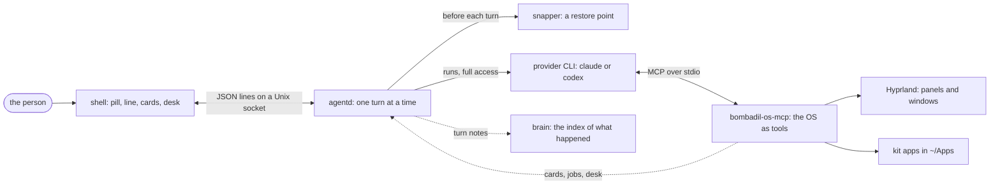
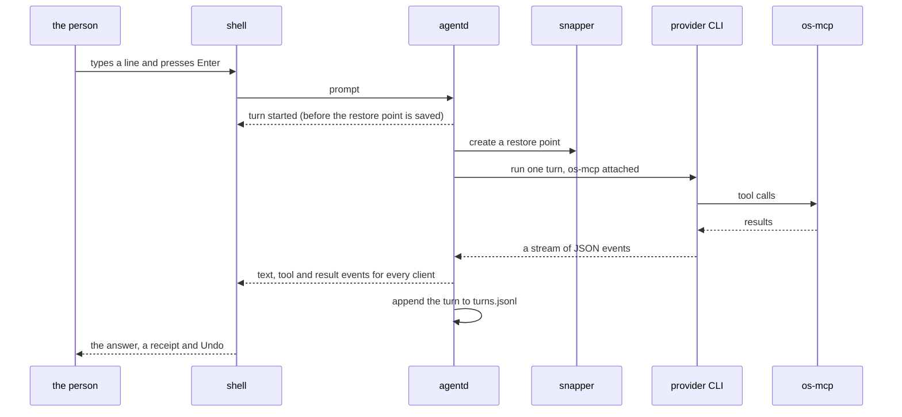

# Architecture

> **Status:** Partly shipped
> **Code:** `bin/`, `src/bombadil/`, `shell/`, `share/`, `iso/`
> **Design:** [Design briefs](design/README.md), [Principles](principles.md)
> **Verified:** 2026-10-01 against `main` at `a30ebc8`: the parts and the turn below are read from `src/bombadil/agentd.py`, `src/bombadil/providers.py`, `src/bombadil/mcp_server.py` and `shell/shell.qml`, and each piece's own page was checked against its code.

Bombadil is a Linux distribution whose interface is an AI agent. The person types in one pill at the bottom of the screen; the agent, one of the vendors' own command-line programs running in full-access mode, does the work; and every step it takes is shown on screen and can be undone. This page is the map: the parts, the path of one turn through them, where the code lives and which pieces are not built yet. Each part has a page of its own in [`architecture/`](architecture/), with its interfaces, where its state lives and how to extend it.

## The parts

| Piece | What it is | Status | Page |
|---|---|---|---|
| agentd | The session daemon: one socket, one turn at a time, the queue, Stop, the turn log | Shipped | [agentd](architecture/agentd.md) |
| os-mcp | The MCP server both CLIs load: the OS as typed tools | Shipped | [os-mcp](architecture/os-mcp.md) |
| shell | The Quickshell bar: the pill, the line above it, the stone, chips, the wallpaper | Partly shipped | [shell](architecture/shell.md) |
| desk | Cards in two rails and strips beside the pill, fed by jobs and the route of a turn | Partly shipped | [desk](architecture/desk.md) |
| app kit | `import Bombadil`: native apps the agent writes, with a runtime, a checker and a skill | Partly shipped | [app kit](architecture/app-kit.md) |
| browser and sign-in | Chromium as a slide-in panel, and provider sign-in that happens in the pill | Partly shipped | [browser and sign-in](architecture/browser-and-signin.md) |
| cards and pictures | Validated diagrams the agent and the machine draw above the pill, and the reasons behind each step | Partly shipped | [cards and pictures](architecture/cards-and-pictures.md) |
| restore points | A btrfs snapshot before each turn, and "undo" | Partly shipped | [restore points](architecture/restore-points.md) |
| ISO and install | The archiso image, the installer, the boot and the console | Shipped | [ISO and install](architecture/iso-and-install.md) |
| brain | An index that writes itself from what the machine saw, and the Focus window | Partly shipped | [brain](architecture/brain.md) |
| coding sessions | Named sessions of the vendors' coding tools that outlive their window | In progress | [coding sessions](architecture/coding-sessions.md) |
| voice | A name, three voices, the welcome line and the words of empty places | In progress | [voice](architecture/voice.md) |
| self-improvement loop | Noticing repeated asks and checking itself | In progress | [loop](architecture/loop.md) |
| mail | Mail in Bombadil's own view, with Thunderbird as the unseen engine | In progress | [mail](architecture/mail.md) |
| poor man switch | What the machine does when the AI's plan runs out | In progress | [poor man switch](architecture/poor-man-switch.md) |
| installed OS | An encrypted disk, packages and updates | Designed | [installed OS](architecture/installed-os.md) |

[The roadmap](roadmap.md) says where each piece stands and what is left. [The glossary](glossary.md) explains the project's own words.

## One turn

1. The shell (or `bombadil ask`) writes a `prompt` to the agentd socket. Words that need no model (`undo`, `history`, `open ...`, the picture words, `pause claude` and the like) are matched first by the launcher and answered by agentd itself, so they never reach the provider. `stop` is a message of its own and works while a turn runs. A line that starts with `!` is a turn whose "provider" is the shell: it runs the command and shows what it printed.
2. agentd runs one turn at a time and queues the rest, and it holds asks that need the AI while the person is signed out or the AI is resting. Before the provider starts it asks snapper for a restore point, so any turn can be taken back.
3. For the turn it starts the provider's CLI as a fresh process, in full-access mode, with `bombadil-os-mcp` in its tool configuration and Bombadil's system prompt appended, and resumes the conversation's session id so the machine has one conversation.
4. The CLI's stream becomes events, broadcast to every connected client. The shell turns them into the line above the pill, the stone's face, cards and the desk. The OS tools act on Hyprland, on apps, on files and on mail, and ask agentd for what it owns (cards, jobs, the desk, the mail view).
5. The turn is appended to `~/.local/state/bombadil/turns.jsonl` and the brain is told, never waited for.

The details, exact message names and the edge cases (a stopped turn, a missing provider, a sign-in that expires mid-turn) are in [agentd](architecture/agentd.md), and how each step reaches the screen is in [the UX flows](ux/flows.md).

## Where the code lives

| Path | What is there |
|---|---|
| `bin/` | The commands: `agentd`, `bombadil`, `bombadil-os-mcp`, `bombadil-app`, `bombadil-browser`, `bombadil-shell`, and the brain's two services |
| `src/bombadil/` | The Python behind them. Standard library only, apart from the app kit's `PySide6` and `cryptography` |
| `shell/` | The Quickshell bar in QML |
| `share/qml/Bombadil/` | The app kit and the design tokens (`Theme.qml`) the shell and every app read |
| `share/skills/bombadil-apps/`, `share/app-template/`, `share/apps/` | The skill that teaches the CLIs to build apps, the template they start from and the built-in apps |
| `iso/` | The archiso profile: packages, the live session, the installer, units, the boot menu |
| `scripts/` | Building the ISO, running it in a VM, a development session, the VM tools |
| `tests/` | Unit tests, QML tests, the headless desktop test, the VM smoke |
| `docs/` | Everything you are reading, with [an index](README.md) |

The full map with the conventions the code shows is in [the development guide](contributing/development.md), and every name the system exposes (commands, environment variables, files, units, ports) is in [the reference](reference.md).

## The foundation

These choices were made on 2026-09-27 and are the ground the pieces stand on. The reasons are in [the foundation brief](design/foundation-choices.md) and the full list of decisions is [the decision log](decisions.md).

| Choice | Pick | Why |
|---|---|---|
| Base | Arch with btrfs and snapper | Agents know it; a rolling graphics stack; archiso; snapshots are the undo |
| Display | Hyprland first, a custom compositor later | Slide-in special workspaces and IPC out of the box; a browser needs a real Wayland server |
| First target | A VM, with an ISO that also boots hardware | A fast loop while the core changes daily |
| Agent runtime | The official Claude Code and Codex CLIs, wrapped by `agentd` | Logins and subscriptions just work; the vendors' tool use comes free |
| Generated apps | QML through PySide6, in `~/Apps/<name>/` | No build step, hot reload, real windows, no ports |
| Provider switching | One MCP server, `bombadil-os-mcp` | The same OS abilities whichever provider runs |
| Browser | Chromium with remote debugging on | The panel is a real browser the person can watch |

## What every piece keeps

[The principles](principles.md) are the rules the design keeps, and each piece page says which ones it leans on. Four decide most questions:

- **The person is a passenger.** The machine does the work and shows what it did, in plain words and pictures ([the principle](principles.md#the-person-is-a-passenger)).
- **Full access, with undo instead of guard rails.** Nothing asks permission for what a restore point can reverse ([the principle](principles.md#full-access-with-undo)).
- **Something true is on screen within 200 ms.** Nothing waits on a model for what the machine already knows ([the principle](principles.md#something-true-in-200-ms)).
- **Every piece degrades.** A missing part costs its own feature, never the bar ([the principle](principles.md#degrade-and-recover)).

Before you change a piece, read its page and run [the checklist](principles.md#checking-a-change-against-the-principles). What a change must also update is in [documenting your piece](contributing/documenting.md).
