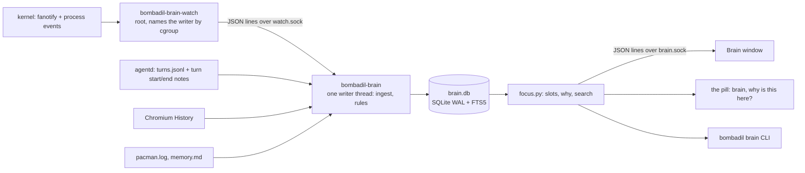

# The brain

An index of everything on the machine that writes itself from what actually happened, and
the Brain window that shows one thing at a time with everything around it. The design
and its reasons are in [`design/brain-brief.md`](design/brain-brief.md) (pieces 1 and 2, the
index and Focus, are built; the Map, Time and the agents' brain tools are not). This page
is how it is built and how to build on it.

## The principles

These seven rules came out of the design and every part below follows them. Keep them if
you change anything here.

1. **Nobody writes the brain; the machine does, from what happened.** Every link is an event
   the OS witnessed (a save, a download, a turn, a page you read). There is nothing to tend,
   so nothing goes stale.
2. **Every link says why and when.** A link with no reason is a guess, and guesses turn an
   index into noise. Links are never inferred by a model.
3. **Plain files stay the truth.** The brain is an index beside your files that can be
   rebuilt (`bombadil brain rebuild`). Deleting it loses the view, not the data.
4. **Things hold still.** A thing keeps its identity through renames and moves.
5. **Bright means alive.** Recency and frequency of touches decide what is prominent. Nothing is
   removed for being old.
6. **What a model writes is pinned to what it read.** A description carries a fingerprint of
   its sources and greys out when they change.
7. **You and the agents see the same brain.** The pill, the window, the machine's agent and
   the CLI all ask one index.

Two more that the code relies on: **every piece degrades** (no watcher, no brain, no Chromium,
no btrfs: the rest carries on and says what is missing in one plain sentence) and **nothing
waits for the brain** (a turn never blocks on it; it answers from the index in milliseconds).

## What runs

```
 bombadil-brain-watch   root system service, own mount namespace (PrivateMounts=yes)
   fanotify on the whole btrfs filesystem, through a private mount of its top level
   + a fork map from the kernel's process connector, so a writer that already exited
     is still named by its parent
   -> /run/bombadil-brain/watch.sock   JSON lines, each user gets the paths under their home
                                       and /etc; spooled to /var/lib/bombadil-brain when nobody listens

 bombadil-brain         user service
   ~/.local/state/bombadil/brain.db    SQLite (WAL) + FTS5 trigram, outside home snapshots
   also reads turns.jsonl, Chromium's History, pacman.log, memory.md
   -> $XDG_RUNTIME_DIR/bombadil/brain.sock   requests and pushes, JSON lines

 agentd       numbers turns across restarts, logs the files each turn wrote and read,
              and tells the brain when a turn starts and ends (never waits for it)
 the pill     "brain" opens the Brain on what is in front; "why is this here?" answers
              in the line, from the index, without a model
 Brain app    share/apps/brain, a kit app: Focus
```

Every piece degrades. Without the watcher (the live ISO, a dev machine, an ext4 root) the
brain still learns from turns, History, pacman.log and its own walks of home; without the
brain, agentd, the pill and apps carry on as before.

## From a save to a line in Focus



The watcher only collects facts; the service decides what they mean. That boundary is
deliberate (see "The watcher's edge" below): it is what lets the watcher be rewritten in another
language without touching the rest.

## The data model

One SQLite file (`brain.db`, WAL mode) kept under the state directory, outside home snapshots, so
an undo never erases the record of what was undone. It is a cache of facts that also live in
plain files, xattrs, `turns.jsonl`, git, Chromium's History and `pacman.log`.

- **things**: anything a person would name (a file, folder, project, app, page, site, one of the
  machine's turns, a coding session, a package, a line of memory). Files are found by `path`, the
  rest by `key` (`turn:41`, `app:passwords`, `url:...`). A thing is never deleted; `deleted` says
  when it went. `private` things are known by name only.
- **events**: what was witnessed, with who did it (`actor`: you, turn, session, app, system,
  unknown, before). Bursts by one writer within a minute fold into one row.
- **links**: the strong edges (made by, changed by, came from, asked about, mentions), each with
  first and last time and a count. The weak ones ("read with", "used with") are worked out from
  events when Focus asks, so they cannot go stale.

## Who did it

The watcher reads each writer's cgroup. procs.py runs every turn of the machine's agent in
its own `bombadil-turn-*.scope`, coding sessions run under `bombadil-dev-<project>.slice`,
and generated apps run as `bombadil-app run <name>`; anything else in your session is you,
named by the app whose window it was ("you, in the terminal"). Root outside a turn is the
system. Who made a file, and where a download came from, are also written on the file as
xattrs (`user.bombadil.made_by`, `user.bombadil.origin`), so they survive a move and a
rebuild of brain.db.

## fanotify on btrfs, checked

A fanotify mark that reports file handles (the only kind that reports creates, renames and
deletes with the writer's pid) fails with EXDEV on a btrfs subvolume that is not the
filesystem's top level, and the installer mounts `/`, `/home` and `/.snapshots` from the
subvolumes `@`, `@home` and `@snapshots`. The watcher therefore mounts the top level
(`subvolid=5`) read-only at `/run/bombadil-brain/top` inside its own mount namespace, marks
that, and maps paths back through `/proc/self/mountinfo` (`/run/bombadil-brain/top/@home/user/a`
is `/home/user/a`). Checked on Arch's own kernel under QEMU with the installer's layout,
including a nested subvolume (`tests/vm/btrfs-kernel.sh`).

## The watcher's edge (what a replacement must do)

The watcher is meant to be swappable: it collects facts from the kernel and hands them over one
small interface, and every decision about what they mean lives in the brain (Python). Swapping
it, for a Rust program say, is a change to `watch.py`, `fanotify.py` and `forks.py` and nothing
else, as long as it keeps the contract below. `tests/test_brain_watch.py::test_the_service_end_to_end`
runs the real program against it; set `BOMBADIL_WATCHER_CMD` to run it against another binary.

**Runs as** root, `bombadil-brain-watch [--path DIR] [--socket SOCK] [--state DIR] [--top DIR]
[--spool-cap N] [--home UID:DIR]...` (defaults in `watch.py`). No `--path` means "the btrfs
filesystem holding /home, through a private mount of its top level" (see above); `--path`
watches the filesystem holding DIR and treats DIR as the home root (development, tests).

**Talks over** a Unix stream socket, `/run/bombadil-brain/watch.sock`, one JSON object per
line. A connection is a user (SO_PEERCRED); root gets everything, anyone else the events under
their own home and `/etc`, `/var/log/pacman.log`. The brain sends `{"op":"ping"}`, the watcher
answers `{"op":"pong"}`; nothing else is read.

**Says**, in this order: `hello` (`v`, `watching`, `fs`, `top`, `reason`; `watching:false`
with a reason when the root is not btrfs, and then no events come); the spool of what
happened while that user's brain was away, if any; then live lines. Lines:

| op | fields |
|---|---|
| `create` `write` `delete` `rename` `offline` | `t`, `path`, `old` (rename), `dir`, `ino`, `size`, then the writer |
| `overflow` | the kernel's queue overflowed or the spool was cut: the brain walks |
| `caught_up` | after a start: `offline` files were written while it was stopped (from `btrfs subvolume find-new`) |
| `batch` | see below |

The writer is `pid`, `uid`, `comm`, `cgroup` (the unified-hierarchy path), `chain` (the writer
then its ancestors, at most 10, as `[pid, comm, command line]`) and `gone` (the writer had
exited: it is named by its nearest live ancestor). These are facts; which of them makes an
event "a turn", "a coding session", "an app" or "you" is `actors.py`'s job, not the watcher's.

**Keeps** what only root can: the fanotify mark and the handle-to-path work, the writer's
/proc facts and a fork tracker for writers that left before anyone looked, a spool per user
while their brain is away (capped; past the cap it becomes one `overflow`), the
`generations.json` markers for the offline catch-up, and the two policy lists at the top of
`watch.py` (`HOME_NOISE`, `ANY_NOISE`: caches and build output are not sent, whatever wrote
them, so a browser's cache does not cost a line each).

Order is kept per writer and across writers: an event is never delivered before one that
happened earlier, `overflow` and `caught_up` come after the events queued before them. The
chain is most of an event's bytes and a build writes 20,000 files, so events by one writer in
a row (within one read of the kernel's queue, at most 1,000 or about 190 KB) go as one line
that names the writer once:

```
{"op":"batch","pid":..,"uid":..,"comm":..,"cgroup":..,"chain":[..],"gone":..,"events":[{"op":"write","t":..,"path":..,...}, ...]}
```

The brain unpacks it into the events it stands for, in order (`service._unbatch`); a run of
one is an ordinary line. Every line stands alone, so a spool, a late reader and a reconnect
need nothing from the lines before. 20,000 files written by one process (a create and a write
each) is about 3 MB of lines rather than 52.

## What gets in, and what stays out

What a person would call a thing: files and folders under home, projects, apps, pages you
read, downloads, turns, packages and the `/etc` files that changed. Caches, most dot-folders,
git-ignored files, `node_modules`, build output, editors' swap files and the Trash stay out;
an app's `data/` counts as the app changing. Private things (`~/.ssh`, `~/.gnupg`, password
stores, keyrings, key and `.env` files, apps' data) are known by name only: never read,
previewed or described.

## Focus and the pill: what it is like to use

You never maintain the brain and it never interrupts. It is there when you ask, in the same two
places everything else in Bombadil is: the pill and a window.

```
                       changes (newest first)
                      ┌────────────────────────┐
   came from          │                        │          read with
   who made it,       │   THE THING IN THE     │      a page that was open
   the page it        │   MIDDLE               │      while it changed
   was downloaded     │   one sentence about   │
   from, the turn     │   it, pinned to what   │
   that wrote it      │   the model read       │
                      └────────────────────────┘
                              used with
                  changed on the same occasion, twice or more
```

- **Open it** by tapping Super and typing "brain": it opens on what is in
  front of you. "this" is read from the machine at that moment and never guessed: your app, the
  page in the browser's active tab, the file a terminal's program has open, otherwise the files the
  window's processes hold open under your home (`this.py`).
- **Ask the pill "why is this here?"** and the answer comes back in the pill's line from the
  index, in milliseconds, with no model call: who made it, which turn or session, and when.
- **Move** by clicking any line: it becomes the middle, with a trail of where you have been. A folder
  or project in the middle is its listing from disk, so Focus is also the file manager and never
  behind. **Ask about this** puts "About ~/path: " in the pill for you to finish.
- Every line is a sentence a person would say: "the machine, turn 41, 'install the VPN'",
  "builder on Bombadil", "you, in the terminal", with "13:02" today, "Tue 14:02" this week
  (`words.py`). The window, the CLI, the pill and the agents' tools share them, so they never
  disagree.
- A thing that is being changed right now by another turn or session is amber. A description the
  model wrote greys out when its source changed and is rewritten the next time someone looks.
  Private things (keys, password stores, `.env` files) show a name and a history, never contents.
- When the brain is not running the window says so in one sentence and keeps trying; it is never a
  blank screen or a spinner.

## Commands

```
bombadil brain status           what it knows, and whether the watcher is on
bombadil brain why PATH         the one-line answer the pill gives
bombadil brain find WORDS       search names, titles and paths
bombadil brain focus REF        the Focus answer as text (--json for the window's data)
bombadil brain rebuild          start the index over from files, xattrs and logs
```

The service also answers these as JSON lines on `brain.sock` (`status`, `thing`, `focus`,
`children`, `why`, `search`, `recent`, `show`, `requested`, `describe`, `note`, `subscribe`, `rebuild`);
`src/bombadil/brain/client.py` is the small blocking client every caller uses.

## Building on it

Where each kind of change goes:

| You want | Change | Notes |
|---|---|---|
| a new source of facts (a mail client's log, a calendar) | a class in `witnesses.py` next to `TurnsLog`, `History`, `PacmanLog`, `Memory` | read only what was added since last time, keep your place in the `meta` table, never raise, never read a private file, call `Ingest` to make events |
| a new kind of writer ("a cron job", "a container") | `actors.py`: a unit-name pattern and a name a person would say | the watcher already reports the cgroup and process chain; `words.py` says it |
| what counts as a thing, what is private, which area | `rules.py` (`classify`, `private`, `area_of`) | private means name only, never read or described |
| a new relation in Focus | `focus.py`: a slot method like `used_with` | derive it from events, so it cannot go stale; every line needs a reason and a time |
| a new view | a kit app (`share/apps/<name>/`, see the app skill and kit docs) that asks `brain.sock` | do not read `brain.db` directly; the service is the one writer |
| a faster or different watcher | replace `watch.py`, `fanotify.py`, `forks.py` | keep the contract above; run the end-to-end test against your binary with `BOMBADIL_WATCHER_CMD` |

Run it on a development machine without root or btrfs: the brain service learns from turns, History,
`pacman.log` and one walk of your home (index only: it never reads private files), and says that the watcher is off.

```
BOMBADIL_BRAIN_DB=/tmp/brain.db BOMBADIL_BRAIN_SOCKET=/tmp/brain.sock bin/bombadil-brain
BOMBADIL_BRAIN_SOCKET=/tmp/brain.sock bin/bombadil brain status
BOMBADIL_BRAIN_SOCKET=/tmp/brain.sock bombadil-app check brain --screenshot /tmp/brain.png   # the window, offscreen
```

Tests: `python3 -m pytest tests/test_brain_*.py` (the watcher's end-to-end test skips itself where
fanotify filesystem marks do not work), `tests/vm/btrfs-kernel.sh` for fanotify on a real
btrfs layout in QEMU, and the ISO smoke test (`scripts/test-vm.sh`, `MODE=install`) for the whole
thing under real systemd.

What is not verified anywhere yet: the Super tap and "this" on a real Hyprland desktop under real use,
other kernels, the watcher under a real user's load. Known and left alone: the watcher blocks its
loop on `btrfs subvolume find-new` every 60 seconds and before it accepts clients, and runs as
unrestricted root with a world-writable socket (it routes by the peer's uid and reads only `ping`).
