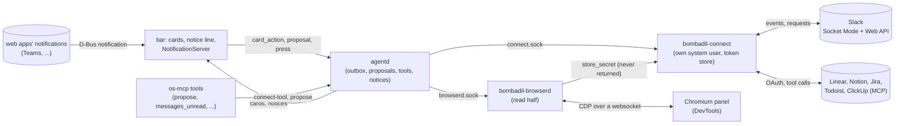

# Messages and connections

The second piece of "Bombadil at work" (design: [`design/messages-and-connections.md`](design/messages-and-connections.md)).
Mail ([`MAIL.md`](MAIL.md)) gave Bombadil one view for every mail account and the rule that the person's press is
the only way a message leaves. This piece does the same for chat and work tools: a Slack message to the person
arrives as one line above the pill and opens as a message card with a reply box; a ticket that waits on them
arrives as a task card; every other service's notification becomes the same line; and the thing that lets any of
them go is, again, the person's own press on the card's Send. This file is the contract the code is built to.
Where the two differ, this file says what was built and why. Every person, address, workspace and company in it
is invented.

## The line

- **Reading is quiet.** A connection reads in the background and never changes what it reads: nothing is marked
  read on the service, nothing is joined, nothing is reacted to. "Unread" is Bombadil's own note (a time per
  conversation), not the service's.
- **Bombadil keeps no copies of other people's words.** Messages live in the memory of the connection service
  (a ring of at most 500, newer than 14 days) and are gone when it stops. What is written down is the
  connection's records, its tokens, a time per conversation (when the person last looked) and the ids of presses
  already performed. Slack's API terms forbid a persistent copy or index of message data for an app used outside
  the workspace that made it; this one is inside it and keeps none anyway.
- **The tokens are not the agent's.** The agent runs as the person, with a shell. `bombadil-connect` runs as its
  own system user and keeps every token in a directory only that user can read. The agent is never handed a
  token, and no tool returns one.
- **The press is the person's.** The agent has `propose`, which puts a draft on a card; it has no tool that
  posts, replies, creates or comments. The shell's press on the card's Send reaches agentd, which checks who
  pressed and what, and only then asks the connection service to do that one thing (rule 2 of the design, and
  `outbox.py`).
- **Other people's words are read, never obeyed.** A message, a task title and a notification's text reach the
  model inside a mark that says they are other people's words, with invisible and direction-changing characters
  removed. A turn that has read any of them is remembered, and what it proposes is held to what the person typed
  (the proposal says so, and the card flags a place the person has never received a message from).

## Processes



| Part | Where | What |
|---|---|---|
| `bombadil-connect` | `bin/bombadil-connect`, `src/bombadil/connect/service.py`, system unit `bombadil-connect.service` | Owns `connect.sock` and the token store; runs the drivers; keeps the message ring; checks every `perform` |
| Drivers | `src/bombadil/connect/slack.py`, `mcpconn.py` | Everything particular to a service: Slack through Socket Mode and the Web API, every MCP service through the official client; `driver.py` is the interface |
| `bombadil-browserd` | `bin/bombadil-browserd`, `src/bombadil/browserd/`, user unit | One lasting connection to the panel's Chromium: open, read, point, take a value from a page into the token store |
| Setup recipes | `src/bombadil/connect/slack_setup.py`, `share/connect/recipes/*.toml` | What the person is walked through to connect a service, with the pointer on each of their presses |
| agentd | `src/bombadil/agentd.py`, `outbox.py`, `proposals.py`, `connect/tools.py`, `connect/watch.py`, `notifications.py` | Proposals and the press, the agent's tools, new messages and receipts as notices and cards, notifications as notices |
| Cards | `src/bombadil/cards.py`, `shell/CardHost.qml`, `shell/MessageFace.qml`, `TaskFace.qml`, `ListFace.qml` | The message, task and list kinds beside the diagram |
| Notifications | `shell/Notifications.qml` | Quickshell's `NotificationServer` in place of mako |

Nothing waits for a connection: a caller that cannot reach the service says "Connections are not running yet" in
its own line, agentd's pokes give up after 0.3 s, and a turn never blocks on Slack.

## Files and state

| Path | Env override | Holds |
|---|---|---|
| `/run/bombadil-connect/connect.sock` | `BOMBADIL_CONNECT_SOCKET` | the service socket (mode 0666; the service checks the peer's uid itself) |
| `/var/lib/bombadil-connect/` | `BOMBADIL_CONNECT_STATE` | `connect.db` (SQLite, WAL: connections, secrets, seen times, performed presses), 0700, owned by `bombadil-connect` |
| `$XDG_RUNTIME_DIR/bombadil/browserd.sock` | `BOMBADIL_BROWSERD_SOCKET` | the browser service's socket (0600) |
| `~/.local/state/bombadil/proposals.json` | `BOMBADIL_PROPOSALS` | open proposals (what waits for a press), 0600; closed ones are forgotten after 30 days |
| `~/.local/state/bombadil/presses.jsonl` | `BOMBADIL_PRESS_LOG` | one row per press, as for mail (no message text) |

The service accepts a peer whose uid is 1000 to 59999 (override `BOMBADIL_CONNECT_UIDS=min-max`), and refuses any
other. The agent runs as one of those uids, which is why `perform` has the checks below and why the tokens are in
a store it cannot read.

## Wire protocol (`connect.sock`)

JSON lines, each at most 1 MiB, the same shape as `mail.sock`: request `{"id", "op", ...}`; answer `{"id", "ok":
true, "result": ...}` or `{"id", "ok": false, "error": "one plain sentence", "code": str}`; after `subscribe` the
service also sends pushes `{"push": name, ...}`. `rid` works as it does for mail. Codes: `no_connection`,
`not_found`, `bad_request`, `refused`, `agent` (a press from inside an agent's turn), `blocked`, `auth` (the
service revoked the token: the connection goes to `error` and says so), `rate_limited`, `service_down`,
`already` (that press was performed), `busy`, `changed` (the fingerprint is not what was pressed for),
`unknown_outcome`, `internal`.

**Connection** `{"id": "slack:T123"|"mcp:linear", "kind": "slack"|"mcp", "service", "name", "state": "ok"|"signin"|
"setup"|"blocked"|"error"|"off", "note", "reads": str, "can_post": bool, "steps": [...], "open"?: url}`.
**Message** and **Task** are the shapes in `connect/driver.py` (`MESSAGE_KEYS`, `TASK_KEYS`). Every text field
is cut and made plain by the service (`clean_message`, `clean_task`) whatever the driver gave.

| op | args | result |
|---|---|---|
| `status` | | `{"state": "ok", "connections": [Connection]}` |
| `connections` | | `{"connections": [Connection]}` |
| `add_connection` | `service` (`slack`, `linear`, `notion`, `jira`, `todoist`, `clickup`) | Connection in `setup` or `signin`, with its `steps` and, for the first step that opens a page, `open` |
| `remove_connection` | `id` | `{}`: the driver is stopped and every secret of it deleted |
| `store_secret` | `connection`, `name`, `value` | `{"stored": true}`. Only the names the driver lists (Slack: `app_token` starting `xapp-`, `user_token` starting `xoxp-`); the value is never answered, logged or pushed. Starts the driver when it now has what it needs |
| `messages` | `unread?`, `since?` (epoch), `limit?` (50, at most 100), `connection?` | `{"messages": [Message], "skipped": [{connection, state, note}]}`, newest first |
| `thread` | `ref`, `limit?` (20) | `{"messages": [Message]}`, oldest first |
| `seen` | `refs: [str]` | `{}`: those conversations are read up to those messages (the service's own note) |
| `tasks` | `service?`, `limit?` (30) | `{"items": [Task], "skipped": [...]}` |
| `perform` | `kind`, `target`, `content`, `fingerprint`, `proposal` | `{"receipt": {"line", "web"?: {name, url}}}`; the checks below |
| `subscribe` | | `{}`, then pushes `{"push": "message", "message"}`, `{"push": "task", "item"}`, `{"push": "connection", "connection"}` |

**`perform`** is the only way anything leaves, and the service does it only when every one of these holds: the
peer's uid is allowed; the peer is not inside an agent's turn (`procs.cgroup_of(pid)` is None, as in
`outbox.py`; one that cannot be told is refused); `fingerprint` equals `driver.fingerprint(kind, target, content)`
worked out again here; the connection the target names exists, is `ok` and its driver can do `kind`; the
`proposal` id has not been performed (a second press of the same id is answered `already` with no act, and
the ids are kept in `connect.db`, so a restart does not forget); and no other `perform` of that id is running
(`busy`). It calls the driver once. What the driver returns or raises is final: no retry, here or above. An
`UnknownOutcome` is recorded as performed (so a retry is the person's, with a new proposal) and answered
`unknown_outcome`. This is a rule with a check, not yet a wall: a process of the person's that is outside every
turn could still call it, as with mail's press (see "What is a rule, not yet a wall" in the design page).

## Drivers

`connect/driver.py` is the interface (`Driver`, `Secrets`, `DriverError`, `UnknownOutcome`, `fingerprint`). The
service builds a driver from the connection's record, gives it a `Secrets` for that connection alone, calls
`start()`, and passes on what it `emit`s. It restarts a driver that dies, backing off from 2 s to a minute.

### Slack, through a private internal app

Bombadil does not ship one Slack app for everyone: a Marketplace-less app shared across workspaces is held to
one history request a minute and 15 messages. The person makes a small private app in their own workspace, from a
manifest Bombadil prepares, and it keeps normal limits and can receive new messages at once.

- **Manifest** (`connect/manifest.py`): user scopes only (`channels:history`, `groups:history`, `im:history`,
  `mpim:history`, `channels:read`, `groups:read`, `im:read`, `mpim:read`, `users:read`, `chat:write`), Socket
  Mode on, user events `message.channels`, `message.groups`, `message.im`, `message.mpim`, no bot user, no
  interactivity, no token rotation. The app-level token needs `connections:write`.
- **Tokens**: `app_token` (`xapp-...`) opens the socket; `user_token` (`xoxp-...`) reads and posts as the person.
- **Socket Mode** over `ws.py`: `apps.connections.open` gives the address; envelopes are acknowledged by
  `envelope_id` at once; `hello`, `disconnect` (reconnect) and a dropped socket are handled; reconnects back off
  from 1 s to a minute. The API base is `BOMBADIL_SLACK_API` (default `https://slack.com/api`), so tests point at a
  fake that speaks both halves.
- **What is a message for the person**: any message in a direct or group direct message; one in a channel that
  mentions them (`<@their id>`); one in a thread they have posted in. Their own messages and the service's
  housekeeping subtypes are not. `reason` says which. Text is made plain (mentions, channel links and links
  become words; `&amp;`, `&lt;`, `&gt;` are undone). Names are looked up once and kept a day.
- **Start**: after connecting, the driver backfills direct and group direct messages since the conversation's
  `seen_ts` (at most 50 per conversation, `conversations.history`), so "what did I miss" is true after a restart.
  Mentions and threads come from events only.
- **`perform("slack_reply", target, content)`**: `target` is a message ref; `content` is the text (at most 3000
  characters). `chat.postMessage` with the user token to the ref's channel and `thread_ts` of its thread (or its
  own ts when it has none); the receipt line is `Posted in #launch · 11:04` or `Replied to Priya in a direct
  message · 11:04`, with a permalink from `chat.getPermalink`. A network error after the request was written, or
  no answer in 20 s, is `UnknownOutcome`; a 429 or a refusal before anything was written is `DriverError`.
- **Errors** become states: `invalid_auth`, `token_revoked`, `account_inactive` -> `error` with "Slack no longer
  accepts this connection. Set it up again." and code `auth`; `missing_scope` -> `error` naming the scope;
  an administrator's app approval wall (`app_approval`, `not_allowed_token_type`) -> `blocked`.

**The setup recipe** (`slack_setup.py`) runs in agentd, as the person, with the browser service's hands off the
page and the pointer on each press. The steps, each waiting for its page before the next: open
`https://api.slack.com/apps?new_app=1&manifest_json=<manifest>`; point at "Create" (`Yours: Create`); on the new
app's page point at "Generate Token and Scopes" under App-Level Tokens, and take the `xapp-` value off the
page into `store_secret`; point at "Install to Workspace" (then "Allow"); take the `xoxp-` User OAuth Token the
same way. The person presses everything; Bombadil points and reads the two tokens off the page and gives them to
the service, never through the model. If the workspace needs an administrator to approve apps, Slack says so on
its page: the recipe says that once and the connection is `blocked`; Slack messages then come from Slack's own
notifications (below). Unverified against Slack's real pages; the recipe locates things by their visible words
and by token shape and is tested against a page that imitates them.

### Work tools, through MCP

Notion, Linear, Atlassian's Jira, Todoist and ClickUp have official MCP servers a person can allow alone with
a browser sign-in. `mcpconn.py` is one driver for all of them: the official Python SDK's client (`mcp` package,
`ClientSession` over Streamable HTTP) with its OAuth client provider, a token store backed by `Secrets`, and a
client metadata document Bombadil publishes (`share/connect/client-metadata.json`: its `client_id` is its own
public address, the redirect is `http://127.0.0.1:<port>/callback`), so each consent page says "Bombadil".
`add_connection` starts the flow and returns `open`: the service listens on a loopback port for the redirect,
exchanges the code, stores the tokens and pushes `connection` with state `ok`.

A recipe per service (`share/connect/recipes/<service>.toml`) says where its server is, the scopes to ask for (read
only where there is a choice), a sentence for `reads`, how to list what waits on the person (a tool name, its
arguments and how its answer maps to a Task), and how to create an item and add a comment (the tools and how the
card's fields map to their arguments). Recipes are data so a fork can add a service; each carries
`verified = false` until someone has run it against the live server. Nothing here has been run against a real
Linear, Notion, Jira, Todoist or ClickUp: the driver is tested against a fake server written with the same SDK
and a fake OAuth provider.

`perform("task_create"|"task_comment", target, content)`: `target` is `<service>` (create) or a task ref
(comment); `content` is the card's fields as an object. One tool call, then a receipt line ("Created LIN-42 in
Linear") with the item's URL when the answer has one.

## The browser service (`bombadil-browserd`, read half)

One user service holding one connection to the panel's Chromium over its DevTools websocket (`ws.py`; the HTTP
side stays in `browser.py`). Socket `browserd.sock`, JSON lines as above, peers of the person's uid only.

| op | args | result |
|---|---|---|
| `status` | | `{"up": bool, "tabs": int}` |
| `open` | `url` | `{"tab": {"id", "url"}}`: `browser.open_url`, so the panel slides in |
| `tabs` | | `{"tabs": [{"id", "url", "title"}]}` |
| `read` | `tab?`, `selector?` | `{"url", "title", "text", "untrusted": true}`: the page's visible text (at most 200 000 characters) or the selector's. Other people's words |
| `find` | `tab?`, `text` | `{"found": bool, "rect": {x, y, w, h}}` of the visible button, link or input whose text or label matches |
| `point` | `tab?`, `text` or `selector`, `label`, `ttl?` | `{"pointed": bool}`: an orange ring on the element and a pointer with a label chip beside it, drawn by an element the service injects (`pointer-events: none`, always on top), gone after `ttl` seconds (20), on `unpoint` or on a navigation |
| `unpoint` | `tab?` | `{}` |
| `wait` | `tab?`, `url?` (regex), `text?`, `timeout?` (30) | `{"matched": bool, "url"}`, polling every 300 ms |
| `take` | `tab?`, `pattern`, `into: {"connection", "name"}` | `{"stored": bool, "why"?}`: the first match of the regex in the page's text or input values goes straight to the connection service's `store_secret`; the value is never returned or logged |

It has no hands: it never clicks, types or navigates a page by itself (`open` is the one navigation, and it is the
panel opening). Writing in a page, with the orange frame, is a later piece.

## agentd: proposals, the press and what is said

**Proposals** (`proposals.py`, held by `Outbox`): what the agent or the person wants to go out and has not.

```
{"id": "p3", "kind": "slack_reply"|"task_create"|"task_comment", "target": str, "content": str|object,
 "where": "#launch", "created_by": "agent"|"person", "tainted": bool, "typed": str, "warnings": [{"kind", "text"}],
 "fingerprint": str, "shown": str, "state": "open"|"sending"|"sent"|"unknown"|"discarded", "receipt": {...}|null,
 "updated": float}
```

`fingerprint` is `driver.fingerprint(kind, target, content)`. `shown` is the fingerprint the shell last reported
having drawn. Warnings: `new_place` (the target conversation is one the person has not received a message from
in the last 14 days and has not posted in), `broadcast` (`@channel`, `@here` or `@everyone` in the text), `long`
(over 3000 characters), `tainted` (a turn that had read other people's words made this, and the text is not the
person's). A proposal made by the agent in a turn that read messages, mail or a page says so on the card.

Messages from a client to agentd, answered to the sender and broadcast to the others as `{"type": "proposal",
"proposal": {...}}` when anything changed:

| message | meaning |
|---|---|
| `{"type": "proposal", "op": "open", "kind", "target"}` | the person opened a reply (Reply on a notice or a card): a proposal made `created_by: "person"` with empty content, and its card shown |
| `{"type": "proposal", "op": "edit", "id", "content"}` | the box changed; clears `shown` |
| `{"type": "proposal", "op": "shown", "id", "fingerprint"}` | the card drew exactly this |
| `{"type": "proposal", "op": "discard", "id"}` | put away (an empty one is dropped at once) |
| `{"type": "press", "kind": <the proposal's kind>, "id": <proposal id>, "fingerprint"}` | the press; `Outbox.press` as for mail, answered with `press_result` |

The performer for a proposal kind loads the proposal, refuses unless it is `open` (or `unknown` with `again`),
non-empty, and its `fingerprint`, the pressed one and `shown` all agree (`changed`); marks it `sending`; calls
`connect.perform` once, with the proposal id; marks it `sent` with the receipt, or `unknown` for an unknown
outcome, or back to `open` for a refusal; and says the receipt as a notice. `again` works as for mail: only after
the person's choice.

**The agent's tools** (os-mcp, `connect/tools.py`; each one line to agentd as `{"type": "connect-tool", ...}`, answered
with `connect-result`; there is no tool that sends):

| tool | does |
|---|---|
| `messages_unread(limit?)` | the unread messages to the person, as text inside the other-people's-words mark, and shows the list card |
| `message_thread(ref)` | one thread's messages, same mark; opens its message card |
| `tasks_waiting(service?)` | the items that wait on the person, same mark |
| `connections()` | what is connected and in what state (the service's own words, no tokens) |
| `propose(kind, target, content, where?)` | a proposal made `created_by: "agent"`, its card shown, the line "Reply to Priya is ready. Sending is yours." |

A turn that has called `messages_unread`, `message_thread`, `tasks_waiting` or a mail read tool is tainted until
it ends (the mark stays with the conversation it resumes into, as for mail). `typed` is the person's own words for
the turn, as for mail drafts. A `propose` with `target` not a ref the service knows is refused.

**Notices and cards from pushes** (`connect/watch.py`): a `message` push the person should see becomes a notice
(source `connect`, tone `step`, at most one line "Priya Shah in #launch: Legal just signed off. Can we lock the 14th…",
chips `Reply` and `Open`, ttl 60 s). Reply opens a proposal and its message card; Open opens the message in the
service's own page. A `connection` push to `error` or `blocked` is one warning notice, once. Receipts are one
notice ("Posted in #launch · 11:04", chip `Open in Slack`). New messages from the same conversation replace the
previous notice instead of stacking.

**Launcher words** (exact, no model): `slack`, `messages`, `unread`, `what did i miss`, `what did i miss on slack` open the
list card of unread messages; `connections`, `connected`, `whats connected`, `what is connected` open "Connected
here"; `connect slack`, `connect linear`, `connect notion`, `connect jira`, `connect todoist`, `connect clickup`
start the setup (the first step opens in the panel).

## Cards

`cards.accept` takes three more kinds beside the diagram. Every kind has `id`, `title` (at most 80 characters),
`source` (`"connect"`, `"notification"` or `"mail"`), `say` (one sentence, at most 160) and is checked again by
agentd, so nothing malformed reaches the bar. Text is plain.

**message** (`{"type": "message", ...}`):

```
{"type": "message", "id", "title": "Priya Shah in #launch", "source": "connect",
 "thread": [{"ref", "from", "text", "ts", "mine": bool, "unread": bool}],          # the last six, oldest first
 "reply": {"proposal": "p3", "kind": "slack_reply", "target", "where": "#launch", "content", "warnings": [...],
           "fingerprint", "state": "open", "by": "person", "receipt": null, "note": ""},
 "open": {"kind": "url", "value": "https://..."} | null, "say": "Reply in #launch. Sending is yours."}
```

A card whose source is `notification` has `"reply": {"proposal": null, "kind": "copy", "where": "Teams", "content": ""}`:
its button says "Copy and open", copies the words and opens the page, and is not a send (no ring, no "Yours").

**task** (`{"type": "task", ...}`): `title`, `service`, `fields: [{"key", "label", "value", "edit": "line"|"text"|"date"|
null}]`, `proposal` as above with `kind` `task_create` or `task_comment` and `content` the fields as an object, `open`,
`say`. The one button is "Create" or "Comment".

**list** (`{"type": "list", ...}`): `rows: [{"id", "title", "sub", "when", "state": "ok"|"warn"|"bad"|"new"|"gone"|"active",
"actions": [{"id", "label", "style": "primary"|"quiet"}], "opens": {"kind": "card"|"url", "value"} | null}]`, at most 12
rows. Unread messages and "Connected here" are lists.

The shell tells agentd about a card with `{"type": "card_action", "card", "row"?, "action"}` (`open`, `disconnect`,
`connect`, `copy_open`, `dismiss`), the proposal messages above and `press`. None of them reaches the model. The
send button has the orange ring and "Yours: Send" while the proposal is open and `shown` equals its fingerprint; it
waits (as Mail's does) until the box has drawn exactly what would be sent.

**Connected here** is the list card "Connected here": each mail account (from the mail service), the Slack app and
each tool, one row each with what it reads (`reads`), its state, and "Disconnect" (mail's `remove_account` or
`remove_connection`); a service not yet connected is a quiet row with "Connect". It opens by its words and from
the stone's card.

## Notifications (replacing mako)

`shell/Notifications.qml` is Quickshell's `NotificationServer` (the `org.freedesktop.Notifications` name). Each
notification is sent to agentd as `{"type": "notification", "id", "app", "summary", "body", "urgency":
"low"|"normal"|"critical", "icon", "actions": [{"id", "label"}]}`, and the bar keeps the notification tracked until
agentd says `{"type": "notification_invoke", "id", "action"?}` (the shell invokes the notification's action, which for
a browser tab focuses it) or `{"type": "notification_close", "id"}`. agentd's `notifications.py` decides what
the person sees: a notice with the sender and preview ("Priya Shah: Legal just signed off", source `notify`, ttl 10 s,
30 s for critical) with Reply (a message card built from the notification, source `notification`) and Open
(`notification_invoke`, so the page that sent it comes forward); at most one notice per app per two seconds (a
burst becomes "+N" on the last); no notice at all for a notification whose summary and body are empty. The
notification text is other people's words. `mako` leaves `iso/packages.x86_64` and `hyprland.lua`.

## The image

`python-mcp`, `python-httpx` and `wl-clipboard` are in `iso/packages.x86_64`; `mako` is not. `bombadil-connect.service`
is a system unit (`User=bombadil-connect`, `StateDirectory=bombadil-connect` mode 0700, `RuntimeDirectory=bombadil-connect`,
`NoNewPrivileges`, `ProtectSystem=strict`, `ProtectHome=yes`, `PrivateTmp`, `RestrictAddressFamilies=AF_UNIX AF_INET AF_INET6`,
`MemoryMax=300M`, `Restart=on-failure`), enabled by a symlink in `multi-user.target.wants`; the user comes from
`/usr/lib/sysusers.d/bombadil-connect.conf`. `bombadil-browserd.service` is a user unit like mail's. `share/skills/bombadil-connect/SKILL.md`
tells the agent what it may and may not do, and is linked into `/etc/skel/.claude/skills` and `.agents/skills`.

## Modules

| Module | Owner of |
|---|---|
| `ws.py` | the WebSocket client and the framing a fake server needs |
| `connect/driver.py` | the driver interface, shapes, `fingerprint` |
| `connect/protocol.py` | codes, `clean_message`, `clean_task`, ids and refs, framing |
| `connect/store.py` | `Store(path)`: connections, secrets, seen times, performed ids; a `Secrets` per connection |
| `connect/service.py` | `Service`, the ring, the ops, the `perform` checks, `main()` |
| `connect/client.py` | the blocking client (`Connection`, `request`, `notify`, `ConnectUnavailable`, `ConnectError`) |
| `connect/manifest.py` | the Slack app's manifest and the address that makes Slack show it ready to create |
| `connect/slack.py`, `slack_setup.py` | the Slack driver and its setup recipe |
| `connect/mcpconn.py`, `recipes.py` | the MCP driver and the recipe loader |
| `browserd/` | the service, the CDP session, the overlay script, the client |
| `proposals.py`, `outbox.py` | proposals and the press path |
| `connect/tools.py`, `connect/watch.py`, `notifications.py` | the agent's tools, pushes to notices and cards, notifications to notices |
| `cards.py`, `shell/*Face.qml`, `shell/Notifications.qml` | the card kinds and what draws them |

`BOMBADIL_CONNECT_ENGINE=fake` runs the service on a `FakeDriver` with sample messages and tasks, as mail's fake
engine does: the window, the desktop test and the VM smoke use it, and so can anyone without an account.
