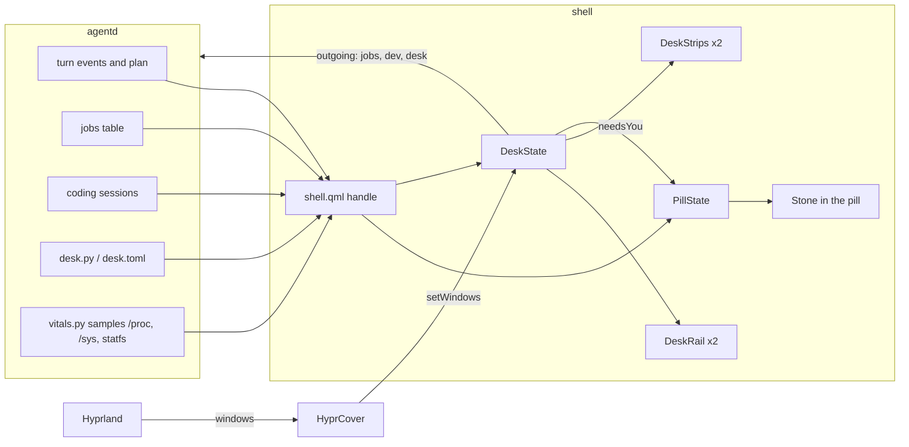
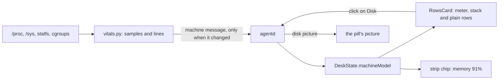

# The desk

The desk is where Bombadil's widgets live around the pill: small cards in two rails at the sides of
the screen, and chips beside the pill when a card has no room. This page is how it is built and how to
extend it. Why it looks and behaves the way it does is in [`design/widgets-brief.md`](design/widgets-brief.md);
read that first for the rules (a widget answers one question a passenger asks, the middle of the screen
belongs to what the AI brings, a widget is present only with something to say, colour says who).

## The pieces

| File | What it is |
|---|---|
| `shell/DeskState.qml` | The one object that decides what the desk shows: which widgets are present, each one's face (`full`, `strip`, `hidden`), where its slot is, and what the cards read. Plain Qt Quick with no Quickshell types, so tests drive it offscreen the way they drive `PillState`. |
| `shell/DeskRails.qml`, `shell/DeskRail.qml` | The two rails: one Quickshell `PanelWindow` per side on the Bottom layer (above the wallpaper, under every window), reserving nothing, with an input mask that covers only the cards. |
| `shell/DeskStrips.qml`, `shell/DeskStrip.qml` | The chips beside the pill, in the bar's own window. |
| `shell/DeskCard.qml`, `shell/NowCard.qml`, `shell/RowsCard.qml` | The faces: the shared card chrome, the route (Now), and a card of rows (Watching, Needs you). |
| `shell/DeskTheme.js` | The desk's colours and sizes. Each is a token of the app kit's `Theme.qml`; `tests/test_theme.py` fails when one drifts. |
| `shell/HyprCover.qml` | Where the windows are, from Hyprland, so cards can get out of their way. |
| `src/bombadil/desk.py` | What the desk remembers: folded or not, which widgets are put away, each widget's rail and place. Kept in `~/.local/state/bombadil/desk.toml`, outside the restore points, so an undo never moves the desk. |
| `src/bombadil/jobs.py` | Watching's table of background jobs. |
| `src/bombadil/vitals.py` | The Machine card's readings: memory by who uses it, the disk, the processor and its heat, the network, the lines that raise the card and the sentence that says why. Pure Python on the standard library; every file it reads is a parameter, so the tests hand it text. |
| `src/bombadil/agentd.py` | Sends the plan, the jobs table, the coding sessions and the desk's state to the shell, and takes the shell's requests back. |

## What agentd and the shell say to each other

The shell hands every line from agentd to both `PillState` and `DeskState`; each keeps what it knows and
drops the rest.

| Message | Direction | Meaning |
|---|---|---|
| `{"type":"event","kind":"plan",...}` | agentd to shell | The whole step table of the running turn, stamped with the turn. Now draws it. A plan from another turn is dropped. |
| `{"type":"jobs","jobs":[...]}` | agentd to shell | Watching's table, replaced whole each time. |
| `{"type":"dev","sessions":[...],"attention":[...]}` | agentd to shell | The coding sessions, and the keys that want the person, in Tab's order. Needs you is those keys drawn as rows. |
| `{"type":"machine","present":...,"asked":...,"why":...,"strip":{...},"rows":[...]}` | agentd to shell | The Machine card, replaced whole. `present: false` takes it away. See [the Machine card](#the-machine-card). |
| `{"type":"desk","folded":...,"hidden":...,"rails":...,"order":...}` | agentd to shell | The desk's own state. Whatever it leaves out stays as it was. |
| `{"type":"desk","op":"fold"\|"hide"\|"show"\|"move",...}` | shell to agentd | A change. agentd applies it, saves it, and answers with the new `desk` state; the shell never changes its own state first. |
| `{"type":"jobs","op":"stop"\|"dismiss"\|"why","id":...}`, `{"type":"dev","action":"open","key":...}`, `{"type":"vitals","op":"open","row":"disk"}` | shell to agentd | A press on a row's button or its small x, or on a Machine row that opens something. None of them reaches the model. |
| `{"type":"vitals","op":"get"}` | shell to agentd | Asks for the Machine card again. |

## Faces, slots and right of way

A widget is *present* when it has something to say (Now while a plan or a system step runs, Watching
while anything counts, Needs you when two or more sessions wait). A present widget has one of three faces:

- **full**: a card in its rail. Slots stack from the pill outward, nearest first, in the rail's order. A
  card whose full height does not fit the room left, and everything above it, becomes a strip.
- **strip**: a chip beside the pill. Three per side at most, then one counting `+N`.
- **hidden**: nothing (the desk is under a full-screen window, or the widget is not present).

A window over a card's slot, even partly, folds that card to its strip within 150 ms and brings it back
400 ms after the window leaves (`foldMs`, `unfoldDelayMs`), so a window dragged past does not flicker the
rail. The shell asks Hyprland for the window list again every 300 ms while any window is on the stage,
because Hyprland sends no event while a floating window is dragged. The slot a card would take stays
reserved while it is folded, so the cards above it do not slide down.

The pill follows the desk: 900 px at most, less what the strips and a card on each side take, never
under 360 px; 360 px with a window in front; a capsule under a full-screen window.

## The needs-you mark

Something waits for the person when `needsModel` has a row: a coding session asked a question, or
finished or failed and has not been looked at (agentd's `dev` message lists those keys in `attention`).
Until the coding-sessions code that sends `dev` is on the branch you run, nothing feeds the table and the
stone never knocks for it. `DeskState.needsYou` says so, and a `Binding` inside `DeskState`
writes it to `PillState.needsYou`, which turns the pill's stone amber and makes it knock twice every
1.6 seconds (`shell/Stone.qml`, the look is in the identity brief).

- **One session or many.** One waiting session is the your-turn line in the pill and no card; two or
  more raise the Needs you card. The stone knocks in both cases.
- **It cannot be put away.** The desk folded with the word "desk", a window over the rail, a narrow
  screen and the capsule under a full-screen window all take the card away; none of them takes the mark.
  Needs you itself cannot be hidden.
- **It outranks a running turn.** While a turn runs and a session also waits, the stone knocks; the pill's
  orange border and the Now card still say that the machine is working. When the last row goes, the stone
  goes back to what the pill says (working, done, rest).
- **It clears** when agentd's `dev` message no longer lists a waiting key, and when the socket drops (the
  desk forgets the table it cannot answer; agentd sends it again on reconnect).
- **Setup keeps its own.** Choosing an AI or signing in again also makes the stone knock; the desk
  clearing its rows never clears that.

At 24 px the knock is a small tilt that moves the stone about one pixel at its centre and two at its
foot, and the glow is a faint halo of one to three pixels, so it is the amber colour that tells you
first. If that proves too quiet on a real screen, the fix is in `Stone.qml`, not in the desk.

## The Machine card

The Machine card answers "is the machine all right?" and appears only when it is not: when a line is
crossed, or when the person asks ("show machine", "how's the machine"). It says in one sentence why it is
there, stacks memory by who is using it, and says the disk, the processor and its heat, and the network.
When every reading is back under its line it leaves on its own. `vitals.py` takes the readings and decides;
the shell draws what the one `machine` message says and knows none of the numbers.

**The lines.** The briefs say "memory 91%" and "hot · 82°" as examples and name no numbers, so these are
defaults chosen here and kept as constants at the top of `vitals.py`:

| Line | Raises the card at | Lets it go at | The chip |
|---|---|---|---|
| Memory | 90% of the machine's memory in use | 85% | `memory 91%` |
| Sessions' ceiling | the coding sessions' memory reaches 90% of the limit their slice is given | 80% | `sessions 93%` |
| Disk | the fullest real disk is 90% full (amber from 90%, red from 97%, the numbers the disk picture uses) | 88% | `disk 94%` |
| Heat | the hottest sensor reads 80° | 72° | `hot · 82°` |

A line has to hold for three samples in a row to raise the card and ten in a row to let it go, and a card
that rose stays at least ten seconds, so a spike never flickers it. The sentence names the worst line
first (the sessions' ceiling, then memory, then the disk, then heat).

**Who uses the memory.** Three groups, drawn left to right in one meter: *the machine* (the AI's own turns
and its background jobs, which run as systemd units named `bombadil-turn-…` and `bombadil-job-…`),
*coding sessions* (units named `bombadil-dev-…`), and *you* (everything else: the apps you are running,
the browser). Apps have no unit of their own, so *you* is what is left after the other two are taken
from what is in use. Memory is read from each unit's cgroup (`memory.current`); where the cgroup tree is
not readable the stack shows memory as one part and the sentence leaves out the "who".

**Cost.** Nothing runs while no shell is connected. A calm machine is sampled every 5 seconds (a handful of
small reads of `/proc` and one thermal file; the disk every 30 seconds). While the card is up, or asked
for, or any reading is within five points of its line, it is sampled every second, with the cgroup walk and
the network counters. `agentd` runs it in a worker thread, so the loop never waits on a read, and
`BOMBADIL_VITALS=0` turns it off. The message is sent only when it differs from the last one, and its
numbers are rounded for that, so a calm machine sends nothing.

**Asking.** `show machine`, or "how's the machine", raises the card even when nothing is wrong, says
"Here is the machine.", and keeps it up for 30 seconds (`asked: true`; the card draws the same). The
agent's `desk` tool does the same when the person asked for the desk in that turn.

**Rows that open something.** A row with an `opens` value is a button: the Disk row asks `agentd`
to draw the disks picture (the one "where did my disk go" draws), and never reaches the model.

**Known limits.**

- *The sessions' ceiling line stays quiet until a ceiling exists.* Nothing sets `MemoryHigh` or `MemoryMax`
  on the coding sessions' slice yet; the card reads the limit and, with none, has no line to cross. The
  sessions' memory is still drawn in the stack.
- *Memory attribution is read from cgroups, not checked on real hardware.* Whether a user service may
  read the units' `memory.current`, and which thermal zones a laptop exposes, is what the first run on the
  real machine shows; a reading that cannot be read is left out of the card rather than guessed.
- *The disk row opens the disks picture,* because there is no space map yet to open.

## Adding a widget

1. Add it to `WIDGETS` in `src/bombadil/desk.py` (id, title, launcher words, default rail) and to
   `widgetIds` and the default `rails` and `order` in `DeskState.qml`, so the word "hide machine" and the
   saved desk know it.
2. Give `DeskState` a model for it (`awayModel`, `machineModel`, ... are already waiting) filled from one
   agentd message, and say when it is present. A model with no rows is a widget that is not there.
3. Say how tall its full face is in `heightOf`, and give it a strip in `_stripOf`.
4. Draw it: reuse `RowsCard` (rows with a dot or a meter, a button, a small x) or write a card on
   `DeskCard`, and add its component to the loader in `DeskRail.qml`.
5. Test it offscreen in `tests/test_desk_qml.py` (the harness builds the real `PillState`, `DeskState`,
   both rails and both strips in one window) and, for what only a real compositor shows, in
   `tests/desktop/driver.py`.

## Testing

- `pytest tests/test_desk.py tests/test_desk_qml.py tests/test_desk_cards_qml.py`: the desk's state file
  and its words, and the whole desk drawn offscreen (set `BOMBADIL_SCREENS=<dir>` to save pictures).
  They need PySide6 and, in a bare container, the system libraries Qt loads (libEGL, libxkbcommon).
- `tests/desktop/run.sh`: the real bar, agentd and the Claude CLI in a headless sway session. The
  desk's checks inject agentd's messages through `quickshell ipc call desk inject` and read what the desk
  shows back from `quickshell ipc call desk state` (the face, the slots, the rows, the stone's face).
  Windows are stood in by `quickshell ipc call desk cover`.
- Not covered anywhere but a real Hyprland session: the rails drawing under floating and special-workspace
  windows, `dim_special` dimming them, and a window being dragged past a card.
