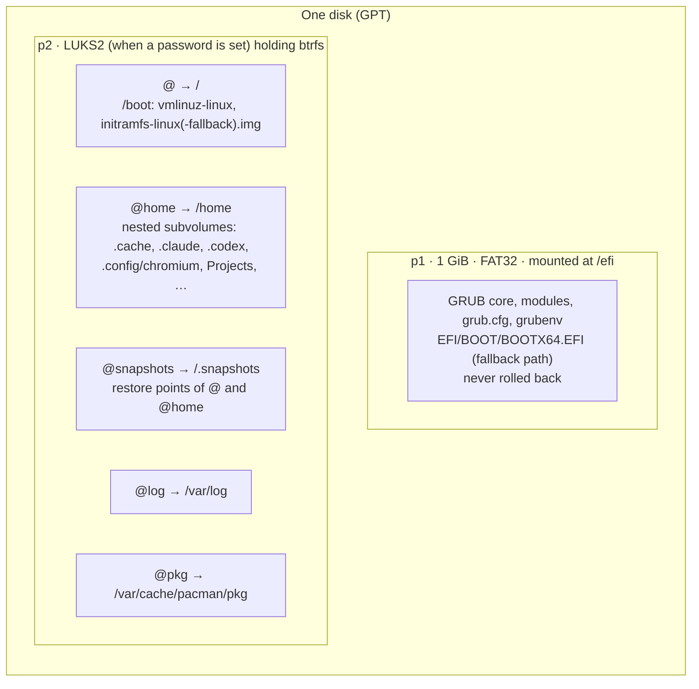
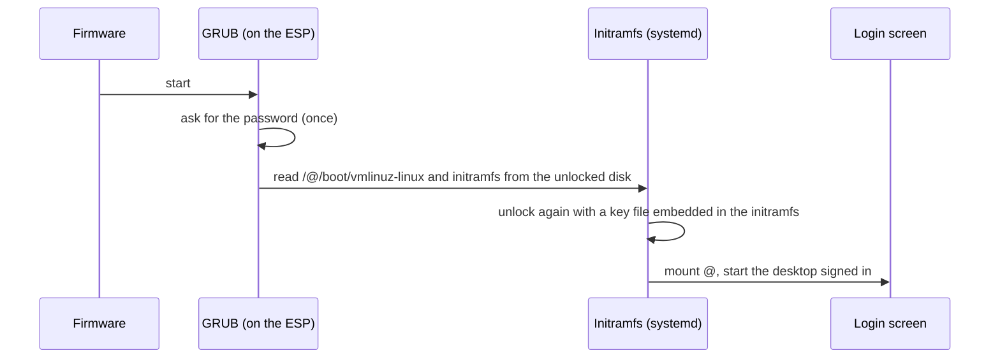
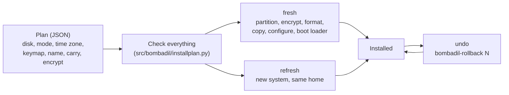

# Bombadil as an installed operating system

Bombadil starts as a USB stick you try, and ends as the system on a computer's disk, the way
Debian or Windows is installed. This page says what the installed system looks like, why it is
built that way, what you can rely on when you build on it, and how to test a change to it. The
complete reasoning, with the alternatives that were weighed, is in
[design/installed-os-brief.md](design/installed-os-brief.md). The disk layout in table form is in
[ARCHITECTURE.md](ARCHITECTURE.md#the-installed-disk-layout-1).

## Principles

These are the choices every part of the install follows. A change that breaks one of them needs a
reason that is better than the one given here.

1. **The layout is the one thing an update cannot change, so it is right before anyone installs.**
   Packages, units and scripts reach an installed machine by an update. A partition table, an
   encryption header and the place the kernel lives do not. They are written once and recorded
   (`layout` in `/var/lib/bombadil/install.json`); a later layout is a new number with a migration.
2. **Undo covers the whole system, kernel included.** Bombadil takes a btrfs restore point before
   every agent turn, so `/boot` is inside the restore point. An undo then starts the kernel that
   goes with the modules on disk, and never a kernel whose modules were replaced.
3. **The person's files outlive the system.** Home is its own subvolume. Replacing the system
   ("refresh") keeps home, the sign-in, the apps the agent wrote, the computer's name and the
   Wi-Fi networks, and keeps the old system aside for two weeks.
4. **One password, typed once.** The disk is encrypted by default. The password is asked for a
   single time, at the boot loader, and also unlocks the screen. A recovery key is shown once.
5. **A stop is never worse than the state before it.** Every step that changes a disk is ordered
   so that stopping partway leaves either the old system untouched or a marker that tells the
   next run where to resume. Reading and checking always come before writing.
6. **The agent explains in pictures and plain words, not in terminal output.** The install is a
   card in the pill with one button that names the disk; the terminal command exists for tests and
   for people who know what they are doing, and it asks no questions the card did not already ask.

## What is on the disk



Why each piece sits where it does:

| Choice | Reason |
|---|---|
| ESP at `/efi`, not `/boot` | The kernel is inside `@`, so a restore point holds it. GRUB itself stays on the ESP so its modules never disagree with its core after an undo. |
| `@log` and `@pkg` beside `@` | Undo replaces `@`. The logs of a bad start, and what was downloaded since, must survive the undo. |
| Nested subvolumes in `@home` | A restore point of the home folder does not descend into a nested subvolume, so the sign-in, the browser profile and caches are never rolled back by undoing a file change. |
| `/etc/fstab` by UUID, system by subvolume name | A snapshot swapped in under the name `@` mounts exactly like the root it replaced. |
| `btrfs` snapshot swap, not `set-default` | The root is always the subvolume called `@`. Nothing reads the default subvolume, so there is one path to reason about. |

## How the disk is opened



The disk has three key slots: the **password** (argon2id at 256 MiB, which is what GRUB can pay on
firmware that fragments low memory), a **key file** inside the initramfs (cheap to derive, so the
password is not typed a second time), and a **recovery key** (shown once on the first start, kept
in `/var/lib/bombadil/recovery-key`, mode 600, only until it has been shown). The password reaches
`bombadil-install` only on a file descriptor, never in a file, an argument or the log.

## The three operations



- **Fresh install** erases the chosen disk. It refuses the disk the stick was started from, refuses
  a disk with anything mounted from it, and the terminal form asks for the disk's name typed in full unless `--yes` or a plan from the card says it was already confirmed.
- **Refresh** (`bombadil-install --refresh DISK`) is the way an installed machine gets a new base
  system while keeping everything personal. It reads and checks first; renames the old `@` and
  `@snapshots` aside as `@.before-refresh-<stamp>`; copies the new system in; empties the ESP last
  (not reformatted, so its UUID stays). `bombadil-rollback --device DEV refresh` puts the old
  system back. A refresh that stops before the boot files are replaced puts the old system back by
  itself; one that stops after leaves `var/lib/bombadil/install-incomplete`, and running it again
  resumes from the system that is still aside.
- **Undo** (`bombadil-rollback N`) swaps restore point `N` in under the name `@` (one atomic
  exchange where the kernel offers it) and keeps the previous root as `@.undone-<stamp>`, so an
  undo can itself be undone.

## What a user sees

- On the stick: the pill offers "Install on this computer". The card draws the disks as bars with
  one sentence each, leaves out the stick itself, and asks for one thing, a password. Time zone,
  keyboard, computer name and what comes along from the stick each have one line with "change".
  The red button names the disk it will erase.
- At power-on: one plain line asks for the password, then the desktop opens with the conversation
  and apps still there, a welcome line, and the recovery key once.
- Afterwards: undo works from the pill; closing the lid locks behind the same password; an update
  arrives as one restore point so a kernel that goes wrong goes back with undo.

The install card is a later piece; today the same plan is run by hand with
`bombadil-install --plan FILE --password-fd N`.

## The plan

```json
{
  "disk": "/dev/vda",
  "mode": "fresh",
  "timezone": "Europe/Lisbon",
  "timezone_source": "detected",
  "keymap": "us",
  "hostname": "thinkpad",
  "carry": [".claude", ".claude.json", ".codex", ".config/bombadil", "Apps"],
  "encrypt": true,
  "kind": "internal"
}
```

`src/bombadil/installplan.py` is the only reader of a plan. It refuses unknown fields, a disk
outside `/dev`, a time zone the system does not know, a carry path that is not on
`install/carry.list`, and any plan that disagrees with the command line. `install/carry.list` is
the one place to add a home path that should come along from the stick: add a line, not code.

## Building on it

- **Add a home path that must survive a refresh or travel with the person** by listing it in
  `install/carry.list`. If a restore point must never roll it back, add it to `HOME_SUBVOLS` in
  `bombadil-install`.
- **Add a field to the install card** by adding it to the plan in `installplan.py` first, with its
  validation and a test, then read it in `bombadil-install`. Nothing the card sends is trusted
  until the plan has validated it.
- **Change the layout** only with a new `LAYOUT` number and a migration in the refresh path. An
  installed machine is never reinstalled by an update.
- **Never** run `btrfs subvolume set-default` or `snapper rollback`, run `grub-mkconfig` from a
  package script (after an undo before a reboot it would write paths of a root that is no longer
  there), or format the ESP on a refresh.

## Testing a change

The container the project is built in has no KVM, btrfs or LUKS support, so there are two layers:

1. `python3 -m pytest tests -q` runs `tests/test_installer.py` (the installer's functions sourced
   into a shell with the disk tools replaced by shims) and `tests/test_installplan.py`.
2. A real run in a virtual machine: build the image with `BOMBADIL_TEST_ENTRIES=1
   scripts/build-in-container.sh`, then `MODE=install scripts/test-vm.sh`,
   `MODE=install-encrypted scripts/test-vm.sh` (types the password at GRUB), and
   `MODE=refresh OLD_ISO=path/to/older.iso scripts/test-vm.sh` (installs from an older image,
   refreshes, then undoes across a reboot). The test boot entries erase `/dev/vda` without asking,
   so they exist only in images built with that flag and must never be started on a real disk.

On a machine with a disk you care about, take a snapshot of the virtual disk first (`qemu-img
snapshot -c before-refresh disk.qcow2` with the VM off): it is the only way back to the old EFI
partition.
