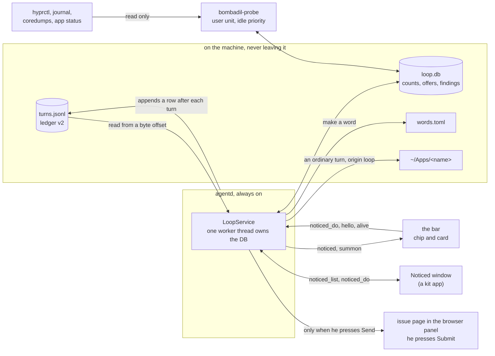

# The self-improvement loop

Bombadil keeps count of what you ask for more than once, offers to turn a repeat into something
smaller, and checks itself for bugs it can write up. Design: [`design/self-improvement-brief.md`](design/self-improvement-brief.md)
(pieces 1 and 2 are built here; fixing its own bugs, the room, generations and the guard are not).
This page is the overview and the contract; the pages under [`loop/`](loop/) say how each part is built.

What you see: nothing for a few days. Then a small "noticed 1" chip right of the pill. Hover it and
your own words appear with one suggestion ("show me my passwords · 4 times on 3 days. Say "my
passwords" and Passwords opens."), and one button. Click it, or say "noticed", for the Noticed
window: what you ask most, what Bombadil made from it (each with Undo), the bugs it found (each
with Send to the project) and what you said no to. The Send card shows exactly what goes. Opening the
issue page puts that text in the page's address, so it reaches GitHub when the page loads; nothing is
posted until you press Submit there.

## Rules (from the brief)

1. Counting and checking are not work. They read what the machine already writes, stay on the
   machine, call no model (except one optional call to split or name a group that is about to be
   offered: `refine.py`, off until checked on both providers) and are never on a turn's path.
2. An idea is a strip he can ignore, never a popup: a chip beside the pill while something waits.
   Nothing on the line, no keyboard, no sound, no mark on the dot, never during a turn.
3. A tap is the ask. The loop never builds anything from a count on its own.
4. Probes only read. What they cannot fix they write up.
5. What he would notice waits for him. Nothing leaves the machine until he presses Send to the project,
   and nothing is posted until he presses Submit on the page that opens (its address carries the report,
   so GitHub sees the text when the page loads).
6. No new words to learn: "noticed" is the widget's name, "hide noticed" and "show noticed" its verbs.

## How the pieces fit



Two programs touch `loop.db`: the service inside agentd (counting, offers, the answers to taps) and the
prober (findings). Neither is on a turn's path; either can be dead and the machine, the pill and every
turn carry on. The bar and the window only draw what agentd sends and say what was pressed; every rule
lives in the service, so a different shell could draw the same thing.

## The UX model, in one page

- **Quiet by default.** Nothing for the first days. Then one small chip beside the pill while something
  waits: no dot, no colour, no motion, no sound, never during a turn, never while he is typing.
- **Three levels of attention.** The chip (a count), the card that rises from it on hover (his own words,
  how often, one line of what would happen, one button), and the Noticed window (everything it counted,
  changed and found, each with its Undo). Each level is optional.
- **A tap is the ask.** The button on a row does the thing; there is no second "are you sure". The
  safety is Undo, which the receipt line carries.
- **His words, not a model's.** An offer quotes what he typed. Labels are plain full sentences; nothing
  says "AI", "model" or "pattern" on day one.
- **Saying no is cheap and respected.** "Not now" returns only when the count has doubled or after 30
  days; "Never" stops that idea; two silent expiries or two Nevers in a row rest all offers for 30 days;
  "hide noticed" holds everything. At most one new offer a day and three a week.
- **Reports are his to send.** A finding becomes a report he can read in full, with what goes and what
  stays on the machine, and the issue page opens prefilled with that text: the report he read is the one
  held, and the one sent. Nothing is submitted for him.

The per-surface details are in [`loop/bar.md`](loop/bar.md) (chip and card) and
[`loop/window.md`](loop/window.md) (the window).

## Building on it

- **A new thing a repeat can become** (a form): add a `Form` to `FORMS` in `loop/forms.py` with the
  plain sentence the card shows and the name of the builder it `needs`; teach `LoopService` to run it
  (`service.py` `BUTTONS` and `_op_accept`) and record the change as an `improve` row with an `undo`.
  A form whose builder is missing is never offered, and says which piece it waits for.
- **A new check**: write a function over the `Observation` in `loop/probes.py` and register it with
  `@probe(id, component, kind, title, what)`; return `red()`, `green()` or `unchecked()`. Keep it read only,
  bounded and free of his words; add a fixture under `tests/fixtures/loop/probes/` that is red on the
  bug and green on the fix (see [`loop/probes.md`](loop/probes.md)).
- **A new surface** (another shell, a phone, a CLI): speak the messages under "agentd ↔ clients". The
  `bombadil loop …` commands are the smallest example.
- **What to keep**: counting and checking never call a model and never sit on a turn's path; an idea is
  a strip that can be ignored; a tap is the ask; probes only read; nothing leaves the machine unless he
  presses a button; the ledger is append only and the derived counts can always be rebuilt from it.

| Read | For |
|---|---|
| [`loop/ledger.md`](loop/ledger.md), [`loop/counting.md`](loop/counting.md) | what is written after a turn, what counts as an ask, how asks are grouped |
| [`loop/words.md`](loop/words.md) | words.toml, the launcher and the optional naming call |
| [`loop/service.md`](loop/service.md) | the agentd side: threads, ops, cadence |
| [`loop/bar.md`](loop/bar.md), [`loop/window.md`](loop/window.md) | the chip, the card and the Noticed window |
| [`loop/probes.md`](loop/probes.md), [`loop/report.md`](loop/report.md), [`loop/cli.md`](loop/cli.md) | self-checks, findings, the scrubbed report, the commands and the prober's unit |

## Where things are

```
src/bombadil/loop/
  db.py         the shared SQLite file (WAL): connect(), schema(), transaction()
  ledger.py     reads turns.jsonl (old rows and ledger v2) and per-turn logs into Request records
  habits.py     what counts, normalising text, verbs, named things, grouping, decay
  route.py      what a turn actually did (programs, tools) as topics
  forms.py      what a group can become, the rule that picks one, which forms exist on this machine
  offers.py     when a group is ripe, the cadence, "Not now", "Never", silence, resting
  store.py      loop.db: requests, asks (groups), offers, words used; reads turns.jsonl from a byte offset
  refine.py     the optional model call (split or name a group); off by default
  words.py      words.toml: read, add, remove, put away, bring back (launcher.py matches them)
  service.py    LoopService: what agentd runs beside its turns; the `noticed` state; answers taps
  signals.py    what the bar and agentd report about themselves (signals.jsonl, bar.json, agentd.json)
  probes.py     invariants as pure functions over hyprctl JSON, the bar's rectangles, the ledger
  findings.py   fingerprints, when a probe counts, quarantine, evidence bundles
  report.py     the scrubbed report and the prefilled issue link
  versions.py   the build and the versions of what Bombadil runs on
  runner.py     collects live data for the probes (hyprctl, coredumps, app status) and runs them
share/apps/noticed/   the Noticed window (a kit app)
shell/LoopState.qml, NoticedChip.qml, NoticedCard.qml   the chip and its peek card
bin/bombadil-probe    the prober (a user unit): Hyprland's events, once a minute while he is away
bin/bombadil loop …   asks, replay, status, report, forget, probe;   bombadil doctor --live
```

## Ledger v2 (turns.jsonl)

One JSON object per line, append only. Old rows stay readable; a reader uses what a row has.
`v` is 2 on rows written by this version.

A model turn (no `kind`):

| key | meaning |
|---|---|
| `t`, `prompt`, `result`, `ok`, `snapshot`, `provider`, `session`, `stopped`, `summary`, `details` | as before (`t` is when the row was written, the turn's end) |
| `id` | the per-turn log's stem, `<ms>-<n>`: lasting and unique, unlike the turn counter |
| `started`, `seconds` | epoch seconds the turn began, and its length |
| `origin` | `typed` (the pill), `button`, `app`, `session`, `routine`, `loop`, `retry`, `cli` (`bombadil ask`) |
| `tools` | `{"n": steps, "names": [unique tool names in order of first use]}` |
| `model`, `cost`, `usage` | the provider's model name, dollars, `{input, output, cache_read, cache_write}`; null when the provider does not say |
| `rate_limit` | the provider's rate-limit event when it sent one, else null |
| `drift` | only when non-empty: `{"<type>": n}`, how many stream lines were valid JSON of a `type` the adapter does not know (the tripwire for a vendor CLI changing) |
| `v` | 2 |

A launcher action (`kind: "local"`): `t`, `prompt` (what he typed, or the action's name for a
button), `action`, `target`, `result`, `ok`, plus `v: 2`, `verb` (open, close, hide, stop, undo…),
`via` (`typed`, `button` or `word`), `word` (the phrase, when `via` is `word`), `of` (the id of the
turn it acted on: stop, undo) and `of_snapshot` (the restore point it went back to, undo). A stop
is logged now too. A turn's "undone by" is worked out by readers: the `undo` row whose
`of_snapshot` is that turn's `snapshot`, or whose `of` is its `id`.

What the loop itself writes (`kind: "improve"`, the trail): `t`, `id`, `what` (`word`, `app`,
`kit`, `fix`…), `title` (one plain sentence: "Made “my passwords” open Passwords."), `group`,
`undo` (how to put it back: `{"op": "remove_word", "phrase": "my passwords"}`), `undone`
(false; an undo appends another `improve` row with `of` set), `v: 2`. Readers that show turns must
skip `improve` rows (`watch.history_lines` shows them as a dim line).

## Files

All under `paths.loop_dir()` (`~/.local/state/bombadil/loop`, overridable with `BOMBADIL_LOOP`),
except `words.toml` (`paths.words_file()`, `~/.config/bombadil/words.toml`).

- `loop.db`: derived counts and the few facts that cannot be made again (see db.py).
- `signals.jsonl`: what agentd heard from the bar, append only: `{"t", "kind": "hello"|"summon"|"focus_ack"|"friction"|"restart", …}`.
- `bar.json`: the bar's last report, rewritten atomically at most every 2 s:
  `{"pid", "connected_at", "alive_at", "build", "screens": {"<name>": {"w", "h", "rects": [{"name", "x", "y", "w", "h"}]}}}`.
- `agentd.json`: `{"pid", "started", "build", "socket"}`, written when agentd starts.
- `findings/<fp>/`: evidence bundles (`evidence.json` and the files it names). `reports/<fp>.md`: the report held for sending, and `findings/<fp>/report.json`, the fields it was made of, which the `send` op uses so that what is sent is what he read.
- `config.toml` (optional): numbers that may be retuned, never the model's to change (`[offers] asks = 3, days = 2, window_days = 21`, …).

## agentd ↔ clients

Existing messages are unchanged. New (client → agentd):

- `{"type":"prompt","text":…,"origin":"typed"|"cli"|"app"|…}`: `origin` optional (`typed` when absent; `app` when the text starts with "[from app ").
- `{"type":"hello","client":"bar","pid":n,"build":"…"}`, `{"type":"alive","t":…}` every 5 s,
  `{"type":"rects","screen":"Virtual-1","w":1920,"h":1080,"rects":[{"name","x","y","w","h"}]}`,
  `{"type":"focus_ack","id":n,"ms":120}` after a summon once the input has the keyboard (`id` is the
  `id` of the summon message agentd broadcast, which now carries one: `{"type":"summon","id":n}`),
  `{"type":"friction","what":"esc","count":3,"seconds":10,"drawer":true}`.
- `{"type":"ping"}` → `{"type":"pong","t":…,"pid":n}`.
- `{"type":"noticed_do","op":…,"id":…,"form":…}`; ops: `open` (the Noticed window), `accept`,
  `not_now`, `never`, `got_it`, `other_ways`, `preview`, `report`, `send`, `undo`, `bring_back`,
  `forget_asks`, `clear_found`, `hide`, `show`. agentd answers the sender with `{"type":"noticed_result","op","id","ok","text","preview"?}`.
- `{"type":"noticed_state"}` → agentd sends `noticed` to that client.
- `{"type":"noticed_list"}` → agentd sends `noticed_full` to that client, for the Noticed window:
  `{"type":"noticed_full","hidden":bool,"held":bool,"resting":"","asks":[{"id","title","n","days","last","state","sentences":[…],"became":""}],
  "changes":[{"id","title","t","what","undone":bool,"can_undo":bool}],"found":[{"id","title","meta","fp","state","can_send":bool,"why":[…],"preview"?:{"text","goes":[…],"stays":[…]}}],
  "said_no":[{"id","title","t","form"}],"words":[{"phrase","opens","away":bool}]}`. `held` is true while offers are held
  (hidden, resting). The window acts with the same `noticed_do` ops (`id` is the row's id in its own list) and
  asks again after each answer or when it hears a `noticed` message.
  `can_send` is true until it is sent (the window's button says `report` first, then `send` after the card).
  An ask waiting on him also carries `primary`, `what` and `others` like a `noticed` row; `found[].why` holds
  two plain sentences (what was expected, what was seen).
  A found row's `report` op builds and holds the report (state `reported`), adds its `preview` to that row and
  opens the Noticed window on it; `send` (only after `report`) opens the prefilled issue page in the browser
  panel and marks it `sent`. `noticed_result.preview` is a string or `{"text",…}`.

New (agentd → clients):

- `{"type":"noticed","count":2,"hidden":false,"resting":"","lately":"","rows":[ROW…]}` on connect and whenever it changes.
  `count` is what waits (the chip's number; 0 hides the chip); `rows` are at most three.
  ROW: `{"id","kind":"offer"|"found"|"change"|"report","title","meta","what","primary":{"label","op","form"?},
  "others":[{"label","op","form"?}],"forms":[{"form","label","recommended"?}]}`. `title` is his own words for an
  offer; `primary.label` is at most three words.
- `{"type":"noticed_open"}`: he said "noticed": the bar keeps the card up.
- A local event may carry `"undo_msg": {…}`: a message the line's Undo button sends instead of the
  machine's undo (the receipt of a made word puts the word away).

## Service rules (agentd side)

`loop/service.py` is the only thing that touches the store from agentd. One worker thread (a one-thread
executor) owns the `LoopStore` and `FindingsStore` connections, since an SQLite connection belongs to its
thread; the event loop never touches the database. Nothing the service does may delay a turn, the pill or a
client: a failure prints one stderr line and costs the loop a count. The prober (`bin/bombadil-probe`, a
user unit) is a separate process writing the same loop.db; the service reads findings from there about every
20 s while a client is connected. An offer is only recorded as shown (`store.ripe_offer`) while no turn runs,
nothing is queued and a bar is connected. Undoing a made word answers its group `not_now`. `hidden` (Noticed
hidden, offers held) is kept in loop.db.

## Launcher

`words.toml` (`[[word]]` with `phrase`, `opens = {kind, name}`, `made`, `from_group`, `away`) is
matched last in `launcher.match`, after apps, panels, utilities and (when they exist) projects,
sessions and aliases, so a word never shadows anything. It can only open or show. At most 30; one
unused for 28 days is put away (`away = true`) with Bring back. The word "noticed" (and "show
noticed", "open noticed") opens the card and the Noticed window; "hide noticed" hides the widget
and holds offers; "show noticed" brings it back.

## What a repeat can become (day one)

Only forms whose builder exists on this machine are offered. Today: **a word** (a row in words.toml,
no model) and **a new app** (an ordinary turn, origin `loop`, from the row's button). Cards,
widgets, routines, watchers, preferences and kit parts wait for the pieces the brief names.

## Not built yet (later pieces, room is left for them)

The room and the gate (`bombadil check`), the mender, generations and the guard, growth (kit
overlay), the desk face of Noticed (the chip becomes a desk strip when the rails land), and
fixing anything by itself. Findings carry `fixable: false` for now.
