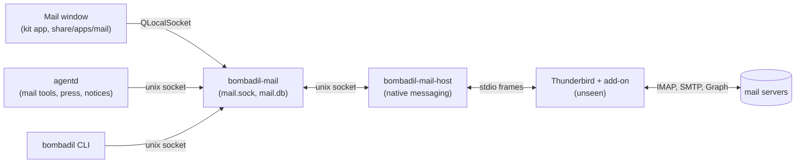
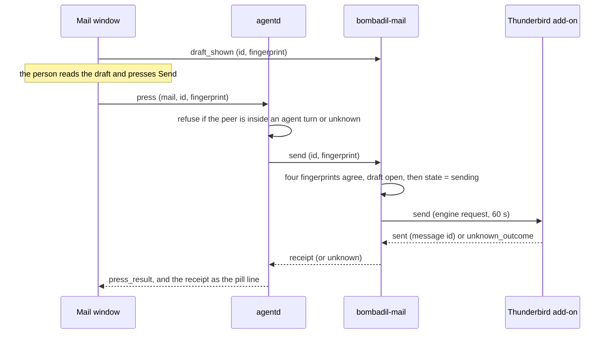

# Mail

Bombadil's own Mail view: every mail account in one list, Needs a reply, Drafts, a reply box whose Send
is the person's press, and an agent that can read, search, mark and draft but cannot send. The design, the
rules and what the person sees are in [`design/mail-view.md`](design/mail-view.md); this file is the
contract the code is built to. Where the two differ, this file says what was built and why. Every person,
address and company in it is invented.

The person's three choices, which everything below follows: only their own press on the real Send button
lets a message go (a typed "send it" does not); Bombadil writes whatever it is asked to and keeps a log of
what it wrote and what was pressed; mail comes from Thunderbird running unseen, every account in one list.

## The line

- **Thunderbird is the engine, unseen.** Gmail and Microsoft will not let a new app read mail without a
  review or an admin; Thunderbird is the one mail program both let a person allow alone. It runs on a
  Hyprland special workspace nobody visits, with Bombadil's profile under `~/.local/share/bombadil/mail`,
  and keeps a copy of the mail on this machine (inside the encrypted disk once the installed OS lands).
- **Bombadil keeps no mail text.** The service keeps, in `mail.db`: accounts, Bombadil's own drafts,
  "needs a reply" marks with one line of why, receipts and a press log. A mail's text is read from
  Thunderbird on demand, held in memory while a window needs it, and never written by Bombadil. The Brain
  may learn sender, subject, time and a link (`recent`), never the text.
- **The agent reads, never obeys.** `mail_read` gives the text inside a mark that says it is other
  people's words. The agent has no send tool; `mail_draft` puts a draft in the view; only a press on the
  view's Send lets it go (rule 2). Addresses the person did not type and the thread does not contain are
  flagged on the draft (rule 5).

## Processes

The press, in time: the window shows a draft, the person presses Send, agentd checks who pressed, and the
service sends once.

| Part | Where | What |
|---|---|---|
| `bombadil-mail` | `bin/bombadil-mail`, `src/bombadil/mail/service.py`, user unit `bombadil-mail.service` | Owns `mail.sock` and `mail.db`; supervises Thunderbird; answers the window, agentd and the CLI |
| Thunderbird | package `thunderbird`, profile `~/.local/share/bombadil/mail` | Fetches, stores, sends. Its window lives on `special:mail-engine` |
| Add-on | `share/mail/extension/` | Inside Thunderbird; answers the service's engine requests with the `messenger.*` APIs |
| `bombadil-mail-host` | `bin/bombadil-mail-host` | The native messaging host the add-on connects to; relays frames to `mail.sock` |
| Mail window | `share/apps/mail/` | A kit app: `main.qml` plus `app.py` whose `Backend` talks to `mail.sock` |
| agentd | `src/bombadil/agentd.py`, `outbox.py`, `notices.py` | Brokers the agent's mail tools, routes presses, says new mail and receipts as the pill line |
| os-mcp | `src/bombadil/mail/tools.py` | `mail_search`, `mail_read`, `mail_draft`, `mail_mark`, `mail_show`: each a line to agentd |

Nothing waits for mail: a caller that cannot reach the service says "Mail is not running yet" in its own
line, agentd's pokes give up after 0.3 s, and a turn never blocks on Thunderbird.

## Files and state

| Path | Env override | Holds |
|---|---|---|
| `$XDG_RUNTIME_DIR/bombadil/mail.sock` | `BOMBADIL_MAIL_SOCKET` | the service socket |
| `~/.local/state/bombadil/mail.db` | `BOMBADIL_MAIL_DB` | accounts, drafts, marks, receipts (SQLite, WAL) |
| `~/.local/state/bombadil/mail/` | `BOMBADIL_MAIL_FILES` | copies of a draft's attachments (`drafts/<id>/`), fetched attachments in flight |
| `~/.local/state/bombadil/presses.jsonl` | `BOMBADIL_PRESS_LOG` | one row per press: who, what, fingerprint, result (no mail text) |
| `~/.local/share/bombadil/mail/` | `BOMBADIL_MAIL_PROFILE` | the Thunderbird profile |
| `~/.mozilla/native-messaging-hosts/bombadil_mail.json` | - | host manifest, written by the service at start |

All of it is the person's alone: `mail.db` and its `-wal` and `-shm`, `presses.jsonl` and `mail.sock` are
0600, `drafts/<id>/` is 0700 with 0600 files. `mail.db.lock` and `mail.sock.lock` are held with `flock` for as
long as a service runs, so a second `bombadil-mail` on the same `mail.db`, or on the same socket with notes of
its own (a dev session that forgot to say where its socket is), says so on stderr and exits 1 and the first is
not disturbed and is still reachable; the socket of one that died is replaced, and a service that stops
removes only its own. Attachment copies are kept under a cap: 1 GiB for all open drafts together and 256 MiB
for the drafts the agent made (a file that would go over is refused, `refused`, and nothing is kept).

`mail.db` is a cache, and the one thing in it that cannot be made again is the person's work, so it is
looked after: a file that is not a database, fails SQLite's check at start, or turns out damaged while
the service runs is set aside as `mail.db.broken` (with its `-wal` and `-shm`) and made again, and the
accounts come back from Thunderbird's own list. What was only in it (marks, open drafts and their
attachment copies, which addresses were written to, which accounts were removed on purpose) is gone. The
one request that found it damaged is answered `internal` with "Mail's own notes were damaged and had to
be started again. Try that once more." Housekeeping, at every start and then every hour: a draft found
`sending` becomes `unknown` (and a row with `"src": "mail"` and code `unknown_outcome` goes to the press
log); drafts sent or discarded more than 30 days ago are forgotten with their receipts; copies of drafts
that no longer exist and half-fetched attachments (`inflight/`) are deleted. `presses.jsonl` is cut at
1 MiB into `presses.jsonl.1`, and one older part is kept. Nothing of a mail's text is in any of these.

## Wire protocol, client side (`mail.sock`)

JSON lines, each at most 1 MiB. Request `{"id": int|str, "op": str, ...}`; answer `{"id", "ok": true,
"result": ...}` or `{"id", "ok": false, "error": "one plain sentence", "code": str}`. After `subscribe`
the service also sends pushes `{"push": name, ...}`. Codes: `engine_down`, `no_account`, `not_found`,
`bad_request`, `changed` (the draft is not what the view showed), `refused`, `too_big`, `engine_error`,
`unknown_outcome` (a send that may or may not have happened) and `internal` (a bug in the service: nothing
is known to have happened, and the sentence says only that mail could not do that just now; the cause is
in the service's log).

- **`id` is overloaded.** It is the request's id, echoed in the answer, and for an op that names a mail or
  a draft (`read`, `send`, `draft_edit`, ...) it is also that op's argument, so the answer's `id` is the
  mail's or draft's. A client that has calls in flight together adds `"rid": str|int` to each request
  and matches on that: the service echoes it too. `client.Connection` sends its own counter as `id`
  only for an op that has no `id` argument, and treats an answer with `"id": null` and `ok` present (the
  service's answer to a line it could not read) as the answer to the call in flight.
- **A connection is served in order**, one request at a time. A `send` holds its connection until it is
  answered (up to 60 s, so give it a timeout of at least 70 s), and what must not wait for it, such as
  the window's lists while a press is going, goes over another connection. At most 64 connections are
  served, of which at most 8 may be a process inside an agent's turn (the rest are the person's windows and
  agentd's, which a turn cannot crowd out), and one from another user (root apart) is closed at once. A
  connection that says nothing for 10 minutes, or stops half way through a line, is closed, unless it is a
  window that has subscribed and waits for pushes (an agent's subscription is not one). A client that stops
  reading is dropped: more than 4 MiB queued for it, or an answer it did not take in 10 s, closes its socket,
  and nobody else waits.
- **Text goes as text.** A draft's body is at most 500 000 characters and 600 000 bytes, and a request line
  at most 1 MiB, so a client writes UTF-8 as it is (`client.py` does) and not as `\u` escapes, which would
  make a long draft in another script six times as long. A line that is not JSON, not an object, or has no
  known `op` is answered `bad_request` and the connection goes on; one over the limit is answered
  `bad_request` and closed.
- **Who is asking.** The service asks the kernel which process is on the other end (`SO_PEERCRED`) and
  `procs.cgroup_of` whether it is inside an agent turn's scope, for every request, so a process that joins
  a turn after it connected is caught. It fails closed: a peer the kernel cannot name (pid 0, another pid
  namespace) or that has gone since it connected is treated as inside a turn, because a socket outlives the
  process that made it (a process in a turn can connect, give the socket to a child and exit, and the child
  is still in the turn). Whether the process is alive is asked of a pidfd (`SO_PEERPIDFD`, Linux 6.5), which
  is not fooled by a number that was given to someone else, and of `/proc/<pid>` where the kernel has none.
  Such a process may `ping`, `status`, `accounts`, `views`, `list`,
  `search`, `read`, `mark_reply`, `draft`, `draft_edit`, `draft_get`, `known`, `show`, `recent` and
  `subscribe`, and is refused (`refused`) `send` (a press), `draft_shown`, `add_account`,
  `remove_account`, `set_flags`, `archive`, `trash`, `save_attachment`, `draft_discard`, `engine_window`
  and `requested`, and its `engine_hello` is not taken: nothing it says is Thunderbird. What it makes
  is `created_by: "agent"` and `tainted` whatever it says, and its `typed` is ignored, since an agent's
  word for what the person typed would launder any address.

Shapes (all fields always present unless marked optional):

- **Addr** `{"name": str, "email": str}`
- **Account** `{"id": "a1", "email", "name", "provider": "google"|"microsoft"|"icloud"|"imap",
  "state": "ok"|"syncing"|"signin"|"blocked"|"error", "note": str, "web": {"name": "Gmail", "url": str},
  "unread": int}`
- **Msg** `{"id": "<account>/<key>", "account": "a1", "key": str, "from": Addr, "to": [Addr], "cc": [Addr],
  "subject", "ts": float (epoch s), "unread": bool, "flagged": bool, "attachments": bool,
  "folder": "inbox"|"sent"|"drafts"|"archive"|"trash"|"other", "needs_reply": bool, "why": str|null,
  "thread": str|null}`
- **Draft** `{"id", "account", "kind": "new"|"reply"|"reply_all"|"forward", "reply_to": msg id|null,
  "from": Addr, "to": [Addr], "cc": [Addr], "bcc": [Addr], "subject", "body",
  "attachments": [{"name", "size", "sha256"}], "fingerprint": str, "created_by": "person"|"agent",
  "warnings": [{"kind": "new_address"|"sensitive_file"|"big"|"other", "text": str, "addresses": [str]}],
  "adds": str (what the provider adds when it sends), "state": "open"|"sending"|"sent"|"discarded"|
  "unknown", "receipt": Receipt|null, "updated": float}`
- **Receipt** `{"draft": id, "to": [Addr], "from": Addr, "ts": float, "message_id": str, "web":
  {"name", "url"}, "line": "Sent to Priya from maya@acme.com · 09:08"}`

Ops (arguments marked `?` are optional; an address list is a string such as `"Priya <p@acme.example>,
q@acme.example"` or a list of strings and Addr objects, at most 100 after duplicates are dropped):

| op | args | result |
|---|---|---|
| `ping` | | `{pong: true, t}` |
| `status` | | `{engine: "off"\|"starting"\|"up"\|"restarting"\|"down"\|"blocked", detail, text, accounts: [Account], unread, needs_reply, drafts, fake}`: `off` has no account, `restarting` is a Thunderbird that stopped and is started again shortly, `down` one that keeps stopping (tried every minute), `blocked` one that is not available here (`detail` says why); `fake` is true on the fake engine |
| `accounts` | `fresh?` | `{accounts: [Account]}`, unread counts believed for 10 s unless `fresh` |
| `add_account` | `email` | Account: its provider found from the domain (known domains, else MX, else a generic IMAP guess within 8 s), `signin` for Google and Microsoft (the person finishes in a browser), else `syncing`; an account that already works is returned as it is |
| `remove_account` | `id` (id, address or name) | `{}`; refused while a message from it is being sent; its marks, drafts and copies go, and Thunderbird is told |
| `views` | | `{views: [{id, name, count, state}]}`: `all`, `acct:<id>` for each account, `needs_reply`, `drafts` |
| `list` | `view?` (`all`, default), `limit?` (50, at most 200), `cursor?` | `drafts`: a **bare list** of Draft, newest first. Any other view: `{view, messages: [Msg], cursor: str\|null, more, skipped: [{account, state, note, web}]}`; `skipped` names the accounts that were not read (signing in, blocked, in error, not set up yet) and says why; `cursor` is opaque, and a page at the same second as the next is not lost or repeated. `engine_down` when Thunderbird is not answering |
| `search` | `text?, from?, account?, unread?, since? (epoch s or "2026-09-28"), limit?` (20, at most 100) | `{messages: [Msg]}`, inbox, archive, sent and other folders, newest first |
| `read` | `id` | `{message: Msg, text, truncated, html_only, attachments: [{part, name, content_type, size, inline}], reply_to: [Addr], web_url}`; the text is cut at 200 000 characters here (the agent's tool cuts it again at 20 000), `truncated` says so, and it comes from the HTML (hidden text dropped, links shown with their target) only when there is no plain part; an HTML part is read for at most 1 MiB and about 1 s, so mail made to be slow to read gives what was read, `truncated`; nothing is marked read |
| `set_flags` | `id, read?, flagged?` | `{}` |
| `archive`, `trash` | `id` | `{}`; the mail no longer needs a reply |
| `mark_reply` | `id, needs, why?` (one line; a longer one is cut to 140 characters, not refused) | `{id, needs_reply, why}`; the sender, subject and time are kept, never the text. `needs: false` only clears the note, so it works with Thunderbird down and without looking at the mail |
| `save_attachment` | `id, part, dir?` | `{path, name, size, from, subject, ts}`. Into `~/Downloads`, or into `dir` (a whole path to a folder that exists); never over a file that is there (`name (1).pdf`), never through a link, never into a folder that holds keys or Bombadil's own state (`refused`), under a name made safe |
| `draft` | `kind?: "new"\|"reply"\|"reply_all"\|"forward"`, `reply_to?: Msg id`, `to?, cc?, bcc?, subject?, body?, attachments?: [path \| {path, name}]` (at most 20 files of 25 MB), `account?`, `created_by?`, `typed?`, `tainted?` | Draft. At most 200 drafts are open, of which at most 20 may be the agent's, and the copies of attached files kept for open drafts are at most 1 GiB, of which at most 256 MiB the agent's (`refused`, with a sentence, past them: what the agent makes cannot use up the person's room). A reply is addressed from the mail (its Reply-To, else its sender; a reply to all adds the others; one to the person's own mail goes to whom it was sent) unless `to`/`cc` are given; a forward has nobody |
| `draft_edit` | `id, to?, cc?, bcc?, subject?, body?, add_attachments?, remove_attachments?: [name], typed?, tainted?` | Draft; works on `open` and `unknown` drafts only; an edit that fails changes nothing, copies included |
| `draft_get` | `id` | Draft |
| `draft_discard` | `id` | `{}`; refused if a press began in the same moment |
| `draft_shown` | `id, fingerprint` | `{id, shown: true}`; `changed` unless it is the draft's fingerprint now |
| `send` | `id, fingerprint, again?` | `{receipt, already}`; `already` is true when the draft had been sent (nothing is sent again). See "The press" |
| `known` | `emails` (at most 200) | `{email: bool}`: has the person dealt with it (a Sent mail from here, an address book, a Sent folder) |
| `subscribe` | | `{subscribed: true}` |
| `show` | `view?, id?, reply?` | what was kept, `{view, id, reply, seq, t}`; pushed to subscribers and kept once for a window that starts later |
| `requested` | | the last `show`, once (it is taken), if under 120 s old, else `null` |
| `recent` | `since?, limit?` (20, at most 100) | `{items: [{id, account (the address), from, subject, ts, web_url}]}` of the inbox, never the text |
| `engine_window` | `action: "stage"\|"hide"` | `{staged: bool}`: show Thunderbird's own window, for a sign-in, or put it away |

`created_by` is `"agent"` or nothing (the person), `typed` is what the person typed for the turn and
`tainted` says the turn has read mail; they are agentd's to send (it is not inside an agent's turn) and a
process that is inside one has them set for it, as above. They decide which recipients are flagged:
a draft's `warnings` has `new_address` for a recipient that is none of the person's own words (`typed`,
and for a person's own draft the recipients they gave or added), whom this kind of answer goes to of
itself (the mail's sender and what the draft was addressed to from it; never another address the mail
happens to name in its To or Cc, and for a forward nobody), someone the person has sent to, or someone
Thunderbird knows. The sentence for a tainted draft says the address was not typed and that mail read for
the person may have asked for it. `other` is a reply that goes to a Reply-To that is not the sender;
`sensitive_file` an attachment that looks like a key, a password or a sign-in file (an agent's attempt to
attach one is refused, by its path and by a private-key marker anywhere in the file; a person's is
flagged); `big` a message over the provider's limit.

Pushes, to a client that has subscribed: `changed {what: ["list","accounts","drafts","status"]}` (at most
four a second, merged), `new_mail {message: Msg, known: bool}` (inbox mail under a day old, at most 20 a
burst; never the text), `show {view, id, reply, seq}`, `sent {receipt}` and `status {engine, detail,
text}` (when the engine's state changes: the window shows `text` as the reason it cannot).

## The press

A draft is the person's until it reaches someone, and the only thing that lets it reach someone is a
press on the Send button the view shows, for exactly what the view showed:

1. A draft has a `fingerprint`: SHA-256 of its canonical content (account, kind, reply-to, recipients,
   subject, body, and each attachment's name, size and SHA-256). Attachments are copied into the draft's
   own folder when they are added, so what is fingerprinted is what is sent.
2. The window, when it draws a draft, reports `draft_shown {id, fingerprint}`. Any edit (the agent's or
   the person's) changes the fingerprint and clears what was shown.
3. The press is `{"type": "press", "kind": "mail", "id": draft, "fingerprint": fp}` to agentd (and
   `"again": true` only for a draft whose send was `unknown`, which the person chose to press again).
   agentd refuses a press from a process inside an agent turn's scope (`procs.cgroup_of`) or in the
   running turn's process tree (a turn with no scope), one whose peer it cannot name (`SO_PEERCRED`) and
   one that has gone (exited, a zombie, or no longer in `/proc`): it fails closed, and what it could not
   look at is the agent's. It looks twice, when the connection is made (the verdict is kept with the
   connection and handed to `Outbox.press` as `was_agent`) and again at the press, and either one refusing
   refuses (code `agent`, "That is not something I send. Nothing was sent."), because `SO_PEERCRED` names
   whoever called `connect()`, not whoever holds the socket now. It logs the press, calls the service's `send` once, and answers the sender with
   `press_result` (below). The service's own `send` (it asks the kernel who is calling, as agentd does,
   and refuses a process inside an agent turn's scope, or one that cannot be named or has gone since it
   connected, with `refused` and a row `{"src": "mail", "code": "agent"}` in the press log, whatever else
   it says; a flood of such presses is one row every 10 s with `"more": n` for the rest, so it cannot push
   out the rows before it) refuses unless the stored fingerprint, the pressed
   one, the one the window reported shown and one worked out again from the draft all agree, the draft is
   `open` (or `unknown` with `again`, below), there is a recipient, every attachment's copy still has the
   size and SHA-256 it had (the bytes that were checked are the bytes that are sent: they are read once
   into memory, and the person's original file is never looked at again), the size is under the provider's
   limit (`too_big`) and Thunderbird is there (`engine_down`: nothing was written, and the draft stays
   open). The attachments are given to Thunderbird first, all of them within 8 s, or nothing is sent and
   the draft stays open ("Nothing was sent."): that and the 60 s that Thunderbird has for the send itself
   are what keep a press inside the 70 s agentd waits for it. Then one `UPDATE` moves the draft to
   `sending` only if it is still open, still has the pressed
   fingerprint and is still shown with it, so an edit, a discard or a second press in the moments
   between the checks and the write loses; the write is made durable (`synchronous=FULL`) before the
   engine is asked. A press for a draft that was sent is answered with its receipt and `already: true`.
4. `sending` is written before the engine is asked; a draft found `sending` after a crash or a stop
   becomes `unknown` ("Thunderbird did not say whether this went; look in Sent before pressing again"),
   and so does one whose `send` got no answer in 60 s or whose link went after the request was written.
   An answer of no from Thunderbird (a code other than `unknown_outcome`) means nothing was sent: the
   draft is open again, with what the window showed still being what was shown. Nothing retries a send:
   an `unknown` draft is refused (`unknown_outcome`) until the person presses with `again: true`, and an
   edit to it still has to be shown before that press. Pressing twice sends once: a press that finds one
   for the same draft going gets that one's answer, and one with another fingerprint is `changed`. After
   a send the draft is `sent` with a receipt, the mail it answered (a reply or a reply to all: a forward
   answers nobody) no longer needs a reply, the addresses are ones the person has written to, the attachment
   copies are deleted and a `sent` push goes out. Once Thunderbird has said the message went, nothing fails
   the press: a receipt that cannot be made from what the add-on said is made without its message id, notes
   that cannot be written are tried again and then at least the draft is marked `sent` (else `sending` would
   be called `unknown` at the next start and `again` could send it twice), and the answer is the receipt.
   The service writes to the press log only the presses it refused for being in an agent's turn and
   the sends it found lost at start; the log of each press is agentd's.
5. A typed "send it" does nothing but say that sending is yours and where the button is:
   the launcher's word table answers it ("send", "send it", "send that", "send this", with up to four
   words of filler around them: "ok send it", "please send it now", "yes, send it."), and only when
   agentd finds an open draft waiting (the newest `open` one of the service's `list drafts`, a bare list,
   asked for at most a second); it then brings the Mail window in on that draft (`show {view: "drafts",
   id}`) so the button is in front of the person. With no draft, or a question ("send it?"), or a send
   with more in it ("send it to Priya"), it is the model's like any other words.

This is a rule with a check, not yet a wall: the agent runs as the person, with a shell and sudo, and
could in principle write to `mail.sock` or read Thunderbird's profile. The hardening order (see "What is a rule, not yet a wall" in the design page)
(bombadil-connect as its own user, agentd accepting presses only from the shell's own process, the sudo
question) is what turns it into a wall. Bypasses that agentd cannot close from where it stands: a process
the agent starts with `systemd-run --user` is in no turn scope and no process tree, and so is a write
straight to `mail.sock` (the service's own check is the peer's cgroup, and that the peer is still there:
it closes the same ones and no more, so such a process can press, and can say `engine_hello` and be
"Thunderbird"). The service has no view of the running turn's process tree, which agentd has, so where turns
have no systemd scope (`BOMBADIL_NO_SCOPE=1`, no systemd user session, cgroup v1) it refuses nothing, says so
once in its log at start, and agentd's check is the only one. Closed in agentd (not by the
service's own check, which should do the same for a peer that has gone): `Outbox.from_agent` names the
peer by the number `SO_PEERCRED` recorded, and a process in a turn that connects to agentd, gives the socket
to a child and exits would press with a number that is gone, which is in no scope; a gone number is
treated as inside a turn, and the connect-time verdict is kept (above). An app of the person's own called
`mail` (`~/Apps/mail`) would be run by `apps.app_dir` in place of the real window: the launcher answers
the mail words before the person's own apps and refuses to open that app, but `open_app`, `show_app` and
`bombadil-app run mail` do not go through the launcher, and `apps.py` (not agentd's) should reserve the
name. The press log (`presses.jsonl`, and `told.json`, mode 0600) holds both writers' rows: agentd's with `"src": "agentd"`,
the service's with `"src": "mail"`; a send the service reports that no press of agentd's started is
written with code `no_press` and said on the pill ("That was not your press on Send."). "Was this
pressed" is a press in flight, one the service answered (it went, or it could not say: `unknown_outcome`,
`error`) or one cut off before it was answered; a refusal (`changed`, `refused`, `engine_down`, `agent`, ...) is not remembered, so a send that
follows a refused press is still told apart from one nobody pressed. Refusals that only repeat (`agent`,
`no_peer`, `bad_request`, `unknown_kind`, `busy`) are written once per pid and code in 5 s, so a flood
of them cannot turn the log over.

## Agent tools

Each is `os-mcp tool -> {"type": "mail-tool", "id", "turn", "op", ...} -> agentd -> mail.sock`, answered
with `{"type": "mail-result", "id", "ok", "text"}`. They work only inside the turn that is running (agentd
compares `turn`), and only the asking client is answered. `id` names the request, so the mail's own id
travels on this line as `mail` (the tool's `id` argument); ops are `search`, `read`, `mark`, `draft`,
`show`, and there is no other: nothing sends, lists drafts, or discards.

- `mail_search {text?, from?, account?, unread?, since?, limit?}`: senders, subjects, times and ids, as
  rows between the same marks as a read (the ids are copied from the mail, so they are its words too).
- `mail_read {id}`: the text between marks that carry a random word per read ("Other people's words
  begin (a1b2c3d4e5f6)"), cut at 20 000 characters inside them and said; control and bidi characters are
  stripped, and so are the tag characters (U+E0000-E007F) and variation selectors (U+E0100-E01EF) that
  spell text no one can see. The turn is marked as having read mail, and so is a `mail_search` that found some (the
  senders and subjects are other people's words too); the mark stays with the conversation the turn
  resumes into, since the model still has the text, and ends with a new conversation. Reading leaves the mail unread.
- `mail_mark {id, needs_reply, why}`: fills Needs a reply; `why` is one line under 140 characters.
- `mail_draft {reply_to? | to, subject, body, cc?, attachments?, account?}`: a draft in the view, which
  opens on it, and a notice above the pill ("Reply to Priya is ready. Sending is yours."). agentd adds
  `created_by: "agent"`, `typed` (the words the person typed for this turn, and only those: not the `[Screen]` block of the "this"
  chip nor a `[asked by ..., untrusted]` request, and none for a turn a coding session asked for or one
  a process of a running turn asked for; agentd marks that prompt `asked_by: "agent"` when the peer is in
  a turn's scope or process tree, is gone, or cannot be named) and `tainted` (the turn, or the conversation it resumes, has read mail) for the service's address
  check. The first draft a
  person gets also says, once on this machine (`told.json`), that the agent never presses Send.
  Attachments come from paths; credentials-shaped paths are refused. Recipients the person's words and
  the thread do not contain, and that are not in the address book or Sent, are flagged on the draft
  (more strongly when the turn had read mail).
- `mail_show {view?, id?}`: slide the Mail window in on a view.

Mail text is never written by Bombadil. The `tool_result` of `mail_read` and `mail_search` (Claude's
`mcp__*__mail_read` and `mail_search`, Codex's the same) is replaced by `[mail text not kept]` before it
reaches a turn log (`turns/*.jsonl`), the narrator or any client; an error is kept, since it is the
service's own sentence. Not closed: the model's own final text can still quote what it read, and so is in the
turn log; and mail read through `bombadil mail` or `mail.sock` instead of the tools does not taint the turn
(it needs a marker from the service: the service cannot tell agentd who read what).

## agentd: the pill's notices, the press and what it watches

Messages on agentd's own socket (docs in `agentd.py`'s header). A line is at most 4 MiB (`agentd.LINE_LIMIT`,
room for a draft body of `DRAFT_BODY_MAX` = 100 000 characters even when every one is escaped, 12 bytes for an
emoji): a longer one ends that connection and no other. os-mcp writes its requests with the characters as
they are (`ensure_ascii` off, and an escaped fallback for a lone surrogate), so a long draft in Cyrillic or
emoji is a third of that.

- `{"type": "notice", "id", "source": "mail", "line", "tone": "step"|"ask"|"done"|"error", "actions":
  [{"id", "label", "style": "primary"|"quiet"}], "ttl", "at"}`: a line above the pill, sent to every client
  and to one that joins later, and again with the same `id` when it changes. At most four are live
  (the oldest that is not an error goes, so news cannot push off a warning); `ttl` 0 waits, else it ends by itself. `{"type": "notice_end", "id"}` says it is gone.
- Client to agentd: `{"type": "notice_action", "id", "action"}` (a chip; the notice ends unless the action
  failed or changed it, and a failure is said on the notice itself) and `{"type": "notice_dismiss", "id"}`.
  Both are refused, like a press, to a process inside an agent's turn, one that has gone or one agentd cannot name
  (the same two looks): Reply
  makes a draft as the person's, and a dismissal would hide what agentd said.
- `{"type": "press_result", "kind", "id", "ok", "line", "code", "receipt"}`, to the pressing client only.
  When a press went, the note the next turn is given ("the person pressed Send: ...") is one line cut at 160
  characters: the receipt names a recipient as the mail gave it, and a note reaches the model as the user's
  own word. `code` is `""` when it went, else `agent`, `no_peer`, `busy`, `bad_request`, `unknown_kind`, `error`,
  `unknown_outcome` (said in words: "I can't tell whether that went. Look in Sent before you press Send
  again."), `engine_down`, or the service's own code (`changed`, `refused`, `too_big`, ...). Nothing
  retries.

What agentd says, from `mail/watch.py`: new mail from a sender the service says is `known` is one line
("Priya Shah: Launch date", five minutes) with Reply (a reply draft made `created_by: "person"` and
shown) and Open; anyone else waits in the view. A draft from the agent is "Reply to Priya is ready.
Sending is yours." with Open, and stays until that draft is sent (or the person puts it away). A send is
one receipt ("Sent to Priya from maya@acme.com · 09:08", with "Open in Gmail" when the provider has a
link), said once whichever of the press's answer and the service's `sent` push arrives first (agentd says
the receipt before it answers the press, every time: a notice is put on the queue of each client at the
moment it is made, not from a task of its own). A `show`
push brings the Mail window in, unless agentd just did. One push is dealt with for at most 30 s before
the next is read; an unexpected error in the watch is logged (its type, never its text) and the watch starts
again; a request that got no answer from a service that was there says so in words: "Mail did not
answer in time. It may still have done that, so look in the Mail view before trying again." when it
wrote something (a draft, a mark) and "Mail did not answer in time. Try again in a moment." when it only
read, and "Mail is not running yet." only when there was nobody to ask. Mail is optional: with no service agentd retries
every 5 s and says nothing, and a service silent for 45 s is pinged and, if it does not answer in 10 s,
reconnected to.

The launcher answers "mail", "email", "inbox" (with open/show/close/hide) itself, and before the person's own
apps, so a `~/Apps/mail` (or a Postbox or an Inbox) neither stands in front of Mail nor is run in its
place (opening that app by name is refused with a sentence; Mail is always in the launcher's list, with
those words, whatever apps are there). `Launcher.open_mail(**show)` asks the service to `show` (waiting at
most a second) and slides the window in whatever the service says: a service that is not there or says
no still leaves the window opened. The request is sent with `"id": null`: `client.Connection` otherwise
numbers every request in `id`, and `show`'s `id` is a mail's, so the service refused each view-only
`show` ("not found"); a deviation from the client's own rule above that is to go away when the client
leaves `id` alone for `show`. `bombadil mail [status|accounts|add|remove|views|list|show]` is the same from
a terminal, with no send. Everything it prints that came from mail (senders, subjects, ids, notes) is cut and
folded to one plain line, with escape sequences and control characters gone, so a hostile subject cannot
move a cursor or forge a row; `list` says what was not read ("Not read: <account> <state> <note>", and that
the Mail window has the rest), `add` says to finish signing in in the Mail window when the service says
`signin`, and `show` from inside a turn (`BOMBADIL_TURN` set) only asks the service: the window is then
agentd's to open, so that the turn does not own it.

## Thunderbird and the add-on

See the section "Engine protocol" below and `tests/mail/lab/FINDINGS.md` for what a real Thunderbird
does. The service asks, the add-on answers; nothing in Bombadil reads Thunderbird's files.

## Engine protocol (service <-> Thunderbird add-on)

Transport: the add-on keeps one native-messaging port to `bombadil-mail-host`, which keeps one socket to
`mail.sock`. Frames are JSON objects: on stdio with a 4-byte native-endian length in front (what native
messaging does), on the socket one per line. The host opens with `{"op": "engine_hello", "pid": n}`;
from then on that connection carries engine frames both ways and nothing else. The service serves the
protocol and the add-on answers it.

Request `{"id": n, "op": ..., ...}` (service to add-on); answer `{"id": n, "ok": true, "result": ...}` or
`{"id": n, "ok": false, "error": "a sentence", "code": str}`. Events from the add-on (no id):
`{"event": "hello", "version", "app", "app_version", "caps": [...]}` (first frame after the connection),
`new_mail {account, messages: [EMsg]}`, `accounts_changed`, `sync {account, state: "syncing"|"idle"|"error"|
"signin", detail}`, `counts_changed`, and `blob` (below).

**EMsg** `{"key": str, "account": engine account id, "folder": "inbox"|"sent"|"drafts"|"archive"|"trash"|
"other", "from": Addr, "to": [Addr], "cc": [Addr], "subject", "ts": float, "unread", "flagged",
"attachments": bool, "thread": str|null, "message_id": str}`. `key` is the Message-ID header without angle
brackets, else `fp:` and a SHA-1 of author, date and subject; it is stable across restarts, where
Thunderbird's own message ids are not.

| op | args | result |
|---|---|---|
| `info` | | `{version, app, app_version, api: {messages_send: bool, compose_reply: bool}}` |
| `accounts` | | `[{engine_id, name, type, emails: [str], identities: [{id, email, name}], folders: {inbox, sent, drafts, archive, trash: bool}, unread: int, state: "ok"\|"syncing"\|"signin"\|"blocked"\|"error", detail, web?: {name, url}, provider?}]` |
| `list` | `account, folder, unread?, limit, before?` | `{messages: [EMsg], more: bool}`, newest first; `before` is inclusive (`ts <= before`), and the service drops what it has already shown at that time |
| `find` | `accounts?, folders?, text?, from?, to?, subject?, unread?, flagged?, since?, until?, attachments?, limit` | `{messages: [EMsg]}` |
| `get` | `account, key` | `{message: EMsg, text: str\|null, html: str\|null, headers: {message-id, in-reply-to, references, reply-to}, attachments: [{part, name, content_type, size, inline}]}`; reading leaves the mail unread |
| `mark` | `account, key, read?, flagged?` | `{}` |
| `move` | `account, key, to: "archive"\|"trash"\|"inbox"` | `{}` |
| `attachment` | `account, key, part` | `{name, content_type, size, xfer}` and then `blob` events for that `xfer` |
| `blob` | `xfer, seq, data (base64, at most 384 KiB of bytes), last` | `{}`, one at a time, before a `send` that names the `xfer` |
| `send` | `account, identity?, kind: "new"\|"reply"\|"reply_all"\|"forward", reply_to: key\|null, to, cc, bcc, subject, body (plain text), attachments: [{name, content_type, xfer}]` | `{message_id, saved: bool}` once the provider has the message (send now, never a hidden queue) |
| `known` | `emails` | `{email: bool}` from the address books and the Sent folders |

`blob` event `{"event": "blob", "xfer", "seq", "data", "last"}` carries an attachment the add-on was asked
for, in order. Every request has a timeout in the service (10 s for reads, 4 s for `accounts`, which is
quick and is asked for by `status`, 60 s for `send`, 120 s for an attachment); a timed-out `send` is
`unknown_outcome`, never retried. An `accounts` that did not come back is not asked for again for 3 s, so
a window polling `status` is not held up each time.

What the service holds the add-on to, and what it does when the add-on does not:

- **`accounts` rows** may say `state: "blocked"` (an admin has to approve a mail app; `detail` says so, and
  the window shows it as a note on the account), may carry `web: {name, url}` (where the provider's own
  mail is, when the add-on knows better than the domain does) and may carry a `provider` hint (`google`,
  `microsoft`, `icloud`, `imap`) that the service believes only if it is one of those. The service
  takes up accounts it did not know (when its own notes were lost) unless the person removed them on
  purpose, and ties its own ids (`a1`) to `engine_id`. A `sync` event's `idle` is `ok`. A `web.url` is
  believed only if it is an `https://` address (a file, a share or an app's own scheme is dropped), and
  every text the add-on gives is made one line and cut.
- **Names in `send` are made safe for a header.** A display name that is somebody else's words (a mail's
  sender) goes to the add-on without what structures an address header (`< > " @ , ; : \ ( ) [ ]`),
  so it cannot end the name and begin another address; the person's window
  still shows the name as it was.
- **A quiet add-on is asked if it is there.** One that has said nothing for 30 s gets an `info`; two
  unanswered in 5 s each make it a hung program: the link is dropped and Thunderbird is started again (a
  frame from the dropped link is ignored, and what waited on it fails as above). An add-on that answers
  is left alone.
- **The calls on Thunderbird's process** (start, stop, set up an account) have 20 s, and the ones that only
  ask it something (running? available?) 5 s. A call that does not come back keeps its thread, and the next
  ones are refused at once ("Thunderbird's controls are stuck in ...") until it does, so a Thunderbird that
  cannot be controlled is the state `down`, not a service that stops answering. `add_account` and
  `remove_account` wait for the setting up for 8 s and answer then: what is not done yet goes on, and is
  logged if it fails. A Thunderbird that is running and connected is `up` again as soon as its controls
  answer, and one that connected while the service was deciding to start it is never said to be `starting`.
- **Frames to the add-on are at most 1 000 000 bytes** (Thunderbird refuses more than 1 MiB from a
  native-messaging host), so an attachment goes in `blob` pieces of 384 KiB before the `send` that
  names it, and a `send` whose own words would not fit is `too_big` before anything is written. Frames
  from the add-on may be far larger (a mail's text arrives in one), up to 64 MiB, and are read as lines of
  that size; more ends the link. A fetched attachment is written to disk as it arrives, at most 100 MiB,
  and is not kept whole in memory.
- **What the service does with an answer.** `not_found` and `too_big` pass through; any other error
  code is `engine_error` with the add-on's sentence. For `send` only, an error with code `unknown_outcome`
  says the add-on cannot tell whether it went, and every other error says it did not. A message the
  add-on gives in a shape that cannot be shown (no `key`, a key over 512 characters, a non-object) is left
  out, not passed on. A second host that says `engine_hello` replaces the first: the first is hung up on
  and what waited on it fails (`engine_down`, or `unknown_outcome` for a `send` that had been written).

## Modules

| Module | Owner of | Used by |
|---|---|---|
| `mail/protocol.py` | codes, ids (`msg_id`, `split_id`), `Addr` parsing and formatting, native-messaging framing (`nm_read`, `nm_write`), canonical JSON | everything |
| `mail/text.py` | HTML to text, quoting, filenames, sensitive-path test, addresses in text | service, drafts |
| `mail/store.py` | `Store(path)`: SQLite for accounts, marks, drafts, receipts, press log | service |
| `mail/drafts.py` | fingerprint, attachment copies, warnings (new address, sensitive file, size) | service |
| `mail/accounts.py` | `Provider`, `detect(email)` (known domains, then MX through a small resolver, then a generic IMAP guess), web links | service, engine |
| `mail/bridge.py` | `EngineLink` (asyncio request/response, events, blob transfer), `serve_engine` | service |
| `mail/fake.py` | `FakeEngine` (same interface as `EngineLink`, in-memory mailboxes, sample mail including a hostile one), `FakeProcess` | tests, `BOMBADIL_MAIL_ENGINE=fake` |
| `mail/engine.py` | `ThunderbirdProcess`: profile, prefs for accounts, add-on and host install, start, supervise, stage and hide the window | service |
| `mail/service.py` | `Service`, `main()` | `bin/bombadil-mail` |
| `mail/client.py` | blocking client: `Connection`, `request(op, **args)`, `notify(op, **args)`, `MailUnavailable`, `MailError` | agentd, launcher, CLI |
| `mail/tools.py` | the five os-mcp tools (`register`) and agentd's `Broker` for them | `mcp_server.py`, agentd |
| `mail/watch.py` | `Watch` (subscribe to `mail.sock`, reconnect, test silence), `Says` (pushes and drafts to notices) | agentd |
| `outbox.py` | `Outbox`: the press registry, log and told-once sentence; `notices.py`: `Notices`, the pure stack | agentd |

`BOMBADIL_MAIL_ENGINE=fake` runs the service on the fake engine with sample mailboxes: the window, the
desktop test and the VM smoke use it, and so can anyone without an account.

## Hyprland and the ISO

What the shell and the image add around the service. Everything above stands; this is the part of it that
lives in `shell/`, `iso/`, `scripts/` and `share/skills/`.

**The image.**

- `iso/packages.x86_64` has `thunderbird`. `scripts/build-iso.sh` links `bombadil-mail` and
  `bombadil-mail-host` into `/usr/local/bin` with the other commands, for the PATH. The native-messaging
  manifest the service writes names the host beside the package's own `bin/` (`engine.host_path`:
  `/usr/share/bombadil/bin/bombadil-mail-host` on the image) and only falls back to the PATH, so that is the
  path an installed package has to keep stable, not the link.
- `bombadil-mail.service` is a user unit (`iso/airootfs/etc/systemd/user/`), enabled by the symlink in
  `default.target.wants`. `Restart=on-failure`, `RestartSec=2`, `StartLimitIntervalSec=0` (nothing depends
  on mail, so it is never given up on), `Nice=5`, and no `After=`: mail never holds the desktop back.
  Thunderbird stays in the unit's cgroup, so it goes with the service and returns with it. With no
  account the engine is off and Thunderbird is not started.
- The unit starts at login, before Hyprland has a screen, and Thunderbird needs one. So `hyprland.start`
  runs `systemctl --user import-environment WAYLAND_DISPLAY HYPRLAND_INSTANCE_SIGNATURE XDG_CURRENT_DESKTOP`
  and then restarts the unit: the service sees this session's compositor, and so does the Thunderbird it
  starts. A Hyprland restart therefore restarts the service and the engine once (drafts are in `mail.db`).
- The window rule is `hl.window_rule({ name = "mail-engine", match = { class =
  "(?i)^(.*\\.)?thunderbird.*$" }, workspace = "special:mail-engine silent" })`. RE2, so `(?i)` and no
  look-around; it takes `thunderbird`, `Thunderbird`, `org.mozilla.thunderbird`, `net.thunderbird.Thunderbird`
  and `thunderbird-esr`, and not `bombadil-app-mail`. `silent` means a Thunderbird window never takes focus
  or shows anything. Every window Thunderbird opens (the main one, a compose window) is caught, which is
  why it is a class rule and not tied to one window. `mail-engine` is not in `hypr.PANELS`: nothing offers,
  toggles or lists it. `Hyprland --verify-config` (Hyprland 0.56.2) only reads the Lua: it printed "config ok"
  for a pattern that does not compile too, so it says nothing about the regex. What does is real RE2
  (google-re2), which took the pattern and matched the classes above, and `tests/test_iso_profile.py`, which
  uses RE2 where it is installed and else refuses the syntax RE2 lacks before trying Python's `re`. Not seen
  yet: that `silent` leaves the keyboard with the pill when a Thunderbird window maps while the pill holds it
  (Hyprland's documentation says a silent map "hands focus back to the previous window", and whether a layer counts as
  that is for a real Hyprland to say). The smoke has a step for it, `mail-engine-window-keeps-the-keyboard`,
  which has not been run.
- `share/skills/bombadil-mail/SKILL.md` tells the agent how to use the five tools and what it may not do;
  `/etc/skel/.claude/skills/` and `/etc/skel/.agents/skills/` link it, like `bombadil-apps`.
- `scripts/dev-session.sh` starts the service beside agentd on the fake engine, with a scratch `mail.db`,
  files folder, press log and socket (so a Bombadil you also use is not touched, and agentd and the CLI do
  not reach the real service of one). `BOMBADIL_MAIL_ENGINE=thunderbird` runs it for real.

**The notice line** (`shell/PillState.qml`, `StatusLine.qml`, `NoticeChips.qml`).

- `PillState` keeps `notices`, ordered by the bar itself (errors first, then the newest; agentd keeps them
  in the order posted), at most eight (agentd's four plus slack), each line cut to 400 characters and made
  plain text: control and bidirectional characters become a space, and `StatusLine` draws it as
  `Text.PlainText`. A line with nothing left once that is done is no notice and is ignored. At most three
  actions per notice, each with a label of at most 40 characters; any style but `primary` is `quiet`. An id
  is a number, however it comes.
- News (tone `step`, `ask`, `done`) shows above the pill only while `mode === "idle"` and no `flash`: a turn
  line, the setup line and an answer to something typed all come first, and the news comes back when they
  fade. A warning (tone `error`) does not wait for a line that may never go: a finished turn's line stays
  until the next prompt when it changed something (the sticky line, with Undo) and the setup line stays
  until the machine can talk, so a warning such as "I can't tell whether that went" would have gone unread
  and expired. It takes the line from the finished line, an answer and the setup line at once (the setup
  chips stay under it; the Undo and Details buttons and the tap that opens the details do not show while a
  notice has the line), and only a turn that is running keeps the line from it, with its step and command in
  view; the warning is there the moment that turn ends. The line it covered ages under it as it would have.
  News that waits behind a sticky line ends the stickiness when the line's own time is up (`fadeAfter`), so
  the line gives way and the news is seen; typing "undo" still undoes. News behind the setup line waits for
  the machine to be ready, and agentd's `ttl` may end it first (its Mail view has the mail).
- A `notice_end` for the line being hovered keeps it, without its chips, until the pointer leaves (a notice
  behind it goes at once), except that agentd ends a notice as it answers a chip: one the person pressed a
  chip of goes at once, though the pointer is still on it. The count of hovers is the stage's, so the
  pointer on a picture above the line, or on the same line on another screen, keeps it too. A notice has no
  timer in the bar: `ttl` is agentd's, which ends the notice with `notice_end`, and the line fades out
  (200 ms). The line timer's own fade (`pill.fade()`, for turn lines) is untouched, and so is its other
  condition. A newer notice may take the line under the pointer, which is why a press carries the id it was
  drawn for.
- Chips: the primary one has an orange edge, a quiet one a plain edge. Each press sends
  `{"type": "notice_action", "id", "action"}` with its own notice's id (never the id of whichever is on
  the line by then), and hands the keyboard back first (`handOff`), since Reply and Open slide a window
  in. A chip does not end the notice; only agentd does, because the answer may be a failure said on the
  notice itself. The cross sends `notice_dismiss` for the notice that was on the line when the press began
  and removes it. Without agentd (`_offline`) neither sends. When agentd goes away the notices are dropped:
  the next agentd sends what is live. "+N" counts the others waiting.
- Under 520 px wide (a window shares the stage) the chips go on a second row under the words and the "+N"
  and the cross stay on the first.
- `quickshell ipc -p shell.qml call line state` prints `{mode, line, flash, noticeShown, notices}` as JSON:
  the VM smoke and the desktop test read the line through it.
- What the bar's IPC lets a process of the person's do, an agent's shell included (a rule, not a wall, like
  the press): `line state` gives the senders and subjects of the live notices, which is no wider than
  `mail.sock`'s `search` and `read` give a process in a turn. `desk inject` feeds the bar a message as agentd
  would send it, and so could forge the line or send a `notice_end` for a real id, which would take down a
  warning in the bar while agentd still holds it; it ignores `notice` and `notice_end` unless the bar was
  started with `BOMBADIL_BAR_INJECT=1` (the desktop test does; nothing on the image sets it). The other kinds
  it takes (a turn line, the setup line, a card, the desk) are as open as they were before Mail, and so a
  process can still paint a false line over a real one: the bar's line is not proof of agentd's word. A
  chip's press is never trusted by the bar's say-so: agentd checks it against its own live notices.

**What checks it.** `tests/test_notice_qml.py` and the additions to `tests/test_pill_qml.py` feed JSON
through a QML function in an offscreen window; `tests/test_iso_profile.py` reads the package list, the unit,
the symlinks, the window rule's regex (as RE2 would take it), the build links, the skill links and the
smoke's check names; `tests/desktop/driver.py` (section 10) runs the real bar in headless sway with notices
injected, then with the real service on the fake engine and the real agentd, then a bar started without
`BOMBADIL_BAR_INJECT`, which takes no injected notice; `bombadil-smoke` runs on the
VM: the unit is enabled, active and answers `bombadil mail status`, and the skill is in the home; windows of
class `Thunderbird` and `org.mozilla.Thunderbird` (any class the rule's pattern takes is held to it) open
while the pill holds the keyboard, land on `special:mail-engine`, are never active, and the next word
typed still reaches the pill; then the unit is stopped and the service is run on the fake
engine (a scratch `mail.db`; no account exists on the image and nothing may reach one) for: accounts listed,
new mail becomes a notice from agentd and shows on the line, "mail" opens the window without a model, and the
unit is put back. Not exercised anywhere yet: a real Thunderbird window on a real Hyprland.

## Known limits

What is true of Mail today and is not a bug to be found again.

- **The engine keeps a copy of the mail on this machine.** Thunderbird downloads the bodies of recent mail
  so a mail reads at once and with no network (the last 180 days; older bodies are fetched from the server
  when opened). The headers of everything are kept. On the installed system this copy is inside the
  encrypted disk.
- **Press is a rule with a check, not yet a wall.** Said in the design page, and in "The press" above: a
  process of the person's that is outside every turn can write to `mail.sock`. Hardening is the order in
  the design page.
- **Password accounts rely on a Thunderbird window.** iCloud and plain IMAP accounts have no browser
  sign-in; Thunderbird asks for the password in its own window, which the Mail window asks the service to
  show for that step. With no display, or with a compose window open, the window cannot be shown.
- **No undo for Archive or Trash** inside the view; the mail is in the provider's Archive or Trash
  folder and Thunderbird can move it back, but the window has no "unarchive".
- **One mailbox folder gets new-mail events.** Mail that arrives in the Inbox is a push within seconds;
  mail a server files elsewhere shows when the list is next fetched.
- **Needs a reply rows** carry the mark and its reason, not the unread or attachment marks of the main
  list.
- **Thunderbird phones home.** Its update check and a Remote Settings poll have no preference that stops
  them (measured on 157). The image ships a policy file that turns the update check off; the poll remains
  and sends no mail data. Telemetry, the region lookup and extension updates are off in the profile.
- **Not exercised on real accounts:** Gmail and Microsoft sign-in, Microsoft Graph, an iCloud app password.
  The mail-server side is tested against a local IMAP and SMTP server, and Thunderbird 140, 156 and 157
  from Mozilla's own builds; Arch's package and a real compositor are the VM's checks.
