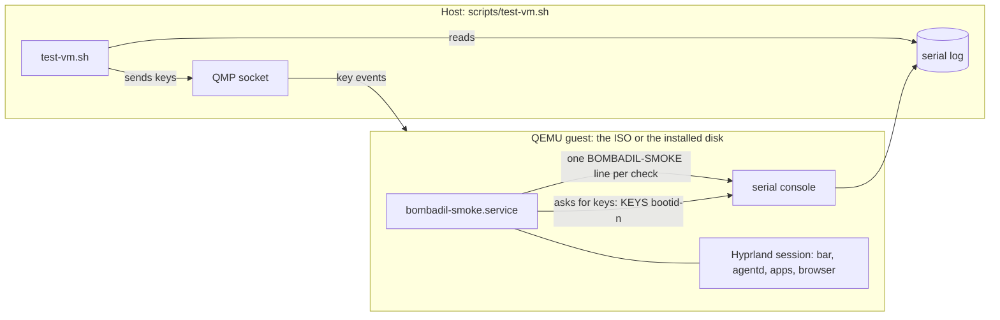

# Testing the whole system in a VM

Unit tests cover the Python and the QML that load without a compositor, and a headless desktop test
(`tests/desktop/run.sh`) drives the bar and the daemon in a sway session against a scripted model
API. Neither can say whether Hyprland focuses the pill, whether the units come back, whether an
install boots. That is the VM smoke test: it boots the real ISO, runs the real session and judges it
from the serial log.

## How it fits together



- The ISO carries `bombadil-smoke.service`, which runs only when the kernel command line has
  `bombadil.smoke`. Three boot entries set it: `bombadil.smoke` (live checks, then power off),
  `bombadil.smoke=install` (live checks, install to the virtual disk, power off) and, on the
  installed disk, `bombadil.smoke=undo` (session checks, then an undo round trip over a reboot).
- Each check prints `BOMBADIL-SMOKE: PASS name` or `FAIL name: <last 300 bytes of its output>` and
  the run ends with `DONE pass=N fail=M`. `scripts/test-vm.sh` exits 0 only when every log it
  collected ends with `fail=0` and holds no `FAIL`.
- A virtual machine cannot press keys itself. The guest asks: it prints `KEYS <bootid>-<n> meta_l`
  (a tap of Super; `meta_l+esc` is a chord; `b r o w s e r ret` types a word) and the host sends
  them over QMP (`scripts/qmp.py`), then the guest checks what happened. The boot id keeps the
  numbers of one boot apart from the next, which restarts the count (the undo round trip reboots).

```
scripts/build-in-container.sh              # the ISO, in out/
scripts/test-vm.sh                         # live checks
MODE=install scripts/test-vm.sh            # live checks, install to a scratch disk, boot it, undo
MODE=installed scripts/test-vm.sh          # boot the disk the last install run left (the undo's second boot)
TIMEOUT=5400 MODE=install scripts/test-vm.sh
```

Screenshots of the checks that take one (`SHOT name`) land in `out/test/`.

## What it covers

The session and its processes (`greetd`, Hyprland, the bar, `agentd`), the three user services and
that each is revived after being killed, the pill taking the keyboard from a Super tap and from
Alt+Space, a launcher word running without a model, the browser panel sliding in and out, apps
created and opened each in its own place, the sign-in round trip against a stand-in provider
(`fake_signin.py`: the page opens, the pill follows it, cancelling frees the port, no internet waits
and recovers), restore points being created and pruned, the installer, and the installed system
booting and undoing a change across a reboot.

The sign-in block deletes the person's provider choice and starts and cancels real logins (a Codex
login revokes the stored one), so it runs only on a system with no provider chosen: the live ISO,
never an installed system someone has signed in on. It says `SKIP signin` when a provider is named in
the config, and a fresh-ISO run that skips it fails.

## Traps

- **Software emulation is slow, and load shows.** Without KVM (`-accel tcg`) the guest is an order of
  magnitude slower, and anything else running on the host (a unit-test run, a second VM, a build)
  stretches the time from a Super tap to the pill taking over past the check's wait. Before a key
  the smoke waits for the guest's load to settle, and says `NOTE the machine was still busy` when it
  did not. Run nothing else while a VM run is in progress.
- **The CPU is `Nehalem` on purpose.** Mesa's software GL (llvmpipe) crashes on the AVX2 that QEMU
  emulates, in Hyprland and in Quickshell's render threads.
- **The pill is a layer surface**, so `hyprctl activewindow` cannot say whether it holds the
  keyboard. Judge by typing into it over QMP and looking at the screenshot.
- **`bombadil history` and `watch` wait for a key when they have a terminal**; the smoke runs them
  without one.
- **Replacing the daemon means replacing its unit.** The daemon is a user service that systemd
  starts again when it is killed, so the smoke stops the unit first, starts its own daemon with the
  environment a check needs, and starts the unit again afterwards (`agentd-restored`).
- **No `send-input-event` in this QEMU**; keys go through `send-key`.

## When a check fails

The `FAIL` line carries the tail of the check's output. Checks on the browser's page add a
diagnosis on failure (its processes, every target the debugging port lists, the profile's singleton
files, the daemon's last lines) and a screenshot; take the same habit for a new check that waits on
something visual: say what the machine looked like, not only that it did not match.
