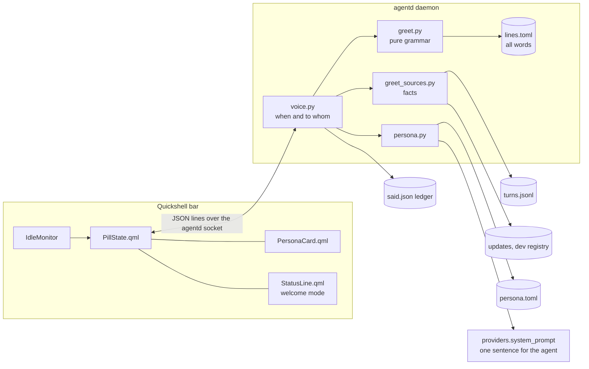

# The voice: a name, three voices, the welcome line

How Bombadil talks to the person using it, and how to build on that. The reasoning and the decisions
behind it are in [`design/voice-brief.md`](design/voice-brief.md); this page is how it is built and how
to extend it.

## Principles

Keep these when you change anything here.

- **Local, instant and true.** Every greeting, goodbye and empty-place line is built on the machine
  from facts it already has (the clock, the turn log, the update count, the coding-session registry).
  No model call is made to say hello. A line says only what is true, and says nothing when there is
  nothing true to say. Silence is a valid answer everywhere.
- **One line, one voice.** A greeting is one line of at most 100 characters above the pill. It never
  nags: it waits for the first touch, fades, and says each fact once.
- **Few choices.** One card, asked once, after sign-in: what to call you and which of three voices
  (Merry, Plain, Quiet). Every default is already valid, so skipping the card is fine.
- **Every word is data.** Sentences live in `share/voice/lines.toml`. Code holds the grammar and the
  ranking, never wording. A new voice, an invitation or an empty place is a table edit.
- **The user is the passenger.** The voice explains what happened while they were away and what waits on
  them. It does not decorate.
- **It never gets in the way.** A greeting is never shown over a card, a running turn or a window the
  user is typing in; a card never takes the keyboard from the pill on a Super tap or a click on the pill.

## What the user sees

| Moment | Where | Example (Merry) |
| --- | --- | --- |
| First sign-in | card above the pill | "What should I call you?" with three voice rows and samples |
| First hello, right after the card | line above the pill | "Welcome, Sam. Let's go for a walk!" |
| Login | line above the pill | "Good morning, Sam. Where to today?" |
| Back after 30+ minutes away | line above the pill | "Welcome back, Sam. While you were away: …" |
| Shutdown | the shutdown's start text | "Good night, Sam. batch stops at 14 of 20 and waits for you." |
| Empty place (history, Focus, desk …) | in the place | "Nothing to go back to yet. Undo starts after the first change." |

Keyboard on the card: type the name, Up and Down change the voice, Enter keeps the highlighted one,
Esc skips. Saying `voice` in the pill brings the card back with what is saved. "Call me Sam" and "be
less chatty" are ordinary requests: the agent edits `persona.toml`, which is narrated as "Changing how
I talk to you" and has no Undo button.

The time zone matters for wording: until the machine has a real (non-UTC) zone, greetings say "Welcome"
and no time-of-day word, because "Good morning" in the wrong zone is a lie.

## Architecture



| File | Job |
| --- | --- |
| `src/bombadil/persona.py` | `persona.toml` (name, voice, greet): validated, read per field so a broken file falls back to defaults, never stops agentd. Also the one sentence added to the agent's system prompt. |
| `src/bombadil/greet.py` | `build(moment, persona, now, facts=, ledger=)` is pure: same inputs, same line, no I/O or randomness. Holds the grammar `OPENER[, NAME]. BODY`, fact ranking, the ledger rule and the 100-character budget. `goodbye()` and `empty()` are its siblings. |
| `src/bombadil/greet_sources.py` | Readers that turn state into `Fact`s: finished turns, things you made, updates, coding sessions that were cut off. Each reader returns nothing when its source is missing or broken. |
| `src/bombadil/voice.py` | The agentd side: which bar gets what and when (see below). |
| `share/voice/lines.toml` | Every word. Sections per voice (`first`, `boot`, `night`, `long`, `back`, `away`, `bye`), plus shared `opener`, `join`, `clause`, `invite`, `fact`, `empty`, `empty_chip` and `reply`. |
| `shell/PersonaCard.qml` | The card. |
| `shell/PillState.qml`, `shell/StatusLine.qml`, `shell/shell.qml` | Message handling, the `welcome` line mode (waits for first touch, fades, hover holds), the idle monitor, and the keyboard hand-off between card and pill. |

### Protocol

Messages are JSON lines on the agentd socket, like the rest of the bar's traffic.

| Direction | Message | Meaning |
| --- | --- | --- |
| bar → agentd | `bar {idle}` | "I am a bar" (agentd cannot tell it from `bombadil ask`). Sent once per connection. |
| bar → agentd | `presence {idle}` | The bar's IdleMonitor: the user left or came back. |
| bar → agentd | `persona {name, voice}` / `persona_skip` | The card was answered or skipped. |
| bar → agentd | `welcomed {id}` | The line was actually shown. |
| agentd → bar | `persona_ask {line, name, voice, current, voices[]}` | Put the card up. `current` means a reopen with saved values. |
| agentd → bar | `persona {…}` | Broadcast after a save, so every bar folds its card. |
| agentd → bar | `welcome {id, text, first}` | Show this line. |

**A greeting counts only when the bar says it showed it.** The "greeted" marker for this login, the boot
row in `turns.jsonl` and the ledger are written when `welcomed` arrives, not when the line is sent. A
line the bar dropped is tried again at the next hello, and restarting agentd never replays one.

**When the card is asked.** When native sign-in turns ready and `persona.toml` is missing, `AgentD._set_access`
asks the voice. The card replaces the "Signed in" line, so the user is asked once, at the moment it makes
sense. Asking writes the defaults at once, so any way out of the card (Esc, a closed bar, a crash) leaves a
valid setting and the card is never asked twice. A bar that connects after the ask gets the card as soon as
it says hello.

**Moments.** `first` (right after the card), `boot`, `return` (the user was away 30 minutes or more),
`installed` (the first boot of an installed system, only where undo really works) and the goodbye.
A restart the user asked for is not an arrival and gets no hello. All waits use the monotonic clock, so a
stepped wall clock cannot move a window.

### Files

| Path | Holds |
| --- | --- |
| `~/.config/bombadil/persona.toml` | `name`, `voice`, `greet`. Its own file: `config.toml` is rewritten whole by other code, and `memory.md` is loaded by every coding session, where a voice would leak into code reviews. |
| `~/.local/state/bombadil/said.json` | The ledger: which fact was said when, the day setup finished, the last boot day. A fact is said once. |
| `$XDG_RUNTIME_DIR/bombadil/greeted` | Marker: this login has been greeted. |
| `~/.local/state/bombadil/turns.jsonl` | Boot rows (`kind: local`, `action: boot`) anchor "since last time". |

Environment overrides (used by the tests): `BOMBADIL_VOICE_LINES` (another words table),
`BOMBADIL_GREET_WINDOW`, `BOMBADIL_GREET_DELAY`, `BOMBADIL_IDLE_SECONDS`.

### The name is untrusted text

The name reaches the agent's system prompt and a TOML file, so it is checked and never escaped: one to
three words, 24 characters in all, made of letters, combining marks, hyphens, apostrophes and dots.
Control characters and characters that draw nothing (fillers, joiners, variation selectors) are rejected.
Session titles in a goodbye are cut, flattened to one line and counted against the 100-character budget
in the same way.

## Building on it

**Add a voice.** Add its id to `VOICES` in `persona.py` and a style sentence to `_STYLE`; add its
sections to `lines.toml` (copy `[plain]` and edit), a row in `[voices]`, `[card]` and `[reply]`. The card
lists voices from the table, so it appears on its own. `tests/test_greet.py` checks every voice for the
100-character limit and the "no `!` outside Merry" rule; extend that rule if yours differs.

**Add words for an empty place.** Put the sentence in `[empty]` and, if the place has one doorway,
a label in `[empty_chip]`, then ask for it where the place is drawn:

```python
from bombadil import greet
greet.empty("running")                              # "Nothing is running."
greet.empty("app", things="reminders")              # slots are named
```

QML gets the same text through whatever message the surface already receives; do not copy the sentence
into QML. `greet.empty` returns `None` when the table is missing a key: draw nothing rather than invent
a line.

**Add a source of facts.** Write a reader in `greet_sources.py` that returns `Fact`s and never raises,
give its `kind` a place in `greet.KINDS` (the ranking order) and a clause in `[fact]`, and call it from
`Voice._boot_facts` or the return path in `voice.py`. Facts marked `ALONE` lead the line with no hello
(failures and things put back); `AWAY` facts read as "While you were away: …".

**Change what the agent sounds like.** `persona.note()` is the only text added to the system prompt: one
sentence for the voice and a short pointer to `persona.toml`, so the agent can change it when asked.
Providers call `providers.system_prompt()`, so both Claude and Codex get it. Keep the voice to one
sentence and keep the name clause conditional ("use it only when greeting or asking").

## Tests

- `tests/test_persona.py`, `test_greet.py`, `test_greet_sources.py`: the pure parts, including every
  line of the table against the grammar.
- `tests/test_voice*.py`: the agentd side with fake bars, clocks and logs (timing, dropped lines,
  restarts, the card exchange, the goodbye).
- `tests/test_persona_card_qml.py`, `tests/test_welcome_qml.py`: the QML card and the welcome mode, offscreen.
- `tests/desktop/run.sh`: the card, the first hello, the `voice` word and the persona in the next turn's
  system prompt, in a headless sway with the real bar and the real Claude CLI against a scripted API.
- `iso/airootfs/usr/local/bin/bombadil-smoke`: the card's keyboard hand-off, the idle monitor under
  Hyprland and the poweroff goodbye, inside the booted ISO (`scripts/test-vm.sh`).

## Not built yet

- A "Set my time zone" chip that shows only while the zone is unset, and a "Welcome home" line that
  reads the installer's record of how the zone was found. They wait on the installer recording it.
- Empty-place wording on surfaces that live on other branches. The words are in the table; each surface
  calls `greet.empty` when it lands.
