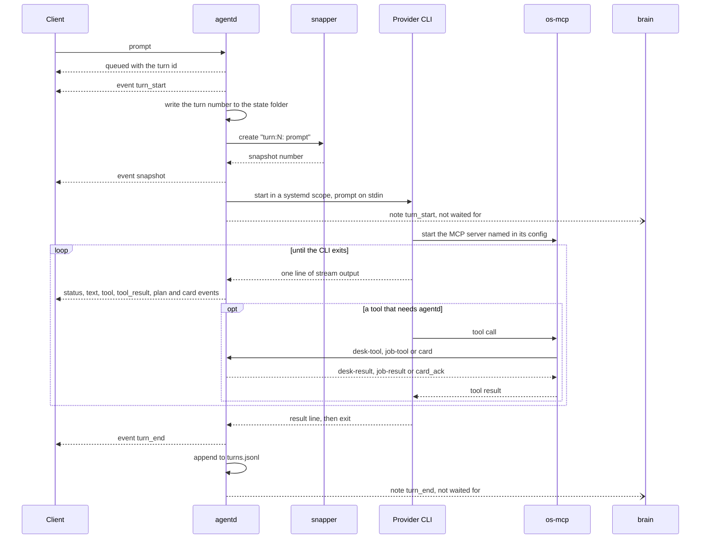
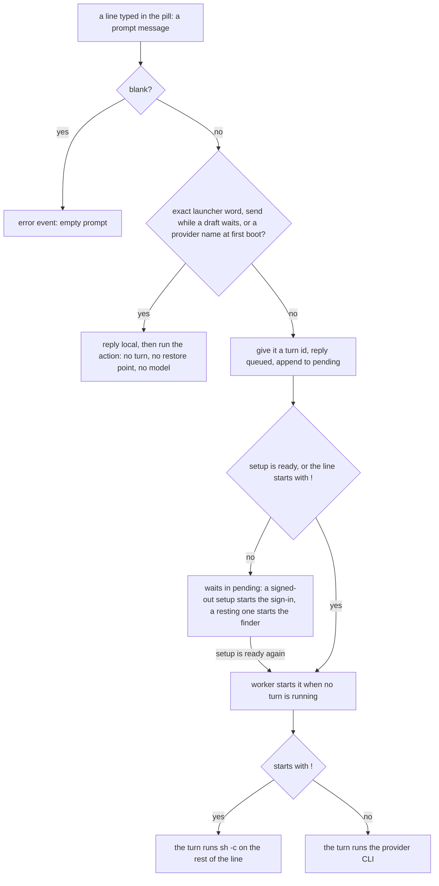

# agentd

> **Status:** Shipped
> **Code:** `src/bombadil/agentd.py`, `src/bombadil/providers.py`, `src/bombadil/launcher.py`, `src/bombadil/procs.py`, `src/bombadil/config.py`, `src/bombadil/paths.py`, `src/bombadil/rest.py`, `src/bombadil/finder.py`, `src/bombadil/vitals.py`, `src/bombadil/notices.py`, `src/bombadil/outbox.py`, `src/bombadil/mail/tools.py`, `src/bombadil/mail/watch.py`, `src/bombadil/brain/client.py`, `bin/agentd`, `bin/bombadil`
> **Design:** [UX brief, piece 1](../design/ux-brief.md#1-you-can-see-what-it-is-doing-as-it-happens) and [piece 2](../design/ux-brief.md#2-the-pill-is-the-launcher-and-stop-means-stop), [Foundation choices, section 4](../design/foundation-choices.md#4-how-the-agent-runs-as-the-os--clis-official-agent-clis-as-the-engine-our-own-daemon-around-them), [The poor man switch, piece 1](../design/poor-man-switch-brief.md#1-resting-the-machine-knows-it-is-out-holds-your-asks-and-has-a-switch) and [piece 2](../design/poor-man-switch-brief.md#2-the-pill-still-answers-things-found-on-the-computer)
> **Verified:** 2026-10-01 against `main` at `969b80b`

`agentd` is the session daemon: it listens on a Unix socket for newline-delimited JSON, runs one turn at a time by starting the provider's own CLI (Claude Code or Codex) in full-access mode with the OS tools attached, and broadcasts everything that happens to every connected client (the shell, `bombadil ask` and os-mcp). The vendor CLI does the thinking and the tool use; agentd answers the words that must never wait for a model (open, stop, undo, the Brain's two, `!command`) and owns the restore point, Stop, the turn log and the `resting` state that make full access safe to give and an AI that runs out survivable. Everything the shell shows about a turn is made from the events this page lists, and the same log is what [the brain](brain.md) learns turns from.

## How it works

### One turn



What happens to a prompt that becomes a turn, in order (all of it in `src/bombadil/agentd.py`):

1. A `prompt` that is not a launcher word gets the next turn id and goes on the `pending` list. The sender is told `{"type": "queued", "turn": n}` at once. The single `_worker` task takes the first prompt that can run (setup is `ready`, or the line starts with `!`) when no turn is running. A prompt that comes from a process inside an agent's turn (agentd reads the peer's pid with `SO_PEERCRED` when the client connects and again when it sends) is marked `asked_by: "agent"`, and a turn with an `asked_by` has no typed words: `turn_prompt` is `None`, so the desk and mail gates treat it as nobody's request.
2. `turn_start` goes out before anything slow. The restore point is saved after it, so something true is on screen while snapper works.
3. If the provider's CLI is not installed (and the line is not a `!` command), the turn says so with an `error` event and ends with an empty `turn_end`. No line is added to `turns.jsonl` for it.
4. The turn counter `turns` goes up, and the new number `n` is written to `<state dir>/turn` (`_mark_begun`) before snapper and the brain hear of it. A `TurnFiles` starts to collect the files the turn's own tool calls write and read. `launcher.clear_undo()` runs (it keeps the undo marker while an undo still waits for its restart), and, unless the line starts with `!` or `explain` is `brief`, a capture of the network, disks, sound and screens starts in the background for the receipt.
5. If the snapshot object says `available`, the status line says "Saving a restore point", `Snapshots.create("turn:<n>: <first 60 characters of the prompt>")` runs off the event loop and a `snapshot` event carries its number. A failing `snapper create` (a non-zero exit) is an `error` event ("no undo point for this turn: ...") and the turn goes on. Any other exception from it ends the turn through the worker's handler: an `error` event and a short `turn_end`, the CLI never starts, and no line goes to `turns.jsonl`, but the number `n` stays used. See [restore-points.md](restore-points.md) for what snapper and `bombadil-rollback` do.
6. If Stop arrived while the restore point was saved, the CLI never starts: `turn_end` with `stopped: true`, and the turn is logged with its `n` and a null `unit`. The brain gets a `turn_end` note, and no `turn_start` note.
7. The command is built by the provider (see Providers below). If the person did things without the model since the last turn (a launcher word, a desk gesture, a job that ended, a press on Send that went), they are put in front of the prompt as `[Done by the user without you since your last turn: ...]`. A run the account's limit cut off carries `[The last try stopped at a usage limit after: ...]` as well. A `!` line takes neither.
8. The CLI starts in its own systemd user scope. As soon as the process exists a `turn_start` note goes to the brain (`n`, the scope name, the prompt, the start time), so it can name the turn's writes while they happen. The prompt is written to the CLI's stdin and stdin is closed. The status line says "Waiting for Claude" (or Codex, Fake). Every stdout line goes to `provider.parse`; each event goes through `_on_event`, which keeps the limit hints (`meta`, `limit`, `retry`) for the account check, replaces what a mail tool returned with a placeholder (`_without_mail_text`), feeds the `Narrator` (the live line, the plan), `TurnFiles` and the card follower, then broadcasts it.
9. When the process exits, agentd lets the output drain for at most `OUTPUT_GRACE` (1 s), asks the adapter for its `finish()` events, reads stderr for at most 1 s and, if the exit was not clean and neither an error nor a good result was reported, sends an `error` event with stderr's last 2000 characters or `<cli> exited with <code>`.
10. `turn_end` closes the turn and one line is appended to `turns.jsonl`. Then a `turn_end` note goes to the brain, after the row, because the brain reads the row from the log. After it, a receipt card may follow: a before and after of what the turn changed in the network, a service, the disks, the sound or the screens. See [cards-and-pictures.md](cards-and-pictures.md). A turn the account's limit refused is the exception: it has no `result` or `error` event, its `turn_end` and its row carry `requeued: true` (when it is to run again) and its `line` says what it changed, no receipt follows it, and when it changed nothing `Launcher.skip_restore_point` makes Undo step past its empty restore point.
11. The worker clears `current` and broadcasts `status`. A turn the limit refused goes back to the front of the queue and the machine rests ([Resting](#resting-and-the-finder)). If the CLI said the login is gone, agentd signs in again and runs the same prompt once more ([browser-and-signin.md](browser-and-signin.md)).

A turn has two numbers. The id (`queued.turn`, the `turn` of every event, the event-log file name, the scope name, and what `details` and `open` of kind `turn` take) comes from `next_id` and starts again at 1 when agentd starts. The turn number `n` (`status.turns`, `n` in `turns.jsonl`, the `turn:<n>` of the restore point, the brain's turn key) is `AgentD.turns`. At start it is the larger of `_last_turn` (the highest `n` in `turns.jsonl`; a row without an `n`, and a half-written row, each count as the next number) and the number in `<state dir>/turn`. So it goes on after a restart, also past a turn that a crash cut off before its row.

### Where a typed line goes



`launcher.match` decides the second diamond. It is exact on purpose: after lowercasing and trimming, the whole line must be a known word, with an optional verb in front. A parser that guesses would give the machine two brains that sometimes disagree. A line that starts with `!` never matches, whatever follows. A line in another script, or with extra words, goes to the agent. The words are in the launcher table under Interfaces. Typed `send` words (`launcher.is_send_word`: `send it`, `yes send`, `send that now`) are a launcher word only while the mail service says a draft waits (`_draft_waiting`, asked for `DRAFT_CHECK_SECONDS`, 1 s); the answer is `Sending is yours. It's under the pointer.` and the Mail window opens on the draft, because only a press sends ([mail.md](mail.md)). With no draft, or no mail service, the line goes to the agent.

A launcher action runs beside the socket reader (`_background`), so a `stop` sent right after it is read at once. `AgentD.local` sends it one of three ways. `why`, `picture`, `signin`, `provider`, `rest` ("pause claude", "resume the ai") and `stop` need agentd's own state and are done in place. `undo`, `restart` and `shutdown` first raise `_hold`, so no queued turn starts until the action is done, then take the `_exclusive` lock, stop the running turn and wait until it has ended, run the action, and lower `_hold`: an undo that raced a turn would roll back to that turn's own restore point. Everything else goes to `Launcher.run`, which calls Hyprland, the apps, snapper and the brain directly, in a worker so the event loop stays free. What the next model turn is told for the brain's two words is a fixed phrase (`BRAIN_NOTES`: "opened the Brain", "the brain answered in the line"), not the brain's sentence: its answers quote titles that other people wrote, so the model hears that it was asked and not what was said.

### One turn at a time, and the queue

- There is one `_worker` task, so there is one running turn (`current`) and the rest wait in `pending`, a list of `(turn id, prompt)`. Turn ids come from `next_id`, assigned when the prompt is accepted, so they follow the order of asking.
- `queued` events are broadcast when something is already running or waiting, or when the prompt must wait (for sign-in, or for the AI while it rests). The shell draws them as grey chips. `{"type": "unqueue", "turn": n}` removes one and broadcasts `unqueued`.
- `_next` takes the first prompt that is runnable, so a `!` line passes over prompts that wait for sign-in. Stop does not empty the queue: the next prompt starts when the stopped turn has ended.
- Cancelling a sign-in drops the prompts that waited for it (`_drop_waiting`, an `unqueued` event each). A turn that found its login gone goes back to the head of the queue once, and a turn the account's limit refused goes back to the head and runs again when the limit lifts.
- The queue and its ids are in memory and start again at 1 when agentd starts. The turn counter does not (see the two numbers above).
- A prompt accepted while setup is `signed_out` and not a `!` line also starts the sign-in, and runs after it ([browser-and-signin.md](browser-and-signin.md)). While setup is `checking`, `choose`, `offline`, `signing_in` or `resting` it only waits.
- `status.busy` is true from the moment a runnable prompt is accepted, so Esc stops it even before its turn has started.

### Stop

`{"type": "stop"}` (or `cancel`), the launcher words `stop`, `cancel`, `stop it` and `stop that`, and `bombadil stop` all end in `AgentD.stop()`. It returns at once and the work is done in the background:

1. With no turn running, Stop cancels a sign-in in progress; otherwise it returns false and the launcher word answers "Nothing is running."
2. With a turn running it sets `stopping`, takes the closing line from the `Narrator` ("Stopped while installing docker."), sends a `status` "Stopping", and hands the process to `procs.Stopper`. From then on the turn's own status, plan and failure events are suppressed: a Stop is not reported as an error.
3. `Stopper.stop` finds every process of the turn: the descendants of the CLI, everything in its scope's cgroup (`bombadil-turn-<agentd pid>-<turn id>-<seconds>`) and its process group. It spares the windows the turn opened: processes started with `--class=bombadil-browser`, `--app-id=bombadil-terminal` or `--app-id=bombadil-details`, `nautilus` and `bombadil-app run <name>`, and their children (`PROTECTED_ARGS`, `_is_window`).
4. Everything else gets SIGINT first, so the CLI saves its conversation and `sudo` relays the signal to a root command. After 3 s (`grace`), what is left gets SIGTERM, then SIGKILL after 1 s. A root process with no `sudo` to relay goes through `sudo -n kill`.
5. `pacman` is the exception. A pacman that was running when Stop began is never sent SIGTERM or SIGKILL (one that starts during Stop is treated like any other process). The rest of the turn is frozen (SIGSTOP), pacman gets SIGINT and finishes its package for as long as that takes (up to `pacman_grace`, 900 s), the status line says "Stopping after this package", and only then is the rest stopped. A stale `/var/lib/pacman/db.lck` is removed if no pacman runs.
6. Without a systemd user manager (`BOMBADIL_NO_SCOPE=1`, no `/run/systemd/system`, or a failed probe at start) the turn is just the CLI's process tree and process group.

### The restore point

The restore point is taken in `AgentD.turn`, after `turn_start` and before the CLI starts, for every turn that gets that far: model turns and `!` lines alike. Launcher words take none. Its number goes out as a `snapshot` event, into `turns.jsonl` as `snapshot`, and into the CLI's environment as `BOMBADIL_TURN_SNAPSHOT`, so that "undo that" run by the agent rolls back past this turn's own restore point and not to it. The launcher word `undo` is handled by agentd itself (`Launcher._undo`), with no model turn. With `snapshots = false` in the config, or without snapper and its `root` config, `Snapshots.available` is false and the turn skips the step.

### Resting and the finder

When the account, not the request, is the problem (a plan window used up, a spending cap hit), agentd does not fail each ask in turn. It puts the setup in the state `resting`, holds every ask that needs the AI as a waiting chip, and runs them when the limit lifts. [poor-man-switch.md](poor-man-switch.md) has the design and the pill's side; this is what agentd does. `src/bombadil/rest.py` holds the state file, the reading of a provider's reset time and every line the machine says about resting.

| Step | What happens |
|---|---|
| Noticing | `Provider.limit(result, seen)` is asked of a failed `result` of a model turn, never of a `!` line. `Claude` reads the turn's `rate_limit_event` (kept as a `meta` event), the assistant's `rate_limit` or `billing_error` message (`limit`) and the result's HTTP 429. `Codex` reads the failed result's words. `Provider.waiting(retry, seen)` catches a Claude CLI that sleeps until the reset (a 429 `api_retry` of five minutes or more while the window reads rejected): agentd ends that process (`_stop_proc`). A busy moment (a 529, the throttle notice, an entitlement check) is none of these and stays an `error` |
| Remembering | `_refused` writes `<state dir>/rest.json` first, so a restart finds it (`rest.set_limit`), then sends a `rest` event. The turn ends with no `result` or `error` event. `_rest_turn` puts the ask back at the front of `pending` under the same id (`queued` again), keeps a note of what it had changed for its rerun (`_resume_notes`, at most six lines) and `_settle` moves the setup to `resting` |
| While it rests | `_runnable` is false for everything except `!` lines. `setup` and `status` carry `rest`, and each waiting entry of `status.queue` carries `wait` (the chip's label: `15:00`, `Thu 09:00`, `paused`, `limit`). Launcher words, `!` lines, apps, the browser and the desk never look at the state. An ask from an app (`[from app NAME]`) that must wait replaces that app's older waiting ask (`unqueued` with `replaced: true`). A line typed in the pill (not from an app or an agent, not a `!` line) starts the finder (`_find_for`) |
| Ending | `_rest_watch` compares the wall clock with `until` plus `rest.RESET_GRACE` (60 s) every `REST_POLL` (60 s) and calls no provider: the first waiting ask is the check, and if it is refused the machine rests again. A pause by hand has no time and lasts until `resume`. The chips are `setup_action` ids `resume` (a pause), `raise` (a spending limit, or a limit with no time: opens the provider's usage page in the browser panel, then the chip says `Try again`) and `retry` (clears the limit). `use claude` ends a pause, and a sign-in that finishes clears the limit but not a pause |

A pause is typed (`pause claude`, `resume the ai`: launcher action `rest`, `AgentD.rest_word`) or sent from the AI card: `{"type": "ai", "op": "pause"|"resume", "provider": name}`. `{"type": "ai", "op": "get"}` answers with one `ai` message, and every client gets a new one when a rest changes. Each row is `{name, title, state, text, on, enabled, current}`, with `state` one of `ready`, `limit`, `paused`, `signed_out` and `missing`.

The finder (`src/bombadil/finder.py`) is pure: no model and no network. `finder.find(text)` scores the sentence against the apps (title and description), the panels, widgets and show-only commands (`finder.SHOWS`) and the successful asks in `turns.jsonl`, and returns at most `finder.LIMIT` (3) matches of kind `app`, `word` or `ask`. They go to every client as one `found` message with a line such as "Kept for 15:00. Found on this computer:". A press sends `found_open` (`turn`, `id`). Only a chip that was offered for an ask that still waits opens anything: a word or app opens as if it had been typed, a past ask shows its steps in the details drawer (only a log under `<state dir>/turns/`), and the kept ask is then dropped. A chip that cannot open leaves the ask kept and the chips are said again.

### Mail, notices and the press

Mail is another service (`bombadil-mail`, its own process on `mail.sock`). agentd is its client in five places, and each costs nothing when the service is absent. [mail.md](mail.md) has the rest.

- **The agent's tools.** The `mail-tool` message reaches `mail.tools.Broker` (`_mail_tool`) for `mail_search`, `mail_read`, `mail_mark`, `mail_draft` and `mail_show`. Like `desk-tool` it works only in the running turn that is not being stopped, it is always answered (`mail-result`, cut at `MAIL_ANSWER_CHARS`, 60,000 characters), and there is no tool that sends. The turn's typed words go with every draft, so the service can tell an address the person wrote from one a mail asked for. What `mail_read` and `mail_search` return reaches the model, and is replaced by `[mail text not kept]` before the event is logged or sent to a client (`_without_mail_text`).
- **The press.** The `press` message reaches `Outbox.press` (`_press`). It is refused when the sender cannot be named or is a process of an agent's turn (the turn's scope cgroup, or its process tree when there is no scope), and otherwise calls the performer for `kind` once with a limit of 90 s (`outbox.PERFORM_SECONDS`). Every press is one row in `<state dir>/presses.jsonl`, with no mail text. `press_result` goes to the sender, the receipt becomes a notice, and the next turn is told `the person pressed Send: ...`.
- **Notices.** `Notices` (`src/bombadil/notices.py`) is a stack of at most `MAX_NOTICES` (4) lines with up to three chips and an optional time to live. Each change goes to every client as `notice` (again with the same `id` when it changes) or `notice_end`, and a client that connects is given the live ones after `setup`. `notice_action` and `notice_dismiss` do nothing unless the client is the person's, not a process of an agent's turn (`_persons`); a chip whose handler fails says why on its notice.
- **The watch.** `mail.watch.Watch` keeps one subscription to `mail.sock`: one connect attempt every `RETRY_SECONDS` (5 s) while the service is absent, a ping after `IDLE_SECONDS` (45 s) of silence. `Says` turns a push (new mail from someone the person knows, a draft that is ready, a receipt, a view somebody wants shown) into a notice, or brings the Mail window in (`_mail_window`, not twice within `MAIL_WINDOW_DEBOUNCE`, 2 s).
- **The words.** `mail`, `email` and `inbox` open the Mail window (`Launcher._mail`), checked before the person's own apps; `send` is described above.

### The Machine card

The Machine card is made by `src/bombadil/vitals.py`; agentd runs its loop (`_vitals_loop`). `Vitals.tick()` takes one sample in a worker thread and agentd broadcasts the `machine` message only when it differs from the last one sent. It samples only while a client is connected and `machine` is not among the desk's hidden widgets, waits `Vitals.next_delay()` between samples (5 s when calm, 2 s near a line, 1 s while the card is up or was asked for), and forgets its readings, taking a card that is up away, when the last client goes or Machine is put away. `{"type": "desk", "op": "get"}` answers with the card when it is up, `{"type": "vitals", "op": "get"}` asks for it again, and `{"type": "vitals", "op": "open", "row": "disk"}` draws the disks picture with no model. `show machine` and the questions `how's the machine` and `how is my computer` raise the card for 30 s even when nothing is wrong (`Desk.on_ask`, `Vitals.ask`). `BOMBADIL_VITALS=0` switches the loop off. The card's rows and lines are in [desk.md](desk.md).

### Providers

A provider adapter (`src/bombadil/providers.py`) builds the command for one turn and turns the CLI's output lines into events. The CLI flags live only there.

| | `Claude` | `Codex` | `Fake` | `Shell` |
|---|---|---|---|---|
| Registered | `PROVIDERS["claude"]` | `PROVIDERS["codex"]` | `PROVIDERS["fake"]` | no: made by agentd for a `!` line |
| Binary | `claude` | `codex` | `$BOMBADIL_FAKE_PROVIDER`, else `cat` | `sh` |
| Prompt | on stdin | on stdin (`-` as the last argument) | on stdin | none: `sh -c <rest of the line>` |
| Full access | `--permission-mode bypassPermissions --dangerously-skip-permissions` | `--dangerously-bypass-approvals-and-sandbox` | not applicable | runs as the user |
| os-mcp | `--mcp-config <state>/claude-mcp.json --strict-mcp-config` | `-c mcp_servers.bombadil-os.command=...` and `-c mcp_servers.bombadil-os.env_vars=[...]` | none | none |
| System prompt | `--append-system-prompt` | `-c developer_instructions=...` | none | none |
| Resume | `--resume <session id>` | `exec resume ... <session id> -` | none | none |
| Plan tools | env `CLAUDE_CODE_ENABLE_TODO_TOOLS=1` | `-c tools.update_plan.enabled=true` | none | none |
| Silence allowed | 30 s (`quiet_factor` 1.0) | 180 s (`quiet_factor` 6.0) | 30 s | no watchdog |

Claude, as built by `Claude.command`:

```sh
claude -p --output-format stream-json --verbose --include-partial-messages \
  --permission-mode bypassPermissions --dangerously-skip-permissions \
  --mcp-config <state dir>/claude-mcp.json --strict-mcp-config \
  --append-system-prompt "<system prompt>" [--model <model>] [--resume <session id>]
```

A comment in `Claude.command` gives the reason for `--strict-mcp-config`: without it the account's own connectors (mail, drive) load beside the OS tools and end replies with notices to authorize them. `--include-partial-messages` is what lets the live line show the reply and each tool call as they are written.

Codex, as built by `Codex.command`, fresh and resumed:

```sh
codex exec --json --dangerously-bypass-approvals-and-sandbox <overrides> -C <cwd> -
codex exec resume --json --dangerously-bypass-approvals-and-sandbox <overrides> <session id> -
# <overrides> = -c mcp_servers.bombadil-os.command="<os-mcp>" -c mcp_servers.bombadil-os.env_vars=[...]
#   -c developer_instructions="<system prompt>" -c tools.update_plan.enabled=true
#   --skip-git-repo-check [--model <model>]
```

The overrides are the same on a fresh and a resumed turn; a comment in `Codex.command` says a resumed turn without them loses the OS tools (`tests/test_providers.py` asserts they are present on a resumed command). `resume` takes no `-C`; agentd already starts the CLI in the turn's `cwd` (the home folder, `Turn.cwd`).

**Session resume.** `AgentD.session_id` is the provider's conversation id. It is adopted only from a `result` that worked (Claude's result line carries it, Codex's comes from `thread.started`), so a dead id is not kept. It is cleared when the person switches provider, and when the CLI says the conversation is gone (`num_turns == 0` or "no conversation found"), with a plain note on the error. It is held in memory and is not restored at start. It is only recorded in `turns.jsonl` as `session`.

**How os-mcp is passed in.** agentd never starts os-mcp. It chooses the command (`providers.get`: `bombadil-os-mcp` on `PATH`, else `bin/bombadil-os-mcp` in the checkout), registers it with the CLI as the MCP server `bombadil-os`, and gives the CLI the environment the server needs to call back: `BOMBADIL_TURN`, `BOMBADIL_SOCKET` and, when a restore point was taken, `BOMBADIL_TURN_SNAPSHOT`. The CLI starts the server as its child. A comment on `MCP_ENV` says Codex starts MCP servers with only a few variables (`HOME`, `PATH` and the like), so the adapter lists what to forward there. If Claude's `init` line does not report `bombadil-os` as `connected` or `pending`, the adapter yields an `error` event ("the OS tools did not start"). The tools themselves are in [os-mcp.md](os-mcp.md).

**The system prompt** is built by `providers.system_prompt()` and sent on every turn, fresh or resumed, to both CLIs. It says who the agent is, to use the `bombadil-os` tools, where the QML kit and the `bombadil-apps` skill are (`kit_paths()`: the checkout's `share/`, else `$BOMBADIL_SHARE/share`, `$BOMBADIL_SHARE`, else `/usr/share/bombadil/share`), that the agent has full access with passwordless sudo and should not ask, how to install packages (`sudo pacman -Syu --noconfirm --needed`, never `pacman -Sy` alone), that the final reply is at most four plain lines, to write a plan first for three or more steps, to give a one-sentence reason before each step that changes the machine, and to show answers that have parts as a picture (`system_map`, `show_card`) with one line after.

**The plan.** The plan on the desk is made from the CLI's own task list. Claude's `TaskCreate`, `TaskUpdate`, `TaskList` and `TodoWrite` calls need `CLAUDE_CODE_ENABLE_TODO_TOOLS=1` on some models (set by `Claude.env()`). Codex's `todo_list` items are translated to a `TodoWrite` call by the adapter (`_codex_todos`), and `update_plan` is switched on in its config. The `Narrator` keeps the table and agentd sends it as a `plan` event whenever it changes.

**`Shell` and `Fake`.** A line that starts with `!` is run by a `Shell` adapter that agentd makes for it: `sh -c <rest of the line>` in the home folder, stderr merged into stdout, no provider environment, and a restore point first like any other turn. `parse` turns each non-blank output line into an `output` event, and `finish` closes with a `tool_result` (id `shell`, the last 200 lines) and a `result` whose failure text ends in `(exit N)`. `Fake` is for tests and for running the shell with no provider (`BOMBADIL_PROVIDER=fake`): it runs `cat`, so it answers `echo: <prompt>` as a `text` event and a `result`. It is always installed, declares no os-mcp, and is not in `config.PROVIDERS`, so a config file cannot name it.

**One-shot descriptions.** `Provider.describe_command(model=None)` is not part of a turn. The brain runs it for its one-line descriptions of things (`brain/describe.py`, `_provider_run`), with the prompt on stdin and the answer on stdout. `Claude` returns `claude -p --model haiku --output-format text --tools "" --strict-mcp-config --no-session-persistence --safe-mode --system-prompt <short prompt>`: no tools, no MCP servers, nothing saved, and the user's memory and hooks kept out. `Codex` returns `codex exec --skip-git-repo-check --sandbox read-only [--model <model>] -`: a read-only sandbox, so it may look and may not change anything, but no flag switches off its tools, its MCP servers or its saved session. The base class raises `NotImplementedError` and `Fake` does not override it. See [brain.md](brain.md).

### Starting it

| Where | How |
|---|---|
| Live ISO and installed system | The session's Hyprland config runs `agentd` on `hyprland.start` (`iso/airootfs/etc/skel/.config/hypr/hyprland.lua`). The ISO build copies the tree to `/usr/share/bombadil` and links `/usr/local/bin/agentd` to `/usr/share/bombadil/bin/agentd` (`scripts/build-iso.sh`). Nothing restarts it if it dies. See [iso-and-install.md](iso-and-install.md). |
| Start by hand, or restart | `hyprctl dispatch 'hl.dsp.exec_cmd("agentd")'` starts one, and `bombadil-setup` runs the same dispatch when no agentd answers. It does not replace a running agentd: stop that one first (`restart_agentd` in `iso/airootfs/usr/local/bin/bombadil-smoke` does `pkill -u user -f 'bin/agentd'` and waits for it to end). |
| Development | `BOMBADIL_PROVIDER=fake bin/agentd`, or `scripts/dev-session.sh`, which defaults `BOMBADIL_PROVIDER` to `fake`, starts `bin/agentd`, then the shell, and points `BOMBADIL_SHARE` at the checkout's `share/` folder. On a live session set `BOMBADIL_SOCKET` (or `BOMBADIL_RUNTIME`) to a different path first, or the new agentd takes over the live one's socket path. See [development.md](../contributing/development.md). |

`bin/agentd` puts `src/` on `sys.path` and calls `bombadil.agentd.main`, which reads no command-line arguments. `main` loads the config, picks the provider (`BOMBADIL_PROVIDER` first, then `provider`), builds `AgentD` with `auto_signin=True` and serves. At start `serve` calls `check_access(start=True)`: when a provider is chosen and signed out, agentd starts its sign-in by itself, with no prompt typed (with no network the state is `offline` instead), and when none is chosen it asks which AI (setup state `choose`). An `AgentD` built directly defaults to `auto_signin=False` and then only reports `signed_out`. See [browser-and-signin.md](browser-and-signin.md). A provider whose CLI is missing does not stop it: agentd keeps serving so the bar can say what is missing. `SIGTERM` ends a sign-in it started, closes every client and stops. On start it removes any file at the socket path, live or stale: it does not check that nobody listens, so a second agentd leaves the first running with no socket. It then probes for systemd scopes once (`procs.scope_supported`), so the first Enter does not pay for it. `main` also starts a background read of the machine's unit file names (`sysmap.warm_unit_names`), so the first "what does networkmanager need" does not wait for `systemctl list-unit-files`.

## Interfaces other pieces depend on

### The socket

| | |
|---|---|
| Path | `paths.socket_path()`: `$BOMBADIL_SOCKET`, else `<runtime dir>/agentd.sock`, where the runtime dir is `$BOMBADIL_RUNTIME`, else `$XDG_RUNTIME_DIR/bombadil` (`/run/user/<uid>/bombadil` when the variable is not set) |
| Framing | one JSON object per line, in both directions. A line that is not JSON or not an object is skipped. A message with an unknown `type` is ignored without an answer. A line that is not valid UTF-8, and a line longer than 65,536 bytes (the asyncio stream limit, which `serve` leaves at its default), end the connection without an answer, so a client that sends a long prompt or a `card` keeps it under that. |
| Greeting | on connect, in this order: `status`, `entries`, `setup` |
| Broadcast | every `event`, and `status`, `setup`, `entries`, `desk`, `jobs`, `summon`, go to every client. A reply to one request goes to the sender only. |
| Slow clients | each client has a queue of `CLIENT_BACKLOG` (10,000) messages and each write gets `SEND_TIMEOUT` (5 s). A client that stops reading is dropped, so it cannot hold up the others. |
| A message that raises | the sender gets an `error` event ("agentd could not handle that: ...") with `turn: null`, and the connection stays open. A line over the size limit or one that is not UTF-8 is not this case: it closes the connection. |
| Access | agentd sets no mode on the socket and does not check who connects. |

### Messages a client sends

| `type` | Fields | What agentd does | Answer |
|---|---|---|---|
| `prompt` | `text`; optional `asked_by` (a helper's name, `[a-z][a-z0-9_-]{0,23}`, for a turn a coding session asked for) | routes the line (diagram above) | launcher word: `{"type": "local", "action": kind}` to the sender, then `local` events. A turn: `{"type": "queued", "turn": n}` to the sender. Blank: an `error` event "empty prompt" to the sender |
| `stop`, `cancel` | none | `AgentD.stop()` | the turn ends with `turn_end`; nothing if idle |
| `unqueue` | `turn` | drops a waiting prompt | `unqueued` event and `status`, only if one was removed |
| `local` | `action`: one of the names in `CORE_COMMANDS`, `BRAIN_COMMANDS` or `UTILITY_COMMANDS` | runs that launcher action (the Undo button) | `local` events; an unknown name is ignored, and there is no `{"type": "local"}` reply as there is for a typed word |
| `details` | `turn` (optional) | opens the turn's log in [the details drawer](#the-details-drawer) (`bombadil watch --file`, `--follow` for the running turn); again while it shows closes it | `local` event with `action: "details"` only on failure |
| `close_details` | none | closes the drawer | none |
| `open` | `kind`: `path`, `unit`, `package`, `url` or `turn`; `value` | checks again with `cards.check_opens`, then opens it | `path`, `unit`, `package` and `url` answer with a `local` event, `action: "open"`, and so does a value that fails the check. `turn` opens the details drawer and answers only on failure (`local` with `action: "open"` when the turn's log is not kept, or `action: "details"`) |
| `summon` | optional `text`: words to finish in the pill (the Brain's "Ask about this"). `_pill_words` turns every non-printable character into a space and cuts it to 500 characters | broadcasts `{"type": "summon"}`, with `text` only when some is left after that | every client |
| `card` | `card` | `cards.accept`, then draws it | `{"type": "card_ack", "shown": bool, "errors"?: [...]}` to the sender; `shown` is true when a client besides the sender is connected |
| `desk` | `op`: `get`, `fold`, `hide`, `show`, `move`; `widget`, `rail`, `rank` | `get` answers; the others change the desk | `desk` state to everyone on change. `get` also sends the plan of a running turn and the `jobs` table |
| `desk-tool` | `id`, `turn`, `op` (`show`, `hide`, `move`, `fold`, `unfold`, `state`; any other value is refused with a plain sentence), `widget`, `rail`, `rank` | the os-mcp `desk` tool; refused unless `turn` is the running turn, not being stopped, and its typed words asked for the desk | `desk-result` to the sender |
| `jobs` | `op`: `get`, `stop`, `dismiss`, `why`; `id` | acts on the jobs table, never through the model | `jobs` table; `why` opens the output in the drawer |
| `job-tool` | `id`, `turn`, `op`: `start`, `list`, `stop`; `title`, `command`, `kind`, `seconds`, `job` | the os-mcp `job` tool; `start` needs the running turn | `job-result` to the sender |
| `status` | none | reads the state | `status` |
| `setup_action` | `id`: `provider:<name>`, `signin`, `show`, `cancel`, `wifi` | a chip under the setup line | `setup` and `status` |
| `signin` | `provider` (optional) | signs in, or switches provider first | `setup` messages |
| `open_url` | `url` (http, https or file), `signin` (optional id) | opens the browser panel; a link of the running sign-in goes to that sign-in | none, or an `error` event |

The desk and the jobs table are in [desk.md](desk.md); sign-in in [browser-and-signin.md](browser-and-signin.md); `card` and `open` in [cards-and-pictures.md](cards-and-pictures.md).

### Messages agentd sends

| `type` | Fields | Sent |
|---|---|---|
| `status` | `busy`, `provider`, `setup`, `turns` (the turn number `n`), `snapshots` (is a restore point possible), `queued` (count), `turn` (running id or null), `queue` (`[{turn, prompt}]`) | on connect, on request, and after every change to the queue, the turn or the setup |
| `entries` | `entries`: `[{name, title, kind, words}]` with `kind` `app`, `panel`, `widget` or `command` | on connect, and again when the apps in `BOMBADIL_APPS` change (looked at every 3 s) |
| `setup` | `state`, `provider`, `title`, `line`, `tone`, `actions` (`[{id, label, style}]`), `phase`, `view` | on connect and on every change. `state` is `choose`, `checking`, `signed_out`, `offline`, `signing_in` or `ready` |
| `queued` | `turn` | to the sender of a `prompt` that became a turn |
| `local` | `action` | to the sender of a `prompt` that was a launcher word |
| `event` | `kind`, `turn`, and the fields of that kind | the next table |
| `summon` | optional `text`, as above | after a `summon` message |
| `desk` | `folded`, `hidden`, `rails`, `order`, `screen` | answer to `desk get`, and to everyone when the desk changes (changes within 30 ms go out as the state they end in) |
| `desk-result`, `job-result` | `id`, `ok`, `text` | to the sender of the tool message |
| `jobs` | `jobs`: `[{id, title, kind, state, started, deadline, ended, pct, last, unit}]` | on request, and to everyone when the table changes (looked at every 2 s while it has rows) |
| `card_ack` | `shown`, `errors` | to the sender of a `card` |

### Events the shell can receive

Every `event` message is `{"type": "event", "kind": ..., "turn": n or null, ...}`, except the `error` event "empty prompt" that answers a blank prompt: it has no `turn` key, so a client reads `turn` with a default. Events with a turn id are also appended to that turn's log file, except `status` events whose `source` is `agent`, partial cards, `queued` and `unqueued`.

| `kind` | Fields | When |
|---|---|---|
| `queued` | `turn`, `prompt` | a prompt waits behind a running turn, behind another prompt, or for sign-in; also a turn that runs again after a sign-in |
| `unqueued` | `turn` | a waiting prompt was removed |
| `turn_start` | `prompt`, `snapshot` (always null here), `asked_by` | the turn begins, before the restore point |
| `status` | `text`, `risk` (null, `system` or `irreversible`), `command` (the exact command or null), `source` (`step` or `agent`); `touched` (counts by `package`, `service`, `file`, `app`) and `touched_text` on the step lines made from the provider's events and on agentd's own "Waiting for", "Thinking" and "is not answering" lines, but not on the "Saving a restore point", "Stopping" and "Stopping after this package" lines (also source `step`); optional `because` (the agent's reason, at most 140 characters), `after` (`{label, kind, text}`, on a risky step that follows something read from outside) | the live line above the pill |
| `snapshot` | `number` | the restore point was saved |
| `text` | `text` | a complete message from the model |
| `tool` | `id`, `name`, `input`, optional `parent`, `because`, `after` | a tool call, as the CLI names it (`Bash`, `Edit`, `mcp__bombadil-os__show_panel`) |
| `tool_result` | `id`, `output` (cut at `MAX_OUTPUT`, 16,000 characters), `error`, optional `exit_code`, `parent` | the tool finished |
| `file_change` | `id`, `changes`, optional `because`, `after` | Codex edited files |
| `output` | `text` | one line of a `!` command's output |
| `plan` | `steps`: `[{id, subject, active, status}]`, the whole table | the plan changed. `status` is `pending`, `in_progress` or `completed`; a step just made has `id: null` and comes last |
| `card` | `card` (it holds `partial: true` while a `show_card` call is being written), or `{id, gone: true}` to take one back | a picture to draw. A receipt follows `turn_end` |
| `result` | `ok`, `text`; Claude adds `session_id`, `subtype`, `terminal_reason`, `num_turns` | the provider finished |
| `error` | `text` | a failure, in plain words. Account limits and rate limits are rewritten (`_limit_text`); a `!` line's failure is passed through |
| `turn_end` | `seconds`, `summary`, `changed`, `irreversible`, `stopped`, `line` (the closing sentence), `read` (`[{label, kind, outside, origin?}]`) | the turn is over. An early end sends fewer: no `read` when the CLI is missing, and only `seconds` and `stopped` when the turn raised |
| `local` | `action`, `target`, `phase` (`start` or `done`), `ok`, `text`; `verb` (`open`, `close` or `hide`) on the events of actions run by `Launcher.run`, `open` for those with no verb of their own; `turn` is null | a launcher word, a picture word or an ended job, answered without the model |

Provider lines that only feed the live line (`tool_start`, `tool_input`, `text_delta`, `thinking`, `message_start`) are never broadcast. `session` and `signed_out` are consumed by agentd. The order inside a turn is: `turn_start`, a `status` "Saving a restore point" when restore points are possible, a `snapshot` event if one was made, a `status` "Waiting for <provider>", then `status`, `text`, `tool`, `tool_result`, `plan` and `card` as they come, `result` (and `error`), `turn_end`, and possibly a receipt `card`.

### Launcher words

These are handled by `launcher.match` and never reach the model. A line is compared after lowercasing and trimming spaces and `. ! ? , ; :`. Table words also ignore spaces, hyphens and underscores (`wi-fi` is `wifi`); picture questions are matched whole. The service name in `what does <service> need` keeps the capitals it was typed with and is looked up among the machine's units (`sysmap.find_unit`), so `what does networkmanager need` opens the picture of `NetworkManager.service`, titled with the machine's spelling. A name with no such unit goes to the agent.

| Group | Words | Action | Does |
|---|---|---|---|
| Stop | `stop`, `cancel`, `stop it`, `stop that` | `stop` | `AgentD.stop()`; answers "Stopping." or "Nothing is running." |
| Undo | `undo`, `undo that`, `undo it`, `undo the last change` | `undo` | ends the running turn, then `Launcher._undo` rolls the system back to the restore point saved before the latest turn, and one turn further back on each repeat. It says what it covered and applies at the next restart (see below) |
| History | `history`, `rewind` | `history` | `bombadil history` in the details drawer |
| Put away | `hide`, `hide it`, `hide that`, `hide everything`, `put it away`, `put that away` | `hide` | puts away every panel or app drawer that is showing |
| Desk | `desk` | `desk` | folds or unfolds the desk. With a `?` at the end the line goes to the agent |
| Lock | `lock`, `lock screen`, `lock the screen` | `lock` | `hyprlock` |
| Restart, shut down | `restart`, `reboot`, `restart the computer`; `shut down`, `shutdown`, `power off`, `poweroff` | `restart`, `shutdown` | ends the running turn, then `systemctl reboot` or `poweroff`. With a `?` at the end the line goes to the agent |
| Sign in | `sign in`, `log in`, `login`, `signin`, `sign in again`, `log in again`, `sign me in`, `log me in` | `signin` | `AgentD.signin_asked` |
| Provider | a verb (`use`, `switch to`, `change to`, `sign in to`, `log in to`, `sign into`, `log into`, `sign in with`, `log in with`) and `claude`, `claude code`, `anthropic`, `codex`, `openai codex` or `chatgpt` | `provider` | `AgentD.choose`: saves the choice, signs in. At first boot the bare name works too |
| Why | `why`, only while a turn runs | `why` | answers from the reason the agent gave before the step (`Narrator.why_text`) |
| Brain | `brain`, `the brain`, `open the brain`, `show the brain`, `open brain`, `show brain` | `brain` | opens the Brain window on what is in front of you (`brain.this.resolve`), or on the home folder when nothing is. The brain is asked first (a `show` request on `brain.sock`), so the window finds the thing waiting. Answers "The brain is not running yet." or "The brain did not answer in time." when it cannot be reached. See [brain.md](brain.md) |
| Brain question | `why is this here`, `where did this come from`, `where is this from`, `who made this`, `what made this` | `whyhere` | the brain's one sentence about what is in front of you, in the line, with no model (a `why` request on `brain.sock`). Works while a turn runs. "Nothing is in front to ask about." when `resolve` finds nothing. Not offered for Tab |
| Panels | `browser` (also `web browser`, `web`, `chrome`, `chromium`, `google`, `internet`), `terminal` (`console`, `shell`), `files` (`file manager`, `folders`, `my files`) | `panel` | slides it in; with `close` or `hide`, puts it away |
| Apps | an app's name or title in `~/Apps` | `app` | opens it, or brings it forward if it runs |
| Utilities | `wifi` (`wi-fi`, `wi fi`, `network`, `networks`), `sound` (`volume`, `audio`), `brightness`, `battery` | the same | opens Wi-Fi settings, or reads the level in one line |
| Widgets | a widget word with `open`, `show`, `bring up`, `close`, `hide`, `put away`, or `put <widget> away` | `widget` | shows or hides it ([desk.md](desk.md)) |
| Pictures | whole questions such as `how am i connected`, `what starts when i boot`, `my disks`, `my screens`, `what's playing where`, and `what does <service> need` | `picture` | drawn from the machine by `sysmap`, no turn ([cards-and-pictures.md](cards-and-pictures.md)). An app whose name or title is the same phrase opens instead |
| Shell | any line starting with `!` | none | a turn that runs `sh -c` on the rest of the line |

The undo marker (`<state dir>/undo.json`) records the last undo. A new turn clears it only once a restart has applied the undo (`Launcher.clear_undo`). Before that, a turn runs on the old root, so the first `undo` after such a turn says it is already undone and that the restart takes back that turn too, and the `undo` after that goes one turn further back.

Verbs before an app, panel or widget: `open`, `show`, `launch`, `start`, `run`, `bring up`, `go to`, `switch to` (open); `close`, `quit`, `exit`, `kill` (close); `hide`, `put away` (hide). Apps and panels take them all, a widget only the ones that mean a thing on the screen. Order of checking: `why` while busy, pictures, sign-in, provider switch, core commands (stop, undo, history, hide, desk, lock, restart, shutdown), brain commands (`BRAIN_COMMANDS`), apps, panels, utilities, widgets. Pictures come first, but a picture opens only when no app has that name or title: an app called "My disks" opens instead of the picture (`test_a_picture_word_never_hides_an_app_you_made`). An app you made called "Sound" wins over the utility word. A sign-in line, a provider switch, a core command word and a brain word typed on its own cannot be shadowed by an app, because they are checked before apps (`test_the_brain_word_wins_over_an_app_but_not_over_a_core_command`).

Actions that run through `Launcher.run` are logged to `turns.jsonl` and, when they worked, noted for the next model turn (the brain's two words with a fixed phrase, see above). `why`, `stop`, `signin` and `provider` are neither.

### The details drawer

The drawer shows one terminal program in a window that slides in over the desk. `Launcher.details` starts it as `foot --app-id=bombadil-details --title=Details <program>`, a window rule in `iso/airootfs/etc/skel/.config/hypr/hyprland.lua` puts that app id on the Hyprland workspace `special:details` without taking focus, and the launcher focuses the window once it has mapped, so Esc closes it. [The UX page](../ux/README.md) lists it among the surfaces.

| What asks for it | What runs in it |
|---|---|
| the `details` message, `open` of kind `turn`, a click on Details | `bombadil watch [--file <log>] [--follow]` |
| the launcher word `history` | `bombadil history` |
| `open` of kind `unit`, `package` or `path` (a folder or a text file) | `bombadil view -- <command>` (`systemctl status`, `pacman -Qi`, `ls -la`) or `bombadil view --file <path>` |
| the launcher word `wifi` | `nmtui connect` |
| `jobs` with `op: why` | a `bash -c` that prints the tail of the job's log, then waits for a key |

It needs `foot`, and Hyprland to place and focus it (without Hyprland the window is started but not placed or focused). Without `foot` each action answers a plain line that ends `foot is not installed` ("Could not open the history: foot is not installed"). The `details` message, `open` of kind `turn` and a job's `why` toggle: asking again for what the drawer already shows closes it. Every other request replaces what the drawer shows (`close_details` first), and the `close_details` message puts it away. `procs.PROTECTED_ARGS` lists `--app-id=bombadil-details`, so Stop leaves the drawer open.

### Configuration

`config.load()` reads `/etc/bombadil/config.toml`, then `<config dir>/config.toml` (`$BOMBADIL_CONFIG`, else `$XDG_CONFIG_HOME/bombadil`, else `~/.config/bombadil`), key by key. The ISO ships `iso/airootfs/etc/bombadil/config.toml` with `provider = "claude"` and `snapshots = true`.

| Key | Values | Default | Effect |
|---|---|---|---|
| `provider` | `claude`, `codex` | `claude` | the adapter. Any other value raises `ValueError`, and agentd exits at start |
| `model` | a model name | none | passed as `--model` |
| `snapshots` | `true`, `false` | `true` | `false` makes agentd use a no-op snapshot object: no restore points |
| `explain` | `brief`, `normal`, `teach` | `normal` | `brief` switches off the before and after receipts. `teach` is accepted and behaves as `normal`. Any other value becomes `normal` |

The setup is "configured" when the user's file exists. Without it, and without `BOMBADIL_PROVIDER`, agentd starts in setup state `choose` and the pill asks which AI.

### Environment variables

| Variable | Read by | Meaning |
|---|---|---|
| `BOMBADIL_PROVIDER` | `agentd.main`, `cardtools.provider_name` | `claude`, `codex` or `fake`. Beats the config and counts as "chosen" |
| `BOMBADIL_SOCKET` | `paths.socket_path` | the socket path. agentd also sets it for each turn's process |
| `BOMBADIL_RUNTIME` | `paths.runtime_dir` | the folder of the socket |
| `BOMBADIL_STATE` | `paths.state_dir` | state folder; else `$XDG_STATE_HOME/bombadil`, else `~/.local/state/bombadil` |
| `BOMBADIL_CONFIG` | `paths.config_dir` | config folder |
| `BOMBADIL_DATA` | `paths.data_dir` | data folder; else `$XDG_DATA_HOME/bombadil`, else `~/.local/share/bombadil` |
| `BOMBADIL_BRAIN_SOCKET` | `paths.brain_socket` | the brain's socket; default `<runtime dir>/brain.sock`. agentd, the launcher and `bombadil brain` reach the brain through it ([brain.md](brain.md)) |
| `BOMBADIL_BRAIN_DB` | `paths.brain_db` | the brain's database; default `<state dir>/brain.db`. Only the brain opens it ([brain.md](brain.md)) |
| `BOMBADIL_APPS` | `paths.apps_dir` | generated apps; default `~/Apps` |
| `BOMBADIL_SHARE` | `paths.share_dir` | the installed tree; default `/usr/share/bombadil` |
| `BOMBADIL_NO_SCOPE` | `procs.scope_supported` | `1` runs turns without a systemd scope |
| `BOMBADIL_FAKE_PROVIDER` | `providers.Fake` | the program the Fake provider runs; default `cat`; read when the module is imported |
| `BOMBADIL_FAKE_SIGNIN`, `BOMBADIL_FAKE_SIGNIN_HOST` | `providers.Fake` | play a sign-in (`auto`, `manual`, `never`, `fail`) and an unreachable host ([browser-and-signin.md](browser-and-signin.md)) |
| `BOMBADIL_SIGNIN_TIMEOUT` | `signin.py` | seconds a sign-in page may wait; default 600 |
| `CLAUDE_CONFIG_DIR`, `CODEX_HOME` | `Claude.credentials`, `Codex.credentials` | where each CLI keeps its login; agentd reads only the file's modification time |

agentd sets these for the process of each turn, a model turn or a `!` line: `BROWSER` (the path of `bin/bombadil-browser`, so a link the agent opens slides the browser panel in), `BOMBADIL_TURN`, `BOMBADIL_SOCKET`, and `BOMBADIL_TURN_SNAPSHOT` when a restore point was taken. A model turn also gets the provider's own `env()`.

### The terminal client

`bin/bombadil` talks to the same socket, except for `brain`, and is the reference for a small client.

| Command | Sends | Behaviour |
|---|---|---|
| `bombadil ask TEXT` | `prompt` | follows its own turn id and prints `text` and `output` lines, tool lines and errors until `turn_end`. For a launcher word it prints the answer and exits 0 or 1 |
| `bombadil status` | `status` | prints the status message |
| `bombadil stop` | `stop` | sends and returns at once, for key binds |
| `bombadil pill` | `summon` | the same |
| `bombadil provider claude` or `codex` | `setup_action` `provider:<name>` | prints the setup line until it settles; exit 0 ready, 1 otherwise, 3 when nothing answers. With no socket it writes the config instead |
| `bombadil signin [provider]` | `signin` | prints the setup line like `provider` does. It never writes the config: with no agentd it prints "agentd is not running" and exits 3 |
| `bombadil undo` | none | calls `Snapshots.undo_last_turn()` itself, without agentd, and prints `rolled back to N; reboot to apply` (exit 0), or `nothing to undo` (exit 1). It is not the `undo` word (see below) |
| `bombadil open URL` | `open_url`, through `bin/bombadil-browser` | opens a link in the browser panel |
| `bombadil brain [status]`, `why PATH`, `find WORDS`, `focus PATH\|URL\|KEY`, `rebuild` | none: asks the brain on `brain.sock` through `bombadil.brain.client`, not agentd | prints lines, or the whole answer with `--json`. What the brain answers is in [brain.md](brain.md) |
| `bombadil watch`, `history`, `view` | none | read the turn logs (or a file or command) and print them in the terminal they run in. They show in the details drawer when agentd or the launcher starts them there |

`bombadil undo` is not the `undo` word: it sets no undo marker, puts no hold on the queue and does not stop a running turn. `BOMBADIL_TURN_SNAPSHOT` is unset in a terminal, so it rolls back to the newest `turn:` restore point, and `bombadil-rollback` creates no new one, so running it again selects the same restore point. Only the launcher word steps one turn further back each time.

`bombadil brain` makes a path as typed absolute (`brain_ref`); a link, a number, `system` or a key such as `turn:41` stays as typed, unless a file of that name exists. Exit 1 when the brain is not running or says no, and when `find` matches nothing and `--json` is not given (with `--json` an empty `find` prints the empty answer and exits 0). Exit 2 for bad usage.

### The turn log

`turns.jsonl` in the state folder is append-only, one JSON object per line. agentd writes three shapes:

| Shape | Keys |
|---|---|
| A turn | `t` (epoch seconds, when the row was written), `prompt`, `result` (final text), `ok` (true, false or null), `snapshot` (number or null), `provider` (`claude`, `codex`, `fake`, or `shell` for a `!` line), `session`, `stopped`, `summary`, `read` (what the turn read: `[{label, kind, outside, origin?}]`), `details` (path of the turn's event log), `n` (the turn number), `unit` (the turn's systemd scope name; null without scopes, and for a turn stopped before its CLI started), `started` (epoch seconds), `files` (`{wrote: [paths], read: [paths]}`) |
| A local action | `t`, `kind: "local"`, `prompt` (the typed words, `at the desk` for a gesture, `background job` for a job that ended or was stopped), `action`, `target`, `result`, `ok` |
| A sign-in | `t`, `kind: "signin"`, `provider`, `result`, `reason` |

A turn row is a row whose `kind` is absent or `turn` (`paths.is_turn_row`). A row of any other kind is not a turn: it is not counted for the turn number, and `bombadil history` shows only turn rows and `local` rows. Each row goes on its own line: when a crash left the last row without its newline, `_log_line` starts a new line first, so a torn row stays one bad line and the next row is read.

`files` is made by `TurnFiles` from the turn's own tool events. `wrote` takes Claude's `Write`, `Edit` and `MultiEdit` (`input.file_path`) and `NotebookEdit` (`input.notebook_path`), and the paths of Codex's `file_change` events; `read` takes `Read` calls. Relative paths are made absolute against the turn's working folder (the home folder), and a path seen twice counts once. At most `MAX_TURN_FILES` (200) paths are kept in each list, in the order first seen. A call whose `tool_result` has `error` set is taken back, and when the turn was stopped or its result was not ok, calls that never got a result are dropped. A file written by a shell command is not in it; the brain's watcher sees those writes.

Each turn also has an event log, `<state dir>/turns/<unix ms>-<turn id>.jsonl`: its events, one per line, each with a `t`. `bombadil watch` replays it and `bombadil history` reads `turns.jsonl`. agentd remembers the paths of the last 50 turns it ran, by id, in memory.

### Notes to the brain

`AgentD._poke` calls `brain.client.notify("note", ...)`, which writes one JSON line to `paths.brain_socket()`.

| `kind` | Other fields | Sent |
|---|---|---|
| `turn_start` | `n`, `unit`, `prompt`, `t` (the start time) | once the CLI's process exists, for a `!` line too. Not for a turn that never starts its CLI |
| `turn_end` | `n` | after the turn's row is written, and for a turn stopped while its restore point was saved |

Notes go out from a thread, in order (each waits for the one before it), and no turn waits for them: `notify` gives up after `NOTIFY_S` (0.3 s), the wait for its thread is also abandoned after `POKE_TIMEOUT` (2 s), nothing is retried and every error is swallowed. A brain that is down, slow or broken costs a turn nothing. What the brain does with a note is in [brain.md](brain.md).

### Limits and timings

| Constant | Value | Meaning |
|---|---|---|
| `NO_PROGRESS_SECS` x `quiet_factor` | 30 s, 180 s for Codex | with no tool running and no output, the line says "<Provider> is not answering; check the connection" (checked every `WATCHDOG_TICK`, 5 s; `!` lines have no watchdog) |
| `OUTPUT_GRACE` | 1 s | how long a finished process's output may take to drain; a job left running with `&` does not hold the turn |
| `MAX_OUTPUT` | 16,000 characters | one tool result in events and the turn's event log |
| `MAX_TURN_FILES` | 200 | paths kept in each of `wrote` and `read` of a turn row |
| `POKE_TIMEOUT`, `brain.client.NOTIFY_S` | 2 s, 0.3 s | how long agentd waits for a note to the brain: the wait for its thread, and the socket write |
| `CLIENT_BACKLOG`, `SEND_TIMEOUT` | 10,000, 5 s | see the socket table |
| `DESK_DEBOUNCE`, `JOBS_DEBOUNCE`, `JOBS_POLL` | 0.03 s, 0.03 s, 2 s | how desk and jobs changes are batched and polled |
| `OFFLINE_POLL`, `READY_LINE_SECONDS` | 5 s, 120 s | setup: how often to look for a connection, and how long "Signed in" is worth saying |

## Where state lives

| What | Where | Lifetime |
|---|---|---|
| Socket | `$BOMBADIL_SOCKET`, else `<runtime dir>/agentd.sock` | removed and created again at each start |
| Turn log | `<state dir>/turns.jsonl` | append-only, never rotated. Read in full at start to find the last turn number |
| Last turn begun | `<state dir>/turn` | one number and a newline, written (through `.turn.tmp` and `os.replace`) before snapper runs, so a turn cut off before its row keeps its number. Read at start |
| Turn event logs | `<state dir>/turns/<unix ms>-<turn id>.jsonl` | never pruned |
| Claude's MCP config | `<state dir>/claude-mcp.json` | written again at each Claude turn |
| Undo marker | `<state dir>/undo.json` | written by the `undo` word, kept until a restart has applied the undo |
| Desk and jobs | `<state dir>/desk.toml`, `<state dir>/jobs/` | see [desk.md](desk.md) |
| Settings | `/etc/bombadil/config.toml`, `<config dir>/config.toml` | the pill writes the user's file when the person picks a provider |
| Turn scopes | systemd user scopes `bombadil-turn-<agentd pid>-<turn id>-<seconds>` | one per turn, gone when it ends |
| In memory only | the session id (each turn line in `turns.jsonl` records it as `session`, but agentd never reads it back), `pending` and the queue ids, the paths of the last 50 turns' event logs, the notes for the next prompt (the last 10), the setup state, the clients | lost when agentd stops |
| The brain's | `brain.sock` (`paths.brain_socket()`) and `brain.db` (`paths.brain_db()`) | agentd writes to the socket only, and never opens the database ([brain.md](brain.md)) |
| The CLI's own | the conversation store and the login of Claude Code or Codex | not touched by agentd |

`<state dir>` is `paths.state_dir()`, which is `~/.local/state/bombadil` unless `BOMBADIL_STATE` or `XDG_STATE_HOME` says otherwise. The restore points themselves are snapper's, see [restore-points.md](restore-points.md).

## Principles it keeps

- [Full access with undo](../principles.md#full-access-with-undo). Both adapters start the CLI with every approval and sandbox switched off, and the restore point is saved before the CLI starts, for `!` lines as well. The trap: adding an approval step to an adapter, or putting a side effect ahead of `Snapshots.create` in `AgentD.turn`.
- [Something true in 200 ms](../principles.md#something-true-in-200-ms). A prompt is answered with `queued` at once, `status.busy` is true from acceptance, `turn_start` is sent before snapper runs (`test_turn_start_comes_before_the_restore_point`), and the slow calls (snapper, the `sysmap` capture, `launcher.match` and `Launcher.run`, the notes to the brain) go through `asyncio.to_thread`. Only small file writes (`event`, `_log_line`, `_mark_begun`) run on the loop. The trap: awaiting snapper, a `sysmap` capture or the CLI before the first event, or calling a slow or blocking function on the event loop.
- [Recovery without the broken part](../principles.md#recovery-without-the-broken-part). Stop, undo, open and `!` lines are answered by agentd with no model, no network and no sign-in; Stop finds what the turn started through its cgroup; a hung client is dropped. The trap: sending a launcher word to the agent, putting a launcher word behind `access == "ready"`, or writing a handler that blocks the socket reader instead of using `_background`.
- [Records before models](../principles.md#records-before-models). The live line, `why`, the plan, the history and the details come from the event stream and the logs, and the receipt from a before and after capture of the machine (`sysmap`) of the parts the turn's tool events touched, not from asking the model again. The launcher list is exact on purpose, and the brain's words are answered from its index, not by a model. The trap: fuzzy matching in `launcher.match`, or an extra model call to summarise a turn.
- [One machine one conversation](../principles.md#one-machine-one-conversation). One worker, one queue, one session id, and the same os-mcp and prompt for both providers. What the person did without the model is logged and told to the next prompt, and the turn number goes on across restarts, so a restore point, a log row and the brain's key name one turn. The trap: running two turns at once (two agents with sudo on one machine), a local action that skips `_local`'s log and note, or telling the model what the brain said instead of that it was asked (`BRAIN_NOTES`).
- [Degrade and recover](../principles.md#degrade-and-recover). A missing CLI, no snapper, no systemd, no network for sign-in, no brain and a client that stopped reading each cost the turn nothing but their own feature. Some say so: a missing CLI is an `error` event, no network is the `offline` setup line, and no brain is a plain sentence from the launcher. No snapper means no restore point and no systemd means the process tree instead of a scope, both with no line, and a client that stops reading is dropped with at most a line on stderr. The notes to the brain never hold a turn. The trap: letting an exception in one message or one narration bug end the connection or the turn (see the `except` clauses in `_client`, `_on_event`, `_poke` and `_worker`), or awaiting a brain call inside `AgentD.turn`.

## Extending it

### Add a provider

1. In `src/bombadil/providers.py`, subclass `Provider` and set `name`, `title` and `binary`. Write `command(turn, workdir)`: the prompt stays out of the arguments (agentd writes `turn.prompt` to stdin); pass the CLI's full-access flags; attach the server with `self.mcp_command` under the name `bombadil-os`, the same on a fresh and a resumed turn; send `system_prompt()`; add `--model` when `self.model` is set; resume with `turn.session_id`.
2. Write `parse(line)` so it yields the common events: `session` (`session_id`), `text`, `tool` (`name`, `input`, `id`), `tool_result` (`id`, `output`, `error`), `result` (`ok`, `text`), `error`, `signed_out`. Name MCP tools `mcp__bombadil-os__<tool>` and send the plan as a `TodoWrite` tool call with `todos` of `{content, status, activeForm}`, because `Narrator` knows those names. It knows Claude Code's names for everything else too (`narrate.tool_step`, `narrate.parts_touched`), so report a shell command as a `tool` named `Bash` with `input: {command}` (and `description` when the CLI has one), a file write or edit as `Write`, `Edit` or `MultiEdit` with `input.file_path` (or a `file_change` event with `changes: [{path, kind}]`, as Codex's adapter does), a read as `Read`, and the web as `WebFetch` and `WebSearch`. Under any other name the step is the plain line "Working on it", with no risk mark, no exact `command`, no `touched` counts and no receipt. `TurnFiles` (`agentd.py`, `WRITE_TOOLS`) reads the same names, and `NotebookEdit` with `input.notebook_path`, for the `files` of the turn's row: a provider that reports its edits under other names leaves `files.wrote` empty. Optional events for the live line only: `message_start`, `thinking`, `text_delta`, `tool_start`, `tool_input`. Add `finish()` for events at the end of the output, `is_progress()` if the CLI prints retry notices, `quiet_factor` if it is silent while it thinks, and `env()` for anything it needs in its environment.
3. Register it: add the class to the `PROVIDERS` dict (`providers.py`), or assign `PROVIDERS["name"] = Cls` as `Fake` does at the bottom of the file. `providers.get(name)` and `BOMBADIL_PROVIDER=name` then work.
4. To offer it to people, add its name to `config.PROVIDERS`. That tuple is what `config.load`, `AgentD.choose`, `bombadil provider`, `bombadil signin` and the chips from `AgentD._describe` check. Add its words to `launcher.PROVIDER_WORDS` for "use <name>". Add its host to `sysmap.PROVIDER_HOSTS` so the network picture names it (an unknown provider falls back to Claude's entry).
5. Brain descriptions: implement `describe_command(self, model=None)`, returning the argv of a one-shot run: the prompt on stdin, the answer on stdout, and tool-less or read-only. `Claude` switches off its tools and MCP servers and saves nothing; `Codex` runs in a read-only sandbox (`--sandbox read-only`) and has no flag that does more. The base class raises `NotImplementedError`, and the brain calls it for whichever provider is configured (`brain/describe.py`, `_provider_run`; a failure is caught and logged per item). Only `Claude` and `Codex` are tested (`tests/test_brain_describe.py`), so a provider without it fails quietly.
6. Sign-in: implement `signin_command` (or `login_command`), `signin_url_kind`, `code_from_url`, `signed_in`, `credentials`, `SIGNED_OUT`, `SIGNIN_ERRORS` and `signin_host`, as [browser-and-signin.md](browser-and-signin.md) describes. A `signed_in()` that returns `None` makes agentd treat the provider as ready.
7. To offer the provider on the ISO and in the terminal setup, also update `iso/airootfs/usr/local/bin/bombadil-setup` (the `select provider in` list, the install `case` and the login `case`), `scripts/build-iso.sh` (the CLI package in its `npm install -g` line) and `iso/airootfs/usr/local/bin/bombadil-install` (the login files it copies: `.claude`, `.claude.json`, `.codex` and `.config/bombadil`, so the installed system starts signed in). Without them the provider works in agentd and the pill but cannot be picked in `bombadil-setup`, is not on the ISO, and its login is not carried to the installed system. See [iso-and-install.md](iso-and-install.md).
8. Tests: save a real run as `tests/fixtures/<name>-*.jsonl` and parse it the way `tests/test_providers.py` does (`_kinds`), assert `command()` for a fresh and a resumed turn, and drive agentd with a `Scripted` subclass as `tests/test_agentd.py` does. A provider added to `config.PROVIDERS` also changes the first-boot chips (the `choose` state offers one big chip per entry), so update the expected list in `tests/test_agentd_signin.py::test_first_boot_asks_which_ai_and_holds_prompts_until_signed_in`.

### Add a launcher word

1. To give an existing action another name, add the word to `PANEL_WORDS`, `CORE_COMMANDS`, `BRAIN_COMMANDS`, `UTILITY_COMMANDS`, `PICTURE_PHRASES` or `PROVIDER_WORDS` in `src/bombadil/launcher.py`. Nothing else changes.
2. For a new action, add `"<kind>": [words]` to `CORE_COMMANDS` (checked before apps: it must always mean the same thing), to `BRAIN_COMMANDS` (checked after the core commands and before apps: the brain's words about what is in front of you) or to `UTILITY_COMMANDS` (checked after apps and panels: an app of that name wins).
3. If the command must not run when it is asked as a question ("restart?"), add its kind to the tuple `("restart", "shutdown", "desk")` in `launcher.match`, so the line goes to the agent. The guard is keyed by kind name, not by a table: a disruptive command added only to `CORE_COMMANDS` would run on a line such as "suspend?". Add a `"<word>?"` row to `test_everything_else_goes_to_the_agent`.
4. Add the method `Launcher._<kind>(self, action)` returning `(ok, one plain sentence)`. `Launcher.run` finds it with `getattr(self, f"_{action.kind}")`; a kind with no method answers "Nothing here can <kind> yet."
5. Add the line for while it works in `Launcher.doing` and the failure line in `Launcher.failed`, or the line says "On it" and "That did not work".
6. `entries()` offers the first word of each command in `CORE_COMMANDS`, `BRAIN_COMMANDS` and `UTILITY_COMMANDS` for Tab completion, except the kinds in `NO_COMPLETE` (`restart`, `shutdown`, `lock`, `stop`, `why`, `whyhere`), plus a hard-coded `sign in` entry. Other aliases are matched when typed but are not completed. Put the kind in `NO_COMPLETE` if one Tab must never land on it, or if the word is a question that is typed in full. `agentd._action` accepts `{"type": "local", "action": "<kind>"}` for any kind in the three tables, so a button needs no agentd change.
7. If the action needs agentd's own state (the running turn, the clients, the sign-in), handle it in `AgentD.local` as `why`, `stop`, `signin` and `provider` are. If it changes the system under a running turn, join `undo`, `restart` and `shutdown` in the branch that takes `_exclusive` and `_hold`.
8. Tests: a row in `test_exact_words_open_locally` and a sentence in `test_everything_else_goes_to_the_agent` (`tests/test_launcher.py`), and an agentd test that replaces `d.launcher.run`, as `test_what_happened_without_the_model_is_told_to_the_next_turn` does.

### Add an event type the shell can show

1. From a provider: yield `{"kind": "<name>", ...}` in the adapter's `parse`. `AgentD._on_event` broadcasts every kind except `session`, `signed_out` and those in `LINE_ONLY`, with the fields as given and the turn id added, and the turn's event log records it. To feed only the live line, add the kind to `LINE_ONLY` and have `Narrator._line` return a `status` dict for it.
2. From agentd itself: `await self.event("<name>", ...)` broadcasts it and logs it for the running turn. `await self.broadcast({"type": "event", "kind": "<name>", ...})` broadcasts without logging.
3. Show it: add a `case` to the `switch (ev.kind)` in `handle` of `shell/PillState.qml` (the pill) or `shell/DeskState.qml` (the desk); `shell/shell.qml` hands every message to both. For the Details drawer, add a branch in `src/bombadil/watch.py` (`one`). `bombadil ask` prints only `text`, `output`, `tool` and `error`. See [shell.md](shell.md).
4. Add the kind and its fields to the event table above and to the module docstring of `agentd.py`. Test with `_read_until(r, "<name>")` as the tests in `tests/test_agentd.py` do.

### Add a socket message

1. Add `elif t == "<name>":` to `AgentD.handle`. An unknown type is ignored without an answer, so a mistyped one fails quietly.
2. Send a quick answer with `await self._send(writer, msg)` (to the sender) or `await self.broadcast(msg)` (to everyone). Wrap slow work in `self._background(...)`, so a `stop` or `unqueue` sent right after is read at once.
3. If an os-mcp tool will use it, follow `desk-tool` and `job-tool`: carry an `id`, check that `turn` is `self.current` (and not a boolean, and not `self.stopping`), and answer with `<name>-result` to the sender only. On the os-mcp side call `mcp_server._ask_agentd(msg, "<name>-result", timeout)`. See [os-mcp.md](os-mcp.md).
4. If the message changes shared state that every client shows, push the whole state on change and batch bursts as the desk and the jobs do (`_desk_soon`, `_jobs_soon`).
5. Clients: the shell writes through `outgoing({...})` in `PillState.qml` and `DeskState.qml`; a script uses `bin/bombadil`'s `talk` or `send`.
6. Update the message tables above and the docstring of `agentd.py`. Test with `_start(d)` and `_say(w, {...})` from `tests/test_agentd.py`.

### Add a config key

1. Add the field and its default to `Config` in `src/bombadil/config.py`, and read it in `config.load` with `merged.get("<key>", default)`. Validate it there when only some values make sense: `explain` falls back to `normal`, `provider` raises.
2. Use it where agentd starts: `agentd.main` reads `cfg` and passes what it needs to `AgentD(...)` or picks an object from it, as `snapshots` and `explain` do.
3. If the person can set it from the pill or the terminal, also keep it in `config.save_user`. That function rewrites the user's file with only `provider`, `model` and a kept `explain`, so any other key is dropped the next time a provider is chosen. That is the `snapshots` item under Known gaps.
4. Add a row to the Configuration table above (and a line to `iso/airootfs/etc/bombadil/config.toml` if the ISO ships a default), and a case to `tests/test_config.py`: the default, the user's file overriding it, and a `save_user` round trip if step 3 applies.

## Tests

| File | Covers |
|---|---|
| `tests/test_agentd.py` | the socket, turns, the queue, Stop, `!` lines, the restore point order, notes, the desk and job messages, plan and card events, the watchdog, limit texts, turn numbers across restarts and crashes, the turn row and its `files`, the notes to the brain, `summon` with words (118 tests) |
| `tests/test_agentd_signin.py` | the setup states and sign-in inside agentd ([browser-and-signin.md](browser-and-signin.md)) |
| `tests/test_providers.py` | the commands and the event streams of Claude, Codex and Shell, and `Fake.env()` only: Fake's command and echo stream are driven through agentd in `tests/test_agentd.py`. `tests/fixtures/*.jsonl` holds captured Claude streams (four runs and a signed-out one) and one captured Codex stream (signed out); the other Codex lines are hand-written in the test |
| `tests/test_launcher.py` | the exact words, what goes to the agent, undo, the drawer, the brain's words and what they answer |
| `tests/test_brain_client.py` | the client agentd and the launcher reach the brain with: `notify` never raises or waits, a down brain is one sentence ([brain.md](brain.md)) |
| `tests/test_procs.py` | Stop: scopes, `sudo`, the protected windows, a reused pid, pacman |
| `tests/test_config.py` | defaults, the user's file, an unknown provider |
| `tests/test_brain_service.py` | the `bombadil brain` subcommands, their exit codes and `--json` (`test_cli_speaks_in_lines_and_json`), `focus_lines` (`test_cli_focus_lines`) and `brain_ref` (`test_cli_refs`), beside the brain service itself ([brain.md](brain.md)) |
| `tests/test_brain_describe.py` | `Provider.describe_command` of Claude and Codex (`test_describe_commands_answer_once_with_nothing_else_to_do`), beside the brain's descriptions |

```sh
python3 -m pytest -q tests/test_agentd.py tests/test_providers.py tests/test_config.py tests/test_procs.py tests/test_launcher.py
python3 -m pytest -q -x -k "stop or queue" tests/test_agentd.py
```

The tests need `pytest` and `pytest-asyncio` (`pip install -e '.[dev]'`) and a Linux `/proc`. On 2026-10-01 the five files in the command above passed together: 370 tests (with `pytest-asyncio`; without it every `async def` test fails). More in [development.md](../contributing/development.md).

**Isolation.** The tests that take the `home` fixture (`tests/conftest.py`: all of `test_agentd.py` and `test_config.py`, most of `test_launcher.py`) point `HOME`, `BOMBADIL_RUNTIME`, `BOMBADIL_STATE`, `BOMBADIL_CONFIG`, `BOMBADIL_APPS` and `XDG_DATA_HOME` at a temporary folder and clear `HYPRLAND_INSTANCE_SIGNATURE`; the brain's socket and database follow the runtime and state folders. `test_procs.py` and `test_providers.py` do not take it: the first reads the real `/proc`, and the second finds the kit in the checkout's `share/` folder (one test sets `BOMBADIL_SHARE` itself). The fixture does not reset `BOMBADIL_SOCKET`, `BOMBADIL_PROVIDER` or `BOMBADIL_SHARE`. agentd sets `BOMBADIL_SOCKET` in the environment of every turn, so pytest run inside a turn, or in a shell that exports it, makes an agentd test serve on that path, and `AgentD.serve` deletes a socket already there. Run pytest in a shell with no `BOMBADIL_*` variable exported.

**An agentd test** builds the daemon with `agentd.AgentD(providers.Fake("x"), agentd._NoSnapshots())`, or with a `Scripted` provider whose command prints stream-json lines. It takes `home`, is marked `@pytest.mark.asyncio`, serves and connects with `_start(d)`, sends with `_say(w, {...})` and reads with `_read_until(r, "<kind>")`.

## Known gaps

- The conversation does not survive a restart of agentd. `session_id` is held in memory and is not restored at start (`src/bombadil/agentd.py`, `__init__` and `_on_event`; `_log` only writes it to `turns.jsonl`), so every start begins a new conversation. The design keeps one conversation across reboots, with a fresh session seeded from memory after a long idle ([UX brief, decisions](../design/ux-brief.md#decisions-i-picked-a-default-for)); that is not built.
- The turn id starts at 1 each time agentd starts (`agentd.py`, `AgentD.__init__`) while the turn number goes on, so after the first restart the two differ, and only the row (`n`, `unit`, `details`) ties them together. See the two numbers under One turn.
- `turns.jsonl` is never rotated, and `AgentD.__init__` reads all of it to find the last turn number (`_last_turn`), so start takes longer as the log grows.
- One CLI process is started per turn (`agentd.py`, `create_subprocess_exec`). The design's warm Claude process kept alive with `--input-format stream-json` is not built. Neither is effort picked for each ask (the [passenger brief](../design/passenger-brief.md) designs one model per session with the effort chosen per ask; `providers.py` passes no effort flag), a `redo` word (`launcher.py`, `CORE_COMMANDS`) or a health check that puts changes back by itself.
- `config.save_user` writes only `provider`, `model` and a kept `explain` (`src/bombadil/config.py`), and `AgentD.choose` calls it with no model when the provider changes. A user's `snapshots = false` is dropped whenever a provider is chosen (in the pill, with `use codex`, or with `bombadil provider`), and the system default of `true` applies again at the next start.
- A `provider` that is not `claude` or `codex` in `config.toml` makes `config.load` raise in `main` (`agentd.py`, `config.py`), and agentd exits with a traceback. `fake` is only accepted through `BOMBADIL_PROVIDER`.
- `explain = "teach"` has no behaviour of its own: the code only tests for `brief` (`agentd.py`).
- Nothing restarts agentd after a crash. It starts once per Hyprland session (`iso/airootfs/etc/skel/.config/hypr/hyprland.lua`) and there is no unit for it. The shell reconnects by itself when it comes back.
- The shell sends `{"type": "dev", ...}` for the Needs you card (`shell/DeskState.qml`) and reads `dev` messages, but `AgentD.handle` has no `dev` branch on `main`. The coding-session work that adds it is in progress, see [coding-sessions.md](coding-sessions.md).
- `details` for a turn agentd has no log for (more than 50 turns back, or before a restart) opens the latest turn's log instead (`agentd.py`, `details`, with the default of `bombadil watch`).
- agentd sets no permissions on its socket and does not check the peer (`agentd.py`, `serve`). Any process that can open the socket can send any message, `stop` and `restart` included. The desk gate is a courtesy check, not a boundary ([desk.md](desk.md)).
- Under Codex only the variables in `MCP_ENV` reach os-mcp (`providers.py`, per the comment on that list). `BOMBADIL_RUNTIME`, `BOMBADIL_CONFIG`, `BOMBADIL_DATA` and `BOMBADIL_PROVIDER` are not in it, so a development setup that relies on them for os-mcp differs between the two providers.
