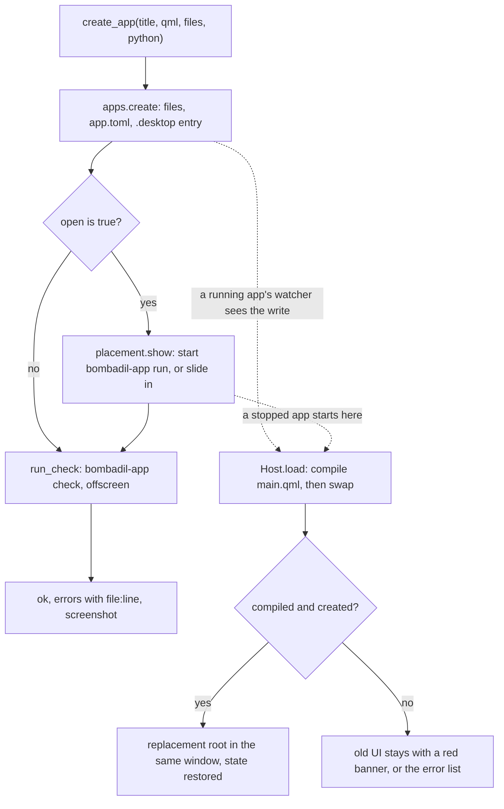
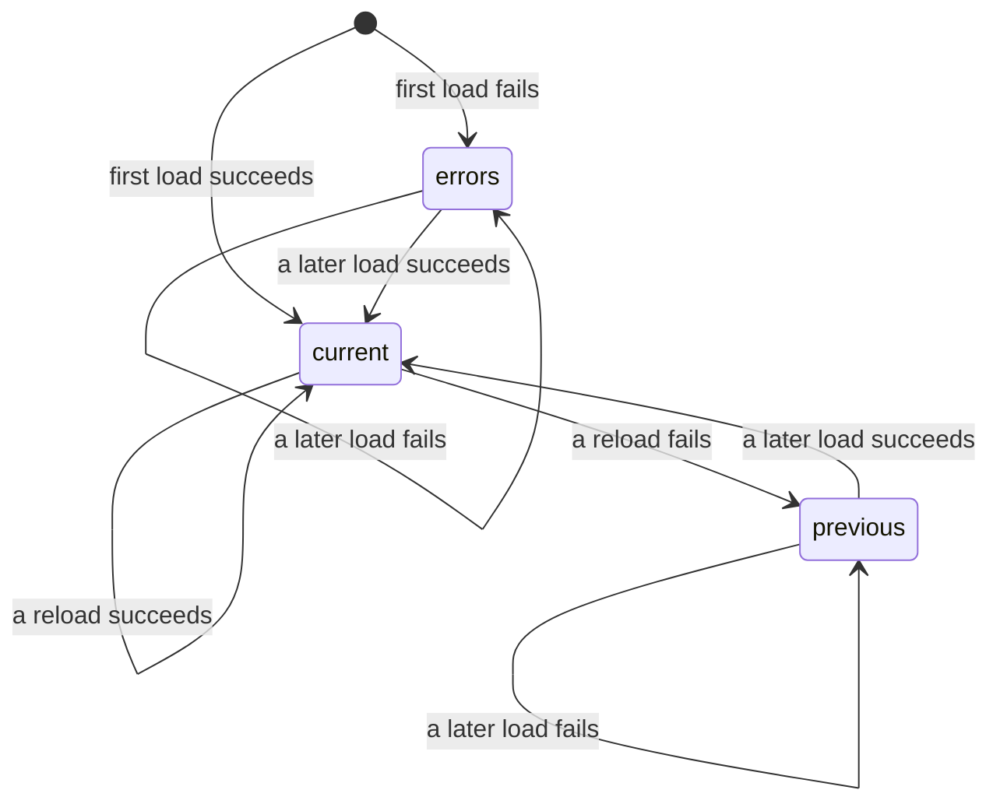
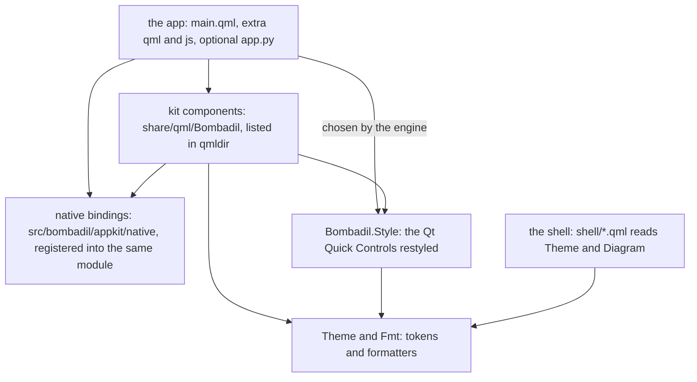

# The app kit

> **Status:** Partly shipped
> **Code:** `bin/bombadil-app`, `src/bombadil/apps.py`, `src/bombadil/app_runtime.py`, `src/bombadil/appkit/`, `share/qml/Bombadil/`, `share/app-template/`, `share/skills/bombadil-apps/`, `share/apps/`
> **Design:** [Foundation choices, section 5](../design/foundation-choices.md#5-how-generated-apps-are-built-and-shown--qml-qt-quick-via-pyside6), [UX brief, piece 3](../design/ux-brief.md#3-apps-change-in-front-of-you-and-undo-in-a-second)
> **Verified:** 2026-10-01 against `main` at `a30ebc8`

The app kit is everything that turns a folder of QML into a native window: an app is a directory under `~/Apps/<name>/` with a `main.qml` written against the kit (`import Bombadil`), with no build step and no port. `bombadil-app run` opens it in its own slide-in drawer, reloads it in place on every write and keeps the last working version on screen when an edit does not load, and `bombadil-app check` loads it offscreen, so the agent gets errors with `file:line` and a screenshot without a display. The kit exists so that what the agent builds is a real app, and so that every app looks like the rest of the system. One app ships with the tree, the Brain window in `share/apps/brain/` ([brain.md](brain.md)); see [Add a built-in app](#add-a-built-in-app).

Designed and not built: a per-app history with undo, and two system-prompt rules about building a skeleton first and editing in place (see [Known gaps](#known-gaps)).

## How it works



**The tool path.** `create_app` (`src/bombadil/appkit/tools.py:167`) calls `apps.create` (`src/bombadil/apps.py:101`). The title becomes the name (`slug`): lower-cased, each run of characters outside `a-z0-9` becomes `-`, a `-` at either end is dropped, and the result is cut to 40 characters. It must then match `^[a-z0-9][a-z0-9-]{0,40}$`, or `create` raises, as it does for a title with no ASCII letter or digit (non-ASCII letters are dropped: `Mémoire` becomes `m-moire`). Every key of `files` is checked first: a plain relative path, never under `data/`, no hidden parts, one of `.qml .js .mjs .json .txt .svg`, and not `main.qml`. A refused call writes nothing. Then extra files are written first, `app.py` if `python` was given, `app.toml`, and `main.qml` last, each through a hidden temp file and a rename, so the reloader never reads half a file. The launcher entry `bombadil-app-<name>.desktop` is written last. `create` never writes under `data/` and never deletes a file, so calling it again with the same title is an edit in place that keeps the saved state. It does rewrite `app.toml` and the launcher entry from the arguments of that call, so an edit that leaves out `description` or `icon` blanks them (see [Known gaps](#known-gaps)).

**Show, then check.** Unless `open` is false, `placement.show` runs before the check, so the person watches the app (or its reload) while the check runs (`tools.py:193-198`). A stopped app is started detached by `apps.run`, with stdout and stderr appended to its log; `apps.run` and `run_check` both start `bombadil-app` through `apps.runner()` (see [Interfaces other pieces depend on](#interfaces-other-pieces-depend-on)). A running app is not restarted: its own watcher reloads it. `run_check` then runs `bombadil-app check <app folder> --screenshot <state>/apps/<name>.check.png` in a subprocess with a 40 s limit, so a Qt crash never takes the MCP server down. `report` returns the summary as text (`app`, `path`, `ok`, `errors`, `warnings`, `console`, `size`; `create_app` adds `reloaded` and `window`) followed by the screenshot as an image block. The tool catalogue is in [os-mcp.md](os-mcp.md).

**The runtime path.** `bombadil-app run <name>` (`appkit/runtime.py:833`) takes a per-app lock, sends output to the log when it was not started from a terminal, builds the `QGuiApplication` (`engine.make_app`) and a `Host`, and calls `Host.start`, which calls `Host.load` and then starts watching. `load` compiles `main.qml` with a `QQmlComponent` before it touches the screen. Only when that succeeds does it create the root, put it on screen and discard the old root. A failed load leaves whatever was on screen where it was.

**Hot reload.** A `QFileSystemWatcher` covers the app folder (up to 64 folders, skipping hidden folders, `__pycache__`, `node_modules` and the top-level `data/`) and the folder above it, so a folder that is removed and written again is noticed. Any change event there starts a 150 ms debounce. Then the runtime compares a signature (mtime, size, inode) of the watched files, which are `.qml`, `.js`, `.mjs`, `.py` and `.toml` files and `qmldir`, and reloads only if one differs (`runtime.py:30-32,659-668`). At the start of each reload `App.aboutToReload` fires, so every `Store` saves, and the replacement restores from the file. A `Vault` that was unlocked stays unlocked, because its key is cached in memory by file.

What the window shows is one of three things, and `status.json` calls it `showing`:



`errors` is the built-in error list (`ERROR_VIEW` in `runtime.py`): the title, "could not load", and each error. `previous` is the old UI with the red banner `AppWindow` draws from `App.lastError`: click it to read the whole error.

**The Python backend.** An optional `app.py` defines `Backend(QObject)`, exposed to QML as the context property `backend`. It is compiled and executed afresh on start, on every change to a `.py` file, and on every reload while it is failing (no `.pyc`, a module named `bombadil_app_<name with hyphens as underscores>_<n>`). The runtime points `backend` at the fresh object only once the edited QML compiles, so a failed reload leaves the old UI on its old backend. Before the old backend is dropped, its `QThread`s are asked to quit and waited for up to 2 s, because Qt aborts the process when a running `QThread` is destroyed; one that does not stop keeps its backend alive (`runtime.py:444-459`). An exception in `app.py` or in a backend slot is an app error shown as `app.py:12: NameError: ...` (`python_error`). The bindings below make `app.py` unnecessary for most apps, and the skill says to prefer them.

### The app folder

```
~/Apps/<name>/
  main.qml     required; the root object is AppWindow
  *.qml *.js   optional components and libraries; EntryRow.qml is used as EntryRow {}
  app.py       optional; a Backend(QObject) class, exposed to QML as `backend`
  app.toml     title, description, icon (written by create)
  data/        the app's saved state; create never writes here
```

`app.toml` holds three strings, written by `apps.create` and read by `apps.read_meta` (an unreadable file reads as `{}`):

| Key | Used by |
|---|---|
| `title` | `App.title`, the window title when the root sets none, the launcher name, and the title `list_apps` shows. The runtime re-reads it on every reload |
| `description` | the launcher comment |
| `icon` | the launcher icon only: the name of a kit icon, turned into the path of `share/qml/Bombadil/icons/<icon>.svg` when that file exists. It is not the icon in the app's title row: that is `AppWindow.icon`, set in QML |

An app of the same name in `~/Apps` takes the place of a built-in one (see [Add a built-in app](#add-a-built-in-app)).

### The runtime: window, drawer, size and saved state

| Concern | What the code does |
|---|---|
| One window per app | The runtime owns a `QQuickWindow` (`_runtime_window`) and parents the `AppWindow` item into it, so a reload swaps the content in the same window: same place, same size, no flicker. A root that is itself a `Window` (first-milestone apps) keeps that window, which is recreated on each reload. A root that is neither a `Window` nor an `Item` (a `QtObject`, say) is an error: "the root object must be AppWindow". The runtime does not check for `AppWindow` itself, which is a `FocusScope`: any `Item` root is parented into the window, and that the root should be `AppWindow` is the skill's rule |
| Identity | `setDesktopFileName("bombadil-app-<name>")` makes the Wayland `app_id`, which Hyprland rules and the bar match on. The window title follows `AppWindow.title` |
| The drawer | What the code sends to Hyprland; the effect on a live compositor is checked only by the ISO smoke test (see [Tests](#tests)). Before the window first maps, `placement.prepare` adds a Hyprland window rule named `bombadil-app-<name>` that opens it floating, centered, at its size, in the special workspace `special:app-<name>`, so it slides in. `show` focuses that workspace, `hide` toggles it off if it is on screen, `toggle` does either, `close` sends SIGTERM and, after 3 s, kills the app with the programs its `Command`s started. Without Hyprland, `prepare`, `show`, `hide` and `toggle` send nothing and report "Hyprland is not running; ..." (`show` and `toggle` still start a stopped app and say so instead), and the app opens as a plain window. `close` does not use Hyprland |
| Keys and the bar | `Esc` inside an app hides it and `Ctrl+W` closes it (both in `AppWindow.qml`). The bar draws a chip for each running app and a click toggles its workspace; that is the shell's side, in [shell.md](shell.md) |
| Size | The first size is the root's `width` x `height` after bindings run (560 x 680 when unset), clamped to 240 x 160 .. 3840 x 2160 and shrunk to the focused monitor's room: its logical size less the area the bar reserves, 24 px of margin on each side and 56 px of height for the line above the prompt (`placement.usable_area`, `fit`). After that the size the person leaves is kept. An edit that changes the declared size resizes the window to it |
| Saved size | 600 ms after a resize the runtime writes `<state>/apps/<name>.window.json` (`width`, `height`, `declared`). A size the runtime shrank to fit the screen is not saved, and a saved size is ignored when `declared` no longer matches |
| Saved state | `Store` writes `data/<name>.json` 300 ms after a change and on reload and quit; `Vault` writes `data/<name>.vault`; `TextFile` writes where its `path` says. A built-in app's folder is read-only, so its `data/` lives under `<state>/apps/<name>/data/` |
| One instance | `run` holds an exclusive `flock` on `<state>/apps/<name>.lock`; a second `run` shows the first and exits 0 |
| Running | An app counts as running when a process command line ends in `bombadil-app run <name>` (`placement.running` runs `pgrep -a -f` and matches `_RUN_RE`). `close`, `bombadil-app list`, `list_apps`, `open_app`, `show` and the bar's x all use it, so a flag placed after the name in how an app is launched breaks them. Other code reads the same shape: see "Who else reads the launch shape" under [Interfaces](#interfaces-other-pieces-depend-on) |
| Leaving | `close()` emits `aboutToReload` once more, saves the size, and destroys the UI so every `Store` saves and every `Command` ends its program before `bombadil-app` leaves with `os._exit` |
| Errors out | After each load, and when messages arrive, the runtime writes `<state>/apps/<name>.status.json` (`app`, `ok`, `loaded`, `errors`, `warnings`, `console`, `reloads`, `showing`, `size`, `pid`, `at`). A launched app logs to `<state>/apps/<name>.log`, moved to `.log.1` past 1 MB. The status and window files are best effort: a full disk costs a log line, not the app |

### The layers



`import Bombadil` is one import for two halves that Qt merges: the QML files listed in `share/qml/Bombadil/qmldir` and the Python types registered under the URI `Bombadil` 1.0 before any QML loads. `engine.qml_dirs` lists the `share/qml` of the checkout ahead of the installed tree (`$BOMBADIL_SHARE/share/qml`, default `/usr/share/bombadil/share/qml`), keeping the ones that exist, and `engine.make_engine` adds them to the import path in reverse, because `addImportPath` puts each new path first, so a checkout's kit wins over the installed one. A loop that adds them in list order flips that. Among the component files in `share/qml/Bombadil/`, only `Store.qml` has `import Bombadil`; the others resolve the module's types from their own folder. The files in `Style/` are the separate module `Bombadil.Style`: 42 of its 44 files import `Bombadil` for `Theme` (`Page.qml` and `EditMenu.qml` do not). The style is chosen by the engine, so an app never imports it.

### The kit

All 35 entries of `share/qml/Bombadil/qmldir` (two singletons and 33 types), one line each. The properties and signals of every entry except `Store` are in `share/skills/bombadil-apps/references/components.md`, which is also what the agent reads; `Store` (`name`, `loaded`, `save()`, `reset()`) is in `share/skills/bombadil-apps/references/native.md`. The look in words is in [the design system](../design-system/README.md).

| Group | Component | What it is |
|---|---|---|
| Layout | `AppWindow` | The root: title row (`title`, `subtitle`, `icon`, `actions`), OS palette and font for every control inside, `toast(text, tone)`, the reload banner, `Esc` and `Ctrl+W`. Still accepts the window properties of first-milestone apps (`color`, `font`, `menuBar`, `header`, `footer`, size limits, `closing`) |
| Layout | `Panel` | A card on `Theme.panel` with an optional header (`title`, `subtitle`, `actions`); children stack in a column, and one with `Layout.fillHeight` takes the free height |
| Layout | `ScrollPane` | A vertical scroll area whose children stack in a column as wide as the pane |
| Layout | `Spacer` | Takes the free space along its layout: horizontal in a row, vertical in a column |
| Layout | `Divider` | A hairline, optionally `vertical` |
| Text | `Heading` | A title, `level` 1 (screen), 2 (section) or 3 (group) |
| Text | `Body` | Running text in `Theme.fg` that wraps and fills the layout's width |
| Text | `Caption` | Secondary text in `Theme.muted`, 12 px |
| Text | `Mono` | A read-only, selectable `TextEdit` in the mono font, for paths, ids and hashes |
| Text | `Icon` | A Lucide icon from `icons/` (77 files, `icons/LICENSE`) tinted to `color` |
| Text | `Badge` | A small status pill: `text`, `tone`, `icon` |
| Input | `IconButton` | A square flat icon button with a tooltip, optionally `checkable`, with a `tone` |
| Input | `SearchField` | A `TextField` with a search icon and clear button; `Ctrl+F` focuses it and `Esc` clears it |
| Input | `Form` | A column of `Field`s; with `labelWidth` the labels sit to the left |
| Input | `Field` | A label, one control stretched to its width, and a hint or error; `required` adds a dot |
| Input | `PasswordField` | A `TextField` for secrets: hidden text, an eye button, an optional 4-step strength meter (`showStrength`, `strength` 0 to 4) |
| Input | `Editor` | A code and text editor: mono font, line numbers, syntax colours through `Highlighter`; with `path` it loads and saves through `TextFile`, shows a dot for unsaved changes and saves on `Ctrl+S` |
| Data | `Stat` | A headline number with its label, an optional delta and a `Sparkline` trend |
| Data | `DetailGrid` | Label and value rows in two aligned columns; a row can be `mono`, `copyable` or `secret` (a secret row cannot be selected and its copy clears the clipboard after 30 s) |
| Data | `ItemList` | A selectable, keyboard-navigable list of `ListRow`s over an array or a model; the selection follows the same item when the array is replaced (matched by `id`, `uuid`, `key` or `pid`, else by content); signals `activated` and `contextRequested` |
| Data | `ListRow` | One 44 px row: icon, title, subtitle, trailing text or item; signals `clicked`, `doubleClicked`, `contextRequested` |
| Data | `DataTable` | A sortable table with a sticky header; columns are `{key, title, width, align, format, mono, sortable}`; scroll position and selection survive a replaced `rows` |
| Data | `EmptyState` | What a list or screen shows when it is empty or locked: icon, title, text, an optional action button |
| Dialogs | `ConfirmDialog` | A modal "are you sure" with `title`, `text`, `confirmText`; `danger` makes the confirm button red and gives Cancel the focus; signal `confirmed` |
| State | `Store` | Every writable value property declared on it is saved to `data/<name>.json` and restored before any `Component.onCompleted`, except `name`, `loaded`, names starting with `_`, read-only properties and object-typed ones (`property Item x`); written in QML over `KitFiles` |
| Charts | `Series` | Records `value` every `interval` ms into `values` (up to `capacity`), for a chart or `Sparkline` |
| Charts | `LineChart` | Lines over time on one y axis, drawn on a canvas; legend, hover crosshair and tooltip |
| Charts | `BarChart` | Bars for a few named values, horizontal or vertical |
| Charts | `Sparkline` | A tiny trend line with no axes |
| Charts | `Meter` | A 0..1 fraction as a bar; the fill turns warn above `warnAt` (0.75) and bad above `badAt` (0.9) |
| Charts | `Ring` | The same fraction as a circular gauge |
| Charts | `StackedBar` | One bar split into parts, with a legend |
| Pictures | `Diagram` | Boxes and links from a `spec` in one of four fixed shapes (`chain`, `layers`, `compare`, `timeline`); `minBoxWidth` (132), `maxBoxWidth` (208), and for a `compare` `maxCompareWidth` (230) and `compareGap` (76), the two columns sitting together in the middle with the arrow between them. The shell's card host uses the same component, see [cards-and-pictures.md](cards-and-pictures.md) |
| Singletons | `Theme` | The tokens, `icon(name)`, `tone(name)`, `alpha(color, a)` |
| Singletons | `Fmt` | `bytes`, `percent`, `number`, `compact`, `duration`, `time`, `date`, `dateTime`, `relative`; a missing value formats as a dash glyph (U+2014), never `NaN` |

Dialogs and menus not in this table are Qt's own, drawn by the style below. A kit component never needs `import Bombadil` for `Theme`, `Fmt` or its siblings.

### Theme and the style

`share/qml/Bombadil/Theme.qml` is a singleton of tokens: surfaces (`bg`, `panel`, `raised`, `overlay`, `sunken`), borders, ink (`fg`, `muted`, `faint`), the accent and the status tones, eight chart colours in `series`, shape and rhythm (`radius`, `radiusSmall`, `pad`, `gap`, `controlHeight`, `rowHeight`), type (Inter, `textSize` 14) and motion (`fast`, `normal`, `slow`). No visible colour is hard-coded outside `Theme.qml`: the only literals in the other files of `share/qml/Bombadil/` are `"transparent"` (`Diagram`, `StackedBar`, `Style/FocusRing`, `Style/Frame`, `Style/GroupBox`) and a `"#000"` mask for a cut-out in `LineChart.qml` that is never drawn visibly. Nothing enforces this for the kit. The shell reads the same file (`import Bombadil as Kit`, with `bin/bombadil-shell` putting `share/qml` on the import path), and `tests/test_theme.py` keeps `shell/DeskTheme.js` equal to the tokens it names.

The style is what makes plain Qt Quick controls look like the OS:

- `engine.configure` sets `QT_QUICK_CONTROLS_STYLE=Bombadil.Style` unless it is set, and `make_app` calls `QQuickStyle.setStyle("Bombadil.Style")` and sets the application font to Inter at 14 px.
- `share/qml/Bombadil/Style/qmldir` registers 41 controls, each on a Qt Quick Templates base (`T.Button`, `T.TextField`, ...) that reads `Theme`: the buttons, text inputs, `ComboBox`, `SpinBox`, checks and radios, `Switch`, sliders, `ProgressBar`, tabs, menus, `Popup`, `Dialog`, `Drawer`, delegates, `Label`, containers, scroll bars, `SplitView`, `StackView`, `ToolTip` and `ApplicationWindow`. Three internal types, `FocusRing`, `Shadow` and `EditMenu`, are shared by them.
- A control the style does not list falls back to Qt's Basic style, which reads the palette. `AppWindow` writes Theme colours into the palette roles of its frame and of its host window (so popups see them), and `Style/ApplicationWindow.qml` does the same for a plain `ApplicationWindow`.
- Two properties go beyond Qt's API: `Button.danger` and `MenuItem.danger` (destructive, red). `highlighted` is the one primary button and `flat` has no surface until hovered.

### Native bindings

Ten Python types are registered into the `Bombadil` module by `appkit/native/__init__.py`. `register(ctx)` runs once per process, from `engine.make_engine`, and calls each module's own `register(ctx)`. The modules in `native/` import PySide6 at module level. `engine`, `runtime` and `check` import it only inside functions, so `tools.py` (and with it os-mcp) can import `runtime` for `status` without loading Qt, as the launcher in agentd imports `placement`.

| Type | Registered as | What it gives QML | Registered in |
|---|---|---|---|
| `App` | singleton instance, made at registration | `name`, `title`, `dir`, `dataDir`, `checking`, `reloads`, `lastError`; `show()`, `hide()`, `toggle()`, `close()`, `notify(title, body)`, `openUrl(url)`; the signal `aboutToReload` | `native/app.py:127` |
| `KitFiles` | singleton, made on first use | the Python half of `Store`: `resolve`, `exists`, `readText`, `writeText`, `storeKeys`, `snapshot`, `quarantine`, `remove`. Not for apps | `native/files.py:205` |
| `System` | singleton, made and polling on first use | `cpu`, `cpus`, `cpuCount`, `memory`, `memoryUsage`, `meminfo`, `pressure`, `load`, `uptime`, `processCount`, `disks`, `network`, `battery`, `temperature`, `hostname`, `kernel`, `user`, `interval`, read from `/proc` and `/sys` every second (disks, battery, host and user every 10 s) | `native/system.py:311` |
| `Processes` | type | `interval`, `sortBy`, `descending`, `limit`, `filter`, `list`, `count`, `refresh()`, `details(pid)`, `kill(pid, signal)` | `native/processes.py:296` |
| `Command` | type | `command` or `program` with `args`, `running`, `interval`, `stdin`, `interactive`, `stdout`, `stderr`, `exitCode`, `lines`, `json`, `run()`, `kill()`, `write()`, `finished(code, output)`; runs without blocking, in a session of its own, ended with the UI | `native/command.py:365` |
| `TextFile` | type | `path`, `text`, `exists`, `error`, `watch`, `save()`, `reload()`, `remove()`, `changedOnDisk`; every `TextFile` shares one inotify watcher | `native/textfile.py:216` |
| `Vault` | type | an encrypted JSON value (scrypt and AES-256-GCM) in `data/<name>.vault`: `name`, `exists`, `unlocked`, `data`, `error`, `autoLock`, `create()`, `unlock()`, `lock()`, `changePassword()`, `generatePassword()`, `strength()` | `native/vault.py:493` |
| `Clipboard` | singleton, made on first use | `text`, `copy(text, clearAfterSeconds)` | `native/clipboard.py:62` |
| `Agent` | singleton, connects when made | `connected`, `busy`, `provider`, `reply`, `ask(prompt)`, `replied(text)`: a line to agentd's socket, so the app talks to the same session as the bar, prefixed `[from app <name>]` ([agentd.md](agentd.md)) | `native/agent.py:176` |
| `Highlighter` | type | `textDocument`, `language` (`plain`, `markdown`, `python`, `json`, `qml`, `javascript`, `shell`, `toml`, `ini`, or a file name or extension) | `native/highlighter.py:268` |

Rules every type follows: nothing is written, connected or sent when `ctx.check` is true (`bombadil-app check`); arrays and objects reach QML as real JS values through `js_value` and an empty value as `null` through `to_js`; a path is `~`-expanded, and a relative path resolves inside `data/` (`AppContext.resolve`), except for a `Command`, which runs in the home folder. Units are in `share/skills/bombadil-apps/references/native.md`.

`App.openUrl` goes through `placement.open_url` on a daemon thread, so it never blocks the UI, and does nothing during a check. Only `http`, `https` and `file` URLs pass; a bare address gets `https://` in front; an empty string, one that starts with `-` or one with any other scheme (`javascript:`, `chrome:`) raises `ValueError`, which is printed to the app's log. The link opens as a tab of the shared browser panel, started with `setsid -f` and not as a child of the app, so closing or killing the app leaves the browser. Without Hyprland it only says that it did not open the link.

### `bombadil-app check`

`bombadil-app check <name|folder|file.qml> [--screenshot PNG] [--wait MS] [--size WxH]` loads an app through the same `Host` as `run`, so the picture is what `run` shows.

1. `check.main` copies stdout aside and points fd 1 at stderr, so only the JSON result reaches stdout and what `app.py` prints cannot break it. A watchdog process is forked before Qt starts.
2. `engine.configure(check=True)` sets `QT_QPA_PLATFORM=offscreen`, `QT_QUICK_BACKEND=software` (unless set) and `BOMBADIL_CHECK=1`, and Qt's own storage (`Settings`, `LocalStorage`) goes to its test location, not the person's configuration.
3. `Host.start` loads once, with no watcher and no placement. If it loaded, the check resizes to `--size` if given, runs the event loop for `--wait` ms (default 1200), then saves `grabWindow()` to the PNG. A failed load returns `screenshot: null` and `size: null`.
4. A `Collector` sorts every message into `errors`, `warnings` and `console`. QML load errors and `engine.warnings` arrive with `file:line`, and paths are shown relative to the app. A runtime message is an error when it matches `FATAL` (for example `Error:`, "is not defined", "Cannot assign", "Binding loop", "is not a type") and a warning otherwise; Qt platform noise matching `NOISE` is dropped; `console.log` goes to `console`.
5. The result is `{app, ok, loaded, errors, warnings, console, screenshot, size, seconds}`, with at most 20 entries of each list. The exit code is 0 when `ok` and 1 when the check ran and found errors (the watchdog case in item 6 differs). For example, an `AppWindow` with `Panel { nosuchprop: 3 }` returns `"main.qml:8:13: Cannot assign to non-existent property \"nosuchprop\""` and `ok: false`.
6. If the app does not settle within `--wait` plus 25 s (a loop that never ends), the watchdog stops the check, kills the programs its `Command`s started, prints the result the check could not (`ok: false`, "the app did not settle ...") and then ends it with `SIGKILL`, so the exit status is not 1 (137 in a shell). `tools.run_check` reads the JSON from stdout, so it still gets the result.

A check writes nothing through the kit's types. `Store`, `Vault` and `TextFile` keep their writes in memory or drop them, `Agent` never connects, `Clipboard.copy`, `App.notify`, `App.openUrl` and the window calls do nothing, and `Processes.kill` returns false. `Command`s do run, so the screenshot shows real data and whatever their programs do happens; the watchdog kills them if the check hangs. `App.checking` and `BOMBADIL_CHECK=1` let an app or the programs it starts tell.

### The skill and the examples

The skill `share/skills/bombadil-apps/` teaches the agent to build an app in one pass:

| File | Holds |
|---|---|
| `SKILL.md` | the loop (pick a pattern, write `main.qml`, `create_app`, read the errors and the screenshot), a skeleton, the rules that prevent the usual failures (four imports, `AppWindow` root, `Layout.*` not anchors, `Theme` not colours, assign never mutate, no `QtCharts` or `QtWebEngine`), a table of patterns and the kit at a glance |
| `references/components.md` | every component with its properties, the styled controls, `Theme`, `Fmt` and the icon list |
| `references/native.md` | every native binding |
| `references/runtime.md` | the contract: the app on disk, loading and hot reload, window size, where it shows up, errors and logs, commands and tools |
| `examples/memory`, `examples/password-manager` | two complete apps (an `app.toml`, a `main.qml` and components) |

It reaches both agent CLIs three ways. `iso/airootfs/etc/skel/.claude/skills/bombadil-apps` and `iso/airootfs/etc/skel/.agents/skills/bombadil-apps` are links to `/usr/share/bombadil/share/skills/bombadil-apps` (the ISO smoke test checks both, `iso/airootfs/usr/local/bin/bombadil-smoke:101`; which CLI reads which folder is that CLI's own convention). `providers.system_prompt()` gives both the paths of the kit and the skill (`kit_paths()`) and says to read `SKILL.md` first or call `app_guide`. And `app_guide(topic?)` serves it over MCP, so a provider with no skill support gets it too: with no topic it returns `SKILL.md` and a footer naming the topics; a topic is a reference's file name without `.md` (`components`, `native`, `runtime`) or an example's folder name, which returns each `.qml`, `.js`, `.py`, `.toml` and `.md` file of the example as a fenced block. Topics are read from the folder on each call, so a file added to `references/` becomes a topic with no code change.

Both examples are complete apps that use nothing outside the kit and the native bindings. `memory` shows live RAM (`System`, `Series`, `Processes`, `LineChart`, `StackedBar`, `DataTable`, and a `ProcessDetails.qml` component). `password-manager` is a `Vault` behind a lock screen (`PasswordField`, `ItemList`, `DetailGrid`, `ConfirmDialog`, `LockScreen.qml`, `EntryDialog.qml`). Both load with `ok: true` under `bombadil-app check`, as does `share/app-template/` (the starter `app_template` returns: a `Store`, an `ItemList` and a toast in `main.qml`, and an `app.py` with a `Backend` that `main.qml` does not use). The ISO smoke test copies each example into `~/Apps` and opens it with `open_app` (`iso/airootfs/usr/local/bin/bombadil-smoke:98`).

## Interfaces other pieces depend on

**Commands** (`bin/bombadil-app`, `src/bombadil/appkit/cli.py`)

| Command | Does |
|---|---|
| `bombadil-app run <name>` | opens the app and hot reloads it; when it is already running, shows it and exits 0 |
| `bombadil-app check <target> [--screenshot PNG] [--wait MS] [--size WxH]` | the check above; `target` is an app name, an app folder or a `.qml` file (a gallery); JSON on stdout; exit 0 when `ok` |
| `bombadil-app list` | one line per app in `~/Apps`: name, `shown` or `running` or blank, title, path |
| `bombadil-app create <title> <qml> [--python F] [--description T] [--icon NAME]` | `apps.create` from files; prints the folder (there is no `--files`) |
| `bombadil-app show`, `hide`, `toggle`, `close <name>` | `appkit/placement.py`; `show` and `toggle` start the app if it is not running; `close` is what a bar chip's x runs |
| `bombadil-app status <name>` | `status.json` merged with `running` and the last 40 lines of the log, as JSON. No Qt |

Which `bombadil-app` runs: the tools start and check apps with `apps.runner()`, which prefers the checkout's own `bin/bombadil-app` (run with `sys.executable`) over the one on `PATH`, as `engine.qml_dirs` prefers the checkout's kit. The launcher entry written by `apps.create` is `Exec=bombadil-app run <name>` and always uses `PATH`, so on a machine with both a checkout and an installed copy a tool-started run and a launcher-started run can be different code.

**Agent tools** registered by `appkit/tools.py:147`, described in [os-mcp.md](os-mcp.md): `app_guide`, `create_app`, `check_app`, `open_app`, `show_app`, `hide_app`, `close_app`, `app_status`, `list_apps`, `app_template`. They replace the four first-milestone app tools of `mcp_server.py` and are listed together at the end.

**Environment variables**

| Variable | Meaning |
|---|---|
| `BOMBADIL_APPS` | the apps folder, default `~/Apps` (`paths.apps_dir`) |
| `BOMBADIL_STATE` | the state folder, default `~/.local/state/bombadil`; apps use `<state>/apps/` |
| `BOMBADIL_SHARE` | the installed tree, default `/usr/share/bombadil`; where the kit and skill are found when the checkout has none |
| `BOMBADIL_SOCKET`, `BOMBADIL_RUNTIME` | where `Agent` finds agentd's socket |
| `XDG_DATA_HOME` | where the `.desktop` entry goes, under `applications/` |
| `HYPRLAND_INSTANCE_SIGNATURE`, `XDG_RUNTIME_DIR` | where `placement` finds Hyprland's socket, `$XDG_RUNTIME_DIR/hypr/<signature>/.socket.sock` (default `/run/user/<uid>`); without the signature or the socket Hyprland counts as not running (`hypr.Hyprland.available`) |
| `BOMBADIL_CHECK` | `1` during a check (set by `engine.configure`, removed for `run`); read by `app.py` and the programs `Command`s run |
| `QT_QUICK_CONTROLS_STYLE` | defaults to `Bombadil.Style` |
| `QT_QPA_PLATFORM`, `QT_QUICK_BACKEND` | a check sets `offscreen` and, unless set, `software` |

**The compositor contract.** Window class and `app_id` `bombadil-app-<name>`; special workspace `special:app-<name>`; a runtime window rule per app, named `bombadil-app-<name>`, added by `placement.prepare`; and a static rule `bombadil-apps` in `iso/airootfs/etc/skel/.config/hypr/hyprland.lua` that floats and centers every `bombadil-app-*` window at 540 x 660. The shell builds its chips from toplevels in `special:app-*` workspaces ([shell.md](shell.md)). The window rule is sent as `eval hl.window_rule({...})` and showing and hiding as `dispatch hl.dsp.focus({...})` and `dispatch hl.dsp.workspace.toggle_special(...)`, which are Lua, so the drawer needs a Hyprland whose dispatchers are Lua (`src/bombadil/hypr.py` says this holds since 0.55).

**Who else reads the launch shape.** Besides `placement`, these read how an app is started and named. Changing `bombadil-app run <name>` or the class `bombadil-app-<name>` changes their behaviour too.

| Code | What it reads |
|---|---|
| `src/bombadil/procs.py:314` (`_is_window`) | `bombadil-app` followed by `run` in an argument list: Stop spares an app a turn opened, and its children |
| `src/bombadil/brain/actors.py:63` (`_app_from_chain`) | `bombadil-app run <name>` in the process chain of a writer names the app that wrote a file; only plain names pass (`APP_NAME`) |
| `src/bombadil/brain/this.py:35` (`APP_CLASS`) | the window class `bombadil-app-<name>` makes "this" the ref `app:<name>`, except for `brain` itself |
| `src/bombadil/launcher.py:763` (`_app_running`) and `open_brain` | `pgrep -f "bombadil-app run <name>$"`; the Brain window is opened with `placement.show("brain")` |
| `src/bombadil/narrate.py:635` | `bombadil-app` with `check`, `run`, `show`, `close` or `status` and a name becomes a line such as "Checking <name>" |

**Reply sentences.** `placement.show`, `hide` and `close` each return one sentence, and `launcher.Launcher._app` in `src/bombadil/launcher.py` reads it to answer the words `open`, `hide` and `quit <app>`: it takes `<name> hidden` (ends with ` hidden`) as done for a hide, `<name> closed` (ends with ` closed`) or a sentence containing ` was killed` as done for a close, and treats `could not be killed` as a failure. `tests/test_launcher.py` pins this, and the ISO smoke test matches `*' hidden'` in the output of `bombadil-app hide` (`app_hidden` in `iso/airootfs/usr/local/bin/bombadil-smoke`). Changing the wording of those sentences breaks the launcher words and the smoke test.

**Messages to agentd.** `Agent` sends `{type: "prompt", text}` and reads `status` (`busy`, `provider`), `queued` (`turn`) and `event` messages of kind `queued`, `unqueued`, `turn_start`, `text`, `result`, `error` and `turn_end`, matched to its own prompts by `turn`. [agentd.md](agentd.md) owns the protocol; a change to these messages needs a matching change in `appkit/native/agent.py`, which `tests/test_appkit_agent.py` covers.

**Files an app and its tools read and write** are listed under Where state lives. **The QML contract** an agent writes against is `import Bombadil` with an `AppWindow` root, `backend` when `app.py` exists, and the kit and native names above.

## Where state lives

| What | Where | Written by |
|---|---|---|
| The app | `~/Apps/<name>/` (`main.qml`, extra files, `app.py`, `app.toml`) | `apps.create`, or by hand |
| The app's saved state | `~/Apps/<name>/data/`: `<store>.json` (default `state.json`), `<vault>.vault` (default `vault.vault`, mode 600), a `TextFile`'s relative path | `Store`, `Vault`, `TextFile`; never `create` |
| A built-in app | `share/apps/<name>/`, read-only; its saved state in `<state>/apps/<name>/data/` | shipped with the tree |
| Launcher entry | `$XDG_DATA_HOME/applications/bombadil-app-<name>.desktop` (default `~/.local/share/applications`) | `apps.create` only |
| Log | `<state>/apps/<name>.log`, then `.log.1` | the running app, or `apps.run` |
| Last load result | `<state>/apps/<name>.status.json` | the running app |
| Window size | `<state>/apps/<name>.window.json` | the running app |
| Single-instance lock | `<state>/apps/<name>.lock` | the running app |
| Last agent check picture | `<state>/apps/<name>.check.png` | `tools.run_check` |
| Vault keys | memory of the app process, by file; survive a hot reload, not a restart or the `autoLock` deadline | `Vault` |
| The drawer | the Hyprland special workspace `special:app-<name>` and its window rule | `placement` |
| Qt's own storage while an app runs (`Settings`, `LocalStorage`) | Qt's standard per-user config and data locations, keyed by the organization `Bombadil` and the app's title as it was when the process started (`engine.make_app`). Not in `data/`, not in a `Store`; a renamed title uses new ones at the next start | Qt, for an app that uses them |
| Qt's own storage during a check | Qt's test location under the home folder | Qt |

`<state>` is `paths.state_dir()`. Apps are in the home folder, which no restore point covers ([restore-points.md](restore-points.md)).

## Principles it keeps

- [Real native apps](../principles.md#real-native-apps): an app is a folder of QML in a real window, opened by name, with no server and no port. The agent's tool is `create_app`, and the skill forbids web pages, `QtWebEngine` and terminal UIs. The trap is a feature that only works as a local web page or a web view: it does not belong in the kit.
- [One design language](../principles.md#one-design-language): every component and every style control reads `Theme`, and plain Qt controls are restyled so an app that never mentions colour still matches the shell. The trap is a hex colour or a one-off radius in a component or an app: nothing but this convention stops it in the kit (`tests/test_theme.py` guards only the shell). `Highlighter` is an example of drift: it holds its own hex palette in Python.
- [Degrade and recover](../principles.md#degrade-and-recover): a reload that fails leaves the last working UI up with the reason; an app that never loaded shows its errors; without Hyprland an app opens as a plain window; a full disk costs the log, not the app. The trap is Qt leaking out of the kit: `agentd` and os-mcp must never import `PySide6` or `appkit.native`. `runtime`, `engine` and `check` are safe to import because they import PySide6 only inside functions (`tools.py` relies on that for `runtime.status`); a module-level PySide6 import in any of them breaks the rule. Only convention holds it: `no_qt` in `tests/test_appkit_tools.py` guards the `create_app` path (`apps`, `placement` and the MCP server) and does not import `runtime`, `engine` or `check`. With PySide6 installed nothing fails if one of them imports it at module level. Without PySide6, `test_open_app_reports_how_the_load_went` and `test_app_status` import `runtime` (and through it `check` and `engine`) and would fail.
- [Plain files stay the truth](../principles.md#plain-files-stay-the-truth): an app is text files in a folder, written atomically, and `data/` is never written by `create`. A `Store` keeps a saved value it cannot take, and a file that is not valid JSON is renamed `.bad`, never overwritten. The trap is a "cleanup" that trims the saved file to the declared properties or writes into `data/`.
- [Nothing runs unseen](../principles.md#nothing-runs-unseen): a running app is a chip the person can close, a `Command` ends with the UI that made it, a check writes nothing through `Store`, `Vault`, `TextFile`, `Clipboard`, `Agent` or the window calls (the programs a `Command` starts do run, and the watchdog kills them if the check hangs), and `Agent.ask` marks its prompt `[from app <name>]`. The trap is a native type that starts background work that outlives its object, or that writes or sends during a check.

## Extending it

### Add a kit component

1. Write `share/qml/Bombadil/<Name>.qml`. Use `Theme`, `Fmt` and sibling components by name, and no colour literals. Import `QtQuick` and, if needed, `QtQuick.Controls` and `QtQuick.Layouts`. The module's own types, native ones included, resolve without `import Bombadil` (`AppWindow.qml` uses `App`, `Editor.qml` uses `TextFile`); of these files only `Store.qml` has that import.
2. Add `<Name> 1.0 <Name>.qml` to `share/qml/Bombadil/qmldir`. For a singleton, start the QML file with `pragma Singleton` (as `Theme.qml` and `Fmt.qml` do) and add `singleton <Name> 1.0 <Name>.qml`: without the pragma every app fails to load ("qmldir defines type as singleton, but no pragma Singleton found"). Without the qmldir line an app's `import Bombadil` reports "<Name> is not a type". Both were checked on a copy of the kit on 2026-10-01.
3. If it needs an icon, add `share/qml/Bombadil/icons/<name>.svg` and its name to the icon list at the end of `references/components.md`.
4. Document it: add a row to the kit table above and update its count ("All 35 entries", two singletons and 33 types); add a `### <Name>` section with a property table under the matching group in `share/skills/bombadil-apps/references/components.md`, and its name in "The kit at a glance" of `SKILL.md` (and the patterns table if it adds a shape). `app_guide("components")` serves that file, so no code changes. For a new `Theme` token, an icon or a `Bombadil.Style` control follow [Extending it](../design-system/README.md#extending-it) in the design system, which owns those registration steps.
5. Use it in a gallery, `tests/qml/components_gallery.qml` (`charts_gallery.qml` for a chart), in each state it has. Run `bin/bombadil-app check tests/qml/components_gallery.qml --screenshot out.png` and expect `"ok": true` with no errors or warnings, and look at the picture.
6. If it has logic (selection, keys, focus), add a test to `tests/test_appkit_kit.py` with `run(home, qml, body)`.

Nothing enforces steps 2, 4 and 5 except the first use: no test compares `qmldir` with the reference, the galleries or the table in this document. `Store` and `Diagram` are in no gallery (`Diagram` has `tests/test_diagram_qml.py`).

### Add a native binding

1. Write `src/bombadil/appkit/native/<thing>.py` with a `QObject` class and a module-level `register(ctx)`. Import `MAJOR, MINOR, URI` from the package. Choose how it is made:
   - a type QML creates, one per use: `qmlRegisterType(Cls, URI, MAJOR, MINOR, "Name")`; read the context in `__init__` with `native.context()` when it needs the app's folders or `check` (`Processes`, `TextFile`, `Vault`); a type that needs neither (`Command`, `Highlighter`) does not read it;
   - a singleton made on the first mention in QML: `qmlRegisterSingletonType(Cls, URI, MAJOR, MINOR, "Name", lambda engine: Cls(ctx))` (`System`, `Clipboard`, `Agent`, `KitFiles`);
   - an instance the runtime also needs: `qmlRegisterSingletonInstance` (only `App`).
2. Register the module: add it to the import on line 23 and to the tuple on line 25 of `src/bombadil/appkit/native/__init__.py`. That is the only registration point; `engine.make_engine` calls it before the engine exists.
3. Honour `ctx.check`: no writes, no sockets, no processes you would not want in a screenshot (see `KitFiles.writeText`, `Agent.start`, `Processes.kill`).
4. Give QML real values with `from .files import js_value, to_js, from_js` (as `command.py` and `system.py` do): `js_value(self, data)` for arrays and objects, `to_js` so `None` becomes `null`, `from_js` for what QML passes in. End anything you started when the object is destroyed (`Command` does it in `destroyed`), because a hot reload destroys objects.
5. Document it in `share/skills/bombadil-apps/references/native.md` and the "Native:" line of `SKILL.md`, and add it to the comment at the top of `share/qml/Bombadil/qmldir`.
6. Test it in `tests/test_appkit_native.py` (the `kit` and `checking` fixtures), with a case for check mode.
7. Update this page: the count in "Ten Python types" and a row of the native bindings table. Nothing compares them with the code.

### Add an app tool

The general steps are in [os-mcp.md](os-mcp.md#add-a-tool-that-acts-inside-the-server). The ones that belong to this piece:

1. Write the tool with `@t("name", "description", {properties}, ["required"])` inside `register` in `src/bombadil/appkit/tools.py` (`t` is `os_tools._tool`), among the other app tools. Import `runtime` inside the function, as `app_status` does, and import no Qt module. To start or check an app, go through `apps.run`, `tools.run_check` or `apps.runner()`, not a bare `bombadil-app`.
2. Add its name to `app_tools` in `tests/test_appkit_tools.py::test_app_tools_are_listed_together_and_point_at_the_guide`, in the order of the declarations: the test asserts that the app tools are the tail of the tool list, so they stay last. Add a case beside the others with `call(make(), "name", ...)`.
3. Tell the agent: a row in the tool table of `share/skills/bombadil-apps/references/runtime.md` and a mention in `SKILL.md`. `narrate._os_tool` and the catalogue in `os-mcp.md` follow the general recipe.
4. Update this page: the list of ten agent tools under Interfaces.

### Add a built-in app

`share/apps/` holds one app on `main`, `brain` (the Brain window, [brain.md](brain.md)): `main.qml`, `app.toml`, an `app.py` with its own `Backend` and six components of its own (`BrainList.qml`, `Changes.qml`, `Line.qml`, `Preview.qml`, `Slot.qml`, `Trail.qml`) and `who.js`. It is the worked example for the rest of this section. Put an app in `share/apps/<name>/` (`main.qml`, `app.toml`, optional `app.py` and components); `apps.builtin_dir()` is `share/apps` at the root of the tree, and `scripts/build-iso.sh` copies the whole `share/` tree to `/usr/share/bombadil`, so nothing else ships it. Then:

- `bombadil-app run <name>` and `apps.load(name)` find it only when `~/Apps/<name>/main.qml` does not exist; an app of the person's with that name takes its place, and the built-in files are never changed.
- `apps.list_apps()` lists `~/Apps` only, so a built-in app is not in `list_apps`; a tool that needs it names it.
- Its saved state is in `<state>/apps/<name>/data/`, because its folder is read-only (`AppContext.data_dir`). The Brain keeps none in the kit (no `Store`, `Vault` or `TextFile`); its PDF previews go to `$XDG_CACHE_HOME/bombadil/brain/` (`share/apps/brain/app.py`, `pdfPage`).
- `apps.create` is the only code that writes a launcher entry, so a built-in app has none unless something writes one, and the pill's word list (`launcher.known_apps`) is `~/Apps` too. The Brain is reached by its own words, `BRAIN_COMMANDS` in `src/bombadil/launcher.py`, and `Launcher.open_brain` calls `placement.show("brain")`; the agent tools take its name (`open_app("brain")`).
- Check it with `bin/bombadil-app check share/apps/<name> --screenshot out.png` (or `bombadil-app check <name>`, which finds a built-in app by name), and copy the pattern of `tests/test_apps.py::test_a_built_in_app_runs_unless_you_have_one_of_that_name`. The Brain's `Backend` is tested against a fake socket in `tests/test_brain_app.py`, and the ISO smoke test opens it with `open_app` when `/usr/share/bombadil/share/apps/brain/main.qml` exists (`iso/airootfs/usr/local/bin/bombadil-smoke:335-339`).

### Add a field to `app.toml`

1. Add the field, with a default, to the `App` dataclass in `src/bombadil/apps.py`, read it in `apps.load`, and write it in `apps.create` (through `_toml_str`, which escapes any text). Add the argument to `create`.
2. Expose it where it is set: the `create_app` input schema in `appkit/tools.py` (`tests/test_appkit_tools.py` asserts the exact set of properties) and a flag on `bombadil-app create` in `appkit/cli.py`. Both call sites must also pass the value to `apps.create`: `create_app(a)` in `tools.py` calls it positionally and the `create` branch of `cli.py` by keyword (`icon=args.icon`), so a field added only to the schema or the flag is dropped.
3. If QML should see it, add it to the `AppContext` dataclass (`appkit/context.py`), after `check` and with a default, because `for_app` and `for_target` build it positionally. Pass it in `for_app` (from the `apps.App` field; this is the path of `bombadil-app run <name>`) and in `for_target` (for a folder target it reads `app.toml` itself, as it does for `title`; a bare name falls back to `for_app`). Then add a constant `Property` to `App` in `appkit/native/app.py`. If it should follow edits on reload, update it in `Host._refresh_meta` as `title` is.
4. Document it: "An app on disk" in `references/runtime.md` and the `App` table in `references/native.md`.
5. Add the field to the round trip in `tests/test_apps.py::test_toml_escaping_survives_any_title`.
6. Update this page: the `app.toml` table in [The app folder](#the-app-folder), which says the file holds three strings.

## Tests

| File | Covers |
|---|---|
| `tests/test_apps.py` | names and slugs, `create` and what it refuses, TOML escaping, the launcher entry, built-in apps and their data folder |
| `tests/test_appkit_tools.py` | the app tools: `create_app` show-then-check with no Qt import (`no_qt`), a failed check, `app_guide` topics, tool order and schema |
| `tests/test_appkit_placement.py`, `tests/test_appkit_runtime.py` | Hyprland requests, retries, `close`, `usable_area`, hot reload, saved size, the error view, status, log, check read-only and the watchdog, Store across edits |
| `tests/test_appkit_reload.py` | backend reload, a backend's QThread, the old UI as it leaves, a removed folder, full disk, log rotation |
| `tests/test_appkit_kit.py` | `AppWindow`, `ItemList`, `DataTable` selection and touch, `Theme.alpha`, `Fmt`, `Store` |
| `tests/test_appkit_native.py`, `tests/test_appkit_agent.py` | `Store`, `KitFiles`, `Vault`, `Command`, `TextFile`, `System`, `Processes`, `Highlighter`, `Clipboard`, `Agent` and `App.dataDir`. Check mode is tested for `Store`, `Vault`, `TextFile`, `Processes.kill`, `Clipboard` and `Agent`. The `Agent` protocol |
| `tests/test_diagram_qml.py`, `tests/test_theme.py` | `Diagram` shapes, including the centred `compare` and the room a `partial` chain leaves for labels; the shell reading the kit's tokens |
| `tests/test_brain_app.py` | the Brain app's `Backend` (`share/apps/brain/app.py`) against a fake brain socket; it skips without PySide6 |
| `tests/test_providers.py` | `providers.system_prompt()` naming the kit and the skill, and `providers.kit_paths()` |
| `tests/qml/*.qml` | galleries and a demo app, loaded by hand; pytest does not run them |

```sh
pytest -q tests/test_apps.py tests/test_appkit_tools.py tests/test_appkit_placement.py \
  tests/test_theme.py tests/test_providers.py
pytest -q tests/test_appkit_kit.py tests/test_appkit_runtime.py tests/test_appkit_reload.py \
  tests/test_appkit_agent.py tests/test_appkit_native.py tests/test_diagram_qml.py tests/test_brain_app.py
bin/bombadil-app check tests/qml/style_gallery.qml --screenshot gallery.png
```

The first command passes without PySide6; the second needs it, and the `Vault` tests need `cryptography`. On 2026-10-01 the first passed 102 tests and the second 193 (173 without `tests/test_brain_app.py`). `style_gallery.qml`, `components_gallery.qml`, `charts_gallery.qml` (with `--wait 2500`) and `appwindow_demo.qml` each loaded with `ok: true` and no errors or warnings, as did `share/apps/brain`.

The drawer requests are tested against a fake Hyprland socket (`tests/test_appkit_placement.py`); that a window slides into its special workspace on a real compositor is checked only by the ISO smoke test (`iso/airootfs/usr/local/bin/bombadil-smoke`), which was not run when this page was verified. How to set up and run everything is in [development.md](../contributing/development.md).

## Known gaps

- **No history or undo for an app.** The design (UX brief, piece 3) makes each app folder a git repository with a commit per turn. Nothing in `src/bombadil/appkit/` or `apps.py` uses git, and `~/Apps`, with each app's `data/`, is in no restore point, so undoing a turn that built an app leaves the app in place ([restore-points.md](restore-points.md)).
- **The two system-prompt rules are not there.** The design adds "build the skeleton first" and "change existing apps with the edit tool". `providers.system_prompt()` has neither; the skill tells the agent to call `create_app` again with the whole file.
- **Edits only add, and blank what they omit.** `apps.create` never deletes a file, and an `app.py` stays when `python` is omitted (`apps.py:112-118`). No app tool deletes an app or a file in it, so the agent uses the shell for that. It does rewrite `app.toml` from its arguments each time (`apps.py:116-117`), so `create_app` called again without `description` or `icon` writes `description = ""` and `icon = ""`, and the launcher entry loses its `Icon=` line (`apps.py:135`), although the skill says to call again with the complete files.
- **Kit text is drawn as markup when it looks like markup.** `ListRow` (so every `ItemList` row), `Heading`, `Body`, `Caption`, `Badge`, `Stat`, `Panel` and `EmptyState` leave `textFormat` at Qt's default, so a title such as `` is rich text. Only `DataTable`, `DetailGrid`, `Mono`, `Editor` and `Diagram` force plain text (`grep textFormat share/qml/Bombadil`). An app that shows text others wrote has to set `textFormat: Text.PlainText` or use a list that does: the Brain has its own `BrainList.qml` for this (`share/apps/brain/BrainList.qml:7-9`).
- **`src/bombadil/app_runtime.py` has no caller.** It is a seven-line shim "kept for callers of the first milestone"; nothing in the tree imports it.
- **`App`'s `notify`, `openUrl` and window calls have no test.** `App.show`, `hide`, `toggle`, `close`, `notify` and `openUrl` do nothing during a check by the code (`native/app.py`; the runtime installs the window hooks only when not checking), but only `App.dataDir` is tested, in `test_app_data_dir_is_absolute_in_check_too`.
- **`test_agent_talks_to_agentd` depends on timing.** It asserts `provider` straight after `connected` becomes true (`tests/test_appkit_native.py:1243`), but `Agent` sets `provider` when the `status` message arrives, which is after the connection (`native/agent.py:71-73,115-117`), so the assertion can fail on a loaded machine when the message is slow.
- **Three styled controls are in no gallery or test:** `Drawer`, `StackView` and `ScrollIndicator` (`share/qml/Bombadil/Style/`).
- **`Highlighter` keeps its own hex palette** (`native/highlighter.py:18-36`). Only some entries equal `Theme` tokens, and no test ties the two, so a change of theme leaves the editor's colours behind.
- **`appDir` is set and unused.** `engine.make_engine` sets a root context property `appDir` (`engine.py:69`) that no QML, test or skill file uses; `App.dir` is the documented way.
- **`pyproject.toml` does not declare `cryptography`.** The `apps` extra lists PySide6 only (`pyproject.toml:9`), and `Vault` needs `cryptography` (`native/vault.py:114`); the ISO installs `python-cryptography`.
- **A first-milestone cascade placement is still in the tree.** `Hyprland.place_app` and `app_slots` in `src/bombadil/hypr.py` are called only by code the kit has replaced: the fallback in `launcher.py` for when `appkit.placement` cannot be imported (`_placement()` and the `place_app` call in `_app`) and the first-milestone `create_app` and `open_app` in `mcp_server.py` (lines 85 and 92), which `appkit.tools.register` pops from the tool table; see [os-mcp.md](os-mcp.md).

Other open items are in [known-issues.md](../known-issues.md).
