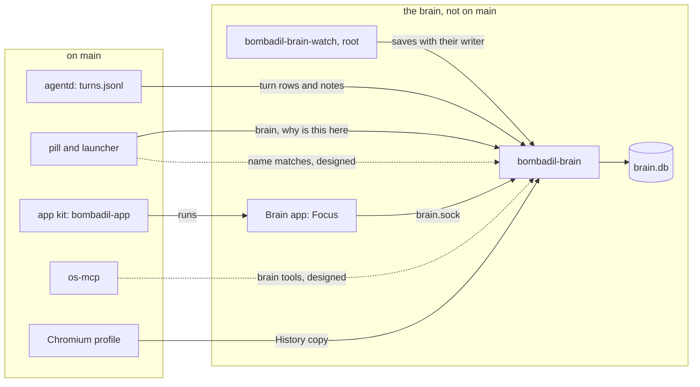

# The brain

> **Status:** In progress  
> **Code:** none of this is on `main`. It builds on `src/bombadil/agentd.py`, `src/bombadil/narrate.py`, `src/bombadil/procs.py`, `src/bombadil/launcher.py`, `src/bombadil/apps.py`, `src/bombadil/appkit/`, `src/bombadil/browser.py`, `src/bombadil/mcp_server.py` and `src/bombadil/paths.py`. Files planned for it (an unmerged branch has them, `main` does not): `src/bombadil/brain/`, `share/apps/brain/`, `bin/bombadil-brain`, `bin/bombadil-brain-watch` and two systemd units under `iso/airootfs/etc/systemd/`.  
> **Design:** [Bombadil's Brain](../design/brain-brief.md), [the page](../design/pages/bombadils-brain.html)  
> **Verified:** 2026-10-01 against `main` at `6150431`: no code of this piece is on `main`. The unmerged work was read file by file (its source, its app, its units and its own notes), and its tests were not run.

The brain is meant to be an index of the whole machine that nobody writes. A file, a folder, a page, a download, a turn, a package and a coding session are things, and every link between two things is an event the OS saw, with who did it and when. It exists so that the person can ask "where did this come from?" or "why is this here?" and get an answer from a record in milliseconds, and so that the person and both agents ask one index instead of each rediscovering the machine with `find`, `ls` and `grep`. Plain files stay the truth: the index sits beside them and can be rebuilt.

## What it will do

- **The index that writes itself (built on an unmerged branch).** A user service `bombadil-brain` keeps `brain.db` (SQLite in WAL mode with an FTS5 index) and answers on `brain.sock`. A root service `bombadil-brain-watch` holds a fanotify mark on the whole btrfs filesystem and names each writer by its cgroup: a `bombadil-turn-*` scope is the machine's turn, a `bombadil-dev-<project>.slice` is a coding session, `bombadil-app run <name>` is an app, anything else is "you, in <app>". The service also reads `turns.jsonl`, Chromium's History, `pacman.log` and `memory.md`, and writes `user.bombadil.made_by` and `user.bombadil.origin` on files so the answer survives a move and a rebuild. "Where did this come from?" and "why is this here?" are answered from the index with no model call. Designed, not on the branch: the hooks and checkpoint refs of coding sessions, the git history of each app, each turn's snapper diff.
- **Focus (built on an unmerged branch).** A kit app, Brain, puts one thing in the middle with `Came from` on the left, `Read with` on the right, `Used with` below and `Changes` on top. A slot shows at most five lines then "+N more", and a trail records where you have been. A folder or project in the middle is its listing from disk, so the window is also a file browser. Every line says who and when. A dot says who (white you, orange the machine's agent, blue a coding session) and amber marks what another turn or coding session is changing while you look. Typing `brain` in the pill opens it on "this": the focused app, the browser's active tab, a terminal's file or folder, else the files the window's processes hold open under home. A one-line description is written by the fast model only when someone looks, pinned to a fingerprint of what it read, and greys out when that changes. Designed, not on the branch: clicking the "this" chip, "Undo this change" and "Go back to this".
- **Find from the pill (the search is built on an unmerged branch, the pill side is designed).** On the branch an FTS5 table with the trigram tokenizer holds titles, names and paths, ranked by pinned first, then by the time of the last touch. `bombadil brain find` and the Brain window's "Find anything" field use it. Designed, not built: matches from the index in the pill (grey completion, Tab walks up to three chips, Enter opens the thing, and only a match accepted with Tab opens without the model), a small grammar of a kind word and a time word, search over extracted text (the first 64 KB of text files, `pdftotext` output, EXIF dates) and ranking by aliveness.
- **The agents read the same brain (designed).** `os-mcp` gains `brain_search`, `brain_focus`, `brain_why`, `brain_timeline` and `brain_recent`. The coding-session MCP gains read-only `brain_search` and `brain_focus`, scoped to the session's project. Results are plain text with paths and reasons, and page titles and URLs are marked as untrusted data. The `[Screen]` block gains one line for "this", and a coding session starts with a "since your last session here" line built locally. Nothing else is added to a turn. Built on the branch toward it: one set of sentences (`focus.py`, `words.py`) for the window, the command line and the pill, and `agentd` telling the model only that the brain was asked, never what it answered.
- **Where the data lives (built on an unmerged branch).** `brain.db` sits in `~/.local/state/bombadil/` beside `turns.jsonl`, outside any restore point, and `bombadil brain rebuild` makes it again from files, xattrs and the logs. `brain.sock` is in the runtime directory. The watcher's socket is `/run/bombadil-brain/watch.sock`, and it spools to `/var/lib/bombadil-brain` while no brain listens. A copy of Chromium's History, which Chromium keeps locked, goes to `brain-tmp` in the runtime directory. On the person's files it writes only the two xattrs.
- **The Map and Time (designed, not built).** The Map lays areas out once (a project, an app, a folder, a site, System), stores every position in `brain.db`, draws about 200 of the most alive things at rest, joins areas by roads whose width says how much they share, and breathes a dot while someone touches it. A size mode answers "what's eating my disk?". Typing `map` opens it. Time is a strip under both views: seven days of stretches of work, split at 20 minutes of quiet or a change of main area and named from the words the person used or the most-touched title, with no model. Dragging back lights the Map, and in Focus it steps a thing through versions from git and snapper. It replaces Rewind, so `history` would open Time at the present moment. The branch has areas (`things.area`) but no positions and no stretches. After the six pieces the brief plans "Files through the Brain".

## How it fits

Solid lines are built on the unmerged branch, and the boxes say what is on `main`. Dotted lines are designed only.

**What it builds on in `main`**

| Existing piece | What the brain does there |
|---|---|
| `src/bombadil/agentd.py`, `AgentD._log` and `_log_line` | Reads the rows appended to `paths.turns_log()`. A row has `t`, `prompt`, `result`, `ok`, `snapshot`, `provider`, `session`, `stopped`, `summary`, `read` and `details`, and no list of files written, so "made by turn 41" needs a field added. |
| `src/bombadil/narrate.py`, `Narrator.read_list()` and `prompt_reads()` | `read` is a list of `label`, `kind`, `outside` and `origin`: the source of "came from". `prompt_reads` already parses a `[Screen]` block in a prompt. |
| `src/bombadil/agentd.py` (`unit = f"bombadil-turn-..."`), `src/bombadil/procs.py` (`in_scope`, `cgroup_of`) | Each turn runs in a transient user scope named `bombadil-turn-<pid>-<turn>-<start>` when `procs.scope_supported()`. The watcher maps a writer's cgroup to that scope. |
| `src/bombadil/launcher.py`, `match`, `entries`, `CORE_COMMANDS` | The pill's exact list of words, pushed to the pill as `entries` (`agentd.py`, `_entries_msg`) for Tab. `brain` and its questions join the list. The list has no source of names but apps, panels, widgets and commands. |
| `src/bombadil/launcher.py`, `Launcher._history`, `bin/bombadil`, `src/bombadil/watch.py`, `history_lines` | `history` opens `bombadil history`, a terminal list of recent turns and launcher actions. Time folds this in. |
| `src/bombadil/apps.py`, `builtin_dir()`, `app_dir`, `is_builtin`; `src/bombadil/appkit/context.py` | `builtin_dir()` is `share/apps`, which does not exist on `main`, and a built-in app keeps its data under `<state>/apps/<name>/data`. See [app kit](app-kit.md#add-a-built-in-app). |
| `src/bombadil/appkit/` (`bombadil-app`, `placement.show`), `share/qml/Bombadil/` (`Editor` with `readOnly`, `ItemList`, `SearchField`, `EmptyState`) | The Brain window is a kit app. An optional `app.py` `Backend` is exposed to QML as `backend` (`appkit/runtime.py`). |
| `src/bombadil/browser.py`, `command()`, `profile_dir()`, `DevTools.tabs()` | Chromium has its own `--user-data-dir` (`paths.data_dir() / "browser"`) and a debugging port, so History is in a known place and "this" can be the active tab. |
| `src/bombadil/mcp_server.py`, `OsTools._register` | Where `brain_*` tools would be registered. None exists. |
| `src/bombadil/paths.py`, `state_dir()`, `runtime_dir()`, `turns_log()` | Where `brain.db` and `brain.sock` sit, beside `turns.jsonl`. |
| `iso/airootfs/etc/skel/.config/hypr/hyprland.lua`, `bin/bombadil` (`pill`), `agentd.py` (`summon`) | A tap on Super runs `bombadil pill`, which sends `{"type": "summon"}`. |
| `iso/airootfs/usr/local/bin/bombadil-install` | Creates one snapper config, `root`, for `/`. `/home` is in no snapshot ([restore points](restore-points.md)), so an undo never touches `brain.db`, and versions of home files wait for a config of their own. |

## Interfaces it adds (planned)

| Name | What it is | Status |
|---|---|---|
| `bombadil-brain`, `bombadil-brain-watch` | User service and root service, `bin/bombadil-brain` and `bin/bombadil-brain-watch`, units under `iso/airootfs/etc/systemd/` | on the branch |
| `brain.db` | SQLite file at `paths.brain_db()`, env `BOMBADIL_BRAIN_DB`: `things`, `events`, `links`, `turns`, `descriptions`, FTS5 `search` | on the branch |
| `brain.sock` | JSON lines at `paths.brain_socket()`, env `BOMBADIL_BRAIN_SOCKET`. Ops: `status`, `thing`, `focus`, `children`, `why`, `search`, `recent`, `show`, `requested`, `describe`, `note`, `subscribe`, `rebuild` | on the branch |
| `map`, `timeline` | Ops the brief names for the Map and Time | planned |
| `/run/bombadil-brain/watch.sock` | The watcher's socket, env `BOMBADIL_WATCH_SOCKET`. Also `BOMBADIL_CHROMIUM_DIRS` and, for the end-to-end test, `BOMBADIL_WATCHER_CMD` | on the branch |
| `bombadil brain [status]`, `why PATH`, `find WORDS`, `focus REF`, `rebuild` | Commands in `bin/bombadil`, `--json` on any | on the branch |
| `brain`, `why is this here` | Pill words in `launcher.BRAIN_COMMANDS`, action kinds `brain` and `whyhere` | on the branch |
| `map`; `history` opening Time | Pill words | planned |
| `{"type": "summon", "text": "..."}` | `agentd` message that puts words in the pill (the Brain's "Ask about this") | on the branch |
| `n`, `unit`, `started`, `files` (`wrote`, `read`) | Fields added to a `turns.jsonl` row beside `read` | on the branch |
| `user.bombadil.made_by`, `user.bombadil.origin` | xattrs on files | on the branch |
| `share/apps/brain/` | The Brain app, `app.toml` title "Brain", icon `network` | on the branch |
| `Provider.describe_command` | One-shot, no-tools command for descriptions, in `src/bombadil/providers.py` | on the branch |
| `poppler` | Package in `iso/packages.x86_64` for `pdftotext` and `pdftoppm` | on the branch |
| `brain_search(query, kind, since)`, `brain_focus(thing)`, `brain_why(path)`, `brain_timeline(since, area)`, `brain_recent` | `os-mcp` tools. The coding-session MCP gets read-only `brain_search` and `brain_focus` | planned |
| A kit `Brain` object (search, focus, subscribe) | Lets an ordinary app stay current from the brain | planned |

## Principles it keeps

- [Plain files stay the truth](../principles.md#plain-files-stay-the-truth): `brain.db` is a cache and `bombadil brain rebuild` remakes it. The trap is a fact that exists only in the index (a tag, a link, a view that edits files no other tool sees), or a view that opens `brain.db` instead of asking the service.
- [Records before models](../principles.md#records-before-models): every link is a witnessed event with a reason and a time, and "why" answers with no model. The trap is a "similar" link, a nightly summary, or a model call on the path of an answer. The brief cuts all three.
- [One machine, one conversation](../principles.md#one-machine-one-conversation): the pill, the window, the command line, the tools and coding sessions ask one index. The trap is a second store for an agent (a notes folder, project knowledge in `memory.md`) or a view that words its own answer.
- [Degrade and recover](../principles.md#degrade-and-recover): if `bombadil-brain` dies, the pill, turns, undo and apps carry on, and the watcher spools. The trap is any turn, undo or pill action that waits on `brain.sock`, or a first index a person must wait for.
- ["This" means what you see](../principles.md#this-means-what-you-see): "this" is read from the machine at the moment of the tap (the focused app's open files, the active tab) and never guessed. The trap is a "last opened file" fallback or asking the model which file.
- [Colour says who](../principles.md#colour-says-who): white is the person, orange the machine's agent, blue a coding session, and position says what. The trap is a colour per area or per kind of thing.

## Before you build on it

- **Order (the brief).** 1 the index (L, first because history that was not recorded cannot be rebuilt), 2 Focus (M), 3 find from the pill (S to M), 4 the agents (S to M), 5 the Map (M), 6 Time (M). The Map waits for weeks of history. Test in a VM before piece 1: a fanotify mark on a `subvolid=5` mount catching writes made through `/home`, a large build without dropped events, a pidfd resolved to a cgroup fast enough, and xattrs surviving Chromium's rename from `.crdownload`. The unmerged work says it checked the first of these under QEMU (`tests/vm/btrfs-kernel.sh`); that was read, not run.
- **Waits on the owner.** The brief's 17 defaults are confirmed. Open are the five under "Not designed yet": the phone, more than one machine, email, calendar and people, sharing a view, and a million files and five years of history. The brief also does not say where a pin, a "forget this" or a link the person asked for is kept, since a rebuild reads only files, xattrs, git, `turns.jsonl`, snapper and History.
- **Waits on other pieces.** The "this" chip and the `[Screen]` block (`narrate.prompt_reads` parses one, nothing on `main` writes one). Coding sessions and `bombadil-dev-<project>.slice` (no code on `main`). Apps as systemd units, since `bombadil-app run <name>` is named by process today (`procs.py`). `memory.md`, which no code on `main` reads or writes. A snapper config for `/home`.
- **Fix before merging.** The history reader of the unmerged work looks in `~/.config/chromium` and `~/.config/bombadil/chromium` unless `BOMBADIL_CHROMIUM_DIRS` is set, while `browser.profile_dir()` is `~/.local/share/bombadil/browser`.
- **Do not break.** The `read` list and the other fields of a `turns.jsonl` row (`bombadil history` reads them). The `why` action in `launcher.py` and `agentd.py`, which answers a running step with no model. The exact-words rule of `launcher.match`: only a match accepted with Tab opens without the model. The `bombadil-turn-` scope prefix that `procs.cgroup_of` checks. A person's `~/Apps/<name>` taking the place of a built-in app (`apps.app_dir`).

## When it ships

This page is then replaced by the full piece page in the skeleton of [documenting your piece](../contributing/documenting.md), the [roadmap](../roadmap.md) row is updated and the brief gets its status line. Until then each piece that ships changes the status and the tables here.
