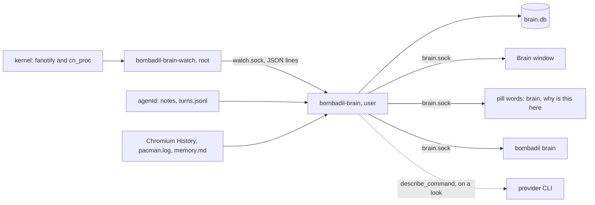
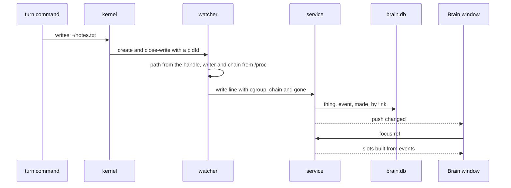
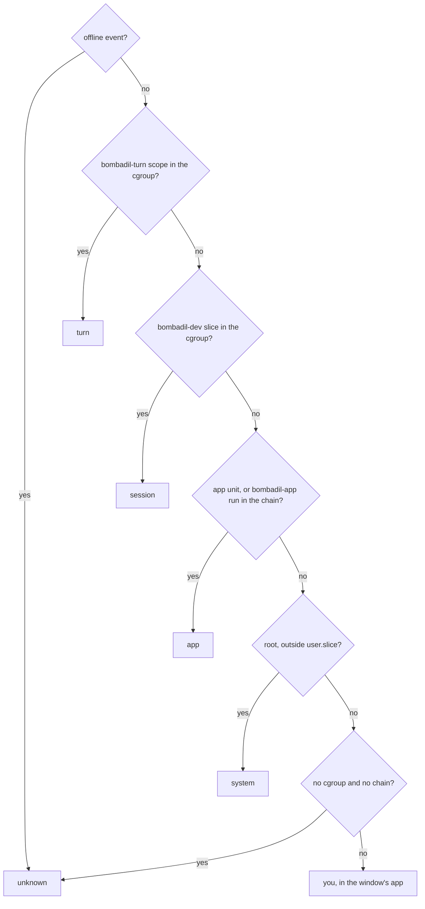

# The brain

> **Status:** Partly shipped  
> **Code:** `src/bombadil/brain/`, `share/apps/brain/`, `bin/bombadil-brain`, `bin/bombadil-brain-watch`, `iso/airootfs/etc/systemd/user/bombadil-brain.service`, `iso/airootfs/etc/systemd/system/bombadil-brain-watch.service`, and the brain's parts of `src/bombadil/agentd.py`, `src/bombadil/launcher.py`, `src/bombadil/paths.py`, `src/bombadil/providers.py` and `bin/bombadil`  
> **Design:** [Bombadil's Brain](../design/brain-brief.md), [the page](../design/pages/bombadils-brain.html)  
> **Verified:** 2026-10-01 against `main` at `a30ebc8`

The brain is an index of the person's files, pages, turns and packages that nobody writes: their home folder, `/etc` and the package log, not every file on the disk. Each link between two things is an event the machine witnessed, with who did it and when, so "where did this come from?" and "why is this here?" are answered from a record, with no model call. Plain files stay the truth: `brain.db` sits beside them and `bombadil brain rebuild` makes it again.

On `main` are the index, the Brain window (Focus) and the search half of finding. The agents' tools, the Map and Time are designed and have no code. A coding session becomes a thing once coding sessions exist: `brain/actors.py` already names their scopes, and nothing on `main` creates one (see [Known gaps](#known-gaps)).

| Part of the brief | State | What is there |
|---|---|---|
| 1. The index | Shipped | Root watcher, user service, `brain.db`, witnesses (`turns.jsonl`, Chromium's `History`, `pacman.log`, `memory.md`), two xattrs, the first index |
| 2. Focus | Shipped | The Brain window (`share/apps/brain/`), the pill words `brain` and `why is this here`, `bombadil brain focus` |
| 3. Find, the search | Shipped | `search` op, `bombadil brain find`, "Find anything" in the window |
| 3. Find, matches in the pill | Designed | Grey completion, Tab walking up to three chips, a kind word and a time word, search over extracted text, ranking by aliveness |
| 4. The agents read it | Designed | `brain_search`, `brain_focus`, `brain_why`, `brain_timeline` and `brain_recent` in `os-mcp`, a brain line in the `[Screen]` block |
| 5. The Map, 6. Time | Designed | No positions, no stretches, no `map` or `timeline` op. `things.area` exists |
| Also designed | Designed | Coding-session hooks and checkpoint refs, git history of each app, a turn's snapper diff, the "this" chip, "Undo this change", "Go back to this" |

## How it works



The watcher only collects facts. The service decides what they mean. That edge is kept thin on purpose, so the watcher can be replaced without touching the rest (see [Extending it](#extending-it) and the [Rust question](../design/rust-question.md)).



**The watcher.** `bombadil-brain-watch` is a root system service that holds one fanotify filesystem mark (`MASK`: create, delete, rename, close-write and directory events), reported by directory handle and name (`FAN_REPORT_DFID_NAME`) with a pidfd for the writer (`FAN_REPORT_PIDFD`; on a kernel without it, `/proc` is trusted as read). On btrfs a mark with handle reporting fails with `EXDEV` on a subvolume (`/` is `@`, `/home` is `@home`), so the watcher unshares its mount namespace, mounts the top level (`subvolid=5`) read-only at `/run/bombadil-brain/top` and marks that. One mark then covers every subvolume of the filesystem, nested ones included, and each handle's path is mapped back through `/proc/self/mountinfo` (`<top>/@home/<name>/a.txt` is `/home/<name>/a.txt`, where `<top>` is the private mount). Only paths under `/home`, under `/etc` and `/var/log/pacman.log` are sent on (`Scope.keep`), and `.cache/`, git objects, `node_modules` and `__pycache__` are dropped first (`HOME_NOISE`, `ANY_NOISE`). Where `/home` is not on btrfs (the live ISO, an ext4 development machine) the watcher stays up, answers `hello` with `watching: false` and a reason, and sends nothing.

**The writer.** The pid is read from `/proc`: its cgroup and its chain of parents (at most 10 processes, each with its command line cut to 200 characters). The pidfd says whether that pid is still the writer, because a reaped and reused pid would name someone else. A writer that already exited (`echo x > f` in a turn) is named by its nearest live ancestor through a `cn_proc` fork tracker (`forks.py`, needs `CAP_NET_ADMIN`), and the event says `gone: true`. Without the tracker such writers have no name.

**Missed time.** After a start, `btrfs subvolume find-new` lists what was written under `/home` while the watcher was stopped, from the generation kept in `generations.json`, as `offline` events and then `caught_up`. A generation is kept only once the queue was read to empty after it. Deletes and renames made meanwhile are invisible to `find-new`, so the brain walks for those. While a user's brain is away, the watcher spools that user's lines (see [Where state lives](#where-state-lives)).

**The service.** `bombadil-brain` is a user service. All store writes run on one worker, and the event loop only moves lines. The first index and the catch-up walk run on their own worker at `nice` 10 and idle I/O priority, 500 entries a transaction, and a folder of more than 5000 entries is one thing that says how many files it holds. With a watcher nothing is scanned on a timer: a write to `turns.jsonl`, `pacman.log`, `memory.md` or a Chromium `History` file wakes that witness. Without a watcher the service looks at the logs every 60 seconds (`LOOK_S`). A damaged `brain.db` is set aside as `brain.db.broken` and made again.

**Turns.** `agentd` sends the note `turn_start` (`n`, `unit`, `prompt`, `t`) once a turn's process exists, so writes in the `bombadil-turn-*` scope belong to a numbered turn before its row exists, and `turn_end` after the row is written ([agentd.md](agentd.md#notes-to-the-brain)). `Ingest.turn_row` then takes `files.wrote` (at most 200 paths) and `files.read` (at most 50) from the row. A written file `came_from` a read file only when the turn read at most 10 and wrote at most 10 (a turn that read fifty files and wrote thirty says nothing). A writer that left before the watcher looked, whose nearest live ancestor is `agentd`, counts for the running turn until 10 seconds after it ended (`LATE_TURN_S`).

**Who did it.** `actors.from_event` reads the cgroup and the chain in this order:



The window's app is the last process before the session's root (`Hyprland`, `systemd`, `agentd`...), named in plain words (`WINDOW_NAMES`: "the terminal", "the browser", "Files"). `sudo vim` in the person's terminal stays theirs, because root outside a turn is the system only when its cgroup is not under `/user.slice/`. A file made by a turn, session or app also gets `user.bombadil.made_by` (`turn 41`), and a finished download gets `user.bombadil.origin`, so the answer survives a move, a copy that keeps xattrs and a rebuild.

**Things, events, links.** `things` are files, folders, projects, apps, pages, sites, turns, sessions, packages, `fact` lines of `memory.md` and `system`. Files are found by `path` and the rest by `key` (`turn:41`, `app:<name>`, `url:<page>`, `package:<name>`, `site:<host>`, `system`). A thing is never deleted: `deleted` says when it went. Identity follows the file: a rename or move keeps the thing (matched by inode on a walk), an editor's save by rename keeps the old one, and a delete and write within 10 seconds revives it. `events` (`create`, `change`, `move`, `delete`, `trash`, `download`, `visit`, `install`, `upgrade`, `remove`) carry the `actor`: `you`, `turn`, `session`, `app`, `system` or `unknown` (written while nobody watched). A thing's `made_by` can also be `before`: it was there before the brain. `change` events on one thing by one actor and program within 60 seconds fold into one row (`COALESCE_S`). `links` hold the strong edges, each with first time, last time, a count and the event behind it: `made_by`, `changed_by` and `came_from` are created, `asked_about` only from a `this` field that `agentd` never writes, and `mentions` is never created. The weak relations are worked out when Focus asks, so they cannot go stale: **Read with** is a page open in the 20 minutes before a change (unless closed more than a minute before it started), and **Used with** is a thing changed on the same occasion at least twice (a turn, or a run of one actor's saves no more than 20 minutes apart).

**What gets in.** `rules.classify` decides, without touching the disk. Caches, most dot-folders (an allow list keeps `.bashrc`, `.config/hypr`, `.ssh`...), build output, git-ignored files (git answers, one `check-ignore` per repository), and editors' swap and temp files stay out. A move into `~/.local/share/Trash` is recorded as a `trash` event (the thing is marked gone and a move back restores it), and nothing inside the Trash is a thing. Writes under `~/Apps/<name>/data/` count as the app changing. A **private** thing is known by name only and its contents are never read, previewed or described: `~/.ssh`, `~/.gnupg`, password stores, keyrings, key and certificate suffixes (`.pem`, `.key`, `.kdbx`...), names with `password`, `secret`, `credential` or `.env`, and under `/etc` `shadow`, `sudoers*`, `ssh_host_*` and the folders of VPN, Wi-Fi and TLS keys. A link that leads to a private path is private too (`describe.private_path`).

**Focus.** `focus.focus` puts one thing in the middle with `came_from` on the left, `read_with` on the right, `used_with` below and `changes` on top. A slot holds at most five lines (the window asks for 50 after "+N more"), and every line says who and when in the same words as the command line and the pill (`words.py`: "the machine, turn 41, “install the VPN”", "you, in the terminal", `13:02` today, `Tue 14:02` this week). A folder or project in the middle is listed from disk (`children`), so Focus is also a file browser that is never behind. A dot says who: white for the person, orange for the machine's agent, blue for a coding session, muted for an app. **Amber** marks a "Used with" line that another turn or session changed in the last 15 minutes (`BUSY_S`), worded `also being changed by <who>`. **Ask about this** puts `About <path>: ` in the pill, with the path shown with `~`; for a page it is the URL, else the title.

**"This".** `brain/this.py` reads what is in front when `brain` or `why is this here` is submitted, never guessed: Hyprland's active window; for the person's own app, `app:<name>`; for the browser, the active tab's URL from `http://127.0.0.1:9222/json`; for a terminal, the file its foreground program has open or was started on, else its folder; for anything else, the files its processes hold open under home, newest first (looking at no more than 256 processes). Settings, caches and dot-files are never "this". A tap on Super only sends `summon`.

**Descriptions.** One sentence of at most 20 words about a thing, written by the provider's fast model. It is written only when a `focus` or `describe` request asks (one at a time, three waiting, the newest look first), never for a private thing, and it is pinned to a fingerprint of what the model was shown: it greys out when that changes and is written again at the next look. The model is shown the first 64 KB of a text file, the first three pages of a PDF (through `pdftotext` on a copy in `brain-tmp`), up to 200 names in a folder (no dot-names, caches or private names), a page's title and address without its query, or a turn's words and answer. The prompt fences that material with a random marker and tells the model it is data, never instructions. `Claude` runs with `--tools ""`, `--strict-mcp-config` and `--safe-mode`; `Codex` with a read-only sandbox. The brain reads with `O_NOATIME` where the kernel allows it (files the person owns), so "nothing has opened it since" stays true after a look.

## Interfaces other pieces depend on

### Programs and environment

| Name | What it is |
|---|---|
| `bombadil-brain` | `bin/bombadil-brain`, user unit `iso/airootfs/etc/systemd/user/bombadil-brain.service` (in `default.target.wants`, `Restart=on-failure`, `StartLimitIntervalSec=0`, `Nice=5`). Takes no arguments. A second one for the same `brain.db` exits 1 |
| `bombadil-brain-watch` | `bin/bombadil-brain-watch`, system unit `iso/airootfs/etc/systemd/system/bombadil-brain-watch.service` (in `multi-user.target.wants`, `PrivateMounts=yes`, `RuntimeDirectory=bombadil-brain` mode 0755, `StateDirectory=bombadil-brain` mode 0700, `LimitNOFILE=65536`, `Restart=on-failure`). Options `--path DIR`, `--socket SOCK`, `--state DIR`, `--top DIR`, `--spool-cap N`, `--home UID:DIR`. Exits 1 unless root |
| Environment | `BOMBADIL_BRAIN_DB` (default `<state dir>/brain.db`), `BOMBADIL_BRAIN_SOCKET` (default `<runtime dir>/brain.sock`), `BOMBADIL_WATCH_SOCKET` (service and watcher, default `/run/bombadil-brain/watch.sock`), `BOMBADIL_WATCH_PATH` and `BOMBADIL_WATCH_STATE` (the watcher's `--path` and `--state`), `BOMBADIL_CHROMIUM_DIRS` (colon-separated Chromium folders that replace the two defaults), `BOMBADIL_WATCHER_CMD` (tests only: the watcher program the end-to-end test starts) |
| `poppler`, `btrfs-progs` | Packages in `iso/packages.x86_64`: `pdftotext` and `pdftoppm` for descriptions and previews, `btrfs` for the catch-up |

### `brain.sock`

JSON lines. A request `{"id", "op", ...}` gets `{"id", "ok": true, "result"}` or `{"id", "ok": false, "error": "one plain sentence"}`. `ref` is an id, an absolute path (`~` is home), a URL or a key such as `turn:41`, `app:<name>` or `system`. `src/bombadil/brain/client.py` is the blocking client every caller uses (`request`, `notify`, `Connection`).

| Op | Request fields | Result |
|---|---|---|
| `status` | none | `text`, `things`, `events`, `walking`, `progress`, `watching`, `watcher`, `reason`, `indexed`, `turn` |
| `thing` | `ref` | the thing's row with `ref` and `title` |
| `focus` | `ref`, `limit` (5, 0 to 100), `looking` (a turn's or session's thing id: its own work is not "someone else") | `thing`, `preview`, `slots`, `children`, `description` (fields in the docstring of `focus.focus`) |
| `children` | `ref`, `offset`, `limit` (200, 1 to 1000) | `items`, `total` |
| `why` | `ref` | one or two sentences, or "The brain does not know this yet." |
| `search` | `q`, `kind`, `limit` (20, 1 to 200) | `items` |
| `recent` | `limit` (20) | `items` |
| `show` | `ref` | `ref`, `seq`, `title`, `id`, `t`; pushes `show` and keeps it as the requested thing for 120 seconds |
| `requested` | none | the last `show` less than 120 seconds old, else null |
| `describe` | `ref` | `{text, stale, pending}` or null |
| `note` | `kind` `turn_start` (`n`, `unit`, `prompt`, `t`) or `turn_end` (`n`) | `{noted: kind}` |
| `subscribe` | none | `{subscribed: true}`, then the connection gets pushes |
| `rebuild` | none | `{text}`; refused while one runs |

Pushes, after `subscribe`: `{"push": "changed", "things": [ids], "t"}` (at most four a second), `{"push": "show", "ref", "seq", "title", "id"}` and `{"push": "status", ...}` (at most once a second while a walk counts). A line is at most 1 MiB, and a client that falls 4 MiB behind is dropped.

### The watcher's contract

A replacement must keep this and nothing else. `tests/test_brain_watch.py::test_the_service_end_to_end` runs it against any program set in `BOMBADIL_WATCHER_CMD`.

| Part | What it must do |
|---|---|
| Socket | A Unix stream socket at `--socket`, one JSON object per line. Each connection is a user (`SO_PEERCRED`). The only line it reads is `{"op": "ping"}`, answered `{"op": "pong"}`; the service never sends one |
| Order | `hello` (`v`, `watching`, `fs`, `top`, `reason`), then the spool of what happened while that user's brain was away, then live lines. `overflow` and `caught_up` come after the events queued before them |
| Event lines | `op` is `create`, `write`, `delete`, `rename` or `offline`, with `t`, `path`, `old` (rename), `dir`, `ino`, `size`, then the writer |
| The writer | `pid`, `uid`, `comm`, `cgroup`, `chain` (`[pid, comm, command line]`, writer first, at most 10) and `gone`. An `offline` event has `pid` 0, the file's owner as `uid` and an empty chain. Which writer is "a turn" or "you" is `actors.py`'s job, not the watcher's |
| Other lines | `overflow` (the queue overflowed or a spool was cut: the brain walks) and `caught_up` (`offline`: how many files) |
| `batch` | `{"op": "batch", <writer fields>, "events": [...]}`: events by one writer in a row (within one read of the kernel queue, at most 1000 or 192 KiB) with the writer named once. The service unpacks it in order (`service._unbatch`). Every line stands alone, so a spool, a late reader and a reconnect need nothing before them |
| Routing | A user gets the events whose path is under their own home, plus `/etc` and `/var/log/pacman.log`. Root gets everything and is never spooled |
| Keeps | The fanotify mark, handle to path, `/proc` facts, the fork map, a spool per user (`SPOOL_CAP` 64 MiB, past it one `overflow`), `generations.json`, and the two noise lists |

### Commands and words

| Name | What it is |
|---|---|
| `bombadil brain [status]`, `why PATH`, `find WORDS`, `focus REF`, `rebuild` | `bin/bombadil`; `--json` on any prints the whole answer. `find` lists `title · where · when`; `focus` waits up to 10 seconds, `rebuild` up to 70 |
| `brain`, `the brain`, `open the brain`, `show the brain`, `open brain`, `show brain` | `launcher.BRAIN_COMMANDS["brain"]`: opens the Brain on "this" (`Launcher._brain` asks `show`, then opens the window). Completes with Tab |
| `why is this here`, `where did this come from`, `where is this from`, `who made this`, `what made this` | `launcher.BRAIN_COMMANDS["whyhere"]`: answers in the pill's line from `why` (`Launcher._whyhere`). In `NO_COMPLETE`, so it is typed in full. Both kinds are checked after `CORE_COMMANDS` and before app names, and `agentd.BRAIN_NOTES` tells the next turn only that the brain was opened or asked |
| `{"type": "summon", "text": "..."}` | `agentd` broadcasts it and the pill puts the words in its field. `text` is one line, printable characters only, cut to 500. The Brain's "Ask about this" sends it. `bombadil pill` sends none |
| `share/apps/brain/` | The Brain window: `app.toml` title "Brain", icon `network`. A built-in app, see [app-kit.md](app-kit.md#add-a-built-in-app) |
| `Provider.describe_command(model=None)` | A one-shot argv in `src/bombadil/providers.py`: prompt on stdin, answer on stdout, nothing saved. `Claude` and `Codex` have it, the base class raises `NotImplementedError` |
| `n`, `unit`, `started`, `files` (`wrote`, `read`) | Fields `agentd` adds to a turn row in `turns.jsonl`, read by `witnesses.TurnsLog` with `t`, `prompt`, `summary`, `provider`, `ok`, `stopped` and `snapshot` ([agentd.md](agentd.md#the-turn-log)) |
| `user.bombadil.made_by`, `user.bombadil.origin` | xattrs: `turn 41`, `session <project>/<name>` or `app <name>`; and a download's page address without its fragment or `user:password@`, query kept, cut to 1024 bytes |

### Designed, not built

| Name | What it would be |
|---|---|
| `map`, `timeline` | Ops for the Map and Time |
| `map`; `history` opening Time | Pill words |
| `brain_search(query, kind, since)`, `brain_focus(thing)`, `brain_why(path)`, `brain_timeline(since, area)`, `brain_recent` | `os-mcp` tools, with a read-only `brain_search` and `brain_focus` for coding sessions. None is registered in `src/bombadil/mcp_server.py` |
| A kit `Brain` object (search, focus, subscribe) | Lets an ordinary app stay current from the brain |

### What the brain relies on

| Piece | What it uses |
|---|---|
| `agentd` | `AgentD._log` rows, `AgentD._poke` (never waited for: `brain_client.notify` gives up after 0.3 s), `unit` scope names, `summon` |
| `src/bombadil/procs.py`, `src/bombadil/narrate.py` | `bombadil-turn-<pid>-<turn id>-<start>` scopes (`procs.cgroup_of` checks the prefix); `narrate` is not read: a turn's "came from" links come from `files`, not from its `read` field |
| `src/bombadil/browser.py`, `src/bombadil/paths.py` | `DEBUG_PORT` 9222 (`this.py` reads `/json` itself); `state_dir`, `runtime_dir`, `turns_log`, `is_turn_row`, `brain_db`, `brain_socket` |
| `src/bombadil/appkit/`, `share/qml/Bombadil/` | `AppWindow`, `Editor` (`readOnly`), `SearchField`, `EmptyState`, `Panel`, `Sparkline`, `Badge`, `IconButton`. The window draws lists with its own `BrainList.qml`, because the kit's `ItemList` takes `` in a title as markup and would fetch it, and the brain shows titles that others wrote |
| `iso/airootfs/usr/local/bin/bombadil-install` | One snapper config, `root`, for `/`. `/home` is in no snapshot, so an undo never touches `brain.db` ([restore-points.md](restore-points.md)) |

### Do not break

- **The fields of a `turns.jsonl` row.** `bombadil history` reads `t`, `kind`, `prompt`, `result`, `summary`, `stopped` and `snapshot` (`watch.history_lines`), `agentd` reads `n` at start (`_last_turn`), and the brain reads `t`, `prompt`, `summary`, `provider`, `ok`, `stopped`, `snapshot`, `unit`, `started`, `files` and `this`. No code on `main` reads a row's `read` or `details`.
- **`why` and `whyhere` are two words.** `why` answers what a running step is doing, with no model, and `whyhere` is the brain's. Both are in `NO_COMPLETE`.
- **The exact-words rule of `launcher.match`.** Only exact words run without the model. Matches from the index, once built, must keep it: only a match the person accepted with Tab may open without the model.
- **The `bombadil-turn-` scope prefix** that `procs.cgroup_of` checks and `actors.TURN_SCOPE` reads.
- **`apps.app_dir`**: a person's `~/Apps/<name>` with a `main.qml` takes the place of a built-in app of that name, the Brain included.

## Where state lives

| What | Where | Notes |
|---|---|---|
| The index | `brain.db` (and `-wal`, `-shm`) at `paths.brain_db()`: `~/.local/state/bombadil/brain.db`. Tables `meta`, `things`, `events`, `links`, `turns`, `descriptions`, and the FTS5 table `search` (trigram) | A cache. No mode is set on it. `rebuild` empties every table, and every `meta` key except `schema` and `brain.run` |
| Where each log was read to | `meta` keys `<name>.offset` and `<name>.head` | A log that shrank or starts differently is read again from the top |
| One brain per database | `brain.db.lock`, mode 0600 | `flock` held while running |
| The service's socket | `<runtime dir>/brain.sock`, mode 0600 | Set with `chmod` after the bind, so there is a short gap inside the runtime folder |
| A copy of Chromium's `History`, PDF text copies | `<runtime dir>/brain-tmp`, mode 0700, on the runtime tmpfs | Chromium keeps its `History` locked, so it is copied there to be read |
| PDF previews | `$XDG_CACHE_HOME/bombadil/brain`, else `~/.cache/bombadil/brain` | First page as a PNG, cached by path, size and mtime, the newest 200 kept (`PREVIEWS_KEPT`) |
| The watcher's socket | `/run/bombadil-brain/watch.sock`, mode 0666 in a 0755 folder | See below |
| The private top-level mount | `/run/bombadil-brain/top`, mode 0700, read-only with `nosuid`, `nodev`, `noexec` | In the watcher's own mount namespace only. If a kernel refuses a read-only mount it mounts read-write and remounts read-only, and logs when that fails |
| Spools and generations | `/var/lib/bombadil-brain/spool/<uid>.jsonl` (0600) and `/var/lib/bombadil-brain/generations.json`, in a 0700 folder | Spools are capped at 64 MiB each. A user is spooled once their brain has connected once |
| xattrs on the person's files | `user.bombadil.made_by`, `user.bombadil.origin` | The only thing the brain writes to the person's files |
| Read, never written | `turns.jsonl`, Chromium's `History` (`~/.config/chromium`, `~/.config/bombadil/chromium`, or `BOMBADIL_CHROMIUM_DIRS`), `/var/log/pacman.log`, `~/.bombadil/memory.md`, `~/.claude/CLAUDE.md` or `~/.codex/AGENTS.md` (the first that is a file), `~/.local/state/bombadil/dev/sessions.json` | Memory lines are capped at 256 KB |
| In memory only | The describer's queue, the fork map (bounded, kept for a couple of minutes after an exit), the window's trail (8 steps) | Lost at a stop |

**Who can read what.**

- **The watcher runs as root** and its unit does not restrict it: no `CapabilityBoundingSet`, `NoNewPrivileges`, `ProtectSystem` or `ReadOnlyPaths`. Through the private top-level mount it can see every subvolume on that filesystem, other users' homes and snapshots included, and through `/proc` every process. It sends names, times and writers, never file contents, and takes `lstat` of paths (no symlink is followed).
- **`watch.sock` is open to every local user.** Routing is by the peer's uid (`SO_PEERCRED`): a user's brain gets the events under that user's home, and every user gets the events under `/etc` and the `pacman.log` ones. An event line carries the writer's pid, uid, `comm`, cgroup and up to 10 command lines of its chain (each cut to 200 characters), so any local user can read what program, with what arguments, changed a file under `/etc`, and a user can receive the command line of another user's process that wrote under their home. The service does not store the chain: an event keeps the actor kind, the turn, session or app, and the program name. Root gets every event. Each uid may hold 8 connections and the watcher 256.
- **`brain.sock` is the person's own**: mode 0600, and anything running as that user can ask it anything (every path, every turn's prompt, `describe`, `rebuild`, `note`). There is no other authentication.
- **`brain.db` holds** names, who made each file, page titles and URLs with their query, each turn's prompt and summary, and one-sentence descriptions that a model wrote after reading the start of non-private files. It holds no file contents except the lines of `memory.md`, which are stored as `fact` things. Which other users can read it is decided by the mode of the home folder.
- **What leaves the machine.** A description sends the material listed under Descriptions to the configured provider, for any non-private thing that a `focus` or `describe` request names, and `bombadil brain focus PATH` is such a request. Private things are never sent. The turns' own conversation is [agentd's](agentd.md), and the whole picture is in [the security model](../security-model.md#who-can-reach-what).

## Principles it keeps

- [Plain files stay the truth](../principles.md#plain-files-stay-the-truth): `brain.db` is a cache and `bombadil brain rebuild` makes it again from the files, the two xattrs and the logs. The trap is a fact that exists only in the index (a tag, a link the person made, a view that edits files no other tool sees), or a view that opens `brain.db` instead of asking the service.
- [Records before models](../principles.md#records-before-models): every link is a witnessed event with a reason and a time, and `why` answers with no model. The trap is a "similar" link, a nightly summary, or a model call on the path of an answer. The one model call, a description, is pinned to what it read, greys out when that changes and never gates an answer.
- [One machine, one conversation](../principles.md#one-machine-one-conversation): the pill, the window and the command line ask one index and share one set of sentences (`focus.py`, `words.py`). The trap is a second store for an agent, a notes folder beside the brain, or a view that words its own answer.
- [Every piece degrades](../principles.md#degrade-and-recover): if `bombadil-brain` dies, the pill, turns, undo and apps carry on and the watcher spools. Without the watcher the brain learns from turns, `History`, `pacman.log` and walks of home. The trap is any turn, undo or pill action that waits on `brain.sock` (a note gives up after 0.3 s), or a first index a person must wait for.
- [This means what you see](../principles.md#this-means-what-you-see): "this" is read from the machine when `brain` or `why is this here` is submitted, and never asked of the model. The trap is asking the model which file, or a fallback the person cannot see. The brief reads it at the tap of Super, with a "this" chip and a last-saved fallback; `this.py` has neither.
- [Colour says who](../principles.md#colour-says-who): the dot is white for the person, orange for the machine's agent and blue for a coding session, and position says what kind of link. The trap is a colour per area or per kind of thing. Amber is the one extra mark, and it means "someone else changed this a moment ago".

## Extending it

1. **Add a source of facts (a witness).**
   1. Add a class to `src/bombadil/brain/witnesses.py` beside `TurnsLog`, `History`, `PacmanLog` and `Memory`. It takes the `Ingest` and reads only what was added since last time. For a log that grows use `_Tail(store, path, name)`, which keeps its place in `meta`. Never raise, never read a private file (`rules.private`), and make events only through `Ingest` (`saw`, `visit`, `download`, `package`, `facts`, `turn_row`).
   2. Build it in `Brain._make_witnesses` (`service.py`), with an option for its file in `Brain.__init__` (`self._opts`) so a test can point it at a temporary file.
   3. Read what it missed while the brain was away in `Brain._witnesses`, through `self._safely`.
   4. Make a write to its file wake it: add the file in `Brain._specials` (`ingest.specials[path] = handler`), have the handler set a key in `self._dirty`, and read the witness in `Brain._after`. Without a watcher, add it to `_changed_logs` and `_look`, which compare size and mtime once a minute.
   5. Test the reader in `tests/test_brain_witnesses.py` and the wake-up in `tests/test_brain_service.py` (`make_brain`, `FakeWatcher`).
2. **Add a kind of writer ("a cron job", "a container").**
   1. In `src/bombadil/brain/actors.py` add a pattern for its unit name or process chain beside `TURN_SCOPE`, `DEV_SLICE`, `APP_UNIT` and `_app_from_chain`, and return an `Actor` from `from_event` at the right place: the order of the branches is the precedence.
   2. If it is an actor kind other than turn, session or app, add it to `ACTORS` and `KINDS` in `focus.py`, to `words.who` and `focus.short` for its sentence, to `Ingest.who` and `Ingest._who_from_label`, and to `dot` in `share/apps/brain/who.js`. Give it no colour of its own unless the principle allows it.
   3. Test in `tests/test_brain_core.py` and the sentence in `tests/test_brain_focus.py`.
3. **Change what counts as a thing, what is private, which area.** Edit the lists at the top of `src/bombadil/brain/rules.py` (`NOISE_DIRS`, `DOT_ALLOWED`, `DOT_SKIPPED`, `PRIVATE_DIRS`, `ETC_PRIVATE_DIRS`, `PRIVATE_SUFFIXES`, `PRIVATE_NAME`, `TEMP_NAME`, `ETC_NOISE`, `CONTAINERS`) or `classify`, `private` and `area_of`. The watcher has two noise lists of its own (`HOME_NOISE`, `ANY_NOISE` in `watch.py`) that drop paths for volume before they are sent. Private means name only: add the test to `tests/test_brain_core.py`.
4. **Add a relation to Focus.** Add a method to `_Focus` in `src/bombadil/brain/focus.py` beside `read_with` and `used_with`, call it from `_Focus.focus` into `slots`, work it out from events when asked (so it cannot go stale), and build each line with `self.line` or `self.busy` so it has a `why` and a time. Show it in `share/apps/brain/main.qml` (a `Slot`) and in `focus_lines` in `bin/bombadil`. Test in `tests/test_brain_focus.py`.
5. **Add a view.** Write a kit app that opens `brain.sock` itself, as `share/apps/brain/app.py` does, and never opens `brain.db`: the service is the one writer. Its list must draw titles as plain text (`textFormat: Text.PlainText`). See [app-kit.md](app-kit.md#add-a-built-in-app).
6. **Add a socket op.** Add the name to `OPS` in `service.py` and write `async def _op_<name>(self, req, conn)`: the dispatcher is `getattr(self, f"_op_{op}")`. Raise `Refusal("a plain sentence")` for a no, and run store work through `await self.job(fn, ...)` so it stays on the one worker. Add it to the table above and test it in `tests/test_brain_service.py`.
7. **Add a pill word.** Follow [Add a launcher word](agentd.md#add-a-launcher-word): an entry in `BRAIN_COMMANDS`, a `Launcher._<kind>` method, and a line in `agentd.BRAIN_NOTES`, because a kind that is not in it has its answer told to the next turn, and the brain's answers quote page titles that others wrote.
8. **Replace the watcher.** Replace `watch.py`, `fanotify.py` and `forks.py`, keep the contract above, and run `BOMBADIL_WATCHER_CMD="<your program>" python3 -m pytest tests/test_brain_watch.py::test_the_service_end_to_end`. The reasoning is in the [Rust question](../design/rust-question.md).
9. **Let a provider describe.** Implement `describe_command`, see [Add a provider](agentd.md#add-a-provider).

To run the brain on a machine without root or btrfs, it learns from turns, `History`, `pacman.log` and one walk of home, and says that the watcher is off:

```sh
BOMBADIL_BRAIN_DB=/tmp/brain.db BOMBADIL_BRAIN_SOCKET=/tmp/brain.sock bin/bombadil-brain
BOMBADIL_BRAIN_SOCKET=/tmp/brain.sock bin/bombadil brain status
BOMBADIL_BRAIN_SOCKET=/tmp/brain.sock bin/bombadil-app check brain --screenshot /tmp/brain.png
```

## Tests

| File | Covers |
|---|---|
| `tests/test_brain_core.py` (78) | `brain.db`, `rules`, `actors`, `words`, and how events become things and links |
| `tests/test_brain_index.py` (18) | The first index, reconcile (renames by inode, deletions), the cap, priority per worker, the `made_by` xattr |
| `tests/test_brain_witnesses.py` (33) | `turns.jsonl`, Chromium's `History`, `pacman.log`, `memory.md` |
| `tests/test_brain_watch.py` (42), `tests/test_brain_fanotify.py` (10), `tests/test_brain_forks.py` (7) | The watcher: mountinfo and path mapping, routing by uid, spools, batches, the fanotify and netlink parsers, and the end-to-end run of the real program |
| `tests/test_brain_service.py` (32), `tests/test_brain_client.py` (8) | The service over a fake watcher, the ops, the client, a note that never waits |
| `tests/test_brain_focus.py` (46), `tests/test_brain_this.py` (19), `tests/test_brain_describe.py` (18) | Focus and `why`, "this" over a fake `/proc`, descriptions (never from a real CLI) |
| `tests/test_brain_app.py` | The Brain window's backend against a fake brain. Skipped as a whole when `PySide6` is not installed |
| `tests/test_launcher.py` (209) | The brain's words and what they answer, with the rest of the launcher |
| `tests/vm/btrfs-kernel.sh`, `tests/vm/samples/brain-watch/` | The watcher on a real kernel and the installer's btrfs layout under QEMU: the `EXDEV` failure, the private mount, an offline catch-up ([development.md](../contributing/development.md#the-btrfs-kernel-vm)) |
| `scripts/test-vm.sh`, `MODE=install` | The brain's ten smoke checks (`brain-watch-active` to `brain-rename-keeps-thing`) under real systemd |

```sh
python3 -m pytest -q tests/test_brain_*.py tests/test_launcher.py
```

On 2026-10-01 this passed with 520 tests and 1 skipped (`test_brain_app.py`, no `PySide6` in that environment). The end-to-end watcher test, the live fanotify and `cn_proc` tests ran there as root, and skip themselves where filesystem marks do not work. The async tests of the notes in `tests/test_agentd.py` need `pytest-asyncio`. The VM scripts were read, not run. No test drives the Super tap and "this" on a live Hyprland desktop, and none loads the watcher with a real user's work or another kernel.

## Known gaps

- **The History reader misses Bombadil's own browser.** `History._roots` looks in `~/.config/chromium` and `~/.config/bombadil/chromium` (`src/bombadil/brain/witnesses.py:292-299`), while `profile_dir()` is `~/.local/share/bombadil/browser` (`src/bombadil/browser.py:33-34`). With default settings, pages read and files downloaded in that browser are not in the brain unless `BOMBADIL_CHROMIUM_DIRS` names its folder.
- **No pin and no "forget this".** Nothing sets `things.pinned` or `things.forgotten` (`src/bombadil/brain/store.py:57-58`), though `search` orders by `pinned` first and `search` and `children` skip forgotten things (`store.py:396`, `store.py:444`). A rebuild empties `things` (`Brain._wipe` in `service.py`), so such a mark would not survive it, and the brief does not say where one is kept.
- **`asked_about` has no source and `mentions` has none.** `Ingest.turn_row` reads a `this` field of a turn row (`src/bombadil/brain/ingest.py:623-628`), and the row `AgentD._log` writes has none (`src/bombadil/agentd.py:1530-1539`). `mentions` is named in the docstring of `src/bombadil/brain/store.py` and nothing creates it.
- **Coding sessions cannot occur on `main`.** `actors.py` names `bombadil-dev-<project>.slice` and `Brain._open` reads `~/.local/state/bombadil/dev/sessions.json` (`src/bombadil/brain/service.py:434`), and nothing on `main` creates either, so the `session` actor and the blue dot never appear ([coding-sessions.md](coding-sessions.md)).
- **No `memory.md` writer.** `Memory.candidates` reads `~/.bombadil/memory.md`, `~/.claude/CLAUDE.md` or `~/.codex/AGENTS.md` (`src/bombadil/brain/witnesses.py:740-746`), and no code on `main` writes one, so `fact` things exist only if a person writes the file.
- **The watcher's socket is mode 0666** (`src/bombadil/brain/watch.py:1067`) and its unit sets no `CapabilityBoundingSet`, `NoNewPrivileges`, `ProtectSystem` or `ReadOnlyPaths` (`iso/airootfs/etc/systemd/system/bombadil-brain-watch.service`). Any local user can read the `/etc` events with their writers' command lines (`Hub.wants` at `watch.py:638`, `Scope.system`, `ProcInfo.cmd`).
- **The watcher blocks its loop on `btrfs subvolume find-new`.** `Watcher.catch_up` runs before the loop (`src/bombadil/brain/watch.py:1242`), so no client is accepted meanwhile, and `read_markers` runs inside it every 60 seconds (`GENERATIONS_EVERY`, `:1282`), once per subvolume, each call with a 120 second timeout (`Btrfs._run`, `:861`).
- **Page addresses are stored with their query.** `fingerprint_url` strips the fragment and any `user:password@` but keeps the query (`src/bombadil/brain/ingest.py:60-71`), so a token in a query lands in `brain.db` and in the `user.bombadil.origin` xattr. The description prompt drops the query (`describe._plain_url`).
- **`brain.db` has no mode of its own.** Nothing in `store.py` or `service.py` sets one (`Store.__init__`, `store.py:144-162`), so the umask and the home folder's mode decide who else can read it.
- **The Codex describer has less fencing than the Claude one.** `Codex.describe_command` gives a read-only sandbox (`src/bombadil/providers.py:502-507`), while the docstring of `describe.py` says "no tools and no MCP servers" and `Claude.describe_command` does give that (`providers.py:321-329`).
- **The window's description overstates.** `share/apps/brain/app.toml` says "Everything on this machine", and the brain covers home, `/etc` and packages.
- **A running `rebuild` costs descriptions.** It empties `descriptions` with the other tables, so each is written again, and sent to the provider again, at the next look.
