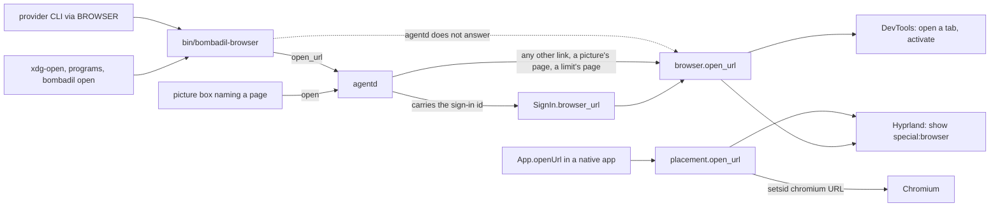
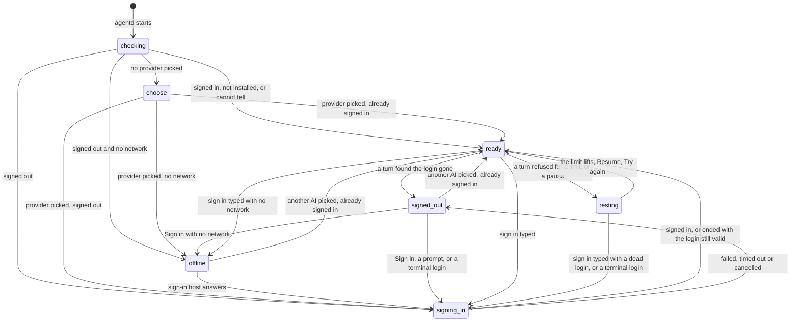
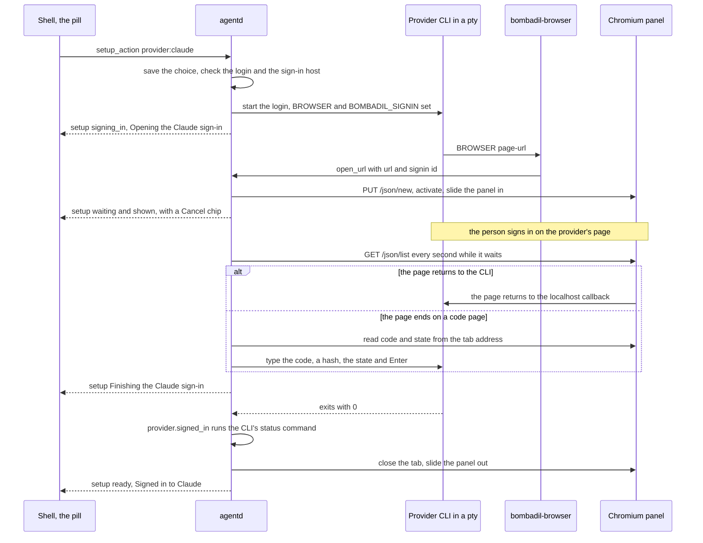

# Browser and sign-in

> **Status:** Partly shipped
> **Code:** `src/bombadil/browser.py`, `src/bombadil/signin.py`, `src/bombadil/fake_signin.py`, `src/bombadil/agentd.py`, `src/bombadil/providers.py`, `src/bombadil/rest.py`, `src/bombadil/hypr.py`, `src/bombadil/launcher.py`, `src/bombadil/appkit/placement.py`, `src/bombadil/appkit/native/app.py`, `src/bombadil/procs.py`, `src/bombadil/config.py`, `src/bombadil/cards.py`, `src/bombadil/mcp_server.py`, `src/bombadil/narrate.py`, `src/bombadil/paths.py`, `src/bombadil/sysmap.py`, `src/bombadil/brain/this.py`, `bin/bombadil-browser`, `bin/bombadil`, `shell/SetupChips.qml`, `shell/PillState.qml`, `iso/airootfs/etc/skel/.config/hypr/hyprland.lua`, `iso/airootfs/etc/chromium/policies/managed/bombadil.json`, `iso/airootfs/etc/skel/.config/chromium-flags.conf`, `iso/airootfs/etc/xdg/mimeapps.list`, `iso/airootfs/usr/share/applications/bombadil-browser.desktop`, `iso/airootfs/etc/environment`, `iso/airootfs/usr/local/bin/bombadil-setup`, `iso/airootfs/usr/local/bin/bombadil-install`, `iso/airootfs/usr/local/bin/bombadil-smoke`, `iso/profiledef.sh`, `scripts/build-iso.sh`
> **Design:** [UX brief, piece 6: first boot happens in the pill](../design/ux-brief.md#6-first-boot-happens-in-the-pill), [Foundation choices, 7: the browser](../design/foundation-choices.md#7-the-browser--chromium-driven-over-cdp), [Passenger brief, piece 3: the machine's hands in the browser](../design/passenger-brief.md#3-the-machines-hands-in-the-browser-and-taking-the-wheel), [Tips and the desk after boot](../design/tips-and-desk-defaults-brief.md#the-first-boot-minute-by-minute) (design only: what follows the sign-in)
> **Verified:** 2026-10-01 against `main` at `969b80b`

The browser panel is Chromium with its own profile, slid in over the screen as a Hyprland special workspace. Every link that goes through the system's opener opens in it (a program that starts a browser itself, such as `chromium URL` typed in a terminal, bypasses this). Provider sign-in runs the provider CLI's own login in a pseudo-terminal that `agentd` holds and shows the CLI's page in the panel. With a network, first boot needs no terminal and no copied code; with none, the `Wi-Fi` chip opens `nmtui connect` in a terminal window (the details drawer). The panel, the link routing, the sign-in and the first-boot flow in the pill are shipped. Not built: an agent that reads and acts in the browser (designed, no code), Wi-Fi networks as chips in the pill, the example chips and the Codex device-code login. The setup state `resting` (the AI is out of plan or spending, or paused by hand) sits beside the sign-in states and is owned by [the poor man switch](poor-man-switch.md): this page covers where it meets the sign-in and the panel (a completed sign-in clears a limit but not a pause, and `Raise the limit` opens the provider's page in the panel).

## How it works

The real `claude` and `codex` logins described here (their pages, the `code#state` text, the success line Codex prints for a stray visit to its success page, `codex login` revoking the stored login) are as observed on 2026-09-27 with Claude Code 2.1.283 and Codex 0.157.1, as recorded in comments in `src/bombadil/providers.py` and in the captured output behind `tests/test_providers.py`. The real CLIs were not run for this page, and what Chromium does with the flags and policy keys below was not checked. Python modules named without a directory (such as `browser.py` and `signin.py`) are under `src/bombadil/`, and `hyprland.lua` is the file of the Code line.

### Where a link goes



| Opener | Route |
|---|---|
| A CLI or program that honours `$BROWSER` | `/etc/environment` sets `BROWSER=/usr/local/bin/bombadil-browser`. `agentd` also sets it for every turn's process and for the sign-in CLI (`_bombadil_browser`): the absolute path of `bin/bombadil-browser` in the source tree that holds `src/bombadil/agentd.py` (`/usr/share/bombadil/bin/bombadil-browser` on the image), else the bare name `bombadil-browser`. |
| `xdg-open`, apps with "open in browser" | `/etc/xdg/mimeapps.list` makes `bombadil-browser.desktop` (`Exec=bombadil-browser %u`) the default for `x-scheme-handler/http`, `x-scheme-handler/https`, `text/html` and `application/xhtml+xml`. |
| `bombadil open URL` | Runs `bin/bombadil-browser` and returns its exit code. The Mail window's links use it (`openWeb` in `share/apps/mail/app.py` passes only `https` addresses). |
| A box in a picture naming an `http` or `https` page | `{"type": "open", "kind": "url"}` reaches `AgentD.open_thing`, which checks it again with `cards.check_opens` and calls `Launcher.open_thing`, which calls `browser.open_url` inside `agentd`. A failure reads `Could not open the page: <reason>.` |
| `Raise the limit` under the resting line | `AgentD.rest_action` runs `Panel.open` in a thread on the page the provider's own limit message named when it is on one of its hosts (`rest.page_in`), else `rest.RAISE_PAGES` (`https://claude.ai/settings/usage`, `https://chatgpt.com/codex/settings/usage`). It does not go through `open_url` or `bin/bombadil-browser`. A failure is an `error` event `Could not open the link: <reason>` and the chip stays; otherwise the chip becomes `Try again`. Nothing is bought in Bombadil. |
| `App.openUrl(url)` in a native app | `src/bombadil/appkit/native/app.py` runs `placement.open_url` (`src/bombadil/appkit/placement.py`) in a thread; it never touches `agentd`, `bin/bombadil-browser` or DevTools. Own scheme rule: `http`, `https`, `file` pass, a bare name gets `https://`, any other scheme or a leading `-` raises `ValueError`. It runs `setsid -f <browser.command()> <url>`, then shows or focuses `special:browser`. See [app-kit.md](app-kit.md). |
| `show_panel` with `{"name": "browser"}`; the launcher words `browser`, `chrome`, `open browser` (`launcher.PANEL_WORDS`) | `Hyprland.panel("browser")`: no URL. Starts Chromium with no URL when no window exists and none is starting, then shows the panel; idempotent. |
| `hide_panel`; the launcher words `hide browser`, `close the browser`, `put away the browser`; `hide`, `hide it`, `put it away`, `hide everything` | The first four call `Hyprland.panel("browser", show=False)`. `hide` and its aliases run `Launcher._hide`, which toggles every special workspace on screen. During a sign-in either makes the view `hidden`, and the pill offers `Show sign-in`. |
| `SUPER + B` | `hyprland.lua` binds it to `hl.dsp.workspace.toggle_special("browser")`, not to `Hyprland.panel`: it launches nothing and only toggles. What Hyprland shows for an empty `special:browser` was not run. |

`bin/bombadil-browser` drops arguments that start with `-`, then fixes each that has no `://`: an existing path becomes a `file://` URL; `about:`, `data:`, `javascript:`, `mailto:` stay; anything else gets `http://` for `localhost` and `127.0.0.1` and `https://` otherwise. It sends `{"type": "open_url", "url", "signin": $BOMBADIL_SIGNIN}` and waits for `agentd` to hang up; with nothing on the socket it calls `browser.open_url` itself. Exit codes: 2 with no URL; 1 when `agentd` did not answer and `browser.open_url` raised; otherwise 0, so once `agentd` has the line the caller never learns that the page failed to open.

`AgentD.open_url` refuses any scheme but `http`, `https` and `file`. A link whose `signin` tag is the running sign-in's id goes to `SignIn.browser_url`, and so does an untagged one when the run has no page yet and `signin_url_kind` accepts it. Any other link opens with `Panel.open` in a thread; if that raises, an `error` event with `turn` `null` says `Could not open the link: <reason>`, shown as an error line in the pill. A provider's sign-in page opened with no run, in a state other than `ready` or `choose` (`resting` included), starts the watch for a login begun in a terminal (see "The cases around it"). The `Open in <site>` chip on a mail receipt notice also calls `AgentD.open_url` (`http` or `https` only, from `src/bombadil/mail/watch.py`).

### The panel

`browser.command()` starts the panel's Chromium. `hyprland.lua` puts the window of class `bombadil-browser` into `special:browser` without focusing it (rule `panel-browser`) and slides it with a `specialWorkspace` animation (`slidevert`).

| Flag | Why |
|---|---|
| `--ozone-platform=wayland` | A native Wayland window. |
| `--class=bombadil-browser` | The class `panel-browser` matches, and the text `browser.running()` and `hypr._launching()` search for with `pgrep -f`. `procs.PROTECTED_ARGS` names it too, so Stop spares the window. |
| `--user-data-dir=<profile_dir()>` | Bombadil's own profile; the docstring of `browser.py` says the debugging port needs a dedicated profile directory. |
| `--remote-debugging-port=9222` | The port `browser.DevTools` talks to. |
| `--no-first-run`, `--no-default-browser-check`, `--hide-crash-restore-bubble` | No welcome page, default-browser bar or crash bubble. |
| `--password-store=basic` | No keyring prompt. |

`/etc/chromium/policies/managed/bombadil.json` sets `DefaultBrowserSettingEnabled`, `PromotionsEnabled`, `PasswordManagerEnabled`, `PasswordLeakDetectionEnabled`, `SigninInterceptionEnabled`, `MetricsReportingEnabled` and `FeedbackSurveysEnabled` to false, `ProfilePickerOnStartupAvailability` to 1 and `RemoteDebuggingAllowed` to true, and picks Google as the search provider. It sets no `BrowserSignin` key, so Google sign-in keeps working (the UX brief asks for that). `chromium-flags.conf` repeats `--no-first-run`, `--no-default-browser-check` and `--password-store=basic` for a Chromium started any other way; its comment says Arch's launcher reads it, which was not run.

`browser.open_url(url, hyprland, devtools, spawn, wait=20.0, abandon=None)` returns the tab (`{"id", "url"}`) or `None`:

1. `abandon` (a `threading.Event`) already set: `None`.
2. Port down but a Chromium with `--class=bombadil-browser` runs: wait up to `wait` s, polling every 0.25 s; still down: `RuntimeError("the browser is still starting")`.
3. Port up: `PUT /json/new?<whole URL percent-encoded>` (Chromium cuts the query at the first `&`, as the header of `tests/test_browser.py` records), then `/json/activate/<id>`. A failed `/json/new` is followed by a look for a tab already on that URL and one more try; no tab: `RuntimeError("the browser would not open the page")`.
4. Chromium not running: `RuntimeError("chromium is not installed")` when the binary is missing, else start `browser.command()` with the URL in its own session and take the first page tab the port reports. Process gone after 3 s: `RuntimeError("the browser closed as it started")`. No tab within `wait` s and the process still running: `None`, no error.
5. `abandon` set meanwhile: close the tab it made (never the last, which would quit Chromium), return `None`.
6. With Hyprland, `Hyprland.panel("browser", show=True)`. A failure to slide is printed to stderr and does not raise. If `abandon` is set while it slides, the panel slides out again and the spare tab goes.

`Hyprland.panel` launches the panel's program only when no window sits in `special:<name>` and none is starting (`pgrep -f -- --class=...`), waits up to `wait` s for the window, and toggles only when the asked state differs from the monitors' state. [`docs/screens/first-boot/browser-panel.png`](../screens/first-boot/browser-panel.png) shows Chromium in the panel above the pill.

`browser.DevTools` is a client for the HTTP side of the DevTools protocol on `127.0.0.1:9222`: `up` (`/json/version`), `tabs()` (`/json/list`, pages only), `new_tab`, `activate`, `close`. It never uses a proxy and has no websocket: it lists, opens, raises and closes tabs and nothing else. `browser.Panel` is what the sign-in sees: `open`, `tabs` (`[]` when the browser is not running, `None` when it runs but its port is not up), `shown`, `show`, `hide`, `close_tab`; without Hyprland `shown()` is `None` and `show` and `hide` do nothing. A second reader of the port is `src/bombadil/brain/this.py` (`devtools_pages`: `GET /json`, 0.5 s, no proxy), which takes the active tab's URL as what "this" is for the launcher words `brain` and `why is this here?` when the browser window is in front.

### Setup states



`AgentD.access` holds the state, `_set_access` changes it and broadcasts `setup` and `status`, and `_describe` says what the pill shows. In the daemon `auto_signin` is on (`agentd.main`), so `checking` goes straight to `signing_in` or `offline`. `signed_out` follows a run that ended without signing in while the login is not still valid, a turn that found the login gone (in one step `ready`, `signed_out`, `signing_in`, or `offline`), and a terminal-login watch that timed out. `check_access` runs at start and on a provider pick; between them a turn finds a dead login. A provider pick (`AgentD.choose`: a `provider:<name>` chip, including the `Use X instead` chips of `signed_out`, the launcher words `use codex` and `switch to codex`, `bombadil provider`, `bombadil signin codex`) works from any state: it ends a run, ends a pause by hand of that provider (`rest.clear_hand`), then `check_access(start=True)` lands in `ready` (or `resting`), `signing_in` or `offline`. Prompts wait until `ready` (`_runnable`); a `!command` runs in any state.

Every other edge into `ready` above goes through `AgentD._settle`, which lands in `resting` instead when `rest.json` holds a limit or a pause for the provider (`rest.current`; a pause by hand outranks a limit). A completed sign-in or terminal login first clears the provider's limit (`rest.clear_limit`, because a new login may be another account with its own limit) and never a pause by hand, so it can end in `resting`. `resting` ends in `ready` through `_rest_changed`: the limit's time plus `rest.RESET_GRACE` (60 s) passes on the wall clock, `Resume` or `resume claude` typed (when no limit is left on the provider, else it stays `resting` with the limit's line), or `Try again`. How a limit is found, held and lifted, and the pill's line and the AI card, are in [the poor man switch](poor-man-switch.md). Typing `sign in` with a dead login still starts a sign-in while resting, and a stored `codex` login that a new one would replace starts nothing (see `login_replaces` below).

| State | Pill line (`T` is the provider's title) | Chips: id, label, style |
|---|---|---|
| `choose` | `Which AI should run this computer?` (tone `ask`) | `provider:claude` Claude `big`, `provider:codex` Codex `big` |
| `checking` | none | none |
| `signed_out` | `Sign in to T to start.`, or what the last run left: `The T sign-in timed out.`, `Sign-in cancelled.`, `Could not sign in to T: <reason>.`, `T signed you out.` | `signin` Sign in `primary`, then `provider:<other>` "Use X instead" `quiet` per other provider |
| `offline` | `No internet. Connect to a network to sign in to T.` (tone `error`) | `wifi` Wi-Fi `primary`, `signin` Try again `quiet` |
| `signing_in`, phase `starting` | `Opening the T sign-in` | `cancel` Cancel `quiet` |
| `signing_in`, `waiting`, view `shown` | `Sign in to T in the browser` | `cancel` |
| `signing_in`, `waiting`, view `hidden` | `The T sign-in is waiting in the browser` | `show` Show sign-in `primary`, `cancel` |
| `signing_in`, `waiting`, view `closed` | `The T sign-in page was closed` | `show` Open it again `primary`, `cancel` |
| `signing_in`, `finishing` | `Finishing the T sign-in` | none |
| `signing_in`, `ending` | `Cancelling the T sign-in` | none |
| `signing_in`, a login run in a terminal | `Sign in to T in the browser` | none |
| `ready` | empty, or for 120 s (`READY_LINE_SECONDS`) `Signed in to T. Ask me for anything.`, `T is ready. Ask me for anything.`, `You are already signed in to T.` (tone `done`) | none |
| `resting`, a pause by hand | `T is paused. Your apps and files still work.` | `resume` `Resume T` `primary` |
| `resting`, a limit that is not a spending limit and has a time | `T is at its limit until 15:00. Your apps and files still work.` (the window's own word, such as `weekly limit`, replaces `limit`) | none: it lifts by itself |
| `resting`, a spending limit or a limit with no time | `T is at its spending limit. Your apps and files still work.` (`until <time>` is added when the provider gave one; a limit with no time reads `T is at its limit. ...`) | `raise` `Raise the limit` `quiet`, then `retry` `Try again` `primary` once `raise` was pressed (a pause by hand shows `resume` and nothing else) |

`shell/SetupChips.qml` draws the chips of the last `setup` message, by `style`, while the pill is in `setup` or `resting` mode and no notice covers the line (`!pill.noticeShown`): a turn that has the line hides them until it ends (`PillState._setup` keeps the state and leaves the line alone while `mode` is `working`). It calls `pill.setupAction(id)` on a tap, which sends `{"type": "setup_action", "id"}`. `PillState.setupAction` first hands the keyboard back (`handOff`) for every chip except `cancel`, `resume` and `retry`, because the page or the Wi-Fi window that opens (`signin`, `show`, `wifi`, `raise`, a provider pick) must take the typing. How the chips look is in [shell.md](shell.md).

### One sign-in



1. **Start.** A chip, a launcher word (`sign in`, `log in`, a provider's name while `choose`), `bombadil signin`, a prompt typed while `signed_out`, a turn that found the login gone, or `agentd`'s own check at start ends in `AgentD.start_signin`. It checks `provider.signin_host` with `signin.reachable` (a TCP connection, 4 s); no answer is `offline`. Otherwise it creates `SignIn(provider, on_change, panel=..., env={"BROWSER": ...})`, sets `signing_in` and runs `SignIn.run()` as a background task. A second request while a run exists shows its page again; one that arrives while the first is still checking the network is dropped (`_starting`), so a double tap starts one login.
2. **The terminal.** `SignIn._spawn` opens a pty of 50 rows and 1000 columns (so no CLI wraps a URL) and runs `provider.signin_command()` in its own session with the pty as controlling terminal, in the home directory. The environment is the daemon's, then `SignIn.env` (`BROWSER`), then `TERM=xterm-256color`, `COLUMNS=1000`, `LINES=50` and `BOMBADIL_SIGNIN=<SignIn.id>`. Output is read from the pty with escape sequences stripped (`clean`); URLs come from the text (`urls`, which leaves a half-written one for the next read) and from OSC 8 hyperlinks (`links`). A printed URL counts only if `provider.signin_url_kind` is truthy for it.
3. **Which page.** `SignIn._pick` takes the first URL handed to `$BROWSER`; failing that, a printed URL seen for `URL_GRACE` (2 s), preferring the kind `auto` (the page returns to the CLI by itself) over `manual`. `_maybe_open` stores the URL and its OAuth `state` and opens it with `Panel.open(url, abandon=<the run's _over event>)` in a thread. The phase becomes `waiting`, view `shown`; if the open raised and no tab shows that address, the view is `closed`, so the pill offers the page again.
4. **Watching.** `SignIn._watch` looks every `POLL` (1 s) or when woken: `Panel.tabs()` through DevTools, `Panel.shown()` through Hyprland. The view is `closed` when there are no tabs, the run's tab is gone or the open failed; `hidden` when the special workspace is not on a monitor; else `shown`. Each change calls `on_change`, and `agentd` broadcasts `setup`.
5. **Finishing.** The phase becomes `finishing` when the run's tab is on `localhost`, `127.0.0.1` or `::1` at an address that is not a sign-in URL (the page came back to the CLI's own server), or when a code was typed.
6. **The end.** The CLI exits. Status 0 goes through `_confirm`: `provider.signed_in()` returning `False` makes the run `failed` with `it finished without signing in` (Codex prints success for a stray visit to its success page); `True` or `None` is `done`. Any other status is `failed`, with the reason `provider.signin_error(text)` (the provider's `SIGNIN_ERRORS`, then the last readable output line), else the browser `hiccup`, else `<binary> exited with <n>`.
7. **After.** A CLI still running gets `SIGTERM` to its process group, `SIGKILL` after 2 s, and the pty closes. For `done`, `cancelled` and `timeout` the tab is closed (unless it is the last) and the panel slides out; after `failed` the page stays in case it says more. `AgentD._run_signin` appends a `"kind": "signin"` row to `turns.jsonl`. For `done` it clears the provider's limit (`rest.clear_limit`) and calls `_settle` with `Signed in to T. Ask me for anything.`: `ready` (which wakes the queue), or `resting` while a pause by hand is on file. Otherwise it sets `signed_out` with the outcome's line.

### The cases around it

- **A code page.** Claude's printed URL ends at a page on `platform.claude.com` or `console.anthropic.com` whose address holds `code` and `state` (`Claude.code_from_url` returns `code#state`). `SignIn._look` reads every tab's address and types the code and Enter once per code. The code must be printable and, if the page this run opened carried a `state`, end in `#` plus that state (`_is_mine`), so a code page left by an earlier sign-in is never typed. Codex has no code page (`Codex.code_from_url` is the base `None`).
- **Cancel.** Esc, the Stop button and the `cancel` chip send `stop` or `setup_action cancel`; both call `AgentD.stop`. With no turn running it calls `SignIn.cancel`, which sets the phase `ending` at once (`Cancelling the T sign-in`, however slow the browser is) and sets `_over`, so a page still being opened is dropped and never slid in. With a turn running, the same keys end the turn and leave the sign-in. Only the `Sign-in cancelled.` line and dropping the prompts that waited (`_drop_waiting`) belong to cancel; the end state follows the bullet "A run that does not end `done`".
- **Timeout.** `BOMBADIL_SIGNIN_TIMEOUT` seconds (default 600), counted from when the CLI starts, end the run with `timeout`: `The T sign-in timed out.` (tone `error`), unless the login is still valid.
- **A run that does not end `done`.** `AgentD._run_signin` first asks whether the login it was for is still valid (`signed_in()` true and no turn found it dead, `_login_gone`). If so, whatever the outcome, the state is `ready` (`resting` when a limit or pause is on file) with no line and the queue stays. Otherwise: `signed_out` with `The T sign-in timed out.`, `Sign-in cancelled.` (the prompts that waited are dropped) or `Could not sign in to T: <reason>.`.
- **Offline.** `start_signin` finds `signin_host` unreachable (`platform.claude.com:443` for Claude, `auth.openai.com:443` for Codex; none for the fake unless `BOMBADIL_FAKE_SIGNIN_HOST` is set). The state is `offline` and `AgentD._wait_online` looks again every `OFFLINE_POLL` (5 s); when the host answers, the sign-in starts by itself. The `Wi-Fi` chip sends `setup_action wifi`: `Launcher._wifi` calls `Launcher.details(["nmtui", "connect"])`, a `foot` terminal window with the app id `bombadil-details` in `special:details` (the details drawer), or answers `Wi-Fi settings need NetworkManager, which is not installed.` when `nmtui` is missing. An offline first boot therefore shows a terminal.
- **A login that expires during a turn.** The CLI says so in a structured event (`signed_out`: Claude's `authentication_failed`, a Codex error that matches `SIGNED_OUT`) or in text that matches the provider's `SIGNED_OUT` patterns; a provider with `ends_when_signed_out` (Codex) has its process group ended at the first sign. When the turn ends, `_signed_out_turn` marks the login dead (`_login_gone`), puts the prompt back at the front of the queue, carries over what the person did without the model, says `T signed you out.` and starts a sign-in; the prompt then runs once more. If the rerun reports the same thing, the login is not what is wrong (a 403, an API key in the environment): the CLI's own words show and no second sign-in starts (`_retried`). A stopped turn is not run again. If the person picked the other provider meanwhile, nothing signs in.
- **`login_replaces`.** `Codex.login_replaces` is true because `codex login` signs the stored login out as it starts, even if that login is then called off. `AgentD.signin_asked` therefore starts no sign-in when the state is `ready` or `resting`, `login_replaces` is true and `signed_in()` is `True`: in `ready` it says `You are already signed in to T.`, in `resting` the resting line stays (run on 2026-10-01 with a limit on file; `bombadil signin` then prints that line and exits 1). Otherwise it starts a sign-in.
- **A login started in a terminal.** A page from the CLI's own login (`claude auth login`, `/login`, `codex login` in a terminal) arrives through `$BROWSER` with no run to hand it to. `AgentD._watch_external` sets `signing_in` with no chips (no `SignIn` exists, so Esc is the way to call it off), polls `provider.signed_in()` every 2 s, requires the credentials file's modification time to have changed when the login was known dead (`login_stamp`), then hides the panel, clears the provider's limit and calls `_settle` (`ready`, or `resting` for a pause). It gives up after `signin.TIMEOUT` with `signed_out`.
- **Browser trouble.** An error that reaches `SignIn` while it opens or watches the page is printed to stderr and kept as `SignIn.hiccup`; it never ends the run. The pill shows `hidden` or `closed` and offers `Show sign-in` or `Open it again`; `SignIn.show` slides the panel in, or opens the same URL again (a double tap opens one page) and finds its tab by address if the browser could not name it.

### What agent-driven browser means in the code

`screenshot` is the only os-mcp tool through which the agent sees the panel: the whole screen as pixels (`Hyprland.screenshot`, run with `grim`). No os-mcp tool reads page text, the DOM or the accessibility tree, clicks, types, evaluates script or targets a tab; `show_panel` and `hide_panel` only slide the panel (and start Chromium with no URL), and any link the agent's program opens lands in the panel through `$BROWSER`. The agent's own shell is not limited to os-mcp (`providers.system_prompt` gives it full access with passwordless `sudo`), so it can `curl` the debugging port or run `grim`; nothing in Bombadil's tools or prompt points it there.

`browser.DevTools` and `devtools_pages` read tabs over HTTP only and are not tools. The debugging port, `RemoteDebuggingAllowed` and the dedicated profile are in place, and nothing in Bombadil connects a protocol client to it. `OsTools().tools` lists 26 tools (the five `mail_*` tools included), none a browser tool besides the two panel tools. A search of `src/`, `bin/`, `shell/`, `share/`, `iso/`, `scripts/`, `tests/` and `pyproject.toml` finds no `playwright`, `puppeteer` or `connect_over_cdp`, and the same search of `src/`, `bin/` and `iso/` on every branch the repository holds (`git grep`, 2026-10-01) finds none either. The narrator has a line for an `open_url` tool call (`narrate.tool_step`, asserted in `tests/test_narrate.py`), but os-mcp registers no such tool. The design (foundation choice 7, passenger brief piece 3) describes Chromium driven over the DevTools protocol, with a visible frame while the agent works and a takeover when the person touches the page: designed, not partial.

### First boot

1. The live image boots, greetd starts `start-hyprland` as `user` (through `systemd-cat`, which sends Hyprland's start-up text to the journal), and `hyprland.lua` starts `agentd`, `bombadil-shell` and `mako`.
2. `agentd.main` reads `/etc/bombadil/config.toml` and `~/.config/bombadil/config.toml`. Without the user file (and without `BOMBADIL_PROVIDER`) the provider counts as not picked (`Config.configured`), so the state is `choose`.
3. The pill asks `Which AI should run this computer?` with two big chips; typing `claude` or `codex` answers too. Prompts typed meanwhile wait; a `!command` runs.
4. A pick sends `setup_action provider:<name>`. `AgentD.choose` ends any run, ends a pause by hand of that provider, writes `~/.config/bombadil/config.toml` (`config.save_user`), switches the provider (forgetting the old provider's session id), then runs `check_access(start=True, announce=True)`: `ready` with `T is ready. Ask me for anything.` when already signed in (`resting` instead when a limit is still on file), otherwise `offline` or the sign-in above.
5. When the sign-in succeeds the panel slides out, the pill says `Signed in to T. Ask me for anything.` and the prompts that waited run in order.
6. The image carries both CLIs (`scripts/build-iso.sh` installs them unless `BOMBADIL_NO_CLIS` is set), so first boot only has to log in.

`bombadil-setup` is the terminal fallback (`Super+Return` opens a terminal; `agentd` names the script when a provider's CLI is not installed). It asks which AI, installs the CLI with `npm` if missing, and calls `bombadil provider <name>`. Exit 0 with `bombadil status` answering means `agentd` did it. Exit 3 (nothing answers on the socket), or 0 with no daemon, writes the choice to `~/.config/bombadil/config.toml`, sets `BROWSER=bombadil-browser` (a bare name; `/etc/environment` uses an absolute path because, its comment says, Codex's opener wants an executable path; no test runs this fallback with either CLI), runs `claude auth login` or `codex login` in the terminal (the page opens in the panel through the no-daemon path of `bin/bombadil-browser`) and starts `agentd` through `hyprctl`.

| Design of piece 6 | Built |
|---|---|
| "At no point do you see a terminal, a terms page or a promo tab." | No terminal in the sign-in. The flags and policy keys aim at no terms page and no promo tab (what Chromium does with them was not checked). Offline, the `Wi-Fi` chip opens `nmtui connect` in a terminal window. |
| With no network, Wi-Fi networks as chips and the password in the pill. | An `offline` state with a `Wi-Fi` chip (the terminal window above) and a `Try again` chip; the sign-in starts by itself once the host answers. |
| `agentd` reports `needs_network`, `needs_provider`, `needs_login`, `ok`. | `offline`, `choose`, `signed_out`, `ready`, plus `checking` and `signing_in`. |
| "Signed in. Ask me for anything." | `Signed in to Claude. Ask me for anything.` |
| Three example chips and a faint first-day line after sign-in. | Not in the code. [The Tips brief](../design/tips-and-desk-defaults-brief.md) (design only, with open questions) proposes a Tips card in place of the example chips and keeps the first-day line. |
| A Codex device-code login that fits in the pill. | Not built: Codex's login runs like Claude's, its page in the panel completed by the localhost callback. |
| The terminal wizard stays only as a fallback. | `bombadil-setup`, as above. |

### `fake_signin.py`

`src/bombadil/fake_signin.py` plays a provider's login on localhost with the standard library only, so it runs from the ISO as it is. A server on `127.0.0.1` is the provider's page; it hands the page to `$BROWSER` (except in `manual` mode) and prints the other URL with a paste prompt, as `claude auth login` does. Signed in means `$HOME/.fake-signin` exists.

| Mode | Behaviour |
|---|---|
| `auto` | The page redirects to the CLI's `/callback` after `FAKE_SIGNIN_DELAY` seconds (default 2); the CLI exits 0. |
| `manual` | `$BROWSER` is not used. The printed page ends on `/code`, which shows `code#state` to paste. |
| `never` | The page never finishes (timeouts, a closed panel, cancel). |
| `fail` | The page comes back with `error=access_denied`; the CLI says `Login failed: access_denied` and exits 1. |

`providers.Fake` connects it: `BOMBADIL_PROVIDER=fake` picks it, `BOMBADIL_FAKE_SIGNIN=<mode>` makes it need signing in (unset, `Fake.signed_in()` is true and `signin_command()` falls back to `auto`), and `BOMBADIL_FAKE_SIGNIN_HOST=host:port` plays an unreachable sign-in server. `Fake` is in `providers.PROVIDERS` but not in `config.PROVIDERS`, so `AgentD.choose`, `bombadil provider` and `bombadil signin` refuse it and a config file that names `fake` makes `config.load` raise `ValueError`; `BOMBADIL_PROVIDER=fake`, read by `agentd.main` after `config.load`, is the only way to pick it.

## Interfaces other pieces depend on

Socket messages (newline-delimited JSON on `agentd`'s socket; [agentd.md](agentd.md) owns the rest of the protocol):

| Message | Direction | Meaning |
|---|---|---|
| `{"type": "open_url", "url", "signin"}` | client to `agentd` | Open a link in the panel; `signin` is the `BOMBADIL_SIGNIN` of the CLI that handed it over, or `null`. No reply: a refused scheme (only `http`, `https`, `file` open) and a failed open are `error` events with `turn` `null`: `Not opening '<url>': only web pages and files open here.` and `Could not open the link: <reason>`. |
| `{"type": "setup_action", "id"}` | shell to `agentd` | A chip: `provider:claude`, `provider:codex`, `signin`, `show`, `cancel`, `wifi` (the launcher's `wifi` action through `AgentD._local`: `local` events with `phase` `start`, then `done`), and `resume`, `raise`, `retry` of the resting line (they do nothing unless the state is `resting` and the chip applies: `AgentD.rest_action`). |
| `{"type": "signin", "provider"?}` | `bombadil signin` to `agentd` | Sign in (again); a provider that is not the current one, or any when none was picked, is picked first (`choose`). |
| `{"type": "stop"}` or `cancel` | client to `agentd` | Ends a running turn; with none running, cancels a sign-in. |
| `{"type": "prompt", "text"}` | client to `agentd` | The launcher words `sign in`, `log in`, `use codex` and, while `choose`, a provider's name are answered without a turn. |
| `{"type": "setup", "state", "provider", "title", "line", "tone", "actions", "phase", "view"}` | `agentd` to every client | On connect and on every change. `state` is `choose`, `checking`, `signed_out`, `offline`, `signing_in`, `resting` or `ready`. `tone` is `step`, `ask`, `error` or `done`; `phase` and `view` come from the running `SignIn` (`null` without one); `actions` is `[{"id", "label", "style"}]`. While `resting` it also carries `rest` (`provider`, `why`, `kind`, `until`, `when`, `hint`, `note`, `wait`). |
| `{"type": "status", "setup": <state>, ...}` | `agentd` to every client | The same state as a field of the status message; `rest` too while resting, and each waiting prompt in `queue` has a `wait` label. |
| `{"type": "ai", "rows": [...]}` | `agentd` to a client that asked (`{"type": "ai", "op": "get"}`) and to every client on a change | The AI card: one row per AI with `state` `ready`, `limit`, `paused`, `signed_out` or `missing`. The current AI's login comes from `AgentD.access`; the other's from `Provider.signed_in()`, asked at most every `AI_SIGNED_TTL` (30 s). Owned by [the poor man switch](poor-man-switch.md). |
| `{"type": "event", "kind": "local", "action": "signin" or "provider", "target", "phase": "done", "ok", "text"}` | `agentd` to every client | What `AgentD.local` sends when `sign in` or `use codex` is answered without a turn: `text` is the pill line left (`Done.` when none), `ok` is false only in `offline`. `bombadil ask "use codex"` ends on it. |

| Python name | Where | Meaning |
|---|---|---|
| `browser.open_url(url, hyprland, devtools, spawn, wait, abandon)` | `src/bombadil/browser.py` | Open a page in the panel and slide it in; raises `RuntimeError` when the page did not open. |
| `browser.Panel`, `browser.DevTools(port, host)` | same | Described under "The panel"; what `SignIn` and `AgentD` use, and what tests replace. |
| `browser.command()`, `profile_dir()`, `binary()`, `running()`, `same_url()`, `close_spare_tab()`, `find_tab()` | same | Start command, profile, binary, process check, address comparison, tab helpers. |
| `hypr.Hyprland.panel(name, show=True, wait=20.0)`, `hypr.PANELS` | `src/bombadil/hypr.py` | Slide a panel in or out, launching its program when it has no window and is not starting. `PANELS` maps `browser`, `files` and `terminal` to a command (`None` for `browser`: `browser.command()`). `ValueError` for another name, `RuntimeError` when the program is not installed. |
| `signin.SignIn(provider, on_change, *, panel, env, timeout, grace, poll)` | `src/bombadil/signin.py` | One run: `run()`, `cancel()`, `show()`, `browser_url(url)`, `type(text)`; fields `phase`, `view`, `reason`, `hiccup`, `url`, `tab`, `text`, `id`, `running`. |
| `signin.TIMEOUT`, `URL_GRACE`, `POLL`, `COLUMNS`, `reachable()`, `clean()`, `urls()`, `links()`, `last_words()` | same | Timing and output helpers. |
| `Provider.signin_command`, `signin_url_kind`, `code_from_url`, `signed_in`, `credentials`, `login_stamp`, `signed_out`, `SIGNED_OUT`, `ends_when_signed_out`, `login_replaces`, `signin_error`, `SIGNIN_ERRORS`, `signin_host` | `src/bombadil/providers.py` | What a provider supplies to be signed in. |
| `show_panel`, `hide_panel` | os-mcp (`src/bombadil/mcp_server.py`) | Argument `name`, one of `browser`, `files`, `terminal` (the keys of `hypr.PANELS`). See [os-mcp.md](os-mcp.md). |

Commands: `bin/bombadil-browser URL...`, `bombadil open URL`, `bombadil signin [claude|codex]`, `bombadil provider claude|codex`, `bombadil-setup`. The two `bombadil` setup commands print the setup line until it settles and exit 0 for `ready`, 1 for any other end (`resting` too: `bombadil provider claude` with a limit on file printed the resting line and exited 1 on 2026-10-01), 3 when nothing answers on `agentd`'s socket (`follow_setup` in `bin/bombadil`); `bombadil provider` with no socket file writes the config and exits 0. A provider name that is not in `config.PROVIDERS` (for `bombadil provider`, also a missing name) prints `unknown provider; choose from ...` and exits 2, and so does `bombadil open` with no URL (it prints the usage).

| Variable | Read by | Meaning |
|---|---|---|
| `BROWSER` | programs, `agentd` (writes it) | The opener: `bin/bombadil-browser`. |
| `BOMBADIL_SIGNIN` | `bin/bombadil-browser` | The id of the sign-in run whose CLI is calling; `SignIn._spawn` sets it. |
| `BOMBADIL_SIGNIN_TIMEOUT` | `signin.py` at import | Seconds a run may last (default 600). |
| `BOMBADIL_PROVIDER` | `agentd.main` | Picks the provider and counts as "picked". |
| `BOMBADIL_FAKE_SIGNIN`, `FAKE_SIGNIN_DELAY`, `BOMBADIL_FAKE_SIGNIN_HOST` | `providers.Fake`, `fake_signin.py` | Test logins (see above). |
| `BOMBADIL_SOCKET`, `BOMBADIL_RUNTIME`, `BOMBADIL_CONFIG`, `BOMBADIL_STATE`, `BOMBADIL_DATA`, `XDG_*`, `HYPRLAND_INSTANCE_SIGNATURE` | `src/bombadil/paths.py`, `src/bombadil/hypr.py` | Where the socket (`BOMBADIL_SOCKET`, else `agentd.sock` in `BOMBADIL_RUNTIME`, default `$XDG_RUNTIME_DIR/bombadil`), config, log and profile live, and whether Hyprland can be asked. |

Fixed names: window class `bombadil-browser` (`browser.CLASS`), special workspace `special:browser`, window rule `panel-browser`, key `SUPER + B`, DevTools port `9222`, and `procs.PROTECTED_ARGS`, which holds `--class=bombadil-browser`. Stop spares the panel's Chromium only because of that entry: a change to `browser.CLASS` or to the `--class=` flag in `browser.command()` needs the same change there, or Stop kills the browser a turn opened. Other places write these values out instead of reading them from `browser.py`:

| Value | Also written in |
|---|---|
| Class `bombadil-browser` | The `panel-browser` rule in `hyprland.lua` (`^(bombadil-browser)$`), `BROWSERS` in `src/bombadil/brain/this.py`, and `bombadil-smoke` (`has_client` and `pkill -f -- '--class=bombadil-browser'`). |
| Port `9222` | `DEVTOOLS` in `src/bombadil/brain/this.py` and the `/json/list` check in `bombadil-smoke`; neither reads `browser.DEBUG_PORT`. Changing the port leaves the Brain's "this" for a browser window empty with no error, because `devtools_pages` returns `[]` on any failure. |
| `special:browser` | `Panel.shown` in `src/bombadil/browser.py`, `open_url` in `src/bombadil/appkit/placement.py` (twice), the `panel-browser` rule and `bombadil-smoke`. |

## Where state lives

| What | Where |
|---|---|
| The browser profile (cookies, history, website logins) | `~/.local/share/bombadil/browser` (`browser.profile_dir()`: `paths.data_dir() / "browser"`). Not copied by an install. |
| `agentd`'s socket | `$XDG_RUNTIME_DIR/bombadil/agentd.sock` (`paths.socket_path()`; `/run/user/<uid>` when `XDG_RUNTIME_DIR` is unset). |
| Open tabs; whether the panel is on screen | Inside Chromium (`http://127.0.0.1:9222/json/list`); Hyprland's `special:browser` (`Panel.shown()` asks `j/monitors`). |
| The setup state and the running sign-in | `agentd`'s memory (`AgentD.access`, `chosen`, `signin`, `_login_gone`). Lost on restart and found again by `check_access`. |
| The provider choice | `~/.config/bombadil/config.toml` (`provider = "claude"`), with defaults from `/etc/bombadil/config.toml`. `Config.configured` means the user file exists. |
| A limit or a pause by hand | `~/.local/state/bombadil/rest.json` (`rest.path()`: `paths.state_dir() / "rest.json"`), written only by `agentd`. It survives a restart, and a limit that has passed its time plus `rest.RESET_GRACE` is not read. `AgentD._rest_cur` is the copy in memory. |
| The provider's login | The CLI's own file: `~/.claude/.credentials.json` (`$CLAUDE_CONFIG_DIR`), `~/.codex/auth.json` (`$CODEX_HOME`). Bombadil reads only its modification time (`Provider.login_stamp`) and otherwise asks the CLI (`claude auth status`, `codex login status`). |
| A record of each sign-in run | One line per run in `~/.local/state/bombadil/turns.jsonl`: `"kind": "signin"`, `provider`, `result` (`done`, `failed`, `timeout`, `cancelled`), `reason`. Not counted as a turn (`paths.is_turn_row` counts only rows with no `kind` or `"turn"`). |
| The fake login | `~/.fake-signin`. |
| What an install carries over | `bombadil-install` copies `~/.claude`, `~/.claude.json`, `~/.codex` and `~/.config/bombadil` from the live user, so the installed system starts signed in with the same choice. See [iso-and-install.md](iso-and-install.md). |

Files in the image (`iso/airootfs/`; [iso-and-install.md](iso-and-install.md) says how it is built): the managed policy; `/etc/skel/.config/chromium-flags.conf`, copied to a user's `~/.config/chromium-flags.conf`; `/etc/xdg/mimeapps.list` and `/usr/share/applications/bombadil-browser.desktop` (`NoDisplay=true`, in no menu); `/etc/environment` (whether the greetd session reads it was not checked: the PAM configuration is not in the repository); `/usr/local/bin/bombadil-browser`, a symlink to `/usr/share/bombadil/bin/bombadil-browser` made by `scripts/build-iso.sh`; `/usr/local/bin/bombadil-setup`; and `/etc/skel/.config/hypr/hyprland.lua` (the `panel-browser` and `panel-details` rules, the `specialWorkspace` animation, `SUPER + B`).

## Principles it keeps

- [The answer is the thing](../principles.md#the-answer-is-the-thing): the sign-in is a page in a panel that slides in and out, and the flags, policy and `chromium-flags.conf` keep a terms page, a promo tab and a keyring prompt off the screen. The trap is an added first-run page, a second window, or a terminal step in the sign-in itself. The offline `Wi-Fi` chip already opens a terminal window (see the gaps); do not add another.
- [Degrade and recover](../principles.md#degrade-and-recover): choosing the AI, signing in, cancelling, showing the page again, waiting for the network and the resting line's `Raise the limit` and `Try again` are `agentd` code with no model call; `bin/bombadil-browser` opens the panel itself when `agentd` is gone, and `bombadil-setup` runs the same login with no daemon. A browser error is a `hiccup`, never the end of the run. The trap is a step that needs a turn, or an error that ends the sign-in because DevTools did not answer.
- [Something true in 200 ms](../principles.md#something-true-in-200-ms): `SignIn.cancel` sets the phase `ending` before it touches the browser, so the pill says `Cancelling the T sign-in` at once, and a page still being opened is dropped (`abandon`). The trap is waiting for a slow browser or a compositor call before telling the pill.
- [Nothing runs unseen](../principles.md#nothing-runs-unseen): a sign-in can start by itself (signed out at start, a turn that found the login gone, the network coming back), and each has the page in the panel, a line in the pill and a way to call it off. Cancel, timeout and `agentd` exiting end the CLI's process group so no login keeps holding its port (`_end_process`, `end_signin_now`). A browser driven by the agent (designed) has to show its hands the same way. The trap is a login that runs with the panel hidden and no line, or a panel that slides in for a run that was called off.
- [Plain files stay the truth](../principles.md#plain-files-stay-the-truth): the login is the CLI's own file; `agentd` never stores it, reads only its modification time, and otherwise asks the CLI. `AgentD.access` is a remembered answer, refreshed at start, on a provider pick, when a run ends and in `signin_asked`; in between, `ready` stands until a turn finds the login dead. A limit and a pause are a plain file too (`rest.json`, read through `rest.current` each time `_settle` runs), so a restart rests again without asking the model (`tests/test_agentd_rest.py`). The only secret through `agentd` is the one-time code in the sign-in tab's address, typed into the CLI and held in memory (`_pasted`) until the run ends. The traps are treating `access` as proof that the login works, storing a credential, and rewriting `~/.config/bombadil/config.toml` carelessly (`config.save_user` keeps only `provider`, `model` and `explain`; see the gaps).

## Extending it

### Add a provider's login

1. Subclass `Provider` in `src/bombadil/providers.py` with `name`, `title`, `binary` and the turn methods. The whole recipe for a provider is [agentd.md](agentd.md#add-a-provider), including `describe_command`, which the Brain calls for the configured provider and the base class leaves as `NotImplementedError`; the steps here cover the login only.
2. `login_command()`: the CLI's own login argv. `signin_command()` returns it; only `Fake` overrides that.
3. `signin_host = ("host", 443)`: `agentd` checks it before a run and shows `offline` when no connection opens. `None` skips the check.
4. `signin_url_kind(url)`: `"auto"` for the page that returns to the CLI's localhost callback, `"manual"` for one that ends on a code, `None` otherwise. Check scheme, host and path strictly (look-alike cases are in `tests/test_providers.py`): `agentd` also uses it to decide that an untagged link is the sign-in page and that a link opened outside a run starts the terminal-login watch.
5. `code_from_url(url)`, if the login ends on a code: exactly the text to type (`SignIn` adds Enter). Otherwise keep the base `None`.
6. `signed_in()` as `True`, `False` or `None` from the CLI's status command (`self._status([...])`), and `credentials` as the CLI's login file, so a login made later is noticed through its modification time.
7. For turns: `SIGNED_OUT` patterns (and a `signed_out` event from `parse` for a structured sign), `ends_when_signed_out` if the CLI retries for a while, `login_replaces` if its login signs the stored one out as it starts, and `SIGNIN_ERRORS` (pairs of a regular expression and one plain line; the first match wins, else the last readable output line shows). To rest when the account is out of plan, `limit(result, seen)` (and `waiting(retry, seen)` for a CLI that sleeps until the reset) return a `rest.Limit`; the base class returns `None`, so a provider without them never rests (see [the poor man switch](poor-man-switch.md)).
8. Register it: `PROVIDERS` in `src/bombadil/providers.py` and in `src/bombadil/config.py` (they decide the first-boot chips, the names `config.load` accepts and the arguments of `bombadil provider`), `launcher.PROVIDER_WORDS` and `launcher.REST_TITLES` (`launcher.match` indexes `REST_TITLES` with the name `REST_TARGETS` found, which is built from `PROVIDER_WORDS`, so a provider in the first and not the second raises `KeyError` on `pause <name>`; checked by calling `match` with an added target on 2026-10-01), `rest.RAISE_PAGES` (the page `Raise the limit` opens; with no entry nothing opens and the chip still turns into `Try again`), `sysmap.PROVIDER_HOSTS` (an unknown provider falls back to Claude's entry), `bombadil-setup` (the `select provider in claude codex` list and both `case "$provider"` blocks: install when missing, then the no-daemon login), the `npm install` line in `scripts/build-iso.sh`, and for an `npm` scope not yet listed, `file_permissions` in `iso/profiledef.sh` (`mkarchiso` copies `airootfs` without modes, so what runs needs `0:0:755`; `@anthropic-ai/` and `@openai/` are listed).
9. Add its login folder or file to the carry-over loop in `bombadil-install` (`for f in .claude .claude.json .codex .config/bombadil`), or an installed system starts signed out of it.
10. Test with a `providers.Fake` subclass like `Browsing` in `tests/test_agentd_signin.py` and captured CLI output as in `tests/test_providers.py`. Update the exact chip list `["provider:claude", "provider:codex"]` asserted in `test_first_boot_asks_which_ai_and_holds_prompts_until_signed_in`; it fails once a third provider is in `config.PROVIDERS`.

### Handle another kind of sign-in page

- **Another address of an existing login:** extend `AUTH_HOSTS`, `CODE_PAGES` or the path checks in `Claude.signin_url_kind` and `code_from_url`, with the captured URL in `tests/test_providers.py`.
- **A page that ends on a code:** `code_from_url` returns the whole text to type. If the URL the run opened carried a `state`, the code must end in `#` plus that state (`SignIn._is_mine`); each code is typed once.
- **A page that finishes some other way** (a code typed on another site, a QR code): there is no registration point. `signin_url_kind` has two kinds, `auto` and `manual`; `SignIn._pick` uses the difference only to prefer `auto`, and the rest asks whether the answer is truthy. A run ends when the CLI exits, is cancelled or times out (`SignIn.run`), and moves to `finishing` on a localhost address that is not a sign-in URL or when a code was typed (`SignIn._look`). Another kind needs changes in `SignIn._pick` and `_look`, a branch in `fake_signin.py` and a matching behaviour in `FakePanel` in `tests/test_signin.py`.

### Add a setup state

1. Set it with `await self._set_access("<state>", line, tone)` in `agentd.py`; it broadcasts `setup` and `status` and wakes the queue when the state is `ready`. If the state is a reason not to be `ready` (as `resting` is), reach `ready` only through `AgentD._settle`, which `check_access`, `_run_signin`, `_watch_external` and `signin_asked` use; a direct `_set_access("ready")` skips the check.
2. Add a branch in `AgentD._describe` returning the line, the tone and the chips (`{"id", "label", "style"}`, style `big`, `primary` or `quiet`). A state that needs only a line needs no branch: `_describe` falls back to the line and tone given to `_set_access`, with no chips.
3. Decide whether prompts wait: `AgentD._runnable` lets ask text run only in `ready`; `AgentD._status` gives each waiting prompt a `wait` label only while `resting`.
4. Handle the chip ids in `AgentD.setup_action` (`provider:<name>`, `signin`, `show`, `cancel`, `wifi`, and `resume`, `raise`, `retry` through `rest_action`).
5. Decide what the other places that test a state by name do with it: `AgentD.handle` (a provider's name typed only in `choose`; an ask starts a sign-in only in `signed_out`, and a waiting ask starts the finder only in `resting`), `AgentD.open_url` (a sign-in page opened outside a run starts `_watch_external` in every state except `ready` and `choose`, which would move the added state to `signing_in`), `AgentD.stop` (`_external and access == "signing_in"`), `AgentD.local` (`ok` is false only in `offline`, which becomes the exit code of `bombadil ask "use codex"`), `AgentD.signin_asked` (the "already signed in" answer only in `ready` and `resting`), `AgentD._wait_online` (loops while `offline`), `AgentD._setup_msg` (blanks the line of `ready` after `READY_LINE_SECONDS`), `AgentD._ai_rows` (reads the current AI's login off `access`: `signed_out`, `offline` and `signing_in` mean not signed in) and the `resting` guards of `_rest_changed`, `_rest_turn` and `rest_action`.
6. In `shell/PillState.qml`: `ready` is true only for `""`, `ready` and `checking` (anything else shows the setup line; `resting` has its own mode), `face` reads `choose`, `signed_out` and `offline` as `needs` while the mode is `setup`, `signing_in` as `working` and `resting` as `resting`, and `stoppable` is true while `signing_in`. `shell/SetupChips.qml` draws the chips of the last `setup` message by `style` (`big`, `primary`, anything else as `quiet`), only while the mode is `setup` or `resting`. `src/bombadil/appkit/native/agent.py` reads `status.setup == "resting"` to tell an app the AI is not ready.
7. In `bin/bombadil`, `follow_setup` keeps waiting in `signing_in`, `checking` and `offline`, stops in any other state and exits 0 only for `ready`; `talk` (`bombadil ask`) reads a `resting` setup line and a queue row with `wait` as "the ask waits" and exits 75.
8. Update the states listed in the protocol description at the top of `src/bombadil/agentd.py`, in the `setup` row of [agentd.md](agentd.md) and in the comment on `setupState` in `shell/PillState.qml`.
9. Cover it in `tests/test_agentd_signin.py` (the `_setup(state)` helper), in the setup tests of `tests/test_pill_qml.py` and, if a booted image reaches it, in the `signin-*` checks of `bombadil-smoke`. Update the state diagram above.

### Open a page in the panel from your own code

From a process, run `bombadil open URL` or the program named by `$BROWSER`. From the QML of a native app, call `App.openUrl(url)` (it goes through `placement.open_url` in `src/bombadil/appkit/placement.py`, not `agentd`, with its own scheme check). From `agentd` or the launcher, call `browser.open_url(url, hyprland)` (it blocks and raises `RuntimeError`: call it in a thread as `AgentD.open_url` does) or `Panel.open`. `Hyprland.panel("browser")` shows the panel and takes no URL.

### Add another panel like the browser

1. Add the name to `hypr.PANELS` with its command as a list, or `None` and a branch in `hypr.panel_command` as `browser` has. Give the command a `--class=` or `--app-id=` argument: `hypr._launching` takes the first such argument and searches for it with `pgrep -f`, and without it a second `show_panel` while the app is still starting launches a duplicate.
2. In `hyprland.lua` add a `panel-<name>` window rule for the window's class or app id with `workspace = "special:<name> silent"` (`silent`, as the existing rules have, so the window is not focused as it lands), and a key bind on `hl.dsp.workspace.toggle_special("<name>")` if wanted. A key bind only toggles; it launches nothing.
3. Add the marker, as one whole argument, to `procs.PROTECTED_ARGS`, or Stop kills the window a turn opened (`tests/test_procs.py`).
4. Add the spoken words to `launcher.PANEL_WORDS` and `launcher.PANEL_TITLES`, and the line words to `narrate.PANEL_WORDS`. `show_panel` and `hide_panel` take their `enum` from `sorted(hypr.PANELS)`, so the panel is offered with no change; the description of `show_panel` in `src/bombadil/mcp_server.py` lists the panels as the literal text `(browser, terminal, files)` and needs the name added by hand. See [os-mcp.md](os-mcp.md).

## Tests

```sh
python3 -m pytest -q tests/test_browser.py tests/test_signin.py tests/test_agentd_signin.py tests/test_agentd_rest.py
```

These need `pytest` and `pytest-asyncio` (the `dev` extra in `pyproject.toml`) and no Chromium, no Hyprland and no provider account. The files hold 10, 16, 26 and 25 test functions, and `test_agentd_exits_on_sigterm_with_the_bar_connected` runs once for the current Python and for each of `python3.12`, `python3.13` and `python3.14` found on `PATH`: 77 tests with only the current Python, 79 with `python3.12` and `python3.13` as well. Without the plugin the 63 async tests fail at once and the other 14 (16 with the two extra interpreters) pass. On 2026-10-01 all 79 passed in about 70 s under Python 3.11 with 3.12 and 3.13 on `PATH`.

The other files of the table need no extra service either:

```sh
python3 -m pytest -q tests/test_brain_this.py tests/test_providers.py tests/test_launcher.py tests/test_procs.py tests/test_narrate.py tests/test_mcp_server.py tests/test_appkit_placement.py tests/test_appkit_runtime.py tests/test_pill_qml.py
```

`tests/test_pill_qml.py` (the whole module) and 14 of the 27 tests of `tests/test_appkit_runtime.py` need PySide6 (`pip install -e '.[apps]'`) and are skipped, not failed, without it: on a host with only the `dev` extra, on 2026-10-01, this command gave 661 passed and 15 skipped (`pytest -rs` names the reason), and the setup tests of the pill do not run.

| File | Covers |
|---|---|
| `tests/test_browser.py` | A stand-in for the DevTools port that parses `/json/new` as Chromium does (PUT only, query cut at the first `&`): a sign-in URL opens whole, the last tab is never closed, a browser that is not running has no tabs and one that runs but does not answer has `None`, the command keeps its profile and `--no-first-run`, three of the four `RuntimeError` cases of `open_url` (`chromium is not installed` is untested), and a page nobody wants any more never slides the panel in. |
| `tests/test_signin.py` | `SignIn` against `fake_signin.py` and a `FakePanel`: the page from `$BROWSER` returns to the CLI, a printed page that ends on a code gets it typed, timeout, a refused login, hidden and closed views with `show`, a missing CLI, `reachable`, a page that would not open, a code page left from an earlier run, cancel while the browser is still opening, a double tap, a tab that will not close. |
| `tests/test_agentd_signin.py` | `agentd` with the fake provider: first boot, held prompts, Esc, hidden panel, timeout, failure reasons, no network then back, a turn that finds the login gone (once, not in a loop, not after a stop, not for a provider switched meanwhile), links from `bombadil-browser` (a `javascript:` link is refused), a terminal login, `login_replaces`, `Cancelling` at once, `SIGTERM` with the bar connected. The fake login's `$BROWSER` is the real `bin/bombadil-browser`, which reaches `agentd` through `tell_agentd` with a `signin` tag. |
| `tests/test_agentd_rest.py` | Where `resting` meets this page: `Raise the limit` opens `rest.RAISE_PAGES["claude"]` through `panel.open` and becomes `Try again`; `raise`, `resume` and `retry` do nothing when not resting; a completed sign-in clears a limit and does not end a pause by hand (the fake provider's sign-in in `needs_login`). The rest of the file is the resting state itself ([poor-man-switch.md](poor-man-switch.md)). |
| `tests/test_providers.py` | The sign-in hooks of Claude and Codex from captured output: `signin_url_kind`, `code_from_url`, `signin_error` for both, `signed_in` for Codex only (`test_codex_signed_in_asks_codex_login_status`). `Claude.signed_in` has no test. |
| `tests/test_pill_qml.py` | The shell's side: the two big chips, `setup_action` messages, `Cancel`, `Show sign-in`, the offline and error lines (offscreen Qt). The `resume` chip is checked only by the headless desktop scenario (`tests/desktop/driver.py`), which needs Docker. |
| `tests/test_mcp_server.py` (`test_panels`) | `show_panel` and `hide_panel` call `Hyprland.panel` (a fake that overrides it). `Hyprland.panel` itself has no direct test: `tests/test_hypr.py` has none. |
| `tests/test_appkit_placement.py`, `tests/test_appkit_runtime.py` (`test_open_url_validates_and_opens_in_the_browser_panel`) | `placement.open_url`: its scheme rule, the command it runs, and that the browser it starts is not the app's child. |
| `tests/test_brain_this.py` (`test_the_browser_is_the_page_in_its_active_tab`, `test_the_debugging_port_is_asked_directly_and_briefly`) | The second reader of the debugging port: `tab_url` picks the tab whose title the window shows, and `None` for a page that is not `http` or `https`; `devtools_pages` against a stand-in server for `/json`, with a proxy set in the environment, a slow answer cut off at the timeout, and nothing listening, the last two giving `[]`. |
| `tests/test_launcher.py` | `Launcher.open_thing("url", ...)` calls `browser.open_url` and says why when it raises; the words `browser`, `chrome` and `hide browser` match the panel actions. |
| `tests/test_procs.py`, `tests/test_narrate.py` | Stop spares a `--class=bombadil-browser` window (`PROTECTED_ARGS`, `procs._is_window`); the line for an `open_url` tool call (`Opening x.com`), which os-mcp does not register. |
| `iso/airootfs/usr/local/bin/bombadil-smoke` | In a booted image: the browser window lands in `special:browser`, the panel slides in and out (`show_panel`, `hide_panel`, the launcher word `browser` after a Super tap or Alt+Space), and the `signin-*` checks run the round trip against `fake_signin.py` and read the page's address from `127.0.0.1:9222/json/list`. The `signin-codex-*` and `signin-claude-*` checks also drive the real logins as far as their page (an address on `auth.openai.com` or `chatgpt.com`, or on `claude.com`, `claude.ai` or `platform.claude.com`; or `No internet` when offline), then cancel, and check that Claude's login process ends and Codex's port 1455 is freed: the only live check of the real CLIs' pages. How to run it: [development.md](../contributing/development.md). |

Not covered by any test or by `bombadil-smoke`: `signin_asked` and `bombadil provider` and `bombadil signin` against a `resting` state (each run once by hand on 2026-10-01, as the text above says) and `_watch_external` while `resting` (read, not run); the argument fix-up, exit codes and no-daemon fallback of `bin/bombadil-browser`; what the `Wi-Fi` chip does (`setup_action wifi`, `Launcher._wifi` and the `nmtui connect` window: tests assert only the chip ids `wifi` and `signin`, and that the words `wifi` and `open wi-fi` match the `wifi` action); the policy file, `chromium-flags.conf`, `mimeapps.list`, the `.desktop` file and `/etc/environment`; what Chromium does with the flags and policy keys; that `/etc/environment` reaches the greetd session; that `xdg-open` is in the image (`iso/packages.x86_64` does not list `xdg-utils`; whether `chromium` pulls it in was not checked).

## Known gaps

- **No browser tool for the agent.** `src/bombadil/mcp_server.py` registers `show_panel` and `hide_panel` and no tool that opens a URL, reads a page or acts in one (the whole-screen `screenshot` is the only os-mcp view of it); `browser.DevTools` (`src/bombadil/browser.py`) is an HTTP client for tabs only.
- **First boot shows a terminal when offline.** The `offline` state offers a `Wi-Fi` chip that opens `nmtui connect` in a `foot` window (the details drawer), not Wi-Fi networks as chips and a password field in the pill (`src/bombadil/agentd.py` `_describe`, `src/bombadil/launcher.py` `_wifi` and `details`).
- **No example chips and no first-day line after sign-in.** A search of `shell/`, `src/` and `share/` finds neither the example prompts nor the line.
- **`SUPER + B` is a plain toggle.** `hl.dsp.workspace.toggle_special("browser")` in `iso/airootfs/etc/skel/.config/hypr/hyprland.lua` does not go through `Hyprland.panel`, so it never launches Chromium.
- **A second URL handed to `$BROWSER` in one run is not opened.** `SignIn.browser_url` records it, but `_maybe_open` runs only while the run has no page (`src/bombadil/signin.py`).
- **The timeout counts from the CLI's start.** `asyncio.wait(..., timeout=self.timeout)` starts after the spawn (`src/bombadil/signin.py`), although the comment on `TIMEOUT` says seconds on the sign-in page.
- **The no-daemon path of `bin/bombadil-browser` has no scheme check.** `AgentD.open_url` refuses everything but `http`, `https` and `file`, but `bin/bombadil-browser` passes `about:`, `data:`, `javascript:` and `mailto:` on, and when `agentd` does not answer it hands them to `browser.open_url`, which does not look at the scheme.
- **A failed open is invisible to the caller.** `bin/bombadil-browser` exits 0 once `agentd` has read the line, even when `Panel.open` then raises; only the pill's `error` line says so.
- **`bombadil-setup` leaves the panel on screen after its fallback login**, because nothing in the script slides it out, and its `--first-run` branch has no caller in the repository (`iso/airootfs/usr/local/bin/bombadil-setup`).
- **The browser is found by command-line pattern.** `browser.running()` and `hypr._launching()` run `pgrep -f -- --class=bombadil-browser`, so any process whose arguments contain that text counts as the panel's Chromium.
- **`bombadil provider` and `bombadil signin` read `resting` as a failure.** `follow_setup` in `bin/bombadil` exits 1 for every state but `ready` (run on 2026-10-01: `bombadil provider claude` with a limit on file printed the resting line and exited 1), and `bombadil-setup` answers any status but 0 or 3 with `Not signed in yet. Run bombadil-setup again, or type 'sign in' in the pill.` (read in `iso/airootfs/usr/local/bin/bombadil-setup`, not run), although the login is fine.
- **Picking a provider drops other keys of the user's config file.** `config.save_user` (called by `AgentD.choose`) rewrites `~/.config/bombadil/config.toml` with `provider`, `model` (when one is set) and `explain` (when the file held a valid one) only: with `snapshots = false` in the file, picking a provider leaves `provider = "codex"` and `explain` and no `snapshots` line (run on 2026-10-01; `src/bombadil/config.py`).
- **A slow status command holds `checking`.** `Provider._status` waits up to 60 s for `claude auth status` or `codex login status` (`src/bombadil/providers.py`), and prompts wait in the queue meanwhile because only `ready` runs them.
