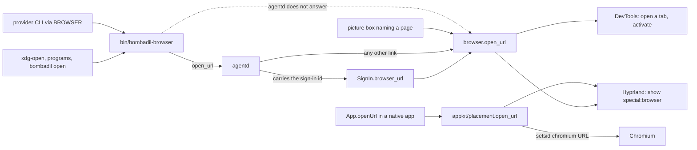
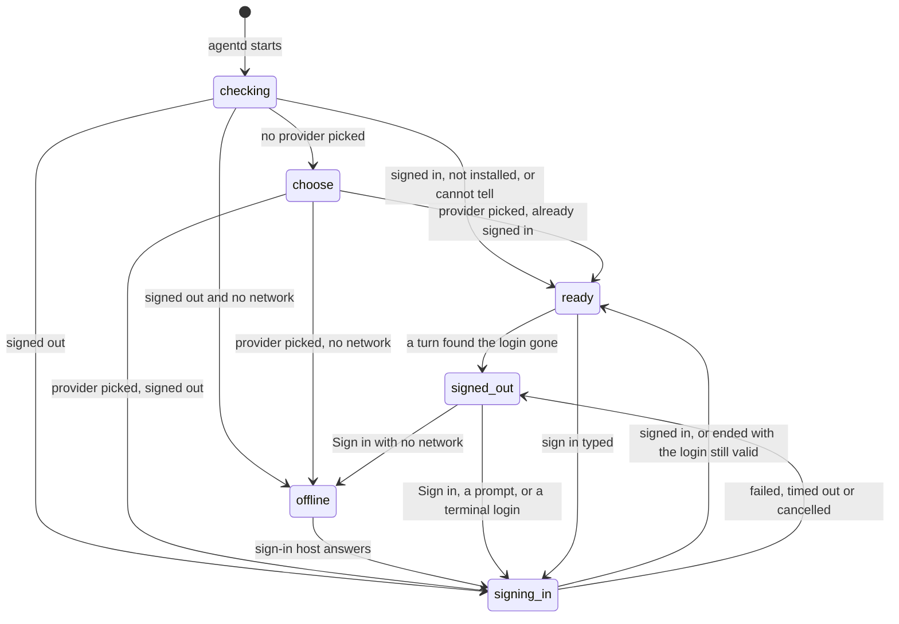
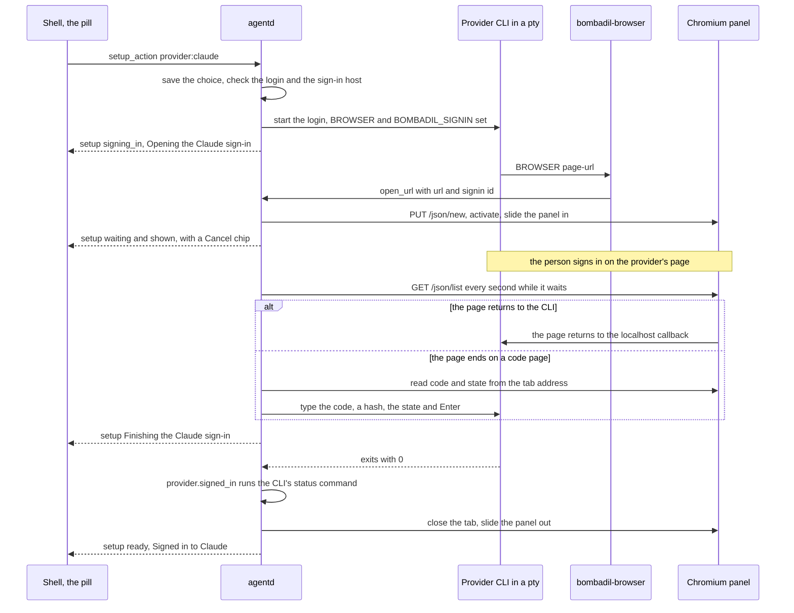

# Browser and sign-in

> **Status:** Partly shipped
> **Code:** `src/bombadil/browser.py`, `src/bombadil/signin.py`, `src/bombadil/fake_signin.py`, `src/bombadil/agentd.py`, `src/bombadil/providers.py`, `src/bombadil/hypr.py`, `src/bombadil/appkit/placement.py`, `bin/bombadil-browser`, `shell/SetupChips.qml`, `iso/airootfs/etc/skel/.config/hypr/hyprland.lua`, `iso/airootfs/etc/chromium/policies/managed/bombadil.json`, `iso/airootfs/etc/skel/.config/chromium-flags.conf`, `iso/airootfs/etc/xdg/mimeapps.list`, `iso/airootfs/usr/share/applications/bombadil-browser.desktop`, `iso/airootfs/usr/local/bin/bombadil-setup`
> **Design:** [UX brief, piece 6: first boot happens in the pill](../design/ux-brief.md#6-first-boot-happens-in-the-pill), [Foundation choices, 7: the browser](../design/foundation-choices.md#7-the-browser--chromium-driven-over-cdp), [Passenger brief, piece 3: the machine's hands in the browser](../design/passenger-brief.md#3-the-machines-hands-in-the-browser-and-taking-the-wheel)
> **Verified:** 2026-10-01 against `main` at `26843d3`

The browser panel is Chromium with its own profile, slid in over the screen as a Hyprland special workspace, and every link that goes through the system's opener routes opens in it (a program that starts a browser itself, such as `chromium URL` typed in a terminal, bypasses them). Provider sign-in runs the provider CLI's own login in a terminal that `agentd` holds and shows the CLI's page in the panel, so first boot needs no terminal and no copied code. The shipped parts are the panel, the link routing, the sign-in and the first-boot flow in the pill. An agent that reads and acts in the browser is designed and has no code: the panel is shown by tools, and the whole-screen `screenshot` tool is the only way the agent sees it, but no tool reads or drives a page (see "What agent-driven browser means in the code").

## How it works

### Where a link goes



Not every opener ends in `browser.open_url`: a native app's `App.openUrl` goes through `appkit/placement.open_url` and never touches `agentd`, `bin/bombadil-browser` or DevTools. The table says who calls what and how it gets there.

| Opener | Route |
|---|---|
| A CLI or program that honours `$BROWSER` | `/etc/environment` sets `BROWSER=/usr/local/bin/bombadil-browser`. `agentd` also sets `BROWSER` to the path of `bin/bombadil-browser` in the environment of every turn's process and of the sign-in CLI (`_bombadil_browser`). |
| `xdg-open` and apps with "open in browser" | `/etc/xdg/mimeapps.list` makes `bombadil-browser.desktop` the default for `x-scheme-handler/http`, `x-scheme-handler/https`, `text/html` and `application/xhtml+xml`; its `Exec` is `bombadil-browser %u`. |
| `bombadil open URL` | Runs `bin/bombadil-browser` with the arguments. |
| A box in a picture that names an `http` or `https` page | `{"type": "open", "kind": "url"}` reaches `Launcher.open_thing`, which calls `browser.open_url` inside `agentd`, without `bin/bombadil-browser`. |
| `App.openUrl(url)` in a generated native app | `src/bombadil/appkit/native/app.py` runs `placement.open_url` (`src/bombadil/appkit/placement.py`) in a thread; it does nothing while `check` renders the app. It has its own scheme rule: `http`, `https` and `file` pass, a bare name gets `https://`, and anything else with a scheme, or a leading `-`, raises `ValueError` (printed in the app's output). It runs `setsid -f <browser.command()> <url>`, so Chromium takes the URL itself (a new tab when it runs), then calls `Hyprland.panel("browser", show=True)` if a window sits in `special:browser`, else focuses `special:browser`. The kit's side is in [app-kit.md](app-kit.md). |
| `show_panel` with `{"name": "browser"}`, the launcher word `browser` | `Hyprland.panel("browser")`: no URL. It starts Chromium with no URL when no window exists and none is starting, then shows the panel; idempotent. |
| `SUPER + B` | `hyprland.lua` binds it to `hl.dsp.workspace.toggle_special("browser")`, not to `Hyprland.panel`. It launches nothing and it toggles: with no browser window it flips an empty `special:browser`. |

`bin/bombadil-browser` drops every argument that starts with `-`, then fixes up each argument that has no `://` (an existing path becomes a `file://` URL; a bare name gets `http://` for `localhost` and `127.0.0.1` and `https://` for anything else; `about:`, `data:`, `javascript:` and `mailto:` are left as they are), then sends `{"type": "open_url", "url": ..., "signin": $BOMBADIL_SIGNIN}` to `agentd` and waits for `agentd` to hang up. If nothing answers on the socket it calls `browser.open_url` itself, so a link still opens with no daemon running.

`AgentD.open_url` refuses any scheme except `http`, `https` and `file` (an `error` event says so). A link whose `signin` tag equals the running sign-in's id goes to `SignIn.browser_url`. A link with no tag goes there only when the run has no page yet and the provider's `signin_url_kind` accepts the URL. Every other link opens in the panel with `Panel.open`. If such a link is a provider's sign-in page, there is no run, and the setup state is neither `ready` nor `choose`, `agentd` assumes a login was started in a terminal and watches for it to finish (see "A login started in a terminal" under "The cases around it").

### The panel

`browser.command()` is how the panel's Chromium starts. `hyprland.lua` has the rule `panel-browser`, which puts the window of class `bombadil-browser` into the special workspace `special:browser` without focusing it, and an animation for `specialWorkspace` (`slidevert`) that makes it slide.

| Flag | Why |
|---|---|
| `--ozone-platform=wayland` | A native Wayland window. |
| `--class=bombadil-browser` | The window class, matched by the `panel-browser` rule, and the command-line text that `browser.running()` and `hypr._launching()` search for with `pgrep -f`. `procs.PROTECTED_ARGS` names it too, so Stop spares the window. |
| `--user-data-dir=<profile_dir()>` | Bombadil's own profile. The docstring of `browser.py` says the debugging port needs a dedicated profile directory. |
| `--remote-debugging-port=9222` | The DevTools port that `browser.DevTools` talks to. |
| `--no-first-run`, `--no-default-browser-check`, `--hide-crash-restore-bubble` | No welcome page, no default-browser bar, no crash bubble. |
| `--password-store=basic` | No keyring prompt. |

`/etc/chromium/policies/managed/bombadil.json` is the managed policy that Chromium reads. It sets `DefaultBrowserSettingEnabled`, `PromotionsEnabled`, `PasswordManagerEnabled`, `PasswordLeakDetectionEnabled`, `SigninInterceptionEnabled`, `MetricsReportingEnabled` and `FeedbackSurveysEnabled` to false, `ProfilePickerOnStartupAvailability` to 1 and `RemoteDebuggingAllowed` to true, and picks Google as the search provider. It sets no `BrowserSignin` key (the UX brief wants Google sign-in to keep working). `chromium-flags.conf` repeats `--no-first-run`, `--no-default-browser-check` and `--password-store=basic` for a Chromium that something else starts.

`browser.open_url(url, hyprland, devtools, spawn, wait=20.0, abandon=None)` returns the tab (`{"id", "url"}`) or `None`, and does this:

1. If `abandon` (a `threading.Event`) is already set, return `None`.
2. If the debugging port is down but a Chromium with `--class=bombadil-browser` runs, wait up to `wait` seconds, polling every 0.25 s. Still down: `RuntimeError("the browser is still starting")`.
3. If the port is up, `PUT /json/new?<whole URL percent-encoded>` (Chromium cuts the query at the first `&`, so a sign-in URL must go encoded), then `/json/activate/<id>`. After a timeout it looks for a tab already on that URL before it tries a second time. No tab: `RuntimeError("the browser would not open the page")`.
4. If Chromium is not running: `RuntimeError("chromium is not installed")` when the binary is missing, else start `browser.command()` with the URL in its own session and take the first page tab the port reports (a fresh start opens that page alone). The process gone after 3 s: `RuntimeError("the browser closed as it started")`. No tab within `wait` seconds and the process still running: `None`, without an error.
5. If `abandon` was set meanwhile, close the tab it made (never the last tab, which would quit Chromium) and return `None`.
6. With Hyprland, `Hyprland.panel("browser", show=True)`. A failure to slide is printed to stderr and does not raise: the page is open and the panel can be shown again. If `abandon` is set while it slides, the panel slides out again and the spare tab goes.

`Hyprland.panel` is idempotent: it launches the panel's program only when no window sits in `special:<name>` and none is starting (`pgrep -f -- --class=...`), waits up to `wait` seconds for the window, and calls `toggle_special` only when the asked state differs from the monitors' state. The screenshot [`docs/screens/first-boot/browser-panel.png`](../screens/first-boot/browser-panel.png) shows Chromium in the panel above the pill.

`browser.DevTools` is a client for the HTTP side of the DevTools protocol on `127.0.0.1:9222`: `up` (`/json/version`), `tabs()` (`/json/list`, pages only), `new_tab`, `activate`, `close`. It never uses a proxy and has no websocket, so it can list, open, raise and close tabs and nothing else. `browser.Panel` is the face the sign-in sees: `open`, `tabs` (`[]` when the browser is not running, `None` when it runs but its port is not up), `shown`, `show`, `hide`, `close_tab`. Without Hyprland `shown()` is `None` and `show` and `hide` do nothing.

### Setup states



`AgentD.access` holds the state, `AgentD._set_access` changes it and broadcasts a `setup` message and a `status` message, and `AgentD._describe` says what the pill shows. In the daemon `auto_signin` is on (`agentd.main`), so `checking` goes straight to `signing_in` or `offline`. `signed_out` is reached after a run ends without signing in and the login is not still valid, when a turn finds the login gone (the state goes `ready`, `signed_out`, `signing_in` in one step, or `offline` with no network), and when the watch of a terminal login times out. `AgentD.check_access` runs when `agentd` starts and when a provider is picked; in between, a dead login is found by the turn that fails on it. Prompts wait in the queue until the state is `ready` (`AgentD._runnable`); a `!command` runs in any state.

| State | Pill line (`T` is the provider's title) | Chips: id, label, style |
|---|---|---|
| `choose` | `Which AI should run this computer?` (tone `ask`) | `provider:claude` Claude `big`, `provider:codex` Codex `big` |
| `checking` | none | none |
| `signed_out` | `Sign in to T to start.`, or what the last run left: `The T sign-in timed out.`, `Sign-in cancelled.`, `Could not sign in to T: <reason>.`, `T signed you out.` | `signin` Sign in `primary`, then `provider:<other>` "Use X instead" `quiet` for each other provider |
| `offline` | `No internet. Connect to a network to sign in to T.` (tone `error`) | `wifi` Wi-Fi `primary`, `signin` Try again `quiet` |
| `signing_in`, phase `starting` | `Opening the T sign-in` | `cancel` Cancel `quiet` |
| `signing_in`, `waiting`, view `shown` | `Sign in to T in the browser` | `cancel` |
| `signing_in`, `waiting`, view `hidden` | `The T sign-in is waiting in the browser` | `show` Show sign-in `primary`, `cancel` |
| `signing_in`, `waiting`, view `closed` | `The T sign-in page was closed` | `show` Open it again `primary`, `cancel` |
| `signing_in`, `finishing` | `Finishing the T sign-in` | none |
| `signing_in`, `ending` | `Cancelling the T sign-in` | none |
| `signing_in`, a login run in a terminal | `Sign in to T in the browser` | none |
| `ready` | empty, or for 120 s (`READY_LINE_SECONDS`) `Signed in to T. Ask me for anything.`, `T is ready. Ask me for anything.`, `You are already signed in to T.` (tone `done`) | none |

`shell/SetupChips.qml` draws whatever chips arrive, by their `style` (`big`, `primary`, `quiet`), and sends `{"type": "setup_action", "id": <chip id>}` on a tap. `PillState.setupAction` first hands the keyboard back (`handOff`) for every chip except `cancel`, because the page or the Wi-Fi list that opens must take the typing. How the chips look is in [shell.md](shell.md).

### One sign-in



1. **Start.** A chip, a typed launcher word (`sign in`, `log in`, a provider's name while `choose`), `bombadil signin`, a prompt typed while the state is `signed_out`, a turn that found the login gone, or `agentd`'s own check at start (`check_access(start=True)` finds the login gone) reaches `AgentD.signin_asked`, `choose` or `start_signin`. `start_signin` checks `provider.signin_host` with `signin.reachable` (a TCP connection, 4 s); none means `offline`. Otherwise it creates `SignIn(provider, on_change, panel=..., env={"BROWSER": ...})`, sets `signing_in` and runs `SignIn.run()` as a background task. A second request while a run exists shows its page again; one that arrives while the first is still checking the network is dropped (`_starting`), so a double tap starts one login.
2. **The terminal.** `SignIn._spawn` opens a pty of 50 rows and 1000 columns (so no CLI wraps a URL), sets `TERM=xterm-256color`, and runs `provider.signin_command()` in its own session with the pty as its controlling terminal, in the home directory, with the daemon's environment plus `BROWSER` and `BOMBADIL_SIGNIN=<run id>`. Output is read from the pty, escape sequences are stripped (`clean`), and URLs are taken from the text (`urls`, which leaves a half-written URL for the next read) and from OSC 8 hyperlinks (`links`). A printed URL counts only if `provider.signin_url_kind` is truthy for it.
3. **Which page.** `SignIn._pick` takes the first URL handed to `$BROWSER`. Failing that, a printed URL once it has been seen for `URL_GRACE` (2 s), preferring the kind `auto` (a page that returns to the CLI by itself) over `manual`. `_maybe_open` stores the URL and its OAuth `state` parameter and opens it with `Panel.open(url, abandon=<the run's _over event>)` in a thread. The phase becomes `waiting`, with view `shown`; if the open raised and no tab shows that address, the view is `closed` so the pill can offer the page again.
4. **Watching.** `SignIn._watch` looks every `POLL` (1 s) or when woken: `Panel.tabs()` through DevTools and `Panel.shown()` through Hyprland. The view is `closed` when there are no tabs, when the run's tab is gone, or when the open failed; `hidden` when the special workspace is not on a monitor; else `shown`. Each change calls `on_change`, which makes `agentd` broadcast a `setup` message.
5. **Finishing.** The phase becomes `finishing` when the run's tab is on `localhost`, `127.0.0.1` or `::1` at an address that is not a sign-in URL (the page came back to the CLI's own server), or when a code was typed.
6. **The end.** The CLI exits. A status of 0 goes through `_confirm`: `provider.signed_in()` returning `False` makes the run `failed` with `it finished without signing in` (Codex prints success for a stray visit to its success page); `True` or `None` is `done`. Any other status is `failed`, with the reason `provider.signin_error(text)` (the provider's `SIGNIN_ERRORS` first, then the last readable line of output), else the browser `hiccup`, else `<binary> exited with <n>`.
7. **After.** A CLI that is still running gets `SIGTERM` to its process group, then `SIGKILL` after 2 s, and the pty closes. For `done`, `cancelled` and `timeout` the tab is closed (unless it is the last) and the panel slides out; after `failed` the page stays on screen in case it says more. `AgentD._run_signin` appends `{"t", "kind": "signin", "provider", "result", "reason"}` to `turns.jsonl`, then sets `ready` with `Signed in to T. Ask me for anything.` (which wakes the queue, so the prompts that waited run) or `signed_out` with the line for the outcome.

### The cases around it

- **A code page.** Claude's printed URL ends at a page on `platform.claude.com` or `console.anthropic.com` whose address holds `code` and `state` (`Claude.code_from_url` returns `code#state`). `SignIn._look` reads every tab's address, and types the code and Enter into the pty once per code. The code must end in `#` plus the `state` of the page this run opened, and be printable (`_is_mine`), so a code page left in the browser by an earlier sign-in is never typed. Codex has no code page (`Codex.code_from_url` is the base `None`).
- **Cancel.** Esc in the pill, the Stop button and the `cancel` chip send `stop` or `setup_action cancel`; both call `AgentD.stop`. With no turn running it calls `SignIn.cancel`, which sets the phase to `ending` at once (`Cancelling the T sign-in`, however slow the browser is) and sets the run's `_over` event, so a page still being opened in a slow browser is dropped and never slid in afterwards. With a turn running, the same keys end the turn first and leave the sign-in. What state a cancelled run ends in follows the rule under "A run that does not end `done`" below; only the `Sign-in cancelled.` line and dropping the prompts that waited for it (`_drop_waiting`) belong to cancel.
- **Timeout.** `BOMBADIL_SIGNIN_TIMEOUT` seconds (default 600), counted from when the CLI starts, end the run with `timeout`; the line is `The T sign-in timed out.` (tone `error`), unless the login is still valid (next bullet).
- **A run that does not end `done`.** `AgentD._run_signin` first asks whether the login it was for is still valid (`signed_in()` true, and no turn found it dead, `_login_gone`). If so, whatever the outcome (cancel, timeout or failure), the state is `ready` with no line and the queue stays. Otherwise each outcome ends in `signed_out` with its own line: `The T sign-in timed out.`, `Sign-in cancelled.` (and the prompts that waited are dropped) or `Could not sign in to T: <reason>.`.
- **Offline.** `start_signin` finds the provider's host unreachable (`signin_host`: `platform.claude.com:443` for Claude, `auth.openai.com:443` for Codex; none for the fake unless `BOMBADIL_FAKE_SIGNIN_HOST` is set). The state is `offline` and `AgentD._wait_online` checks again every `OFFLINE_POLL` (5 s); when the host answers, the sign-in starts by itself. The `Wi-Fi` chip opens `nmtui connect` in the details drawer (`Launcher._wifi`).
- **A login that expires during a turn.** The CLI says so in a structured event (`signed_out`: Claude's `authentication_failed`, a Codex error that matches `SIGNED_OUT`) or in text that matches the provider's `SIGNED_OUT` patterns. A provider with `ends_when_signed_out` (Codex) has its process group ended at the first sign instead of retrying. When the turn ends, `_signed_out_turn` marks the login dead (`_login_gone`), puts the prompt back at the front of the queue, carries over what the person did without the model (the notes the failed turn had been told and any since), says `T signed you out.` and starts a sign-in; the prompt runs once more after it. If the rerun reports the same thing, the login is not what is wrong (a 403, an API key in the environment): the CLI's own words show and no second sign-in starts (`_retried`). A turn the person stopped is not run again. If the person picked the other provider while the turn ran, nothing signs in: the failed provider is no longer the one in use and the one picked meanwhile is left alone.
- **`login_replaces`.** `Codex.login_replaces` is true because `codex login` signs the stored login out as it starts, even if the login it began is then called off. `AgentD.signin_asked` therefore answers `You are already signed in to T.` only when the state is `ready`, `login_replaces` is true and `signed_in()` is `True`. In any other state, or when `signed_in()` is `False` or `None`, it starts a sign-in (it does not read `_login_gone`: after a turn finds the login dead the state is `signed_out`, so the first condition already fails).
- **A login started in a terminal.** A page from the CLI's own login (`claude auth login`, `/login`, `codex login` typed in a terminal) arrives through `$BROWSER` with no run to hand it to. `AgentD._watch_external` sets `signing_in` with no chips (there is no `SignIn`, so Esc is the way to call it off), polls `provider.signed_in()` every 2 s, requires the credentials file's modification time to have changed when the login was known dead (`login_stamp`), and then hides the panel and sets `ready`. It gives up after `signin.TIMEOUT`. It runs only when the state is not `ready` or `choose`.
- **Browser trouble.** An error that reaches `SignIn` while it opens or watches the page (DevTools, Hyprland, the panel) is printed to stderr and kept as `SignIn.hiccup`; it never ends the run. The pill shows `hidden` or `closed` and offers `Show sign-in` or `Open it again`; `SignIn.show` then slides the panel in, or opens the same URL again (a double tap opens one page) and finds its tab by address if the browser could not name it.

### What agent-driven browser means in the code

The only way the agent sees the panel is the whole-screen `screenshot` tool, which returns pixels. No tool reads page text, the DOM or the accessibility tree, clicks, types or evaluates script, and no tool targets a tab. What exists:

| Piece | What it does | What it cannot do |
|---|---|---|
| `show_panel` and `hide_panel` (os-mcp) | Slide the browser panel in and out; start Chromium with no URL if it is not running. | Open a URL, read a page, click, type. |
| `screenshot` (os-mcp) | Returns the whole screen as an image (`Hyprland.screenshot`, run with `grim`). With the panel slid in, the page's pixels are in it. `providers.system_prompt()` tells the agent to take screenshots to check its work, and the narrator says `Looking at the screen`. | Pick a window or a tab, read text, act. It is not a browser tool. |
| `$BROWSER`, the mime defaults, `bombadil open` | Any link the agent's program opens lands in the panel. | Anything after the page is open. |
| `browser.DevTools` | Lists, opens, raises and closes tabs over HTTP. Used by `open_url` and `Panel` (so by `SignIn`, the launcher and `bin/bombadil-browser`). | It has no websocket: no page content, no input, no script evaluation. It is not exposed as a tool. |
| `--remote-debugging-port=9222`, `RemoteDebuggingAllowed`, the dedicated profile | Make a debugging port available on the panel's Chromium. | Nothing in Bombadil connects a protocol client to it. |

Running `OsTools().tools` lists 21 tools, and none of them is a browser tool besides the two panel tools. A search of `src/`, `bin/`, `shell/`, `share/`, `iso/`, `scripts/`, `tests/` and `pyproject.toml` finds no `playwright`, `puppeteer` or `connect_over_cdp`, and the same search of `src/`, `bin/` and `iso/` on every remote branch finds none either. Playwright is named only in design documents, as the plan (the briefs and the "Next" list of [ARCHITECTURE.md](../ARCHITECTURE.md)). The narrator has a line for an `open_url` tool call (`narrate.tool_step`, asserted for `mcp__bombadil-os__open_url` in `tests/test_narrate.py`), but os-mcp registers no such tool. The design (foundation choice 7 and the passenger brief, piece 3) describes Chromium driven over the DevTools protocol, with a visible frame on the page while the agent works and a takeover when the person touches the page. That is a designed feature, not a partial one.

### First boot

1. The live image boots, greetd starts `start-hyprland` as `user`, and `hyprland.lua` starts `agentd`, `bombadil-shell` and `mako`.
2. `agentd.main` reads `/etc/bombadil/config.toml` and `~/.config/bombadil/config.toml`. Without the user file (and without `BOMBADIL_PROVIDER`) the provider counts as not picked (`Config.configured`), so the state is `choose`.
3. The pill asks `Which AI should run this computer?` with two big chips. Typing `claude` or `codex` answers too. Prompts typed meanwhile wait in the queue; a `!command` runs.
4. A pick sends `setup_action provider:<name>`. `AgentD.choose` ends any run, writes `~/.config/bombadil/config.toml` (`config.save_user`), switches the provider (forgetting the old provider's session id when it changes), then runs `check_access(start=True, announce=True)`: `ready` with `T is ready. Ask me for anything.` when already signed in, otherwise `offline` or the sign-in in the diagram above.
5. When the sign-in succeeds the panel slides out and the pill says `Signed in to T. Ask me for anything.`; the prompts that waited run in the order they were asked.
6. The image carries both CLIs (`scripts/build-iso.sh` installs them unless `BOMBADIL_NO_CLIS` is set), so first boot only has to log in.

`bombadil-setup` is the fallback, run from a terminal (`Super+Return` opens one, and `agentd` names the script when a provider's CLI is not installed). It asks which AI, installs the CLI with `npm` if it is missing, and calls `bombadil provider <name>`. Exit code 0 with `bombadil status` answering means `agentd` did it. Exit code 3 (nothing answers on the socket), or 0 with no daemon, writes the choice to `~/.config/bombadil/config.toml`, sets `BROWSER=bombadil-browser` (a bare name: `/etc/environment` uses an absolute path because, its comment says, Codex's opener wants an executable path, and no test runs this fallback with either CLI), runs `claude auth login` or `codex login` in the terminal (the page opens in the panel through the no-daemon path of `bin/bombadil-browser`) and then starts `agentd` through `hyprctl`.

How the built flow differs from the design of piece 6:

| Design | Built |
|---|---|
| With no network, Wi-Fi networks as chips and the password in the pill. | An `offline` state with a `Wi-Fi` chip that opens `nmtui connect` in the details drawer, and a `Try again` chip. The sign-in starts by itself once the host answers. |
| `agentd` reports `needs_network`, `needs_provider`, `needs_login`, `ok`. | `offline`, `choose`, `signed_out`, `ready`, plus `checking` and `signing_in`. |
| "Signed in. Ask me for anything." | `Signed in to Claude. Ask me for anything.` |
| Three example chips and a faint first-day line after sign-in. | Not in the code. |
| A Codex device-code login that fits in the pill. | Not built. Codex's login runs like Claude's: its page in the panel, completed by the localhost callback. |
| The terminal wizard stays only as a fallback. | `bombadil-setup`, as above. |

### `fake_signin.py`

`src/bombadil/fake_signin.py` plays a provider's login on localhost, with the standard library only, so it runs from the ISO as it is. A server on `127.0.0.1` is the provider's page. It hands the page to `$BROWSER` (except in `manual` mode) and prints the other URL with a paste prompt, as `claude auth login` does. Signed in means that `$HOME/.fake-signin` exists.

| Mode | Behaviour |
|---|---|
| `auto` | The page redirects to the CLI's `/callback` after `FAKE_SIGNIN_DELAY` seconds (default 2); the CLI exits 0. |
| `manual` | `$BROWSER` is not used. The printed page ends on `/code`, which shows `code#state` to paste. |
| `never` | The page never finishes (timeouts, a closed panel, cancel). |
| `fail` | The page comes back with `error=access_denied`; the CLI says `Login failed: access_denied` and exits 1. |

`providers.Fake` connects it: `BOMBADIL_PROVIDER=fake` picks it, `BOMBADIL_FAKE_SIGNIN=<mode>` makes it need signing in (unset, `Fake.signed_in()` is true and `signin_command()` falls back to `auto`), and `BOMBADIL_FAKE_SIGNIN_HOST=host:port` plays an unreachable sign-in server. `Fake` is not in `config.PROVIDERS`, so it cannot be written to a config file.

## Interfaces other pieces depend on

Socket messages (newline-delimited JSON on `agentd`'s socket; `agentd.md` owns the rest of the protocol and the `bombadil provider` and `bombadil signin` commands):

| Message | Direction | Meaning |
|---|---|---|
| `{"type": "open_url", "url", "signin"}` | client to `agentd` | Open a link in the panel. `signin` is the `BOMBADIL_SIGNIN` value of the CLI that handed it over, or `null`. Only `http`, `https` and `file` open. |
| `{"type": "setup_action", "id"}` | shell to `agentd` | A chip: `provider:claude`, `provider:codex`, `signin`, `show`, `cancel`, `wifi`. |
| `{"type": "signin", "provider"?}` | `bombadil signin` to `agentd` | Sign in (again); with a provider that is not the current one, or when none was picked yet, it picks it first (`choose`). |
| `{"type": "stop"}` or `cancel` | client to `agentd` | Ends a running turn; with none running, cancels a sign-in. |
| `{"type": "prompt", "text"}` | client to `agentd` | The launcher words `sign in`, `log in`, `use codex` and, while `choose`, a provider's name are answered by `agentd` without a turn. |
| `{"type": "setup", "state", "provider", "title", "line", "tone", "actions", "phase", "view"}` | `agentd` to every client | Sent on connect and on every change. `tone` is `step`, `ask`, `error` or `done`; `phase` and `view` come from the running `SignIn` (`null` without one); `actions` is `[{"id", "label", "style"}]`. |
| `{"type": "status", "setup": <state>, ...}` | `agentd` to every client | The same state as a field of the status message. |

Python surface:

| Name | Where | Meaning |
|---|---|---|
| `browser.open_url(url, hyprland, devtools, spawn, wait, abandon)` | `src/bombadil/browser.py` | Open a page in the panel and slide it in; raises `RuntimeError` when the page did not open. |
| `browser.Panel` | same | `open`, `tabs`, `shown`, `show`, `hide`, `close_tab`; what `SignIn` and `AgentD` use, and what tests replace. |
| `browser.DevTools(port, host)` | same | `up`, `tabs`, `new_tab`, `activate`, `close`. |
| `browser.command()`, `profile_dir()`, `binary()`, `running()`, `same_url()`, `close_spare_tab()`, `find_tab()` | same | The start command, the profile, the binary, process check, address comparison, tab helpers. |
| `signin.SignIn(provider, on_change, *, panel, env, timeout, grace, poll)` | `src/bombadil/signin.py` | One run. `run()`, `cancel()`, `show()`, `browser_url(url)`, `type(text)`; fields `phase`, `view`, `reason`, `hiccup`, `url`, `tab`, `text`, `id`, `running`. |
| `signin.TIMEOUT`, `URL_GRACE`, `POLL`, `COLUMNS`, `reachable()`, `clean()`, `urls()`, `links()`, `last_words()` | same | Timing and output helpers. |
| `Provider.signin_command`, `signin_url_kind`, `code_from_url`, `signed_in`, `credentials`, `login_stamp`, `signed_out`, `SIGNED_OUT`, `ends_when_signed_out`, `login_replaces`, `signin_error`, `SIGNIN_ERRORS`, `signin_host` | `src/bombadil/providers.py` | What a provider supplies to be signed in. |
| `show_panel`, `hide_panel` | os-mcp (`src/bombadil/mcp_server.py`) | Argument `name`, one of `browser`, `files`, `terminal` (the keys of `hypr.PANELS`). See [os-mcp.md](os-mcp.md). |

Commands: `bin/bombadil-browser URL...` (exit 2 with no URL, 1 when `agentd` did not answer and `browser.open_url` raised), `bombadil open URL`, `bombadil signin [claude|codex]`, `bombadil provider claude|codex`, `bombadil-setup`.

Environment variables:

| Variable | Read by | Meaning |
|---|---|---|
| `BROWSER` | programs, `agentd` (writes it) | The opener: `bin/bombadil-browser`. |
| `BOMBADIL_SIGNIN` | `bin/bombadil-browser` | The id of the sign-in run whose CLI is calling; `agentd` sets it in the login's environment. |
| `BOMBADIL_SIGNIN_TIMEOUT` | `signin.py` at import | Seconds a run may last (default 600). |
| `BOMBADIL_PROVIDER` | `agentd.main` | Picks the provider and counts as "picked". |
| `BOMBADIL_FAKE_SIGNIN`, `FAKE_SIGNIN_DELAY`, `BOMBADIL_FAKE_SIGNIN_HOST` | `providers.Fake`, `fake_signin.py` | Test logins (see above). |
| `BOMBADIL_SOCKET`, `BOMBADIL_DATA`, `XDG_DATA_HOME`, `HYPRLAND_INSTANCE_SIGNATURE` | `paths.py`, `hypr.py` | Where `agentd`'s socket is, where the profile lives, and whether Hyprland can be asked. |

Fixed names: window class `bombadil-browser` (`browser.CLASS`), special workspace `special:browser`, window rule `panel-browser`, key `SUPER + B`, DevTools port `9222`, and `procs.PROTECTED_ARGS`, which holds `--class=bombadil-browser`. Stop spares the panel's Chromium only because of that entry, so a change to `browser.CLASS` or to the `--class=` flag in `browser.command()` needs the same change there, or Stop kills the browser a turn opened.

## Where state lives

| What | Where |
|---|---|
| The browser profile (cookies, history, logins to websites) | `~/.local/share/bombadil/browser` (`browser.profile_dir()`: `paths.data_dir() / "browser"`). |
| Open tabs | Inside Chromium; read at `http://127.0.0.1:9222/json/list`. |
| Whether the panel is on screen | Hyprland's special workspace `special:browser`; `Panel.shown()` asks `j/monitors`. |
| The setup state and the running sign-in | `agentd`'s memory (`AgentD.access`, `chosen`, `signin`, `_login_gone`). Lost on restart and found again by `check_access`. |
| The provider choice | `~/.config/bombadil/config.toml` (`provider = "claude"`), with defaults from `/etc/bombadil/config.toml`. `Config.configured` means the user file exists. |
| The provider's login | The CLI's own file: `~/.claude/.credentials.json` (`$CLAUDE_CONFIG_DIR`), `~/.codex/auth.json` (`$CODEX_HOME`). Bombadil reads only its modification time (`Provider.login_stamp`) and otherwise asks the CLI (`claude auth status`, `codex login status`). |
| A record of each sign-in run | One line per run in `~/.local/state/bombadil/turns.jsonl`: `"kind": "signin"`, `provider`, `result` (`done`, `failed`, `timeout`, `cancelled`), `reason`. |
| The fake login | `~/.fake-signin`. |
| What an install carries over | `bombadil-install` copies `~/.claude`, `~/.claude.json`, `~/.codex` and `~/.config/bombadil` from the live user to the installed system (`iso/airootfs/usr/local/bin/bombadil-install`), so it starts signed in with the same provider choice. The browser profile `~/.local/share/bombadil/browser` is not copied. See [iso-and-install.md](iso-and-install.md). |

Files in the image (`iso/airootfs/`), see [iso-and-install.md](iso-and-install.md) for how the image is built:

| Path in the image | What it does |
|---|---|
| `/etc/chromium/policies/managed/bombadil.json` | The managed policy above. |
| `/etc/skel/.config/chromium-flags.conf` | Copied to a user's `~/.config/chromium-flags.conf`; read by Arch's Chromium launcher. |
| `/etc/xdg/mimeapps.list`, `/usr/share/applications/bombadil-browser.desktop` | Make `bombadil-browser` the default for web links (`NoDisplay=true`, so it is not in any menu). |
| `/etc/environment` | `BROWSER=/usr/local/bin/bombadil-browser`. |
| `/usr/local/bin/bombadil-browser` | A symlink to `/usr/share/bombadil/bin/bombadil-browser`, made by `scripts/build-iso.sh`. |
| `/usr/local/bin/bombadil-setup` | The terminal fallback. |
| `/etc/skel/.config/hypr/hyprland.lua` | The `panel-browser` rule, the `specialWorkspace` animation and `SUPER + B`. |

## Principles it keeps

- [The answer is the thing](../principles.md#the-answer-is-the-thing): the sign-in is a page in a panel that slides in and out, not a terminal, a terms page or a promo tab. The flags, the policy file and `chromium-flags.conf` exist to keep everything but the page off the screen. The trap is an added first-run page, a second window, or a terminal step in the flow.
- [Degrade and recover](../principles.md#degrade-and-recover): choosing the AI, signing in, cancelling, showing the page again and waiting for the network are `agentd` code with no model call. `bin/bombadil-browser` opens the panel itself when `agentd` is gone, and `bombadil-setup` runs the same login with no daemon. A browser error is a `hiccup`, never the end of the run. The trap is a step that needs a turn, or an error that ends the sign-in because DevTools did not answer.
- [Something true in 200 ms](../principles.md#something-true-in-200-ms): `SignIn.cancel` sets the phase `ending` before it touches the browser, so the pill says `Cancelling the T sign-in` at once, and a page still being opened is dropped (`abandon`). The trap is waiting for a slow browser or a compositor call before telling the pill.
- [Nothing runs unseen](../principles.md#nothing-runs-unseen): a sign-in can start by itself (signed out at start, a turn that found the login gone, the network coming back). Each one is on screen, with the page in the panel, a line in the pill and a way to call it off (Esc, a Cancel chip), and cancel, timeout and `agentd` exiting end the CLI's process group so no login keeps holding its port (`_end_process`, `end_signin_now`). A browser driven by the agent (designed) has to show its hands the same way. The trap is a login that runs with the panel hidden and no line, or a panel that slides in for a run that was called off.
- [Plain files stay the truth](../principles.md#plain-files-stay-the-truth): the login is the CLI's own file, and `agentd` never stores its contents: it reads only the file's modification time (`login_stamp`) and otherwise asks the CLI (`claude auth status`, `codex login status`). `AgentD.access` is a remembered answer, not the file: it is refreshed at start and on a provider pick (`check_access`), when a run ends (`SignIn._confirm`, `AgentD._run_signin`) and when asked to sign in with a provider whose login a new one would replace (`signin_asked`); in between, `ready` stands until a turn finds the login dead (`_runnable`). The only secret that passes through `agentd` is the one-time code in the sign-in tab's address, typed into the CLI; `SignIn` holds it in memory (`_pasted`) until the run ends. The person's choice is one short file, `~/.config/bombadil/config.toml`. The traps are treating `access` as proof that the login works where the CLI could be asked, storing a credential, and rewriting that file carelessly (`config.save_user` keeps only `provider`, `model` and `explain`; see the gaps).

## Extending it

### Add a provider's login

1. Add a `Provider` subclass in `src/bombadil/providers.py` with `name`, `title` and `binary`, and the turn methods described in [agentd.md](agentd.md).
2. Give it `login_command()`, the CLI's own login argv. `signin_command()` returns it; only `Fake` overrides `signin_command`.
3. Set `signin_host = ("host", 443)`, the host the login needs. `agentd` checks it before it starts a run and shows `offline` when no connection opens. Leave it `None` to skip the check.
4. Write `signin_url_kind(url)`: `"auto"` for the page that returns to the CLI's localhost callback by itself, `"manual"` for one that ends on a code, `None` for everything else. Check scheme, host and path strictly (see the look-alike cases in `tests/test_providers.py`): `agentd` also uses it to decide that an untagged link is the sign-in page and that a link opened outside a run starts the terminal-login watch.
5. If the login ends on a code to paste, write `code_from_url(url)` returning exactly the text to type (`SignIn` adds Enter). Otherwise keep the base `None`.
6. Write `signed_in()` as `True`, `False` or `None` from the CLI's own status command (`self._status([...])`), and set `credentials` to the CLI's login file so that a login which changed the file is noticed through its modification time.
7. For turns, add `SIGNED_OUT` patterns (and a `signed_out` event from `parse` when the CLI has a structured sign). Set `ends_when_signed_out` if the CLI retries for a while, and `login_replaces` if its login signs the stored one out as it starts. Add `SIGNIN_ERRORS`, pairs of a regular expression and one plain line; the first match wins, else the last readable line of output shows.
8. Register it: `PROVIDERS` at the end of `providers.py` and `PROVIDERS` in `src/bombadil/config.py` (these decide the first-boot chips, the names `config.load` accepts and the arguments of `bombadil provider`), the words in `launcher.PROVIDER_WORDS`, `sysmap.PROVIDER_HOSTS` (the API host the network picture probes; an unknown provider falls back to Claude's entry), the two places that name the CLIs, the `select provider in claude codex` list in `bombadil-setup` and the `npm install` line in `scripts/build-iso.sh`, and, for a CLI that `npm` puts under a new scope in `/usr/lib/node_modules/`, an entry for that scope in `file_permissions` in `iso/profiledef.sh` (`mkarchiso` copies `airootfs` without modes, so what runs needs `0:0:755`; `@anthropic-ai/` and `@openai/` are listed).
9. Test it with a subclass of `providers.Fake` like `Browsing` in `tests/test_agentd_signin.py` for the flow, and with captured CLI output for the hooks, as in `tests/test_providers.py`.
10. Update the expected chips in `test_first_boot_asks_which_ai_and_holds_prompts_until_signed_in` (`tests/test_agentd_signin.py`), which asserts the exact list `["provider:claude", "provider:codex"]`; it fails once a third provider is in `config.PROVIDERS`.

### Handle another kind of sign-in page

- **A different address of an existing login** (another host or path): extend `AUTH_HOSTS`, `CODE_PAGES` or the path checks in `Claude.signin_url_kind` and `code_from_url`, with the captured URL in `tests/test_providers.py`.
- **A page that ends on a code:** `code_from_url` returns the whole text to type. If the URL the run opened carried a `state` parameter, the code must end in `#` plus that state (`SignIn._is_mine`), and each code is typed once.
- **A page that finishes some other way** (a code the person types on another site, a QR code): there is no registration point. `signin_url_kind` has two kinds, `auto` and `manual`; `SignIn._pick` uses the difference only to prefer `auto`, and the rest of the code asks whether the answer is truthy. A run ends when the CLI exits, is cancelled or times out (`SignIn.run`), and moves to `finishing` when its tab is on a localhost address that is not a sign-in URL or when a code was typed (`SignIn._look`). Another kind needs changes in `SignIn._pick` and `_look`, a branch for it in `fake_signin.py`, and a matching behaviour in `FakePanel` in `tests/test_signin.py`.

### Add a setup state

1. Set it with `await self._set_access("<state>", line, tone)` in `agentd.py`; it broadcasts `setup` and `status`, and wakes the queue when the state is `ready`.
2. Add a branch for it in `AgentD._describe` returning the line, the tone and the chips (`{"id", "label", "style"}`, style `big`, `primary` or `quiet`).
3. Decide whether prompts wait: `AgentD._runnable` lets ask text run only in `ready`.
4. Handle the chip ids in `AgentD.setup_action` (the ids are `provider:<name>`, `signin`, `show`, `cancel` and `wifi`).
5. Teach the shell: in `shell/PillState.qml`, `ready` is true only for the states `""`, `ready` and `checking` (anything else shows the setup line), `face` reads `choose`, `signed_out` and `offline` as `needs` and `signing_in` as `working`, and `stoppable` is true while `signing_in`. `shell/SetupChips.qml` draws any chips without a change.
6. Teach `bin/bombadil`: `follow_setup` keeps waiting in `signing_in`, `checking` and `offline` and stops in any other state, exiting 0 only for `ready`.
7. Update the lists of states in the protocol description at the top of `src/bombadil/agentd.py`, in the `setup` row of [agentd.md](agentd.md) and in the comment on `setupState` in `shell/PillState.qml`.
8. Cover it in `tests/test_agentd_signin.py` (the `_setup(state)` helper), in the setup tests of `tests/test_pill_qml.py` and, if it is reachable in a booted image, in the `signin-*` checks of `bombadil-smoke`. Update the state diagram above.

### Open a page in the panel from your own code

From a process, run `bombadil open URL` or the program named by `$BROWSER`. From the QML of a generated native app, call `App.openUrl(url)`: it goes through `appkit/placement.open_url`, not through `agentd`, and has its own scheme check. From code inside `agentd` or the launcher, call `browser.open_url(url, hyprland)` (it blocks and raises `RuntimeError`, so call it in a thread as `AgentD.open_url` does) or `Panel.open`. `Hyprland.panel("browser")` shows the panel and takes no URL.

### Add another panel like the browser

1. Add the name to `hypr.PANELS` with its command as a list, or `None` and a branch in `hypr.panel_command` as `browser` has. Give the command a `--class=` or `--app-id=` argument: `hypr._launching` takes the first such argument and searches for it with `pgrep -f`, and without it a second `show_panel` while the app is still starting launches a duplicate.
2. In `hyprland.lua` add a `panel-<name>` window rule for the window's class or app id with `workspace = "special:<name> silent"` (`silent`, as the existing rules have, so the window is not focused as it lands), and a key bind on `hl.dsp.workspace.toggle_special("<name>")` if wanted. A key bind only toggles; it launches nothing.
3. Add the marker, as one whole argument, to `procs.PROTECTED_ARGS`, or Stop kills the window a turn opened (`tests/test_procs.py`).
4. Add the spoken words to `launcher.PANEL_WORDS` and `launcher.PANEL_TITLES`, and the line words to `narrate.PANEL_WORDS`. `show_panel` and `hide_panel` take their names from `sorted(hypr.PANELS)`; see [os-mcp.md](os-mcp.md).

## Tests

```sh
python3 -m pytest -q tests/test_browser.py tests/test_signin.py tests/test_agentd_signin.py
```

These need `pytest` and `pytest-asyncio` (the `dev` extra in `pyproject.toml`) and no Chromium, no Hyprland and no provider account. The three files hold 10, 16 and 28 tests; on 2026-10-01 all 54 passed in about 53 s.

| File | Covers |
|---|---|
| `tests/test_browser.py` | A stand-in for the DevTools port that parses `/json/new` as Chromium does (PUT only, query cut at the first `&`): a sign-in URL opens whole, the last tab is never closed, a browser that is not running has no tabs and one that runs but does not answer has `None`, the command keeps its profile and `--no-first-run`, the three `RuntimeError` cases, and a page nobody wants any more never slides the panel in. |
| `tests/test_signin.py` | `SignIn` against `fake_signin.py` and a `FakePanel`: the page from `$BROWSER` returns to the CLI, a printed page that ends on a code gets the code typed, timeout, a refused login, hidden and closed views with `show`, a missing CLI, `reachable`, a page that would not open, a code page left from an earlier run, cancel while the browser is still opening, a double tap, a tab that will not close. |
| `tests/test_agentd_signin.py` | `agentd` with the fake provider: first boot, held prompts, Esc, hidden panel, timeout, failure reasons, no network then back, a turn that finds the login gone (once, not in a loop, not after a stop, not for a provider switched meanwhile), links from `bombadil-browser`, a terminal login, `login_replaces`, `Cancelling` at once, and `SIGTERM` with the bar connected. |
| `tests/test_providers.py` | The sign-in hooks of Claude and Codex from captured output: `signin_url_kind`, `code_from_url`, `signin_error`, `signed_in`. |
| `tests/test_pill_qml.py` | The shell's side: the two big chips, `setup_action` messages, `Cancel`, `Show sign-in`, the offline and error lines (offscreen Qt). |
| `tests/test_mcp_server.py` (`test_panels`) | `show_panel` and `hide_panel` call `Hyprland.panel`. |
| `iso/airootfs/usr/local/bin/bombadil-smoke` | In a booted image: the browser window lands in `special:browser`, the `signin-*` checks run the whole round trip against `fake_signin.py` and read the page's address from `127.0.0.1:9222`. How to run it is in [development.md](../contributing/development.md). |

No test runs `bin/bombadil-browser` itself (its argument fix-up, its exit codes, its no-daemon fallback): its only exercise is `bombadil-smoke`, through `fake_signin.py` handing its page to `$BROWSER`. No test reads the policy file, `chromium-flags.conf`, `mimeapps.list`, the `.desktop` file or `/etc/environment`, and none checks what Chromium does with the flags and policy keys above, that `/etc/environment` reaches the greetd session, or that `xdg-open` is in the image (`iso/packages.x86_64` lists `chromium` and no `xdg-utils`). `bombadil-smoke` only checks that the browser window lands in `special:browser`.

## Known gaps

- **No browser tool for the agent.** `src/bombadil/mcp_server.py` registers `show_panel` and `hide_panel` and no tool that opens a URL, reads a page or acts in one (the whole-screen `screenshot` is the only view of it); `browser.DevTools` (`src/bombadil/browser.py`) is an HTTP client for tabs only.
- **No Wi-Fi chips or password field in the pill.** The `offline` state offers a `Wi-Fi` chip that opens `nmtui connect` in the details drawer (`src/bombadil/agentd.py` `_describe`, `src/bombadil/launcher.py` `_wifi`).
- **No example chips and no first-day line after sign-in.** A search of `shell/`, `src/` and `share/` finds neither the example prompts nor the line.
- **`SUPER + B` is a plain toggle.** `hl.dsp.workspace.toggle_special("browser")` in `iso/airootfs/etc/skel/.config/hypr/hyprland.lua` does not go through `Hyprland.panel`, so it never launches Chromium and, with no browser window, flips an empty `special:browser`.
- **A second URL handed to `$BROWSER` in one run is not opened.** `SignIn.browser_url` records it, but `_maybe_open` runs only while the run has no page (`src/bombadil/signin.py`).
- **The timeout counts from the CLI's start.** `asyncio.wait(..., timeout=self.timeout)` starts after the spawn (`src/bombadil/signin.py`), although the comment on `TIMEOUT` says seconds on the sign-in page.
- **The no-daemon path of `bin/bombadil-browser` has no scheme check.** `AgentD.open_url` refuses everything but `http`, `https` and `file`, but `bin/bombadil-browser` passes `about:`, `data:`, `javascript:` and `mailto:` on, and when `agentd` does not answer it hands them to `browser.open_url`, which does not look at the scheme.
- **`bombadil-setup` leaves the panel on screen after its fallback login**, because nothing in the script slides it out, and its `--first-run` branch has no caller in the repository (`iso/airootfs/usr/local/bin/bombadil-setup`).
- **The browser is found by command-line pattern.** `browser.running()` and `hypr._launching()` run `pgrep -f -- --class=bombadil-browser`, so any process whose arguments contain that text counts as the panel's Chromium.
- **Picking a provider drops other keys of the user's config file.** `config.save_user` (called by `AgentD.choose`) rewrites `~/.config/bombadil/config.toml` with `provider`, `model` and `explain` only: with `snapshots = false` in the file, picking a provider leaves `provider = "codex"` and `explain` and no `snapshots` line (run on 2026-10-01; `src/bombadil/config.py`).
- **A slow status command holds `checking`.** `Provider._status` waits up to 60 s for `claude auth status` or `codex login status` (`src/bombadil/providers.py`), and prompts wait in the queue meanwhile because only `ready` runs them.
