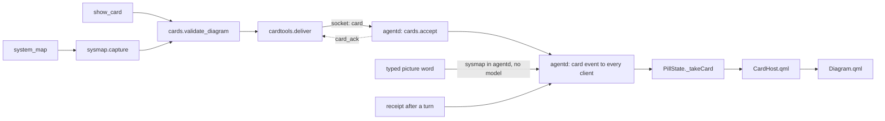
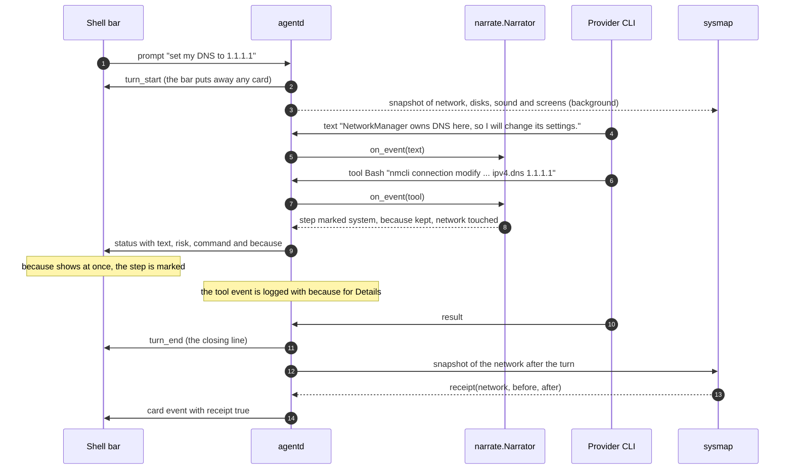
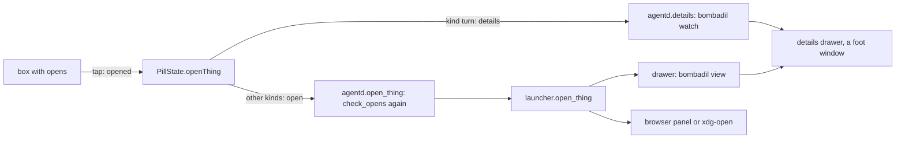

# Cards and pictures

> **Status:** Partly shipped
> **Code:** `src/bombadil/cards.py`, `src/bombadil/cardtools.py`, `src/bombadil/sysmap.py`, `src/bombadil/narrate.py`, `src/bombadil/pager.py`, `src/bombadil/mcp_server.py`, `src/bombadil/launcher.py`, `src/bombadil/agentd.py`, `src/bombadil/watch.py`, `src/bombadil/providers.py`, `src/bombadil/config.py`, `bin/bombadil`, `shell/CardHost.qml`, `shell/StatusLine.qml`, `shell/PillState.qml`, `shell/shell.qml`, `share/qml/Bombadil/Diagram.qml`, `iso/airootfs/etc/skel/.config/hypr/hyprland.lua`
> **Design:** [Riding with Bombadil, piece 1](../design/passenger-brief.md#1-why-and-after-reading-what) and [piece 2](../design/passenger-brief.md#2-pictures-from-the-machine), [How Bombadil should feel, piece 5](../design/ux-brief.md#5-answers-you-can-touch)
> **Verified:** 2026-10-01 against `main` at `a30ebc8`

A card is validated data for a picture that the shell draws above the status line. One card type exists,
`diagram`, in four fixed shapes (`chain`, `layers`, `compare`, `timeline`), and every finished card carries a `text`
twin of itself (a draft that is still streaming does not). Cards come from four places: the agent (`show_card`), the
machine itself (`system_map`), exact questions typed in the pill such as "how am I connected" (no turn, no model), and
the receipt that follows a turn. The same piece keeps why the agent did each step (`because`) and what it had read from
outside (`after`), so a person can see the road without asking. Nothing in it asks a model: pictures of the machine are
read from real commands, and a reason is the agent's own sentence from just before it acted.

## What is built and what is designed

| Part | Status | Where |
|---|---|---|
| `diagram` card, four shapes, text twin | Shipped | `cards.py`, `Diagram.qml`, `CardHost.qml` |
| Tools `show_card` and `system_map` | Shipped | `cardtools.py`, registered from `mcp_server.py` |
| Picture words typed in the pill | Shipped | `launcher.py` (`PICTURE_PHRASES`), `agentd.py` (`picture`) |
| Streaming a card a box at a time | Shipped for Claude only | `cards.py` (`CardStream`), `agentd.py` |
| Receipts, a before and after of what a turn changed | Shipped | `sysmap.py` (`receipt`), `agentd.py` (`_receipt`) |
| Why lines (`because`, `after`) and a bare "why" during a turn | Shipped | `narrate.py`, `StatusLine.qml`, `launcher.py` |
| Details drawer and `bombadil view` | Shipped | `launcher.py`, `pager.py` |
| A card that keeps its line, is placed once and gives way to a window or a full-screen window | Shipped | `CardHost.qml`, `PillState.qml`, `StatusLine.qml`, `shell.qml` |
| The boot picture from `systemd-analyze plot`, btrfs subvolumes in the disks picture, a receipt for boot, the two snapshots stored beside the turn's log | Designed | [Passenger brief, piece 2](../design/passenger-brief.md#2-pictures-from-the-machine) |
| Other card kinds: list, checklist, timer, control, markdown reader | Designed | [UX brief, piece 5](../design/ux-brief.md#5-answers-you-can-touch) |
| Cards the agent writes in QML | Designed | UX brief, piece 5 |
| The `teach` explain level (a faint chip on system words that opens their picture) | Designed | [Passenger brief, "How much does it explain?"](../design/passenger-brief.md#decisions-i-picked-a-default-for) |

The desk draws its own cards (`DeskCard.qml`, `RowsCard.qml`, `NowCard.qml`); they do not use `Diagram` and are
described in [the desk](desk.md). The status line's other behaviours (the counter, the command, Undo, Details, the cut
of the agent's own words at a word) are described in [the shell](shell.md); this page covers its `because` and `after`
lines and how a picture holds the line.

## How it works



1. **A card is made.** The agent fills in `show_card`, or asks `system_map` for a subject (both are tools of
   [os-mcp](os-mcp.md), registered by `cardtools.register`, which `mcp_server.py` calls). `system_map` runs
   `sysmap.capture`, which reads the machine and builds its own card through the same `cards.validate_diagram`.
   With `system_map` the agent supplies only a subject, a pointer and one line. With `show_card` it supplies the whole
   diagram, and the tool's description tells it never to draw this machine's state that way.
2. **The tool delivers it.** `cardtools.deliver` writes `{"type":"card","card":{...}}` to the `agentd` socket and
   waits for `{"type":"card_ack"}` (the socket timeout is `ACK_TIMEOUT`, 2 seconds). The tool's result is the card's
   text twin plus a note on whether it was drawn, so the agent writes one short line instead of describing the
   picture.
3. **[`agentd`](agentd.md) checks it again.** `cards.accept` re-validates, so nothing malformed reaches the bar whoever wrote
   to the socket, and keeps the three fields only the OS adds (`source`, `target`, `receipt`). It broadcasts a
   `card` event to every client, then answers `card_ack`.
4. **Two other doors lead to the same event.** A typed picture word is answered inside `agentd` (`picture`), with a
   `local` line first and no model call. A receipt is made after the turn closes (`_receipt`). Both go straight to
   `_show` with no socket hop.
5. **The shell draws it.** `PillState._takeCard` keeps one card. `CardHost.qml`, loaded through a `Loader`, holds
   the title, a source label, a close mark, the kit's `Diagram` inside a scroll area (the shell caps the host at 60
   percent of the screen height, and a taller picture scrolls), and the `say` line, which shows at most three lines
   (`maximumLineCount: 3`). `shell.qml` makes the host as wide as the pill (`Layout.maximumWidth: Math.max(360,
   win.pillMax)`), so a picture stays between the desk's rails. The `Diagram` draws the card and places its boxes;
   Python computes only the `rank` and `col` of a `layers` card and the `row` pairing of a `compare` card.

### A turn that records a reason and ends with a receipt



The reason is kept as the text arrives: the narrator holds the agent's words of the current model message, and when a
tool starts it keeps the last cleaned sentence as `because`. The step's parts of the machine (`parts_touched`) decide
which snapshots are compared afterwards. Nothing blocks the turn: the first snapshot is taken in the background, and
the receipt is made after `turn_end`.

### What a card is

There is one card type. `cards.validate_diagram` is the only validator and returns every fixable error at once, each
saying what and why, so the agent can correct the call in one go. This is what it accepts.

| Card field | Rule |
|---|---|
| `shape` | required: `chain`, `layers`, `compare` or `timeline` |
| `title` | required, at most 60 characters (longer is an error, it is not cut) |
| `nodes` | 1 to 12 objects |
| `links` | optional, at most 16 |
| `highlight` | a node id or a list of ids; an unknown id is an error |
| `say` | optional, at most 160 characters, one sentence |
| `linked` | `chain` only: `false` stops the automatic links in order that a chain without `links` gets. Explicit `links` are still kept and drawn |
| `kind` | `show_card` input only: `diagram` (the default). Any other value is refused by the tool |

| Node field | Rule |
|---|---|
| `label` | required, at most 32 characters (longer is an error that says to use `sub`) |
| `id` | optional, default `n<position>`; letters, digits and `_ . : @ / -`, up to 40; unique |
| `sub` | second line, at most 60 characters (longer is an error) |
| `state` | `ok`, `warn`, `bad`, `new`, `gone` or `active`. How the kit draws each is in the table below the shapes |
| `icon` | a kit icon name, checked against `share/qml/Bombadil/icons/*.svg` when that folder is found |
| `side` | `before` or `after`; required on every node of a `compare` card |
| `key` | `compare`: the same key on both sides puts the two boxes on one row (cut at 40 characters) |
| `time` | `timeline`: text such as `0.4 s`, cut at 24 characters |
| `weight` | `timeline`: anything `float()` reads (numbers, numeric strings such as `"3"`, `true` and `false`); any other value is an error ("weight must be a number"). A negative value or `nan` becomes 0 without an error. The bar is as long as this against the longest step |
| `note` | a line under the box, cut at 60 characters |
| `volatile` | a boolean that is kept on the node; nothing reads it (see Known gaps) |
| `opens` | `{"kind", "value"}`, what a click opens (next table) |

| `opens.kind` | `value` must be |
|---|---|
| `path` | absolute, `~`, or starting with `~/` |
| `unit` | a systemd unit name ending in `.service`, `.socket`, `.timer`, `.target`, `.mount`, `.path`, `.slice`, `.scope`, `.device` or `.swap` |
| `package` | a package name (`a-z`, digits, `@ . _ + -`) |
| `url` | `http://` or `https://` |
| `turn` | a turn number of up to 9 digits |

A link is `{"from", "to", "label", "state"}`. `from` and `to` must be node ids, `label` is at most 24 characters
(an error if longer), and a `state` that is not one of the six is dropped without an error.

The validator adds what the model should not have to write: ids, the links of a chain, `rank` and `col` for every
box of a `layers` card, `row` for every box of a `compare` card, and `text`. A finished card from `show_card`
looks like this (the input was three boxes, one of them with `state` and `opens`, a `highlight` of the second box, and a `say`):

```json
{"type": "diagram", "shape": "chain", "title": "How a VPN works",
 "nodes": [{"id": "n1", "label": "Your device"},
           {"id": "n2", "label": "VPN server", "state": "new", "opens": {"kind": "url", "value": "https://example.com/vpn"}},
           {"id": "n3", "label": "Website"}],
 "links": [{"from": "n1", "to": "n2"}, {"from": "n2", "to": "n3"}],
 "highlight": ["n2"], "say": "Traffic goes through the VPN server first.",
 "text": "How a VPN works: Your device → VPN server [new] → Website\nTraffic goes through the VPN server first."}
```

`cards.accept` keeps three fields that only the OS itself may add: `source` (one of `network`, `boot`, `service`,
`disks`, `sound`, `screens`; the shell labels the picture "from this machine" when it is present and "drawn by the
agent" when it is not), `target` (a unit name, set by the `service` capture) and `receipt: true`. `agentd` then
stamps an `id` (`card-<n>`, or `stream-<tool id>` when the card was drawn while it streamed). A draft also carries
`partial: true`.

| Shape | Meaning of the links | Where the layout is done |
|---|---|---|
| `chain` | the path, boxes left to right, wrapping to rows when they do not fit | `Diagram.qml` |
| `layers` | a link from a box to what it needs; a box sits below everything that points at it | `cards.rank_layers` writes `rank` and `col`: cycles lose the edge that closes them, rank is the longest path, four sweeps order each row to avoid crossings |
| `compare` | none; `side` puts a box left (`before`) or right (`after`), `key` pairs rows | `cards.validate_diagram` writes `row`; `Diagram.qml` places it: two columns of at most `maxCompareWidth` (230 px), centred, with `compareGap` (76 px) between them for the arrow |
| `timeline` | none; one row per box with its `time`, `label`, a bar for `weight` and `sub` on the right | `Diagram.qml` |

How `Diagram.qml` draws a `state` (`_tone` and `_mark`):

| `state` | A box (`chain`, `layers`, `compare`) | A `timeline` row |
|---|---|---|
| `ok` | plain, no mark | grey dot, `Theme.accent` bar |
| `warn` | `Theme.warn` and a triangle | `Theme.warn` dot, bar and `sub`, no mark |
| `bad` | `Theme.bad` and an x | `Theme.bad` dot, bar and `sub`, no mark |
| `new` | `Theme.accent` and a plus | `Theme.accent` dot and bar, no mark |
| `gone` | dim, a minus and the label struck through | dim dot and bar, the label struck through, no mark |
| `active` | `Theme.info`, no mark | `Theme.info` dot and bar, no mark |

The layout is fixed and never a force layout: the same data always draws the same picture. `cards.text_of` writes
the text twin from the same data, so it cannot disagree with the picture. The marks in it are `[slow or weak]`
(`warn`), `[broken]` (`bad`), `[new]` and `[gone]`. A chain reads `title: a → b → c` (boxes joined with `;` when it
has no links), `layers` reads one line per box as `app needs database`, `compare` reads `Before: ...` and
`After: ...`, and `timeline` reads `time: name` per row. The twin is what the agent gets back, what the shell
exposes to screen readers (`Accessible.name`), and what the details drawer lists for a picture.

### Streaming a box at a time

Streaming works for Claude only. The Claude command line runs with `--include-partial-messages`, so the provider layer
yields `tool_start` and `tool_input` events (the call's JSON as it is written). The Codex path yields neither.

1. `cards.CardStream.feed` follows each call whose tool name ends in `__show_card` and appends its partial JSON.
2. `cards.partial_diagram` reads `shape`, `title` and each finished object of `nodes` (a reader that tracks braces and
   quoted strings, so a box cut in the middle of a word is left out). It keeps only `id`, `label`, `sub`, `state` and
   `side`. Validation and layout wait for the whole card.
3. It returns a draft when the shape, the title or the number of finished boxes changed: a card with `partial: true`,
   no links, no `text` and the id `stream-<tool id>`.
4. `agentd` broadcasts each draft as a `card` event. Drafts are not logged to the turn's file; only the finished card is.
5. When the finished call reaches `agentd` as a `card` message, `_card_message` takes the oldest open stream id and
   gives the finished card that same id.
6. A draft is taken back with `{"id": "stream-...", "gone": true}` when its call fails (`tool_result` for that
   call), when the turn ends with the draft still open, or (in the shell) when the connection to `agentd` is lost.

In the shell a draft shows the label "drawing…", and each box fades in as it arrives. Because a draft has no links and no `rank`,
a `layers` draft shows its boxes in one row until the finished card replaces it. A `chain` draft (`partial` and no links)
reserves room for link labels of about 14 characters, so the finished chain does not wrap again when its links arrive.

### Replacing in place

The shell holds one card (`PillState.card`). A card event whose `type` is not `diagram` is ignored. Any other card
replaces the one on screen, and one with the same `id` is the same picture changing: the draft grows into the
finished card in place. A card leaves when:

| Event | Effect |
|---|---|
| The next turn starts (`turn_start`) | any card is put away |
| Esc with nothing to stop and an empty input (`PillState.dismiss`, which puts the line away too), or the close mark (`PillState.dismissCard`) | put away |
| `{"id", "gone": true}` for the card on screen | put away |
| A picture word that could not be drawn (`local` event, `action` `picture`, `phase` `done`, `ok` false) | the old card is put away so the error does not read as about it |
| A window the launcher opened (`local` event, `phase` `done`, `ok` true, `verb` `open`, `action` `brain`, `app` or `panel`) | put away, so it does not sit over the window. Hiding or closing a window does not |
| The connection to `agentd` drops while the card is a draft | put away (`lost`) |
| The closing line fades (`fade`) | only a receipt goes. A picture the person asked for stays until Esc or the next turn |
| A full-screen window on the desk's screen | not put away: `CardHost.suppressed` hides it and it returns when the window goes |

The closing line fades after 12 seconds (15 with a receipt, so the two are read together), and resting the pointer on
the line or the card holds it. A turn that changed something keeps its closing line with Undo until the next prompt
(`sticky`, see [restore points](restore-points.md) for Undo), and then the receipt stays with it.

### Where the card sits

The bar is one layer-shell window as tall as what is in it, so every resize of a card is a resize of that window. These
rules keep a card from moving the pill or its own close mark.

| Rule | Where | What it means |
|---|---|---|
| The `layers` animation is off | `iso/airootfs/etc/skel/.config/hypr/hyprland.lua:47` | The file's comment says Hyprland slides a layer to its new place whenever it is resized, which is every time a picture appears or grows, and the pill dipped and swung back. A card that goes resizes the bar the same way. The file is a skeleton: the home folder is copied from `/etc/skel` when it is made (`iso/airootfs/usr/local/bin/bombadil-install:54`) and `scripts/vm-tools/update-in-place` leaves `~/.config/hypr/hyprland.lua` alone, so an installed system needs that line added by hand |
| The card is placed once | `CardHost.qml`: `implicitHeight` has no `Behavior`, and a `Translate` of 14 px | The card takes its height at once and fades in and rises inside that space, and it hands the space back after it has faded out. A height that grew over several frames resized the window every frame |
| A picture the person asked for keeps its line | `PillState.pictureStays`, `StatusLine.qml` (`lineTimer`, `done` check) | The card sits above the line in a column anchored to the bottom, so a line that grew, shrank or went moved the card by the line's height and a click aimed at its close mark missed. `pictureStays` is true while a card is up that is not a receipt and not a draft; the line does not fade while it is true, and its timer stops running when the pill is not working and no flash is showing, so a picture left up costs no wake-ups. Esc puts line and picture away together. The close mark clears the card and the line fades on the timer's next tick unless it is `sticky`. A receipt is not asked for and fades with its line |
| A card being drawn keeps the layout it will end with | `Diagram.qml`: `if (partial && links.length === 0) longest = 14` | The boxes of a streamed chain arrive before its links, and the links' labels decide how wide the gaps are, so a finished chain would lay itself out again from one row into two |
| A before and after sits together | `Diagram.qml`: `maxCompareWidth`, `compareGap` | The two columns are at most 230 px wide with 76 px between them for the arrow, centred, instead of one at each edge of a wide card |
| A full-screen window puts the card away | `shell.qml:286` binds `CardHost.suppressed` to `win.capsule` | In a full-screen window the pill is a dot and a clock in a capsule (see [the desk](desk.md)), and a card above it would land over whatever the window shows. The card is still `PillState.card`, so it comes back when the window goes |

The card's top edge is its own height above the line, so two different pictures sit at different heights; the same
picture sits at the same place each time.

### What a click returns



`Diagram` emits `picked(node)` for every tap on a box and `opened(target)` when the box has `opens`. `CardHost` listens
to `opened` only. `PillState.openThing` sends nothing while the socket is down (it flashes "Not connected to the agent
yet."). A `turn` target first gives the keyboard back so the drawer can take it (`handOff`) and sends
`{"type":"details","turn":n}`, which `agentd` routes to `details`, not to `open_thing`; every other target sends
`{"type":"open","kind":"...","value":"..."}`. `agentd.open_thing` runs `cards.check_opens` again, because the
card may have come from any process that can reach the socket. It handles a `turn` only for a client that sends `open`
with that kind: it answers "The details of turn N are not kept." unless the turn is running or its log is among the
last 50, and otherwise calls `details`. The result of any other open comes back as a `local` event with `action`
`open`, and the line says what happened. For a `turn`, `details` sends no event when it works and a `local` event with
`action` `details` and `ok` false ("Could not show the details: ...") when `launcher.details` raises, for example when
`foot` is not installed.

| `kind` | What opens (`launcher.open_thing`) |
|---|---|
| `unit` | the drawer, showing `systemctl status --no-pager -l` for the unit |
| `package` | the drawer, showing `pacman -Qi`, or `pacman -Si` when it is not installed |
| `url` | the browser panel, the way every other link opens |
| `path` that is a folder | the drawer, showing `ls -la -p` |
| `path` that is a text file | the drawer, showing the file |
| `path` that is another file | `xdg-open` |
| `path` that does not exist | the line says "<name> is not there." |

The value is passed as an argument, never as shell text. The drawer is a `foot` window with the app id
`bombadil-details`, run by `launcher.details`, which a Hyprland window rule sends to the `special:details` workspace
without taking focus. `_focus_drawer` waits up to 5 seconds for the window to map and then focuses it, so Esc closes
it. The line says "Showing ..." when the window was there, or when the viewer is still running after the 5 seconds;
it says "Could not open ..." when the viewer ended before any window appeared. `details` with `toggle` closes the
drawer instead when it already shows the same program (a second click on Details).

### What `system_map` captures

Every capture reads the machine with real commands (the network capture also opens a TCP connection and reads
`/etc/resolv.conf`). The commands run with the process's own environment plus `LC_ALL=C`, `LANG=C`,
`SYSTEMD_COLORS=0`, `NO_COLOR=1` and `TERM=dumb`, and no stdin, side by side in a worker pool. Each command has the capture's budget: 0.5 seconds (`BUDGET`),
and anything that has not answered by then counts as missing, so a picture comes back within about that time, drawn
from what could be read (a capture that reads in steps takes the budget once per step). Parsers are pure functions of text. If nothing at all could be read, the capture raises
`sysmap.Unavailable` with one plain sentence ("Could not read the disks: lsblk did not answer.").

| `kind` | Reads | Budget | The picture |
|---|---|---|---|
| `network` | `ip -j route get 1.1.1.1`, `ip -j route show default`, three `nmcli` queries (devices, the Wi-Fi in use with its signal and no rescan, connectivity), `/etc/resolv.conf`, and a TCP connection to the active provider's host on port 443 (`api.anthropic.com` for Claude, `api.openai.com` for Codex) | 0.5 s, and up to 1.6 s (`PROBE_BUDGET`) for the provider connection when there is a route. A receipt snapshot gives that connection 0.5 s too, because a latency is never a change | `chain`: this machine, a VPN tunnel box when the route runs over a `wg`, `tun`, `tap`, `tailscale`, `ppp`, `vpn` or `zt` device, Wi-Fi (signal under 40 percent is `warn`) or cable, router (with the DNS servers as a note), internet, and the provider last. The first broken link is `bad` and lit, with one sentence in `say`. A captive portal is `warn` |
| `boot` | `systemd-analyze critical-chain --no-pager`, `time --no-pager` and `blame --no-pager`, side by side. The tree is read both as the ASCII marks of the C locale and as box-drawing marks | 4.0 s (`BOOT_BUDGET`): the boot record is slow to read and does not change | `timeline`. The critical chain: one row per unit on it, at most 12 (the slowest 11 and the last, in order), each with its start time and a bar for how long it took. It is drawn when it has four rows or more (`THIN_CHAIN`), or when `blame` has no more units worth drawing than it has rows. Otherwise the slowest units: longest first, at most 12, each with its duration where the start time was, and a bar. In both, the slowest unit is `warn` and lit when it took at least a second, and each row opens its unit (except that a `.automount` unit among the `blame` rows makes the capture fail, see Known gaps). A live system has no boot record, and the answer says so |
| `service` | `systemctl show` for the unit, with its state and its start time (`ActiveEnterTimestamp`); `target` is required, `bluetooth` and `bluetooth.service` both work, and a name that systemd reports `not-found` is looked up again ignoring case (`_spelt_like`), so `networkmanager` is drawn as `NetworkManager.service`. Then the states of what it `Requires` and `Wants` (at most 8, without the common noise such as `sysinit.target`), and `pacman -Qo` for the package that owns a unit file under `/usr/` | 0.5 s a step: the unit, then its dependencies and owner side by side, up to 1 s; a name that is not found adds a lookup and a second read, up to 2 s | `layers`: the unit on top, its dependencies below, each with its state (`active` ok, `activating` warn, `failed` bad, any other state warn; a required dependency that is failed or inactive is `bad` and lit). Each box opens its unit. The card carries `target`, the unit as systemd spells it |
| `disks` | `lsblk -J -b` and `findmnt -b -J` | 0.5 s | `layers`: disks of at least 1 MB (so no floppy drive or empty card slot) that are not named `zram`, `loop`, `ram` or `fd`, their partitions and encrypted or logical volumes, with mount point, filesystem, size and how full. Amber from 90 percent, red from 97 percent; read-only filesystems such as `squashfs` and `iso9660` never warn. Each mounted box opens its mount point |
| `sound` | `pw-dump` (PipeWire) | 0.5 s | `layers`: up to 4 speakers (the ones playing and the default), each with its volume (the node's master `volume` times its highest channel volume, as a cube root percent, which is what a slider shows) or "muted", and up to 6 playing apps per speaker linked to it. A muted speaker is `warn` |
| `screens` | `hyprctl -j monitors` | 0.5 s | `chain`, unlinked: the monitors left to right with mode, refresh rate and scale; the focused one is `active`, a disabled one `warn` |

`sysmap.capture(kind, target)` returns `{"card", "facts"}`. The card has `source` set to the kind. `facts` are the
plain values the card was made from, `{"key", "label", "value"}`, with `volatile: true` on values that move on their
own (a disk's used space); receipts compare them (see Receipts). A running service also has a fact `since` ("up since
<time>", with the date when it is not today) marked `alone: true`, with a `say` sentence (see Receipts). `boot` has
no facts.

What the model never does: it does not capture, parse or lay out anything. `apply_overrides` lets the agent do two
things: point (`highlight`: ids that exist; an unknown id leaves the machine's own highlight) and replace the one
sentence under the picture with its own (`say`, at most 160 characters); it then rebuilds the text twin. The picture,
its boxes, its states and its default sentence are the machine's.
The same holds on both providers. The pictures need no model and work offline: with no connection at all the picture
is "This laptop" then "No network". "not answering" appears under the provider box when a link exists but the
provider host does not accept a connection, unless NetworkManager reports no or limited connectivity: then the
internet box is the broken one and the provider box has no line. A picture word asks no model and starts no turn (see
Picture words).

#### What reading a real machine taught

The fixtures in `tests/test_sysmap.py` are in the shape the real tools print (its module docstring). Each of these
has tests of its own, named below.

- **The boot tree is ASCII in the C locale.** `systemd-analyze critical-chain` draws its tree with `` `- ``, `|-` and
  `| ` there, and with box-drawing characters in a UTF-8 locale. `_CHAIN_RE` takes both, and a `-` counts as a tree mark
  only right after a `|` or a backtick, so a unit named `-.mount` keeps its name. A reader that took only the box-drawing
  marks drew one row. To see what a machine prints: `LC_ALL=C systemd-analyze critical-chain --no-pager | cat -A`.
  Tests: `test_the_chain_is_read_in_the_c_locale_the_captures_run_under`,
  `test_boot_in_the_c_locale_draws_the_whole_chain_not_its_root_alone`.
- **A PipeWire level is in two places.** A node has a master `volume` and one level per channel (`channelVolumes`). A
  hardware speaker keeps its level in the channels and leaves `volume` at 1.0; a software one does the reverse. What
  plays is the two together, both linear, and the percent on a slider is the cube root (`_volume`). Reading `volume`
  alone said 100 percent at any volume, so a volume change left two identical snapshots and no receipt. Tests:
  `test_a_hardware_speaker_keeps_its_level_in_the_channels_not_in_the_master_volume`,
  `test_the_sound_receipt_sees_the_volume_change_that_used_to_read_as_a_hundred_percent`.
- **Unit names are case-sensitive and people do not type capitals.** `NetworkManager.service` is not
  `networkmanager.service`. `find_unit` and `capture_service` look the name up ignoring case (see Picture words) and the
  picture is drawn under the machine's own spelling. The launcher keeps the capitals of what was typed for the service
  phrase. Test: `test_a_service_typed_without_its_capitals_is_found_as_systemd_spells_it`.
- **`systemctl list-unit-files` is slow.** The docstring of `_UnitFiles` says about two seconds on a small virtual
  machine and far longer under load. A lookup that waited for it would run out of its half second and send the typed
  words to the agent, which starts a turn and a restore point for a picture that is free. `find_unit` asks
  `systemctl show` and `systemctl list-units --all` (about a tenth of a second, says its docstring) side by side, and the
  unit-file names come from a kept list read in the background. Tests:
  `test_the_slow_list_of_unit_files_is_never_waited_for`,
  `test_a_unit_that_is_only_a_unit_file_is_found_once_the_names_are_kept`.
- **A quiet boot has almost no chain.** With the console quiet, `graphical.target` is reached through three targets that
  all finish together, so the chain is three lines and the card said nothing took a second. When the chain has fewer
  than `THIN_CHAIN` (4) rows and `blame` has more units worth drawing, the card shows the slowest units instead.
  Tests: `test_a_quiet_boot_draws_the_slowest_units_when_the_chain_is_three_lines`,
  `test_the_chain_is_kept_when_it_has_enough_steps_or_blame_has_no_more`.
- **`blame` is mostly waiting.** The first rows of `blame` can all be `.device` units, which are time spent waiting for
  the hardware to appear, and `initrd-*` units are the early boot before the system proper. `_worth_blaming` leaves
  both out, and any unit under 1 ms, so the rows are what the machine did. When nothing else is left the chain is
  kept as it is. Test: `test_a_boot_that_blame_only_fills_with_waiting_for_devices_keeps_the_chain`.
- **Systemd escapes names.** `/dev/disk/by-uuid/1234` is `dev-disk-by\x2duuid-1234` as a unit name. `_pretty` says names
  the way `systemd-escape -u` reads them: a device, mount, swap or automount unit as its path
  (`/dev/disk/by-uuid/1234 device`), the instance of a template that starts like a path (`dev-`, `run-`, `mnt-`,
  `media-`, `home-`) as a path (`systemd-fsck@/dev/disk/by-uuid/1234`). `_short` keeps the end of a long instance, since
  the device is what tells two apart. The box still opens the real unit name. Tests:
  `test_systemds_escaping_is_undone_in_what_the_pictures_say`,
  `test_the_boot_picture_names_a_device_by_its_path_but_opens_the_unit`.

### Picture words

`launcher._picture` matches the fixed phrases exactly, after the typed text is lowercased, its spaces are folded and
`. ! ? , ; :` are stripped from its ends (a curly apostrophe counts as a straight one). The service form is matched on the
text as typed, in any case, because unit names have capitals. Text with any other non-ASCII character is never a picture word.
Any other wording goes to the agent, which has `system_map` for the same pictures. `agentd` runs `launcher.match` in a
thread (`agentd.py:398`), and the service form asks the machine inside it.

| Picture | Phrases (`launcher.PICTURE_PHRASES`) |
|---|---|
| `network` | how am i connected, am i connected, am i online, how is my internet connected, network map, connection map |
| `boot` | what starts when i boot, what starts at boot, what starts on boot, what runs at boot, what runs when i boot, boot map |
| `disks` | where did my disk go, where did my space go, where did my disk space go, my disks, disk map, what disks do i have |
| `sound` | what's playing where, whats playing where, what is playing where, sound map, where is my sound going |
| `screens` | my screens, my monitors, screen map, what screens do i have |
| `service` | `what does [the] <unit> [service] need`, `depend on` or `require` instead of `need` (`launcher._NEEDS_RE`) |

For the service form the unit must exist, found with `sysmap.find_unit` (it adds `.service` to a name that does not end
in `.service`, `.socket`, `.timer`, `.target`, `.mount`, `.path`, `.slice` or `.scope`, so a `.device`, `.swap` or
`.automount` name is also given `.service`):

1. `systemctl show -p LoadState` and `systemctl list-units --all` run side by side within `BUDGET`. A `LoadState` of
   `loaded` returns the name as typed.
2. Otherwise the loaded-units list is searched for the name, then for one that differs only in its capitals.
3. Otherwise the kept list of unit-file names is searched the same way. That list comes from `systemctl list-unit-files`
   and is never waited for: `agentd` starts `sysmap.warm_unit_names` in a background thread when it starts, a failed
   read keeps the old names, and a lookup that reaches the list while it is missing or older than ten minutes
   (`_UnitFiles.FRESH`) starts another read in the background and answers from what it has.

It returns the unit as systemd spells it, so "what does networkmanager need" draws `NetworkManager` and the action's
target is `service:NetworkManager`. `capture_service` resolves a name that is `not-found` through the loaded list and the
kept names, so `system_map` with target `networkmanager` also works. When the text is also the name or title of an
installed app, the app wins. `agentd.picture` captures the picture without a model, shows it, and says "Showing ..." in
the line. It also keeps a note (the typed words and the first 400 characters of the picture's text twin), and the next
prompt to the agent starts with `[Done by the user without you since your last turn: ...]`, so a follow-up such as "why
is that red" can be answered. `agentd` keeps the last 10 such notes, which it shares with the other things the person did
without the model. A picture that could not be read says why in the line and adds no note.

### Reasons and what was read (`narrate.py`)

`narrate.Narrator` follows one turn's provider events. Besides the live line (described in [the shell](shell.md)) it
keeps two records for the status line and Details. The `read` list is also written to `turns.jsonl`; no code in this
tree reads that field from there (the [brain](brain.md) reads the row's `files`, not `read`), and Details takes its list
from the turn's own log.

**Reason (`because`).** The sentence the agent wrote just before it acted, kept instead of thrown away.

| Rule | Detail |
|---|---|
| Source | the agent's last text in the current model message (`message_start` clears it). A step in a message with no sentence before it has none |
| Fallback | the `description` of a Bash call |
| Never | thinking text. It can become the live line but is never a reason |
| Cleaning (`reason_from`) | code blocks and markdown dropped; the last sentence; filler openers (`ok`, `great`, `now`, `first`, `so`, ...) and lead phrases (`let me`, `i'll`, `i need to`, ...) removed, and a following verb turned into its `-ing` form ("Let me install ffmpeg" becomes "Installing ffmpeg"); trailing `!` dropped |
| Limit | at most `MAX_BECAUSE` (140) characters, cut at a word with `…`; shorter than 4 characters or without a letter is no reason |
| Carried by | the `status` event of the step (`because`), and the `tool` or `file_change` event, which `agentd` logs with it so Details can show it |

**What was read (`Read`).** A per-turn list of what the turn read, each marked yours or outside. It is sent in
`turn_end` as `read` and written to `turns.jsonl`.

| `kind` | Comes from | `outside` when |
|---|---|---|
| `web` | `WebFetch`, `curl`, `wget`, `aria2c`, `xh`, `http`, `https`, the URL of a `git clone` | the host is not `localhost`, `127.0.0.1`, `::1` or `0.0.0.0`. The label is host and path only, never a credential or query |
| `file` | `Read`, `NotebookRead`, and `cat`, `less`, `more`, `head`, `tail`, `bat`, `batcat`, `zcat`, `xxd`, `hexdump` (up to 3 files) | the file's `user.xdg.origin.url` extended attribute names a host (a download); `origin` then holds that host |
| `search` | `WebSearch` (the query, at most 50 characters) | always |
| `screen` | a `[Screen]` block at the start of a line in the prompt, if one is there (`narrate.prompt_reads`). Nothing on `main` writes it: the "this" chip that would is designed | it holds a page address or a selection |
| `session`, `app` | a line `[asked by <who>, untrusted]` in the prompt (`narrate.prompt_reads`; `app <name>` is an `app`, anything else a `session`). Nothing on `main` writes it either | always |

The list keeps the last 50 reads (`MAX_READS`), and a repeat moves to the end. **`after`** is the latest outside read,
attached only to a step that carries a mark (`system` or `irreversible`), as `{"label", "kind", "text"}` with text such
as "after reading wireguard.com/quickstart", "after searching the web for ...", "after reading the page on screen" or
"after a request from builder". It says what came first, not what caused the step: the order is known, the cause is not.

**Where they show.**

| Surface | Behaviour |
|---|---|
| `StatusLine.qml`, `because` | a quiet second line (muted, at most two lines) while a turn runs, shown when the pointer rests on the line, and always on a marked step |
| `StatusLine.qml`, `after` | an amber caption, only on a marked step |
| A bare `why` typed while a turn runs | `launcher.WHY_WORDS` matches it (plain ASCII only, only while busy); `agentd.local` answers from `Narrator.why_text` with no model and no turn, and the bar flashes it for 8 seconds (answers below). At any other time the word goes to the agent. "Why is this here" is a different question, answered by the brain (`launcher.BRAIN_COMMANDS`) |
| Details (`watch.py`) | `why: ...` under the step's command, the `after` text in amber, and at the end a `read` block with `yours` and `outside` lines |

What a bare `why` answers (`Narrator.why_text`, and `agentd.local` before it):

| State | Answer |
|---|---|
| The step has a reason, is marked (`system` or `irreversible`) and followed an outside read | `<because> (<after text>)` |
| The step has a reason, without both of those | the reason alone |
| The step has none | "It did not say why for this step: ..." and the step's words up to the first comma |
| No step has started | "Nothing has started yet." |
| The turn has no narrator yet (`agentd`) | "Nothing is running." |

**What a step touched, for receipts.** `parts_touched` (and `parts_command`, `parts_changes` for Codex's file
changes) classify a step into `network`, `service` (with the unit), `sound`, `screens` or `disks`. The rules are
branches of `_touch_segment` (commands), the `_PATH_KINDS` pairs of a regular expression and a kind (paths) and the
`_NET_UNIT` and `_AUDIO_UNIT` patterns (units), for example `nmcli
connect`, `ip route add`, `wg set`, `resolvectl dns`, a write to `/etc/NetworkManager/` or `/etc/resolv.conf` for the
network; `systemctl restart` or a unit file under `systemd/system` for a service; `wpctl set-*`, `pactl set-*` for
sound; `hyprctl keyword monitor` or `wlr-randr` for screens; `mount` with arguments, `mkfs*`, `udisksctl mount` or an
`/etc/fstab` write for disks. Reading commands (a bare `mount`, `fdisk -l`, `pamixer --get-volume`) touch nothing. `Narrator.drew` is set when
the agent called `show_card` or `system_map` in the turn.

### Receipts

A receipt is a `compare` card, titled with the part's picture title (the unit's short name for a service, such as
"bluetooth") followed by ", before and after", of what a turn changed in a part of the machine it touched.

1. At `turn()` start, unless the turn is a typed `!command` or `explain` is `brief`, `agentd` starts
   `sysmap.snapshot` for `BEFORE_KINDS` (`network`, `disks`, `sound`, `screens`) in the background. Nobody waits for
   it. A part that cannot be read here (no Hyprland, no PipeWire) is `None`.
2. As each tool step is read, `agentd` starts `sysmap.snapshot_service` for every `service` the step touches, before
   the step has run (at most 3 units per turn).
3. After `turn_end` and the closing line, `_receipt` runs in the background. It does nothing when there is no snapshot,
   when `Narrator.drew` is set (the agent drew its own picture), or when the turn touched none of these parts. It waits
   up to `BUDGET + 1` seconds for the first snapshot, captures the touched kinds again, and compares each in the order
   the turn touched them. The first part that changed wins; if none did, up to two services are compared (a service
   caught while `activating` or `reloading` is not a valid before).
4. `sysmap.receipt` compares only facts without `volatile`, by `key`: added, removed or changed values. It returns
   `None` when nothing changed, so a signal, a latency or a used-space figure moving is never a change. A fact marked
   `alone` (a service's start time) counts only when nothing else changed: next to another change it is left out. On its
   own, a restart that leaves the service as it was, it makes the receipt: the card shows the start time before and
   after, and says the service was restarted and is running again (the fact's `say`). For at most 6
   changed keys it draws a `before` box (`gone`) and an `after` box (`new`), paired on one row per key, lights the
   after boxes, sets `receipt: true` and `source`, and says "N more changed." in `say` when there are more.
5. The card is shown only when no other turn has started (`_closed_turn == turn`). It carries the turn's number, so it
   is logged with that turn.

Because only the parts a turn's own steps touched are compared, a change in a part the turn did not touch (a Wi-Fi drop
during a turn that only edited files) is never in its receipt. A turn that touched the network is compared on all of the
network's non-volatile facts (the link, the router, the DNS servers, a VPN tunnel), so a drop during such a turn can
appear. At most one receipt card is shown per turn. `explain` is a key in `config.toml` read when `agentd` starts:
`brief` turns receipts off (no snapshot is taken), `normal` (the default) leaves them on, `teach` is accepted and behaves like `normal`.

### The details drawer and `bombadil view`

The drawer is where text goes when a picture is not the right answer. This piece uses it for two things: a turn's own
log (`bombadil watch`, started by `agentd.details`, listing each step with its command, output, `why:` and `after`, then
what was read, and each picture shown in words as a `picture` block, labelled "what changed" for a receipt) and
whatever a box opened (`bombadil view`). `launcher.details` runs other programs in the same drawer, which belong to
other pages: `bombadil history` (the `history` word) and `nmtui connect` (the `wifi` word), see [agentd](agentd.md), and
a background job's output (`Jobs.why`), see [the desk](desk.md).

`bombadil view` (`bin/bombadil` calls `pager.view`) shows `--file PATH` (the first 2,000,000 bytes, with a note when the
rest is cut) or the output of `-- COMMAND ARG...` (run with a 15 second limit, errors mixed in). A missing program
says "<name> is not installed.", a program still running after the 15 seconds "<name> did not answer in time.", and one
that prints nothing and exits "Nothing to show." With a
terminal, text that fits is printed whole, followed by "Press Esc to close.", and any key closes it. Longer text takes the
drawer's own screen with a window of rows and a footer such as `11-19 of 50 · Esc closes`. Esc alone (or `q`, `Q`, Ctrl-C,
Ctrl-D) closes it; the arrows, PageUp and PageDown, Home and End, the space bar, `f`, `b`, `j`, `k`, `g` and `G` scroll, and
Enter scrolls down one row.
The text is laid out again at the next key press after the drawer was resized. Keys are read from `/dev/tty`, so text may be piped in; with no
terminal at all the text is printed. It is a small module rather than `less`; its docstring gives the reason: `less`
cannot leave on Esc, and it was not on the image.

### Failure behaviour

| What goes wrong | What happens |
|---|---|
| `show_card` input is invalid | The tool returns an error result (`isError`), and its text is "ValueError: The picture was not drawn:" followed by one line per fix. The server stays up |
| `kind` is not `diagram` | "kind '...' is not drawn yet: only diagram is" |
| `agentd` is not running | The tool returns the card's text with "(agentd is not running, so nothing could be drawn.)" |
| `agentd` does not answer within 2 seconds | "(agentd did not answer, so it may not have been drawn.)" |
| No other client is connected | `card_ack` has `shown: false`, and the tool adds "(No screen is showing it: here it is in words.)" |
| `agentd` rejects the card on its second check | `card_ack` carries `errors`, and the tool passes them on |
| A capture cannot read anything | `system_map` returns the one-sentence reason as its result. A picture word shows it as the line and puts the old card away |
| A command is slow or missing | It counts as missing and the picture is drawn from the rest |
| `CardHost.qml` cannot load | By design the `Loader` in `shell.qml` is not `Ready`, the host stays invisible and the bar is unaffected. No test forces a load failure |
| The shell gets an odd card | `_takeCard` ignores anything that is not a `diagram` object, and a message that is not valid JSON is dropped by `shell.qml` |
| A click names something that cannot be opened | `agentd` says why in one line ("Cannot open that: ...", "<name> is not there.", "Could not open ...") and the card stays |
| `narrate.py` raises on an odd event | `agentd` logs it and drops that line, never the turn |
| The streaming follower raises | `agentd` writes to stderr, and the card is drawn when whole |

## Interfaces other pieces depend on

The socket protocol as a whole is in [agentd](agentd.md), and the tool registry in [os-mcp](os-mcp.md). This table
lists what this piece owns.

| Name | Kind | Detail |
|---|---|---|
| `show_card` | os-mcp tool | `shape`, `title`, `nodes` required; `kind`, `links`, `highlight`, `say`, `linked`. Returns the text twin and "(shown above the bar)" or why not |
| `system_map` | os-mcp tool | `kind` required (`network`, `boot`, `service`, `disks`, `sound`, `screens`); `target` for `service`; `highlight`, `say` optional |
| `{"type":"card","card":{...}}` | socket message, client to `agentd` | answered with `{"type":"card_ack","shown":bool}`, or `{"type":"card_ack","shown":false,"errors":[...]}` |
| `{"type":"open","kind","value"}` | socket message | what a box names; answered with a `local` event, `action` `open`. For `kind` `turn` it ends in `details`: nothing comes back when that works, and the "not kept" line when the turn's log is gone |
| `{"type":"details","turn":n}` | socket message | the turn's log in the drawer; again while it shows closes it. A turn whose log is not kept shows the newest log instead (see Known gaps) |
| `{"type":"close_details"}` | socket message | puts the drawer away (Esc in the pill) |
| `card` | event | `{"card": {...}, "turn": n or null}`. A finished card, a draft (`partial: true`), or `{"id", "gone": true}`. `turn` is null for a picture word, the running turn for a card sent during it, the closed turn for a receipt |
| `local` | event | `turn` null, `action`, `phase` (`start`, `done`), `ok`, `text`, and `target` for a picture or a launcher action. `verb` (`open`, `close` or `hide`) is on the actions that `agentd._local` runs (apps, panels, widgets, the brain, undo and the rest). Actions of this piece: `picture`, `open`, `details` (only a failure to show) and `why`. The shell reads `verb` and `action` to put a picture away |
| `status` | event | may carry `because` (string) and `after` (`{"label","kind","text"}`) |
| `tool`, `file_change` | events | carry the same `because` and `after`, for Details |
| `turn_end` | event | carries `read`: `[{"label","kind","outside","origin"?}]` |
| `explain` | config key | `brief`, `normal` or `teach` in `/etc/bombadil/config.toml` or `~/.config/bombadil/config.toml` |
| `BOMBADIL_PROVIDER` | environment | the provider whose host the network picture ends with; `cardtools.provider_name` reads it, then the config, then `claude`. `providers.MCP_ENV` does not list it, so an os-mcp server started by Codex never sees it and falls to the config (see [os-mcp](os-mcp.md)) |
| `sysmap.PROVIDER_HOSTS` | Python | provider name to the brand and host the network picture ends with (`claude`, `codex`); an unknown provider falls back to the Claude host |
| `BOMBADIL_SOCKET` | environment | the `agentd` socket `cardtools.deliver` connects to |
| `bombadil view --file PATH`, `bombadil view -- CMD...` | commands | the drawer's viewer |
| `bombadil watch [--file PATH] [--follow]` | command | a turn's log in the drawer (the newest turn's without `--file`); `agentd.details` runs it, `--follow` for the running turn. `watch.py` owns the layout |
| `Diagram` (`import Bombadil`) | kit component | `spec`, `showTitle`, `minBoxWidth` (132), `maxBoxWidth` (208), `maxCompareWidth` (230), `compareGap` (76); signals `opened(target)` and `picked(node)`. Also used by apps, see [the app kit](app-kit.md); documented in `share/skills/bombadil-apps/references/components.md` |
| `PillState.card`, `dismissCard()`, `openThing(target)`, `pictureStays` | shell state | what `CardHost.qml` and `StatusLine.qml` read and call |
| `CardHost.suppressed` | shell property | true while a full-screen window has the screen; `shell.qml` sets it |
| `cards.validate_diagram`, `cards.accept`, `cards.text_of`, `cards.check_opens` | Python | the data contract |
| `sysmap.capture`, `sysmap.snapshot`, `sysmap.receipt`, `sysmap.apply_overrides` | Python | captures and receipts |
| `sysmap.find_unit`, `sysmap.warm_unit_names` | Python | the unit a typed name means, and the background read of the unit-file names that `agentd` starts |
| `narrate.Narrator` | Python | `step_notes`, `why_text`, `read_list`, `parts`, `drew` |

## Where state lives

| What | Where |
|---|---|
| The card on screen | memory, in `PillState.card`. Nothing stores it: a picture that has gone is made again by asking again, and Details lists it in words |
| Open drafts, the card counter, snapshots, `Narrator`, the notes for the next prompt | `agentd` memory (`_stream_ids`, `_card_seq`, `_befores`, `narrator`, `notes`). The last 50 turns' log paths are in `turn_logs` |
| The unit-file names | memory of the process that captures (`sysmap._FILES`), read by `warm_unit_names`. Nothing is stored on disk |
| The turn's event log | `~/.local/state/bombadil/turns/<milliseconds>-<turn>.jsonl` (`BOMBADIL_STATE` overrides the directory). Finished cards with a turn, receipts included, are logged. Drafts are not. `tool` events carry `because` and `after` |
| One line per turn | `~/.local/state/bombadil/turns.jsonl`, with the `read` list and the path of the turn's log (the row has more fields, see [agentd](agentd.md)). A picture word adds a `local` line there |
| The socket | `$XDG_RUNTIME_DIR/bombadil/agentd.sock` (`BOMBADIL_SOCKET`) |
| `explain` | `/etc/bombadil/config.toml`, overridden by `~/.config/bombadil/config.toml` |
| The picture's component and icons | `share/qml/Bombadil/Diagram.qml`, its line in `share/qml/Bombadil/qmldir`, 77 icons in `share/qml/Bombadil/icons/` |
| The drawer window rule and the `layers` animation switch | `iso/airootfs/etc/skel/.config/hypr/hyprland.lua` (`panel-details`, class `bombadil-details`; `hl.animation({ leaf = "layers", enabled = false })`). An installed system keeps its own copy of the file |

There is no database. The agent is told to use pictures by two clauses of `providers.system_prompt`: say in one
sentence why before a step that changes the machine, and show an answer with parts, order or change as a picture
(`system_map` for this machine, `show_card` otherwise), then say one line.

## Principles it keeps

- [The person is a passenger](../principles.md#the-person-is-a-passenger): the reason and the picture arrive while
  the agent works, and nobody has to ask for them. A marked step shows its `because` and `after` without a hover, while
  Esc is still in reach. The trap is making an explanation something the person must open, request or configure.
- [Records before models](../principles.md#records-before-models): a picture of the machine comes from a command's
  output through a pure parser, and a reason is the agent's own earlier sentence, cleaned. The trap is asking a model
  to summarise, redraw or caption a picture, or to explain a step afterwards. It would cost time on every turn and
  could disagree with the first answer. The `show_card` description tells the agent never to draw machine state from
  memory; keep that sentence true when you edit it.
- [The answer is the thing](../principles.md#the-answer-is-the-thing): a card is the answer. It has parts, it opens
  what it names, and the agent adds one line (`say` is limited to 160 characters). The trap is a card that only links
  to a text window, or a tool result that invites a paragraph. The result is the text twin so the agent has nothing to
  describe.
- [Quiet at rest](../principles.md#quiet-at-rest): one card at a time, replaced, and gone on Esc, on the close mark
  or at the next turn. A receipt appears only when a part the turn touched really changed, and a value that moves on its
  own is never a change. The trap is a card that outlives its turn, a receipt for something the turn did not do, or a
  card whose height or place changes while the bar's window is resized: the pill moves with it (see Where the card sits).
- [One design language](../principles.md#one-design-language): every picture is drawn by the kit's `Diagram.qml` from
  `Theme` tokens, in four fixed shapes with a deterministic layout, and a box shows `warn`, `bad`, `new` and `gone` by
  colour and by a mark. The trap is a second drawing component for one card, a force layout, or a meaning carried by
  colour alone; a `timeline` row and an `active` box already do (see Known gaps).
- [Degrade and recover](../principles.md#degrade-and-recover): each capture has a budget and returns what answered, an
  unreadable part is one plain sentence, and the card host loads through a `Loader` so that a host that will not load
  would cost the pictures and not the bar (the design; no test forces a load failure). The trap is a capture that waits
  on a slow command past its budget (the unit-file list is the example: it is read in the background), work that can
  throw inside the bar, or a picture that needs a model to exist.

## Extending it

There is no card-type registry and no subject registry. These steps follow how the existing ones are wired.

### Add a `system_map` subject

1. In `sysmap.py`, write `capture_<name>(run_, budget)` after `capture_screens`. Run each command through `run_` with
   the budget (several side by side with `_gather`, one with `_within`), parse the text with a pure function, and
   raise `Unavailable("one plain sentence")` when nothing could be read. Say unit names with `_short` (it undoes
   systemd's escaping) and open the real name. Finish with `_result("<name>", spec, facts)`:
   it validates the card and sets `source`. Mark facts that move on their own with `"volatile": True`.
2. Add the name to `KINDS` (the tool's `enum` is built from it in `cardtools.system_map`), add a `TITLES` entry, and add
   a branch to `capture()`. Pass a bigger budget there only for something slow by nature, as `boot` does.
3. Add the name to `cards.SOURCES`. Without it `cards.accept` drops `source`, and the shell labels the picture "drawn
   by the agent".
4. Add the live-line words to `narrate._MAP_WORDS` (the existing ones read "Drawing your disks"). Without an entry the
   line says "Drawing a picture of the machine".
5. For a typed phrase, add it to `launcher.PICTURE_PHRASES` and `PICTURE_TITLES`. `agentd.picture` needs no change.
6. For receipts, add the name to `sysmap.BEFORE_KINDS` and teach `narrate` which steps touch it (see [Add a `narrate` rule](#add-a-narrate-rule)).
7. Update the `SYSTEM_MAP` description in `cardtools.py`. `tests/test_cardtools.py` keeps the listings of the two
   tools (descriptions and schemas together) under 6500 characters.
8. Tests: a fixture of real captured output for the parser in `tests/test_sysmap.py`, a picture-word case in
   `tests/test_launcher.py`, and the subject in the `for kind in ...` loop of
   `iso/airootfs/usr/local/bin/bombadil-smoke`, which logs how long each capture took.

### Add a card type

`diagram` is the only type, and three places assume it, so a second type touches all of them.

1. In `cards.py`, write a validator next to `validate_diagram` that returns the card and a `text` twin, and make
   `accept` call it by `card["type"]`. `accept` calls `validate_diagram` for every card, and `AgentD._card_message` (in
   `agentd.py`) runs `accept` on every card that reaches the socket, so a card of another type is refused ("shape must
   be one of ...") until `accept` dispatches on the type.
2. In `cardtools.py`, add the kind to the `enum` of `show_card`'s `kind` and its properties to the schema, and branch on
   `kind` in `show_card`. It has one flat schema and raises for any `kind` but `diagram`. `cardtools.deliver` and
   `AgentD._show` carry any card unchanged. Describe the type in `SHOW_CARD`, the only place the agent is told what each
   kind is for, and keep the two tool listings under 6500 characters (asserted in `tests/test_cardtools.py`).
3. In `shell/PillState.qml`, let `_takeCard` accept the type (it returns for anything but `diagram`). In
   `shell/CardHost.qml`, add a face for it next to the `Diagram` and choose by `card.type`. Put a reusable drawing
   component in the kit (a file in `share/qml/Bombadil/`, a line in `qmldir`, a section in
   `share/skills/bombadil-apps/references/components.md`), as `Diagram` is, so apps can use it too.
4. Keep `text` on the card: `watch.py` lists each picture in words from it. If the type can stream, extend
   `CardStream` and `partial_diagram`, which follow diagrams only.
5. Controls that act on the machine, from the UX brief, have no registration point.
6. Tests: the validator in `tests/test_cards.py`, the tool in `tests/test_cardtools.py`, the shell in
   `tests/test_pill_qml.py`, and the component with a test like `tests/test_diagram_qml.py`.

### Add a diagram shape

1. Add the name to `cards.SHAPES` (the tool's `enum` follows it) and any extra rule to `validate_diagram`.
2. Describe the shape in `cardtools.SHOW_CARD`, the only place the agent is told what each shape means and how to fill
   it. Without it the `enum` allows the shape and the agent does not know what it is. Keep the two tool listings
   (`SHOW_CARD`, `SYSTEM_MAP` and the schemas) under 6500 characters, and keep the sentence that tells the agent never to
   draw this machine's state from memory.
3. In `cards.text_of`, add a branch for the shape, and put the shape in the tuple on the `body =` line (`("layers",
   "timeline", "compare")`): those are the shapes whose lines are joined with newlines, and a shape left out has its
   lines run together.
4. In `Diagram.qml`, add a branch in `_layout` and the drawing for it. Check each shape test that exists there: the
   box `Repeater` draws every shape except `timeline`, and links are drawn only for `chain` and `layers` (`_svg`, the
   `Shape` and the link `Repeater`). Document the shape in `share/skills/bombadil-apps/references/components.md`. Keep
   the layout deterministic.
5. Tests: the validator and the text twin in `tests/test_cards.py`, the drawing in `tests/test_diagram_qml.py`, and the
   literal list of shapes that `tests/test_cardtools.py` compares the tool's `enum` with
   (`test_the_picture_tools_are_listed_with_their_inputs`), which fails until the shape's name is added to it.

### Support another provider

The narrator and the card follower read the events a provider adapter yields (`providers.py`; registration is in
[agentd](agentd.md#providers)). A provider need not yield all of them: the reason and the reads work from `text`,
`tool` and `message_start` alone.

| Event | Fields | Read by |
|---|---|---|
| `message_start` | none | `Narrator`: forgets the previous message's sentence and `because`. Without one at each message boundary a reason can belong to the wrong step |
| `text_delta` | `text` | `Narrator`: the live line from the agent's words, and the sentence kept for `because` |
| `text` | `text` | `Narrator`: the complete message |
| `thinking` | `text` (optional) | `Narrator`: a short heading becomes the live line; never a reason |
| `tool_start`, `tool_input` | `index`, `name`, `id`; `index`, `partial` | `Narrator` (the live line of a call being written) and `CardStream.feed` (calls whose name ends in `__show_card`): streaming |
| `tool` | `name`, `input`, `id`, `parent` (optional) | `Narrator`: the step, what it read, the parts it touched, its `because` |
| `file_change` | `changes` | `Narrator`: the step and the parts it touched |
| `tool_result` | `id`, `output`, `error` | `Narrator` (the plan) and `agentd`, which takes back the draft of a `show_card` call that failed |
| `output` | `text` | `Narrator`: the newest line of a typed `!command` |

Claude yields every one except `file_change` (Codex) and `output` (the `!command` adapter). Codex yields `text`, `tool`,
`file_change`, `tool_result`, `thinking` and a `message_start` after each result, so the reason works on both providers
and streaming does not (`providers.py`, `Codex.parse`). Another provider also needs an entry in `sysmap.PROVIDER_HOSTS`:
`capture_network` falls back to the Claude host for a name it does not know, so the network picture would end with
Claude. Cover it in `tests/test_sysmap.py` and `tests/test_providers.py`.

### Add a `narrate` rule

1. A step that touches a part of the machine (so a receipt compares it): add a branch to `_touch_segment` for a
   command, a (regular expression, kind) pair to `_PATH_KINDS` for a path, or an alternative to the `_NET_UNIT` or
   `_AUDIO_UNIT` pattern for a unit. The kind must be one `sysmap.capture` can draw and `BEFORE_KINDS` must list it.
   Cover it in `tests/test_narrate.py` and, for the receipt, `tests/test_agentd.py`.
2. Another source the turn reads: add a program to `_READ_PROGS` or a branch to `command_reads` for a shell command, a
   branch to `tool_reads` for a tool, or a marker to `prompt_reads` for something in the prompt. Build a
   `Read(label, kind, outside)`. If it is a `kind` that does not exist yet, give `Read.after` its text, or it says "after reading <label>".
3. A reason that comes out wrong: tune `_FILLER_RE`, `_LEAD_RE` (openers) or `_VERBS` (which verbs become `-ing`) and add
   the sentence to the `reason_from` cases in `tests/test_narrate.py`.
4. The live line for an os-mcp tool: add a branch to `_os_tool` (and `partial_step` if the call streams).

## Tests

| File | Covers |
|---|---|
| `tests/test_cards.py` | validation limits and errors, `opens`, `layers` ranking, text twins, `accept`, `partial_diagram` and `CardStream` |
| `tests/test_cardtools.py` | the two tools' inputs and results, delivery and every failure note, a card crossing a real socket |
| `tests/test_sysmap.py` | each parser on captured output (the C-locale boot tree, `blame`, PipeWire levels, escaped unit names), each capture's card and errors, the unit lookup and its kept list, budgets, `receipt` |
| `tests/test_narrate.py` | step words, `reason_from`, reads and their origin, parts touched |
| `tests/test_diagram_qml.py` | `Diagram.qml` offscreen: layouts (a before and after in the middle, a chain still being drawn), states, `opened` and `picked`, the drafts |
| `tests/test_pager.py` | layout, scrolling, keys, a real terminal run |
| `tests/test_agentd.py` | a card reaching every bar, `card_ack`, streaming and taking a draft back, picture words, receipts, clicks, `why`, `verb` on a launcher event |
| `tests/test_launcher.py` | picture phrases, a service typed with capitals, the drawer and what each `opens.kind` runs |
| `tests/test_pill_qml.py` | the card lifecycle in the shell, hover and fade, `because` and `after` on the line, a card placed in one resize, a picture that keeps its line, a full-screen window and a window the launcher opens |
| `tests/test_watch.py` | `why:`, `after` and pictures in Details |
| `tests/desktop/` (`run.sh`, `driver.py`; needs Docker, see [development](../contributing/development.md#the-desktop-test)) | the real bar in a headless desktop: a `show_card` draft streams into the bar and the finished card takes its id, the kit's `Diagram` loads without QML errors, Esc puts the picture away, a picture word draws with no model and no turn, an `open` message for a file (the message a click on its box sends) opens it in the drawer and one Esc puts it away, and a picture sits between the desk's rails |
| `scripts/vm-tools/lifttrace` (needs a running VM; its docstring says how) | whether the pill moves when a card changes size |
| `iso/airootfs/usr/local/bin/bombadil-smoke` (a booted machine) | see below |

```sh
pytest tests/test_cards.py tests/test_cardtools.py tests/test_sysmap.py tests/test_narrate.py \
       tests/test_pager.py tests/test_diagram_qml.py
```

The async tests need `pytest-asyncio` and the QML tests need PySide6 (they skip without it); see
[development](../contributing/development.md). Set `BOMBADIL_SCREENS=<dir>` to save a picture of each state that
`test_diagram_qml.py` and `test_pill_qml.py` draw. On 2026-10-01 these six files gave 421 passed (`test_agentd.py`, `test_launcher.py`,
`test_pill_qml.py`, `test_watch.py` and `test_mcp_server.py`, which cover the rest of the piece, gave 424 passed). Without `pytest-asyncio`,
`test_a_card_really_crosses_the_socket_to_agentd` in `tests/test_cardtools.py` fails, and so do the async tests of `test_agentd.py`. The VM smoke script
`bombadil-smoke` calls `system_map` for every kind through `bombadil-os-mcp` (the service picture for `systemd-logind`), expects "shown above the bar", requires at
least three timed rows in the boot picture, and logs
the time of each capture; a capture over 500 ms on real hardware is a finding, not a failure. It also sends `open`
for a unit and checks that the drawer window appears with the keyboard and that Esc closes it.

## Known gaps

- `weight` accepts `inf`: `cards.py` keeps it, and `json.dumps` writes the card with `Infinity`, which is not valid
  JSON. `shell/shell.qml` drops a message it cannot parse without a word (line 113), so the picture would not draw. The
  Python side was reproduced; the shell side was read, not run.
- A `timeline` row shows its state by colour alone (a dot, a bar and a coloured `sub`; `gone` is also struck through),
  and an `active` box has no mark, although the header comment of `Diagram.qml` says nothing depends on colour alone
  (`Diagram.qml`, `_mark`). The text twin does carry `[slow or weak]`, `[broken]`, `[new]` and `[gone]` in every shape.
- A node's `volatile` is stored and never read, and `accept` keeps a card's `target` and nothing reads it
  (`cards.py`, `shell/`, `agentd.py`). Receipts use the `volatile` flag on `sysmap` facts instead.
- A click on a `turn` box whose log is not kept shows the wrong turn. `PillState.openThing` sends `details`, and
  `AgentD.details` (`agentd.py:828-830`) builds `bombadil watch` with no `--file` when `turn_logs` has no entry for the
  number (after a restart of `agentd`, or for a turn older than the last 50); `bin/bombadil` then opens
  `watch.last_turn_file()`, the newest log, with no message. The "not kept" line is only reachable by a client that
  sends `open` with kind `turn`.
- A name typed in the wrong case for a unit that is not loaded and is only a unit file on disk is not found until the
  first read of the unit-file names has finished (`sysmap._spelling_from_files`; `READ_BUDGET` is 60 s), so "what does
  <unit> need" goes to the agent until then.
- The show_card errors start with the class name, `ValueError:`, because the tool raises `ValueError` and the server
  prints its class (`cardtools.py`, `mcp_server.py`). [os-mcp](os-mcp.md) lists it too.
- `card_ack.shown` is true when a client besides the sender is connected (`agentd._card_message`), not when a bar drew
  the card.
- Only the first changed part makes a receipt (`agentd._receipt` stops at the first), so one turn that changes the
  network and the disks shows one before and after.
- The design keeps both snapshots beside the turn's log; the code keeps them in memory and logs only the receipt card.
  The designed boot picture from `systemd-analyze plot`, btrfs subvolumes in the disks picture and a receipt for boot
  (`sysmap.BEFORE_KINDS` has no `boot`) are not built.
- Only `diagram` exists. `show_card` refuses other kinds and `_takeCard` ignores them. List, checklist, timer, control and
  reader cards, and cards the agent writes in QML, are designed only.
- `explain = "teach"` is accepted by `config.py` and nothing reads it. No launcher word sets `explain`, so it changes only
  by editing `config.toml`.
- Streaming is Claude only, and a draft has no links, so a `layers` draft is one row (`providers.py`, `cards.py`).
- `pager.py` and its footer say the wheel scrolls, but the module reads only keys; the wheel works only where the
  terminal turns it into arrow keys in the alternate screen. That was not checked.
- With the `layers` animation off, a measurement on a virtual machine (`scripts/vm-tools/lifttrace`) still saw the pill
  move for one or two samples, 22 to 31 px at worst, when a card appeared in one size step. The cause is not known. A
  bar window of fixed height would end the resizes at the price of compositing a large transparent surface all the
  time, which costs CPU under software rendering; that cost has not been measured. This was reported, not reproduced
  when this page was checked.
