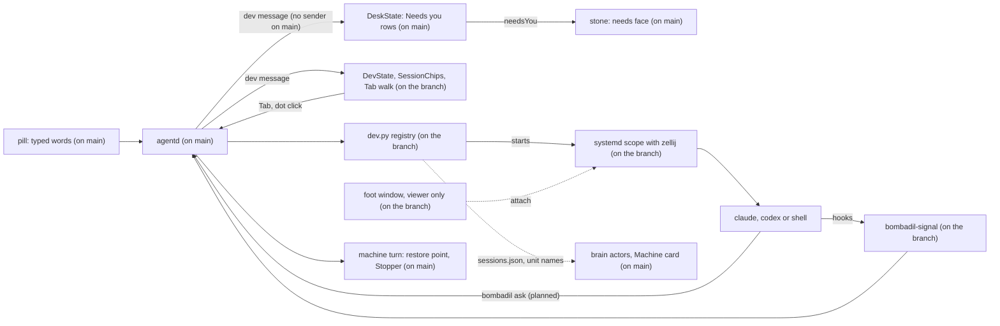

# Coding sessions

> **Status:** In progress. Pieces 1 and 2 are built on an unmerged branch, with the plain own copy of piece 3. The rest of piece 3 and pieces 4 to 6 are designed and have no code. Nothing on `main` creates a session or sends a `dev` message. `main` has only readers that wait for the piece: the desk's Needs you rows, the stone's needs-you mark, the brain's and the Machine card's reading of the session units, and two readers of the text mark a session's request is to carry.
> **Code:** On `main`, what the piece builds on or reads: `src/bombadil/agentd.py`, `src/bombadil/procs.py`, `src/bombadil/snapshots.py`, `src/bombadil/launcher.py`, `src/bombadil/narrate.py`, `src/bombadil/mail/tools.py`, `src/bombadil/mcp_server.py`, `src/bombadil/paths.py`, `src/bombadil/watch.py`, `src/bombadil/vitals.py`, `src/bombadil/brain/actors.py`, `shell/PillState.qml`, `shell/QueueChips.qml`, `shell/DeskState.qml`, `shell/Stone.qml`, `shell/shell.qml`, `bin/bombadil` and `iso/airootfs/etc/skel/.config/hypr/hyprland.lua`. Built on an unmerged branch, not on `main`: `src/bombadil/dev.py`, `bin/bombadil-signal`, `shell/DevState.qml`, `shell/SessionChips.qml`, `shell/SessionPeek.qml`, `share/zellij/config.kdl`, `iso/airootfs/etc/claude-code/managed-settings.d/50-bombadil.json`, `iso/airootfs/etc/codex/config.toml`, `iso/airootfs/etc/codex/requirements.toml` and `tests/test_dev.py`. Planned, with no code anywhere: `bombadil-worktree` and `bombadil-checkpoint`.
> **Design:** [Building on Bombadil, the brief](../design/dev-brief.md), [the page](../design/pages/building-on-bombadil.html)
> **Verified:** 2026-10-01 against `main` at `969b80b`: every statement about `main` below was re-read at that commit, and `src/bombadil/dev.py` is not on `main`. An unmerged branch, read at `7c09bcd`, holds pieces 1 and 2, the plain own copy of piece 3 and the `BOMBADIL_SESSION=1` mark that `dev.py` sets, which nothing reads yet. Its files were read one by one; its `tests/test_dev.py` (19 passed) and `tests/test_sessions_qml.py` (6 passed) were run from an extracted copy. Pieces 4 to 6 have no code anywhere. The vendor facts in the brief are dated 27 Sep 2026 and were not re-checked.

Coding sessions are how Bombadil is meant to host the coding tools people already use, Claude Code and Codex, unchanged. Each one is meant to keep running when its window closes, to come back when its name is typed, to show as one dot beside the pill, and to be fenced off from the machine's own agent. It exists because a coding session on `main` is a bare `foot` window, which ends with its window and with the compositor, and because nothing under the home folder can be undone. What `main` has is the receiving end: Needs you rows and a stone mark that wait for a `dev` message nothing sends, a brain and a Machine card that look for the unit names this piece is to write, and two readers of the text mark a session's request is to carry.

## What it will do

None of this can be used from `main`. Each part says whether it is built on an unmerged branch or designed only.

- **Named sessions that outlive their window** (piece 1, built on an unmerged branch). `claude acme`, `codex acme` or `shell acme`, with an optional role (`claude acme reviewer`), start the vendor's own tool, or the person's shell, with no model call. The project word must name a folder that exists under `~/Projects`; any other word matches nothing and goes to the model. Each session runs in an invisible `zellij` session, in its own systemd user scope where `procs.scope_supported()` holds (otherwise with no scope and no slice). The `foot` window is only a viewer: closing it leaves the session running, and typing the name attaches a viewer again, mid-sentence. A Claude or Codex session works in the checkout while no live Claude or Codex session holds it (one started by hand in exactly that folder counts), and gets a `git worktree` under `~/Projects/.work/<repo>/<role>` while one does. A session that already has a copy keeps it, and a folder that is not a git repository gets no copy, so the session shares the folder. `shell` sessions always open in the checkout and never take it from anyone. After a reboot sessions come back dim and nothing resumes by itself. Bringing one back resumes a Claude session by the tool's own session id, a Codex session by the id its SessionStart hook reported (a fresh one when none was), and starts a `shell` session as a fresh shell. `end <name>` ends a session and keeps its copy.
- **Dots for whose turn it is** (piece 2, built on an unmerged branch, apart from the designed-only parts named here). One chip per project, one dot per session: moving while it works, lit when it is your turn, red when it failed, dim when asleep, a ring for a session started by hand and seen through the same hooks ("yours"). The empty pill says who waits and Tab walks to the next one, ending with "Nothing needs you." The session in front never announces itself, and hovering a dot shows its last lines. The same `dev` message feeds the Needs you rows and the stone's mark on `main`, so on the branch the stone knocks while a session that asked, finished or failed has not been looked at. Designed only: the "Claude 5-hour limit at 84%" line, reconciling with `claude agents --json --all`, notifications from plain shells, and the "what's running?" card (the branch opens a plain list in the details drawer).
- **The fence** (piece 3, designed only; the branch has the own copy and the `BOMBADIL_SESSION=1` mark). A session runs as the person without sudo (`setpriv --no-new-privs`). A refused `sudo pacman -S` points it to `bombadil ask "install postgresql 17"`, which shows as "api on Acme asks: install postgresql 17 [Do it]"; Tab runs it as an ordinary machine turn with a restore point and Undo. Each session also gets ten ports, a database name and a memory limit, and a developer note that only sessions read.
- **Undo per session** (piece 4, designed only). `undo this`, `undo <name>` and `redo` put a session's last turn back from a git checkpoint taken by `bombadil-checkpoint` around each prompt, skipping files changed since and saying what was covered. A bare `undo` keeps its one meaning, the machine's last turn.
- **Handing words across** (piece 5, designed only). `tell api …` types into a session's terminal, marked "(from the pill)"; `give this to claude on bombadil` starts a session from the person's own words; `have codex review builder` starts a read-only session; "While you were away" is built from the registry with no model call. The Claude app on the phone lists Claude sessions under the same names. Codex has no phone host on Linux.
- **Try, read, ship** (piece 6, designed only). `run it`, `what did builder change?` with a Diff button, an opt-in check after each turn, then `ship builder` (the session commits, Bombadil pushes and opens the pull request), `land builder` for a local merge and `clean up`. Nothing is meant to be pushed or merged before the person says so.
- **Designed only, beyond the six pieces:** a project card, standing roles in `.bombadil/project.toml`, watchers that run once, a native review app, and the brief's list of [gaps not designed yet](../design/dev-brief.md#not-designed-yet).

## How it fits



What it builds on in `main`:

| Where on `main` | What is there | What the piece does with it |
|---|---|---|
| `src/bombadil/agentd.py`: the module docstring, `AgentD._client`, `AgentD.handle`, `AgentD._persons` | One Unix socket of newline-delimited JSON, every event broadcast to every client; a client that connects is greeted with `status`, `entries`, `setup` and the live notices, and the greeting wakes the vitals reading. `AgentD.handle` accepts `asked_by` on a `prompt` (checked by `_WHO`), `turn_start` echoes it and the desk's Now card reads it. `bombadil ask` sets none, but `handle` marks a prompt `asked_by: "agent"` when it comes from a process of an agent's turn or a client it cannot name (`_persons`, added for mail). A turn with the mark has no `turn_prompt`, so the `desk` tool is refused for it and the mail tools get no typed words; a launcher word sent with the mark is still answered locally; the mark of a turn taken back from the queue goes with it. `handle` neither sends nor handles a `dev` message. | The branch adds `dev` and `dev-signal` in and a `dev` broadcast out, and puts the current `dev` message into the greeting (`AgentD._greet`, a task that writes the greeting beside the reading of the client's first line). A session's `bombadil ask` comes from a process outside every turn (`outbox.from_agent` is false for it, checked with a fake `/proc` on 2026-10-01), so on `main` it would count as the person's own typed words. The brief names the `[asked by <who>, untrusted]` text mark for a session's request and does not say whether the request also sets the `asked_by` field; the field is what makes a turn untyped, so piece 3 has to set it. |
| `src/bombadil/agentd.py`: `AgentD.turn`, `AgentD._log` | Each turn takes a snapper restore point where snapper is configured (`Snapshots.available`), and runs in a scope named `bombadil-turn-<pid>-<turn>-<time>` where systemd supports one (`procs.scope_supported`), with `Turn.cwd` defaulting to the home folder (`Turn` in `src/bombadil/providers.py`) and `BOMBADIL_TURN` and `BOMBADIL_SOCKET` in its environment. Its `turns.jsonl` row has `n`, `unit`, `started` and `files` (what the turn wrote and read), which the brain reads. | Leaves the restore point and the turn scope alone. The branch adds one environment variable, `BOMBADIL_OS=1`, to every turn's environment, which is the only mark `bombadil-signal` reads to skip the machine's own agent. Sessions are not turns: no restore point and no turn scope. Their own git undo is designed only (piece 4). |
| `src/bombadil/paths.py`: `is_turn_row`; `src/bombadil/watch.py`: `history_lines` | A `turns.jsonl` row with a `kind` other than none or `turn` is no turn: `is_turn_row` keeps it out of turn numbers (`agentd._last_turn`) and out of the brain's `TurnsLog` witness, and `history_lines` shows only turn rows and `local` rows. | The branch writes `{"kind": "dev"}` rows when a session's tool exits by itself. Its own branch for them in `history_lines` sits after the same filter, on the branch as well as after a merge, so it never runs: with one `dev` row and one `local` row in `turns.jsonl`, the history shows the `local` row only (run on the branch's `watch.py` on 2026-10-01). |
| `src/bombadil/procs.py`: `SCOPE`, `scope_supported`, `cgroup_of`, `Stopper.stop`, `PROTECTED_ARGS` | `SCOPE` is the `systemd-run --user --scope` prefix. `Stopper.stop` ends a turn's descendants, its scope's cgroup and its process group, except windows that `_is_window` recognises (the `PROTECTED_ARGS` windows, `nautilus` and `bombadil-app run <name>`) and their children, and removes a stale pacman lock. `cgroup_of` and `scope_cgroup` accept only a cgroup named `bombadil-turn-*`. | The branch reuses `SCOPE` and `scope_supported` for session scopes. `Stopper` must never reach a session: a `bombadil-dev-*` scope is never taken for a turn's cgroup. |
| `src/bombadil/snapshots.py`: `Snapshots` | Snapper snapshots of the config `root` only (`config_name="root"` in `__init__`). | Leaves it. Per-session undo is separate and planned. |
| `src/bombadil/brain/actors.py`: `Sessions`, `from_event`, `DEV_SLICE`; `src/bombadil/brain/service.py` | A writer in a scope under `bombadil-dev-<project>.slice` is named `session:<project>/<name>`. The name comes from `~/.local/state/bombadil/dev/sessions.json`: a row whose `unit` (without `.scope`) is the cgroup's scope, with a `name` or `role`. `Sessions.lookup` accepts a list of rows or a dict of rows. [brain.md](brain.md) has the rest; `tests/test_brain_core.py` covers it. | The branch writes the registry as `{"sessions": [...]}`, which `Sessions.lookup` does not read, and writes a project's hyphens as underscores in the slice name. Checked on 2026-10-01 by saving a session with the branch's `Dev._save` for the project `my-app`: `Sessions.lookup` finds no row, and a writer in the session's scope is named `session:my_app`, with no role. One side changes when the two meet. |
| `src/bombadil/vitals.py`: `classify_unit`, `DEV_SLICE`, `RULES`, `ceiling_of` | The Machine card counts the memory of every unit whose name starts `bombadil-dev` (`bombadil-dev.slice`, `bombadil-dev-<project>.slice`, `bombadil-dev-<project>-<role>-<run>.scope`) as the sessions' share. It says "Coding sessions are near their memory limit" when `bombadil-dev.slice` crosses 90% of its `memory.high`, else of its `memory.max`; with neither set there is no ceiling and no line. `tests/test_vitals.py` covers it. | The branch's scopes and per-project slices are counted as they are. The branch sets no `MemoryHigh` or `MemoryMax` (a search of the branch's `src`, `iso`, `share` and `bin` finds none), so the ceiling line waits for the fence (piece 3, designed only). |
| `src/bombadil/launcher.py`: `match`, `entries`, `_undo` | Exact words skip the model. On `main`, `claude acme`, `end reviewer`, `undo this`, `what's running?` and `sessions` match nothing and go to the model (`launcher.match` run on 2026-10-01), which says what is running with the os-mcp `job` tool's `list` (`tests/test_agentd.py` scripts that turn for "what is running?"). In `match`, after the picture, sign-in, provider and rest words come the core commands, the brain's words (`BRAIN_COMMANDS`), Mail's words, then app names, panels and utility words. `_undo` answers "Your home folder and apps stay as they are." | The branch adds project, role and session words right after the core commands (`_dev_match`), ahead of the brain's words and of app names. It also makes `whats running`, `what is running`, `sessions`, `coding sessions` and `list sessions` open the plain list (`bombadil dev list`), so "what's running?" no longer reaches the `job` tool; the branch edited that test to "list my jobs". Read from both sides, not run on a merged tree: a folder `~/Projects/mail` would then stand in front of Mail's own word. `undo this` and `undo <name>` are designed only (piece 4); the branch does not match them. |
| `src/bombadil/narrate.py`: `_ASKED_RE`, `prompt_reads`; `src/bombadil/mail/tools.py`: `_OUTSIDE`, `typed_words` | A prompt block `[asked by <who>, untrusted]` is recorded as an outside read of kind `session`, or of kind `app` when `<who>` starts with `app `, and the mail tools leave the same block, and the `[Screen]` block, out of the person's typed words. Nothing on `main` or on the branch sends that line: the app kit's `Agent.ask` sends `[from app <name>]` (`src/bombadil/appkit/native/agent.py`), which neither reads. | The brief has a session's request arrive marked `[asked by coding session <name> on <project>, untrusted]` (designed, piece 3; no code sends it). |
| `src/bombadil/mcp_server.py`: `OsTools._register` and its `_tool` decorator | Each os-mcp tool is registered with `@t(name, description, properties, required)`; the mail tools and the app kit's tools register from `_register` too. There is no session tool. See [os-mcp.md](os-mcp.md). | Piece 5 adds `list_sessions`, `start_session`, `tell_session`, `session_screen`, `stop_session` and `end_session` here. Sessions are to get a separate `bombadil-dev` server instead, so that they cannot call `rollback` or `create_app`. |
| `shell/PillState.qml`: `handle`, `needsYou`, `face`; `shell/shell.qml` | `PillState.handle` follows one turn by id; a message whose `type` is not one it handles (`entries`, `setup`, `notice`, `notice_end`, `ai`, `found`, `summon`, `local`), `dev` included, reaches `if (ev.type !== "event") return`. `needsYou` has one writer, the desk, and `face` tests it before `working`. In `shell.qml`, `Keys.onTabPressed` only completes a name (`pillState.completion`), and the empty field's text is the resting hint or "Ask anything". | The `dev` message carries no turn id, so the turn logic is untouched. The branch makes Tab in an empty pill call `devState.next()` and the field's text the `dev` message's `line`, and draws its chips in a row above the pill's left end. |
| `shell/DeskState.qml`: `_applyDev`, `onRowAction`, `needsYou`; `shell/Stone.qml` | `DeskState.handle` sends a `dev` message to `_applyDev`, which builds the Needs you rows from `sessions` and `attention`; its Open button sends `{"type": "dev", "action": "open", "key": key}`, which nothing answers on `main`. `needsYou` is true while there is one row or more, a `Binding` writes it to `PillState.needsYou`, and the stone then has its `needs` face: amber, two knocks and a glow. `needsPresent` wants two rows, so one waiting row is no card, and nothing on `main` reads a `dev` message's `line`: for one row the stone knocks and no line is drawn. `lost()` empties the sessions and the rows go with them. See [desk.md](desk.md#the-needs-you-mark). | The branch's `dev` message is the feed for all of it: it supplies the message and the `open` action, and the mark needs no change. The line for one waiting session is the branch's (`line`, drawn by `shell/shell.qml`). |
| `shell/QueueChips.qml` | Grey chips from `pill.queue`: "next", or the time an ask runs while the AI rests. | The branch adds `SessionChips.qml` beside it: a chip per project, a dot per session. |
| `src/bombadil/notices.py`, `shell/NoticeChips.qml`: `Notices` | The lines another service says above the pill, with up to three chips and a time to live (mail uses them). | The branch does not use them: its line is the empty field's text. Which of the two carries a session's line after a merge is open. |
| `bin/bombadil` | `ask` sends `{"type": "prompt"}` and streams the reply; when the AI rests it says so and exits 75, the ask staying queued. `stop` sends `{"type": "stop"}`; `brain` reads the brain; `mail` reads Mail. No `dev` subcommand. | The branch adds `bombadil dev …`, and the brief gives `ask` a second meaning inside a session. |
| `iso/airootfs/etc/skel/.config/hypr/hyprland.lua` | `SUPER + Return` runs `foot`; `hyprland.start` runs `agentd`, `bombadil-shell` and `mako` and hands Mail's unit the session's environment; `SUPER + Escape` runs `bombadil stop`; the terminal panel is `foot --app-id=bombadil-terminal` (`PANELS` in `src/bombadil/hypr.py`). No rule for session windows. | The branch adds a window rule for the viewer (`bombadil-sessions`) and starts `foot --server`. The plain terminal stays plain. |

## Interfaces it adds, built or planned

The State column says which: built on the unmerged branch (not on `main`), or planned (no code anywhere).

| Name | Kind | State |
|---|---|---|
| `{"type": "dev", "sessions", "front", "attention", "line"}`, sent to a client when it connects and on every change; a session has `key`, `project`, `projectTitle`, `role`, `tool`, `toolTitle`, `title`, `state` (`working`, `idle`, `asked`, `done`, `failed`, `asleep`), `alive`, `unseen`, `yours`, `copy`, `since`, `last`, `lines`. `DeskState.qml` on `main` reads `key`, `projectTitle` or `project`, `role`, `last` and `state` | agentd to clients | on the branch |
| `{"type": "dev", "action": "next"\|"open"\|"end"\|"why", "key"}`, answered by an event `{"kind": "local", "action": "session", "target", "ok", "text"}` | clients to agentd, and back | on the branch |
| `{"type": "dev-signal", "tool", "event", "session_id", "cwd", "tool_name", "tool_input", "notification_type", "text", "dev_id", "run", "pid", "pid_start", "t"}`; the wrapper's own `"event": "exit"` carries `code` and, in `text`, the path of the last screen | hooks and the wrapper to agentd | on the branch |
| `bombadil dev list`, `next`, `why <key>`, `run <key> [--resume]` | commands | on the branch |
| `bombadil-signal claude`, `codex`, `codex-notify` | hook program | on the branch |
| Claude Code hooks `SessionStart`, `UserPromptSubmit`, `PreToolUse` (matcher `AskUserQuestion`), `PermissionRequest`, `PostToolUse`, `Notification`, `Stop`, `StopFailure`, `SessionEnd` in `/etc/claude-code/managed-settings.d/50-bombadil.json`; Codex hooks `SessionStart`, `UserPromptSubmit`, `PermissionRequest`, `PostToolUse`, `Stop`, `Interrupt`, `SessionEnd` in `/etc/codex/requirements.toml` and `notify` in `/etc/codex/config.toml` (both Codex files set `check_for_update_on_startup = false`) | managed hooks | on the branch |
| `~/.local/state/bombadil/dev/sessions.json` (`{"sessions": [...]}`; an ended row is kept 30 days, a hand-started one goes with its process), `signals.jsonl` (what hooks wrote while agentd was away), `<slug of key>.last`, for example `acme-reviewer.last`; `{"kind": "dev"}` rows in `turns.jsonl` | registry, spool, last screen, log | on the branch |
| `bombadil-dev-<project>-<role>-<run>.scope` in `bombadil-dev-<project>.slice` (the branch cuts the project at 24 characters, and writes its hyphens as underscores in the slice name only); the `zellij` session `bombadil-<project cut at 24>-<role>`; a copy's git branch `bombadil/<role>` in the person's repository; `share/zellij/config.kdl`; lingering for the user; `zellij` in `iso/packages.x86_64` | units, host config | on the branch |
| `BOMBADIL_SESSION=1`, `BOMBADIL_DEV_ID`, `BOMBADIL_DEV_RUN`, `BOMBADIL_PROJECT`; `BOMBADIL_PROJECTS` (the projects folder, default `~/Projects`); `BOMBADIL_OS=1`, set by agentd in every turn's environment and read by `bombadil-signal` | environment | on the branch |
| `claude\|codex\|shell <project> [role]`, `<project>`, `<role>`, `end <name>`, `what's running?` and its siblings; window app id `bombadil-session-<slug>`; `quickshell ipc call dev chips` (the desktop test) | launcher words, window | on the branch |
| `bombadil ask` from a session, `bombadil-worktree`, `.worktreeinclude`, `setpriv --no-new-privs`, `PORT`, `BOMBADIL_PORTS`, `COMPOSE_PROJECT_NAME`, `BOMBADIL_DB`, `bombadil-dev.slice` limits | fence | planned |
| `bombadil-checkpoint pre\|post`, `refs/bombadil/<role>/<n>/pre` and `post`, `.git/bombadil/<role>.index`; `undo this`, `undo <name>`, `redo` | undo | planned |
| `stop <name>`, `stop everything`, `run it` | launcher words | planned |
| `remoteControlAtStartup` (Claude Code user settings), `CLAUDE_CLIENT_PRESENCE_FILE`, `crossSessionInbound` (set to refuse in the machine agent's own session) | Claude Code settings and environment | planned |
| os-mcp `list_sessions`, `start_session`, `tell_session`, `session_screen`, `stop_session`, `end_session`; MCP server `bombadil-dev` with `ask_machine`, `progress`, `show_preview` | tools | planned |
| `BOMBADIL_SHIP=1`, `core.hooksPath` pre-push hook, `~/.local/state/bombadil/projects/<p>.toml`, `.bombadil/project.toml` | ship and projects | planned |

## Principles it keeps

- [Full access with undo](../principles.md#full-access-with-undo): the machine's agent keeps sudo and one restore point per turn; a session is to get neither (designed, piece 3). The trap is giving a session passwordless sudo for convenience: its root change then lands inside whichever machine turn is open, and undo reverts it or misses it.
- [One machine one conversation](../principles.md#one-machine-one-conversation): a session is meant to be a program the person runs, never queued behind the pill and never given the pill's "this" context. The trap is letting the pill forward typed text to the session in front.
- [The person's press reaches people](../principles.md#the-persons-press-reaches-people): nothing is meant to be pushed, opened as a pull request or merged before `ship` or `land` (designed, piece 6; the pre-push hook that enforces it exists neither on `main` nor on the branch, and a branch session runs the vendor's tool as the person with nothing to stop a push). The trap is relying on a vendor's background sessions, which commit and push on their own.
- [Nothing runs unseen](../principles.md#nothing-runs-unseen): every session has a dot, and nothing resumes after a restart until the person asks (both built on the branch). The trap is a `zellij` session with no dot, or an automatic resume.
- [Quiet at rest](../principles.md#quiet-at-rest): the pill is meant to speak only when it is the person's turn, something failed or (designed only) a limit is near, never about the session in front. On the branch `Dev.line` speaks for a question, a finished turn or a stop, and `Dev.attention` leaves out the session in front. The trap is a line at the end of every turn, or bells from background panes.
- [Recovery without the broken part](../principles.md#recovery-without-the-broken-part): sessions are to live in their own units (the branch builds the units), so that restarting `agentd`, the shell or the compositor does not touch them. The trap is starting a session inside a turn's process tree, where `Stopper` would end it.

## Before you build on it

The brief's order: first merge the status-line and app-kit changes (both on `main` as of 2026-10-01) and move `agentd` and Quickshell to systemd user services (not done on `main`: `hyprland.lua` starts both with `hl.exec_cmd`, and `iso/airootfs/etc/systemd/user/` holds only `bombadil-brain.service` and `bombadil-mail.service`). Then build pieces 1 to 6 in that order. Pieces 1 and 2 are useful alone; piece 3 is what lets parallel sessions exist without breaking the confirmed undo model; pieces 4 to 6 read from the first three. Before piece 1, spike in a VM that `zellij` passes Shift+Enter, the mouse and OSC 9, 99 and 777 to `foot`, with `tmux` as the fallback host. Before piece 1 or 3, test `setpriv --no-new-privs` beyond sudo and `newuidmap`, and that a `git worktree` under `~/Projects/.work` passes Claude's worktree check. The vendor facts in the brief are dated 27 Sep 2026 and were not re-checked. What waits on the owner: the brief records its 19 defaults as confirmed on 2026-09-27 and names no open question for them. Still undecided are the items under [not designed yet](../design/dev-brief.md#not-designed-yet): several monitors, the pill's words from the phone, quota headroom for the pill, per-session databases, conflicts git cannot see, adopting existing sessions, secrets in copies, and IDEs as ordinary apps.

About the unmerged branch: it holds 24 commits that are not on `main`, and `main` has 18 that it lacks (`main` at `969b80b` against the branch at `7c09bcd`). A trial merge of `main` into it, made in a throwaway clone on 2026-10-01, conflicts in six files: `src/bombadil/agentd.py` (both sides rewrite the greeting in `AgentD._client`, the tasks `AgentD.serve` starts and the import line), `src/bombadil/launcher.py` (`entries`, `Launcher.doing`, `Launcher.failed`), `bin/bombadil` (the import line), `iso/airootfs/etc/skel/.config/hypr/hyprland.lua` (both add start lines), `iso/airootfs/usr/local/bin/bombadil-smoke` and `scripts/build-iso.sh` (both add checks or programs). `shell/shell.qml`, `src/bombadil/paths.py`, `src/bombadil/watch.py` and the docs merge without a conflict. Nothing was run on the merged result. The branch's tests are `tests/test_dev.py` and `tests/test_sessions_qml.py` (run, see above), a section of `tests/desktop/driver.py` and `dev-*` checks in `bombadil-smoke`; the last two were read and not run. The branch also differs from the brief in places:

- `zellij` serialization is off (`share/zellij/config.kdl`), and `foot --server` starts from `hyprland.start`, not as a socket-activated unit.
- Windows are matched by an app id per session, not `--toplevel-tag`, and focus follows `activewindow`, not `activewindowv2` (`AgentD._follow_focus`).
- Codex `notify` sits in `/etc/codex/config.toml`, not the skel, and `Dev.signal` handles `CwdChanged` although the Claude hook file does not register it.
- The chips sit in a row above the pill's left end (`shell/shell.qml`), not left of it, and a `dev` row reaches `turns.jsonl` only when a tool exits by itself; starts and ends typed as words are logged as `local` rows.

Gaps on `main` today, each read in the code:

- The Needs you card's caption says "Tab walks these · one alone is just the line" (`DeskState._refreshNeeds`), but Tab walks nothing on `main`: `Keys.onTabPressed` in `shell/shell.qml` only completes a name. The walk is the branch's (`DevState.next`).
- One waiting row gives the stone's knock and no line, as the table says.
- A session's `bombadil ask` would count as the person's own words (see the first table row), so the gates that trust typed words, the `desk` tool and the mail tools, would trust it.

Do not break on `main`, and the tests that pin each item:

- `bombadil ask "…"` as it is: it sends an ordinary prompt and streams that turn's output. `agentd` queues it behind a running turn, holds it while signed out, and while the AI rests the command says so and exits 75 with the ask still queued; `iso/airootfs/usr/local/bin/bombadil-smoke` relies on the held case. It does not wait for Tab. The brief gives a session's `bombadil ask` a request message that does wait for Tab, and does not say how the command knows it runs in a session (`BOMBADIL_SESSION=1` is named only as the gate for the developer note). Settle that before piece 3.
- The `asked_by` contract in the first table row. Pinned by `tests/test_agentd.py` (`test_a_turn_a_coding_session_asked_for_cannot_use_the_desk_tool`, `test_the_turn_says_who_asked_for_it`, `test_a_launcher_word_from_a_coding_session_is_still_a_launcher_word`), `tests/test_mail_agentd.py` (`test_a_turn_a_coding_session_asked_for_has_no_typed_words`) and `tests/test_mail_tools.py` (`typed_words`). The mark is also what [the decision log](../decisions.md#d-371) names for a session-asked turn.
- Stop (Esc, `SUPER + Escape`, `bombadil stop`) ends the machine's turn only. Sessions stay outside every turn's scope, process group and tree. The brief's `stop <name>` and `stop everything` interrupt sessions and are separate words, designed only. `tests/test_procs.py`.
- Bare `undo` keeps its one meaning and never touches the home folder. `tests/test_launcher.py`.
- The `dev` message keeps `sessions[]` and `attention[]` and the session fields `DeskState.qml` reads, and carries no turn id. It reaches the desk because `shell/shell.qml` hands every line to `PillState` and `DeskState`; `PillState.needsYou` keeps one writer, the desk. `tests/test_desk_qml.py` (the Needs you tests, among them `test_two_sessions_waiting_show_the_card_and_one_does_not`), `tests/test_pill_qml.py::test_needs_you_outranks_a_running_turn`, `tests/test_stone_qml.py::test_needs_you_is_amber_with_a_glow_and_two_knocks`.
- The registry rows and unit names that `brain/actors.py` and `vitals.py` read: rows with `unit` and `name` or `role`, in a list or a dict, `bombadil-dev-<project>.slice`, and names that start `bombadil-dev`. `tests/test_brain_core.py`, `tests/test_vitals.py`.
- A `turns.jsonl` row with another `kind` is no turn (`paths.is_turn_row`); the branch's `dev` rows rely on that, and `history_lines` has to let them through.
- `SUPER + Return` stays a plain `foot`. A session started by hand is seen, never wrapped.

To run them (the QML files skip without PySide6, and `tests/test_agentd.py` and `tests/test_mail_agentd.py` need `pytest-asyncio`; [development.md](../contributing/development.md) says how to install both):

```sh
pytest tests/test_brain_core.py tests/test_launcher.py tests/test_procs.py tests/test_narrate.py tests/test_mail_tools.py tests/test_vitals.py
pytest tests/test_agentd.py -k "coding_session or says_who_asked"
pytest tests/test_mail_agentd.py -k "coding_session or process_of_the_turn or put_in_front"
pytest tests/test_desk_qml.py tests/test_pill_qml.py tests/test_stone_qml.py
```

## When it ships

This page is then replaced by the full piece page, in the skeleton of [documenting.md](../contributing/documenting.md). The row for this piece in [the roadmap](../roadmap.md) is updated, and the brief's status block is updated to match.
