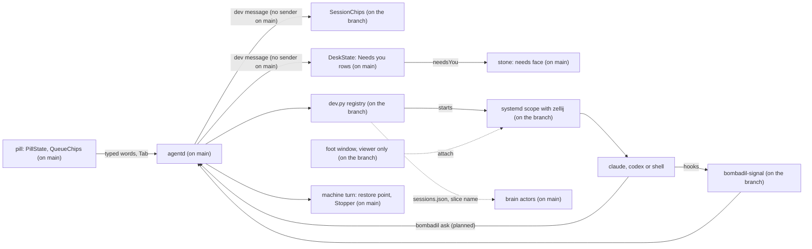

# Coding sessions

> **Status:** In progress. Pieces 1 and 2 are built on an unmerged branch, with the plain own copy of piece 3. The rest of piece 3 and pieces 4 to 6 are designed and have no code. On `main` there are only readers that wait for this piece: the desk's Needs you rows, the stone's needs-you mark and the brain's naming of a session's writes.
> **Code:** none of this piece is on `main`. It builds on `src/bombadil/agentd.py`, `src/bombadil/procs.py`, `src/bombadil/snapshots.py`, `src/bombadil/launcher.py`, `src/bombadil/narrate.py`, `src/bombadil/mcp_server.py`, `src/bombadil/providers.py`, `src/bombadil/hypr.py`, `src/bombadil/brain/actors.py`, `src/bombadil/brain/service.py`, `shell/PillState.qml`, `shell/QueueChips.qml`, `shell/DeskState.qml`, `shell/Stone.qml`, `bin/bombadil` and `iso/airootfs/etc/skel/.config/hypr/hyprland.lua`. Built on an unmerged branch, none of it on `main`: `src/bombadil/dev.py`, `bin/bombadil-signal`, `shell/DevState.qml`, `shell/SessionChips.qml`, `shell/SessionPeek.qml`, `share/zellij/config.kdl`, `iso/airootfs/etc/claude-code/managed-settings.d/50-bombadil.json` and `iso/airootfs/etc/codex/config.toml` with `requirements.toml`. Planned, with no code anywhere: `bombadil-worktree` and `bombadil-checkpoint`.
> **Design:** [Building on Bombadil, the brief](../design/dev-brief.md), [the page](../design/pages/building-on-bombadil.html)
> **Verified:** 2026-10-01 against `main` at `a30ebc8`: no code of this piece is on `main`, and every statement about `main` below was re-read at that commit. An unmerged branch, read at `9e39370`, holds pieces 1 and 2, the plain own copy of piece 3 and the `BOMBADIL_SESSION=1` mark that `dev.py` sets, which nothing reads yet. Its files were read one by one and are described here from that reading; its `tests/test_dev.py` was run from an extracted copy (19 passed). Pieces 4 to 6 have no code anywhere.

Coding sessions are how Bombadil is meant to host the coding tools people already use, Claude Code and Codex, unchanged. Each one is meant to keep running when its window closes, to come back when its name is typed, to show as one dot beside the pill, and to be fenced off from the machine's own agent. It exists because a coding session on `main` is a bare `foot` window, which ends with its window and with the compositor, and because nothing under the home folder can be undone. What `main` has is the receiving end: Needs you rows and a stone mark that wait for a `dev` message nothing sends, and a brain that looks for the registry file and slice names this piece is to write.

## What it will do

None of this can be used from `main`. Each part says whether it is built on an unmerged branch or designed only.

- **Named sessions that outlive their window** (piece 1, built on an unmerged branch). `claude acme`, `codex acme` or `shell acme`, with an optional role (`claude acme reviewer`), start the vendor's own tool, or the person's shell, in `~/Projects/acme` with no model call. Each session runs in an invisible `zellij` session inside its own systemd user scope. The `foot` window is only a viewer: closing it leaves the session running, and typing the name attaches a viewer again, mid-sentence. The first Claude or Codex session on a repository works in the checkout, and each further Claude or Codex session gets a `git worktree` under `~/Projects/.work/<repo>/<role>`. A folder that is not a git repository gets no copy, and the session runs in the same folder. `shell` sessions always open in the checkout and never take it from anyone or get a copy. After a reboot sessions come back dim and resume by the tool's own session id, and nothing resumes by itself. `end <name>` ends a session and keeps its copy.
- **Dots for whose turn it is** (piece 2, built on an unmerged branch, apart from the designed-only parts named here). One chip per project, one dot per session: moving while it works, lit when it is your turn, red when it failed, dim when asleep, a ring for a session started by hand and seen through the same hooks ("yours"). The empty pill says who waits and Tab walks to the next one, ending with "Nothing needs you." The session in front never announces itself, and hovering a dot shows its last lines. The same `dev` message feeds the Needs you rows and the stone's mark on `main`, so on the branch the stone knocks while a session that asked, finished or failed has not been looked at. Designed only: the "Claude 5-hour limit at 84%" line, reconciling with `claude agents --json --all`, notifications from plain shells, and the "what's running?" card (the branch opens a plain list in the details drawer).
- **The fence** (piece 3, designed only; the branch has the own copy and the `BOMBADIL_SESSION=1` mark). A session runs as the person without sudo (`setpriv --no-new-privs`). A refused `sudo pacman -S` points it to `bombadil ask "install postgresql 17"`, which shows as "api on Acme asks: install postgresql 17 [Do it]"; Tab runs it as an ordinary machine turn with a restore point and Undo. Each session also gets ten ports, a database name and a memory limit, and a developer note that only sessions read.
- **Undo per session** (piece 4, designed only). `undo this`, `undo <name>` and `redo` put a session's last turn back from a git checkpoint taken by `bombadil-checkpoint` around each prompt, skipping files changed since and saying what was covered. A bare `undo` keeps its one meaning, the machine's last turn.
- **Handing words across** (piece 5, designed only). `tell api …` types into a session's terminal, marked "(from the pill)"; `give this to claude on bombadil` starts a session from the person's own words; `have codex review builder` starts a read-only session; "While you were away" is built from the registry with no model call. The Claude app on the phone lists Claude sessions under the same names. Codex has no phone host on Linux.
- **Try, read, ship** (piece 6, designed only). `run it`, `what did builder change?` with a Diff button, an opt-in check after each turn, then `ship builder` (the session commits, Bombadil pushes and opens the pull request), `land builder` for a local merge and `clean up`. Nothing is meant to be pushed or merged before the person says so.
- **Designed only, beyond the six pieces:** a project card, standing roles in `.bombadil/project.toml`, watchers that run once, a native review app, and the brief's list of [gaps not designed yet](../design/dev-brief.md#not-designed-yet).

## How it fits

What it builds on in `main`:

| Where on `main` | What is there | What the piece does with it |
|---|---|---|
| `src/bombadil/agentd.py`: the module docstring and `AgentD.handle` | One Unix socket of newline-delimited JSON, every event broadcast to every client. `AgentD.handle` accepts `asked_by` on a `prompt` (checked by `_WHO`) and `turn_start` echoes it, and the desk reads it, but nothing on `main` sends it: `bombadil ask` sets none. `AgentD.handle` neither sends nor handles a `dev` message. | The branch adds `dev` and `dev-signal` in and a `dev` broadcast out, and sends the current `dev` message to each client that connects. The brief does not say whether a session's request becomes a `prompt` with `asked_by`. |
| `src/bombadil/agentd.py`: `AgentD.turn`, `AgentD._log` | Each turn takes a snapper restore point where snapper is configured (`Snapshots.available`), and runs in a scope named `bombadil-turn-<pid>-<turn>-<time>` where systemd supports one (`procs.scope_supported`), with `Turn.cwd` defaulting to the home folder (`Turn` in `src/bombadil/providers.py`). Its `turns.jsonl` row has `n`, `unit`, `started` and the files the turn wrote and read, which the brain reads. | Leaves the restore point and the turn scope alone. The branch adds one environment variable, `BOMBADIL_OS=1`, to every turn's environment so that `bombadil-signal` can skip the machine's own agent. Sessions are not turns: no restore point and no turn scope. Their own git undo is designed only (piece 4). |
| `src/bombadil/paths.py`: `is_turn_row`; `src/bombadil/watch.py`: `history_lines` | A `turns.jsonl` row with a `kind` other than none or `turn` is no turn: `is_turn_row` keeps it out of turn numbers (`agentd._last_turn`) and out of the brain's `TurnsLog` witness, and `history_lines` shows only turn rows and `local` rows. | The branch writes `{"kind": "dev"}` rows when a session's tool exits by itself, and its own branch for them in `history_lines` sits after the filter `main` added, so after a merge it could not run. |
| `src/bombadil/procs.py`: `SCOPE`, `scope_supported`, `Stopper.stop`, `PROTECTED_ARGS` | `SCOPE` is the `systemd-run --user --scope` prefix. `Stopper.stop` ends a turn's descendants, its scope's cgroup and its process group, except windows that `_is_window` recognises (the `PROTECTED_ARGS` windows, `nautilus` and `bombadil-app run <name>`) and their children, and removes a stale pacman lock. | The branch reuses `SCOPE` and `scope_supported` for session scopes. `Stopper` must never reach a session. |
| `src/bombadil/snapshots.py`: `Snapshots` | Snapper snapshots of the config `root` only (`config_name="root"` in `__init__`). | Leaves it. Per-session undo is separate and planned. |
| `src/bombadil/brain/actors.py`: `Sessions`, `from_event`, `DEV_SLICE`; `src/bombadil/brain/service.py` | A writer in a scope under `bombadil-dev-<project>.slice` is named `session:<project>/<name>`. The name comes from `~/.local/state/bombadil/dev/sessions.json`: a row whose `unit` (without `.scope`) is the cgroup's scope, with a `name` or `role`. `Sessions.lookup` accepts a list of rows or a dict of rows. [brain.md](brain.md) has the rest; `tests/test_brain_core.py` covers it. | The branch writes the registry as `{"sessions": [...]}`, which `Sessions.lookup` does not read (checked on 2026-10-01: the writer is named `session:acme`, with no role), and writes a project's hyphens as underscores in the slice name, which the brain reports as `my_app`. One side changes when the two meet. |
| `src/bombadil/launcher.py`: `match`, `entries`, `_undo` | Exact words skip the model. On `main`, `claude acme`, `end reviewer` and `undo this` match nothing and go to the model. The brain's words (`BRAIN_COMMANDS`) are checked after the core commands and before app names. `_undo` answers "Your home folder and apps stay as they are." | The branch adds project, role and session words at that same place, before app names, so the order against the brain's words is open. `undo this` and `undo <name>` are designed only (piece 4); the branch does not match them. |
| `src/bombadil/narrate.py`: `_ASKED_RE`, `prompt_reads` | A prompt line `[asked by <who>, untrusted]` is recorded as an outside read of kind `session`, or of kind `app` when `<who>` starts with `app `. Nothing on `main` or on the branch sends that line: the app kit's `Agent.ask` sends `[from app <name>]` (`src/bombadil/appkit/native/agent.py`), which `prompt_reads` does not match. | The brief has a session's request arrive marked `[asked by coding session <name> on <project>, untrusted]` (designed, piece 3; no code sends it). |
| `src/bombadil/mcp_server.py`: `OsTools._register` and its `_tool` decorator | Each os-mcp tool is registered with `@t(name, description, properties, required)`. There is no session tool. See [os-mcp.md](os-mcp.md). | Piece 5 adds `list_sessions`, `start_session`, `tell_session`, `session_screen`, `stop_session` and `end_session` here. Sessions are to get a separate `bombadil-dev` server instead, so that they cannot call `rollback` or `create_app`. |
| `shell/PillState.qml`: `handle`, `needsYou`, `face` | Follows one turn by id; a message whose `type` is not one it handles, `dev` included, reaches `if (ev.type !== "event") return`. `needsYou` has one writer, the desk, and `face` tests it before `working`. | The `dev` message carries no turn id, so the turn logic is untouched. |
| `shell/DeskState.qml`: `_applyDev`, `onRowAction`, `needsYou`; `shell/Stone.qml` | Builds the Needs you rows from `sessions` and `attention`; its Open button sends `{"type": "dev", "action": "open", "key": key}`, which nothing answers on `main`. `needsYou` is true while there is one row or more, a `Binding` writes it to `PillState.needsYou`, and the stone then has its `needs` face: amber, two knocks and a glow. One waiting row is the line in the pill and no card. `lost()` empties the sessions and the rows go with them. See [desk.md](desk.md#the-needs-you-mark). | The branch's `dev` message is the feed for all of it: it supplies the message and the `open` action, and the mark needs no change. |
| `shell/QueueChips.qml` | Grey "next" chips from `pill.queue`. | The branch adds `SessionChips.qml` beside it: a chip per project, a dot per session. |
| `bin/bombadil` | `ask` sends `{"type": "prompt"}` and streams the reply; `stop` sends `{"type": "stop"}`; `brain` reads the brain. No `dev` subcommand. | The branch adds `bombadil dev …`, and the brief gives `ask` a second meaning inside a session. |
| `iso/airootfs/etc/skel/.config/hypr/hyprland.lua` | `SUPER + Return` runs `foot`; `hyprland.start` runs `agentd`, `bombadil-shell` and `mako`; `SUPER + Escape` runs `bombadil stop`; the terminal panel is `foot --app-id=bombadil-terminal` (`PANELS` in `src/bombadil/hypr.py`). No rule for session windows. | The branch adds a window rule for the viewer and starts `foot --server`. The plain terminal stays plain. |

## Interfaces it adds (planned)

Every row is on the branch (not on `main`) or planned (no code anywhere).

| Name | Kind | State |
|---|---|---|
| `{"type": "dev", "sessions", "front", "attention", "line"}`; a session has `key`, `project`, `projectTitle`, `role`, `tool`, `toolTitle`, `title`, `state` (`working`, `idle`, `asked`, `done`, `failed`, `asleep`), `alive`, `unseen`, `yours`, `copy`, `since`, `last`, `lines`. `DeskState.qml` on `main` reads `key`, `projectTitle` or `project`, `role`, `last` and `state` | agentd to clients | on the branch |
| `{"type": "dev", "action": "next"\|"open"\|"end"\|"why", "key"}`, `{"type": "dev-signal", …}` | clients and hooks to agentd | on the branch |
| `bombadil dev list`, `next`, `why <key>`, `run <key> [--resume]` | commands | on the branch |
| `bombadil-signal claude`, `codex`, `codex-notify` | hook program | on the branch |
| Claude Code hooks `SessionStart`, `UserPromptSubmit`, `PreToolUse` (matcher `AskUserQuestion`), `PermissionRequest`, `PostToolUse`, `Notification`, `Stop`, `StopFailure`, `SessionEnd` in `/etc/claude-code/managed-settings.d/50-bombadil.json`; Codex hooks `SessionStart`, `UserPromptSubmit`, `PermissionRequest`, `PostToolUse`, `Stop`, `Interrupt`, `SessionEnd` in `/etc/codex/requirements.toml` and `notify` in `/etc/codex/config.toml` | managed hooks | on the branch |
| `~/.local/state/bombadil/dev/sessions.json` (`{"sessions": [...]}`), `signals.jsonl`, `<slug of key>.last`, for example `acme-reviewer.last`; `{"kind": "dev"}` rows in `turns.jsonl` | registry, spool, last screen, log | on the branch |
| `bombadil-dev-<project>-<role>-<run>.scope` in `bombadil-dev-<project>.slice` (the branch cuts the project at 24 characters, and writes its hyphens as underscores in the slice name only); `share/zellij/config.kdl`; lingering for the user; `zellij` in `iso/packages.x86_64` | units, host config | on the branch |
| `BOMBADIL_SESSION=1`, `BOMBADIL_DEV_ID`, `BOMBADIL_DEV_RUN`, `BOMBADIL_PROJECT`; `BOMBADIL_OS=1`, set by agentd in every turn's environment and read by `bombadil-signal` | environment | on the branch |
| `claude\|codex\|shell <project> [role]`, `<project>`, `<role>`, `end <name>`, `what's running?`; window app id `bombadil-session-<slug>` | launcher words, window | on the branch |
| `bombadil ask` from a session, `bombadil-worktree`, `.worktreeinclude`, `setpriv --no-new-privs`, `PORT`, `BOMBADIL_PORTS`, `COMPOSE_PROJECT_NAME`, `BOMBADIL_DB`, `bombadil-dev.slice` limits | fence | planned |
| `bombadil-checkpoint pre\|post`, `refs/bombadil/<role>/<n>/pre` and `post`, `.git/bombadil/<role>.index`; `undo this`, `undo <name>`, `redo` | undo | planned |
| `stop <name>`, `stop everything`, `run it` | launcher words | planned |
| `remoteControlAtStartup` (Claude Code user settings), `CLAUDE_CLIENT_PRESENCE_FILE`, `crossSessionInbound` (set to refuse in the machine agent's own session) | Claude Code settings and environment | planned |
| os-mcp `list_sessions`, `start_session`, `tell_session`, `session_screen`, `stop_session`, `end_session`; MCP server `bombadil-dev` with `ask_machine`, `progress`, `show_preview` | tools | planned |
| `BOMBADIL_SHIP=1`, `core.hooksPath` pre-push hook, `~/.local/state/bombadil/projects/
.toml`, `.bombadil/project.toml` | ship and projects | planned |

## Principles it keeps

- [Full access with undo](../principles.md#full-access-with-undo): the machine's agent keeps sudo and one restore point per turn; a session is to get neither (designed, piece 3). The trap is giving a session passwordless sudo for convenience: its root change then lands inside whichever machine turn is open, and undo reverts it or misses it.
- [One machine one conversation](../principles.md#one-machine-one-conversation): a session is meant to be a program the person runs, never queued behind the pill and never given the pill's "this" context. The trap is letting the pill forward typed text to the session in front.
- [The person's press reaches people](../principles.md#the-persons-press-reaches-people): nothing is meant to be pushed, opened as a pull request or merged before `ship` or `land` (designed, piece 6; the pre-push hook that enforces it exists neither on `main` nor on the branch, and a branch session runs the vendor's tool as the person with nothing to stop a push). The trap is relying on a vendor's background sessions, which commit and push on their own.
- [Nothing runs unseen](../principles.md#nothing-runs-unseen): every session has a dot, and nothing resumes after a restart until the person asks (both built on the branch). The trap is a `zellij` session with no dot, or an automatic resume.
- [Quiet at rest](../principles.md#quiet-at-rest): the pill is meant to speak only when it is the person's turn, something failed or (designed only) a limit is near, never about the session in front. On the branch `Dev.line` speaks for a question, a finished turn or a stop, and `Dev.attention` leaves out the session in front. The trap is a line at the end of every turn, or bells from background panes.
- [Recovery without the broken part](../principles.md#recovery-without-the-broken-part): sessions are to live in their own units (the branch builds the units), so that restarting `agentd`, the shell or the compositor does not touch them. The trap is starting a session inside a turn's process tree, where `Stopper` would end it.

## Before you build on it

The brief's order: first merge the status-line and app-kit changes (both on `main` as of 2026-10-01) and move `agentd` and Quickshell to systemd user services (not done on `main`: `hyprland.lua` starts both with `hl.exec_cmd`, and `iso/airootfs/etc/systemd/user/` holds only `bombadil-brain.service`). Then build pieces 1 to 6 in that order. Pieces 1 and 2 are useful alone; piece 3 is what lets parallel sessions exist without breaking the confirmed undo model; pieces 4 to 6 read from the first three. Before piece 1, spike in a VM that `zellij` passes Shift+Enter, the mouse and OSC 9, 99 and 777 to `foot`, with `tmux` as the fallback host. Before piece 1 or 3, test `setpriv --no-new-privs` beyond sudo and `newuidmap`, and that a `git worktree` under `~/Projects/.work` passes Claude's worktree check. The vendor facts in the brief are dated 27 Sep 2026 and were not re-checked.

What waits on the owner: the brief records its 19 defaults as confirmed on 2026-09-27 and names no open question for them. Still undecided are the items under [not designed yet](../design/dev-brief.md#not-designed-yet): several monitors, the pill's words from the phone, quota headroom for the pill, per-session databases, conflicts git cannot see, adopting existing sessions, secrets in copies, and IDEs as ordinary apps.

About the unmerged branch: it contains `main` at `6150431` (merge commit `c06e44c`). 21 commits on it are not on `main`, and `main` is 38 commits ahead of it. A trial merge of `main` at `a30ebc8` into it, made in a throwaway clone on 2026-10-01, conflicts in `src/bombadil/agentd.py` (both add branches to `AgentD.handle` beside `summon`), `src/bombadil/launcher.py`, `bin/bombadil`, `src/bombadil/paths.py` and `scripts/build-iso.sh`; `shell/shell.qml` and `src/bombadil/watch.py` merge without a conflict. Nothing was run after that trial. Its tests are `tests/test_dev.py` (run, see above), `tests/test_sessions_qml.py`, a section of `tests/desktop/driver.py` and `dev-*` checks in `bombadil-smoke`; the last three were read and not run. The branch also differs from the brief in places:

- `zellij` serialization is off (`share/zellij/config.kdl`), and `foot --server` starts from `hyprland.start`, not as a socket-activated unit.
- Windows are matched by an app id per session, not `--toplevel-tag`, and focus follows `activewindow`, not `activewindowv2` (`AgentD._follow_focus`).
- Codex `notify` sits in `/etc/codex/config.toml`, not the skel, and `Dev.signal` handles `CwdChanged` although the Claude hook file does not register it.
- The chips sit in a row above the pill's left end (`shell/shell.qml`), not left of it, and a `dev` row reaches `turns.jsonl` only when a tool exits by itself; starts and ends typed as words are logged as `local` rows.

Do not break on `main`:

- `bombadil ask "…"` as it is: it sends an ordinary prompt and streams that turn's output. `agentd` queues it behind a running turn or holds it while signed out, and `iso/airootfs/usr/local/bin/bombadil-smoke` relies on the held case. It does not wait for Tab. The brief gives a session's `bombadil ask` a request message that does wait for Tab, and does not say how the command knows it runs in a session (`BOMBADIL_SESSION=1` is named only as the gate for the developer note). Settle that before piece 3.
- Stop (Esc, `SUPER + Escape`, `bombadil stop`) ends the machine's turn only. Sessions stay outside every turn's scope, process group and tree. The brief's `stop <name>` and `stop everything` interrupt sessions and are separate words, designed only.
- Bare `undo` keeps its one meaning and never touches the home folder.
- The `dev` message keeps `sessions[]` and `attention[]` and the session fields `DeskState.qml` reads, and carries no turn id. It reaches the desk because `shell/shell.qml` hands every line to `PillState` and `DeskState`; `PillState.needsYou` keeps one writer, the desk.
- The registry rows and slice names that `brain/actors.py` reads: rows with `unit` and `name` or `role`, in a list or a dict, and `bombadil-dev-<project>.slice`.
- A `turns.jsonl` row with another `kind` is no turn (`paths.is_turn_row`); the branch's `dev` rows rely on that, and `history_lines` has to let them through.
- `SUPER + Return` stays a plain `foot`. A session started by hand is seen, never wrapped.

## When it ships

This page is then replaced by the full piece page, in the skeleton of [documenting.md](../contributing/documenting.md). The row for this piece in [the roadmap](../roadmap.md) is updated, and the brief's status block is updated to match.
