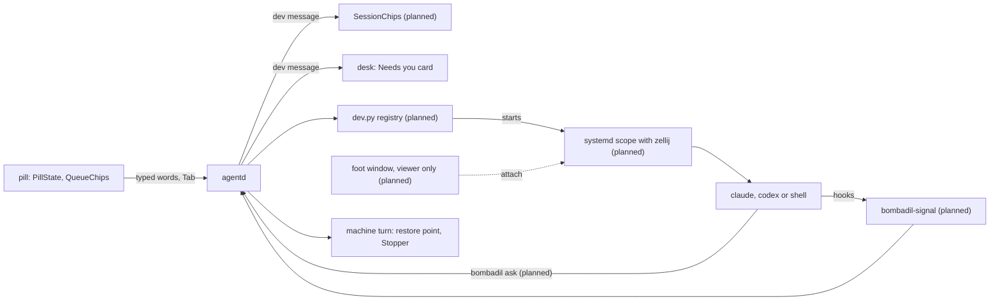

# Coding sessions

> **Status:** In progress
> **Code:** none of this is on `main`. It builds on `src/bombadil/agentd.py`, `src/bombadil/procs.py`, `src/bombadil/snapshots.py`, `src/bombadil/launcher.py`, `src/bombadil/narrate.py`, `shell/PillState.qml`, `shell/QueueChips.qml`, `shell/DeskState.qml`, `bin/bombadil` and `iso/airootfs/etc/skel/.config/hypr/hyprland.lua`. Planned files, none of them on `main`: `src/bombadil/dev.py`, `bin/bombadil-signal`, `shell/DevState.qml`, `shell/SessionChips.qml`, `shell/SessionPeek.qml`, `share/zellij/config.kdl`, the Claude Code and Codex hook files under `iso/airootfs/etc/`, and, for pieces 3 to 6, `bombadil-worktree` and `bombadil-checkpoint`.
> **Design:** [Building on Bombadil, the brief](../design/dev-brief.md), [the page](../design/pages/building-on-bombadil.html)
> **Verified:** 2026-10-01 against `main` at `6150431`: no code of this piece is on `main`. An unmerged branch holds pieces 1 and 2 and the plain own copy and `BOMBADIL_SESSION` gate of piece 3; its files were read one by one and are described here from that reading. Pieces 4 to 6 have no code anywhere.

Coding sessions are how Bombadil is meant to host the coding tools people already use, Claude Code and Codex, unchanged. Each one keeps running when its window closes, comes back when its name is typed, shows as one dot beside the pill, and is fenced off from the machine's own agent. It exists because a coding session on `main` is a bare `foot` window, which ends with its window and with the compositor, and because nothing under the home folder can be undone.

## What it will do

None of this can be used from `main`. Each part says whether it is built on an unmerged branch or designed only.

- **Named sessions that outlive their window** (piece 1, built on an unmerged branch). `claude acme`, `codex acme` or `shell acme`, with an optional role (`claude acme reviewer`), start the vendor's own tool in `~/Projects/acme` with no model call. Each session runs in an invisible `zellij` session inside its own systemd user scope. The `foot` window is only a viewer: closing it leaves the session running, and typing the name attaches a viewer again, mid-sentence. The first session on a repository works in the checkout, each further one in a `git worktree` under `~/Projects/.work/<repo>/<role>`. After a reboot sessions come back dim and resume by the tool's own session id, and nothing resumes by itself. `end <name>` ends a session and keeps its copy.
- **Dots for whose turn it is** (piece 2, built on an unmerged branch, apart from the designed-only parts named here). One chip per project, one dot per session: moving while it works, lit when it is your turn, red when it failed, dim when asleep, a ring for a session started by hand. The empty pill says who waits and Tab walks to the next one, ending with "Nothing needs you." The session in front never announces itself, and hovering a dot shows its last lines. Designed only: the "Claude 5-hour limit at 84%" line, reconciling with `claude agents --json --all`, notifications from plain shells, and the "what's running?" card (the branch opens a plain list in the details drawer).
- **The fence** (piece 3, designed only; the branch has the own copy and the `BOMBADIL_SESSION=1` mark). A session runs as the person without sudo (`setpriv --no-new-privs`). A refused `sudo pacman -S` points it to `bombadil ask "install postgresql 17"`, which shows as "api on Acme asks: install postgresql 17 [Do it]"; Tab runs it as an ordinary machine turn with a restore point and Undo. Each session also gets ten ports, a database name and a memory limit, and a developer note that only sessions read.
- **Undo per session** (piece 4, designed only). `undo this`, `undo <name>` and `redo` put a session's last turn back from a git checkpoint taken by `bombadil-checkpoint` around each prompt, skipping files changed since and saying what was covered. A bare `undo` keeps its one meaning, the machine's last turn.
- **Handing words across** (piece 5, designed only). `tell api …` types into a session's terminal, marked "(from the pill)"; `give this to claude on bombadil` starts a session from the person's own words; `have codex review builder` starts a read-only session; "While you were away" is built from the registry with no model call. The Claude app on the phone lists Claude sessions under the same names. Codex has no phone host on Linux.
- **Try, read, ship** (piece 6, designed only). `run it`, `what did builder change?` with a Diff button, an opt-in check after each turn, then `ship builder` (the session commits, Bombadil pushes and opens the pull request), `land builder` for a local merge and `clean up`. Nothing is pushed or merged before the person says so.
- **Designed only, beyond the six pieces:** a project card, standing roles in `.bombadil/project.toml`, watchers that run once, a native review app, and the brief's list of [gaps not designed yet](../design/dev-brief.md#not-designed-yet).

## How it fits

What it builds on in `main`:

| Where on `main` | What is there | What the piece does with it |
|---|---|---|
| `src/bombadil/agentd.py`, docstring and `AgentD.handle` (lines 1 to 60, 293 to 295) | One Unix socket of newline-delimited JSON, every event broadcast to every client. A `prompt` message may carry `asked_by`, which `main` already uses to say a coding session asked. No `dev` message is sent or handled. | Adds `dev` and `dev-signal` in and a `dev` broadcast out. The brief does not say whether a session's request uses `asked_by`. |
| `src/bombadil/agentd.py`, `AgentD.turn` (lines 1254, 1288 to 1293) | Each turn takes a snapper restore point and runs in a scope named `bombadil-turn-<pid>-<turn>-<time>`, with `Turn.cwd` defaulting to the home folder (`src/bombadil/providers.py:65`). | Leaves it. Sessions are not turns: no restore point, no turn scope, their own git undo. |
| `src/bombadil/procs.py`: `SCOPE`, `scope_supported`, `Stopper.stop`, `PROTECTED_ARGS` | `SCOPE` is the `systemd-run --user --scope` prefix. `Stopper.stop` ends a turn's descendants, its scope's cgroup and its process group, except windows matching `PROTECTED_ARGS`, and removes a stale pacman lock. | The branch reuses `SCOPE` and `scope_supported` for session scopes. `Stopper` must never reach a session. |
| `src/bombadil/snapshots.py`: `Snapshots` (line 26) | Snapper snapshots of the config `root` only. | Leaves it. Per-session undo is separate and planned. |
| `src/bombadil/launcher.py`: `match`, `entries`, `_undo` | Exact words skip the model. On `main`, `claude acme`, `end reviewer` and `undo this` match nothing and go to the model. `_undo` answers "Your home folder and apps stay as they are." | Adds project, role and session words before app names, and `undo this`, `undo <name>`. |
| `src/bombadil/narrate.py`: `_ASKED_RE`, `prompt_reads` (lines 1378, 1394 to 1399) | A prompt line `[asked by <who>, untrusted]` is recorded as an outside read of kind `session`. | A request from a session arrives marked this way. |
| `shell/PillState.qml`: `handle` (line 152) | Follows one turn by id; a message whose `type` is not `event` returns there. | The `dev` message carries no turn id, so this logic is untouched. |
| `shell/QueueChips.qml` | Grey "next" chips from `pill.queue`. | `SessionChips.qml` sits beside it: a chip per project, a dot per session. |
| `shell/DeskState.qml`: `_applyDev`, `onRowAction` | Builds the Needs you rows from `sessions` and `attention`; its Open button sends `{"type": "dev", "action": "open", "key": key}`. Nothing answers that on `main`. | Supplies the message and the `open` action. See [desk.md](desk.md). |
| `bin/bombadil` | `ask` sends `{"type": "prompt"}` and streams the reply; `stop` sends `{"type": "stop"}`. No `dev` subcommand. | Adds `bombadil dev …`, and the brief gives `ask` a second meaning inside a session. |
| `iso/airootfs/etc/skel/.config/hypr/hyprland.lua` | `SUPER + Return` runs `foot` (line 50); `hyprland.start` runs `agentd` and `bombadil-shell` (lines 8 and 9); `SUPER + Escape` runs `bombadil stop` (line 59); the terminal panel is `foot --app-id=bombadil-terminal` (`src/bombadil/hypr.py:23`). No rule for session windows. | The branch adds a window rule for the viewer and starts `foot --server`. The plain terminal stays plain. |

## Interfaces it adds (planned)

| Name | Kind | State |
|---|---|---|
| `{"type": "dev", "sessions", "front", "attention", "line"}` | agentd to clients | on the branch |
| `{"type": "dev", "action": "next"\|"open"\|"end"\|"why", "key"}`, `{"type": "dev-signal", …}` | clients and hooks to agentd | on the branch |
| `bombadil dev list`, `next`, `why <key>`, `run <key> [--resume]` | commands | on the branch |
| `bombadil-signal claude`, `codex`, `codex-notify` | hook program | on the branch |
| `~/.local/state/bombadil/dev/sessions.json`, `signals.jsonl`, `<key>.last` | registry, spool, last screen | on the branch |
| `/etc/claude-code/managed-settings.d/50-bombadil.json`, `/etc/codex/requirements.toml`, `/etc/codex/config.toml` | managed hooks, Codex `notify` | on the branch |
| `bombadil-dev-<project>-<role>-<run>.scope` in `bombadil-dev-<project>.slice`; `share/zellij/config.kdl` | units, host config | on the branch |
| `BOMBADIL_SESSION=1`, `BOMBADIL_DEV_ID`, `BOMBADIL_DEV_RUN`, `BOMBADIL_PROJECT`; `BOMBADIL_OS=1` in agentd's turns | environment | on the branch |
| `claude\|codex\|shell <project> [role]`, `<role>`, `end <name>`, `what's running?`; window app id `bombadil-session-<slug>` | launcher words, window | on the branch |
| `bombadil ask` from a session, `bombadil-worktree`, `.worktreeinclude`, `setpriv --no-new-privs`, `PORT`, `BOMBADIL_PORTS`, `COMPOSE_PROJECT_NAME`, `BOMBADIL_DB`, `bombadil-dev.slice` limits | fence | planned |
| `bombadil-checkpoint pre\|post`, `refs/bombadil/<role>/<n>/pre` and `post`, `.git/bombadil/<role>.index`; `undo this`, `undo <name>`, `redo` | undo | planned |
| os-mcp `list_sessions`, `start_session`, `tell_session`, `session_screen`, `stop_session`, `end_session`; MCP server `bombadil-dev` with `ask_machine`, `progress`, `show_preview` | tools | planned |
| `BOMBADIL_SHIP=1`, `core.hooksPath` pre-push hook, `~/.local/state/bombadil/projects/
.toml`, `.bombadil/project.toml` | ship and projects | planned |

## Principles it keeps

- [Full access with undo](../principles.md#full-access-with-undo): the machine's agent keeps sudo and one restore point per turn; a session gets neither. The trap is giving a session passwordless sudo for convenience: its root change then lands inside whichever machine turn is open, and undo reverts it or misses it.
- [One machine one conversation](../principles.md#one-machine-one-conversation): a session is a program the person runs, never queued behind the pill and never given the pill's "this" context. The trap is letting the pill forward typed text to the session in front.
- [The person's press reaches people](../principles.md#the-persons-press-reaches-people): nothing is pushed, opened as a pull request or merged before `ship` or `land`. The trap is relying on a vendor's background sessions, which commit and push on their own.
- [Nothing runs unseen](../principles.md#nothing-runs-unseen): every session has a dot, and nothing resumes after a restart until the person asks. The trap is a `zellij` session with no dot, or an automatic resume.
- [Quiet at rest](../principles.md#quiet-at-rest): the pill speaks only when it is the person's turn, something failed or a limit is near, never about the session in front. The trap is a line at the end of every turn, or bells from background panes.
- [Recovery without the broken part](../principles.md#recovery-without-the-broken-part): sessions live in their own units, so restarting `agentd`, the shell or the compositor never touches them. The trap is starting a session inside a turn's process tree, where `Stopper` would end it.

## Before you build on it

The brief's order: first merge the status-line and app-kit changes (both on `main` as of 2026-10-01) and move `agentd` and Quickshell to systemd user services. Then build pieces 1 to 6 in that order. Pieces 1 and 2 are useful alone; piece 3 is what lets parallel sessions exist without breaking the confirmed undo model; pieces 4 to 6 read from the first three. Before piece 1, spike in a VM that `zellij` passes Shift+Enter, the mouse and OSC 9, 99 and 777 to `foot`, with `tmux` as the fallback host. Before piece 1 or 3, test `setpriv --no-new-privs` beyond sudo and `newuidmap`, and that a `git worktree` under `~/Projects/.work` passes Claude's worktree check. The vendor facts in the brief are dated 27 Sep 2026 and were not re-checked.

What waits on the owner: the brief records its 19 defaults as confirmed on 2026-09-27 and names no open question for them. Still undecided are the items under [not designed yet](../design/dev-brief.md#not-designed-yet): several monitors, the pill's words from the phone, quota headroom for the pill, per-session databases, conflicts git cannot see, adopting existing sessions, and secrets in copies.

About the unmerged branch: it was last merged with `main` 52 commits before `6150431`, and `launcher.py`, `agentd.py` and `shell/shell.qml` have changed on `main` since (`match` takes a `busy` argument there). It also differs from the brief in places: `zellij` serialization is off, `foot --server` starts from `hyprland.start` and not as a socket-activated unit, windows are matched by an app id per session and not `--toplevel-tag`, Codex `notify` sits in `/etc/codex/config.toml` and not the skel, focus follows `activewindow` and not `activewindowv2`, and `Dev.signal` handles `CwdChanged` although the hook file does not register it.

Do not break on `main`:

- `bombadil ask "…"` as it is: it sends a prompt and runs it at once, and `iso/airootfs/usr/local/bin/bombadil-smoke` relies on it. The brief reuses the same words for a session's request, which waits for Tab, and does not say how the two are told apart. Settle that before piece 3.
- Stop (Esc, `SUPER + Escape`, `bombadil stop`) ends the machine's turn only. Sessions stay outside every turn's scope, process group and tree.
- Bare `undo` keeps its one meaning and never touches the home folder.
- The `dev` message keeps `sessions[]` and `attention[]`, which `DeskState.qml` reads, and carries no turn id.
- `SUPER + Return` stays a plain `foot`. A session started by hand is seen, never wrapped.

## When it ships

This page is then replaced by the full piece page, in the skeleton of [documenting.md](../contributing/documenting.md). The row for this piece in [the roadmap](../roadmap.md) is updated, and the brief's status block is updated to match.
