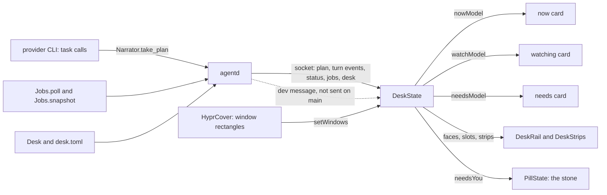
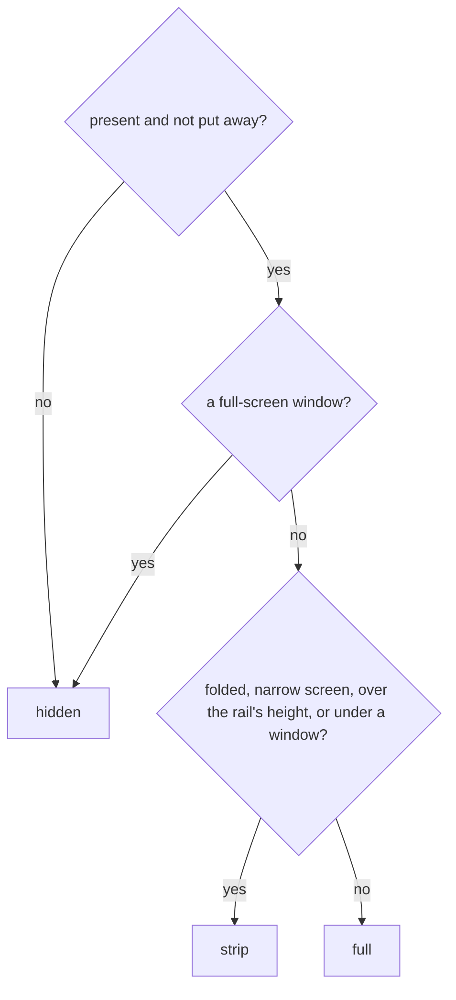
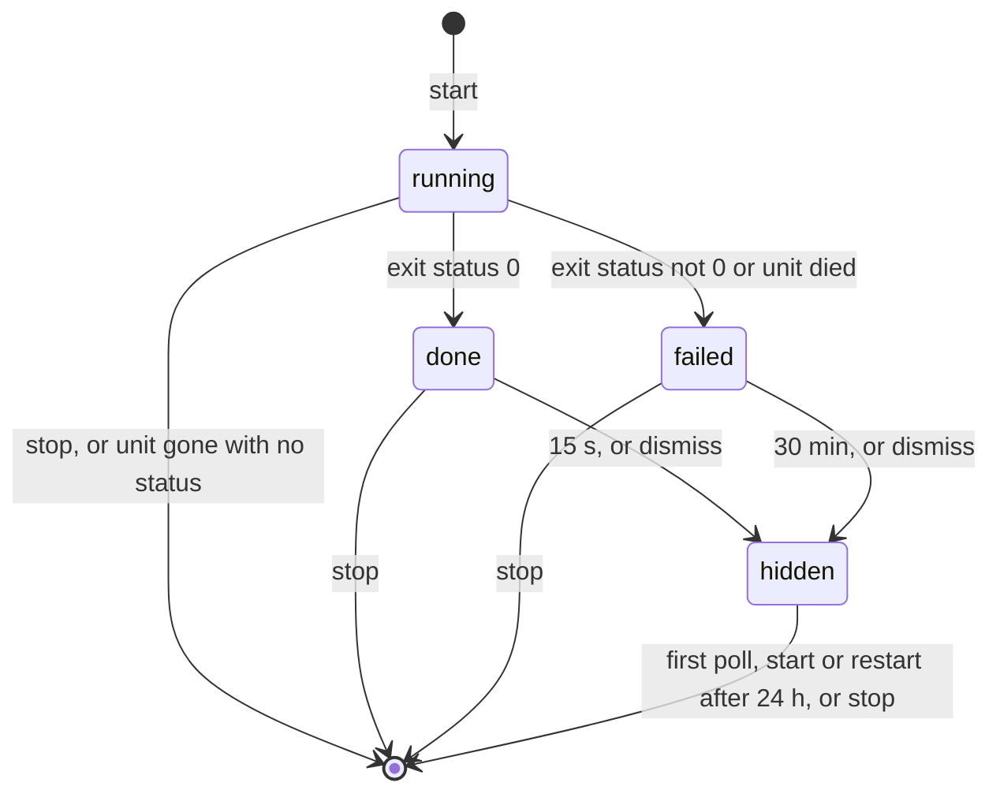

# The desk

> **Status:** Partly shipped
> **Code:** `src/bombadil/desk.py`, `src/bombadil/jobs.py`, `src/bombadil/watch.py`, `src/bombadil/agentd.py`, `src/bombadil/mcp_server.py`, `src/bombadil/launcher.py`, `src/bombadil/narrate.py`, `src/bombadil/providers.py`, `src/bombadil/paths.py`, `bin/bombadil`, `shell/DeskState.qml`, `shell/DeskRails.qml`, `shell/DeskRail.qml`, `shell/DeskStrips.qml`, `shell/DeskStrip.qml`, `shell/DeskCard.qml`, `shell/NowCard.qml`, `shell/RowsCard.qml`, `shell/DeskTheme.js`, `shell/HyprCover.qml`, `shell/PillState.qml`, `shell/Stone.qml`, `shell/shell.qml`
> **Design:** [The desk: widgets for a passenger](../design/widgets-brief.md), [the desk as a drawn page](../design/pages/the-bombadil-desk.html)
> **Verified:** 2026-10-01 against `main` at `a30ebc8`

The desk is where Bombadil's widgets live around the pill: cards in two rails at the sides of the screen, and small chips (strips) in the pill's row when a card has no room. A widget is on the desk only while it has something to say, so a machine at rest is wallpaper and a pill. It exists so the person can see the route of a turn and what is counting in the background, without the line above the pill carrying more than one line.

Shipped on `main`: the desk's memory and words (`desk.py`, `desk.toml`, the word `desk`, widget names with show and hide), the rails, strips and fold rules, the `desk` tool, the `now` card (the route of a turn), the jobs registry with the `job` tool, and the `watching` card. The `needs` card and the stone's mark for a waiting session (`needsYou`) are on `main`, but nothing on `main` sends the `dev` message that feeds them: the sender is the coding-sessions work, which is in progress ([coding-sessions.md](coding-sessions.md)). `away`, `machine` and `alive` are registered names with no card and no feed. Designed and not built: the dot face, dragging a card, peeking at a strip, the widgets the agent makes, and the `make` and `remove` ops of the `desk` tool. `src/bombadil/watch.py` is listed because the `now` card's title opens it; it is not a watcher ([below](#what-watchpy-is)).

## How it works



1. **The desk's memory.** `Desk` in `src/bombadil/desk.py` holds `folded`, the put-away widgets (`hidden`), each widget's rail (`rails`), each rail's `order` (bottom up: rank 0 is nearest the pill) and `screen`. One `Desk` is shared by the launcher, agentd's handler of the shell's messages and the agent's tool (`AgentD.__init__`). Every change goes through `Desk.apply(op, widget, rail, rank)`, which returns `(ok, one plain sentence)`, writes `desk.toml` when something changed, and then calls `on_change`. agentd turns that into one `desk` message to every client (changes within 30 ms go out as the state they end in).
2. **What a turn says.** agentd already broadcasts `turn_start`, `status` and the other turn events ([agentd.md](agentd.md#messages-agentd-sends)). The desk adds `asked_by` on `turn_start` and the `plan` event. `Narrator` in `src/bombadil/narrate.py` builds the plan from the provider's task calls (`TaskCreate`, `TaskUpdate`, `TaskList`, `TodoWrite`; Codex's `todo_list` is turned into a `TodoWrite` by `_codex_todos` in `src/bombadil/providers.py`), keeps at most 24 steps (`MAX_PLAN`), and agentd sends the whole table whenever it differs from the last one sent. A plan reaches the desk only if the CLI offers its task tools: `Claude.env()` sets `CLAUDE_CODE_ENABLE_TODO_TOOLS=1` (`src/bombadil/providers.py:246`) and `Codex.command` passes `-c tools.update_plan.enabled=true` (`:428`), as [agentd.md](agentd.md) says. Whether the agent writes a plan at all is the system prompt's rule: `system_prompt()` in `src/bombadil/providers.py`, which both CLIs get on every turn, tells it to write the plan first with its task tool, in short plain words, for a request of three or more steps, and to keep it updated. That plan is what `Narrator.take_plan` hands to agentd.
3. **What is counting.** `Jobs` in `src/bombadil/jobs.py` is the registry of background commands, watchers and timers. agentd looks at it every 2 s while it has rows and sends the `jobs` table when the table changes.
4. **What the shell does.** `shell/shell.qml` hands every line from agentd to `PillState.handle` and to `DeskState.handle`. `DeskState` is plain Qt Quick with no Quickshell types, so tests load it offscreen. It turns messages into three models (`nowModel`, `watchModel`, `needsModel`), decides each widget's face, works out each card's slot, and sets `PillState.needsYou` ([The needs-you mark](#the-needs-you-mark)). `DeskRails` draws the cards in two layer-shell windows, `DeskStrips` draws the strips in the bar window, and `HyprCover` tells `DeskState` where the windows are ([shell.md](shell.md#the-desks-hosts)). When the socket connects, `DeskState` asks for `desk get`.
5. **Three routes change the desk, one function does it.** A launcher word (`desk`, `hide machine`) reaches `Desk.apply` through `Launcher`. A message from the shell (`desk` with `op`) reaches it through `AgentD._desk_op`. The agent's `desk` tool reaches it through `AgentD._desk_tool`, which refuses unless the person's own words asked for the desk. Nothing here starts a model turn, and `DeskState` never changes its own `folded`, `hidden`, `rails` or `order` first: `fold`, `hide`, `show` and `move` only send a message, and the state comes back as a `desk` message.

### When the desk shows

At rest there is no card, no strip and no rail window: a rail's window is up only while a card is in full, and for `foldMs + 80` ms after, and the clock that moves the `watching` rows runs only while the table has a running or a done row that the person has not removed (`DeskState.ticking`); a table of failed rows runs no clock.

| Widget | On the desk when | Code |
|---|---|---|
| `now` | a turn runs and has a plan of two or more steps or has touched the system (a step with a `risk`); after `turn_end`, while the pill still shows its closing line. A stopped or failed turn, or one that never qualified, leaves at once | `DeskState.nowVisible`, `_qualifies`, `_end` |
| `watching` | the jobs table has a row the person has not removed; a done row leaves 12 s after it ended, a failed row stays until dropped (agentd drops it after 30 min) | `watchingPresent`, `_refreshWatch` |
| `needs` | two or more sessions want the person; one is the line in the pill and not a card. It cannot be put away | `needsPresent`, `isHidden` |
| `away`, `machine`, `alive` | their model has rows. Nothing fills those models, so they never show | `awayPresent`, `machinePresent`, `alivePresent` |
| any but `needs` | and it is not in `hidden`; `alive` starts put away until "show alive" | `isHidden`, `OPT_IN` |

### The widgets

| Widget | Default rail, rank | Answers | Status | Face | Fed by |
|---|---|---|---|---|---|
| `now` | left, 0 | What is it doing, and why? | Shipped | `NowCard` | `turn_start`, `plan`, `status`, `turn_end` |
| `watching` | left, 1 | What is it keeping an eye on? | Shipped | `RowsCard` | the `jobs` table |
| `alive` | left, 2 (put away) | What is being touched? | Registered only | none | none |
| `needs` | right, 0 | What is waiting for me? | Card shipped, no feed on `main` | `RowsCard` | the `dev` message |
| `away` | right, 1 | What happened while I was gone? | Registered only | none | none |
| `machine` | right, 2 | Is the machine in trouble? | Registered only | none | none |

The design's Sessions widget (the project chips with a dot per session) is not in `WIDGETS`; it is in progress on another branch ([coding-sessions.md](coding-sessions.md)). The agent-made widget is designed ([the brief](../design/widgets-brief.md#widgets-the-agent-makes)) and has no code.

**`now`.** `DeskState._refreshNow` builds the model.

| Part | Value |
|---|---|
| Title | the person's prompt on one line (at most 60 characters, "Working on it" when empty); for a turn a coding session asked for, `<ask> · asked by <name>` with the ask cut to fit |
| Why line | running: `Step N of M · <touched_text> · Esc stops` (`Step N of M` only with a plan; a line over 44 characters moves the counts after `Esc stops`). After the turn: `done in N s`, plus ` · Undo is above the pill` when the turn changed something |
| Steps | the plan: `completed` ticked green, `in_progress` pulsing orange in its `active` words, the rest grey. With no plan and a system step, one step made from the step line. At most 12 rows, around the current step |
| Edge | `machine` orange while running, `amber` for risk `system`, `red` for `irreversible`, `ok` green when done |
| Command and caption | the exact command of a marked step under the current one; for `irreversible`, also `can't be undone · Esc stops it` |
| Click on the title | `DeskState.openDetails` calls `PillState.details()`, which sends `{"type": "details", "turn": n}` |

Plans and statuses stamped with another turn's id are dropped. A bar that connects mid-turn starts the card from agentd's `status` (`busy`, `turn`) and gets the latest `plan` in the reply to `desk get`.

**`watching`.** One row per entry in the jobs table that the person has not removed. Every row has a `×`: a running job is stopped with `systemctl`, a finished row is dropped, and neither goes through the model.

| Row | Looks like |
|---|---|
| running, with a percent in its output | meter row: title, elapsed time (`4 min`), percent, orange track |
| running, no percent | dot row, `<span> so far`, pulsing orange dot |
| running timer | dot row, `m:ss left`, pulsing blue dot |
| done | green dot, `done in <span>`; leaves 12 s after `ended` |
| failed | red dot, the job's last line, and a `Why?` button that opens the log in the details drawer; stays until dropped (agentd keeps it in the table 30 min) |

The card's line says `N counting · each ends with one line in the pill`, or `finished`. A removed row stays gone until a table without it arrives, and comes back after 5 s if the job is still listed (the stop did not work).

**`needs`.** One row per key in `attention`, in that order: title `<role> on <project>`, the first line of what the session said (70 characters), a pulsing blue dot while its `state` is `asked`, and an `Open` button that sends `{"type": "dev", "action": "open", "key": key}`. Its line reads `Tab walks these · one alone is just the line`; there is no Tab walk on `main` (see [Known gaps](#known-gaps)).

A rows card (`watching` or `needs`) washes: a row that was not on the card before the model last changed paints the card's left edge in its tone and fades over `washMs` (600 ms; `DeskCard.wash`, called from `RowsCard.onRowListChanged`). Rows that arrive with the card, or onto a card that had none, do not wash, and one change washes once.

### The needs-you mark

`DeskState.needsYou` is true while `needsModel` has one row or more, so one waiting session counts, although a single session is the line in the pill and not a card. A `Binding` in `DeskState` writes it to `PillState.needsYou`, which gives the stone its `needs` face (amber, two knocks of 8 degrees on a 1.6 s beat, with a glow that breathes; `shell/PillState.qml`, `shell/Stone.qml`, drawn as [shell.md](shell.md) describes). `needsYou` changes the face and nothing else in `PillState`.

| What | Behaviour |
|---|---|
| One session or many | One waiting session is the line in the pill and no card (`needsPresent` wants two rows); the stone knocks for one or more |
| Nothing puts it away | A fold, a covering window, a narrow screen and the capsule under a full-screen window take the card away and leave the mark, and `needs` cannot be put away |
| It outranks a running turn | `PillState.face` tests `needsYou` before `busy`, so the face is `needs` while a turn runs and a session waits (`test_the_stone_knocks_over_a_running_turn_and_the_turn_goes_on_after`); the `now` card keeps drawing the turn. When the last row goes, the face is what the pill says (working, done or rest) |
| It clears | with the last row, and when the socket drops (`lost()` empties the sessions) |
| Setup keeps its own | Setup's ask (`choose`, `signed_out`, `offline`) gives the same face by another cause, and the desk clearing its rows never clears it |
| What lights it | A row exists for each key in `attention` that has a session in `sessions`. On `main` nothing sends `dev`, so the mark has no cause outside the tests. The coding-sessions work, in progress, lists in `attention` the sessions that asked a question or finished or failed and have not been looked at, apart from the session in front ([coding-sessions.md](coding-sessions.md)) |

### Faces, folding and fit

`DeskState.faces` gives each widget one of three values. The brief's third face, a dot on the pill, has no value here.

| Face | What it is | Drawn by |
|---|---|---|
| `full` | a card, 300 px wide, as tall as its rows, in a rail | `DeskRail` |
| `strip` | a 28 px chip in the pill's row | `DeskStrips`, `DeskStrip` |
| `hidden` | nothing: not present, put away, or a full-screen window has the stage | |



| Rule | Condition | Effect |
|---|---|---|
| Presence | `present[id]` is false | no face and no slot, so the cards above it slide down |
| `desk` word | `folded` is true | every present widget is a strip |
| Narrow screen | `screenWidth < 2 * (300 + 16 + 12) + 360` (1016) | every present widget is a strip, so the line above the pill never covers a card |
| Height | the card's slot, from the rail's bottom up in rail order, does not fit in `railHeight` (`screenHeight - 120`) | it and every card above it are strips |
| Right of way | a window or panel rectangle overlaps the card's slot (touching edges do not count) | the card folds at once (a 150 ms scale and fade toward the rail's outer bottom corner) and its strip fades in; it unfolds 400 ms after no window covers it, and a window back inside that time keeps it folded. Each widget has its own timer, and a folded card keeps its slot |
| Full-screen window | any window has `fullscreen` | every face is `hidden`: no rail windows, no strips, and the pill becomes a 100 px capsule. The bar also puts the picture above the line away (`CardHost.suppressed` follows `capsule`, `shell/shell.qml`) |

Heights, which the stack and the drawn cards must agree on: `now` is `68 + 26 * steps`, plus 20 with a command and 18 with a caption; a rows card is `50 + 18` plus 34 per meter row and 44 per other row; `machine` is 210 and `alive` is 168 (fixed numbers for faces that do not exist). Rails are 16 px from the screen edge, start 40 px from the top, stop 16 px above the bar's exclusive zone, and cards are 12 px apart. The bar's zone is 64 px plus the app-chip row while apps run, and `DeskState` lays the stack out from a fixed `rowZone` of 64 ([Known gaps](#known-gaps)).

`DeskState.mode` is `immersive` with any full-screen window, `shared` with any window or panel on the stage, and `open` otherwise. The pill's width follows it: 100, 360, or `max(360, min(900, screenWidth - 2 * (max(left strips, right strips, 300 if a card is full) + 12 + 16)))`, animated over 150 ms. The pill itself is in [shell.md](shell.md).

**Strips.** At most three a side, then `+N`. On the right they run outward from the pill in the rail's order; on the left the order is reversed, so the last widget of the left rail sits next to the pill and `now` is outermost. A card's model may carry a `strip` that overrides these fields.

| Widget | Strip text | Dot |
|---|---|---|
| `now` | `step N of M`, or `working` with no plan, or `done` | orange with a breathing ring; green, no ring, when done |
| `watching` | the first word of the first meter's title and its percent (`Ubuntu 43%`), else `N counting`; `finished` when nothing counts | orange with a ring; green or, if one failed, red when finished |
| `needs` | `N need you` | white, outlined |
| `away` | `back · N things` (`back · 1 thing` for one) | none |
| `alive` | `N alive` | none |
| `machine` | `machine` | none |

**Layers and input.** `shell/DeskRails.qml` makes one `PanelWindow` a side on `WlrLayer.Bottom` (the layer meant to sit over the wallpaper and under app windows; no test observes that, see [Known gaps](#known-gaps)), namespace `bombadil-desk-left` or `bombadil-desk-right`, with `exclusionMode: ExclusionMode.Normal` and `exclusiveZone: 0`, so it reserves nothing. Its `mask` is one box around the full cards (`DeskRail.hitArea`), so a click beside them is meant to reach what is behind. The window is not visible on a screen the desk does not live on, under a full-screen window, or while no card is full. The strips are children of the bar window, and the bar's input mask lists `stripsLeft` and `stripsRight` with the pill, the line and the chips (`shell/shell.qml`, `mask`); a side with no strips has zero width and takes no input.

**Where the windows come from.** `shell/HyprCover.qml` asks Hyprland for the window list on the events that move a window (open, close, move, workspace, special workspace, full screen, monitor), reads the answers 40 ms and again 250 ms later, and asks again every `pollMs` (300 ms) while any window is on the stage, because Hyprland sends no event while a floating window is dragged. It lists the windows on the desk screen's workspace and on the special workspace shown over it, and calls `DeskState.setWindows`. It does nothing unless `HYPRLAND_INSTANCE_SIGNATURE` is set (`live`); the headless sway test stands in with `quickshell ipc call desk cover`.

### The jobs registry

A job is a command the agent started with the `job` tool, a watcher on something already running, or a timer. Each is a transient `systemd-run --user` unit, so it outlives the turn that started it and stopping the turn never reaches it.

| Kind | Made by | Unit | Ends when |
|---|---|---|---|
| `job` | `op: start` with `command` | `bombadil-job-<id>` | the command exits |
| `watch` | the same, with `kind: "watch"` and a command that waits (`tail --pid=1234 -f /dev/null`) | `bombadil-job-<id>`, built the same way; the kind only changes the fallback row title (`Watching`) | the command exits |
| `timer` | `seconds`, with or without a `command` | `bombadil-timer-<id>`: `--on-active=<n>s --timer-property=AccuracySec=1s`, a `.timer` and its `.service` | the deadline passes and the unit runs the command, or only writes status 0 |



`hidden` is not a stored state. It is a `done` or `failed` record that `snapshot()` no longer lists. A restart of agentd reloads every record, so a job still running is counted again (`serve` calls `_jobs_kick`).

| Step | What `src/bombadil/jobs.py` does |
|---|---|
| `start` | checks the request: a title (cut to 80 characters) and a non-empty command for a job or watch; for every kind, a command of at most 20 000 characters with no NUL byte (a timer's optional command too); a timer of 1 s to 7 days, rounded up, whose title defaults to `Timer, <span>`; an optional absolute `cwd` that is a folder (the tool does not offer it); at most 20 running. Writes `<id>.json` first, then runs `systemd-run`. If systemd refuses or is missing, it forgets the record and raises `JobError` in one plain sentence |
| the unit's shell | `/bin/sh -c <command> >> <id>.log 2>&1; s=$?; echo $s > <id>.exit; exit $s`. The command runs in a shell of its own, so an `exit` in it cannot skip the status. The id is six hex digits as made (`secrets.token_hex(3)`) and 4 to 12 are accepted (`ID_RE`), checked before any path or unit name is built; the title is passed only as the unit's `--description` |
| `poll` | for each running job: the `.exit` file decides first; else `systemctl --user is-active` says whether the unit is there. While it is, the last 4096 bytes of the log give the percent (the last `NN%`, 0 to 100) and the last non-empty line (120 characters). A unit that died with no status is `failed`, and its row shows the log's last line, or `it stopped before it finished` when the log is empty (a non-zero exit with an empty log shows `exit status N`); one that is gone with no status (`systemctl stop` from outside, a reboot) is forgotten without a word; systemd that cannot be asked counts as active. Returns the jobs that ended since the last look, once each |
| `snapshot` | the table in the order the jobs began. It only hides rows and deletes nothing: a done row is hidden 15 s after it ended, a failed one after 30 min or a dismiss |
| `_expire` | deletes a finished record, its log and its exit file at the first call more than 24 h after the job ended. It is called from `poll`, from `start` and when `Jobs` is built, so it is not clock-driven: `_jobs_loop` stops polling once the table is empty, and on an idle machine the record and log stay until the next job starts or agentd restarts |
| `stop`, `dismiss` | `stop` runs `systemctl --user stop` (a timer's `.timer` too), clears a failed unit, and deletes the record, log and exit file at once; it raises `JobError` and keeps the row if systemd will not stop it. `dismiss` only hides a finished row |
| `listing`, `why` | the table in words for the agent's `list`; the `bash -c` command the details drawer runs to show the title and the last 300 lines of the log until a key is pressed |

agentd owns the loop (`AgentD._jobs_loop`): every `JOBS_POLL` (2 s) while the table has anything, then it stops. When a job ends, `_job_ended` says one line in the pill (a `local` event with `action: "job"` and no turn), adds `background job <id>: <line>` to the notes the next prompt is told (a failed job also names its log), and logs a `local` entry in `turns.jsonl`. A job stopped with `×` is noted and logged but not said on the line.

### The `desk` tool and its gate

`desk.asked_for_desk(prompt)` is the gate. The `desk` tool works only in the running turn (not one being stopped) whose own typed words asked for the desk: `agentd` passes the raw prompt, not the one with notes in front, and a turn a coding session asked for has no typed words. It is a courtesy, not a boundary: anyone who can type to the agent can say the words, and anyone who can open the socket can send any message ([agentd.md](agentd.md)).

| Words | Opens the gate |
|---|---|
| `desk` or `widget(s)` anywhere, except `standing`, `front`, `help` or `writing` before `desk`, or `desk job`, `desk lamp`, `desk chair`, `desk work` after it | yes (`_DESK_WORD`) |
| a verb (`show`, `hide`, `put`, `keep`, `pin`, `move`, `bring`, `fold`), then any number of `up`, `back`, `the` or `my`, then a widget's name (`now`, `watching`, `needs you`, `machine`, `alive`, `while you were away`) that is not followed by an apostrophe, then the end, a comma, or one of `on`, `to`, `in`, `at`, `above`, `below`, `up`, `back`, `first`, `last`, `again`, `always`, `please`, `rail`, `rails`, `card`, `where` | yes, one sentence at a time (`_DESK_ASK`): `hide machine`, `show the machine`, `put my watching on the right`, `bring up the watching card` |
| `keep watching the build`, `show me the machine's logs`, `a standing desk` | no |

### `DeskTheme.js`

`shell/DeskTheme.js` is a `.pragma library` script of 33 plain values, because a library script cannot import a directory and `DeskState` reads it too. Most comments name the token in `share/qml/Bombadil/Theme.qml`; the list that is kept equal is `DESK_COLOURS` and `DESK_VALUES` in `tests/test_theme.py`, which keeps 25 of the 33 equal to their tokens: the 18 colours (`panel` is `glassCard`, `strip` is `glassStrip`, `you` is `fg`, `machine` is `accent`, `sessions` is `info`, `ok` is `good`, `amber` is `warn`, `red` is `bad`, and so on), `radius`, `rowHeight`, `pillHeight`, `fontFamily`, `monoFamily`, and `cardWidth` against `railWidth` and `stripHeight` against `chipHeight`. The other eight (`railMargin`, `railTop`, `railBottom`, `cardGap`, `stripGap`, `foldMs`, `unfoldDelayMs`, `washMs`) have no token. `test_no_shell_file_hard_codes_a_colour` covers `shell/*.qml` only, so `DeskTheme.js` is the one shell file that may hold colour literals. The tokens are explained in [the design system](../design-system/README.md).

### What `watch.py` is

`src/bombadil/watch.py` is `bombadil watch` and `bombadil history` (both dispatched in `bin/bombadil`): it renders a turn's events as terminal lines. The `now` card's title reaches it: `details` makes agentd open `bombadil watch --file <turn log>` (with `--follow` for the running turn) in the details drawer. `history` lists the rows of `turns.jsonl` that are turns or `local` entries (a desk word, a job that ended) and skips rows of any other kind, such as the self-improvement loop's (`paths.is_turn_row`). It plays no part in jobs. `Why?` on a failed job opens the `bash -c` command from `Jobs.why`, not `watch`. `tests/test_watch.py` covers the renderer, `history` and following a turn.

## Interfaces other pieces depend on

**Messages agentd sends that the desk reads** (all handled in `DeskState.handle`; anything else is ignored).

| Message | Fields read | Effect |
|---|---|---|
| `{"type": "desk"}` | `folded`, `hidden`, `rails`, `order`, `screen` | replaces the desk state; a missing key keeps its value, a bad one is dropped; a widget the order omits goes last in its rail |
| `{"type": "jobs"}` | `jobs[]`: `id`, `title`, `kind`, `state`, `started`, `deadline`, `ended`, `pct`, `last` (`unit` is sent, unused) | replaces the table; unknown states are dropped, `pct` is clamped to 0..100 |
| `{"type": "dev"}` | `sessions[]` (`key`, `role`, `project`, `projectTitle`, `state`, `last`), `attention[]` | the `needs` rows. Not sent by anything on `main` |
| `event` `turn_start` | `turn`, `prompt`, `asked_by` | starts the `now` card |
| `event` `plan` | `turn`, `steps[]`: `id`, `subject`, `active`, `status` (`pending`, `in_progress`, `completed`) | the route, if `turn` is the running one |
| `event` `status` | `source: "step"`, `risk`, `command`, `touched_text`, `text` | edge, command, caption, counts |
| `event` `tool_result`, `result`, `error`, `turn_end` | `turn`; `result`: `text`, `ok`; `error`: `text`; `turn_end`: `seconds`, `changed`, `stopped` | `tool_result` clears the step's command; `result` and `error` decide whether the turn failed; at `turn_end` the card ticks every step, or leaves if the turn was stopped or failed |
| `{"type": "status"}` | `busy`, `turn` | a bar that connects mid-turn starts the card; idle ends it |

**Messages the desk sends** (`DeskState.outgoing`, written to the socket by `shell/shell.qml`).

| Message | Sent when | agentd answers |
|---|---|---|
| `{"type": "desk", "op": "get"}` | the socket connects | `desk`, the running turn's last `plan`, and `jobs` |
| `{"type": "desk", "op": "fold" \| "hide" \| "show" \| "move", "widget", "rail", "rank"}` | `DeskState.fold`, `hide`, `show`, `move`; nothing in `shell/` calls them | `fold` toggles; there is no `unfold` here; `desk` to everyone if the state changed, and a note for the agent plus a `turns.jsonl` entry |
| `{"type": "jobs", "op": "stop" \| "dismiss", "id"}` | `×` on a row | `jobs` table |
| `{"type": "jobs", "op": "get"}` | nothing in `shell/` sends it; any client may (`src/bombadil/agentd.py`, `_jobs_op`) | the `jobs` table to that client |
| `{"type": "jobs", "op": "why", "id"}` | `Why?` | opens the log in the details drawer |
| `{"type": "dev", "action": "open", "key"}` | `Open` on a `needs` row | nothing on `main` handles it |

**Tool messages** ([agentd.md](agentd.md#messages-a-client-sends)).

| Message | Fields | Gate in `agentd` |
|---|---|---|
| `desk-tool` / `desk-result` | `id`, `turn`, `op`, `widget`, `rail`, `rank` / `id`, `ok`, `text` | `turn` is the running turn, not stopping, and `asked_for_desk(turn_prompt)`; `op` is one of `show`, `hide`, `move`, `fold`, `unfold`, `state` |
| `job-tool` / `job-result` | `id`, `turn`, `op`, `title`, `command`, `kind`, `seconds`, `job` / `id`, `ok`, `text` | `start` needs the running turn that is not stopping and does not need the person's own words; `list` and `stop` need no turn check |

**Tools** (the catalogue is in [os-mcp.md](os-mcp.md#the-tool-catalogue)). Both need `BOMBADIL_TURN` in the tool process's environment, which agentd sets per turn, and both raise `ToolError` in plain words otherwise. A call waits for agentd's answer for `DESK_TIMEOUT` (10 s) or `JOB_TIMEOUT` (25 s, because starting a job waits for systemd); after that the error says `agentd did not answer within N seconds, so the desk (or the job table) may be unchanged`.

| Tool | Arguments | Notes |
|---|---|---|
| `desk` | `op` (`show`, `hide`, `move`, `fold`, `unfold`, `state`), `widget` (`now`, `watching`, `alive`, `needs`, `away`, `machine`), `rail` (`left`, `right`), `rank` (integer, 0 is nearest the pill; none puts it last, and a rank past the end is the end) | the line (`src/bombadil/narrate.py:906-919`) says what it tried and claims no change, offers no Undo, and the desk is outside the restore points |
| `job` | `op` (`start`, `list`, `stop`), `title`, `command`, `kind` (`job`, `watch`), `seconds`, `id` | `id` is the job's; it travels as `job` because `id` names the request. A timer is `seconds`, not a kind. The pill's line is `Watching <title>` (or `Starting a background job`), `Stopped <title>` or `Checking the background jobs` (`src/bombadil/narrate.py:920-928`); like the `desk` line it claims no change and offers no Undo |

**`Desk.apply` ops and their sentences** (`src/bombadil/desk.py`): `toggle` (the word `desk`), `fold`, `unfold`, `hide`, `show`, `move`, `state`. Examples: `Put Machine away.`, `Needs you cannot be hidden.`, `Moved Watching to the right rail.`, `The rails are left and right.`, `The desk is already folded.` `state` answers with `Desk.describe`: `The desk is open. Left rail, nearest the pill first: Now, Watching, Alive (put away). Right rail: Needs you, Away, Machine.` A widget is named by its id, title or words (`find`): `needs`, `needs you`, `Needs-You` and `while you were away` all work; `Needs You.` does not.

**Launcher words** (`src/bombadil/launcher.py`; exact, handled by agentd with no model).

| Words | Does |
|---|---|
| `desk` | folds or unfolds every card (`Desk.apply("toggle")`); `desk?` goes to the agent |
| `show`, `open` or `bring up` `<widget>` | `apply("show")` |
| `hide`, `close` or `put away` `<widget>`, `put <widget> away` | `apply("hide")` |
| a bare widget name, or a sentence | the agent's, not the launcher's |

**Files.**

| Path | What |
|---|---|
| `~/.local/state/bombadil/desk.toml` | the desk ([Where state lives](#where-state-lives)) |
| `~/.local/state/bombadil/jobs/<id>.json`, `.log`, `.exit` | one job's record (`id`, `title`, `kind`, `command`, `started`, `deadline`, `ended`, `state`, `exit`, `pct`, `last`, `dismissed`), its output and its exit status. `dismissed` keeps a dismiss across a restart of agentd; a record whose file name is not an id, or whose `id`, `kind`, `state` or `started` is wrong, is not read (`Jobs._read`) |
| `~/.local/state/bombadil/turns.jsonl` | a `local` entry for a desk word (the typed words), a desk gesture (`at the desk`), and a job that ended or was stopped (`background job`) |

**`desk.toml` keys** (`Desk.load` and `Desk.save`).

| Key | Meaning |
|---|---|
| `folded` | `true` shows every present widget as a strip (the word `desk`) |
| `hidden` | the put-away widgets; `needs` is never kept here and `alive` is in the default |
| `screen` | the output the desk lives on, such as `DP-1`; `""` is the first screen. The shell (`deskScreen` in `shell/shell.qml`) shows the rails, the strips and the narrowed pill only on that screen, takes `screenWidth` and `screenHeight` from it, and falls back to the first screen when the named output is not plugged in. No `Desk.apply` op, launcher word or tool sets it: it is edited by hand while agentd is stopped |
| `[rails]` | each widget id, `left` or `right` |
| `[order]` | `left` and `right`, each a list of widget ids, bottom up (rank 0 is nearest the pill) |

**Developer hooks.** `quickshell ipc call desk state` prints `DeskState.snapshot()` as JSON; `desk cover '{"windows": [{"x", "y", "w", "h", "fullscreen"}]}'` stands in for Hyprland's windows; `desk inject '<message>'` feeds the shell a message as agentd would send it (`shell/shell.qml`, `IpcHandler`). `BOMBADIL_STATE` moves the state directory (else `$XDG_STATE_HOME/bombadil`, else `~/.local/state/bombadil`) and `BOMBADIL_SOCKET` the socket (`src/bombadil/paths.py`). `HYPRLAND_INSTANCE_SIGNATURE` switches `HyprCover` on; without it only `desk cover` moves the windows.

**Constants** (`src/bombadil/jobs.py`, `src/bombadil/mcp_server.py`, `src/bombadil/agentd.py`, `shell/DeskState.qml`, `shell/DeskTheme.js`).

| Name | Value | Meaning |
|---|---|---|
| `DONE_STAYS`, `FAILED_STAYS`, `KEEP` | 15 s, 30 min, 24 h | how long a done row, a failed row and a record stay |
| `CALL_TIMEOUT` | 15 s | how long one `systemd-run` or `systemctl` call may take (`src/bombadil/jobs.py:49`). The `job` tool waits longer than the `desk` tool because a start waits for systemd |
| `MAX_RUNNING`, `MAX_TITLE`, `MAX_COMMAND`, `MAX_SECONDS`, `MAX_LAST`, `TAIL` | 20, 80, 20 000, 7 days, 120, 4096 | limits |
| `doneStaysMs`, `goneMs`, `tickMs` | 12 000, 5000, 1000 | the shell's own clock for a done row, a removed row and the rows' time |
| `foldMs`, `unfoldDelayMs` | 150, 400 | fold and unfold timing (`DeskTheme.js`) |
| `DESK_TIMEOUT`, `JOB_TIMEOUT` | 10 s, 25 s | how long a `desk` or `job` tool call waits for agentd (`src/bombadil/mcp_server.py:30-31`) |
| `DESK_DEBOUNCE`, `JOBS_DEBOUNCE`, `JOBS_POLL` | 0.03 s, 0.03 s, 2 s | changes within 30 ms of each other go out as one `desk` or `jobs` message, the state they end in; agentd looks at the jobs every 2 s while the table has a row (`src/bombadil/agentd.py:165-168`) |

## Where state lives

| What | Where | Notes |
|---|---|---|
| The desk | `~/.local/state/bombadil/desk.toml` | `folded`, `hidden`, `screen`, a `[rails]` table and an `[order]` table; read at start by `Desk.load()` and written by `save()` through a `.tmp` file and `os.replace`. Edit it by hand only while agentd is stopped |
| Jobs | `~/.local/state/bombadil/jobs/` | `<id>.json`, `<id>.log`, `<id>.exit` |
| The turn's events | `~/.local/state/bombadil/turns/<unix ms>-<turn>.jsonl` | one file per turn, `plan` events included (a `status` that is not a step's is left out). `details` opens it with `bombadil watch --file`; see [the turn log](agentd.md#the-turn-log) |
| The units | the user's systemd: `bombadil-job-<id>`, `bombadil-timer-<id>` | transient; a reboot removes them (inferred from how `systemd-run` units work, not tested) |
| What the shell shows | `DeskState` in the shell process | rebuilt from `desk get` when the bar connects; `lost()` empties the jobs and sessions when the socket drops |

The desk file and the jobs folder are under the home folder, outside every restore point, so an undo never moves the desk or removes a job's record ([restore-points.md](restore-points.md)).

A desk the person has changed: Watching moved to the right rail (a move with no rank puts it last) and Machine put away. The default has `hidden = ["alive"]`, Watching in the left rail and the orders `now, watching, alive` and `needs, away, machine`.

```toml
# Bombadil's desk: which widget sits in which rail, and which are put away.
# agentd writes this when the desk changes; edit by hand only while agentd is stopped.
folded = false
hidden = ["alive", "machine"]
screen = ""

[rails]
now = "left"
watching = "right"
alive = "left"
needs = "right"
away = "right"
machine = "right"

[order]
left = ["now", "alive"]
right = ["needs", "away", "machine", "watching"]
```

`load()` takes each part that is missing or wrong from the default: a file that does not parse gives the default desk, `needs` is never kept in `hidden`, `screen` must look like an output name (`DP-1`, at most 40 characters), a widget the order omits or lists under the wrong rail goes last in the rail it belongs to. A disk that will not take the file costs nothing: the change holds until agentd stops.

## Principles it keeps

- [Nothing runs unseen](../principles.md#nothing-runs-unseen): every background command is a row with a `×` that stops it through `systemctl`, and its end is said in the pill. The trap is a process started outside the registry (`&`, `nohup`), which nobody can see or stop; the `job` tool's description tells the agent to use the registry instead. A card button reports the press and the shell decides, so no button starts model work.
- [Quiet at rest](../principles.md#quiet-at-rest): a widget with nothing to say has no face, no rail window and no timer of its own. The trap is a card that is always present, or a clock that runs with no job counting. The one timer that can run with no widget present is `HyprCover`'s 300 ms refresh, which runs on Hyprland while any window is on the stage.
- [The answer is the thing](../principles.md#the-answer-is-the-thing): widgets yield. Rails reserve no space (`exclusiveZone: 0`) and a card folds when a window covers it. The trap is a card that stays over what the agent brought, or an exclusive zone that shrinks every window.
- [Colour says who](../principles.md#colour-says-who): orange is the machine, blue is coding sessions, white is the person; green and red are state. The trap is a tone for another meaning: the running timer's blue is one such case (see [Known gaps](#known-gaps)).
- [One design language](../principles.md#one-design-language): `DeskTheme.js` mirrors `Theme.qml` and a test keeps 25 of its 33 values equal. The trap is a literal in a card's QML or a layout number with no token, which no test would catch.
- [Every piece degrades](../principles.md#degrade-and-recover): a damaged `desk.toml` gives the default desk, an unwritable disk keeps the change in memory, a broken listener never costs the change, and systemd that cannot be asked never drops a job. The trap is a path that raises where these return a default.

## Extending it

Line numbers on this page are those of `a30ebc8`; search for the name when they have moved.

**Add a widget** (a card of rows is the least work).

1. In `src/bombadil/desk.py`, add `Widget(id, title, words, rail)` to `WIDGETS`; its place among the widgets of its rail is its default rank. Add the id to `ALWAYS` if it may never be put away, or `OPT_IN` if it starts put away. This already gives it a `desk.toml` key, a `desk` tool `widget` value (the enum in `src/bombadil/mcp_server.py` is `list(WIDGETS)`) and launcher words with Tab completion (`launcher.WIDGET_WORDS`). The tool's description lists the widgets by hand (`src/bombadil/mcp_server.py:135-136`): add the name there.
2. Add its words to `_DESK_ASK` in `desk.py`, a hand-written list of widget names. Without that, a sentence about it does not open the `desk` tool's gate.
3. In `shell/DeskState.qml`: add the id to `widgetIds` and to the default `rails` and `order`; add `property var xModel` shaped `{title, why, rows, strip}` (`awayModel`, `machineModel` and `aliveModel` already exist, as `null`); add an `xPresent` property and put it in `present`; return the model from `_model(id)`; add a case to `_stripOf(id)` if the strip should not read the id; fill the model from a message in `handle(ev)`, as `_applyJobs` does; and clear the model's inputs in `lost()`. `lost()` empties only `jobs`, `_gone`, `sessions` and `attention` when the socket drops, so a new widget keeps its last rows and its card until the next table arrives. `tests/test_desk_qml.py::test_the_socket_going_takes_both_tables_away_and_a_reconnect_brings_them_back` is the model for a test.
4. In `shell/DeskRail.qml`, add the id to the `Loader`'s `sourceComponent` (rows widgets use `rowsFace`; any other card is its own component on `DeskCard`, as `NowCard` is), and change the `model:` line of `rowsFace` (`:98`), which gives `watchModel` to `watching` and `needsModel` to every other id: a new rows widget would draw the Needs you rows until it picks its own model, for example with `rail.desk._model(cell.modelData)`. Answer its buttons in `DeskState.onRowAction` and `onRowRemove`, which know only `watching` and `needs`.
5. Make `heightOf(id)` match the drawn card (a rows card: `50 + 18`, plus 34 per meter row and 44 per other row).
6. In agentd, send its table the way `jobs` goes out (`_jobs_soon`, `_jobs_broadcast`), and include it in the reply to `desk get` (`_desk_op`).
7. Update the tests that spell the widgets out. Steps 1 to 3 break these, with a seventh widget in `WIDGETS` and in `DeskState.qml` (run them and fix each; checked on 2026-10-01 against a copy of `main` at `a30ebc8`). In `tests/test_desk.py`: `test_a_new_desk_is_the_one_the_shell_expects`, two cases of `test_what_each_op_does_and_says` (the sentences that end `The widgets are Now, Watching, Alive, Needs you, Away and Machine.`, which `_names()` builds from `WIDGETS`), `test_state_is_said_in_words_and_changes_nothing`, `test_a_move_puts_the_widget_where_it_was_asked`, `test_a_change_survives_a_restart`, six cases of `test_a_corrupt_or_odd_file_gives_a_working_default_desk` and `test_a_hand_edit_moves_a_widget_and_the_rest_is_kept`. In `tests/test_agentd.py`: `test_the_shell_asks_for_the_desk_and_only_the_asker_is_told` and `test_the_desk_tool_works_in_the_turn_that_asked_for_the_desk`. In `tests/test_launcher.py`: `test_the_desk_and_its_widgets_are_in_the_names_the_pill_completes`. In `tests/test_desk_qml.py`, once `DeskState.qml` has the new id: `test_a_desk_message_that_is_partial_or_wrong_costs_nothing`. `tests/test_mcp_server.py` and `tests/test_narrate.py` did not fail. Step 6 changes more: a new message in the reply to `desk get` also changes the sequence that `test_the_shell_asks_for_the_desk_and_only_the_asker_is_told` expects (it reads `jobs` as the last line, then silence) and breaks `test_a_bar_that_restarts_mid_turn_gets_the_route_again` in `tests/test_agentd.py`, which reads `desk`, `plan` and `jobs` and then expects the next `desk` reply. No test reads `widgetIds` and `WIDGETS` together: keep the two lists equal by hand.
8. Test the new widget. `tests/test_desk_qml.py` loads the real `PillState`, `DeskState`, both rails and both strips in one offscreen window, and its `Desk` helper feeds them agentd's messages; `tests/test_desk_cards_qml.py` draws a card face alone; what only a compositor shows goes in `tests/desktop/driver.py`. A widget whose card is its own component (step 4) needs two more edits. Add its file to `CARD_FILES` in `tests/test_desk_qml.py`, which copies a fixed list of shell files into a temporary folder: without it every test in that file errors with `<Name> is not a type`. And add a `Component` and a `kind` branch to the `HARNESS` of `tests/test_desk_cards_qml.py`, which can draw only `now`, `rows` and the strip, to draw the new face alone. A rows widget needs neither. `tests/test_theme.py` also reads every `shell/*.qml`: each `Text` must set `font.family` (`test_every_shell_text_sets_the_type_family`), and no hex colour or `white` or `black` is allowed (`test_no_shell_file_hard_codes_a_colour`).

**Add a job kind.**

1. In `src/bombadil/jobs.py`, add the name to `KINDS`; `_read` drops a record whose kind is not there.
2. In `Jobs.start`, the first `if` decides `kind` and the seconds; add the kind and its checks.
3. If its unit differs, change `_unit`, `_argv` and `_wrapper`. A kind with more than one unit, as a timer has a `.timer` and a `.service`, must also be known to `_units` and to `Jobs.stop`, which builds its own unit list, and to `_reset_failed`, which resets only the unit `_unit(...)` names (a timer's `.timer` is not reset), so a second unit of a new kind would keep its failed state.
4. Say it: `ending(rec)`, `started_text(rec, log)` and `Jobs.listing` (the countdown of a running timer) branch on `rec["kind"]`.
5. Offer it: the `kind` enum and description of the `job` tool in `src/bombadil/mcp_server.py`.
6. Show it: `DeskState._cleanJobs` turns any kind but `watch` and `timer` into `job`, and `_jobRow` gives a kind its look and fallback title.
7. Test it in `tests/test_jobs.py` (the `Systemd` stand-in answers `systemd-run` and `systemctl`) and `tests/test_desk_qml.py`. Step 5 also breaks `tests/test_mcp_server.py::test_the_job_tool_is_listed_with_what_it_can_do_and_when_to_use_it`, which spells out the `kind` enum (`["job", "watch"]`) and keeps several phrases of the tool's description: update both.

**Add a desk op** (`make` and `remove`, which the brief designs, would be two).

1. In `src/bombadil/desk.py`, handle the op in `Desk._apply` (`:161`), which returns `(ok, one plain sentence, changed)`. An op it does not know ends as `The desk cannot <op>.`; an op that names a widget joins the `("hide", "show", "move")` tuple so the widget is looked up first. Update the list of ops in the docstring of `Desk.apply`.
2. Offer it to the agent: the `op` enum of the `desk` tool and the ops listed in its description (`src/bombadil/mcp_server.py:134-146`). A new argument also goes into the `desk` tool's schema, into the keys `_desk` forwards (`op`, `widget`, `rail`, `rank`), into the call to `Desk.apply` and into agentd's calls of it.
3. Let it through the gate: the tuple of ops in `AgentD._desk_tool` (`src/bombadil/agentd.py:522`) and the sentence under it that names the ops by hand. If a new verb should open the gate for it, add the verb to `_DESK_ASK` in `desk.py`.
4. If the shell may send it: the tuple in `AgentD._desk_op` (`agentd.py:493`), which maps the shell's `fold` to `toggle` and passes the others through, and a function in `DeskState.qml` that calls `outgoing` like `fold`, `hide`, `show` and `move`. A spoken word is separate: `Launcher._desk` and `Launcher._widget` call `Desk.apply`.
5. Say it in the pill: the `desk` branch of `_os_tool` in `src/bombadil/narrate.py` (`:906-919`; `tool_step` calls it for the `bombadil-os` tools). An op it does not know shows `Looking at the desk`.
6. Test it: the op sentences in `tests/test_desk.py` (the pill's line is tested there too), the tool cases and the shell's messages in `tests/test_agentd.py`, and the literal `op` enum in `tests/test_mcp_server.py`.

**Change what a rail shows.**

| To change | Edit |
|---|---|
| which widgets are on a rail and in what order by default | `WIDGETS` in `desk.py` and the defaults of `rails` and `order` in `DeskState.qml`. For one machine, the person says "put watching on the right" or edits `desk.toml` |
| when a widget appears | its `*Present` property in `DeskState.qml` (`nowVisible`, `_rows(...) > 0`, `>= 2` for `needs`) |
| what a card says | the function that builds its model: `_refreshNow`, `_refreshWatch` with `_jobRow`, `_refreshNeeds`. `NowCard` and `RowsCard` only draw the model |
| a row's look | `shell/RowsCard.qml`: kinds `dot`, `meter`, `plain`; tones `machine`, `sessions`, `you`, `ok`, `red` |
| a strip's text | `_stripOf`, or a `strip` object in the model |
| how many cards fit | `railTop`, `railBottom` and `cardGap` in `DeskTheme.js`, `rowZone` and `heightOf` in `DeskState.qml` |
| fold timing | `foldMs` and `unfoldDelayMs` in `DeskTheme.js` |

A change to a card's height needs the matching change in `heightOf`, or the stack and the card disagree (`tests/test_desk_qml.py` checks both).

## Tests

| File | Covers |
|---|---|
| `tests/test_desk.py` | `desk.py`: every op and its sentence, `desk.toml` round trip and damage, concurrent changes, the gate's words, the line the `desk` tool shows |
| `tests/test_jobs.py` | `jobs.py` with a `Systemd` stand-in: starting, the wrapper (run with a real `/bin/sh`), polling, expiry, stop, dismiss, restart, odd ids and folders |
| `tests/test_watch.py` | `watch.py`: details, history, following a turn |
| `tests/test_desk_qml.py` | `DeskState`, `DeskRail`, `DeskStrips` offscreen: presence, fit, cover, modes, strips, jobs rows, the clock, needs rows, the stone's mark |
| `tests/test_desk_cards_qml.py` | `DeskCard`, `NowCard`, `RowsCard`, `DeskStrip`: geometry, states, buttons, elision |
| `tests/test_theme.py` | `DeskTheme.js` against `Theme.qml`, no colour literal in `shell/*.qml` |
| `tests/test_stone_qml.py`, `tests/test_pill_qml.py` | the `needs` face the mark gives the stone: amber, a glow, two knocks (`test_needs_you_is_amber_with_a_glow_and_two_knocks`), and `needsYou` outranking a running turn (`test_needs_you_outranks_a_running_turn`) |
| `tests/test_agentd.py`, `tests/test_mcp_server.py`, `tests/test_launcher.py`, `tests/test_narrate.py`, `tests/test_providers.py` | the desk and job messages and tools, the words, the plan |
| `tests/desktop/driver.py` | the headless desktop test: the route, a window over it, `desk`, injected jobs and sessions, and the stone's amber pixels while a session waits (needs docker and a `claude` binary) |

```sh
python3 -m pytest -q tests/test_desk.py tests/test_jobs.py tests/test_watch.py tests/test_theme.py
python3 -m pytest -q tests/test_agentd.py tests/test_mcp_server.py tests/test_launcher.py -k "desk or job or plan or widget"
python3 -m pytest -q tests/test_narrate.py tests/test_providers.py -k "plan or job or desk or todo or task"
QT_QPA_PLATFORM=offscreen python3 -m pytest -q tests/test_desk_qml.py tests/test_desk_cards_qml.py
```

The fourth needs PySide6 (without it both files are skipped, and in a bare container Qt needs `libEGL` and `libxkbcommon`), and `test_agentd.py` in the second needs `pytest-asyncio` (without it those cases fail). On 2026-10-01 the first command passed 275 tests, the second 80, the third 53 and the fourth 155, with no failure. Set `BOMBADIL_SCREENS=<dir>` to save a picture of each state from the two QML files. `tests/desktop/run.sh` needs docker and a `claude` binary: the desk steps of its driver inject agentd's messages with `quickshell ipc call desk inject`, stand in for Hyprland's windows with `desk cover`, and read the desk back with `desk state` (the faces, slots, rows and the stone's face). More in [development.md](../contributing/development.md).

## Known gaps

- The `needs` card has no feed. `shell/DeskState.qml:396,696` read a `dev` message and `:23` sends `{"type": "dev", "action": "open"}`, but `AgentD.handle` in `src/bombadil/agentd.py` has no `dev` branch, nothing sends one, and `src/bombadil/dev.py` is not on `main`. Its line says `Tab walks these` (`shell/DeskState.qml:729`) and no Tab walk exists.
- `away`, `machine` and `alive` have no face. They are in `WIDGETS` (`src/bombadil/desk.py:41-48`), `shell/DeskRail.qml:84-85` loads a face only for `now`, `watching` and `needs`, their models are `null`, and `heightOf` holds fixed 210 and 168.
- The dot face does not exist: `DeskState.faces` has no value for it. The one mark a widget puts on the pill is `needsYou` (`shell/DeskState.qml:122`, written to `PillState.needsYou` by the `Binding` at `:270-278`), and it depends on the `needs` model, so on the missing feed above. A strip can draw the white mark on its dot (`shell/DeskStrip.qml`, `mark`), but `_stripOf` always sets it false (`shell/DeskState.qml:348`) and no model's `strip` sets it.
- Hovering a strip, clicking it and dragging a card are not wired. `shell/DeskStrip.qml:18-19` emits `clicked` and `hoverChanged`, `shell/DeskStrips.qml` connects neither, `shell/` has no `DragHandler`, and nothing calls `DeskState.fold`, `hide`, `show` or `move`.
- The gate's word list is shorter than the names `find` accepts. `src/bombadil/desk.py:60-64` lacks `needs`, `away` and `route`, so `hide away`, `show needs` and `move away to the right` do not open the `desk` tool, although the launcher takes `hide away` as a word.
- The `desk` tool has no `make` or `remove` (`src/bombadil/mcp_server.py:142`), and `WIDGETS` is a fixed table, so no widget can be added at run time.
- Two literal copies of the widget list and its defaults exist (`src/bombadil/desk.py:41-48`, `shell/DeskState.qml:28,46-47`), and no test compares them.
- Eight `DeskTheme.js` values have no token and no test (`shell/DeskTheme.js:41-44,46,51-53`).
- Real systemd is never exercised. `tests/test_jobs.py` stands in for `systemd-run` and `systemctl`. The comment at `tests/desktop/driver.py:552` says the VM smoke runs real jobs, but `iso/` has no job step.
- Jobs do not survive a reboot, as far as the code shows (no test reboots): transient units are gone, and `Jobs._look` forgets a unit that is gone with no status without a word (`src/bombadil/jobs.py:396-397`), so a timer set before a reboot never fires and is not reported.
- A running timer's row is blue (`shell/DeskState.qml:641`), the colour the brief gives to coding sessions. A running meter row shows the elapsed time and percent, not the job's last line (`:644-647`), so `12 MB/s` in the brief's example is never drawn.
- A card still counting when a newer card replaces it does not move into `watching`, and standing watchers have no card: nothing links `shell/CardHost.qml` or `src/bombadil/cards.py` to the jobs table.
- The cover refresh polls every 300 ms (`shell/HyprCover.qml:14`); the brief says 500 ms.
- The rails and the bar's zone can disagree. The bar's `exclusiveZone` is 64 plus the app-chip row while apps run (`shell/shell.qml:204`), and `DeskState` lays the stack out from a fixed `rowZone` of 64 (`shell/DeskState.qml:157`). With an app chip row up the two numbers differ; what that does to the bottom card (it may be clipped by the rail window, which stops at the bar's zone) was not observed.
- `shell/RowsCard.qml:188` styles a primary `Do it` button, and no producer sends one: `_refreshNeeds` gives every row `Open` (`shell/DeskState.qml:726`) and `_jobRow` gives `Why?` or no button.
- Reduced motion (`BOMBADIL_REDUCE_MOTION=1`) does not reach the desk. No `Desk*.qml`, `NowCard.qml` or `RowsCard.qml` reads `reducedMotion`: the ring loops for ever (`shell/DeskCard.qml:55-57`), the fold always animates (`shell/DeskRail.qml:79-80`) and so do the strips' fade and the wash (`shell/DeskStrips.qml:59`, `shell/DeskCard.qml:83-87`). The brief says all of it is instant. [Keys, timings and limits](../ux/keys-and-timings.md#where-the-code-does-not-yet-meet-a-rule) lists the same gap.
- Layer stacking (the rails under floating and special-workspace windows), the input masks, the Hyprland coverage, a window dragged past a card and whether Hyprland's `dim_special` dims the rails are read from the QML and from the VM checklist in [the brief](../design/widgets-brief.md), not observed on a compositor by a test in this repository: the headless desktop test runs on sway and `desk cover` stands in for Hyprland's window list, and `iso/airootfs/etc/skel/.config/hypr/hyprland.lua` does not set `dim_special`. That transient units vanish at reboot is inferred from how `systemd-run` units work.
