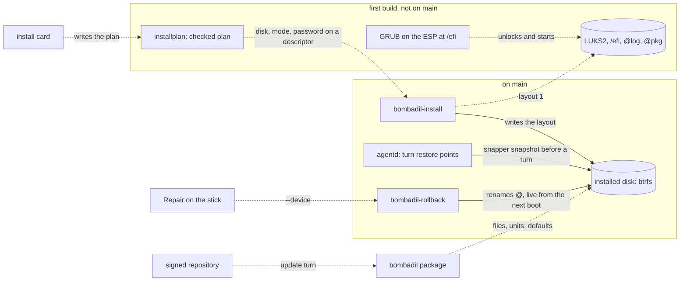

# The installed OS

> **Status:** In progress  
> **Code:** on `main` it builds on `iso/airootfs/usr/local/bin/bombadil-install`, `iso/airootfs/usr/local/bin/bombadil-rollback`, `iso/airootfs/usr/local/bin/bombadil-setup`, `iso/airootfs/usr/local/bin/bombadil-smoke`, `iso/packages.x86_64`, `iso/profiledef.sh`, `scripts/build-iso.sh`, `scripts/test-vm.sh`, `scripts/wsl-vm.sh`, `src/bombadil/snapshots.py`, `src/bombadil/agentd.py`, `src/bombadil/launcher.py`, `src/bombadil/sysmap.py`, `iso/airootfs/etc/greetd/config.toml`, `iso/airootfs/etc/systemd/` and `share/grub/bombadil/`. A first build of the piece is on an open draft pull request and is not on `main`: its files are named under "What it will do".  
> **Design:** [Bombadil, installed](../design/installed-os-brief.md), [the page](../design/pages/bombadil-installed.html)  
> **Verified:** 2026-10-01 against `main` at `969b80b`, the commit every `file:line` below is read at. The unmerged first build was read at `0863ba3` (its files and its diff against `main`); its tests and its VM modes were not run. `bombadil-install` on `main` has no encrypted layout, so the piece has not merged.

The installed OS is meant to be Bombadil as a system a person installs on a disk, the way they would install Debian or Windows, and not only as a system that runs from a USB stick. The stick will be the door: it will try, install, repair, reinstall and erase (designed), and everything that lasts will live on the installed machine. It exists because every earlier design (undo, updates as a turn, promises that survive a restart) assumes an installed machine, and because four choices cannot be changed by an update once strangers have installed: the disk layout, encryption, where GRUB lives, and which files a package owns. A first build of the layout, the encryption, a guided install and a refresh exists on the open pull request; the card, the packages, the repository, updates and repair are designed only.

## What it will do

**On `main` at `969b80b`.** `bombadil-install DISK [--yes]` is one bash script of 87 lines, run by hand from the live image. It makes a GPT disk with a 1 GiB ESP and a btrfs root with `@`, `@home` and `@snapshots` (`bombadil-install:11-19`), copies the running live system with `cp -ax /. /mnt/` (:27), mounts the ESP at `/boot` and copies the kernel from `/run/archiso/bootmnt` onto it (:34-36), so the kernel and its initramfs (:43-47) sit outside every restore point. It writes `fstab` so `/` mounts by the name `@` (:38-41), makes a snapper config `root` for `/` and none for `/home` (:59), and runs `grub-install --removable` (:68) without calling `efibootmgr`, which the brief reads as GRUB on the fallback path only. Only `.claude`, `.claude.json`, `.codex` and `.config/bombadil` come along from the live home (:73-77). The result has an empty password for `user` (:55), no encryption, UTC and the host name `bombadil` (:51-52), and no file under `/usr/share/bombadil` that a package owns (`scripts/build-iso.sh:11-23`). Nothing on `main` prunes restore points: `Snapshots.create` passes no cleanup algorithm (`src/bombadil/snapshots.py:43`). See [ISO and install](iso-and-install.md) and [restore points](restore-points.md).

**First build (open draft pull request, read at `0863ba3`, not on `main`).** It rewrites `bombadil-install` as sourced functions (1,045 lines) and adds `src/bombadil/installplan.py`, `src/bombadil/remote.py`, `install/carry.list`, `iso/airootfs/usr/local/bin/bombadil-grub-config`, `iso/airootfs/etc/grub.d/000_bombadil_screen`, boot entries `04` and `05`, and `tests/test_installer.py`, `tests/test_installplan.py` and `tests/test_remote.py`. It also changes `bombadil-rollback`, `bombadil-smoke`, `scripts/test-vm.sh`, `scripts/build-iso.sh`, `iso/packages.x86_64`, `iso/profiledef.sh`, `src/bombadil/launcher.py` and `bin/bombadil`.

- **Ways to run it.** With no argument at a terminal it asks which disk, a password twice, a time zone and a computer name, then the disk's name typed in full (`guided`). `--plan FILE [--password-fd N]` is what the card will run. `DISK [--yes]` still means no password and no encryption. `--refresh DISK` replaces the system and keeps the home. The word "install" in the pill opens the terminal flow in the details drawer, on the stick only (`launcher.py` `_install`).
- **Guards (`probe`).** It refuses without `/sys/firmware/efi`, the disk the stick started from (found from `archisosearchuuid` on the kernel command line, so it holds after copy-to-RAM), an install image, a disk with anything mounted and a disk under 16 GB. `installplan --disks` lists the disks and says why one is not offered. A disk with Windows on it is offered with a note and erased like any other once its name is typed; a refresh refuses it.
- **Layout.** GPT with the ESP at `/efi`. With a password, p2 is LUKS2 (argon2id, 256 MiB, 1000 ms) with three keyslots: the password, a random key file in the initramfs (pbkdf2) and a recovery key from `systemd-cryptenroll`; each is tried with `cryptsetup open --test-passphrase` before the filesystem is made. btrfs `@`, `@home`, `@snapshots`, `@log`, `@pkg`, and nested subvolumes in `@home` (`HOME_SUBVOLS`: `.cache`, `.local/state/bombadil`, `.claude`, `.codex`, `.local/share/claude`, `.config/chromium`, `.local/share/bombadil/browser`, `Projects`). `fstab` names disks by UUID and `/` by the subvolume name `@`.
- **Boot.** The kernel comes from the image's `/usr/lib/modules/*/vmlinuz` (`newest_kernel`) into `@/boot`, with a default and a fallback initramfs (`systemd`, `microcode`, `sd-encrypt`, and `/etc/crypttab` with `x-initrd.attach`). GRUB's core, modules and `grub.cfg` are on the ESP, written by `grub-install` twice (`--bootloader-id=Bombadil`, then `--removable`) and `bombadil-grub-config`, which also cuts GRUB's "Loading" lines. `000_bombadil_screen` and the font and `background.png` the installer puts on the ESP set the mark behind the password prompt. `verify` reads it back before the install is called done: every kernel module, `grub.cfg` opening the disk just locked, the key inside the initramfs.
- **Account and records.** One password for the disk and `user`; none leaves `user` without one, as on `main`. It writes `/var/lib/bombadil/install.json`, keeps the recovery key in `/var/lib/bombadil/recovery-key` (mode 600) and prints it once at the end of a guided install. snapper gets configs `root` and `home` (`TIMELINE_CREATE=no`, `NUMBER_CLEANUP=yes`, `NUMBER_LIMIT=30`), and `snapper-cleanup.timer`, `fstrim.timer` and `systemd-timesyncd` are enabled. Restore point one is "Bombadil <version>, as installed"; programs installed on the stick come as a second one from the stick's package cache (`replay_stick_packages`).
- **Refresh.** It reads and checks first (no `@`, `@home` or `@snapshots`, no home, Windows, or under 10 GB free is refused), renames `@` and `@snapshots` to `@.before-refresh-<stamp>` and `@snapshots.@.before-refresh-<stamp>`, copies a fresh system into `@`, keeps the name, zone, locale, keymap, machine id, Wi-Fi, SSH host keys, key file, recovery key and the account's password hash, lists the programs the old system had that the image lacks in `/var/lib/bombadil/refresh-<stamp>.txt`, and empties the ESP last without reformatting it. A stop before the boot files change puts the old system back; a later stop leaves `var/lib/bombadil/install-incomplete` and the next run starts over from the system still aside.
- **Undo from outside.** `bombadil-rollback --device DEV N|refresh` refuses a restore point with no `boot/vmlinuz-linux`, makes the snapshot beside `@` first and swaps it in with `mv --exchange` where the system has it. `refresh` puts back the newest whole `@.before-refresh-*` and keeps the other as `@.after-refresh-<stamp>`.
- **Stick and build.** `cryptsetup`, `amd-ucode`, `intel-ucode`, `parted` and `tmux` join the packages; `systemd-timesyncd` is enabled; `build-iso.sh` ships `install/` and a `VERSION` file, drops boot entries `02` to `09` unless `BOMBADIL_TEST_ENTRIES` is set, and reads the image back (`verify_image`); `profiledef.sh` drops `-E ztailpacking`, whose comment says erofs-utils 1.9.4 zeroed the last block of some files.
- **Remote control (outside the brief).** `bombadil remote [start [FOLDER]|status|url|show|stop]` runs Claude Code's `claude remote-control` in a detached `tmux` session `bombadil-remote`, in `~/Projects/remote`, with permission questions off and a `UserPromptSubmit` hook that runs `bombadil snapshot --hook` (a restore point labelled `turn: remote: <prompt>`). The word "remote" in the pill starts it.
- **Tests, written and not run here.** `tests/test_installer.py` sources the installer's functions with the disk tools replaced by shims. `scripts/test-vm.sh` gains `MODE=install-encrypted` and `MODE=refresh OLD_ISO=...` and attaches the ISO as a USB disk with 8 GB; `bombadil-smoke` gains the modes `install-encrypted`, `refresh` and `refreshed`, and `layout_checks`.
- **Where it differs from the brief.** `/etc/crypttab` instead of `/etc/crypttab.initramfs`; the password slot costs 1000 ms where the brief says 2 to 3 seconds; one more nested subvolume (`.local/share/bombadil/browser`); the old snapshots are `@snapshots.@.before-refresh-<stamp>`; the terminal flow asks four things where the card will ask two.

**Designed, with no code anywhere.** Each item is decided in the brief and marked designed.

- **Packages (designed).** A pacman package will own every file Bombadil ships: the tree at `/usr/share/bombadil`, commands in `/usr/bin` (`build-iso.sh:16` links ten today, including `bombadil-mail` and `bombadil-mail-host`), units in `/usr/lib/systemd`, with the two provider CLIs installed by `npm` as the one exception until piece 7. Defaults will live in `/usr` and change with each update, and the person's own settings will be short files that load them. A file another package owns will change by a numbered step, or by a drop-in. Existing installs will move by one refresh, never by `pacman --overwrite`.
- **The install card (designed).** The chip "Install on this computer" will open a card that draws the disks as bars, never offers the stick or a disk in use, and asks for one password. Time zone, keyboard, computer name and what comes along will be one line each with "change". The red button will name the disk, and no model call will sit between it and the disk: the agent may fill the card and never press it.
- **Months, not minutes (designed).** Restore points will be pruned (the brief decides 100 changed pairs; the first build sets 30). Timers will run for `paccache.timer` and a monthly scrub, and a daily timer will prune `@.undone-*` and `@.before-refresh-*` older than 14 days; `smartd` will run; swap will be zram; `agentd` and the bar will be user services that restart; the screen will lock on lid close; and greetd's `default_session` will ask for the password, so a crash or a logout never reopens an unlocked desktop. On `main` only the brain and mail units are user units (`Restart=on-failure`); `agentd`, the bar and `mako` start from `hyprland.lua:8-10`.
- **Repository, updates, repair (designed).** Stage one will be a local `/etc/pacman.d/bombadil.conf` with `SigLevel = Optional TrustAll` that nothing public reads; stage two a signed public repository on a release tagged `repo`, a `bombadil-keyring` package and a workflow that builds, signs and tests before it uploads (testing first, stable after 3 days with no revert). "update" will install the two keyrings, run `-Su` inside one restore point, then the numbered layout steps, and say what needs a restart; installing one program will not upgrade the system, which will change the prompt line at `src/bombadil/providers.py:45`. A start that fails twice will put itself back; a disk that will not start will get Repair, "Reinstall, keep my files" and Erase from the stick.

The thirteen pieces of the brief, in its order (effort S, M or L, from the brief):

| # | Piece | Effort | State |
|---|---|---|---|
| 1 | The disk that lasts: layout v1, and a refresh that keeps your home | L | In progress: the first build holds the layout, encryption, plan, guards, refresh, `--device` and the tests. Not built: `bombadil-vm refresh` still updates in place (`scripts/wsl-vm.sh:153`). Nothing of it was run here. |
| 2 | Bombadil as packages, with homes that follow its releases | M to L | Designed. |
| 3 | The install card | M to L | Designed. The first build has the terminal flow, `installplan --disks` and the pill word; no card, chip, `install` message or tool. It builds on `capture_disks`, `CardHost.qml` and `PasswordField.qml`, which are on `main`. |
| 4 | Months, not minutes | M | Designed. Turn numbers last across restarts on `main` (`src/bombadil/agentd.py:279`). The first build sets `NUMBER_LIMIT=30` and the cleanup timer; another unmerged branch (head `919a64e`) passes `--cleanup-algorithm number` and adds `Restart=always` units for `agentd`, the bar and `mako`. |
| 5 | Hardware on the stick | S to M | Designed. The first build adds microcode and `cryptsetup`; none of the brief's hardware packages is in `iso/packages.x86_64`. |
| 6 | The signed repository and the download page | M | Designed. There is no `.github/` directory and no workflow. |
| 7 | Updates as a turn | M | Designed (passenger piece 6, which no piece of work owns). |
| 8 | A start that fails puts itself back | M to L | Designed. |
| 9 | Next to Windows | L | Designed. It comes after whole-disk installs (the owner's answer to question 3, 30 Sep 2026). |
| 10 | Repair, reinstall and erase from the stick | M | Designed. Reinstall is piece 1's `--refresh`; `bombadil-rollback --device` is in the first build. |
| 11 | A copy somewhere else, and a move to another computer | L | Designed. |
| 12 | Secure Boot and TPM | M to L | Designed. |
| 13 | A Bombadil you carry | S | Designed. Most of it arrives with pieces 1 and 3; the first build records `target_kind` (`internal` or `usb`). |

## How it fits

Solid lines exist on `main`. Dotted lines are not on `main`: the plan, the layout, GRUB at `/efi` and `--device` are built in the first build, and the card, the package, the repository and Repair are designed only.

**What it builds on in `main`**

| Existing piece | What the design does there |
|---|---|
| `bombadil-install:11-22`, `:38-41`, `:59` | On `main`: GPT, `@`, `@home`, `@snapshots`, `fstab` by subvolume name, snapper config `root`. The first build adds `@log`, `@pkg`, nested home subvolumes and LUKS2 and keeps `bombadil-install DISK --yes` for `bombadil-smoke:397` and `scripts/wsl-vm.sh:108`. |
| `bombadil-install:34-36`, `:43-47`, `:64-69` | On `main`: ESP at `/boot`, kernel and a `default` initramfs preset on it, hidden GRUB menu, `grub-install --removable`. The first build moves the ESP to `/efi`, puts the kernel in `@/boot` and adds a named firmware entry and a `fallback` image. |
| `bombadil-install:51-56`, `:73-77`, `bombadil-setup:6`, `:24` | On `main`: UTC, host name `bombadil`, `passwd -d user`, `greetd NetworkManager` enabled, four carried paths (`bombadil-setup` writes `~/.config/bombadil/config.toml` when `agentd` is not running, `:6`, `:24`). The first build takes password, zone and name from a plan, enables timesyncd and reads the carry paths from `carry.list`. |
| `bombadil-rollback:7`, `:13-15` | Finds the root with `findmnt -no SOURCE /`, moves `@` to `@.undone-<time>`, snapshots `@snapshots/N/snapshot` into `@`. The first build adds `--device`; piece 8 will do the same rename in the initramfs. |
| `src/bombadil/snapshots.py:34`, `:43`, `:63` | `available` needs `snapper` and `/etc/snapper/configs/root`; `create` runs `snapper create --print-number`; `rollback` runs `bombadil-rollback`. Piece 4 will pass a cleanup algorithm. |
| `src/bombadil/agentd.py:277-279`, `:1303-1304`, `:1311`, `:1529`, `:2033` | The session id lives in memory (`:277`); the turn count is read back from `turns.jsonl` and the `turn` marker file at start (`:279`); the `setup` message carries `actions` (`:1303-1304`), which `_describe` builds (`:1311`) and `setup_action` answers (`:1529`); the restore point description is `turn:<n>: ` and the first 60 characters of the prompt (`:2033`). Piece 3 will add an `install` action and save `session_id`. |
| `src/bombadil/launcher.py:560`, `:613-614`, `:763`, `:794-799` | `undo.json` marker, "Undo starts once Bombadil is installed" when `/run/archiso` exists, `_battery`, and `_lock`, which needs `hyprlock`, in no package list. Pieces 1, 3 and 4 will use or change them. |
| `src/bombadil/sysmap.py:751`, `shell/CardHost.qml`, `share/qml/Bombadil/PasswordField.qml:15` | `capture_disks` reads `lsblk` (no `TRAN` or `PKNAME`) and `findmnt`; `CardHost` holds one picture; `PasswordField` hides text. Piece 3 will build the card on them. |
| `iso/airootfs/etc/greetd/config.toml`, `iso/airootfs/etc/sudoers.d/bombadil` | `initial_session` and `default_session` run `start-hyprland` (through `systemd-cat`) as `user`; `user` has `NOPASSWD: ALL`. Piece 4 will change `default_session`; the agent's sudo will stay. |
| `iso/airootfs/etc/skel/.config/hypr/hyprland.lua:7-16`, `:91`, `bombadil-install:54` | Copied into the home once, so an edit reaches no installed home. It starts `agentd`, the bar and `mako` with `exec_cmd` and restarts Mail's unit; line 91 sends Thunderbird's windows to a hidden workspace. The skel skill links (`.claude/skills`, `.agents/skills`) are copied once too. Piece 2 will turn the file into a stub that loads a shipped part. |
| `iso/airootfs/etc/systemd/user/bombadil-brain.service:13`, `bombadil-mail.service:14`, `iso/airootfs/etc/systemd/system/bombadil-brain-watch.service:19` | The units on the image, all `Restart=on-failure`; the user units set `StartLimitIntervalSec=0`. Piece 2 will move their `ExecStart` from `/usr/local/bin` to `/usr/bin` and give them to the package. |
| `src/bombadil/brain/watch.py:8-19`, `tests/vm/btrfs-kernel.sh:1-5` | The watcher mounts the top level (`subvolid=5`) privately and maps `/@home` back to `/home`, so nested subvolumes under `/home` are covered; the VM test lays out `@`, `@home` and `@snapshots` as `bombadil-install` does on `main`, plus a nested `@home/user/Projects`. |
| `scripts/build-iso.sh:11-23`, `iso/pacman.conf`, `iso/airootfs/etc/systemd/system/pacman-init.service:7-8` | The tree is copied into the image, ten commands are linked from `/usr/local/bin`, `npm` fills `/usr`; `[core]` and `[extra]` only; a bare `pacman-key --populate`. Pieces 2 and 6 will add `[bombadil]` and a keyring. |
| `iso/packages.x86_64:4-10`, `iso/profiledef.sh:10` | `grub`, `efibootmgr`, `btrfs-progs`, `snapper` and `linux-firmware` are listed; microcode and `cryptsetup` are not; boot is UEFI only. `thunderbird` is listed (`:51`), and `iso/airootfs/etc/thunderbird/policies/policies.json` is a file Bombadil ships in `/etc`. |
| `iso/efiboot/loader/entries/`, `scripts/test-vm.sh:34`, `:74`, `scripts/wsl-vm.sh:91` | Entry 03 installs to `/dev/vda` without asking (`bombadil.smoke=install`, run at `bombadil-smoke:397`); the ISO is a `-cdrom`, and the test VMs boot OVMF with no persisted variables (a read-only code image at `test-vm.sh:34`, `-bios` at `wsl-vm.sh:91`). `wsl-vm.sh refresh` is an in-place update, not the installer's `--refresh`. |
| `share/grub/bombadil/` | Theme and background exist; nothing on `main` installs them. |

## Interfaces it adds (planned)

| Name | What it is | Status |
|---|---|---|
| `bombadil-install --plan FILE [--password-fd N]` | JSON plan with the keys `disk`, `mode`, `timezone`, `timezone_source`, `keymap`, `hostname`, `carry`, `encrypt`, `kind`; `src/bombadil/installplan.py` refuses a `password` key, unknown keys and a carry path not on `carry.list`; the password never goes in argv or the plan | first build |
| `bombadil-install` with no argument, `python3 -m bombadil.installplan --disks` | The guided flow at a terminal (`bombadil-install DISK [--yes]` stays as on `main`); the list of disks and why one is not offered | first build |
| `bombadil-install --refresh DISK [--yes] [--password-fd N]` | A fresh system under the same home; old `@` and `@snapshots` kept as `@.before-refresh-<stamp>` and `@snapshots.@.before-refresh-<stamp>`; extra programs in `/var/lib/bombadil/refresh-<stamp>.txt` | first build |
| `bombadil-rollback --device DEV N\|refresh` | For the stick; refuses a snapshot with no `boot/vmlinuz-linux` | first build |
| `/var/lib/bombadil/install.json` | `layout`, `date`, `image_version`, `mode`, `encrypted`, `target_kind`, `timezone`, `timezone_source` (`detected`, `chosen`, `unset`), `packages_brought`, `recovery_key_pending`, `kept_aside` | first build |
| `/var/lib/bombadil/recovery-key`, `/var/lib/bombadil/install-incomplete` | Recovery key (mode 600, until the first-start card has shown it, which does not exist); marker of an install that stopped | first build |
| `/usr/share/bombadil/install/carry.list`, `/usr/share/bombadil/VERSION` | One home path per line, read by the installer; the image's date and commit | first build |
| `/etc/mkinitcpio.conf.d/bombadil.conf`, `/etc/crypttab`, `/etc/cryptsetup-keys.d/root.key`, `/etc/default/grub.d/bombadil.cfg` | Initramfs, unlock and GRUB screen files written by the installer | first build |
| `bombadil-grub-config`, `/etc/grub.d/000_bombadil_screen` | Writes `/efi/grub/grub.cfg` (`BOMBADIL_GRUB_CFG` overrides) and cuts GRUB's "Loading" lines; the font and picture before the password prompt | first build |
| `BOMBADIL_TEST_ENTRIES=1`, `MODE=install-encrypted`, `MODE=refresh OLD_ISO=...`, `BOMBADIL_INSTALL_LEAVE_MOUNTED`, `BOMBADIL_INSTALL_GRUB_SERIAL` | Test boot entries, `scripts/test-vm.sh` modes and installer switches for the VM tests (`MODE=update` is planned) | first build |
| `bombadil remote ...`, `bombadil snapshot [--hook]`, the words `remote` and `install` | Remote control and a restore point by hand or from a hook; the pill words | first build |
| `{"type": "install", "plan": ...}`, setup action id `install`, `install_card(disk, keep_windows, size)` | The card's socket message (`agentd` runs `!sudo bombadil-install --plan ...`) and the `os-mcp` tool that fills the card and cannot press it | planned |
| `where()` in `src/bombadil/system.py`, `~/.local/state/bombadil/session.json` | Returns "live", "installed" or "dev"; `agentd`'s `session_id`, kept across restarts and the install | planned |
| `packaging/bombadil/PKGBUILD`, `bombadil.install`, `/usr/share/bombadil/migrate/NNN-*.sh` | The package, and numbered steps for files other packages own | planned |
| `src/bombadil/homefix.py`, `~/.local/state/bombadil/home.json`, `hyprland.lua.before-split` | Numbered home steps run by `agentd`, their record, the old file kept aside | planned |
| `/etc/pacman.d/bombadil.conf`, `bombadil-keyring` | Repository servers and keys | planned |
| `bombadil-boot-ok.service`, `boot_ok` in `grubenv`, kernel argument `bombadil.rollback=N` | Bad-start rollback | planned |
| `--cleanup-algorithm number` in `Snapshots.create`; `bombadil-agentd.service`, `bombadil-shell.service`, `mako.service.d/restart.conf` | Retention and restarting user services; another unmerged branch (head `919a64e`) holds both | not on `main` |

## Principles it keeps

- [Full access with undo](../principles.md#full-access-with-undo): the password will be no wall between the agent and the machine (`user` keeps `NOPASSWD: ALL`), and undo will take the kernel back. The trap is a layout that leaves the kernel and initramfs outside the root undo swaps (as the ESP at `/boot` does on `main`), or that leaves logs or the package cache inside it.
- [Recovery without the broken part](../principles.md#recovery-without-the-broken-part): undo, bad-start rollback and Repair will need no network, model or desktop; `bombadil-rollback --device` already needs none. The trap is a Repair that calls `agentd`, or a rollback list kept in a file rewritten on the FAT ESP.
- [Nothing runs unseen](../principles.md#nothing-runs-unseen): updates will happen on the person's word, as a turn, with a receipt. The trap is a timer that installs updates, or a card step that erases a disk without naming it.
- [Plain files stay the truth](../principles.md#plain-files-stay-the-truth): `install.json`, `carry.list` and short user files that load shipped defaults are the records. The trap is state only a database holds, or an update that rewrites a file in the person's home.
- [Records before models](../principles.md#records-before-models): the disk list reads `lsblk` (`installplan --disks`) and the card's probe will add `blkid` and the battery, with no model. The trap is a model call on the path that erases a disk.
- [Stupidly simple](../principles.md#stupidly-simple): the card will ask two questions, which disk and one password. The trap is a partition editor or a settings screen, or carrying the terminal flow's four questions over to the card.

## Before you build on it

- **Order (the brief).** Pieces 1 and 2 first, because they are what no later update can fix (the disk, and the path every later fix travels). Pieces 3 to 6 must all land before any public download. Until then only the owner installs, through the terminal and a VM. See [build these first](../design/installed-os-brief.md#build-these-first) and [after these, in order](../design/installed-os-brief.md#after-these-in-order).
- **Decided by the owner on 30 Sep 2026.** A locked disk by default, a full Bombadil on a USB drive as well as the stick, and whole disks first with next to Windows after.
- **Still open.** The geo-IP service, whether the Claude Code binary may be redistributed, the ISO staying under 4 GiB, and the clock when travelling. The brief marks the Argon2 cost (256 MiB, 1000 ms in the first build), the offline replay of the stick's packages and GRUB opening the slot as unmeasured or untested; the first build's VM modes are written and were not run here.
- **Known gaps of the first build.** It sets `NUMBER_LIMIT=30` but `Snapshots.create` passes no `--cleanup-algorithm`, so no turn's restore point is marked for cleanup (snapper deletes only those made with an algorithm: the brief's reading, not run). Nothing prunes `@.undone-*` or `@.before-refresh-*`, although the guided refresh says the old system is kept for 14 days. Nothing deletes `/var/lib/bombadil/recovery-key`. The `theme.txt` of `share/grub/bombadil/` is installed by neither `main` nor the first build.
- **Check first.** Merge order: another unmerged branch (head `919a64e`) edits `bombadil-install` too, and the first build already has its kernel lookup. A trial merge of the two heads (`git merge-tree`) conflicts in `bin/bombadil`, `tests/test_iso_profile.py` and `README.md`. Then run the brief's VM checks (`findmnt -R /run/archiso` on a USB-attached ISO with 8 GB, GRUB opening an Argon2 slot, the offline replay) and a refresh from an older image.
- **Do not break.** `bombadil-install DISK --yes`, which `bombadil-smoke` and `scripts/wsl-vm.sh` run. The name-based mount of `/` and the `@` swap in `bombadil-rollback`. `tests/test_iso_profile.py` and `tests/test_boot_console.py`, which read the installer by text on `main` (the GRUB loop before `grub-install`, `cp -ax /. /mnt/` before `mkdir -p /mnt/boot`) and which the first build edits; the first also asserts the `-Syu` prompt line (`tests/test_iso_profile.py:28-29`) that piece 7 will change. `bombadil.smoke` as the last argument of entry 02, which `scripts/wsl-vm.sh:97` edits. The account `user` and `/home/user`.

## When it ships

This page is then replaced by the full piece page in the skeleton of [documenting your piece](../contributing/documenting.md), the [roadmap](../roadmap.md) row is updated and the brief gets its status line. The pieces ship one by one, and until all of them have, each one that ships changes the status and the tables here.
