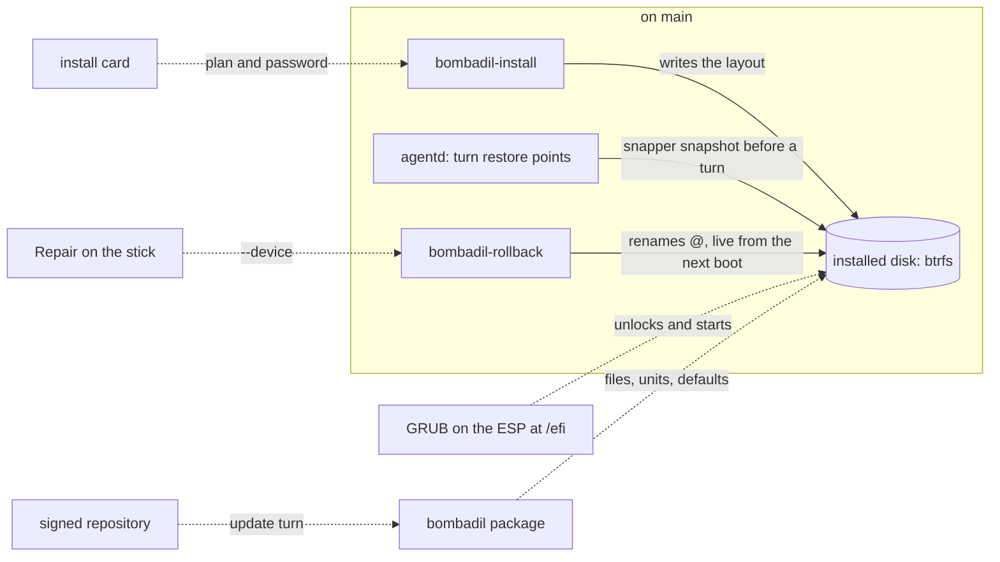

# The installed OS

> **Status:** Designed  
> **Code:** none of this is on `main`. It builds on `iso/airootfs/usr/local/bin/bombadil-install`, `iso/airootfs/usr/local/bin/bombadil-rollback`, `iso/airootfs/usr/local/bin/bombadil-smoke`, `iso/packages.x86_64`, `iso/profiledef.sh`, `scripts/build-iso.sh`, `scripts/test-vm.sh`, `scripts/wsl-vm.sh`, `src/bombadil/snapshots.py`, `src/bombadil/agentd.py`, `src/bombadil/launcher.py`, `src/bombadil/sysmap.py`, `iso/airootfs/etc/greetd/config.toml` and `share/grub/bombadil/`. Planned new files, written nowhere yet: `packaging/bombadil/PKGBUILD`, `packaging/bombadil/bombadil.install`, `src/bombadil/homefix.py`, `src/bombadil/system.py` and `tests/test_homefix.py`.  
> **Design:** [Bombadil, installed](../design/installed-os-brief.md), [the page](../design/pages/bombadil-installed.html)  
> **Verified:** 2026-10-01 against `main` at `a30ebc8`, the commit every `file:line` below is read at: no code of this piece is on `main`. An unmerged branch, read at `919a64e`, holds three small parts of it (the installer's kernel lookup, restore point retention, and user services that restart). Its diff against `main` and its notes on the user services were read, and its tests were not run. The status stays Designed because the layout, encryption, packages and card have no code anywhere.

The installed OS is meant to be Bombadil as a system a person installs on a disk, the way they would install Debian or Windows, and not only as a system that runs from a USB stick. The stick will be the door: it will try, install, repair, reinstall and erase (designed), and everything that lasts will live on the installed machine. It exists because every earlier design (undo, updates as a turn, promises that survive a restart) assumes an installed machine, and because four choices cannot be changed by an update once strangers have installed: the disk layout, encryption, where GRUB lives, and which files a package owns.

## What it will do

**On `main` at `a30ebc8`.** `bombadil-install DISK [--yes]` is one bash script, run by hand from the live image. It makes a GPT disk with a 1 GiB ESP and a btrfs root with `@`, `@home` and `@snapshots` (`bombadil-install:11-19`), copies the running live system with `cp -ax /. /mnt/` (:27), mounts the ESP at `/boot` and copies the kernel from `/run/archiso/bootmnt` onto it (:34-36), so the kernel and its initramfs (:43-47) sit outside every restore point. It writes `fstab` so `/` mounts by the name `@` (:38-41), makes a snapper config `root` for `/` and none for `/home` (:59), and runs `grub-install --removable` (:68) without calling `efibootmgr`, which the brief reads as GRUB on the fallback path only. Only `.claude`, `.claude.json`, `.codex` and `.config/bombadil` come along from the live home (:73-77). The result has an empty password for `user` (:55), no encryption, UTC and the host name `bombadil` (:51-52), and no file under `/usr/share/bombadil` that a package owns (`scripts/build-iso.sh:11-23`). Nothing on `main` prunes restore points. See [ISO and install](iso-and-install.md) and [restore points](restore-points.md).

**The designed system.** Each item is decided in the brief, is written in the future tense here because it has no code on `main`, and is marked designed.

- **Encrypted layout (designed).** The disk will be GPT with a 1 GiB ESP at `/efi`, then LUKS2 with btrfs inside when a password is set. Subvolumes will be `@`, `@home`, `@snapshots`, plus `@log` and `@pkg` beside `@` because undo renames `@`, and nested subvolumes inside `@home` for what home restore points skip (`.cache`, `.claude`, `.codex`, `Projects` and others), with a snapper config `home`. Three keyslots: the password GRUB opens, a key file in the initramfs so the password is typed once, and a recovery key shown once. GRUB's core, modules, `grub.cfg` and `grubenv` will live on the ESP and never roll back; kernel, initramfs and microcode will live in `@/boot`, so a kernel update goes back with undo. The owner decided on 30 Sep 2026 that a fresh install locks the disk by default.
- **Packages (designed).** A pacman package will own every file Bombadil ships: the tree at `/usr/share/bombadil`, commands in `/usr/bin`, units in `/usr/lib/systemd`, with the two provider CLIs installed by `npm` as the one exception until piece 7. Defaults will live in `/usr` and change with each update, and the person's own settings will be short files that load them. A file another package owns will change by a numbered step, or by a drop-in where one exists. Existing installs will move by one refresh, never by `pacman --overwrite`.
- **The install card (designed).** The chip "Install on this computer" will open a card that draws the disks as bars, never offers the stick or a disk in use, and asks for one password. Time zone, keyboard, computer name and what comes along will be one line each with "change". The red button will name the disk, and no model call will sit between it and the disk: the agent may fill the card and never press it.
- **Months, not minutes (designed, in part built on an unmerged branch).** Restore points will be pruned (the brief decides 100 changed pairs, the branch keeps 30). Timers will run for the package cache (`paccache.timer`), `fstrim` and a monthly scrub, and a daily timer will prune `@.undone-*` and `@.before-refresh-*` older than 14 days; `smartd` will run as a service; swap will be zram; `agentd` and the bar will be user services that restart; the screen will lock on lid close; and greetd's `default_session` will ask for the password, so a crash or a logout never reopens an unlocked desktop.
- **Repository (designed).** Stage one will be a local `/etc/pacman.d/bombadil.conf` with `SigLevel = Optional TrustAll` that nothing public reads. Stage two will be a signed public repository on a release tagged `repo`, a `bombadil-keyring` package, and a workflow that builds, signs and tests before it uploads (testing first, stable after 3 days with no revert).
- **Updates as a turn (designed).** "update" will install the two keyrings first, then run `-Su` (Arch's packages and Bombadil's own release) inside one restore point, then the numbered layout steps, then say what needs a restart. Installing one program will not upgrade the system, which will change the prompt line at `src/bombadil/providers.py:45`.
- **Repair (designed).** A start that fails twice will put itself back and say which change it undid. A disk that will not start will get the stick's card with Repair, "Reinstall, keep my files" and Erase; Repair will show the breaking turn in red and offer "Go back to before that".
- **Built on an unmerged branch.** The installer takes the kernel from `/usr/lib/modules/*/vmlinuz` of the system it copies and still writes it to the ESP at `/boot`; the brief read, in archiso's hook, that copy-to-RAM unmounts the stick before the kernel is copied, and did not reproduce it. `Snapshots.create` passes `--cleanup-algorithm number`, and the installer sets `TIMELINE_CREATE=no NUMBER_CLEANUP=yes NUMBER_LIMIT=30` and enables `snapper-cleanup.timer`. `agentd` and the bar are given user units with `Restart=always`, and `mako`'s own unit gets a drop-in that sets the same. None of this is on `main`.

The thirteen pieces of the brief, in its order (effort S, M or L, from the brief):

| # | Piece | Effort | State |
|---|---|---|---|
| 1 | The disk that lasts: layout v1, and a refresh that keeps your home | L | Designed. The kernel lookup, its first commit, is built on an unmerged branch. |
| 2 | Bombadil as packages, with homes that follow its releases | M to L | Designed. |
| 3 | The install card | M to L | Designed. It builds on `capture_disks`, `CardHost.qml` and `PasswordField.qml`, which are on `main`. |
| 4 | Months, not minutes | M | Designed. Retention (30, not 100) and restarting user services are built on an unmerged branch. Turn numbers already last across restarts on `main` (`src/bombadil/agentd.py:187`). |
| 5 | Hardware on the stick | S to M | Designed. No package of it is in `iso/packages.x86_64`. |
| 6 | The signed repository and the download page | M | Designed. There is no `.github/` directory and no workflow. |
| 7 | Updates as a turn | M | Designed (passenger piece 6, which no piece of work owns). |
| 8 | A start that fails puts itself back | M to L | Designed. |
| 9 | Next to Windows | L | Designed. It comes after whole-disk installs (the owner's answer to question 3, 30 Sep 2026). |
| 10 | Repair, reinstall and erase from the stick | M | Designed. Reinstall is piece 1's `--refresh`. |
| 11 | A copy somewhere else, and a new laptop | L | Designed. |
| 12 | Secure Boot and TPM | M to L | Designed. |
| 13 | A Bombadil you carry | S | Designed. Most of it arrives with pieces 1 and 3. |

## How it fits

Solid lines exist on `main`. Dotted lines are designed only, and the disk the design draws is encrypted with more subvolumes than `main` makes.

**What it builds on in `main`**

| Existing piece | What the design does there |
|---|---|
| `bombadil-install:11-22`, `:38-41`, `:59` | On `main`: GPT, `@`, `@home`, `@snapshots`, `fstab` by subvolume name, snapper config `root`. Piece 1 will split the script into named functions, add `@log`, `@pkg`, nested home subvolumes and LUKS2, and keep `bombadil-install DISK --yes` for `bombadil-smoke:305` and `scripts/wsl-vm.sh`. |
| `bombadil-install:34-36`, `:43-47`, `:64-69` | On `main`: ESP at `/boot`, kernel and a `default` initramfs preset on it, hidden GRUB menu, `grub-install --removable`. Piece 1 will move the ESP to `/efi`, put the kernel in `@/boot`, and add a named firmware entry and a `fallback` image. |
| `bombadil-install:51-56`, `:73-77` | On `main`: UTC, host name `bombadil`, `passwd -d user`, `greetd NetworkManager` enabled, four carried paths. Piece 1 will take the password, zone and name from a plan, enable timesyncd and read the carry paths from `carry.list`. |
| `bombadil-rollback:7`, `:13-15` | Finds the root with `findmnt -no SOURCE /`, moves `@` to `@.undone-<time>`, snapshots `@snapshots/N/snapshot` into `@`. Piece 1 will add `--device`; piece 8 will do the same rename in the initramfs. |
| `src/bombadil/snapshots.py:34`, `:43`, `:63` | `available` needs `snapper` and `/etc/snapper/configs/root`; `create` runs `snapper create --print-number`; `rollback` runs `bombadil-rollback`. Piece 4 will pass a cleanup algorithm. |
| `src/bombadil/agentd.py:185-187`, `:898-899`, `:1285` | The session id lives in memory (`:185`); the turn count is read back from `turns.jsonl` and a `turn` marker file at start (`:187`); the `setup` message carries `actions` (`:898-899`); the restore point description is `turn:<n>: ` followed by the first 60 characters of the prompt (`:1285`). Piece 3 will add an `install` action and save `session_id`. |
| `src/bombadil/launcher.py:457`, `:494`, `:643`, `:674` | `undo.json` marker, "Undo starts once Bombadil is installed" when `/run/archiso` exists, `_battery`, and `_lock`, which needs `hyprlock`, in no package list. Pieces 1, 3 and 4 will use or change them. |
| `src/bombadil/sysmap.py:751`, `shell/CardHost.qml`, `share/qml/Bombadil/PasswordField.qml` | `capture_disks` reads `lsblk` (no `TRAN` or `PKNAME`) and `findmnt`; `CardHost` holds one picture; `PasswordField` hides text. Piece 3 will build the card on them. |
| `iso/airootfs/etc/greetd/config.toml`, `iso/airootfs/etc/sudoers.d/bombadil` | `initial_session` and `default_session` run `start-hyprland` as `user`; `user` has `NOPASSWD: ALL`. Piece 4 will change `default_session`; the agent's sudo will stay. |
| `iso/airootfs/etc/skel/.config/hypr/hyprland.lua`, `bombadil-install:54` | Copied into the home once, so an edit reaches no installed home. Piece 2 will turn it into a stub that loads a shipped part. |
| `scripts/build-iso.sh:11-23`, `iso/pacman.conf`, `iso/airootfs/etc/systemd/system/pacman-init.service` | The tree is copied into the image, commands are linked from `/usr/local/bin`, `npm` fills `/usr`; `[core]` and `[extra]` only; a bare `pacman-key --populate`. Pieces 2 and 6 will add `[bombadil]` and a keyring. |
| `iso/packages.x86_64`, `iso/profiledef.sh:10` | `grub`, `efibootmgr`, `btrfs-progs`, `snapper` and `linux-firmware` are listed; microcode and `cryptsetup` are not; boot is UEFI only. Pieces 1 and 5 will add packages. |
| `iso/efiboot/loader/entries/`, `scripts/test-vm.sh:34`, `:74`, `scripts/wsl-vm.sh:91` | Entry 03 installs to `/dev/vda` without asking (`bombadil-smoke:305`); the ISO is a `-cdrom`, and the test VMs boot OVMF with no persisted variables (a read-only code image at `test-vm.sh:34`, `-bios` at `wsl-vm.sh:91`). `wsl-vm.sh refresh` is an in-place update, not the installer's `--refresh`. |
| `share/grub/bombadil/` | Theme and background exist; nothing installs them. |

## Interfaces it adds (planned)

| Name | What it is | Status |
|---|---|---|
| `bombadil-install --plan FILE [--password-fd N]` | JSON plan (disk, time zone and its source, keymap, host name, carry list, fresh or refresh); the password never goes in argv or the plan | planned |
| `bombadil-install --refresh` | A fresh system under the same home; old `@` and `@snapshots` kept as `@.before-refresh-<date>` and `@snapshots.before-refresh-<date>`; extra packages listed in `/var/lib/bombadil/refresh-<date>.txt` | planned |
| `bombadil-rollback --device DEV` | For the stick; also refuses a snapshot with no `boot/vmlinuz-linux` | planned |
| `/var/lib/bombadil/install.json` | Date, image version, `layout: 1`, `encrypted`, `timezone_source` (`detected`, `chosen`, `unset`), packages brought, `recovery_key_pending` | planned |
| `/var/lib/bombadil/recovery-key` | Mode 600, until the first-start card has shown it | planned |
| `/usr/share/bombadil/install/carry.list` | One home path per line, read by the installer | planned |
| `{"type": "install", "plan": ...}`, setup action id `install` | The card's socket message; `agentd` runs `!sudo bombadil-install --plan ...` | planned |
| `install_card(disk, keep_windows, size)` | `os-mcp` tool that fills the card and cannot press it | planned |
| `where()` in `src/bombadil/system.py` | Returns "live", "installed" or "dev" | planned |
| `~/.local/state/bombadil/session.json` | `agentd`'s `session_id`, kept across restarts and the install | planned |
| `packaging/bombadil/PKGBUILD`, `bombadil.install`, `/usr/share/bombadil/migrate/NNN-*.sh` | The package, and numbered steps for files other packages own | planned |
| `src/bombadil/homefix.py`, `~/.local/state/bombadil/home.json`, `hyprland.lua.before-split` | Numbered home steps run by `agentd`, their record, the old file kept aside | planned |
| `/etc/pacman.d/bombadil.conf`, `bombadil-keyring` | Repository servers and keys | planned |
| `/etc/mkinitcpio.conf.d/bombadil.conf`, `/etc/crypttab.initramfs`, `/etc/cryptsetup-keys.d/root.key` | Initramfs and unlock files | planned |
| `bombadil-boot-ok.service`, `boot_ok` in `grubenv`, kernel argument `bombadil.rollback=N` | Bad-start rollback | planned |
| `BOMBADIL_TEST_ENTRIES=1`, `MODE=install-encrypted`, `MODE=refresh OLD_ISO=...`, `MODE=update` | Test boot entries and `scripts/test-vm.sh` modes | planned |
| `--cleanup-algorithm number`, `NUMBER_LIMIT=30`, `snapper-cleanup.timer` | Retention in `Snapshots.create` and the installer | on the branch |
| `bombadil-agentd.service`, `bombadil-shell.service`, `mako.service.d/restart.conf` | User units with `Restart=always` | on the branch |

## Principles it keeps

- [Full access with undo](../principles.md#full-access-with-undo): the password will be no wall between the agent and the machine, and undo will take the kernel back. The trap is a layout that leaves the kernel and initramfs outside the root undo swaps (as the ESP at `/boot` does on `main`), or that leaves logs or the package cache inside it.
- [Recovery without the broken part](../principles.md#recovery-without-the-broken-part): undo, bad-start rollback and Repair will need no network, model or desktop. The trap is a Repair that calls `agentd`, or a rollback list kept in a file rewritten on the FAT ESP.
- [Nothing runs unseen](../principles.md#nothing-runs-unseen): updates will happen on the person's word, as a turn, with a receipt. The trap is a timer that installs updates, or a card step that erases a disk without naming it.
- [Plain files stay the truth](../principles.md#plain-files-stay-the-truth): `install.json`, `carry.list` and short user files that load shipped defaults will be the records. The trap is state only a database holds, or an update that rewrites a file in the person's home.
- [Records before models](../principles.md#records-before-models): the card's probe will read `lsblk`, `blkid` and the battery and answer "which disk" with no model. The trap is a model call on the path that erases a disk.
- [Stupidly simple](../principles.md#stupidly-simple): the card will ask two questions, which disk and one password. The trap is a partition editor or a settings screen.

## Before you build on it

- **Order (the brief).** Pieces 1 and 2 first, because they are what no later update can fix (the disk, and the path every later fix travels). Pieces 3 to 6 must all land before any public download. Until then only the owner installs, through the terminal and a VM. See [build these first](../design/installed-os-brief.md#build-these-first) and [after these, in order](../design/installed-os-brief.md#after-these-in-order).
- **Decided by the owner on 30 Sep 2026.** A locked disk by default, a full Bombadil on a USB drive as well as the stick, and whole disks first with next to Windows after.
- **Still open.** The geo-IP service, whether the Claude Code binary may be redistributed, the ISO staying under 4 GiB, and the clock when travelling. The brief marks the Argon2 memory cost, the offline replay of the stick's packages and `SigLevel` in an included file as unmeasured or untested.
- **Check first.** Merge the other unmerged work that edits `bombadil-install`, then run the brief's VM checks (`findmnt -R /run/archiso` on a USB-attached ISO with 8 GB, GRUB opening an Argon2 slot, the offline replay) before piece 1.
- **Do not break.** `bombadil-install DISK --yes`, which `bombadil-smoke` and `scripts/wsl-vm.sh` run. The name-based mount of `/` and the `@` swap in `bombadil-rollback`. `tests/test_iso_profile.py` and `tests/test_boot_console.py`, which read the installer by text (the GRUB loop before `grub-install`, `cp -ax /. /mnt/` before `mkdir -p /mnt/boot`); the first also asserts the `-Syu` prompt line that piece 7 will change. `bombadil.smoke` as the last argument of entry 02, which `scripts/wsl-vm.sh:97` edits. The account `user` and `/home/user`.

## When it ships

This page is then replaced by the full piece page in the skeleton of [documenting your piece](../contributing/documenting.md), the [roadmap](../roadmap.md) row is updated and the brief gets its status line. The pieces ship one by one, and until all of them have, each one that ships changes the status and the tables here.
