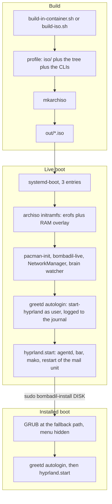
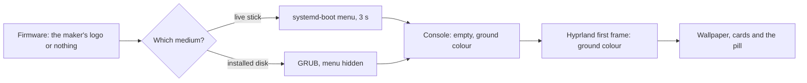
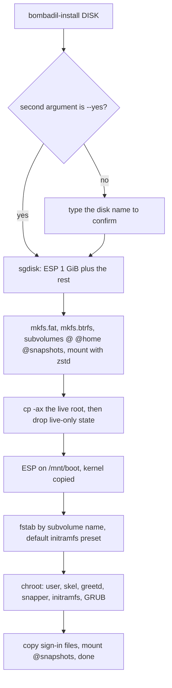
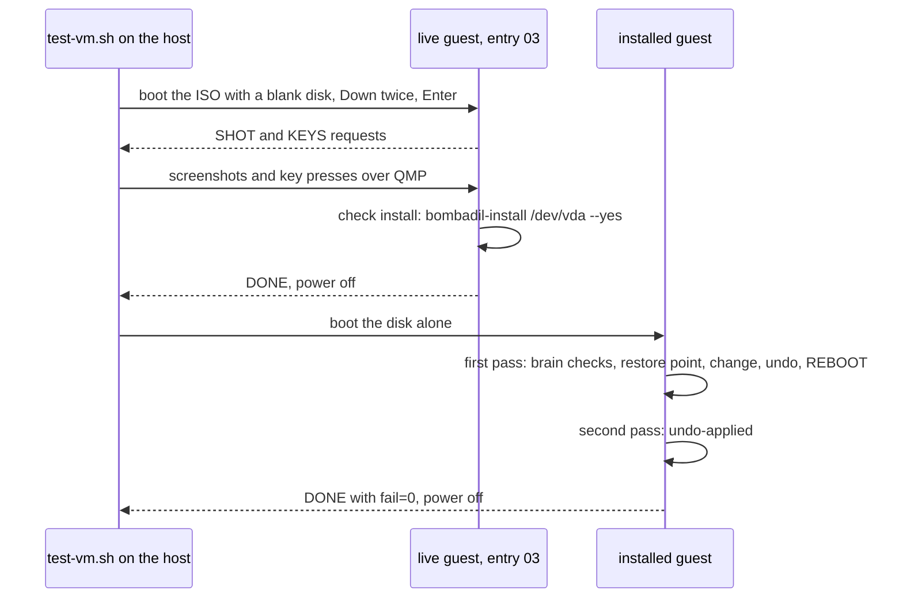

# ISO and install

> **Status:** Shipped  
> **Code:** `iso/profiledef.sh`, `iso/packages.x86_64`, `iso/pacman.conf`, `iso/airootfs/`, `iso/efiboot/loader/`, `iso/airootfs/etc/default/grub.d/zz-bombadil-console.cfg`, `iso/airootfs/etc/systemd/user/bombadil-mail.service`, `iso/airootfs/etc/thunderbird/policies/policies.json`, `iso/airootfs/usr/local/bin/bombadil-install`, `iso/airootfs/usr/local/bin/bombadil-setup`, `iso/airootfs/usr/local/bin/bombadil-smoke`, `iso/airootfs/usr/local/bin/bombadil-rollback`, `scripts/build-iso.sh`, `scripts/build-in-container.sh`, `scripts/console-palette.py`, `scripts/make-wallpaper.py`, `scripts/qmp.py`, `scripts/run-vm.sh`, `scripts/test-vm.sh`, `scripts/dev-session.sh`, `scripts/wsl-vm.sh`, `scripts/bombadil-vm.cmd`, `scripts/vm-tools/update-in-place`, `share/grub/bombadil/`, `tests/test_iso_profile.py`, `tests/test_boot_console.py`, `tests/vm/btrfs-kernel.sh`  
> **Design:** [Foundation choices, sections 1 to 3](../design/foundation-choices.md#1-base-distro--arch); [Boot and the wallpaper](../design/boot-and-wallpaper.md) (the reasoning for the quiet console, with before and after pictures); [Bombadil, installed](../design/installed-os-brief.md) (Designed: the redesign of the installer and the disk, not built); [Mail, in Bombadil's own view](../design/everyday-work-brief.md#1-mail-in-bombadils-own-view) (why Thunderbird is on the image)  
> **Verified:** 2026-10-01 against `main` at `969b80b`

The ISO is an archiso profile in `iso/`. `scripts/build-iso.sh` fills it with the repository's own tree and the two provider CLIs and hands it to `mkarchiso`. The image boots a live Hyprland session that is also the installer's source: `bombadil-install` copies the running system onto a GPT disk with a btrfs root, so that undo has subvolumes to swap from the first install. From the boot loader to the desk the console is set to print nothing and to use the design system's ground colour ([Boot and the console](#boot-and-the-console-from-power-on-to-the-desk)). The image also carries what [Mail](mail.md) needs on the machine: Thunderbird, its policy file, a user unit and a skill ([What the image adds for mail](#what-the-image-adds-for-mail)). A kernel argument turns the same image into a self-test, `bombadil-smoke`, which the VM scripts judge from the serial log.

[Foundation choices](../design/foundation-choices.md#1-base-distro--arch) gives the reasons for the shape: Arch, because the agent works best with a plain, imperative system (`pacman -S`, edit a file, restart a service); btrfs with snapper as the undo that stands in for a permission wall; Hyprland first; and a VM as the first target with an ISO that also boots real hardware.

Shipped means the build, the live boot, the quiet console, the installer as coded on `main`, the smoke test and the QEMU and Windows launchers, checked by `tests/test_iso_profile.py`, `tests/test_boot_console.py` and by the smoke test in a VM. The redesign of the installed system (encryption, another disk layout, Bombadil as packages) is Designed and lives in the brief; [the last section of How it works](#how-the-installer-on-main-differs-from-the-redesign) lists the differences.

On this page a reference such as `bombadil-install:68` or `bombadil-smoke:397` means line 68 of `iso/airootfs/usr/local/bin/bombadil-install` or line 397 of `iso/airootfs/usr/local/bin/bombadil-smoke`; the same holds for `bombadil-setup` and `bombadil-rollback`. Every other path is relative to the repository root, unless a table says otherwise.

## How it works

### From the repository to an installed machine



| Stage | What happens | Section below |
|---|---|---|
| Build | The profile is assembled in a work directory and `mkarchiso` writes one ISO to `out/`. | The build |
| Live boot | UEFI firmware starts systemd-boot, archiso mounts the image with a RAM overlay, systemd creates the session user, greetd logs it in, Hyprland starts `agentd` and the bar. Nothing on the live system survives power-off. | Boot flow |
| Quiet start | From the boot loader to the desk the console is set to print nothing and to use the desk's ground colour. | Boot and the console |
| First run | With no provider chosen, `agentd` asks in the pill which AI to use and signs in through the browser panel. | Boot flow |
| Install | `bombadil-install DISK` wipes the disk, copies the live system and its sign-in onto btrfs, and installs GRUB. | What `bombadil-install` does |
| Installed boot | GRUB boots straight in, greetd logs `user` in, and the same Hyprland session starts. | Boot flow |

### The build

`scripts/build-iso.sh` reads `WORK` (default `/tmp/bombadil-work`) and `OUT` (default `out/` in the repository root) and does five things.

| Step | What | Where |
|---|---|---|
| 1 | Deletes and recreates `$WORK/profile`, then copies `iso/` into it with `cp -a`. | `scripts/build-iso.sh:8-10` |
| 2 | Copies `bin`, `src`, `shell`, `share` and `iso/packages.x86_64` into `airootfs/usr/share/bombadil/` of the profile: the whole tree, so the live system and the installer both have it. | `scripts/build-iso.sh:11-14` |
| 3 | Links `agentd`, `bombadil`, `bombadil-app`, `bombadil-browser`, `bombadil-os-mcp`, `bombadil-shell`, `bombadil-brain`, `bombadil-brain-watch`, `bombadil-mail` and `bombadil-mail-host` in `airootfs/usr/local/bin` to `/usr/share/bombadil/bin/<name>`. The four scripts `bombadil-setup`, `-install`, `-smoke` and `-rollback` are real files in `iso/airootfs/usr/local/bin`. | `scripts/build-iso.sh:15-18` |
| 4 | Unless `BOMBADIL_NO_CLIS` is set, runs `npm install -g --no-fund --no-audit --allow-scripts=@anthropic-ai/claude-code --prefix <profile>/airootfs/usr @anthropic-ai/claude-code @openai/codex`, so both CLIs are in the image and first run only has to sign in. The line sets `--allow-scripts` for `@anthropic-ai/claude-code` only. | `scripts/build-iso.sh:19-23` |
| 5 | Runs `mkarchiso -v -w $WORK/build -o $OUT <profile>`. | `scripts/build-iso.sh:24` |

`scripts/build-in-container.sh` runs that script inside an `archlinux:base` container (`docker`, else `podman`; `CONTAINER_RUNTIME` and `BOMBADIL_BUILD_IMAGE` override). The container is `--privileged`, mounts the repository at `/src`, installs `archiso git nodejs npm`, and builds with `WORK=/tmp/bombadil-work OUT=/src/out`. It passes the proxy variables, host networking when `BOMBADIL_HOST_NET` is set, and a pacman cache when `PACMAN_CACHE` names a directory. An `SSL_CERT_FILE` is mounted into the container and also set there as `CURL_CA_BUNDLE` and `NODE_EXTRA_CA_CERTS`. `SOURCE_DATE_EPOCH` defaults to the time of the last commit (the current time when git cannot answer), so the ISO's label and version carry the commit's date.

`iso/profiledef.sh` is the archiso profile definition.

| Setting | Value |
|---|---|
| `iso_name`, `iso_publisher`, `iso_application` | `bombadil`, `Bombadil`, `Bombadil live` |
| `iso_label`, `iso_version` | `BOMBADIL_<YYYYMM>` and `<YYYY.MM.DD>`, both from `SOURCE_DATE_EPOCH` or the current time |
| `bootmodes` | `uefi-x64.systemd-boot.esp` and `uefi-x64.systemd-boot.eltorito`: x86_64 UEFI only, no BIOS boot |
| `install_dir`, `arch` | `arch`, `x86_64` |
| `airootfs_image_type` | `erofs`, with `-zlzma,109 -E ztailpacking` |
| `pacman_conf` | `pacman.conf`: the configuration `mkarchiso` installs the packages with. It enables `core` and `extra` only, with `SigLevel = Required DatabaseOptional`. |
| `file_permissions` | `/etc/shadow` 0400, `/etc/sudoers.d/bombadil` 0440, the four scripts in `/usr/local/bin` 0755, and the directories `/usr/share/bombadil/bin/`, `/usr/lib/node_modules/@anthropic-ai/` and `/usr/lib/node_modules/@openai/` 0755. The comment at `iso/profiledef.sh:22` gives the reason: `mkarchiso` copies airootfs without modes, so everything that runs must be listed. |

### What the image contains

The 50 packages in `iso/packages.x86_64` (one per line). The file's own `#` comments name five groups (base system, graphics and session, agents, mail, archiso live) and give one reason, for `poppler`. The Group column below is this page's grouping, not the file's:

| Group | Packages | What in the repository uses them |
|---|---|---|
| Base | `base`, `linux`, `linux-firmware` | the system |
| Disk and install | `btrfs-progs`, `gptfdisk`, `dosfstools`, `snapper`, `grub`, `arch-install-scripts`, `mkinitcpio`, `efibootmgr` | `bombadil-install` calls `sgdisk`, `mkfs.fat`, `mkfs.btrfs`, `btrfs`, `snapper`, `genfstab`, `arch-chroot`, `mkinitcpio`, `grub-install` and `grub-mkconfig`. No script in `iso/` or `scripts/` calls `efibootmgr`. |
| Network and access | `networkmanager`, `sudo`, `git`, `openssh` | NetworkManager is enabled; `sudo` carries the passwordless rule. `openssh` is installed and no `sshd` unit is enabled. |
| Session | `hyprland`, `xdg-desktop-portal-hyprland`, `greetd`, `quickshell`, `qt6-wayland`, `qt6-declarative`, `qt6-5compat` | the compositor, the autologin (`start-hyprland`) and the bar |
| Runtime | `pyside6`, `python`, `python-pip`, `python-cryptography` | `agentd`, generated apps, the kit's `Vault` (`src/bombadil/appkit/native/vault.py`) |
| Desktop tools | `grim`, `slurp`, `wl-clipboard`, `mako`, `libnotify`, `foot`, `nautilus` | `grim` (screenshots, `src/bombadil/hypr.py`), `mako` (started by `hyprland.lua`), `libnotify` (`notify-send`), `foot` (the terminal panel, the details drawer's terminal programs and `SUPER + Return`), `nautilus` (the files panel). No repository code calls `slurp` or `wl-clipboard`. |
| Browser | `chromium` | the browser panel |
| Documents | `poppler` | `pdftotext` for the brain's text search (`src/bombadil/brain/describe.py`) and `pdftoppm` for the first page of a PDF in the Brain window (`share/apps/brain/app.py`); both are looked up with `shutil.which` ([the brain](brain.md)) |
| Sound | `pipewire`, `pipewire-audio`, `pipewire-alsa`, `pipewire-pulse`, `wireplumber`, `alsa-utils`, `sof-firmware` | the `audio-output` smoke check |
| Fonts | `inter-font`, `noto-fonts`, `noto-fonts-emoji` | `Theme.fontFamily` is `Inter` |
| Agents | `nodejs`, `npm` | the provider CLIs run on node; `bombadil-setup` installs a missing one with `npm` |
| Mail | `thunderbird` | the engine Mail runs unseen (`src/bombadil/mail/engine.py` starts it); [What the image adds for mail](#what-the-image-adds-for-mail) |
| Live image | `mkinitcpio-archiso`, `archinstall` | `mkinitcpio-archiso` provides the `archiso` initramfs hook. No script in the repository calls `archinstall`. |

On top of the packages the image holds:

- the Bombadil tree at `/usr/share/bombadil` (`bin`, `src`, `shell`, `share`, `packages.x86_64`) and the links in `/usr/local/bin`;
- the two provider CLIs under `/usr` (an npm prefix: `/usr/lib/node_modules/@anthropic-ai/`, `/usr/lib/node_modules/@openai/`);
- the overlay in `iso/airootfs/`, catalogued under Interfaces below.

### What the image adds for mail

[Mail](mail.md) owns the service, the add-on, the window and the tools. The image owns what has to be on the machine before the first login. The service, the add-on and the window come with the tree (`src/bombadil/mail/`, `share/mail/extension/`, `share/apps/mail/`), not with the overlay.

| What | Where | What it does |
|---|---|---|
| `thunderbird` | `iso/packages.x86_64:51` | the engine. `src/bombadil/mail/engine.py:620-624` finds the program named by `BOMBADIL_MAIL_THUNDERBIRD`, else `thunderbird` on `PATH`, and `start` (line 714) runs it |
| Policy file | `iso/airootfs/etc/thunderbird/policies/policies.json` | `DisableAppUpdate`, `DisableTelemetry` and `DontCheckDefaultClient`, each `true`: no update check, no telemetry, no question about being the default mail program |
| User unit | `iso/airootfs/etc/systemd/user/bombadil-mail.service`, enabled by a link in `etc/systemd/user/default.target.wants/` | runs `/usr/local/bin/bombadil-mail` for the user's systemd manager. `Restart=on-failure`, `RestartSec=2`, `StartLimitIntervalSec=0` (it is never given up on), `Nice=5` (behind the desktop) |
| Session hook | the `hyprland.start` handler in `iso/airootfs/etc/skel/.config/hypr/hyprland.lua:11-14` | `systemctl --user import-environment WAYLAND_DISPLAY HYPRLAND_INSTANCE_SIGNATURE XDG_CURRENT_DESKTOP && systemctl --user restart bombadil-mail.service`. The unit starts at login, before the session has a screen, and Thunderbird needs one |
| Window rule | rule `mail-engine`, `hyprland.lua:87-91` | a window whose class matches `(?i)^(.*\.)?thunderbird.*$` opens on `special:mail-engine silent`: never focused, and a workspace that is not in `hypr.PANELS`, so nothing offers or toggles it |
| Program links | `scripts/build-iso.sh:16` | `bombadil-mail` and `bombadil-mail-host` in `/usr/local/bin`; Thunderbird starts the host for the add-on (`bin/bombadil-mail-host`) |
| Skill | links `iso/airootfs/etc/skel/.claude/skills/bombadil-mail` and `.agents/skills/bombadil-mail` | both point at `/usr/share/bombadil/share/skills/bombadil-mail`, the skill for the five `mail_*` tools, for Claude and for Codex |

With no account the service runs and does not start Thunderbird (its status reads "Mail is off until an account is added.", `src/bombadil/mail/service.py:405,2054`). The image holds no account, no Thunderbird profile and no mail data. By default the profile is `~/.local/share/bombadil/mail`, the database `~/.local/state/bombadil/mail.db` and the attachment files `~/.local/state/bombadil/mail` (`src/bombadil/paths.py:79-90`). The installer copies `/etc`, so the unit, its link, the policy file and the skills links reach an installed system with no change to `bombadil-install`; it does not carry those home folders ([Known gaps](#known-gaps)).

### Boot flow

Some statements here and below describe what an upstream tool does, which no file in this repository shows: the `archiso` hook finding the medium, mounting the erofs image and adding the RAM overlay (live row 2); `mkarchiso` replacing `%INSTALL_DIR%` and `%ARCHISO_UUID%` in the boot entries (the boot menu below); `start-hyprland` coming with the `hyprland` package (live row 5); the user's systemd manager starting a unit that has a link in `default.target.wants/` (live row 6); systemd matching `ConditionKernelCommandLine=bombadil.smoke` also against `bombadil.smoke=install` and `bombadil.smoke=undo` (live row 8); `grub-install --removable` writing `EFI/BOOT/BOOTX64.EFI` and no firmware entry (installed row 1); the kernel line that `grub-mkconfig` writes, its reading of the drop-ins in `/etc/default/grub.d/`, and Arch's own `GRUB_CMDLINE_LINUX_DEFAULT`, which only the test's copy of Arch's defaults shows (`loglevel=3 quiet`, installed row 3); Thunderbird reading the policy file from `/etc/thunderbird/policies/` (the mail section); systemd-boot drawing a text menu and printing `Boot in` on the serial console (the boot menu below); what each kernel parameter does in the kernel, and where GRUB's `Loading` lines come from and that no setting hides them (the console section).

**The live ISO.**

| Order | What | Where |
|---|---|---|
| 1 | UEFI firmware starts systemd-boot. `loader.conf` has `timeout 3`, `default 01-bombadil.conf` and `beep off`. | `iso/efiboot/loader/loader.conf` |
| 2 | The kernel and initramfs come from `/arch/boot/x86_64/` on the medium. The `archiso` hook finds the medium by `archisosearchuuid`, mounts the erofs image and puts a RAM overlay over it, capped by `cow_spacesize=2G`. The initramfs is built with `HOOKS=(base udev microcode modconf kms archiso block filesystems keyboard)` and zstd. | `iso/efiboot/loader/entries/`, `iso/airootfs/etc/mkinitcpio.conf.d/archiso.conf`, `iso/airootfs/etc/mkinitcpio.d/linux.preset` |
| 3 | systemd starts. `systemd-firstboot.service` is masked (a link to `/dev/null`), so nothing asks for a locale, time zone or host name. The image already holds `/etc/hostname` (`bombadil`), `/etc/locale.conf` (`en_US.UTF-8`), `/etc/locale.gen`, `/etc/vconsole.conf` (`KEYMAP=us`) and `/etc/localtime` (UTC). | `iso/airootfs/etc/` |
| 4 | `pacman-init.service` runs `pacman-key --init` and `--populate`, ordered `Before=bombadil-live.service`. `bombadil-live.service` creates `user` (`useradd -m -G wheel,video,input,audio`, which copies `/etc/skel`) if it is missing and runs `passwd -d user`, ordered `Before=greetd.service`. `NetworkManager.service` and `bombadil-brain-watch.service` (the brain's root file watcher, `After=local-fs.target`) are enabled by links. On the live system `/home` is not a btrfs mount, so the watcher logs `not watching` and stays up; the unit's own comment says it is meant to. | `iso/airootfs/etc/systemd/system/`, `src/bombadil/brain/watch.py:1019-1020,1393` |
| 5 | greetd runs. `display-manager.service` is a link to `greetd.service`. `[initial_session]` (and `[default_session]`) run `sh -c 'exec systemd-cat -t hyprland start-hyprland'` as `user` on vt 1 with no greeter. Hyprland's start-up text therefore goes to the journal (`journalctl -t hyprland`) and the console stays empty. | `iso/airootfs/etc/greetd/config.toml` |
| 6 | Hyprland reads `~/.config/hypr/hyprland.lua`. Its `hyprland.start` handler runs `agentd`, `bombadil-shell` and `mako`, then hands `bombadil-mail.service` the session's display variables and restarts it ([mail](#what-the-image-adds-for-mail)). The brain's user service `bombadil-brain.service` is not started from there: a link in `etc/systemd/user/default.target.wants/` enables it for the user's systemd manager ([the brain](brain.md)), and `bombadil-mail.service` has the same link. | `iso/airootfs/etc/skel/.config/hypr/hyprland.lua:7-16`, `iso/airootfs/etc/systemd/user/` |
| 7 | First run. `agentd` is "chosen" only when `~/.config/bombadil/config.toml` exists or `BOMBADIL_PROVIDER` is set (`src/bombadil/agentd.py:2629`, `src/bombadil/config.py:22-23`). On a fresh live boot neither is true, so its setup state is `choose` and the pill offers Claude and Codex. The sign-in then opens the provider's page in the browser panel ([browser and sign-in](browser-and-signin.md)). `bombadil-setup` is the terminal fallback. | `src/bombadil/config.py`, `iso/airootfs/usr/local/bin/bombadil-setup` |
| 8 | With `bombadil.smoke` on the kernel line, `bombadil-smoke.service` runs the smoke test: `ConditionKernelCommandLine=bombadil.smoke`, `After=greetd.service`, wanted by `graphical.target`. | `iso/airootfs/etc/systemd/system/bombadil-smoke.service` |

The live image has snapper but no snapper configuration, so `Snapshots.available` is false. When undo is asked there and `/run/archiso` exists, the pill answers "Undo starts once Bombadil is installed. The live system keeps no restore points."; with no `/run/archiso` it answers "Undo is off here: this system keeps no restore points." (`src/bombadil/launcher.py:612-615`; [restore points](restore-points.md)). `iso/airootfs/etc/bombadil/config.toml` sets the system defaults `provider = "claude"` and `snapshots = true`.

> **Warning: the live ISO has a root shell with no password on a serial console.** The drop-in <code>iso/airootfs/etc/systemd/system/serial-getty&#64;ttyS0.service.d/autologin.conf</code> logs in `root` on `ttyS0`. It matters on a boot that has a serial console, which the test entries 02 and 03 add with `console=ttyS0,115200`; `scripts/wsl-vm.sh` relies on it to run the installer without a window. The installer removes the drop-in from the installed system.

**An installed system.**

| Order | What | Where |
|---|---|---|
| 1 | UEFI firmware starts GRUB from the fallback path `EFI/BOOT/BOOTX64.EFI` on the EFI partition: the installer ran `grub-install ... --removable`, which writes that path and creates no firmware boot entry. | `bombadil-install:68` |
| 2 | GRUB reads `grub.cfg` from the EFI partition. The menu is hidden with a one second timeout, so the machine boots straight in; the installer's comment says the menu appears when Esc is held at power-on. | `bombadil-install:63-67`, `tests/test_iso_profile.py` |
| 3 | The kernel and initramfs come from the EFI partition (`/boot`). The initramfs was built with the stock `mkinitcpio` hooks, because the `archiso.conf` drop-in is deleted. The fstab mounts `/` by the subvolume name `@`, without a `subvolid`. The kernel line is `grub-mkconfig`'s own output (`root` and `rootflags` are not readable in the repository) plus the parameters of the `zz-bombadil-console.cfg` drop-in, which the installer copied with the rest of `/etc` ([the console](#boot-and-the-console-from-power-on-to-the-desk)). | `bombadil-install:28-47`, `iso/airootfs/etc/default/grub.d/zz-bombadil-console.cfg` |
| 4 | systemd starts with `greetd` and `NetworkManager` enabled. `pacman-init`, `bombadil-live` and the serial autologin are gone. `user` exists with an empty password. The copy of `/etc` also holds the brain's two units, the mail unit with its link and Thunderbird's policy file; `/home` is the btrfs subvolume `@home`, which is what the watcher requires. | `bombadil-install:22,28-33,53-56`, `src/bombadil/brain/watch.py:1019` |
| 5 | greetd logs `user` in and starts `start-hyprland` through `systemd-cat -t hyprland`, as in the live boot. Hyprland reads the `hyprland.lua` the installer copied from `/etc/skel`, starts `agentd`, the bar and `mako`, and restarts the mail unit with the session's display. | `iso/airootfs/etc/greetd/config.toml` |
| 6 | First run. If the live session had signed in, `~/.config/bombadil/config.toml` came along, `agentd` is chosen and the pill asks nothing. Otherwise the pill asks, as on the live system. | `bombadil-install:71-78` |

`bombadil-smoke.service` is still installed, but only runs when the kernel line has `bombadil.smoke`; the `undo` smoke mode depends on that.

### The boot menu

The ISO's systemd-boot menu has three entries. All three carry `archisobasedir=%INSTALL_DIR% archisosearchuuid=%ARCHISO_UUID% cow_spacesize=2G`; `mkarchiso` fills in the two placeholders.

| Entry file | Menu title | Extra kernel arguments | What it does |
|---|---|---|---|
| `01-bombadil.conf` | `Bombadil` | the nine quiet-console parameters ([the console](#boot-and-the-console-from-power-on-to-the-desk)) | The normal live boot, selected after three seconds, with a quiet console. |
| `02-bombadil-serial.conf` | `Bombadil (serial console, smoke test)` | `console=tty0 console=ttyS0,115200 bombadil.smoke` | A live boot with the console on the screen and on the serial port, running the live smoke mode, then powering off. |
| `03-bombadil-install-test.conf` | `Bombadil (serial console, smoke test and install to /dev/vda)` | `console=tty0 console=ttyS0,115200 bombadil.smoke=install` | The live smoke mode, then `bombadil-install /dev/vda --yes`, then power off. |

> **Warning: entry 03 erases a disk without asking.** After the live checks it runs `bombadil-install /dev/vda --yes` (`iso/airootfs/usr/local/bin/bombadil-smoke:397`). The `--yes` skips the confirmation (`bombadil-install:7`), so the first virtio disk is wiped, partitioned and formatted with no prompt and no check of what is on it. The entry is in every ISO the build produces, and its menu title names `/dev/vda` but does not say it destroys it. Do not pick it in a VM that has a disk you want to keep. `scripts/run-vm.sh --disk` refuses to attach a disk larger than 100 MB to the ISO for this reason (`scripts/run-vm.sh:31-37`, `FORCE=1` overrides). Any call of `bombadil-install DISK --yes` erases the same way.

The VM scripts depend on these files by text. `scripts/test-vm.sh` and `scripts/wsl-vm.sh` wait for systemd-boot's countdown (`Boot in`) in the serial log, then press `Down` once for entry 02 or twice for entry 03 (the order is the `sort-key`). `scripts/wsl-vm.sh` also presses `Backspace` 15 times at the end of entry 02's options line to delete ` bombadil.smoke` (`scripts/wsl-vm.sh:97`), so `bombadil.smoke` must stay the last argument of that entry.

### Boot and the console, from power-on to the desk

The design wants every screen from power-on to the desk in the design system: the ground `#101214`, with nothing printed unless a start fails. [Boot and the wallpaper](../design/boot-and-wallpaper.md) holds the reasoning and the before and after pictures. This section lists what makes each stage as built. The kernel parameters, the greetd line and Hyprland's ground colour are made by files of this piece; the wallpaper is drawn by the bar ([shell](shell.md)).



| Stage | What is on the screen | Made by |
|---|---|---|
| Firmware | the maker's logo, or nothing | the machine; nothing in the repository changes it |
| Boot loader, live | systemd-boot's text menu for three seconds, the first entry boots by itself | `iso/efiboot/loader/loader.conf` (`timeout 3`, `default 01-bombadil.conf`) |
| Boot loader, installed | GRUB, hidden unless Esc is held at power-on | `GRUB_TIMEOUT_STYLE=hidden`, `GRUB_TIMEOUT=1`, `GRUB_TERMINAL_OUTPUT=console` (`bombadil-install:63-67`). The GRUB theme in `share/grub/bombadil/` is not installed by anything (Known gaps). |
| Kernel and start-up | an empty console in the ground colour | the parameters below, and greetd's line |
| Hyprland's first frame | the ground colour | `background_color = 0xff101214` in `hyprland.lua:39` |
| The desk | the wallpaper under the cards and the pill | `shell/Wallpaper.qml` draws `share/wallpaper/bombadil.png` (made by `scripts/make-wallpaper.py` from the colour tokens), or the image named in `~/.config/bombadil/wallpaper` |

**The kernel parameters.** Entry 01 and the GRUB drop-in carry the same nine, in the same order. What each does in the kernel is as the design note describes it; no file here shows it.

| Parameter | What the note says it does |
|---|---|
| `quiet` | the kernel prints no start-up messages |
| `loglevel=3` | only errors |
| `systemd.show_status=error` | systemd lists a unit on the console only when it fails |
| `rd.udev.log_level=3` | the same for udev in the initramfs |
| `vt.global_cursor_default=0` | no blinking cursor on an empty screen |
| `logo.nologo` | no kernel logo |
| `vt.default_red`, `vt.default_grn`, `vt.default_blu` | the console's 16 colours, each a list of 16 bytes: the output of `scripts/console-palette.py`. Colour 0, the console's background, is `bg` (`#101214`); colour 7, its text, is `fg` (`#e6e8eb`); colours 1 to 4 are `bad`, `good`, `warn` and `info`, so a failure that does print is in the system's colours |

**Where they are set.**

| File | What it does |
|---|---|
| `iso/efiboot/loader/entries/01-bombadil.conf` | the live boot: the parameters follow `cow_spacesize=2G` |
| `iso/airootfs/etc/default/grub.d/zz-bombadil-console.cfg` | an installed system: `GRUB_CMDLINE_LINUX_DEFAULT="$GRUB_CMDLINE_LINUX_DEFAULT quiet ..."` adds to the line and never replaces it. `grub-mkconfig` reads the drop-ins after `/etc/default/grub`, in name order, so the `zz-` keeps this one last. The live boot does not read the file: systemd-boot uses the entry. |
| `iso/efiboot/loader/entries/02-bombadil-serial.conf`, `03-bombadil-install-test.conf` | no `quiet` and no palette, because the VM tests read kernel output on the serial console |
| `iso/airootfs/etc/greetd/config.toml` | `default_session` and `initial_session` run `sh -c 'exec systemd-cat -t hyprland start-hyprland'`. The file's comment gives the reason: Hyprland writes a banner and start-up debugging to its standard output until its config is read, and greetd's standard output is the console on tty1. The text goes to the journal (`journalctl -t hyprland`), so a Hyprland that fails to start shows an empty screen and its text is in the journal. |
| `iso/airootfs/etc/skel/.config/hypr/hyprland.lua` | `misc.background_color = 0xff101214`. The format is `0xAARRGGBB`: `0x101214` would have alpha `00`, which Hyprland draws as black (the file's comment). |
| `iso/airootfs/etc/skel/.config/bombadil/wallpaper` | comments only: a file that does not exist when the bar starts is not watched, so the shipped file lets the first picture of the person's own take effect with no restart (`shell/Wallpaper.qml`, header comment). A system installed before the file shipped needs it created and the bar started again. |

`bombadil-install` copies the drop-in with the rest of `/etc` (`cp -ax /. /mnt/`, `bombadil-install:27`) and removes nothing under `grub.d`. On an installed system the kernel line is, in order: `BOMBADIL_INSTALL_CMDLINE` when set (`bombadil-install:81` puts it first in `/etc/default/grub`), the stock `GRUB_CMDLINE_LINUX_DEFAULT` (the test's copy of Arch's defaults has `loglevel=3 quiet`, `tests/test_iso_profile.py:38`; that Arch's `grub` ships this value is not shown by a file here), then the drop-in's nine. `quiet` and `loglevel=3` therefore appear twice on stock defaults, which `tests/test_boot_console.py` expects (one more `quiet` than the base). Because the drop-in is part of `/etc`, the installed boot of a VM test carries the quiet parameters as well, behind the test's own arguments.

`scripts/console-palette.py` reads the colour tokens of `share/qml/Bombadil/Theme.qml`. Its `PALETTE` list names the 16 console colours: a name is a Theme token, a `#hex` is a tone no token names. `--table` prints the 16 colours, one a line.

**Still on the screen.** The firmware's logo, and the live stick's text menu (systemd-boot draws no pictures). On an installed system the design note records GRUB's own `Loading Linux` and `Loading initial ramdisk` lines for a moment after the firmware logo, written into `grub.cfg` by `grub-mkconfig`; `bombadil-install` has no step that deletes them, and the note's `sed` for it is not applied anywhere. The note adds that Arch's `grub` has no setting that hides them and that the remedy is to delete the `echo 'Loading ...'` lines from the generated `grub.cfg`. There is no Plymouth: nothing in `iso/` or `scripts/` names it, and the note gives the reason.

**What checks it.** `tests/test_boot_console.py` (text checks, no boot; see Tests). In a VM the screen between the loader and the desk is meant to be `#101214` with no text; nothing in the repository checks that automatically, and the note's pictures are from a VM. Under emulation without KVM a whole boot takes minutes and the early framebuffer does not show in a QMP screendump, so the note took the console frames by starting the ISO's kernel and initramfs directly, with the entry's options plus `break=premount`, and a screendump through `scripts/qmp.py` (a method this page did not run).

### What `bombadil-install` does

`bombadil-install DISK [--yes]` is one bash script with `set -euo pipefail`. It makes no check of the target device (no probing): it trusts the device name it is given, and the only protection is the typed disk name, which `--yes` skips.



| # | What it does | Lines |
|---|---|---|
| 1 | Takes `DISK` (a usage message without it). Unless the second argument is exactly `--yes`, prints `This erases DISK. Type the disk name to continue:` and exits 1 unless the typed text equals `DISK`. | 6-10 |
| 2 | `sgdisk -Z` destroys the partition tables. `sgdisk -n1:0:+1G -t1:ef00 -n2:0:0 -t2:8300` makes partition 1 a 1 GiB EFI system partition and partition 2 a Linux filesystem on the rest. `partprobe` and `udevadm settle` follow. | 11-13 |
| 3 | The partitions are `${DISK}1` and `${DISK}2`, or `${DISK}p1` and `${DISK}p2` when the path contains `nvme` or `mmcblk`. | 14 |
| 4 | `mkfs.fat -F32` on partition 1. `mkfs.btrfs -f -L bombadil` on partition 2. | 15-16 |
| 5 | Mounts the btrfs top level on `/mnt`, creates the subvolumes `@`, `@home` and `@snapshots`, unmounts. | 17-19 |
| 6 | Mounts `@` on `/mnt` and `@home` on `/mnt/home`, both with `compress=zstd`. | 20-22 |
| 7 | `cp -ax /. /mnt/` copies the running live system. `-x` stays on one filesystem, so the pseudo filesystems and the target are skipped. It needs no network. | 24-27 |
| 8 | Removes live-only state from the copy: `/mnt/home/*`, `/mnt/boot`, `/etc/machine-id`, `/var/lib/systemd/random-seed`, `/etc/mkinitcpio.conf.d/archiso.conf`, the <code>serial-getty&#64;ttyS0.service.d</code> drop-in directory, and the units `bombadil-live` and `pacman-init` with their `*.wants` links. | 28-33 |
| 9 | Mounts the EFI partition on `/mnt/boot` after the copy (FAT cannot take the ownership `cp -a` preserves) and copies `vmlinuz-linux` from `/run/archiso/bootmnt/arch/boot/x86_64/` onto it. | 34-36 |
| 10 | `genfstab -U /mnt` writes `/etc/fstab`; a `sed` removes `subvolid=<n>` so the fstab mounts `/` by the name `@` (undo swaps a snapshot in under that name); a line mounting `@snapshots` on `/.snapshots` is appended. | 38-41 |
| 11 | Replaces `/etc/mkinitcpio.d/linux.preset` with a `default` preset only: kernel `/boot/vmlinuz-linux`, image `/boot/initramfs-linux.img`. | 43-47 |
| 12 | In `arch-chroot /mnt`: `systemd-machine-id-setup`; `/etc/localtime` to UTC; hostname `bombadil`; `user` created if missing (`wheel,video,input,audio`); the home rebuilt from `/etc/skel` with `cp -aT` and `chown -R`; `passwd -d user`; `systemctl enable greetd NetworkManager`. | 49-56 |
| 13 | snapper: removes `/.snapshots` if it is an empty directory (`rmdir`), `snapper --no-dbus -c root create-config /`, deletes the subvolume snapper made at `/.snapshots`, and makes an empty `/.snapshots` directory for the `@snapshots` mount. | 57-61 |
| 14 | `mkinitcpio -P`. | 62 |
| 15 | GRUB defaults: `GRUB_TIMEOUT_STYLE=hidden`, `GRUB_TIMEOUT=1`, `GRUB_TERMINAL_OUTPUT=console` (replaced if present in `/etc/default/grub`, appended if not). Then `grub-install --target=x86_64-efi --efi-directory=/boot --bootloader-id=Bombadil --removable` and `grub-mkconfig -o /boot/grub/grub.cfg`, which reads the drop-ins of `/etc/default/grub.d/`. | 63-69 |
| 16 | Carries the sign-in: for each of `.claude`, `.claude.json`, `.codex` and `.config/bombadil` that exists in `/home/user` on the live system, `cp -aT` into `/mnt/home/user`, then `chown -R user:`. The live `~/.config/bombadil` always exists, because the skel ships its `wallpaper` file. | 71-78 |
| 17 | If `BOMBADIL_INSTALL_CMDLINE` is set, prepends it to `GRUB_CMDLINE_LINUX_DEFAULT`, sets `GRUB_TIMEOUT=1` and regenerates `grub.cfg`. The VM tests use it to boot the installed disk with a serial console and the smoke argument. | 79-84 |
| 18 | Mounts `@snapshots` on `/mnt/.snapshots` with mode 750 and prints `Installed. Reboot into Bombadil.` The target stays mounted at `/mnt`, which `scripts/wsl-vm.sh` relies on to append a line to the installed home. | 85-87 |

What it does not do: install packages (there is no `pacstrap`: the installed system has exactly the image's packages), set a password, encrypt anything, detect another operating system, choose a time zone or keyboard, make a restore point at install, install a GRUB theme (`share/grub/bombadil` is not referenced by the script), delete GRUB's `Loading` lines, or call `efibootmgr`. The restore-point side of this layout (what `@snapshots` and the name-based mount are for, and `bombadil-rollback`) is in [restore points](restore-points.md).

### The smoke test

`bombadil-smoke` checks a booted machine and prints one `BOMBADIL-SMOKE:` line per event to `/dev/console` (and so to the serial port when the kernel has one). It ends by powering the machine off, so a VM run is judged from its log. The mode comes from the kernel argument (`iso/airootfs/usr/local/bin/bombadil-smoke:14`). This page holds the catalogue of checks; [Development](../contributing/development.md#the-iso-smoke) describes the layers of tests around it.

| Kernel argument | Mode | What runs | Ends with |
|---|---|---|---|
| `bombadil.smoke` | `live` (printed when the value is empty) | the common checks, then the mail checks on the fake engine, then the sign-in checks | `DONE`, power off |
| `bombadil.smoke=install` | `install` | the same, then `check install`: `bombadil-install /dev/vda --yes` with `BOMBADIL_INSTALL_CMDLINE` set to `console=tty0 console=ttyS0,115200 bombadil.smoke=undo` | `DONE`, power off |
| `bombadil.smoke=undo` | `undo`, on the installed disk | the common checks without the mail block and the sign-in checks. First pass: the brain checks, then `grub-menu-hidden`, `snapshots-available`, `snapshot-turn`, `change-system`, `undo`, then a phase file and `systemctl reboot`. Second pass: the common checks again and `undo-applied`. | `REBOOT` after the first pass, `DONE` after the second, power off |

Any other value runs like `live`. A count that runs the script with each `check` replaced by a recorder, with both example apps and the Brain app present, gives 115 checks in `live` mode, 116 in `install` mode, 92 on the first pass of `undo` and 75 on the second. The common checks are:

| Group | Checks | What they prove |
|---|---|---|
| image | `user-exists`, `tools-installed`, `brain-tools-installed`, `pyside6-imports`, `pacman-mirror`, `claude-cli`, `codex-cli`, `os-mcp-lists-tools`, `os-mcp-lists-pictures` | the user; at least one of the programs `Hyprland quickshell python3 chromium agentd bombadil bombadil-app bombadil-os-mcp` on `PATH` (`tools-installed` runs `command -v` with all eight names, which exits 0 when any one is found, so it does not prove that each is there); both `bombadil-brain` and `bombadil-brain-watch` on `PATH` (`brain-tools-installed` looks for each in a loop and fails on the first one missing, `bombadil-smoke:20`; a test pins the text of that loop); PySide6's `QtQml` and `QtQuick`, an active `Server =` line in the mirror list, both CLIs answering `--version`, and `show_panel` and `system_map` in the MCP tool list |
| session | `greetd-active`, `hyprland-running`, `agentd-socket`, `quickshell-running`, `hypr-config-ok`, `bar-layer`, `virtual-display-size`, `audio-output`, `agentd-status` | autologin reaches Hyprland; the daemon and the bar run; `hyprctl configerrors` is empty; the `bombadil-bar` layer exists; every `Virtual-*` monitor is 1920x1080; a sound sink other than PipeWire's dummy exists |
| panels | `browser-panel`, `browser-window`, `browser-shown`, `browser-hide`, `screenshot` | `show_panel` brings Chromium into `special:browser` (`browser-window` and `browser-shown` read Hyprland), and `grim` writes a picture. `browser-hide`, and `browser-hide-again` and `browser-hide-third` in the pill group, prove only that the `hide_panel` call returns without `"isError": true` (`mcp_call`, `bombadil-smoke:35-39`); no check reads Hyprland to confirm that these three hides took the panel away. `signin-fake-panel-away` (line 366) later reads that the drawer is not shown, but after a sign-in, not after these calls. Of the hides, only `app-hide` reads Hyprland afterwards (`app_hidden`, line 98), and `signin-slid-out` waits for agentd's setup state to report the panel hidden (`slid_out`, line 337). |
| apps | `create-app`, `app-window`, `app-shown`, `app-status`, `app-skill-installed`, `create-second-app`, `second-app-window`, `apps-have-own-drawers`, `second-app-shown`, `app-hide`, `example-<name>`, `-shown`, `-status` for `memory` and `password-manager` | `create_app` opens a native window in its own drawer, a second app gets its own, the skill is linked for both CLIs, the two example apps open |
| pictures | `picture-network`, `-boot`, `-disks`, `-sound`, `-screens`, `picture-service` | `system_map` captures each kind from this machine and the bar reports drawing it; the `boot` answer must also hold at least three lines that start with a time (`bombadil-smoke:132`) |
| the pill | `super-tap-then-launcher`, `launcher-without-model`, `browser-hide-again`, `alt-space-then-launcher`, `browser-hide-third`, `bang-turn-running`, `super-escape-stops`, `stop-in-history` | a Super tap and Alt+Space open the pill, a launcher word opens the browser with no model, `!sleep 300` runs and Super+Escape stops it |
| mail, image and unit | `mail-tools-installed`, `mail-skill-installed`, `thunderbird-runs`, `mail-unit-enabled`, `mail-unit-active`, `mail-unit-answers` | `thunderbird`, `bombadil-mail` and `bombadil-mail-host` on `PATH`, looked for one by one (line 21); the skill's `SKILL.md` readable under `.claude/skills/bombadil-mail` and `.agents/skills/bombadil-mail` (line 103); `thunderbird --version` answering within 90 seconds; the user unit enabled and active; and `bombadil mail status` answered by the service on its socket (lines 250-254; on the live system there is no account yet) |
| details drawer | `details-drawer`, `details-window`, `details-has-keyboard`, `details-esc-closes`, `details-reopen`, `details-reopen-shown`, `details-again`, `details-again-closes`, `details-third`, `details-third-shown`, `pill-esc-closes-details`, `open-unit`, `open-unit-window`, `open-unit-has-keyboard`, `open-unit-esc-closes` | the drawer takes the keyboard and every way out closes it |

Three groups run only in some modes:

| Group | Checks | What they prove |
|---|---|---|
| mail on the fake engine, every mode but `undo` | 15 checks, `mail-engine-window-hidden`, `mail-engine-window-keeps-the-keyboard`, `mail-engine-browser-hide`, `mail-fake-starts`, `mail-status`, `mail-accounts-listed`, `mail-new-mail-is-a-notice`, `mail-notice-on-the-line`, `mail-word-opens-window`, `mail-launcher-without-model`, `mail-window`, `mail-window-shown`, `mail-window-status`, `mail-window-hide` and `mail-unit-restored` (`bombadil-smoke:255-285`) | two `foot` windows with the app ids `Thunderbird` and `org.mozilla.Thunderbird` land on `special:mail-engine`, which is not shown, and leave the keyboard with the pill (the word typed next still reaches it). The live system has no mail account, so `fake_mail` stops the unit and starts the service on its fake engine (`BOMBADIL_MAIL_ENGINE=fake`, a scratch database and files under `/tmp/smoke-mail`). On the sample mail: `bombadil mail accounts` lists the fake's sample account, agentd sends a `notice` with `source` `mail`, a line and actions, the bar's `line state` reports it shown, the word `mail` opens `bombadil-app-mail` in `special:app-mail` and the window reports ok, and `restore_mail` puts the unit back. `MAIL-LOG:` lines print the last 30 lines of `/tmp/smoke.mail.log` |
| sign-in, every mode but `undo` | 25 `signin-*` checks and `agentd-restored` (`bombadil-smoke:346-392`, inside the block at lines 344 to 394) | agentd asks which AI, the real Codex and Claude pages open (or the offline line shows) and are called off, and a round trip, a pasted code, a closed panel, a timeout and no internet run against a stand-in login. It restarts `agentd` with stand-in providers, so the `undo` boot of the installed system skips it. |
| the brain, first pass of `undo` only | `brain-watch-active`, `brain-service-active`, `brain-status`, `brain-watching`, `brain-turn-writes`, `brain-why-turn`, `brain-you-write`, `brain-why-you`, `brain-rename`, `brain-rename-keeps-thing`, and `brain-window`, `brain-window-shown`, `brain-window-status` when `share/apps/brain/main.qml` is on the image (`bombadil-smoke:403-432`) | on the installed disk, where the watcher has btrfs to watch: the root service and the user service are active and the watcher reports `watching`; a file a `!` turn writes is named `Made by the machine in turn N` and a file the person writes `You made it`; a rename keeps the thing's id; the Brain window opens from its drawer and reports ok |

The `install` and `undo` checks are named in the modes table above.

The script talks to the host through its own output. The host side is `scripts/test-vm.sh`; `scripts/vm-tools/vmsmoke` answers the same lines in a running VM.

| Line | Meaning |
|---|---|
| `BOMBADIL-SMOKE: START mode=<mode>` | a run begins |
| `BOMBADIL-SMOKE: PASS <name>` | a check passed |
| `BOMBADIL-SMOKE: FAIL <name>: <last 300 characters of its log>` | a check failed; its full log is `/tmp/smoke.<name>.log` |
| `BOMBADIL-SMOKE: SHOT <name>` | the host takes a screenshot to `out/test/<boot>-<name>.png`, once |
| `BOMBADIL-SMOKE: KEYS <n> <qcode>...` | the host presses these keys over QMP, once per `<n>`; `meta_l+esc` is a chord |
| `BOMBADIL-SMOKE: DIAG ...`, `AGENTD-LOG: ...`, `MAIL-LOG: ...` | diagnostics when a Super tap did nothing or a word did not reach the pill, the last 60 lines of the `agentd` log, and the last 30 lines of the mail service's log |
| `BOMBADIL-SMOKE: REBOOT pass=<n> fail=<m>` | the first pass of `undo` is about to reboot |
| `BOMBADIL-SMOKE: DONE pass=<n> fail=<m>` | the run ends; `test-vm.sh` exits 0 only when every log has `fail=0` and no `FAIL` line exists |

Without a host that answers, `shot` and `keys` only sleep (`SHOT_WAIT` and `KEYS_WAIT`, 8 seconds by default), and the checks that need key presses fail. `BOMBADIL_SMOKE_NO_POWEROFF` set to any non-empty value stops the final power off and the reboot.

`MODE=install scripts/test-vm.sh` runs the whole path across three boots:



### Running it in QEMU

```sh
scripts/build-in-container.sh   # or scripts/build-iso.sh on an Arch host with archiso
scripts/run-vm.sh               # live boot of the newest out/*.iso
scripts/run-vm.sh --disk        # live boot with a blank 40G disk at out/bombadil.qcow2, seen as /dev/vda
sudo bombadil-install /dev/vda  # inside the VM, in a terminal (Super + Return)
scripts/run-vm.sh --installed   # boot the installed disk, no ISO
```

`scripts/run-vm.sh` needs KVM (`-enable-kvm`) and one of three OVMF firmware paths (`edk2-ovmf` or `ovmf`). It opens a GTK window with `virtio-vga-gl` (`GL=0` swaps in `virtio-vga` and software rendering), a virtio keyboard and tablet, an Intel HDA sound card, and user-mode networking that forwards `127.0.0.1:2222` on the host to guest port 22. The image enables no `sshd`, so that forward only helps after something starts one in the guest. QEMU is named `Bombadil`; `out/vm/qmp.sock` takes `scripts/qmp.py` commands (see Interfaces), and `out/vm/serial.sock` and `out/vm/serial.log` hold the serial console. `MEM` (6G), `SMP` (4), `RES` (1600x900), `GL` (1) and `SSH_PORT` (2222) size it.

`scripts/test-vm.sh` is the headless counterpart. It boots the newest ISO (or `ISO`) with the firmware as a read-only code image and no variable store, a VNC display on `127.0.0.1:99` (`VNC`), and KVM when `/dev/kvm` is writable; without it, software emulation with a CPU that lacks AVX (`QEMU_CPU`, default `Nehalem`), because Mesa's JIT crashed on the emulated AVX2. It picks the smoke entry by pressing Down over QMP when the boot menu's countdown shows on the serial console. `MODE` is `live` (default) or `install`; `TIMEOUT` is 2400 seconds per boot. Output goes to `out/test/`. [Development](../contributing/development.md) covers the layers of tests and the tools in `scripts/vm-tools/` that drive a running VM.

`scripts/dev-session.sh` is the third way: on an existing Hyprland desktop with `quickshell` (and `pyside6` only if you want to create apps), it starts `agentd`, `bombadil-mail` and the bar from the checkout, with `PATH` pointing at `bin/`, `BOMBADIL_SHARE` at `share/` and `BOMBADIL_PROVIDER` defaulting to `fake`. Unless `BOMBADIL_MAIL_ENGINE` is set to something other than `fake`, mail runs on its fake engine with its database, files, press log and socket (`BOMBADIL_MAIL_DB`, `BOMBADIL_MAIL_FILES`, `BOMBADIL_PRESS_LOG`, `BOMBADIL_MAIL_SOCKET`) in a scratch folder that the script removes on exit, so nothing reaches the mail of a Bombadil that is also installed on the machine (`scripts/dev-session.sh:9-21`). There is no ISO, no installer and no restore point unless the machine already has a snapper `root` config.

### The Windows launcher

`scripts/bombadil-vm.cmd` and `scripts/wsl-vm.sh` build, install and run the ISO in a QEMU window on a Windows host: QEMU with KVM runs inside a WSL distro and the window is shown through WSLg. `scripts/wsl-vm.sh` is generic: it also runs on any Arch host, as root.

- `scripts/bombadil-vm.cmd` is the entry point. It checks that a dedicated WSL distro answers (the distro's name is set in the file), creates it with `wsl --install archlinux --name <name> --no-launch` when it does not, and runs `bash scripts/wsl-vm.sh <arguments>` in it as root, with the checkout as the working directory. The file's comment names the way to remove everything: unregister that distro.
- `scripts/wsl-vm.sh` must run as root. `setup` installs `archiso qemu-desktop edk2-ovmf git nodejs npm python` if any is missing, loads `kvm_intel` (when `/proc/cpuinfo` has `vmx`) or `kvm_amd` only when `/dev/kvm` does not exist and records the module name in `/etc/modules-load.d/kvm.conf`, and sets git's `safe.directory` (`scripts/wsl-vm.sh:26-36`). `sync_tree` clones the checkout once into a tree on the distro's Linux filesystem (`BOMBADIL_TREE`) and moves that clone, detached, to the commit the checkout is on, because a Windows checkout loses symlinks and executable bits. Uncommitted changes are therefore not built.
- `iso_key` hashes the git trees of `bin`, `src`, `shell`, `share`, `iso` and `scripts/build-iso.sh`. When the key matches `out/.iso-key` and an ISO exists, the build is skipped, so a commit that only touches documents or VM scripts reuses the last ISO.

| Argument | What it does |
|---|---|
| none | Boots the installed disk. When `out/.installed` or the disk is missing, it builds and installs first. It says when the checkout has moved on from what the disk was built from. |
| `live` | Builds if needed and boots the live ISO. The disk is not touched. |
| `refresh` | Keeps the disk. Stops the VM, takes a `qemu-img snapshot` named `before-refresh-<time>-<rev>`, boots the disk and runs `scripts/vm-tools/update-in-place --reboot HEAD`. The login, apps and files on the disk stay. The tool moves the Bombadil tree and the system files the profile owns outright (the Chromium policy, `/etc/environment`, the MIME defaults, `bombadil-browser.desktop`, the icon folders `usr/share/icons/hicolor` and `usr/share/pixmaps`, and the four scripts) and adds a `/usr/local/bin` link for each program in `bin/` that has none; packages, GRUB defaults, the pacman mirror list, systemd units and the person's own files, such as `hyprland.lua`, are not part of it (`SYSTEM` in `scripts/vm-tools/update-in-place:23-26`). |
| `reinstall` | Rebuilds if the checkout changed the ISO's inputs, asks (type `wipe`; `--yes` or `BOMBADIL_YES=1` skips the question), renames the old disk to `bombadil.qcow2.before-reinstall` and installs again. |
| `build` | Builds the ISO only. |
| `stop` | Presses the ACPI power button over QMP and waits up to 60 seconds, then kills QEMU. |

The install runs without a window. It boots the ISO's entry 02, edits its kernel line over QMP to delete ` bombadil.smoke` (`Down`, `e`, `End`, 15 `Backspace`, `Enter`), which leaves a root shell on the serial port, and types a line into it: `bombadil-install /dev/vda --yes` with `BOMBADIL_INSTALL_CMDLINE='console=tty0 console=ttyS0,115200'`, then an `hl.monitor` line for `Virtual-1` at `RES` appended to the installed `hyprland.lua` (a QEMU window reports its starting size, often 640x480, as the preferred mode), then `poweroff`. `MEM` defaults to 5G and `GL` to 0 here. In the window, Ctrl+Alt+F toggles full screen; the Windows key opens the Start menu, so Alt+Space opens the pill. When the log of WSLg's window link shows its helper exiting repeatedly, the script warns and says to run `wsl --shutdown` and start again.

### Full access: where it is configured

| What | Where | Value |
|---|---|---|
| Passwordless sudo | `iso/airootfs/etc/sudoers.d/bombadil`, mode 0440 from `file_permissions` | `user ALL=(ALL) NOPASSWD: ALL` |
| The account | `bombadil-live.service` (live) and the chroot block of `bombadil-install` (installed) | `user` in `wheel,video,input,audio`, `passwd -d user`: an empty password |
| No login screen | `iso/airootfs/etc/greetd/config.toml` | `initial_session` and `default_session` both run `sh -c 'exec systemd-cat -t hyprland start-hyprland'` as `user`; the file's comment says there is no login screen and no separate user |
| The CLIs without approval prompts | `src/bombadil/providers.py` ([agentd](agentd.md)) | Claude with `--permission-mode bypassPermissions --dangerously-skip-permissions`; Codex with `--dangerously-bypass-approvals-and-sandbox`; the system prompt tells the agent it has full access with passwordless sudo |
| The safety net | the installed layout and `bombadil-rollback` | [restore points](restore-points.md) |

Anyone at the keyboard of an installed machine is root: the account has no password, the session starts without one, and sudo asks for none. That is the stance of the product, not an oversight; the redesign adds one password, and it is not built.

### What is in `/etc/skel`

`iso/airootfs/etc/skel/` is the repository's part of what a home starts from: the overlay is laid on the packages' own `/etc/skel`, and the `bash` package adds its own dotfiles there (a statement about that package, which no file here shows). It is copied when `useradd -m` creates the live user and again by `cp -aT /etc/skel /home/user` in the installer.

| Path in the home | What it is |
|---|---|
| `.config/hypr/hyprland.lua` | The Hyprland session: monitors (`preferred` and a 1920x1080 rule for `Virtual-1`), the `hyprland.start` handler (`agentd`, `bombadil-shell`, `mako`, and the restart of `bombadil-mail.service`), the look (gaps 6 and 12, border 1, rounding 12, blur, `dwindle`, `background_color = 0xff101214` for the desk ground), the animation curve and the slide animations (the `layers` animation is off, `hyprland.lua:51`, so the bar changes size when a picture resizes it instead of sliding), the binds and the window rules. |
| `.config/bombadil/wallpaper` | Comments only. A path of an image on a line of its own replaces the standard picture under the desk ([Boot and the console](#boot-and-the-console-from-power-on-to-the-desk)). |
| `.config/chromium-flags.conf` | `--no-first-run`, `--no-default-browser-check`, `--password-store=basic`, for a Chromium started any other way than by the browser panel. |
| `.claude/skills/bombadil-apps` | A link to `/usr/share/bombadil/share/skills/bombadil-apps`, the app skill for Claude. |
| `.agents/skills/bombadil-apps` | The same link, for Codex. |
| `.claude/skills/bombadil-mail`, `.agents/skills/bombadil-mail` | Links to `/usr/share/bombadil/share/skills/bombadil-mail`, the mail skill, for Claude and for Codex. |

The binds in `hyprland.lua`:

| Bind | Does |
|---|---|
| `SUPER + B`, `SUPER + T`, `SUPER + F` | toggle the special workspaces `browser`, `terminal`, `files` |
| `SUPER + Q` | close the window |
| `SUPER + Return` | start `foot` |
| tap `SUPER_L` or `SUPER_R` (fires on release) | `bombadil pill` |
| `ALT + space` | `bombadil pill`, for a VM window that keeps the Windows key |
| `SUPER + Escape` | `bombadil stop` |
| `SUPER + CTRL + Escape` | `pkill -x quickshell; bombadil-shell`, restarts the bar |

The window rules: generated apps (`^(bombadil-app-.*)$`) float, centred, `540 660`; `bombadil-browser`, `bombadil-terminal`, `org.gnome.Nautilus` and `bombadil-details` open `silent` into `special:browser`, `special:terminal`, `special:files` and `special:details`; the `mail-engine` rule sends Thunderbird's windows to `special:mail-engine silent` ([mail](#what-the-image-adds-for-mail)). The skills links resolve only on a system with the tree at `/usr/share/bombadil`.

### How the installer on `main` differs from the redesign

[Bombadil, installed](../design/installed-os-brief.md) is Designed and has no code on `main`. The table says where it departs from the installer above. [Installed OS](installed-os.md) is the architecture page for it.

| Topic | On `main` | Designed, not built |
|---|---|---|
| Disk layout | EFI partition at `/boot`; subvolumes `@`, `@home`, `@snapshots` | EFI partition at `/efi`; `@log` and `@pkg` beside `@`; nested subvolumes in `@home` |
| Kernel and restore points | kernel and initramfs on the EFI partition, in no restore point | kernel in `@/boot`, so every restore point carries its own |
| Encryption and password | none; `passwd -d user` | one password, an encrypted disk, a recovery key |
| Boot loader | GRUB at the fallback path only | a named firmware entry as well |
| What is copied | `cp -ax /.` of the live root | the read-only image, a snapshot "as installed", programs from the stick as a second snapshot |
| Choosing the disk | a device name in a terminal, or `--yes` | an install card, a plan file, guards against the stick and mounted disks |
| What comes along | four hard-coded home paths | a list file the installer reads |
| Reinstall keeping files | none in the installer; the launcher's `refresh` is a host-side workaround | an installer `--refresh` |
| Bombadil's own files | a copied tree, links and npm, owned by no package | a package, then a signed repository, so installed machines can update |
| Test entries | all three entries in every ISO | entries 02 and 03 only in test builds |

Foundation choices, section 1, says an old snapshot can be booted from the bootloader. On `main` undo is a rename of subvolumes and a restart, and `iso/packages.x86_64` has no `grub-btrfs`; the installed-OS brief keeps it that way.

## Interfaces other pieces depend on

**Commands**

| Command | Arguments and variables | Does |
|---|---|---|
| `bombadil-install` | `DISK [--yes]`; `BOMBADIL_INSTALL_CMDLINE` | installs the live system to `DISK` |
| `bombadil-setup` | `[--first-run]` | picks the provider and signs in from a terminal; the `--first-run` branch has no caller |
| `bombadil-rollback` | `N` | makes snapper snapshot `N` the root from the next boot ([restore points](restore-points.md)) |
| `bombadil-smoke` | kernel argument `bombadil.smoke`, `bombadil.smoke=install`, `bombadil.smoke=undo`; `BOMBADIL_SMOKE_NO_POWEROFF`, `SHOT_WAIT`, `KEYS_WAIT` | the boot-time self-test |
| `scripts/build-iso.sh` | `WORK`, `OUT`, `BOMBADIL_NO_CLIS`; `SOURCE_DATE_EPOCH` is read by `iso/profiledef.sh` | builds the ISO |
| `scripts/build-in-container.sh` | `CONTAINER_RUNTIME`, `BOMBADIL_BUILD_IMAGE`, `SOURCE_DATE_EPOCH`, `BOMBADIL_HOST_NET`, `HTTP_PROXY`, `HTTPS_PROXY`, `NO_PROXY` and their lowercase forms, `SSL_CERT_FILE`, `PACMAN_CACHE` | builds it in a container |
| `scripts/console-palette.py` | `[--table]` | prints the three `vt.default_*` parameters from `share/qml/Bombadil/Theme.qml`, or the 16 console colours one a line |
| `scripts/make-wallpaper.py` | `[--out FILE] [--width N] [--height N] [--no-stone]` | draws `share/wallpaper/bombadil.png` from the colour tokens; needs `pillow`, `numpy` and `cairosvg` (its header) |
| `scripts/run-vm.sh` | `[--disk\|--installed] [QEMU_ARGUMENT...]`; `MEM`, `SMP`, `RES`, `GL`, `SSH_PORT`, `FORCE` | a QEMU window; every argument after the first goes to `qemu-system-x86_64` |
| `scripts/qmp.py` | `SOCK send-keys QCODE[+QCODE]...`, `SOCK screenshot FILE.png`, `SOCK powerdown` | a small QMP client that `test-vm.sh` and `wsl-vm.sh` call and that works on the socket `run-vm.sh` leaves at `out/vm/qmp.sock`: `send-keys` presses each argument in turn and a `+` joins keys into a chord (`meta_l+esc`); `screenshot` writes `FILE.png` and leaves `FILE.png.ppm` beside it; `powerdown` presses the ACPI power button |
| `scripts/test-vm.sh` | `ISO`, `MODE`, `TIMEOUT`, `QEMU_CPU`, `VNC` | the headless smoke run |
| `scripts/dev-session.sh` | `BOMBADIL_PROVIDER` (default `fake`), `BOMBADIL_MAIL_ENGINE` (default `fake`) | agentd, the mail service and the bar on an existing desktop |
| `scripts/vm-tools/update-in-place` | `[--reboot] [--no-system] [--from URL] REF`; `BOMBADIL_TREE` | moves an installed VM to a git ref without reinstalling; carries `bin src shell share`, `bombadil-smoke` and the `SYSTEM` files |
| `scripts/wsl-vm.sh`, `scripts/bombadil-vm.cmd` | `[live\|refresh\|reinstall\|build\|stop] [--yes]`; `BOMBADIL_TREE`, `MEM` (5G), `SMP`, `GL` (0), `RES`, `BOMBADIL_YES` | the Windows and WSL launcher |

**Units and files the image owns** (paths under `iso/airootfs/`)

| Path | Role |
|---|---|
| `etc/systemd/system/pacman-init.service` | live only: initialise and populate the pacman keyring |
| `etc/systemd/system/bombadil-live.service` | live only: create `user` with an empty password, before greetd |
| `etc/systemd/system/bombadil-smoke.service` | live and installed: runs `bombadil-smoke` when the kernel line has `bombadil.smoke` |
| `etc/systemd/system/bombadil-brain-watch.service` | live and installed: the brain's root file watcher (`/usr/local/bin/bombadil-brain-watch`), `After=local-fs.target`, `Restart=on-failure`; stays up on a root that is not btrfs and says it is not watching ([the brain](brain.md)) |
| `etc/systemd/user/bombadil-brain.service` | live and installed: the brain's user service (`/usr/local/bin/bombadil-brain`), `Restart=on-failure`, `WantedBy=default.target` |
| `etc/systemd/user/bombadil-mail.service` | live and installed: the mail service (`/usr/local/bin/bombadil-mail`), which keeps Thunderbird unseen; `Restart=on-failure`, `RestartSec=2`, `StartLimitIntervalSec=0`, `Nice=5`, `WantedBy=default.target`; restarted by the `hyprland.start` handler with the session's display ([mail](#what-the-image-adds-for-mail), [Mail](mail.md)) |
| `etc/thunderbird/policies/policies.json` | live and installed: `DisableAppUpdate`, `DisableTelemetry` and `DontCheckDefaultClient`, all `true` |
| `etc/systemd/system/display-manager.service` | a link to `greetd.service` |
| `etc/systemd/system/systemd-firstboot.service` | a link to `/dev/null`: masked |
| `etc/systemd/system/multi-user.target.wants/`, `graphical.target.wants/`, `etc/systemd/user/default.target.wants/` | links that enable `NetworkManager`, `bombadil-live`, `pacman-init`, `bombadil-brain-watch`, `bombadil-smoke` and (for the user) `bombadil-brain` and `bombadil-mail` |
| <code>etc/systemd/system/serial-getty&#64;ttyS0.service.d/autologin.conf</code> | live only: the drop-in of the `ttyS0` serial getty, root autologin |
| `etc/greetd/config.toml` | the autologin, through `systemd-cat -t hyprland`; see Boot and the console |
| `etc/default/grub.d/zz-bombadil-console.cfg` | the quiet-console parameters for an installed system's GRUB. The live boot does not read it (systemd-boot uses entry 01); the image carries it so that the installer's copy of `/etc` brings it |
| `etc/sudoers.d/bombadil` | passwordless sudo |
| `etc/bombadil/config.toml` | system defaults, `provider = "claude"` and `snapshots = true`; `~/.config/bombadil/config.toml` overrides them ([agentd](agentd.md)) |
| `etc/environment` | `BROWSER=/usr/local/bin/bombadil-browser` |
| `etc/xdg/mimeapps.list`, `usr/share/applications/bombadil-browser.desktop` | `http`, `https` and HTML open with `bombadil-browser` ([browser and sign-in](browser-and-signin.md)) |
| `etc/chromium/policies/managed/bombadil.json` | Chromium's managed policy (same page) |
| `etc/pacman.d/mirrorlist` | two active mirrors, so the first install needs no mirror hunt |
| `etc/mkinitcpio.conf.d/archiso.conf`, `etc/mkinitcpio.d/linux.preset` | the live initramfs; the installer deletes the first and rewrites the second |
| `etc/hostname`, `etc/locale.conf`, `etc/locale.gen`, `etc/vconsole.conf`, `etc/localtime` | `bombadil`, `en_US.UTF-8`, `en_US.UTF-8 UTF-8`, `KEYMAP=us`, UTC |
| `usr/share/icons/hicolor/scalable/apps/bombadil.svg`, `bombadil-symbolic.svg`, `usr/share/pixmaps/bombadil.svg` | the mark as an icon |
| `etc/skel/` | the home's starting files, among them the links to the app skill and the mail skill; see What is in `/etc/skel` |
| `usr/local/bin/bombadil-setup`, `-install`, `-smoke`, `-rollback` | the four scripts |
| `efiboot/loader/loader.conf`, `efiboot/loader/entries/*.conf` (under `iso/`, not `airootfs/`) | the live boot menu |

## Where state lives

| What | Where | Notes |
|---|---|---|
| Build output | `out/*.iso`; `$WORK/profile` and `$WORK/build` | `out/` is ignored by git; `WORK` defaults to `/tmp/bombadil-work` |
| The tree on the image | `/usr/share/bombadil/`, links in `/usr/local/bin`, the CLIs under `/usr` | no package owns them |
| The live system's writable layer | a RAM overlay, `cow_spacesize=2G` | gone at power-off; only what `bombadil-install` carries survives |
| An installed disk | partition 1 FAT32 at `/boot`; partition 2 btrfs labelled `bombadil` with `@` at `/`, `@home` at `/home`, `@snapshots` at `/.snapshots` | one btrfs volume; the EFI partition is outside it. Each undo adds `@.undone-<YYYYmmdd-HHMMSS>` in the top level: `bombadil-rollback` moves the old root there and snapshots the chosen restore point in as `@` (`bombadil-rollback:13-15`); nothing prunes them ([restore points](restore-points.md)) |
| The snapper config | `/etc/snapper/configs/root` | made at install; its existence is what `Snapshots.available` tests (`src/bombadil/snapshots.py:34`) |
| The login and the provider choice | `~/.claude`, `~/.claude.json`, `~/.codex`, `~/.config/bombadil` | carried from the live home by the installer |
| The session config | `~/.config/hypr/hyprland.lua` | copied once from `/etc/skel` |
| The picture under the desk | `~/.config/bombadil/wallpaper` | copied once from `/etc/skel` with comments only; the installer carries the live copy with `.config/bombadil` |
| The kernel command line | `/boot/grub/grub.cfg`, made by `grub-mkconfig` from `/etc/default/grub` and `/etc/default/grub.d/` | written at install by `grub-mkconfig -o /boot/grub/grub.cfg` (`bombadil-install:69,83`) |
| The brain's watcher | `/run/bombadil-brain`, `/var/lib/bombadil-brain` (mode 0700) | the unit's `RuntimeDirectory` and `StateDirectory`; what is in them is [the brain's](brain.md) |
| The mail service | `mail.sock` in the runtime directory (`/run/user/<uid>/bombadil/`); by default `~/.local/state/bombadil/mail.db`, `~/.local/state/bombadil/mail` and the Thunderbird profile `~/.local/share/bombadil/mail` | made by the service, not by the image; none of these paths is in the installer's carry list, and what is in them is [Mail's](mail.md) (`src/bombadil/paths.py:75-90`) |
| Smoke state | `/tmp/smoke.<name>.log`, `/tmp/smoke.png`, `/tmp/smoke.agentd.log`, `/tmp/smoke.mail.log`, `/tmp/smoke-mail/` (the fake mail engine's scratch database and files); `~/.bombadil-smoke-phase`; `/etc/bombadil-smoke-marker` | the phase file is in the home because the home is not rolled back; the marker is the system change that undo must take back |
| Host side of a VM run | `out/vm/` (`qmp.sock`, `serial.sock`, `serial.log`), `out/bombadil.qcow2`, `out/test/` (serial logs, screenshots, `disk.qcow2`) | |
| Launcher state | `out/.iso-key`, `out/.installed`, `out/bombadil.qcow2.before-reinstall`, `qemu-img` restore points inside the qcow2, a clone of the checkout in `BOMBADIL_TREE` | |

## Principles it keeps

- [The person is a passenger](../principles.md#the-person-is-a-passenger) and [quiet at rest](../principles.md#quiet-at-rest): the image reaches the pill with nothing in the way: `systemd-firstboot` is masked, greetd logs in at once, the installed GRUB menu is hidden, the console prints nothing between the loader and the desk, and first run happens in the pill. The trap is a login screen, a boot menu that waits, a question before the pill, or a unit or program that writes to the console (the greetd line and `quiet` are what keep it empty).
- [Full access, with undo instead of guard rails](../principles.md#full-access-with-undo): `user` has `NOPASSWD: ALL` and an empty password, and the guard is the layout the installer builds (`@`, `@home`, `@snapshots`, a snapper config named `root`, `/` named `@` in the fstab). The trap is adding a prompt where a restore point belongs, or keeping state outside `@` so that undo cannot carry it (the kernel on the EFI partition is such state, see Known gaps).
- [Recovery never goes through the part that broke](../principles.md#recovery-without-the-broken-part): `bombadil-rollback` is a bash script over btrfs and needs no `agentd`, model or desktop, and the `undo` smoke mode checks the swap across a reboot. The trap is mounting `/` by `subvolid` (undo swaps a snapshot in under the name `@`) or moving the rollback behind the daemon.
- [Every piece degrades](../principles.md#degrade-and-recover): the live image has snapper but no config, so undo says it starts once Bombadil is installed instead of failing; the brain's watcher stays up on the live root and says it is not watching instead of restart-looping; the mail service runs with no account and does not start Thunderbird until there is one; `bombadil-setup` signs in with no daemon; the installer copies the running system and needs no network. The trap is an install step or boot unit that needs the network, `agentd` or a model.
- [Nothing runs on its own that the person cannot see and stop](../principles.md#nothing-runs-unseen): `bombadil-smoke.service` has `ConditionKernelCommandLine`, so it never runs on an ordinary boot, and the test entries say so in their titles. Background programs that belong to the image are units (`bombadil-brain-watch`, and the user units `bombadil-brain` and `bombadil-mail`), which `systemctl` lists and stops. The trap is a unit that runs a test or a destructive step without the person's own kernel argument (entry 03 already erases a disk without asking and is not a pattern to copy), or a daemon started from the `hyprland.start` handler with `hl.exec_cmd` and no unit, as `agentd` and the bar are (Known gaps).
- [Plain files stay the truth](../principles.md#plain-files-stay-the-truth): the overlay is plain files in `iso/airootfs/`, `scripts/build-iso.sh` adds the tree, the links and the CLIs from the repository, and the installer's output is text (`fstab`, GRUB defaults, a preset). The trap is a build step that writes something not derivable from the repository, so that what is in the repository is not what is in the image.

## Extending it

**Add a package to the ISO**

1. Add its name on its own line to `iso/packages.x86_64`, under the `#` comment group of `iso/packages.x86_64` it belongs to. The build installs from `core` and `extra` only (`iso/pacman.conf`); a package from another repository needs a section for that repository added there first.
2. If a service must run, put an enable link in `iso/airootfs/etc/systemd/system/<target>.wants/`, as `NetworkManager.service` is linked in `multi-user.target.wants/`. A unit for the user's own session goes in `etc/systemd/user/` with a link in `etc/systemd/user/default.target.wants/`, as `bombadil-brain.service` and `bombadil-mail.service` do. That unit starts at login, before Hyprland has a screen: a program that needs the display must be handed the session's variables and restarted once Hyprland is up, as the `hyprland.start` handler does for the mail unit (`hyprland.lua:11-14`). The installer copies `/etc` from the live system, so the installed system gets the link with no change to `bombadil-install` (which enables only `greetd` and `NetworkManager` itself, line 56). A unit that must exist only on the live system also goes into the removal list at `bombadil-install:30-33`.
3. If a file you add must run or be private, add a `file_permissions` line in `iso/profiledef.sh`. Files a package owns need nothing.
4. To stop it being dropped, add an assertion like `test_there_is_sound` to `tests/test_iso_profile.py`, which reads the list through `_packages()`. If a program must be on `PATH` after boot, add a check of its own to the always-run block of `bombadil-smoke`, for example `check NAME bash -c 'command -v PROGRAM'`. Adding the name to `tools-installed` (`bombadil-smoke:18`) proves nothing, because `command -v A B C` exits 0 when any one name is found.
5. Rebuild. A machine that is already installed does not get the package from the list: the installer runs once and `scripts/vm-tools/update-in-place` carries no packages (the agent can still install one with `pacman`, which its system prompt tells it to). `scripts/wsl-vm.sh` notices the change because `iso_key` hashes `iso/`.

**Add a program to the image**

1. Put the program in `bin/`. `scripts/build-iso.sh:14` copies `bin/` into `/usr/share/bombadil/bin`, and `file_permissions` sets that directory to 0755 (`iso/profiledef.sh:23`).
2. Add its name to the `for b in ...` list at `scripts/build-iso.sh:16`. Without it there is no link in `/usr/local/bin` and the program is not on `PATH` on a fresh image. `scripts/vm-tools/update-in-place` links every program in `bin/` that has no link (line 73), so an installed VM needs no edit.
3. For a script that must run as root and live in `iso/airootfs/usr/local/bin` (as the four scripts do), add a `file_permissions` line (`iso/profiledef.sh:18-21` show the pattern) and add its path to `SYSTEM` in `scripts/vm-tools/update-in-place:23-26`, so that a `refresh` carries it ([restore points](restore-points.md) says the same for a root script).
4. Add a check to `bombadil-smoke` that looks for the name on its own, in the loop style of `brain-tools-installed` (`bombadil-smoke:20`) and `mail-tools-installed` (line 21); `tools-installed` proves nothing for one more name. Add a separate check instead of a name in the brain loop: `tests/test_brain_service.py` pins the text `bombadil-brain bombadil-brain-watch; do command -v`.

**Add a provider CLI to the image**

The provider's own side (its class in `src/bombadil/providers.py`, its sign-in, its launcher words) is in [agentd](agentd.md#add-a-provider), which owns the whole recipe; see also [os-mcp](os-mcp.md#change-how-a-cli-is-told-about-the-server-or-add-a-provider) and [browser and sign-in](browser-and-signin.md#extending-it). The edits that belong to this piece:

1. `scripts/build-iso.sh:21-22`: add the npm package to the `npm install -g` line, so the CLI is in the image and first run only has to sign in. The line carries `--allow-scripts=@anthropic-ai/claude-code`, set for that one package; a CLI with an install script of its own needs its own `--allow-scripts=<package>` entry there, and the smoke check of step 5 is what shows whether it works (the flag's behaviour is npm's and was not run here).
2. `iso/profiledef.sh:24-25`: when the CLI comes from an npm scope the image does not have yet, add `/usr/lib/node_modules/@<scope>/` with `0:0:755`, because `mkarchiso` copies airootfs without modes.
3. `iso/airootfs/usr/local/bin/bombadil-setup`: the `select provider in claude codex` list (line 10), the install `case` (lines 11-14) and the login `case` (lines 26-29).
4. `bombadil-install:73`: add the CLI's credential path, relative to the home, to the `for f in .claude .claude.json .codex .config/bombadil` list. Without it an installed system starts signed out of that CLI.
5. `bombadil-smoke:83-84`: add a check like `claude-cli` (`as_user NAME --version`).

**Add a smoke check**

1. Open `iso/airootfs/usr/local/bin/bombadil-smoke` and choose the block. Above the first `if [[ "$mode" != "undo" ]]` block (line 255) it runs in every mode. Inside the two such blocks it runs in `live` and `install` only: the mail block (lines 255 to 285) is the place for a check that stops the mail unit and runs the service on its fake engine, the sign-in block (lines 344 to 394) for a check that restarts `agentd` or changes the provider. The `install` and `undo` blocks follow; the first pass of `undo` is where a check that needs the installed btrfs layout belongs, as the brain checks do.
2. Write `check NAME COMMAND...`. `NAME` is the word in `PASS NAME` and `FAIL NAME` and the log key `/tmp/smoke.NAME.log`; keep it lower case with hyphens and unique. The command passes by exiting 0. Wrap anything slow in `wait_for SECONDS COMMAND...`, which retries once a second. Run anything that must see the session through `as_user COMMAND...`.
3. Reuse the helpers in the script: `hypr_json KIND`, `has_client 'PYTHON-EXPRESSION'`, `special_shown NAME`, `active_is CLASS`, `has_layer NAME`, `mcp_call TOOL 'JSON'`, `agentd_send 'JSON'`, `history_has TEXT`, `launcher_ran WORD TEXT COUNT`. `has_client` evaluates the Python expression once per Hyprland client, which the expression sees as `c`, and passes when it is true for any of them: `has_client 'c["class"]=="bombadil-browser"'`. `launcher_ran` passes when `launcher_done WORD TEXT` is greater than COUNT, so take `before=$(launcher_done WORD TEXT)` before the action and pass `"$before"` as COUNT. `mcp_call` passes when the tool answers without `"isError": true`, so it proves a call returned, not what the call did: follow it with a check that reads the result, as `app-shown` follows `create-app`.
4. For a screenshot, call `shot NAME`: lower-case letters, digits and hyphens only, because the host matches `SHOT [a-z0-9-]*` (`scripts/test-vm.sh:53`) and cuts the name at the first other character. For key presses, call `keys QCODE...`: lower-case qcodes, digits, `_` and `+`, because the host matches `KEYS [0-9]* [a-z0-9_+ ]*` (`scripts/test-vm.sh:62`).
5. If the check needs a package or file, put it in the image first (the recipes above). If the fact is static, add a test to `tests/test_iso_profile.py` as well, which fails sooner.
6. Run `bash -n iso/airootfs/usr/local/bin/bombadil-smoke`. The script is baked into the image and `scripts/test-vm.sh` boots the newest `out/*.iso` (or `ISO`), so rebuild the ISO first (`scripts/build-in-container.sh`) and then run `scripts/test-vm.sh`; run on the old ISO, it shows none of the added check. On an installed VM, commit the change, run `scripts/vm-tools/update-in-place REF`, which carries `bombadil-smoke` into the guest, and then `scripts/vm-tools/vmsmoke`. `vmsmoke` refuses on a VM that already has a provider chosen (`~/.config/bombadil/config.toml`), because its sign-in checks restart `agentd` with stand-in providers and `codex login` revokes a stored Codex login: run it as `scripts/vm-tools/with-scratch vmsmoke` on a scratch copy (with `FORCE=1` when the copy has a provider) or with `FORCE=1` on a disposable VM. `virtual-display-size` fails on a VM pinned to another size (see [Development](../contributing/development.md)). Every `check` counts in `DONE pass=<n> fail=<m>`, and the run fails on any `FAIL`.

**Add a first-run step**

There is no registry of first-run steps. The step belongs in one of these places, by what it does:

1. The person's first run, which is choosing the AI and signing in: `agentd`'s setup states, in `src/bombadil/agentd.py` and `src/bombadil/signin.py`. Follow the steps in [browser and sign-in](browser-and-signin.md#extending-it). `bombadil-setup` is the terminal fallback; keep it in step by editing its `select provider in claude codex` list and its `npm install` lines.
2. A root action once per live boot: add a oneshot unit to `iso/airootfs/etc/systemd/system/` with `WantedBy=multi-user.target` and an enable link in `multi-user.target.wants/`, the way `bombadil-live.service` and `pacman-init.service` are written. Order it `Before=greetd.service` if the session needs its result. Because the installer copies `/etc`, add the unit to the loop `for u in bombadil-live pacman-init` and to the `rm -f` line (`bombadil-install:30-33`) if it must not exist on the installed system.
3. A root action once at install time: add the command to the `arch-chroot` block (`bombadil-install:49-70`), which runs with `bash -e`, or after it for files on the target under `/mnt`.
4. An action at every login: add `hl.exec_cmd(...)` to the `hyprland.start` handler of `iso/airootfs/etc/skel/.config/hypr/hyprland.lua`. It reaches only homes made after the change (see the next recipe). A program that must stay up belongs in a user unit instead ([Add a package to the ISO](#extending-it), step 2).
5. Cover it with a `check` in `bombadil-smoke` and, for a file, a path-based test in `tests/test_iso_profile.py`.

**Add a file to the home a user starts with**

1. Put the file under `iso/airootfs/etc/skel/` at its path relative to the home: `etc/skel/.config/example/app.conf` becomes `~/.config/example/app.conf`. A symlink stays a symlink (the skills links are examples). Put nothing personal or secret there: it ships in the public image.
2. `mkarchiso` copies airootfs without modes. If the file needs another mode, add its image path (`/etc/skel/...`) to `file_permissions` in `iso/profiledef.sh`.
3. It reaches the live session's home (`useradd -m` in `bombadil-live.service`) and the installed home (`cp -aT /etc/skel /home/user`, `bombadil-install:54`). It reaches no home that already exists: nothing copies skel again, so a changed line in an existing skel file never reaches a machine installed earlier.
4. To carry something the person made on the live system into the installed one, add its path, relative to the home, to the `for f in ...` list at `bombadil-install:73`. Use that for the person's own data, not for defaults.
5. Test it by reading the file by path, as `test_the_pill_opens_from_super_and_from_alt_space` does for `hyprland.lua` and `test_the_file_new_systems_ship_holds_only_comments_so_the_standard_picture_shows_and_can_be_watched` in `tests/test_wallpaper.py` does for the `wallpaper` file, or with a booted check like `app-skill-installed` (`bombadil-smoke:102`).

**Add or change a boot entry**

1. Add `iso/efiboot/loader/entries/NN-name.conf` with `title`, `sort-key`, `linux`, `initrd` and an `options` line that begins `archisobasedir=%INSTALL_DIR% archisosearchuuid=%ARCHISO_UUID% cow_spacesize=2G`, as the three entries do; `mkarchiso` fills the placeholders. `loader.conf` names the default entry (`default 01-bombadil.conf`).
2. The menu order is the `sort-key`, and the VM scripts count from the default entry: `MENU_DOWN=1` for entry 02 and `MENU_DOWN=2` for entry 03 (`scripts/test-vm.sh:74,80`), and one `down` before the edit in `scripts/wsl-vm.sh:97`. An entry that sorts before 02 or 03 silently changes which entry those scripts boot; change the scripts with it.
3. Keep `bombadil.smoke` the last argument of entry 02: `scripts/wsl-vm.sh:97` deletes it with 15 `backspace` presses.
4. Entries 02 and 03 carry no `quiet` and no palette, because the VM tests read kernel output on the serial console (`tests/test_boot_console.py:70-74`). An entry that should be quiet carries the nine parameters under Boot and the console.

**Change the quiet console or its colours**

1. For a colour, change the token in `share/qml/Bombadil/Theme.qml` or an entry of `PALETTE` in `scripts/console-palette.py` (a name is a Theme token, a `#hex` is a tone no token names). If the ground (`bg`) changes, also change `background_color` in `iso/airootfs/etc/skel/.config/hypr/hyprland.lua:39` (`0xAARRGGBB`, alpha `ff`) and the hard-coded `0x10`, `0x12` and `0x14` in `tests/test_boot_console.py:59-60,96`: the tests compare every other colour with the token and fail on these. A change to `fg`, `bad`, `good`, `warn` or `info` needs none of that.
2. Run `scripts/console-palette.py`. Paste its line (`vt.default_red=... vt.default_grn=... vt.default_blu=...`) over the old one in `iso/efiboot/loader/entries/01-bombadil.conf` and in `iso/airootfs/etc/default/grub.d/zz-bombadil-console.cfg`. `scripts/console-palette.py --table` lists the 16 colours.
3. To add or drop another kernel parameter of the quiet start, change both files the same way. Entry 01 (from `quiet` on) and the drop-in must carry the same parameters in the same order, and `tests/test_boot_console.py` fails when they differ. Dropping one also means removing it from the `QUIET` tuple (`tests/test_boot_console.py:42-43`); adding one after `quiet` passes.
4. Keep `quiet` and the palette out of entries 02 and 03, which the VM tests read on the serial console; the same test fails if they gain them.
5. Run `python3 -m pytest -q tests/test_boot_console.py`. It reads files as text (one test also sources the drop-in in `sh`) and boots nothing, so look at a real boot in a VM ([Boot and the wallpaper](../design/boot-and-wallpaper.md) says what each stage should show).

## Tests

| File | What it covers |
|---|---|
| `tests/test_iso_profile.py` | 18 tests. Seven on the base image: the sound packages are in `packages.x86_64`; the mirror list has only `https` `Server` lines and the agent's system prompt carries the `pacman -Syu --noconfirm --needed` rule; the installer's GRUB lines (cut out of `bombadil-install` between `for kv in GRUB_TIMEOUT_STYLE` and `grub-install` and run on a copy of Arch's defaults) leave one each of `GRUB_TIMEOUT_STYLE=hidden`, `GRUB_TIMEOUT=1` and `GRUB_TERMINAL_OUTPUT=console`, and add them to a file that has none; `hyprland.lua` binds `SUPER + SUPER_L`, `SUPER + SUPER_R` and `ALT + space` to `bombadil pill`; `hyprland.lua` turns the `layers` animation off; the system prompt tells the agent a replaced kernel needs a restart. Eleven on mail: `thunderbird` is in the list; `policies.json` holds exactly the three `true` keys; `bombadil-mail.service` has `ExecStart=/usr/local/bin/bombadil-mail`, `Restart=on-failure`, `StartLimitIntervalSec=0` and `WantedBy=default.target`, and its link in `default.target.wants/` points at `../bombadil-mail.service`; the `for b in` loop of `scripts/build-iso.sh` holds `bombadil-mail` and `bombadil-mail-host`, and every name in it is a file in `bin/`; the mail skill names the five `mail_*` tools and both skel links point at it; the skill never tells the agent to run what only the person may (the ops `bombadil.mail.service` refuses to a turn); the smoke script checks `mail-skill-installed`; `scripts/dev-session.sh` sets the four mail variables before it starts `agentd`; the `mail-engine` window rule takes Thunderbird's class names and no others, opens them on `special:mail-engine silent`, and that workspace is not in `hypr.PANELS`; the `hyprland.start` handler imports the display variables and restarts the unit; the smoke script parses and names twelve mail checks and the fake engine |
| `tests/test_boot_console.py` | eight tests that read files as text, one of which also sources the drop-in in `sh`; none boots anything: the palette is the design system's with the ground as colour 0; entry 01 is quiet and carries the palette; entries 02 and 03 have no `quiet` and no palette; the drop-in has the same parameters as entry 01 and adds to the line; the drop-in sorts after every other `grub.d` file and appends when sourced; the installer's copy step leaves `grub.d` alone; greetd's two sessions run `start-hyprland` through `systemd-cat` as `user` on vt 1; `background_color` in `hyprland.lua` is `0xff` plus the ground |
| `tests/test_brain_service.py` | two tests read the image: `bombadil-brain.service` (`ExecStart`, `WantedBy=default.target`) with its link and the `for b in` loop of `scripts/build-iso.sh` for `bombadil-brain` and `bombadil-brain-watch`; and `bombadil-smoke` parses (`bash -n`) and holds the text of the brain's `command -v` loop |
| `tests/test_theme.py` | one test reads `hyprland.lua`, `scripts/dev-session.sh` and `tests/desktop/driver.py`: none starts `quickshell -p .../shell.qml` without the kit path, and `scripts/build-iso.sh` names `bombadil-shell` |
| `tests/test_mail_engine.py` | one test holds the `mail-engine` rule of `hyprland.lua` to `engine._WINDOW_CLASS` and `ENGINE_WORKSPACE` |
| `tests/test_wallpaper.py` | the picture against the tokens, the host in the shell, and that the skel `wallpaper` file holds only comments; 7 of its 14 tests need PySide6 or numpy ([shell](shell.md) owns the wallpaper) |
| `tests/test_brand.py` | the icons in `iso/airootfs/usr/share/` and `pixmaps/` (no SVG mask, same tile) and the GRUB theme in `share/grub/bombadil` |
| `tests/vm/btrfs-kernel.sh` | not the ISO: boots Arch's own kernel on a btrfs disk laid out as `bombadil-install` lays it out (`@`, `@home`, `@snapshots`, plus a nested subvolume under `@home`) and runs a `run.sh` as root in it, for kernel behaviour such as the brain's fanotify watcher (`tests/vm/samples/brain-watch/`); needs docker or podman and QEMU. A change to the installer's layout needs the same change there |
| `iso/airootfs/usr/local/bin/bombadil-smoke` | the booted machine, run by `scripts/test-vm.sh` (needs QEMU) |

```sh
python3 -m pytest -q tests/test_iso_profile.py
python3 -m pytest -q tests/test_boot_console.py
python3 -m pytest -q tests/test_brain_service.py -k "iso or smoke"
for f in iso/airootfs/usr/local/bin/bombadil-{install,setup,rollback,smoke} scripts/*.sh; do bash -n "$f"; done
ruff check scripts/qmp.py scripts/console-palette.py scripts/make-wallpaper.py
tests/vm/btrfs-kernel.sh tests/vm/samples/layout   # prints the subvolume layout; needs docker or podman and QEMU
scripts/test-vm.sh                # live mode
MODE=install scripts/test-vm.sh   # live, install, installed boot, undo across a reboot
```

No pytest test boots the image or runs the build. Text checks cover the two user units and their links, the `for b in` link list of `scripts/build-iso.sh`, the smoke script's syntax and its brain and mail lines, the boot entries, the drop-in, greetd's config, the Hyprland rules and the installer's GRUB lines. The other units (`bombadil-brain-watch.service` among them), the permissions and the rest of `bombadil-install` are covered only by the VM run, which needs QEMU. On 2026-10-01 the 18 tests of `tests/test_iso_profile.py`, the eight of `tests/test_boot_console.py`, the five of `tests/test_brand.py`, the two ISO tests of `tests/test_brain_service.py`, the one of `tests/test_theme.py` and 7 of the 14 of `tests/test_wallpaper.py` (7 skipped for lack of PySide6 or numpy) passed. No ISO was built or booted in the check of 2026-10-01. [Development](../contributing/development.md) describes the layers of tests.

## Known gaps

| Gap | Evidence |
|---|---|
| The kernel and initramfs sit on the FAT partition mounted at `/boot`, outside `@`, so an undo swaps the root but not the kernel. | `bombadil-install:34-36,43-47,68`; `bombadil-rollback:13-15`; [known issues](../known-issues.md) |
| The kernel is copied from `/run/archiso/bootmnt`, which exists only while the boot medium is mounted. The brief records that archiso can unmount it when it copies the image into RAM (read in the hook, not reproduced); `set -e` would then stop the script after the disk was wiped and copied, with no boot loader. A fix that reads the kernel from the copied root is in progress, not on `main`. | `bombadil-install:5,36` |
| Nothing checks the target: the disk may be the boot medium or have mounted partitions. The only protection is the typed name, which `--yes` skips. | `bombadil-install:6-14` |
| Partition names follow one rule (`nvme` and `mmcblk` get a `p`), so other device paths, such as `/dev/disk/by-id/...`, give names that do not exist. | `bombadil-install:14` |
| No password and no encryption: `user` has an empty password, greetd's `default_session` also opens a session, and sudo asks for nothing. | `bombadil-install:55`; `iso/airootfs/etc/greetd/config.toml:8-10`; `iso/airootfs/etc/sudoers.d/bombadil` |
| A change to an existing skel file never reaches an installed machine: the home is copied once. | `bombadil-install:54` |
| `agentd` and the bar are started once by the Hyprland start hook, with no unit to restart them (the brain's and the mail service's user units are the only user units on `main`). Supervised units for them are in progress, not on `main`. | `iso/airootfs/etc/skel/.config/hypr/hyprland.lua:7-16`; `iso/airootfs/etc/systemd/user/`; [known issues](../known-issues.md) |
| Restore points are never pruned: the installer enables no snapper cleanup. Settings for it are in progress, not on `main`. | `bombadil-install:56`; [restore points](restore-points.md) |
| The GRUB theme in `share/grub/bombadil` is not installed by anything; its README says the installer copies it. | `share/grub/bombadil/README.md:13`; no reference in `bombadil-install` |
| GRUB's own `Loading Linux` and `Loading initial ramdisk` lines are not removed on an installed system; the design note records that they show for a moment, and gives a `sed` for the generated `grub.cfg` that nothing applies. `scripts/vm-tools/update-in-place` looks for `Loading Linux` in the serial log after a reboot and presses Enter when it is absent, so deleting the lines changes what that tool sees. | `bombadil-install:63-69`; `scripts/vm-tools/update-in-place:81`; [Boot and the wallpaper](../design/boot-and-wallpaper.md) |
| The quiet console is read as text only: no test or check boots the ISO and looks at the screen between the loader and the desk. | `tests/test_boot_console.py`; no console check in `bombadil-smoke` |
| `scripts/vm-tools/update-in-place` carries no systemd unit, no package, no Thunderbird policy file and no skel file (`SYSTEM` has no `etc/systemd`, `etc/thunderbird` or `etc/skel`), so a VM installed before the brain's two units or Mail existed gets the programs (links) and the tree after a `refresh` but not the units, `thunderbird`, the policy file, the mail skill's links or the `hyprland.start` hook that restarts the mail unit. | `scripts/vm-tools/update-in-place:23-26,73` |
| The installer carries four home paths (`.claude`, `.claude.json`, `.codex`, `.config/bombadil`). The mail service's profile, database and files are not among them, so a mail account set up in the live session is not on the installed system. | `bombadil-install:73`; `src/bombadil/paths.py:79-90` |
| Nothing shows that Thunderbird honours `iso/airootfs/etc/thunderbird/policies/policies.json`: `tests/test_iso_profile.py` compares the file with the three expected keys, and `thunderbird-runs` only runs `thunderbird --version`. | `tests/test_iso_profile.py`; `bombadil-smoke:250` |
| The provider CLIs are unpinned npm installs that no package owns. | `scripts/build-iso.sh:19-23`; [known issues](../known-issues.md) |
| `archinstall` is in the package list and no script calls it; `efibootmgr` is installed and not called. | `iso/packages.x86_64:10,54` |
| No CPU microcode package is in the image: `iso/packages.x86_64` has no `amd-ucode` or `intel-ucode`, although the live initramfs lists the `microcode` hook, and the installer installs no packages. [Bombadil, installed](../design/installed-os-brief.md) plans to add `amd-ucode` and `intel-ucode` to the list. | `iso/packages.x86_64`; `iso/airootfs/etc/mkinitcpio.conf.d/archiso.conf`; `bombadil-install` (no `pacstrap`) |
| `bombadil-setup --first-run` has no caller. | `iso/airootfs/usr/local/bin/bombadil-setup:7` |
| The smoke `install` mode and boot entry 03 hard-code `/dev/vda`. | `bombadil-smoke:397`; `iso/efiboot/loader/entries/03-bombadil-install-test.conf` |
| The smoke check `tools-installed` passes when any one of its eight programs is found, so a missing program does not fail it. | `bombadil-smoke:18` |
| The four `browser-hide` checks (`browser-hide`, `browser-hide-again`, `browser-hide-third`, `mail-engine-browser-hide`) pass when the `hide_panel` call returns without an error, whether or not the panel left the screen. | `bombadil-smoke:35-39,91,156,162,267` |
| `scripts/run-vm.sh` says host port 2222 reaches the guest's ssh, and the image enables no `sshd`. | `scripts/run-vm.sh:9,24`; no `sshd` link in the `.wants` directories under `iso/airootfs/etc/systemd/system/`; `bombadil-install:56` |
| The image is exercised only in QEMU. Nothing in the repository boots it on hardware, and the x86_64 UEFI boot modes rule out BIOS machines. | `scripts/test-vm.sh`, `iso/profiledef.sh:10` |
