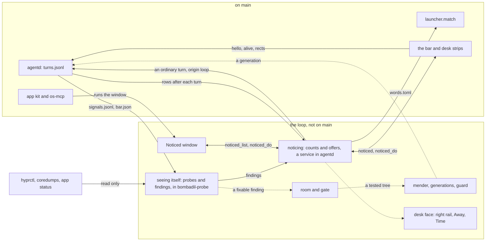

# The loop

> **Status:** In progress  
> **Code:** none of this is on `main`. It builds on `src/bombadil/agentd.py`, `src/bombadil/launcher.py`, `src/bombadil/providers.py`, `src/bombadil/paths.py`, `src/bombadil/desk.py`, `src/bombadil/watch.py`, `src/bombadil/snapshots.py`, `src/bombadil/mcp_server.py`, `src/bombadil/apps.py`, `src/bombadil/appkit/`, `shell/shell.qml`, `shell/DeskState.qml`, `share/skills/bombadil-apps/SKILL.md`, `scripts/build-iso.sh`, `iso/airootfs/usr/local/bin/bombadil-smoke` and `iso/airootfs/etc/skel/.config/hypr/hyprland.lua`. Files planned for the first two pieces (an unmerged branch has them, `main` does not): `src/bombadil/loop/`, `share/apps/noticed/`, `shell/LoopState.qml`, `shell/NoticedChip.qml`, `shell/NoticedCard.qml`, `bin/bombadil-probe` and `iso/airootfs/etc/systemd/user/bombadil-probe.service`.  
> **Design:** [Bombadil tends itself](../design/self-improvement-brief.md), [the page](../design/pages/bombadil-tends-itself.html)  
> **Verified:** 2026-10-01 against `main` at `a30ebc8`: no code of this piece is on `main`. The unmerged work was read through its own notes and the source files named here; its tests were not run.

The loop is meant to let Bombadil keep itself in good shape without becoming a chore for the person. It will count the requests the person keeps typing and offer, once and on a small chip beside the pill, to turn a repeat into something smaller. It will check its own state for bugs, fix what it can prove while the person is away, and write up what it cannot for the project. It exists because Bombadil's faults are found by hand as of 2026-10-01, by someone testing in a VM and relaying what they hit, and because history that was not recorded cannot be recovered later. The design holds itself to a budget: in an ordinary week, no line above the pill (except a put-back), no mark on the dot, no card raised on its own, at most three new offers and no new word to learn.

## What it will do

- **Noticing (built on an unmerged branch).** The ledger in `turns.jsonl` will keep what a later count needs: a lasting `id`, `seconds`, `origin`, `tools`, `model`, `cost` and a row for `stop`, and old rows will stay readable. A typed prompt that went to the model will count as an ask; `!` lines, sign-ins, private things, pasted text over 300 characters and turns that were stopped, failed or undone within 60 s will not. Asks will be grouped with no model, from their words, a verb class, the apps and panels they name and the route the turn took. Three asks on two days within 21 days, and worth building, will become one offer: at most one new offer a day and three a week. Counts will live in `loop.db`, read from `turns.jsonl` by byte offset. On day one an offer will be able to build only a word (a row in `words.toml` that opens an app or a panel and runs nothing else) or a new app (an ordinary turn that the person's tap starts). The other forms the brief lists (a card, a widget, a routine, a watcher, a preference) are designed, and each waits for its builder. One optional model call may name or split a group about to be offered; the branch ships it switched off.
- **Seeing itself (built on an unmerged branch).** 23 probes, pure functions over `hyprctl` JSON, the bar's rectangles, coredumps and the ledger, will look for a drawer that took no keyboard, stacked app windows, a window under the bar, a monitor under 1024 px and a Super tap that left the pill without the keyboard. An invariant will count only when it is red again 500 ms later, a crash at once, and friction at three sightings on two days. A finding will keep an evidence bundle under `findings/<fp>/`. When the person asks, it will become a report built from typed fields with at most three log lines, opened as a prefilled new-issue page in the browser panel; the person will press Submit and no token will be stored. The bar will send `hello`, `alive`, its rectangles, `focus_ack` and `friction`, and agentd will answer `ping`. Fixtures cover five of the six bugs found by hand; the sixth, Chromium's first-run dialog, is a report by design. Not on the branch: agentd and the bar as user units with `Restart=always`, which the brief asks for so that crashes are visible at all.
- **The room and the gate (designed).** A fixed program in `/usr/lib/bombadil/fixed/`, root-owned and shipped in the image, will judge every candidate fix and the fixer cannot edit it. The new test must fail on the base commit and pass on the candidate, no test may be removed, weakened or skipped, no protected path may change (the loop, probes, gate, guard, existing tests, sudoers, managed settings, the fence, snapshots, rollback, installer, CI) and a fix will be at most 5 files and 200 lines. Tiers will run from ruff and pytest through offscreen QML tests to the room: a second agentd and bar on scratch `BOMBADIL_STATE`, `BOMBADIL_RUNTIME` and `BOMBADIL_SOCKET`. The other provider will review read-only. The room is unproven: whether a headless Hyprland starts on a VM's software rendering is unchecked, and without it focus and layout bugs in the bar stay reports.
- **The mender, generations and the guard (designed).** One tap on Start mending, once, will write `bombadil-mend.timer` with the person's own words and the budget inside it, listed in Autopilot ([riding brief](../design/passenger-brief.md)) with Pause and Stop. A fenced coding session with role `mender` ([coding sessions](coding-sessions.md)) will work in a clone while the person is away, at most 3 starts and 2 landings a day. It will fix its own words and data, its apps and kit extras, and Bombadil's code that the gate can prove; compositor config, boot, `/etc`, sudoers, packages, vendor bugs and the loop itself will be reports. A passing fix will be exported as a generation under `~/.local/share/bombadil/gen/<sha>/` and switched by a `current` link, with `previous` kept. `bombadil-guard`, outside every generation, will check agentd, the bar and a few other signs for 10 minutes after a landing, and flip back on three reds in a row, a coredump of a Bombadil program or a failed unit. Undo will flip the link with no model.
- **Growth (designed).** New kit components will go only into an overlay named `BombadilExtra` and never replace `Theme` or `AppWindow`, at most 2 a week and 12 in all. Processes will be `bombadil-*` user units with an `[X-Bombadil]` record, at most 8, each an Autopilot row. A word, a widget or a unit unused for 28 days will be put away with Bring back; a kit component unused for 60 days will be archived and stay loadable. The loop will write no skills, notes or lessons for the agent to read.
- **The desk face (designed).** Noticed will be a desk widget at the top of the right rail (bottom up: Needs you, Away, Machine, Noticed) that starts as its strip. A night's changes will merge into one Away row, "Changed 2 things about itself", Time in the [brain](brain.md) will show `kind: "improve"` rows in the machine's orange, and Watching will show a "Mending" row while a fix runs. The chip and its peek card beside the pill belong to the first piece and are built on the branch.

## How it fits

Solid lines are built on the unmerged branch, and the boxes under "on main" say what exists on `main` at `a30ebc8`. Dotted lines are designed only.

**What it builds on in `main`**

| Existing piece | What the loop does there |
|---|---|
| `src/bombadil/agentd.py`: `AgentD._log`, `_log_line`, `_local` | Noticing will read the rows appended to `paths.turns_log()`. A model row has `t`, `prompt`, `result`, `ok`, `snapshot`, `provider`, `session`, `stopped`, `summary`, `read`, `details`, `n`, `unit`, `started` and `files`, and no `id`, `seconds`, `origin`, `tools`, `model` or `cost`. A launcher row has `kind: "local"`, `prompt`, `action`, `target`, `result` and `ok`. The word `stop` and the `stop` message write no row. `n` is `self.turns`, which goes on across restarts (the last number is kept in the `turn` file of the state directory), but `self.next_id`, the queue id, restarts at 0 with every agentd, and no row has an `id`. Ledger v2 adds the missing fields here (on the branch). `n` and `started` exist on both sides, but the branch's `n` restarts at 1 with every agentd and `main`'s goes on, which is part of the hand merge. A turn's log is `turns/<ms>-<queue id>.jsonl` in the state directory, which is where the route of a turn will be read from. |
| `src/bombadil/providers.py`: `Claude._events`, `Claude.command` | The `result` event keeps `ok`, `text`, `session_id`, `subtype`, `terminal_reason` and `num_turns`, and nothing of model, cost, usage or a rate-limit event, which ledger v2 and the quota rule need. `command` passes `--permission-mode bypassPermissions --dangerously-skip-permissions`, so a mender needs permissions from its role. |
| `src/bombadil/launcher.py`: `match`, `normalize`, `_key`, `known_apps`, `entries` | Text folding starts from `normalize` and `_key`, and named things come from `known_apps`, `PANEL_WORDS` and the widget words. `match` is exact: with an app Passwords, "show me my passwords" returns None (a model turn) and "passwords" opens it (run on `main` on 2026-10-01). `words.toml` would be one more table, matched after everything else, that can only open or show. |
| `src/bombadil/paths.py`: `state_dir`, `runtime_dir`, `socket_path`, `config_dir`, `data_dir`, `turns_log` | `loop/` would sit in the state directory beside `turns.jsonl`, which `desk.py` documents as outside the restore points ([restore points](restore-points.md)). `words.toml` would go in the config directory and generations in the data directory. The room would point a second agentd and bar at scratch `BOMBADIL_STATE`, `BOMBADIL_RUNTIME` and `BOMBADIL_SOCKET`. |
| `shell/shell.qml`: `QueueChips`, `SetupChips`, `stripsLeft`, `stripsRight`, the input `mask` | The input `mask` holds one `Region` per item that takes clicks, so the chip, which would sit beside the pill past the right strips, and its card need one each. The layer namespace is `bombadil-bar`. The bar passes each line from its `Socket` to `PillState.handle` and `DeskState.handle`. It sends no `hello`, `alive`, rectangles, `focus_ack` or `friction`, and agentd has no `ping`. |
| `src/bombadil/desk.py`: `WIDGETS`, `Desk.apply`; `shell/DeskState.qml` | The right rail holds `needs`, `away` and `machine`. `awayModel` and `machineModel` are `null` properties that only tests set, so `away` and `machine` never show. Noticed would be one more entry, and `launcher._widget_action` already builds "show NAME" and "hide NAME" from `WIDGETS` ([desk](desk.md)). |
| `src/bombadil/mcp_server.py`: `OsTools._register`; `src/bombadil/appkit/tools.py`: `register`, `create_app`, `check_app` | A tool is added with `@t(name, description, properties)`, so `asks` goes here and stays read-only. A new app would be made through `create_app`, which writes it, loads it and returns the check; `check_app` checks it again ([os-mcp](os-mcp.md)). |
| `src/bombadil/appkit/engine.py`: `qml_dirs`; `share/skills/bombadil-apps/SKILL.md` | `qml_dirs()` lists the checkout's `share/qml`, then the installed one, and `BombadilExtra` would be a third. The skill says "Use exactly these four imports", which would become five. |
| `src/bombadil/apps.py`: `builtin_dir`, `app_dir` | A built-in app is looked up in `share/apps`, which holds the Brain's kit app (`share/apps/brain/`). The Noticed window, a second built-in kit app, would be `share/apps/noticed/` ([app kit](app-kit.md)). |
| `src/bombadil/watch.py`: `history_lines` | `paths.is_turn_row` accepts only a row with no `kind` or `kind: "turn"`, and `history_lines` skips every other row except `kind: "local"`, so `bombadil history` hides `kind: "improve"` and `kind: "signin"` rows. The branch shows an improve row as a dim line instead, so the two need reconciling. |
| `src/bombadil/snapshots.py`: `Snapshots.undo_last_turn` | Bare `undo` takes back only a snapshot whose description starts with `turn:` (line 76). A loop landing is not a snapshot, so its Undo is its own. |
| `scripts/build-iso.sh`; `hyprland.lua` | The image copies `bin`, `src`, `shell`, `share` and the package list to `/usr/share/bombadil` with no version stamp and no `.git`, and links eight programs into `/usr/local/bin`. `hyprland.lua` starts `agentd` and `bombadil-shell` with `hl.exec_cmd`, and no user unit exists for either. |
| `iso/airootfs/usr/local/bin/bombadil-smoke` | The VM smoke test checks the agentd socket with `test -S` (`agentd-socket`, line 73), Hyprland's `configerrors` (`hypr-config-ok`, 76), the `bombadil-bar` layer (`bar-layer`, 77) and that `bombadil-details` takes the keyboard (`details-has-keyboard`, 171). The branch's probes repeat these as pure functions (`drawer-focus`, `hypr-config`, `bar-layer`, `agentd-ping`); none is on `main`. |

## Interfaces it adds (planned)

| Name | What it is | Status |
|---|---|---|
| Ledger v2 in `turns.jsonl` | On a model row `v`, `id`, `seconds`, `origin`, `tools`, `model`, `cost`, `usage`, `rate_limit`, `drift`, and `n` and `started`, which `main` also writes (see the `agentd.py` row). On a `local` row `verb`, `via`, `word`, `of`, `of_snapshot`. A row for `stop`. The brief also names `undone_by`; the branch works it out from the undo rows | on the branch |
| `kind: "improve"` rows | The trail of what the loop changed: `id`, `what`, `title`, `group`, `undo`, `undone`. Read by the Noticed window on the branch, by Away and Time in the design | on the branch; Away and Time planned |
| `origin` on a `prompt` message | `typed`, `button`, `app`, `session`, `routine`, `loop`, `retry`, `cli` | on the branch |
| Bar to agentd | `hello`, `alive`, `rects`, `focus_ack`, `friction` | on the branch |
| Any client to agentd | `ping`, answered by `pong` | on the branch |
| Agentd to the bar | `summon` carrying an `id` (on `main` it carries an optional `text` and no `id`) | on the branch |
| Noticed messages | `noticed`, `noticed_open`, `noticed_result`, `noticed_full` to clients; `noticed_state`, `noticed_list`, `noticed_do` from them, with ops `open`, `accept`, `not_now`, `never`, `got_it`, `other_ways`, `preview`, `report`, `send`, `undo`, `bring_back`, `forget_asks`, `clear_found`, `hide`, `show` | on the branch |
| Files in `paths.loop_dir()` | `loop.db`, `signals.jsonl`, `bar.json`, `agentd.json`, `doctor.json`, `findings/<fp>/`, `reports/<fp>.md` and an optional `config.toml` (`[offers]`, `[refine]`). Default `~/.local/state/bombadil/loop`, env `BOMBADIL_LOOP` | on the branch |
| `words.toml` | At `paths.words_file()`, rows `[[word]]` with `phrase`, `opens`, `made`, `from_group`, `away`, at most 30. `opens` is an app or a panel; the brief adds a card and a desk face | on the branch |
| Pill words | `noticed`, `show noticed`, `hide noticed` (launcher action kind `noticed`) | on the branch |
| Commands | `bombadil loop asks`, `status`, `replay`, `report`, `forget`, `probe`; `bombadil probe`; `bombadil doctor [--live]` | on the branch |
| os-mcp tool `asks` | Read-only, optional `limit`: what the person asks most | on the branch |
| `bombadil-probe`, `bombadil-probe.service` | The prober and its user unit (`Restart=always`, idle priority), started by agentd's loop service | on the branch |
| `share/apps/noticed/` | The Noticed window, a kit app | on the branch |
| `BOMBADIL_BUILD` | Optional; read by the bar for the `build` field of its `hello` | on the branch |
| `BOMBADIL_MACHINE` | Optional word naming the machine kind in a report | on the branch |
| `VERSION` | The build a report names; `scripts/build-iso.sh` writes it beside the shared tree | on the branch |
| `bombadil check`, `bombadil-check`, `bombadil-room`, `/usr/lib/bombadil/fixed/`, `tests/new/` | The gate, the room and the fixed part | planned |
| `bombadil-mend.timer` | User unit with an `[X-Bombadil]` section; the words "stop mending", "pause mending" and "hold everything" | planned |
| `~/.local/share/bombadil/gen/<sha>/`, `current`, `previous`, `bombadil-guard` | Generations, the link and the guard service | planned |
| `BombadilExtra` under `~/.local/share/bombadil/qml`, `bombadil-loop.slice` | The kit overlay and the slice for `bombadil-*` units | planned |
| A `noticed` entry in `desk.WIDGETS` | The right-rail card, the Away row, `improve` rows in Time | planned |

## Principles it keeps

- [Nothing runs on its own that the person cannot see and stop](../principles.md#nothing-runs-unseen): fixing will run on one standing yes, kept as a unit the person can pause and stop, and an offer will never start anything. The trap is a hidden timer, or letting a count or a probe start work.
- [Records answer before models](../principles.md#records-before-models): counts will read what the machine already writes, and no model counts. A fixed program decides whether a fix may land; the other provider's read-only review can only block it. The trap is asking a model to group asks; the one optional call may only name or split a group, never add a member.
- [Only the person's own press reaches other people](../principles.md#the-persons-press-reaches-people): nothing will leave until Submit on a page that shows exactly what goes. The trap is a stored token, an auto-filed issue or the person's words in a report.
- [Quiet at rest](../principles.md#quiet-at-rest): a chip while something waits, never a popup, a sound, a mark on the dot or a digest. The one line the loop may ever put above the pill is a guard's put-back. The trap is letting the chip's number grow into a mark on the dot, or putting an offer on the line.
- [Recovery never goes through the part that broke](../principles.md#recovery-without-the-broken-part): the guard and a first line in the Lifeboat ([ux brief](../design/ux-brief.md)) will sit outside every generation, and the fixer cannot edit its judges. The trap is an undo that runs from the tree a bad fix replaced.
- [Every piece degrades](../principles.md#degrade-and-recover): counting and probes will never be on a turn's path, and either can die while turns carry on. The trap is a turn, an undo or the pill waiting on `loop.db`.

## Before you build on it

- **Order (the brief).** 1 noticing (M, first because history cannot be recovered), 2 seeing itself (M to L), then 3 the room and the gate (starting with a spike: does a second headless Hyprland run in a VM), 4 the mender, generations and the guard, 5 growth, 6 the desk face. Pieces 1 and 2 come first and follow the app kit. The mender needs the coding sessions' fence, out-of-sight sessions, a saved conversation id (`AgentD.session_id` is in memory only), a build stamp, a clone, pytest and ruff in the image, and the Lifeboat line.
- **Waits on the owner.** Every default is confirmed (options 1a, 2a and 3a chosen and the plan approved on 30 Sep 2026). Open for the owner, later: whether other people's Bombadils should ever report to the owner's repository, and whether anyone but the owner should default to find-and-report only. The thresholds stay guesses until four weeks of real offers are counted. The branch hard-codes the project's own repository as the default target of the issue link (`report.issue_url`), so a fork changes that before it ships reports.
- **Waits on checks.** Replay a real `turns.jsonl` and hand-label 100 pairs: grouping must reach 90% precision on "same request". The branch's numbers come from a synthetic corpus and no real result is recorded. The brief also lists a headless Hyprland in a VM, managed settings that outrank `.claude/settings.json` (which allows `Bash(sudo *)`, line 27), coredump storage on the installed image and the fast model answering a fixed JSON shape on both providers. The branch's notes list what no test of theirs reached: a real Hyprland for the chip and card, the prober unit starting under a user manager, and Chromium taking the issue page.
- **Expect hand merging.** The branch is based on an older `main`. Both sides changed `src/bombadil/agentd.py`, `launcher.py`, `providers.py`, `mcp_server.py`, `watch.py`, `paths.py`, `shell/shell.qml`, `shell/PillState.qml`, `shell/StatusLine.qml`, `bin/bombadil`, `scripts/build-iso.sh` and `iso/airootfs/usr/local/bin/bombadil-smoke`, among others (`README.md`, `docs/ARCHITECTURE.md` and several tests). `main`'s model row carries `read`, `unit` and `files`, which the branch's `_log` does not write, and both write `n` and `started`.
- **Do not break.** The fields already in a `turns.jsonl` row and the `kind: "local"` rows. The exactness of `launcher.match`: a word may only open or show and never shadows an app, a panel or a command. Bare `undo` meaning the machine's last turn. `bombadil-rollback`, which stays plain bash. The smoke checks named above, which the probes are measured against.

## When it ships

This page is then replaced by the full piece page in the skeleton of [documenting your piece](../contributing/documenting.md), the [roadmap](../roadmap.md) row is updated and the brief gets its status line. Until then each piece that ships changes the status and the tables here.
