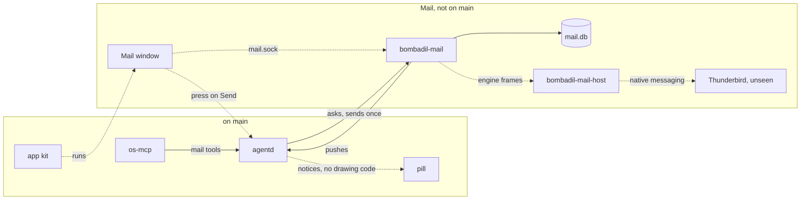

# Mail

> **Status:** In progress  
> **Code:** none of this is on `main`. It builds on `src/bombadil/mcp_server.py`, `src/bombadil/agentd.py`, `src/bombadil/desk.py`, `src/bombadil/procs.py`, `src/bombadil/launcher.py`, `src/bombadil/apps.py`, `src/bombadil/paths.py`, `src/bombadil/appkit/`, `share/qml/Bombadil/`, `share/app-template/` and `shell/CardHost.qml`. Planned files, most of them already written on an unmerged branch: `src/bombadil/mail/`, `src/bombadil/outbox.py`, `src/bombadil/notices.py`, `bin/bombadil-mail` and `tests/mail/lab/`. Planned and written nowhere: `share/apps/mail/` (the window), `share/mail/extension/` (the add-on), `bin/bombadil-mail-host`, `src/bombadil/mail/engine.py` (starts Thunderbird) and a user unit for `bombadil-mail`.  
> **Design:** [Bombadil at work, piece 1](../design/everyday-work-brief.md#1-mail-in-bombadils-own-view), [the page](../design/pages/bombadil-at-work.html)  
> **Verified:** 2026-10-01 against `main` at `a30ebc8`: no code of this piece is on `main`. The unmerged work, at `708d3b6`, was read file by file (its source, tests, lab scripts and its own notes). Its 902 mail, outbox and notice tests were run from an exported copy: one fails every time and two timing-sensitive ones can fail on a busy machine (see "Before you build on it"). The lab was not run.

Mail is piece 1 of "Bombadil at work", and every one of the brief's working days starts in it. It is meant to be one Mail window, built from the app kit, that lists every mail account in one place, marks the mail that asks something of the person with one line on why, and holds a reply box whose Send button is the person's own press. Thunderbird is to run unseen as the engine, because it is the one mail program that both Google and Microsoft let a person allow without a review or an admin, so Bombadil needs no mail app of its own approved. The agent is to be able to search, read and draft mail and is given no tool that sends (the unmerged work also adds `mail_mark` and `mail_show`). The piece exists so that the most frequent short read and short answer of a working day happens in Bombadil's own view, while the tool does the work behind it.

## What it will do

- **Thunderbird as the unseen engine (designed; its start is not written).** The brief: Thunderbird starts at login with Bombadil's profile under `~/.local/share/bombadil/mail`, its window lives on a Hyprland special workspace the person never visits, and it keeps its own copy of the mail on the machine. Linux has no supported hidden mode, so whether it keeps syncing there is the first VM check, with `--headless` as the second try. An unmerged branch has the service that supervises it (a restart after a pause that grows from 2 to 60 seconds) but not the code that starts it: `src/bombadil/mail/service.py` imports `ThunderbirdProcess` from `engine.py`, which does not exist, so with `BOMBADIL_MAIL_ENGINE=fake` the service runs against the fake engine (sample mailboxes in `src/bombadil/mail/fake.py`), and without it the service runs with no process to start Thunderbird and says so in its log. The lab in `tests/mail/lab/` has a local Dovecot and SMTP sink, a profile writer, a trial add-on and host, and four question scripts (`q1_signing_matrix.py` to `q4_api_fit.py`) for the brief's VM checks; no recorded answers to them are in the unmerged work.
- **The add-on and the host (designed; the engine protocol is built on an unmerged branch).** The brief: a MailExtension installed through the profile's policy talks to Bombadil by native messaging, using `messages.query`, `getFull`, read state, `onNewMailReceived` and attachments. A mail that starts a conversation goes with `messages.sendMessage`, and a reply with `compose.beginReply` then `compose.sendMessage`, because only that keeps the reply with the mail it answers. Built on the branch: the service's side of that conversation, `src/bombadil/mail/bridge.py` (`EngineLink`, `serve_engine`), with the engine ops `info`, `accounts`, `list`, `find`, `get`, `mark`, `move`, `attachment`, `blob`, `send` and `known`, and files moved in 384 KiB pieces. Not written: the production add-on and the host program. The lab's add-on is a generic bridge for any `messenger.*` call, not this one.
- **Accounts from one address (designed; detection built on an unmerged branch).** The brief: the first mail ask with no account asks one thing on a small card, "Your email address"; the provider is told from the address; the provider's own sign-in page slides into the browser panel and the person presses Allow themselves; a workplace that will not allow it stays on the web with an Open link. Built on the branch: `src/bombadil/mail/accounts.py` (`detect` tries well-known domains, then the domain's MX record, then an `imap.<domain>` guess; `Provider`; `web_link` for "Open in Gmail") and the `add_account` op, which stores the account in state `signin` or `syncing`. Not written: the address card, the sign-in page in the panel, and writing the account into Thunderbird's settings (the service expects a process object with `seed_account`; no real one exists, and only the fake engine's `FakeProcess` records the call).
- **The mail service (built on an unmerged branch).** `bombadil-mail` is a user service, its own process and not the part of agentd the brief describes. It owns `mail.sock` and `mail.db`. The database holds accounts, drafts, "needs a reply" marks with one line of why, receipts and the addresses the person has sent to, and no mail text: a mail's text is fetched from the engine when a window or a tool asks and is not written down. Its `recent` op is meant for the Brain (sender, subject, time and a web link, never text), and nothing calls it yet. agentd listens to it (`src/bombadil/mail/watch.py`) and, with no service, costs one failed connect every five seconds.
- **The agent's tools (built on an unmerged branch).** `mail_search`, `mail_read`, `mail_mark`, `mail_draft` and `mail_show` register in os-mcp. There is no send tool. `mail_read` puts the text between two marks that carry a random word per read and say it is other people's words, cuts it at 20 000 characters and leaves the mail unread. A turn that has read mail is remembered, and a draft it makes is flagged more strongly for any address the person did not type and the mail it answers does not contain.
- **The press and the outbox (built on an unmerged branch).** A draft has a `fingerprint` (SHA-256 of account, kind, what it answers, recipients, subject, body and each attachment's name, size and hash), and the window reports the one it drew with `draft_shown`. The press is `{"type": "press", "kind": "mail", ...}` to agentd, which refuses a process inside an agent's turn or one it cannot name, logs the press in `presses.jsonl`, and asks the service to send once. The service refuses unless the stored, pressed and shown fingerprints agree. `sending` is written before the engine is asked, a send whose outcome is unknown is never retried by the machine (only the person's own second press, with `"again": true`, can try it again), and pressing twice sends once. A typed "send it" sends nothing and answers "Sending is yours. It's under the pointer.", only while a draft waits. This is a rule with a check, not a wall: the agent runs as the person.
- **Notices above the pill (built on an unmerged branch in agentd, not drawn).** `src/bombadil/notices.py` is a stack of at most four lines with up to three chips, and agentd posts to it: incoming mail from a sender the person knows (Reply, Open), "Reply to Priya is ready. Sending is yours." and a receipt with "Open in Gmail". Nothing in `shell/` handles a `notice` message, so no one sees them.
- **The Mail window (designed; nothing written).** A kit app shipped as a built-in app in `share/apps`: All inboxes, each account, Needs a reply and Drafts on the left, the list in the middle, the open mail on the right. "what needs me in mail?" opens it on Needs a reply, which the agent fills (the brief: the agent marks them; the unmerged work does it with `mail_mark`); saying what a reply should say puts it in the reply box with an orange ring on Send and the label "Yours: Send". Attachments have Save into Downloads under their real name, and a file dropped on the pill starts a mail with it attached. The unmerged work builds the window's side of the protocol (`subscribe`, `draft_shown`, `show`, `requested`) and a stand-in socket for tests (`tests/mail_stub.py`), not the window.

The other nine pieces of "Bombadil at work", and the order they are built in, are in the [roadmap](../roadmap.md#designed) and the [brief](../design/everyday-work-brief.md#build-order-and-what-it-stands-on); piece 2 builds on this piece's outbox and notice stack.

## How it fits

Solid lines are built on an unmerged branch, and the boxes in the first group are on `main`. Dotted lines are designed only or have no code.

**What it builds on in `main`**

| Existing piece | What Mail does there |
|---|---|
| `src/bombadil/mcp_server.py`: `OsTools._tool`, `_register`, `_desk`, `_job`, `_ask_agentd` | A tool is a function the `_tool` decorator adds to `OsTools.tools`; `_register` ends with `cardtools.register(self)` and `appkit.tools.register(self)`. `_desk` and `_job` read `BOMBADIL_TURN`, send one `desk-tool` or `job-tool` line and wait for the answer with the same `id`. On the branch the five `mail_*` tools register and ask the same way. |
| `src/bombadil/agentd.py`: the message dispatch, `_desk_tool`, `_job_tool`, `notes`, the `setup` message | `desk-tool`, and `job-tool` with op `start`, are refused unless `turn` is `self.current`; `job-tool` `list` and `stop` need no turn. Both answers go to the sender only. `notes` carries what happened without the model into the next turn. The `setup` message (a `line`, a `tone` and `actions` chips) is the shape a notice copies. On the branch, `mail-tool`, `press` and `notice_*` join this socket. |
| `src/bombadil/desk.py`: `asked_for_desk` | The gate by the person's typed words, documented there as "a courtesy gate, not a security boundary". The press needs more than that, which is why the outbox is separate. |
| `src/bombadil/procs.py`: `cgroup_of`, `descendants`, `all_procs` | `cgroup_of` returns a cgroup only for a `bombadil-turn-` scope, so a process in an agent's turn can be told from the person's window. On the branch the press check reads it. |
| `src/bombadil/launcher.py`: `match`, `entries`, `Launcher._app` | The pill's exact list of words. On the branch, `mail`, `email` and `inbox`, and the typed send words, are added to it. |
| `src/bombadil/apps.py`: `builtin_dir`, `app_dir`, `is_builtin`; `src/bombadil/appkit/context.py` | `builtin_dir()` is `share/apps`, which holds one built-in app, `brain`; `share/apps/mail` does not exist. `app_dir` prefers `~/Apps/<name>` over a built-in of that name. A built-in app keeps its data under `<state>/apps/<name>/data`. See [the app kit](app-kit.md). |
| `src/bombadil/appkit/`: `placement.py`, `runtime.py`, `native/agent.py` | Each app has its own special workspace `special:app-<name>`, shown and hidden by `placement.show` and `hide`. An `app.py` `Backend` is exposed to QML as `backend`. `Agent` is an app's JSON-lines socket to agentd, a model for the window's socket to `mail.sock`. |
| `share/qml/Bombadil/`, `share/app-template/` | `AppWindow`, `ItemList`, `ListRow`, `Editor`, `Panel`, `SearchField`, `Badge`, `EmptyState`, `Store` and `Theme.accent` (the orange) are what the window is built from, and `main.qml` plus `app.py` is the layout an app starts from. `Ring` is a gauge, so the ring on Send is a component to add. |
| `shell/CardHost.qml` | One picture card at a time, drawn by `Kit.Diagram`. Mail's first-ask setup needs the address card, and `CardHost` has no face for it. The message and task cards are piece 2. |
| `src/bombadil/paths.py`: `runtime_dir`, `state_dir`, `data_dir` | Each takes an override (`BOMBADIL_RUNTIME`, `BOMBADIL_STATE`, `BOMBADIL_DATA`). On the branch `mail_socket()` is `runtime_dir()/mail.sock`, `mail_db()` is `state_dir()/mail.db` and `mail_profile()` is `data_dir()/mail`, each with a `BOMBADIL_MAIL_*` override. |

## Interfaces it adds (planned)

| Name | What it is | Status |
|---|---|---|
| `bombadil-mail` | User service, `bin/bombadil-mail` and `src/bombadil/mail/service.py`; the unit that starts it at login is not written | on the branch; unit planned |
| `mail.sock` | JSON lines at `paths.mail_socket()`, env `BOMBADIL_MAIL_SOCKET`. Ops: `ping`, `status`, `accounts`, `add_account`, `remove_account`, `views`, `list`, `search`, `read`, `set_flags`, `archive`, `trash`, `mark_reply`, `save_attachment`, `draft`, `draft_edit`, `draft_get`, `draft_discard`, `draft_shown`, `send`, `known`, `subscribe`, `show`, `requested`, `recent`, `engine_window`. Pushes: `changed`, `new_mail`, `show`, `sent`, `status` | on the branch |
| `mail.db` | SQLite at `paths.mail_db()`, env `BOMBADIL_MAIL_DB`: `accounts`, `forgotten`, `marks`, `drafts`, `receipts`, `sent_to` | on the branch |
| `BOMBADIL_MAIL_FILES`, `BOMBADIL_MAIL_PROFILE`, `BOMBADIL_PRESS_LOG`, `BOMBADIL_MAIL_ENGINE=fake` | Draft attachment copies, Thunderbird's profile, the press log, and the switch to the fake engine | on the branch |
| `mail_search`, `mail_read`, `mail_mark`, `mail_draft`, `mail_show` | os-mcp tools in `src/bombadil/mail/tools.py`. The brief names the first, second and fourth only | on the branch |
| `{"type": "mail-tool"}`, `mail-result` | agentd messages for the tools, answered to the sender only | on the branch |
| `{"type": "press", "kind": "mail", "id", "fingerprint"}`, `press_result` | The person's press and its answer; `"again": true` only for a send whose outcome was unknown | on the branch |
| `notice`, `notice_end`, `notice_action`, `notice_dismiss` | agentd messages for the stack in `src/bombadil/notices.py` | on the branch; drawing planned |
| `presses.jsonl`, `told.json` | One row per press with no mail text, and the once-only sentence "I never press Send for you. Change anything in it first if you like." | on the branch |
| `bombadil mail [status\|accounts\|add\|remove\|views\|list\|show]` | CLI in `bin/bombadil`, with no send | on the branch |
| `mail`, `email`, `inbox`; `send` words | Pill words in `launcher.MAIL_WORDS` and `launcher.SEND_WORDS` | on the branch |
| `share/apps/mail/` | The Mail window, a kit app | planned |
| `share/mail/extension/`, `bin/bombadil-mail-host`, `~/.mozilla/native-messaging-hosts/` | The add-on, the native-messaging host and its manifest folder | planned |

## Principles it keeps

- [The person's press reaches people](../principles.md#the-persons-press-reaches-people): on the branch the agent has `mail_draft` and no tool that sends, and a draft is released only by a press on the Send the window is to show, for exactly what it showed. The trap is a `mail_send` tool, a typed "send it" that sends, a second path to the service's `send` that skips the fingerprint, or describing the check as a wall (the brief's [risks](../design/everyday-work-brief.md#risks-and-what-to-check-in-the-vm-before-building) say it is not one).
- [Nothing runs unseen](../principles.md#nothing-runs-unseen): Thunderbird is to fetch and keep mail all day out of sight. The trap is shipping the engine with no place to see and stop it; each account needs a state the person can read (`ok`, `syncing`, `signin`, `blocked`, `error`) and a way out (`remove_account`).
- [Degrade and recover](../principles.md#degrade-and-recover): the pill, turns and undo carry on with no mail service, and on the branch `mail.db` is a cache set aside and rebuilt if damaged. The trap is any turn, word or press that waits on Thunderbird without a limit. On the branch every call has a timeout: 4 to 20 s for the tools (os-mcp waits up to 30 s for agentd), 1 s for "is a draft waiting", and up to 70 s for a press, because a send takes that long.
- [Plain files stay the truth](../principles.md#plain-files-stay-the-truth): Thunderbird's profile is the mail, and Bombadil keeps notes beside it, not copies. The trap is a second store of mail text in `mail.db` or the Brain, or a saved attachment written over a file of the person's.
- [Real native apps](../principles.md#real-native-apps): the window is to be a kit app in the OS's look, and the web page is one Open link away. The trap is a web view of a mail's HTML; the unmerged work turns HTML into text in `src/bombadil/mail/text.py` and loads nothing.

## Before you build on it

- **Order (the brief).** Piece 1, piece 2, passenger piece 4's lasting watchers and Autopilot, piece 3, piece 4, then pieces 5 to 10. VM checks before piece 1's code: Thunderbird keeps syncing from a hidden workspace; its sign-in pages for Gmail, Outlook.com and Microsoft 365 open in the panel; the add-on's native messaging works; a reply is sent from a compose window on the hidden workspace.
- **Waits on.** Nothing from the owner: choices 1a (only the press sends) and 3a (Thunderbird as the engine) were answered on 30 Sep 2026. Other pieces: disk encryption and the lock, which protect Thunderbird's copy of the mail ([installed OS brief](../design/installed-os-brief.md)); Thunderbird in the image (`iso/packages.x86_64` has none); the shell drawing notices; the hardening that turns the press into a wall.
- **Differs from the brief.** The service is its own process, not part of agentd. Microsoft accounts are IMAP at `outlook.office365.com` and SMTP at `smtp.office365.com`, both with OAuth, where the brief says Microsoft Graph for Microsoft 365. `mail_mark` and `mail_show` are added to the brief's three tools.
- **Fix before merging.** As of 2026-10-01 the unmerged work is 7 commits ahead of and 94 behind `main` at `a30ebc8`, and lacks `src/bombadil/cards.py`, `cardtools.py`, `sysmap.py`, `shell/CardHost.qml` and `Diagram.qml`. Its edits to `agentd.py`, `launcher.py`, `mcp_server.py`, `providers.py`, `paths.py` and `bin/bombadil` (the `bombadil mail` command) need merging by hand, because `main` has changed all six since the branch was cut. One test fails every time: `tests/test_mail_service.py` expects an attached `.env` to keep that name, and `sanitize_filename` in `src/bombadil/mail/text.py` strips the leading dot. Two timing-sensitive tests can fail on a busy machine: `test_a_file_that_goes_quiet_is_given_up_on_and_its_partial_is_removed` in `tests/test_mail_bridge.py` and `test_a_real_service_on_the_fake_engine_from_tool_to_press_to_receipt` in `tests/test_mail_agentd.py`.
- **Do not break.** The exact-words rule of `launcher.match`. The `desk-tool` and `job-tool` request shape, which `mail-tool` copies. `procs.cgroup_of` and the `bombadil-turn-` scope name, which the press check reads. `apps.app_dir`, where a person's `~/Apps/mail` would take the Mail window's place. `--strict-mcp-config` in `src/bombadil/providers.py`, which keeps the person's own mail connectors from loading beside Bombadil's tools.

## When it ships

This page is then replaced by the full piece page in the skeleton of [documenting your piece](../contributing/documenting.md), the [roadmap](../roadmap.md) row is updated and the brief gets its status line. Pieces 2 to 10 each get their own page when they have code.
