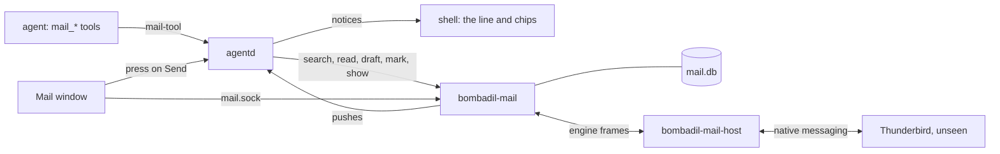
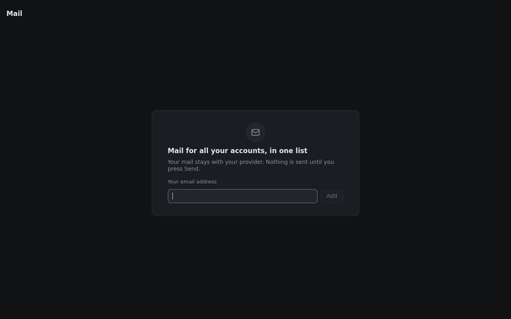
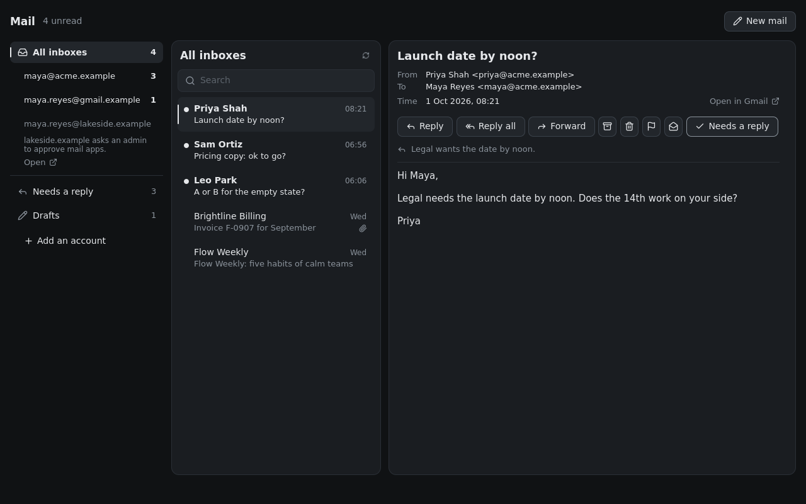
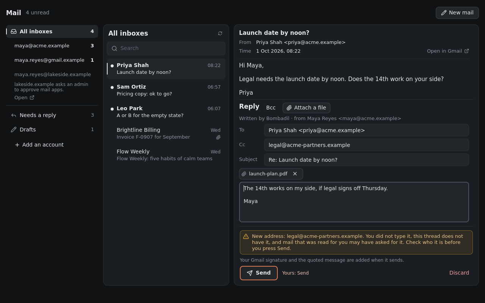
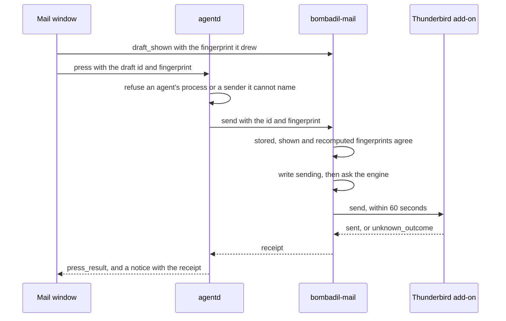

# Mail

> **Status:** Partly shipped  
> **Code:** `src/bombadil/mail/`, `bin/bombadil-mail`, `bin/bombadil-mail-host`, `share/apps/mail/`, `share/mail/extension/`, `share/skills/bombadil-mail/SKILL.md`, `src/bombadil/outbox.py`, `src/bombadil/notices.py`, `src/bombadil/agentd.py`, `src/bombadil/launcher.py`, `src/bombadil/apps.py`, `src/bombadil/paths.py`, `src/bombadil/mcp_server.py`, `shell/PillState.qml`, `shell/NoticeChips.qml`, `iso/airootfs/etc/systemd/user/bombadil-mail.service`, `iso/airootfs/etc/thunderbird/policies/policies.json`, `tests/mail/lab/`  
> **Design:** [Bombadil at work, piece 1](../design/everyday-work-brief.md#1-mail-in-bombadils-own-view), [the page](../design/pages/bombadil-at-work.html), [Mail view](../design/mail-view.md)  
> **Verified:** 2026-10-01 against `main` at `969b80b`: the code behind each claim below was read at that commit, and the Python and Node tests of the piece were run on the fake engine. The QML tests, the real-Thunderbird tests and the lab were not run (see [Tests](#tests)), so what a real Thunderbird does is the lab's finding, not a result of this check.

Mail is piece 1 of "Bombadil at work": one Mail window, built from the app kit, that lists every mail account in one place, marks the mail that asks something of the person with one line on why, and holds a reply box whose Send button is the person's own press. Thunderbird runs unseen as the engine, because the brief's reason is that it is the one mail program Google and Microsoft let a person allow without a review or an administrator. The agent can search, read, mark and draft mail, has no tool that sends, and treats what it reads as other people's words. Piece 1 is on `main` and tested on a fake engine and, where one is installed, on a real Thunderbird 157 against a local mail server; no real Gmail, Outlook or iCloud account has been tried, which is why the status is partly shipped.

| Piece of "Bombadil at work" | State on `main` at `969b80b` |
|---|---|
| 1. Mail in Bombadil's own view, Thunderbird as the unseen engine | Shipped, this page: service, engine, add-on, host, window, five agent tools, skill, press, notices, unit and policy file. No real provider account tried ([Known gaps](#known-gaps)) |
| 2. Messages and connections: message and task cards, chat, `bombadil-connect` | Designed. It builds on this piece's outbox and notice stack (`Outbox.register` takes another kind; `mail` is the only one registered). No `bombadil-connect` or `propose` is in `src/`, `bin/`, `share/`, `shell/` or `iso/` |
| 3. Today and meetings on time: a calendar copy and the `today` word | Designed, no code |
| 4 to 10. Hands that stop at the last button, notes, routines, documents (writing), print and scan, fill and sign, home restore points | Designed or not built; see the [roadmap](../roadmap.md#designed) |

## How it works

### The processes

- **`bombadil-mail`** (`bin/bombadil-mail`, `src/bombadil/mail/service.py`) is its own user service, not a part of agentd. It owns `mail.sock` (mode 0600, one lock for the socket and one for `mail.db`) and `mail.db`, answers the window, agentd and `bombadil mail`, talks to the add-on, and starts, watches and restarts Thunderbird. The unit starts at login, restarts on failure and runs at `Nice=5`.
- **Thunderbird** is started by `ThunderbirdProcess` (`src/bombadil/mail/engine.py`) as `thunderbird --profile <profile> --no-remote`, with `--headless` when there is no display, and only while an account exists. It is in the unit's cgroup, so it stops with the service. With a display its windows go to `special:mail-engine` through a window rule with `silent`. `user.js` in its profile is generated whole from a fixed list of quiet prefs (no start page, telemetry, update check, sound, tray icon or receipt question) and the seeded accounts.
- **The add-on** (`share/mail/extension/`, id `ADDON_ID` in `engine.py`; Manifest V2, a persistent background page, plain JavaScript) is built into a reproducible `extensions/<id>.xpi` in the profile. It answers the service's requests and reports what Thunderbird sees, and does nothing on its own.
- **`bombadil-mail-host`** (`bin/bombadil-mail-host`) is the native-messaging program Thunderbird starts for the add-on, through `~/.mozilla/native-messaging-hosts/bombadil_mail.json`. It joins Thunderbird's length-prefixed frames to JSON lines on `mail.sock`, says `engine_hello` first and has no logic. When the service goes it exits, and Thunderbird starts another a few seconds later.
- **The Mail window** (`share/apps/mail/`) is a built-in kit app. Its `Backend` in `app.py` has two `QLocalSocket`s: `mail.sock` for everything and agentd's socket for the press alone. QML never decides whether Send is allowed; the gate is in `Backend`. `apps.RESERVED` stops an app of the same name replacing the window, and the launcher refuses to open Mail while a `~/Apps/mail` stands in front of it.
- **agentd's part** is the broker for the tools (`mail/tools.py`), the outbox (`outbox.py`), the watch that turns pushes into notices (`mail/watch.py`) and the notice stack (`notices.py`); [agentd](agentd.md#mail-notices-and-the-press) describes it from its side. With no service the tools answer one sentence and the watch costs one failed connect every five seconds.
- **The fake engine** (`BOMBADIL_MAIL_ENGINE=fake`, `mail/fake.py`) has sample mailboxes, a hostile mail among them, and a sample mail every `BOMBADIL_MAIL_FAKE_DRIP` seconds when that is set. The window's pictures, the desktop test, the VM smoke test and `scripts/dev-session.sh` run on it.

**Supervision.** Every 3 seconds the service looks at Thunderbird. With no account it stops it and says `off`. One that stopped by itself is started again after 2 seconds, doubling to 60, and the engine says `down` after six stops in a row; 60 seconds of uptime resets the pauses. One that runs with no add-on connected for 120 seconds is restarted, and so is one whose add-on is silent for 30 seconds and misses two pings. A send that does not finish restarts it too, because the usual cause is a dialog in a window nobody sees, and the draft is already `unknown`, so nothing can go twice. An engine request waits at most 10 seconds, except an attachment fetch (120) and a send (60), and a call that starts, stops or sets Thunderbird up waits at most 20.

### What the person sees

The pictures show the window on the fake engine, so every person and address in them is invented. First run asks one thing, "Your email address". Then the left column has All inboxes, each account with its unread count (one that cannot be used says why and offers an Open link), Needs a reply, Drafts and "Add an account". The open mail is plain text with Reply, Reply all, Forward, archive, delete, flag, mark read and a "Needs a reply" toggle. A draft shows what the provider will add, the warnings, and Send with an orange ring and the label "Yours: Send", which waits 350 ms once it can be pressed (`ARM_MS`) so that a click on its way elsewhere is not a press.

### Accounts

1. The window's address card, or `bombadil mail add EMAIL`, sends `add_account`. `accounts.detect` finds the provider from a known domain, else the domain's MX record (a small standard-library DNS client), else a guess at `imap.<domain>`. Google and Microsoft are IMAP and SMTP with OAuth, iCloud is IMAP with an app-specific password, anything else is IMAP with a password.
2. The service stores the account in state `signin` (OAuth) or `syncing`, has `ThunderbirdProcess.seed_account` write it into the profile as Thunderbird's own setup would, and starts or restarts Thunderbird.
3. The person finishes in Thunderbird's own window, which "Show Thunderbird's window" brings up (`engine_window` with `action: "stage"`) and "Done" puts away. An OAuth consent page opens in the system browser, which on the ISO is the browser panel (`iso/airootfs/etc/xdg/mimeapps.list`); a password account gets Thunderbird's password prompt. Bombadil never sees the password or the token.
4. After that the state is the add-on's reading of Thunderbird (`sync` events). `remove_account` deletes the account's marks, drafts and attachment copies and makes Thunderbird forget it: prefs, folder, caches and sign-in, unless another account uses the same sign-in.

### A send

1. A draft's `fingerprint` is the SHA-256 of its account, kind, what it answers, recipients, subject, body and each attachment's name, size and hash. An edit changes it and clears the "shown" mark.
2. The window reports `draft_shown` once its reply box has drawn that fingerprint. Send is enabled only while the draft on screen is the one the service last answered with, the service has been told it was drawn, someone is addressed, and the service and agentd are both there. `Backend.press` is the only place a press is made, and `SendBar.qml`'s click handler its only caller.
3. agentd's `Outbox.press` refuses a sender it cannot name, a process that is gone, a process in a turn's `bombadil-turn-` scope and, for a turn without a scope, one in the running turn's process tree. Each press leaves a row in `presses.jsonl` with no mail text. The performer for `mail` is called once, within 90 seconds, and its answer is final.
4. The service refuses a draft that is discarded, sending, or `unknown` without `again`; one whose pressed, stored, shown or recomputed fingerprint differs; and one with no recipient, a gone account, a size over the provider's limit or no live engine. It reads each attachment copy again and checks its hash, so the bytes sent are the bytes checked.
5. `sending` is written to `mail.db` before the engine is asked. For a reply, a forward or a mail from an identity with a signature, the add-on opens a compose window, fills it, reads it back and sends only if it matches the request. A mail from an identity with no signature goes through `messages.sendMessage`, which opens no window.
6. A send that never answered, or whose link dropped after the request was written, is `unknown`. The service says so ("Thunderbird did not say whether this went; look in Sent before pressing again.") and nothing retries it. Only the person's own second press, with `again: true` after ticking that they looked in Sent, can. Pressing twice sends once: a second press while the first runs gets the first's answer, and one on a sent draft returns the receipt with `already: true`.
7. The receipt is stored, the addresses are remembered as ones the person sent to, the mail it answered stops needing a reply, a `sent` push goes out and agentd says the receipt above the pill. The next turn is told "the person pressed Send: ...".

A typed "send it" sends nothing. While a draft waits, agentd answers the words in `launcher.SEND_WORDS` locally with "Sending is yours. It's under the pointer." and opens the window on Drafts.

### Who may do what

The service asks the kernel who is on the other end of `mail.sock` for every request. A process counts as the agent's when it is in a `bombadil-turn-` scope (`procs.cgroup_of`), when the kernel cannot name it, or when it has gone since it connected, because a socket outlives the process that opened it.

| | The agent (a process in a turn) | The person (the window, `bombadil mail` outside a turn) |
|---|---|---|
| Search mail, read a mail's text, list views and accounts | Yes, through the tools or the socket. The text is wrapped in marks and a read leaves the mail unread | Yes |
| Mark "Needs a reply" with a line of why, make or edit a draft, show the Mail window | Yes. A mark is stored in `mail.db` only. At most 20 drafts are open, they are flagged more strongly after mail was read, and an attachment that looks like a credential is refused | Yes |
| Send | Never. No tool sends, and `send` and `draft_shown` refuse an agent's process | The press on Send |
| Mark read or flagged, archive, delete, save an attachment, discard a draft, add or remove an account, show Thunderbird's window | No: `refused` (`PERSONS_ONLY` and `_yours` in `service.py`) | Yes |

This is a rule with a check, not yet a wall. The agent runs as the person. A process it starts outside its scope, with `systemd-run --user` for one, passes the scope check, and anything running as the person can read Thunderbird's profile or connect to `mail.sock`. Against that stand the skill and the system prompt telling the agent not to, the fingerprints, the draft warnings and the press log. Closing the rest is the hardening in the [installed OS](installed-os.md) brief, designed and not built. What the agent reads goes to its provider, as every word of a turn does.

## Interfaces other pieces depend on

[Mail](../MAIL.md) has every field and limit of the wire protocol. This section has the names.

### The socket: `mail.sock`

JSON lines, each at most 1 MiB, at `paths.mail_socket()` (`BOMBADIL_MAIL_SOCKET`). A request is `{"id", "op", "rid"?, ...}`. An answer is `{"id", "rid"?, "ok": true, "result": ...}` or `{"id", "ok": false, "error": "one sentence", "code": ...}`. `id` is the request's and, for an op that names a mail or a draft, also that op's argument, so a client with calls in flight together adds `rid` and matches on it. A connection is served in order: a `send` (up to 60 seconds) holds its connection, and everything else goes over another. At most 64 connections are served, 8 of them an agent's. One that is not a subscribed window and is silent for 10 minutes is closed, and so is a client that stops reading.

Codes: `engine_down`, `no_account`, `not_found`, `bad_request`, `changed` (the draft is not what was shown), `refused`, `too_big`, `engine_error`, `unknown_outcome` and `internal`.

| Op | Arguments | Result |
|---|---|---|
| `ping`, `status` | | `{pong, t}`; `{engine, detail, text, accounts, unread, needs_reply, drafts, fake}`, with `engine` one of `off`, `starting`, `up`, `restarting`, `down`, `blocked` |
| `accounts` | `fresh?` | `{accounts}`; an account is `{id, email, name, provider, state, note, web, unread}`, with `state` one of `ok`, `syncing`, `signin`, `blocked`, `error` |
| `add_account` †, `remove_account` † | `email`; `id` | the account; `{}` |
| `views`, `list` | `view?` (`all`, `acct:<id>`, `needs_reply`, `drafts`), `limit?` (50, at most 200), `cursor?` | `{views}`; for `drafts` a list of drafts, else `{view, messages, cursor, more, skipped}` where `skipped` names accounts that could not be read, and why |
| `search` | `text?`, `from?`, `account?`, `unread?`, `since?`, `limit?` (20, at most 100) | `{messages}` from Inbox, Archive, Sent and other folders |
| `read` | `id` | `{message, text, truncated, html_only, attachments, reply_to, web_url}`; the text is cut at 200 000 characters and is made from HTML only when there is no plain part |
| `set_flags` †, `archive` †, `trash` † | `id`, `read?`, `flagged?` | `{}` |
| `mark_reply` | `id`, `needs`, `why?` (cut to 140 characters) | `{id, needs_reply, why}` |
| `save_attachment` † | `id`, `part`, `dir?` | `{path, name, size, ...}`: into `~/Downloads` under a safe name, never over a file, never into a folder that holds keys |
| `draft`, `draft_edit`, `draft_get` | `kind?`, `reply_to?`, `to?`, `cc?`, `bcc?`, `subject?`, `body?`, `attachments?`, `account?`, `created_by?`, `typed?`, `tainted?`; `id` and the fields to change; `id` | a draft |
| `draft_discard` †, `draft_shown` † | `id`; `id`, `fingerprint` | `{}`; `{id, shown}` |
| `send` † | `id`, `fingerprint`, `again?` | `{receipt, already}` |
| `known` | `emails` (at most 200) | `{email: bool}`: has the person dealt with it |
| `subscribe` | | `{subscribed: true}` |
| `show`, `requested` † | `view?`, `id?`, `reply?` | what was kept, pushed to subscribers and held 120 seconds for a window that starts later; `requested` takes it once |
| `recent` | `since?`, `limit?` | `{items}` of sender, subject, time and web link, never text. Meant for the Brain; nothing calls it |
| `engine_window` † | `action`: `stage` or `hide` | `{staged}`: show Thunderbird's own window, or put it away |

† Refused to a process inside an agent's turn, which also cannot be taken for the engine (`engine_hello`).

Pushes, after `subscribe`: `changed` (`what`, at most four a second), `new_mail` (`message`, `known`; Inbox mail under a day old, at most 20 a burst, never text), `show` (`view`, `id`, `reply`, `seq`), `sent` (`receipt`) and `status` (`engine`, `detail`, `text`).

Shapes. A mail id is `<account>/<key>`, like `a1/...`. A message is `{id, account, key, from, to, cc, subject, ts, unread, flagged, attachments, folder, needs_reply, why, thread}` (addresses are `{name, email}`; `folder` is `inbox`, `sent`, `drafts`, `archive`, `trash` or `other`). A draft is `{id, account, kind, reply_to, from, to, cc, bcc, subject, body, attachments: [{name, size, sha256}], fingerprint, created_by, warnings, adds, state, receipt, updated}`: `kind` is `new`, `reply`, `reply_all` or `forward`, `state` is `open`, `sending`, `sent`, `discarded` or `unknown`, and `created_by` is `person` or `agent`. A warning is `{kind, text, addresses}` with `kind` `new_address` (a recipient not in the thread, the person's typed words, their Sent mail or Thunderbird's address books), `sensitive_file`, `big` or `other` (a Reply-To that is not the sender). A receipt is `{draft, to, from, ts, message_id, web: {name, url}, line}`. Limits: a body of 500 000 characters, 100 recipients, 20 attachments of 25 MiB, 200 open drafts and 1 GiB of attachment copies, of which the agent may hold 20 drafts and 256 MiB.

### The engine protocol: service and add-on

One JSON object per line between the service and the host, and the same objects as frames between the host and Thunderbird (at most 999 999 bytes to the add-on, because Thunderbird refuses more than 1 MiB from a host). `src/bombadil/mail/bridge.py` is the service's end and `share/mail/extension/engine.js` the add-on's.

| Direction | Names |
|---|---|
| Requests, service to add-on: `{id, op, ...}`, answered `{id, ok, result}` or `{id, ok: false, error, code}` | `info`, `accounts`, `list`, `find`, `get`, `mark`, `move`, `attachment`, `blob`, `known`, `send`. Each has a time limit under the service's: a read 9.5 seconds, a send 55 |
| Events, add-on to service: `{event, ...}` | `hello` (with the protocol version), `new_mail`, `accounts_changed`, `sync`, `counts_changed`, `blob`; the host adds `host_error` |
| Files | In pieces of 384 KiB, `{xfer, seq, last, data}` in base64. The service gives an attachment to the add-on with `blob` requests before a `send`, and the add-on gives a fetched attachment to the service as `blob` events, written to disk as they arrive |

**What the add-on may touch.** The manifest asks for `accountsRead`, `messagesRead`, `messagesUpdate` (read and flagged state), `messagesMove` (archive and delete move a mail to a folder; nothing is deleted for good), `addressBooks` (read, for `known`), `compose`, `compose.send` and `nativeMessaging`, and has the optional `messages.send`, which the engine grants in the profile. It asks for no host permission, and its content security policy has `connect-src 'none'`, so it can reach no network. It sends nothing on its own: `send` runs only when the service asks, and the compose window it opens is closed afterwards. `tests/mail/addon/static.test.js` holds the permission list exactly.

### The agent's tools

Five os-mcp tools in `src/bombadil/mail/tools.py`. Each is one `mail-tool` line to agentd for the running turn (`BOMBADIL_TURN`), answered by `mail-result` to its sender only; os-mcp waits up to 30 seconds. agentd refuses it unless that turn is the one running and not stopping. There is no send tool.

| Tool | Arguments | Does |
|---|---|---|
| `mail_search` | `text?`, `from?`, `account?`, `unread?`, `since?`, `limit?` (20, at most 50) | Ids, senders, subjects and times, never text, between marks |
| `mail_read` | `id` | One mail's text, cut at 20 000 characters, between two marks that carry a fresh random word and say they are other people's words; the mail stays unread |
| `mail_mark` | `id`, `needs_reply`, `why` | Fills or clears Needs a reply; a mark needs a line of at most 140 characters |
| `mail_draft` | `body`, and `reply_to` or `to`; `subject?`, `cc?`, `attachments?`, `account?` | A draft in the Mail view, which opens on it. Credentials are refused as attachments |
| `mail_show` | `view?`, `id?` | The Mail window on a view or a mail |

A turn that read mail (a read, or a search with results) is remembered, and so is the conversation it ends in, so a resumed session stays a reader. Its drafts go to the service as `tainted`, which flags addresses the person never typed more strongly. agentd replaces what `mail_read` and `mail_search` returned with `[mail text not kept]` before the turn's log and the clients see it. The skill (`share/skills/bombadil-mail/SKILL.md`, linked into both CLIs' skill folders) and the system prompt in `providers.py` give the agent the same rules in its own words.

### The press and the notices

| Name | What it is |
|---|---|
| `{"type": "press", "kind": "mail", "id", "fingerprint", "again"?}` and `press_result` | The person's press to agentd, and its answer to the sender only: `{kind, id, ok, line, code, receipt}`. Only an explicit `true` counts as `again` |
| `Outbox.register(kind, performer)` | The one way from a press to an act. A performer is called once with `(id, fingerprint)` and returns a `PressResult` |
| `notice`, `notice_end`, `notice_action`, `notice_dismiss` | The stack of at most 4 lines with up to 3 chips (`MAX_NOTICES`, `MAX_ACTIONS`), drawn by `shell/PillState.qml`, `StatusLine.qml` and `NoticeChips.qml`. A chip or a dismissal counts only from a client that is not an agent's process |
| `presses.jsonl`, `told.json` | One row per press (`t`, `kind`, `id`, `fingerprint`, `ok`, `code`, `pid`, `src`) with no mail text, written by agentd and by the service; and the once-ever sentence "I never press Send for you. Change anything in it first if you like." |

Mail says four things above the pill. Mail from someone the person knows, as "Priya Shah: Launch date" with Reply and Open, for 5 minutes (a stranger's mail waits in the view). "Reply to Priya is ready. Sending is yours." with Open, until it is sent or put away. The receipt, with "Open in Gmail", for 2 minutes. And, as an error that stays, a send nobody can be sure of or one the person did not press.

### Words, commands and environment

| Name | What it is |
|---|---|
| `mail`, `email`, `e-mail`, `inbox`, `my mail`, `my email`, `my inbox` | Pill words (`launcher.MAIL_WORDS`) that open the Mail window with no model, checked before the person's own apps |
| `send`, `send it`, `send that`, `send this`, with "yes", "ok", "please" or "now" around them | Pill words (`launcher.SEND_WORDS`), answered locally only while a draft waits. A question is left to the agent |
| `bombadil mail [status\|accounts\|add EMAIL\|remove ID\|views\|list [VIEW]\|show [VIEW]]` | The CLI in `bin/bombadil`: plain lines, and no send |
| `bombadil-app check mail`, `BOMBADIL_CHECK=1` | Loads the window offscreen on sample mail, with no socket |
| `BOMBADIL_MAIL_SOCKET`, `BOMBADIL_MAIL_DB`, `BOMBADIL_MAIL_FILES`, `BOMBADIL_MAIL_PROFILE`, `BOMBADIL_PRESS_LOG` | Where the state below lives |
| `BOMBADIL_MAIL_ENGINE=fake`, `BOMBADIL_MAIL_FAKE_DRIP`, `BOMBADIL_MAIL_THUNDERBIRD` | The fake engine, the seconds between its sample mails, and a Thunderbird binary to run instead of the one on `PATH` |
| `bombadil-mail.service` | The user unit in `iso/airootfs/etc/systemd/user/`, enabled for every login. `hyprland.lua` hands it the session's display and restarts it, because it starts before there is a screen |
| `/etc/thunderbird/policies/policies.json` | `DisableAppUpdate`, `DisableTelemetry` and `DontCheckDefaultClient`, from `iso/airootfs/etc/thunderbird/policies/` |

## Where state lives

| What | Where | Notes |
|---|---|---|
| `mail.sock` | `<runtime dir>/mail.sock`, with `mail.sock.lock` beside it | Mode 0600 |
| `mail.db` | `<state dir>/mail.db` and a `.lock` | SQLite in WAL mode, mode 0600, schema version 1: `accounts`, `forgotten`, `marks`, `drafts`, `receipts`, `sent_to`. A damaged file, or one from a newer Bombadil, is set aside as `mail.db.broken` and made again, and the accounts are found again in Thunderbird. Sent and discarded drafts go after 30 days |
| Attachment copies | `<state dir>/mail/drafts/<id>/`, and `inflight/` for a fetch in progress | Swept at every start of the service |
| `presses.jsonl`, `told.json` | `<state dir>/` | Mode 0600; the log rotates at 1 MiB into `presses.jsonl.1` |
| Thunderbird's profile | `<data dir>/mail`, mode 0700 | Thunderbird's copy of the mail (whole mails of the last 180 days, headers of the rest), its login store, `user.js`, `bombadil-engine.json` (the seeded accounts), `extensions/<id>.xpi` |
| Logs | `<state dir>/mail-engine.log` (Thunderbird's output, 1 MiB and one older file) and `mail-host.log` (256 KiB and one older file) | Neither holds mail text |
| Native-messaging manifest | `~/.mozilla/native-messaging-hosts/bombadil_mail.json` | Names the host by path and allows only the add-on's id |
| Notices | agentd's memory | The stack dies with agentd |
| The window | its memory | A mail's text is fetched when it is opened and dropped when it is closed; `app.py` writes no file |

**Where mail and credentials live.** The mail is in Thunderbird's profile, and Bombadil keeps notes beside it. OAuth tokens and passwords are in Thunderbird's own login store there: the service never asks for a password, receives one or stores one. `mail.db` holds addresses and names, each mark (sender, subject, time and the line of why, never the mail's text), each draft in full, the receipts and the addresses sent to. The profile is not encrypted on disk (see [Known gaps](#known-gaps)). Thunderbird fetches over IMAP and sends over SMTP, and the engine refuses an account with no encryption unless its server is on the loopback address.

## Principles it keeps

- [The person's press reaches people](../principles.md#the-persons-press-reaches-people): the agent has `mail_draft` and no tool that sends, and a draft goes only on a press on the Send the window drew, for exactly what it drew. The traps are a `mail_send` tool, a typed "send it" that sends, a second path to the service's `send` that skips the fingerprints, and calling the check a wall.
- [Full access with undo](../principles.md#full-access-with-undo): the agent has full access, so what a hostile mail can talk it into must be visible and reversible (a draft, a mark, a window). Mail text sits between marks, is not logged, and addresses nobody typed are flagged. A sent mail is the one step undo cannot follow, which is why it is the press. The trap is a tool that moves, deletes or saves mail; `PERSONS_ONLY` and the skill keep it from the agent.
- [Nothing runs unseen](../principles.md#nothing-runs-unseen): Thunderbird fetches mail all day out of sight, so each account and the engine have a state the person can read, and removing the last account stops Thunderbird. The trap is a Thunderbird that does something with nowhere to see or stop it; the quiet prefs and the policy file stop popups, updates and telemetry, and the add-on never sends on its own.
- [Degrade and recover](../principles.md#degrade-and-recover): the pill, turns and undo carry on with no mail service. Every call has a limit (4 to 20 seconds for the tools, 1 for "is a draft waiting", up to 70 for a press), `mail.db` is a cache that is rebuilt, and an unknown send is said as that. The trap is a turn, word or press that waits on Thunderbird without a limit.
- [Plain files stay the truth](../principles.md#plain-files-stay-the-truth): Thunderbird's profile is the mail and `mail.db` is notes that can be rebuilt. A saved attachment goes to `~/Downloads` under its real name and never over a file. The trap is a second store of mail text in `mail.db` or the Brain.
- [Real native apps](../principles.md#real-native-apps): the window is a kit app in the OS's look, and a mail's HTML is turned into text and never loaded (hidden text is dropped, a link shows where it goes). The trap is a web view of a mail.

## Extending it

1. **A provider.** Add a `Provider` to `src/bombadil/mail/accounts.py`, put it in `PROVIDERS`, and teach `detect` its domain (`_KNOWN`) or mail host (`_from_mx`). For an OAuth provider add its sign-in host to `_ISSUER` in `engine.py`, so that forgetting its last account removes the stored sign-in. Check `account_prefs` for provider-specific prefs (the Sent copy, the IMAP user name) and `drafts.adds` for the signature sentence. The window reads `web` from the account and needs no change. Tests: `tests/test_mail_accounts.py`, `tests/test_mail_engine.py`.
2. **An agent tool.** Add its op and timeout to `OPS` and `TIMEOUTS` in `tools.py`, register it in `register` with `@t(...)`, and add a `Broker._<op>` method. Give it a step line in `narrate.py`, a line in the skill and in the prompt in `providers.py`, and a test in `tests/test_mail_tools.py`. If it needs a service op, add one as in step 3, and put anything that changes the person's mail or the machine in `PERSONS_ONLY`. Never add a tool that sends, and keep `test_the_mail_tools_are_listed_and_there_is_no_way_to_send` in `tests/test_mcp_server.py` passing.
3. **A service op.** Add the name to `OPS` in `service.py` and an `async def _op_<name>(self, req, conn)` that returns JSON or raises `Refusal(code, sentence)`. Call `self._yours(conn, "...")` or use `PERSONS_ONLY` for what only the person may do. If the add-on must act, add an op to the `OPS` map in `share/mail/extension/engine.js` with its time and gate, put the code in a module beside it, and extend `tests/mail/addon/` and the permission list in `static.test.js`. Tests: `tests/test_mail_service.py`.
4. **A window feature.** QML in `share/apps/mail/`, state and slots in `app.py`. Draw only what the service sent, as plain text, and let nothing but `SendBar.qml` call `Backend.press`. Tests: `tests/test_mail_app_backend.py`, `tests/test_mail_app_qml.py`.
5. **Something else that reaches people.** Register a performer where agentd builds `self.outbox` (`outbox.register(kind, performer)`; nothing calls `register` in `src/` yet), and have the service that does the act check what was shown, as `_press` does. Do not add a second way from a press to an act. Say the receipt with `Notices.post(source, line, tone, actions, ttl, handler)`; `one_line` cleans words that came from outside, and a chip id is lowercase letters, digits, `_`, `:` or `-`.

## Tests

| Layer | Files | Runs here |
|---|---|---|
| Units | `tests/test_mail_protocol.py`, `test_mail_accounts.py`, `test_mail_text.py`, `test_mail_drafts.py`, `test_mail_store.py`, `test_mail_client.py`, `test_mail_bridge.py`, `test_mail_host.py`, `test_mail_tools.py`, `test_outbox.py`, `test_notices.py` | Yes |
| The service and agentd on the fake engine | `tests/test_mail_service.py` (every op, the press, what goes wrong) and `tests/test_mail_agentd.py` (tools, press, notices, pushes, and a real service from tool to receipt), with `tests/mail_stub.py` standing in for `mail.sock` | Yes |
| The engine process | `tests/test_mail_engine.py`, against `tests/mail/fake_thunderbird.py` | Yes, except two tests that need a real Thunderbird with Dovecot, or Xvfb |
| The add-on | `tests/test_mail_addon.py` runs `tests/mail/addon/*.test.js` with Node 22 or later on a fake `messenger`; `static.test.js` reads the add-on's files as text for what they may ask for | Yes |
| The window | `tests/test_mail_app_backend.py`, `tests/test_mail_app_qml.py` (with `tests/mail_app_lab.py`), `tests/test_notice_qml.py` | Skipped without PySide6 |
| A real Thunderbird | `tests/test_mail_addon_real.py`, `tests/test_mail_e2e_real.py`: a local Dovecot and SMTP sink on loopback, the shipped add-on, the real host | Skipped without an unpacked Thunderbird (`BOMBADIL_TEST_THUNDERBIRD`, else the lab's copy from `tests/mail/lab/fetch-thunderbird.sh`) and Dovecot |
| The image | `tests/test_iso_profile.py` (unit, policy file, skill links), `tests/test_apps.py` (the reserved name) | Yes |
| The desktop and the VM | The notice steps of `tests/desktop/driver.py` and the mail checks of `iso/airootfs/usr/local/bin/bombadil-smoke`, both on the fake engine | Need Docker or QEMU; see [development](../contributing/development.md) |
| The lab | `tests/mail/lab/`: scripts `q1` to `q5`, and `FINDINGS.md` with what Thunderbird 157 did | Needs a download and Dovecot |

Run one file at a time on a busy machine, for example `pytest tests/test_mail_service.py`, and `BOMBADIL_TEST_THUNDERBIRD=/path/to/thunderbird pytest tests/test_mail_e2e_real.py` for the real chain. On 2026-10-01 the Python and Node tests above passed on the fake engine, and the QML, real-Thunderbird, Xvfb and Dovecot tests skipped for the reasons in the table.

## Known gaps

- **No real provider account has been run.** The lab and the real-Thunderbird tests use a local Dovecot and an SMTP sink. `tests/mail/lab/FINDINGS.md` ("What could not be tested, and why") lists no Gmail, Outlook or iCloud account, no live OAuth consent, no IDLE against a real provider, no uptime beyond 10 minutes, and no run on Arch's Thunderbird package or under Hyprland.
- **A real Thunderbird never reports `blocked`.** `share/mail/extension/accounts.js` says the add-on reports neither `signin` nor `blocked`, and nothing in `service.py` sets `blocked`; only the fake engine does (`fake.py`). An account a workplace will not allow would have no folders, which `accounts.js` calls `error` after five minutes ("The sign-in may not have worked"), not `blocked` with a sentence that an administrator must approve.
- **Sign-in is Thunderbird's own.** The brief has the provider's page in the browser panel with the address filled in. Thunderbird opens the page itself in the system browser, which is the panel only because `mimeapps.list` says so, and a password account gets Thunderbird's prompt in its window, which the Mail window can show (`SetupPanel.qml`). No real sign-in has been run through it.
- **Microsoft 365 is IMAP and SMTP with OAuth,** not Microsoft Graph as the brief says (`MICROSOFT` in `accounts.py`). Outlook.com, Hotmail and Live addresses use the same SMTP host, `smtp.office365.com`, where the lab's reading of Thunderbird's account database lists another host for them; that was not tried.
- **A rule with a check, not a wall.** A process the agent starts outside its scope, or a direct read of Thunderbird's profile, passes every check here (`outbox.py` docstring, `_check_scopes` in `service.py`). Where turns have no systemd scope, only agentd's look at the running turn's process tree stands between a shell and a press.
- **One call from Thunderbird to Mozilla has no pref to stop it.** `engine.py` says nothing stops the Remote Settings poll that runs about 30 seconds after a start, and that only the policy file stops the update check. The policy file's effect on the ISO's Thunderbird was not checked; `tests/test_iso_profile.py` reads the file.
- **Nothing lists Mail in one place the person can stop.** The Autopilot list the principle names is not built (nothing in `src/`, `shell/`, `share/` or `bin/` mentions it). The person can read the engine's state in the window and in `bombadil mail status`, stop it with `systemctl --user stop bombadil-mail`, or remove the last account, which stops Thunderbird.
- **The profile is not encrypted at rest.** The disk encryption and the lock that would protect Thunderbird's copy of the mail are in the installed-OS brief; `iso/airootfs/usr/local/bin/bombadil-install` has no encrypted layout.
- **The `recent` op has no caller.** The Brain does not keep mail: `service.py` answers `recent`, and no file in `src/`, `bin/`, `share/` or `shell/` asks it.
- **A file dropped on the pill does not start a mail.** The brief has it. No `DropArea` is in `shell/` or `share/qml/`; a mail is started with the window's "New mail" button or with `mail_draft`.
- **A dialog on the hidden workspace is answered by a restart.** A refused send or a wrong password opens a Thunderbird dialog the add-on cannot close, so the service restarts Thunderbird after a send that did not finish. While a compose window is open for a send, showing Thunderbird's window is refused, so that its own Send button is never in reach (`ThunderbirdProcess.stage`).
- **The provider CLIs keep their own session files.** agentd keeps mail text out of its log and its clients, but whether the Claude or Codex session files hold what a tool returned was not checked.
