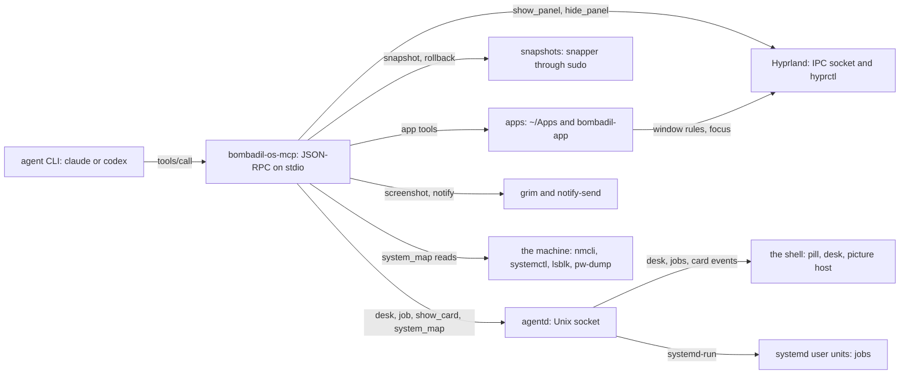
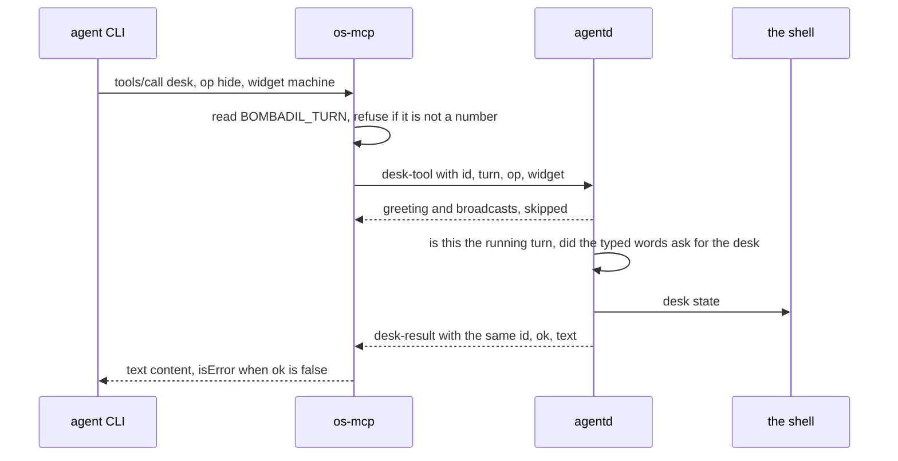

# os-mcp: the OS as tools

> **Status:** Shipped
> **Code:** `bin/bombadil-os-mcp`, `src/bombadil/mcp_server.py`, `src/bombadil/cardtools.py`, `src/bombadil/appkit/tools.py`, `src/bombadil/appkit/placement.py`, `src/bombadil/apps.py`, `src/bombadil/hypr.py`, `src/bombadil/snapshots.py`, `src/bombadil/sysmap.py`, `src/bombadil/cards.py`, `src/bombadil/desk.py`, `src/bombadil/jobs.py`, `src/bombadil/providers.py`
> **Design:** [Foundation choices, section 6](../design/foundation-choices.md#6-provider-switching-claude-codex---mcp-as-the-shared-tool-layer), [UX brief, rule 8](../design/ux-brief.md#the-rules)
> **Verified:** 2026-10-01 against `main` at `26843d3`

os-mcp defines the OS tools: a small MCP server that both agent CLIs load, written by hand (JSON-RPC over stdio, no `mcp` package) to keep the base image small. Panels, apps, screenshots, restore points, pictures, the desk and background jobs are tools in this server, so switching from Claude to Codex changes which CLI `agentd` runs and not which OS tools exist. Each CLI also brings its own built-in tools (a shell, file edits, web search, a plan), which os-mcp does not define and which differ between the two; `providers.system_prompt()` relies on them, and `narrate.tool_step` and `Codex.parse` map them by name (`Bash`, `Read`, `Write`, `Edit`, `WebSearch`, `command_execution`, `file_change`, `web_search`). The server holds no state of its own: it acts on Hyprland and on files directly, and asks `agentd` for what `agentd` owns.

## How it works



1. **Start.** `agentd` runs one CLI process per turn. The CLI starts `bombadil-os-mcp` as a child and talks to it on the child's stdin and stdout, one JSON object per line (how the real CLIs behave here is recorded by the [review of the first milestone](../review/review-findings.md), not checked by a test in the default suite; see "Known gaps"). The server ends when stdin closes (`OsTools.serve` loops over stdin). `bin/bombadil-os-mcp` only adds `src/` to `sys.path` and calls `mcp_server.main()`.
2. **Transport.** `main()` serves on a private copy of stdout and points file descriptor 1 at stderr, so no child process (`snapper`, `grim`, an app) and no stray `print` can write into the JSON-RPC stream.
3. **Registry.** `OsTools.__init__` builds `self.tools`, a dict of name to `(spec, function)`. `_register` adds the screen, restore point, desk and job tools inline, then calls `cardtools.register` (the pictures), then `appkit.tools.register` (the app tools). The last one removes the four first-milestone app entries (`create_app`, `open_app`, `list_apps`, `app_template`) and adds its own, so the app tools are listed together at the end.
4. **Dispatch.** `OsTools.handle` answers `initialize`, `ping`, `tools/list` and `tools/call`. Requests are served one at a time, in order: a slow tool (a panel wait of up to 20 s, an app check of up to 40 s, a job start of up to 25 s) holds up the next call from the same CLI.
5. **Reaching the parts.** A tool acts in one of three ways. It talks to Hyprland itself (`hypr.py`, `appkit/placement.py`), or runs a program or writes files itself (`grim`, `notify-send`, `sudo snapper`, `bombadil-app check`, `~/Apps`), or sends one line to the `agentd` socket for what `agentd` owns: the desk, the jobs and the picture host.

A call that goes through `agentd` looks like this. The tool never decides whether the desk may change: `agentd` does, and the tool carries the question and the answer.



### How a tool talks to Hyprland and to `agentd`

- **Hyprland.** `Hyprland.request(command)` opens `$XDG_RUNTIME_DIR/hypr/$HYPRLAND_INSTANCE_SIGNATURE/.socket.sock`, sends the command (`j/clients`, `j/monitors`, `eval ...`, `dispatch ...`) and reads until the socket closes. With no signature or no socket it raises `RuntimeError("Hyprland is not running")`. `Hyprland.dispatch(lua)` runs `hyprctl dispatch` with a Lua dispatcher such as `hl.dsp.workspace.toggle_special("browser")`, up to three times, because a busy compositor can miss `hyprctl`'s deadline. A panel is a special workspace named `special:<name>`, and a window rule in `hyprland.lua` puts each panel program's window there. App windows go through `appkit/placement.py`, which retries only a connect that failed, because a request Hyprland has read runs even when the client gave up on the answer and a repeated toggle would undo the first. See [app-kit.md](app-kit.md).
- **`agentd`.** `_ask_agentd` opens a fresh connection to the socket for each call, sends one line and reads lines until one has the answer's type and this request's `id`. Everything else is skipped: the greeting, broadcasts, other clients' answers and lines that are not JSON. A timeout, a refused connection or a hang-up becomes a `ToolError` that says what may be unchanged. `cardtools.deliver` opens a fresh connection for a card, sends one `card` line and reads until a `card_ack` (which has no `id`), skipping other lines. It reports failure as a note in the tool's result, not as a `ToolError`, and its 2 s is the socket timeout of each operation, not a deadline for the whole exchange. `agentd` owns the desk, the jobs and the cards; what the shell draws from them is in [shell.md](shell.md).

### How each CLI is told about the server

`providers.get` picks the command: `bombadil-os-mcp` from `PATH`, else `bin/bombadil-os-mcp` of the checkout. Both adapters declare it under the server name `bombadil-os`.

| | Claude (`providers.Claude.command`) | Codex (`providers.Codex.command`) |
|---|---|---|
| Server declared by | `--mcp-config <state dir>/claude-mcp.json --strict-mcp-config`; `providers.mcp_config` rewrites the file on every turn with `{"mcpServers": {"bombadil-os": {"command": ..., "args": []}}}` | `-c mcp_servers.bombadil-os.command=...` and `-c mcp_servers.bombadil-os.env_vars=[...]`, on a fresh and on a resumed turn alike |
| Environment the server gets | what the CLI hands its child: the config sets no `env` block, and `agentd` gives the CLI its own environment plus `CLAUDE_CODE_ENABLE_TODO_TOOLS` (from `Claude.env`), `BROWSER`, `BOMBADIL_TURN`, `BOMBADIL_SOCKET` and, when a restore point was taken, `BOMBADIL_TURN_SNAPSHOT` | Codex's default variables (`HOME`, `PATH`, `SHELL`, `TERM`, `PWD`, as the review recorded) plus the names in `providers.MCP_ENV`: Codex starts MCP servers with an allow-list |
| System prompt | `--append-system-prompt` | `-c developer_instructions=` |
| Tool name in events | `mcp__bombadil-os__<tool>` | the adapter builds the same string from the item's `server` and `tool` |
| Checks the server started | yes: the `system/init` event must show `bombadil-os` as `connected` or `pending`, else an `error` event "the OS tools did not start (bombadil-os: <status>)" | no |
| Why `--strict-mcp-config` | keeps the account's own connectors out, so replies do not end with notices to authorize them | not applicable |

The start check, the overrides repeated on a resumed Codex turn and `MCP_ENV` each answer a finding of the [review of the first milestone](../review/review-findings.md) (items 18, 20 and 21): a failed server went unreported, a resumed turn lost the tools, and Codex started the server without the session's variables. What a real CLI does with the server (that it starts one, ends it when stdin closes, which environment it hands the child and that Codex filters it) is taken from that review; the tests imitate it with a scripted CLI, as "Known gaps" says.

Switching provider (`launcher` words, `bombadil provider`, `agentd.AgentD.choose`) saves the choice in `config.toml`, builds the other adapter with `providers.get` (which resolves the same server command) and, when the provider changed, clears the stored session id, because the other CLI's conversation means nothing to this one. The tools and the files behind them are the same; the model's own conversation is not carried over. `Fake`, the provider for tests, declares no server.

## Interfaces other pieces depend on

The executable is `bin/bombadil-os-mcp`; the ISO links it as `/usr/local/bin/bombadil-os-mcp` (`scripts/build-iso.sh`). The server's name is `bombadil-os`: it is the key in both CLIs' declarations, and the prefix `mcp__bombadil-os__` of every tool name that `narrate.tool_step` and the provider adapters read.

### The protocol the server speaks

| Method | Reply |
|---|---|
| `initialize` | `protocolVersion` `2025-06-18` (the client's requested version is ignored), `capabilities` `{"tools": {}}`, `serverInfo` `{"name": "bombadil-os", "version": "0.1.0"}` |
| `notifications/initialized`, and any other message without an `id` | none. `initialize` is the exception: it is always answered, with `id` null when none was sent. |
| `ping` | `{}` |
| `tools/list` | every tool spec in registration order, with no paging |
| `tools/call` | `params.name` and `params.arguments` (`null` is read as `{}`); a result with `content` blocks and, on failure, `isError: true` |
| any other method | JSON-RPC error `-32601` |

### The tool catalogue

The list below is what `tools/list` returns, in that order. Every tool also appears to the CLIs as `mcp__bombadil-os__<name>`. "Needs" says whether the tool needs a running Hyprland or `agentd` to do its job; tools marked "degrades" still answer without them.

**Screen and system**

| Tool | Arguments | What it does | Backing module | Side effects | Needs |
|---|---|---|---|---|---|
| `show_panel` | `name` (required; `browser`, `files` or `terminal`) | Slides a panel in. If the panel has no window it starts the panel's program and waits up to 20 s for it; returns `panel <name> shown`, with `, its app is still starting` when the wait ran out. Idempotent: it toggles only when the panel is not already showing. | `hypr.py` (`Hyprland.panel`) | Starts the program detached (the browser, `foot`, `nautilus`); toggles the Hyprland special workspace `special:<name>` | Hyprland (socket and `hyprctl`). Without it: error `RuntimeError: Hyprland is not running`. Not `agentd`. |
| `hide_panel` | `name` (required, same values) | Slides a panel out. | `hypr.py` | Toggles the special workspace | Hyprland |
| `screenshot` | none | Returns the whole screen as a PNG image block. | `hypr.py` (`Hyprland.screenshot`) | Runs `grim`; writes `screen.png` into a fresh temporary directory that is never removed | A Wayland session and `grim` (not the Hyprland socket). Not `agentd`. |
| `snapshot` | `description` (required) | Takes a snapper snapshot; returns `snapshot <n>`. See [restore-points.md](restore-points.md). | `snapshots.py` | `sudo snapper -c root create` | `snapper`, `/etc/snapper/configs/root` and passwordless `sudo` (the ISO grants it in `iso/airootfs/etc/sudoers.d/bombadil`: `user ALL=(ALL) NOPASSWD: ALL`). Degrades: returns `snapshots unavailable on this system` as a normal result. |
| `list_snapshots` | none | Lists up to 20 recent snapshots as `[{number, description}]`. | `snapshots.py` | none | Same. Degrades to `[]`. |
| `rollback` | `number` (optional integer) | With a number: makes that snapshot the root at the next boot (`sudo bombadil-rollback <n>`) and returns `rolled back, reboot to apply`. Without: rolls back to the newest `turn:` snapshot older than `BOMBADIL_TURN_SNAPSHOT` (when it is set), so "undo that" skips the snapshot of its own turn. | `snapshots.py` | Changes the root subvolume on the next boot | `snapper`, passwordless `sudo` as above, and `bombadil-rollback`, an ISO script (`iso/airootfs/usr/local/bin/bombadil-rollback`), not part of `src/` or `bin/`. Degrades: without snapper a numbered rollback returns `snapshots unavailable` and an unnumbered one `nothing to undo`. |
| `notify` | `title` (required), `body` | Shows a desktop notification; returns `shown`. | `mcp_server.py` | Runs `notify-send` | The session's D-Bus and a notification daemon. A missing `notify-send` is an error; a failing one is not noticed. |

**Through `agentd`**

| Tool | Arguments | What it does | Backing module | Side effects | Needs |
|---|---|---|---|---|---|
| `desk` | `op` (required; `show`, `hide`, `move`, `fold`, `unfold`, `state`), `widget` (`now`, `watching`, `alive`, `needs`, `away`, `machine`), `rail` (`left`, `right`), `rank` (integer, 0 or more) | Arranges the widgets beside the pill. `agentd` refuses it unless this is the running turn and the person's own typed words asked for the desk; the refusal comes back as an error in `agentd`'s words. See [desk.md](desk.md). | `mcp_server._desk`, then `agentd._desk_tool` and `desk.py` (`Desk.apply`) | When the desk changes: writes `desk.toml` and updates the shell. `state` changes nothing. | `agentd`, and `BOMBADIL_TURN`. Not Hyprland. |
| `job` | `op` (required; `start`, `list`, `stop`), `title`, `command`, `kind` (`job` or `watch`), `seconds` (integer, 1 or more), `id` | Runs a command, a watcher on something already running, or a timer (`seconds`, with an optional command run when it is up) as a transient systemd user unit that outlives the turn; `list` and `stop` say what runs and end one by id. `title` and `command` are required for `job` and `watch`; a timer needs `seconds`. The limits `agentd` enforces are under "Time limits and other constants". | `mcp_server._job`, then `agentd._job_tool` and `jobs.py` (`Jobs`) | `systemd-run --user`, a record and a log under `<state dir>/jobs/`; `stop` runs `systemctl --user stop` | `agentd` and the systemd user manager. `BOMBADIL_TURN` for every op, though `agentd` itself needs a turn only for `start`. Not Hyprland. |

**Pictures.** What a card and a picture are is in [cards-and-pictures.md](cards-and-pictures.md).

| Tool | Arguments | What it does | Backing module | Side effects | Needs |
|---|---|---|---|---|---|
| `show_card` | `shape` (required; `chain`, `layers`, `compare`, `timeline`), `title` (required), `nodes` (required, at most 12), `links` (at most 16), `highlight`, `say`, `linked`, `kind` (only `diagram` is drawn) | Checks the diagram (`cards.validate_diagram`), sends it to `agentd`, and returns the picture in words (its text twin) with `(shown above the bar)` or the reason it was not shown. | `cardtools.py`, `cards.py` | `agentd` broadcasts a `card` event to the bars | `agentd` is optional. Degrades: without it the words come back with `(agentd is not running, so nothing could be drawn.)`. |
| `system_map` | `kind` (required; `network`, `boot`, `service`, `disks`, `sound`, `screens`), `target` (for `service`), `highlight`, `say` | Captures the picture from the machine in the server process, sends it, and returns it in words. The agent only points (`highlight`) and adds one sentence (`say`). | `cardtools.py`, `sysmap.py` | Read-only commands (`ip`, `nmcli`, `lsblk`, `findmnt`, `systemd-analyze`, `systemctl`, `pacman -Qo` for `service`, `pw-dump`, `hyprctl`), a read of `/etc/resolv.conf` and, for `network`, a TCP connect to the provider's API host. Each capture has a 0.5 s budget (`sysmap.BUDGET`), except `boot` (4 s, `BOOT_BUDGET`) and the provider check inside `network` (1.6 s, `PROBE_BUDGET`). Then the same card event | `agentd` optional as above. `screens` needs Hyprland (`hyprctl -j monitors`). An unreadable part comes back as a plain sentence, not an error. |

**App tools.** What an app is and how it runs is in [app-kit.md](app-kit.md). All of them live in `appkit/tools.py`. The ones that act on an existing app take its `name`, as `list_apps` shows it. None needs `agentd`, and none strictly needs Hyprland: window control is in `appkit/placement.py`, which answers with a sentence and does nothing when Hyprland is absent.

| Tool | Arguments | What it does | Side effects |
|---|---|---|---|
| `app_guide` | `topic` | Returns the `bombadil-apps` skill (`SKILL.md`), a reference (`components`, `native`, `runtime`) or an example app's full source. The topics named in the tool's description are read from `share/skills/bombadil-apps` when the server starts. | none |
| `create_app` | `title`, `qml` (required), `files` (map of relative path to text), `python`, `description`, `icon`, `open` (default `true`) | Writes the app, slides it in or hot reloads it when `open` is true (before the check runs), loads it offscreen and returns a text summary (`ok`, `errors` with `file:line`, `warnings`, `console`, `size`, `reloaded`, `window`) and a screenshot. | Writes `~/Apps/<name>/` and a `.desktop` entry; with `open` true (the default), starts `bombadil-app run <name>` if the app is not running; with `open` false nothing is started or shown; runs `bombadil-app check` as a subprocess (40 s limit) |
| `check_app` | `name` | The same check and screenshot, without opening anything. | Writes `<state dir>/apps/<name>.check.png` |
| `open_app` | `name` | Starts the app (or slides it in if it runs) and, for a fresh start, waits up to 3 s for the app's load result. | May start the app |
| `show_app` | `name` | Slides the window in; starts the app if it is not running. | May start the app |
| `hide_app` | `name` | Slides the window out. The app keeps running. | none |
| `close_app` | `name` | Quits the app: `SIGTERM`, then a kill after 3 s. | Ends the app's processes |
| `app_status` | `name` | The app's last load result and the last 40 log lines. | none |
| `list_apps` | none | The apps in `~/Apps` as `{name, title, path, running, shown}`. | none |
| `app_template` | none | The starter `main.qml` and `app.py` from `share/app-template`. | none |

### What the tools send to `agentd`

One JSON object per line over the Unix socket at `paths.socket_path()`: `BOMBADIL_SOCKET`, else `<runtime dir>/agentd.sock`. `agentd` greets every client with `status`, `entries` and `setup` messages when it connects and broadcasts what the turn does; the tools skip everything except their own answer.

| Tool side | Message sent | Answer waited for | Time limit |
|---|---|---|---|
| `_desk` | `{"type": "desk-tool", "id": <32 hex>, "turn": n, "op": ..., "widget"?, "rail"?, "rank"?}` | `{"type": "desk-result", "id": <same>, "ok", "text"}` | `DESK_TIMEOUT`, 10 s |
| `_job` | `{"type": "job-tool", "id": <32 hex>, "turn": n, "op": ..., "title"?, "command"?, "kind"?, "seconds"?, "job"?}`; the job's own id travels as `job`, because `id` names the request | `{"type": "job-result", "id": <same>, "ok", "text"}` | `JOB_TIMEOUT`, 25 s |
| `cardtools.deliver` | `{"type": "card", "card": {...}}` | `{"type": "card_ack", "shown": bool, "errors"?}`, with no id; `shown` is true when a client besides the sender is connected | `ACK_TIMEOUT`, 2 s |

Only the arguments the agent gave are sent. For `desk` and `job`, an answer without the matching `id` is ignored, and an answer may arrive in pieces.

### Environment

| Variable | Used by | Meaning | In `MCP_ENV` (reaches Codex) |
|---|---|---|---|
| `BOMBADIL_TURN` | `desk`, `job` | The turn that started this process; digits only. `agentd` sets it for each turn. Without it both tools refuse. | yes |
| `BOMBADIL_SOCKET` | `desk`, `job`, `show_card`, `system_map` | The `agentd` socket path. `agentd` sets it to its own. | yes |
| `BOMBADIL_TURN_SNAPSHOT` | `rollback` | The snapshot `agentd` took for this turn, set only when one was taken. | yes |
| `HYPRLAND_INSTANCE_SIGNATURE`, `XDG_RUNTIME_DIR` | panels, app windows | Where Hyprland's socket is: `$XDG_RUNTIME_DIR/hypr/<signature>/.socket.sock`. | yes |
| `WAYLAND_DISPLAY`, `DISPLAY` | `screenshot`, programs a tool starts | The graphical session. | yes |
| `XDG_SESSION_TYPE` | no tool reads it | Forwarded for the programs a tool starts. | yes |
| `DBUS_SESSION_BUS_ADDRESS` | `notify` | The session bus. | yes |
| `XDG_CONFIG_HOME`, `XDG_STATE_HOME`, `XDG_DATA_HOME` | everything that reads `paths.py` | Where config, state and data live. | yes |
| `BOMBADIL_STATE`, `BOMBADIL_APPS`, `BOMBADIL_SHARE` | app tools, `app_guide` | Overrides for the state folder, `~/Apps` and the share folder. | yes |
| `BOMBADIL_PROVIDER` | `system_map` | Names the provider on the network picture; else `provider` from `config.toml`, else `claude`. | no |
| `BOMBADIL_RUNTIME`, `BOMBADIL_CONFIG`, `BOMBADIL_DATA` | `paths.py` | Overrides for the runtime, config and data folders. | no |

Programs the tools call, by tool: `hyprctl` (panels, `screens`), `grim`, `notify-send`, `sudo` with `snapper` and `bombadil-rollback` (an ISO script, `iso/airootfs/usr/local/bin/bombadil-rollback`; `sudo` needs no password because of `iso/airootfs/etc/sudoers.d/bombadil`), `pgrep` (app state), the panel programs (`foot`, `nautilus`, the browser from `browser.command()`), and `bombadil-app`, found at `bin/bombadil-app` beside `src/` and run with the server's own interpreter, else on `PATH`. Qt is needed only inside that `bombadil-app` subprocess, never in the server.

### Time limits and other constants

| Constant | Value | Where |
|---|---|---|
| `DESK_TIMEOUT`, `JOB_TIMEOUT` | 10 s, 25 s | `mcp_server.py` |
| `ACK_TIMEOUT` | 2 s, per socket operation | `cardtools.py` |
| `BUDGET`, `BOOT_BUDGET`, `PROBE_BUDGET` | 0.5 s per capture; 4 s for `boot`; 1.6 s for the provider check in `network` | `sysmap.py` |
| `MAX_RUNNING`, `MAX_TITLE`, `MAX_COMMAND`, `MAX_SECONDS` | 20 jobs running at once (another is refused), 80 characters of title (cut), 20,000 characters of command (refused), 7 days for a timer (refused) | `jobs.py`, enforced by `agentd`; see [desk.md](desk.md) |
| `CHECK_TIMEOUT`, `OPEN_WAIT` | 40 s, 3 s | `appkit/tools.py` |
| Panel window wait | 20 s | `Hyprland.panel` |
| Hyprland socket request | 10 s | `Hyprland.request` |
| `hyprctl dispatch` | 15 s each, up to 3 tries | `Hyprland.dispatch` |

## How results and errors are shaped

A tool returns a value or raises; `OsTools.handle` and `_content` turn that into MCP content. A failure inside a tool reaches the agent as text it can read, not as a dead server.

| What happens | What the CLI receives |
|---|---|
| The function returns a `str` | One text block. |
| It returns `{"image": <base64>, "mimeType": ...}` | One image block (`screenshot`). |
| It returns `appkit.tools.Blocks` (has `is_mcp_content`) | The blocks as they are: text, then the screenshot (`create_app`, `check_app`). |
| It returns a dict or a list | One text block of `json.dumps(out, indent=2)` (`list_apps`, `app_template`, `list_snapshots`). |
| It raises `ToolError` | A text block with the message and `isError: true`. The message is meant for the agent to read as it is. |
| It raises anything else | A text block `<ExceptionName>: <message>` and `isError: true`. The server keeps running. |
| `agentd` answers `ok: true` | Its text as a text block, or `Done.` when it is empty. |
| `agentd` answers `ok: false` | `_desk` and `_job` raise `ToolError` with `agentd`'s own sentence, with no class name in front; an empty text becomes `The desk was not changed.` or `Nothing was changed.` |
| `agentd` is missing, silent or hangs up | `ToolError` naming the cause and what may be unchanged, such as `agentd did not answer within 10 seconds, so the desk may be unchanged`. |
| The tool name is unknown | JSON-RPC error `-32602`, `unknown tool <name>`. |
| The line is not JSON, or a message has no `id` (except `initialize`, which is always answered) | No reply. |

Some failures are ordinary results, not errors, because the agent can carry on in words: `snapshot` and `rollback` with no snapper, `system_map` when a part cannot be read, and `show_card` with no `agentd` or no bar (the picture's words plus a parenthesised reason).

Every picture tool returns the card's text twin, such as `How a VPN works: Client → Tunnel [new] → Internet`, followed by `(shown above the bar)`. The agent then writes one short line instead of describing the picture.

## The rules the tools follow

- **Typed.** Each tool has a JSON Schema in `inputSchema`. The enums for panels, widgets, rails, shapes, node states, node sides, `opens` kinds and map kinds are built from the constants the code checks (`sorted(hypr.PANELS)`, `list(desk.WIDGETS)`, `list(desk.RAILS)`, `cards.SHAPES`, `cards.STATES`, `cards.SIDES`, `cards.OPENS`, `sysmap.KINDS`), so those listings cannot drift from the behaviour. The `op` enums of `desk` and `job`, the `kind` enum of `job` and the `kind` enum of `show_card` are literal lists in the declaration, and `agentd.AgentD._desk_tool` repeats the desk's ops in a literal tuple of its own, so a new op has to be added in both places. `jobs.KINDS` also has `timer`, which the tool's enum leaves out on purpose: a timer is `seconds`. The server does not validate arguments against the schema: it passes `arguments` to the function, and each function or `agentd` checks what it needs.
- **Small.** The descriptions are read by the model on every turn, so they stay as short as the rules they carry allow (the full listing is about 13,000 characters of JSON; `job` is the longest description at about 1,050 characters). Action tools answer in a sentence or two. The guide, template, app check, status and list tools return longer text, JSON or an image (`app_guide` returns a whole guide, reference or example app). Only the two picture tools have a size test: together they stay under 6,500 characters of JSON, and a picture comes back as its words, not as its layout.
- **Nothing asks permission.** No tool takes a confirmation, and both CLIs run with their permission checks off. Safety is the restore point: `snapshot`, `rollback` and the snapshot `agentd` takes before every turn. A tool that has to refuse, as `desk` does outside a turn that asked for the desk, says so in words and changes nothing; there is never a prompt to answer.
- **The server stays up and stays quiet.** Failures become text, stdout belongs to the protocol, and no tool imports Qt: an app that crashes Qt crashes `bombadil-app check`, not the server.
- **State is `agentd`'s or a file's, never the server's.** The desk and the jobs are `agentd`'s, apps are folders under `~/Apps`, restore points are snapper's.
- **The machine answers for the machine.** `system_map` takes a `kind`, a `target`, a `highlight` and one sentence; the picture is captured, so the agent cannot misstate it.

## Where state lives

| What | Where | Written by |
|---|---|---|
| The server's own state | none; one `OsTools` per process | |
| Claude's server declaration | `<state dir>/claude-mcp.json`, by default `~/.local/state/bombadil/claude-mcp.json` | `providers.mcp_config`, every turn |
| Codex's server declaration | none; `-c` flags on the command line | `providers.Codex.command` |
| Apps | `~/Apps/<name>/` (`main.qml`, `app.toml`, `app.py`, extra files; `data/` is never written by `create_app`) and `$XDG_DATA_HOME/applications/bombadil-app-<name>.desktop` | `apps.create`, through `create_app` |
| App log, check screenshot, load result | `<state dir>/apps/<name>.log`, `.check.png`, `.status.json` | `apps.run`, `run_check`, the running app |
| Desk | `<state dir>/desk.toml` | `agentd`, on the tool's behalf |
| Jobs | `<state dir>/jobs/<id>.json`, `.log`, `.exit` | `agentd`, on the tool's behalf |
| Screenshots | a temporary directory per call, not removed | `screenshot` |
| Restore points | snapper's `root` config, btrfs | `snapshots.py` |

`<state dir>` is `paths.state_dir()`: `BOMBADIL_STATE`, else `$XDG_STATE_HOME/bombadil`, else `~/.local/state/bombadil`.

## Principles it keeps

- [One machine, one conversation](../principles.md#one-machine-one-conversation): an ability goes into this server, not into one provider's prompt or adapter. The trap is a feature that works only because one CLI has a built-in for it; the other provider then drifts. The adapters in `providers.py` may differ in how they declare the server, never in what it offers.
- [Full access, with undo](../principles.md#full-access-with-undo): tools act, and undo is the restore point. The trap is a confirmation argument, a "dry run" mode or a tool that waits for an answer; make the effect visible and undoable instead (`narrate` gives each tool a plain line, the restore point covers the system).
- [Records answer before models](../principles.md#records-before-models): pictures of the machine are captured by `sysmap`, and the agent only points at them. The trap is a tool that accepts node data for the machine's state and draws it from the model's memory.
- [Nothing runs on its own that the person cannot see and stop](../principles.md#nothing-runs-unseen): background work goes through `job`, which makes a systemd user unit with a row on the desk and a stop. The trap is a tool that leaves a process running with `&`, `nohup` or a detached spawn and no row.
- [Every piece degrades](../principles.md#degrade-and-recover): a missing Hyprland, `agentd`, snapper or bar gives a sentence, not a crash, and the server never depends on Qt or on `agentd` to start. The trap is an import or a call at registration time that can fail on a machine without one of them.
- [Quiet at rest](../principles.md#quiet-at-rest): the `desk` tool is gated by the person's own words, because a widget that appears unasked is a popup. The trap is a tool that moves something on screen on the model's own initiative; put the gate in `agentd`, where the typed prompt is known, as `desk` does. The gate is a courtesy, not a security boundary.

## Extending it

### Add a tool that acts inside the server

1. Decide where it lives. One tool goes inside `OsTools._register` in `src/bombadil/mcp_server.py`. A group goes in its own module with a `register(tools)` function, as `cardtools.py` and `appkit/tools.py` do, imported lazily and called in `_register` after `cardtools.register(self)` and before `app_tools.register(self)`: the app tools stay last (see step 4).
2. Declare it with the decorator `t = self._tool`: `@t("name", "description", {properties}, ["required"])` above `def name(a):`, where `a` is the arguments dict. `_tool` stores `({"name", "description", "inputSchema": {"type": "object", "properties", "required"}}, function)` in `self.tools`. Build an enum from the constant the code checks where one exists (`hypr.PANELS`, `desk.WIDGETS`, `desk.RAILS`, `cards.SHAPES`, `cards.STATES`, `sysmap.KINDS`); an `op` or `kind` enum is a literal list, so repeat it wherever `agentd` or the module checks it by hand (see "The rules the tools follow", Typed). A second registration of a name silently replaces the first and keeps its place in the order; `appkit.tools.register` pops the old entries first to move them to the end.
3. Return a `str`, a dict or list, an image dict or `appkit.tools.Blocks` (see the shapes above). Raise `ToolError("a plain sentence")` for what the agent can fix; any other exception reaches the agent as `Name: message`. Do not import Qt, and do not print to stdout.
4. Keep the group order: register a group before the `app_tools.register(self)` call. `test_app_tools_are_listed_together_and_point_at_the_guide` fails if the app tools are not the last ten.
5. Tell the agent. The tool's `description` is read on every turn, so say when to use it and what it refuses, as `job` and `desk` do. Add it to `providers.system_prompt()` only if it must be used without being asked (the prompt names `show_panel`, `create_app`, `app_guide`, `rollback`, `system_map` and `show_card`). A tool that helps build apps also goes in `share/skills/bombadil-apps/SKILL.md` and the tool table of its `references/runtime.md`.
6. Give it a plain line for the status above the pill: add a branch for the tool name in `narrate._os_tool` returning `Step(text, done, risk)`. Without one the line reads "Working on it". Add a row to the parametrized list near the top of `tests/test_narrate.py`.
7. Test it in `tests/test_mcp_server.py`: `make()` builds an `OsTools` with `FakeHypr` and `FakeSnaps`, `call(server, "name", **args)` returns the result, and the `home` fixture keeps every path in a temporary folder. Assert the schema as `test_the_desk_tool_is_listed_with_what_it_can_do_and_no_more` does.
8. Update the catalogue above and the tool list in `README.md`.

### Add a tool that asks `agentd`

1. Declare the tool in `OsTools._register` as in the first recipe: the `@t(...)` declaration (step 2), the description (step 5), the `narrate._os_tool` branch (step 6) and the catalogue and `README.md` (step 8). The declared function calls the helper of step 2; a helper that no declared tool calls does nothing.
2. Write that helper in the server, following `_desk` and `_job`: read `BOMBADIL_TURN` and refuse without it, build `{"type": "<name>-tool", "id": uuid.uuid4().hex, "turn": int(turn), ...only the arguments given}`, and call `_ask_agentd(msg, "<name>-result", TIMEOUT, subject, recheck)`. `subject` and `recheck` are the words of the timeout error. Raise `ToolError(reply["text"])` when `ok` is false.
3. In `agentd`, add a branch to `AgentD.handle` beside `desk-tool` and `job-tool` that answers only the sender with `{"type": "<name>-result", "id": msg.get("id"), "ok": bool, "text": str}`. Check `msg["turn"] == self.current` and `not self.stopping`, as `_desk_tool` and `_job_tool` do, and document the pair in the docstring at the top of `agentd.py`. See [agentd.md](agentd.md).
4. If the tool needs another environment variable, add it to `providers.MCP_ENV`, or Codex will not pass it on.
5. Test both ends. In `tests/test_mcp_server.py` use `_agentd(answer)`, a stand-in socket that greets like `agentd`, records the one line it is sent and replies. In `tests/test_agentd.py` use `_mcp_turn(arguments, tool)`, which runs the real server as a child of a scripted CLI, as in `test_the_real_os_mcp_server_reaches_the_desk_from_inside_a_turn`.

### Add a panel

1. Add the name to `hypr.PANELS`, with the command as a list or `None` and a branch in `panel_command`. Give the command an `--app-id=` or `--class=` argument so `_launching` can see that it is already starting; the `files` panel has neither (see "Known gaps").
2. In `iso/airootfs/etc/skel/.config/hypr/hyprland.lua` add a `panel-<name>` window rule that puts the window's class into `special:<name> silent`, and a key bind if wanted.
3. `show_panel` and `hide_panel` take the name from `sorted(hypr.PANELS)` when the server starts. Add the spoken words to `launcher.PANEL_WORDS` and `launcher.PANEL_TITLES`, and the line words to `narrate.PANEL_WORDS`.

### Change how a CLI is told about the server, or add a provider

Steps 1 to 3 are all there is to changing how an existing CLI is told about the server. A new provider needs every step.

1. A provider is a `Provider` subclass in `src/bombadil/providers.py`, listed in `PROVIDERS` and, to be selectable, in `config.PROVIDERS`. Its `command()` must declare `self.mcp_command` under the server name `bombadil-os` and give the system prompt. Variables the CLI needs on top of the daemon's own go in `Provider.env()`, as `Claude.env` does.
2. If the CLI starts MCP servers with a filtered environment, pass `MCP_ENV` as `Codex.command` does, on resumed turns too.
3. Its `parse()` must report an MCP tool call as `mcp__bombadil-os__<tool>`, which `narrate.tool_step` reads, and should report a server that did not start, as `Claude._events` does.
4. Implement the sign-in members: `login_command` (or `signin_command`), `signin_host`, `signin_url_kind`, `code_from_url`, `signed_in`, `credentials`, `SIGNED_OUT` and `SIGNIN_ERRORS`. The base class's defaults recognise nothing (`signin_url_kind`, `code_from_url` and `signed_in` return `None`, `SIGNED_OUT` is empty, `login_command` runs the bare binary). What each is for is in [browser-and-signin.md](browser-and-signin.md).
5. Name the provider where other code lists providers: the words that switch to it in `launcher.PROVIDER_WORDS`, and its name and API host in `sysmap.PROVIDER_HOSTS`. Without an entry there, the network picture falls back to Claude's name and `api.anthropic.com`.
6. Install its CLI on the machine: the `npm install -g` line in `scripts/build-iso.sh` and the choice in `iso/airootfs/usr/local/bin/bombadil-setup`. See [iso-and-install.md](iso-and-install.md).
7. Test it in `tests/test_providers.py` the way `test_claude_command_and_events` and `test_codex_command_and_events` do. A new entry in `config.PROVIDERS` also changes the first-boot chooser, so update the chip lists asserted in `tests/test_agentd_signin.py` (`test_first_boot_asks_which_ai_and_holds_prompts_until_signed_in` expects exactly `provider:claude` and `provider:codex`).

## Tests

| File | What it covers |
|---|---|
| `tests/test_mcp_server.py` | The protocol methods, the panel and snapshot tools with fakes, `rollback` skipping the turn's own snapshot, serving over stdio, the `desk` and `job` tools against a stand-in `agentd` (turn, ids, only given arguments, refusals as errors, timeouts, hang-ups, answers in pieces), and `MCP_ENV` carrying the turn. |
| `tests/test_cardtools.py` | The picture tools' schemas and size budget, every fixable error at once, the words returned with and without `agentd` or a bar, `system_map` reading and pointing, the provider name, and a card crossing a real socket to `agentd`. |
| `tests/test_appkit_tools.py` | The app tools with the check and Hyprland faked: results with a screenshot, reload, failed checks, bad files, the check run against the app's own folder, `app_guide` topics, tool order, and that no Qt is imported. |
| `tests/test_agentd.py` | The real server as a child of a scripted CLI reaching the `desk` and `job` tools, and agentd's side of each message. |
| `tests/test_providers.py` | How each CLI is told about the server: the Claude config file, `--strict-mcp-config`, the Codex overrides on fresh and resumed turns, the server start check. |

```sh
python3 -m pip install -e '.[dev]'
pytest -q tests/test_mcp_server.py tests/test_cardtools.py tests/test_appkit_tools.py tests/test_providers.py
pytest -q tests/test_agentd.py -k "real_os_mcp or desk_tool or job_tool or card_from_os_mcp"
```

To list the catalogue or call a tool by hand:

```sh
printf '%s\n' '{"jsonrpc":"2.0","id":1,"method":"initialize","params":{}}' \
  '{"jsonrpc":"2.0","id":2,"method":"tools/list"}' | bin/bombadil-os-mcp
```

Two checks need more than pytest. `iso/airootfs/usr/local/bin/bombadil-smoke` runs inside the booted ISO and calls the server as the agent would (`os-mcp-lists-tools`, `browser-panel`, `create-app`, `os-mcp-lists-pictures`, one `picture-*` per kind). `tests/desktop/` runs a real Claude CLI against a scripted API that calls `create_app` and `show_card` through the real server; it needs Docker and a `claude` binary. How to run both is in [development.md](../contributing/development.md).

## Known gaps

- **First-milestone code is still in `mcp_server.py`.** That is the code of the first merged milestone (see [history.md](../history.md)). The inline `create_app`, `open_app`, `list_apps` and `app_template`, and the helpers `_is_running`, `_stop`, `_app_state` and `_share` that only they use, are registered and then removed by `appkit.tools.register`. Copy the app kit's versions, not these. `Hyprland.place_app` and its slot file `app-placements.json` are used only by the launcher's fallback for when `appkit.placement` cannot be imported.
- **Invalid input ends the server.** Any structurally invalid `tools/call` (no `params`, `params` that is not an object, no `name`, or a `name` that is a list or an object) and any JSON line that is not an object (a list, a number, `null` or a string) raises out of `handle`, and `serve` has no `try` around it, so the process exits. They raise `KeyError`, `TypeError` and `AttributeError` (`mcp_server.py`, `handle` and `serve`). Each reproduces by writing the line to the server's stdin; the next `ping` is not answered.
- **Arguments are not checked against the schema.** A missing required argument shows up as the exception's text (for example `KeyError: 'name'`).
- **Many errors carry a class name.** `ToolError` is meant to give the agent plain words, but `show_card` and `app_guide` raise `ValueError`, `hypr.Hyprland.panel` raises `ValueError` for a panel name that is not known, `apps.create` raises `ValueError` for a bad title or bad `files`, and `apps.load` raises `FileNotFoundError` (`no app named ...`) for `check_app`, `open_app`, `show_app`, `hide_app`, `close_app` and `app_status` given an unknown name. Their text starts with the class name, such as `ValueError:`.
- **`screenshot` leaves a temporary directory behind** on every call, and **`notify` returns `shown`** whatever exit status `notify-send` had (`check=False`).
- **`MCP_ENV` omits `BOMBADIL_PROVIDER`, `BOMBADIL_CONFIG`, `BOMBADIL_RUNTIME` and `BOMBADIL_DATA`** (`providers.py`). Under Codex, `system_map` takes the provider's name for the network picture from `config.toml` even when `BOMBADIL_PROVIDER` is set in `agentd`'s environment.
- **Only the Claude adapter notices a server that did not start.** `Codex.parse` has no such check.
- **How the real CLIs treat the server is not tested by the default suite.** That each CLI starts the server as a child and closes its stdin at the end, which environment Claude Code gives the child and that Codex passes only an allow-list are recorded by the [review of the first milestone](../review/review-findings.md) and imitated by `tests/test_agentd.py` (`_mcp_turn`, a scripted CLI). Only `tests/desktop/`, which needs Docker and a `claude` binary and was not run for this page, uses a real Claude CLI, and no test uses a real Codex CLI.
- **`_launching` cannot see the `files` panel starting.** `hypr.PANELS["files"]` is `["nautilus"]`, with no `--class=` or `--app-id=` argument, so `_launching` returns false for it. A second `show_panel files` after the 20 s wait has run out starts Nautilus again (`hypr.py`, `Hyprland.panel`).
- **`rollback` and the typed word `undo` are two paths.** The word is answered by `launcher.py` without the model and keeps a marker so that repeated undos go one turn further back; the tool takes the newest `turn:` snapshot older than the turn's own and keeps no marker.
- **`show_card` draws only `diagram`.** The `kind` argument exists for other kinds; any other value is refused (`cardtools.py`).
- **Designed, not built.** The design briefs describe tools this server does not have: browser control (open, look, click, type), window arrangement, memory and Brain search, coding-session control, promises and routines, and mail and calendar tools. The briefs are [passenger](../design/passenger-brief.md), [UX](../design/ux-brief.md), [brain](../design/brain-brief.md), [dev](../design/dev-brief.md) and [everyday work](../design/everyday-work-brief.md); [foundation choices](../design/foundation-choices.md) lists browser control among the abilities of `os-mcp`, and no browser tool exists. Unmerged work adds a read-only `asks` tool and the mail tools to this registry; neither is on `main`.
