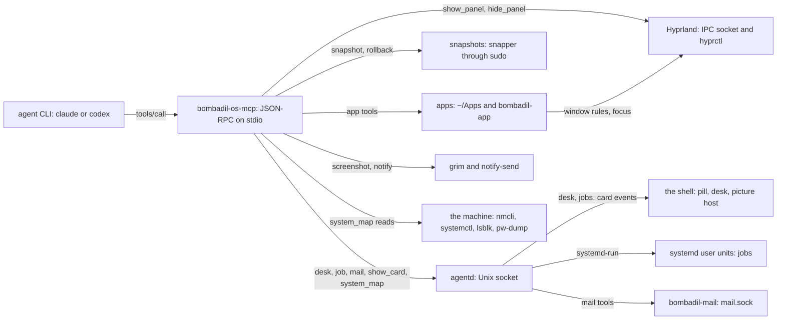
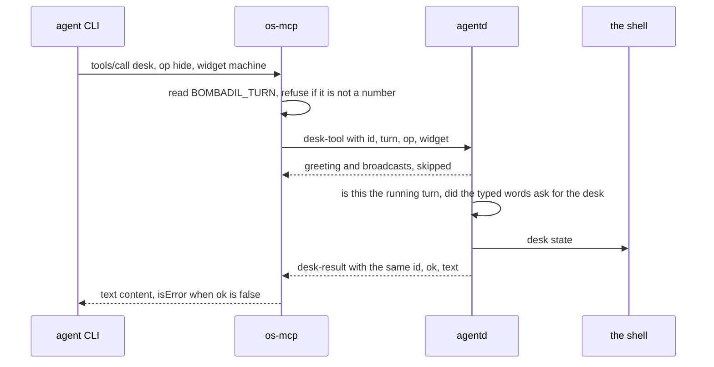

# os-mcp: the OS as tools

> **Status:** Shipped
> **Code:** `bin/bombadil-os-mcp`, `src/bombadil/mcp_server.py`, `src/bombadil/cardtools.py`, `src/bombadil/mail/tools.py`, `src/bombadil/appkit/tools.py`, `src/bombadil/appkit/placement.py`, `src/bombadil/apps.py`, `src/bombadil/hypr.py`, `src/bombadil/snapshots.py`, `src/bombadil/sysmap.py`, `src/bombadil/cards.py`, `src/bombadil/desk.py`, `src/bombadil/jobs.py`, `src/bombadil/providers.py`, `src/bombadil/agentd.py` (the other end of `desk`, `job` and mail), `src/bombadil/narrate.py`, `src/bombadil/mail/client.py` (what the mail broker reaches the service with)
> **Design:** [Foundation choices, section 6](../design/foundation-choices.md#6-provider-switching-claude-codex---mcp-as-the-shared-tool-layer), [UX brief, rule 8](../design/ux-brief.md#the-rules), [Everyday work brief, piece 1](../design/everyday-work-brief.md#1-mail-in-bombadils-own-view) (the mail tools)
> **Verified:** 2026-10-01 against `main` at `969b80b`

os-mcp defines the OS tools: a small MCP server that both agent CLIs load, written by hand (JSON-RPC over stdio, no `mcp` package) to keep the base image small. Panels, apps, screenshots, restore points, pictures, the desk, background jobs and mail are 26 tools in this server, so switching from Claude to Codex changes which CLI `agentd` runs and not which OS tools exist. The server keeps no state on disk: it acts on Hyprland and on files directly, and asks `agentd` for what `agentd` owns (the desk, the jobs, the pictures and mail).

## How it works



1. **Start.** `agentd` runs one CLI process per turn. The CLI starts `bombadil-os-mcp` as a child and talks to it on the child's stdin and stdout, one JSON object per line. The server ends when stdin closes (`OsTools.serve` loops over stdin); that a real CLI closes it at the end of a turn is assumed by the code and recorded nowhere (see "Known gaps"). `bin/bombadil-os-mcp` only adds `src/` to `sys.path` and calls `mcp_server.main()`.
2. **Transport.** `main()` serves on a private copy of stdout and points file descriptor 1 at stderr, so no child process (`snapper`, `grim`, an app) and no stray `print` can write into the JSON-RPC stream.
3. **Registry.** `OsTools.__init__` builds `self.tools`, a dict of name to `(spec, function)`. `_register` adds the panel, screen, restore point, desk and job tools inline (and four first-milestone app tools), then calls `cardtools.register` (the pictures), then `mail.tools.register` (the five mail tools), then `appkit.tools.register` (the app tools). The last one removes the four first-milestone app entries (`create_app`, `open_app`, `list_apps`, `app_template`) and adds its own ten, so the app tools are listed together at the end.
4. **Dispatch.** `OsTools.handle` answers `initialize`, `ping`, `tools/list` and `tools/call`. Requests are served one at a time, in order: a slow tool (a panel wait of up to 20 s, an app check of up to 40 s, a job start of up to 25 s, a mail call of up to 30 s) holds up the next call from the same CLI.
5. **Reaching the parts.** A tool acts in one of three ways. It talks to Hyprland itself (`hypr.py`, `appkit/placement.py`), or runs a program or writes files itself (`grim`, `notify-send`, `sudo snapper`, `bombadil-app check`, `~/Apps`), or sends one line to the `agentd` socket for what `agentd` owns: the desk, the jobs, the picture host and, for mail, the broker that asks the mail service.

A call that goes through `agentd` looks like this. The tool never decides whether the desk may change: `agentd` does, and the tool carries the question and the answer.



A mail call has one more hop. The tool is one line to `agentd` as well, but the answer comes from `agentd`'s broker (`mail.tools.Broker`), which asks the mail service on `mail.sock` from a worker thread (`mail/client.py`, through `mail/watch.py`) and answers in text for the model. The os-mcp process never opens `mail.sock`, so the service and the Thunderbird behind it are out of a tool's reach. What the service and the engine are is in [mail.md](mail.md).

### How a tool talks to Hyprland and to `agentd`

- **Hyprland.** `Hyprland.request(command)` opens `$XDG_RUNTIME_DIR/hypr/$HYPRLAND_INSTANCE_SIGNATURE/.socket.sock`, sends the command (`j/clients`, `j/monitors`, `eval ...`, `dispatch ...`) and reads until the socket closes. With no signature or no socket it raises `RuntimeError("Hyprland is not running")`. `Hyprland.dispatch(lua)` runs `hyprctl dispatch` with a Lua dispatcher such as `hl.dsp.workspace.toggle_special("browser")`, up to three times, because a busy compositor can miss `hyprctl`'s deadline. A panel is a special workspace named `special:<name>`, and a window rule in `hyprland.lua` puts each panel program's window there. App windows go through `appkit/placement.py`, which retries only a connect that failed, because a request Hyprland has read runs even when the client gave up on the answer and a repeated toggle would undo the first. See [app-kit.md](app-kit.md).
- **`agentd`.** `_ask_agentd` opens a fresh connection to the socket for each call, sends one line (`_line`: text as UTF-8, not as `\u` escapes, which would make a long mail in another script six times as long; a lone surrogate cannot be text, so that one message goes escaped) and reads lines until one has the answer's type and this request's `id`. `desk`, `job` and the mail tools all go through it. Everything else is skipped: the greeting, broadcasts, other clients' answers and lines that are not JSON. A timeout or a hang-up becomes a `ToolError` that says what may be unchanged; a refused connection or a missing socket becomes one that says it is unchanged. `cardtools.deliver` opens a fresh connection for a card, sends one `card` line and reads until a `card_ack` (which has no `id`), skipping other lines. It reports failure as a note in the tool's result, not as a `ToolError`, and its 2 s is the socket timeout of each operation, not a deadline for the whole exchange. `agentd` owns the desk, the jobs, the cards and the mail broker; what the shell draws from them is in [shell.md](shell.md).

### How each CLI is told about the server

`providers.get` picks the command: `bombadil-os-mcp` from `PATH`, else `bin/bombadil-os-mcp` of the checkout. Both adapters declare it under the server name `bombadil-os`. Each CLI also brings its own built-in tools (a shell, file edits, web search, a plan), which os-mcp does not define and which differ between the two; `providers.system_prompt()` relies on them, and `narrate.tool_step` and `Codex.parse` map them by name (`Bash`, `Read`, `Write`, `Edit`, `WebSearch`, `command_execution`, `file_change`, `web_search`).

| | Claude (`providers.Claude.command`) | Codex (`providers.Codex.command`) |
|---|---|---|
| Server declared by | `--mcp-config <state dir>/claude-mcp.json --strict-mcp-config`; `providers.mcp_config` rewrites the file on every turn with `{"mcpServers": {"bombadil-os": {"command": ..., "args": []}}}` | `-c mcp_servers.bombadil-os.command=...` and `-c mcp_servers.bombadil-os.env_vars=[...]`, on a fresh and on a resumed turn alike |
| Environment the server gets | assumed to be the CLI's own environment, which is not recorded for a real Claude Code: the config sets no `env` block, and `agentd` gives the CLI its own environment plus `CLAUDE_CODE_ENABLE_TODO_TOOLS` (from `Claude.env`), `BROWSER`, `BOMBADIL_TURN`, `BOMBADIL_SOCKET` and, when a restore point was taken, `BOMBADIL_TURN_SNAPSHOT` | Codex's default variables (`HOME`, `PATH`, `SHELL`, `TERM`, `PWD`, as the review recorded) plus the names in `providers.MCP_ENV`: Codex starts MCP servers with an allow-list |
| System prompt | `--append-system-prompt` | `-c developer_instructions=` |
| Tool name in events | `mcp__bombadil-os__<tool>` | the adapter builds the same string from the item's `server` and `tool` |
| Checks the server started | yes: the `system/init` event must show `bombadil-os` as `connected` or `pending`, else an `error` event "the OS tools did not start (bombadil-os: <status>)" | no |
| Why `--strict-mcp-config` | keeps the account's own connectors out, so replies do not end with notices to authorize them | not applicable |

The start check, the overrides repeated on a resumed Codex turn and `MCP_ENV` each answer a finding of the [review of the first milestone](../review/review-findings.md) (items 18, 20 and 21): a failed server went unreported, a resumed turn lost the tools, and Codex started the server without the session's variables. The same review, which ran Claude Code 2.1.283 and codex-cli 0.157.1 on 2026-09-27, records that Claude Code accepts `--mcp-config` with `{"mcpServers": {...}}` and auto-approves MCP tools under `bypassPermissions`, and that Codex starts the server with only `HOME`, `PATH`, `SHELL`, `TERM` and `PWD`. The stdin close and Claude Code's environment for its child are not in the review (see "Known gaps").

`Provider.describe_command` is the other way a CLI is run, for the Brain's one-line descriptions (`brain/describe.py`; see [agentd.md](agentd.md#providers)). It declares no server: Claude gets `--tools ""` and `--strict-mcp-config` with no config, Codex a read-only sandbox, so the OS tools are not loaded there (`Claude.describe_command` and `Codex.describe_command` in `providers.py`).

Switching provider (`launcher` words, `bombadil provider`, `agentd.AgentD.choose`) saves the choice in `config.toml`, ends a pause made by hand on the chosen provider (`rest.clear_hand`), builds the other adapter with `providers.get` (which resolves the same server command) and, when the provider changed, clears the stored session id, because the other CLI's conversation means nothing to this one. The tools and the files behind them are the same; the model's own conversation is not carried over. `Fake`, the provider for tests, declares no server.

## Interfaces other pieces depend on

The executable is `bin/bombadil-os-mcp`; the ISO links it as `/usr/local/bin/bombadil-os-mcp` (`scripts/build-iso.sh`). The server's name is `bombadil-os`: it is the key in both CLIs' declarations, and the prefix `mcp__bombadil-os__` of every tool name that `narrate.tool_step` and the provider adapters read.

### What the machine must provide

- **Python 3.11 or newer, and nothing from outside the standard library.** `pyproject.toml` has `requires-python = ">=3.11"` and `dependencies = []`; `apps.py` imports `tomllib`, which Python added in 3.11. Qt is needed only inside the `bombadil-app` subprocess, never in the server.
- **Hyprland with its Lua configuration, for panels and app windows.** The tools use Lua dispatchers and rules (`hl.dsp.*`, `hl.window_rule`, `eval` over the socket), which `hypr.py:142` dates to 0.55; the review of the first milestone checked 0.56.2, and the ISO ships `iso/airootfs/etc/skel/.config/hypr/hyprland.lua`.
- Everything else is per tool and listed under `Needs` below: a tool whose part is missing answers in words or with an error and the server carries on.

### The protocol the server speaks

| Method | Reply |
|---|---|
| `initialize` | `protocolVersion` `2025-06-18` (the client's requested version is ignored), `capabilities` `{"tools": {}}`, `serverInfo` `{"name": "bombadil-os", "version": "0.1.0"}` |
| `notifications/initialized`, and any other message without an `id` | none. `initialize` is the exception: it is always answered, with `id` null when none was sent. |
| `ping` | `{}` |
| `tools/list` | every tool spec in registration order, with no paging |
| `tools/call` | `params.name` and `params.arguments` (`null` is read as `{}`); a result with `content` blocks and, on failure, `isError: true` |
| any other method | JSON-RPC error `-32601` |

### The tool catalogue

`tools/list` returns 26 tools, in this order (checked on 2026-10-01): `show_panel`, `hide_panel`, `screenshot`, `snapshot`, `list_snapshots`, `rollback`, `notify`, `desk`, `job`, `show_card`, `system_map`, then the five mail tools `mail_search`, `mail_read`, `mail_mark`, `mail_draft`, `mail_show`, then the ten app tools `app_guide`, `create_app`, `check_app`, `open_app`, `show_app`, `hide_app`, `close_app`, `app_status`, `list_apps`, `app_template`. Every tool also appears to the CLIs as `mcp__bombadil-os__<name>`. "Needs" says whether the tool needs a running Hyprland or `agentd` to do its job; tools marked "degrades" still answer without them.

**Screen and system**

| Tool | Arguments | What it does | Backing module | Side effects | Needs |
|---|---|---|---|---|---|
| `show_panel` | `name` (required; `browser`, `files` or `terminal`) | Slides a panel in. If the panel has no window it starts the panel's program and waits up to 20 s for it; returns `panel <name> shown`, with `, its app is still starting` when the wait ran out. Idempotent: it toggles only when the panel is not already showing. | `hypr.py` (`Hyprland.panel`) | Starts the program detached (the browser, `foot`, `nautilus`); toggles the Hyprland special workspace `special:<name>` | Hyprland (socket and `hyprctl`). Without it: error `RuntimeError: Hyprland is not running`. Not `agentd`. |
| `hide_panel` | `name` (required, same values) | Slides a panel out. | `hypr.py` | Toggles the special workspace | Hyprland |
| `screenshot` | none | Returns the whole screen as a PNG image block. | `hypr.py` (`Hyprland.screenshot`) | Runs `grim`; writes `screen.png` into a fresh temporary directory that is never removed | A Wayland session and `grim` (not the Hyprland socket). Not `agentd`. |
| `snapshot` | `description` (required) | Takes a snapper snapshot; returns `snapshot <n>`. See [restore-points.md](restore-points.md). | `snapshots.py` | `sudo snapper -c root --jsonout create` | `snapper`, `/etc/snapper/configs/root` and passwordless `sudo` (the ISO grants it in `iso/airootfs/etc/sudoers.d/bombadil`: `user ALL=(ALL) NOPASSWD: ALL`). Degrades: returns `snapshots unavailable on this system` as a normal result. |
| `list_snapshots` | none | Lists up to 20 recent snapshots as `[{number, description}]`. | `snapshots.py` | none | Same. Degrades to `[]`. |
| `rollback` | `number` (optional integer) | With a number: makes that snapshot the root at the next boot (`sudo bombadil-rollback <n>`) and returns `rolled back, reboot to apply`. Without: rolls back to the newest `turn:` snapshot older than `BOMBADIL_TURN_SNAPSHOT` (when it is set), so "undo that" skips the snapshot of its own turn. | `snapshots.py` | Changes the root subvolume on the next boot | `snapper`, passwordless `sudo` as above, and `bombadil-rollback`, an ISO script (`iso/airootfs/usr/local/bin/bombadil-rollback`), not part of `src/` or `bin/`. Degrades: without snapper a numbered rollback returns `snapshots unavailable` and an unnumbered one `nothing to undo`. |
| `notify` | `title` (required), `body` | Shows a desktop notification; returns `shown`. | `mcp_server.py` | Runs `notify-send` | The session's D-Bus and a notification daemon. A missing `notify-send` is an error; a failing one is not noticed. |

**Through `agentd`**

| Tool | Arguments | What it does | Backing module | Side effects | Needs |
|---|---|---|---|---|---|
| `desk` | `op` (required; `show`, `hide`, `move`, `fold`, `unfold`, `state`), `widget` (`now`, `watching`, `alive`, `needs`, `away`, `machine`), `rail` (`left`, `right`), `rank` (integer, 0 or more) | Arranges the widgets beside the pill. `agentd` refuses it unless this is the running turn and the person's own typed words asked for the desk; the refusal comes back as an error in `agentd`'s words. `show` on `machine` is also a question: it answers `Here is the machine.` and raises the Machine card even when nothing is wrong (`desk.ASKABLE`, `Desk.on_ask`). See [desk.md](desk.md). | `mcp_server._desk`, then `agentd._desk_tool` and `desk.py` (`Desk.apply`) | When the desk changes: writes `desk.toml` and updates the shell. `state` changes nothing. | `agentd`, and `BOMBADIL_TURN`. Not Hyprland. |
| `job` | `op` (required; `start`, `list`, `stop`), `title`, `command`, `kind` (`job` or `watch`), `seconds` (integer, 1 or more), `id` | Runs a command, a watcher on something already running, or a timer (`seconds`, with an optional command run when it is up) as a transient systemd user unit that outlives the turn; `list` and `stop` say what runs and end one by id. `title` and `command` are required for `job` and `watch`; a timer needs `seconds`. The limits on running jobs, titles, commands and timers are in [desk.md](desk.md). | `mcp_server._job`, then `agentd._job_tool` and `jobs.py` (`Jobs`) | `systemd-run --user`, a record and a log under `<state dir>/jobs/`; `stop` runs `systemctl --user stop` | `agentd` and the systemd user manager. `BOMBADIL_TURN` for every op, though `agentd` itself needs a turn only for `start`. Not Hyprland. |

**Pictures.** What a card and a picture are is in [cards-and-pictures.md](cards-and-pictures.md), which also owns what each capture reads.

| Tool | Arguments | What it does | Backing module | Side effects | Needs |
|---|---|---|---|---|---|
| `show_card` | `shape` (required; `chain`, `layers`, `compare`, `timeline`), `title` (required), `nodes` (required, at most 12), `links` (at most 16), `highlight`, `say`, `linked`, `kind` (only `diagram` is drawn) | Checks the diagram (`cards.validate_diagram`), sends it to `agentd`, and returns the picture in words (its text twin) with `(shown above the bar)` or the reason it was not shown. | `cardtools.py`, `cards.py` | `agentd` broadcasts a `card` event to the bars. While the model writes the call, the streamed draft is found by a tool name that ends in `__show_card` (`cards.CardStream.feed`), so the name is not free to change or copy: see [streaming](cards-and-pictures.md#streaming-a-box-at-a-time) | `agentd` is optional. Degrades: without it the words come back with `(agentd is not running, so nothing could be drawn.)`. |
| `system_map` | `kind` (required; `network`, `boot`, `service`, `disks`, `sound`, `screens`), `target` (for `service`), `highlight`, `say` | Captures the picture from the machine in the server process, sends it, and returns it in words. The agent only points (`highlight`) and adds one sentence (`say`). `boot` draws the slowest units from `systemd-analyze blame` when the critical chain has fewer than four steps and `blame` has more to show; `service` finds a unit typed with the wrong capitals (`networkmanager` for `NetworkManager.service`). | `cardtools.py`, `sysmap.py` | Read-only commands (`ip`, `nmcli`, `lsblk`, `findmnt`, `systemd-analyze`, `systemctl`, `pacman -Qo` for `service`, `pw-dump`, `hyprctl`), a read of `/etc/resolv.conf` and, for `network`, a TCP connect to the provider's API host. Then the same card event | `agentd` optional as above. `screens` needs Hyprland (`hyprctl -j monitors`). An unreadable part comes back as a plain sentence, not an error. |

**Mail tools.** The mail tools prepare and never release: no tool, argument or description names a send, and a draft waits in the Mail view until the person's own press on Send (`tests/test_mail_tools.py::test_the_five_mail_tools_are_there_and_none_of_them_sends`, `tests/test_mcp_server.py::test_the_mail_tools_are_listed_and_there_is_no_way_to_send`). The service, the press and the window are in [mail.md](mail.md). `mail/tools.py` holds both ends: `register` declares the tools in the os-mcp process, and `Broker` is what `agentd` does for each op. Every tool sends one `mail-tool` line to `agentd` (the mail's own id travels as `mail`, because `id` names the request), and `agentd._mail_tool` refuses it unless `turn` is the running turn and not being stopped. Unlike `desk`, the person's typed words do not gate a mail tool, but they travel with each draft, so the service can tell an address the person typed from one a mail asked for (`typed_words` leaves out the screen block and a coding session's request, which are not the person's words). What comes back from a mail is other people's words: `mail_search` rows and `mail_read` text sit between two marks that carry a random word per call, so a mail cannot close the mark early and pass as the tool, and control characters and text-reversing characters are removed. `agentd` writes `[mail text not kept]` in place of the answers of `mail_read` and `mail_search` in the turn's log and in the events it sends, and cuts any answer at 60,000 characters (`MAIL_ANSWER_CHARS`). A turn that has read mail, and the conversation it resumes into, is remembered by the broker in memory, and its drafts carry `tainted: true` to the service, which warns more strongly about an address the person did not type. The os-mcp process itself touches neither Hyprland nor the mail service, and no tool can start or reach Thunderbird: when the service is not running the tool answers `Mail is not running yet.` as an error and the turn goes on. The `bombadil-mail` skill (`share/skills/bombadil-mail/SKILL.md`) repeats the rules for both CLIs; the ISO's skeleton links it into `~/.claude/skills` and `~/.agents/skills` (`tests/test_iso_profile.py::test_the_mail_skill_reaches_both_clis`).

| Tool | Arguments | What it does | Side effects | Needs |
|---|---|---|---|---|
| `mail_search` | `text`, `from`, `account`, `unread` (boolean), `since` (a date such as `2026-09-28`), `limit` (1 to 50, 20 when absent); none required | Lists mail from every account, newest first, as id, sender, subject, time and the `unread` and reply marks, never the text. `No mail matches.` when nothing does. | Asks the service (`search`, 8 s). A result with rows marks the turn as one that has read mail | `agentd`, `BOMBADIL_TURN` and the mail service |
| `mail_read` | `id` (required; `a1/...` as `mail_search` shows it) | One mail's headers and text between the two marks. The text is cut at 20,000 characters (`READ_CUT`) with a sentence saying how much. Reading leaves the mail unread. | Asks the service (`read`, 12 s). Marks the turn | Same |
| `mail_mark` | `id` and `needs_reply` (required), `why` (one line, at most 140 characters, required when marking) | Marks a mail as needing a reply, with the line shown under it in the Needs a reply view, or clears the mark. Nothing else is sorted, filed or archived. | Writes the mark through the service (`mark_reply`, 5 s) | Same |
| `mail_draft` | `body` (required, at most 100,000 characters), `reply_to` (a mail id) or `to` (one of the two is required), `cc`, `subject`, `attachments` (absolute paths, at most 20), `account` | Writes a draft in the Mail view and opens the window on it while the turn runs. Answers that the draft is not sent and that sending is the person's press, and repeats any warning the service made (a new address, a redirected reply). | Asks the service (`draft`, 20 s) with `created_by: "agent"`; the service copies the attachments and refuses a file that looks like a key, a password or a sign-in file. `agentd` says the draft above the pill | Same, and the Mail window |
| `mail_show` | `view` (`all`, `needs_reply`, `drafts` or `acct:<id>`) or `id` (a mail); `all` when neither is given | Slides the Mail window in on that view or mail. | Asks the service to show it and brings the window in (`Launcher.open_mail`) | `agentd` and the Mail window; the service is not required |

**App tools.** What an app is and how it runs is in [app-kit.md](app-kit.md). All ten live in `appkit/tools.py`. `create_app` makes the app's name from its `title` with `apps.slug` (lower-case, each run of other characters becomes `-`, at most 40 characters: "Password Manager" is `password-manager`; the rule is in [app-kit.md](app-kit.md#how-it-works)). The ones that act on an existing app take its `name`, as `list_apps` shows it, and resolve it with `apps.app_dir`: `~/Apps/<name>` when it has a `main.qml`, else a built-in app of that name under `share/apps` (the Brain). `list_apps` shows `~/Apps` only, so a built-in app is reached by name ([app-kit.md](app-kit.md#add-a-built-in-app)). The name `mail` is reserved (`apps.RESERVED`): `create_app` with the title `Mail` raises `ValueError`, and `apps.app_dir("mail")` is always the built-in Mail window, even when `~/Apps/mail/main.qml` exists, so an app of the agent's cannot stand in front of the window that carries the person's press on Send (`tests/test_apps.py::test_the_mail_window_cannot_be_replaced_by_an_app_of_the_same_name`). None needs `agentd`, and none strictly needs Hyprland: `appkit/placement.py` skips the Hyprland step with a sentence when Hyprland is absent (`show_app` still starts the app, and `close_app` never needs Hyprland).

| Tool | Arguments | What it does | Side effects |
|---|---|---|---|
| `app_guide` | `topic` | Returns the `bombadil-apps` skill (`SKILL.md`), a reference (`components`, `native`, `runtime`) or an example app's full source (`memory`, `password-manager`). The topics named in the tool's description are read from `share/skills/bombadil-apps` when the server starts. | none |
| `create_app` | `title`, `qml` (required), `files` (map of relative path to text), `python`, `description`, `icon`, `open` (default `true`) | Writes the app, slides it in or hot reloads it when `open` is true (before the check runs), loads it offscreen and returns a text summary (`ok`, `errors` with `file:line`, `warnings`, `console`, `size`, `reloaded`, `window`) and a screenshot. | Writes `~/Apps/<name>/` and a `.desktop` entry; with `open` true (the default), starts `bombadil-app run <name>` if the app is not running; with `open` false nothing is started or shown; runs `bombadil-app check` as a subprocess (40 s limit) |
| `check_app` | `name` | The same check and screenshot, without opening anything. | Writes `<state dir>/apps/<name>.check.png` |
| `open_app` | `name` | Starts the app (or slides it in if it runs) and, for a fresh start, waits up to 3 s for the app's load result. | May start the app |
| `show_app` | `name` | Slides the window in; starts the app if it is not running. | May start the app |
| `hide_app` | `name` | Slides the window out. The app keeps running. | none |
| `close_app` | `name` | Quits the app: `SIGTERM`, then a kill after 3 s. | Ends the app's processes |
| `app_status` | `name` | The app's last load result and the last 40 log lines. | none |
| `list_apps` | none | The apps in `~/Apps` as `{name, title, path, running, shown}`. | none |
| `app_template` | none | The starter `main.qml` and `app.py` from `share/app-template`. | none |

### What the tools send to `agentd`

One JSON object per line over the Unix socket at `paths.socket_path()`: `BOMBADIL_SOCKET`, else `<runtime dir>/agentd.sock`. `agentd` greets every client with `status`, `entries` and `setup` messages when it connects and broadcasts what the turn does; the tools skip everything except their own answer.

| Tool side | Message sent | Answer waited for | Time limit |
|---|---|---|---|
| `_desk` | `{"type": "desk-tool", "id": <32 hex>, "turn": n, "op": ..., "widget"?, "rail"?, "rank"?}` | `{"type": "desk-result", "id": <same>, "ok", "text"}` | `DESK_TIMEOUT`, 10 s |
| `_job` | `{"type": "job-tool", "id": <32 hex>, "turn": n, "op": ..., "title"?, "command"?, "kind"?, "seconds"?, "job"?}`; the job's own id travels as `job`, because `id` names the request | `{"type": "job-result", "id": <same>, "ok", "text"}` | `JOB_TIMEOUT`, 25 s |
| `cardtools.deliver` | `{"type": "card", "card": {...}}` | `{"type": "card_ack", "shown": bool, "errors"?}`, with no id; `shown` is true when a client besides the sender is connected | `ACK_TIMEOUT`, 2 s |

Only the arguments the agent gave are sent. For `desk` and `job`, an answer without the matching `id` is ignored, and an answer may arrive in pieces.

### Environment

| Variable | Used by | Meaning | In `MCP_ENV` (reaches Codex) |
|---|---|---|---|
| `BOMBADIL_TURN` | `desk`, `job` | The turn that started this process; digits only. `agentd` sets it for each turn. Without it both tools refuse. | yes |
| `BOMBADIL_SOCKET` | `desk`, `job`, `show_card`, `system_map` | The `agentd` socket path. `agentd` sets it to its own. | yes |
| `BOMBADIL_TURN_SNAPSHOT` | `rollback` | The snapshot `agentd` took for this turn, set only when one was taken. | yes |
| `HYPRLAND_INSTANCE_SIGNATURE`, `XDG_RUNTIME_DIR` | panels, app windows | Where Hyprland's socket is: `$XDG_RUNTIME_DIR/hypr/<signature>/.socket.sock`. | yes |
| `WAYLAND_DISPLAY`, `DISPLAY` | `screenshot`, programs a tool starts | The graphical session. | yes |
| `XDG_SESSION_TYPE` | no tool reads it | Forwarded for the programs a tool starts. | yes |
| `DBUS_SESSION_BUS_ADDRESS` | `notify` | The session bus. | yes |
| `XDG_CONFIG_HOME`, `XDG_STATE_HOME`, `XDG_DATA_HOME` | everything that reads `paths.py` | Where config, state and data live. | yes |
| `BOMBADIL_STATE`, `BOMBADIL_APPS`, `BOMBADIL_SHARE` | app tools, `app_guide` | Overrides for the state folder, `~/Apps` and the share folder. | yes |
| `BOMBADIL_PROVIDER` | `system_map` | Names the provider on the network picture; else `provider` from `config.toml`, else `claude`. | no |
| `BOMBADIL_RUNTIME`, `BOMBADIL_CONFIG`, `BOMBADIL_DATA` | `paths.py` | Overrides for the runtime, config and data folders. | no |

### Programs the tools call

| Program | Called by |
|---|---|
| `hyprctl` | `show_panel` and `hide_panel` (`dispatch`), `system_map` `screens` (`-j monitors`); window control for the app tools talks to Hyprland's socket directly |
| `grim` | `screenshot` |
| `notify-send` | `notify` |
| `sudo` with `snapper` and `bombadil-rollback` | `snapshot`, `list_snapshots`, `rollback` (`bombadil-rollback` is an ISO script, `iso/airootfs/usr/local/bin/bombadil-rollback`; `sudo` needs no password because of `iso/airootfs/etc/sudoers.d/bombadil`) |
| the panel programs: `foot`, `nautilus`, the browser from `browser.command()` | `show_panel` |
| `pgrep` | app state (`placement.running`), `hypr._launching` |
| `bombadil-app` | `create_app` and `check_app` (`check`), and every tool that starts an app (`run`): found at `bin/bombadil-app` beside `src/` and run with the server's own interpreter, else on `PATH` |
| `ip`, `nmcli`, `lsblk`, `findmnt`, `systemd-analyze`, `systemctl`, `pacman`, `pw-dump` | `system_map`, as the row above lists |

`job` calls none of them: `agentd` runs `systemd-run` and `systemctl` for it.

### Time limits and other constants

| Constant | Value | Where |
|---|---|---|
| `DESK_TIMEOUT`, `JOB_TIMEOUT` | 10 s, 25 s | `mcp_server.py` |
| `ACK_TIMEOUT` | 2 s, per socket operation | `cardtools.py` |
| `BUDGET`, `BOOT_BUDGET`, `PROBE_BUDGET` | 0.5 s per capture; 4 s for `boot`; 1.6 s for the provider check in `network` | `sysmap.py` |
| `CHECK_TIMEOUT`, `OPEN_WAIT` | 40 s, 3 s | `appkit/tools.py` |
| Panel window wait | 20 s | `Hyprland.panel` |
| Hyprland socket request | 10 s | `Hyprland.request` |
| `hyprctl dispatch` | 15 s each, up to 3 tries | `Hyprland.dispatch` |

The job limits (`MAX_RUNNING`, `MAX_TITLE`, `MAX_COMMAND`, `MAX_SECONDS` in `jobs.py`) are enforced by `Jobs.start`, which `agentd` calls, and are listed in [desk.md](desk.md).

### How results and errors are shaped

A tool returns a value or raises; `OsTools.handle` and `_content` turn that into MCP content. A failure inside a tool reaches the agent as text it can read, not as a dead server.

| What happens | What the CLI receives |
|---|---|
| The function returns a `str` | One text block. |
| It returns `{"image": <base64>, "mimeType": ...}` | One image block (`screenshot`). |
| It returns `appkit.tools.Blocks` (has `is_mcp_content`) | The blocks as they are: text, then the screenshot (`create_app`, `check_app`). |
| It returns a dict or a list | One text block of `json.dumps(out, indent=2)` (`list_apps`, `app_template`, `list_snapshots`, `app_status`, and `open_app` for a fresh start). |
| It raises `ToolError` | A text block with the message and `isError: true`. The message is meant for the agent to read as it is. |
| It raises anything else | A text block `<ExceptionName>: <message>` and `isError: true`. The server keeps running. |
| `agentd` answers `ok: true` | Its text as a text block, or `Done.` when it is empty. |
| `agentd` answers `ok: false` | `_desk` and `_job` raise `ToolError` with `agentd`'s own sentence, with no class name in front; an empty text becomes `The desk was not changed.` or `Nothing was changed.` |
| `agentd` is missing, silent or hangs up | `ToolError` naming the cause and what happened to the state, where `<subject>` is `the desk` or `the job table`: `agentd did not answer within N seconds, so <subject> may be unchanged; <hint>` for a timeout (the hint says how to look: the `state` op, or `list`), `agentd hung up before it answered, so <subject> may be unchanged.` for a hang-up, and `agentd is not answering on <path> (...), so <subject> is unchanged.` when the connection is refused or the socket is missing. |
| The tool name is unknown | JSON-RPC error `-32602`, `unknown tool <name>`. |
| The line is not JSON, or a message has no `id` (except `initialize`, which is always answered) | No reply. |

Some failures are ordinary results, not errors, because the agent can carry on in words: `snapshot` and `rollback` with no snapper, `system_map` when a part cannot be read, and `show_card` with no `agentd` or no bar (the picture's words plus a parenthesised reason).

Every picture tool returns the card's text twin, such as `How a VPN works: Client → Tunnel [new] → Internet`, followed by `(shown above the bar)`. The agent then writes one short line instead of describing the picture.

### Rules every tool follows

- **Typed.** Each tool has a JSON Schema in `inputSchema`. The enums for panels, widgets, rails, shapes, node states, node sides, `opens` kinds and map kinds are built from the constants the code checks (`sorted(hypr.PANELS)`, `list(desk.WIDGETS)`, `list(desk.RAILS)`, `cards.SHAPES`, `cards.STATES`, `cards.SIDES`, `cards.OPENS`, `sysmap.KINDS`), so those listings cannot drift from the behaviour. The `op` enums of `desk` and `job`, the `kind` enum of `job` and the `kind` enum of `show_card` are literal lists in the declaration, and `agentd.AgentD._desk_tool` repeats the desk's ops in a literal tuple of its own, so an added op has to go in both places. `jobs.KINDS` also has `timer`, which the tool's enum leaves out on purpose: a timer is `seconds`. The server does not validate arguments against the schema: it passes `arguments` to the function, and each function or `agentd` checks what it needs.
- **Small.** The descriptions are read by the model on every turn, so they stay as short as the rules they carry allow (the full listing is about 13,000 characters of JSON; `job` is the longest description at about 1,050 characters). Action tools answer in a sentence or two. The guide, template, app check, status and list tools return longer text, JSON or an image (`app_guide` returns a whole guide, reference or example app). Only the two picture tools have a size test: together they stay under 6,500 characters of JSON, and a picture comes back as its words, not as its layout.

## Where state lives

| What | Where | Written by |
|---|---|---|
| The server's own state | none on disk; one `OsTools` per process, plus the in-memory unit-file name list in `sysmap`, which starts empty in each server process (see "Known gaps") | |
| Claude's server declaration | `<state dir>/claude-mcp.json`, by default `~/.local/state/bombadil/claude-mcp.json` | `providers.mcp_config`, every turn |
| Codex's server declaration | none; `-c` flags on the command line | `providers.Codex.command` |
| Apps | `~/Apps/<name>/` (`main.qml`, `app.toml`, `app.py`, extra files; `data/` is never written by `create_app`) and `$XDG_DATA_HOME/applications/bombadil-app-<name>.desktop` | `apps.create`, through `create_app` |
| Built-in apps | `share/apps/<name>/`, read-only; found only when `~/Apps/<name>/main.qml` does not exist | shipped with the tree |
| App log, check screenshot, load result | `<state dir>/apps/<name>.log`, `.check.png`, `.status.json` | `apps.run`, `run_check`, the running app |
| Desk | `<state dir>/desk.toml` | `agentd`, on the tool's behalf |
| Jobs | `<state dir>/jobs/<id>.json`, `.log`, `.exit` | `agentd`, on the tool's behalf |
| Screenshots | a temporary directory per call, not removed | `screenshot` |
| Restore points | snapper's `root` config, btrfs | `snapshots.py` |

`<state dir>` is `paths.state_dir()`: `BOMBADIL_STATE`, else `$XDG_STATE_HOME/bombadil`, else `~/.local/state/bombadil`.

## Principles it keeps

- [One machine, one conversation](../principles.md#one-machine-one-conversation): an ability goes into this server, not into one provider's prompt or adapter, and state is `agentd`'s or a file's, never the server's. The trap is a feature that works only because one CLI has a built-in for it; the other provider then drifts. The adapters in `providers.py` may differ in how they declare the server, never in what it offers.
- [Full access, with undo](../principles.md#full-access-with-undo): tools act, and undo is the restore point. No tool takes a confirmation, and both CLIs run with their permission checks off; safety is `snapshot`, `rollback` and the snapshot `agentd` takes before each turn when restore points are available (snapper installed with its `root` config, and `snapshots` on in `config.toml`). The trap is a confirmation argument, a "dry run" mode or a tool that waits for an answer; make the effect visible and undoable instead (`narrate` gives each tool a plain line, the restore point covers the system). A tool that has to refuse, as `desk` does outside a turn that asked for the desk, says so in words and changes nothing.
- [Records answer before models](../principles.md#records-before-models): pictures of the machine are captured by `sysmap`, and the agent only points at them (`kind`, `target`, `highlight` and one sentence). The trap is a tool that accepts node data for the machine's state and draws it from the model's memory.
- [Nothing runs on its own that the person cannot see and stop](../principles.md#nothing-runs-unseen): background work goes through `job`, which makes a systemd user unit with a row on the desk and a stop. The trap is a tool that leaves a process running with `&`, `nohup` or a detached spawn and no row.
- [Every piece degrades](../principles.md#degrade-and-recover): a missing Hyprland, `agentd`, snapper or bar gives a sentence, not a crash. A failing tool leaves the server up (`handle` turns the exception into text), stdout belongs to the protocol, and no tool imports Qt, so an app that crashes Qt crashes `bombadil-app check`, not the server; a malformed request is the exception, see "Known gaps". The trap is an import or a call at registration time that can fail on a machine without one of them.
- [Quiet at rest](../principles.md#quiet-at-rest): the `desk` tool is gated by the person's own words, because a widget that appears unasked is a popup. The trap is a tool that moves something on screen on the model's own initiative; put the gate in `agentd`, where the typed prompt is known, as `desk` does. The gate is a courtesy, not a security boundary.

## Extending it

### Add a tool that acts inside the server

1. Decide where it lives. One tool goes inside `OsTools._register` in `src/bombadil/mcp_server.py`. A group goes in its own module with a `register(tools)` function, as `cardtools.py` and `appkit/tools.py` do. `register` receives the `OsTools` instance and uses its `_tool` decorator, its `tools` dict and, for the app tools, its `hypr`. The module is imported lazily and called in `_register` after `cardtools.register(self)` and before `app_tools.register(self)`: the app tools stay last (see step 4).
2. Declare it with the decorator `t = self._tool`: `@t("name", "description", {properties}, ["required"])` above `def name(a):`, where `a` is the arguments dict. `_tool` stores `({"name", "description", "inputSchema": {"type": "object", "properties", "required"}}, function)` in `self.tools`. Build an enum from the constant the code checks where one exists (`hypr.PANELS`, `desk.WIDGETS`, `desk.RAILS`, `cards.SHAPES`, `cards.STATES`, `sysmap.KINDS`); an `op` or `kind` enum is a literal list, so repeat it wherever `agentd` or the module checks it by hand (see "Rules every tool follows"). A second registration of a name silently replaces the first and keeps its place in the order; `appkit.tools.register` pops the old entries first to move them to the end.
3. Return a `str`, a dict or list, an image dict or `appkit.tools.Blocks` (see the shapes above). Raise `ToolError("a plain sentence")` for what the agent can fix; any other exception reaches the agent as `Name: message`. Do not import Qt, and do not print to stdout.
4. Keep the group order: register a group before the `app_tools.register(self)` call. `test_app_tools_are_listed_together_and_point_at_the_guide` fails if the app tools are not the last ten.
5. Tell the agent. The tool's `description` is read on every turn, so say when to use it and what it refuses, as `job` and `desk` do. Add it to `providers.system_prompt()` only if it must be used without being asked (the prompt names `show_panel`, `create_app`, `app_guide`, `rollback`, `system_map` and `show_card`). A tool that helps build apps also goes in `share/skills/bombadil-apps/SKILL.md` and the tool table of its `references/runtime.md`.
6. Give it a plain line for the status above the pill: add a branch for the tool name in `narrate._os_tool` returning `Step(text, done, risk)`. Without one the line reads "Working on it". `text` is the live line in the present tense. Set `done`, in the past tense, for a tool that changes the machine: its presence is what makes `Step.changes` true, so the turn counts the step as a change and offers its closing sentence and Undo. A `Step` with only `text` is not counted as a change: no closing sentence and no Undo. Leave `done` and `risk` as `None` for a read-only tool or one that is not part of a restore point, as the `desk` and `job` branches do (their comments say why), and set `risk` to `narrate.SYSTEM` for a system change, as `rollback` does. `command` and `touched` are optional. Add a row to the parametrized list near the top of `tests/test_narrate.py`.
7. Test it in `tests/test_mcp_server.py`: `make()` builds an `OsTools` with `FakeHypr` and `FakeSnaps`, `call(server, "name", **args)` returns the result, and the `home` fixture keeps every path in a temporary folder. Assert the schema as `test_the_desk_tool_is_listed_with_what_it_can_do_and_no_more` does.
8. Update the tool catalogue above, the tool list in `README.md`, and the tool table and its count in [reference.md](../reference.md#tools-and-events). A tool that asks `agentd` also goes in the table "What the tools send to `agentd`" above (see the next recipe).

### Add a tool that asks `agentd`

1. Declare the tool in `OsTools._register` as in the first recipe: the `@t(...)` declaration (step 2), the description (step 5), the `narrate._os_tool` branch (step 6) and the catalogue, `README.md` and `reference.md` (step 8), with a row in "What the tools send to `agentd`". The declared function calls the helper of step 2; a helper that no declared tool calls does nothing.
2. Write that helper in the server, following `_desk` and `_job`: read `BOMBADIL_TURN` and refuse without it, build `{"type": "<name>-tool", "id": uuid.uuid4().hex, "turn": int(turn), ...only the arguments given}`, and call `_ask_agentd(msg, "<name>-result", TIMEOUT, subject, recheck)`. `subject` names what may be unchanged, and is used in all three errors (a timeout, a hang-up and no connection); `recheck` is the hint added to the timeout error alone. Both default to the desk's wording (`subject="the desk"`, and a `recheck` that points at the `state` op), so every other tool passes its own, as `_job` does; `test_the_job_tools_errors_name_the_job_table_not_the_desk` guards that for `job`. Raise `ToolError(reply["text"])` when `ok` is false.
3. In `agentd`, add a branch to `AgentD.handle` beside `desk-tool` and `job-tool` that answers only the sender with `{"type": "<name>-result", "id": msg.get("id"), "ok": bool, "text": str}`. Gate on the turn as `_desk_tool` does: refuse when `self.current is None`, when `turn` is a boolean, when `turn != self.current` or when `self.stopping`. A tool with ops that need no turn may follow `_job_tool`, which gates only `start` (its `list` and `stop` check no turn). Document the pair in the docstring at the top of `agentd.py`, and add both messages to the tables "Messages a client sends" and "Messages agentd sends" in [agentd.md](agentd.md#messages-a-client-sends) and [agentd.md](agentd.md#messages-agentd-sends), which owns them.
4. If the tool needs another environment variable, add it to `providers.MCP_ENV`, or Codex will not pass it on. A value that `agentd` supplies for each turn is also set in the turn's environment in `agentd.py`, beside `BOMBADIL_TURN_SNAPSHOT`, `BOMBADIL_TURN` and `BOMBADIL_SOCKET`; listing it in `MCP_ENV` alone leaves the server without it under either CLI.
5. Test both ends. In `tests/test_mcp_server.py` use `_agentd(answer)`, a stand-in socket that greets like `agentd`, records the one line it is sent and replies. In `tests/test_agentd.py` use `_mcp_turn(arguments, tool)`, which runs the real server as a child of a scripted CLI, as in `test_the_real_os_mcp_server_reaches_the_desk_from_inside_a_turn`.

### Add a panel

1. Add the name to `hypr.PANELS` with its command as a list. `panel_command` returns that list as it is; it has a branch only for `browser`, whose command is computed at run time (`browser.command()`) and stored as `None`. Add a branch only for a command like that: a `None` entry with no branch gives an empty command, and `Hyprland.panel` then fails with an `IndexError`. Give the command an `--app-id=` or `--class=` argument so `_launching` can see that it is already starting; the `files` panel has neither (see "Known gaps").
2. In `iso/airootfs/etc/skel/.config/hypr/hyprland.lua` add a `panel-<name>` window rule that puts the window's class into `special:<name> silent`, and a key bind if wanted.
3. `show_panel` and `hide_panel` take the name from `sorted(hypr.PANELS)` when the server starts. Add the spoken words to `launcher.PANEL_WORDS` and `launcher.PANEL_TITLES`, and the line words to `narrate.PANEL_WORDS`.
4. Put the panel program's package in `iso/packages.x86_64`. `Hyprland.panel` raises `RuntimeError("<command> is not installed")` when `shutil.which` cannot find the command, so a panel whose program is not on the machine fails (`foot`, `nautilus` and `chromium` are in that file). See [iso-and-install.md](iso-and-install.md).
5. Test it if wanted. No pytest test calls `Hyprland.panel` itself (`tests/test_hypr.py` covers only app placement); `test_panels` in `tests/test_mcp_server.py` runs `show_panel` and `hide_panel` against `FakeHypr`, which accepts any name in `hypr.PANELS`. The checks `browser-panel`, `browser-hide`, `browser-hide-again` and `browser-hide-third` in `iso/airootfs/usr/local/bin/bombadil-smoke` run `Hyprland.panel` through the real server on a booted ISO, so a check for a new panel goes there (see [development.md](../contributing/development.md)).

### Change how a CLI is told about the server, or add a provider

Steps 1 to 3 are all there is to changing how an existing CLI is told about the server. A provider needs those and the rest of [the provider recipe in agentd.md](agentd.md#add-a-provider), which owns it.

1. A provider is a `Provider` subclass in `src/bombadil/providers.py`, listed in `PROVIDERS` and, to be selectable, in `config.PROVIDERS`. Set the class attributes `name` (the key in `PROVIDERS` and `config.PROVIDERS`), `binary` (the executable on `PATH`, which `Provider.installed` and `login_command` use) and `title`. `title` is how the pill names the provider: the first-boot chooser chips, the "Use <title> instead" chips, and the sign-in and signed-out lines; when it is empty `name` is shown instead (`agentd.py` `_title`, `_describe`). The base class leaves all three empty, so a subclass without `name` and `binary` has a blank name and reads as not installed. Its `command()` must declare `self.mcp_command` under the server name `bombadil-os`, with the same flags on a fresh and a resumed turn, and give the system prompt. Variables the CLI needs on top of the daemon's own go in `Provider.env()`, as `Claude.env` does.
2. If the CLI starts MCP servers with a filtered environment, pass `MCP_ENV` as `Codex.command` does, on resumed turns too.
3. Its `parse()` must report an MCP tool call as `mcp__bombadil-os__<tool>`, which `narrate.tool_step` reads, and should report a server that did not start, as `Claude._events` does.
4. The rest is in [agentd.md](agentd.md#add-a-provider): every event kind `parse` yields (a file edit is a `Write` or `Edit` `tool` event or a `file_change` event, and the plan is a `tool` event named `TodoWrite`, which an adapter you add should send, as `Codex.parse` does), the sign-in members, `launcher.PROVIDER_WORDS`, `sysmap.PROVIDER_HOSTS`, and the three ISO files: `scripts/build-iso.sh` (the CLI package in its `npm install -g` line), `iso/airootfs/usr/local/bin/bombadil-setup` (the `select provider in` list, the install `case` and the login `case`) and `iso/airootfs/usr/local/bin/bombadil-install` (the loop that copies `.claude`, `.claude.json`, `.codex` and `.config/bombadil`, so the installed system starts signed in; see [iso-and-install.md](iso-and-install.md)). `describe_command()` raises `NotImplementedError` on the base class and only the Brain's descriptions call it; its docstring says it runs with no tools and no MCP servers.
5. Test it in `tests/test_providers.py` the way `test_claude_command_and_events` and `test_codex_command_and_events` do. An entry added to `config.PROVIDERS` also changes the first-boot chooser, so update the chip lists asserted in `tests/test_agentd_signin.py` (`test_first_boot_asks_which_ai_and_holds_prompts_until_signed_in` expects exactly `provider:claude` and `provider:codex`).

## Tests

| File | What it covers |
|---|---|
| `tests/test_mcp_server.py` | The protocol methods, the panel and snapshot tools with fakes, `rollback` skipping the turn's own snapshot, serving over stdio, the `desk` and `job` tools against a stand-in `agentd` (turn, ids, only given arguments, refusals as errors, timeouts, hang-ups, answers in pieces), and `MCP_ENV` carrying the turn. |
| `tests/test_cardtools.py` | The picture tools' schemas and size budget, every fixable error at once, the words returned with and without `agentd` or a bar, `system_map` reading and pointing, the provider name, and a card crossing a real socket to `agentd`. |
| `tests/test_appkit_tools.py` | The app tools with the check and Hyprland faked: results with a screenshot, reload, failed checks, bad files, the check run against the app's own folder, `app_guide` topics, tool order, and that no Qt is imported. |
| `tests/test_appkit_placement.py` | Window control behind the app tools: a stuck app is killed, a toggle that was sent is never sent again, a failed connect is tried again, requests wait as long as `hypr` does. |
| `tests/test_sysmap.py` | What `system_map` reads: the parsers on captured output, the boot fallback to `blame`, unit names found without their capitals, and the unit file list that is never waited for. |
| `tests/test_agentd.py` | The real server as a child of a scripted CLI reaching the `desk` and `job` tools, and agentd's side of each message. |
| `tests/test_providers.py` | How each CLI is told about the server: the Claude config file, `--strict-mcp-config`, the Codex overrides on fresh and resumed turns, the server start check. |

```sh
python3 -m pip install -e '.[dev]'
pytest -q tests/test_mcp_server.py tests/test_cardtools.py tests/test_appkit_tools.py tests/test_appkit_placement.py tests/test_providers.py
pytest -q tests/test_agentd.py -k "real_os_mcp or desk_tool or job_tool or card_from_os_mcp"
```

The `async` tests (one in `tests/test_cardtools.py`, most of `tests/test_agentd.py`) need `pytest-asyncio`, which the `dev` extra installs; without it they fail. Both commands passed when this page was verified (2026-10-01), as did `tests/test_sysmap.py`.

`snapshots.Snapshots` itself has no pytest coverage of its snapper calls. `FakeSnaps` in `tests/test_mcp_server.py` replaces `create`, `list` and `rollback` and keeps the real `undo_last_turn`, which is why `rollback` skipping the turn's own snapshot is tested. `make()` in `tests/test_appkit_tools.py` builds `Snapshots(configs_dir=/nonexistent)`, which reaches only the unavailable path. No pytest test runs the snapper command line, the `--jsonout` parsing, the 20-row limit or `bombadil-rollback`; only the VM runs described in [restore-points.md](restore-points.md#tests) exercise real snapper.

To list the catalogue and call a tool by hand (`list_apps` here; `desk` and `job` refuse without `BOMBADIL_TURN` and an `agentd` socket):

```sh
printf '%s\n' '{"jsonrpc":"2.0","id":1,"method":"initialize","params":{}}' \
  '{"jsonrpc":"2.0","id":2,"method":"tools/list"}' \
  '{"jsonrpc":"2.0","id":3,"method":"tools/call","params":{"name":"list_apps","arguments":{}}}' | bin/bombadil-os-mcp
```

Two checks need more than pytest. `iso/airootfs/usr/local/bin/bombadil-smoke` runs inside the booted ISO and calls the server as the agent would (for example `os-mcp-lists-tools`, `browser-panel`, `browser-hide`, `create-app`, `os-mcp-lists-pictures`, and a `picture-*` check for each map kind). It does not load the server through a CLI: the two CLIs run there only for `--version` and for the sign-in that opens each one's page. `tests/desktop/` runs a real Claude CLI against a scripted API that calls `create_app` and `show_card` through the real server; it needs Docker and a `claude` binary. Neither was run when this page was verified. How to run both is in [development.md](../contributing/development.md).

## Known gaps

- **First-milestone code is still in `mcp_server.py`.** That is the code of the first merged milestone (see [history.md](../history.md)). The inline `create_app`, `open_app`, `list_apps` and `app_template`, and the helpers `_is_running`, `_stop`, `_app_state` and `_share` that only they use, are registered and then removed by `appkit.tools.register`. Copy the app kit's versions, not these. `Hyprland.place_app` and its slot file `app-placements.json` are used only by the launcher's fallback for when `appkit.placement` cannot be imported.
- **Invalid input ends the server.** Any `tools/call` request (a message with an `id`) that is structurally invalid (no `params`, `params` that is not an object, no `name`, or a `name` that is a list or an object) and any JSON line that is not an object (a list, a number, `null` or a string) raises out of `handle`, and `serve` has no `try` around it, so the process exits. They raise `KeyError`, `TypeError` and `AttributeError` (`mcp_server.py`, `handle` and `serve`). Each reproduces by writing the line to the server's stdin; the next `ping` is not answered. A `tools/call` with no `id` is dropped like any notification, because `handle` returns before it reads `params`.
- **Arguments are not checked against the schema.** A missing required argument shows up as the exception's text (for example `KeyError: 'name'`).
- **Many errors carry a class name.** `ToolError` is meant to give the agent plain words, but `show_card` and `app_guide` raise `ValueError`, `hypr.Hyprland.panel` raises `ValueError` for a panel name that is not known, `hypr.Hyprland` raises `RuntimeError` for a missing Hyprland (`request`), `grim` (`screenshot`) or panel program (`panel`), `apps.create` raises `ValueError` for a bad title or bad `files`, `apps.load` raises `FileNotFoundError` (`no app named ...`) for `check_app`, `open_app`, `show_app`, `hide_app`, `close_app` and `app_status` given an unknown name, and `ValueError` (`bad app name ...`, from `apps.own_dir`) first when the name does not match `apps.NAME_RE`, such as `Bad Name`, and `notify` raises `FileNotFoundError` without `notify-send`. Their text starts with the class name, such as `ValueError:`.
- **A failing snapper reaches the agent without its reason.** `snapshots.py` runs `sudo snapper` and `sudo bombadil-rollback` with `check=True`, so `snapshot`, `list_snapshots` and `rollback` fail with `CalledProcessError: Command '[...]' returned non-zero exit status 1.` and no stderr (reproduced by hand with a fake runner, not by a test and not on a machine with snapper). `agentd` reports the stderr tail for its own restore point (`agentd.py`, "no undo point for this turn").
- **`screenshot` leaves a temporary directory behind** on every call, and **`notify` returns `shown`** whatever exit status `notify-send` had (`check=False`).
- **`MCP_ENV` omits `BOMBADIL_PROVIDER`, `BOMBADIL_CONFIG`, `BOMBADIL_RUNTIME` and `BOMBADIL_DATA`** (`providers.py`). Under Codex, `system_map` takes the provider's name for the network picture from `config.toml` even when `BOMBADIL_PROVIDER` is set in `agentd`'s environment.
- **Only the Claude adapter notices a server that did not start.** `Codex.parse` has no such check.
- **How the real CLIs treat the server is not tested by the default suite.** The review (items 18, 20 and 21, above) is the only record of what the real CLIs do. That a CLI closes the server's stdin at the end of a turn, and which environment Claude Code gives its child, are assumed by the code (`OsTools.serve` loops over stdin) and imitated by `tests/test_agentd.py` (`_mcp_turn`, a scripted CLI); they are not recorded or observed anywhere. No test runs a turn through a real Codex CLI, and only `tests/desktop/`, which needs Docker and a `claude` binary and was not run when this page was verified, runs one through a real Claude CLI. The ISO smoke runs the two CLIs only for `--version` and for the sign-in that opens their pages.
- **`_launching` cannot see the `files` panel starting.** `hypr.PANELS["files"]` is `["nautilus"]`, with no `--class=` or `--app-id=` argument, so `_launching` returns false for it. A second `show_panel files` after the 20 s wait has run out starts Nautilus again (`hypr.py`, `Hyprland.panel`).
- **`rollback` and the typed word `undo` are two paths.** The word is answered by `launcher.py` without the model and keeps a marker so that repeated undos go one turn further back; the tool takes the newest `turn:` snapshot older than the turn's own and keeps no marker.
- **`show_card` draws only `diagram`.** The `kind` argument exists for other kinds; any other value is refused (`cardtools.py`).
- **`system_map` `service` does not find an unloaded unit typed with the wrong capitals on its first lookup in a server process.** `sysmap` answers from `systemctl list-units --all` (loaded units) and from a list of unit file names that `agentd` reads in the background when it starts (`sysmap.warm_unit_names`, started at `agentd.py:1780`). That list is module state, so each server process, which lives for one turn, starts without it: the first such lookup starts the read and answers "There is no service called ..."; a later one in the same turn can use it (`sysmap.py` `_spelling_from_files`, `tests/test_sysmap.py::test_a_unit_that_is_only_a_unit_file_is_found_once_the_names_are_kept`). A name typed with the right capitals is not affected.
- **Designed, not built.** The design briefs describe tools this server does not have: browser control (open, look, click, type), promises, routines and watchers, `remember` and `forget`, coding-session control, the Brain's `brain_search`, `brain_focus`, `brain_why`, `brain_timeline` and `brain_recent`, and mail, calendar and `propose` tools. The briefs are [passenger](../design/passenger-brief.md), [dev](../design/dev-brief.md), [brain](../design/brain-brief.md) and [everyday work](../design/everyday-work-brief.md); [foundation choices](../design/foundation-choices.md) lists browser control among the abilities of `os-mcp`, and no browser tool exists. The Brain itself is a service on `main` with a window and a pill word ([the brain](brain.md)), but no tool in this registry reads it. Unmerged work adds a read-only `asks` tool and the mail tools to this registry; neither is on `main`.
