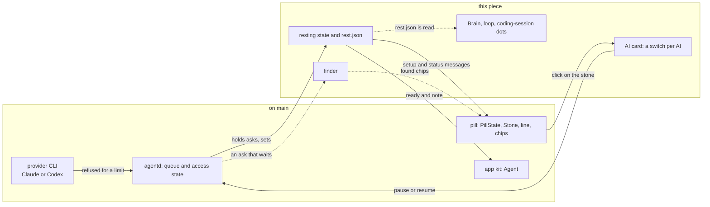

# The poor man switch

> **Status:** In progress  
> **Code:** none of this is on `main`. It builds on `src/bombadil/agentd.py`, `src/bombadil/providers.py`, `src/bombadil/launcher.py`, `src/bombadil/appkit/native/agent.py`, `shell/PillState.qml`, `shell/Stone.qml`, `shell/StatusLine.qml`, `shell/QueueChips.qml` and `shell/SetupChips.qml`. Planned files: `src/bombadil/rest.py` and `shell/AiCard.qml` (an unmerged branch has both, `main` does not), `src/bombadil/finder.py` and `shell/FoundChips.qml` (no branch has them).  
> **Design:** [The poor man switch](../design/poor-man-switch-brief.md), [its page](../design/pages/the-poor-man-switch.html)  
> **Verified:** 2026-10-01 against `main` at `6150431`: no code of this piece is on `main`, and every row of "What it builds on in `main`" was read there. A first build of piece 1 on an unmerged branch (two commits) was read file by file, and the Python tests that touch it (13 files) were run: 474 passed, 11 failed, 3 skipped. All 11 failures come from one fault, `AgentD._waiting` defined twice, so the second definition replaces the first. Its QML tests were not run (no PySide6 on the machine that checked).

When Claude or Codex refuses an ask because the plan or the spending limit is used up, Bombadil is meant to treat that as a state of the machine, not as the failure of one ask. Most of the machine needs no model (apps and their processes, background jobs, the browser, files, the terminal, launcher words, `!` commands, undo, Details, Stop), so the piece makes the machine know that its AI is out: it says so once with the time the provider gave, holds every ask as a chip instead of failing it, finds things on the computer when a sentence is typed, and gives the person a switch to rest the AI themselves. The name stays off the screen, which says "Claude is at its limit until 15:00" or "Claude is paused"; in code the state is `resting`.

## What it will do

- **Today on `main`.** A limit is only a rewrite of an error text. A failed model turn whose text holds a `LIMIT_WORDS` phrase (`usage limit`, `spend limit`, `spending limit`, `credit balance`, `hit your limit`) is sent as an `error` event that starts with `LIMIT_TEXT`. The pill shows it as a red line that fades after 12 seconds unless the turn changed something. The stone stays green, the field still says "Ask anything", and every waiting ask is sent to the provider and fails the same way, each taking a restore point where snapper is set up. "weekly limit" and "out of usage credits" are not rewritten, the throttle notice "not your usage limit" is rewritten as a limit, `rate_limit_event` is not read anywhere, and an app that asks the agent gets "Error: ..." in `Agent.reply`.
- **Resting (piece 1, built on an unmerged branch as a checkpoint).** The first ask a provider refuses for its limit will put agentd in the state `resting`. The stone will go hollow and grey, and one line will name the AI and the time ("Claude is at its limit until 15:00. Your apps and files still work."). Every ask that needs the AI will wait as the queue's grey chip, labelled with the time instead of "next"; "On it" will not show for it, and the empty field will read "Open or find anything. Asks wait for 15:00." An app's ask will wait the same way, at most one per app. The cut-off turn will go back to the front of the queue in the same conversation and be told what it had already changed. Launcher words and `!` commands will never wait. One minute after the time the provider gave, on the wall clock, the state will end: the cut-off ask will run first, then the others in the order typed. No test call will be made: the first waiting ask is the check.
- **The switch by hand (piece 1, built on the branch).** A click on the stone while no turn runs will open a card with a row and a switch per AI ("Claude · ready", "Codex · not signed in"). Flipping Claude off will be the same as typing "pause Claude", and on the same as "resume Claude". A pause will look like a limit and last until flipped back, across restarts. A spending limit, or a limit with no time, will show one button, "Raise the limit", which will open the provider's usage page in the browser panel and buy nothing, and then read "Try again".
- **When it flips by itself (designed; the conditions are built on the branch).** It will flip only when an ask that is not a `!` command is refused for a limit, never on a busy moment and never on Claude's `rate_limit_event` alone (the brief says the CLI repeats a rejected event, and a window can read `rejected` while paid credits carry on). For Claude all of these must hold: the refusal is an HTTP 429 (`api_error_status`), or `terminal_reason` is `api_error` under an assistant `rate_limit` or `billing_error`; this turn's event says `rejected` with `isUsingOverage` false, or the text has quota wording; the result has no `api_error` (an entitlement check such as `model_requires_usage_credits`); and the text is not the throttle or the "high load" notice. For Codex the failed turn says "hit your usage limit", "out of credits", "spend cap" or "quota exceeded", never its retried "rate limit exceeded:". A 529, a short `api_retry` and the context window's `blocking_limit` never flip it. The time is the provider's own (`resetsAt`, else `overageResetsAt`, else the time in its text, else none), never a guess.
- **The finder (piece 2, designed, no code).** While the AI rests, a sentence that is not a launcher word will be kept as a chip, and up to three chips of things found on the computer will appear: an app by title and description, a launcher word or one of the person's own words, a past ask with its date. "Kept for 15:00. Found on this computer:". A press will open the thing and drop the kept ask. Nothing will open or run by itself, and the finder will never call a model or the network.
- **Later pieces (designed).** 3 a warning line when Claude warns, "Claude 5-hour limit at 84%, resets 15:00." (the branch only passes `rate_limit_event` on as a `meta` event); 4 borrowing the other AI until the reset, and moving from Opus to Sonnet when one family's weekly limit is hit; 5 offline and outages in the same shape; 6 apps that teach the pill through `[[does]]` rows; 7 "Run again" on finished jobs and recipes (named shortcuts that run commands, a restore point each); 8 a usage number on the card. Piece 9, a small local model, is not built, by decision.

## How it fits

The first group exists on `main`; the second is the piece. Solid arrows are built on the unmerged branch, dotted arrows are designed only. The readers of `rest.json` are [the brain](brain.md), [the loop](loop.md) and [coding sessions](coding-sessions.md); the pieces it changes are described in [agentd](agentd.md), [the shell](shell.md) and [the app kit](app-kit.md).

**What it builds on in `main`** (line numbers are those of `main` at `6150431` and drift)

| Existing piece | What the piece does there |
|---|---|
| `src/bombadil/agentd.py`, `AgentD._on_event` (:1412), `_limit_text` (:1499) | On a failed `result` of a turn that does not start with `!`, `_limit_text` rewrites a text with a `LIMIT_WORDS` phrase (:139) to `LIMIT_TEXT` plus the provider's first line, or one with a `RATE_WORDS` phrase (:141) to `RATE_TEXT`, and an `error` event follows (:1464, :1472). A real refusal sets a state instead; the text rewrite stays as a fallback. |
| `AgentD.handle` (:276), `_runnable` (:1164), `_next` (:1168) | A launcher word is matched first (:283) and never queued. `_runnable` is true only when `access == "ready"` or the prompt starts with `!`, so any other access state already holds model asks in `pending`: `resting` needs no change in the gate. |
| `AgentD._status` (:356), `_setup_msg` (:866), `_describe` (:875), `_set_access` (:913) | `status` carries `setup` and `queue` as `{turn, prompt}` rows; `setup` carries `state`, `line`, `tone` and `actions`; `_set_access` wakes the worker only for `ready`. Resting adds a state, a `rest` object and a label on queue rows here. |
| `AgentD._signed_out_turn` (:1143) | The model for the cut-off turn: it puts the ask back at the front of `pending` under its own id, hands the rerun what the person did meanwhile (`notes`) and sends `queued` again. |
| `AgentD.check_access` (:922), `signin_asked` (:947) | `check_access` says `ready` whenever `signed_in()` is not false, and an account at its limit is still signed in. `signin_asked` guards a working login (`login_replaces`) only in `ready`. Both must learn `resting`. |
| `AgentD.turn` (:1216) | A turn that starts the CLI clears the undo marker (:1249) and, where snapper is set up, takes a restore point (:1251-1254) first, so a refused turn spends one. |
| `src/bombadil/providers.py`, `Claude._events` (:254), `Codex.parse` (:425) | Claude's assistant `error` is read only for `authentication_failed` (:282); the result mapping (:299) has no `api_error_status`; `is_progress` ignores `api_retry` (:234); nothing reads `rate_limit_event`. Codex's `turn.failed` (:474) becomes a failed `result`. The limit parse goes here. |
| `src/bombadil/launcher.py`, `PROVIDER_WORDS` (:50), `PROVIDER_VERBS` (:51), `match` (:178) | "use claude" and "use codex" are matched into `Action("provider", ...)` (:199-204) before the core commands. The pause and resume words go beside them. |
| `src/bombadil/appkit/native/agent.py`, `Agent.handle` (:113), `ask` (:155) | `handle` reads only `busy` and `provider` from `status` (:115-118), turns an `error` event into "Error: ..." in `reply` (:109, :149) and emits `replied` at `turn_end` (:152). `ask` prefixes `[from app <name>]` (:161). There is no `ready` or `note` property. |
| `shell/PillState.qml`: `setupState` (:24), `ready` (:28), `face` (:73), `turn_end` (:196), `submit` (:270) | `ready` is true for "", `ready` and `checking`. `face` is `needs` while the setup line shows `choose`, `signed_out` or `offline`, and `rest` for a closing line with `source === "error"`. A failed turn's line is the error text, fading after 12 s (:215) unless `sticky` (:214). `submit` shows "On it" for any ask when `ready` and nothing runs. |
| `shell/Stone.qml`, `shell/StatusLine.qml`, `shell/QueueChips.qml`, `shell/SetupChips.qml`, `shell/shell.qml` | The stone has the faces `rest`, `listening`, `working`, `needs`, `done`, `stopped`, `offline` and `starting`, and no resting face. `StatusLine` draws a red edge for `source === "error"` (:16) and Undo and Details under a changed closing line (:173). `QueueChips` labels every chip "next" (:32). `SetupChips` shows only in `mode === "setup"` (:11). The stone's `TapHandler` works only while stoppable (`shell.qml` :400) and the placeholder is "Ask anything" (:413). |

## Interfaces it adds (planned)

| Name | What it is | Status |
|---|---|---|
| `resting` | agentd access state beside `choose`, `checking`, `signed_out`, `offline`, `signing_in` and `ready`; reasons `limit`, `spend`, `hand` | on the branch |
| `rest` in `status` and `setup` | `{provider, why, kind, until, when, hint, note, wait}`; each waiting `queue` row gets `wait` | on the branch |
| `{"type": "ai", "op": "get"}`, `{"type": "ai", "op": "pause" or "resume", "provider": "claude"}`, reply `{"type": "ai", "rows": [...]}` | The AI card's messages; a row is `{name, title, state, text, on, enabled, current}` | on the branch |
| `setup_action` ids `resume`, `raise`, `retry` | The one button under the resting line | on the branch |
| `turn_end` with `requeued: true`; event kind `rest`; `unqueued` with `replaced: true`; `requeued` in a `turns.jsonl` row | A turn the limit stopped, its record, an app's ask replaced by its later one | on the branch |
| `paths.state_dir()/rest.json`, `src/bombadil/rest.py` | `{"hand": {...}, "providers": {"claude": {"why", "kind", "until", "since"}}}`; agentd writes it, any process reads it, a lapsed limit is never read; follows `BOMBADIL_STATE` | on the branch |
| `pause claude`, `pause codex`, `pause the ai`, `resume ...`; "use claude" also resumes | Launcher words: `REST_VERBS`, `REST_TARGETS`, `Action("rest", ...)` | on the branch |
| `Provider.limit(result, seen)`, `Provider.waiting(retry, seen)`; events `limit`, `retry` and `meta` with `rate_limit` | The refusal check per provider; `waiting` is not in the brief (see below) | on the branch |
| `AgentD._rest_turn`, `_rest_watch` (the brief calls it `_wait_reset`), `pause`, `rest_action`; `REST_POLL`, `RESET_GRACE` (60 s), `RETRY_AFTER_REFUSAL` (300 s) | Re-queue, wake on the wall clock, the hand switch, the button | on the branch |
| `Launcher.undo_marker`, `Launcher.skip_restore_point` | A refused turn that changed nothing puts the undo marker back | on the branch |
| `Agent.ready`, `Agent.note` (kit) | "At 15:00", "Paused" under a button that asks; a `requeued` `turn_end` fires no `replied` | on the branch |
| `bombadil ask` exit status 75 | Prints the resting line on stderr and leaves the ask queued; the brief says it keeps waiting | on the branch |
| `shell/AiCard.qml`; in `PillState` `resting`, `rest`, `restHint`, `aiRows`, `aiOpen`, `toggleAi()`, `setAi()`; face `resting` | The card, the line, the placeholder, the chip labels | on the branch |
| `src/bombadil/finder.py` with `find(text)`; message `{"type": "found", "turn", "matches"}`; `shell/FoundChips.qml` | The finder and its chips | planned |
| A silent flag in `rest.json` that holds the machine's own background model use; the warning line | Piece 3; the flag's name is not decided | planned |
| `AskButton` (kit); `[[does]]` rows in `app.toml` and `bombadil-app run <name> --do <entry>` | Pieces 1 and 6 | planned |
| A borrow of the other AI, "use opus" and "use sonnet"; reasons `offline` and `outage`; "Run again" and recipes | Pieces 4, 5 and 7 | planned |

The brief names no config key and no environment variable.

## Principles it keeps

- [Recovery without the broken part](../principles.md#recovery-without-the-broken-part): nothing the person made may check whether the AI is there (launcher words, `!` commands, apps, jobs, the browser). The trap is a probe or a gate on the AI placed before any of them.
- [Degrade and recover](../principles.md#degrade-and-recover): `rest.py` and the finder call no model and no network, and the first waiting ask is the check that a limit is over. The trap is a test call, a retry loop or a small model "to see whether it is back".
- [Something true in 200 ms](../principles.md#something-true-in-200-ms): the first refusal shows the hollow stone and the line at once, and a held ask never shows "On it". The trap is leaving the working face on for an ask that will wait.
- [Quiet at rest](../principles.md#quiet-at-rest) and [Colour says who](../principles.md#colour-says-who): resting is still and grey, not red (nothing failed), not amber (it is not the person's turn), not orange, not green. The trap is a pulse, a ring, an amber knock or a desk card.
- [The person's press reaches people](../principles.md#the-persons-press-reaches-people): moving to Codex and spending money wait for a press, and "Raise the limit" only opens the provider's page. The trap is a borrow or a purchase that happens by itself.
- [Records before models](../principles.md#records-before-models): a sentence typed while resting is answered from what the machine holds, and the person presses. The trap is a finder that guesses and acts.

## Before you build on it

- **Order (the brief).** Pieces 1 and 2 first, each as work of its own: piece 1 (effort M) stops the false screen, the failing queue and the burned restore points; piece 2 (S without the Brain's search, M with it) keeps the machine useful while it waits. Then 3 (S), 4 (S to M), 5 (S to M), 6 (M, in the app kit's own work), 7 (M) and 8 (S, after a check). Every later piece reads piece 1's state, `rest.json` and the status message, and invents none of its own.
- **Waits on the owner.** Nothing: the three questions are answered (1a, 2a, 3a, on 2026-10-01). Waiting on other pieces of work: the mark's drawing of the resting stone (the branch draws a stand-in), the voice's wording of every line (the lines in the brief are proposals), the desk's confirmation that resting is not needs-you, and `AskButton`. Ten checks under [To check before building](../design/poor-man-switch-brief.md#to-check-before-building) are open, first a real Claude limit captured in `-p` stream-json: the branch's parse was checked against the CLI's binary and a fake API, and a real subscription limit was not run.
- **What the unmerged build is.** A checkpoint. The doubled `AgentD._waiting` fails 11 of its tests. `bombadil ask` exits 75 where the brief says it keeps waiting. The stone is a whole grey outline over a faint fill, with the `b` cut in the ground colour. `Provider.waiting` refuses a turn at once when a retry waits five minutes or more under a rejected window, which the brief does not name. There is no "Use Codex until 15:00" button, no finder, no warning line and no `AskButton`.
- **Do not break.** Launcher words and `!` commands run in every access state. The three limit tests in `tests/test_agentd.py` (`test_a_limit_is_said_plainly_with_the_providers_reset_time_after_it`, `test_a_bare_rate_limit_is_a_busy_moment_not_the_account`, `test_a_typed_command_that_fails_is_never_told_it_hit_the_account_limit`). The sign-in guard: typing "sign in" while resting must not start `codex login`, which revokes a working login. The undo marker: the next "undo" must not say "Undone" for an empty restore point. The `needs` branch of `face`, which `resting` must never enter.

## When it ships

This page is then replaced by the full piece page in the skeleton of [documenting your piece](../contributing/documenting.md#the-shape-of-a-page), the [roadmap](../roadmap.md) row is updated and the brief gets its status line. Until then each piece that ships changes the status and the tables here.
