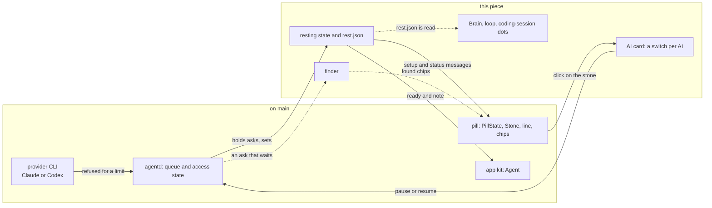

# The poor man switch

> **Status:** In progress  
> **Code:** none of this is on `main`. It builds on `src/bombadil/agentd.py`, `src/bombadil/providers.py`, `src/bombadil/launcher.py`, `src/bombadil/appkit/native/agent.py`, `bin/bombadil`, `shell/PillState.qml`, `shell/Stone.qml`, `shell/shell.qml`, `shell/StatusLine.qml`, `shell/QueueChips.qml` and `shell/SetupChips.qml`.  
> **Design:** [The poor man switch](../design/poor-man-switch-brief.md), [its page](../design/pages/the-poor-man-switch.html)  
> **Verified:** 2026-10-01 against `main` at `a30ebc8`: no code of this piece is on `main`, and every row of "What it builds on in `main`" was read there. The first build (unmerged, cut from `main` at `26843d3`, so it does not contain `a30ebc8`) had its code changes in `src/`, `shell/` and `bin/` read, and the 13 test files that touch it were run in a copy of it: 552 tests, 538 passed and 14 failed with PySide6 and pytest-asyncio installed (its headless desktop scenario was not run).

When Claude or Codex refuses an ask because the plan or the spending limit is used up, Bombadil is meant to treat that as a state of the machine, not as the failure of one ask. Most of the machine needs no model (apps and their processes, background jobs, the browser, files, the terminal, launcher words, `!` commands, undo, Details, Stop), so the piece is to make the machine know that its AI is out: it will say so once with the time the provider gave, hold every ask as a chip instead of failing it, find things on the computer when a sentence is typed, and give the person a switch to rest the AI themselves. The name will stay off the screen, which will say "Claude is at its limit until 15:00" or "Claude is paused"; in the first build the state is `resting`. The first build is not complete and is not on `main`: `src/bombadil/rest.py` and `shell/AiCard.qml` exist only there, and `src/bombadil/finder.py` and `shell/FoundChips.qml` exist nowhere.

## What it will do

- **On `main` at `a30ebc8`.** A limit is only a rewrite of an error text. A failed model turn whose text holds a `LIMIT_WORDS` phrase (`usage limit`, `spend limit`, `spending limit`, `credit balance`, `hit your limit`) is sent as an `error` event that starts with `LIMIT_TEXT`. The pill shows it as a line with a red edge that fades after 12 seconds, unless the turn changed something or a picture (a card that is not a receipt) holds the line. The stone stays green, the field still says "Ask anything", and every waiting ask is sent to the provider and fails the same way, each taking a restore point where snapper is set up. "session limit", "weekly limit" and "out of usage credits" are not rewritten, the throttle notice "not your usage limit" is rewritten as a limit, `rate_limit_event` is read nowhere, and an app that asks the agent gets "Error: ..." in `Agent.reply`.
- **Resting (piece 1, in the first build).** The first ask a provider refuses for its limit will put agentd in the state `resting`. The stone will go hollow and grey, and one line will name the AI and the time ("Claude is at its limit until 15:00. Your apps and files still work."). Every ask that needs the AI will wait as the queue's grey chip, labelled with the time instead of "next"; "On it" will not show for it, and the empty field will read "Open or find anything. Asks wait for 15:00." An app's ask will wait the same way, at most one per app. The cut-off turn will go back to the front of the queue in the same conversation and be told what it had already changed. Launcher words and `!` commands will never wait. One minute after the time the provider gave, on the wall clock, the state will end: the cut-off ask will run first, then the others in the order typed. No test call will be made: the first waiting ask is the check.
- **The switch by hand (piece 1, in the first build).** A click on the stone while no turn runs will open a card with a row and a switch per AI ("Claude · ready", "Codex · not signed in"). Flipping Claude off will be the same as typing "pause Claude", and on the same as "resume Claude". A pause will look like a limit and last until flipped back, across restarts. A spending limit, or a limit with no time, will show one button, "Raise the limit", which will open the provider's usage page in the browser panel and buy nothing, and then read "Try again".
- **When it flips by itself, Claude (designed; the conditions are in the first build).** It will flip only when an ask that is not a `!` command is refused for a limit, never on a busy moment and never on `rate_limit_event` alone (the brief says the CLI repeats a rejected event, and a window can read `rejected` while paid credits carry on). All of these must hold: the refusal is an HTTP 429 (`api_error_status`), or `terminal_reason` is `api_error` under an assistant `rate_limit` or `billing_error`; this turn's event says `rejected` with `isUsingOverage` false, or the text has quota wording; the result has no `api_error` (an entitlement check such as `model_requires_usage_credits`); and the text is not the throttle or the "high load" notice. A 529, a short `api_retry` and the context window's `blocking_limit` never flip it. The time is the provider's own (`resetsAt`, else `overageResetsAt`, else the time in its text, else none).
- **When it flips by itself, Codex (designed; the conditions are in the first build).** The failed turn says "hit your usage limit", "out of credits", "spend cap" or "quota exceeded", never its retried "rate limit exceeded:"; the first build also matches "exceeded your current quota" and "insufficient_quota", which the brief does not name. The time is read from its text, in local time.
- **Two times the provider did not state (first build only).** `Claude.waiting` uses the CLI's retry delay (the time of the refusal plus `retry_delay_ms`) when the event gave no reset time, and `rest.resolve` replaces a time that is already past with the time of the refusal plus `RETRY_AFTER_REFUSAL` (300 s). The brief says "never a guess" and names only the second.
- **The finder (piece 2, designed, no code).** While the AI rests, a sentence that is not a launcher word will be kept as a chip, and up to three chips of things found on the computer will appear: an app by title and description, a launcher word or one of the person's own words, a past ask with its date. "Kept for 15:00. Found on this computer:". A press will open the thing and drop the kept ask. Nothing will open or run by itself, and the finder will never call a model or the network.
- **Later pieces (designed).** 3 a warning line when Claude warns, "Claude 5-hour limit at 84%, resets 15:00." (the first build only passes `rate_limit_event` on as a `meta` event); 4 borrowing the other AI until the reset, with one button "Use Codex until 15:00" on a timed limit when Codex is signed in (the brief draws it under piece 1 but builds the borrow in piece 4, so the first build has no such button), and moving from Opus to Sonnet when one family's weekly limit is hit; 5 offline and outages in the same shape; 6 apps that teach the pill through `[[does]]` rows; 7 "Run again" on finished jobs and recipes (named shortcuts that run commands, a restore point each); 8 a usage number on the card. Piece 9, a small local model, is not built, by decision.

## How it fits

The first group exists on `main`; the second is the piece. Solid arrows are in the first build, dotted arrows are designed only. [The brain](brain.md), [the loop](loop.md) and [coding sessions](coding-sessions.md) are designed to read `rest.json`; in the first build only agentd reads it (through `rest.py`). The pieces it changes are described in [agentd](agentd.md), [the shell](shell.md) and [the app kit](app-kit.md).

**What it builds on in `main`** (line numbers are those of `main` at `a30ebc8` and drift)

| Existing piece | What the piece does there |
|---|---|
| `src/bombadil/agentd.py`, `AgentD._on_event` (:1451), `_limit_text` (:1624) | On a failed `result` of a turn that does not start with `!`, `_limit_text` rewrites a text with a `LIMIT_WORDS` phrase (:158) to `LIMIT_TEXT` plus the provider's first line, or one with a `RATE_WORDS` phrase (:160) to `RATE_TEXT`, and an `error` event follows (:1508, :1516). A real refusal will set a state instead; the text rewrite will stay as a fallback (the first build widens `LIMIT_WORDS`, adds "not your usage limit" to `RATE_WORDS` and tests it first). |
| `AgentD.handle` (:298), `_runnable` (:1191), `_next` (:1195) | A launcher word is matched first (:305) and never queued. `_runnable` is true only when `access == "ready"` or the prompt starts with `!`, so any other access state already holds model asks in `pending`: `resting` needs no change in the gate. |
| `AgentD._status` (:379), `_setup_msg` (:893), `_describe` (:902), `_set_access` (:940) | `status` carries `setup` and `queue` as `{turn, prompt}` rows; `setup` carries `state`, `line`, `tone` and `actions`; `_set_access` wakes the worker only for `ready`. Resting will add a state, a `rest` object and a label on queue rows here. |
| `AgentD._signed_out_turn` (:1170) | The model for the cut-off turn: it puts the ask back at the front of `pending` under its own id, puts back the notes the cut-off turn had been given (`_turn_notes`, what happened without the model since the last turn) so the rerun is told them again, and sends `queued` again. |
| `AgentD.check_access` (:949), `signin_asked` (:974) | `check_access` says `ready` whenever `signed_in()` is not false, and an account at its limit is still signed in. `signin_asked` guards a working login (`login_replaces`) only in `ready`. Both must learn `resting`. |
| `AgentD.turn` (:1244) | A turn that starts the CLI takes the next turn number (:1269, `_mark_begun`), clears the undo marker (:1280) and, where snapper is set up, takes a restore point (:1282-1285) first; it tells the Brain it began (`_poke`, :1333) and ends with a `turns.jsonl` row that has `n`, `unit`, `started` and `files` (:1445). A refused turn spends all of these, and so does each rerun. The first build's `_log` adds `requeued` and none of the fields `main` added. |
| `src/bombadil/providers.py`, `Claude._events` (:259), `Codex.parse` (:440) | Claude's assistant `error` is read only for `authentication_failed` (:287); the result mapping (:304) has no `api_error_status`; `is_progress` (:239) ignores `api_retry`; nothing reads `rate_limit_event`. Codex's `turn.failed` (:489) becomes a failed `result`. The limit parse goes here. |
| `src/bombadil/launcher.py`, `PROVIDER_WORDS` (:61), `PROVIDER_VERBS` (:62), `match` (:191) | "use claude" and "use codex" are matched into `Action("provider", ...)` (:212-217) before the core commands. The pause and resume words go beside them. |
| `src/bombadil/appkit/native/agent.py`, `Agent.handle` (:113), `ask` (:155) | `handle` reads only `busy` and `provider` from `status` (:115-118), turns an `error` event into "Error: ..." in `reply` (:109, :149) and emits `replied` at `turn_end` (:152). `ask` prefixes `[from app <name>]` (:161). There is no `ready` or `note` property. |
| `bin/bombadil`, `talk` (:35), `ask` (:225-226) | `bombadil ask` sends one `prompt` and streams events until its own `turn_end`, and does nothing with a `setup` message, so an ask that waits blocks silently until it runs. The piece will print the resting line once and keep waiting (the brief, "`bombadil ask` in a terminal"); the first build exits 75 instead. |
| `shell/PillState.qml`: `setupState` (:25), `ready` (:29), `face` (:78), `turn_end` (:201), `submit` (:279) | `ready` is true for "", `ready` and `checking`. `face` is `needs` while the setup line shows `choose`, `signed_out` or `offline`, and `rest` for a closing line with `source === "error"`. A failed turn's line is the error text, fading after 12 s (:220) unless `sticky` (:219) or a picture holds it (`pictureStays` :60, `StatusLine.qml` :55). `submit` shows "On it" for an ask when `ready` and nothing runs. |
| `shell/Stone.qml`, `shell/StatusLine.qml`, `shell/QueueChips.qml`, `shell/SetupChips.qml`, `shell/shell.qml` | The stone has the faces `rest`, `listening`, `working`, `needs`, `done`, `stopped`, `offline` and `starting`, no resting face, and paints the filled stone with `paint`, which is the resting green for the first `settle` (400 ms) whatever the face says. `StatusLine` draws a red edge for `source === "error"` (:16) and Undo and Details under a changed closing line (:178). `QueueChips` labels every chip "next" (:32). `SetupChips` shows only in `mode === "setup"` (:11). The stone's `TapHandler` works only while stoppable (`shell.qml` :420) and the placeholder is "Ask anything" (:433). |

## Interfaces it adds (planned)

| Name | What it is | Status |
|---|---|---|
| `resting` | agentd access state beside `choose`, `checking`, `signed_out`, `offline`, `signing_in` and `ready`; reasons `limit`, `spend`, `hand` | first build |
| `rest` in `status` and `setup` | `{provider, why, kind, until, when, hint, note, wait}`; each waiting `queue` row gets `wait` | first build |
| `{"type": "ai", "op": "get"}`, `{"type": "ai", "op": "pause" or "resume", "provider": "claude"}`, reply `{"type": "ai", "rows": [...]}` | The AI card's messages; a row is `{name, title, state, text, on, enabled, current}` | first build |
| `setup_action` ids `resume`, `raise`, `retry` | The one button under the resting line | first build |
| `turn_end` with `requeued: true`; event kind `rest`; `unqueued` with `replaced: true`; `requeued` in a `turns.jsonl` row | A turn the limit stopped (the desk's Now card leaves at once on it, `DeskState.qml`), its record (`watch.py` draws it as a dim line), an app's ask replaced by its later one | first build |
| `paths.state_dir()/rest.json`, `src/bombadil/rest.py` | `{"hand": {...}, "providers": {"claude": {"why", "kind", "until", "since"}}}`; agentd writes it (mode 0644), any process can read it, a lapsed limit is never read; follows `BOMBADIL_STATE` | first build |
| `pause claude`, `pause codex`, `pause the ai`, `resume ...`; "use claude" also resumes | Launcher words: `REST_VERBS`, `REST_TARGETS`, `Action("rest", ...)` | first build |
| `Provider.limit(result, seen)`, `Provider.waiting(retry, seen)`; events `limit`, `retry` and `meta` with `rate_limit` | The refusal check per provider; `waiting` is not in the brief (see above) | first build |
| `AgentD._rest_turn`, `_rest_watch` (the brief calls it `_wait_reset`), `pause`, `rest_action`; `REST_POLL` (`agentd.py`); `RESET_GRACE` (60 s) and `RETRY_AFTER_REFUSAL` (300 s) (`rest.py`) | Re-queue, wake on the wall clock, the hand switch, the button | first build |
| `Launcher.undo_marker`, `Launcher.skip_restore_point` | A refused turn that changed nothing puts the undo marker back | first build |
| `Agent.ready`, `Agent.note` (kit), documented in `share/skills/bombadil-apps/references/native.md` | "At 15:00", "Paused" under a button that asks; a `requeued` `turn_end` fires no `replied` | first build |
| `bombadil ask` exit status 75 | Prints the resting line on stderr and leaves the ask queued; the brief says it keeps waiting | first build |
| `shell/AiCard.qml`; in `PillState` `resting`, `rest`, `restHint`, `aiRows`, `aiOpen`, `toggleAi()`, `setAi()`; face `resting`; mode `resting` | The card, the line, the placeholder, the chip labels | first build |
| `src/bombadil/finder.py` with `find(text)`; message `{"type": "found", "turn", "matches"}`; `shell/FoundChips.qml` | The finder and its chips | planned |
| A silent flag in `rest.json` that holds the machine's own background model use; the warning line | Piece 3; the flag's name is not decided | planned |
| `AskButton` (kit); `[[does]]` rows in `app.toml` and `bombadil-app run <name> --do <entry>` | Pieces 1 and 6 | planned |
| A borrow of the other AI, "use opus" and "use sonnet"; reasons `offline` and `outage`; "Run again" and recipes | Pieces 4, 5 and 7 | planned |

The brief names no config key and no environment variable.

## Principles it keeps

- [Recovery without the broken part](../principles.md#recovery-without-the-broken-part): nothing the person made may check whether the AI is there (launcher words, `!` commands, apps, jobs, the browser). The trap is a probe or a gate on the AI placed before any of them.
- [Degrade and recover](../principles.md#degrade-and-recover): `rest.py` and the finder call no model and no network, and the first waiting ask is the check that a limit is over. The trap is a test call, a retry loop or a small model "to see whether it is back".
- [Something true in 200 ms](../principles.md#something-true-in-200-ms): the first refusal shows the hollow stone and the line at once, and a held ask never shows "On it". The trap is leaving the working face on for an ask that will wait.
- [Quiet at rest](../principles.md#quiet-at-rest) and [Colour says who](../principles.md#colour-says-who): resting is still and grey, not red (nothing failed), not amber (it is not the person's turn), not orange, not green. The trap is a pulse, a ring, an amber knock or a desk card.
- [The person's press reaches people](../principles.md#the-persons-press-reaches-people): moving to Codex and spending money wait for a press, and "Raise the limit" only opens the provider's page. The trap is a borrow or a purchase that happens by itself.
- [Records before models](../principles.md#records-before-models): a sentence typed while resting is answered from what the machine holds, and the person presses. The trap is a finder that guesses and acts.

## Before you build on it

- **Order (the brief).** Pieces 1 and 2 first, each as work of its own: piece 1 (effort M) is to stop the false screen, the failing queue and the burned restore points; piece 2 (S without the Brain's search, M with it) is to keep the machine useful while it waits. Then 3 (S), 4 (S to M), 5 (S to M), 6 (M, in the app kit's own work), 7 (M) and 8 (S, after a check). Every later piece reads piece 1's state, `rest.json` and the status message, and invents none of its own.
- **Waits on the owner.** Nothing: the three questions are answered (1a, 2a, 3a, on 2026-10-01). Waiting on other pieces of work: the mark's drawing of the resting stone (the first build draws a stand-in), the voice's wording of every line (the lines in the brief are proposals), the desk's confirmation that resting is not needs-you, and `AskButton`. Ten checks under [To check before building](../design/poor-man-switch-brief.md#to-check-before-building) are open, first a real Claude limit captured in `-p` stream-json: the first build's parse was checked against the CLI's binary and a fake API (its comments in `providers.py` say so), and a real subscription limit was not run.
- **What the first build is.** A checkpoint, and not complete: 14 of the 552 tests in the 13 files that touch it fail with PySide6 installed (11 of them without it, where the kit and QML files skip), among them the return at the reset, Resume and Try again. It was cut from `main` at `26843d3`; a trial merge with `a30ebc8` conflicts in `agentd.py`, `shell/PillState.qml` and `shell/StatusLine.qml`, and `bin/bombadil`, `launcher.py`, `providers.py`, `watch.py`, `Stone.qml`, `shell.qml` and `DeskState.qml` changed on both sides. It departs from the brief in three places: `bombadil ask` exits 75 where the brief says it keeps waiting; the stone is a whole grey outline over a faint fill, with the `b` cut in the ground colour; `Provider.waiting` refuses a turn at once when a retry waits five minutes or more under a rejected window, which the brief does not name. There is no "Use Codex until 15:00" button, no finder, no warning line and no `AskButton`.
- **Tests.** On `main`, `python3 -m pytest tests/test_agentd.py -k limit` runs the three limit tests (see "Do not break"). The first build adds `tests/test_rest.py`, `tests/test_limit.py`, `tests/test_agentd_rest.py`, `tests/test_launcher_rest.py`, `tests/test_bombadil_ask.py` and `tests/test_rest_qml.py`, extends `tests/test_appkit_agent.py`, `tests/test_stone_qml.py`, `tests/test_pill_qml.py` and `tests/test_watch.py`, and adds to the headless desktop scenario in `tests/desktop/` (`driver.py`, `fake_api.py`, `bin/claude`), which was not run. The QML and kit files skip without PySide6.
- **The Brain's descriptions.** On `main` (`a30ebc8`) the Brain's Focus view asks the model for a one-line description of the thing the person is looking at: a `focus` or `describe` request (`src/bombadil/brain/service.py` :1060, :1128) queues it for the `Describer` worker thread (`src/bombadil/brain/describe.py` :285), which runs `Provider.describe_command()` in a subprocess (:402-415). It is made only for what someone looks at, never unprompted. Nothing in it reads `rest.json` or a limit, so while the AI is out a look still spends a call: a non-zero exit is not tried again for `RETRY_S` (600 s), and if the CLI exits 0 at a limit, which nobody has checked, its limit sentence would be stored as the description. The brief wants these descriptions to wait while the AI rests ([the brain](brain.md)).
- **Do not break.** Launcher words and `!` commands run in every access state. The three limit tests in `tests/test_agentd.py` (`test_a_limit_is_said_plainly_with_the_providers_reset_time_after_it`, `test_a_bare_rate_limit_is_a_busy_moment_not_the_account`, `test_a_typed_command_that_fails_is_never_told_it_hit_the_account_limit`). The sign-in guard: typing "sign in" while resting must not start `codex login`, which revokes a working login. The undo marker: the next "undo" must not say "Undone" for an empty restore point. The `needs` branch of `face`, which `resting` must never enter.

## When it ships

This page is then replaced by the full piece page in the skeleton of [documenting your piece](../contributing/documenting.md#the-shape-of-a-page), the [roadmap](../roadmap.md) row is updated and the brief gets its status line. Until then each piece that ships changes the status and the tables here.
