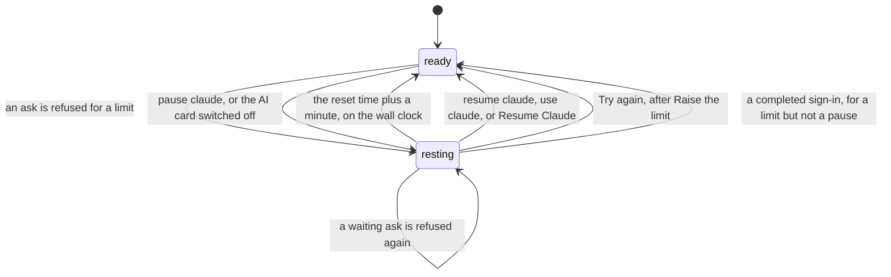
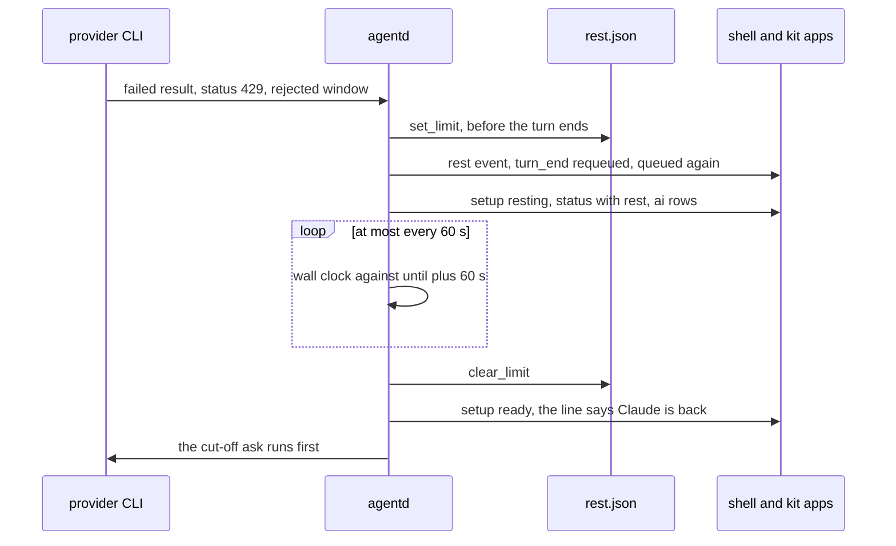
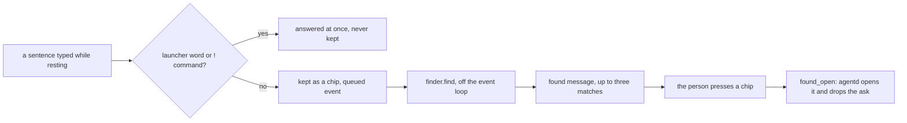

# The poor man switch

> **Status:** Partly shipped  
> **Code:** `src/bombadil/rest.py`, `src/bombadil/finder.py`, `src/bombadil/providers.py`, `src/bombadil/agentd.py`, `src/bombadil/launcher.py`, `src/bombadil/appkit/native/agent.py`, `bin/bombadil`, `shell/AiCard.qml`, `shell/FoundChips.qml`, `shell/PillState.qml`, `shell/StatusLine.qml`, `shell/Stone.qml`, `shell/QueueChips.qml`, `shell/SetupChips.qml`, `shell/shell.qml`  
> **Design:** [The poor man switch](../design/poor-man-switch-brief.md), [its page](../design/pages/the-poor-man-switch.html)  
> **Verified:** 2026-10-01 against `main` at `969b80b`

When Claude or Codex refuses an ask because the plan or the spending limit is used up, Bombadil treats that as a state of the machine and not as the failure of one ask. Most of the machine needs no model (apps and their processes, background jobs, the browser, files, the terminal, launcher words, `!` commands, undo, Details, Stop), so agentd says once that the AI is out, with the time the provider gave, holds every ask as a chip, offers things found on the computer for a sentence the AI cannot answer, and gives the person a switch to rest the AI by hand. In the code the state is `resting`. "The poor man switch" is the design's name and appears nowhere on screen, which says what is true: "Claude is at its limit until 15:00", "Claude is paused".

Pieces 1 (Resting) and 2 (the finder) of the design are on `main` and tested. Pieces 3 to 9 are designed or not built: see [Not built yet](#not-built-yet). The pieces this one changes are described in [agentd](agentd.md), [the shell](shell.md) and [the app kit](app-kit.md).

## How it works

Resting is a value of agentd's setup state (`AgentD.access`), beside `choose`, `checking`, `signed_out`, `offline`, `signing_in` and `ready`. It is kept per provider: Claude resting leaves Codex alone.



The path of a refused turn, from the provider to the screen and back:



### What counts as running out

After a failed `result` of a turn that is not a `!` command, agentd asks the turn's provider whether the account refused it (`AgentD._refusal` calls `Provider.limit(result, seen)`). `seen` holds what the same turn's other events carried: the latest `rate_limit_event` (the `meta` event) and an assistant `rate_limit` or `billing_error` notice (the `limit` event). Neither is shown or logged by itself, and a `rate_limit_event` alone never rests the machine. A provider answers only when it finds a real refusal and evidence of a quota. A busy moment is never one.

| Provider | A real refusal | Evidence of a quota | Never a limit |
|---|---|---|---|
| Claude (`Claude.limit`) | `api_error_status` 429 on the result or the notice, or `terminal_reason` `api_error` under an assistant `rate_limit` or `billing_error` notice | this turn's `rate_limit_event` is `rejected` with `isUsingOverage` false, or the text matches `Claude.QUOTA` ("you've hit your ... limit", "out of usage credits", "spend cap", "credit balance is too low", ...) | a result or notice that carries `api_error` (an entitlement check such as `model_requires_usage_credits`); text matching `Claude.BUSY` ("not your usage limit", "temporarily limiting requests", "high load", "overloaded", "try again in a minute"); a 529; the context window's `blocking_limit`; a spent budget flag |
| Codex (`Codex.limit`) | a failed `result` | text matching `Codex.LIMIT`: "hit your usage limit", "out of credits", "spend cap", "quota exceeded", "exceeded your current quota", "insufficient_quota" | its retried "rate limit exceeded:" |

A CLI that sleeps through the window instead of ending the turn (the unattended retry mode, which the desktop test switches on with `CLAUDE_CODE_RETRY_WATCHDOG`) is caught by `Claude.waiting`: a `retry` event with status 429 and a delay of `LONG_WAIT_MS` (5 minutes) or more, while this turn's event says `rejected` without overage. agentd refuses the turn at once and stops the CLI. A failed result that `limit()` does not recognise falls through to the older text rewrite in `agentd.py`: `_limit_text` turns a `LIMIT_WORDS` phrase into the `error` event `LIMIT_TEXT` plus the provider's first line, and a `RATE_WORDS` phrase into `RATE_TEXT`. A `!` command is never rewritten.

### Times

A time is the window's `resetsAt` when it is still to come, else `overageResetsAt`, else a time in the provider's sentence (`rest.parse_time`: "resets 3:45pm", "resets Oct 3, 3pm", "resets Mon 12:00am", "try again at 3:45 PM", "try again at Oct 2nd, 2026 3:45 PM"; a zone the sentence names wins, otherwise local time), else none. `Claude.waiting` falls back to the time of the refusal plus the CLI's retry delay. `rest.resolve` replaces a time that is already past, plus the grace, with the moment of the refusal plus `RETRY_AFTER_REFUSAL` (300 s). `rest.when` writes "15:00" for today, "Thursday 09:00" within six days ("Thu 09:00" on a chip) and "1 Nov" beyond (with the year when it is not this one). It never writes "tomorrow".

### The refused turn

- `_refused` writes `rest.json` first, so a restart finds the limit, remembers the page the provider's message names, and logs a `rest` event.
- The turn ends with no `result` and no `error` event, which are a failure's. `turn_end` carries `requeued: true` and a `line`: "Claude hit its limit partway, after changing 2 files. It carries on at 15:00." when it changed something (with Undo and Details, as after any turn that did), the resting line when it changed nothing. The `turns.jsonl` row carries `requeued: true` and no receipt follows.
- The ask goes back to the front of `pending` under its own turn id (`queued` again, `_rest_turn`), in the same conversation: a session id is adopted only from a result that worked, so a refusal never drops it. What the person did without the model since the turn's last try is kept to tell it again, and the rerun starts with "[The last try stopped at a usage limit after: ... Check what is done before redoing it.]" (the last six things the cut-off tries had done).
- The turn took a restore point as it started and cleared the undo marker. When it changed nothing, `Launcher.skip_restore_point` puts the marker back, so the next "undo" goes past the empty point instead of saying "Undone" and changing nothing.
- A turn stopped by hand, or one whose provider changed while it ran, is not put back.

### The queue and the apps

`_runnable` is true only when access is `ready` or the prompt starts with `!`, so in `resting` every model ask stays in `pending`, and launcher words are matched before anything is queued. While resting, each `status` queue row of a waiting ask carries `wait` ("15:00", "Thu 09:00", "paused", or "limit" when there is no time), and `QueueChips` shows it in place of "next". `busy` stays false while only waiting asks are queued, and "On it" never shows for them.

An app's ask arrives as `[from app notes] summarise this`. While resting, a newer ask of the same app replaces its older waiting one (`_replace_app_ask`: `unqueued` with `replaced: true`, no error), so an app on a timer cannot fill the queue. The kit's `Agent` reads `setup` and `rest` from `status` into `ready` and `note`, fires no `replied` for a `turn_end` that is `requeued`, ignores a `replaced` `unqueued`, and answers the app after the reset. `bombadil ask` prints the resting line on stderr and exits 75, leaving its ask queued.

### Coming back

`_rest_watch`, a task started in `_enter`, sleeps at most `REST_POLL` (60 s) at a time and compares the wall clock with `until` plus `RESET_GRACE` (60 s), so a computer that slept through the reset wakes right. At that time it clears the limit and `_rest_changed` sets access `ready`, which wakes the worker. Nothing asks the provider whether the limit is over: the first waiting ask is the check, and with nothing waiting nothing is sent. The cut-off ask runs first, then the rest in the order typed. When the first ask is refused again, the provider's later time replaces the old one and the machine rests again.

A spending limit, or a limit with no time, offers one button, "Raise the limit". `rest_action` opens the page the provider's message names (else `rest.RAISE_PAGES`) in the browser panel and buys nothing. The button then reads "Try again", which clears the limit so that the first waiting ask is the check.

`check_access` ends in `_settle`, which reads `rest.json`, so stored credentials do not turn `resting` back into `ready` (an account at its limit is still signed in). `signin_asked` guards a working login in `resting` as in `ready` (`login_replaces`: `codex login` revokes the stored login as it starts). A completed sign-in clears a limit, because the login may be another account with its own, and never a pause.

### By hand

`pause claude`, `pause codex`, `pause the ai` and the same with `resume` are launcher words. `AgentD.local` hands them to `rest_word`, which calls `pause`, and logs the answer as a `local` row in `turns.jsonl`. The AI card's switch sends `ai` messages that call the same `pause`. A pause is the `hand` entry of `rest.json`: it has no time, outranks a limit (`rest.current`), survives a restart, and ends with the switch, `resume`, `use claude` (`AgentD.choose` clears the hand) or the Resume button. When a limit is still on after the resume, the answer says what is left.

### On the screen

- **The stone.** `PillState.face` is `resting` while the state is `resting` or the closing line is of a turn the limit cut off, unless a turn runs or something needs the person. `Stone.qml` draws a whole grey outline over a faint grey fill with the `b` cut in the ground colour, and it stands still. Resting is not among the causes of the `needs` face.
- **The line.** It is agentd's own `setup.line`, built by `rest.words` and the same in every voice: the shell holds none of the words. It shows for 12 s when the state flips, when the pill is summoned and when an ask has to wait. After that the empty field carries the state (`PillState.restHint`, the placeholder in `shell.qml`). A running turn, or a closing line with Undo, keeps the line and the resting line waits behind it. At most one button sits under it (`SetupChips`: `resume`, `raise` or `retry`).
- **The AI card.** A click on the stone while no turn runs sends `ai` `get` and opens `AiCard.qml`: one row per AI with a switch, dimmed when it cannot be flipped (not signed in, not installed). The rows are agentd's, so a switch follows what agentd sends back and not the tap. Esc, a second click on the stone, typing or a turn starting puts it away. While a turn runs the stone is Stop.

| Moment | Line above the pill | Waiting chip | Empty field |
|---|---|---|---|
| Limit with a time | Claude is at its limit until 15:00. Your apps and files still work. | 15:00 | Open or find anything. Asks wait for 15:00. |
| Weekly limit | Claude is at its weekly limit until Thursday 09:00. Your apps and files still work. | Thu 09:00 | Open or find anything. Asks wait for Thursday 09:00. |
| Spending limit | Claude is at its spending limit until 15:00. Your apps and files still work. | 15:00 | as the limit with a time |
| No time | Claude is at its limit. Your apps and files still work. ("spending limit" when `why` is `spend`) | limit | Open or find anything. Asks wait for Claude. |
| Paused by hand | Claude is paused. Your apps and files still work. | paused | Open or find anything. Asks wait until you resume Claude. |
| Cut off, changed 2 files | Claude hit its limit partway, after changing 2 files. It carries on at 15:00. | | |
| Cut off, no time | Claude hit its limit partway, after changing 2 files. It carries on once the limit is lifted. (A spending limit says "spending limit" and "raised".) | | |
| An ask kept | Kept for 15:00. Found on this computer: (or Nothing on this computer matches.) The first sentence reads "Kept until you resume Claude." when paused and "Kept until Claude is back." with no time. | | |
| Back | Claude is back. Running your 3 waiting asks. ("Running your waiting ask." for one, nothing more for none) | | |
| Try again | Trying Claude again. Running your 3 waiting asks. | | |

The words are `rest.words`, `rest.cut_off`, `rest.kept`, `rest.back` and `rest.trying` in `src/bombadil/rest.py`, with the provider's own window names in `rest.KIND_WORDS` (`five_hour` "limit", `seven_day` "weekly limit", `seven_day_opus` "Opus limit", `seven_day_sonnet` "Sonnet limit", `seven_day_overage_included` "Fable limit", `overage` "spending limit"). `tests/test_rest.py` holds every line under 100 characters, with no em dash and no "token". The desktop test (`tests/desktop`) refuses a turn with a real 429 from a scripted API and took these pictures:


### What keeps working

Nothing that is not a model ask reads the state: launcher words (apps, browser, terminal, files, undo, history, Details, Stop, the picture words, `pause` and `resume`), `!` commands, apps and their processes, background jobs, and the browser panel with its own profile (its pages still need the network). Anything else waits as a chip.

### The finder

A sentence typed in the pill while the AI rests waits as a chip, and agentd also looks, on this computer only, for what the sentence nearly names (`src/bombadil/finder.py`: no model, no network, nothing opened or run). It offers up to `LIMIT` (3) chips under a line that says when the ask runs.



| What | Found by | A press |
|---|---|---|
| An app | its title and the description its builder wrote, among the apps in the person's apps directory | opens it, as its typed word does |
| A panel, a widget, or a command that only shows something (`finder.SHOWS`: history, desk, brain, wifi, sound, brightness, battery) | the names the launcher knows it by (`launcher.entries`) | opens it, by its word or by "open" and its word |
| A past ask of the person, "You asked: file the March invoice (3 Sep)" | its words and the closing line it was given, among the latest 400 successful ones in `turns.jsonl` (`PAST_ASKS`) | shows that turn's steps (the Details drawer) |

Never offered: a command that changes something (undo, hide, restart, sign in), an app's own ask (`[from app notes] ...`), a `!` command, a past ask that was stopped, failed or is waiting for the limit, and anything that covers less than `MIN_SCORE` (0.25) of the sentence. agentd looks only for an ask the person typed in the pill, not for one an app or an agent's own process sent, and not for the ask that hit the limit, whose line is the news.

Matching is by words. A word of the sentence matches a word of a thing when they are the same (a trailing "s" ignored), when one starts the other (three letters or more), or when they are one slip of the fingers apart (five letters or more: one letter wrong, missing or extra, or two swapped). A match in the thing's title counts in full and a match in its other words counts half. The score is the share of the sentence's meaningful words that the thing covers, so a long sentence is not matched by one stray word. Words that carry no meaning (`finder.STOP`: "the", "my", "app", "open", ...) are left out, and a sentence with none left finds nothing. The best come first, apps before launcher words before past asks on a tie and newer asks first, and each thing is offered once. A past ask's label is cut to 60 characters and dated "today", "yesterday", "3 Sep" or "3 Sep 2025", never with a clock.

After the `queued` event of such an ask agentd broadcasts one `found` message. Its line is `rest.kept`. A press is `found_open`: agentd resolves the id from what it offered, never from what the client says, opens the thing, answers with the usual `local` events and lets go of the kept ask (`unqueued`). A past ask's log must be one of agentd's own under the state directory (`_own_turn_log`). When a press cannot open its thing, the ask stays kept and the same `found` is sent again, so the chips come back.

In the shell (`FoundChips.qml`, `PillState.found`) the chips are there while the found line is on screen, which fades after 12 s like the resting line. They go with it, and when the ask is dropped or starts, when the AI is back, and when a newer ask is kept. A line with Undo on it (a turn the limit cut off) is not wiped by it. A press hands the keyboard to the window it opens.


### What is deliberately not done

- No test calls and no retry loops: one refusal is enough, and nothing more is sent until the reset, a press or a word.
- No ring or counter on the stone, no amber mark, no red line and no card on the desk. Nothing is the person's to do, and "Raise the limit" is a button on the line and not a knock.
- No automatic move to the other AI and none to paid credits. "use codex" is the person's own word, and "Raise the limit" only opens the provider's page.
- No small local model. The finder is words and nothing else.

## Interfaces other pieces depend on

### From agentd to clients

| Message | Fields | Meaning |
|---|---|---|
| `setup` | `state: "resting"`, `line`, `tone: "step"`, `actions` (at most one: `resume`, `raise` or `retry`), `rest` | The state, its one line and its one button. Sent on every change and to a client that connects. |
| `status` | `setup: "resting"`, `rest`, and `wait` on each `queue` row of a waiting ask | The `rest` object is only there while resting. |
| `rest` object | `provider`, `why` (`limit`, `spend` or `hand`), `kind` (the provider's window name or null), `until` (epoch seconds or null), `when`, `hint`, `note`, `wait` | `hint` is the empty field's text, `note` an app button's text, `wait` a chip's label. |
| `ai` | `{"type": "ai", "rows": [{name, title, state, text, on, enabled, current}]}`, `state` one of `ready`, `limit`, `paused`, `signed_out`, `missing` | To the asker for `get`, and to every client after a change. |
| `found` | `turn`, `prompt`, `line`, `matches: [{id, kind, label, hint}]`, `kind` one of `app`, `word`, `ask` | After the `queued` event of a kept ask. |
| event `rest` | `provider`, `why`, `window`, `until`, `text` (cut to 200 characters) | A refusal, in the turn's log and to clients. `bombadil watch` draws it as a dim line (`watch.py`). |
| event `turn_end` | `requeued: true`, `line` | The limit stopped the turn halfway. The desk's Now card leaves at once on it (`DeskState.qml`). |
| event `queued` | the same turn id again | The cut-off ask is back at the front. |
| event `unqueued` | `replaced: true` | An app's newer ask took its place. |
| event `local` | `action: "rest"` | The answer to a pause or resume word. |

### From clients to agentd

| Message | Fields | Meaning |
|---|---|---|
| `prompt` | a launcher word such as `pause claude` | Rests or resumes a provider. |
| `setup_action` | `id`: `resume`, `raise` or `retry` | The one button under the resting line. |
| `ai` | `op`: `get`, `pause` or `resume`, with `provider` for the last two | The AI card. |
| `found_open` | `turn`, `id` | A press on a found chip. |
| `unqueue` | `turn` | The × on a waiting chip, as for any queued ask. |

### Code, files and commands

| Name | What it is |
|---|---|
| `paths.state_dir()/rest.json` | `{"hand": {"claude": {"since"}}, "providers": {"claude": {"why", "kind", "until", "since"}}}`. `why` here is `limit` or `spend`. Written by agentd only, mode 0644, read by any process. A lapsed limit is never returned. |
| `src/bombadil/rest.py` | `read`, `current`, `limit`, `hand`, `set_limit`, `clear_limit`, `set_hand`, `clear_hand`, `resolve`, `due` (used by tests only), `when`, `parse_time`, `page_in`, `words`, `cut_off`, `kept`, `back`, `trying`; the dataclasses `Rest` and `Limit`; `RESET_GRACE` (60 s), `RETRY_AFTER_REFUSAL` (300 s), `RAISE_PAGES`, `KIND_WORDS`, `STILL_WORK`. |
| `src/bombadil/finder.py` | `find(text, limit)`, `things(...)`, `rank`, `tokens`; `LIMIT`, `MIN_SCORE`, `PAST_ASKS`, `LABEL`, `STOP`, `SHOWS`. |
| `Provider.limit(result, seen)`, `Provider.waiting(retry, seen)`, `Provider.login_replaces` | The refusal check per provider, the check for a CLI that sleeps through the window, and the sign-in guard. Events `limit`, `retry` and `meta` feed them. |
| `REST_VERBS`, `REST_TARGETS`, `REST_TITLES`, `Action("rest", ...)` in `launcher.py` | `pause` and `resume` with `claude`, `claude code`, `anthropic`, `codex`, `openai codex`, `chatgpt`, `the ai` or `ai`. `use claude` and `use codex` also end a pause. |
| `AgentD._enter`, `_rest_changed`, `_rest_watch`, `_refused`, `_rest_turn`, `pause`, `rest_word`, `rest_action`, `_find_for`, `_open_found`, `_ai_rows`; `REST_POLL` (60 s), `AI_SIGNED_TTL` (30 s) | The state machine, the hand switch, the button, the finder and the card, in `agentd.py`. |
| `Launcher.undo_marker`, `Launcher.skip_restore_point` | A cut-off turn that changed nothing puts the undo marker back. |
| `Agent.ready`, `Agent.note` | The kit's properties for an app: `ready` is false while the AI rests, `note` is "At 15:00", "Paused", "At its limit" or "At its spending limit". Documented in `share/skills/bombadil-apps/references/native.md`. |
| `bombadil ask` exit status 75 (`EX_TEMPFAIL`) | The ask is a waiting chip, or its turn was cut off: the resting line goes to stderr and the ask stays queued. |
| `PillState`: `resting`, `rest`, `restHint`, `found`, `foundChips`, `aiRows`, `aiOpen`, `toggleAi()`, `setAi()`, `openFound()`; face `resting`; mode `resting` | The shell's half. `AiCard.qml` and `FoundChips.qml` are placed in `shell.qml`. |

The piece adds no configuration key and no environment variable. `rest.json` follows `BOMBADIL_STATE` and `XDG_STATE_HOME` through `paths.state_dir()`.

## Where state lives

| What | Where | Lifetime |
|---|---|---|
| Limits and hand pauses | `rest.json` in the state directory, `~/.local/state/bombadil/rest.json` by default | Survives a restart or a reboot. A limit lapses a minute after its time. |
| The waiting asks, what a cut-off try had done, what the finder offered | agentd's memory: `pending`, `_resume_notes`, `_found`, `_found_said` | Lost when agentd restarts. |
| Which provider's Raise the limit was pressed, and the page its message named | agentd's memory: `_raised`, `_limit_urls` | Lost when agentd restarts. |
| The wake-up at the reset | an `asyncio` task in agentd, `_rest_task`; no systemd unit | Rebuilt by `check_access` at start. |
| The cut-off turn's record and the pause words | `turns.jsonl` (`requeued: true`, and `local` rows with `action: "rest"`) and the turn's log under `turns/` (the `rest` event) | Plain files. The finder reads past asks from them. |
| What the bar shows | `PillState`: `rest`, `found`, `aiRows`, `aiOpen` | The bar's memory. It clears `found` and closes the card when the socket drops. |

## Principles it keeps

- [Recovery without the broken part](../principles.md#recovery-without-the-broken-part): nothing the person made checks whether the AI is there (launcher words, `!` commands, apps, jobs, the browser). The trap is a probe or a gate on the AI placed before any of them.
- [Degrade and recover](../principles.md#degrade-and-recover): `rest.py` and `finder.py` call no model and no network, and the first waiting ask is the check that a limit is over. The trap is a test call, a retry loop or a small model "to see whether it is back".
- [Something true in 200 ms](../principles.md#something-true-in-200-ms): the first refusal sets the hollow stone and the line at once, and a held ask never shows "On it". The trap is leaving the working face on for an ask that will wait.
- [Quiet at rest](../principles.md#quiet-at-rest) and [Colour says who](../principles.md#colour-says-who): resting is still and grey, not red (nothing failed), not amber (it is not the person's turn), not orange (nothing is acting) and not green. The trap is a pulse, a ring, an amber knock or a desk card.
- [Records before models](../principles.md#records-before-models): a sentence typed while resting is answered from what the machine holds, and the person presses. The trap is a finder that guesses and acts.
- [The person's press reaches people](../principles.md#the-persons-press-reaches-people) and [Nothing runs unseen](../principles.md#nothing-runs-unseen): "Raise the limit" opens a page and buys nothing, the other AI is the person's own word, and every waiting ask is a chip with a time and an ×. The trap is a purchase, a borrow, or a caller of the AI that is not a chip. The Brain's descriptions are one (see [Known gaps](#known-gaps)).

## Extending it

### Teach a provider to recognise its limit

1. In the provider's class in `providers.py`, override `limit(result, seen)` and return a `rest.Limit(why, kind, until, text, url)` with `why` `limit` or `spend`, or `None`. Take the time from the provider's data, or `rest.parse_time(text)`, and the page from `rest.page_in(text, self.name)`. Return `None` for a busy moment, a throttle and an entitlement check.
2. If the CLI says something before its result, yield `meta` events (a `rate_limit` dict) or `limit` events from `parse`. `AgentD._on_event` keeps them in `seen` and shows nothing.
3. If the CLI can sleep through a window, override `waiting(retry, seen)` and yield `retry` events with `status`, `attempt` and `delay_ms`.
4. Add the provider's usage page to `rest.RAISE_PAGES` (and the hosts its messages name to `_RAISE_HOSTS`). Set `login_replaces = True` when its login revokes the stored one as it starts.
5. Write the negative cases first in `tests/test_limit.py`. [Agentd: add a provider](agentd.md#add-a-provider) covers the rest of the registration.

### Change a line, or name a window

Every line is in `rest.py`: `words`, `cut_off`, `kept`, `back` and `trying`. A window's name is in `rest.KIND_WORDS` and, for text the CLI sends without an event, in `Claude.WINDOWS`. Keep each line under 100 characters with no em dash: `tests/test_rest.py` checks it. Test files that quote a line (`tests/test_rest_qml.py`, `tests/test_found_qml.py`) change with it.

### Add a button under the resting line

Return the button from the resting branch of `AgentD._describe` as `{id, label, style}`, handle its id in `AgentD.setup_action` and `rest_action`, and `SetupChips` draws it from `setupActions`. `PillState.setupAction` hands the keyboard to the window an action opens, except for `cancel`, `resume` and `retry`: add the id there if it opens nothing. Keep to one button per case.

### Make the finder find something else

1. Write a `_..._things()` source in `finder.py` that returns `Thing` rows (`kind`, `label`, `hint`, `title`, `words`, and `say` or `path`), and add it to `things()`.
2. `AgentD._open_found` opens an `ask` by its log and every other kind by matching its `say` as a launcher word, so a kind that is opened some other way needs a branch there. `finder.rank` sorts an unknown kind after `ask`, and `FoundChips.qml` draws any kind from its `label` and `hint`.
3. To offer a command that only shows something, add its name to `finder.SHOWS`. `tests/test_finder.py` checks that every word offered opens what it says.

### Make another caller of the AI wait

Read `rest.current(provider)` from `bombadil.rest` before calling the provider. A result that is not `None` means: do not call, and do not count it as a failure. Do not write the file: agentd is its only writer. No caller in the tree does this yet (see [Known gaps](#known-gaps)).

## Tests

```sh
python3 -m pytest tests/test_rest.py tests/test_limit.py tests/test_finder.py tests/test_agentd_rest.py tests/test_agentd_found.py tests/test_launcher_rest.py tests/test_bombadil_ask.py
python3 -m pytest tests/test_rest_qml.py tests/test_found_qml.py tests/test_stone_qml.py tests/test_appkit_agent.py   # skip without PySide6
python3 -m pytest tests/test_agentd.py -k limit    # the three tests of the text rewrite
tests/desktop/run.sh                               # needs docker and a claude binary
```

| File | What it proves |
|---|---|
| `tests/test_rest.py` | `rest.json` (kept, readable by others, lapses a minute after its time, broken file read as nothing), a pause outranking a limit, each provider on its own, `when` and `parse_time`, every line. |
| `tests/test_limit.py` | `Claude.limit`, `Claude.waiting` and `Codex.limit` on scripted CLI output: what is a limit and, as many cases, what is not. |
| `tests/test_agentd_rest.py` | The state in agentd with a fake provider: rest and return in order in the same conversation, what a rerun is told, the undo marker, the buttons, hand pause across a restart, the AI card, app asks replaced, sign-in clearing a limit but not a pause. |
| `tests/test_finder.py`, `tests/test_agentd_found.py` | Ranking, dating and what is never offered; the `found` message and `found_open`, including a press on something not offered and a log that is not agentd's own. |
| `tests/test_launcher_rest.py` | The pause and resume words, `use claude`, and the undo marker of a refused turn. |
| `tests/test_bombadil_ask.py` | Exit 75 for a waiting ask and for a cut-off turn, and a normal exit otherwise. |
| `tests/test_rest_qml.py`, `tests/test_found_qml.py`, `tests/test_stone_qml.py` | The bar in an offscreen window: the line, the button, the field, the chips, the card, the cut-off line, the found chips, the resting stone. They skip without PySide6. |
| `tests/test_appkit_agent.py` | `Agent.ready` and `Agent.note`, a `requeued` `turn_end` with no `replied`, a `replaced` `unqueued`. It skips without PySide6. |
| `tests/desktop/` (`driver.py`, `fake_api.py`, `bin/claude`) | The real CLI against a scripted API that answers a 429: the state, the chips, the return at the reset, a CLI that waits the limit out, a pause by hand, and the finder with its screenshots. It needs docker and is not part of `pytest`. |

Tests that sample an animation in real time can fail on a loaded machine: rerun one alone before calling it a failure.

## Not built yet

Pieces 3 to 9 of [the brief](../design/poor-man-switch-brief.md#after-these-in-order) read piece 1's state, `rest.json` and the status message, and add none of their own.

| Piece | State in the code |
|---|---|
| 3. A warning line before the wall | Designed. `Claude._events` turns `rate_limit_event` into a `meta` event and `AgentD._on_event` keeps it in `_seen` for `limit()`: nothing shows `allowed_warning`, and the AI card rows carry no percentage. |
| 4. Borrowing the other AI until the reset, and Opus to Sonnet | Designed. There is no "Use Codex until 15:00" button. `use codex` is `AgentD.choose`, which saves the provider and drops the conversation (`session_id = None`). |
| 5. Offline and outages in the same shape | Designed. `offline` is only a setup state for reaching the sign-in page, and `_wait_online` starts a sign-in when the network returns. |
| 6. Apps' `[[does]]` rows, `AskButton` | Designed. Neither exists in `src` or `share`. |
| 7. "Run again" on finished jobs, and recipes | Designed. Nothing in `shell` or `src` has either. |
| 8. A usage number on the card | Designed. |
| 9. A small local model | Not built, by decision ([the brief](../design/poor-man-switch-brief.md#questions-and-the-answers)). |

The [Tips and desk defaults brief](../design/tips-and-desk-defaults-brief.md) is design only: it keeps its Tips card unmoved by the AI resting and lists `resting` among the stone's faces.

## Known gaps

- **Waiting asks do not survive an agentd restart.** `pending` is only in memory (`src/bombadil/agentd.py`, `self.pending`), while a limit and a pause stay in `rest.json`. A reboot during a weekly limit keeps the state and loses the chips that were promised for its end.
- **Nothing but agentd reads `rest.json`.** The Brain's descriptions still call the provider while the AI rests: `Describer._provider_run` runs `Provider.describe_command()` in a subprocess (`src/bombadil/brain/describe.py`), made only for what someone looks at, and nothing in it reads `rest.json` or a limit. A thing whose call failed is not tried again for `RETRY_S` (600 s). If the CLI exits 0 at a limit, which nobody has checked, its limit sentence would be stored as the description. The loop and the coding-session dots the brief names as readers are not built.
- **`bombadil ask` exits 75** (`bin/bombadil`, `EX_TEMPFAIL`), where the brief says it prints the line once and keeps waiting.
- **The finder does not find Mail.** `_app_things` reads `launcher.known_apps()`, which lists the person's apps directory and not the built-in Mail window, and the Mail entry of `launcher.entries` has kind `app`, which `_word_things` skips (`src/bombadil/finder.py`, `src/bombadil/launcher.py`). "check my email" is kept and finds nothing. The person's own words and the Brain's files are not sources either.
- **A kept ask's chips are not sent again to a bar that connects later.** `AgentD._client` sends `status`, `entries`, `setup` and the live notices but not `_found_said`, and `PillState.lost` clears `found`.
- **No real subscription limit has been captured.** The comment above `Claude.QUOTA` in `src/bombadil/providers.py` says the parse was checked in the CLI's binary and against a local fake API, and Codex's wording is taken from its source. The desktop test also uses a scripted API. The brief's [To check before building](../design/poor-man-switch-brief.md#to-check-before-building) lists what a capture should settle, first the order of the events in `-p` stream-json.
