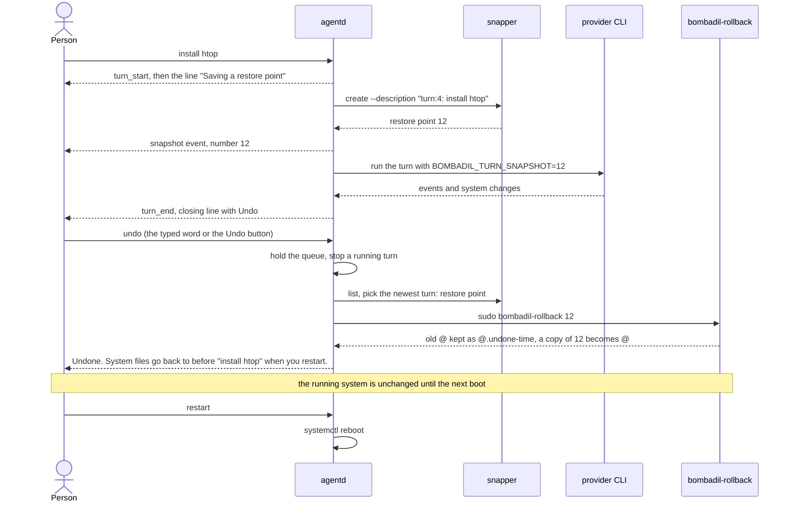
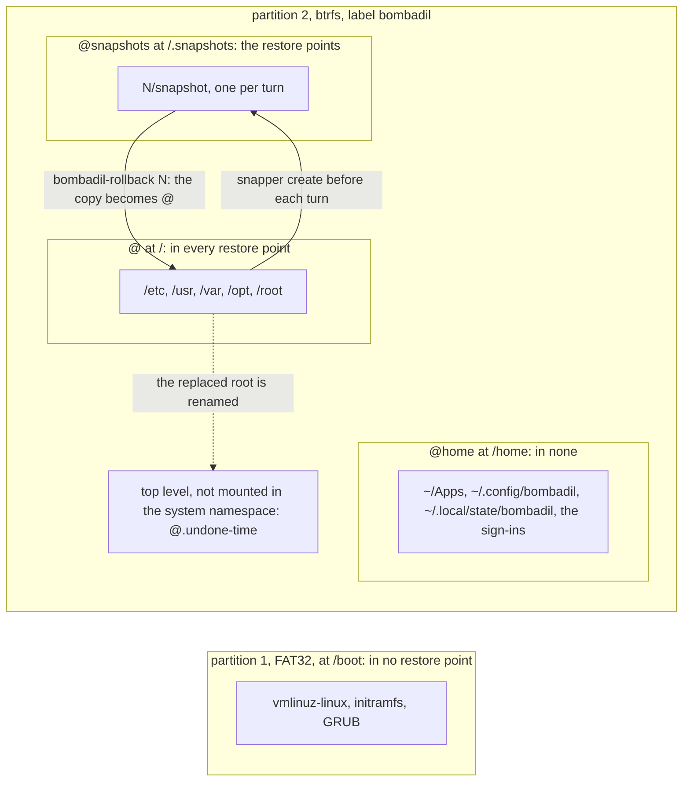

# Restore points

> **Status:** Partly shipped. On `main`: one root restore point per turn, the `undo` word and button, the `rollback` tool, `bombadil undo`, `bombadil-rollback`, and the installer layout that makes the swap possible. Not built: pruning, restore points of `/home` or of the kernel, undo that applies at once, and the installed-OS disk layout. Each is marked designed below.
> **Code:** `src/bombadil/snapshots.py`, `iso/airootfs/usr/local/bin/bombadil-rollback`, `iso/airootfs/usr/local/bin/bombadil-install`, `src/bombadil/launcher.py`, `src/bombadil/mcp_server.py`, `src/bombadil/agentd.py`, `src/bombadil/config.py`, `src/bombadil/paths.py`, `src/bombadil/rest.py`, `bin/bombadil`, `src/bombadil/narrate.py`, `src/bombadil/watch.py`, `src/bombadil/providers.py`, `shell/PillState.qml`, `shell/StatusLine.qml`, `shell/DeskState.qml`, `iso/profiledef.sh`, `iso/airootfs/usr/local/bin/bombadil-setup`, `iso/airootfs/usr/local/bin/bombadil-smoke`, `scripts/vm-tools/update-in-place`, `scripts/test-vm.sh`, `src/bombadil/brain/ingest.py`, `src/bombadil/brain/witnesses.py`, `iso/packages.x86_64`, `iso/airootfs/etc/bombadil/config.toml`, `iso/airootfs/etc/sudoers.d/bombadil`
> **Design:** [UX brief, rule 4](../design/ux-brief.md#the-rules), [Foundation choices, section 1](../design/foundation-choices.md#1-base-distro--arch), [Installed OS brief, rule 7 and piece 1](../design/installed-os-brief.md#the-rules)
> **Verified:** 2026-10-01 against `main` at `969b80b`

A restore point is a btrfs snapshot of the root subvolume that `agentd` takes through snapper before each turn runs. Saying `undo` makes the newest one the root again, and the swap applies at the next boot, not at once. This is what stands in for permission prompts: the agent has full access, and the person can go back.

## How it works

The person mostly sees "restore point" (`agentd` says "Saving a restore point"); the one line for a snapper failure says "undo point" (`agentd.py:2035`). The code, the snapper commands and the os-mcp tools say "snapshot". Other functions named `snapshot` (`Desk.snapshot`, `Jobs.snapshot`, `sysmap.snapshot`) return state tables and have nothing to do with this piece.

### What a restore point is

- One snapper snapshot in the snapper config `root`, made by `Snapshots.create` with `sudo snapper -c root --jsonout create --print-number --description <text>` (`src/bombadil/snapshots.py:36-44`). It is taken before the turn, and none is taken after it.
- Its description is `turn:<n>: <first 60 characters of the prompt>`, for example `turn:4: install htop` (`src/bombadil/agentd.py:2033`). A `!` line keeps its `!`. `<n>` is `AgentD.turns`. At start it is the larger of the number of the last turn in `turns.jsonl` (older rows without a number count in order) and the number in the `turn` file of the state folder, which each turn writes before snapper runs (`agentd.py:279,2014-2016,2523-2570`). Numbers therefore go on across restarts and across an undo, also past a turn that was cut off before it wrote its row. Undo never reads `<n>`: it uses snapper's own number and the `turn:` prefix.
- It is taken after `turn_start` has gone out and the number is taken, and before the provider CLI starts, for every turn that gets that far: model turns and `!` lines alike (`agentd.py:2006-2037`). The line above the pill says "Saving a restore point" while snapper works, and "Waiting for Claude" (or Codex) once the CLI is up (`agentd.py:2031,2092`).
- Its number goes out as a `snapshot` event, into the turn's row in `turns.jsonl` as `snapshot`, and into the CLI's environment as `BOMBADIL_TURN_SNAPSHOT` (`agentd.py:2037,2068-2071,2342`).

The rest of the turn is in [agentd.md](agentd.md#one-turn); this page covers the restore point step and what follows from it.

### When a turn gets no restore point

| Case | What happens | Where |
|---|---|---|
| `snapper` is not on `PATH`, or `/etc/snapper/configs/root` is missing: the live ISO (snapper is in the image, no config exists), a development machine, the tests | `Snapshots.available` is false, the turn skips the step, and `undo` says so | `snapshots.py:31-34`, `iso/packages.x86_64:8` |
| `snapshots = false` in the config (read by `agentd` only) | `agentd` builds `_NoSnapshots`, with `available = False`; the os-mcp tools and `bombadil undo` still work (see known gaps) | `agentd.py:2627,2659-2660` |
| A model turn whose provider CLI is not installed | the turn ends with an `error` event before this step, and takes no number | `agentd.py:2008-2013` |
| `snapper` exits non-zero | an `error` event, "no undo point for this turn: snapper failed (...)", and the turn runs without one | `agentd.py:2033-2035` |
| Any other failure inside `create` (no `sudo`, output that is not a number) | the exception reaches `_worker`, which ends the turn with an `error` event; the number was taken, so it is not reused | `agentd.py:1962-1964` |
| A launcher word or another local action (`open`, `stop`, `undo`, `restart`, a picture) | not a turn, so no restore point | `agentd.py:435-452` |
| The AI cannot be asked: `access` is anything but `ready`, for example signed out, offline, or resting (the account's limit used up, or paused by hand) | a prompt that needs the model waits in the queue and no turn starts; a `!` line still runs, with its restore point | `agentd.py:1929-1939`; `tests/test_agentd_rest.py`, `test_a_typed_command_and_launcher_words_still_work_while_it_rests` |

Other moments can make a restore point with any description: the agent's `snapshot` tool, and the development script `scripts/vm-tools/update-in-place`, which takes `before update to main <rev>` (line 64). `undo` ignores descriptions that do not start with `turn:`.

### A turn and a later undo



### Undo, step by step

1. The person types `undo`, `undo that`, `undo it` or `undo the last change` (`launcher.py:47`), or clicks `Undo` on the closing line, which sends `{"type": "local", "action": "undo"}` (`shell/PillState.qml:637-640`, `agentd.py:485-488`). A typed line goes through `launcher.match` (`agentd.py:435-452`). It is lowercased, trimmed of `. ! ? , ; :` at both ends, and stripped of spaces, hyphens and underscores, so it must equal one of the four words, in ASCII only (`launcher.normalize`, `_key`, `_lookup`; `undo-that` and `undo_it` match too). A question mark does not stop it: `undo?` runs undo, because only `restart`, `shutdown` and `desk` are sent to the agent when the line ends in `?` (`launcher.py:256`). A leading `!` makes it a shell line. No model is involved. A longer sentence such as "undo the docker install" goes to the agent (`tests/test_launcher.py:70`).
2. `AgentD.local` raises `_hold` so no queued turn starts, takes the `_exclusive` lock and, if a turn is running, stops it and waits until it is gone. The running turn is therefore taken back too, and its restore point is the newest one (`agentd.py:1078-1092`, `test_undo_during_a_turn_takes_back_that_turn_even_with_one_queued`).
3. `Launcher._undo` refuses when `available` is false, reads the marker `undo.json`, lists up to 200 restore points and picks the newest one whose description starts with `turn:` and whose number is below the marker's (`launcher.py:611-641`).
4. `Snapshots.rollback` runs `sudo bombadil-rollback <number>`. Its output is captured because, inside os-mcp, stdout is the JSON-RPC stream (`snapshots.py:54-64`).
5. `bombadil-rollback` mounts the btrfs top level (`subvolid=5`) on a temporary directory, checks that `@snapshots/<n>/snapshot` exists, renames `@` to `@.undone-<YYYYmmdd-HHMMSS>`, makes a `btrfs subvolume snapshot` of the restore point under the name `@` (without `-r`, so the root is writable), and unmounts (`bombadil-rollback:7-16`).
6. `Launcher._undo` writes `undo.json` and returns the sentence for the pill. `agentd` broadcasts `local` events, appends the action to `turns.jsonl` (`kind: "local"`) and tells the next model turn what happened without it (`agentd.py:1095-1111,2054-2058`).
7. The installer strips `subvolid=` from the generated `/etc/fstab` and says in a comment that `/` is mounted by subvolume name, not id, so that a snapshot swapped in under the name `@` is the one found (`bombadil-install:38-41`). Nothing restarts by itself: the person says `restart`, which runs `systemctl reboot` (`launcher.py:801-802`).

**When it applies:** on the next boot, never at once. The docstring (`snapshots.py:55`), the script (`bombadil-rollback:16`), the sentence the pill shows and the VM check below all say so. The mechanism is inferred, not shown by a file in the repository: a mount stays bound to its subvolume when the subvolume is renamed, so the running kernel keeps the renamed `@` until the next boot. Nothing in the repository records how the root subvolume is chosen at boot: the kernel command line comes from `grub-mkconfig` at install time (`bombadil-install:69`) and no generated `grub.cfg` is in the tree. The effect is recorded: the VM run in Tests booted into the swapped-in `@` (`undo-applied`).

**Between the undo and the restart.** The running root still holds what was undone, so a restore point taken before the restart would bring it back. `undo.json` records the boot id (`/proc/sys/kernel/random/boot_id`), and while it matches, the undo is pending (`launcher.py:555-592,849-853`):

- a turn does not clear the marker (`Launcher.clear_undo`, called from `AgentD.turn`, skips a pending one);
- an `undo` says "Already undone" and rolls nothing back when a `turn:` restore point numbered above the marker's is newer than the marker's `covered` (`launcher.py:619-628`). A turn that ran since counts, because the restart takes it back too; so do the restore points of turns an earlier undo already took back, because undo removes none. Every rollback writes a new marker without `covered`. Repeated undos with no turn between therefore alternate: the first two each go one turn further back, then "Already undone", one further back, "Already undone", and so on (see known gaps);
- after the restart the marker is no longer pending. Each further `undo` goes one turn further back, until a turn runs and `clear_undo` removes the marker.

**A turn the limit refused before it changed anything.** `AgentD.turn` reads the marker with `Launcher.undo_marker` before `clear_undo` removes it (`agentd.py:2025-2028`). When the account's limit ends the turn and no step of it changed anything, the turn's restore point is empty, and `Launcher.skip_restore_point` is called with its number and the marker that was read (`agentd.py:2209-2210`, `launcher.py:594-609`):

- with a marker: it is written back, so the next `undo` goes on from where it was. A marker still pending gets `covered` raised to the empty point, so that point does not count as a turn since, and no "Already undone" is said for it;
- with no marker: one is written for the empty point itself (`what` empty, `boot` null, so not pending), and the next `undo` starts below it.

The point stays in snapper. A turn that was not stopped goes back to the front of the queue and runs again when the limit lifts, as a turn of its own with its own number and restore point (`agentd.py:1704-1726`). A turn the limit stopped after it changed something keeps its restore point as the one `undo` takes back. Only the launcher words skip the empty point (see known gaps). The resting state itself is in [the poor man switch](poor-man-switch.md).

**The ways in are not equal.**

| Way in | Path | Writes `undo.json` | A repeat |
|---|---|---|---|
| The four words typed in the pill or sent with `bombadil ask undo` (`bin/bombadil:385-386`: the line goes through `launcher.match` like a typed one), or the Undo button | `AgentD.local`, `Launcher._undo` | yes | before the restart, they alternate between one turn further back and "Already undone", as above; after it, one turn further back each time |
| Any other sentence that means undo | the agent calls `rollback` with no number (its system prompt says to): `Snapshots.undo_last_turn`, which skips the running turn's own restore point (`BOMBADIL_TURN_SNAPSHOT`) | no | each asking is a turn with a restore point of its own, which the next asking picks: see known gaps |
| `bombadil undo` in a terminal (not `bombadil ask undo`, which is the row above) | `bin/bombadil:403-406`, `Snapshots.undo_last_turn` | no | the same restore point each time, until a turn runs and its restore point is the newest |
| `rollback` with a `number`, or `sudo bombadil-rollback N` | any snapshot by number | no | not applicable |

The by-hand path needs no model, no network, and neither `agentd` nor the shell, so it works from a terminal (reaching one from a text console was not checked):

```sh
sudo snapper -c root list        # numbers and descriptions: what Snapshots.list reads
sudo bombadil-rollback 12        # restore point 12 is the root from the next boot
```

`bombadil-rollback` keeps the replaced root as `@.undone-<time>` at the btrfs top level, so, in its own words, an undo can itself be undone by hand. No command in the repository does that.

### What is covered



This is the layout `bombadil-install` writes (`bombadil-install:11-22,34-41,57-61,85-86`): `@`, `@home` and `@snapshots` at the top level of one btrfs volume, the EFI partition at `/boot`, and `snapper -c root` created on `/`, with the `@snapshots` subvolume mounted at `/.snapshots` in place of snapper's own.

| Where | In a restore point | What it means |
|---|---|---|
| `/etc`, `/usr`, `/var` (the pacman database and packages, systemd units, logs), `/opt`, `/root` | yes | an undo takes back installs, config edits and services |
| `/home` (`@home`): `~/Apps`, `~/.config/bombadil`, the sign-ins copied by the installer (`.claude`, `.claude.json`, `.codex`) | no | an undo never deletes the person's files, apps or sign-in, and never brings back a file deleted from home |
| `~/.local/state/bombadil`: `undo.json`, `turns.jsonl`, `turn`, `turns/`, `desk.toml`, `brain.db`, `rest.json`, `mail.db` | no | it is home, so the marker, the logs, the desk, the brain's index, a pause or limit of the AI (`src/bombadil/rest.py:71`) and the mail service's notes (drafts, marks, receipts) survive the swap |
| `/boot`: kernel, initramfs, GRUB (the EFI partition, FAT) | no | a rollback after a kernel update can leave the newer kernel with the older modules (see known gaps) |
| `/.snapshots` | not part of itself | restore points survive an undo, including those newer than the one chosen |

### Retention and pruning

Nothing prunes, as coded on `main`. `Snapshots.create` passes no `--cleanup-algorithm`, and snapper's cleanup algorithms (`number`, `timeline`, `empty-pre-post`) are named per snapshot ([snapper manual](http://snapper.io/manpages/snapper.html)). Nothing in the repository enables the snapper cleanup timer: the installer enables only `greetd` and `NetworkManager` (`bombadil-install:56`), `iso/airootfs/etc/systemd/system` has no snapper unit, and the UX brief records the timer as off on an installed machine. `@.undone-<time>`, one per undo (`bombadil-rollback:13-14`), is removed by nothing.

What undo can reach is limited by the readers, not by pruning: the launcher looks at the newest 200 restore points (`launcher.py:618`), and `undo_last_turn` (the agent's tool and `bombadil undo`) at the newest 20 (`snapshots.py:46,73`).

Designed, not on `main`: put every restore point under snapper's `number` cleanup (`--cleanup-algorithm number` in `Snapshots.create`, a numbered limit on the `root` config set by the installer, `snapper-cleanup.timer` enabled). See [the roadmap](../roadmap.md). The fuller design is a pre and post pair for every turn, pairs with no change dropped at the end of the turn, the last 100 changed pairs kept, the cleanup timer on, and `@.undone-*` pruned (the installed OS brief says older than 14 days). See [the UX brief's decisions](../design/ux-brief.md#decisions-i-picked-a-default-for) and [the installed OS brief](../design/installed-os-brief.md#after-these-in-order).

### How undo is explained to the person

Every sentence below is written by `agentd`, the launcher or the shell, with no model. The design says undo must say exactly what it covered ([UX brief, rule 4](../design/ux-brief.md#the-rules)). On `main` that means the turn it took back, named by its prompt, and the two areas: system files change at the restart, home and apps do not. It does not list files.

| Moment | What the person sees | Where |
|---|---|---|
| A restore point is being saved | the live line "Saving a restore point" | `agentd.py:2031` |
| Snapper failed | "no undo point for this turn: snapper failed (...)" | `agentd.py:2035` |
| A turn changed something and was not stopped | the closing line stays until the next prompt, with `Undo` and `Details`. A stopped turn gets no sticky line and no `Undo` button; its restore point still exists and the word `undo` still works. While a notice waits (new mail, a draft that is ready, a warning), the sticky line gives way after 12 seconds, or at once for a warning, and takes the button with it; the word still works. A step that no restore point can undo (formatting a disk, deleting under home) shows "can’t be undone" | `shell/StatusLine.qml:68-70,209-233`, `shell/PillState.qml:298` (`sticky = changed && !stopped`), `agentd.py:2212-2214`, `narrate.py:445-481` |
| A turn the account's limit stopped, and that goes back in the queue | the closing line says what it changed and when it carries on, or, when it changed nothing, the resting line with no `Undo`; one that changed something keeps `Undo` and `Details`. `undo` skips an empty restore point | `shell/PillState.qml:282,298,406`, `agentd.py:2201-2210,2354-2361` |
| A step that no restore point can undo is running | the line above the pill gets a red edge, with the exact command under it; the desk's Now card gets a red edge and the caption "can't be undone · Esc stops it" | `shell/StatusLine.qml:20-26`, `shell/DeskState.qml:513-516` |
| A turn that changed something is done and was not stopped | the desk's Now card says "done in N s · Undo is above the pill" | `shell/DeskState.qml:523` |
| An undo went through | "Undone. System files go back to before “<prompt>” when you restart. Your home folder and apps stay as they are." The line stays 15 seconds instead of 5, and longer while a picture the person asked for is up | `launcher.py:642-643`, `shell/PillState.qml:317`, `shell/StatusLine.qml:68-70` |
| An undo asked again before the restart, after turns | "Already undone: when you restart, system files go back to before “<prompt>”, and that takes back everything since too." | `launcher.py:627-628` |
| An undo that cannot go back | "Nothing to undo yet." (no earlier `turn:` restore point); on the live ISO "Undo starts once Bombadil is installed. The live system keeps no restore points."; with `snapshots = false` or no snapper config on an installed system "Undo is off here: this system keeps no restore points." | `launcher.py:638,612-615` |
| In a terminal | `bombadil history` ends each turn with "(restore point N)", a turn the limit cut off and its rerun as two rows; `bombadil watch`, which the closing line's `Details` opens, shows a dim "restore point N" line for the `snapshot` event and the dim status line "Saving a restore point" | `src/bombadil/watch.py:275,62-63,74-75` |
| The next model turn | its prompt starts with "[Done by the user without you since your last turn: 'undo': Undone. ...]" | `agentd.py:1108,2054-2058` |

The agent is told in its system prompt to use `rollback` when the person says undo (`providers.py:43-44`). The narrator words that tool call as "Undoing the last change" and marks it as a system step (`narrate.py:902-903`); a `bombadil undo` in a shell line gets the same words (`narrate.py:640-641`).

### What the installed-OS redesign changes (designed)

The [installed OS brief](../design/installed-os-brief.md) treats the installed machine as the product and decides, in [piece 1](../design/installed-os-brief.md#1-the-disk-that-lasts-layout-v1-and-a-refresh-that-keeps-your-home) and the pieces after it, how restore points change; the [UX brief](../design/ux-brief.md#decisions-i-picked-a-default-for) decides what undo covers and when it applies. None of this is in the code. The brief's status is Designed; [the installed OS page](installed-os.md) lists all thirteen pieces.

| Designed | Differs from `main` by |
|---|---|
| Layout v1: top-level `@`, `@home`, `@snapshots` plus `@log` and `@pkg` beside `@`, and nested subvolumes inside `@home` for what a home restore point skips | `main` has the first three only (`bombadil-install:18`) |
| Encryption by default: partition 2 is LUKS2 with btrfs inside, three keyslots (the password GRUB opens, a key file in the initramfs so the password is typed once, and a recovery key shown once) | `main` formats partition 2 as plain btrfs and gives `user` an empty password (`bombadil-install:16,55`) |
| A snapper config for `/home` (`snapper -c home create-config /home`, `TIMELINE_CREATE=no`) for undo of home files | `main` has `root` only |
| The ESP at `/efi`, the kernel and initramfs in `@/boot` so every restore point carries its own kernel, GRUB on the ESP | `main` mounts the ESP at `/boot` (`bombadil-install:35`) |
| `bombadil-rollback` refuses a snapshot with no `boot/vmlinuz-linux`, and gains `--device DEV` for use from the install stick | `main` does neither (`bombadil-rollback:7,11-12`) |
| Snapshot 1, "Bombadil <version>, as installed", and one for programs brought from the stick | `main` creates no snapshot at install |
| Undo that applies at once for files under `/etc` and home, with "redo" | `main` applies every undo at the next boot |
| A start that fails twice puts itself back and the boot menu lists restore points, a Repair mode on the stick, a rescue page on tty2 | no code; `main` has `bombadil-rollback` run by hand as the only recovery, and no bootloader entry for a restore point (`iso/packages.x86_64` has no `grub-btrfs`) |

## Interfaces other pieces depend on

The full tool list is in [os-mcp.md](os-mcp.md#the-tool-catalogue).

| Name | Kind | What it is |
|---|---|---|
| `snapshot` (`description`, required) | os-mcp tool | creates a restore point with that exact description; returns `snapshot <n>` or `snapshots unavailable on this system` (`mcp_server.py:111-114`) |
| `list_snapshots` | os-mcp tool | the newest 20 as `{number, description}`; snapper's number 0 is left out (`mcp_server.py:116-118`) |
| `rollback` (`number`, optional) | os-mcp tool | with a number: `bombadil-rollback <number>`, returns `rolled back, reboot to apply` or `snapshots unavailable`. Without: `undo_last_turn`, returns `rolled back to snapshot <n> (<description>), reboot to apply` or `nothing to undo` (`mcp_server.py:120-127`) |
| `undo`, `undo that`, `undo it`, `undo the last change` | launcher words | `Launcher._undo`, matched with the folding described in Undo step 1 (the table of all launcher words is in [agentd.md](agentd.md#launcher-words)) |
| `{"type": "local", "action": "undo"}` | socket message, client to `agentd` | what the Undo button sends. For a typed launcher word, `agentd` sends the same message back to the typing client as an acknowledgement, ahead of the `local` start and done events (`agentd.py:450`, `tests/test_agentd.py:180`) |
| `local` event with `action: "undo"`, phase `start` then `done` (`ok`, `text`) | socket event | "Undoing the last change", then the sentence. It also carries `target` and `verb` (`agentd.py:1099-1103`) |
| `snapshot` event, `number` | socket event | the restore point was saved |
| `turn_start` event, `snapshot` | socket event field | always `null`: the event goes out before snapper runs, and the number arrives later in the `snapshot` event (`agentd.py:2006,2037`) |
| `turn_end` event, `changed` | socket event field | `bool(narrator.done)`, true when a step of the turn changed something (`agentd.py:2213`; `false` on the early ends at 2011 and 2041). With `stopped` false it keeps the closing line and its `Undo` button |
| `turn_end` event, `irreversible` | socket event field | `narrator.irreversible`: a step that no restore point can undo. The closing line then shows "can’t be undone" (`agentd.py:2213`, `shell/PillState.qml:280`, `shell/StatusLine.qml:215-221`) |
| `status.snapshots` | socket message field | `Snapshots.available`; `bombadil status` prints it, and no shell file reads it (`agentd.py:551`) |
| `snapshot` and `n` in a `turns.jsonl` row | file fields | the turn's restore point number, or null, and the turn's number, the `<n>` of its description (`agentd.py:2339-2352`; a turn the limit cut off has `requeued: true` and its own `snapshot`, and its rerun is another row). The brain keeps `snapshot` in the turn's metadata and drops it when it is not an integer (`brain/ingest.py:601`, `brain/witnesses.py:268-269`) |
| `BOMBADIL_TURN_SNAPSHOT` | environment variable | set by `agentd` on the CLI of a turn that has a restore point; forwarded to os-mcp through `providers.MCP_ENV` so the Codex server sees it (`providers.py:499-502,539`) |
| `bombadil undo` | command | `Snapshots.undo_last_turn`, exit 1 with `nothing to undo` (`bin/bombadil:403-406`) |
| `sudo bombadil-rollback N` | command, `iso/airootfs/usr/local/bin/bombadil-rollback` | the swap, for any snapshot number |
| `snapshots` | config key, boolean, default `true` | `/etc/bombadil/config.toml` ships `snapshots = true`; `~/.config/bombadil/config.toml` overrides it; read once when `agentd` starts (`config.py:18,38`, `agentd.py:2621,2627`). Only `agentd` reads it: it decides the turn restore points, the launcher's undo and `status.snapshots`. The os-mcp tools and `bombadil undo` build `Snapshots()` without it (`mcp_server.py:42`, `bin/bombadil:404`) |
| `Snapshots(config_name="root", runner=subprocess.run, configs_dir=/etc/snapper/configs)` | Python class | the one Python class that runs snapper (the installer and `update-in-place` call it directly). `runner` and `configs_dir` are seams a test can use, but `available` also needs `snapper` on `PATH` (`shutil.which`, `snapshots.py:34`), so a test that goes through `runner` patches that too (see Extending it, Change the retention, step 6). The existing tests mostly subclass it, two pass `configs_dir`, none passes `runner` |
| `Snapshots.available`, `.create`, `.list(limit=20)`, `.rollback`, `.undo_last_turn(before=None)` | methods | what everything above calls |
| `Launcher.undo_marker()`, `Launcher.skip_restore_point(snapshot, before)` | methods | `AgentD.turn` reads the marker before `clear_undo` and, when the account's limit ended the turn and no step of it changed anything, hands the turn's restore point number and that marker to the second (`agentd.py:2027-2028,2209-2210`, `launcher.py:594-609`) |

## Where state lives

| What | Where | Notes |
|---|---|---|
| The restore points | snapper config `root` at `/etc/snapper/configs/root`; the snapshots at `/.snapshots/<n>/snapshot` | `@snapshots` is its own subvolume, mounted with mode 750 (`bombadil-install:85-86`) |
| The root an undo replaced | `@.undone-<YYYYmmdd-HHMMSS>` at the btrfs top level, not mounted in the system's mount namespace | nothing in the repository removes it. The brain watcher mounts the top level read-only in a namespace of its own (`src/bombadil/brain/watch.py:925-945`, [brain](brain.md)), where it can see this folder |
| The undo marker | `~/.local/state/bombadil/undo.json`: `snapshot`, `what`, `boot`, `t`, and `covered` once set | home, so it survives the swap; the directory is `paths.state_dir()`. A marker written by `skip_restore_point` for an empty point has `what` empty and `boot` null |
| The turn log | `~/.local/state/bombadil/turns.jsonl` | each turn row carries `snapshot` and `n`; `bombadil history` prints it as "(restore point N)" (see [agentd.md](agentd.md#the-turn-log)) |
| The last turn number begun | `~/.local/state/bombadil/turn` | one number, written before snapper runs; with the log's last `n` it is where the next `turn:<n>` starts (`agentd.py:2549-2570`). The number is also the brain's key for the turn, `turn:<n>` (`brain/ingest.py:561`, read back in `brain/focus.py:154`), which is why `_begun` (`agentd.py:2554-2555`) keeps the number of a turn that crashed before its row, since its restore point and the brain already carry it: two turns with one number would share one thing in the brain |
| The per-turn event log | `~/.local/state/bombadil/turns/<ms>-<turn>.jsonl` | holds the `snapshot` event; `bombadil watch` replays it, and the closing line's `Details` opens it. `<turn>` is the queue id (`AgentD.next_id`, which starts again at 1 when `agentd` starts), not the `n` of the description (`agentd.py:283,1998`, `watch.py:296-299`) |
| The setting | `/etc/bombadil/config.toml`, `~/.config/bombadil/config.toml` | |
| In memory | `AgentD._hold`, `AgentD.notes`, `AgentD.turn_logs` | gone when `agentd` restarts; `AgentD.turns` is rebuilt from the two files above |

## Principles it keeps

- [Full access, with undo instead of guard rails](../principles.md#full-access-with-undo): every turn that reaches the restore point step on a system with snapper and its `root` config gets one, so nothing in front of the agent asks permission. A snapper failure lets the turn run without one and shows an `error` event. The trap: adding a confirmation before something undo could reverse, or adding a way to change the root outside `AgentD.turn`, which takes no restore point. The other trap is claiming more than undo does: it covers the root only.
- [Recovery never goes through the part that broke](../principles.md#recovery-without-the-broken-part): `undo` is a launcher word that `agentd` answers without the model, and `bombadil undo` and `sudo bombadil-rollback` need neither `agentd` nor the shell. The trap: sending undo through the agent. An undo run by the agent is itself a turn with a restore point of its own, and rolling back to that one does nothing; `BOMBADIL_TURN_SNAPSHOT` and the `before` argument of `undo_last_turn` make it skip that one.
- [Records answer before models, and the machine explains itself](../principles.md#records-before-models): the undo sentence is built from the restore point's description and the marker. The trap: letting a model word it, or putting something in a restore point description that is not the person's own prompt.
- [Every piece degrades, and nothing waits on a model it does not need](../principles.md#degrade-and-recover): without snapper or its config every method is a no-op that reports `available = False`, and a snapper failure is an `error` event, not a lost turn. The trap: raising anything other than `subprocess.CalledProcessError` from `create` (the turn ends), or calling snapper on the event loop (it can take a second).
- [Plain files stay the truth](../principles.md#plain-files-stay-the-truth): the marker, the turn number and the turn log are small files in `~/.local/state/bombadil`, outside every restore point so they survive the swap. The trap: putting state that must outlive an undo under `/etc` or `/var`, where undo takes it back; `src/bombadil/desk.py` documents the same rule for `desk.toml`. A second trap is changing how turns are numbered: the number in `turn:<n>` is shared with the brain's turn keys, so it must stay unique across crashes and restarts.

## Extending it

### Change the retention

As coded, nothing prunes, so this adds pruning.

1. Put restore points under a snapper cleanup algorithm: in `Snapshots.create` (`snapshots.py:43`) add `"--cleanup-algorithm", "number"` to the arguments of `self._snapper("create", ...)`. Snapshots without one are outside the `number` cleanup.
2. Set the limit in the `root` config: after `snapper --no-dbus -c root create-config /` in the installer's chroot block (`bombadil-install:59`), run `snapper --no-dbus -c root set-config NUMBER_CLEANUP=yes NUMBER_LIMIT=<n>`. Nothing enables snapper's timeline timer, and the installed OS brief cuts the hourly timeline on purpose (turn restore points are the timeline).
3. Enable the timer that runs the cleanup: add `snapper-cleanup.timer` to `systemctl enable greetd NetworkManager` (`bombadil-install:56`).
4. Prune the old roots separately. `@.undone-*` are not snapper's. Deleting one needs the top level mounted the way `bombadil-rollback:8-9` does it, and no existing unit or script does this.
5. Keep the readers in line with the limit: the launcher sees 200 restore points (`launcher.py:618`), the agent's tool and `bombadil undo` see 20 (`snapshots.py:46`). A machine already installed keeps the config it was installed with, because the installer runs once; reaching it needs a step that runs `set-config`, which the installed OS brief designs as numbered steps inside an update.
6. Test the argument list (no test covers `create`) with three things: `configs_dir=tmp_path` holding a file named `root`; `snapper` found, by installing it or by patching `snapshots.shutil.which` (`monkeypatch.setattr(snapshots.shutil, "which", lambda name: "/usr/bin/snapper")`); and `runner=` returning an object whose `.stdout` is `"12\n"`. Without the second, `available` is false and `create` returns `None` before it reaches the runner, so the test records nothing. The installer lines are checked only by the VM run: `tests/test_iso_profile.py` runs the installer's GRUB lines and `tests/test_boot_console.py` reads its copy section (`test_the_installer_copies_the_live_etc_so_the_drop_in_arrives_with_it`); neither touches snapper or the subvolumes.

### Add another moment that takes a restore point

1. Choose the description prefix. `undo` picks only descriptions that start with `turn:`. Another prefix shows in `list_snapshots`, can be rolled back by number, and is skipped by `undo`. To let undo reach it, change the three `startswith("turn:")` tests: `launcher.py:622` (the turns that count as covered by a pending undo, for "Already undone"), `launcher.py:634` (the restore point the launcher picks) and `snapshots.py:76` (the agent's `rollback` and `bombadil undo`), and change `_snapshot_prompt` (`launcher.py:335-339`), which cuts the prefix off for the sentence.
2. Inside `agentd`: call `self.snaps.create(description)` through `asyncio.to_thread`, only when `self.snaps.available`, and catch `subprocess.CalledProcessError` as `agentd.py:2033-2035` does. Say it on screen: the turn sends a `status` event, then a `snapshot` event.
3. From the agent: nothing to add. The `snapshot` tool takes any description, and the narrator words it "Saving a restore point" (`narrate.py:898-899`).
4. From a script on the machine: `sudo snapper -c root create --description "<text>"`, as `scripts/vm-tools/update-in-place:64` does.
5. If the moment can run while an undo waits for its restart, remember the rule in `launcher.py:555-557`: a restore point taken then holds the undone changes.
6. Test with a recording fake, as `RecordingSnaps` in `tests/test_agentd.py:463-481`: subclass `agentd._NoSnapshots`, set `available = True`, record `create`.

### Add a recovery path that works without the model

1. Pick how it is reached.
   - An exact word: add it to `CORE_COMMANDS` (`launcher.py:45-54`; these are checked before app names, so they always mean the same thing). Add a method `Launcher._<kind>` that returns `(ok, one plain sentence)`; `Launcher.run` finds it by name (`launcher.py:397-404`). Add the `doing` and `failed` strings (`launcher.py:372,390`). If it must end the running turn first, add the kind to the tuple in `AgentD.local` (`agentd.py:1078`). The button form works without more code, because `_action` accepts the kinds of `CORE_COMMANDS`, `BRAIN_COMMANDS` and `UTILITY_COMMANDS` (`agentd.py:2497-2502`). If the word changes the system, also add its kind to the tuple `("restart", "shutdown", "desk")` in `launcher.match` (`launcher.py:256`), or the line "<word>?" runs it too (`undo?` does run undo), and add a `"<word>?"` row to `test_everything_else_goes_to_the_agent`; see [agentd](agentd.md#add-a-launcher-word). Add the kind to `NO_COMPLETE` if Tab should never land on it (`launcher.py:127`).
   - A terminal command that needs no `agentd`: add a branch to `main()` in `bin/bombadil`, like `undo` (`bin/bombadil:403-406`).
   - A root script: put it in `iso/airootfs/usr/local/bin/`, list its mode in `file_permissions` in `iso/profiledef.sh` (mkarchiso copies without modes; see the entry for `bombadil-rollback`, line 21), and add it to `SYSTEM` in `scripts/vm-tools/update-in-place` so in-place updates carry it. `user` runs it with `sudo`, which asks no password (`iso/airootfs/etc/sudoers.d/bombadil`).
2. Depend on nothing that can be the broken part: no model, no network, no Quickshell, and for a command or a script no `agentd`. Read what it needs from files and btrfs.
3. Say in one plain sentence what it did and what it did not cover, as `_undo` does.
4. Record it. `AgentD.local` logs launcher actions to `turns.jsonl` and tells the next turn (`agentd.py:1108-1111`); a terminal command or a script does neither, so a recovery that matters to the next turn must write its own marker, as `undo.json` does.
5. Test a word in `tests/test_launcher.py` (the parameter table at the top, and a fake like `Snaps`) and in `tests/test_agentd.py` (`test_launcher_words_never_start_a_turn`). A script can only be run by the VM smoke: add a step to the `undo` mode of `bombadil-smoke` (`bombadil-smoke:400-446`).
6. Not built: the rescue page on tty2 and the start that puts itself back. They are designed in the briefs linked above.

## Tests

| What | Where |
|---|---|
| The four words match, and sentences with undo in them go to the agent | `tests/test_launcher.py`: `test_exact_words_open_locally` (the `undo` and `Undo that` rows), `test_everything_else_goes_to_the_agent` |
| One turn further back on the first two undos, the marker, "Already undone" after a turn, no restore points | `tests/test_launcher.py`: `test_undo_goes_back_one_turn_at_a_time_until_a_new_turn`, `test_a_turn_before_the_restart_does_not_bring_back_what_was_undone`, `test_undo_without_restore_points_says_so` |
| The tools, and `undo_last_turn` skipping the running turn's restore point | `tests/test_mcp_server.py`: `test_snapshot_and_undo`, `test_undo_inside_a_turn_skips_that_turns_snapshot` |
| The restore point comes after `turn_start`, can be stopped, and an undo during a turn takes that turn back before a queued one starts | `tests/test_agentd.py`: `test_turn_start_comes_before_the_restore_point`, `test_stop_while_the_restore_point_is_saved_ends_the_turn_before_its_cli`, `test_undo_during_a_turn_takes_back_that_turn_even_with_one_queued`, `test_launcher_words_never_start_a_turn` |
| The turn number, and so the `turn:<n>` of a restore point, goes on across restarts and past a turn cut off by a crash | `tests/test_agentd.py`: `test_turn_numbers_go_on_across_restarts`, `test_rows_of_other_kinds_are_not_turns`, `test_a_restarted_agentd_numbers_its_next_turn_and_restore_point_after_the_last`, `test_a_turn_cut_off_by_a_crash_keeps_its_number`, `test_a_row_cut_short_by_a_crash_does_not_swallow_the_next` |
| A turn the limit refused before it changed anything is skipped by `undo`: the marker is put back, or written for the empty point, and a pending marker covers it | `tests/test_launcher_rest.py`: `test_a_turn_refused_at_once_is_skipped_by_undo_and_the_one_before_it_is_taken_back`, `test_the_undo_the_user_had_made_before_the_refused_turn_carries_on_from_where_it_was`, `test_an_undo_the_restart_has_applied_is_put_back_too_so_the_next_undo_goes_one_turn_further`, `test_a_pending_undo_stays_and_covers_the_empty_point_so_it_adds_no_extra_press`; through `AgentD`, `tests/test_agentd_rest.py`: `test_the_refused_turns_empty_restore_point_is_not_what_undo_takes_back` |
| `snapshots` defaults to true | `tests/test_config.py`: `test_defaults` |
| The closing line: `Undo` and `Details` after a turn that changed something, `Undo` sends the `local` message without also opening the details, no `Undo` after a stop, `Undo` while disconnected keeps the line and says why, the red edge on the line while a step no restore point can undo runs | `tests/test_pill_qml.py`: `test_a_turn_streams_its_steps_and_closes_with_undo`, `test_undo_on_the_line_does_not_also_open_details`, `test_an_irreversible_step_is_red_and_says_so_after` (the edge only), `test_stop_says_what_it_stopped_and_offers_no_undo`, `test_undo_while_disconnected_keeps_the_line_and_says_why`; `tests/test_notice_qml.py`: `test_a_warning_is_read_over_a_closing_line_that_would_stay_for_good` (no `Undo` button while a warning has the line), `test_news_waits_behind_a_sticky_line_and_comes_when_it_gives_way`, `test_a_sticky_line_with_no_notice_waiting_stays_with_its_undo` |
| The desk's Now card: "done in N s · Undo is above the pill" only when the turn changed something, and the red edge with the caption "can't be undone · Esc stops it" | `tests/test_desk_qml.py`: `test_now_follows_a_whole_turn`, `test_the_done_line_only_promises_undo_when_there_is_one`, `test_an_irreversible_step_is_red_with_its_words_even_when_no_step_is_marked_current`; `tests/test_desk_cards_qml.py`: `test_a_step_no_restore_point_can_undo_is_red_with_its_caption_under_the_command` |
| The wording in a terminal: "restore point N" in `bombadil watch` and in `bombadil history`, and the `rollback` tool step worded as "Undoing the last change" | `tests/test_watch.py`: `test_details_show_each_step_its_command_and_output` (line 24), `test_history_lists_turns_and_launcher_actions` (line 58), `test_history_ends_a_requeued_turn_with_its_cut_off_line` (a cut-off turn and its rerun, restore points 5 and 6); `tests/test_narrate.py`: `test_tools_in_plain_words` (the `rollback` row, line 76) |
| The word typed into the real pill, through the real bar and `agentd`: a `local` event with `action` `undo` and phase `done` comes back. The container has no snapper, so only the "Undo is off here" branch runs, and the check asserts that the event arrives, not its text | `tests/desktop/driver.py`, step 6 (lines 390-398), run by `tests/desktop/run.sh` ([development](../contributing/development.md#the-desktop-test)) |
| The whole path on a real btrfs disk: install, a restore point, a change under `/etc`, `bombadil undo`, a reboot, the change gone | the `undo` mode of `iso/airootfs/usr/local/bin/bombadil-smoke`, run by `MODE=install scripts/test-vm.sh`. A recorded run (build `1ed8f46`, 2026-09-27) passed `snapshots-available`, `snapshot-turn`, `undo` and, after the reboot, `undo-applied`: `docs/review/boot-logs/2-installed-and-undo.txt`. `snapshots.py` and `bombadil-rollback` are unchanged since that build, and the installer's subvolume, `fstab` and snapper lines are too (the GRUB menu and sign-in lines are not). The mode has since gained brain checks ahead of these steps (`bombadil-smoke:404-428`) and the mail checks (`bombadil-smoke:250-254`) that the recorded run predates |

```sh
python3 -m pip install -e '.[dev]'    # pytest and pytest-asyncio: the agentd tests need the second
python3 -m pytest -q tests/test_launcher.py tests/test_launcher_rest.py tests/test_mcp_server.py tests/test_config.py -k "undo or snapshot or config"
python3 -m pytest -q tests/test_agentd.py tests/test_agentd_rest.py -k "restore_point or undo or launcher_words or turn_numbers or rows_of_other or restarted_agentd_numbers or crash"
python3 -m pytest -q tests/test_watch.py tests/test_narrate.py tests/test_iso_profile.py tests/test_boot_console.py
python3 -m pip install -e '.[dev,apps]'    # adds PySide6, which the QML rows need
python3 -m pytest -q tests/test_pill_qml.py tests/test_notice_qml.py tests/test_desk_qml.py tests/test_desk_cards_qml.py
```

Setting up a checkout is in [development](../contributing/development.md#set-up); the VM tools are in [development](../contributing/development.md) and the installer in [iso-and-install](iso-and-install.md). The QML test files skip when PySide6 is missing (`pytest.importorskip` at the top of each), and PySide6 is in the `apps` extra, not in `dev`: without the second install their rows skip silently.

The tests replace snapper with fakes that override `available`, `list` and `rollback` (or `create`). Only the VM run exercises the command lines of `Snapshots.create`, `.list` and `.rollback`, the parsing of snapper's JSON, `bombadil-rollback`, and the installer's subvolume layout and `fstab` rewrite. That run uses `bombadil undo`, so the launcher's marker is covered by unit tests only; `tests/vm/btrfs-kernel.sh` boots a VM on the installer's layout for the brain's watcher, and no sample there runs snapper or `bombadil-rollback`. No test undoes three times before a restart: `test_undo_goes_back_one_turn_at_a_time_until_a_new_turn` stops after two, so the alternation in known gaps is unseen. No test covers the export of `BOMBADIL_TURN_SNAPSHOT` into the CLI's environment (`agentd.py:2068-2071`) or its place in `providers.MCP_ENV` (`providers.py:501`): `tests/test_mcp_server.py` sets the variable by hand (lines 101, 114) and asserts only `BOMBADIL_TURN` and `BOMBADIL_SOCKET` in `MCP_ENV` (line 399), so dropping the export (both providers) or the `MCP_ENV` entry (the Codex server, which starts with only the variables listed there) passes every test, and the agent-run undo then picks the running turn's own restore point and changes nothing. No test covers the snapper failure branch (`CalledProcessError` giving "no undo point for this turn", `agentd.py:2033-2035`; see [known issues](../known-issues.md)), the 15-second undo line (`PillState.qml:317`; the `15000` at `tests/test_pill_qml.py:747` is for receipts) or the closing row's "can’t be undone" label (`test_an_irreversible_step_is_red_and_says_so_after` only takes a screenshot when `BOMBADIL_SCREENS` is set). The "restore point N" wording has only the two `tests/test_watch.py` assertions named above.

## Known gaps

Each gap is checked in code. Gaps that other pages also list are linked, not repeated: see [known issues](../known-issues.md).

| Gap | Evidence |
|---|---|
| Home is in no restore point. A file deleted under home or a change to `~/Apps` is not taken back, and the undo sentence says so only after the fact. Before the step runs, `_irreversible` marks `rm`, `find -delete` and `find -exec rm` under home as "can’t be undone"; other shell commands that change home, such as `mv` or `cp` over a file, are not marked. The mail service's drafts, marks and receipts are in home too (`paths.mail_db()`), and the agent's mail tools are narrated as lines that claim no change, so a turn that only drafts mail gets no `Undo` | `bombadil-install:18,22`, `narrate.py:445-481,938-949`, `paths.py:79-80` |
| The kernel and initramfs are on the EFI partition at `/boot`, outside `@`. An undo after a kernel update can pair a newer kernel with older modules | `bombadil-install:34-36,43-47,68`; [known issues](../known-issues.md) |
| No code in the repository removes restore points or `@.undone-*`, so free space shrinks with use | Retention and pruning above; [known issues](../known-issues.md) |
| Only the launcher words keep the marker. After the agent's `rollback` or `bombadil undo` and before the restart, the next turn takes a restore point of the root that still holds the undone changes, and the next undo picks it, which silently replaces the first undo. Run with a fake list: an install turn (restore point 1), an undo turn (2) rolled back to 1, a second undo turn (3) rolled back to 2. With `bombadil undo` and a turn in between, the same happens. Two terminal undos in a row, with no turn between, roll back to the same restore point twice. A turn the limit refused at once leaves an empty restore point that only the launcher skips: `undo_last_turn` picks it, and `bombadil undo` or the agent's `rollback` then report a rollback that changes nothing | `launcher.py:611-643` against `snapshots.py:66-79`, `mcp_server.py:123-127`, `bin/bombadil:403-406` |
| A turn that changed nothing keeps its restore point, because the point is taken before anything is known about the turn, and nothing removes it afterwards. `Launcher._undo` picks the newest `turn:` point without asking whether the turn changed anything, so after a question the first `undo` rolls back to a point equal to the running root and says "Undone. System files go back to before “<the question>”"; the person has to ask again. Run through `AgentD` with a recording fake: one turn "tell me a joke", then `undo`, rolled back restore point 1. Only a turn the limit refused at once is skipped (`skip_restore_point`); the design drops every pair with no change at the end of the turn (Retention and pruning above) | `agentd.py:2027-2037`, `launcher.py:629-641` |
| An undo does not remove the restore points of the turns it took back. After an undo, a restart and a later turn, the first `undo` rolls back to that turn's restore point, and the next `undo` after it can pick the restore point of the turn already undone, so it reports taking that turn back while changing almost nothing. Run with the fake: rolled back 3, then 4, then 3 | `launcher.py:629-641` |
| Before the restart, repeated undos alternate between rolling back and "Already undone", though no turn ran. The check for turns that ran since counts the restore points of turns an earlier undo took back, because undo removes none, and every rollback writes a marker without `covered`. Run with a fake of four restore points, no turn between and the boot id fixed: undo 1 rolled back to 4, undo 2 to 3, undo 3 said "Already undone" and rolled nothing back, undo 4 rolled back to 2, undo 5 said "Already undone" again. The person sees a sentence about turns since that is not true, and must ask twice to go back one turn | `launcher.py:619-641`; `tests/test_launcher.py` stops after two undos |
| The swap is two commands. If `btrfs subvolume snapshot` fails after `mv`, no `@` exists and the next boot has no root until someone renames the `@.undone-*` back. The only handler unmounts | `bombadil-rollback:5,10,14-15` |
| `snapshots = false` in `~/.config/bombadil/config.toml` is lost when the provider is chosen or changed, because `save_user` rewrites the file with only `provider`, `model` and `explain`. Run: the setting read back as `true` | `config.py:48-61`, called from `agentd.py:1522` and `bin/bombadil:415`. A third writer, `iso/airootfs/usr/local/bin/bombadil-setup:24` (the branch used when `agentd` is not running), overwrites the file with the `provider` line alone, which drops `model` and `explain` as well |
| No baseline restore point at install, so the first undo can only go back to the start of the first turn | `bombadil-install:59` creates the config and no snapshot |
| `rollback` called by the agent reports a failed swap as `CalledProcessError: Command ... returned non-zero exit status 1`; the script's own message ("no snapshot N") is captured and dropped. The launcher shows it, through `_reason` | `snapshots.py:63`, `mcp_server.py:204-205`, `launcher.py:404,863-873` |
| The restart that applies an undo starts a conversation with no memory of the earlier one, because `session_id` is only in memory | `agentd.py:277`; [known issues](../known-issues.md) |
| `snapshots = false` reaches `agentd` only. On an installed system with it set, the agent's `snapshot`, `list_snapshots` and `rollback` tools and `bombadil undo` still work, because `OsTools` and the `undo` command build `snapshots.Snapshots()` without reading the config, while the launcher word answers "Undo is off here" | `mcp_server.py:42`, `bin/bombadil:404`, `agentd.py:2627`, `config.py:38` |
| `status.snapshots` is sent and no shell file reads it, so nothing on screen says whether restore points are being kept until `undo` is asked | `agentd.py:551`, no match in `shell/` |
| The UX brief asks that the `Undo` button not fade while the person looks away ([decisions](../design/ux-brief.md#decisions-i-picked-a-default-for)). A notice that waits makes the sticky closing line give way after its 12 seconds, and a warning replaces it at once, and the button goes with the line; the word `undo` still works. The desk's Now card builds "Undo is above the pill" from `changed` alone, so it does not know whether the button is still there | `shell/StatusLine.qml:68-70,212`, `shell/PillState.qml:299`, `shell/DeskState.qml:523`; `tests/test_notice_qml.py` asserts the button is gone while a notice has the line |
