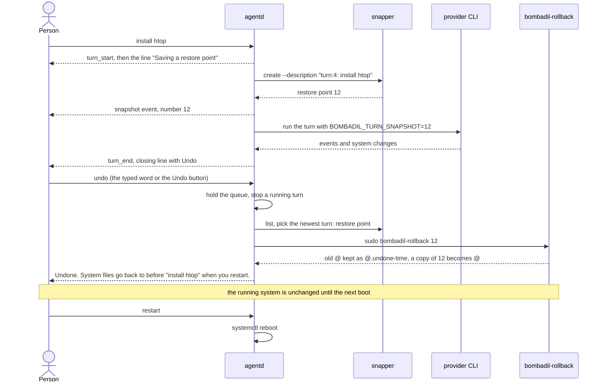
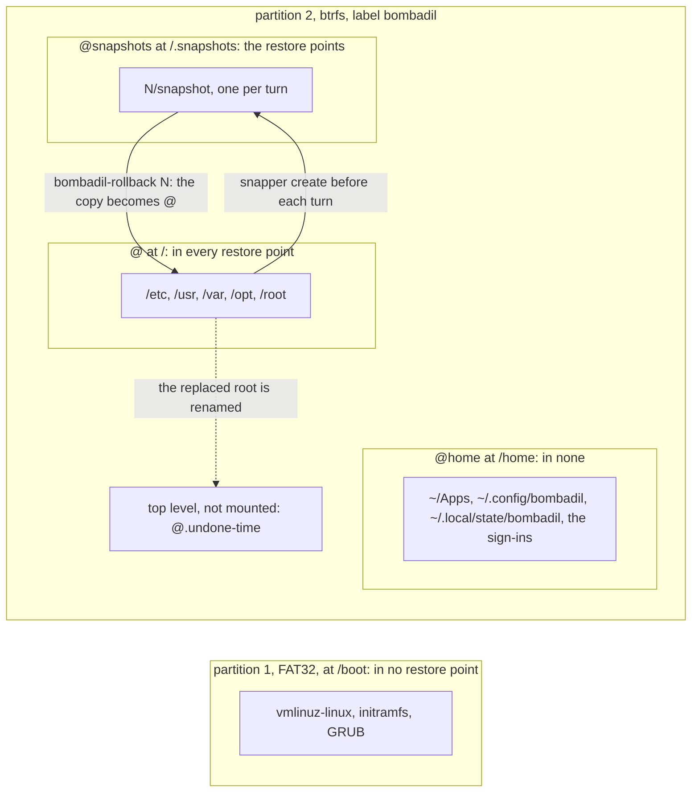

# Restore points

> **Status:** Partly shipped
> **Code:** `src/bombadil/snapshots.py`, `iso/airootfs/usr/local/bin/bombadil-rollback`, `iso/airootfs/usr/local/bin/bombadil-install`, `src/bombadil/launcher.py`, `src/bombadil/mcp_server.py`, `src/bombadil/agentd.py`, `src/bombadil/config.py`, `bin/bombadil`
> **Design:** [UX brief, rule 4](../design/ux-brief.md#the-rules), [Foundation choices, section 1](../design/foundation-choices.md#1-base-distro--arch), [Installed OS brief, rule 7 and piece 1](../design/installed-os-brief.md#the-rules)
> **Verified:** 2026-10-01 against `main` at `26843d3`

A restore point is a btrfs snapshot of the root subvolume that `agentd` takes through snapper before each turn runs. Saying `undo` makes the newest one the root again, and the swap applies at the next boot, not at once. This is what stands in for permission prompts: the agent has full access, and the person can go back.

Shipped: one root restore point per turn, the `undo` word and button, the `rollback` tool, `bombadil undo`, `bombadil-rollback`, and the installer layout that makes the swap possible. The swap was checked in a VM across a reboot. Not built: any pruning, any coverage of `/home` or of the kernel, undo that applies at once, and the installed-OS disk layout. Those are marked designed or in progress below.

The person's word and the code's word differ. The person sees "restore point" (`agentd` says "Saving a restore point"). The code, the snapper commands and the os-mcp tools say "snapshot". Other functions named `snapshot` (`Desk.snapshot`, `Jobs.snapshot`, `sysmap.snapshot`) return state tables and have nothing to do with this piece.

## How it works

### What a restore point is

- One snapper snapshot in the snapper config `root`, made by `Snapshots.create` with `sudo snapper -c root --jsonout create --print-number --description <text>` (`src/bombadil/snapshots.py:36-44`). It is taken before the turn, and no snapshot is taken after it.
- Its description is `turn:<n>: <first 60 characters of the prompt>`, for example `turn:4: install htop` (`src/bombadil/agentd.py:1254`). A `!` line keeps its `!`. `<n>` is `AgentD.turns`, an in-memory count of the turns that reached this step since `agentd` started, so it restarts at 1 and descriptions repeat after every restart (`agentd.py:167,1241`). Undo never reads `<n>`: it uses snapper's own number and the `turn:` prefix.
- It is taken after `turn_start` has gone out and before the provider CLI starts, for every turn that gets that far: model turns and `!` lines alike (`agentd.py:1233-1258`). The line above the pill says "Saving a restore point" while snapper works.
- Its number goes out as a `snapshot` event, into `turns.jsonl` as `snapshot`, and into the CLI's environment as `BOMBADIL_TURN_SNAPSHOT` (`agentd.py:1258,1284,1486`).

The rest of the turn is in [agentd.md](agentd.md#one-turn); this page covers the restore point step and what follows from it.

When a turn gets no restore point:

| Case | What happens | Where |
|---|---|---|
| `snapper` is not on `PATH`, or `/etc/snapper/configs/root` is missing: the live ISO (snapper is in the image, no config exists), a development machine, the tests | `Snapshots.available` is false, the turn skips the step, and `undo` says so | `snapshots.py:31-34`, `iso/packages.x86_64:8` |
| `snapshots = false` in the config (read by `agentd` only) | `agentd` builds `_NoSnapshots`, with `available = False`; the os-mcp tools and `bombadil undo` still work (see known gaps) | `agentd.py:1569,1599-1600` |
| A model turn whose provider CLI is not installed | the turn ends with an `error` event before this step | `agentd.py:1235-1240` |
| `snapper` exits non-zero | an `error` event, "no undo point for this turn: snapper failed (...)", and the turn runs without one | `agentd.py:1255-1256` |
| Any other failure inside `create` (no `sudo`, output that is not a number) | the exception reaches `_worker`, which ends the turn with an `error` event | `agentd.py:1193-1195` |
| A launcher word or another local action (`open`, `stop`, `undo`, `restart`, a picture) | not a turn, so no restore point | `agentd.py:288-291` |

Other moments can make a restore point with any description: the agent's `snapshot` tool, and the development script `scripts/vm-tools/update-in-place`, which takes `before update to main <rev>` (line 63). `undo` ignores descriptions that do not start with `turn:`.

### A turn and a later undo



### Undo, step by step

1. The person types `undo`, `undo that`, `undo it` or `undo the last change`, or clicks `Undo` on the closing line, which sends `{"type": "local", "action": "undo"}` (`launcher.py:39`, `agentd.py:283-291,315-318`, `shell/PillState.qml:331-334`). The typed text is matched after lowercasing, trimming `. ! ? , ; :` at both ends and dropping spaces, hyphens and underscores, so it must equal `undo`, `undothat`, `undoit` or `undothelastchange`, in ASCII only (`launcher.normalize`, `_key`, `_lookup`; `undo-that` and `undo_it` match too). No model is involved. A longer sentence such as "undo the docker install" goes to the agent instead (`tests/test_launcher.py:60`).
2. `AgentD.local` raises `_hold` so no queued turn starts, takes the `_exclusive` lock and, if a turn is running, stops it and waits until it is gone. The running turn is therefore taken back too, and its restore point is the newest one (`agentd.py:652-666`, `test_undo_during_a_turn_takes_back_that_turn_even_with_one_queued`).
3. `Launcher._undo` refuses when `available` is false, reads the marker `undo.json`, lists up to 200 restore points and picks the newest one whose description starts with `turn:` and whose number is below the marker's (`launcher.py:431-463`).
4. `Snapshots.rollback` runs `sudo bombadil-rollback <number>`. Its output is captured because, inside os-mcp, stdout is the JSON-RPC stream (`snapshots.py:54-64`).
5. `bombadil-rollback` mounts the btrfs top level (`subvolid=5`) on a temporary directory, checks that `@snapshots/<n>/snapshot` exists, renames `@` to `@.undone-<YYYYmmdd-HHMMSS>`, makes a `btrfs subvolume snapshot` of the restore point under the name `@` (without `-r`, so the root is writable), and unmounts (`bombadil-rollback:5-16`). The running system keeps running from the renamed subvolume.
6. `Launcher._undo` writes `undo.json` and returns the sentence for the pill. `agentd` broadcasts `local` events, appends the action to `turns.jsonl` (`kind: "local"`) and tells the next model turn what happened without it (`agentd.py:669-679,1272-1276`).
7. The installer strips `subvolid=` from the generated `/etc/fstab` and says in a comment that `/` is mounted by subvolume name, not id, so that a snapshot swapped in under the name `@` is the one found (`bombadil-install:38-41`). Nothing in the repository records how the root subvolume is chosen at boot: the kernel command line comes from `grub-mkconfig` at install time (`bombadil-install:69`) and no generated `grub.cfg` is in the tree. The effect is recorded: the VM run in Tests booted into the swapped-in `@` (`undo-applied`). Nothing restarts by itself: the person says `restart`, which runs `systemctl reboot` (`launcher.py:621-623`).

**When it applies:** on the next boot, never at once. Renaming a subvolume does not change what the running kernel has mounted. The docstring (`snapshots.py:55`), the script (`bombadil-rollback:16`), the sentence the pill shows and the VM check below all say so.

**Between the undo and the restart.** The running root still holds what was undone, so a restore point taken before the restart would bring it back. `undo.json` records the boot id (`/proc/sys/kernel/random/boot_id`), and while it matches, the undo is pending (`launcher.py:392-423`):

- a turn does not clear the marker (`Launcher.clear_undo`, called from `AgentD.turn`, skips a pending one);
- an `undo` after turns have run says "Already undone" once, because the restart takes those turns back too, and the undo after that goes one turn further back (`covered` in the marker);
- after the restart the marker is no longer pending. Each further `undo` goes one turn further back, until a turn runs and `clear_undo` removes the marker.

**The ways in are not equal.**

| Way in | Path | Writes `undo.json` | A repeat |
|---|---|---|---|
| The four words, or the Undo button | `AgentD.local`, `Launcher._undo` | yes | one turn further back each time, "Already undone" when turns ran in between |
| Any other sentence that means undo | the agent calls `rollback` with no number (its system prompt says to): `Snapshots.undo_last_turn`, which skips the running turn's own restore point (`BOMBADIL_TURN_SNAPSHOT`) | no | each asking is a turn with a restore point of its own, which the next asking picks: see known gaps |
| `bombadil undo` in a terminal | `bin/bombadil:139-142`, `Snapshots.undo_last_turn` | no | the same restore point each time, until a turn runs and its restore point is the newest |
| `rollback` with a `number`, or `sudo bombadil-rollback N` | any snapshot by number | no | not applicable |

The by-hand path needs no model, no network, and neither `agentd` nor the shell, so it works from a terminal or a text console:

```sh
sudo snapper -c root list        # numbers and descriptions: what Snapshots.list reads
sudo bombadil-rollback 12        # restore point 12 is the root from the next boot
```

`bombadil-rollback` keeps the replaced root as `@.undone-<time>` at the btrfs top level, so, in its own words, an undo can itself be undone by hand. No command in the repository does that.

### What is covered



This is the layout `bombadil-install` writes (`bombadil-install:11-22,34-41,57-61,85-86`): `@`, `@home` and `@snapshots` at the top level of one btrfs volume, the EFI partition at `/boot`, and `snapper -c root` created on `/`, with the `@snapshots` subvolume mounted at `/.snapshots` in place of snapper's own.

| Where | In a restore point | What it means |
|---|---|---|
| `/etc`, `/usr`, `/var` (the pacman database and packages, systemd units, logs), `/opt`, `/root` | yes | an undo takes back installs, config edits and services |
| `/home` (`@home`): `~/Apps`, `~/.config/bombadil`, the sign-ins copied by the installer (`.claude`, `.claude.json`, `.codex`) | no | an undo never deletes the person's files, apps or sign-in, and never brings back a file deleted from home |
| `~/.local/state/bombadil`: `undo.json`, `turns.jsonl`, `desk.toml` | no | it is home, so the marker, the log and the desk survive the swap |
| `/boot`: kernel, initramfs, GRUB (the EFI partition, FAT) | no | a rollback after a kernel update can leave the newer kernel with the older modules (see known gaps) |
| `/.snapshots` | not part of itself | restore points survive an undo, including those newer than the one chosen |

## Interfaces other pieces depend on

The full tool list is in [os-mcp.md](os-mcp.md#the-tool-catalogue).

| Name | Kind | What it is |
|---|---|---|
| `snapshot` (`description`, required) | os-mcp tool | creates a restore point with that exact description; returns `snapshot <n>` or `snapshots unavailable on this system` |
| `list_snapshots` | os-mcp tool | the newest 20 as `{number, description}`; snapper's number 0 is left out |
| `rollback` (`number`, optional) | os-mcp tool | with a number: `bombadil-rollback <number>`, returns `rolled back, reboot to apply` or `snapshots unavailable`. Without: `undo_last_turn`, returns `rolled back to snapshot <n> (<description>), reboot to apply` or `nothing to undo` |
| `undo`, `undo that`, `undo it`, `undo the last change` | launcher words | `Launcher._undo`, matched with the folding described in Undo step 1 (the table of all launcher words is in [agentd.md](agentd.md#launcher-words)) |
| `{"type": "local", "action": "undo"}` | socket message, client to `agentd` | what the Undo button sends. For a typed launcher word, `agentd` sends the same message back to the typing client as an acknowledgement, ahead of the `local` start and done events (`agentd.py:289`, `tests/test_agentd.py:180`) |
| `local` event with `action: "undo"`, phase `start` then `done` (`ok`, `text`) | socket event | "Undoing the last change", then the sentence |
| `snapshot` event, `number` | socket event | the restore point was saved |
| `turn_start` event, `snapshot` | socket event field | always `null`: the event goes out before snapper runs, and the number arrives later in the `snapshot` event (`agentd.py:1233,1258`) |
| `turn_end` event, `changed` | socket event field | `bool(narrator.done)`, true when a step of the turn changed something (`agentd.py:1406`; `false` on the early ends at 1238 and 1262). With `stopped` false it keeps the closing line and its `Undo` button |
| `turn_end` event, `irreversible` | socket event field | `narrator.irreversible`: a step that no restore point can undo. The closing line then shows "can’t be undone" (`agentd.py:1406`, `shell/PillState.qml:202`, `shell/StatusLine.qml:154-160`) |
| `status.snapshots` | socket message field | `Snapshots.available`; `bombadil status` prints it, and no shell file reads it |
| `snapshot` in a `turns.jsonl` line | file field | the turn's restore point number, or null |
| `BOMBADIL_TURN_SNAPSHOT` | environment variable | set by `agentd` on the CLI of a turn that has a restore point; forwarded to os-mcp through `providers.MCP_ENV` so the Codex server sees it (`providers.py:370-372,410`) |
| `bombadil undo` | command | `Snapshots.undo_last_turn`, exit 1 with `nothing to undo` |
| `sudo bombadil-rollback N` | command, `iso/airootfs/usr/local/bin/bombadil-rollback` | the swap, for any snapshot number |
| `snapshots` | config key, boolean, default `true` | `/etc/bombadil/config.toml` ships `snapshots = true`; `~/.config/bombadil/config.toml` overrides it; read once when `agentd` starts (`config.py:18,38`, `agentd.py:1563,1569`). Only `agentd` reads it: it decides the turn restore points, the launcher's undo and `status.snapshots`. The os-mcp tools and `bombadil undo` build `Snapshots()` without it (`mcp_server.py:42`, `bin/bombadil:140`) |
| `Snapshots(config_name="root", runner=subprocess.run, configs_dir=/etc/snapper/configs)` | Python class | the one place that runs snapper; `runner` and `configs_dir` are how tests replace it |
| `Snapshots.available`, `.create`, `.list(limit=20)`, `.rollback`, `.undo_last_turn(before=None)` | methods | what everything above calls |

## Where state lives

| What | Where | Notes |
|---|---|---|
| The restore points | snapper config `root` at `/etc/snapper/configs/root`; the snapshots at `/.snapshots/<n>/snapshot` | `@snapshots` is its own subvolume, mounted with mode 750 (`bombadil-install:85-86`) |
| The root an undo replaced | `@.undone-<YYYYmmdd-HHMMSS>` at the btrfs top level, not mounted | nothing in the repository removes it |
| The undo marker | `~/.local/state/bombadil/undo.json`: `snapshot`, `what`, `boot`, `t`, and `covered` once set | home, so it survives the swap; the directory is `paths.state_dir()` |
| The turn log | `~/.local/state/bombadil/turns.jsonl` | each turn line carries `snapshot`; `bombadil history` prints it as "(restore point N)" |
| The setting | `/etc/bombadil/config.toml`, `~/.config/bombadil/config.toml` | |
| In memory | `AgentD.turns`, `AgentD._hold`, `AgentD.notes` | gone when `agentd` restarts |

## Retention and pruning

Nothing prunes, as coded on `main`.

| Thing | Made by | Removed by |
|---|---|---|
| A restore point | `Snapshots.create`, one for every turn that gets one, whether or not the turn changed anything | nothing: it is created without `--cleanup-algorithm`, and snapper's cleanup algorithms (`number`, `timeline`, `empty-pre-post`) are named per snapshot ([snapper manual](http://snapper.io/manpages/snapper.html)) |
| The snapper cleanup timer | | nothing in the repository enables it: the installer enables only `greetd` and `NetworkManager` (`bombadil-install:56`), and `iso/airootfs/etc/systemd/system` has no snapper unit. The UX brief records it as off on an installed machine |
| `@.undone-<time>` | `bombadil-rollback:13-14`, one per undo | nothing |

What undo can reach is limited by the readers, not by pruning: the launcher looks at the newest 200 restore points (`launcher.py:438`), and `undo_last_turn` (the agent's tool and `bombadil undo`) at the newest 20 (`snapshots.py:46,73`).

In progress, not on `main`: an unmerged branch passes `--cleanup-algorithm number` in `Snapshots.create` and makes the installer set `TIMELINE_CREATE=no NUMBER_CLEANUP=yes NUMBER_LIMIT=30` and enable `snapper-cleanup.timer`. See [the roadmap](../roadmap.md).

Designed: a pre and post pair for every turn, pairs with no change dropped at the end of the turn, the last 100 changed pairs kept, the cleanup timer on, and `@.undone-*` pruned (the installed OS brief says older than 14 days). See [the UX brief's decisions](../design/ux-brief.md#decisions-i-picked-a-default-for) and [the installed OS brief](../design/installed-os-brief.md#after-these-in-order).

## How undo is explained to the person

Every sentence below is written by `agentd`, the launcher or the shell, with no model. The design says undo must say exactly what it covered ([UX brief, rule 4](../design/ux-brief.md#the-rules)). On `main` that means the turn it took back, named by its prompt, and the two areas: system files change at the restart, home and apps do not. It does not list files.

| Moment | What the person sees | Where |
|---|---|---|
| A restore point is being saved | the live line "Saving a restore point" | `agentd.py:1252` |
| Snapper failed | "no undo point for this turn: snapper failed (...)" | `agentd.py:1256` |
| A turn changed something and was not stopped | the closing line stays until the next prompt, with `Undo` and `Details`. A stopped turn gets no sticky line and no `Undo` button; its restore point still exists and the word `undo` still works. A step that no restore point can undo (formatting a disk, deleting under home) shows "can’t be undone" | `shell/StatusLine.qml:151-176`, `shell/PillState.qml:214` (`sticky = changed && !stopped`), `src/bombadil/agentd.py:1405-1407`, `src/bombadil/narrate.py:445-480` |
| An undo went through | "Undone. System files go back to before “<prompt>” when you restart. Your home folder and apps stay as they are." The line stays 15 seconds instead of 5 | `launcher.py:462-463`, `shell/PillState.qml:229` |
| An undo asked again before the restart, after turns | "Already undone: when you restart, system files go back to before “<prompt>”, and that takes back everything since too." | `launcher.py:447-448` |
| Nothing to take back | "Nothing to undo yet." | `launcher.py:458` |
| The live ISO | "Undo starts once Bombadil is installed. The live system keeps no restore points." | `launcher.py:433-434` |
| `snapshots = false`, or no snapper config on an installed system | "Undo is off here: this system keeps no restore points." | `launcher.py:435` |
| Later, in `bombadil history` | each turn ends with "(restore point N)" | `src/bombadil/watch.py:263` |
| The next model turn | its prompt starts with "[Done by the user without you since your last turn: 'undo': Undone. ...]" | `agentd.py:676,1272-1276` |

The agent is told in its system prompt to use `rollback` when the person says undo (`providers.py:43-44`). The narrator words that tool call as "Undoing the last change" and marks it as a system step (`narrate.py:902-903`).

## What the installed-OS redesign changes (designed)

The [installed OS brief](../design/installed-os-brief.md) treats the installed machine as the product and decides, in [piece 1](../design/installed-os-brief.md#1-the-disk-that-lasts-layout-v1-and-a-refresh-that-keeps-your-home) and the pieces after it, how restore points change; the [UX brief](../design/ux-brief.md#decisions-i-picked-a-default-for) decides what undo covers and when it applies. None of this is in the code. The brief's status is Designed.

| Designed | Differs from `main` by |
|---|---|
| Layout v1: top-level `@`, `@home`, `@snapshots` plus `@log` and `@pkg` beside `@`, and nested subvolumes inside `@home` for what a home restore point skips | `main` has the first three only (`bombadil-install:18`) |
| A snapper config for `/home` (`snapper -c home create-config /home`, `TIMELINE_CREATE=no`) for undo of home files | `main` has `root` only |
| The ESP at `/efi`, the kernel and initramfs in `@/boot` so every restore point carries its own kernel, GRUB on the ESP | `main` mounts the ESP at `/boot` (`bombadil-install:35`) |
| `bombadil-rollback` refuses a snapshot with no `boot/vmlinuz-linux`, and gains `--device DEV` for use from the install stick | `main` does neither (`bombadil-rollback:7,11-12`) |
| Snapshot 1, "Bombadil <version>, as installed", and one for programs brought from the stick | `main` creates no snapshot at install |
| Pruning: the last 100 changed pairs kept, `@.undone-*` and `@.before-refresh-*` pruned | see Retention |
| Undo that applies at once for files under `/etc` and home, with "redo" | `main` applies every undo at the next boot |
| A start that fails twice puts itself back, a Repair mode on the stick, a rescue page on tty2 | no code; `main` has `bombadil-rollback` run by hand as the only recovery |

## Principles it keeps

- [Full access, with undo instead of guard rails](../principles.md#full-access-with-undo): every turn that runs gets a restore point, so nothing in front of the agent asks permission. The trap: adding a confirmation before something undo could reverse, or adding a way to change the root outside `AgentD.turn`, which takes no restore point. The other trap is claiming more than undo does: it covers the root only.
- [Recovery never goes through the part that broke](../principles.md#recovery-without-the-broken-part): `undo` is a launcher word that `agentd` answers without the model, and `bombadil undo` and `sudo bombadil-rollback` need neither `agentd` nor the shell. The trap: sending undo through the agent. An undo run by the agent is itself a turn with a restore point of its own, and rolling back to that one does nothing; `BOMBADIL_TURN_SNAPSHOT` and the `before` argument of `undo_last_turn` make it skip that one.
- [Records answer before models, and the machine explains itself](../principles.md#records-before-models): the undo sentence is built from the restore point's description and the marker. The trap: letting a model word it, or putting something in a restore point description that is not the person's own prompt.
- [Every piece degrades, and nothing waits on a model it does not need](../principles.md#degrade-and-recover): without snapper or its config every method is a no-op that reports `available = False`, and a snapper failure is an `error` event, not a lost turn. The trap: raising anything other than `subprocess.CalledProcessError` from `create` (the turn ends), or calling snapper on the event loop (it can take a second).
- [Plain files stay the truth](../principles.md#plain-files-stay-the-truth): the marker and the turn log are small files in `~/.local/state/bombadil`, outside every restore point so they survive the swap. The trap: putting state that must outlive an undo under `/etc` or `/var`, where undo takes it back; `src/bombadil/desk.py` documents the same rule for `desk.toml`.

## Extending it

### Change the retention

As coded, nothing prunes, so this adds pruning. The pieces are in three places.

1. Put restore points under a snapper cleanup algorithm: in `Snapshots.create` (`snapshots.py:43`) add `"--cleanup-algorithm", "number"` to the arguments of `self._snapper("create", ...)`. Snapshots without one are outside the `number` cleanup.
2. Set the limit in the `root` config: after `snapper --no-dbus -c root create-config /` in the installer's chroot block (`bombadil-install:59`), run `snapper --no-dbus -c root set-config NUMBER_CLEANUP=yes NUMBER_LIMIT=<n>`. On `main` at `26843d3`, only turns make restore points: nothing enables snapper's timeline timer, and the installed OS brief cuts the hourly timeline on purpose (turn restore points are the timeline).
3. Enable the timer that runs the cleanup: add `snapper-cleanup.timer` to `systemctl enable greetd NetworkManager` (`bombadil-install:56`).
4. Prune the old roots separately. `@.undone-*` are not snapper's. Deleting one needs the top level mounted the way `bombadil-rollback:8-9` does it, and no existing unit or script does this.
5. Keep the readers in line with the limit: the launcher sees 200 restore points (`launcher.py:438`), the agent's tool and `bombadil undo` see 20 (`snapshots.py:46`).
6. A machine already installed keeps the config it was installed with, because the installer runs once. Reaching existing machines needs a step that runs `set-config` on them; the installed OS brief designs numbered steps inside an update for this.
7. Test the argument list by passing `runner=` to `Snapshots` (no test covers `create`). The installer lines are checked only by the VM run: of `bombadil-install`, `tests/test_iso_profile.py` runs the GRUB lines and nothing else.

### Add another moment that takes a restore point

1. Choose the description prefix. `undo` picks only descriptions that start with `turn:`. Another prefix shows in `list_snapshots`, can be rolled back by number, and is skipped by `undo`. To let undo reach it, change the three `startswith("turn:")` tests: `launcher.py:442` (the turns that count as covered by a pending undo, for "Already undone"), `launcher.py:454` (the restore point the launcher picks) and `snapshots.py:76` (the agent's `rollback` and `bombadil undo`), and change `_snapshot_prompt` (`launcher.py:258-262`), which cuts the prefix off for the sentence.
2. Inside `agentd`: call `self.snaps.create(description)` through `asyncio.to_thread`, only when `self.snaps.available`, and catch `subprocess.CalledProcessError` as `agentd.py:1255-1256` does. Say it on screen: the turn sends a `status` event, then a `snapshot` event.
3. From the agent: nothing to add. The `snapshot` tool takes any description, and the narrator words it "Saving a restore point" (`narrate.py:898-899`).
4. From a script on the machine: `sudo snapper -c root create --description "<text>"`, as `scripts/vm-tools/update-in-place:63` does.
5. If the moment can run while an undo waits for its restart, remember the rule in `launcher.py:392-394`: a restore point taken then holds the undone changes.
6. Test with a recording fake, as `RecordingSnaps` in `tests/test_agentd.py:446-465`: subclass `agentd._NoSnapshots`, set `available = True`, record `create`.

### Add a recovery path that works without the model

1. Pick how it is reached.
   - An exact word: add it to `CORE_COMMANDS` (`launcher.py:37-46`; these are checked before app names, so they always mean the same thing). Add a method `Launcher._<kind>` that returns `(ok, one plain sentence)`; `Launcher.run` finds it by name (`launcher.py:318-325`). Add the `doing` and `failed` strings (`launcher.py:295,312`). If it must end the running turn first, add the kind to the tuple in `AgentD.local` (`agentd.py:652`). The button form works without more code, because `_action` accepts every `CORE_COMMANDS` kind (`agentd.py:1516-1521`). Add the kind to `NO_COMPLETE` if Tab should never land on it (`launcher.py:87`).
   - A terminal command that needs no `agentd`: add a branch to `main()` in `bin/bombadil`, like `undo` (`bin/bombadil:139-142`).
   - A root script: put it in `iso/airootfs/usr/local/bin/`, list its mode in `file_permissions` in `iso/profiledef.sh` (mkarchiso copies without modes; see the entry for `bombadil-rollback`, line 21), and add it to `SYSTEM` in `scripts/vm-tools/update-in-place` so in-place updates carry it. `user` runs it with `sudo`, which asks no password (`iso/airootfs/etc/sudoers.d/bombadil`).
2. Depend on nothing that can be the broken part: no model, no network, no Quickshell, and for a command or a script no `agentd`. Read what it needs from files and btrfs.
3. Say in one plain sentence what it did and what it did not cover, as `_undo` does.
4. Record it. `AgentD.local` logs launcher actions to `turns.jsonl` and tells the next turn (`agentd.py:676-679`); a terminal command or a script does neither, so a recovery that matters to the next turn must write its own marker, as `undo.json` does.
5. Test a word in `tests/test_launcher.py` (the parameter table at the top, and a fake like `Snaps`) and in `tests/test_agentd.py` (`test_launcher_words_never_start_a_turn`). A script can only be run by the VM smoke: add a step to the `undo` mode of `bombadil-smoke` (`bombadil-smoke:304-319`).
6. Not built: the rescue page on tty2 and the start that puts itself back. They are designed in the briefs linked above.

## Tests

| What | Where |
|---|---|
| The four words match, and sentences with undo in them go to the agent | `tests/test_launcher.py`: `test_exact_words_open_locally` (the `undo` and `Undo that` rows), `test_everything_else_goes_to_the_agent` |
| One turn further back on each repeat, the marker, "Already undone", no restore points | `tests/test_launcher.py`: `test_undo_goes_back_one_turn_at_a_time_until_a_new_turn`, `test_a_turn_before_the_restart_does_not_bring_back_what_was_undone`, `test_undo_without_restore_points_says_so` |
| The tools, and `undo_last_turn` skipping the running turn's restore point | `tests/test_mcp_server.py`: `test_snapshot_and_undo`, `test_undo_inside_a_turn_skips_that_turns_snapshot` |
| The restore point comes after `turn_start`, can be stopped, and an undo during a turn takes that turn back before a queued one starts | `tests/test_agentd.py`: `test_turn_start_comes_before_the_restore_point`, `test_stop_while_the_restore_point_is_saved_ends_the_turn_before_its_cli`, `test_undo_during_a_turn_takes_back_that_turn_even_with_one_queued`, `test_launcher_words_never_start_a_turn` |
| `snapshots` defaults to true | `tests/test_config.py`: `test_defaults` |
| The whole path on a real btrfs disk: install, a restore point, a change under `/etc`, `bombadil undo`, a reboot, the change gone | the `undo` mode of `iso/airootfs/usr/local/bin/bombadil-smoke`, run by `MODE=install scripts/test-vm.sh`. A recorded run (build `1ed8f46`, 2026-09-27) passed `snapshots-available`, `snapshot-turn`, `undo` and, after the reboot, `undo-applied`: `docs/review/boot-logs/2-installed-and-undo.txt`. `snapshots.py` and `bombadil-rollback` are unchanged since that build |

```sh
python3 -m pip install -e '.[dev]'    # pytest and pytest-asyncio: the agentd tests need the second
python3 -m pytest -q tests/test_launcher.py tests/test_mcp_server.py tests/test_config.py -k "undo or snapshot or config"
python3 -m pytest -q tests/test_agentd.py -k "restore_point or undo or launcher_words"
```

Setting up a checkout is in [development](../contributing/development.md#set-up).

The tests replace snapper with fakes that override `list` and `rollback` (or `create`). Nothing runs the command lines of `Snapshots.create`, `.list` and `.rollback`, the parsing of snapper's JSON, `bombadil-rollback`, or the subvolume layout and `fstab` rewrite of the installer, except the VM run. That run uses `bombadil undo`, so the launcher's marker is covered by unit tests only. The how-to for the VM tools is in [development](../contributing/development.md); the installer is in [iso-and-install](iso-and-install.md).

## Known gaps

Each gap is checked in code. Gaps that other pages also list are linked, not repeated: see [known issues](../known-issues.md).

| Gap | Evidence |
|---|---|
| Home is in no restore point. A file deleted under home or a change to `~/Apps` is not taken back, and the undo sentence says so only after the fact. Before the step runs, `_irreversible` marks `rm`, `find -delete` and `find -exec rm` under home as "can’t be undone"; other shell commands that change home, such as `mv` or `cp` over a file, are not marked | `bombadil-install:18,22`, `narrate.py:445-481` |
| The kernel and initramfs are on the EFI partition at `/boot`, outside `@`. An undo after a kernel update can pair a newer kernel with older modules | `bombadil-install:34-36,43-47,68`; [known issues](../known-issues.md) |
| No code in the repository removes restore points or `@.undone-*`, so free space shrinks with use | Retention above; [known issues](../known-issues.md) |
| Only the launcher words keep the marker. After the agent's `rollback` or `bombadil undo` and before the restart, the next turn takes a restore point of the root that still holds the undone changes, and the next undo picks it, which silently replaces the first undo. Run with a fake list: an install turn (restore point 1), an undo turn (2) rolled back to 1, a second undo turn (3) rolled back to 2. With `bombadil undo` and a turn in between, the same happens. Two terminal undos in a row, with no turn between, roll back to the same restore point twice | `launcher.py:459-461` against `snapshots.py:66-79`, `mcp_server.py:123-127`, `bin/bombadil:139-142` |
| An undo does not remove the restore points of the turns it took back. After an undo, a restart and a later turn, the second `undo` can pick the restore point of the turn already undone, so it reports taking that turn back while changing almost nothing. Run with the fake: rolled back 3, then 4, then 3 | `launcher.py:449-456` |
| The swap is two commands. If `btrfs subvolume snapshot` fails after `mv`, no `@` exists and the next boot has no root until someone renames the `@.undone-*` back. The only handler unmounts | `bombadil-rollback:5,10,14-15` |
| `snapshots = false` in `~/.config/bombadil/config.toml` is lost when the provider is chosen or changed, because `save_user` rewrites the file with only `provider`, `model` and `explain`. Run: the setting read back as `true` | `config.py:48-61`, called from `agentd.py:1071` and `bin/bombadil:149` |
| No baseline restore point at install, so the first undo can only go back to the start of the first turn | `bombadil-install:59` creates the config and no snapshot |
| `rollback` called by the agent reports a failed swap as `CalledProcessError: Command ... returned non-zero exit status 1`; the script's own message ("no snapshot N") is captured and dropped. The launcher shows it, through `_reason` | `snapshots.py:63`, `mcp_server.py:201-202`, `launcher.py:653-660` |
| The restart that applies an undo starts a conversation with no memory of the earlier one, because `session_id` is only in memory. Descriptions also repeat `turn:1` after it | `agentd.py:166-167`; [known issues](../known-issues.md) |
| `snapshots = false` reaches `agentd` only. On an installed system with it set, the agent's `snapshot`, `list_snapshots` and `rollback` tools and `bombadil undo` still work, because `OsTools` and the `undo` command build `snapshots.Snapshots()` without reading the config, while the launcher word answers "Undo is off here" | `mcp_server.py:42`, `bin/bombadil:140`, `agentd.py:1569`, `config.py:38` |
| `status.snapshots` is sent and no shell file reads it, so nothing on screen says whether restore points are being kept until `undo` is asked | `agentd.py:361`, no match in `shell/` |
