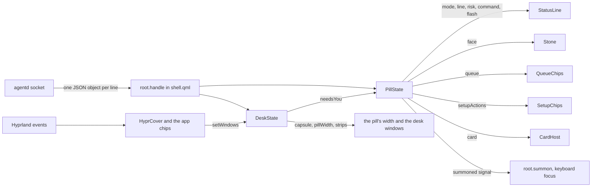
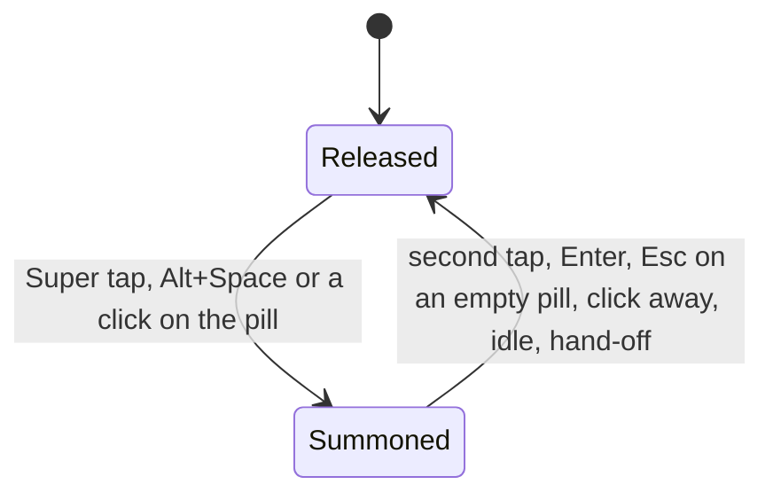
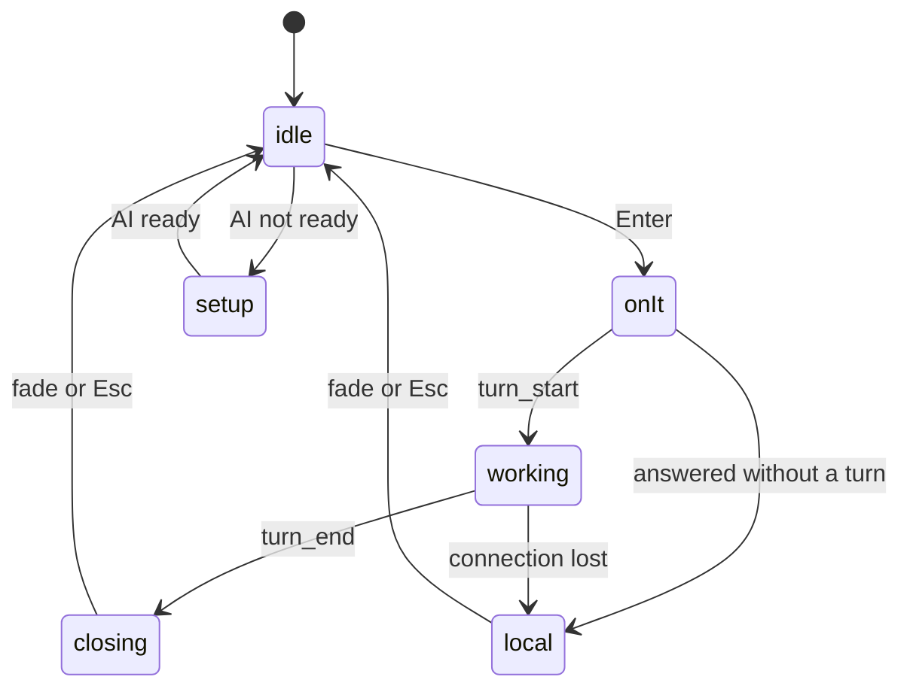

# The shell

> **Status:** Partly shipped
> **Code:** `shell/shell.qml`, `shell/PillState.qml`, `shell/StatusLine.qml`, `shell/QueueChips.qml`, `shell/SetupChips.qml`, `shell/LineButton.qml`, `shell/Stone.qml`, `shell/HyprCover.qml`, `shell/CardHost.qml`, `shell/Wallpaper.qml` (hosting only), `bin/bombadil-shell`, `iso/airootfs/etc/skel/.config/hypr/hyprland.lua`
> **Design:** [UX brief](../design/ux-brief.md#the-rules), [The Bombadil mark](../design/identity-brief.md#the-stone), [the pill's states in the design system](../design-system/README.md#the-pills-states)
> **Verified:** 2026-10-01 against `main` at `6150431`

The shell is the whole visible interface at login: one Quickshell program that draws a pill at the bottom of every screen, the line above it, the chips, the stone at the pill's left end, the picture host, the windows of the desk and the wallpaper under everything. It keeps no conversation. It turns what agentd says into what is on screen, and sends back what the person types or clicks. It exists so that something true is on screen the moment Enter is pressed, and so that stop, undo and the launcher words never wait for a model.

Shipped on `main`: the layer-shell window and its input mask, the keyboard hand-over, the pill's five modes, the line and its timings, the queued, setup and app chips, the stone with its eight faces, the picture host, the hosts for the desk and the wallpaper, and the Hyprland config. Designed and not built: the chip that says what "this" means, example chips and the first-day hint, a notification line, battery and music beside the clock, drop and paste onto the pill, voice. One trigger is wired in the shell and fed by nothing on `main`: the desk sets `PillState.needsYou` while a coding session waits, and agentd sends no `dev` message to say one does (see [Known gaps](#known-gaps)). The desk's cards are in [desk.md](desk.md), the pictures in [cards-and-pictures.md](cards-and-pictures.md), the app kit in [app-kit.md](app-kit.md) and the sign-in flow behind the setup chips in [browser-and-signin.md](browser-and-signin.md).

## How it works



**Start.** Hyprland runs `agentd`, `bombadil-shell` and `mako` on `hyprland.start` (`hyprland.lua:7-12`). `bin/bombadil-shell` puts `share/qml` on `QML2_IMPORT_PATH` and runs `quickshell -p <root>/shell/shell.qml`. `shell.qml` makes one `PillState` and one `DeskState` for the whole session and one `PanelWindow` per screen (`Variants { model: Quickshell.screens }`). The line, the chips and the stone read the same state on every screen. What differs per screen is the keyboard, the pill's width and the desk's strips. `shell.qml` also makes a `Wallpaper`, which draws one picture per screen on `WlrLayer.Background` (namespace `bombadil-wallpaper`, an empty input mask) from `share/wallpaper/bombadil.png`, or from the image named in the `wallpaper` file of the config folder; [the boot and wallpaper note](../design/boot-and-wallpaper.md) owns it.

**Connecting.** The socket path is `$BOMBADIL_SOCKET`, else `$XDG_RUNTIME_DIR/bombadil/agentd.sock`. A comment in `shell.qml` says a Quickshell `Socket` that failed to connect does not retry, so each attempt is a fresh `Socket` made from the `link` component. While `root.connected` is false a 1500 ms `Timer` (running from the start) destroys the last socket and makes the next. When the connection state changes, the shell sets `root.connected` and `deskState.connected`; a connect sets `pillState.connected`, and a drop calls `pillState.lost()` and `deskState.lost()`. agentd greets a new client with `status`, `entries` and `setup` ([agentd.md](agentd.md#the-socket)), and `DeskState` asks for `desk get` as soon as it is connected, so a restarted bar is told what is running without any state of its own.

**Handling.** `SplitParser` hands each line to `root.handle`, which parses it (a line that is not JSON is dropped) and gives the object to `pillState.handle` and `deskState.handle`. Both objects emit `outgoing(msg)`; `root.write` sends it as one JSON line and does nothing while the socket is down. The pill's methods that send (`stop`, `unqueue`, `undo`, `details`, `setupAction`, `openThing`) check `_offline()` first and flash "Not connected to the agent yet." on the line; `submit` says the same as a `local` line and keeps the typed text; `closeDetails` stays silent. So a click while disconnected is answered, not lost.

**Hyprland.** Two things come from the compositor and not from agentd. The app chips are built from `Hyprland.toplevels` whose workspace is named `special:app-<name>`, refreshed on the raw events `openwindow`, `closewindow` and `movewindowv2`, with the shown workspace tracked from `activespecial`. `HyprCover` reports where the windows are to `DeskState.setWindows`, which decides whether the desk's cards fold and whether the pill becomes a capsule.

### The bar window

| Property | Value | `shell/shell.qml` |
|---|---|---|
| One window per screen | `Variants` over `Quickshell.screens`, each a `PanelWindow` | 168-172 |
| Edges | anchored left, right and bottom: as wide as the screen | 180 |
| Layer and name | `WlrLayer.Overlay`, namespace `bombadil-bar` | 183-184 |
| Background | `"transparent"` | 182 |
| Height | `column.implicitHeight + 24` (the column has 12 px margins) | 181 |
| Exclusive zone | `64 + (appChips.visible ? appChips.implicitHeight + column.spacing : 0)`: the pill's 52 plus 12 below it, plus the app chips row | 197 |
| Input mask | a `Region` of `cardHost`, `statusLine`, `setupChips` (only while visible), `chips`, `appChips`, `pillBox`, `stripsLeft` and `stripsRight` | 199-208 |

The window is as wide as the screen and transparent, so the mask is what lets clicks beside and above the pill reach the windows behind it. A control that is not listed in `mask` receives no clicks. `setupChips` is the one entry guarded by `visible`; the comment gives the reason (a hidden item keeps its last place). `DeskStrips` is zero wide and high when it has nothing to show, so that the mask takes no room for it (its own comment).

The `ColumnLayout` (`id: column`, 12 px margins, 8 px spacing) stacks these, top to bottom:

| Item | Is | Width limit |
|---|---|---|
| `cardHost` | a `Loader` for `CardHost.qml`, set up with `setSource`, so a picture that will not load or draw (a failure in `CardHost.qml` or in the kit's `Diagram`) costs the pictures and not the bar; the `Bombadil` module itself is not isolated this way (see [Theme](#theme-and-why-the-shell-starts-through-binbombadil-shell)); `maxHeight` is 60% of the screen | `max(360, win.pillMax)` |
| `statusLine` | `StatusLine.qml` | `max(360, win.pillMax)` |
| `setupChips` | `SetupChips.qml`, shown while the setup line shows | `Kit.Theme.pillMaxWidth` |
| `chips` | `QueueChips.qml` | `max(360, win.pillMax)` |
| `appChips` | one chip per running app | `Kit.Theme.pillMaxWidth` |
| `pillBox` | the pill: stone, text field, hint, clock | `win.pillMax` |

`win.pillMax` is `deskState.pillWidth` on the screen the desk lives on and `Kit.Theme.pillMaxWidth` (900) on the others. On the desk's screen a window sharing the stage narrows the pill to 360, and a full-screen window turns it into a capsule of 100 px with the stone and the clock only: the field is hidden and disabled, "nothing can be typed blind" (`shell.qml:412`). The widths come from `DeskState` ([desk.md](desk.md)). The desk's strips (`stripsLeft`, `stripsRight`) are children of this window, placed beside the pill. The desk's rails are separate windows (`DeskRails`, namespaces `bombadil-desk-left` and `bombadil-desk-right`, on `WlrLayer.Bottom`).

The pill (`pillBox`, `Kit.Theme.pillHeight` high, `glassPill`) holds, left to right:

- the stone slot, 24 px wide. While a turn can be stopped (`pillState.stoppable`) and the pointer is over it (not in the capsule), the stone gives way to a `Stop` button (a 9 px accent square and the word) and the slot widens to the button's width plus 16 px, on an `accentSoft` wash; a tap calls `pillState.stop()`.
- the text field. Its placeholder is "Starting" while the face is `starting`, else "Ask anything" when connected, else "Waiting for agentd…". A ghost row draws the rest of a name that Tab would complete, in `faint`.
- a hint `↵ <name>` when the typed words exactly name something the launcher opens ([the launcher mirror](#the-launcher-mirror-in-pillstate)).
- the clock, `HH:mm`, refreshed every 30 s.

The border is one rule, first match wins: `accent` while `pillState.busy`, `borderActive` while this screen's pill holds the keyboard, `badLine` when the face is `offline`, else `border`. It is `Kit.Theme.pillBorder` wide and its colour change takes `Kit.Theme.slow` (300 ms).

### Keyboard focus

On Hyprland the pill takes keys only while it is summoned. `root.summonedOn` holds the name of the one screen whose pill has the keyboard (`""` for none), so only one pill holds it at a time.



| Compositor | Not summoned | Summoned |
|---|---|---|
| Hyprland (`HYPRLAND_INSTANCE_SIGNATURE` is set) | `WlrKeyboardFocus.None` | `WlrKeyboardFocus.OnDemand`, plus a `HyprlandFocusGrab` on the window |
| Any other (the headless sway test) | `OnDemand` | `Exclusive` |

The comment at `shell.qml:185-192` gives the reasons: the grab gives the pill the keyboard at once and a click anywhere else takes it away; going from `OnDemand` back to `None` makes Hyprland hand the keyboard to the window the person was in; and `Exclusive` is never used on Hyprland because Hyprland ends any grab when a layer turns exclusive, so the keys went to the window under the pointer.

| Input | What happens | Made by |
|---|---|---|
| Tap `Super` | the pill on the focused monitor takes the keyboard; a second tap gives it back | bind `SUPER + SUPER_L` and `SUPER + SUPER_R` with `{ release = true }` runs `bombadil pill`, which sends `{"type": "summon"}`; agentd broadcasts it; `PillState` emits `summoned()`; `root.summon()` toggles `summonedOn` (the focused monitor, else the first screen) |
| `Alt+Space` | the same | bind `ALT + space` runs `bombadil pill` |
| Click on the pill | summons that screen (Hyprland only; elsewhere the layer takes clicks `OnDemand` by itself) | `TapHandler` on `pillBox` and on the field call `summonHere()` |
| `Enter` | sends the line as a `prompt`, clears the field and gives the keyboard back. A blank line, or one typed while disconnected, sends nothing and keeps the field and the keyboard | `onAccepted`: `pillState.submit(text)` returns true or false |
| `Esc` while a turn runs or a sign-in is under way | sends `stop`; the pill keeps the keyboard | `pillState.stoppable` |
| `Esc` with text typed | clears the text | `onEscapePressed` |
| `Esc` on an empty pill | puts the line and the picture away, sends `close_details`, gives the keyboard back | `dismiss()`, `closeDetails()`, `release()` |
| `Tab` | types the rest of the suggested name | `pillState.completion(text)` |
| Click anywhere else | the focus grab clears and the keyboard goes back | `HyprlandFocusGrab.onCleared` calls `release()` |
| Nothing typed for 20 s, or for 60 s with text in the pill | the keyboard goes back; the text stays | the `idle` `Timer`, restarted by `onTextChanged` |
| Details, a sign-in or Wi-Fi chip, a picture's box that names a turn | the keyboard goes back before the drawer opens, so the drawer can take it | `PillState.handOff()`, which `shell.qml` connects to `release()` |
| `Super+Escape` | `bombadil stop`: ends the turn and everything it started. Nothing in the shell is involved | bind in `hyprland.lua` |
| `Super+Ctrl+Escape` | kills Quickshell and starts the bar again | bind: `pkill -x quickshell; bombadil-shell` |

`Esc`, `Enter` and `Tab` reach the field only while the pill holds the keyboard. When it does not, `Esc` goes to the window in front, and `Super+Escape` is the way to stop from anywhere. When the pill is summoned and its screen's face is `rest`, the stone shows `listening`.

### The pill's modes

`PillState.mode` is what the line shows. `optimistic` is a flag inside `working`: "On it" was drawn on Enter, before agentd confirmed a turn.



The diagram is the main path. The rest, from `PillState.qml`: Enter from `closing` or `local` goes to `onIt` as it does from `idle`. `turn_start` goes to `working` from any mode, and a `status` event inside a turn rewrites the line without leaving `working`. An answer agentd gives without the model (a `local` event, or an error with no turn) makes mode `local` from `idle`, `closing` or `setup`. A turn that is queued and ends before it starts goes from `onIt` to `closing`. When a line fades or `Esc` puts it away while the AI is not ready, the setup line comes back instead of `idle`. A setup that becomes ready with a line to say ("Signed in to Claude. Ask me for anything.") goes to `local` for 8 s.

| Mode | When | What shows | Leaves when |
|---|---|---|---|
| `idle` | nothing to say | no line: `StatusLine` has height 0 and opacity 0, and its timer is stopped | any of the rows below |
| `working` | `submit` (as `onIt`, the line "On it"), or `turn_start`, or a `status` message that reports a running turn the bar did not know of (the line "Working") | the live line, one line long, its seconds counter from the first second, and an edge: amber for `risk` `system`, red for `irreversible`. A marked step also shows its exact `command`, its `because` and its `after`. A `local` answer shows over the line as a flash and the line comes back | `turn_end`, a `local` answer when no turn was confirmed, `lost()` |
| `closing` | `turn_end` | if the turn was stopped, the stop line (agentd's `line`, else "Stopped."); else, when the turn had an error and its result was not ok or there was none, the error's first two lines with a red edge; else the result text (up to four lines), else the summary, else "Done." (a turn with an error and an ok result shows the result); "can't be undone" after an irreversible step; Undo while `sticky`; Details; a click on the line is Details | the fade, `Esc`, the next prompt or turn |
| `local` | an answer agentd gave without the model, an error with no turn, "Lost touch with the agent. Reconnecting.", "Not connected to the agent yet.", or the one-time "ready" line | the text; a red edge for an error | the fade, `Esc`, the next prompt |
| `setup` | `setup` message whose state is not ready (`choose`, `signed_out`, `offline`, `signing_in`) | the setup line and the `SetupChips`; a red edge when its tone is `error` | the state becomes ready |

`ready` is `setupState` of `""`, `"ready"` or `"checking"`. While it is false, a typed line is still sent as a `prompt`, no "On it" is drawn, and agentd queues it (a line that starts with `!` is the exception and runs). A turn has the line while it runs: a `setup` message that arrives mid-turn is stored, and while the AI is still not ready the setup line comes back when the turn's line goes (`_putLineAway`); a ready "Signed in" line that arrives mid-turn is not shown later. The "Signed in" line is said once to a bar that saw the state change, and never to a bar that has just started.

### The stone

`Stone.qml` draws the mark in the pill's left slot: a 24 by 24 item with an 18 px rounded Reuleaux triangle and a lowercase b cut through it. `PillState.face` decides the face (first match wins, in this order), and `shell.qml` changes `rest` to `listening` on the screen that holds the keyboard.

| `face` | `PillState.face` gives it when | Stone |
|---|---|---|
| `starting` | not connected, agentd has not answered since the bar started, and the 15 s `booting` timer in `shell.qml` is running | orange, rolling; the placeholder says "Starting" |
| `offline` | not connected, and agentd was seen or the boot window is over | broken red outline with the b as a red line |
| `needs` | `needsYou` (the desk sets it while a coding session waits), or mode `setup` with state `choose`, `signed_out` or `offline` | amber, two knocks and a breathing glow on a 1.6 s beat |
| `working` | `busy`, `optimistic`, mode `working`, or setup state `signing_in` | orange, a third of a turn per second about the b, which stays still |
| `stopped` | mode `closing` and the turn was stopped | a 12 px muted (grey) rounded square: the shape of the Stop button's square, not its orange |
| `done` | mode `closing`, not stopped, not an error | green, one 700 ms hop, then still |
| `rest` | otherwise, including a closing line that is an error | green, still |
| `listening` | `rest` on the screen whose pill holds the keyboard (`shell.qml:388`) | green, leaning 6 degrees toward the text |

The motion, from `Stone.qml`: the roll holds 300 ms, turns 120 degrees in 550 ms on the curve (0.55, 0, 0.3, 1) and holds 150 ms; the knocks tip 8 degrees (192, 160, 160 and 160 ms, then a 928 ms wait); the glow runs 0.25 to 0.6 to 0.25 in 560 and 1040 ms; the lean eases over 240 ms on (0.16, 1, 0.3, 1). The b is drawn in `ground` (default `Kit.Theme.glassPill`), so it reads as a cut only on a flat surface of that colour. With `reducedMotion` the roll becomes an opacity pulse (to `Kit.Theme.pulseLow` and back, 500 ms each way), the knock stops and the glow is held at 0.45, and the hop becomes a 600 ms fade in from 0.3. `shell.qml` sets `reducedMotion` from `BOMBADIL_REDUCE_MOTION=1` and hands it to the stone and to `Wallpaper` (which then shows its picture without the fade-in); nothing in the repository sets that variable. The look is explained in [the design system](../design-system/README.md#the-mark-and-its-states) and why in [the identity brief](../design/identity-brief.md#the-stone).

### The line above the pill

`StatusLine.qml` shows `pill.line` (or `pill.flash` over it) while `mode` is not `idle` or a flash is up.

| What | Value | Where |
|---|---|---|
| Seconds counter | a 250 ms `Timer` that runs only while the line is shown; the counter shows while working from 1 s on, in tabular figures | `StatusLine.qml:43-54, 111-119` |
| A turn's closing line stays | `fadeAfter`, 12000 ms after `turn_end` | `PillState.qml:48, 215` |
| A receipt picture after the closing line | both restart their clock; `fadeAfter` is raised to at least 15000 ms | `PillState.qml:107` |
| A local answer | 5000 ms; after an undo that finished 15000 ms; after a picture that finished 8000 ms | `PillState.qml:229-230` |
| "Signed in" line | 8000 ms | `PillState.qml:256` |
| "Lost touch with the agent. Reconnecting." | 8000 ms | `PillState.qml:308` |
| "Not connected to the agent yet." after Enter while disconnected | 4000 ms | `PillState.qml:273-277` |
| A flash over a running turn (a launcher answer, an error with no turn, a stop) | 3500 ms; 8000 ms for the answer to `why` | `PillState.qml:51, 185, 207, 223` |
| When a line fades | mode `closing` or `local`, not `sticky`, no line or picture hovered on any screen (`hovers` is 0), and `fadeAfter` passed; checked on the 250 ms tick | `StatusLine.qml:50-52` |
| `sticky` | a turn that changed something and was not stopped keeps its line, with Undo, until the next prompt, Undo (`PillState.qml:333`) or Esc (`_putLineAway`, `PillState.qml:349`) | `PillState.qml:214` |
| Fades and growth | opacity `Kit.Theme.normal` (200 ms); height `Kit.Theme.fast` (120 ms) | `StatusLine.qml:30-31` |

Layout rules in the same file: while working the line is one line (`NoWrap`, `maximumLineCount` 1; two lines for a flash) and the agent's own words (`source` `agent`) show their newest end: `newest()` cuts them at a word, with a "…" before it, as many words as fit (`Text.ElideLeft` is left to cut one word that alone fills the line); in the other modes it wraps to at most four lines. The edge is `bad` for a working step of risk `irreversible` and for an error outside a running turn, `warn` for risk `system`. `because` shows on hover, and always on a marked step; `after` shows only on a marked step. Undo and Details are `LineButton`s (a 24 px high text button), shown in a row that exists only for a closing line that `changed` or was `irreversible`.

### Chips

| Chips | Component | From | A click |
|---|---|---|---|
| Queued prompts, grey, "next" and the text, and an ×. Objects named `queuedChip` | `QueueChips.qml` | `pill.queue`: replaced by every `status`, added by a `queued` event, removed by `unqueued` and by the `turn_start` of that turn | the × calls `pill.unqueue(turn)`: sends `unqueue` and drops the chip at once (not while disconnected) |
| Setup choices under the setup line. Objects named `setupChip` | `SetupChips.qml` | `pill.setupActions`, from the `setup` message: `[{id, label, style}]`. Visible only while mode is `setup` | `pill.setupAction(id)`: hands the keyboard off unless `id` is `cancel`, then sends `setup_action` |
| One chip per running app, with a × | in `shell.qml` | `Hyprland.toplevels` on workspaces named `special:app-<name>`, sorted by name; the title is the window's title | the chip runs `hl.dsp.workspace.toggle_special("app-<name>")` through `Hyprland.dispatch`; the × runs `bombadil-app close <name>` |

A setup chip's `style` is `big` (46 px high, at least 132 wide, 17 px semibold), `primary` (30 px, raised, accent border) or anything else (30 px, quiet). The chip shown for the app whose workspace is on screen has an accent border. The setup chips are built by agentd (`AgentD._describe`): a big chip for each provider on first boot, "Sign in" and "Use <provider> instead" when signed out, "Show sign-in", "Open it again" and "Cancel" during a sign-in, and "Wi-Fi" and "Try again" when offline. Their flow is in [browser-and-signin.md](browser-and-signin.md).

### The launcher mirror in `PillState`

`PillState.entries` is the `entries` message: the names the launcher opens (`kind` `app`, `panel`, `widget` or `command`, each with `words`). `completion(text)` returns the rest of a name for Tab, and `exact(text)` names what an exact word would open, drawn as `↵ <name>`. Both mirror `launcher.py`: only spaces, hyphens and underscores fold away (`_key`), a line that starts with `!` is never a word, a question mark at the end keeps a widget or `desk` for the agent, and a widget's name counts only after one of `open`, `show`, `close`, `hide`. The hint exists so the person sees that a word opens here without the model. It is a hint: agentd decides.

### The picture host

`CardHost.qml` draws `pill.card` (a diagram from `show_card`, `system_map` or a receipt) above the line with the kit's `Diagram`: a title, "from this machine" or "drawn by the agent" (or "drawing…" while partial), a close ×, the diagram in a scrolling `Flickable`, and one `say` sentence. It keeps the last card while it fades out. Its height is not animated: the bar's window is as tall as its contents, so a height that grew over a few frames would resize the window every frame and the pill would jump. The card takes its room at once, fades in and rises 14 px inside it, and gives the room back once it has faded out. `Esc` (through `dismiss()`) and the × (`dismissCard()`) put it away; a box that names something calls `pill.openThing(target)`, which sends `open` (or `details` for a turn). One card is shown at a time, a newer one replaces it, and `turn_start` clears it. What a card holds and how it is validated is in [cards-and-pictures.md](cards-and-pictures.md).

### The desk's hosts

`shell.qml` hosts the desk and does not draw it: `DeskState` (fed by the same messages), a `DeskRails` per screen (inactive on all but the desk's screen), the two `DeskStrips` in the bar window, and `HyprCover`. The desk's screen is the one `desk.toml` names, else the first. `HyprCover` is the compositor-facing half: it asks Hyprland where the windows are and gives `desk.setWindows` the list.

| Part | What it does (`shell/HyprCover.qml`) |
|---|---|
| Refresh | `Hyprland.refreshMonitors()` and `refreshToplevels()`, then a `settle()` 40 ms later, and again 250 ms later for a slow answer |
| Events that refresh | `openwindow`, `closewindow`, `movewindow`, `movewindowv2`, `workspace`, `workspacev2`, `activespecial`, `activespecialv2`, `fullscreen`, `monitoradded`, `monitorremoved`, `focusedmon`, `changefloatingmode` |
| Polling | every 300 ms (`pollMs`) while any window is on the stage, because nothing reports a drag |
| `settle()` | takes windows on the desk screen's active workspace or its shown special workspace, drops unmapped and hidden ones, and gives each `{x, y, w, h, kind, fullscreen}` in screen coordinates; `kind` is `panel` for a special workspace; `fullscreen` is true for Hyprland's states 2 and 3 |
| Startup | if the monitor's own answer has not arrived, it asks again every 100 ms, at most 20 times |
| Without Hyprland | does nothing; `qs ipc call desk cover` stands in |

### Theme, and why the shell starts through `bin/bombadil-shell`

The bar's files that draw (`shell.qml`, `StatusLine`, `QueueChips`, `SetupChips`, `LineButton`, `Stone`, `CardHost` and `Wallpaper`) import the kit as `import Bombadil as Kit` and read `Kit.Theme.<token>`: colours (`glassPill`, `glassLine`, `glassChip`, `borderActive`, `accent`, `warn`, `bad`, `good`, `fg`, `muted`, `faint` and the rest), sizes (`pillHeight`, `radiusPill`, `chipHeight`, `pillMaxWidth`, `promptSize`, `lineSize`), type (`fontFamily`, `monoFamily`) and motion (`fast`, `normal`, `slow`, `pulseLow`). The desk's files (`DeskState`, `DeskCard`, `DeskRail`, `DeskRails`, `DeskStrip`, `DeskStrips`, `NowCard` and `RowsCard`) read `shell/DeskTheme.js` as `T` instead, a `.pragma library` script of plain values that cannot import a directory. `tests/test_theme.py` keeps the 25 of its 33 values that have a token equal to that token; `railMargin`, `railTop`, `railBottom`, `cardGap`, `stripGap`, `foldMs`, `unfoldDelayMs` and `washMs` are layout and timing values with no token, and nothing compares them. `PillState` and `HyprCover` use no theme values.

Quickshell resolves a singleton only from the shell's own directory or from the import path, and a bare `quickshell -p shell/shell.qml` starts a bar whose colours are all undefined (`tests/test_theme.py:115`). So `bin/bombadil-shell` sets `QML2_IMPORT_PATH` to `<root>/share/qml` (keeping what was already there), finds `<root>` with `readlink -f` so the ISO's symlink in `/usr/local/bin` still reaches `/usr/share/bombadil`, and `exec`s `quickshell -p <root>/shell/shell.qml "$@"`. Every starter uses it: `hyprland.lua` (at login and in the restart bind), `scripts/dev-session.sh` and `tests/desktop/driver.py`. A test fails if any of them calls `quickshell -p ...shell.qml` itself.

### The Hyprland config the ISO ships

`iso/airootfs/etc/skel/.config/hypr/hyprland.lua` is the session's whole Hyprland config. `bombadil-live.service` creates the session user with `useradd -m`, which fills the home folder from `/etc/skel`, and `bombadil-install` runs `cp -aT /etc/skel /home/user` in the installed system. greetd starts `start-hyprland` as that user ([iso-and-install.md](iso-and-install.md)).

| Part | Lines | What it does |
|---|---|---|
| Monitors | 2-5 | any output at its preferred mode; `Virtual-1` forced to 1920x1080@60 because a QEMU guest reports the host window's size as its preferred mode |
| Start | 7-12 | `hyprland.start` runs `agentd`, `bombadil-shell` and `mako` |
| Look | 14-43 | gaps 6 inside and 12 outside, 1 px borders (`rgba(d97757ee)` active, `rgba(2a2f36ee)` inactive), `dwindle`, rounding 12, blur size 6 with 2 passes, background `0xff101214` (the ground until the wallpaper is up), `follow_mouse = 1`; the `ease` curve (0.16, 1) (0.3, 1) for windows, special workspaces (`slidevert`) and fades |
| Panel keys | 46-50 | `SUPER + B`, `T`, `F` toggle the special workspaces `browser`, `terminal` and `files`; `SUPER + Q` closes the window; `SUPER + Return` runs `foot` |
| Pill key | 53-57 | `SUPER + SUPER_L` and `SUPER + SUPER_R` with `{ release = true }`, and `ALT + space`, run `bombadil pill`. The comment says a Super tap fires on release and Hyprland drops it when another key, a click or a drag happened meanwhile; Alt+Space is for hosts where Super never arrives, such as a VM window on Windows, where the Windows key opens the Start menu |
| Stop and rescue | 59-61 | `SUPER + Escape` runs `bombadil stop`; `SUPER + CTRL + Escape` runs `pkill -x quickshell; bombadil-shell` |
| Window rules | 64-77 | `bombadil-apps` (class `^(bombadil-app-.*)$`: float, centre, 540 by 660); `panel-browser`, `panel-terminal`, `panel-files` and `panel-details` put the classes `bombadil-browser`, `bombadil-terminal`, `org.gnome.Nautilus` and `bombadil-details` on `special:browser`, `special:terminal`, `special:files` and `special:details`, all `silent` |

The colours in this file are literals that repeat `Theme.qml` values; `test_theme.py` does not read Lua. `mako` is started and the shell draws no notifications.

## Interfaces other pieces depend on

### Messages the shell reads

Field lists are in [agentd.md](agentd.md#messages-agentd-sends). This table says what the shell does with them.

| Message | `PillState` | `DeskState` |
|---|---|---|
| `status` (type) | `connected = true`, `busy`, `provider`, `queue`; a busy status that names a turn the bar is not following starts the "Working" line | resumes or clears the plan it follows |
| `entries` | `entries`, for Tab and the `↵` hint | |
| `setup` | `state`, `line`, `tone` and `actions` (`provider`, `title`, `phase`, `view` are not read) | |
| `summon` | emits `summoned()` | |
| `local` (type) | agentd took the typed word: the "On it" becomes the line "…", mode `local` | |
| `queued` (type) | follows the turn id agentd gave the prompt | |
| `event` `queued`, `unqueued` | adds or removes a queued chip | |
| `event` `turn_start` | clears the picture and the line fields, "On it", mode `working` | starts following the turn |
| `event` `status` | `text`, `source`, `risk`, `command`, `because`, `after.text`, for the running turn | the risk and command of the step |
| `event` `result`, `error` | kept for the closing line; an error with no turn is a flash or a `local` line | kept for the `now` card |
| `event` `turn_end` | mode `closing`, with Undo while `changed` and not stopped | closes the plan |
| `event` `local` | a flash while a turn runs, else mode `local`; picks the fade time | |
| `event` `card` | `card` (type `diagram` only, partial or whole, or `{id, gone}`) | |
| `event` `plan`, `tool_result` | not read | the plan and the step's end |
| `desk`, `jobs`, `dev` | not read | the desk's layout, the Watching rows, the Needs you rows; while a Needs you row exists, a `Binding` in `DeskState` sets `PillState.needsYou` |
| `event` `snapshot`, `text`, `tool`, `file_change`, `output`; `card_ack`, `desk-result`, `job-result` | not read | not read |

### Messages the shell sends

| Message | Sent when | From |
|---|---|---|
| `{"type": "prompt", "text"}` | Enter on a non-blank line | `PillState.submit` |
| `{"type": "stop"}` | `Esc` or the Stop button while `stoppable` | `PillState.stop` |
| `{"type": "unqueue", "turn"}` | the × on a queued chip | `PillState.unqueue` |
| `{"type": "local", "action": "undo"}` | the Undo button | `PillState.undo` |
| `{"type": "details", "turn"}` | the Details button, a click on a closing line, a picture's box that names a turn, the title of the `now` card | `PillState.details`, `openThing` |
| `{"type": "close_details"}` | `Esc` on an empty pill, while connected | `PillState.closeDetails` |
| `{"type": "open", "kind", "value"}` | a picture's box that names a file, a service, a package or a page | `PillState.openThing` |
| `{"type": "setup_action", "id"}` | a setup chip | `PillState.setupAction` |
| `{"type": "desk", "op", ...}`, `{"type": "jobs", "op", "id"}` | the desk's gestures, and `desk get` on connect | `DeskState` |
| `{"type": "dev", "action": "open", "key"}` | the Open button of a Needs you row | `DeskState`; agentd on `main` has no handler for it |

### Commands, keys and surfaces

| Name | Meaning |
|---|---|
| `bin/bombadil-shell [quickshell options]` | starts the bar |
| `bombadil pill` | sends `summon`; the Super and Alt+Space binds run it |
| `bombadil stop` | sends `stop`; `SUPER + Escape` runs it |
| `quickshell ipc -p shell/shell.qml call desk state` | the desk's state as JSON (`IpcHandler`, target `desk`) |
| `quickshell ipc -p shell/shell.qml call desk cover '{"windows": [{"x": 0, "y": 560, "w": 500, "h": 160}]}'` | stand-in windows for a session without Hyprland (`fullscreen` is optional) |
| `quickshell ipc -p shell/shell.qml call desk inject '<json message>'` | feeds `root.handle` a message as agentd would send it |
| `bombadil-app close <name>` | run by an app chip's × |
| layer namespaces | `bombadil-bar` (Overlay), `bombadil-desk-left` and `bombadil-desk-right` (Bottom), `bombadil-wallpaper` (Background) |
| special workspaces | `special:app-<name>` for each app, read by the chips; `special:browser`, `special:terminal`, `special:files`, `special:details` for the panels and the drawer |

### Environment variables

| Variable | Read by | Meaning |
|---|---|---|
| `BOMBADIL_SOCKET` | `shell.qml:89` | the socket path; else `$XDG_RUNTIME_DIR/bombadil/agentd.sock` |
| `HYPRLAND_INSTANCE_SIGNATURE` | `shell.qml:21`, `HyprCover.qml:15` | set by Hyprland; chooses the focus rules and turns `HyprCover` on |
| `BOMBADIL_REDUCE_MOTION` | `shell.qml:23` | `1` makes the stone pulse instead of roll and knock, and the wallpaper appear without its fade |
| `QML2_IMPORT_PATH` | set by `bin/bombadil-shell` | gives Quickshell the kit |
| `BOMBADIL_CONFIG` | `shell/Wallpaper.qml` | the config folder that holds the `wallpaper` file; else `$XDG_CONFIG_HOME/bombadil`, else `~/.config/bombadil` |
| `BOMBADIL_SCREENS` | `tests/test_pill_qml.py`, `tests/test_stone_qml.py` | a folder to save a picture of each state in |

## Where state lives

The shell writes no file. It reads the environment variables above, the socket, Hyprland's state and the `wallpaper` file.

| What | Where |
|---|---|
| The line, the queue, the face, the setup state, the picture, `hovers` | properties of `PillState` in the shell's memory. A restarted bar rebuilds them from agentd's greeting, and from `status` if a turn is running |
| Which screen holds the keyboard | `root.summonedOn` |
| The desk's layout | agentd's `desk.toml` in its state folder, sent as `desk` messages ([desk.md](desk.md)) |
| The running apps | Hyprland's special workspaces; the chips read `Hyprland.toplevels` |
| The socket | `$XDG_RUNTIME_DIR/bombadil/agentd.sock`, owned by agentd |
| The wallpaper's choice | `wallpaper` in the config folder: one line naming an image, read by `Wallpaper.qml`, which watches the file ([boot and wallpaper](../design/boot-and-wallpaper.md)) |
| The Hyprland config | `/etc/skel/.config/hypr/hyprland.lua`, copied to `~/.config/hypr/hyprland.lua` when the home folder is made |

## Principles it keeps

- [One pill, three things to learn](../principles.md#stupidly-simple): the bar is the pill, the line and chips that appear on demand, and the keys are Super or Alt+Space, Esc and the word `undo`. The trap is a second control surface (a button row, a menu, a settings page) in the bar window; look for the version that is a word in the pill.
- [Something true in 200 ms](../principles.md#something-true-in-200-ms): `PillState.submit` draws "On it" and the working face on the keypress and `agentd` confirms later. The trap is waiting for `turn_start`, an animation or a reply before showing a state; every added state needs a line or a face that appears on the event that causes it.
- [Quiet at rest](../principles.md#quiet-at-rest): at rest the screen is the pill and a still stone, and `StatusLine`'s timer runs only while the line shows. Every movement means one thing (roll, knock, hop, lean). Roll, knock, glow and hop have a reduced-motion version; the lean's 240 ms ease has none. The trap is a movement that means nothing or has no still version; reduced motion reaches only the stone (not its lean) and the wallpaper's fade-in.
- [Colour says who](../principles.md#colour-says-who): the bar's colours are `Kit.Theme` tokens, the desk's are `DeskTheme.js` values that `tests/test_theme.py` keeps equal to their tokens, and the same test fails a hex literal or a missing `font.family` in any `shell/*.qml`. The trap is using `accent` for decoration: orange means the machine acting, amber a step that touches the system, red a failure or a step that cannot be undone.
- [Recovery never goes through the part that broke](../principles.md#recovery-without-the-broken-part): `Super+Escape` runs `bombadil stop`, which writes to agentd's socket directly, and `Super+Ctrl+Escape` restarts the bar; neither goes through the model or through the shell's QML. The trap is moving a recovery action into a control that needs the shell to be alive.
- [Every piece degrades](../principles.md#degrade-and-recover): the bar reconnects every 1500 ms with a fresh socket, says "Waiting for agentd…" while it waits, and hosts the picture card in a `Loader` so a card that cannot load or draw (`CardHost.qml` or the kit's `Diagram` failing) costs the cards and never the bar. The trap is a component that fails to load and takes the whole window with it; host anything that depends on a part that can be missing the way `cardHost` is. The `Bombadil` module is not such a part: every file of the bar imports it, which is why the bar starts through `bin/bombadil-shell`.

## Extending it

There is no registry in the shell. `shell.qml` names each component by file name, and the test harness imports the directory, so a file in `shell/` is available by its name.

### Add a pill state, a line field or a face

1. Check that agentd already sends what you need ([agentd.md](agentd.md#events-the-shell-can-receive)). If not, add the event or the field there first.
2. In `shell/PillState.qml` add the property. Set it in `handle(ev)`: a top-level `ev.type` branch for a message, or a `case` in `switch (ev.kind)` for an event. Reset it where the others are reset (`turn_start` and `turn_end` clear `risk`, `command`, `because` and `after`).
3. If it changes the stone, edit the `face` binding. The first match wins, so the order is the precedence (`needs` outranks `working`; `tests/test_pill_qml.py::test_needs_you_outranks_a_running_turn` pins it). A face that only one screen shows is mapped in `shell.qml` as `listening` is (`face: win.summoned && pillState.face === "rest" ? "listening" : pillState.face`). The faces themselves are drawn in `shell/Stone.qml`; [the design system's recipe](../design-system/README.md#3-add-a-state-to-the-stone) lists the steps.
4. If it shows on the line, bind it in `shell/StatusLine.qml`: a `Text` with an `objectName`, `font.family: Kit.Theme.fontFamily` and a `visible` rule, or a change to `edge`.
5. Add a test to `tests/test_pill_qml.py` with `bar.send(kind=..., turn=...)`, `bar.call("method", ...)`, `bar.text("name")` and `bar.shown("name")`.

### Add a chip row

1. Copy `shell/QueueChips.qml`: a `RowLayout` with `required property var pill`, a `visible` rule on a `PillState` array, and a `Repeater` whose delegate is a `Rectangle` of `Kit.Theme.chipHeight` with an `objectName`. Colours come from `glassChip` and `border`; each `Text` sets `font.family`.
2. In `PillState.qml` add the array property, fill it from the message, and add the method the click calls. Guard it with `if (_offline()) return` and send through `outgoing(...)`, as `unqueue` does. Call `handOff()` first if the click opens a window that needs the keyboard, as `setupAction` does.
3. In `shell.qml` add the row to the `ColumnLayout` (`id: column`) at the place it should sit, with `Layout.fillWidth: false`, `Layout.alignment: Qt.AlignHCenter` and a `Layout.maximumWidth`, as the other rows have. Add `Region { item: <id> }` to the window's `mask`: a row outside the mask receives no clicks. Add its height to `exclusiveZone` only if tiled windows must be kept clear of it, as for the app chips; the line, the queue chips and the picture are drawn over windows.
4. Add the row to `HARNESS` in `tests/test_pill_qml.py`, or the offscreen tests will not see it.

A setup chip needs no shell change: agentd returns `{id, label, style}` from its setup description (`style` of `big`, `primary`, or anything else for the quiet one) and handles the `id` in `setup_action` ([browser-and-signin.md](browser-and-signin.md)). The shell hands the keyboard off for every id except `cancel`.

### Add a keybind

A bind that needs only Hyprland is one line in `iso/airootfs/etc/skel/.config/hypr/hyprland.lua`, next to the panel keys: `hl.bind("SUPER + X", hl.dsp.exec_cmd("..."))`. The binds already taken are `SUPER` with `B`, `T`, `F`, `Q`, `Return`, `Escape` and `CTRL + Escape`, the two Super taps and `ALT + space`. There is no table of binds; this file is the table.

A bind that must reach the pill follows the path `summon` takes:

1. In `bin/bombadil` add a command that calls `send({"type": "<word>"})` (it returns at once, so a bind never hangs) and add its line to the docstring.
2. In `AgentD.handle` (`src/bombadil/agentd.py`) add a branch that broadcasts the message ([agentd.md](agentd.md)), and add the message to the client-protocol list in the module docstring, where each socket message is documented (`summon` is at lines 20 and 47).
3. In `PillState.handle` add `if (ev.type === "<word>") { <signal>(); return }` and declare the signal.
4. In `shell.qml` connect it in the `PillState { }` block, as `onSummoned: root.summon()` is.
5. Bind it in `hyprland.lua` with `hl.dsp.exec_cmd("bombadil <word>")`. A modifier tapped alone needs `{ release = true }`.
6. Cover it: add a broadcast test beside `test_key_binds_reach_the_bar` in `tests/test_agentd.py` (it asserts the `summon` line at :360, and :399 does the same inside another test); extend the regex in `tests/test_iso_profile.py::test_the_pill_opens_from_super_and_from_alt_space` for the bind (it matches `bombadil pill` only); add a `PillState` test (`tests/test_pill_qml.py` has no test for `summoned`, so add `onSummoned: w.summons += 1` to `HARNESS` the way `onHandOff` counts `handOffs`, and drive it with `bar.send(type="<word>")`); and add a `keys` step to `iso/airootfs/usr/local/bin/bombadil-smoke`, which is where the binds are exercised in a real session.

The repository file is a skeleton: a home folder that already exists keeps its own copy.

### Add a shell component

1. Create `shell/<Name>.qml` with `import QtQuick` and `import Bombadil as Kit`. The alias must be exactly that: `tests/test_theme.py` rejects another. Take colours, sizes and motion from `Kit.Theme`, set `font.family: Kit.Theme.fontFamily` (`monoFamily` for commands) on every `Text` and `TextField`, and write no hex colour and no `"white"` or `"black"`; the test fails the file.
2. Keep logic in plain QtQuick (`PillState` has no Quickshell type, so pytest loads it). Put `Quickshell.*` types (windows, `Hyprland`, `Socket`) in files the offscreen tests do not load, as `HyprCover.qml` and `DeskRails.qml` do.
3. If it can fail to load, host it through `Loader { Component.onCompleted: setSource("<Name>.qml", {...}) }` as `cardHost` does.
4. Place it in `shell.qml`: in the bar window's column (and add its `Region` to the mask), or as its own window per screen, as `DeskRails` is, with a `WlrLayershell.namespace` and a `mask`.
5. Test it as `tests/test_pill_qml.py` tests the line: add it to `HARNESS` and give each thing a test looks for an `objectName`.
6. Nothing else registers it: `scripts/build-iso.sh` copies the `shell` folder whole to `/usr/share/bombadil/shell`.

### Add a status-line behaviour

- **An added field on a step.** `because` and `after` are the examples. agentd adds the field to the `status` event; `PillState.qml` reads it in `case "status"` and clears it in `turn_start` and `turn_end`; `StatusLine.qml` gets a `Text` with an `objectName` and a `visible` rule that includes `mode === "working"` and `flash === ""`. Test: send a `status` with the field and check `bar.shown("name")` (`test_resting_on_the_line_shows_why_and_a_marked_step_always_does` is the model).
- **Something that happens with time.** Use the 250 ms `Timer` in `StatusLine.qml`, which runs only while the line is shown. How long a line stays is `PillState.fadeAfter`, set where the line appears together with `lineAt`; a local answer picks its time in the `local` case by `action` and `phase`. A test sets `fadeAfter` small and pumps events (`test_launcher_answers_replace_on_it_and_fade`).
- **Something hover keeps alive.** Count it in `pill.hovers` the way `StatusLine` and `CardHost` do: add on enter, subtract on leave and in `Component.onDestruction`.

## Tests

| File | Covers |
|---|---|
| `tests/test_pill_qml.py` (59 cases) | `PillState`, `StatusLine`, `QueueChips`, `SetupChips` and `CardHost` in an offscreen window with a harness that mirrors `shell.qml`'s column: a turn's steps, the closing line and Undo, risk edges, `because` and `after`, flashes, fades and hover, queued chips, setup and sign-in chips, the stone's faces, the launcher's `completion` and `exact`, pictures, a lost connection |
| `tests/test_stone_qml.py` (11 tests) | each face of `Stone.qml` rendered offscreen and read back by pixel: colours, the b staying inside the stone in every pose, a third of a turn looking like the start, two knocks, reduced motion, the hop |
| `tests/test_theme.py` (40 cases) | 25 of `DeskTheme.js`'s 33 values equal to their `Theme.qml` token (the layout and timing values have none), the tokens the shell needs, no colour literal and a `font.family` in every `shell/*.qml`, the `Bombadil as Kit` import, and `bin/bombadil-shell` as the only way the shell starts |
| `tests/test_desk_qml.py` | `DeskState` driven beside `PillState` by a harness that repeats what `shell.qml` does with a line and lays out its windows; its cases are described in [desk.md](desk.md) |
| `tests/test_agentd.py` | the agentd side of the binds: `test_key_binds_reach_the_bar` runs `bombadil pill` and checks that agentd broadcasts `summon` (the rest is in [agentd.md](agentd.md)) |
| `tests/test_iso_profile.py` | that `hyprland.lua` binds `bombadil pill` to `SUPER + SUPER_L`, `SUPER + SUPER_R` and `ALT + space` |
| `tests/desktop/run.sh` | the real bar, agentd and the Claude Code CLI against a scripted API (`fake_api.py`) in headless sway inside Docker, driven by keystrokes (`wtype`) and `bombadil pill`, with a PASS or FAIL per check. It asserts agentd's events (`turn_start` under 200 ms after Enter, a step's `risk` and `command`, `queued`, `stopped`, the launcher's local answers, a streamed card), the stone's colour and the picture's glass pixels in screenshots, the drawer's window and focus, the desk's state through `quickshell ipc`, the wallpaper's pixels and no QML errors in the log. It saves screenshots of "On it", the Tab ghost, the exact-word hint and the chips (for example `02-on-it-150ms` and `12-queued-chip`) and asserts nothing about what they show |
| `iso/airootfs/usr/local/bin/bombadil-smoke` | in a booted ISO: `bar-layer`, `super-tap-then-launcher`, `alt-space-then-launcher`, `super-escape-stops`, `details-has-keyboard` and `pill-esc-closes-details` |

```sh
python3 -m pip install -e '.[apps,dev]'
pytest -q tests/test_pill_qml.py tests/test_stone_qml.py tests/test_theme.py tests/test_iso_profile.py
pytest -q tests/test_pill_qml.py -k "stone"
BOMBADIL_SCREENS=/tmp/pill pytest -q tests/test_pill_qml.py     # also saves a picture of each state
CLAUDE_BIN=/path/to/claude tests/desktop/run.sh                 # needs Docker and a self-contained claude binary
```

The QML tests skip without PySide6. No pytest test loads `shell.qml` itself. Its focus rules, input mask, reconnection, app chips and `HyprCover` execute only in `tests/desktop` (without Hyprland, so `HyprCover` is inactive there and the `Exclusive` branch of the focus rule is the one that runs; agentd is started before the bar and nothing restarts it) and in the VM smoke, but no check in either asserts the mask, reconnection, the app chips or `HyprCover`'s Hyprland path. The focus grab is exercised only by the smoke's Super and Alt+Space steps. [development.md](../contributing/development.md) describes the layers of tests and the VM tools.

## Known gaps

- The socket path ignores `BOMBADIL_RUNTIME` and has no fallback for an unset `XDG_RUNTIME_DIR` (`shell/shell.qml:89`); agentd honours both (`src/bombadil/paths.py:16-22`: `runtime_dir` takes `BOMBADIL_RUNTIME`, else `XDG_RUNTIME_DIR` with a `/run/user/<uid>` fallback, and `socket_path` takes `BOMBADIL_SOCKET`). With only `BOMBADIL_RUNTIME` set, the two sides look in different places.
- The launcher mirror is smaller than the launcher. `PillState._verbs` has seven verbs and does not drop "the" (`shell/PillState.qml:371`); `launcher.py` accepts `run`, `bring up`, `go to`, `switch to`, `exit`, `kill` and `put away` as well and drops "the" (`src/bombadil/launcher.py:81-83, 117-122`). "open the browser" opens the browser but shows no `↵ Browser` hint and no completion.
- The bar's exclusive zone is the literal 64 (`shell/shell.qml:197`) and the desk's `rowZone` is another literal 64 (`shell/DeskState.qml:157`). Neither is derived from `Theme.pillHeight` (52) and the 12 px margin; changing the pill's height needs both edited.
- A local error line that has no turn does not set `fadeAfter` (`shell/PillState.qml:186`), so it stays as long as the previous line's setting, 15 s after an undo line.
- Reduced motion reaches only the stone (not its lean) and the wallpaper's fade-in (`shell/Stone.qml`, `shell/Wallpaper.qml:79`): the line's, the picture's and the pill border's fades and the desk's motion ignore it. `BOMBADIL_REDUCE_MOTION` is set by nothing in the repository (`shell/shell.qml:23`).
- The Needs you rows come from the `dev` message, and agentd on `main` neither handles nor sends it (`src/bombadil/agentd.py`, `handle`). `DeskState` sets `PillState.needsYou` through a `Binding` while a row exists (`shell/DeskState.qml:122, 270-278`), so the `needs` face for a waiting coding session works, but only `desk inject`, `tests/test_desk_qml.py` and `tests/desktop` produce rows; on a real session the `needs` face comes only from setup. The Open button sends `{"type": "dev", ...}` (`shell/DeskState.qml:23`) and nothing answers it.
- Designed in the briefs and absent from `shell/`: the "this" chip, example chips and the first-day hint, a notification line with a mark on the stone, battery and music beside the clock, drop and paste onto the pill, voice. The pill's row has the stone, the field, the hint and the clock. `hyprland.lua` still starts `mako`.
- `openThing` hands the keyboard off only for a box that names a turn (`shell/PillState.qml:117-120`). For a file, a service or a package the drawer is opened by agentd and the pill keeps the keyboard if it held it. No test covers a click in a picture while the pill is summoned.
