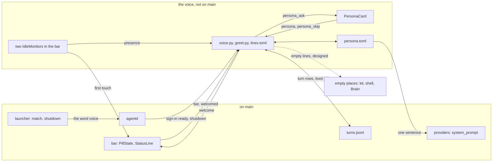

# Bombadil's voice

> **Status:** In progress. Not on `main`: the name and voice card, the welcome line, the goodbye and the greeting words are built on an unmerged branch. The kit's `ask` chip, most empty places and the installer clock fix have no code.
> **Code:** none of this is on `main`. It builds on `src/bombadil/agentd.py`, `src/bombadil/providers.py`, `src/bombadil/launcher.py`, `src/bombadil/narrate.py`, `src/bombadil/watch.py`, `src/bombadil/paths.py`, `src/bombadil/config.py`, `shell/PillState.qml`, `shell/StatusLine.qml`, `shell/shell.qml`, `iso/airootfs/usr/local/bin/bombadil-install`, and `share/qml/Bombadil/EmptyState.qml`, `ItemList.qml` and `DataTable.qml`. The unmerged branch adds `src/bombadil/persona.py`, `src/bombadil/greet.py`, `src/bombadil/greet_sources.py`, `src/bombadil/voice.py`, `shell/PersonaCard.qml` and `share/voice/lines.toml`.
> **Design:** [Bombadil's voice, the brief](../design/voice-brief.md), [the page](../design/pages/bombadils-voice.html)
> **Verified:** 2026-10-01 against `main` at `a30ebc8`: no code of this piece is on `main`, and every statement about `main` below was re-read at that commit, line numbers included. The unmerged work was read file by file at `2ebcfb2`, and its ten voice test files (836 tests, the offscreen QML ones included) passed from a copy of that tree. Nothing was run on a real Hyprland.

The voice is meant to be how Bombadil writes to the person: the words of its greetings, its goodbyes and the closing sentence of a reply. It will give Bombadil a name for the person and one of three voices, Merry, Plain or Quiet, chosen once on a small card after the first sign-in, and put one true line above the pill when the person arrives or leaves, and nothing at rest. It exists because the project owner asked for a one-time setup that gives Bombadil a voice and asks what to call the person, and for a format for what the desktop shows at boot or in an empty place. The [passenger brief](../design/passenger-brief.md) hands the words of the welcome line and of empty states to this piece. Speaking aloud is not part of it.

## What it will do

Nothing here can be used from `main`. Each part says whether the unmerged branch builds it or it is designed only; what the branch does is written as what the piece will do.

- **The card** (built on the branch). When sign-in turns ready with a provider chosen and installed and no `~/.config/bombadil/persona.toml`, a card will rise above the pill on the screen that had the focus: one name field and three voice rows, each with a sample welcome that fills in the typed name and a fixed sample closing sentence. Its line will be "Signed in to Claude. What should I call you?" after a fresh sign-in and "What should I call you?" otherwise. Up, Down and Tab will move the highlight, a click will pick a row, Enter will accept and Esc will skip with the defaults (Merry, no name). The defaults will be written when the card is asked, so it is never asked twice, and a prompt sent from the pill while it is up will run as usual.
- **`persona.toml`** (built on the branch). Three keys, read field by field, so a broken file will fall back to the defaults and never stop agentd. A name will be one to three words of at most 24 characters in all (letters, combining marks, hyphens, apostrophes and dots, starting with a letter). It is its own file because `config.save_user` rewrites all of `config.toml`, and because in the design `memory.md` is loaded by every coding session, where a merry voice would leak into code reviews.
- **The voice reaches the agent** (built on the branch). `providers.system_prompt()` will return the fixed prompt plus a sentence for the chosen voice and a pointer to the file, for both providers. "Call me Lex" and "be less chatty" will be ordinary requests: the agent will edit `persona.toml` with its own tools, narrated as "Changing how I talk to you" with no Undo. A change made through the card will be told to an open conversation through the notes prefix. An agent's edit will add no note, because nothing watches the file, but `system_prompt()` will read the file again each time a command is built. Whether a resumed Claude conversation honours a changed appended prompt is a VM check; the brief records one sandbox in which it did not.
- **The welcome line** (built on the branch). The bar will send `bar` when it connects, and agentd will answer with one `welcome` per login about a second later, once sign-in is ready and nothing is running. The line will show above the pill in a `welcome` mode, on the screen that had the focus, wait for the first key or pointer movement and fade 8 seconds later (15 for the first hello), or fade 30 seconds after it appeared if untouched. Hover will hold it, and typing, Enter or Esc in the pill will end it. On the first boot of an installed system Merry will say "Welcome home{n}. Undo works from here."
  - It will be dropped, not queued, when any other line, a running turn, the card or a full-screen window holds the screen.
  - A greeting will count only when the bar answers `welcomed`, so a restart of agentd never replays one. A dropped boot or return line will be tried again at the next hello or return (a boot line only within 15 minutes of agentd starting), but the first hello after the card will not.
- **The greeting engine and its lines file** (built on the branch). `greet.build` will be a pure function of the persona, the time, the facts, the ledger and the lines table, with no randomness and no clock of its own. It will hold the grammar `OPENER[, NAME]. BODY`, the ranking of facts, the ledger rule and the 100-character budget, and no wording: nearly every word of a greeting, a goodbye and an empty place will live in `share/voice/lines.toml`, per voice and moment, so a voice, an invitation or an empty place is a table edit. The goodbye's session clause, the card's question, the answers to the word `voice` and the model's voice sentences will stay in Python (`voice.py`, `agentd.py`, `persona.py`). Merry's invitations will follow the days since setup, never chance: the owner's own line, "Let's go for a walk!", on day 0 and every fourth day.
- **The facts and the ledger** (built on the branch). A ledger will keep a fact from being said twice unless its value changed (a standing count such as updates is said again after seven days). Facts will come from `turns.jsonl`, an updates file and the coding-session registry, and a missing source will say nothing. The brief also names the jobs registry, promises and the machine's put-back records: the branch ranks the kinds `putback` and `promise`, but nothing produces them, and nothing reads the jobs registry.
- **The goodbye** (built on the branch). agentd will render the goodbye and send it as the start text of the shutdown, because the launcher's done text, "Shutting down.", is returned after `systemctl poweroff` has run and may never be drawn. When the call succeeds the done text will be the goodbye too; a failed shutdown keeps the launcher's failure text. Restart will keep "Restarting." and only record that it was asked for (`note_restart()`, undone by `forget_restart()` if it fails), so the boot after it gets no hello. Both will wait up to a second for what the clients were sent to go out (`flush()`). Unit tests cover this; none shows that the compositor lives long enough to draw the line, an open VM check.
- **The away signal and return lines** (built on the branch). The bar will run two `IdleMonitor` blocks in `shell/shell.qml`. One, with a 300-second timeout (`BOMBADIL_IDLE_SECONDS`), will send `presence`; agentd will read the same variable to work out how long the person was away, so the two must agree. After 30 minutes or more away, at most one line per half hour will say what happened meanwhile. The other, with a one-second timeout and `respectInhibitors: false`, will be enabled only while a welcome waits for its first touch, and is how the bar notices a key press in another window. No test shows that Hyprland delivers idle events to either (`tests/test_welcome_qml.py` only reads `shell.qml` for both blocks; the smoke script does not check idle). The brief's Away card, which would hold the list and shrink the line to an opener and a count, is designed only.
- **The clock** (partly built, partly designed only). On the branch `greet.tz_set()` is true only when `/etc/localtime` links to a zone other than UTC or GMT and the environment has no `TZ`; until then greetings will say "Welcome" with no time-of-day word. Designed only, with no code anywhere: the installer keeps a zone chosen on the live USB, `systemd-timesyncd` is enabled, and the first hello carries a "Set my time zone" chip that fills the pill with "set my time zone to ". The voice brief shows the chip on a machine still on UTC; the [installed OS](installed-os.md) piece shows it only while `timezone_source` in `/var/lib/bombadil/install.json` is `unset` ([D-924](../decisions.md#d-924)).
- **Empty places** (the words are built on the branch and one place, `bombadil history`, uses them; the other places are designed only). The branch's `[empty]` table holds the line of each empty place and `[empty_chip]` its one doorway, read through `greet.empty` and `greet.empty_chip`. Only `bombadil history` calls `greet.empty`, and nothing calls `greet.empty_chip`. Designed only: an `ask` chip on the kit's `EmptyState`, one sentence in the apps skill, the shell's other empty places ("what's running?", "what are you watching?", "what do you know about me?") and the Brain's Focus, Map and Time, with no name and no voice variants.

## How it fits

Solid lines are built on the unmerged branch and the dotted line is designed only. The boxes under "on main" exist at the verified commit.

**What it builds on in `main`**

| Existing piece | What is there, and what the piece will do with it |
|---|---|
| `src/bombadil/agentd.py`: `AgentD._client` (264) | On connect it sends `status`, the entries and the setup state to the connecting client, and `handle` has no message that says "I am the bar", so a bar cannot be told from `bombadil ask`. The piece will add `bar`. |
| `AgentD._set_access` (940) | Sets `access`, broadcasts the setup state and wakes the worker when it is `ready`. A fresh sign-in's ready line is "Signed in to {title}. Ask me for anything." (1041, 1160); other ways to `ready` set another line or none (955, 971, 980, 1046). The piece will ask for the card here, in place of that line, when `persona.toml` is missing. |
| `AgentD._local` (692), `Launcher.doing` (`src/bombadil/launcher.py`, 306), `Launcher._shutdown` (685) | `_local` sends a `local` start event with `doing()` ("Shutting down"), runs the launcher, then sends the done event. `_shutdown` runs `systemctl poweroff` (686) and only then returns "Shutting down." (687); `_restart` (681) returns "Restarting." (683). |
| `AgentD.turn`, the notes (1306 to 1310) | `self.notes` (what happened without the model) go in front of the next prompt as `[Done by the user without you since your last turn: ...]`. The piece will add a note for a name or voice changed through the card (`Voice._note`); nothing adds one for an agent's edit of `persona.toml`. |
| `AgentD._log` (1528), `_log_line` (1541) | A turn row has `t`, `prompt`, `result`, `ok`, `snapshot`, `provider`, `session`, `stopped`, `summary`, `read`, `details`, `n`, `unit`, `started` and `files`: no `made`, no `changed` and no boot row, which the piece will add as the anchor for "since last time". A row whose `kind` is neither empty nor `turn` is no turn (`paths.is_turn_row`, `src/bombadil/paths.py`, 52), so a boot row (kind `local`) stays out of the turn count and the brain. |
| `src/bombadil/providers.py`: `system_prompt` (33), `Claude.command` (224, 232), `Codex.command` (420, 426) | One fixed prompt with no voice, which both CLIs take on fresh and resumed turns (`--append-system-prompt`, `-c developer_instructions`). It already asks for a closing reply of at most four lines, which the piece may not lengthen. |
| `src/bombadil/launcher.py`: `UTILITY_COMMANDS` (65), `match` (191) | Exact words skip the model. There is no `voice` word: `match("voice")` returned `None` when run on 2026-10-01, so the word goes to the model. |
| `src/bombadil/paths.py`; `src/bombadil/config.py`: `save_user` (48) | `paths.py` has no path for a persona, a ledger, a greeted marker or a lines table. `save_user` rewrites `config.toml` with the provider, the model and a kept `explain` level and nothing else, so the name and voice cannot live there. |
| `src/bombadil/narrate.py`: `tool_step` (941) | A Write or an Edit is narrated "Writing x" or "Editing x" with a done text ("Wrote x", "Edited x"), so an edit of `persona.toml` would end as "Edited persona.toml". The piece will give it a plain step with no Undo. |
| `src/bombadil/watch.py`: `history_lines` (245) | Prints the last 40 rows of `turns.jsonl`: a line per turn row and per `local` row (as `prompt: result`) under a weekday heading, skipping any other kind, and "Nothing yet." when there are none. The piece will skip boot rows and take the empty words from the lines table. |
| `shell/PillState.qml`: `mode` (34), `handle` (130), `dismiss` (366), `fade` (373) | `mode` is `idle`, `working`, `closing`, `local` or `setup` (the comment at 31 to 33), and `fadeAfter` is 12000 ms (49). The piece will add a `welcome` mode and handle `persona_ask`, `persona` and `welcome`. |
| `shell/StatusLine.qml` (43 to 59) | One timer fades a finished line, only for `closing` and `local` (54), and sleeps while a picture the person asked for holds the line (`pictureStays`, 49). The piece will add `welcome` to the same timer, where the first touch starts the fade. |
| `shell/shell.qml`: `summon` (126), `summonHere` (235), the input `mask` (206 to 215), `SetupChips` (298) | `summon(text)` with no text toggles the keyboard (with words to finish it always takes it), so it cannot give the card the keyboard; `summonHere()` takes it on Hyprland. Every item that takes clicks has a `Region` in the mask, and `import Quickshell.Wayland` (10) is there. The piece will add the card to the column and mask, as `SetupChips` is. |
| `iso/airootfs/usr/local/bin/bombadil-install` (27, 28, 51, 53, 73 to 77) | `rm -rf /mnt/home/*` (28) clears the copy of the live home that `cp -ax /. /mnt/` (27) made on the target disk, so nothing carries over by itself. The chroot links `/etc/localtime` to UTC (51) and creates `user` with no full name (53). The loop at 73 to 77 copies `.claude`, `.claude.json`, `.codex` and `.config/bombadil` from the untouched live `/home/user` into `/mnt/home/user`, which is how `persona.toml` would survive. No file under `iso/` mentions `timesync`, `ntp` or `chrony`. |
| `share/qml/Bombadil/EmptyState.qml`; `ItemList.qml` (19), `DataTable.qml` (16) | `EmptyState` has `icon`, `title`, `text`, `actionText` and an `action()` signal, and no chip that sends a turn. `ItemList` and `DataTable` default `emptyText` to "Nothing here yet" and "Nothing to show", which the piece keeps as fallbacks. |

## Interfaces it adds (planned)

Every row is on the branch (not on `main`) or planned (no code anywhere).

| Name | What it is | Status |
|---|---|---|
| `~/.config/bombadil/persona.toml` | Keys `name`, `voice` (`merry`, `plain`, `quiet`) and `greet`; `paths.persona_file()` | on the branch |
| `~/.local/state/bombadil/said.json`, `$XDG_RUNTIME_DIR/bombadil/greeted` | The ledger (facts with their value and day, `setup_day`, `last_boot_day`, `last_return_at`) and the marker that this login was greeted; `paths.ledger_file()`, `paths.greeted_marker()` | on the branch |
| `~/.local/state/bombadil/restarting` | Written before a restart the person asked for and removed at the next boot, which then gets no hello. It is in the state dir because the reboot empties the runtime dir; `voice._restart_marker()` | on the branch |
| `share/voice/lines.toml` | Per voice the key `installed` and the sections `first`, `boot`, `night`, `long`, `back`, `away` and `bye`; shared `voices`, `card`, `opener`, `join`, `clause`, `invite`, `fact`, `empty`, `empty_chip` and `reply` | on the branch |
| `bar {idle}`, `presence {idle}`, `persona {name, voice}`, `persona_skip`, `welcomed {id}` | Bar to agentd. The brief names all but `welcomed` | on the branch |
| `persona_ask {line, name, voice, current, voices}`, `persona {name, voice, greet}`, `welcome {id, text, first}` | agentd to bar: put the card up, fold it, show a line. Each entry of `voices` has `id`, `name`, `card` and `reply`; `current` is true for a reopen with the saved values | on the branch |
| The word `voice` | A local, offline launcher word (`UTILITY_COMMANDS`; also `open voice`, and offered by Tab) that reopens the card with the saved name and voice, under the line "What should I call you, and how should I sound?". An app or panel of that name wins over it | on the branch |
| `made` and `changed` on a `turns.jsonl` row, and a boot row | The apps a turn made, and whether it left a summary. A boot row is written when a boot moment (`boot`, `installed` or `first`) is committed: `greeted` is true once the bar answered `welcomed`, false for a silent boot. The brief names it `{kind: "boot"}`; the branch writes `kind: "local"`, `action: "boot"` | on the branch |
| `narrate.PERSONA_STEP` | "Changing how I talk to you": a plain step with no Undo and no summary entry, for a Write, an Edit, a Codex file change or a shell command that writes only `persona.toml` | on the branch |
| `persona.note()`, `greet.build`, `greet.goodbye`, `greet.empty`, `greet.empty_chip`, `greet.tz_set`; `PersonaCard.qml`, the `welcome` line mode, two `IdleMonitor` blocks | The text added to the system prompt (a sentence of 13 to 39 words for the voice, the name clause included, and a pointer of 103 words) and the pure functions of the engine; the card, the line mode in `PillState` and `StatusLine`, and the presence and touch monitors in `shell.qml` | on the branch |
| `BOMBADIL_VOICE_LINES`, `BOMBADIL_GREET_WINDOW`, `BOMBADIL_GREET_DELAY`, `BOMBADIL_IDLE_SECONDS`, `BOMBADIL_UPDATES`, `BOMBADIL_LOCALTIME`, `BOMBADIL_LIVE` | Environment variables the branch reads; its tests set them | on the branch |
| `/var/lib/bombadil/updates.json` | `{count, security}`, read by the branch. Nothing on `main` writes it: the producer is the passenger brief's update piece | planned |
| `~/.local/state/bombadil/dev/sessions.json` | The coding-session registry, read by the branch when it exists; the [coding sessions](coding-sessions.md) piece writes it, on its own unmerged branch. "At 14 of 20" reads a `progress {done, total}` key that only that piece's planned `progress` tool would write, so without it the line says "stops" with no count | not on `main` |
| A "Set my time zone" chip, `systemd-timesyncd` enabled, an installer that keeps the chosen zone | The clock fix; the [installed OS](installed-os.md) piece owns the installer change | planned |
| `EmptyState.ask`; one sentence in `share/skills/bombadil-apps/SKILL.md` | A chip whose click sends its label as a turn (a label ending in an ellipsis only fills the pill); the rule that an empty state names what is empty and gives one way to fill it | planned |

## Principles it keeps

- [Quiet at rest](../principles.md#quiet-at-rest): the line will be an arrival or a departure that fades by itself, and a screen at rest must stay wallpaper and a pill. The trap is a nudge, an hourly check-in, a standing welcome, or a greeting that takes over the placeholder.
- [Records before models](../principles.md#records-before-models): every line will be built from the clock, the turn log and the registries, say each fact once, and be silence when nothing is true. The trap is a model-written hello, or a reassurance no receipt backs ("nothing else changed").
- [Degrade and recover](../principles.md#degrade-and-recover): lines will be local templates that work offline at boot, each source will be optional, and a broken `persona.toml` will fall back to defaults. The trap is a reader that raises, or a missing lines table, stopping agentd, a turn or a shutdown.
- [One design language](../principles.md#one-design-language): the voice will change words and never facts, so "On it", the working line, Undo, Details, errors, limits and put-back lines read the same in every voice, and empty places have no voice variants. The trap is a cheerful aside after an error, or a voice that lengthens the one line while working and four after.
- [Plain files stay the truth](../principles.md#plain-files-stay-the-truth): name and voice will live in one small plain file that the agent edits and agentd validates on load. The trap is a second copy of the name in `config.toml` or `memory.md`, or a tool that sets the voice, which the brief cut.
- [Original](../principles.md#original): Merry in spirit only: no rhymes, no verse, no song lines. The trap is the brief's own list: the same line every morning, a name in every sentence, a joke beside a failure.

## Before you build on it

- **Order (the brief).** Piece 1, "Bombadil says hello": the card, `persona.toml`, the sentence, the welcome line, the word `voice` and the `narrate` step. Piece 2, "What it knows, and every empty place": sources, the ledger, the away signal, the goodbye, empty places and the clock, return lines last. Both edit `shell/PillState.qml` and `shell/shell.qml`, so they follow native sign-in (on `main`) and rebase over the [coding sessions](coding-sessions.md) placeholder change (not on `main`).
- **Checks first.** The brief's five VM checks, all open: whether a resumed conversation honours a changed appended prompt (if not, the voice goes through the `notes` prefix), whether the card takes the keyboard when the browser panel leaves, whether `IdleMonitor` reports idle under Hyprland (both monitors), how long the compositor survives `systemctl poweroff`, and whether the pill's clock follows `timedatectl`.
- **Waits on the owner.** The brief's three picks (how the setup looks, where the welcome shows, how far the voice reaches) are defaults for the owner to look at, and it records no ruling on them; the branch builds the recommended default of each. Still open in the brief: whether the explain level belongs in `persona.toml`, whether the word `voice` will sit badly beside push-to-talk, and which screen shows the greeting on several monitors (the branch picks the screen that had the focus; [D-516](../decisions.md#d-516)). The brief also lists "who sets the time zone on a live USB with no network" as open; the installed-OS brief answers it as a default, designed only: the zone is detected and never asked, from one geo-IP request when the network first comes up ([D-1220](../decisions.md#d-1220)). Which service answers ([D-1241](../decisions.md#d-1241)) and what the clock does when the person travels ([D-1243](../decisions.md#d-1243)) are open.
- **Where the branch differs from the brief.** The boot row (above). The step reads "Changing how I talk to you", not "Changed how I talk to you". The card takes the keyboard through its own `summonKeep()` in `shell.qml`, not `summonHere()`. A name must start with a letter, which is stricter than the brief's bar on `!` and `/`. The appended text is the voice sentence plus the pointer, where the brief counts one sentence.
- **Expect conflicts in five files.** A read-only trial merge (`git merge-tree`) of the branch at `2ebcfb2` into `main` at `a30ebc8` conflicts in `docs/README.md`, `shell/PillState.qml`, `shell/shell.qml`, `src/bombadil/agentd.py` (three hunks) and `tests/desktop/driver.py`. Every other file merges without a conflict, including `src/bombadil/watch.py`, where the two versions of `history_lines` combine. Two clean merges still need a look: the welcome fade in `shell/StatusLine.qml` runs in the timer that `main` puts to sleep while a picture holds the line, and `main`'s `summon(text)` needs the card's keyboard rule.
- **Before the branch merges.** Its tests, its smoke script and one comment in `shell/PersonaCard.qml` use a real person's first name as sample data. Replace it with a neutral name such as `alex`.
- **Do not break.** The fixed text of `providers.system_prompt()`, which the voice only appends to. "Ask anything" as the resting placeholder, and the plain wording of the working line, receipts, errors, limits, sign-out, offline and put-back lines in every voice. The installer's copy of `.config/bombadil`, without which `persona.toml` is lost at install. A restart's plain "Restarting.", because a restart is how a pending undo is applied ([restore points](restore-points.md)). `paths.is_turn_row`, which the boot row relies on.

## When it ships

This page is then replaced by the full piece page in the skeleton of [documenting your piece](../contributing/documenting.md), and the notes page the unmerged branch carries is folded into it rather than kept beside it. The [roadmap](../roadmap.md) row is updated and the brief's status block is updated. The parts the brief still marks as designed stay listed as such until their code is on `main`.
