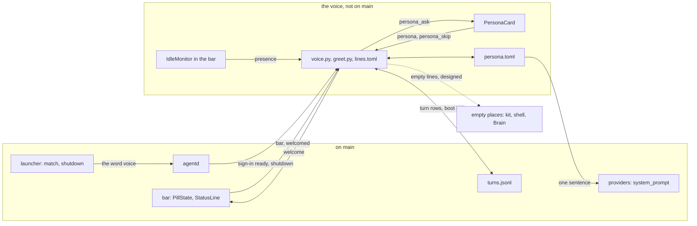

# Bombadil's voice

> **Status:** In progress
> **Code:** none of this is on `main`. It builds on `src/bombadil/agentd.py`, `src/bombadil/providers.py`, `src/bombadil/launcher.py`, `src/bombadil/narrate.py`, `src/bombadil/watch.py`, `src/bombadil/paths.py`, `shell/PillState.qml`, `shell/StatusLine.qml`, `shell/shell.qml`, `iso/airootfs/usr/local/bin/bombadil-install` and `share/qml/Bombadil/EmptyState.qml`. Planned new files (an unmerged branch has them, `main` does not): `src/bombadil/persona.py`, `src/bombadil/greet.py`, `src/bombadil/greet_sources.py`, `src/bombadil/voice.py`, `shell/PersonaCard.qml` and `share/voice/lines.toml`.
> **Design:** [Bombadil's voice, the brief](../design/voice-brief.md), [the page](../design/pages/bombadils-voice.html)
> **Verified:** 2026-10-01 against `main` at `6150431`: no code of this piece is on `main`, and every row of the table under "How it fits" was checked against that code. The unmerged work was read file by file (its Python and QML sources, `share/voice/lines.toml`, the diff of every file it changes and its own notes page). Its tests were not run here.

Bombadil's voice is how Bombadil writes to the person: the words of its greetings, its goodbyes and the closing sentence of a reply. It is meant to give Bombadil a name for the person and one of three voices, chosen once on a small card after the first sign-in, and to put one true line above the pill when the person arrives or leaves and nothing at rest. It exists because the project owner asked for a one-time setup that gives Bombadil a voice and asks what to call the person, and for a format for what the desktop shows at boot or in an empty place. The [passenger brief](../design/passenger-brief.md) hands the words of the welcome line and of empty states to this piece. Speaking aloud is not part of it.

## What it will do

Nothing here can be used from `main`. Each part says whether it is built on an unmerged branch or designed only.

- **The card and `persona.toml`** (built on an unmerged branch). At the first sign-in that turns ready with no `~/.config/bombadil/persona.toml`, a card will rise above the pill under the line "Signed in to Claude. What should I call you?" It will hold one name field and three voice rows, Merry, Plain and Quiet, each showing its welcome and a sample closing sentence with the typed name filled in as it is typed. Up, Down and Tab will move the highlight, a click will pick a row, Enter will accept and Esc will skip with the defaults (Merry, no name). The defaults will be written when the card is asked, so it is never asked twice, and a prompt sent from the pill while it is up will run as usual. The file will have three keys, `name`, `voice` and `greet`, and be read field by field, so a broken file falls back to defaults and cannot stop agentd. A name will be one to three words of at most 24 characters in all: letters, combining marks, hyphens, apostrophes and dots, starting with a letter. It is its own file because `config.save_user` rewrites all of `config.toml`, and because in the design `memory.md` (not on `main`) is loaded by every coding session, where a merry voice would leak into code reviews.
- **The voice reaches the agent** (built on an unmerged branch). `providers.system_prompt()` will return the fixed prompt plus one sentence for the chosen voice and a pointer to the file, so both providers get it. "Call me Lex" and "be less chatty" will be ordinary requests: the agent will edit `persona.toml` with its own tools, the edit will be narrated as "Changing how I talk to you" with no Undo, and a conversation that is already open will be told through the notes agentd already sends. The brief records one sandbox in which a resumed Claude conversation kept its old appended prompt. That is a check for a VM and is not settled.
- **The welcome line** (built on an unmerged branch). The bar will send `bar` when it connects, and agentd will answer with one `welcome` per login, about a second later, once sign-in is ready. The line will show above the pill in a `welcome` mode: it will wait for the first key or pointer movement, fade eight seconds later (15 for the first hello), stay no longer than 30 seconds after it appeared, and be held by hover. It will be dropped, not queued, when any other line, a running turn, the card or a full-screen window holds the screen. A greeting will count only when the bar answers `welcomed`, so a dropped line is tried again and restarting agentd never replays one.
- **The greeting engine and its lines file** (built on an unmerged branch). `greet.build` will be a pure function of the persona, the time, the facts, the ledger and the lines table, with no randomness and no clock of its own. It will hold the grammar `OPENER[, NAME]. BODY`, the ranking of facts, the ledger rule and the 100-character budget, and no wording. Every word will live in `share/voice/lines.toml`, per voice and moment, so a voice, an invitation or an empty place is a table edit. Merry's invitations will be chosen by the days since setup and never at random: the owner's own line, "Let's go for a walk!", on day 0 and every fourth day. A ledger in `~/.local/state/bombadil/said.json` will keep a fact from being said twice unless its value changed (a standing count such as updates is said again after seven days). Facts will come from `turns.jsonl`, an updates file and the coding-session registry, and a source whose file is missing says nothing. The brief also names the jobs registry, promises and the machine's put-back records: the branch ranks those kinds but has no reader for them.
- **The goodbye** (built on an unmerged branch). agentd will render the goodbye and send it as the start text of the shutdown, because the launcher's done text, "Shutting down.", is returned after `systemctl poweroff` has run and may never be drawn. Restart will keep "Restarting.", and the boot after a restart the person asked for will get no hello. Whether the compositor lives long enough to draw the goodbye is a VM check the brief lists as open, and no test on the branch covers it.
- **The away signal and return lines** (built on an unmerged branch). The bar's `IdleMonitor` (300 seconds, or `BOMBADIL_IDLE_SECONDS`) will send `presence`. After 30 minutes or more away, at most one line per half hour will say what happened meanwhile, or nothing. Whether Hyprland delivers idle events to the monitor is not shown by any test: the smoke script the branch extends checks the card and the word `voice`, not idle, and the brief lists it as a VM check. The brief's Away card, which would hold the list and shrink the line to an opener and a count, is designed only.
- **The clock** (partly built, partly designed only). On the branch `greet.tz_set()` reads `/etc/localtime`, and until a zone other than UTC is set the greetings will say "Welcome" with no time-of-day word. Designed only, with no code anywhere: the installer keeps a zone chosen on the live USB, `systemd-timesyncd` is enabled, and on a machine still on UTC the first hello carries a "Set my time zone" chip that fills the pill with "set my time zone to ".
- **Empty places** (the words are built on the branch, the places are designed only). The branch's `[empty]` table holds the line of each empty place and `[empty_chip]` its one doorway, read through `greet.empty` and `greet.empty_chip`, but only `bombadil history` calls `greet.empty` and nothing calls `greet.empty_chip`. Designed only: an `ask` chip on the kit's `EmptyState`, one sentence in the apps skill, the shell's other empty places ("what's running?", "what are you watching?", "what do you know about me?") and the Brain's Focus, Map and Time. They will carry no name and no voice variants.

## How it fits

Solid lines are built on the unmerged branch and the dotted line is designed only. The boxes under "on main" exist today.

**What it builds on in `main`**

| Existing piece | What is there, and what the piece does with it |
|---|---|
| `src/bombadil/agentd.py`: `AgentD._client` (line 242) | On connect it sends `status`, the entries and the setup state to every client, and `handle` has no message that says "I am the bar", so a bar cannot be told from `bombadil ask`. The piece has the bar send one `bar` message and answers it with `welcome`. |
| `AgentD._set_access` (913) | Sets `access`, broadcasts the setup state and wakes the worker when it is `ready`. The first sign-in's line is "Signed in to {title}. Ask me for anything." (lines 1014 and 1133). The piece asks for the card here when `persona.toml` is missing, in place of that line. |
| `AgentD._local` (669), `Launcher.doing` (`src/bombadil/launcher.py`, 290), `Launcher._shutdown` (628) | `_local` sends a `local` start event with `doing()` ("Shutting down"), runs the launcher, then sends the done event. `_shutdown` returns "Shutting down." after `systemctl poweroff` has run (line 630) and `_restart` returns "Restarting." (626). The piece sends a goodbye as the shutdown's start text and leaves restart alone. |
| `AgentD.turn`, the notes (lines 1272 to 1276) | What happened without the model (`self.notes`) is put in front of the next prompt as `[Done by the user without you since your last turn: ...]`. The piece tells an open conversation of a changed name or voice the same way. |
| `AgentD._log` (1484) and `_log_line` (1493) | A turn row has `t`, `prompt`, `result`, `ok`, `snapshot`, `provider`, `session`, `stopped`, `summary`, `read` and `details`. It has no `made`, no `changed` and no boot row. The piece adds them so "since last time" has an anchor. |
| `src/bombadil/providers.py`: `system_prompt` (33), `Claude.command` (227), `Codex.command` (411) | One fixed prompt with no voice, which both CLIs take on fresh and resumed turns (`--append-system-prompt`, `-c developer_instructions`). It already asks for a closing reply of at most four lines, one or two plain sentences. The piece appends one sentence and may not lengthen that. |
| `src/bombadil/launcher.py`: `UTILITY_COMMANDS` (54), `match` (178) | Exact words skip the model. There is no `voice` word: `match("voice")` returned `None` when run on 2026-10-01, so the word goes to the model. The piece adds it. |
| `src/bombadil/paths.py`: `config_dir`, `state_dir`, `runtime_dir`, `turns_log` | Has no path for a persona, a ledger, a greeted marker or a lines table. The piece adds them. |
| `src/bombadil/config.py`: `save_user` (48) | Rewrites `config.toml` with the provider, the model and a kept `explain` level and nothing else, so the name and voice cannot live there. |
| `src/bombadil/narrate.py`: `tool_step` (941) | A Write or an Edit is narrated "Writing x" or "Editing x" with a done text ("Wrote x", "Edited x"), so an edit of `persona.toml` would end as "Edited persona.toml". The piece gives that edit a plain step with no Undo. |
| `src/bombadil/watch.py`: `history_lines` (245) | Prints one line for every row of `turns.jsonl` (a `local` row as `prompt: result`) and "Nothing yet." when there are none. The piece skips boot rows and takes the words of the empty case from the lines table. |
| `shell/PillState.qml`: `mode` (33), `handle` (125), `dismiss` (357), `fade` (364) | The line's `mode` is `idle`, `working`, `closing`, `local` or `setup` (the comment at lines 30 to 33), and `fadeAfter` is 12000 ms by default (48). The piece adds a `welcome` mode and handles `persona_ask` and `welcome`. |
| `shell/StatusLine.qml` (lines 43 to 54) | One timer fades a finished line, and only for `closing` and `local` (line 50). The piece adds the rule for `welcome`, where the first touch starts the fade. |
| `shell/shell.qml`: `summon` (125), `summonHere` (217), the input `mask` (199 to 208), `SetupChips` (278) | `summon()` toggles the keyboard, so it cannot give the card the keyboard. `summonHere()` takes it on Hyprland. Every item that takes clicks has a `Region` in the mask, and `import Quickshell.Wayland` (line 10) is already there. The piece adds the card to the column and mask, as `SetupChips` is, and an idle monitor. |
| `iso/airootfs/usr/local/bin/bombadil-install` (lines 28, 51, 53, 73) | `rm -rf /mnt/home/*` clears the live home (28), the chroot links `/etc/localtime` to UTC (51) and creates `user` with no full name (53), and `.config/bombadil` is copied back from the live home (73), which is how `persona.toml` would survive the install. No file under `iso/` mentions `timesync`, `ntp` or `chrony`. The design changes the zone link and enables time sync. |
| `share/qml/Bombadil/EmptyState.qml`; `ItemList.qml` (19), `DataTable.qml` (16) | `EmptyState` has `icon`, `title`, `text`, `actionText` and an `action()` signal, and no chip that sends a turn. `ItemList` and `DataTable` default `emptyText` to "Nothing here yet" and "Nothing to show". The piece adds the `ask` chip and keeps those as fallbacks. |

## Interfaces it adds (planned)

| Name | What it is | Status |
|---|---|---|
| `~/.config/bombadil/persona.toml` | Keys `name`, `voice` (`merry`, `plain`, `quiet`) and `greet`; `paths.persona_file()` | on the branch |
| `~/.local/state/bombadil/said.json` | The ledger: each fact's value and day, `setup_day`, `last_boot_day`, `last_return_at`; `paths.ledger_file()` | on the branch |
| `$XDG_RUNTIME_DIR/bombadil/greeted` | Marker that this login was greeted; `paths.greeted_marker()` | on the branch |
| `share/voice/lines.toml` | Every word. Per voice the sections `first`, `boot`, `night`, `long`, `back`, `away` and `bye`; shared `voices`, `card`, `opener`, `join`, `clause`, `invite`, `fact`, `empty`, `empty_chip` and `reply` | on the branch |
| `bar {idle}`, `presence {idle}`, `persona {name, voice}`, `persona_skip`, `welcomed {id}` | Bar to agentd. The brief names `bar`, `presence`, `persona` and `persona_skip`; `welcomed` is only on the branch | on the branch |
| `persona_ask {line, name, voice, current, voices}`, `persona {name, voice, greet}`, `welcome {id, text, first}` | agentd to bar: put the card up, fold it, show a line | on the branch |
| The word `voice` | A local, offline launcher word (`UTILITY_COMMANDS`) that reopens the card with the saved name and voice | on the branch |
| `made` and `changed` on a `turns.jsonl` row, and a boot row | The apps a turn made and whether it changed anything; one row per shown boot greeting. The brief names it `{kind: "boot"}`, the branch writes `kind: "local"`, `action: "boot"` and `greeted` | on the branch |
| `narrate.PERSONA_STEP` | "Changing how I talk to you", a step with no Undo and no summary entry | on the branch |
| `persona.note()`, `greet.build`, `greet.goodbye`, `greet.empty`, `greet.empty_chip`, `greet.tz_set` | The sentence added to the system prompt and the pure functions of the engine | on the branch |
| `PersonaCard.qml`, the `welcome` line mode, `IdleMonitor` | The card, the greeting's line mode in `PillState` and `StatusLine`, and the idle signal in `shell.qml` | on the branch |
| `BOMBADIL_VOICE_LINES`, `BOMBADIL_GREET_WINDOW`, `BOMBADIL_GREET_DELAY`, `BOMBADIL_IDLE_SECONDS`, `BOMBADIL_UPDATES`, `BOMBADIL_LOCALTIME`, `BOMBADIL_LIVE` | Environment variables the branch reads, used by its tests | on the branch |
| `/var/lib/bombadil/updates.json` | `{count, security}`, read by the branch. Nothing on `main` writes it: the producer is the passenger brief's update piece | planned |
| `~/.local/state/bombadil/dev/sessions.json` | The coding-session registry, read by the branch when it exists | planned (the registry) |
| A "Set my time zone" chip, `systemd-timesyncd` enabled, an installer that keeps the chosen zone | The clock fix | planned |
| `EmptyState.ask` | A chip: a click sends its label as a turn, and a label ending in an ellipsis only fills the pill | planned |
| One sentence in `share/skills/bombadil-apps/SKILL.md` | An empty state names what is empty and gives exactly one way to fill it | planned |
| Readers for jobs, promises and put-back records; the Away card sharing the line | More facts for the line | planned |

## Principles it keeps

- [Quiet at rest, and every movement means one thing](../principles.md#quiet-at-rest): the line will be an arrival or a departure that fades by itself, and a screen at rest must stay wallpaper and a pill. The trap is a nudge, an hourly check-in, a standing welcome, or a greeting that takes over the placeholder.
- [Records answer before models, and the machine explains itself](../principles.md#records-before-models): every line will be built from the clock, the turn log and the registries, say each fact once, and be silence when nothing is true. The trap is a model-written hello, or a reassurance no receipt backs ("nothing else changed").
- [Every piece degrades, and nothing waits on a model it does not need](../principles.md#degrade-and-recover): lines will be local templates that work offline at boot, each source will be optional, and a broken `persona.toml` will fall back to defaults. The trap is a reader that raises, or a missing lines table, stopping agentd, a turn or a shutdown.
- [One design language and one plain voice](../principles.md#one-design-language): the voice will change words and never facts, so "On it", the working line, Undo, Details, errors, limits and put-back lines read the same in every voice, and empty places have no voice variants. The trap is a cheerful aside after an error, or a voice that lengthens the one line while working and four after.
- [Plain files stay the truth](../principles.md#plain-files-stay-the-truth): name and voice will live in one small plain file that the agent edits and agentd validates on load. The trap is a second copy of the name in `config.toml` or `memory.md`, or a tool that sets the voice, which the brief cut.
- [Original: no borrowed imagery, no mascot, no face](../principles.md#original): Merry is brisk in spirit only. The trap is the brief's own list: the same line every morning, a name in every sentence, a joke beside a failure.

## Before you build on it

- **Order (the brief).** Piece 1, "Bombadil says hello" (S to M, about two days with tests): the card, `persona.toml`, the sentence, the welcome line, the word `voice` and the `narrate` step. Piece 2, "What it knows, and every empty place" (M): sources, the ledger, the away signal, the goodbye, empty places and the clock, with the return lines last. Both edit `shell/PillState.qml` and `shell/shell.qml`, so they follow native sign-in (on `main`) and rebase over the [coding sessions](coding-sessions.md) placeholder change (not on `main`).
- **Checks first.** The brief lists five VM checks: whether a resumed conversation honours a changed appended prompt (if not, the voice goes through the `notes` prefix), whether the card takes the keyboard when the browser panel leaves, whether `IdleMonitor` reports idle under Hyprland, how long the compositor survives `systemctl poweroff`, and whether the pill's clock follows `timedatectl`.
- **Waits on the owner.** The brief's three picks (how the setup looks, where the welcome shows, how far the voice reaches) have no recorded answer, and the branch builds the recommended default of each. Still open in the brief: who sets the time zone on a live USB with no network, whether the explain level belongs in `persona.toml`, whether the word `voice` will sit badly beside push-to-talk, and which screen shows the greeting on several monitors.
- **Expect a small merge.** A read-only trial merge of the branch into `main` at `6150431` merged every source file and conflicted only in `tests/desktop/driver.py` and `docs/README.md`.
- **Do not break.** The fixed text of `providers.system_prompt()`, which the voice only appends to. "Ask anything" as the resting placeholder, and the plain wording of the working line, receipts, errors, limits, sign-out, offline and put-back lines in every voice. The installer's copy of `.config/bombadil`, without which `persona.toml` is lost at install and the card runs again. A restart's plain "Restarting.", because a restart is how a pending undo is applied ([restore points](restore-points.md)).

## When it ships

This page is then replaced by the full piece page in the skeleton of [documenting your piece](../contributing/documenting.md), and the notes page the unmerged branch carries is folded into it rather than kept beside it. The [roadmap](../roadmap.md) row is updated and the brief's status block is updated. The parts the brief still marks as designed stay listed as such until their code is on `main`.
