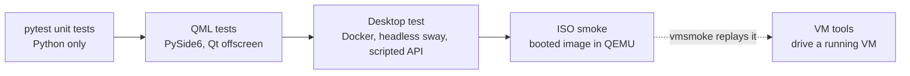
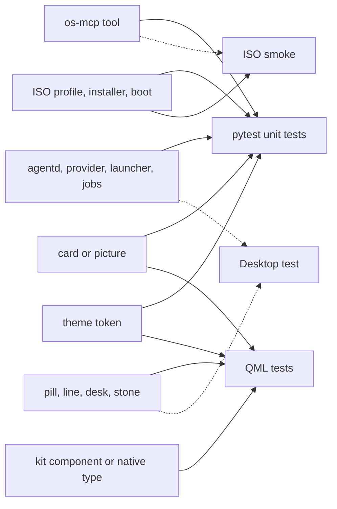

# Developing and testing Bombadil

> **Status:** Shipped
> **Code:** `pyproject.toml`, `tests/`, `scripts/dev-session.sh`, `scripts/test-vm.sh`, `scripts/vm-tools/`, `iso/airootfs/usr/local/bin/bombadil-smoke`, `src/bombadil/providers.py`
> **Design:** none for the test layers. Planned `scripts/test-vm.sh` modes (`install-encrypted`, `refresh`) are designed, not built, in [the installed-OS brief](../design/installed-os-brief.md); running the VM smoke test from a coding session is in [the developer brief](../design/dev-brief.md)
> **Verified:** 2026-10-01 against `main` at `6150431`

This page is for someone who has cloned the repository and wants to run Bombadil from the checkout,
change it, and prove the change. It covers setting up, the five layers of testing from a
millisecond file check to a booted image, a development session against a checkout with the fake
provider, a map of the repository, the conventions the code and configuration show, and where the
test for each kind of change goes. How to write the documentation for a change is in
[documenting.md](documenting.md). How each piece works is in [ARCHITECTURE.md](../ARCHITECTURE.md)
and the pages it links.

On 2026-10-01 the Python and QML layers were run in a plain Linux container (Ubuntu 24.04 userland,
Python 3.11.15, 4 CPUs, no display, no systemd, no Docker daemon, no `/dev/kvm`, no QEMU). The
desktop test, the ISO smoke and the VM tools need Docker or QEMU, so they were read and
syntax-checked (`bash -n`, `py_compile`) but not run there. The page says which is which.

## Set up

Python 3.11 or newer is required (`requires-python`, and the code uses `tomllib`). The package has no
runtime dependencies: `dependencies = []`. Use a virtual environment kept outside the checkout
(`.gitignore` lists `__pycache__/`, `*.egg-info/` and `out/`, not `.venv`).

```sh
python3 -m pip install -e '.[dev,apps]'
python3 -m pip install cryptography                # the Vault tests
python3 -m pip install pillow numpy cairosvg       # the two wallpaper tests that draw the picture again
pytest
```

| Extra | Packages | What needs it |
|---|---|---|
| none | `dependencies = []` | `agentd`, `bombadil`, `bombadil-os-mcp`, the launcher, the card and picture code: standard library only |
| `dev` | `pytest`, `pytest-asyncio`, `ruff` | the tests and the linter |
| `apps` | `PySide6` | the app kit and its runtime (`bombadil-app`), the ten test files that load QML, and five pixel tests in `tests/test_wallpaper.py` |
| not declared | `cryptography` | `Vault` (`src/bombadil/appkit/native/vault.py`); 27 tests fail without it (see below) |
| not declared | `pillow`, `numpy`, `cairosvg` | `scripts/make-wallpaper.py`, and the two tests in `tests/test_wallpaper.py` that draw the picture again; they skip without them |

In `src/`, third-party imports exist only under `src/bombadil/appkit/` and in `share/app-template/app.py`:
`PySide6`, `shiboken6` (installed with PySide6) and `cryptography`. `scripts/make-wallpaper.py` is the
one script that imports packages of its own (`pillow`, `numpy`, `cairosvg`). The ISO installs
`pyside6` and `python-cryptography` as packages (`iso/packages.x86_64`). The editable install adds
`src/` to the import path through a `.pth` file; it is optional, because `pythonpath = ["src"]` in the
pytest configuration and a `sys.path.insert` at the top of every Python entry point in `bin/` do the
same for the tests and the commands.

Other layers need more than Python:

| Layer | Needs |
|---|---|
| dev session | a Hyprland desktop with `quickshell` (panels, drawers and app placement need Hyprland; the bar alone also ran under sway in the desktop test); `pyside6` only if you create apps |
| desktop test | Docker, and a self-contained `claude` binary (`CLAUDE_BIN`) |
| ISO build | an Arch host with `archiso` and `npm`, or Docker or Podman (`scripts/build-in-container.sh`) |
| ISO smoke | `qemu-system-x86_64`, OVMF firmware (`edk2-ovmf` or `ovmf`), a built ISO, and `qemu-img` for the install mode; KVM is optional |
| VM tools | a VM started by `scripts/run-vm.sh`, and Python 3 on the host |

## Run the tests

```sh
pytest                          # everything; the QML files skip without PySide6
pytest -q -x -k pill            # a few, stop at the first failure
pytest tests/test_agentd.py     # one file
BOMBADIL_SCREENS=/tmp/shots pytest tests/test_stone_qml.py    # also save pictures of each state
ruff check src tests bin scripts share iso
```

The configuration defines no markers. Selection is by file or `-k`. Async tests carry
`@pytest.mark.asyncio` (strict mode: `asyncio_mode` is not set), and all 132 do.

Run `pytest` in the foreground, or with SIGINT reset to its default. A parent that ignores SIGINT (a
background job started with `&` in a script, some job runners and CI) hands that on, and Python keeps
it ignored. Stop's SIGINT then does nothing to the child that
`tests/test_agentd.py::test_a_stopped_turn_sends_no_more_plan` starts, so that one test fails. The cause is
the environment only.

Results on 2026-10-01 (pytest 9.1.1, pytest-asyncio 1.4.0, PySide6 6.11.2):

| Install | Result | Time |
|---|---|---|
| `.[dev]` | 1146 passed, 47 skipped, 1 warning | 170 s |
| `.[dev,apps]` | 27 failed, 1504 passed, 2 skipped, 1 warning | 427 s |
| `.[dev,apps]` and `cryptography` | 1531 passed, 2 skipped, 1 warning | 441 s |

The 47 skips with `.[dev]` are 45 that say `could not import 'PySide6'` and two that say
`could not import 'PIL'`. The PySide6 ones are eight whole modules (`test_appkit_agent`,
`test_appkit_kit`, `test_appkit_native`, `test_desk_cards_qml`, `test_desk_qml`, `test_diagram_qml`,
`test_pill_qml`, `test_stone_qml`), 18 tests in `test_appkit_reload.py` and 14 in `test_appkit_runtime.py`
(40 in all), and five tests in `tests/test_wallpaper.py` that need `PySide6.QtGui`. The two `PIL` skips are
the tests in that file that draw the picture again, and they stay skipped with `.[dev,apps]`, because no
extra installs `pillow`, `numpy` and `cairosvg`. The suite collects 1533 tests in 36 files. The slowest
single tests are the 5 to 10 second waits in `tests/test_launcher.py`.

| Failure | Count | Cause | Environment-only? |
|---|---|---|---|
| `test_vault_*` and `test_lists_from_native_types_are_real_arrays` in `tests/test_appkit_native.py` | 27 | `cryptography` is not installed, so `Vault.create` returns false | Yes. With the package installed that file passes (70 of 70), and no extra declares it |

With `cryptography` installed and SIGINT at its default, nothing failed in the runs on 2026-10-01. The
table is not a complete list of what can fail: `tests/test_appkit_native.py::test_agent_talks_to_agentd`
can (see Known gaps).

The warning is a stray thread exception in a test stand-in, and a second one appears sometimes. One
appears in every run: a `BrokenPipeError` in the `serve` function of the `_agentd` stand-in
(`tests/test_mcp_server.py`, line 145). It writes its greeting after the client has hung up, and pytest
reports it against `test_without_a_turn_the_job_tool_says_so_and_asks_nobody`. The other appears
sometimes: a `PytestUnhandledThreadExceptionWarning` from the `_browse` thread of the `FakePanel` stand-in
(`tests/test_signin.py`, line 62, an `http.client.IncompleteRead` that the `except OSError` does not
catch), reported against `tests/test_agentd_signin.py::test_hidden_panel_and_show`. No test fails because
the container has no Hyprland, no systemd or no snapper: the tests fake each of them (see Conventions).

`ruff check` has one setting, `line-length = 110`, and otherwise uses ruff's default rules. With ruff
0.15.20 it reports 27 findings on `src tests bin scripts share iso`, none under `src/`, `share/` or `iso/`:
22 in `scripts/vm-tools/` (`agentprobe.py` and `scratch_api.py`: 13 `E701` and 9 `E702`, several
statements on one line) and five in `tests/` (three lambda assignments, two unused imports). The command
does not cover Python scripts without a `.py` extension, because ruff scans a folder for `*.py` only: the
five entry points in `bin/` and the six VM tools `serialpump`, `vmsh`, `vmpy`, `vmin`, `vmlink` and
`vmlogin`. Named on the command line, the five in `bin/` are clean and the six VM tools report 43.
A newer ruff (0.16.9) applies more default rules and reports 152 on the same command.
`ruff format --check` on the same folders would reformat 79 of the 88 Python files, so the formatter is not
applied.

## How it works

Five layers; the first four each add a real part that the one before fakes. The solid arrows run
from the cheapest layer to the booted image. The dashed arrow shows that `vmsmoke` replays the smoke
test in a VM you keep running.



| Layer | Real | Faked | Proves | Run it |
|---|---|---|---|---|
| pytest unit tests | the Python code, sockets in a temp folder, plain files | Hyprland, snapper, systemd, the provider CLIs (`providers.Fake`, a `Scripted` adapter), `bombadil-app check` | the socket protocol and turn lifecycle, provider stream parsing from recorded output, tool results, plain-word narration, the launcher, jobs, the desk model, card checking, picture parsers; and static guards over files (tokens, colours, brand files, the ISO profile) | `pytest` |
| QML tests | the QML files, Qt Quick, the kit's native types, pixels | agentd in the shell tests, which send the events it would (the `Agent` type's tests run a real `AgentD` with the fake provider on a Unix socket); the compositor | a component loads with no warnings, binds to the events, draws the right face, reacts to clicks and keys | `pytest` with `.[apps]` |
| desktop test | Quickshell, agentd, the real Claude Code CLI, `bombadil` commands, a Wayland compositor (sway) | the model (a scripted Anthropic API), Hyprland, systemd, snapper | the pieces work together: timings, a key press to the screen, Stop ends everything a turn started, pictures streamed into the bar | `tests/desktop/run.sh` |
| ISO smoke | the built image, Hyprland, greetd, systemd, the installer, snapper on btrfs | the model; sign-in uses a stand-in login, plus the real Codex and Claude pages when the VM has internet | a booted machine does what the product promises: session, bar, panels, apps, pictures, the pill keys, sign-in, install, undo over a reboot | `scripts/test-vm.sh` |
| VM tools | a running VM you keep | nothing | a shell, keys, clicks and screenshots on a VM without a window; `vmsmoke` runs the smoke inside it | `scripts/vm-tools/` |

### Which layer covers a change

Solid arrows are where the test goes. Dashed arrows are a second layer to run when the change
crosses a process or the compositor.



Where to add a test for each kind of change:

| Change | Add the test to | Pattern to copy |
|---|---|---|
| agentd: a message, a turn step, the queue, setup | `tests/test_agentd.py`; the sign-in flow in `tests/test_agentd_signin.py` | `agentd.AgentD(providers.Fake("x"), agentd._NoSnapshots())` with `_start`, `_ask`, `_read_until` (the sign-in file has its own `_start`, `_send` and `_until`) |
| a provider adapter, or what a CLI prints | `tests/test_providers.py`, with a recorded line file in `tests/fixtures/` | `_kinds(p, "claude-plan.jsonl")` |
| the plain words of a step or a risk | `tests/test_narrate.py` | a row in a parametrized `(command, text, risk)` table |
| a launcher word | `tests/test_launcher.py` | `launcher.match(text, app_list=[])` |
| an os-mcp tool | `tests/test_mcp_server.py`; picture tools `tests/test_cardtools.py`; app tools `tests/test_appkit_tools.py` | `make()` and `call(server, "tool", **args)` in the first and last; the `tools` fixture and `call(tools, name, args)` in `test_cardtools.py`; the `fake_check` fixture in `test_appkit_tools.py` |
| a card or a `system_map` subject | `tests/test_cards.py` (checking, layout, text twin), `tests/test_sysmap.py` (parsers fed recorded command output), `tests/test_diagram_qml.py` (drawn) | `fake({...})` from `tests/test_sysmap.py` (`import test_sysmap as fixtures` in the QML tests) |
| a job or a desk widget | `tests/test_jobs.py`, `tests/test_desk.py`; their cards in `tests/test_desk_qml.py` and `tests/test_desk_cards_qml.py` | the `Systemd` stand-in in `test_jobs.py` |
| a kit component | `tests/test_appkit_kit.py`; add the component to a gallery in `tests/qml/` | `run(home, qml, body)` |
| a native type (`App`, `System`, `Processes`, `Command`, `Vault`, `TextFile`, `Clipboard`, `Agent`, `Highlighter`, `KitFiles`), or the `Store` component | `tests/test_appkit_native.py` (`Store` is the QML component `share/qml/Bombadil/Store.qml` over `KitFiles`, and its tests are here too); `Agent` against agentd's events in `tests/test_appkit_agent.py` | the `kit` fixture and `make(kit, source)` |
| the app runtime: hot reload, placement, status | `tests/test_appkit_runtime.py`, `tests/test_appkit_reload.py`, `tests/test_appkit_placement.py` | `drive(name, body)` (defined in `test_appkit_runtime.py`, also used by `test_appkit_reload.py`) for hot reload and status; `FakeHypr` and `ScriptedHypr` for placement |
| a shell component | the line, chips and card host: `tests/test_pill_qml.py`; the desk: `tests/test_desk_qml.py` and `tests/test_desk_cards_qml.py`; the stone: `tests/test_stone_qml.py` | the `Bar`, `Desk` or `Cards` helper class with a `HARNESS` string |
| a shell file that imports `Quickshell` (`shell.qml`, `DeskRails.qml`, `HyprCover.qml`, `Wallpaper.qml`) | the desktop test: no offscreen test loads them (`tests/test_wallpaper.py` reads `Wallpaper.qml` as text, and the desktop test checks the wallpaper's pixels) | a check in `tests/desktop/driver.py` |
| a token or the look | edit `share/qml/Bombadil/Theme.qml`; `tests/test_theme.py` keeps `shell/DeskTheme.js` equal and `shell/*.qml` free of hex colours and `"white"` and `"black"`; `tests/test_brand.py` for brand files. A changed token that the picture uses (`bg`, `sunken`, `panel`, `raised`, `border`) or a changed mark means running `scripts/make-wallpaper.py` again, or `tests/test_wallpaper.py` fails | the `THEME` dict from `tests/qml_theme.py` |
| the wallpaper (`share/wallpaper/bombadil.png`, `shell/Wallpaper.qml`) | `tests/test_wallpaper.py`: the picture's pixels against the tokens (PySide6) and `Wallpaper.qml` read as text; the picture is drawn again and compared (`pillow`, `numpy`, `cairosvg`) | `_mean(img, cx, cy)` and `rgb(token)` |
| the ISO profile or installer | static facts in `tests/test_iso_profile.py`; booted behaviour as a check in `bombadil-smoke` | `_packages()`, `_installer_grub_lines()` |
| the quiet console between the boot loader and the desk | `tests/test_boot_console.py` keeps the kernel parameters in `iso/efiboot/loader/entries/01-bombadil.conf` and `iso/airootfs/etc/default/grub.d/zz-bombadil-console.cfg` equal to the output of `scripts/console-palette.py`; paste that output again when a token it maps changes | `kernel_options(text)`, `colour_params(options)` |
| anything that needs the real Hyprland: the Super binds, drawers, focus | a check in `bombadil-smoke` | `has_client`, `special_shown`, `active_is` |
| generated apps on disk: names, files, running one (`apps.py`) | `tests/test_apps.py` | `test_create_and_list(home)` |
| the browser panel's DevTools client (`browser.py`) | `tests/test_browser.py` | the `Chromium` handler and the `devtools` fixture: a stand-in for Chromium's debugging port |
| app window slots and the rules that place them (`hypr.py`) | `tests/test_hypr.py` | the `Ipc` stand-in, which records the requests and answers `j/monitors` and `j/clients`; its autouse fixture takes the `home` fixture |
| the details drawer's viewer (`pager.py`, `bombadil view`) | `tests/test_pager.py` | `run_page(text, keys)`, which runs the viewer in-process with a key iterator and a size function and returns what it wrote (one separate test uses a pseudo-terminal) |
| Stop and the turn's process scope (`procs.py`) | `tests/test_procs.py` | the tests that start real child processes and check them with `_alive` or `_pids_running` |
| signing in (`signin.py`, `fake_signin.py`) | `tests/test_signin.py`; agentd's side in `tests/test_agentd_signin.py` | the `FakePanel` stand-in browser and the `fake(mode)` fixture |
| `bombadil watch` and `bombadil history` (`watch.py`) | `tests/test_watch.py` | `watch.Renderer().lines(events)` fed event dictionaries; `watch.history_lines()` over a turn log written into the `home` folder |

## Run a dev session against a checkout

`scripts/dev-session.sh` runs agentd and the bar from the checkout on an existing Hyprland desktop:

1. puts `bin/` first on `PATH`, so `bombadil` and `bombadil-shell` resolve to the checkout;
2. sets `BOMBADIL_PROVIDER` to `fake` unless it is already set, and `BOMBADIL_SHARE` to `share/`;
3. starts `bin/agentd` in the background, waits half a second, and runs `bombadil-shell` in the
   foreground; leaving it kills agentd.

```sh
scripts/dev-session.sh                          # fake provider: the bar echoes what you type
BOMBADIL_PROVIDER=claude scripts/dev-session.sh # the real CLI, which must be signed in
```

The script isolates nothing else. Without overrides a dev session uses the real state folder
(`$XDG_STATE_HOME/bombadil`, else `~/.local/state/bombadil`: the turn log and desk file), the real config
folder (`$XDG_CONFIG_HOME/bombadil`, else `~/.config/bombadil`), `~/Apps` and
`$XDG_RUNTIME_DIR/bombadil/agentd.sock`.
Point those elsewhere with the variables in `src/bombadil/paths.py`:

```sh
t=$(mktemp -d /tmp/bd.XXXX)       # keep it short: a Unix socket path holds about 108 bytes
BOMBADIL_RUNTIME=$t/run BOMBADIL_SOCKET=$t/run/agentd.sock \
BOMBADIL_STATE=$t/state BOMBADIL_CONFIG=$t/config BOMBADIL_APPS=$t/Apps \
  scripts/dev-session.sh
```

`BOMBADIL_SOCKET` is needed as well as `BOMBADIL_RUNTIME`. Only the Python side reads
`BOMBADIL_RUNTIME` (`paths.runtime_dir`); the bar reads `BOMBADIL_SOCKET` and, without it,
`$XDG_RUNTIME_DIR/bombadil/agentd.sock` (`shell/shell.qml`). With the runtime folder alone, agentd
listens in `$t/run` while the bar looks at the real socket path, and stays offline or attaches to a real
agentd. `BOMBADIL_SOCKET` alone moves the socket but leaves `app-placements.json` and its lock
(`hypr.py`), which also live in the runtime folder, in the real one.

A deep scratch path fails with `OSError: AF_UNIX path too long`. The header of the script says "no
snapshots", but that is true only on a machine without a snapper `root` configuration:
`Snapshots.available` is true when `snapper` is on `PATH` and `/etc/snapper/configs/root` exists
(`src/bombadil/snapshots.py`), and then every turn takes a restore point through `sudo snapper`. To
rule that out, put `snapshots = false` in `$BOMBADIL_CONFIG/config.toml`.

### Without a display

The Python parts need no desktop. This was run on 2026-10-01 with default paths in the container
(agentd created `/run/user/0/bombadil/` itself):

```sh
BOMBADIL_PROVIDER=fake bin/agentd &      # prints "agentd: fake on <socket>"
bin/bombadil ask "hello"                 # echo: hello
bin/bombadil status                      # {"type": "status", ..., "provider": "fake", "snapshots": false, ...}
bin/bombadil stop                        # ends a running turn and what it started; agentd keeps running
kill %1                                  # stops agentd (in an interactive shell; otherwise kill its pid)
```

`bombadil-os-mcp` speaks JSON-RPC on standard input and output, so its catalogue can be listed the way
the smoke test's `os-mcp-lists-tools` check does:

```sh
printf '%s\n' '{"jsonrpc":"2.0","id":1,"method":"initialize","params":{}}' \
              '{"jsonrpc":"2.0","id":2,"method":"tools/list"}' | bin/bombadil-os-mcp
```

On 2026-10-01 it listed 21 tools: `show_panel`, `hide_panel`, `screenshot`, `snapshot`,
`list_snapshots`, `rollback`, `notify`, `desk`, `job`, `show_card`, `system_map`, `app_guide`,
`create_app`, `check_app`, `open_app`, `show_app`, `hide_app`, `close_app`, `app_status`,
`list_apps` and `app_template`. The tools themselves are described in [os-mcp](../architecture/os-mcp.md).

### The fake provider

`providers.Fake` (`src/bombadil/providers.py`, registered as `PROVIDERS["fake"]`) is for tests and
for running the shell without any provider.

| Behaviour | Detail |
|---|---|
| command | runs `cat`; agentd writes the prompt to its standard input. `BOMBADIL_FAKE_PROVIDER` names another program, but it is read once, when `providers` is imported (`Fake.binary` is a class attribute), so a test that sets the variable changes nothing: it sets `providers.Fake.binary` |
| events | each output line becomes a `text` event `echo: <line>`; the final `result` is `echo: <all lines joined by a space>` |
| installed | always true |
| signing in | by default it is always signed in. With `BOMBADIL_FAKE_SIGNIN` set to `auto`, `manual`, `never` or `fail`, it needs signing in through `src/bombadil/fake_signin.py`, a stand-in login on localhost; signed in means `$HOME/.fake-signin` exists |
| `FAKE_SIGNIN_DELAY` | seconds the fake sign-in page shows before it moves on (default 2) |
| `BOMBADIL_FAKE_SIGNIN_HOST` | a `host:port` the reachability check tries; an unreachable one plays "no internet" |
| `BOMBADIL_SIGNIN_TIMEOUT` | seconds agentd waits on a sign-in page (default 600, `src/bombadil/signin.py`) |

A running agentd reaches `fake` only through the `BOMBADIL_PROVIDER` environment variable.
`config.load()` accepts only `claude` and `codex` from `config.toml` (`PROVIDERS` in
`src/bombadil/config.py`) and raises `ValueError` for anything else (`test_unknown_provider_rejected`
pins this for `gemini`). `BOMBADIL_PROVIDER` also counts as "the user chose", so the first-run
provider picker does not appear.

## The desktop test

`tests/desktop/run.sh` runs the real bar, agentd and Claude Code CLI in a headless sway session
inside Docker, drives them with key presses, and checks timings, events and pixels. It covers what
runs without Hyprland; the Super binds and how Hyprland focuses the drawer need a real session, which
is the ISO smoke.

```sh
CLAUDE_BIN=/path/to/claude tests/desktop/run.sh     # defaults to `command -v claude`
```

| Part | What it does |
|---|---|
| `tests/desktop/run.sh` | builds the image `bombadil-desktop-test` if it is missing (`docker rmi` it to rebuild); mounts the checkout at `/repo` and `tests/desktop` at `/e2e` (both read-only), the output folder at `/out` and the `claude` binary at `/opt/claude` (read-only); passes if `driver.log` contains `DONE pass=N fail=0`. `OUT` (default `out/desktop`) is deleted first |
| `tests/desktop/Dockerfile` | Arch with `quickshell`, `sway`, `hyprland`, `foot`, `grim`, `wtype`, `pyside6`, `inter-font` and the Qt 6 modules the shell imports |
| `tests/desktop/inside.sh` | in the container, creates an ordinary user with passwordless sudo (as Bombadil's), copies sway so it drops its file capability, runs the driver as that user |
| `tests/desktop/driver.py` | starts the scripted API, sway, agentd and `bin/bombadil-shell`; types with `wtype`, summons the pill with `bombadil pill`, screenshots with `grim`, listens on the agentd socket; prints `PASS` or `FAIL` for 66 checks and takes 40 screenshots (35 `shot(...)` calls and 5 `desk_colour(...)` calls, which each take one) |
| `tests/desktop/fake_api.py` | a scripted Anthropic Messages API, started by the driver on port 18555, that answers by keyword in the newest prompt (below) |
| `tests/desktop/bin/claude` | first on `PATH`: runs the real binary with `ANTHROPIC_BASE_URL` pointing at the scripted API, a fake key and telemetry off |

The scripted API answers by keyword. The branches are tried in this order and the first keyword found
in the last paragraph of the newest user prompt wins, so a prompt for a new branch must not contain an
earlier branch's keyword.

| Prompt contains | Script |
|---|---|
| `route` | a two-step plan (`TaskCreate` twice, `TaskUpdate`) with a six-second `Bash` step each, so the desk can be looked at |
| `ffmpeg` | thinking, then `sudo pacman -S --noconfirm --print ffmpeg; sleep 4` |
| `password` | a streamed `create_app` call for a Passwords app |
| `docker` | `sudo sh -c 'echo installing docker; sleep 120'`, for Stop to end |
| `vpn` | a slowly streamed `show_card` call (a four-box chain) |
| `joke` | text only |
| anything else | `OK.` |

What the 66 checks cover, grouped by area, not in the order the driver runs them (the wallpaper's ground is checked first and a picture of the user's own last, after the QML check; the launcher timing runs after the app turn, `!uname -sr` after Stop, and the picture word after the pictures):

| Area | Examples |
|---|---|
| connection and stone | the bar connects to agentd; the stone is green at rest and not green while a turn runs; it is amber while one or two sessions wait for you, and still once they are answered or nothing waits |
| wallpaper | at rest the desk's corners are the wallpaper's ground and not sway's colour, the middle is lit, the stone lies faintly in it and nothing is orange; then a picture named in `~/.config/bombadil/wallpaper` (the shell is started again for the first one) replaces it, a changed file changes it without a restart, a file that will not load falls back to the standard picture, taking the file away brings it back, and the second shell logs no QML error but the one for the missing file |
| speed | `turn_start` within 200 ms of Enter; a launcher word answered in under 0.5 s |
| a turn | the step reads "Installing ffmpeg", marked system, with the exact command; the turn ends changed, with a summary |
| an app | the line counts lines while a `create_app` call streams; the Passwords window opens |
| no model | `quit passwords`, a name typed and opened with Tab, `!uname -sr`, and a picture word cause no API request |
| Stop and queue | a second prompt waits as a chip; Esc stops the turn and says what it stopped; no `sleep 120` is left, the root one included; the queued prompt then runs |
| undo and details | undo answers plainly without restore points; the details drawer opens, takes the keyboard, and closes by Esc, by Details again and by Esc in the pill; a clicked file opens in the viewer |
| pictures | a `show_card` call streams into the bar as `partial` cards that the finished card replaces under the same id; Esc puts it away |
| the desk | Now lists a two-step plan in a 300 px slot; a window over it folds it to a strip and the pill narrows to 360 px; the `desk` word folds and unfolds every card; Needs you cannot be hidden; Watching and Needs you show injected jobs and coding sessions; one waiting session gets a line in the pill and no card, and with nothing counting or waiting both cards leave |
| QML errors | the shell logged no QML error (Quickshell logs one as a warning and carries on, so no other check would notice); the wallpaper section does the same for the shell it starts again |

Outputs land in `out/desktop/`: `driver.log`, `results.json` (checks and timings), `events.jsonl`
(every event agentd sent), `api-requests.jsonl` (one line per model request, with `first`,
`after_tool` and `shape`), a log per process (`quickshell.log`, and `quickshell-wallpaper.log` for the shell that the wallpaper section starts again) and the screenshots. The shell exposes three hooks for
the driver through Quickshell IPC: `quickshell ipc -p shell/shell.qml call desk state`, `... cover
'{"windows": [...]}'` for stand-in windows, and `... inject '<message>'` to feed the shell a message
as agentd would (`shell/shell.qml`, `IpcHandler` with target `desk`).

Not run on 2026-10-01: the container has no Docker daemon. The scripts pass `bash -n`, the Python
files pass `py_compile`, and `fake_api.py` was started on its own and answered a streamed request
for "tell me a joke" and a `count_tokens` call.

## The ISO smoke

`iso/airootfs/usr/local/bin/bombadil-smoke` is a shell script that checks a booted machine and
prints one `BOMBADIL-SMOKE:` line per event to `/dev/console`. `bombadil-smoke.service` runs it
after `greetd` when the kernel command line contains `bombadil.smoke`
(`ConditionKernelCommandLine`). The word, or its value, picks the mode.

| Kernel argument | Mode | What runs | Boot entry (`iso/efiboot/loader/entries/`) |
|---|---|---|---|
| `bombadil.smoke` | live | the common checks, then the sign-in checks, then power off | `02-bombadil-serial.conf` |
| `bombadil.smoke=install` | install | the same, then `bombadil-install /dev/vda --yes` with the next boot's kernel argument set to `bombadil.smoke=undo` through `BOMBADIL_INSTALL_CMDLINE` | `03-bombadil-install-test.conf` (erases `/dev/vda` without asking) |
| `bombadil.smoke=undo` | undo, on the installed disk | the common checks, then a restore point, a change, `bombadil undo` and a reboot; after the reboot the common checks run again and `undo-applied` checks the change is gone | set by the install mode |

A live boot makes 93 checks by a count of the script when both example apps are present: 92 lines
start with `check`, less one in the install block and six in the undo block leaves 85; the example-app
loop runs its three checks twice (3 more) and the picture loop runs one check five times (5 more).
The groups:

| Group | Names | Proves |
|---|---|---|
| image | `user-exists`, `tools-installed`, `pyside6-imports`, `pacman-mirror`, `claude-cli`, `codex-cli`, `os-mcp-lists-tools` | the packages, the provider CLIs and an active mirror are in the image |
| session | `greetd-active`, `hyprland-running`, `agentd-socket`, `quickshell-running`, `hypr-config-ok`, `bar-layer`, `virtual-display-size`, `audio-output`, `agentd-status` | autologin reaches Hyprland; agentd and the bar start; no config errors; a real sound output |
| browser panel | `browser-panel`, `browser-window`, `browser-shown`, `browser-hide` | `show_panel` slides Chromium in as the `special:browser` workspace |
| apps | `create-app`, `app-window`, `app-shown`, `app-status`, `app-skill-installed`, `create-second-app`, `apps-have-own-drawers`, `app-hide`, `example-*` | `create_app` opens a native window in its own drawer; the skill is installed for both CLIs; the two example apps open |
| pictures | `os-mcp-lists-pictures`, `picture-network`, `-boot`, `-disks`, `-sound`, `-screens`, `picture-service` | `system_map` captures from this machine and the bar draws it; the time each took is logged |
| the pill | `super-tap-then-launcher`, `launcher-without-model`, `alt-space-then-launcher`, `bang-turn-running`, `super-escape-stops`, `stop-in-history` | a Super tap, Alt+Space, a launcher word, `!` and Super+Esc, pressed over QMP |
| details drawer | `details-*`, `open-unit-*`, `pill-esc-closes-details` | the drawer takes the keyboard and every way out closes it |
| sign-in | 25 `signin-*` checks and `agentd-restored` | the first-boot choice; the real Codex and Claude pages (or the offline line) and calling them off; a full round trip, a pasted code, a closed panel, a timeout, no internet and back, against `fake_signin.py` |
| install and undo | `install`, `grub-menu-hidden`, `snapshots-available`, `snapshot-turn`, `change-system`, `undo`, `undo-applied` | the installer finishes; the menu is hidden; undo over a reboot |

The host side is `scripts/test-vm.sh`. It boots the newest ISO in `out/*.iso` (or `ISO`) headless with
a serial console, picks the entry from the systemd-boot menu by pressing down over QMP, and judges the
serial log. The script asks the host for two things through log lines, and `test-vm.sh` and
`vmsmoke` both answer them:

| Line from the guest | Host action |
|---|---|
| `BOMBADIL-SMOKE: SHOT <name>` | a screenshot to `out/test/<boot>-<name>.png`, once |
| `BOMBADIL-SMOKE: KEYS <n> <qcode>...` | those key presses over QMP, once per `<n>`; `meta_l+esc` is a chord |
| `BOMBADIL-SMOKE: DONE pass=N fail=M` | ends the boot; the script exits 0 only when `fail=0` and no `FAIL` line exists |

```sh
scripts/test-vm.sh                 # live: checks, then power off
MODE=install scripts/test-vm.sh    # live checks, install to a scratch disk, boot it, test undo
TIMEOUT=2400 scripts/test-vm.sh    # seconds per boot (the default); KVM is used if /dev/kvm is writable
```

Without KVM it uses software emulation with a CPU that has no AVX (`QEMU_CPU`, default `Nehalem`),
because Mesa's JIT crashed on the emulated AVX2. The display is on VNC `127.0.0.1:99` (`VNC`). Logs,
screenshots and, in install mode, a scratch `disk.qcow2` land in `out/test/`. A boot ends at `DONE` or
at the timeout. A failed check's output is in the guest at `/tmp/smoke.<name>.log`, and its last 300
characters are in the `FAIL` line. `tests/test_iso_profile.py` catches a dropped package or bind sooner.

Not run on 2026-10-01: the container has no QEMU and no `/dev/kvm`. `bombadil-smoke` and `test-vm.sh`
pass `bash -n`, and `scripts/qmp.py` passes `py_compile`.

## The VM tools

`scripts/vm-tools/` drives a VM without a window. The tools assume the layout `scripts/run-vm.sh`
creates: QEMU named `Bombadil`, a QMP socket `out/vm/qmp.sock`, a serial socket `out/vm/serial.sock`
and QEMU's serial log `out/vm/serial.log`. They talk to the guest by QMP (keys, clicks,
screenshots) and by the serial console (a shell). Run them on the host as root, because the default
FIFO is in `/run`, or set `VMFIFO`.

| Variable | Default | Meaning |
|---|---|---|
| `BOMBADIL_TREE` | `/root/Bombadil` (the literal path, in every tool that reads it and in `wsl-vm.sh`) | where `out/` lives, and the clone `update-in-place` resolves its `REF` in. `run-vm.sh` puts its sockets in `out/vm` of its own checkout, so the tools reach that VM only when the checkout is `/root/Bombadil`, or when `BOMBADIL_TREE` or `VMDIR` is set |
| `VMDIR` | `$BOMBADIL_TREE/out/vm` | the VM's files |
| `VMFIFO` | `/run/vmserial.in` | the pipe `serialpump` types from |
| `QMP` | `$VMDIR/qmp.sock` | the QMP socket |
| `T` | 60 | seconds `vmsh` and `vmpy` wait for output |
| `BASE` | `$BOMBADIL_TREE/out/bombadil.qcow2` | `scratch-up` only: the disk it copies to `out/scratch/scratch.qcow2` on `fresh` or the first run |
| `MEM`, `SMP` | `3G`, `4` | `scratch-up` only: memory and CPUs of the scratch VM (`run-vm.sh` has its own `MEM`, default 6G) |

| Tool | What it does |
|---|---|
| `serialpump` | run once per boot, in the background: keeps the serial log flowing (QEMU's log stalls with no client) and types what the other tools write to the FIFO; it sends XON after every idle second so the guest's output resumes |
| `vmlogin` | logs in on the serial console as `user` with an empty password, whatever prompt it is at |
| `vmsh CMD` | types a command and prints what it printed (`RAW=1` types as is) |
| `vmpy < script.py` | runs a Python script in the guest, sent as base64 in 1200-character chunks; arguments are single words |
| `vmin` | `keys meta_l+ret`, `type TEXT`, `click X Y`, `hover X Y`, `shot out.png`, over QMP |
| `vmsmoke` | runs `bombadil-smoke` inside the running VM with `BOMBADIL_SMOKE_NO_POWEROFF=1`, pressing the keys and taking the screenshots it asks for; results in `$VMDIR/smoke/` |
| `vmlink up\|down` | sets the network link of netdev `n0`, to see what a person sees offline |
| `vmwatch` | a screenshot every `EVERY` seconds (10) when the screen changed, in `$VMDIR/shots/`; it exits when no QEMU named `Bombadil` is running, which is the usual case with only the scratch VM up (`BombadilScratch` does not match) |
| `probe PROMPT SECS [STOP_AT]` | sends a prompt to agentd's socket in the guest and prints the `status`, `card`, `local`, `turn_start`, `snapshot`, `queued`, `tool`, `text`, `result`, `error` and `turn_end` events, each with its time (other messages, such as `jobs`, `desk`, `setup` and `entries`, and the other event kinds, `plan`, `tool_result`, `file_change` and `unqueued`, are skipped); it ends at `turn_end` or after `SECS`; `_` stands for a space, `@` for `;` and `BANG` for `!` |
| `update-in-place [--reboot] [--no-system] [--from URL] REF` | moves the installed VM to a git ref without reinstalling: packs `bin`, `src`, `shell`, `share`, `bombadil-smoke` and the ISO files the profile owns from that ref (committed work only: it runs `git archive`), serves the tarball to the guest, takes a snapper restore point, keeps the old tree in `/usr/share/bombadil.bak`, copies and diffs |
| `scratch-up [fresh]`, `with-scratch TOOL` | a headless copy of the disk under `out/scratch/`, and any tool above pointed at it |
| `scratch_api.py PORT LOG` | a scripted Anthropic API for the real `claude` CLI, no model and no login, bound to all addresses: `silent` (accepted and never answered), `slowtool`, `story`, `thinkslow`, `vpn`, `sysfile`, `sysslow`, and `ffmpeg`, `password`, `docker`, `joke` as in `tests/desktop/fake_api.py` |

Rules that the scripts' own comments give:

- **Never run a model turn on a copy of a disk that holds a real login.** `scratch-up` warns that
  the copy's CLI refreshes the OAuth token, tokens rotate, and the original can be left with a dead
  refresh token. On a copy use launcher words and `!` commands, or point agentd at `scratch_api.py`
  with `ANTHROPIC_BASE_URL=http://10.0.2.2:18555` and a fake key (the guest reaches the host at
  `10.0.2.2` through QEMU user networking). A phrase the launcher does not know goes to the model:
  `volume` is a launcher word, `volume up` is not (checked on 2026-10-01 with `launcher.match`).
- **`probe` on a real VM runs a real turn**, which spends the account's quota and moves its
  conversation on.
- **`vmsmoke` refuses on a VM that has `~/.config/bombadil/config.toml`**, because the sign-in checks
  restart agentd with stand-ins and pick providers, and `codex login` revokes a stored Codex login.
  `FORCE=1` overrides it, for a scratch copy.
- **The ISO's third boot entry erases `/dev/vda` without asking.** `scripts/run-vm.sh --disk` refuses to
  attach `out/bombadil.qcow2` to the ISO when the file is larger than 100 MB (it holds a system) unless
  `FORCE=1`.
- **`update-in-place` does not move** packages, the GRUB defaults, the pacman mirror list, or the
  files in the user's home (`~/.config/hypr/hyprland.lua`, `~/.config/chromium-flags.conf`). It does
  copy the system files the ISO profile owns (`SYSTEM` in the script) unless `--no-system`.
- **The serial pump's XON stops GRUB's menu countdown** on an install that still shows the menu; press
  Enter with `vmin keys ret`. The installer hides the menu, so a normal install boots by itself.
- **`vmsmoke` fails `virtual-display-size` on an installed VM pinned to another size**, because the
  check expects the unpinned 1920x1080.

Not run on 2026-10-01: the container has no QEMU. The Python tools pass `py_compile` and the shell
tools pass `bash -n`.

## Map of the repository

| Path | What lives there |
|---|---|
| `bin/` | entry points: `agentd`, `bombadil`, `bombadil-app`, `bombadil-browser`, `bombadil-os-mcp` (Python; each inserts `src/` on the path) and `bombadil-shell` (shell script: Quickshell on `shell/shell.qml` with `share/qml` on the import path) |
| `src/bombadil/` | the Python package: `agentd.py` (session daemon), `providers.py`, `signin.py`, `fake_signin.py`, `snapshots.py`, `procs.py`, `narrate.py`, `launcher.py`, `jobs.py`, `desk.py`, `cards.py`, `cardtools.py`, `sysmap.py`, `mcp_server.py`, `hypr.py`, `browser.py`, `apps.py`, `pager.py`, `watch.py`, `config.py`, `paths.py`, and `app_runtime.py`, a seven-line shim over `appkit.runtime` kept for callers of the first milestone (nothing in the tree imports it) |
| `src/bombadil/appkit/` | the app runtime: `runtime.py`, `check.py`, `placement.py`, `engine.py`, `context.py`, `cli.py`, `tools.py`; `native/` holds the Python types registered into the QML module (`App`, `System`, `Processes`, `Command`, `Vault`, `TextFile`, `Clipboard`, `Agent`, `Highlighter`, and `KitFiles`, the helper behind the kit's `Store`) |
| `shell/` | the Quickshell bar: `shell.qml`, the pill and line (`PillState.qml`, `StatusLine.qml`, `QueueChips.qml`, `SetupChips.qml`, `LineButton.qml`, `CardHost.qml`, `Stone.qml`), the desk (`DeskState.qml`, `DeskRails.qml`, `DeskRail.qml`, `DeskStrips.qml`, `DeskStrip.qml`, `DeskCard.qml`, `NowCard.qml`, `RowsCard.qml`, `HyprCover.qml`, `DeskTheme.js`) and `Wallpaper.qml`, the picture on the Background layer under the desk |
| `share/qml/Bombadil/` | the app kit (`import Bombadil`): `Theme.qml`, components, `Style/` (the look of every Qt Quick control), `icons/`, `qmldir` |
| `share/app-template/` | the starter `main.qml` and `app.py` that the `app_template` tool returns |
| `share/skills/bombadil-apps/` | the skill both CLIs load: `SKILL.md`, `references/`, `examples/` (`memory`, `password-manager`) |
| `share/grub/bombadil/` | the GRUB theme |
| `share/wallpaper/` | `bombadil.png`, the standard wallpaper that `shell/Wallpaper.qml` shows (drawn by `scripts/make-wallpaper.py`), and a README on using a picture of your own; the design is in [boot and the wallpaper](../design/boot-and-wallpaper.md) |
| `iso/` | the archiso profile: `profiledef.sh`, `packages.x86_64`, `pacman.conf`, `airootfs/` (an overlay of `etc/` and `usr/`, including `usr/local/bin/bombadil-setup`, `-install`, `-rollback` and `-smoke`) and `efiboot/loader/entries/` (three boot entries) |
| `scripts/` | `dev-session.sh`, `build-iso.sh`, `build-in-container.sh`, `run-vm.sh`, `test-vm.sh`, `qmp.py` (a small QMP client), `make-wallpaper.py` (draws `share/wallpaper/bombadil.png` from the tokens; needs `pillow`, `numpy` and `cairosvg`), `console-palette.py` (prints the kernel console's colour parameters from the tokens), `wsl-vm.sh` and `bombadil-vm.cmd` (launchers for a Windows host, not covered here), `vm-tools/` |
| `tests/` | `conftest.py`, `qml_theme.py`, `test_*.py`, `fixtures/` (recorded CLI output), `qml/` (four example windows for `bombadil-app check`), `desktop/` (the Docker test) |
| `docs/` | this documentation (start at [docs/README.md](../README.md)), and `docs/brand/`, the logos that `tests/test_brand.py` and the README read |
| `pyproject.toml` | package metadata, the extras, the pytest and ruff settings |
| `README.md`, `CONTRIBUTING.md`, `LICENSE` | the front page (`tests/test_brand.py` reads its lockup), [how to contribute](../../CONTRIBUTING.md), and the licence text |
| `.gitattributes` | LF line endings everywhere, CRLF for `*.cmd` |
| `.claude/settings.json` | a tracked allow-list of commands that Claude Code may run without asking in this repository |
| `out/` | build and test output (ISO, VM disk, logs); ignored by Git, created by the scripts |

`tests/qml/*.qml` are not run by pytest. Each is a window that loads with `bombadil-app check`, which
reports errors as JSON and saves a screenshot, for example
`bin/bombadil-app check tests/qml/style_gallery.qml --screenshot gallery.png` (add `--wait 2500` for
`charts_gallery.qml`). It needs PySide6. On 2026-10-01 all four loaded with `ok: true` and no errors or
warnings.

## Conventions

These are visible in the code and the configuration; none is written down elsewhere in the repository.

| Area | Convention |
|---|---|
| Python | 3.11 syntax (`X \| None`, built-in generics), a docstring at the top of every module in `src/bombadil/`, comments that say why. Standard library only outside `appkit/` |
| Format and lint | `line-length = 110` is the only ruff setting; ruff's default rules apply. The formatter is not applied, nothing pins the ruff version, there is no type-checker configuration, and the repository has no CI workflow or pre-commit file |
| Test files | `tests/test_<surface>.py`; the five tests of the bar and the pictures it draws end in `_qml` (`test_pill_qml`, `test_stone_qml`, `test_diagram_qml`, `test_desk_qml`, `test_desk_cards_qml`), while the other five files that load QML (`test_appkit_kit`, `test_appkit_native`, `test_appkit_runtime`, `test_appkit_reload`, `test_appkit_agent`) have no suffix. There is no `tests/__init__.py`, so test file names must be unique across the folder and modules import each other by bare name (`from test_jobs import Systemd`, `from qml_theme import THEME`) |
| Test names | a snake-case sentence that states the behaviour (`test_a_dead_session_is_dropped`, `test_the_pill_opens_from_super_and_from_alt_space`); a comment or docstring gives the reason where it is not obvious. A few early tests are short (`test_defaults`) |
| Isolation | the `home` fixture (`tests/conftest.py`) points `HOME`, `BOMBADIL_RUNTIME`, `BOMBADIL_STATE`, `BOMBADIL_CONFIG`, `BOMBADIL_APPS` and `XDG_DATA_HOME` at a temp folder and clears `HYPRLAND_INSTANCE_SIGNATURE`. It does not reset `BOMBADIL_SOCKET`, `BOMBADIL_PROVIDER`, `BOMBADIL_SHARE` or `BOMBADIL_DATA`, so run pytest in a shell that has none of a dev session's `BOMBADIL_*` variables exported: with `BOMBADIL_SOCKET` set, an agentd test serves on that path, and `AgentD.serve` deletes a socket that is already there. Use the fixture in any test that touches a path or a socket |
| Fakes | defined in the test module that needs them, not in a shared mock library: `FakeHypr`, `FakeSnaps`, `FakeAgentd`, `FakePanel`, `Systemd`, `Scripted`. Shared ones are imported from the module that owns them. Tests give agentd `agentd._NoSnapshots()`, the class `main` also uses when `config.toml` sets `snapshots = false` |
| Async | `@pytest.mark.asyncio` on every `async def test_`; agentd is served on a Unix socket in the temp runtime folder and read with `asyncio.open_unix_connection` |
| Recorded data | `tests/fixtures/*.jsonl` are lines a provider CLI printed; `tests/test_sysmap.py` holds recorded command output; a parser is fed text, never the live tool. The narration tests build their sample passwords at run time (`"not" + "-a-" + "real-one"` in `tests/test_narrate.py`) so no secret scanner mistakes them for real ones; the desktop test's `claude` wrapper uses a literal fake API key |
| Qt tests | `QT_QPA_PLATFORM=offscreen` and `QT_QUICK_BACKEND=software`, which the five `*_qml` files and `test_appkit_native.py` put in `os.environ` and the kit, runtime and reload tests pass to their child processes (`test_appkit_agent.py` sets only `QT_QPA_PLATFORM`); two forms of skipping without PySide6: `pytest.importorskip("PySide6")` at module level in `test_appkit_agent`, `test_appkit_kit` and `test_appkit_native` and inside each test of `test_appkit_runtime` and `test_appkit_reload`, and `pytest.importorskip("PySide6.QtCore", exc_type=ImportError)` (with the other Qt modules) at module level in the five `*_qml` files; QML warnings and binding errors are collected (`engine.warnings`, `qInstallMessageHandler`) and asserted empty; `BOMBADIL_SCREENS=<dir>` saves a PNG of each state |
| Shell QML | colours come from `Theme` tokens through `import Bombadil as Kit`, and `DeskTheme.js` mirrors them for the desk; every `Text` and `TextField` sets a font family; every launcher runs `bin/bombadil-shell` and none starts `quickshell -p` directly. `tests/test_theme.py` checks exactly this much: in `shell/*.qml`, no hex colour of 6 to 8 digits and no `"white"` or `"black"` (other named colours and 3-digit hex are not checked), a `font.family` or whole `font` in every `Text` and `TextField` block, and `import Bombadil as Kit` as the only import that names the kit; `DeskTheme.js` equal to `Theme.qml` for the tokens it maps; and no `quickshell -p ...shell.qml` in the ISO's `hyprland.lua`, `scripts/dev-session.sh` and `tests/desktop/driver.py` (another launcher is not checked) |
| Scripts | mostly `bash` with `set -euo pipefail` (`bombadil-smoke`, `vmsmoke` and `vmwatch` use `set -u`, so one failed command does not end the run, and `tests/desktop/inside.sh` uses `set -e`); `bin/bombadil-shell` and `tests/desktop/bin/claude` are `sh`, and `scripts/qmp.py`, `scripts/make-wallpaper.py`, `scripts/console-palette.py` and six of the VM tools (`serialpump`, `vmsh`, `vmpy`, `vmin`, `vmlink`, `vmlogin`) are Python. A header comment gives the usage and the variables. Options are mostly variables with defaults; `run-vm.sh` (`--disk`, `--installed`) and `update-in-place` (`--reboot`, `--no-system`, `--from`) also take flags, and `wsl-vm.sh` takes subcommands |
| Smoke lines | `BOMBADIL-SMOKE: PASS <name>`, `FAIL <name>: <tail>`, `SHOT`, `KEYS`, `DONE pass=N fail=M` |

The protected files: `tests/test_brand.py` reads `README.md` (it must open with the lockup for dark
and light pages) and checks the sizes of the files in `docs/brand/`, so do not move or rename them.

## Interfaces other pieces depend on

Variables a developer sets. The paths come from `src/bombadil/paths.py`.

| Variable | Read by | Effect |
|---|---|---|
| `BOMBADIL_PROVIDER` | `agentd.py` (`main`), `cardtools.py` | `fake`, `claude` or `codex`; wins over `config.toml` and counts as chosen |
| `BOMBADIL_RUNTIME` | `paths.runtime_dir` (Python only; `shell.qml` does not read it) | the runtime folder: the agentd socket by default, and `app-placements.json` with its lock (`hypr.py`); default `$XDG_RUNTIME_DIR/bombadil`, else `/run/user/<uid>/bombadil` |
| `BOMBADIL_SOCKET` | `paths.socket_path`, `shell.qml` | the agentd socket; default `<runtime>/agentd.sock` for Python, and `$XDG_RUNTIME_DIR/bombadil/agentd.sock` for the bar, which reads only this variable. To move a session, set both |
| `BOMBADIL_STATE` | `paths.state_dir` | `turns.jsonl`, `turns/`, `desk.toml`, `jobs/`; default `$XDG_STATE_HOME/bombadil`, else `~/.local/state/bombadil` |
| `BOMBADIL_CONFIG` | `paths.config_dir` | `config.toml`; default `$XDG_CONFIG_HOME/bombadil`, else `~/.config/bombadil` |
| `BOMBADIL_DATA`, `BOMBADIL_APPS` | `paths` | data (default `$XDG_DATA_HOME/bombadil`, else `~/.local/share/bombadil`) and generated apps (default `~/Apps`) |
| `BOMBADIL_SHARE` | `paths.share_dir` | the installed tree, default `/usr/share/bombadil`, whose `share/` is a subfolder. Code run from a checkout finds `share/` beside `src/` first. The readers differ: `appkit/engine.py` and `appkit/tools.py` append `share/`, `providers.kit_paths` tries `<value>/share` and then `<value>`, and `skill_dir` and `mcp_server.py` also take `<value>` as the `share/` folder itself, which is how `dev-session.sh` sets it |
| `BOMBADIL_NO_SCOPE=1` | `procs.py` | do not run a turn in a systemd user scope |
| `BOMBADIL_REDUCE_MOTION=1` | `shell.qml` | the stone pulses instead of rolling, and the wallpaper's picture appears without fading in |
| `BOMBADIL_CHECK=1` | set by `bombadil-app check` | tells `app.py` and the programs `Command` runs that it is a check |
| `BOMBADIL_SMOKE_NO_POWEROFF` | `bombadil-smoke` | do not power off or reboot at the end |
| `BOMBADIL_INSTALL_CMDLINE` | `bombadil-install` | kernel arguments added to the installed system's GRUB |
| `BOMBADIL_SCREENS` | the QML tests | a folder to save a PNG of each state into |

Set by agentd, not by a developer. agentd adds these to the environment of each turn's process
(`src/bombadil/agentd.py`), and the OS tools and providers depend on them.

| Variable | Set | Read by | Effect |
|---|---|---|---|
| `BOMBADIL_TURN` | for each turn: the turn number | `mcp_server.py` (the `desk` and `job` tools) | says which turn the tool speaks for; without a number both tools refuse |
| `BOMBADIL_TURN_SNAPSHOT` | for a turn that took a restore point: its number | `snapshots.py` (`undo_last_turn`) | "undo that" inside a turn skips that restore point and newer ones |
| `BOMBADIL_SOCKET` | for each turn: agentd's own socket path | `paths.socket_path`, so the OS tools reach this agentd | |
| `BROWSER` | for each turn and for a sign-in login: `bin/bombadil-browser` of the checkout when it exists, else `bombadil-browser` | the CLIs | a link the agent opens goes to agentd, which slides the browser panel in |
| `BOMBADIL_SIGNIN` | by `signin.py`, for the login process it runs | `bin/bombadil-browser` | the sign-in's id, sent with the link so agentd knows which sign-in the page belongs to |

`providers.MCP_ENV` is the list of variable names that `Codex.command` hands to its MCP server
(`-c mcp_servers.bombadil-os.env_vars=...`), because Codex starts MCP servers with a short environment.
An OS tool that reads a new variable needs the name added to that list to see it under Codex.

What a developer puts in `config.toml` (`src/bombadil/config.py`). `/etc/bombadil/config.toml` is read first and
`$BOMBADIL_CONFIG/config.toml` (default `$XDG_CONFIG_HOME/bombadil/config.toml`, else
`~/.config/bombadil/config.toml`) over it, key by key. The existence of
the user file counts as "the user chose", like `BOMBADIL_PROVIDER`.

| Key | Values | Default | Effect |
|---|---|---|---|
| `provider` | `claude` or `codex` | `claude` | which CLI runs the turns; `BOMBADIL_PROVIDER` wins over it; any other value raises `ValueError` |
| `model` | a model name the CLI accepts | unset | passed to the CLI as `--model` |
| `snapshots` | `true` or `false` | `true` | `false` makes agentd use `_NoSnapshots`: no restore point per turn |
| `explain` | `brief`, `normal` or `teach` | `normal` | how much the machine shows without being asked (at `brief` agentd adds no receipts); another value falls back to `normal` |

Choosing a provider in the pill or with `bombadil provider` rewrites the user file with `provider`, `model`
and `explain` only (`config.save_user`), so a `snapshots = false` line does not survive it.

Script variables are given beside each script above. The commands: `pytest`, `ruff check .`,
`scripts/dev-session.sh`, `tests/desktop/run.sh`, `scripts/build-iso.sh` (`WORK`, `OUT`,
`BOMBADIL_NO_CLIS`), `scripts/build-in-container.sh` (`CONTAINER_RUNTIME`, `BOMBADIL_BUILD_IMAGE`,
`PACMAN_CACHE`, `BOMBADIL_HOST_NET`, and the proxy variables), `scripts/run-vm.sh [--disk|--installed]`
(`MEM`, `SMP`, `RES`, `GL`, `SSH_PORT`, `FORCE`), `scripts/test-vm.sh`, `scripts/vm-tools/scratch-up [fresh]`
(`BASE`, `MEM`, `SMP`) and `scripts/qmp.py SOCK send-keys|screenshot|powerdown`.

## Where state lives

| What | Where |
|---|---|
| a running agentd | the socket `$BOMBADIL_SOCKET` (default `$BOMBADIL_RUNTIME/agentd.sock`); the turn log `$BOMBADIL_STATE/turns.jsonl` and `turns/`; app slots in `$BOMBADIL_RUNTIME/app-placements.json` |
| the user's choice of provider | `$BOMBADIL_CONFIG/config.toml`, over `/etc/bombadil/config.toml` |
| a test's world | a temp folder from the `home` fixture, gone with the test |
| the ISO build | `out/*.iso`; the work folder `WORK` (default `/tmp/bombadil-work`) |
| the VM | `out/bombadil.qcow2` (installed disk); `out/vm/` (sockets, `serial.log`, `shots/`, `smoke/`); `out/scratch/` (the copy) |
| a smoke run on the host | `out/test/` (`<boot>.serial.log`, `<boot>.qmp.sock`, screenshots, `disk.qcow2`) |
| a smoke run in the guest | `/tmp/smoke.<check>.log` per check, `/tmp/smoke.agentd.log`, and `~/.bombadil-smoke-phase` while an undo run reboots |
| the desktop test | `out/desktop/` |
| an in-place update | `/tmp/bombadil-update/` on the host; `/usr/share/bombadil.bak` in the guest |

## Principles it keeps

- [Something true in 200 ms](../principles.md#something-true-in-200-ms): the desktop test fails if
  `turn_start` is later than 200 ms after Enter (`driver.py`), and `tests/test_pill_qml.py` checks that
  "On it" shows before agentd answers. The trap: the scripted API is slow on purpose, so a number
  measured against it is the bar's and agentd's, never a model's. Do not put a model call before the
  first event, and do not loosen a number to quiet a slow run.
- [Records before models](../principles.md#records-before-models): the desktop test counts API
  requests before and after a launcher word, `!uname -sr` and a picture word and expects none. The
  trap: a fixed command that quietly goes through the model; every such command needs a test that
  asserts zero requests.
- [Degrade and recover](../principles.md#degrade-and-recover): the suite runs with parts missing, on
  purpose: no snapper (`_NoSnapshots`), no Hyprland (`home` clears the signature), no PySide6 (the QML
  modules skip), no network (`BOMBADIL_FAKE_SIGNIN_HOST`, the smoke's `signin-offline`). The trap: a new
  dependency with no test for the day it is missing.
- [One design language](../principles.md#one-design-language): `tests/test_theme.py` fails on a 6 to 8 digit hex
  colour or a `"white"` or `"black"` string literal in `shell/*.qml`, a `Text` without a font family, or a `DeskTheme.js`
  value that differs from `Theme.qml`. The trap: a quick hex colour in a shell file; add the token to `Theme.qml` instead.
- [Nothing runs unseen](../principles.md#nothing-runs-unseen): the desktop test asserts that no
  `sleep 120` survives Stop, root one included, and the smoke asserts that Super+Esc ends a `!` turn.
  The trap: a new background process that Stop cannot reach; add a check that it is gone after Stop.
- [Full access with undo](../principles.md#full-access-with-undo): only the smoke's `undo` mode proves that
  undo survives a reboot. The trap: treating the unit tests, which use a fake snapshot object, as proof
  of a change to the installer or `bombadil-rollback`; run `MODE=install scripts/test-vm.sh`.

## Extending it

### Add a unit test

1. Pick the file from the table above and copy the nearest test. Add no new module unless the surface is new.
2. Take the `home` fixture for anything that touches a path or a socket (`tests/conftest.py`). It does not
   reset every `BOMBADIL_*` variable: see Isolation under Conventions.
3. For agentd, mark the test `@pytest.mark.asyncio`, build `agentd.AgentD(providers.Fake("x"),
   agentd._NoSnapshots())`, serve it with `_start(d)`, send with `_ask(w, "text")` and read with
   `_read_until(r, "turn_end")`; end with `w.close()` and `server.cancel()`. `_start` reads the three
   greeting messages (status, entries, setup) for you. The autouse `no_machine_captures` fixture in
   `tests/test_agentd.py` stubs the machine pictures. To script what a CLI prints, use `Scripted` (defined
   in `tests/test_agentd.py`) with a Python one-liner that prints stream-json lines. Two traps. These
   helpers are `tests/test_agentd.py`'s, where `_start` returns `(server, r, w)`; `tests/test_agentd_signin.py`
   has its own `_start(d)` that returns `(server, r, w, setup)`, and `_send` and `_until` instead of `_ask`
   and `_read_until`. And `providers.Fake` runs `cat` through `Fake.binary`, which is read from
   `BOMBADIL_FAKE_PROVIDER` once, at import: a test that needs another program sets `providers.Fake.binary`
   (for example with `monkeypatch.setattr`), because setting the variable then has no effect.
4. For an os-mcp tool, find where it is registered, because there are three places
   (`src/bombadil/mcp_server.py`). `@t(name, description, properties, required)` inside `OsTools._register`
   defines most of them. At its end it calls `cardtools.register(self)` (`show_card` and `system_map`) and
   `appkit.tools.register(self)`, whose app tools replace the `create_app`, `open_app`, `list_apps` and
   `app_template` that `_register` defined earlier. Register a new tool before the `appkit.tools.register`
   call: `test_app_tools_are_listed_together_and_point_at_the_guide` (`tests/test_appkit_tools.py`) expects
   the last ten tools to be the app tools. The model learns of a tool from its description in
   `tools/list`, from `providers.system_prompt()` for the few it names, and for app tools from
   `share/skills/bombadil-apps/SKILL.md`; edit the last two only when the tool changes how the agent
   should behave. Add the tool's line to `_os_tool` in `src/bombadil/narrate.py` and a row to the
   `tests/test_narrate.py` table before the test below: `tool_step` falls back to "Working on it" for an
   unknown `bombadil-os` tool, which tells the person nothing (see
   [Nothing runs unseen](../principles.md#nothing-runs-unseen)). `tools/list` returns all of them, so a
   test can also check a schema. The helpers go with the file: `tests/test_mcp_server.py` builds
   `mcp_server.OsTools(FakeHypr(), FakeSnaps())` (both stand-ins are defined in that file) and calls
   `call(server, "tool_name", arg=...)`; `tests/test_appkit_tools.py` has its own `FakeHypr`, `make()` and
   `call(server, tool, **args)`; `tests/test_cardtools.py` uses the `tools` fixture and
   `call(tools, "tool_name", {...})`, which takes the arguments as a dictionary. A test in another file
   needs its own copy of the stand-ins or an import from the module that defines them.
5. For a provider adapter, save the lines the CLI printed as `tests/fixtures/<provider>-<case>.jsonl` and
   assert on `[e for line in lines for e in provider.parse(line)]`. A new provider is a subclass of
   `Provider` in `src/bombadil/providers.py` that sets `name`, `title` and `binary` and defines `command`
   and `parse`. `command` must hand the CLI the `bombadil-os` MCP server (`providers.mcp_config`, or
   Codex's `-c mcp_servers.bombadil-os.*` overrides with `providers.MCP_ENV`) and `providers.system_prompt()`,
   or the agent has no OS tools. For signing in, `Claude` and `Codex` override `login_command` (the base
   `signin_command` returns it; only `Fake` overrides `signin_command`) and `signin_url_kind`,
   `code_from_url` and `signed_in`, and set or override `signin_host`, `credentials`, `SIGNED_OUT`,
   `SIGNIN_ERRORS`, `ends_when_signed_out`, `login_replaces`, `quiet_factor`, `is_progress` and `env()` as
   the CLI needs (the comments in `Provider` say what each is for). It is registered in four places:
   `providers.PROVIDERS`; `config.PROVIDERS`, which `config.toml`, the first-run picker and `bombadil provider` and `bombadil signin`
   accept; `launcher.PROVIDER_WORDS`, the words that follow a verb such as "use" or "switch to"; and
   `sysmap.PROVIDER_HOSTS`, the host the network picture probes. `providers.PROVIDERS` alone makes the name
   reachable only through `BOMBADIL_PROVIDER`, which is how `fake` is registered, and `fake` shows how a
   stand-in is made. The ISO knows only `claude` and `codex` by name: `bombadil-setup` (`select provider in
   claude codex`, the `npm install` and login lines), `scripts/build-iso.sh` (which installs the two CLIs),
   the usage text in `bin/bombadil` (`claude|codex`), `bombadil-install` (which copies `.claude`,
   `.claude.json` and `.codex`) and the smoke's `claude-cli` and `codex-cli` checks. A provider for the
   installed system needs each of them.
6. Run `pytest -q -x -k <your test name>`, then the whole file.

### Add a QML test

For a shell component that does not import `Quickshell`:

1. Copy the head of `tests/test_pill_qml.py`: `os.environ.setdefault` for `QT_QPA_PLATFORM` and
   `QT_QUICK_BACKEND`, the `pytest.importorskip("PySide6.QtCore", exc_type=ImportError)` lines, and a
   module-scoped `app` fixture that returns the `QGuiApplication`.
2. Write a `HARNESS` string: a `Window` that imports the `shell/` folder by URL and instantiates the
   component beside a real `PillState` or `DeskState`, with signals recorded into a property.
3. Write a helper class that loads it with `QQmlApplicationEngine`, collects `engine.warnings` and Qt
   messages into a list, and pumps events with `processEvents`. Expose `send(**event)` (the same
   dictionary agentd would send, through `QMetaObject.invokeMethod(pill, "handle", ...)`), `item(objectName)`
   and `click`.
4. Give every item you assert on an `objectName` in the QML. Assert on properties, visibility, text and
   `grabWindow()` pixels, and finish with `assert helper.warnings == []`.
5. Add `snap(name)` that saves a PNG when `BOMBADIL_SCREENS` is set.

For a kit component, add a test to `tests/test_appkit_kit.py` with `run(home, qml, body)`: the snippet becomes
`root` in a child process with its own offscreen engine, `body` is Python run there (`spin`, `wait_until`,
`click`, `swipe` and `hexa` are predefined), and whatever it puts in `out` comes back as a dict to assert on.
A native type goes in `tests/test_appkit_native.py` through the shared `kit` fixture and `make(kit, source)`.
Then add the component to a gallery in `tests/qml/` and run `bin/bombadil-app check <gallery> --screenshot
out.png`.

### Add a desktop-test scenario

1. If the scenario needs the model to act, add a branch to `do_POST` in `tests/desktop/fake_api.py`:
   `elif "<keyword>" in first:`. Use `text(...)`, `thinking(...)` and `tool(id, name, input)`; set
   `stop = "tool_use"` after a tool call and branch on `after_tool` (or `rounds`) for the next request.
   Put the branch where no earlier keyword matches the prompt.
2. In `tests/desktop/driver.py`, mark the event list (`n = mark()`), summon the pill (`summon()`), type
   (`typ("...")`), press Enter (`key("Return")`), then wait for an event with `wait(ev("kind", field=value),
   timeout, n)`.
3. Record the result with `check("what must be true", ok, detail)` and take a picture with `shot("NN-name")`.
   Use `send({...})` for a raw agentd message, `desk_ipc(...)` and `inject(...)` for the shell, and
   `api_requests()` to assert that no model call happened. `desk_ipc` and `inject` are defined only from
   the desk section of the driver onward, so a check placed earlier in the file cannot call them.
4. Put the checks before the "the shell logged no QML errors" check, which reads the whole Quickshell log.
   The wallpaper section after it stops Quickshell and starts it again with its own log
   (`quickshell-wallpaper.log`), so a check that needs the first shell comes before that check. Run
   `tests/desktop/run.sh` and read `out/desktop/driver.log`; a failing check prints `FAIL` with its detail.

### Add a smoke check

1. Open `iso/airootfs/usr/local/bin/bombadil-smoke` and put the line in the block that matches the mode:
   above the `if [[ "$mode" != "undo" ]]` block for a check that runs in every mode (the `undo` mode runs
   it before and after the reboot); inside that block, which holds the sign-in checks, for live and install
   only; inside the `undo` block for the reboot test.
2. A check is `check NAME command args...`. It passes when the command exits 0, and its output goes to
   `/tmp/smoke.NAME.log`, so `NAME` must be unique. Poll with `wait_for SECONDS command args...`.
3. Use the helpers: `as_user` runs a command in the user's session; `mcp_call TOOL 'JSON'` calls an os-mcp tool;
   `hypr_json WHAT` is `hyprctl -j` retried; `has_client 'python expression on c'`, `special_shown NAME`,
   `active_is CLASS` and `drawer_gone` read Hyprland; `agentd_send 'JSON'` writes to the agentd socket.
4. If a person would press keys or look at the result, ask the host: `keys meta_l+esc` (qcodes, `+` for a chord)
   and `shot NAME`. `test-vm.sh` and `vmsmoke` both answer these lines.
5. If the check needs a package or a file, put it in the image (`iso/packages.x86_64`, `iso/airootfs/`) and,
   for an executable, in `file_permissions` in `iso/profiledef.sh`.
6. Try it on a running VM without rebuilding. Commit the change first: `update-in-place` packs a git ref
   (`git archive`, so committed work only; `--from <path to your checkout>` fetches the ref into
   `$BOMBADIL_TREE` first) and copies `bombadil-smoke` into the guest. On a scratch copy, which is the usual
   choice:

   ```sh
   scripts/vm-tools/scratch-up                       # also starts serialpump for the scratch VM
   scripts/vm-tools/with-scratch vmlogin
   scripts/vm-tools/with-scratch update-in-place [--from PATH] REF
   FORCE=1 scripts/vm-tools/with-scratch vmsmoke     # FORCE=1 when the copy has a config.toml
   ```

   `update-in-place` without `with-scratch` updates the real VM, not the copy, and `vmsmoke` refuses on a VM
   that has a `~/.config/bombadil/config.toml`. On a VM with no provider chosen, start `serialpump` once,
   then run `vmlogin`, `update-in-place REF` and `vmsmoke`. The final proof is `scripts/test-vm.sh`, and
   `MODE=install scripts/test-vm.sh` if you changed the install or undo blocks.

## Tests

The tests that guard this page's subject, the development setup itself:

| File | Guards |
|---|---|
| `tests/test_theme.py` | the ISO's `hyprland.lua`, `scripts/dev-session.sh` and `tests/desktop/driver.py` never start `quickshell -p` bare; `bin/bombadil-shell` puts `share/qml` on the import path; `scripts/build-iso.sh` links `bombadil-shell`; `shell/*.qml` has no 6 to 8 digit hex colour, `"white"` or `"black"`, and every `Text` sets a font family |
| `tests/test_brand.py` | the README banner and the files in `docs/brand/` |
| `tests/test_iso_profile.py` | the packages, the mirror list, the installer's GRUB edit (run on a copy of `/etc/default/grub`) and the Super and Alt+Space binds in the skeleton Hyprland config |
| `tests/test_config.py` | provider names accepted from `config.toml` |

## Known gaps

Each of these was verified in the files named. Defects of the product are in
[known-issues](../known-issues.md).

- `cryptography` is imported by `src/bombadil/appkit/native/vault.py` but declared in no extra
  (`pyproject.toml`); 27 tests fail without it.
- `tests/test_appkit_native.py::test_agent_talks_to_agentd` can fail: it asserts `provider` as soon as
  `connected` is true, but `Agent` sets `connected` when the socket connects and `provider` only from the
  first `status` message (`src/bombadil/appkit/native/agent.py`). It did not fail in the runs on 2026-10-01.
- `pillow`, `numpy` and `cairosvg` are imported by `scripts/make-wallpaper.py` and used by two tests in
  `tests/test_wallpaper.py`, but no extra declares them; the tests skip without them.
- `tests/test_mcp_server.py` leaves a stand-in server that raises `BrokenPipeError` after its test, which
  pytest reports as a warning in every run. The stand-in browser in `tests/test_signin.py` sometimes leaves
  an `http.client.IncompleteRead` in its `_browse` thread, which pytest reports as a second warning.
- The repository has no CI workflow and no pre-commit file, so nothing in it runs the suite for you; the
  desktop test and the ISO smoke are started by hand. A fork that wants checks on every push has to add them.
- No test loads `shell/shell.qml`, `shell/DeskRails.qml`, `shell/HyprCover.qml` or `shell/Wallpaper.qml`
  offscreen (`tests/test_wallpaper.py` reads the last as text, and the desktop test checks its pixels), and the smoke
  takes only a screenshot of the desktop (`shot desktop`) and has no desk check. `HyprCover.qml` does nothing
  without Hyprland, so the desktop test stands in for the windows with `desk cover`, and the part that asks
  Hyprland where windows are has no automated test.
- The header of `scripts/dev-session.sh` says "no snapshots", which holds only on a machine without a snapper
  `root` configuration.
- `scripts/run-vm.sh` always passes `-enable-kvm`, and `scripts/vm-tools/scratch-up` does too, so neither runs
  without KVM; `scripts/test-vm.sh` falls back to software emulation.
- `scripts/vm-tools/agentprobe.py` connects to `/run/user/1000/bombadil/agentd.sock`, so `probe` assumes the
  session user has uid 1000, and it replaces every `BANG` in a prompt, not only a leading one.
- `vmwatch` loops while a QEMU named `Bombadil` (its `pgrep` pattern ends in a space) runs, so
  `with-scratch vmwatch` (the scratch VM is named `BombadilScratch`) exits at once when no real VM is
  running, which is the usual case with only the scratch VM up. With the real VM up it keeps taking
  screenshots of the scratch VM until the real one stops.
