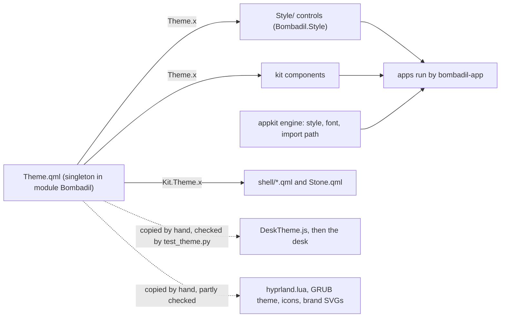
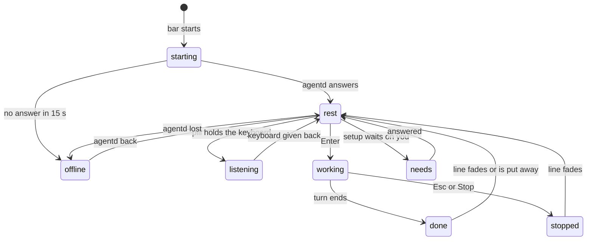

# Design system

> **Status:** Partly shipped
> **Code:** `share/qml/Bombadil/Theme.qml`, `share/qml/Bombadil/Style/`, `share/qml/Bombadil/icons/`, `shell/DeskTheme.js`, `shell/Stone.qml`, `docs/brand/`
> **Design:** [The Bombadil mark](../design/identity-brief.md), [Bombadil's voice](../design/voice-brief.md)
> **Verified:** 2026-10-01 against `main` at `26843d3`

Bombadil's look is one set of values kept in one file, `share/qml/Bombadil/Theme.qml`. The shell, the app kit, the `Bombadil.Style` controls and every generated app read it, so a window the agent writes looks like the pill. This page names the roles of those values and the rules for using them. It restyles nothing, and where it disagrees with `Theme.qml`, `Theme.qml` is right.

## What is built

- **Shipped:** the tokens, the `Bombadil.Style` controls, the icons, the stone in the pill and the logo files. Tests cover the tokens, the stone and the logo files; the style and the icons are checked by a gallery that is run by hand ([Tests](#tests)).
- **In progress** on a branch that is not on `main`: voices for the interface's words.
- **Designed and not built:** a still version of every animation under reduced motion.
- **Missing:** `Theme.qml` has no token for the 1 px border or the popup shadow. The [known gaps](#known-gaps) list each with the file that shows it.

The logo's design reasoning is in [the identity brief](../design/identity-brief.md) and the kit's component catalogue is in [the app kit doc](../architecture/app-kit.md); neither is repeated here.

## How the tokens reach the screen



| Reader | How it gets the tokens |
|---|---|
| Kit components | They live in the module that holds `Theme.qml`, so they write `Theme.x` with no import. `Theme.qml` is `pragma Singleton`, registered as `singleton Theme 1.0 Theme.qml` in `share/qml/Bombadil/qmldir`. |
| `Bombadil.Style` controls | A module of their own: `share/qml/Bombadil/Style/qmldir` starts with `module Bombadil.Style`. Every file that reads a token does `import Bombadil` and then writes `Theme.x`; `Page.qml` and `EditMenu.qml` read none. |
| Generated apps | `import Bombadil`. `src/bombadil/appkit/engine.py` sets the style `Bombadil.Style` (`QT_QUICK_CONTROLS_STYLE` and `QQuickStyle.setStyle`), the application font to Inter at 14 px, and the import path to `share/qml` (this checkout first, then the installed copy). The app runtime also reads `Theme.bg` through `THEME_PROBE` to colour the native window (`src/bombadil/appkit/runtime.py`). |
| The shell | `import Bombadil as Kit`, then `Kit.Theme.x`. Quickshell resolves a singleton only from its own directory or from the import path, so `bin/bombadil-shell` exports `QML2_IMPORT_PATH=<root>/share/qml` and then runs `quickshell -p shell/shell.qml`. |
| The desk's logic | `shell/DeskTheme.js`, a `.pragma library` script of plain values. A library script cannot import a directory, so it cannot read `Theme.qml`. The values whose names differ from their token (`panel`, `strip`, `you`, `machine`, `sessions`, `ok`, `amber`, `amberText`, `red`, `redText`, `onAccent`) carry the token's name in a comment, but the real link is `tests/test_theme.py`, which compares 25 of the file's 33 values. |
| Files that are not QML | `iso/airootfs/etc/skel/.config/hypr/hyprland.lua`, `share/grub/bombadil/theme.txt`, the installed icons and `docs/brand/*.svg` repeat some values as literals. [Changing a token](#changing-a-token) says which are checked. |

## Content fundamentals

The words of the interface are part of the look. The rules, from the principle [one design language](../principles.md#one-design-language) and [the identity brief](../design/identity-brief.md); [the voice brief](../design/voice-brief.md#the-rules) adds the line limits and keeps `On it`, `Undo` and `Details` plain in every voice:

- Full sentences in sentence case: "Ask anything".
- The product is "Bombadil" in prose. `bombadil` is the command and the name in the lockup.
- Name what changed and how to take it back. A turn that changed something keeps its line with `Undo` and `Details`; one that cannot be undone says `can’t be undone` in `badInk`.
- No emoji, no exclamation marks in system text, no "Oops". No test enforces this; a search of `shell/*.qml` and `src/bombadil/narrate.py` for a string ending in `!` finds none.
- The agent's replies are one or two plain sentences with no markdown and no lists (`src/bombadil/providers.py`). The line above the pill shows one line while a turn runs and at most four when it ends (`maximumLineCount` in `shell/StatusLine.qml`).
- Voices (Merry, Plain, Quiet) that change greetings are in progress on a branch that is not on `main`: nothing in `src/` or `shell/` on `main` selects one. The interface's words are fixed strings, such as the ones below, and the step lines that `src/bombadil/narrate.py` writes.

| Moment | Words | Source |
|---|---|---|
| Prompt placeholder, connected | `Ask anything` | `shell/shell.qml` |
| Prompt placeholder, agentd has not answered yet | `Starting` | `shell/shell.qml` |
| Prompt placeholder, agentd missing | `Waiting for agentd…` | `shell/shell.qml` |
| A turn starts | `On it` | `shell/PillState.qml` |
| A turn is being stopped, was stopped, ended with nothing to say | `Stopping`, `Stopped.`, `Done.` | `shell/PillState.qml` |
| Typing while disconnected | `Not connected to the agent yet.` | `shell/PillState.qml` |
| The socket drops during a turn | `Lost touch with the agent. Reconnecting.` | `shell/PillState.qml` |
| The last hot reload of an app failed; the previous window stays up | `Reload failed` | `share/qml/Bombadil/AppWindow.qml` |
| An app cannot load at all | `<title> could not load`, then `Fix the file and it reloads by itself.` | `src/bombadil/appkit/runtime.py` |

## Colour

Every value below is read from `Theme.qml`. In QML a colour with alpha is `#AARRGGBB`; CSS's `#RRGGBBAA` form is the same colour, and the CSS column of the glass table is computed that way (`docs/design/pages/bombadil-mark.html` writes the pill's glass as `rgba(26, 29, 33, .94)`). Contrast ratios were computed from these hex values against the opaque colour.

### Colour says who

White is the person, orange is the machine acting, blue is a coding session. This is the principle [colour says who](../principles.md#colour-says-who), and every dot, edge, meter and strip follows it.

| Colour | Means | Token |
|---|---|---|
| white | you | `fg` (`DeskTheme.you`) |
| orange | the machine while it acts | `accent` (`DeskTheme.machine`) |
| blue | a coding session, and neutral facts | `info` (`DeskTheme.sessions`) |
| amber | a step that touches the system, or something waiting on you | `warn` |
| red | failed, offline, or cannot be undone | `bad` |
| green | connected and healthy | `good` |

- A status has a mark (a dot, an edge, an icon) and, where it carries text on the dark ground, an ink: `accentInk`, `warnInk`, `badInk`. Coloured text uses the ink, never the mark: `bad` as text on `panel` is 4.1:1, `badInk` is 8.2:1. The shell follows this rule; the kit does not yet ([known gaps](#known-gaps)).
- `good` and `bad` are never told apart by hue alone. The stone's states differ by shape and motion, and `shell/StatusLine.qml` shows the exact command beside an amber or red edge.
- In the pill, the stone, the border and Stop use `accent` for the machine's turn, and the desk's `machine` colour is the same orange. `accent` also marks what is chosen or primary: the border of a shown app chip and of primary setup chips in the shell, and in the kit the primary button (`highlighted: true`), a checked box or switch, the focus ring, text selection, links and the selected-tab underline. One primary button per view.

### Surfaces

| Token | Value | For |
|---|---|---|
| `bg` | `#101214` | Window background (`ApplicationWindow`, `AppWindow`, the app runtime's native window) and the desktop ground (`background_color` in `hyprland.lua`, `desktop-color` in the GRUB theme). |
| `panel` | `#1a1d21` | Cards and panels (`Pane`, `Dialog`, `Drawer`), the tile behind the mark. The shell's surfaces are its glass variants. |
| `raised` | `#22262b` | Hover on kit rows (`ListRow`, `DataTable`), the selected row of a style `ItemDelegate`, inputs, default buttons, the line's Undo and Details, a meter's track on a desk card. |
| `overlay` | `#2a2f36` | Popups, menus, tooltips, toasts, chart tooltips, a default button's hover. The same value as `border`. |
| `sunken` | `#0c0e10` | Editors, code, wells. Also the ink of the popup shadow and of the modal backdrop. |
| `border` | `#2a2f36` | Hairlines between surfaces, the pill's resting border, Hyprland's inactive window border. |
| `borderStrong` | `#3a414a` | The outline of a control and of a floating surface, a hovered outline, menu separators, a switch's off track. |
| `borderActive` | `#4a525c` | The pill's border while it holds the keyboard. |

### Glass

The shell's surfaces float over windows: `panel` at a set opacity. Apps are opaque and use `bg` and `panel`.

| Token | QML value | CSS | Opacity | For |
|---|---|---|---|---|
| `glassPill` | `#f01a1d21` | `#1a1d21f0` | 94% | The prompt bar; the default `ground` of the stone. |
| `glassLine` | `#e61a1d21` | `#1a1d21e6` | 90% | The line above the pill and the picture above it (`StatusLine`, `CardHost`). |
| `glassChip` | `#d91a1d21` | `#1a1d21d9` | 85% | Queued prompts, running-app chips, quiet setup chips. |
| `glassCard` | `#f51a1d21` | `#1a1d21f5` | 96% | The desk's cards, through `DeskTheme.panel`. |
| `glassStrip` | `#f21a1d21` | `#1a1d21f2` | 95% | The desk's strips, through `DeskTheme.strip`. |
| `glassRaised` | `#f022262b` | `#22262bf0` | 94% of `raised` | A chosen chip: the app chip whose window is shown, big and primary setup chips. |

### Ink

| Token | Value | For | On `panel` |
|---|---|---|---|
| `fg` | `#e6e8eb` | Primary text, and the mark's ink on the dark ground. | 13.8:1 |
| `muted` | `#8b939c` | Secondary text, captions, the clock, placeholders in the pill, the stopped stone. | 5.4:1 (4.3:1 on `overlay`) |
| `faint` | `#5c636b` | Disabled text, the Tab ghost, the `next` label, placeholders in kit fields. | 2.8:1 |

`faint` is never for text a person must read.

### Accent and status tones

| Token | Value | For |
|---|---|---|
| `accent` | `#d97757` | The machine acting: the working stone, the pill's border while a turn runs, the focused window's border, the primary button, the focus ring. The mark is never a still orange logo: the stone is orange only while it rolls in the pill (`shell/Stone.qml`). Drawn as a logo, tile or icon it is ink, with `accent` only on the dot of the i in the lockup. |
| `accentHover` | `#e38a6c` | Hover of an accent fill. |
| `accentPressed` | `#c4633f` | Pressed state of an accent fill. |
| `accentFg` | `#ffffff` | Text and icons on an accent fill: 3.1:1, so 14 px medium or larger. |
| `accentSoft` | `#33d97757` | A tinted wash behind accent things: a selected kit row (`ListRow`, `DataTable`), a checked button, a slider handle's halo, Stop's hover. |
| `accentInk` | `#f2c4b3` | Text in the accent family on the dark ground: the word `Stop`. 10.7:1 on `panel`. |
| `accentOnLight` | `#b4532f` | The accent on a light page (print, the lockup on white). 4.48:1 on `groundLight`; `accent` there is 2.8:1. |
| `good` | `#5fb36b` | Connected, resting, done. A mark only. |
| `warn` | `#e0a93b` | A step that touches the system (the line's amber edge), a stone waiting on you. |
| `warnInk` | `#e8c38d` | The exact command under a marked step. 10.2:1 on `panel`. |
| `bad` | `#d05555` | Failed, offline, irreversible: edges, the offline outline, destructive buttons. A mark, not text (4.1:1). |
| `badInk` | `#f0a0a0` | Error text and `can’t be undone` in the shell. |
| `badLine` | `#7a2e2e` | The pill's border when the agent is unreachable. |
| `info` | `#5b9bd5` | Coding sessions and neutral facts. |

`Theme.tone(name)` maps the six tone names used across the kit (`accent`, `good`, `warn`, `bad`, `info`, `muted`) to these colours and falls back to `fg`.

### Charts

`series` holds eight colours in a fixed order: `#3987e5`, `#d95926`, `#199e70`, `#c98500`, `#d55181`, `#008300`, `#9085e9`, `#e66767`. Series 1 is `series[0]`. Use them in order. `LineChart` and `StackedBar` fall back to `muted` after the eighth instead of cycling. `grid` is `#262a30` (gridlines) and `axis` is `#383e46` (the baseline).

## The mark and its states

The mark is a smooth three-sided stone with a lowercase b cut through it; why it is that shape is in [the identity brief](../design/identity-brief.md). The rules for using it:

- The mark is ink: `fg` on the dark ground, `inkOnLight` on a light page, black or white in print. The stone takes a colour only in the pill, and only its state's colour.
- The one fixed touch of orange is the stone that dots the i in the lockup (`accent` there, `accentOnLight` on the light lockup).
- Never draw the mark as a still orange logo, and never on an orange or red tile: `accent` is the colour of Claude's logo and Bombadil also runs Codex.
- No face, no mascot, no Tolkien imagery, no logo wallpaper, no boot splash. The principle is [original](../principles.md#original).

`shell/Stone.qml` draws it in the pill: a 24 by 24 item with the stone 18 px wide (corner radius 2.7, side radius 15.3, top corner centred on (12, 5.7), centroid (12, 12.975)) and the b stroked 1.6 px wide in `ground`, so it reads as a cut. The b is not transparent: the stone must sit on a flat colour equal to `ground`. Where the mark sits on a picture, use the masked SVG in `docs/brand`. The stone rolls about its centroid while the b stays level, and in a knock or a lean the b slides with the stone's centre but never tilts.

Properties: `face` (string), `ground` (colour, default `glassPill`), `reducedMotion` (bool, default `false`).

### The pill's states



| `face` | Stone | Motion | Under reduced motion | `PillState.face` gives it when |
|---|---|---|---|---|
| `starting` | `accent`, rolling | As `working`; the pill also says "Starting". | Pulse. | Not connected, agentd has never answered, and the 15 s `booting` timer in `shell/shell.qml` is still running. |
| `rest` | `good`, still | None. | Same. | Otherwise, including a closing line that ended in an error. |
| `listening` | `good`, leaning 6 degrees toward the text | Eases over 240 ms on (0.16, 1, 0.3, 1) and stays. | The lean still eases. | Not from `PillState`: `shell/shell.qml` shows it for `rest` on the screen whose pill holds the keyboard. |
| `working` | `accent`, turning about the b | A 1 s beat: hold 300 ms, turn 120 degrees in 550 ms on (0.55, 0, 0.3, 1), hold 150 ms. A third of a turn looks like the start, so the loop is unseen. | A pulse that repeats every second: opacity 1 to `pulseLow` (0.3) and back, 500 ms each way, for as long as the face is `working` or `starting`. | `busy`, the optimistic "On it", mode `working`, or a sign-in under way. |
| `needs` | `warn`, with a filled radial glow behind (never a ring) | Two knocks tipping 8 degrees, then a wait, on a 1.6 s beat; the glow breathes 0.25 to 0.6 on the same beat. | No knocks; the glow is held at 0.45. | Mode `setup` with `setupState` `choose` (which AI), `signed_out` or `offline`. `PillState.needsYou` also gives it, but nothing on `main` sets that property: only `tests/test_pill_qml.py` does ([known gaps](#known-gaps)). |
| `done` | `good`, then still | Once, 700 ms: squash to (1.06, 0.9) about the foot, a 3 px hop, a landing squash to (1.1, 0.84), a small rebound. | A 600 ms fade in from 0.3. | Mode `closing` after a turn that was not stopped and did not end in an error. |
| `stopped` | A 12 px `muted` square, radius 2.4 | None. | Same. | Mode `closing` and the turn was stopped. |
| `offline` | The outline alone: 1.5 px `bad`, six round-capped dashes, one on each corner and each side; the b stays as a `bad` line | None. | Same. | Not connected after agentd was seen, or after the boot window passed. |

`PillState.face` picks the first match, in this order: disconnected (`starting` or `offline`), `needs`, `working`, `closing` (`stopped`, `rest` on an error, else `done`), `rest`. The states are meant to differ in shape or motion as well as colour: rest is still, listening leans, working turns, needs knocks and glows, done hops, stopped is a square, offline is a broken outline. That is design intent; no test renders them in greyscale. `starting` looks the same as `working`, and `done` looks like `rest` once its hop ends.

The pill's border is a separate rule in `shell/shell.qml`, first match wins:

| Condition | Border |
|---|---|
| `pillState.busy` (agentd reports a turn) | `accent` |
| This screen's pill holds the keyboard | `borderActive` |
| `face` is `offline` | `badLine` |
| Otherwise | `border` |

So the border turns orange only while agentd reports a turn. During the optimistic "On it", before agentd confirms, and during a sign-in, the face is `working` and the border is still `border`. The border width is `pillBorder`, and its colour change takes `slow` (300 ms).

While a turn can be stopped and the pointer is over the stone, the stone gives way to Stop: a 9 px `accent` square and the word `Stop` in `accentInk` on an `accentSoft` wash. It is not offered in the capsule the desk narrows the pill to under a full-screen window.

## Type

`fontFamily` is `Inter`, which the image installs (`inter-font` in `iso/packages.x86_64`). `monoFamily` is the generic `monospace`, for commands and code. Numbers that tick use tabular figures (`font.features: { "tnum": 1 }`, as in `Stat` and the line's seconds counter). The style names below are the design system's; the code has only the size tokens.

The shell group:

| Style | Size | Token | Where |
|---|---|---|---|
| `pill-input` | 16 | `promptSize` | What you type in the pill. |
| `line` | 15 | `lineSize` | The line above the pill and the picture's title. |
| `meta` | 13 | `smallSize` | The clock, the seconds counter, chip prompts, `Stop`. |
| `shell-caption` | 12 | `captionSize` | Line buttons, `next`, `can’t be undone`, the launcher hint. |
| `command` | 12, `monoFamily` | `captionSize` | The exact command under a marked step, in `warnInk` or `badInk`. |

The apps group:

| Style | Size and weight | Token | Where |
|---|---|---|---|
| `body` | 14, 400 | `textSize` | `Body`, rows, controls. |
| `caption` | 12, 400, `muted` | `captionSize` | `Caption`, secondary lines. |
| `label` | 12, 500 | `captionSize` | `Stat` labels, `Badge`. |
| `heading-3` | 14, 600 | `textSize` | `Heading { level: 3 }`. |
| `heading` | 17, 600 | `headingSize` | `Heading { level: 2 }`, dialog titles, the title row of `AppWindow`. |
| `title` | 22, 700 | `titleSize` | `Heading { level: 1 }`. |
| `stat` | 22, 600, tabular | `titleSize` | `Stat` values. |
| `display` | 34 | `displaySize` | One big number or word per view; nothing in the kit uses it, and the weight is the app's choice. |
| `mono` | 13 | `monoFont` | Paths, code, hashes. |

Keep text between 12 px and 34 px. Every `Text` and `TextField` in `shell/*.qml` must set the family (`tests/test_theme.py`). In the kit, `Label` sets `Theme.font`; other controls inherit the application font that the engine sets.

## Shape and space

Things that speak are fully round, with a radius of half their height. Things that hold have `radius`. Controls have `radiusSmall`. This is the principle [one design language](../principles.md#one-design-language).

| Token | Value | For |
|---|---|---|
| `radiusPill` | 26 | The prompt bar (`pillHeight` 52). `tests/test_theme.py` requires `pillHeight` to equal twice `radiusPill`. |
| `radiusLine` | 14 | The line above the pill and the picture above it. Chips and strips (28 high) are pills too: `radius` is half their height. |
| `radiusLineButton` | 12 | Undo and Details (24 high). |
| `radius` | 12 | Windows, cards, panels, popups. Hyprland's `rounding` matches it. |
| `radiusSmall` | 8 | Controls and rows. |
| `gapSmall` | 6 | Between tightly related siblings; Hyprland's inner gap. |
| `gap` | 12 | Default spacing between siblings; Hyprland's outer gap. |
| `pad` | 16 | Padding inside a card or window. |
| `controlHeight` | 36 | Buttons, fields, combo boxes. |
| `rowHeight` | 44 | List rows, the toolbar. |
| `chipHeight` | 28 | Queued chips; the desk's strips. |
| `pillHeight` | 52 | The prompt bar. |
| `pillMaxWidth` | 900 | The widest the pill and the line grow. |
| `railWidth` | 300 | A desk card's width (`DeskTheme.cardWidth`). |
| `pillBorder` | 1.5 | The pill's border width. |
| `focusRing` | 2 | The width of the keyboard focus outline. |

Hairlines between surfaces are 1 px; there is no token for it. Other widths: the pill is `pillBorder` (1.5); a focused text field, text area, spin box and editable combo box, and the unchecked outline of a check box and radio button, are 1.5; a slider handle's border is 3; the focus ring is 2. The focus ring is drawn by `Style/FocusRing.qml`: 2 px in `accent`, 3 px outside the control by default (`inset: -3`), inside for list rows and tabs. Disabled controls fade to 0.4 opacity.

## Motion

Every movement means one thing: rolling is working, a knock is waiting on you, a hop is done, a lean is listening. Nothing else moves. This is the principle [quiet at rest](../principles.md#quiet-at-rest).

| Token | Value | For |
|---|---|---|
| `fast` | 120 ms | Hover and press colour changes, popup and tooltip fades, a card's height changing, the width of the stone's box when Stop appears. |
| `normal` | 200 ms | Fades: the line, modal backdrops, dialogs, drawers, page slides, chart growth, the tab underline. |
| `slow` | 300 ms | The pill's border colour. |
| `pulseLow` | 0.3 | The dimmest point of the reduced-motion working pulse. |

The desk keeps three durations in `shell/DeskTheme.js`: `foldMs` 150 (a card folds), `unfoldDelayMs` 400 (a card returns that long after the window over it is gone) and `washMs` 600 (a row's colour washes over a card's left edge). They have no token in `Theme.qml`.

Windows and panels slide on the bezier (0.16, 1, 0.3, 1): `hyprland.lua` defines it as the curve `ease` for windows, special workspaces and fades. The stone's lean uses the same curve.

How long a line stays (`shell/PillState.qml`): 12 s after a turn (`fadeAfter`), 5 s after a local answer, 15 s after an undo, 8 s after a picture, a sign-in message or "Lost touch with the agent. Reconnecting.", and 4 s for "Not connected to the agent yet." typed into the pill. A receipt picture that arrives with a turn's line raises that line to at least 15 s. A local error with no turn sets no time of its own and keeps the previous one. A turn that changed something keeps its line, with Undo, until the next prompt or until Esc puts it away. A message shown over a running turn lasts 3.5 s, or 8 s for the answer to "why". Hovering the line on any screen keeps it.

### Reduced motion

`shell/shell.qml` reads `BOMBADIL_REDUCE_MOTION=1` into `reducedMotion` and passes it to the stone. Nothing in the repository sets that variable, so it is a switch to set by hand. Only the stone honours it. The kit's animations (`BusyIndicator` spins every 900 ms, indeterminate `ProgressBar` sweeps every 1400 ms, `StackView` slides, `Dialog` scales) and the desk's (the 2000 ms ring in `shell/DeskCard.qml`, folds) read no such flag. Every movement having a still version is the rule; the stone is the only place it is built.

## Depth

No shadows on the ground. A popup, menu, combo box list or dialog gets the two-layer shadow of `Style/Shadow.qml`: two translucent rounded rectangles in `sunken`, at 16% and 30% opacity, no shader. Tooltips and drawers have none. A modal `Popup`, `Dialog` or `Drawer` dims its window with `sunken` at 60% and a modeless one at 25%; `Menu` uses 50% and 20%. The glass surfaces are meant to rely on blur behind them, not on shadows. `hyprland.lua` enables Hyprland's blur with size 6 and 2 passes; it has no layer rule for the bar's `bombadil-bar` namespace, so this page does not claim that the bar's glass is blurred.

## Iconography

The set is [Lucide](https://lucide.dev) (ISC licence, `lucide-static` 0.544.0, text in `share/qml/Bombadil/icons/LICENSE`): 77 SVGs in `share/qml/Bombadil/icons/`. Each is 24 by 24 with a 2 px stroke, round caps and joins, and `stroke="currentColor"`. They are Lucide's drawings with its licence comment and `class` attribute removed. Five are saved under a shorter file name than Lucide's: `key` (Lucide `key-round`), `sliders` (`sliders-horizontal`), `trash` (`trash-2`), `wand` (`wand-sparkles`) and `refresh` (`refresh-cw`).

- Tint through the kit's `Icon`: `Icon { name: "check"; size: 16; color: Theme.muted }`. It draws with `IconImage`, which paints the SVG in `color`. `size` defaults to 18 and `color` to `fg`.
- On a stock button, `Button { icon.source: Theme.icon("copy") }`. `Theme.icon(name)` returns the URL of `icons/<name>.svg`. The style sets `icon.width` and `icon.height` to 16 on buttons, rows and tool buttons.
- Tint icons to their text colour: `fg`, `muted`, or a status ink.
- Do not mix in other icon sets or emoji. If an icon is missing, add it from Lucide with its name ([Extending it](#extending-it)).
- The mark is not part of this set. It lives in `docs/brand` and in the image's icon directories.

## Light-page use

The OS has one dark ground and no theme switch. Three tokens exist for the places that have a light ground: the README, the design pages and print.

| Token | Value | For |
|---|---|---|
| `inkOnLight` | `#15181b` | The mark and text on a light page: 16:1 on `groundLight`. |
| `groundLight` | `#f2f3f4` | The light page's ground. |
| `accentOnLight` | `#b4532f` | The accent for the dot of the i and links: 4.48:1 on `groundLight`. |

`bombadil-lockup-light.svg` uses `inkOnLight` and `accentOnLight`. `README.md` opens with a `<picture>` that shows `docs/brand/bombadil-lockup.svg` when the viewer prefers a dark scheme and the light lockup otherwise. The design pages in `docs/design/pages` repeat the three light tokens as the light scheme's `--bg`, `--fg` and `--accent` (`bombadil-at-work.html` and `bombadils-voice.html` use `#f1f2f3` for `--bg`), and the OS values as `--os-*` variables (not every page declares every one). Their dark reading palette (`--bg` `#0d0f11`, `--accent` `#e08462`) is their own and matches no token.

## Using the tokens

In an app or a kit component:

```qml
import QtQuick
import QtQuick.Controls
import QtQuick.Layouts
import Bombadil

AppWindow {
    title: "Example"
    Panel {
        Layout.fillWidth: true
        title: "Saved"
        RowLayout {
            spacing: Theme.gap
            Badge { text: "synced"; tone: "good" }
            Button { text: "Save"; highlighted: true; icon.source: Theme.icon("check") }
        }
        Rectangle {
            Layout.fillWidth: true
            implicitHeight: Theme.controlHeight
            radius: Theme.radiusSmall
            color: Theme.alpha(Theme.warn, 0.14)
            border.color: Theme.warn
            Text {
                anchors.centerIn: parent
                text: "A step that touches the system"
                color: Theme.warnInk
                font.family: Theme.fontFamily
                font.pixelSize: Theme.captionSize
            }
        }
    }
}
```

`bin/bombadil-app check` loads this snippet without errors or warnings. `Theme.alpha(c, a)` returns the colour with another alpha and accepts a colour or a string such as a `series` entry. Colours, radii, spacing and fonts come from `Theme`; the agent's own rule for apps is "never hard-code a color" (`share/skills/bombadil-apps/SKILL.md`).

In the shell, import the kit as `Kit` and nothing else:

```qml
import QtQuick
import Bombadil as Kit

Rectangle {
    implicitHeight: Kit.Theme.chipHeight
    radius: implicitHeight / 2
    color: Kit.Theme.glassChip
    border.color: Kit.Theme.border
    Text {
        font.family: Kit.Theme.fontFamily
        color: Kit.Theme.muted
        font.pixelSize: Kit.Theme.smallSize
    }
}
```

`tests/test_theme.py` fails a shell file that imports the kit under another name, a shell `Text` without a font family, and any hex colour or `"white"` or `"black"` in `shell/*.qml`. The desk's files import `"DeskTheme.js" as T` and read `T.machine`, `T.cardWidth` and the rest of that file.

## Changing a token

| A value is copied to | Which values | What checks it |
|---|---|---|
| `shell/DeskTheme.js` | 18 colours, 5 values, `cardWidth` against `railWidth`, `stripHeight` against `chipHeight` | `test_desk_theme_matches_the_kits_tokens` |
| The tokens the shell and the design system name | 27 names must exist; `accent` must be `#d97757`; `pillHeight` must be twice `radiusPill` | `test_theme_carries_every_token_the_shell_and_the_design_system_name` |
| `shell/*.qml` | No hex colour and no `"white"` or `"black"` (`"transparent"` is allowed); every `Text` sets a family | `test_no_shell_file_hard_codes_a_colour`, `test_every_shell_text_sets_the_type_family` |
| The installed icon `iso/airootfs/usr/share/icons/hicolor/scalable/apps/bombadil.svg` | `panel`, `fg` | `test_installed_icons_need_no_svg_mask` in `tests/test_brand.py` |
| `share/grub/bombadil/theme.txt` | `bg` as `desktop-color`; `Inter Regular 16` | `test_the_grub_theme_names_its_files_and_the_ground` |
| `docs/brand/*.svg` | `fg`, `accent`, `panel`, `border`, `inkOnLight`, `accentOnLight` | Only that they parse. |
| `iso/airootfs/etc/skel/.config/hypr/hyprland.lua` | `bg`, `accent`, `border`, 12 px rounding, gaps 6 and 12 | Nothing. |
| `docs/design/pages/*.html`, `share/skills/bombadil-apps/references/components.md` | In the pages, the three light tokens (`--bg`, `--fg`, `--accent`) and the OS values (`--os-*`); in the components list, the tokens apps use. The pages' dark reading palette is their own | Nothing. |
| `src/bombadil/appkit/native/highlighter.py` (`PALETTE`, used by the kit's `Editor`) | `accent` (keyword, heading), `faint` (comment), `fg` and `muted` as literals; six syntax colours that are not tokens | Nothing. |
| `tests/test_diagram_qml.py` | `border`, `warn`, `bad`, `accent`, `faint` and `info`, asserted as hex literals | The test itself: it fails when one of them changes, and the literal is then updated by hand. |
| `tests/test_pill_qml.py`, `tests/desktop/driver.py` | `glassPill` as `#f01a1d21`, `pillHeight` as 52 and `radiusPill` as 26 in the harness pill of `test_pill_qml.py`; `glassLine` as `#e61a1d21` in a docstring of the driver | Nothing. |
| `tests/test_desk_qml.py`, `tests/test_desk_cards_qml.py`, `tests/test_stone_qml.py` | `bg`, painted as a literal `#101214` ground behind what is under test (`GROUND` in the stone test) | Nothing: they keep passing after `bg` changes, so update the literal to keep them on the real ground. |

`DeskTheme.js` has eight more values that no test compares: `railMargin`, `railTop`, `railBottom`, `cardGap`, `stripGap`, `foldMs`, `unfoldDelayMs` and `washMs`.

## Logo files

All in `docs/brand`. Do not rename them: `README.md` refers to the two lockups and `share/grub/bombadil/README.md` refers to `bombadil-mark.svg`.

| File | What it is | For |
|---|---|---|
| `bombadil-lockup.svg` | The mark, then the name `bombadil` in round-capped strokes; ink `fg`, the i dotted with a small stone in `accent`. | Dark grounds; the README in a dark scheme. |
| `bombadil-lockup-light.svg` | The same in `inkOnLight`, the i dotted in `accentOnLight`. | Light pages; the README by default. |
| `bombadil-mark.svg` | The stone in `fg` with the b cut out, on a transparent ground (64 by 64). | Anywhere the mark sits on a picture. The GRUB background was rendered from it (`share/grub/bombadil/README.md`). |
| `bombadil-tile.svg` | The mark in `fg` on a `panel` rounded square with a `border` hairline (128 by 128). | The master of the installed icon (`iso/airootfs/usr/share/icons/hicolor/scalable/apps/bombadil.svg`, a mask-free redraw of it). |
| `bombadil-avatar.png` | The tile as a 500 by 500 picture. | The repository avatar. |
| `bombadil-social-preview.png` | The tile centred on `bg`, 1280 by 640. | The repository's social picture. |

The four SVGs cut the b with an SVG `<mask>`, which Qt's SVG renderer ignores. The installed icons, which Qt draws, are mask-free copies in `iso/airootfs/usr/share/icons/hicolor/scalable/apps/` (`bombadil.svg`, also in `iso/airootfs/usr/share/pixmaps/`, and the one-colour 16 px `bombadil-symbolic.svg`). A separate colour drawing for 16 px, and `LOGO=bombadil` in the installed system's `os-release`, are designed: no file in the repository provides either.

## Extending it

### 1. Add a token

1. In `share/qml/Bombadil/Theme.qml` add `readonly property <color|int|real|string> name: <literal>` with a one-line comment saying what it is for. Write the value as a literal: the tests read `Theme.qml` with a pattern (`tests/qml_theme.py`) that sees only these four types with a quoted string or a plain number, so a `var`, a `font` or a negative number is invisible to them. Alpha colours are `#AARRGGBB`.
2. If the desk needs it, add `var name = ...` at the start of a line in `shell/DeskTheme.js`, with a comment naming the token, and add the pair to `DESK_COLOURS` or `DESK_VALUES` in `tests/test_theme.py`. Without that entry the value is not compared.
3. If the shell must always have it, add the name to the list in `test_theme_carries_every_token_the_shell_and_the_design_system_name`.
4. Copy it by hand to any file in [Changing a token](#changing-a-token) that repeats it.
5. Add it to the tables on this page. If apps should use it, add it to the token list in `share/skills/bombadil-apps/references/components.md`.
6. Run the tests below and `bin/bombadil-app check tests/qml/style_gallery.qml --screenshot gallery.png`.

### 2. Add an icon

1. Take the SVG from Lucide at the version in `share/qml/Bombadil/icons/LICENSE` (0.544.0) and keep the drawing as it is: 24 by 24, stroke `currentColor`, 2 px, round caps and joins. Remove the `<!-- @license ... -->` comment and the `class` attribute, as in the existing files. Name the file in Lucide's lower-case hyphenated form. The five shorter names above are the exception: Lucide's own `key`, `trash`, `sliders` and `wand` are different drawings, and Lucide 0.544.0 has no `refresh`, so check the drawing and not only the name.
2. Save it as `share/qml/Bombadil/icons/<name>.svg`. Nothing needs registering for the kit: `share/qml/Bombadil/qmldir` lists QML types only, `Theme.icon("<name>")` builds the path from the file name, `cards.icon_names()` in `src/bombadil/cards.py` reads the folder, so a diagram node accepts the name at once, and `scripts/build-iso.sh` copies the whole `share` tree into the image.
3. Add the name to the `## Icons` list at the end of `share/skills/bombadil-apps/references/components.md`. That list is the one the agent is told to use (`src/bombadil/cards.py` and `src/bombadil/cardtools.py` point to it), so the agent does not know a new name until it is there.
4. Use it with `Icon { name: "<name>" }` or `icon.source: Theme.icon("<name>")`, tinted to a text colour. Look at it in `tests/qml/style_gallery.qml` or a small app.
5. `tests/test_cards.py::test_the_kit_icons_are_the_only_icons` asserts only `wifi` and `shield`, so check the name by loading it. Do not add an icon from another set.

### 3. Add a state to the stone

1. Choose the face name and where it comes from. Faces that `agentd` events decide belong in the `face` binding of `shell/PillState.qml`, in the right place in its order. A face that only one screen shows is mapped in `shell/shell.qml` the way `listening` is: `face: win.summoned && pillState.face === "rest" ? "listening" : pillState.face`.
2. In `shell/Stone.qml`, `face` is a plain string. The colour comes from `fill` (`accent` while `rolling`, `warn` for `needs`, else `good`). A face that is not the stone, like `stopped` and `offline`, is its own item with `visible: stone.face === "<name>"`, and its name is excluded in `drawn`.
3. Give the movement a `SequentialAnimation` with `running: stone.face === "<name>" && !stone.reducedMotion` and an `onStopped` that puts the property back, and a second one for `stone.reducedMotion` that is still or fades. Use the pose properties (`lean`, `turn`, `knock`, `hopY`, `hopSx`, `hopSy`, `glowOpacity`) so the b keeps riding.
4. Take every colour from a token. The state must mean one thing, read without colour, and have a still version.
5. Add a test to `tests/test_stone_qml.py`: `mark.set(face="<name>")`, then `near(mark.at(x, y), THEME["<token>"])`, and `mark.snap("<name>")`. If the face has a trigger, add it to `tests/test_pill_qml.py` with `face(bar)`. If the border should change, edit the border rule in `shell/shell.qml`.
6. Update the table and the diagram on this page.

### 4. Add a component that respects the tokens

1. Create `share/qml/Bombadil/<Name>.qml`. It needs no import for `Theme`: it is in the same module. `share/qml/Bombadil/Badge.qml` is a short example.
2. Register it in `share/qml/Bombadil/qmldir` as `<Name> 1.0 <Name>.qml`. Only `Theme` and `Fmt` are `singleton`.
3. Use roles, not hex: `Theme.panel`, `Theme.raised`, `Theme.border` for surfaces, `Theme.fg`, `Theme.muted` for text, `Theme.tone(name)` for a tone, `Theme.alpha(c, a)` for a wash. Set `font.family: Theme.fontFamily` and a size from the type tokens. Use `Theme.fast` or `Theme.normal` for motion, `Theme.radius` or `Theme.radiusSmall`, and `Theme.icon(...)` through `Icon`.
4. Follow the style's states where they apply: hover `raised` or `overlay`, pressed `overlay` or `panel`. `FocusRing` and the `opacity: enabled ? 1 : 0.4` fade belong to the `Bombadil.Style` controls, not to the kit: `FocusRing` is declared `internal` in `share/qml/Bombadil/Style/qmldir`, so a kit component or an app cannot use it, and no file in `share/qml/Bombadil/*.qml` uses either. A component built on a stock control (`SearchField` on `TextField`, `ConfirmDialog` on `Dialog`) gets the style's look for that control. One that draws its own surface (`ListRow`, `Badge`) has neither, and writes any hover, pressed or disabled state itself.
5. Add it to `tests/qml/components_gallery.qml` and, for apps to find it, to `share/skills/bombadil-apps/references/components.md`. [The app kit doc](../architecture/app-kit.md) owns the catalogue.
6. Run `bin/bombadil-app check tests/qml/components_gallery.qml` (add `--screenshot components.png` to look at it). No pytest file loads the gallery, so this is the check that a new component loads.

### 5. Style another control

`Bombadil.Style` is a Qt Quick Controls style. Each control is one file, `share/qml/Bombadil/Style/<Control>.qml`, built on the template with `import QtQuick.Templates as T` and `import Bombadil`, and listed in `share/qml/Bombadil/Style/qmldir`. A control that is not listed falls back to `QtQuick.Controls.Basic` and follows the palette that `Style/ApplicationWindow.qml` and `share/qml/Bombadil/AppWindow.qml` set (`_paletteRoles` and `_disabledRoles` in `AppWindow.qml`), as the comment at the top of `Style/qmldir` says. Check how the fallback looks in an app before writing a file.

1. Create `share/qml/Bombadil/Style/<Control>.qml` as `T.<Control> { ... }` with `import QtQuick`, `import QtQuick.Templates as T` and `import Bombadil`. Copy a neighbour of the same shape: `Frame.qml` for a container, `ToolButton.qml` for a button.
2. Give it `implicitWidth` and `implicitHeight` from its background and content, and a `background` and `contentItem` drawn from `Theme` roles, with `Theme.radiusSmall` for a control and `Theme.fast` for colour fades.
3. List it twice in `Style/qmldir`, as `<Control> 2.0 <Control>.qml` and `<Control> 6.0 <Control>.qml`, in the alphabetical block above the `internal` lines.
4. Add the states the neighbours have: hover, pressed, checked, a `FocusRing { visible: control.visualFocus }` inside the background for a control that takes focus, and `opacity: enabled ? 1 : 0.4`. `FocusRing`, `Shadow` and `EditMenu` are `internal` helpers: they are for files in `Style/` only.
5. Add the control to `tests/qml/style_gallery.qml` in its states and run `bin/bombadil-app check tests/qml/style_gallery.qml --screenshot gallery.png`.

## Principles it keeps

- [Colour says who](../principles.md#colour-says-who): colours are picked from the tokens by meaning. The trap is using `accent` because it looks good; it is the machine's colour, and a second use for decoration weakens every orange mark on screen.
- [One design language](../principles.md#one-design-language): the shell and apps read the same `Theme`. The trap is a literal: a hex colour or a size typed into a file is a second design that drifts, and the tests catch it only in `shell/*.qml`.
- [Quiet at rest](../principles.md#quiet-at-rest): the stone's four movements each mean one thing, and the controls only fade and slide for 120 to 200 ms. The trap is a movement that means nothing or has no still version; the desk's looping ring and the kit's spinners have none (see [known gaps](#known-gaps)).
- [Original](../principles.md#original): the character is in how the stone moves. The trap is decoration that carries character instead: a face, a mascot, or a mark drawn in orange.
- [Something true in 200 ms](../principles.md#something-true-in-200-ms): `PillState.submit` makes the face `working` and the line `On it` on the keypress, before agentd answers, and the colours then ease in 120 to 300 ms. The trap is a design that waits for an animation or for agentd before it shows the state.

## Tests

| File | Covers |
|---|---|
| `tests/test_theme.py` | The parity of `DeskTheme.js` with `Theme.qml`, the required tokens, no colour literal and a font family in every shell file, the import path and launcher. |
| `tests/test_brand.py` | The installed icons, no masks in them, the README banner, the PNG sizes, the GRUB theme. |
| `tests/test_stone_qml.py` | Each face rendered offscreen and read back pixel by pixel: colours, the b staying inside the stone in every pose, a third of a turn looking the same, two knocks, the pulse, the hop. Skipped without PySide6 and its system libraries. |
| `tests/test_pill_qml.py` | `PillState.face` through a turn, a stop, setup and a lost connection, and the font families the line uses. |
| `tests/test_appkit_kit.py` | `Theme.alpha`, among the kit's behaviour. |

```sh
pytest -q tests/test_theme.py tests/test_brand.py tests/test_stone_qml.py tests/test_pill_qml.py
BOMBADIL_SCREENS=/tmp/stones pytest -q tests/test_stone_qml.py    # also saves each face at 8x
bin/bombadil-app check tests/qml/style_gallery.qml --screenshot gallery.png
```

No pytest file asserts anything about a `Bombadil.Style` control. The style gallery is a visual check, run by hand: it draws every control in its states on `bg` and on `panel`, and reports `ok: true` when it loads without errors.

## Known gaps

Each is read from the file named.

- No token for the hairline border or the popup shadow: hairlines in `share/qml/Bombadil/Style/` are a literal `1` or the `Rectangle` default of 1 (the other widths are listed in [Shape and space](#shape-and-space)), and the shadow is built in `share/qml/Bombadil/Style/Shadow.qml`.
- `focusRing` is in `share/qml/Bombadil/Theme.qml` but nothing reads it; `share/qml/Bombadil/Style/FocusRing.qml` writes `2` and `-3` itself.
- Disabled controls use a literal `opacity: enabled ? 1 : 0.4` in 21 files of `share/qml/Bombadil/Style/`.
- Reduced motion reaches only the stone, and only through an environment variable nothing sets (`shell/shell.qml`). The listening lean ignores it (`shell/Stone.qml`).
- Text smaller than the 12 px floor: `shell/NowCard.qml`, `shell/RowsCard.qml`, `share/qml/Bombadil/Diagram.qml` set 11 px.
- The desk's text sizes (14, 13, 12, 11) are literals because `shell/DeskTheme.js` carries no type sizes (`shell/DeskCard.qml`, `shell/RowsCard.qml`).
- Numeric literals in the shell that repeat or stand in for a token value: the app chips in `shell/shell.qml` (height 28 is `chipHeight`; radius 14 is half that height and only coincides with `radiusLine`; a 15 px glyph is `lineSize`), `shell/QueueChips.qml` (15 px) and `shell/SetupChips.qml` (17 and 13 px, which are `headingSize` and `smallSize`). Two have no token: the 150 ms border fade of the app chips in `shell/shell.qml`, which is neither `fast` nor `normal`, and the 24 px height of `shell/LineButton.qml`. No colour literal remains in `shell/*.qml`.
- The kit draws error and danger text in `bad` (4.1:1 on `panel`), not `badInk`: `share/qml/Bombadil/Style/Button.qml` (a `danger` button's ink), `share/qml/Bombadil/Style/MenuItem.qml` (a `danger` item), `share/qml/Bombadil/Field.qml` (a field's error text) and the `<title> could not load` heading in `src/bombadil/appkit/runtime.py`. `accentInk`, `warnInk` and `badInk` have no reader under `share/qml`; only `shell/StatusLine.qml` and `shell/shell.qml` read them.
- The editor's syntax colours are not tokens: `PALETTE` in `src/bombadil/appkit/native/highlighter.py` repeats `accent`, `faint`, `fg` and `muted` as literals and adds six colours that no token holds. Changing `accent` does not change the editor, and no test compares them.
- `PillState.needsYou` exists (`shell/PillState.qml`) and nothing on `main` sets it; only `tests/test_pill_qml.py` does. The `needs` face comes only from setup, and the desk does not write to the pill ([shell doc](../architecture/shell.md#known-gaps)).
- `iso/airootfs/etc/skel/.config/hypr/hyprland.lua` repeats `bg`, `accent`, `border`, the radius and the gaps with no test against `Theme.qml`.
- `monoFamily` is the generic `monospace`; no code names a mono face.
- `display` (34 px) has no reader in the kit (`displaySize` in `share/qml/Bombadil/Theme.qml`).
- The identity brief asks for 24 px icons in toolbars; `share/qml/Bombadil/Style/ToolButton.qml` sets 16 px. `share/qml/Bombadil/Style/ToolTip.qml` draws no shadow, as `Drawer.qml` does not.
- A JSON export of the tokens does not exist in the repository; `Theme.qml` is the only source.
