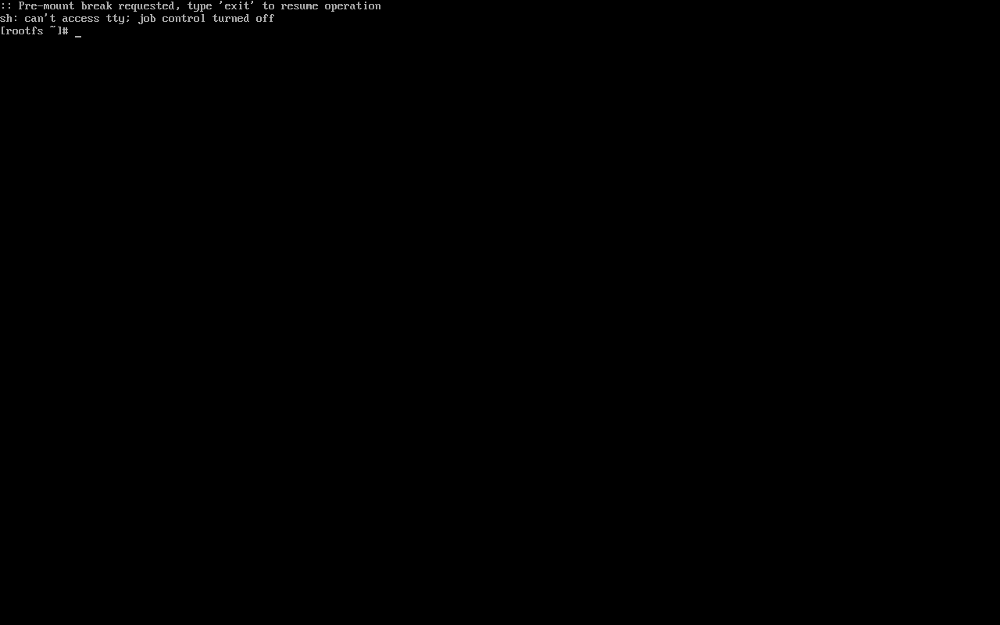
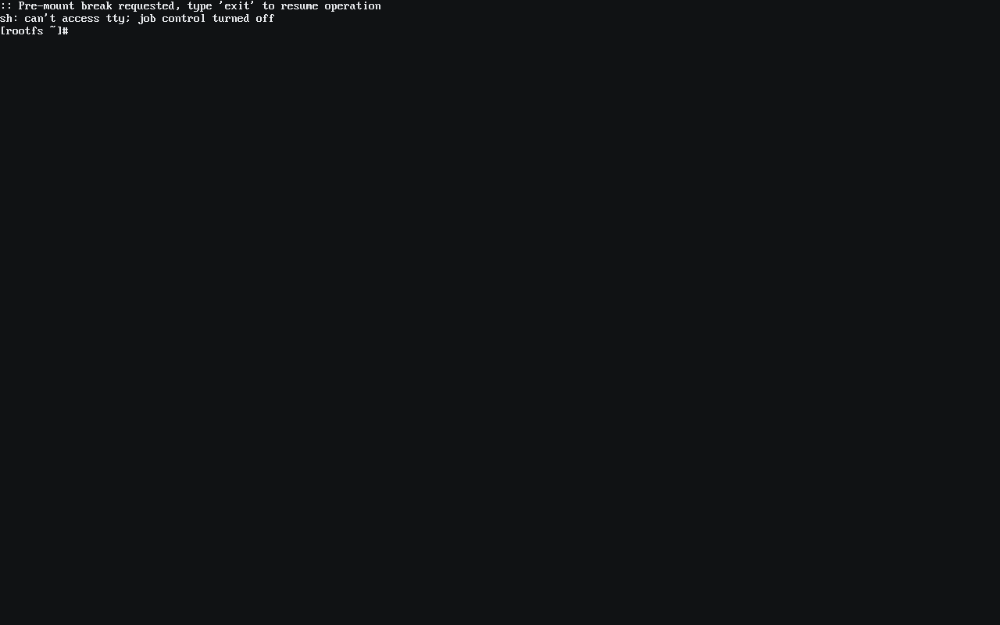
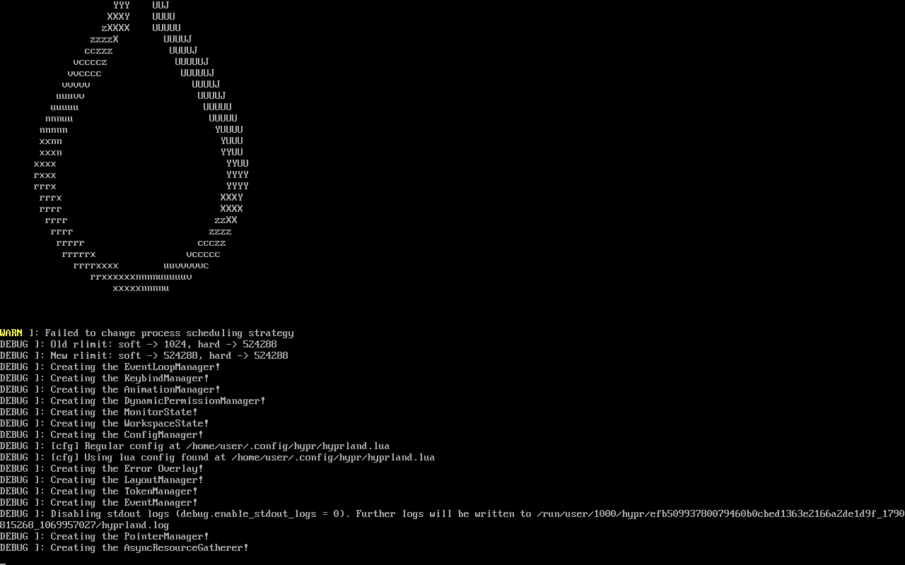
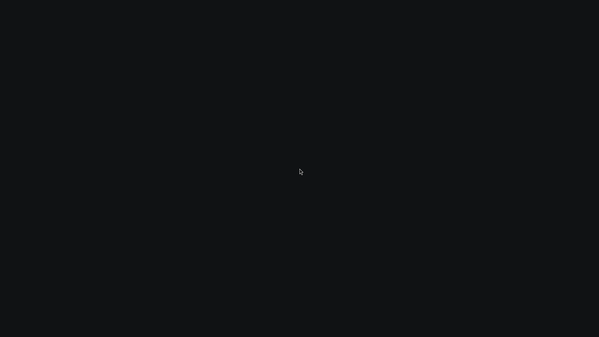
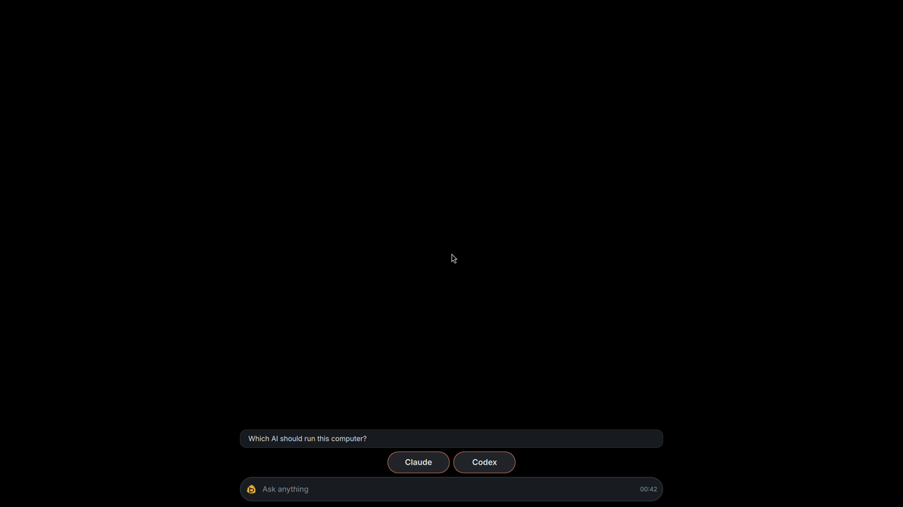
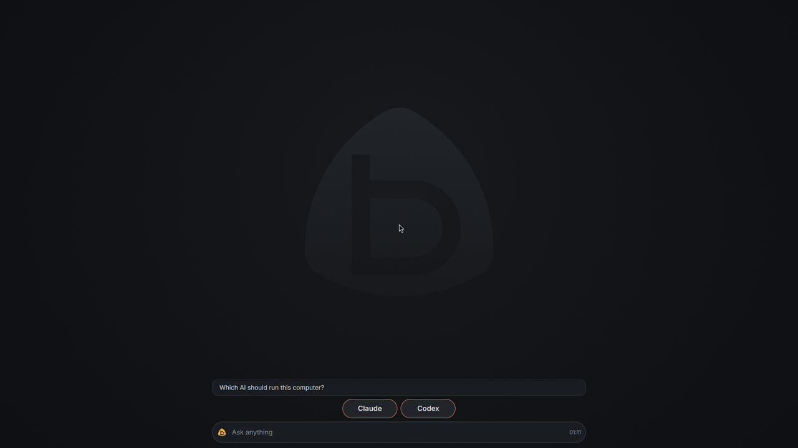
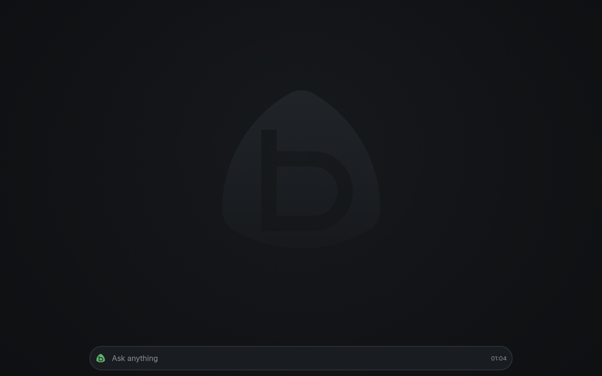
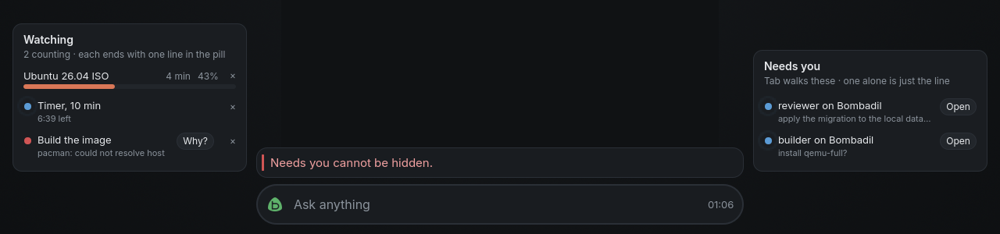

# Boot and the wallpaper

> **Status:** Shipped. The quiet console, Hyprland's opaque ground colour, the wallpaper and the user's own picture are on `main`. The stone in the wallpaper is an open taste choice (see the end of the page).
> **Code:** `shell/Wallpaper.qml`, `share/wallpaper/bombadil.png`, `scripts/make-wallpaper.py`, `scripts/console-palette.py`, `iso/efiboot/loader/entries/01-bombadil.conf`, `iso/airootfs/etc/default/grub.d/zz-bombadil-console.cfg`, `iso/airootfs/etc/greetd/config.toml`, `tests/test_wallpaper.py`, `tests/test_boot_console.py`
> **Design:** [The Bombadil mark](identity-brief.md) and the [design system](../design-system/README.md) set the colours; [Shell](../architecture/shell.md) and [ISO and install](../architecture/iso-and-install.md) describe the parts this page touches
> **Verified:** 2026-10-01 against `main` at `6150431`: the paths above exist and the sections below are the note that shipped with the change.

From the moment the computer powers on to the desk at rest, every screen is in the design system:
the dark ground (`#101214`), the text colour (`#e6e8eb`), and the orange (`#d97757`) only on the
working stone and the dot of the i. This page says what each stage shows, how it is made, and how to
change it. The colours themselves are in [`share/qml/Bombadil/Theme.qml`](../../share/qml/Bombadil/Theme.qml);
the mark is in [`brand/`](../brand/).

## The stages

| Stage | What is on the screen | Made by |
| --- | --- | --- |
| Firmware | The maker's own logo, or nothing. Not ours to change. | the machine |
| Boot loader, live stick | systemd-boot's text menu for three seconds. It has no pictures; the first entry boots by itself. | `iso/efiboot/loader/` |
| Boot loader, installed | GRUB, hidden unless Esc is held at power-on; with the disk encrypted it asks for the password on the mark in the ground colour. | `share/grub/bombadil/`, wired by the installed-system build |
| Kernel and start-up | An empty console in the ground colour. Nothing is printed unless a start fails; no cursor, no kernel logo, no Hyprland banner. | the kernel parameters in this page, `greetd/config.toml` |
| The desk | The wallpaper under the cards, the pill and every window. | `hyprland.lua`, `shell/Wallpaper.qml` |

Each stage changes the screen once, to the next one's ground, so nothing flashes from black to dark
grey on the way. The desk's ground is the console's ground is the GRUB theme's ground.

### Before and after

Booted in a VM, the live ISO from before this change and from after it. The first row is the kernel's
console, the second what greetd printed once Hyprland started, the third the desk.

| Before | After |
| --- | --- |
|  |  |
|  |  |
|  |  |

The console frames show the initramfs shell (the kernel was started with `break=premount` so there
is text to see; a normal boot prints nothing there). The "after" console is `#101214` with `#e6e8eb`
text; the "before" one is `#000000` with the console's default grey.

There is no Plymouth (a boot splash). It would be one more package and one more picture that has to
be kept in step with the ground and the mark, for a start that takes seconds. The quiet console does
the same job: the screen stays the ground colour from the loader to the desk.

## Why the desk was black

`hyprland.lua` set `misc.background_color = 0x101214`. Hyprland reads that as `0xAARRGGBB`, so
`0x101214` is alpha `00`, red `10`, green `12`, blue `14`, and it draws a colour with no alpha as pure
black. Every boot, and every screenshot of the desk, showed `(0, 0, 0)` behind the cards. The value
is `0xff101214` now. `tests/test_boot_console.py` fails if it loses its alpha again.

## The wallpaper

`share/wallpaper/bombadil.png` is 2560 by 1440, drawn by `scripts/make-wallpaper.py` from the colour
tokens, never by hand. The rules it follows:

- **Only the dark surfaces.** The ground (`bg`) is lifted by a soft light above the middle toward
  `panel` and falls toward `sunken` at the corners. Nothing in the picture is lighter than `raised`
  except a one-pixel rim of `border` on the stone, so the desk's cards (`panel` at 96%), the pill
  and every window stay the lightest things on the screen.
- **No orange, no white, nothing that moves.** The orange is the working stone's. A wallpaper that
  moved would keep the screen busy at rest, and the desk is calm when nothing is going on.
- **The stone lies in the middle, very quietly.** The mark is drawn once, as a stone between `panel`
  and `raised` at its top, most of the way back down to `bg` at its foot, with the b cut through it so
  the ground shows in the b. The middle of the screen is the part the desk leaves empty at rest (its
  cards sit in two rails at the sides and the pill at the bottom). It is a ghost of the logo, not
  a logo: the working stone in the pill stays the only bright mark on the screen.
- **Dithered.** A gradient this dark has about a dozen steps from its darkest to its brightest
  pixel. Without noise each step shows as a band; the generator adds one step of triangular noise.

Both are from the headless desktop test (`tests/desktop/run.sh`): the desk at rest, and the rails and
the pill with something to say.

`tests/test_wallpaper.py` measures the picture: corners between `sunken` and `bg`, the rails no
lighter than `bg`, the pill's row at least six steps darker than a card, nothing warm, nothing above
`overlay`, the b cut through the stone. It also draws the picture again and fails when the committed
file differs, so a colour changed in `Theme.qml` means running the script again.

### How the bar shows it

`shell/Wallpaper.qml` opens one window per screen on the Background layer (under every other window,
card and the pill), with an empty input region so it takes no clicks, and an
`ExclusionMode.Ignore` so it reaches the screen's edge under the bar's zone. The window is the
ground colour with the picture fading in over it once, so a picture that is slow, missing or broken
leaves the plain ground, never black or white. `shell/shell.qml` instantiates it.

It is drawn by the bar and not by `hyprpaper` or `swaybg` because the bar is already running, takes
its colours from the same `Theme.qml` (so a theme change reaches the wallpaper's fallback with
no further work), and works the same in the headless sway test and in Hyprland.

One trap, for whoever edits it: the picture's path is made with
`"file://" + Quickshell.shellPath("../share/wallpaper/bombadil.png")`. `Qt.resolvedUrl("../share/…")`
from `shell/` gives `qrc:/qs-blackhole`, because Quickshell hides everything outside the shell's own
folder from QML. `share/` sits beside `shell/` in the repository and in the installed tree
(`/usr/share/bombadil`), so the same line works in both. `tests/test_wallpaper.py` guards it.

### The user's own picture

`~/.config/bombadil/wallpaper` holds the path of any image, on one line (`~/` and `file://` work).
The bar reads the file when it starts and again whenever it changes, so the first time the file is
written the bar needs a restart (`systemctl --user restart bombadil-shell`) and after that a change is
noticed at once. Delete the file and the standard picture is back; a picture that will not load falls back to the standard one. The folder is
`BOMBADIL_CONFIG` or `$XDG_CONFIG_HOME/bombadil`, the one agentd and the CLI already use, so the
agent can set it when asked ("use the mountains photo as my wallpaper") by writing that one file and
restarting the bar, with no new tool. See [`share/wallpaper/README.md`](../../share/wallpaper/README.md).

## The quiet console

The live system's boot entry (`iso/efiboot/loader/entries/01-bombadil.conf`) and an installed
system's GRUB drop-in (`iso/airootfs/etc/default/grub.d/zz-bombadil-console.cfg`) carry the same
kernel parameters:

| Parameter | What it does |
| --- | --- |
| `quiet loglevel=3` | The kernel prints only errors. (The live entry already had `quiet`; `loglevel=3` makes it errors only, and the rest of this table is new.) |
| `systemd.show_status=error` | systemd lists a unit on the console only when it fails. |
| `rd.udev.log_level=3` | The same for udev in the initramfs. |
| `vt.global_cursor_default=0` | No blinking cursor on an empty screen. |
| `logo.nologo` | No penguins. |
| `vt.default_red`, `_grn`, `_blu` | The console's 16 colours, from `scripts/console-palette.py`. Colour 0, the console's background, is `#101214`; colour 7, its text, is `#e6e8eb`; red, green, yellow and blue are the system's `bad`, `good`, `warn` and `info`. A failure that does print is in the same colours as the rest of the system. |

`scripts/console-palette.py --table` lists the palette; `tests/test_boot_console.py` fails if either
file differs from its output.

The GRUB drop-in adds to `GRUB_CMDLINE_LINUX_DEFAULT` and never replaces it, and its `zz-` name makes
`grub-mkconfig` read it after `/etc/default/grub` and every other drop-in, so whatever else sets
parameters keeps working. The installer copies the live system's `/etc`, so an installed system gets
the file with no installer change. The other two live entries, the serial smoke and the install
test, keep their kernel output: the VM tests read them on the serial console.

Between the kernel and Hyprland, greetd runs `start-hyprland`, and greetd's standard output is the
console. Hyprland writes a banner and a screenful of start-up debugging there until its config is
read. `greetd/config.toml` now runs it as `systemd-cat -t hyprland start-hyprland`, which sends that
text to the journal (`journalctl -t hyprland`) instead. Nothing is lost; it is not on the screen.

## Not here

- **The GRUB theme** (`share/grub/bombadil/`) is the identity work's picture and is wired into the
  installed system by the installed-system build. Its README says how. It shows when GRUB asks for the
  disk password.
- **The live stick's loader** is systemd-boot, which draws text only. A graphical menu would mean
  moving the live image to GRUB too; the live menu is three seconds and one entry, so it stays.
- **The firmware's logo** before any of this. Some machines let the person turn it off.
- **Lock and login screens** become the pill (a separate piece of the installed-system design).

## Checking it

- `tests/test_wallpaper.py` and `tests/test_boot_console.py`: the picture, the parameters, the
  greetd line, the Hyprland colour.
- `tests/desktop/run.sh` samples the rendered desk: the corners are the wallpaper's ground and not
  sway's own colour, the middle is lit, the stone is lighter than its ground, nothing is orange, and
  it takes the user's picture from the config file, falls back from a broken path to the standard
  picture, and goes back to the standard picture when the file is removed.
- The live ISO in a VM: the screen between the loader and the desk is `#101214` with no text, and the
  desk has the wallpaper under the cards. The pictures in
  [`../screens/boot-and-wallpaper/`](../screens/boot-and-wallpaper/) are from that. Under emulation
  without KVM a whole boot takes minutes and its early framebuffer does not show in a QMP screendump,
  so the console frames come from starting the ISO's kernel and initramfs directly, which reaches
  the console in seconds: `qemu-system-x86_64 -kernel vmlinuz-linux -initrd initramfs-linux.img
  -append "<the entry's options> break=premount" -cdrom bombadil.iso ...` (with OVMF, `-device
  virtio-vga`, and `scripts/qmp.py` for the screendump).

## Open choice

The stone in the wallpaper is a taste call. The default is the ghost stone above. The alternatives,
each one run of the script away: only the soft light on the ground
(`scripts/make-wallpaper.py --no-stone`), or a flat ground (replace the PNG with a solid `#101214`).
