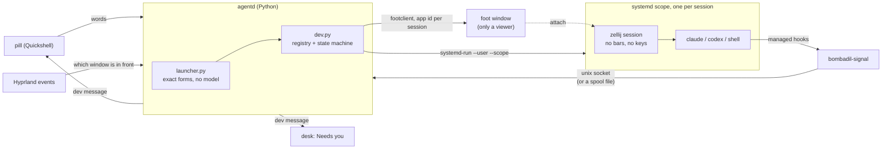

# Coding sessions

Bombadil does not replace the tools people already code with. It keeps the vendors' own Claude Code
and Codex alive, brings them back by name, and shows on the bar which one is working, which one
waits for you and which one broke. This page says how that is built and how it feels, so you can
change it or build on it without losing what it stands for. The design it follows is
[`design/dev-brief.md`](design/dev-brief.md).

## Principles to keep

- **The real tool, unchanged.** `claude latchkey` starts the vendor's own TUI in the project. Nothing
  is wrapped in a Bombadil interface, nothing is re-skinned, and every key goes to the tool.
- **A window is a viewer, not a home.** Closing it never costs work. The session lives somewhere else
  and a new window attaches to it, mid-sentence.
- **Say it by name, never by path.** A session is a role on a project ("reviewer on Latchkey").
  Typing the name brings it back; nothing waits for the model.
- **Only what needs you shows.** One dot per session. One line in the pill when something waits.
  Nothing else on screen.
- **Hooks are read-only reporters.** They can never block, change or slow the tool they listen to.

## What it feels like

| You do | What happens |
| --- | --- |
| Tap Super, type `claude latchkey`, Enter | Claude Code opens in a large floating window, in `~/Projects/latchkey`. |
| Close the window | Only the viewer closes. The session keeps running. |
| Type `claude latchkey` again | A new window attaches to the same session, scrollback and half-typed sentence intact. |
| `claude latchkey reviewer` | A second, named session on the same repository, in a git worktree of its own. |
| `codex latchkey`, `shell latchkey` | The same, for Codex and for a plain shell. |
| `end reviewer`, `end claude latchkey`, `end latchkey` | Ends that session (a project name alone ends its only session, or asks which). |
| `what's running?` | A plain list of every session in the details drawer. |

Beside the pill, each project gets a chip with one dot per session:

- a dot **moves** while its session works;
- it is **lit** when it is your turn (the session asked something, or finished while you looked
  elsewhere);
- it is **red** when the turn failed or the tool died;
- it is **dim** when the session is asleep (after a reboot; resuming wakes it);
- a **ring** instead of a disc marks a session you started by hand in a terminal: Bombadil sees it
  through the same hooks but never wraps or restarts it.

Hover a dot to read the session's last few lines. Click it to bring the session forward. When a
session waits for you, the empty pill says so ("reviewer on Latchkey: run the migration?") and Tab
takes you there; with several waiting, Tab walks them, questions first, and ends on "Nothing needs
you." The session in front of you never announces itself. With more than three projects the chips
fold into one ("4 projects · 1 waiting").

## How it is built

**Hosting (`src/bombadil/dev.py`).** Each session is an invisible zellij session (configured by
`share/zellij/config.kdl`: no keys of its own, no frames, no serialization) inside its own systemd
user scope, grouped in a slice per project (`bombadil-dev-<project>.slice`). Scopes keep running when
agentd, the bar or the compositor restarts, and lingering for the user keeps them across logouts. A
background zellij session always starts with its tab and status bars, so they are closed once
loaded. A small wrapper (`bombadil dev run <key>`) runs the tool in the pane, reports how it exited
and ends the zellij session with it.

**Names and folders.** A session is `<project>/<role>`; the role defaults to the tool's name. The
first session on a repository works in the checkout, every further one in a git worktree under
`~/Projects/.work/<repo>/<role>`; shells always use the checkout and never take it from anyone.

**Resume.** Claude Code gets its conversation id up front (`--session-id`, named `<role> on
<Project>` with `-n`), so after a reboot the same name resumes with `--resume <id>`. Codex runs with
`--no-daemon` (the shared daemon would give every session one environment) and resumes by the id its
hooks report. Zellij's own serialization is off: resuming is each tool's job.

**Registry.** `~/.local/state/bombadil/dev/sessions.json`, written by agentd only. A session that
zellij no longer lists after a grace period is marked failed; zellij being unreachable is never taken
for "gone".

**Reporting (`bin/bombadil-signal`).** The tools' hooks run it with the event on stdin (Claude Code:
managed settings in `/etc/claude-code/managed-settings.d/50-bombadil.json`; Codex:
`/etc/codex/requirements.toml`, plus `notify` in `/etc/codex/config.toml`, the system layer under the
user's own file). It trims the event, writes it to agentd's socket and returns at once; with agentd
down it appends to `~/.local/state/bombadil/dev/signals.jsonl`, which agentd reads on start. It uses
only the standard library, never prints and never fails. Bombadil's own agent runs with
`BOMBADIL_OS=1`, which the script skips: managed hooks fire in its turns too, and those are not
coding sessions.

**State machine (`Dev.signal`).** Hook events move a session between `idle`, `working`, `asked`,
`done`, `failed`, `asleep` and `ended`: a prompt or a tool result means working; a permission request
or a question means asked; a stop means done (idle when you are already looking at it); a failure
means failed; the wrapper's `exit` ends or fails it. Whether a finished session counts as "your turn"
depends on whether its window was in front: agentd follows Hyprland's `activewindow` events, and
bringing a session back by name counts as looking at it.

**Windows.** A viewer is a `footclient` window on the shared foot server (a plain `foot` when no
server runs) with the app id `bombadil-session-<slug>`, attached to the session. A Hyprland window
rule floats it large and centred, clear of the pill. When one is already open, Hyprland is asked to
focus it instead of opening another. Without Hyprland (a test session) the viewer still opens, but
nothing can raise it.

**What the bar gets.** agentd broadcasts one `dev` message, `{sessions, front, attention, line}`,
whenever something changes, and sends it to each client that connects. `shell/DevState.qml` holds it
(grouping by project, the fold, Tab's walk), `shell/SessionChips.qml` draws the chips and dots,
`shell/SessionPeek.qml` the hover. The desk's Needs you card reads the same message, so two or more
waiting sessions also show there. The chips sit in a row above the pill's left end because the desk's
strips use the row beside the pill.

**Launcher.** `launcher.py` matches the exact forms (`claude|codex|shell <project> [role]`, project
and role names, `end <name>`, `what's running?`) before app names, so none of them waits for the
model. Project names come from the folders under `~/Projects`.

## Testing

- `tests/test_dev.py`: the launcher forms, checkout versus copy, bring back, end, restart and resume,
  the hook state machine, the line and the Tab walk, crash and resume, hand-started sessions and
  `bombadil-signal`, against a fake zellij.
- `tests/test_sessions_qml.py`: the bar's parts offscreen (PySide6, no compositor).
- `tests/desktop/run.sh` (section 10 of the driver): the real Quickshell, agentd, zellij, foot and
  Claude Code under a headless sway against a scripted API. A session starts, its dot moves and
  lights, Shift+Enter makes a new line, closing the window keeps the session, typing its name brings
  it back mid-sentence, a second session gets its own copy, a question lights its dot and becomes the
  pill's line, sessions outlive an agentd restart, and `end` ends one and keeps its copy.
- `bombadil-smoke` (the `dev-*` checks, run by `scripts/test-vm.sh`): what needs real Hyprland and
  systemd: the scope and slice, the viewer floating and large, closing it leaving the session
  running, lingering, and the focus events.

## Extending it

- **Another tool.** Add its name to `TOOLS`, its command line to the launch function in `dev.py`,
  and a hook or notify reporter that calls `bombadil-signal <tool>`; map its events onto the states
  in `Dev.signal`.
- **Another surface for the same facts.** Consume the `dev` message; do not poll zellij. The desk
  already does.
- **Not built yet.** A usage-limit meter, `claude agents --json` reconciliation, per-pane
  notifications for plain shells, and a full card for "what's running?" (a plain list for now).
