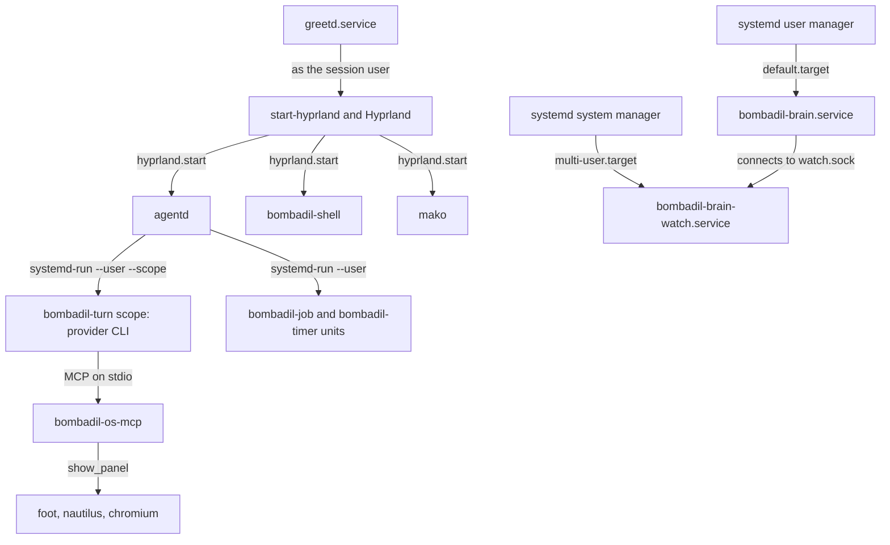

# Reference

This page lists the names Bombadil's code uses: commands, environment variables, files, sockets, units, configuration keys, tools, events, scripts and packages. Each name gets one line and a link to the page that owns the detail, so a name met in a log, a diff or a shell can be found here and followed. Names are spelled as the code spells them, and paths are relative to the repository root unless they start with `~`, `/` or `$`.

## Commands

Executables in `bin/` and in `iso/airootfs/usr/local/bin/`, then every subcommand of `bombadil` and `bombadil-app`. On the ISO the eight commands in `bin/` are linked into `/usr/local/bin` by `scripts/build-iso.sh`.

| Command | What it does | Detail in |
|---|---|---|
| `bin/agentd` | Starts the session daemon: reads the config, listens on the agentd socket and runs turns. Hyprland starts it at login. | [agentd](architecture/agentd.md) |
| `bin/bombadil` | The terminal client and manager (subcommands below). With no subcommand, or one it does not know, it prints its usage and exits 2. | [the terminal client](architecture/agentd.md#the-terminal-client) |
| `bin/bombadil-app` | Runs, checks and manages generated apps (subcommands below). | [app kit](architecture/app-kit.md) |
| `bin/bombadil-brain` | The user service that keeps `brain.db` and answers on `brain.sock`. It takes no arguments. | [brain](architecture/brain.md) |
| `bin/bombadil-brain-watch` | The root watcher: one fanotify mark on the btrfs filesystem, streamed to each user's brain on `watch.sock`. Needs root. Options: `--path`, `--socket`, `--state`, `--top`, `--spool-cap`, `--home UID:DIR`. | [brain](architecture/brain.md) |
| `bin/bombadil-browser URL...` | The system browser. Asks agentd to open each URL in the browser panel, and opens the panel itself when agentd does not answer. It is `$BROWSER` and the https handler. | [browser and sign-in](architecture/browser-and-signin.md) |
| `bin/bombadil-os-mcp` | The `bombadil-os` MCP server on standard input and output. Both provider CLIs start it. | [os-mcp](architecture/os-mcp.md) |
| `bin/bombadil-shell` | Starts Quickshell on `shell/shell.qml` with `share/qml` on `QML2_IMPORT_PATH`. | [the shell](architecture/shell.md#commands-keys-and-surfaces) |
| `bombadil-install DISK [--yes]` | Erases `DISK` and installs the running live system onto btrfs with the subvolumes `@`, `@home` and `@snapshots`. Without `--yes` it asks for the disk name. | [what the installer does](architecture/iso-and-install.md#what-bombadil-install-does) |
| `bombadil-rollback N` | Makes snapper snapshot `N` the root `@` from the next boot and keeps the old root as `@.undone-<time>`. Run through `sudo`. | [restore points](architecture/restore-points.md) |
| `bombadil-setup [--first-run]` | Terminal fallback to pick a provider and sign in. With `--first-run` it exits at once when `~/.config/bombadil/config.toml` exists. | [browser and sign-in](architecture/browser-and-signin.md#first-boot) |
| `bombadil-smoke` | The boot-time smoke test. `bombadil-smoke.service` runs it when the kernel command line has `bombadil.smoke`, `bombadil.smoke=install` or `bombadil.smoke=undo`. It prints `BOMBADIL-SMOKE:` lines and powers off. | [the smoke test](architecture/iso-and-install.md#the-smoke-test) |
| `bombadil ask TEXT` | Sends a prompt and prints the reply until `turn_end`. A launcher word prints its answer and exits. | [the terminal client](architecture/agentd.md#the-terminal-client) |
| `bombadil status` | Prints agentd's `status` message. | [the terminal client](architecture/agentd.md#the-terminal-client) |
| `bombadil stop` | Ends the running turn and everything it started. Returns at once, for key binds. | [the terminal client](architecture/agentd.md#the-terminal-client) |
| `bombadil pill` | Gives the pill the keyboard (sends `summon`). Hyprland runs it on a tap of Super and on Alt+Space. | [the shell](architecture/shell.md#commands-keys-and-surfaces) |
| `bombadil watch [--file F] [--follow]` | Every step, command and output of the last turn, or of the turn log `F`. `--follow` stays with a running turn. | [the details drawer](architecture/agentd.md#the-details-drawer) |
| `bombadil history` | Recent turns and launcher actions, newest last. | [the details drawer](architecture/agentd.md#the-details-drawer) |
| `bombadil view --file F` or `bombadil view -- CMD...` | Shows a file, or the output of a command, in a scrolling viewer. Esc closes it. | [the details drawer](architecture/agentd.md#the-details-drawer) |
| `bombadil undo` | Rolls the system back to the newest `turn:` restore point. Applies at the next boot. | [restore points](architecture/restore-points.md) |
| `bombadil provider claude` or `bombadil provider codex` | Switches provider and signs in. Writes the user config instead when agentd is not running. | [the terminal client](architecture/agentd.md#the-terminal-client) |
| `bombadil signin [claude or codex]` | Signs in again. The page opens in the browser panel. | [browser and sign-in](architecture/browser-and-signin.md) |
| `bombadil open URL` | Opens a link in the browser panel through `bombadil-browser`. | [browser and sign-in](architecture/browser-and-signin.md) |
| `bombadil brain [status]` | What the brain knows and whether it sees every save. | [brain](architecture/brain.md) |
| `bombadil brain why PATH` | Who made a file, and when. | [brain](architecture/brain.md) |
| `bombadil brain find WORDS` | Things whose names match. | [brain](architecture/brain.md) |
| `bombadil brain focus PATH` | Everything around one thing. The argument can also be a link or a key such as `turn:41` or `system`. | [brain](architecture/brain.md) |
| `bombadil brain rebuild` | Forgets the index and makes it again from the files and logs. `--json` on any `brain` command prints the whole answer. | [brain](architecture/brain.md) |
| `bombadil-app run NAME` | Opens an app as a native window that hot reloads on edit. | [app kit](architecture/app-kit.md) |
| `bombadil-app check TARGET [--screenshot PNG] [--wait MS] [--size WxH]` | Loads an app offscreen and reports errors as JSON. `TARGET` is an app name, an app folder or a `.qml` file. | [`bombadil-app check`](architecture/app-kit.md#bombadil-app-check) |
| `bombadil-app list` | Lists generated apps with `shown` or `running` where it applies. | [app kit](architecture/app-kit.md) |
| `bombadil-app create TITLE QML [--python F] [--description TEXT] [--icon NAME]` | Creates an app in the apps folder (`~/Apps`) from a QML file. | [app kit](architecture/app-kit.md#the-app-folder) |
| `bombadil-app show NAME`, `hide NAME`, `toggle NAME`, `close NAME` | Slides an app's window in or out, or quits it. `show` starts the app when it is not running. | [app kit](architecture/app-kit.md) |
| `bombadil-app status NAME` | Prints an app's last load result and log as JSON. | [app kit](architecture/app-kit.md) |
| launcher words | Words typed in the pill that agentd answers without the model, such as `undo`, `history` and `browser`. They are not executables. | [launcher words](architecture/agentd.md#launcher-words) |

## Environment variables

Every `BOMBADIL_*` name found by searching `src/`, `bin/`, `shell/`, `share/`, `iso/`, `scripts/`, `tests/`, `pyproject.toml` and `.claude/` is in the first group, 33 names. The second group is the other variables the code and the scripts read, or set for a child process. A row marked "tests only" is used only by the test suite, the test containers or the VM smoke test, and one marked "tooling" only by the build and VM scripts.

| Variable | Default | Effect | Detail in |
|---|---|---|---|
| `BOMBADIL_APPS` | `~/Apps` | The folder of generated apps (`paths.apps_dir`). | [agentd](architecture/agentd.md#environment-variables) |
| `BOMBADIL_BRAIN_DB` | `<state dir>/brain.db` | The brain's database file (`paths.brain_db`). | [brain](architecture/brain.md) |
| `BOMBADIL_BRAIN_SOCKET` | `<runtime dir>/brain.sock` | The brain's socket (`paths.brain_socket`). `share/apps/brain/app.py` reads it too. | [brain](architecture/brain.md) |
| `BOMBADIL_BUILD_IMAGE` | `archlinux:base` | The container image of `scripts/build-in-container.sh` and `tests/vm/btrfs-kernel.sh`. Tooling. | [the build](architecture/iso-and-install.md#the-build) |
| `BOMBADIL_CHECK` | unset | Set to `1` by `bombadil-app check` and removed by `run`, so `app.py` and the programs an app's commands start can tell a check from a run. `share/apps/brain/app.py` reads it. | [`bombadil-app check`](architecture/app-kit.md#bombadil-app-check) |
| `BOMBADIL_CHROMIUM_DIRS` | `$XDG_CONFIG_HOME/chromium` and `<config dir>/chromium` | Colon-separated Chromium profile folders whose `History` the brain reads. Tests set it too. | [brain](architecture/brain.md) |
| `BOMBADIL_CONFIG` | `$XDG_CONFIG_HOME/bombadil`, else `~/.config/bombadil` | The config folder (`paths.config_dir`). `shell/Wallpaper.qml` reads it for the `wallpaper` file. | [agentd](architecture/agentd.md#environment-variables) |
| `BOMBADIL_DATA` | `$XDG_DATA_HOME/bombadil`, else `~/.local/share/bombadil` | The data folder (`paths.data_dir`), which holds the browser profile. | [agentd](architecture/agentd.md#environment-variables) |
| `BOMBADIL_FAKE_PROVIDER` | `cat` | The program the `fake` provider runs. Read when `providers.py` is imported. Nothing in the tree sets it. | [agentd](architecture/agentd.md#environment-variables) |
| `BOMBADIL_FAKE_SIGNIN` | unset | `auto`, `manual`, `never` or `fail` makes the `fake` provider need a sign-in played by `src/bombadil/fake_signin.py`. Unset means signed in. Tests and the smoke test. | [browser and sign-in](architecture/browser-and-signin.md) |
| `BOMBADIL_FAKE_SIGNIN_HOST` | unset | `host:port` that the `fake` provider's reachability check uses, to play a sign-in server that cannot be reached. Tests and the smoke test. | [browser and sign-in](architecture/browser-and-signin.md) |
| `BOMBADIL_HOST_NET` | unset | Any value runs the build or test container with `--network host`. Tooling. | [development](contributing/development.md) |
| `BOMBADIL_INSTALL_CMDLINE` | unset | Extra kernel arguments that `bombadil-install` puts in front of the value of `GRUB_CMDLINE_LINUX_DEFAULT` on the installed system. `bombadil-smoke` and `scripts/wsl-vm.sh` set it. | [what the installer does](architecture/iso-and-install.md#what-bombadil-install-does) |
| `BOMBADIL_NO_CLIS` | unset | Any value makes `scripts/build-iso.sh` skip installing the provider CLIs into the image. Tooling. | [the build](architecture/iso-and-install.md#the-build) |
| `BOMBADIL_NO_SCOPE` | unset | `1` runs turns without a systemd scope (`procs.scope_supported`). | [agentd](architecture/agentd.md#environment-variables) |
| `BOMBADIL_PROVIDER` | the `provider` key, then `claude` | `claude`, `codex` or `fake`. Beats the config and counts as a chosen provider. `scripts/dev-session.sh` defaults it to `fake`. | [agentd](architecture/agentd.md#environment-variables) |
| `BOMBADIL_REDUCE_MOTION` | unset | `1` makes the stone pulse instead of roll (`shell/shell.qml`). | [the shell](architecture/shell.md#environment-variables) |
| `BOMBADIL_RUNTIME` | `$XDG_RUNTIME_DIR/bombadil` | The runtime folder (`paths.runtime_dir`). `share/apps/brain/app.py` reads it too. | [agentd](architecture/agentd.md#environment-variables) |
| `BOMBADIL_SCREENS` | unset | Tests only. A folder where the QML tests save a picture of each state. | [development](contributing/development.md#run-the-tests) |
| `BOMBADIL_SHARE` | `/usr/share/bombadil` | The installed tree, which holds `share/qml` and `share/skills`. `scripts/dev-session.sh` sets it to the checkout's `share` folder. | [agentd](architecture/agentd.md#environment-variables) |
| `BOMBADIL_SIGNIN` | unset | Set by agentd on the provider CLI it runs for a sign-in, to the sign-in's id. `bin/bombadil-browser` sends it with the URL. Not set by hand. | [browser and sign-in](architecture/browser-and-signin.md) |
| `BOMBADIL_SIGNIN_TIMEOUT` | `600` | Seconds a sign-in page may wait (`signin.py`). The smoke test sets `20`. | [agentd](architecture/agentd.md#environment-variables) |
| `BOMBADIL_SMOKE_NO_POWEROFF` | unset | Any value stops `bombadil-smoke` powering off or rebooting at the end. `scripts/vm-tools/vmsmoke` sets it. | [the smoke test](architecture/iso-and-install.md#the-smoke-test) |
| `BOMBADIL_SOCKET` | `<runtime dir>/agentd.sock` | The agentd socket (`paths.socket_path`). The shell and the Brain app read it. agentd sets it for each turn's process. | [the socket](architecture/agentd.md#the-socket) |
| `BOMBADIL_STATE` | `$XDG_STATE_HOME/bombadil`, else `~/.local/state/bombadil` | The state folder (`paths.state_dir`). | [agentd](architecture/agentd.md#environment-variables) |
| `BOMBADIL_TREE` | `/root/Bombadil` | The checkout the VM tools and `scripts/wsl-vm.sh` work from. Tooling. | [the VM tools](contributing/development.md#the-vm-tools) |
| `BOMBADIL_TURN` | unset | Set by agentd for each turn to the turn number. The `desk` and `job` tools read it and refuse without it. | [os-mcp](architecture/os-mcp.md#environment) |
| `BOMBADIL_TURN_SNAPSHOT` | unset | Set by agentd when a turn took a restore point. `rollback` and `bombadil undo` skip that restore point and newer ones. | [os-mcp](architecture/os-mcp.md#environment) |
| `BOMBADIL_WATCHER_CMD` | `python -m bombadil.brain.watch` | Tests only. The command the brain's end-to-end test starts as the watcher. | [brain](architecture/brain.md) |
| `BOMBADIL_WATCH_PATH` | unset | Default of the watcher's `--path`: watch the filesystem that holds this folder and treat it as the home root. Development without btrfs. | [brain](architecture/brain.md) |
| `BOMBADIL_WATCH_SOCKET` | `/run/bombadil-brain/watch.sock` | The watcher's socket: its `--socket` default, and where the brain connects. | [brain](architecture/brain.md) |
| `BOMBADIL_WATCH_STATE` | `/var/lib/bombadil-brain` | Default of the watcher's `--state`. | [brain](architecture/brain.md) |
| `BOMBADIL_YES` | unset | `1` lets `scripts/wsl-vm.sh reinstall` skip its question. `--yes` sets it. Tooling. | [the Windows launcher](architecture/iso-and-install.md#the-windows-launcher) |
| `XDG_RUNTIME_DIR` | `/run/user/<uid>` | Base of the runtime folder and of Hyprland's socket path. | [os-mcp](architecture/os-mcp.md#environment) |
| `XDG_STATE_HOME` | `~/.local/state` | Base of the state folder. | [os-mcp](architecture/os-mcp.md#environment) |
| `XDG_CONFIG_HOME` | `~/.config` | Base of the config folder. Also read by the brain's Chromium reader and by `shell/Wallpaper.qml`. | [os-mcp](architecture/os-mcp.md#environment) |
| `XDG_DATA_HOME` | `~/.local/share` | Base of the data folder. `apps.create` also writes launcher entries under it, without looking at `BOMBADIL_DATA`. | [app kit](architecture/app-kit.md#where-state-lives) |
| `XDG_CACHE_HOME` | `~/.cache` | Base of the Brain app's PDF preview cache. | [brain](architecture/brain.md) |
| `HOME` | the account's home | Where `~` points. The `home` test fixture sets it. | [development](contributing/development.md#run-the-tests) |
| `HYPRLAND_INSTANCE_SIGNATURE` | set by Hyprland | Names Hyprland's socket folder (`hypr.py`). The shell reads it to know it runs under Hyprland. | [the shell](architecture/shell.md#environment-variables) |
| `WAYLAND_DISPLAY`, `DISPLAY`, `DBUS_SESSION_BUS_ADDRESS`, `XDG_SESSION_TYPE` | set by the session | Forwarded to the provider's MCP server through `MCP_ENV` in `providers.py`. | [os-mcp](architecture/os-mcp.md#environment) |
| `CLAUDE_CONFIG_DIR` | `~/.claude` | The folder of Claude Code's `.credentials.json`. | [agentd](architecture/agentd.md#environment-variables) |
| `CODEX_HOME` | `~/.codex` | The folder of Codex's `auth.json`. | [agentd](architecture/agentd.md#environment-variables) |
| `BROWSER` | `bin/bombadil-browser` | Set by agentd for each turn's process, and by `/etc/environment` on the ISO as `/usr/local/bin/bombadil-browser`. `fake_signin.py` runs it unless its mode is `manual`. | [browser and sign-in](architecture/browser-and-signin.md) |
| `CLAUDE_CODE_ENABLE_TODO_TOOLS` | unset | Set to `1` by the Claude adapter (`Claude.env`) for the CLI it runs, so the plan on the desk has a task list to follow. | [agentd](architecture/agentd.md) |
| `FAKE_SIGNIN_DELAY` | `2` | Seconds the fake sign-in page shows before it moves on. Tests and the smoke test. | [browser and sign-in](architecture/browser-and-signin.md) |
| `QT_QPA_PLATFORM`, `QT_QUICK_BACKEND` | `offscreen`, `software` | Set by `bombadil-app check` before Qt starts. The second is a default and is not overwritten. | [`bombadil-app check`](architecture/app-kit.md#bombadil-app-check) |
| `QT_QUICK_CONTROLS_STYLE` | `Bombadil.Style` | Default set by the app runtime before Qt starts. | [app kit](architecture/app-kit.md) |
| `QML2_IMPORT_PATH` | `share/qml` first | Set by `bin/bombadil-shell` and by `tests/conftest.py` so `import Bombadil` finds the kit. | [the shell](architecture/shell.md#environment-variables) |
| `TERM`, `COLUMNS`, `LINES` | `xterm-256color`, `1000`, `50` | Set by `signin.py` for the provider CLI's sign-in terminal, wide enough that the CLI does not wrap a sign-in URL. | [one sign-in](architecture/browser-and-signin.md#one-sign-in) |
| `LC_ALL`, `LANG`, `SYSTEMD_COLORS`, `NO_COLOR`, `TERM` | `C`, `C`, `0`, `1`, `dumb` | Set by `sysmap.py` for the commands it runs to draw a picture, so their output is plain text. | [what `system_map` captures](architecture/cards-and-pictures.md#what-system_map-captures) |
| `ANTHROPIC_BASE_URL`, `ANTHROPIC_API_KEY` | unset | Read by the Claude CLI, not by Bombadil. `tests/desktop/bin/claude` points them at the scripted API on `127.0.0.1:18555`. Tests only. | [the desktop test](contributing/development.md#the-desktop-test) |
| `DISABLE_TELEMETRY`, `CLAUDE_CODE_DISABLE_NONESSENTIAL_TRAFFIC`, `DISABLE_AUTOUPDATER` | unset | Set to `1` by `tests/desktop/bin/claude` for the Claude CLI under test. Tests only. | [the desktop test](contributing/development.md#the-desktop-test) |
| `WLR_BACKENDS`, `WLR_RENDERER`, `WLR_LIBINPUT_NO_DEVICES`, `WLR_HEADLESS_OUTPUTS`, `LANG` | `headless`, `pixman`, `1`, `1`, `C.UTF-8` | Set by `tests/desktop/driver.py` for headless sway. It also sets `XDG_RUNTIME_DIR`, `BOMBADIL_PROVIDER`, `BOMBADIL_SHARE`, `QT_QUICK_BACKEND` and `PATH`. Tests only. | [the desktop test](contributing/development.md#the-desktop-test) |
| `SHOT_WAIT`, `KEYS_WAIT` | `8`, `8` | Seconds `bombadil-smoke` waits after asking the host for a screenshot or key presses. | [the smoke test](architecture/iso-and-install.md#the-smoke-test) |
| `SOURCE_DATE_EPOCH` | the last commit time in `scripts/build-in-container.sh`, else the current time | Time stamp of the image: `iso/profiledef.sh` builds the label and version from it. Tooling. | [the build](architecture/iso-and-install.md#the-build) |
| `WORK`, `OUT` | `/tmp/bombadil-work`, `out/` | Work folder and output folder of `scripts/build-iso.sh`. `tests/desktop/run.sh` also reads `OUT`, with the default `out/desktop`. Tooling. | [the build](architecture/iso-and-install.md#the-build) |
| `CONTAINER_RUNTIME`, `PACMAN_CACHE`, `SSL_CERT_FILE`, `HTTP_PROXY`, `HTTPS_PROXY`, `NO_PROXY` and their lower-case forms | unset | Container runtime, package cache and proxy settings, read by `scripts/build-in-container.sh` and in part by `tests/desktop/run.sh` and `tests/vm/btrfs-kernel.sh`. The build script also sets `SSL_CERT_FILE`, `CURL_CA_BUNDLE` and `NODE_EXTRA_CA_CERTS` inside the container. Tooling. | [the build](architecture/iso-and-install.md#the-build) |
| `MEM`, `SMP`, `RES`, `GL`, `SSH_PORT`, `FORCE` | `6G`, `4`, `1600x900`, `1`, `2222`, unset | Size, display, SSH port and the disk guard of `scripts/run-vm.sh`. `scripts/wsl-vm.sh` defaults `MEM` to `5G` and `GL` to `0`; `scripts/vm-tools/scratch-up` reads `MEM` (`3G`) and `SMP`, and `vmsmoke` reads `FORCE`. Tooling. | [running it in QEMU](architecture/iso-and-install.md#running-it-in-qemu) |
| `ISO`, `MODE`, `TIMEOUT`, `VNC`, `QEMU_CPU`, `MENU_DOWN` | newest ISO, `live`, `2400`, `127.0.0.1:99`, `Nehalem`, unset | Image, mode, time limit, VNC display, emulated CPU and boot-menu choice of `scripts/test-vm.sh`. `tests/vm/btrfs-kernel.sh` reads `TIMEOUT` (`900`) and `QEMU_CPU` too. Tooling. | [running it in QEMU](architecture/iso-and-install.md#running-it-in-qemu) |
| `VMDIR`, `VMFIFO`, `QMP`, `T`, `RAW`, `BASE`, `EVERY` | `$BOMBADIL_TREE/out/vm`, `/run/vmserial.in`, `$VMDIR/qmp.sock`, `60`, unset, `$BOMBADIL_TREE/out/bombadil.qcow2`, `10` | The VM files, the serial input pipe, the QMP socket, seconds to wait for output, raw typing, the disk `scratch-up` copies, and seconds between `vmwatch` screenshots. `scripts/vm-tools/*` only. | [the VM tools](contributing/development.md#the-vm-tools) |
| `CLAUDE_BIN`, `REBUILD`, `VERBOSE`, `DISK_SIZE` | `claude` on `PATH`, unset, unset, `8G` | The CLI `tests/desktop/run.sh` mounts, and the cache, output and disk size of `tests/vm/btrfs-kernel.sh`. Tests only. | [the desktop test](contributing/development.md#the-desktop-test) |

## Files and folders

Folders are named by the function that finds them. `<config dir>`, `<state dir>`, `<runtime dir>` and `<data dir>` are `paths.config_dir()`, `paths.state_dir()`, `paths.runtime_dir()` and `paths.data_dir()`; their defaults and overrides are in the environment variables table.

| Path | What it holds | Owner | Detail in |
|---|---|---|---|
| `/etc/bombadil/config.toml` | System defaults: `provider = "claude"` and `snapshots = true`. | Shipped by `iso/airootfs/etc/bombadil/config.toml`, read by `config.load` | [configuration](architecture/agentd.md#configuration) |
| `<config dir>/config.toml` | The user's choice. Its existence means a provider was chosen. | Written by `config.save_user` (agentd's `choose`, and `bombadil provider` without agentd) | [configuration](architecture/agentd.md#configuration) |
| `<config dir>/wallpaper` | Optional: the path of an image for the desk's ground. | The user. Seeded as a comment-only file from `/etc/skel`. Read by `shell/Wallpaper.qml`. | [the shell](architecture/shell.md) |
| `<config dir>/chromium` | A Chromium profile folder the brain reads for `History`. | Nothing in the tree writes it | [brain](architecture/brain.md) |
| `~/.config/hypr/hyprland.lua` | The session's Hyprland config. | Copied from `/etc/skel` | [the shell](architecture/shell.md#the-hyprland-config-the-iso-ships) |
| `~/.config/chromium-flags.conf` | Flags for a Chromium started outside the panel. | Copied from `/etc/skel` | [browser and sign-in](architecture/browser-and-signin.md#the-panel) |
| `<state dir>/turns.jsonl` | One row per turn, launcher action and sign-in. | agentd (`_log_line`). The brain reads it. | [the turn log](architecture/agentd.md#the-turn-log) |
| `<state dir>/turns/<unix ms>-<turn>.jsonl` | The events of one turn. | agentd. `bombadil watch` replays it. | [the turn log](architecture/agentd.md#the-turn-log) |
| `<state dir>/turn` | The number of the last turn begun. | agentd | [the turn log](architecture/agentd.md#the-turn-log) |
| `<state dir>/claude-mcp.json` | The MCP declaration passed to the Claude CLI with `--mcp-config`. | `providers.mcp_config`, at each Claude turn | [os-mcp](architecture/os-mcp.md) |
| `<state dir>/undo.json` | Marks an undo that a restart has not applied yet: `snapshot`, `what`, `boot`, `t`. | `launcher.py` | [restore points](architecture/restore-points.md#where-state-lives) |
| `<state dir>/desk.toml` | Which widget sits in which rail, and which are put away. | agentd (`desk.py`) | [the desk](architecture/desk.md#where-state-lives) |
| `<state dir>/jobs/<id>.json`, `.log`, `.exit` | A job's record, its output and its exit status. | `jobs.py`; the job's own wrapper writes `.log` and `.exit` | [the jobs registry](architecture/desk.md#the-jobs-registry) |
| `<state dir>/apps/<name>.log`, `.log.1` | An app's log. | The running app, or `apps.run` | [app kit](architecture/app-kit.md#where-state-lives) |
| `<state dir>/apps/<name>.status.json` | An app's last load result. | The running app | [app kit](architecture/app-kit.md#where-state-lives) |
| `<state dir>/apps/<name>.window.json` | An app's saved window size. | The running app | [app kit](architecture/app-kit.md#where-state-lives) |
| `<state dir>/apps/<name>.lock` | Keeps a second `bombadil-app run` of the same app out. | The running app | [app kit](architecture/app-kit.md#where-state-lives) |
| `<state dir>/apps/<name>.check.png` | The picture from the last `check_app` or `create_app`. | `appkit/tools.py` | [app kit](architecture/app-kit.md#where-state-lives) |
| `<state dir>/apps/<name>/data/` | Saved state of a built-in app, whose own folder is read-only. | The Brain app | [app kit](architecture/app-kit.md#where-state-lives) |
| `<state dir>/brain.db`, `brain.db.broken` | The brain's SQLite index, and a damaged one set aside. | `bombadil-brain` | [brain](architecture/brain.md) |
| `<state dir>/dev/sessions.json` | The coding sessions' registry. The brain reads it. | Nothing in the tree writes it | [coding sessions](architecture/coding-sessions.md) |
| `<runtime dir>/agentd.sock` | The agentd socket. | agentd | [the socket](architecture/agentd.md#the-socket) |
| `<runtime dir>/brain.sock` | The brain's socket. | `bombadil-brain` | [brain](architecture/brain.md) |
| `<runtime dir>/app-placements.json`, `app-placements.lock` | Which drawer slot each open app took, and the lock around choosing it. | `hypr.py` | [app kit](architecture/app-kit.md) |
| `<runtime dir>/brain-tmp/` | Copies of Chromium's `History` and of PDFs, on a memory-backed folder. | The brain | [brain](architecture/brain.md) |
| `<data dir>/browser/` | The browser panel's Chromium profile. | Chromium, started by `browser.command()` | [browser and sign-in](architecture/browser-and-signin.md#where-state-lives) |
| `~/Apps/<name>/` | An app: `main.qml`, extra `.qml`, `.js`, `.mjs`, `.json`, `.txt` and `.svg` files, `app.py`, `app.toml`. | `apps.create`, or by hand | [the app folder](architecture/app-kit.md#the-app-folder) |
| `~/Apps/<name>/data/` | An app's saved state: `<store>.json` (default `state.json`), `<vault>.vault` (mode `0600`) and files a `TextFile` writes. | `Store`, `Vault`, `TextFile`; never `create` | [app kit](architecture/app-kit.md#where-state-lives) |
| `$XDG_DATA_HOME/applications/bombadil-app-<name>.desktop` | A launcher entry for an app. | `apps.create` | [app kit](architecture/app-kit.md#where-state-lives) |
| `$XDG_CACHE_HOME/bombadil/brain/<hash>.png` | First-page pictures of PDFs for the Brain app. | `share/apps/brain/app.py` | [brain](architecture/brain.md) |
| `$CLAUDE_CONFIG_DIR/.credentials.json`, `$CODEX_HOME/auth.json` | The providers' own logins. agentd looks only at when each last changed. | The provider CLIs | [browser and sign-in](architecture/browser-and-signin.md#where-state-lives) |
| `~/.bombadil/memory.md`, `~/.claude/CLAUDE.md`, `~/.codex/AGENTS.md` | Notes files the brain reads for facts. | Nothing in the tree writes them | [brain](architecture/brain.md) |
| `/var/log/pacman.log` | What was installed, upgraded and removed. The brain and the watcher read it. | pacman | [brain](architecture/brain.md) |
| `/run/bombadil-brain/watch.sock`, `/run/bombadil-brain/top` | The watcher's socket, and the private mount of the top-level btrfs subvolume. | `bombadil-brain-watch` | [brain](architecture/brain.md) |
| `/var/lib/bombadil-brain/spool/<uid>.jsonl`, `generations.json` | Events spooled for a user whose brain is not connected, and the remembered btrfs generations. | `bombadil-brain-watch` | [brain](architecture/brain.md) |
| `/usr/share/bombadil/` | The tree on the image: `bin`, `src`, `shell`, `share` and `packages.x86_64`. | `scripts/build-iso.sh` | [what the image contains](architecture/iso-and-install.md#what-the-image-contains) |
| `/usr/local/bin/<command>` | Links to the eight commands in `bin/`, beside the four ISO scripts, which are files. | `scripts/build-iso.sh` for the links, `iso/profiledef.sh` for the scripts' modes | [what the image contains](architecture/iso-and-install.md#what-the-image-contains) |
| `share/qml/Bombadil/` | The app kit, imported as `Bombadil`. | Shipped in the tree | [app kit](architecture/app-kit.md) |
| `share/skills/bombadil-apps/` | The skill `app_guide` returns: `SKILL.md`, `references/`, `examples/`. | Shipped in the tree | [app kit](architecture/app-kit.md) |
| `share/app-template/` | The starter `main.qml` and `app.py` `app_template` returns. | Shipped in the tree | [app kit](architecture/app-kit.md) |
| `share/apps/brain/` | The built-in Brain app. | Shipped in the tree | [brain](architecture/brain.md) |
| `share/wallpaper/bombadil.png` | The standard wallpaper. | `scripts/make-wallpaper.py` | [the shell](architecture/shell.md) |
| `share/grub/bombadil/` | A GRUB theme. No code in the tree installs it. | Shipped in the tree | [ISO and install](architecture/iso-and-install.md) |
| `/etc/snapper/configs/root` | Its existence is what makes restore points available. | `bombadil-install` (`snapper create-config /`) | [restore points](architecture/restore-points.md#where-state-lives) |
| `/.snapshots`, `@snapshots`, `@.undone-<time>` | The snapshot mount, its subvolume, and the root kept aside by an undo. | `bombadil-install`, snapper, `bombadil-rollback` | [restore points](architecture/restore-points.md#where-state-lives) |
| `/etc/sudoers.d/bombadil` | Passwordless `sudo` for `user`. | Shipped in the image | [ISO and install](architecture/iso-and-install.md) |
| `/etc/greetd/config.toml`, `/etc/chromium/policies/managed/bombadil.json`, `/etc/xdg/mimeapps.list`, `/etc/environment` | Login session, Chromium policy, link handlers and `BROWSER`. | Shipped in the image | [ISO and install](architecture/iso-and-install.md) |
| `/etc/default/grub.d/zz-bombadil-console.cfg` | The quiet console and its palette, appended to the kernel command line. | Shipped in the image; its numbers come from `scripts/console-palette.py` | [boot and wallpaper](design/boot-and-wallpaper.md) |
| `~/.fake-signin` | Marks the fake provider as signed in. Tests and the smoke test. | `src/bombadil/fake_signin.py` | [browser and sign-in](architecture/browser-and-signin.md) |
| `~/.bombadil-smoke-phase` | Which phase of the undo smoke run a reboot interrupted. Smoke test only. | `bombadil-smoke` | [the smoke test](architecture/iso-and-install.md#the-smoke-test) |
| `/tmp/smoke.<check>.log`, `/tmp/smoke.agentd.log`, `/tmp/smoke.png` | The output of each smoke check, of the restarted agentd, and the last screenshot. | `bombadil-smoke` | [the smoke test](architecture/iso-and-install.md#the-smoke-test) |
| `journalctl -t hyprland` | Hyprland's start-up output, kept off the console. | `iso/airootfs/etc/greetd/config.toml` (`systemd-cat -t hyprland`) | [the shell](architecture/shell.md#the-hyprland-config-the-iso-ships) |
| `out/` | Build and test outputs: `out/*.iso`, `out/vm`, `out/test`, `out/desktop`, `out/btrfs-vm`, `out/scratch`, `out/bombadil.qcow2`. | `scripts/*`, `tests/desktop/run.sh`, `tests/vm/btrfs-kernel.sh` | [development](contributing/development.md#map-of-the-repository) |

## Sockets, ports and units

| Name | Kind | Where or how it starts | Detail in |
|---|---|---|---|
| agentd socket | Unix socket, one JSON object per line | `$BOMBADIL_SOCKET`, else `<runtime dir>/agentd.sock`, which is `/run/user/<uid>/bombadil/agentd.sock` by default. agentd removes and recreates it at each start. | [the socket](architecture/agentd.md#the-socket) |
| brain socket | Unix socket, JSON lines of `{"id", "op", ...}` | `$BOMBADIL_BRAIN_SOCKET`, else `<runtime dir>/brain.sock`. Served by `bombadil-brain`. | [brain](architecture/brain.md) |
| watcher socket | Unix socket, JSON lines | `/run/bombadil-brain/watch.sock`. Served by `bombadil-brain-watch`; each user's brain connects. | [brain](architecture/brain.md) |
| Hyprland socket | Unix socket | `$XDG_RUNTIME_DIR/hypr/<signature>/.socket.sock`, used by `src/bombadil/hypr.py` | [os-mcp](architecture/os-mcp.md#environment) |
| browser debug port | TCP `127.0.0.1:9222`, the HTTP side of the DevTools protocol | Chromium, started by `browser.command()` with `--remote-debugging-port=9222`. The Chromium policy allows it (`RemoteDebuggingAllowed`). | [the panel](architecture/browser-and-signin.md#the-panel) |
| sign-in callback | TCP on `127.0.0.1`, a port the provider CLI picks | Opened by the provider CLI while it signs in. `fake_signin.py` binds port 0. | [browser and sign-in](architecture/browser-and-signin.md#one-sign-in) |
| `127.0.0.1:47811` | TCP, a stand-in server | Started by the smoke test's offline sign-in check. Tests only. | [the smoke test](architecture/iso-and-install.md#the-smoke-test) |
| QEMU window VM | Host `127.0.0.1:2222` to guest port 22; `out/vm/qmp.sock`, `out/vm/serial.sock`, `out/vm/serial.log` | `scripts/run-vm.sh` | [running it in QEMU](architecture/iso-and-install.md#running-it-in-qemu) |
| QEMU smoke VM | VNC display `127.0.0.1:99`; `out/test/<name>.qmp.sock`, `out/test/<name>.serial.sock` | `scripts/test-vm.sh` | [running it in QEMU](architecture/iso-and-install.md#running-it-in-qemu) |
| VM tool ports | `127.0.0.1:8765` serves the tarball of `update-in-place`; `scratch_api.py` takes its port as an argument (`18555` in its notes); a guest reaches the host as `10.0.2.2` | `scripts/vm-tools/*` | [the VM tools](contributing/development.md#the-vm-tools) |
| `greetd.service` | system unit | Boot. `display-manager.service` links to it on the image, and `bombadil-install` runs `systemctl enable greetd`. Runs `start-hyprland` as `user` on VT 1 through `systemd-cat -t hyprland`. | [boot flow](architecture/iso-and-install.md#boot-flow) |
| `NetworkManager.service` | system unit | `multi-user.target` on the image; `bombadil-install` enables it. | [boot flow](architecture/iso-and-install.md#boot-flow) |
| `bombadil-live.service` | system unit, image only | `multi-user.target`, before greetd. Creates the account `user` with no password. `bombadil-install` removes it. | [boot flow](architecture/iso-and-install.md#boot-flow) |
| `pacman-init.service` | system unit, image only | `multi-user.target`, before `bombadil-live.service`. Runs `pacman-key --init` and `--populate`. `bombadil-install` removes it. | [boot flow](architecture/iso-and-install.md#boot-flow) |
| `bombadil-smoke.service` | system unit | `graphical.target`, after greetd, and only when the kernel command line has `bombadil.smoke`. Runs `bombadil-smoke`. | [the smoke test](architecture/iso-and-install.md#the-smoke-test) |
| `bombadil-brain-watch.service` | system unit | `multi-user.target`, after `local-fs.target`. Runs `bombadil-brain-watch` as root with `PrivateMounts`, `RuntimeDirectory=bombadil-brain`, `StateDirectory=bombadil-brain` and `LimitNOFILE=65536`. Restarts on failure. | [brain](architecture/brain.md) |
| serial getty drop-in for `ttyS0` | system unit drop-in, image only | `autologin.conf` gives a root shell on the serial console. `bombadil-install` removes the drop-in folder. | [the smoke test](architecture/iso-and-install.md#the-smoke-test) |
| `systemd-firstboot.service` | system unit | Masked by a link to `/dev/null`. | [boot flow](architecture/iso-and-install.md#boot-flow) |
| `bombadil-brain.service` | user unit | The user manager's `default.target`. Runs `bombadil-brain` with `Nice=5`, restarts on failure and has no start limit. | [brain](architecture/brain.md) |
| `bombadil-turn-<agentd pid>-<turn>-<unix seconds>` | transient scope | agentd runs each turn's CLI through `systemd-run --user --scope` when `procs.scope_supported()` is true. | [agentd](architecture/agentd.md) |
| `bombadil-job-<id>` | transient user unit | The `job` tool, for a `job` or a `watch`, through `systemd-run --user`. | [the jobs registry](architecture/desk.md#the-jobs-registry) |
| `bombadil-timer-<id>` | transient user timer and service | The `job` tool with `seconds`. | [the jobs registry](architecture/desk.md#the-jobs-registry) |
| `bombadil-dev-<project>.slice` | slice the brain recognises | Nothing in the tree creates it. The brain names a coding session by it. | [coding sessions](architecture/coding-sessions.md) |
| `special:browser`, `special:terminal`, `special:files`, `special:details`, `special:app-<name>` | Hyprland special workspaces | The panels, the details drawer and one drawer per app. Window classes `bombadil-browser`, `bombadil-terminal`, `org.gnome.Nautilus`, `bombadil-details` and `bombadil-app-<name>` are matched by rules in `hyprland.lua` and `appkit/placement.py`. | [the shell](architecture/shell.md#commands-keys-and-surfaces) |

## Configuration keys

| File | Key | Values and default | Effect | Detail in |
|---|---|---|---|---|
| `config.toml` | `provider` | `claude` or `codex`; default `claude`. Any other value stops agentd at start. | Which provider CLI runs turns. | [configuration](architecture/agentd.md#configuration) |
| `config.toml` | `model` | a model name; default none | Passed to the CLI as `--model`. | [configuration](architecture/agentd.md#configuration) |
| `config.toml` | `snapshots` | `true` or `false`; default `true` | `false` turns restore points off. | [configuration](architecture/agentd.md#configuration) |
| `config.toml` | `explain` | `brief`, `normal` or `teach`; default `normal` | How much the pill shows without being asked. Any other value becomes `normal`. | [configuration](architecture/agentd.md#configuration) |
| `desk.toml` | `folded` | `true` or `false`; default `false` | Whether the desk is folded to strips. | [the desk](architecture/desk.md#where-state-lives) |
| `desk.toml` | `hidden` | a list of widget ids; default `["alive"]` | Widgets that are put away. `needs` cannot be. | [the desk](architecture/desk.md#where-state-lives) |
| `desk.toml` | `screen` | a string of up to 40 characters; default `""` | The output the desk sits on; empty is the shell's first screen. | [the desk](architecture/desk.md#where-state-lives) |
| `desk.toml` | `[rails]` | one key per widget id (`now`, `watching`, `alive`, `needs`, `away`, `machine`); `left` or `right` | Which rail each widget sits in. | [the desk](architecture/desk.md#where-state-lives) |
| `desk.toml` | `[order]` | `left` and `right`, each a list of widget ids | Each rail's order, nearest the pill first. | [the desk](architecture/desk.md#where-state-lives) |
| `app.toml` | `title` | a string; default the app's name | The app's title. | [the app folder](architecture/app-kit.md#the-app-folder) |
| `app.toml` | `description` | a string; default `""` | One line about the app. | [the app folder](architecture/app-kit.md#the-app-folder) |
| `app.toml` | `icon` | a kit icon name from `share/qml/Bombadil/icons`; default `""` | The icon of the app's chip and launcher entry. | [the app folder](architecture/app-kit.md#the-app-folder) |
| `wallpaper` | the last line that is not a comment | an absolute path, `~/` path or `file://` URL of an image | The desk's picture, dimmed. No such line means the standard picture. | [the shell](architecture/shell.md) |
| kernel command line | `bombadil.smoke` | absent, empty, `install` or `undo` | Runs the smoke test at boot in that mode. | [the smoke test](architecture/iso-and-install.md#the-smoke-test) |
| `iso/airootfs/etc/greetd/config.toml` | `[terminal] vt`; `[default_session]` and `[initial_session]` `command`, `user` | `1`; `start-hyprland` through `systemd-cat`, as `user` | Boots straight into the agent session. | [boot flow](architecture/iso-and-install.md#boot-flow) |
| `bombadil.json` (Chromium policy) | `DefaultBrowserSettingEnabled`, `PromotionsEnabled`, `DefaultSearchProviderEnabled`, `DefaultSearchProviderName`, `DefaultSearchProviderKeyword`, `DefaultSearchProviderSearchURL`, `DefaultSearchProviderSuggestURL`, `PasswordManagerEnabled`, `PasswordLeakDetectionEnabled`, `SigninInterceptionEnabled`, `ProfilePickerOnStartupAvailability`, `MetricsReportingEnabled`, `FeedbackSurveysEnabled`, `RemoteDebuggingAllowed` | the 14 values in `iso/airootfs/etc/chromium/policies/managed/bombadil.json` | Keeps the panel to the page, and allows the debugging port. | [the panel](architecture/browser-and-signin.md#the-panel) |
| `chromium-flags.conf` | `--no-first-run`, `--no-default-browser-check`, `--password-store=basic` | one flag per line | Flags for a Chromium started outside the panel. | [the panel](architecture/browser-and-signin.md#the-panel) |
| `mimeapps.list` | `x-scheme-handler/http`, `x-scheme-handler/https`, `text/html`, `application/xhtml+xml` | all `bombadil-browser.desktop` | Every link opens in the browser panel. | [browser and sign-in](architecture/browser-and-signin.md) |
| `/etc/environment` | `BROWSER` | `/usr/local/bin/bombadil-browser` | The link opener for every program. | [browser and sign-in](architecture/browser-and-signin.md) |
| `/etc/sudoers.d/bombadil` | one rule | `user ALL=(ALL) NOPASSWD: ALL` | Passwordless `sudo` for the agent's commands. | [ISO and install](architecture/iso-and-install.md) |
| `zz-bombadil-console.cfg` | `GRUB_CMDLINE_LINUX_DEFAULT` | the existing value plus `quiet loglevel=3 ... vt.default_red`, `vt.default_grn`, `vt.default_blu` | A quiet console in the desk's ground colour. | [boot and wallpaper](design/boot-and-wallpaper.md) |
| `iso/profiledef.sh` | `iso_name`, `iso_label`, `iso_publisher`, `iso_application`, `iso_version`, `install_dir`, `buildmodes`, `bootmodes`, `arch`, `pacman_conf`, `airootfs_image_type`, `airootfs_image_tool_options`, `file_permissions` | archiso profile values | What `mkarchiso` builds, and which files are executable. | [the build](architecture/iso-and-install.md#the-build) |
| `iso/pacman.conf` | `[options]` `HoldPkg`, `Architecture`, `CheckSpace`, `SigLevel`, `LocalFileSigLevel`; repositories `[core]` and `[extra]` | the values in the file | Packages for the image build. | [the build](architecture/iso-and-install.md#the-build) |
| `iso/efiboot/loader/` | `loader.conf` (`timeout`, `default`, `beep`) and `entries/01-bombadil.conf`, `02-bombadil-serial.conf`, `03-bombadil-install-test.conf` | `timeout 3`, `default 01-bombadil.conf`, `beep off` | The live image's boot menu. | [the boot menu](architecture/iso-and-install.md#the-boot-menu) |
| `pyproject.toml` | `[project]` `name`, `version`, `requires-python`, `dependencies`; `[project.optional-dependencies]` `apps`, `dev`; `[tool.pytest.ini_options]` `testpaths`, `pythonpath`; `[tool.ruff]` `line-length` | `bombadil`, `0.1.0`, `>=3.11`, none; `PySide6`; `pytest`, `pytest-asyncio`, `ruff`; `tests`, `src`; `110` | Python metadata, test discovery and the linter. | [development](contributing/development.md#run-the-tests) |
| `.claude/settings.json` | `permissions.allow` | a list of tool permission patterns | What a development session may run without asking. | [development](contributing/development.md) |

## Tools and events

| Name | Kind | One line | Detail in |
|---|---|---|---|
| `show_panel`, `hide_panel`, `screenshot`, `snapshot`, `list_snapshots`, `rollback`, `notify`, `desk`, `job`, `show_card`, `system_map`, `app_guide`, `create_app`, `check_app`, `open_app`, `show_app`, `hide_app`, `close_app`, `app_status`, `list_apps`, `app_template` | os-mcp tools (21), seen by the CLIs as `mcp__bombadil-os__<name>` | What the agent can do on the machine. The server's name is `bombadil-os`. | [the tool catalogue](architecture/os-mcp.md#the-tool-catalogue) |
| `status`, `thing`, `focus`, `children`, `why`, `search`, `recent`, `show`, `requested`, `describe`, `note`, `subscribe`, `rebuild` | brain socket ops (13) | The requests `brain.sock` answers. | [brain](architecture/brain.md) |
| `prompt` | client message | `text`, optional `asked_by`: a turn, or a launcher word. | [messages a client sends](architecture/agentd.md#messages-a-client-sends) |
| `stop`, `cancel` | client message | End the running turn and everything it started. | [messages a client sends](architecture/agentd.md#messages-a-client-sends) |
| `unqueue` | client message | Drop a waiting prompt by `turn`. | [messages a client sends](architecture/agentd.md#messages-a-client-sends) |
| `local` | client message | Run a launcher action by name, as the Undo button does. | [messages a client sends](architecture/agentd.md#messages-a-client-sends) |
| `details` | client message | Open a turn's log in the details drawer; again closes it. | [messages a client sends](architecture/agentd.md#messages-a-client-sends) |
| `close_details` | client message | Put the drawer away. | [messages a client sends](architecture/agentd.md#messages-a-client-sends) |
| `summon` | client message | Ask the bar to take the keyboard, with optional words for the pill. | [messages a client sends](architecture/agentd.md#messages-a-client-sends) |
| `open` | client message | Open what a picture's box names: `kind` is `path`, `unit`, `package`, `url` or `turn`. | [messages a client sends](architecture/agentd.md#messages-a-client-sends) |
| `card` | client message | A picture to draw; answered with `card_ack`. | [messages a client sends](architecture/agentd.md#messages-a-client-sends) |
| `desk` | client message | `op` is `get`, `fold`, `hide`, `show` or `move`. | [messages a client sends](architecture/agentd.md#messages-a-client-sends) |
| `desk-tool` | client message | The os-mcp `desk` tool's request; answered with `desk-result`. | [messages a client sends](architecture/agentd.md#messages-a-client-sends) |
| `jobs` | client message | `op` is `get`, `stop`, `dismiss` or `why`. | [messages a client sends](architecture/agentd.md#messages-a-client-sends) |
| `job-tool` | client message | The os-mcp `job` tool's request; answered with `job-result`. | [messages a client sends](architecture/agentd.md#messages-a-client-sends) |
| `status` | client message | Read agentd's status. | [messages a client sends](architecture/agentd.md#messages-a-client-sends) |
| `setup_action` | client message | A setup chip: `id` is `provider:<name>`, `signin`, `show`, `cancel` or `wifi`. | [messages a client sends](architecture/agentd.md#messages-a-client-sends) |
| `signin` | client message | Sign in, with an optional `provider`. | [messages a client sends](architecture/agentd.md#messages-a-client-sends) |
| `open_url` | client message | A link for the browser panel, with an optional sign-in `signin` id. | [messages a client sends](architecture/agentd.md#messages-a-client-sends) |
| `status` | agentd message | Busy, provider, setup, queue and turn counts. On connect and on every change. | [messages agentd sends](architecture/agentd.md#messages-agentd-sends) |
| `entries` | agentd message | The names the pill can complete and open. | [messages agentd sends](architecture/agentd.md#messages-agentd-sends) |
| `setup` | agentd message | Whether the machine can talk to its AI, with the line and chips for the pill. | [messages agentd sends](architecture/agentd.md#messages-agentd-sends) |
| `queued` | agentd message | The turn id given to the sender of a prompt. | [messages agentd sends](architecture/agentd.md#messages-agentd-sends) |
| `local` | agentd message | The sender's prompt was a launcher word. | [messages agentd sends](architecture/agentd.md#messages-agentd-sends) |
| `event` | agentd message | A turn event, with a `kind` (below). | [messages agentd sends](architecture/agentd.md#messages-agentd-sends) |
| `summon` | agentd message | Broadcast after a `summon`. | [messages agentd sends](architecture/agentd.md#messages-agentd-sends) |
| `desk` | agentd message | The desk's state: `folded`, `hidden`, `rails`, `order`, `screen`. | [messages agentd sends](architecture/agentd.md#messages-agentd-sends) |
| `desk-result` | agentd message | The answer to a `desk-tool`, to its sender. | [messages agentd sends](architecture/agentd.md#messages-agentd-sends) |
| `job-result` | agentd message | The answer to a `job-tool`, to its sender. | [messages agentd sends](architecture/agentd.md#messages-agentd-sends) |
| `jobs` | agentd message | The jobs table, on request and on change. | [messages agentd sends](architecture/agentd.md#messages-agentd-sends) |
| `card_ack` | agentd message | The answer to a `card`: `shown`, and `errors` when it was refused. | [messages agentd sends](architecture/agentd.md#messages-agentd-sends) |
| `queued` | event | A prompt waits behind a turn, another prompt or a sign-in. | [events](architecture/agentd.md#events-the-shell-can-receive) |
| `unqueued` | event | A waiting prompt was removed. | [events](architecture/agentd.md#events-the-shell-can-receive) |
| `turn_start` | event | A turn begins. | [events](architecture/agentd.md#events-the-shell-can-receive) |
| `status` | event | The live line above the pill. | [events](architecture/agentd.md#events-the-shell-can-receive) |
| `snapshot` | event | The restore point was saved. | [events](architecture/agentd.md#events-the-shell-can-receive) |
| `text` | event | A complete message from the model. | [events](architecture/agentd.md#events-the-shell-can-receive) |
| `tool` | event | A tool call, as the CLI names it. | [events](architecture/agentd.md#events-the-shell-can-receive) |
| `tool_result` | event | A tool finished; `output` is cut at 16,000 characters. | [events](architecture/agentd.md#events-the-shell-can-receive) |
| `file_change` | event | Codex edited files. | [events](architecture/agentd.md#events-the-shell-can-receive) |
| `output` | event | One line of a `!` command's output. | [events](architecture/agentd.md#events-the-shell-can-receive) |
| `plan` | event | The agent's step list, the whole table on every change. | [events](architecture/agentd.md#events-the-shell-can-receive) |
| `card` | event | A picture to draw, partial or whole, or `{id, gone}` to take one back. | [events](architecture/agentd.md#events-the-shell-can-receive) |
| `result` | event | The provider finished. | [events](architecture/agentd.md#events-the-shell-can-receive) |
| `error` | event | A failure in plain words. | [events](architecture/agentd.md#events-the-shell-can-receive) |
| `turn_end` | event | The turn is over, with its summary and what it read. | [events](architecture/agentd.md#events-the-shell-can-receive) |
| `local` | event | A launcher word, a picture word or an ended job, answered without the model. | [events](architecture/agentd.md#events-the-shell-can-receive) |

## Scripts and tests

| Name | What it does | Detail in |
|---|---|---|
| `scripts/build-iso.sh` | Builds the ISO with `mkarchiso`: ships the tree at `/usr/share/bombadil`, links the commands, and installs the provider CLIs with npm unless `BOMBADIL_NO_CLIS` is set. | [the build](architecture/iso-and-install.md#the-build) |
| `scripts/build-in-container.sh` | Runs `build-iso.sh` in an `archlinux` container with Docker or Podman. | [the build](architecture/iso-and-install.md#the-build) |
| `scripts/run-vm.sh` | Boots the newest ISO, or with `--disk` an ISO and a blank disk, or with `--installed` the installed disk, in a QEMU window. | [running it in QEMU](architecture/iso-and-install.md#running-it-in-qemu) |
| `scripts/test-vm.sh` | Boots the newest ISO headless with a smoke entry and exits 0 when the smoke test reports no failure. `MODE=install` adds an install and an undo round trip. | [the ISO smoke](contributing/development.md#the-iso-smoke) |
| `scripts/wsl-vm.sh`, `scripts/bombadil-vm.cmd` | A VM window on Windows through WSL: no argument, `live`, `refresh`, `reinstall`, `build`, `stop`. | [the Windows launcher](architecture/iso-and-install.md#the-windows-launcher) |
| `scripts/dev-session.sh` | Runs agentd and the bar on an existing Hyprland desktop with `BOMBADIL_SHARE` at the checkout. | [a dev session](contributing/development.md#run-a-dev-session-against-a-checkout) |
| `scripts/console-palette.py [--table]` | Prints the console palette as the `vt.default_*` kernel parameters. | [boot and wallpaper](design/boot-and-wallpaper.md) |
| `scripts/make-wallpaper.py` | Draws `share/wallpaper/bombadil.png` from the design system's own tones. | [boot and wallpaper](design/boot-and-wallpaper.md) |
| `scripts/qmp.py` | A QMP client: `send-keys`, `screenshot`, `powerdown`. | [the VM tools](contributing/development.md#the-vm-tools) |
| `scripts/vm-tools/serialpump`, `vmlogin`, `vmsh`, `vmpy` | Keep the serial console flowing, log in on it, run a command or a Python script in the guest. | [the VM tools](contributing/development.md#the-vm-tools) |
| `scripts/vm-tools/vmin`, `vmlink`, `vmwatch`, `stonecrop`, `lifttrace` | Keys, clicks and screenshots over QMP; the network link; screenshots on change; frames of the stone; the card's edge over time. | [the VM tools](contributing/development.md#the-vm-tools) |
| `scripts/vm-tools/vmsmoke`, `probe`, `agentprobe.py` | Run the smoke test inside a running VM; send a prompt to agentd in the guest and print every event with its time; the script `probe` copies into the guest for that. | [the VM tools](contributing/development.md#the-vm-tools) |
| `scripts/vm-tools/update-in-place`, `scratch-up`, `with-scratch`, `scratch_api.py` | Move an installed VM to a git ref; boot a scratch copy of its disk; point any tool at it; a scripted Anthropic API for it. | [the VM tools](contributing/development.md#the-vm-tools) |
| `tests/test_agentd.py`, `test_agentd_signin.py`, `test_launcher.py`, `test_providers.py`, `test_procs.py`, `test_narrate.py`, `test_watch.py`, `test_pager.py`, `test_config.py` | agentd, its sign-in, the launcher words, the provider adapters, process stopping, the narration, `bombadil watch`, the viewer and the config. | [agentd tests](architecture/agentd.md) |
| `tests/test_mcp_server.py`, `test_cards.py`, `test_cardtools.py`, `test_sysmap.py`, `test_hypr.py`, `test_desk.py`, `test_jobs.py` | The os-mcp server, cards and pictures, `system_map`, the Hyprland client, the desk and the jobs registry. | [os-mcp](architecture/os-mcp.md#the-tool-catalogue) |
| `tests/test_appkit_agent.py`, `test_appkit_kit.py`, `test_appkit_native.py`, `test_appkit_placement.py`, `test_appkit_reload.py`, `test_appkit_runtime.py`, `test_appkit_tools.py`, `test_apps.py` | The app kit, its native bindings, drawer placement, hot reload, the runtime, the app tools and the app folder. | [app kit](architecture/app-kit.md) |
| `tests/test_brain_app.py`, `test_brain_client.py`, `test_brain_core.py`, `test_brain_describe.py`, `test_brain_fanotify.py`, `test_brain_focus.py`, `test_brain_forks.py`, `test_brain_index.py`, `test_brain_service.py`, `test_brain_this.py`, `test_brain_watch.py`, `test_brain_witnesses.py` | The brain: its app, client, store and ingest, descriptions, the fanotify layer, focus, the fork tracker, the index, the service, "this", the watcher and the witnesses. | [brain](architecture/brain.md) |
| `tests/test_browser.py`, `test_signin.py` | The browser panel and the sign-in. | [browser and sign-in](architecture/browser-and-signin.md) |
| `tests/test_pill_qml.py`, `test_stone_qml.py`, `test_desk_qml.py`, `test_desk_cards_qml.py`, `test_diagram_qml.py` | The shell's QML, loaded without a compositor. `BOMBADIL_SCREENS` saves a picture of each state. | [the shell](architecture/shell.md) |
| `tests/test_theme.py`, `test_brand.py`, `test_wallpaper.py`, `test_boot_console.py`, `test_iso_profile.py` | The design tokens, the brand files, the wallpaper, the console palette and the ISO profile. | [ISO and install](architecture/iso-and-install.md) |
| `tests/conftest.py`, `tests/qml_theme.py` | The `home` fixture, which points every path at a temporary folder, and a reader for the kit's `Theme.qml`. | [development](contributing/development.md#run-the-tests) |
| `tests/qml/` | Four gallery files for `bombadil-app check`: `appwindow_demo.qml`, `charts_gallery.qml`, `components_gallery.qml`, `style_gallery.qml`. | [development](contributing/development.md#map-of-the-repository) |
| `tests/desktop/` | The end-to-end test: the bar, agentd and the real Claude CLI in headless sway in a container, against `fake_api.py`. Run with `tests/desktop/run.sh`. | [the desktop test](contributing/development.md#the-desktop-test) |
| `tests/vm/` | `btrfs-kernel.sh` boots Arch's kernel on the installed btrfs layout and runs a test folder; `btrfs-init.sh` is its init; `samples/brain-watch` and `samples/layout` are test folders. | [development](contributing/development.md#map-of-the-repository) |
| `pytest` | Runs `tests/` with `src` on the path: 48 files named `tests/test_*.py`. | [run the tests](contributing/development.md#run-the-tests) |

## Package lists

The list is `iso/packages.x86_64`: 49 packages. `scripts/build-iso.sh` copies it to `/usr/share/bombadil/packages.x86_64`. The provider CLIs `claude` and `codex` are not in it; the build installs them with npm.

| Purpose | Packages | Detail in |
|---|---|---|
| Kernel and base | `base`, `linux`, `linux-firmware`, `sudo`, `git`, `openssh` | [what the image contains](architecture/iso-and-install.md#what-the-image-contains) |
| Disks, snapshots and boot loader | `btrfs-progs`, `gptfdisk`, `dosfstools`, `snapper`, `grub`, `efibootmgr` | [what the image contains](architecture/iso-and-install.md#what-the-image-contains) |
| Network | `networkmanager` | [what the image contains](architecture/iso-and-install.md#what-the-image-contains) |
| Session and compositor | `hyprland`, `xdg-desktop-portal-hyprland`, `greetd`, `quickshell` | [what the image contains](architecture/iso-and-install.md#what-the-image-contains) |
| Qt and Python runtime | `qt6-wayland`, `qt6-declarative`, `qt6-5compat`, `pyside6`, `python-cryptography`, `python`, `python-pip` | [what the image contains](architecture/iso-and-install.md#what-the-image-contains) |
| Screen, clipboard and notifications | `grim`, `slurp`, `wl-clipboard`, `mako`, `libnotify` | [what the image contains](architecture/iso-and-install.md#what-the-image-contains) |
| Terminal, files and browser | `foot`, `nautilus`, `chromium` | [what the image contains](architecture/iso-and-install.md#what-the-image-contains) |
| Documents | `poppler` | [brain](architecture/brain.md) |
| Audio | `pipewire`, `pipewire-audio`, `pipewire-alsa`, `pipewire-pulse`, `wireplumber`, `alsa-utils`, `sof-firmware` | [what the image contains](architecture/iso-and-install.md#what-the-image-contains) |
| Fonts | `inter-font`, `noto-fonts`, `noto-fonts-emoji` | [what the image contains](architecture/iso-and-install.md#what-the-image-contains) |
| Agent CLI runtime | `nodejs`, `npm` | [what the image contains](architecture/iso-and-install.md#what-the-image-contains) |
| Live image and install tools | `arch-install-scripts`, `archinstall`, `mkinitcpio`, `mkinitcpio-archiso` | [what the image contains](architecture/iso-and-install.md#what-the-image-contains) |
