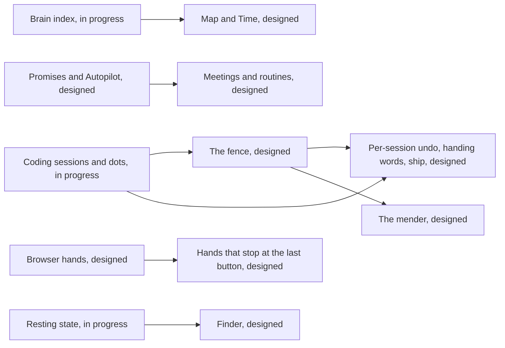

# Roadmap

> **Covers:** every piece named in the design briefs
> **Verified:** 2026-10-01 against `main` at `6150431` (the pin), the pull requests as of 03:20 UTC and the unmerged branches. `main` moved after the pin: [what merged since](#merged-after-the-pin) is listed below the tables, which stay as they were at the pin.

This page says how far each piece of Bombadil has got: what runs on `main`, what is being built on a branch or in an open draft pull request, and what the design briefs have decided without any code. It covers every piece the [design briefs](design/README.md) name, gives each its state as read from the code, names the pull requests that delivered the part that is on `main`, and repeats the order in which the briefs say to build what is still only designed. Pull request numbers and branch names belong on this page only; every other page describes the change, not its number.

The tables describe `main` at the pin, `6150431`, which was the head at 03:20 UTC on 2026-10-01. By 10:00 UTC the same day `main` was at `969b80b`, and four rows that sit under "In progress" below (the brain, the Machine card, Resting and mail) had merged. Read the tables with [Merged after the pin](#merged-after-the-pin) beside them.

## How to read it

The status words are the ones in [documenting your piece](contributing/documenting.md#the-shape-of-a-page).

| Word | Means |
|---|---|
| Shipped | on `main`, exercised by tests or a documented check |
| Partly shipped | some of the pieces the design names are on `main` |
| In progress | on a branch or an open pull request, not on `main` |
| Designed | a decided design with no code |
| Idea | proposed, not decided |

- **Three sections, one state per row.** A piece that is half built appears twice: what is built under "On main", and the rest under "In progress" or "Designed". Each row links its architecture page or its brief.
- **What "On main" rests on.** Each row was checked by finding the code on `main` at `6150431`. The whole suite (36 test files) passed on 2026-10-01 against `6150431` with PySide6 and `cryptography` installed: 1,531 passed, 2 skipped (the two wallpaper tests that need PIL). The headless desktop test and the VM smoke test need Docker or QEMU and were not run for this page.
- **What "In progress" rests on.** The branches were read, not run, apart from the tests the branch's own notes name. The heads read are listed under the table. Pull request states are those of 2026-10-01 at 03:20 UTC (pull requests 1 to 23); anything merged after that is not reflected in the tables, and [Merged after the pin](#merged-after-the-pin) lists it.
- **The briefs describe intent.** A brief's own text can describe the code as it stood on the day it was written. Where the two differ, this page and the [architecture pages](ARCHITECTURE.md) follow the code.

## On main

| Piece | What is there | Documented in | Pull requests |
|---|---|---|---|
| [Agent daemon and providers](architecture/agentd.md) (foundation choices 4 and 6) | `agentd` owns one conversation on a Unix socket and runs one headless CLI per turn: `claude -p` with `--permission-mode bypassPermissions`, or `codex exec` with `--dangerously-bypass-approvals-and-sandbox` (`PROVIDERS` in `src/bombadil/providers.py`). The provider is one line in `config.toml`. A restore point is taken before each turn, prompts typed during a turn wait as chips, and a signed-out login, no internet and an account limit each get one plain sentence. `bin/bombadil` talks to it: `ask`, `status`, `stop`, `pill`, `watch`, `history`, `view`, `undo`, `provider`, `signin`, `open`. | [agentd](architecture/agentd.md), [foundation choices](design/foundation-choices.md) | #1, #3, #8 |
| [The pill, the live line and the launcher](architecture/shell.md) (UX brief pieces 1 and 2) | The pill shows "On it" at once, and the line above it names each step in plain words with a seconds counter, amber and red edges that show the exact command, and Undo and Details buttons (`shell/PillState.qml`, `shell/StatusLine.qml`, `shell/QueueChips.qml`). The launcher answers exact words with no model (`CORE_COMMANDS`: `stop`, `undo`, `history`, `hide`, `desk`, `lock`, `restart`, `shutdown`; panel, app and widget names; `wifi`, `sound`, `brightness`, `battery`), and a line that starts with `!` runs a shell command. Stop ends the turn's whole process tree, `sudo` children included (`src/bombadil/procs.py`). `hyprland.lua` binds a Super tap and Alt+Space to the pill, Super+Escape to stop and Super+Ctrl+Escape to restart the bar. Details opens `bombadil watch` in a drawer. | [shell](architecture/shell.md), [agentd](architecture/agentd.md), [UX brief](design/ux-brief.md) | #3, #6, #7, #8 |
| [os-mcp](architecture/os-mcp.md) (foundation choice 6) | One hand-written MCP server with 21 tools: `show_panel`, `hide_panel`, `create_app`, `open_app`, `list_apps`, `app_template`, `app_guide`, `app_status`, `check_app`, `close_app`, `hide_app`, `show_app`, `screenshot`, `snapshot`, `list_snapshots`, `rollback`, `notify`, `desk`, `job`, `show_card`, `system_map`. Claude loads it with `--mcp-config` and `--strict-mcp-config`, Codex with `-c mcp_servers.bombadil-os.*`, so switching provider changes which CLI runs and not which tools exist. | [os-mcp](architecture/os-mcp.md) | #1, #2, #8, #9, #10 |
| [App kit and the apps skill](architecture/app-kit.md) (foundation choice 5, UX brief piece 3 in part) | An app is a folder in `~/Apps/<name>/` with `main.qml` and an optional `app.py`. `bombadil-app run` opens it as a native window in its own slide-in drawer and reloads it in place; a failed edit keeps the last good interface under a red banner; `create_app` returns the errors and a screenshot. The kit is `share/qml/Bombadil/` (35 `qmldir` entries: `AppWindow`, lists, charts, `Diagram`, `PasswordField`, `Theme`), with native bindings in `src/bombadil/appkit/native/` (`Agent`, `Vault`, files, processes, clipboard). The `bombadil-apps` skill, with two examples (`memory`, `password-manager`), is linked into both agent CLIs' skill folders in the image. | [app kit](architecture/app-kit.md), [UX brief](design/ux-brief.md) | #1, #2, #8 |
| [Sign in from the pill, and the browser panel](architecture/browser-and-signin.md) (UX brief piece 6 in part, foundation choice 7 in part) | With no provider signed in, the pill shows two chips, Claude and Codex. The CLI's own login runs in a pseudo-terminal and its page opens in the browser panel, Chromium with its own profile and debugging port 9222 (`src/bombadil/signin.py`, `src/bombadil/browser.py`). Setup states are `choose`, `checking`, `signed_out`, `offline`, `signing_in` and `ready`; `bombadil-browser.desktop` is the default web handler; the installer copies the sign-in into the installed home. The DevTools client lists, opens, raises and closes tabs: the agent cannot see or act in a page. | [browser and sign-in](architecture/browser-and-signin.md) | #5 |
| [Why lines, plans and pictures from the machine](architecture/cards-and-pictures.md) (passenger brief pieces 1 and 2, UX brief piece 5 in part) | Each step carries a reason, the sentence the agent wrote just before it, drawn on hover (`src/bombadil/narrate.py`, `shell/StatusLine.qml`); "why" during a turn is answered with no model. The machine draws pictures of itself with no model for exact words (`network`, `boot`, `disks`, `sound`, `screens`, and one service) from `src/bombadil/sysmap.py`, and the agent has `show_card` and `system_map`. `diagram` cards (shapes `chain`, `layers`, `compare`, `timeline`) are validated by `src/bombadil/cards.py`, followed while the agent writes them and drawn above the line by `shell/CardHost.qml` and `share/qml/Bombadil/Diagram.qml`. A before and after picture follows a turn that changed a part it touched, and a click on a box opens what it names (`bombadil view`). | [cards and pictures](architecture/cards-and-pictures.md), [passenger brief](design/passenger-brief.md) | #10, #21 |
| [The desk: rails, strips, Now, Watching and the Needs you card](architecture/desk.md) (widgets brief build-first pieces 1 and 2 in part) | Two rails of cards beside the pill and strips that fold them (`shell/DeskRails.qml`, `shell/DeskStrips.qml`), and three modes worked out from the windows on the stage (`open`, `shared`, `immersive`: `mode` in `shell/DeskState.qml`). Whether the desk is folded, which widgets are put away, and each widget's rail and order are kept in `desk.toml` (`src/bombadil/desk.py`). Faces exist for Now (the plan as a route), Watching (jobs) and Needs you (rows). The launcher knows `desk` and each widget's name; the `desk` tool takes `show`, `hide`, `move`, `fold`, `unfold` and `state`, and agentd lets it through only in a turn whose words asked for the desk. The stone knocks while a Needs you row exists. Nothing feeds Needs you on `main`: agentd has no `dev` message. | [desk](architecture/desk.md), [widgets brief](design/widgets-brief.md) | #9, #22 |
| [Background jobs and watchers](architecture/desk.md) (passenger brief piece 4, widgets brief Watching) | `src/bombadil/jobs.py` runs jobs, one-shot watchers and timers as transient `systemd-run --user` units (`bombadil-job-<id>`, `bombadil-timer-<id>`) with records in `~/.local/state/bombadil/jobs/`; the `job` tool starts, lists and stops them, Watching shows them as rows, and agentd says one line when one ends. They do not survive a reboot. | [desk](architecture/desk.md), [os-mcp](architecture/os-mcp.md) | #9 |
| [One set of design tokens](design-system/README.md) (identity brief piece 1) | `share/qml/Bombadil/Theme.qml` holds the colours, sizes and type; `shell/DeskTheme.js` repeats them for the desk. `tests/test_theme.py` fails on a colour literal in a shell file, a `Text` without `font.family`, and any difference between the two. Inter is installed (`iso/packages.x86_64`) and set explicitly. | [design system](design-system/README.md), [identity brief](design/identity-brief.md) | #17 |
| [The mark in the machine](design-system/README.md) (identity brief piece 2 in part) | The stone in the pill (`shell/Stone.qml`) with faces `starting`, `offline`, `needs`, `working`, `stopped`, `done`, `rest` and `listening`, and a still version for reduced motion. Installed icons in `iso/airootfs/usr/share/icons/hicolor/scalable/apps/` and `iso/airootfs/usr/share/pixmaps/`. The README opens with the lockup in `docs/brand/`, beside the avatar and the social preview. The GRUB theme files are in `share/grub/bombadil/`; nothing installs them. | [design system](design-system/README.md), [shell](architecture/shell.md), [identity brief](design/identity-brief.md) | #18 |
| [Boot and the wallpaper](design/boot-and-wallpaper.md) | The console between the boot loader and the desk is quiet and in the design system's ground colour (`iso/airootfs/etc/default/grub.d/zz-bombadil-console.cfg`, `iso/efiboot/loader/entries/01-bombadil.conf`, `scripts/console-palette.py`); `greetd` sends Hyprland's start-up text to the journal; Hyprland's ground colour is opaque; `shell/Wallpaper.qml` draws `share/wallpaper/bombadil.png`, made by `scripts/make-wallpaper.py`, or the picture named in `~/.config/bombadil/wallpaper`. | [boot and the wallpaper](design/boot-and-wallpaper.md) | #23 |
| [Restore points and undo](architecture/restore-points.md) (foundation choice 1 in part) | `bombadil-install` makes the root btrfs with `@`, `@home` and `@snapshots` and a snapper config `root`; `agentd` takes a restore point before every turn; undo (the word, the button, `bombadil undo`, the `rollback` tool) swaps the snapshot in under `@` with `bombadil-rollback` at the next boot. The live ISO has no restore points. Home is not covered, the kernel sits outside the root, and nothing prunes old points. | [restore points](architecture/restore-points.md), [known issues](known-issues.md) | #1, #3 |
| [ISO, installer and the VM smoke test](architecture/iso-and-install.md) (foundation choices 1 and 3 in part, the first milestone) | The `archiso` profile in `iso/`, built by `scripts/build-iso.sh` or `scripts/build-in-container.sh`; `scripts/run-vm.sh` boots it in QEMU; `scripts/test-vm.sh` runs `iso/airootfs/usr/local/bin/bombadil-smoke` headless in live and install modes. `bombadil-install` writes an unencrypted layout with the ESP at `/boot`, GRUB hidden unless Esc is held, autologin and the carried sign-in. Audio packages and an active pacman mirror are on the image. | [ISO and install](architecture/iso-and-install.md), [foundation choices](design/foundation-choices.md) | #1, #8 |
| [The VM test setup](contributing/development.md) | `scripts/wsl-vm.sh` builds, installs and boots Bombadil in a VM window (`live`, `reinstall`, `refresh`, `build`, `stop`); `refresh` keeps the disk after taking a `qemu-img` restore point and `reinstall` asks first. `scripts/vm-tools/` drives a running VM without a window (keys, a shell, smoke checks, in-place updates). `tests/desktop/` is the headless desktop test with a scripted API. | [development](contributing/development.md), [ISO and install](architecture/iso-and-install.md) | #3, #15, #19 |
| [Python and QML, no Rust](design/rust-question.md) | The tree has no `.rs` file and no `Cargo.toml`; the code is Python, QML, Bash and Lua. The brief's decision keeps it so until the brain's watcher or the compositor needs otherwise. | [Rust question](design/rust-question.md) | none |

How the briefs' pieces map to these rows:

- **Foundation choices.** Choice 1 (Arch, btrfs, snapper) is the restore points and ISO rows; 2 (Hyprland and Quickshell) the pill and desk rows; 3 (a VM first) the ISO and VM rows; 4 the agent daemon row; 5 the app kit row; 6 the os-mcp row; 7 (Chromium) the sign-in row. The first milestone (an image with Hyprland, a Quickshell bar, `agentd` with os-mcp and three demos) is pull request #1.
- **What each partly shipped row lacks** is in the Designed table: the rest of choices 1, 2, 3 and 7, and the rest of the UX, passenger, widgets and identity pieces.
- **Documents and small changes only.** Pull requests #11 and #20 added documents and no code. Pull request #13 added one line to `tests/test_agentd.py`. Pull request #19 tidied two Python files under `scripts/vm-tools/` for the linter and changed `scripts/vm-tools/update-in-place` (the icon folders go to the VM too, and new `bin/` launchers land on `PATH` on a `--no-system` update).

## In progress

Eight pieces of work were on branches that were not on `main` at the pin. Four had an open draft pull request (#4, #12, #14 and #16) and four had none. The rows are as they were at the pin: four of the eight (the brain, the Machine card, Resting and mail) have merged since, and [Merged after the pin](#merged-after-the-pin) says how.

| Piece | What exists so far | Where | What is left |
|---|---|---|---|
| [Coding sessions, the dots beside the pill and the feed for Needs you](architecture/coding-sessions.md) ([dev brief](design/dev-brief.md#1-a-session-outlives-its-window-and-comes-back-by-name) pieces 1 and 2, [widgets brief](design/widgets-brief.md#4-sessions-who-is-working) Sessions) | A registry of named sessions (`src/bombadil/dev.py`, `~/.local/state/bombadil/dev/sessions.json`). Each session runs in its own systemd scope under a per-project slice and wraps a `zellij` session; `foot` is only the viewer; resume is `claude --resume <id>` or `codex resume <id>`; a second session on a repository gets its own `git worktree`; states are `working`, `asked`, `done`, `failed` and `asleep`. Launcher words `claude <project> [role]`, `codex <project> [role]`, `shell <project> [role]`, `end <name>` and "what's running?". `bin/bombadil-signal` with managed hook files for Claude Code and Codex, `shell/DevState.qml`, `shell/SessionChips.qml`, `shell/SessionPeek.qml`, and the `dev` and `dev-signal` messages in `agentd`: the feed the Needs you card on `main` waits for. | Draft pull request #4, branch `claude/dev-sessions-gqk92e`. Tests `tests/test_dev.py`, `tests/test_sessions_qml.py`, steps in `tests/desktop/driver.py` and `bombadil-smoke`. Notes on the branch only: `docs/dev-sessions.md`. | A `tmux` fallback; `foot --server` as a socket-activated unit; reconciling states with `claude agents --json --all`; the usage meter and its limit line; `foot` desktop notifications and the bell fallback; "what's running?" as a card (it lists plain lines in the drawer); the machine-request stop in the Tab walk, which needs the fence (dev brief piece 3). Dev brief pieces 3 to 6 are designed. |
| [Bombadil's voice](architecture/voice.md) ([voice brief](design/voice-brief.md#1-bombadil-says-hello) piece 1 and 2a to 2d, 2f in part) | `src/bombadil/persona.py` (name and one of three voices in `~/.config/bombadil/persona.toml`), `src/bombadil/voice.py` (the daemon's side), `src/bombadil/greet.py` and `greet_sources.py` with the words in `share/voice/lines.toml`, the name and voice card `shell/PersonaCard.qml`, a welcome line mode in `shell/PillState.qml`, the launcher word `voice`, a plain narration step for persona edits, `turns.jsonl` rows that gain `made` and `changed` plus a boot row, a Quickshell `IdleMonitor` as the away signal, and the goodbye as the start text of shutdown. | Draft pull request #12, branch `claude/project-thread-7iz4pp`. Tests `tests/test_persona.py`, `test_voice*.py`, `test_greet*.py`, `test_persona_card_qml.py`, `test_welcome_qml.py`. Notes on the branch only: `docs/VOICE.md`. | The `ask` chip of the kit's `EmptyState` and the apps-skill sentence; wiring the shell-owned empty places (only history uses the words); fact sources for the jobs registry, promises and the machine's put-back records; the installer clock fix; whether Hyprland delivers idle events to `IdleMonitor` is an unchecked VM item. |
| Services that restart, pruned restore points and fixes from the VM ([vm-fixes](architecture/restore-points.md)) | User units with `Restart=always` for `agentd`, the shell and `mako` (`iso/airootfs/etc/systemd/user/bombadil-agentd.service`, `bombadil-shell.service`, a `mako` drop-in), started from `hyprland.lua` through `systemctl --user`. A CLI line `agentd` cannot read is skipped instead of ending the turn. Restore points are created with `--cleanup-algorithm number`, and the installer sets `NUMBER_LIMIT=30`, no hourly points and enables `snapper-cleanup.timer`. Turns run Sonnet by default, with `use opus` and `use sonnet`. Volume up, down, mute and unmute are launcher words. The installer takes the kernel from the system it copies. The browser panel no longer offers to restore pages after a kill. Serves the [dev brief](design/dev-brief.md#build-these-first) prerequisite, [Rust question](design/rust-question.md) problems 1 and 2, [installed OS](design/installed-os-brief.md#1-the-disk-that-lasts-layout-v1-and-a-refresh-that-keeps-your-home) pieces 1 and 4 in part ([installed OS architecture](architecture/installed-os.md)), and the UX brief's restart and clean-up items. | Draft pull request #14, branch `claude/vm-fixes`. Tests `tests/test_iso_profile.py`, `tests/test_agentd.py`, `tests/test_providers.py`, `tests/test_snapshots.py`. Notes on the branch only: `docs/SESSION-SERVICES.md`, `docs/VM-TESTING.md`. | The rescue page on tty2 and the panic key are on no branch. Retention is the latest 30 restore points where the installed-OS brief decides 100 changed pairs. No unit for `foot --server`. The rest of installed-OS piece 1: encryption and the ESP at `/efi`. |
| [The brain: a self-writing index and the Focus window](architecture/brain.md) ([brain brief](design/brain-brief.md#1-the-brain-writes-itself) pieces 1 and 2, the search half of 3) | `src/bombadil/brain/`: a root watcher with one fanotify mark on the btrfs filesystem and a `btrfs subvolume find-new` catch-up, who-did-it from the cgroup, a SQLite store in WAL mode with an FTS5 trigram table, witnesses (`turns.jsonl`, the browser's History, `pacman.log`, `memory.md`), `user.bombadil.made_by` and `user.bombadil.origin` on files, and the first index at idle I/O priority. `bin/bombadil-brain`, `bin/bombadil-brain-watch` and units under `iso/airootfs/etc/systemd/`. `share/apps/brain/` is the Focus window. The launcher answers "brain" and "why is this here?" from the index; `bombadil brain status`, `why`, `find`, `focus` and `rebuild`. It also builds two fixes from the [Rust question](design/rust-question.md): the watcher batches events by writer (`batch_line` in `src/bombadil/brain/watch.py`, problem 3), and the last-writers query names its index (`INDEXED BY events_thing_t` in `src/bombadil/brain/focus.py`, problem 6). | Draft pull request #16 at the pin (merged at 03:37 UTC, after it), branch `claude/brain-8d4ltb`. Tests `tests/test_brain_*.py`, `tests/vm/samples/brain-watch/`. Notes on the branch only: `docs/BRAIN.md`. | The coding-session witness (hooks and checkpoint refs), git history of `~/Apps` folders and the turn's snapper diff as sources; opening Focus from the "this" chip, the Map crumb, a Brain object in the app kit; Tab-accepted matches in the pill, search over extracted text and the kind-and-time grammar; the watcher still runs `btrfs subvolume find-new` on its only loop, its socket is `chmod 0o666` (`src/bombadil/brain/watch.py`), and its unit sets no `CapabilityBoundingSet`, `NoNewPrivileges` or `ProtectSystem` (the [Rust question](design/rust-question.md) problems 4 and 5). Brain pieces 4 to 6 are designed. |
| [The self-improvement loop](architecture/loop.md) ([self-improvement brief](design/self-improvement-brief.md#1-it-notices-the-ledger-the-counts-the-first-offers) pieces 1 and 2) | `src/bombadil/loop/`: ledger v2 rows, habit grouping, offers, words, a service and a store; `loop.db`; words from repeats matched last by the launcher; the "noticed" chip and card (`shell/LoopState.qml`, `NoticedChip.qml`, `NoticedCard.qml`) and the Noticed window (`share/apps/noticed/`); the read-only `asks` os-mcp tool. For piece 2, 23 probes in `src/bombadil/loop/probes.py`, findings, reports, `bin/bombadil-probe` with a user unit, `bombadil doctor --live`, and the bar's `hello`, `alive`, `focus_ack` and `friction` messages. `bombadil loop asks`, `status`, `replay`, `forget`, `report` and `probe`. | Branch `claude/self-improvement-iwrble`, no pull request. Tests `tests/test_loop_*.py`, `tests/test_noticed_app.py` on a golden corpus in `tests/fixtures/loop/`. Notes on the branch only: `docs/LOOP.md`, `docs/loop/`. | The 90% precision check of the grouping on real history (`bombadil loop replay`) is manual and no result is recorded; `agentd` and Quickshell as user units (in pull request #14); the sixth finding, Chromium's first-run dialog, is a report by design. Loop pieces 3 to 6 are designed. |
| [Mail](architecture/mail.md) ([everyday work brief](design/everyday-work-brief.md#1-mail-in-bombadils-own-view) piece 1, the mail half of the outbox) | `src/bombadil/mail/` (a service, store, drafts, text, accounts, a bridge, a fake engine and tools), `bin/bombadil-mail`, `src/bombadil/outbox.py` (the press registry, mail kind only), `src/bombadil/notices.py` (a stack of pill notices), five os-mcp tools (`mail_search`, `mail_read`, `mail_mark`, `mail_draft`, `mail_show`; there is no send tool), launcher words for mail, and a Thunderbird lab under `tests/mail/lab/`. | Branch `claude/work-mail-messages-6nicrf`, no pull request at the pin, commits titled "work in progress" (merged as #38 at 09:50 UTC, after it). Tests `tests/test_mail_*.py`, `tests/test_outbox.py`, `tests/test_notices.py`. Notes on the branch only: `docs/MAIL.md`. | The Mail window (`share/apps/mail`), the production add-on, the native-messaging host and the Thunderbird supervisor are on no branch; the shell draws no notices; Thunderbird is not in `iso/packages.x86_64`. |
| [Resting when the AI runs out](architecture/poor-man-switch.md) ([poor man switch brief](design/poor-man-switch-brief.md#1-resting-the-machine-knows-it-is-out-holds-your-asks-and-has-a-switch) piece 1) | `src/bombadil/rest.py` and a `resting` access state in `agentd`: a refused ask for a limit holds every ask as a chip labelled with the time, the state is kept per provider in `rest.json` in the state directory, and it lifts by itself at the reset on the wall clock. The words `pause claude`, `resume claude` and `pause the ai`; the AI card opened by a click on the stone (`shell/AiCard.qml`) with one switch per AI; a hollow stone while resting; buttons Resume, Try again and Raise the limit; an app's `Agent` object gains `note` and `ready`; `bombadil ask` exits 75 while the AI rests. | Branch `claude/poor-man-switch-8qxede`, no pull request at the pin, commits titled "work in progress" (merged as #32 at 04:38 UTC, after it). Tests `tests/test_rest.py`, `test_agentd_rest.py`, `test_limit.py`, `test_launcher_rest.py`, `test_rest_qml.py`, `test_bombadil_ask.py`. | The finder (piece 2) and everything after it. No "Use Codex until the reset" button (brief piece 4). Real-limit behaviour is unchecked on a VM. |
| [The Machine card](architecture/desk.md) ([widgets brief](design/widgets-brief.md#6-machine-is-the-machine-in-trouble) piece 6, Machine) | `src/bombadil/vitals.py`: a sampler of `/proc`, `/sys`, `statfs` and the user's cgroups with four lines (the coding sessions' memory ceiling, memory, the disk and heat), the sentence that says why the card is up, and the one `machine` message the shell draws. agentd's sampling loop and the `vitals` messages (`get`, and `open` for a click on the Disk row); `ASKABLE` in `src/bombadil/desk.py` and `WIDGET_QUESTIONS` in `src/bombadil/launcher.py`, so the words `show machine` and "how's the machine" raise the card for 30 seconds when nothing is wrong. The card itself in `shell/RowsCard.qml`, `shell/DeskRail.qml` and `machineModel` in `shell/DeskState.qml`, with a strip chip that shows the worst line (`memory 91%`). | Branch `claude/desk-next-jpf801`, head `479d412`, no pull request at the pin (merged as #31 at 04:30 UTC, after it). Tests `tests/test_vitals.py`, `tests/test_desk.py`, `tests/test_desk_qml.py`, `tests/test_desk_cards_qml.py`, `tests/test_agentd.py`, `tests/test_launcher.py`, steps in `tests/desktop/driver.py`. Notes on the branch only: the Machine card section of `docs/DESK.md`. | Nothing sets `MemoryHigh` or `MemoryMax` on the coding sessions' slice, so the sessions' ceiling line never fires. The readings are tested on fake cgroup trees and thermal files, not on hardware. The Disk row opens the disks picture because there is no space map. |

Heads read on 2026-10-01: `claude/dev-sessions-gqk92e` at `9e39370`, `claude/project-thread-7iz4pp` at `2ebcfb2`, `claude/vm-fixes` at `919a64e`, `claude/brain-8d4ltb` at `a9819f9` (its own work is as at `4f99869`; the later commits merge `main`), `claude/self-improvement-iwrble` at `f780509`, `claude/work-mail-messages-6nicrf` at `708d3b6`, `claude/poor-man-switch-8qxede` at `851133c`, `claude/desk-next-jpf801` at `479d412`. Only the branches for pull request #4, pull request #16 and `claude/desk-next-jpf801` contain `main` at `6150431`; the other five were cut from earlier commits of `main`, so a diff of one of them against `main` also shows what `main` gained since. All eight edit `src/bombadil/agentd.py` and `src/bombadil/launcher.py`.

Two more branches have no product code. `claude/blissful-ramanujan-5o1p2h` holds a research page on using the machine from another computer (`docs/REMOTE.md` on that branch, marked "nothing here is built yet") and tooling for writing briefs; it is an Idea, named in no brief. `claude/vm-tools-trace` holds tools for measuring the pill and the stone from outside the VM, appeared after the pull request list above was fetched, and merged as pull request #26.

## Designed

A decided design with no code. Where the briefs give an order, the last column repeats it. A piece that is also a row under "In progress" shows only what is not built.

Each arrow points from a piece to one that builds on it. Undo per session builds on the sessions and their hooks alone; handing words across and ship also need the fence (the `ask_machine` door and the push guard).

| Piece | Brief | Order and dependencies |
|---|---|---|
| The agents read the same brain: `brain_search`, `brain_focus`, `brain_why`, `brain_timeline` and `brain_recent` tools, a brain line in the `[Screen]` block and in a session's first context | [Brain, piece 4](design/brain-brief.md#4-the-agents-read-the-same-brain) | Fourth of six, after the index. The read-only copy for coding sessions is the `bombadil-dev` MCP server of dev piece 5. |
| The Map | [Brain, piece 5](design/brain-brief.md#5-the-map-the-whole-machine-holding-still-showing-what-is-alive) | Fifth. Needs the index to have collected weeks of history: "an empty brain draws an empty map". Opens from the Focus crumb, which the Focus work does not have yet. |
| Time: stretches of work and every version | [Brain, piece 6](design/brain-brief.md#6-time-the-week-as-stretches-of-work-and-every-version-one-drag-away) | Sixth and last. Folds in Rewind. Versions come from git for apps and projects and from `snapper` for home and `/etc` once home has its own config (see Home restore points). |
| Files through the Brain | [Brain, after the six](design/brain-brief.md#build-these-first) | After the six. Needs Focus on a folder to move, rename, copy, trash and take a drag; then "files" opens the Brain and the Files panel retires. |
| The fence: no `sudo`, an own copy and one door to the machine (`bombadil ask`) | [Dev, piece 3](design/dev-brief.md#3-the-fence-no-sudo-an-own-copy-and-one-door-to-the-machine) | Third. Needs sessions and hooks (pieces 1 and 2). It is what lets sessions run in parallel without breaking undo; the mender needs it too. |
| Undo per session (`bombadil-checkpoint`) | [Dev, piece 4](design/dev-brief.md#4-undo-per-session) | Fourth. Runs on the hooks of piece 2; needs no home snapper config. |
| Handing words across: `tell_session`, `start_session` and the rest, the `bombadil-dev` MCP server, the phone | [Dev, piece 5](design/dev-brief.md#5-handing-words-across-at-the-desk-and-from-the-phone) | Fifth. Uses the registry of piece 1 and the `ask_machine` door of piece 3. |
| Try it, read the change, ship it (`BOMBADIL_SHIP`, overlap marks, `clean up`) | [Dev, piece 6](design/dev-brief.md#6-try-it-read-the-change-ship-it) | Sixth. Overlap marks read the checkpoints of piece 4; shipping needs the push guard and the one git line of piece 3. |
| Messages and connections: `bombadil-connect`, a Slack internal app, the first half of `bombadil-browserd`, a `NotificationServer` in place of `mako`, `propose`, message and task cards | [Everyday work, piece 2](design/everyday-work-brief.md#2-messages-and-connections) | Second of the first three, after mail. Builds on the mail piece's outbox. The password and keyring choices belong to the installed-OS brief. |
| Today and meetings on time (`bombadil-calendar`, `calendar(from, to)`, the `today` word) | [Everyday work, piece 3](design/everyday-work-brief.md#3-today-and-meetings-on-time) | Third piece, fifth in the build order: after passenger piece 4, whose lasting watchers the meeting line needs. The welcome line's fact sources need `greet.py` from the voice work. |
| Hands that stop at the last button (`share/bombadil/leaving.toml`, the goes-out card) | [Everyday work, after these, 4](design/everyday-work-brief.md#after-these-in-order) | Sixth in the build order. Sits on the browser service of piece 2 and on passenger piece 3. |
| Notes (a leading `note:`) | [Everyday work, 5](design/everyday-work-brief.md#after-these-in-order) | After the first four; effort S. The Brain indexes the files. |
| Routines that prepare and wait | [Everyday work, 6](design/everyday-work-brief.md#after-these-in-order) | Needs passenger piece 4 and the desk's Away card, which has no feed. |
| Documents (Carlito and Caladea, `python-docx`, `openpyxl`, `pypdf`, poppler; pandoc and LibreOffice on first need) | [Everyday work, 7](design/everyday-work-brief.md#after-these-in-order) | After the first four; adds packages to the image. |
| Print and scan (cups, avahi, `sane-airscan`, tesseract as jobs) | [Everyday work, 8](design/everyday-work-brief.md#after-these-in-order) | After the first four; each package is installed on first need. |
| Fill and sign | [Everyday work, 9](design/everyday-work-brief.md#after-these-in-order) | A form is filled into a copy beside the original; Home restore points makes that a real Undo. |
| Home restore points | [Everyday work, 10](design/everyday-work-brief.md#after-these-in-order) | Decided in the first brief. The installer creates only the `root` snapper config. Brain Time and Fill and sign lean on it. |
| The disk that lasts: LUKS2 over btrfs, the ESP at `/efi`, subvolumes, and a refresh that keeps your home | [Installed OS, piece 1](design/installed-os-brief.md#1-the-disk-that-lasts-layout-v1-and-a-refresh-that-keeps-your-home); the thirteen installed-OS pieces in this group are worked through in [installed OS](architecture/installed-os.md) | First, with piece 2: the two things no later update can fix. Only the kernel-from-the-copied-root change is on a branch (pull request #14). Pieces 3, 8, 10 and 13 stand on it. |
| Bombadil as packages, with homes that follow its releases | [Installed OS, piece 2](design/installed-os-brief.md#2-bombadil-as-packages-with-homes-that-follow-its-releases) | First, with piece 1. The self-improvement loop's `VERSION` stamp comes from it. |
| The install card | [Installed OS, 3](design/installed-os-brief.md#after-these-in-order) | Third. Pieces 3 to 6 must all land before any public download; until then only the owner installs, through the terminal. Builds on `capture_disks` and `PasswordField`, which are on `main`. |
| Months, not minutes: 100 restore-point pairs, lock on lid close, a greetd password prompt, user services | [Installed OS, 4](design/installed-os-brief.md#after-these-in-order) | Fourth, in the same group. The restore-point and user-unit parts are in pull request #14 (30 points). |
| Hardware on the stick | [Installed OS, 5](design/installed-os-brief.md#after-these-in-order) | Fifth, in the same group. |
| The signed repository and the download page | [Installed OS, 6](design/installed-os-brief.md#after-these-in-order) | Sixth, in the same group; needs the packages of piece 2. |
| Updates as a turn | [Installed OS, 7](design/installed-os-brief.md#after-these-in-order) | Seventh. It is passenger piece 6; keyrings first, so it needs piece 6. |
| A start that fails puts itself back | [Installed OS, 8](design/installed-os-brief.md#after-these-in-order) | Eighth. Uses the ESP at `/efi` and `grubenv` from piece 1. |
| Next to Windows | [Installed OS, 9](design/installed-os-brief.md#after-these-in-order) | Ninth; its place in the order is a question the brief leaves to the owner. |
| Repair, reinstall and erase from the stick | [Installed OS, 10](design/installed-os-brief.md#after-these-in-order) | Tenth. Reinstall is piece 1's `--refresh`. |
| A copy somewhere else, and a move to another computer | [Installed OS, 11](design/installed-os-brief.md#after-these-in-order) | Eleventh; also passenger "A copy somewhere else". |
| Secure Boot and TPM | [Installed OS, 12](design/installed-os-brief.md#after-these-in-order) | Twelfth. Test with `swtpm` first. |
| A Bombadil you carry | [Installed OS, 13](design/installed-os-brief.md#after-these-in-order) | Thirteenth. Needs pieces 1 and 3; what is left is the card's wording and a smoke run. |
| The rest of why lines: the line's " · 2 of 4" and a reason under each stop of the Now route | [Passenger, piece 1](design/passenger-brief.md#1-why-and-after-reading-what) | Small. The rest of piece 1 is on `main`. |
| The rest of pictures: the boot timeline from `systemd-analyze plot`, btrfs subvolumes in the disks picture, the Teach level, before and after stored beside the turn's log | [Passenger, piece 2](design/passenger-brief.md#2-pictures-from-the-machine) | The rest of piece 2 is on `main`. Only the `diagram` card kind exists. |
| The machine's hands in the browser, and taking the wheel | [Passenger, piece 3](design/passenger-brief.md#3-the-machines-hands-in-the-browser-and-taking-the-wheel) | Third of six. The panel's own profile and debugging port are on `main`. Everyday work piece 4 extends it. |
| Promises that keep, and one Autopilot list | [Passenger, piece 4](design/passenger-brief.md#4-promises-that-keep-and-one-autopilot-list) | Fourth. Everyday work pieces 3 and 6 wait on it. The jobs registry on `main` is the precursor. |
| What it knows, and what it is holding (`remember`, `forget`, the holding card, the unfinished-things rows) | [Passenger, piece 5](design/passenger-brief.md#5-what-it-knows-and-what-it-is-holding) | Fifth. The brief's fuel ring is replaced by the warning line (poor man switch piece 3) and the card's number, as the [poor man switch brief](design/poor-man-switch-brief.md#extends-or-changes-the-earlier-briefs) says. Parsing `rate_limit_event` exists only on the self-improvement and poor-man-switch branches. |
| Updates you can watch | [Passenger, piece 6](design/passenger-brief.md#6-updates-you-can-watch) | Sixth; the same piece as installed-OS 7. |
| What broke it; a copy somewhere else; secrets stay out of sight | [Passenger, after the six](design/passenger-brief.md#build-these-first) | After the six. |
| One Claude process kept alive with `--input-format stream-json` | [UX, piece 1](design/ux-brief.md#1-you-can-see-what-it-is-doing-as-it-happens) | The second step of piece 1; `Claude.command` starts a CLI per turn. |
| "This" means what is in front of you: the chip and the `[Screen]` block | [UX, piece 4](design/ux-brief.md#4-this-means-what-is-in-front-of-you) | Fourth of six. No chip or `[Screen]` writer on `main`; the brain work has the part that works out what "this" is. |
| Apps in git, one commit per turn, undo for apps, "build the skeleton first" and "edit instead of resend" | [UX, piece 3](design/ux-brief.md#3-apps-change-in-front-of-you-and-undo-in-a-second) | The rest of piece 3. |
| Card kinds beyond the diagram (list, checklist, timer, control, markdown reader), sliders, the click on the clock, the reader from the right | [UX, piece 5](design/ux-brief.md#5-answers-you-can-touch) | The rest of piece 5; the `show_card` kind enum is only `diagram`. |
| First boot, the rest: Wi-Fi networks as chips with the password typed in the pill, the three example chips and day-one hint, a Codex device-code login | [UX, piece 6](design/ux-brief.md#6-first-boot-happens-in-the-pill) | The rest of piece 6. |
| An "Install on this computer" chip and the disk card | [UX, everything else: first boot](design/ux-brief.md#first-boot) | Owned by installed-OS piece 3. |
| A ten-second tour; built-in apps that can be changed (Rewind, System, Settings) | [UX, everything else: first minute](design/ux-brief.md#first-minute) | At the pin `share/` held no `apps` folder on `main`; the brain's Focus window is the first built-in app, and it merged after the pin as `share/apps/brain/`. |
| Drop or paste onto the pill; pointing at things; music controls by the clock; voice input (push to talk, local `whisper.cpp`) | [UX, everything else: ordinary asks](design/ux-brief.md#ordinary-asks) | No code for any of them. |
| The closing line as a receipt, the rest: Details as plain groups with diffs, a snapper pre and post pair per turn, the `/home` filters | [UX, everything else: ordinary asks](design/ux-brief.md#ordinary-asks) | Needs a home snapper config for the filters. |
| Watch the app build itself, a broken app mends itself, keep a card, apps that work with each other: the frame that rises at the tool call, the "Fixing" strip and one retry, a Fix button, pinning a card, D-Bus calls | [UX, everything else: something new](design/ux-brief.md#something-new) | The rest of the group; the building line that counts lines is on `main`. |
| One conversation and a memory you can read: `session_id` kept across restarts, `memory.md` linked as `CLAUDE.md` and `AGENTS.md` | [UX, everything else: a week later](design/ux-brief.md#a-week-later) | Nothing writes `memory.md` on any branch; the welcome-back line is in the voice work. |
| Rewind (Super+Z), every version of an app, "why is this like this", chips that learn your habits | [UX, everything else: a week later](design/ux-brief.md#a-week-later) | Rewind folds into Brain Time and "why is this like this" gets its screen from Focus; habit chips belong to the self-improvement loop. |
| Provider trouble, the rest: "Use Codex until then" with the reset time as a button, and an offline line | [UX, everything else: when it goes wrong](design/ux-brief.md#when-it-goes-wrong) | Poor man switch pieces 4 and 5 cover it (piece 1 supplies the resting path they use). |
| Live undo that covers your home folder; the machine puts back a change that cut it off (health-check revert) | [UX, everything else: when it goes wrong](design/ux-brief.md#when-it-goes-wrong) | Live undo needs a `/home` snapper config; the health check has no code. |
| Lifeboat: a rescue page on tty2 and a panic key | [UX, everything else: when it goes wrong](design/ux-brief.md#when-it-goes-wrong) | The restarting units are in pull request #14; the page is on no branch. |
| A bad boot rolls itself back | [UX, everything else: when it goes wrong](design/ux-brief.md#when-it-goes-wrong) | Installed-OS piece 8 gives the mechanism; the `grub-btrfs` idea is cut there. |
| The pill at rest, the rest: the shelf row, the focused-app chip, the hover X and drag strip | [UX, everything else: always on](design/ux-brief.md#always-on) | The input mask, capsule and per-app workspaces are on `main`. |
| Background jobs as chips left of the pill, and "what are you watching?" | [UX, everything else: always on](design/ux-brief.md#always-on) | Watching on `main` shows jobs; the word joins passenger piece 4's Autopilot list. |
| Windows that open fast (a spare `bombadil-app` process) | [UX, everything else: always on](design/ux-brief.md#always-on) | No code. |
| Empty places: the `ask` chip of `EmptyState` and the apps-skill sentence | [Voice, piece 2](design/voice-brief.md#2-what-it-knows-and-every-empty-place) | Follows the voice branch; effort is one property and one sentence. |
| The clock: the installer stops forcing UTC, `systemd-timesyncd` on, a "Set my time zone" chip | [Voice, piece 2](design/voice-brief.md#2-what-it-knows-and-every-empty-place) | The installed-OS brief builds the installer change in piece 1. |
| Away and Alive widgets | [Widgets, 5](design/widgets-brief.md#5-away-what-happened-while-i-was-gone) and [7](design/widgets-brief.md#7-alive-what-is-being-touched-right-now-opt-in) | Registered in `src/bombadil/desk.py` with no face and no feed. Away needs a feed from `turns.jsonl`, the restore points and the registries; Alive comes after brain piece 1. Machine, the third widget of that group, is in the In progress table. |
| Widgets the agent makes (`[widget]` in `app.toml`, `Widget.set`) and the rest of the desk: drag, hover peek, click to keep, face kinds `timeline`, `stat` and `text` | [Widgets](design/widgets-brief.md#widgets-the-agent-makes) | The `desk` tool has no `make` or `remove`. |
| `LOGO=bombadil` in `os-release`; the GRUB screen; the greeter and the lock as the pill; a separate colour drawing for 16 px | [Identity, piece 2](design/identity-brief.md#where-the-mark-goes) | The GRUB files exist but the installer copies none of them; the others need the installed-OS work. |
| A menu of old snapshots at boot; a boot on real hardware | [Foundation choices](design/foundation-choices.md) | Installed-OS piece 8 does the first for failed starts only. No boot on real hardware is recorded in the repository. |
| The room and the gate (`bombadil check`) | [Self-improvement, 3](design/self-improvement-brief.md#build-these-first) | Third. Useful at once to cloud fixes and the VM; starts with a spike on a second headless Hyprland. |
| The mender, generations and the guard | [Self-improvement, 4](design/self-improvement-brief.md#build-these-first) | Fourth. Needs the dev fence, out-of-sight sessions, the saved `session_id`, the `VERSION` stamp, a clone, `pytest` and `ruff` in the image, and the Lifeboat. |
| Growth: the `BombadilExtra` kit overlay and further forms | [Self-improvement, 5](design/self-improvement-brief.md#build-these-first) | Fifth; each form as its builder lands. |
| The desk face: a Noticed card in the right rail, the loop's Away row, `improve` rows in Time | [Self-improvement, 6](design/self-improvement-brief.md#build-these-first) | Sixth; needs the desk's Away and Brain Time. |
| The watcher not blocking its loop, and least privilege | [Rust question, problems 4 and 5](design/rust-question.md) | Both belong to the brain's watcher; no fix at the branch head. |
| A Rust brain watcher | [Rust question](design/rust-question.md) | Only if a big write lags the machine after the brain merges, or a Rust toolchain enters the build for the compositor. |
| The pill still answers: `src/bombadil/finder.py` and found chips | [Poor man switch, piece 2](design/poor-man-switch-brief.md#2-the-pill-still-answers-things-found-on-the-computer) | Second of two. Runs when an ask waits, so needs piece 1; the Brain's search and apps' `[[does]]` rows join later. |
| A warning before the wall | [Poor man switch, 3](design/poor-man-switch-brief.md#after-these-in-order) | Third. Reads `rate_limit_event` as the `meta` event. |
| The other AI, and the other model, until the reset | [Poor man switch, 4](design/poor-man-switch-brief.md#after-these-in-order) | Fourth. Needs the model setting and `use sonnet` from pull request #14. |
| Offline and outages take the same shape | [Poor man switch, 5](design/poor-man-switch-brief.md#after-these-in-order) | Fifth. Enters the resting path of piece 1. |
| Apps teach the pill: `[[does]]` rows | [Poor man switch, 6](design/poor-man-switch-brief.md#after-these-in-order) | Sixth; effort M, in the app kit. The finder matches them. |
| Things you made keep going with no turn: "Run again" and recipes | [Poor man switch, 7](design/poor-man-switch-brief.md#after-these-in-order) | Seventh. |
| A number for the card without a turn | [Poor man switch, 8](design/poor-man-switch-brief.md#after-these-in-order) | Eighth, after checking `claude -p "/usage"`. |
| `AskButton`: a kit button that asks the agent and, while the AI rests, shows "At 15:00", waits as a chip and gets its answer after the reset; with the apps skill's rule that a button that asks the agent is an `AskButton` | [Poor man switch, what keeps working](design/poor-man-switch-brief.md#what-keeps-working) | Owned by the app kit work (see [app kit](architecture/app-kit.md)); it needs the resting state of piece 1. No code on `main` or on any branch: `share/qml/Bombadil` has no `AskButton`. |

Ideas, not decided: a custom compositor in Rust (Smithay), "later" in [foundation choices](design/foundation-choices.md) and the [Rust question](design/rust-question.md), and using the machine from another computer (the research page on `claude/blissful-ramanujan-5o1p2h`).

## Considered and left out

Each brief ends its design with a "Cut, and why" section. These are the cuts that matter most to someone about to build.

| Left out | Reason | Where |
|---|---|---|
| A native chat window for coding agents | It would rebuild what the vendors improve every week, lose slash commands and plan mode, and sit next to Anthropic's policy on third-party use of the subscription login. The terminal wins. | [Dev brief](design/dev-brief.md#cut-and-why) |
| A sudo shim that runs a session's queued command on its own | Root work started by an agent, possibly a prompt-injected one, with no tap. | [Dev brief](design/dev-brief.md#cut-and-why) |
| A free-floating global graph, and "similar" links from embeddings | A hairball with no "where" or "when"; noise that looks like knowledge. | [Brain brief](design/brain-brief.md#cut-and-why) |
| A wiki or notes folder the agent keeps, and tags you maintain | Prose not pinned to its sources rots; tags are the same chore. | [Brain brief](design/brain-brief.md#cut-and-why) |
| Updates installed at night on their own | The machine would start work nobody asked for, and a background install beside a turn breaks "one turn, one restore point". Downloading at night is kept. | [Passenger brief](design/passenger-brief.md#cut-and-why) |
| A second model narrating the turn; pictures written by the model | Two narrators disagree, and a passenger cannot check a drawing. | [Passenger brief](design/passenger-brief.md#cut-and-why) |
| A small AI installed on every computer for when the plan runs out | Gigabytes and memory every day for a feature most days never use; the finder gives most of the benefit. | [Poor man switch brief](design/poor-man-switch-brief.md#cut-and-why) |
| A fuel ring, a token counter or a limit card on the desk | Internals on screen; "never a ring". | [Poor man switch brief](design/poor-man-switch-brief.md#cut-and-why), [widgets brief](design/widgets-brief.md#cut-and-why) |
| An app per service, a full Slack or Teams client, Bombadil's own Gmail apps | One view per kind; Google's review would cap the app at 100 users, and Thunderbird already holds the approvals. | [Everyday work brief](design/everyday-work-brief.md#cut-and-why) |
| An offer on the line, a popup or a dashboard of habits | Suggestions die from interruption; a gauge with nothing wrong is something the person feels they must maintain. | [Self-improvement brief](design/self-improvement-brief.md#cut-and-why) |
| The fixer editing its own tests, probes, gate, guard or budget; the machine pushing or merging | Agents game the checks they can touch; landing in the repository stays the person's word. | [Self-improvement brief](design/self-improvement-brief.md#cut-and-why) |
| A three-second countdown before one-way acts | A guard rail by another name; a red line and "can't be undone" are as honest. | [UX brief](design/ux-brief.md#cut-and-why) |
| Parallel helper agents | Two agents with `sudo` on one machine break one turn and one restore point. | [UX brief](design/ux-brief.md#cut-and-why) |
| A boot splash (Plymouth) | One more package and picture to keep in step; the quiet console in the ground colour does the job. | [Identity brief](design/identity-brief.md#cut-and-why), [boot and the wallpaper](design/boot-and-wallpaper.md) |
| A model-written greeting; voices the person writes | A model greeting breaks the 200 ms rule and fails offline; the local lines could not follow a custom voice. | [Voice brief](design/voice-brief.md#cut-and-why) |
| `archinstall`, Calamares, `grub-btrfs` snapshot entries, persistence on the live stick | The install would stop being the tested image; the overlay hook fails with the systemd initramfs; a persistent stick is a second Bombadil with no undo. | [Installed OS brief](design/installed-os-brief.md#cut-and-why) |
| A rewrite of the whole system in Rust | Every slow or fragile spot found was a design problem a rewrite would copy, and Bombadil mostly waits on the model. A Rust watcher or compositor can come later. | [Rust question](design/rust-question.md) |

## What to read before you pick something up

Read [the principles](principles.md) and run its checklist against the change, then read the brief that names the piece: its "Build these first" section says what comes before it and its "Cut, and why" section says what not to build. Check the piece's row on this page and its architecture page for what is on `main`, because a brief's own text can describe the code as it stood on the day it was written. If the piece is In progress, read its branch and open pull request before starting a second version: at the pin all eight unmerged branches edited `src/bombadil/agentd.py` and `src/bombadil/launcher.py`, and most also edited `shell/shell.qml` or `src/bombadil/providers.py`. [Known issues](known-issues.md) lists the defects that are still true on `main`. When a piece changes state, change its row here in the same pull request, as [documenting your piece](contributing/documenting.md) asks.
