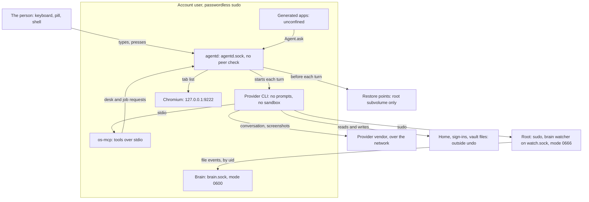

# Security model

> **Status:** Shipped
> **Code:** `src/bombadil/agentd.py`, `src/bombadil/providers.py`, `src/bombadil/mcp_server.py`, `src/bombadil/snapshots.py`, `src/bombadil/brain/watch.py`, `src/bombadil/brain/service.py`, `src/bombadil/appkit/native/vault.py`, `iso/airootfs/etc/sudoers.d/bombadil`, `iso/airootfs/usr/local/bin/bombadil-install`, `iso/airootfs/usr/local/bin/bombadil-rollback`
> **Design:** [Full access, with undo instead of guard rails](principles.md#full-access-with-undo)
> **Verified:** 2026-10-01 against `main` at `6150431`

Bombadil is built to protect one thing: the person's ability to see what the agent did and to take it back. It is not a sandbox. The agent runs as the account `user` with passwordless `sudo`, and each provider CLI starts in its no-prompt mode, so whatever that account or root can do, the agent can do. Nothing confines it. Several checks in the code (the desk gate, the job gate, the risk marks, the app check) keep a well-behaved agent tidy and do not stop a hijacked one. What stands in for guard rails is a restore point of the root filesystem before each turn, plain-words narration of each step, and a Stop that needs no model. This page lists where the code grants power, which doors are open, where secrets sit, what undo does not reach and what is intended but not enforced. The reasoning for the choice is in [the principle](principles.md#full-access-with-undo) and [foundation choices](design/foundation-choices.md); this page does not repeat it.

Where this page says "designed", a brief decides it and no code exists. Where it says "convention", the code says so itself or a reader can walk around it.

## What the agent can do

Everything in this table works without a prompt, from the first turn.

| Power | How the code grants it | Where |
|---|---|---|
| Run any command as the person | Claude Code starts with `--permission-mode bypassPermissions --dangerously-skip-permissions` and Codex with `--dangerously-bypass-approvals-and-sandbox`. A line that starts with `!` skips the model and runs as `sh -c` with the same rights. | `src/bombadil/providers.py:227`, `src/bombadil/providers.py:435-437`, `src/bombadil/agentd.py:1303` |
| Run any command as root | `user ALL=(ALL) NOPASSWD: ALL`, file mode 0440. The system prompt tells the agent it has passwordless `sudo`. `user` is in the groups `wheel,video,input,audio`. | `iso/airootfs/etc/sudoers.d/bombadil:2`, `iso/profiledef.sh:17`, `src/bombadil/providers.py:44-45`, `iso/airootfs/usr/local/bin/bombadil-install:53` |
| Type for the person | `agentd` accepts every message from anyone who can open its socket. A `prompt` becomes a turn, a `local` message runs undo, restart, shutdown, lock or stop, `open` opens a file or page, `card` draws a picture. A generated app does the same with `Agent.ask`, which sends the text prefixed `[from app NAME]`. | `src/bombadil/agentd.py:298-369`, `src/bombadil/agentd.py:1641-1646`, `src/bombadil/launcher.py:41-50`, `src/bombadil/appkit/native/agent.py:155-163` |
| Restart or power off | A `local` message with `restart` or `shutdown` runs `systemctl reboot` or `systemctl poweroff` with no question. | `src/bombadil/launcher.py:681-687` |
| Keep work running after the turn | The `job` tool starts a transient `systemd-run --user` unit (at most 20 running, with no time limit on a command; a timer waits at most 7 days) that Stop on the turn does not reach. The agent can start any other process or unit itself, and those are not rows on the desk. | `src/bombadil/mcp_server.py:150`, `src/bombadil/jobs.py:5-6`, `src/bombadil/jobs.py:43`, `src/bombadil/jobs.py:48`, `src/bombadil/jobs.py:168-177`, `src/bombadil/jobs.py:363-366` |
| Write and run programs | `create_app` writes `~/Apps/<name>/` with QML and optional Python and starts the app detached. The Python is run with `exec` inside the app process. | `src/bombadil/appkit/tools.py:167`, `src/bombadil/apps.py:176-188`, `src/bombadil/appkit/runtime.py:391` |
| See the screen | `screenshot` runs `grim` on the whole screen and returns the picture to the provider. | `src/bombadil/mcp_server.py:105-109`, `src/bombadil/hypr.py:220-224` |
| Open windows and pages | `show_panel` starts the browser, a terminal or the file manager. A link opens in the panel only when its scheme is `http`, `https` or `file`. | `src/bombadil/mcp_server.py:60`, `src/bombadil/hypr.py:21-25`, `src/bombadil/agentd.py:1117-1120` |
| Take, list and roll back restore points | The `snapshot`, `list_snapshots` and `rollback` tools call `sudo snapper` and `sudo bombadil-rollback`. With `sudo` the agent can also delete restore points, or write `snapshots = false` into a `config.toml`, which turns them off at the next start of `agentd`. | `src/bombadil/mcp_server.py:111-127`, `src/bombadil/snapshots.py:37`, `src/bombadil/snapshots.py:63`, `src/bombadil/config.py:38`, `src/bombadil/agentd.py:1771` |

### Checks that are conventions

These exist in the code. None of them is a boundary, and each says why.

| Check | What it does | Why it is not a wall | Where |
|---|---|---|---|
| Desk gate | The `desk` tool works only in the running turn and only when the person's own words ask for the desk. | The code calls it "a courtesy gate, not a security boundary": anyone who can type to the agent can say the words, and `Agent.ask` types for an app. | `src/bombadil/desk.py:67-75`, `src/bombadil/agentd.py:508-519` |
| Job gate | `job start` must come from the running turn, "so a stale process cannot start jobs". | The turn number is public: every `status` message carries it. Any socket client can send it back. | `src/bombadil/agentd.py:616-628`, `src/bombadil/agentd.py:379-385` |
| Risk marks | `narrate` marks a step "system" or "irreversible" and shows the exact command. | "Nothing here pauses or asks: the marks are only shown." | `src/bombadil/narrate.py:1-8` |
| App file rules | `create_app` accepts only kebab-case names and a short list of extra file types, and never writes under `data/` or to hidden files. | They stop mistakes. The agent has a shell and can write anywhere. | `src/bombadil/apps.py:25-27`, `src/bombadil/apps.py:77-87` |
| App check | `bombadil-app check` loads the app offscreen with `BOMBADIL_CHECK=1`. `Store`, `Vault` and `TextFile` do not write, window and agent calls do nothing. | `Command` still runs, "so the screenshot shows real data". The flag only tells `app.py` and `Command`. | `src/bombadil/appkit/check.py:1-12`, `src/bombadil/appkit/engine.py:27-33` |
| Tool limits | `os-mcp` has no tool that sends, posts, pays or pushes. | The agent has a shell and the network. See [Things that cross to other people](#things-that-cross-to-other-people). | `src/bombadil/mcp_server.py:60-150` |

## Trust boundaries

The kernel enforces one boundary here, between accounts, and the agent holds root through `sudo`. Inside the account every box runs as the same user, so the boxes are separated by convention, not by permission. Between the person and the account there is nothing: `greetd` logs `user` in on tty1 without a prompt, the account has an empty password, and no lock screen is installed. Bombadil's own code listens only on the Unix sockets in the next section and talks to one TCP port, Chromium's, on loopback. Whatever reaches the network does so through the provider CLIs, Chromium, `pacman`, `npm` or a command the agent runs.

## Who can reach what

| Interface | Reachable by | Protection | Where defined |
|---|---|---|---|
| `agentd` socket, `$XDG_RUNTIME_DIR/bombadil/agentd.sock` | Any process that can open the file: the agent, generated apps, the shell, `bombadil`, `bombadil-browser`, `bombadil-os-mcp`. | None in the protocol. No peer check and no mode is set, so the socket takes its mode from the process umask. The folder is made with the default mode. The only guard is `/run/user/<uid>`, which systemd-logind makes 0700; that is not in this repository and no test checks it. | `src/bombadil/agentd.py:244-251`, `src/bombadil/paths.py:18-23` |
| Brain socket, `$XDG_RUNTIME_DIR/bombadil/brain.sock` | Processes of the same user. | `chmod` to 0600 after the bind, so there is a short gap inside the runtime folder. The lock file is created 0600. | `src/bombadil/brain/service.py:362`, `src/bombadil/brain/service.py:370-377` |
| Watcher socket, `/run/bombadil-brain/watch.sock` | Every local user. The service runs as root. | Mode 0666. The watcher reads the peer's uid with `SO_PEERCRED` and sends each uid only the events under its own home plus `/etc` and `pacman.log`. Root gets everything. It reports names and who wrote them, never contents. The folder is 0755 and the spool folder 0700. | `src/bombadil/brain/watch.py:25-26`, `src/bombadil/brain/watch.py:966-968`, `src/bombadil/brain/watch.py:1058-1070`, `iso/airootfs/etc/systemd/system/bombadil-brain-watch.service:13-16` |
| Process-event socket (netlink `cn_proc`) | The root watcher only. | Opened by the root service to find the writer of a file. | `src/bombadil/brain/forks.py:150-155` |
| Chromium debugging port, `127.0.0.1:9222` | Any process on the machine, of any user. | Loopback only, no credential. The managed policy sets `RemoteDebuggingAllowed`. The panel's profile holds the person's web sign-ins. `agentd`, the sign-in flow and the brain all read tabs through it. | `src/bombadil/browser.py:28`, `src/bombadil/browser.py:41-47`, `iso/airootfs/etc/chromium/policies/managed/bombadil.json:15`, `src/bombadil/brain/this.py:31` |
| Sign-in callback, `localhost:1455` for Codex and a port the Claude CLI picks | Any local process while a sign-in is open. `agentd` ends a sign-in it started after 600 s; a CLI login run by hand waits without a limit. | Owned by the vendor CLI. `signin.py` reads the code from the tab's address through the debugging port and types it into the CLI's terminal. | `src/bombadil/providers.py:333`, `src/bombadil/providers.py:510`, `src/bombadil/signin.py:38`, `src/bombadil/signin.py:203-223`, `src/bombadil/signin.py:251-292` |
| `sudo` | Any process of `user`. | `NOPASSWD: ALL`, mode 0440. | `iso/airootfs/etc/sudoers.d/bombadil:2`, `iso/profiledef.sh:17` |
| Console and desktop login as `user` | Anyone at the keyboard. | `greetd` starts `user` in both its default and initial session with no greeter. `passwd -d user` leaves the password empty, and the VM tools log in on the serial console with an empty password. No lock screen: `lock` runs `hyprlock`, which the package list does not install. | `iso/airootfs/etc/greetd/config.toml:8-13`, `iso/airootfs/usr/local/bin/bombadil-install:55`, `iso/airootfs/etc/systemd/system/bombadil-live.service:7`, `scripts/vm-tools/README.md:11`, `src/bombadil/launcher.py:674-679` |
| Live ISO serial console, `ttyS0` | Whoever can open the machine's or VM's serial line. | A root shell with no password. The installer removes the drop-in. | `autologin.conf:5` in the `ttyS0` serial-getty drop-in folder under `iso/airootfs/etc/systemd/system/`, `iso/airootfs/usr/local/bin/bombadil-install:29` |
| Live ISO boot menu, entry 03 | Whoever selects it within the 3-second menu. | It erases `/dev/vda`, a virtio disk, and installs, with `--yes`. The default is entry 01. | `iso/efiboot/loader/entries/03-bombadil-install-test.conf:5`, `iso/airootfs/usr/local/bin/bombadil-smoke:304-305`, `iso/efiboot/loader/loader.conf:1-2` |
| Vault file, `~/Apps/<name>/data/<name>.vault` | Processes of the user. | Mode 0600, scrypt and AES-256-GCM. The key lives in the app's memory and the vault locks after 300 s. | `src/bombadil/appkit/native/vault.py:36`, `src/bombadil/appkit/native/vault.py:219`, `src/bombadil/appkit/native/vault.py:346` |
| Other state: `turns.jsonl`, `turns/`, `desk.toml`, `jobs/`, `brain.db`, app logs | Processes of the user, and others as far as the home folder's mode allows. | No mode is set. App logs are opened 0644. | `src/bombadil/agentd.py:1253`, `src/bombadil/agentd.py:1541-1548`, `src/bombadil/appkit/runtime.py:815`, `src/bombadil/paths.py:25-27`, `src/bombadil/paths.py:48-49`, `src/bombadil/paths.py:67-72` |
| `os-mcp`, over stdio | The CLI that started it. | A pipe. It reaches `agentd` over the socket above, naming its turn from `BOMBADIL_TURN`. | `src/bombadil/mcp_server.py:297-337`, `src/bombadil/agentd.py:1320-1321` |

The repository configures no firewall, and `iso/packages.x86_64` installs `openssh` but no unit enables an SSH server. Only `NetworkManager` and `greetd` are enabled on the installed system (`iso/airootfs/usr/local/bin/bombadil-install:56`).

## Secrets

| Secret | Where it lives | What protects it | Who can read it |
|---|---|---|---|
| The person's AI login | `~/.claude/.credentials.json` or `~/.codex/auth.json`, or under `CLAUDE_CONFIG_DIR` and `CODEX_HOME`. | The vendor CLI writes it. A code comment says Claude's is mode 0600; Bombadil does not set or check it. `agentd` reads only its modification time. | The agent, any generated app and anything else running as `user`. The installer copies it to the installed system. |
| Web sign-ins | The Chromium profile, `~/.local/share/bombadil/browser`. | `--password-store=basic` and a policy that turns the password manager off. | The agent and any process of the user, plus anything on the debugging port. The installer does not copy this profile. |
| A Vault's contents | `data/<name>.vault`, ciphertext. | scrypt (N 2^17) and AES-256-GCM. The key is held in memory for the life of the app process, and `check` never writes. | At rest on the disk, only ciphertext. Against the agent it does not hold: the agent writes the app that asks for the password, and as root it can read the process's memory. |
| What the brain keeps | `~/.local/state/bombadil/brain.db`: names of things, who made each file, page visits copied from Chromium's `History`, each turn's prompt and files. | Private paths (keys, keyrings, password stores, `.env`, anything named like a secret, `/etc/shadow`, `/etc/sudoers*`) are known by name only and never read. | Any process of the user. |
| What a turn left behind | `~/.local/state/bombadil/turns/<ms>-<n>.jsonl` and `turns.jsonl`: every event of the turn, including the exact commands. | Nothing. `agentd.py` and `watch.py` never delete them. | Anything the agent printed or typed is in there, and the person's home is outside undo. |
| The agent's environment | The full environment of `agentd` goes to each turn's process. | None. | The agent. A token exported into the desktop session is visible to it. |

On disk, everything except a Vault is plain. The installer sets up no disk encryption, so a stolen machine gives up the home folder, the sign-ins and the provider login. Disk encryption, one password and a recovery key are decided in the [installed OS brief](design/installed-os-brief.md#questions-only-you-can-answer) and have no code.

## What undo covers and does not

How the restore point is taken and applied is in [restore points](architecture/restore-points.md). This table says what it reaches.

| Thing | Covered | Why, and where |
|---|---|---|
| System files, packages, `/etc`, `/usr`, `/var` (the `@` subvolume) | Yes, from the next restart | `iso/airootfs/usr/local/bin/bombadil-install:18-20`, `iso/airootfs/usr/local/bin/bombadil-rollback:2-16` |
| The person's files, `~/Apps` and app data, `~/.claude`, `~/.codex`, the browser profile, turn logs, `brain.db` (`@home`) | No | `iso/airootfs/usr/local/bin/bombadil-install:18,22`. The answer to "undo" says "Your home folder and apps stay as they are" (`src/bombadil/launcher.py:522-523`), and `narrate` marks `rm` in the home folder irreversible for that reason (`src/bombadil/narrate.py:470`). |
| The kernel, initramfs and boot loader (`/boot`, the EFI partition) | No | After a kernel update and an undo, the older root can boot the newer kernel. `iso/airootfs/usr/local/bin/bombadil-install:34-36`, [known issues](known-issues.md#open). |
| The restore points | No | They sit on the same disk at `/.snapshots`. The agent can delete them with `sudo`, and nothing prunes them. `iso/airootfs/usr/local/bin/bombadil-install:41,85-86`, `src/bombadil/snapshots.py:43`. |
| Anything that left the machine | No | Mail, pushes, uploads and everything sent to the provider. |
| The live ISO | No restore points exist | `snapshots.available` needs a snapper config, which only an installed system has. `src/bombadil/snapshots.py:32-34`, `src/bombadil/launcher.py:491-494`. |
| A turn with `snapshots = false`, or without snapper | No restore point is taken | `src/bombadil/config.py:38`, `src/bombadil/agentd.py:1771`. |

Undo itself depends on parts the agent can change. It runs `sudo snapper` and `sudo bombadil-rollback` (`src/bombadil/snapshots.py:37`, `src/bombadil/snapshots.py:63`), and `sudo`, `snapper` and the script all sit in `@`. The swap happens at the next restart, so the agent keeps running on the old root until then. `bombadil-rollback` moves `@` aside as `@.undone-<time>` and only then creates `@` from the restore point, so a failure between the two leaves no `@` (`iso/airootfs/usr/local/bin/bombadil-rollback:14-15`). A start that fails does not put itself back: no boot-count, rescue or repair code exists, and a restore point is applied by running `bombadil-rollback` by hand. Putting a failed start back is designed in the [installed OS brief](design/installed-os-brief.md) and not built.

## Things that cross to other people

The rule is [only the person's press reaches people](principles.md#the-persons-press-reaches-people): the agent reads, drafts and points, and the person's own press releases. On `main` it is a rule, not a wall.

- **What the code does.** `os-mcp` registers no tool whose purpose is to send, post, share, pay or push (`src/bombadil/mcp_server.py:60-150`, `src/bombadil/appkit/tools.py:159-246`, `src/bombadil/cardtools.py:112-145`). `show_card` and `system_map` only draw. The `job` tool runs any shell command, which is the same power as the shell.
- **What the code does not do.** The agent has a shell, the network and `sudo`, so `curl`, `git push` or a mail client works. Nothing blocks them. The system prompt does not tell the agent to hold back either: it says "act, don't ask for permission" and has no line about sending (`src/bombadil/providers.py:33-55`). Narration marks risky commands and does not pause (`src/bombadil/narrate.py:8`).
- **What is designed, and not built.** An outbox the agent fills and only the shell's press releases, `agentd` accepting card presses only from the shell's own process, and a separate user for connector tokens. The [everyday work brief](design/everyday-work-brief.md) says "the press is a rule, not yet a wall"; [mail](architecture/mail.md) describes the part in progress.
- **What leaves the machine by design.** Each turn's conversation, tool results and screenshots go to the provider through its CLI. The brain's `describe` asks the provider's fast model for one sentence about a thing, and the prompt carries what the model is shown: the first 64 KB of a file, the first three pages of a PDF, the names in a folder, or a page's title and address. It does this only for a thing someone is looking at, and never for a private path (`src/bombadil/brain/describe.py:1-8`, `src/bombadil/brain/describe.py:36-47`, `src/bombadil/brain/describe.py:66-73`, `src/bombadil/brain/describe.py:249`).
- **Words from other people.** They are data, and the code keeps them from becoming instructions only where a model has no tools. The describer fences its input with a random marker and runs with `--tools ""`, `--strict-mcp-config` and `--safe-mode` under Claude (`src/bombadil/providers.py:321-328`, `src/bombadil/brain/describe.py:257-262`). For the two Brain words, the note the next turn receives names the action and leaves the Brain's answer out (`BRAIN_NOTES`, `src/bombadil/agentd.py:150`, `src/bombadil/agentd.py:702-703`). `--strict-mcp-config` keeps the account's connectors out of a turn (`src/bombadil/providers.py:231`). The turn itself reads pages and files with full access and no separation between data and instructions. A page that talks the agent round has everything in the first table.

## Known gaps

Each gap was checked in the code. A designed fix is named where one exists.

1. **No authentication on the `agentd` socket.** Anything that opens it can type for the person, restart or shut down the machine, and claim `asked_by`. Mode and peer check are missing (`src/bombadil/agentd.py:251`). No test asserts the mode of this socket, of `brain.sock`, of `watch.sock` or of the sudoers file.
2. **Passwordless `sudo`, an empty console password, autologin and no lock screen.** The [installed OS brief](design/installed-os-brief.md) names one password for the disk, the account, the lock screen and the consoles. It is designed, with no code.
3. **Undo can be switched off from inside.** Deleting restore points, editing the sudoers file or `bombadil-rollback`, or writing `snapshots = false` removes it (see the undo table).
4. **Home and `/boot` are outside undo.** The sign-ins, the vault files, `~/Apps` and the turn logs are in `@home`.
5. **The debugging port is open to every local process.** The profile it controls is the person's.
6. **Generated apps are unconfined.** `Command` runs `/bin/sh -c`, `TextFile` and `KitFiles` write any path the user can, and `Processes.kill` signals any process of the user (`src/bombadil/appkit/native/command.py:172-176`, `src/bombadil/appkit/native/files.py:136-144`, `src/bombadil/appkit/context.py:36-39`, `src/bombadil/appkit/native/processes.py:243-253`). `Agent.ask` types as the person (`src/bombadil/appkit/native/agent.py:155-163`). `Clipboard` clears a copied secret after a delay the app chooses, only if the app asks (`src/bombadil/appkit/native/clipboard.py:37-48`). The kit has no network component, and nothing stops an app's Python or a `Command` from using the network.
7. **The Vault protects a file, not a secret from the agent.** The agent writes the app that shows the unlock screen and holds root.
8. **The press rule is not enforced and is not in the system prompt.**
9. **The provider login travels with the install.** `bombadil-install` copies `.claude`, `.claude.json`, `.codex` and `.config/bombadil` to the installed home (`iso/airootfs/usr/local/bin/bombadil-install:73-77`).
10. **Live-only exposures.** The root serial shell and the boot entry that erases `/dev/vda` exist in the live image. The installer removes the first (`iso/airootfs/usr/local/bin/bombadil-install:29`). `scripts/run-vm.sh` refuses to attach a disk that already holds a system because of the second (`scripts/run-vm.sh:30-37`).
11. **The CLIs are not pinned.** `npm install -g` fetches the provider CLIs at image build time, with no version or hash, and `bombadil-setup` runs `sudo npm install -g` the same way when one is missing. Packages from pacman are signature-checked (`iso/pacman.conf:5`, `scripts/build-iso.sh:19-23`, `iso/airootfs/usr/local/bin/bombadil-setup:12-13`).
12. **The Codex describer has less than the Claude one.** Claude gets `--tools ""` and no connectors. Codex gets a read-only sandbox only (`src/bombadil/providers.py:502-508`), though the describer's docstring says "no tools and no MCP servers" (`src/bombadil/brain/describe.py:10-12`).
13. **The whole screen goes to the vendor.** `screenshot` captures every window, including a password the person has on screen. It leaves `screen.png` in a temporary folder that nothing in the code removes (`src/bombadil/mcp_server.py:105-109`).
14. **No firewall.** The repository sets none.

Designed and not built:

| Idea | Where it is decided |
|---|---|
| Disk encryption by default, one password, a recovery key, the lock screen, a rescue page that asks for the password | [Bombadil, installed](design/installed-os-brief.md#questions-only-you-can-answer) |
| A start that fails twice puts itself back | [Bombadil, installed](design/installed-os-brief.md) |
| Connector tokens under their own user, the browser held by one service, card presses accepted only from the shell | [Bombadil at work](design/everyday-work-brief.md) |

## If you fork it

Decide first whether you keep full access. If you do, add no confirm dialog for something undo can reverse; make it visible and undoable, as [the principle](principles.md#full-access-with-undo) says. If you narrow it, the places are the two flag sets in `src/bombadil/providers.py:227` and `src/bombadil/providers.py:435-437`, `iso/airootfs/etc/sudoers.d/bombadil`, the system prompt in `src/bombadil/providers.py:33-55`, and `tests/test_providers.py`. Nothing in Bombadil is built to ask, so narrowing means building that.

Before you hand an image to anyone else:

| Do this | Where |
|---|---|
| Set a password: drop `passwd -d user`, and stop `greetd` logging `user` in unasked or pair it with disk encryption. | `iso/airootfs/usr/local/bin/bombadil-install:55`, `iso/airootfs/etc/systemd/system/bombadil-live.service:7`, `iso/airootfs/etc/greetd/config.toml` |
| Install a lock screen. `lock` already runs `hyprlock` when it is present. | `iso/packages.x86_64`, `src/bombadil/launcher.py:674-679` |
| Give the `agentd` socket mode 0600 and check the peer, as the brain does. | `src/bombadil/agentd.py:251`, `src/bombadil/brain/service.py:376`, `src/bombadil/brain/watch.py:966` |
| Remove boot entries 02 and 03 and the serial autologin from the profile. | `iso/efiboot/loader/entries/`, the `ttyS0` serial-getty drop-in folder under `iso/airootfs/etc/systemd/system/` |
| Pin the provider CLI versions. | `scripts/build-iso.sh:19-23`, `iso/airootfs/usr/local/bin/bombadil-setup:12-13` |
| Make the home folder 0700 and set a session umask of 077. The installer sets neither. | `iso/airootfs/usr/local/bin/bombadil-install:53-54` |

When you add something:

- **A socket or a port.** Put it under `paths.runtime_dir()`, set its mode in the code, check `SO_PEERCRED` when others can open it, and add a test for the mode. No test of this kind exists for the sockets Bombadil has.
- **A tool in `os-mcp`.** It is power handed to a model that reads other people's words. Register it with `OsTools._tool` (`src/bombadil/mcp_server.py:47-56`). Give the agent a way to prepare, never a tool that releases, and put the press in the shell.
- **A binding in the app kit.** Assume the app is the agent: whatever it exposes runs with the user's rights. Make writes a no-op under `ctx.check`, as `Vault`, `TextFile` and `Clipboard` do.
- **A secret.** Write it with `atomic_write(..., mode=0o600)` (`src/bombadil/appkit/native/files.py:95-112`), keep it out of what a turn logs, and add its name to the private lists so the brain never reads it (`src/bombadil/brain/rules.py:39-46`).
- **Anything that puts outside text in front of a model.** Fence it with a random marker, as `describe` does, and run that model with no tools (`src/bombadil/brain/describe.py:257-262`).
