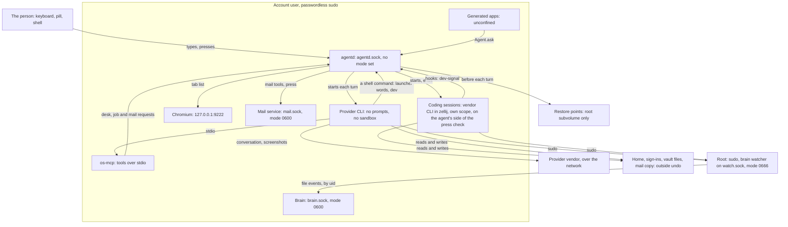
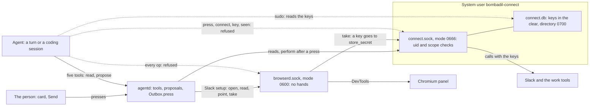
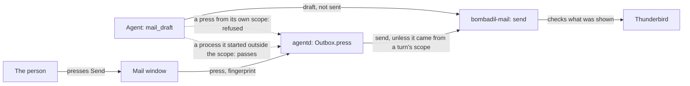

# Security model

> **Status:** Shipped
> **Code:** `src/bombadil/agentd.py`, `src/bombadil/providers.py`, `src/bombadil/mcp_server.py`, `src/bombadil/launcher.py`, `src/bombadil/snapshots.py`, `src/bombadil/outbox.py`, `src/bombadil/procs.py`, `src/bombadil/jobs.py`, `src/bombadil/desk.py`, `src/bombadil/dev.py`, `src/bombadil/away.py`, `src/bombadil/persona.py`, `src/bombadil/voice.py`, `src/bombadil/greet.py`, `src/bombadil/greet_sources.py`, `src/bombadil/tips.py`, `src/bombadil/narrate.py`, `bin/bombadil`, `bin/bombadil-signal`, `src/bombadil/mail/tools.py`, `src/bombadil/mail/service.py`, `src/bombadil/brain/watch.py`, `src/bombadil/brain/service.py`, `src/bombadil/brain/describe.py`, `src/bombadil/appkit/native/vault.py`, `src/bombadil/connect/service.py`, `src/bombadil/connect/store.py`, `src/bombadil/connect/tools.py`, `src/bombadil/browserd/service.py`, `src/bombadil/proposals.py`, `src/bombadil/notifications.py`, `iso/airootfs/etc/sudoers.d/bombadil`, `iso/airootfs/etc/systemd/user/bombadil-agentd.service`, `iso/airootfs/etc/systemd/user/bombadil-browserd.service`, `iso/airootfs/etc/systemd/system/bombadil-connect.service`, `iso/airootfs/usr/lib/sysusers.d/bombadil-connect.conf`, `iso/airootfs/etc/claude-code/managed-settings.d/50-bombadil.json`, `iso/airootfs/etc/codex/config.toml`, `iso/airootfs/etc/codex/requirements.toml`, `iso/airootfs/etc/skel/.config/hypr/hyprland.lua`, `share/zellij/config.kdl`, `iso/airootfs/usr/local/bin/bombadil-install`, `iso/airootfs/usr/local/bin/bombadil-rollback`
> **Design:** [Full access, with undo instead of guard rails](principles.md#full-access-with-undo)
> **Verified:** 2026-11-09 against `main` at `ca7f80a`. The change from `ca7f80a` to `f0485c2` (the name and voice, the greeting, Tips, the installer's copy of `tips.json` and `desk.toml`) was added to this page and checked against the code at `f0485c2` on 2026-11-09, and the `file:line` references to files that change in that range were moved to their lines at `f0485c2`; the rest of the page was not read again. The change from `f0485c2` to `24c836c` (the connection service and its token store, the browser service, proposals and the press, the bar's notification server, and the scope check that now takes a coding session's process for the agent's) was added to this page and checked against the code at `24c836c` on 2026-11-09, and the `file:line` references into files that change in that range were moved to their lines at `24c836c`; the other rows were not read again

Bombadil is built to protect one thing: the person's ability to see what the agent did and to take it back. It is not a sandbox. The agent runs as the account `user` with passwordless `sudo`, and each provider CLI starts in its no-prompt mode, so whatever that account or root can do, the agent can do. Nothing confines it. Several checks in the code (the desk gate, the job gate, the risk marks, the app check, the mail marks, the press check and the connection tools' marks) keep a well-behaved agent tidy and do not stop a hijacked one. What stands in for guard rails is a restore point of the root filesystem before each turn, plain-words narration of each step, and a Stop that needs no model. The agent has no tool that sends mail, posts a Slack reply, creates a task or writes a comment, and each of those leaves only on the person's own press, which the code checks and cannot enforce against a process that runs as the person. The keys to Slack and the work tools are kept by a service with a system user of its own, in a directory the person's own programs cannot open; the image still gives the agent passwordless `sudo`, so that protection is a rule with a check and not a wall ([The connection service](#the-connection-service)). A coding session, the vendor's own tool started by a word in the pill, is not a turn: no restore point, narration or Stop stands behind it, it keeps the account's passwordless `sudo`, and the code takes its processes for the agent's where it asks who pressed or typed ([Coding sessions](#coding-sessions) below; how they work is in [coding sessions](architecture/coding-sessions.md)). This page lists where the code grants power, which doors are open, where secrets sit, what undo does not reach and what is intended but not enforced. The reasoning for the choice is in [the principle](principles.md#full-access-with-undo) and [foundation choices](design/foundation-choices.md); this page does not repeat it.

Where this page says "designed", a brief decides it and no code exists. Where it says "convention", the code says so itself or a reader can walk around it.

## What the agent can do

Nothing in this table asks a permission question. The restore-point row applies on an installed system only, where snapper has a configuration (see [what undo covers](#what-undo-covers-and-does-not)).

| Power | How the code grants it | Where |
|---|---|---|
| Run any command as the person | Claude Code starts with `--permission-mode bypassPermissions --dangerously-skip-permissions` and Codex with `--dangerously-bypass-approvals-and-sandbox`. A line that starts with `!` skips the model and runs as `sh -c` with the same rights. | `src/bombadil/providers.py:267`, `src/bombadil/providers.py:590-592`, `src/bombadil/agentd.py:2741`, `src/bombadil/agentd.py:2804` |
| Run any command as root | `user ALL=(ALL) NOPASSWD: ALL`, file mode 0440. The system prompt tells the agent it has passwordless `sudo`. `user` is in the groups `wheel,video,input,audio`. | `iso/airootfs/etc/sudoers.d/bombadil:2`, `iso/profiledef.sh:17`, `src/bombadil/providers.py:44-45`, `iso/airootfs/usr/local/bin/bombadil-install:58` |
| Type for the person | `agentd` accepts every message from anyone who can open its socket. A `prompt` that is not a launcher word becomes a turn. A `prompt` that is one is carried out first, with no turn, whoever sent it: any word of the `local` list that follows, `sign in`, switching or pausing the AI, `use opus` and `use sonnet`, opening or closing an app, a panel, a desk widget or the Mail window, the picture words, the coding-session words (the row "Start, bring back or end a coding session" below), and `send it` while a draft waits, and the words that open the unread messages and "Connected here" (`slack`, `unread`, `connections`), while `connect <service>` is carried out only for a process outside the agent's scopes. A `local` message runs any core, Brain or utility word (`stop`, `undo`, `history`, `hide`, `desk`, `lock`, `restart`, `shutdown`, the two Brain words, `wifi`, `sound`, `volume_up`, `volume_down`, `mute`, `unmute`, `brightness`, `battery`, `voice`), `open` opens a file or page, `card` draws a picture. A generated app does the same with `Agent.ask`, which sends the text prefixed `[from app NAME]`. `agentd` looks at which process is on the other end to decide what a prompt that is not a launcher word, a notice chip, a dismissal and a press may do: a process inside the scope of a turn or of a coding session gets its prompt marked `asked_by: "agent"` and is refused the other three, and the same look refuses a card's button, the box of a proposal and a notification, which are the messages the bar sends about connections. A `local` message, and a prompt that is a launcher word, are carried out whoever sent them. (`AgentD._typed` also looks at every prompt, launcher words included, but only to learn whether the person is at the pill, so that the Away card is put away; it gates nothing.) | `src/bombadil/agentd.py:648-780`, `src/bombadil/agentd.py:1104-1115`, `src/bombadil/agentd.py:3286-3291`, `src/bombadil/launcher.py:49-58`, `src/bombadil/launcher.py:60-64`, `src/bombadil/launcher.py:68-72`, `src/bombadil/launcher.py:85-95`, `src/bombadil/launcher.py:339-414`, `src/bombadil/appkit/native/agent.py:181-191`, `src/bombadil/agentd.py:665-672`, `src/bombadil/launcher.py:417-431` |
| Restart or power off | A `local` message with `restart` or `shutdown`, or a prompt that is one of those words, runs `systemctl reboot` or `systemctl poweroff` with no question. | `src/bombadil/launcher.py:1043-1048` |
| Keep work running after the turn | The `job` tool starts a transient `systemd-run --user` unit (at most 20 running, with no time limit on a command; a timer waits at most 7 days) that Stop on the turn does not reach. The agent can start any other process or unit itself, and those are not rows on the desk. | `src/bombadil/mcp_server.py:151`, `src/bombadil/jobs.py:5-6`, `src/bombadil/jobs.py:43`, `src/bombadil/jobs.py:48`, `src/bombadil/jobs.py:169-179`, `src/bombadil/jobs.py:363-366` |
| Start, bring back or end a coding session | A `prompt` that is `claude <project> [role]`, `codex <project> [role]` or `shell <project> [role]`, a project's folder name, a session's role, `end <name>`, `sessions` or `what's running` is carried out like any launcher word: no turn, whoever sent it. A project is a folder in `~/Projects` (`BOMBADIL_PROJECTS`), and the agent can make folders there like anywhere else. The tool runs in a zellij session in its own `bombadil-dev-` systemd scope, and `agentd` opens a `foot` window on it. The first Claude or Codex session on a repository works in the checkout; each further one runs `git worktree add` on a branch `bombadil/<role>` (made when it is missing) under `~/Projects/.work/<repo>/<role>`, and a shell always works in the checkout. `end <name>` kills the zellij session and stops the scope, and a worktree copy is kept. The agent can do all of it by sending the prompt to the socket, for example `bombadil ask "claude myapp reviewer"`. A `local` message cannot: `_action` takes only core, Brain and utility words. A `dev` message with the action `open` or `end` brings back, resumes or ends a session that is already in the registry, and the agent can send that too. What a session may do once it runs is in [Coding sessions](#coding-sessions). | `src/bombadil/launcher.py:174-176`, `src/bombadil/launcher.py:242-310`, `src/bombadil/launcher.py:381-384`, `src/bombadil/agentd.py:658-662`, `src/bombadil/agentd.py:3286-3291`, `src/bombadil/dev.py:278-299`, `src/bombadil/dev.py:331-352`, `src/bombadil/dev.py:380-395`, `src/bombadil/dev.py:413`, `src/bombadil/dev.py:428-434`, `bin/bombadil:417`, `src/bombadil/agentd.py:971-987` |
| Write and run programs | `create_app` writes `~/Apps/<name>/` with QML and optional Python and starts the app detached. The Python is run with `exec` inside the app process. | `src/bombadil/appkit/tools.py:167`, `src/bombadil/apps.py:190-201`, `src/bombadil/appkit/runtime.py:391` |
| See the screen | `screenshot` runs `grim` on the whole screen and returns the picture to the provider. | `src/bombadil/mcp_server.py:105-109`, `src/bombadil/hypr.py:226-230` |
| Open windows and pages | `show_panel` starts the browser, a terminal or the file manager. A link opens in the panel only when its scheme is `http`, `https` or `file`. | `src/bombadil/mcp_server.py:60`, `src/bombadil/hypr.py:21-25`, `src/bombadil/agentd.py:2280-2283` |
| Take, list and roll back restore points | The `snapshot`, `list_snapshots` and `rollback` tools call `sudo snapper` and `sudo bombadil-rollback`. With `sudo` the agent can also delete restore points, change snapper's configuration, or write `snapshots = false` into a `config.toml`, which turns them off at the next start of `agentd`. | `src/bombadil/mcp_server.py:111-127`, `src/bombadil/snapshots.py:37`, `src/bombadil/snapshots.py:66`, `src/bombadil/config.py:52`, `src/bombadil/agentd.py:3420` |
| Read mail and draft replies | `os-mcp` registers `mail_search` and `mail_read`, which read the person's mail in every account, `mail_mark`, which writes a "needs a reply" mark into `mail.db`, `mail_draft`, which writes a draft into the Mail view with attachments read from file paths on the machine, and `mail_show`, which opens the Mail window. None of them sends. What `mail_read` returns goes to the provider like every tool result. | `src/bombadil/mcp_server.py:175-176`, `src/bombadil/mail/tools.py:67-127`, `src/bombadil/agentd.py:1484-1504` |
| Read messages and tasks, and draft replies and tasks | `os-mcp` registers `messages_unread` and `message_thread`, which read the person's Slack messages, `tasks_waiting`, which reads what waits on the person in Linear, Jira, Todoist and ClickUp, `connections`, which lists what is connected and the boxes a task takes, and `propose`, which puts a reply, a new task or a comment on a card on the person's screen as a draft. None of them sends and none returns a key. Each is one `connect-tool` message to `agentd` for the running turn. What the three read tools return goes to the provider like every tool result, between two marks that carry a fresh random word, and the turn's log keeps a placeholder in its place. | `src/bombadil/mcp_server.py:178-179`, `src/bombadil/connect/tools.py:51`, `src/bombadil/connect/tools.py:87-145`, `src/bombadil/connect/tools.py:279-299`, `src/bombadil/agentd.py:1578-1601`, `src/bombadil/agentd.py:3085-3098` |
| Change what it calls the person and how it talks | The system prompt gives the agent the path of `persona.toml` and tells it to edit the file when the person asks to be called something else, to be less chatty or to stop the greetings; the name then goes to the provider in the system prompt of every turn. Any tool can write the file, and so can any client of the socket (see "Who can reach what"). A name is checked before it is kept or put in the prompt (one to three words of letters, marks, hyphens, apostrophes and dots, 24 characters at most, and never escaped), the voice must be one of three and `greet` true or false, and a field that fails takes its default. `narrate` words a write to the file as "Changing how I talk to you" and gives it no sentence for the closing line, so the turn has no Undo for it ([what undo covers](#what-undo-covers-and-does-not)). | `src/bombadil/providers.py:67-70`, `src/bombadil/persona.py:48`, `src/bombadil/persona.py:80-89`, `src/bombadil/persona.py:141-153`, `src/bombadil/narrate.py:989`, `src/bombadil/narrate.py:1073-1074`, `src/bombadil/narrate.py:1083-1084` |

### Checks that are conventions

These exist in the code. None of them is a boundary, and each says why.

| Check | What it does | Why it is not a wall | Where |
|---|---|---|---|
| Desk gate | The `desk` tool works only in the running turn and only when the person's own words ask for the desk. | The code calls it "a courtesy gate, not a security boundary". It guards the `desk` tool only. The `desk` socket message that the shell sends takes `show`, `hide`, `move`, `fold` and `unfold` with no gate and no look at the peer, so any process that can open the socket, one inside a turn's scope included, can rearrange the desk without saying anything. Through the tool, a prompt from a process inside a turn's or a coding session's scope, a window the agent opened included, is marked `asked_by: "agent"` and keeps no typed words, so the gate refuses it. Any process outside the agent's scopes can say the words: an app the person opened from the pill can, with `Agent.ask`. A coding session cannot: its tool runs in a `bombadil-dev-` scope, so its prompt is marked `asked_by: "agent"`. | `src/bombadil/desk.py:72-80`, `src/bombadil/agentd.py:1014-1043`, `src/bombadil/agentd.py:1045-1059`, `src/bombadil/agentd.py:680-687`, `src/bombadil/agentd.py:2742-2744` |
| Job gate | `job start` must come from the running turn, "so a stale process cannot start jobs". | The turn number is public: every `status` message carries it. Any socket client can send it back. The mail tools and the connection tools have the same gate and the same hole. | `src/bombadil/agentd.py:1389-1402`, `src/bombadil/agentd.py:803`, `src/bombadil/agentd.py:1484-1504` |
| Risk marks | `narrate` marks a step "system" or "irreversible" and shows the exact command. A `pacman -Syu <package>` is said as "Updating the system and installing <package>". | "Nothing here pauses or asks: the marks are only shown." | `src/bombadil/narrate.py:1-8`, `src/bombadil/narrate.py:372-376` |
| App file rules | `create_app` accepts only kebab-case names and a short list of extra file types, and never writes under `data/` or to hidden files. | They stop mistakes. The agent has a shell and can write anywhere. | `src/bombadil/apps.py:25-27`, `src/bombadil/apps.py:86-96` |
| App check | `bombadil-app check` loads the app offscreen with `BOMBADIL_CHECK=1`. `Store`, `Vault` and `TextFile` do not write, window and agent calls do nothing. | `Command` still runs, "so the screenshot shows real data". The flag only tells `app.py` and `Command`. | `src/bombadil/appkit/check.py:1-12`, `src/bombadil/appkit/engine.py:46-52` |
| Tool limits | `os-mcp` has no tool that sends, posts, pays or pushes, and a test lists the mail tools and another the five connection tools and asserts that none sends. `show_card` draws diagrams only, and a `card` message from a client is checked with `diagrams_only`, so the agent cannot draw a message, task or list card that would look like somebody else's words. | The agent has a shell and the network. See [Things that cross to other people](#things-that-cross-to-other-people). | `src/bombadil/mcp_server.py:60-182`, `src/bombadil/mail/tools.py:67-127`, `tests/test_mcp_server.py:410-428`, `tests/test_mcp_server.py:490-499`, `src/bombadil/cards.py:656-668`, `src/bombadil/agentd.py:1823-1828` |
| Mail marks and the press check | `mail_read` and `mail_search` put other people's words between two marks that carry a fresh random word, and a read is cut at 20 000 characters. A turn that has had mail put in front of it (a read, a search with results, or a resumed conversation in which either happened) has its drafts flagged more strongly for addresses the person never typed. An attachment that looks like a key, a password or a sign-in file is refused. A press from a process inside the scope of a turn or of a coding session is refused. | The marks and the flags are guidance for a model that has a shell. The press check reads the process's systemd scope, and a process the agent starts outside both scopes passes: a command started with the `job` tool runs in a unit of its own, and so does anything the agent starts with `systemd-run --user`. Anything that runs as the person can read Thunderbird's profile or connect to `mail.sock`. | `src/bombadil/mail/tools.py:14-21`, `src/bombadil/mail/tools.py:149-180`, `src/bombadil/mail/tools.py:208-231`, `src/bombadil/mail/tools.py:383-415`, `src/bombadil/mail/drafts.py:160-180`, `src/bombadil/outbox.py:194-201`, `src/bombadil/procs.py:92-101`, `src/bombadil/jobs.py:363-366`; [who may do what](architecture/mail.md#who-may-do-what), [the press](MAIL.md#the-press) |
| Connection presses and proposals | A reply or a task leaves only on the person's press on the card's button. `agentd` refuses a press from a process in an agent's scope, and needs the proposal to be open, to have something in it, and its own fingerprint, the pressed one and the one the card said it drew to agree; it marks the proposal `sending` before the service is asked, once. The service refuses a peer in an agent's scope again, works the fingerprint out again, refuses words that draw as nothing, needs exactly one connection that owns the target and can post, and writes the press down as `unknown` before it asks the driver, so a press that may have gone is never repeated by itself. Connecting, disconnecting, giving a token and saying what was read are refused to an agent's peer. | The same walls as the mail press: a process outside both scopes passes, the fingerprint is a SHA-256 that any caller can work out, so it ties a press to the words the card drew and does not say who pressed, and the keys are readable with `sudo` ([The connection service](#the-connection-service)). | `src/bombadil/outbox.py:135-157`, `src/bombadil/outbox.py:238-272`, `src/bombadil/connect/service.py:96-97`, `src/bombadil/connect/service.py:751-767`, `src/bombadil/connect/service.py:992-1027`, `src/bombadil/connect/service.py:1048-1082`, `src/bombadil/connect/driver.py:70-75`, `src/bombadil/proposals.py:161-164` |

## Trust boundaries

```mermaid
flowchart TB
    P["The person: keyboard, pill, shell"]
    subgraph U["Account user, passwordless sudo"]
        A["agentd: agentd.sock, no mode set"]
        C["Provider CLI: no prompts, no sandbox"]
        M["os-mcp: tools over stdio"]
        X["Generated apps: unconfined"]
        B["Chromium: 127.0.0.1:9222"]
        BR["Brain: brain.sock, mode 0600"]
        ML["Mail service: mail.sock, mode 0600"]
        D["Coding sessions: vendor CLI in zellij, own scope, on the agent's side of the press check"]
    end
    R["Root: sudo, brain watcher on watch.sock, mode 0666"]
    V["Provider vendor, over the network"]
    S["Restore points: root subvolume only"]
    H["Home, sign-ins, vault files, mail copy: outside undo"]
    P -->|"types, presses"| A
    A -->|"starts each turn"| C
    C -->|"stdio"| M
    C -->|"a shell command: launcher words, dev"| A
    A -->|"starts, ends"| D
    D -->|"hooks: dev-signal"| A
    D -->|"reads and writes"| H
    M -->|"desk, job and mail requests"| A
    X -->|"Agent.ask"| A
    C -->|"sudo"| R
    D -->|"sudo"| R
    C -->|"conversation, screenshots"| V
    A -->|"before each turn"| S
    C -->|"reads and writes"| H
    A -->|"tab list"| B
    A -->|"mail tools, press"| ML
    R -->|"file events, by uid"| BR
```

The kernel enforces one boundary here, between accounts, and the agent holds root through `sudo`. The connection service is the one piece of Bombadil that runs as an account of its own, so its keys sit behind that boundary, and `sudo` is the way across it ([The connection service](#the-connection-service)). Inside the account every box runs as the same user, so the boxes are separated by convention, not by permission. The one line the code draws inside the account is the systemd scope: each turn's CLI and everything it starts run in a `bombadil-turn-` scope (`agentd` falls back to the CLI's process tree where the machine cannot make one), a coding session's tool runs in a `bombadil-dev-<project>-<role>-<run>` scope, `procs.cgroup_of` recognises both (`procs.AGENT_SCOPES`), and `agentd`, the mail service, the connection service and the browser service read the scope of the process on the other end of a socket to decide whether it is the agent's. A process the agent starts outside both is not marked: a `job` unit, or anything started with `systemd-run --user`, passes ([Coding sessions](#coding-sessions)). Between the person and the account there is nothing: `greetd` logs `user` in on tty1 without a prompt, the account has an empty password, and no lock screen is installed. Bombadil's own code listens only on Unix sockets (`agentd.sock`, `brain.sock`, `mail.sock`, `browserd.sock`, `connect.sock` as its own user and, as root, `watch.sock`), and the bar owns a name on the session bus for notifications. The connection service connects out to Slack and to the work tools' servers. Bombadil connects to Chromium's debugging port on loopback, checks that the provider's host answers on port 443, and asks the nameserver for the MX record of a mail domain the person types (`src/bombadil/signin.py:91-97`, `src/bombadil/sysmap.py:240-257`, `src/bombadil/mail/accounts.py:127-184`). Network traffic otherwise comes from the provider CLIs, Chromium, Thunderbird, `pacman`, `npm` or a command the agent runs.

## Who can reach what

| Interface | Reachable by | Protection | Where defined |
|---|---|---|---|
| `agentd` socket, `$XDG_RUNTIME_DIR/bombadil/agentd.sock` | Any process that can open the file: the agent, generated apps, the shell, the Mail window, `bombadil`, `bombadil-browser`, `bombadil-os-mcp`, `bombadil-signal` (what the coding tools' hooks run) and the coding sessions themselves. | No mode is set and the protocol has no authentication, so the socket takes its mode from the process umask. The folder is made with the default mode. The only guard is `/run/user/<uid>`, which systemd-logind makes 0700; that is not in this repository and no test checks it. `agentd` does read `SO_PEERCRED` for every client: one inside a turn's `bombadil-turn-` scope or a coding session's `bombadil-dev-` scope, or one it cannot name, is taken for the agent, so its typed prompt is marked `asked_by: "agent"` (a launcher word is carried out whoever sent it, so the look decides nothing for one) and its notice chips, dismissals and presses are refused. A process outside both scopes (a generated app the person opened, a shell, a command in a `job` unit) is treated as the person; a coding session's tool and its hooks are inside a scope, so what it types is marked as the agent's and its presses, chips and dismissals are refused. Every other message is taken with no look at who sent it, from a process in a scope too: `stop`, `local`, `open`, `card` (which takes diagrams only from a client), `desk`, `jobs`, `ai`, `signin`, the `desk-tool`, `job-tool`, `mail-tool` and `connect-tool` messages and the rest. The messages the bar sends about connections that change something, `proposal`, `card_action` and `notification`, are looked at and refused to a process in an agent's scope. The coding sessions and the Away card added three of them. `dev` brings a session that is in the registry back, resumes or restarts it, ends it, opens the last screen of one that stopped, or brings the next waiting one forward. `dev-signal` reports any session's state, with up to 140 characters of the sender's own words that the pill's line and the Needs you and Away cards then show, and makes a "yours" entry from any `session_id` and `cwd`. `away` asks for the Away card as it stands or clears it, and clearing a card that is up writes `away.json`. Every client is sent the `dev` message, which holds each session's title, state, last words and last four lines, so any client can read them. The dots and the pill's session line are what a client said, not evidence of what a session did. The voice and Tips added six more: `bar`, `presence`, `welcomed`, `persona`, `persona_skip` and `tips`. `persona` with a valid name and voice rewrites `persona.toml` whether or not the card is up and from any process, a process in a turn's scope included, and the next turn's system prompt carries the name (it never sets `greet`). `welcomed`, for a greeting that client was sent, writes `said.json` and a `boot` row in `turns.jsonl`. `tips` turns the Tips card, stores the tip its app opens on in `tips.json` and asks for the list, and a `summon` with `tip` and `id` followed by the same words sent as a prompt counts that tip as tried. | `src/bombadil/agentd.py:557-569`, `src/bombadil/agentd.py:648-780`, `src/bombadil/agentd.py:1446-1468`, `src/bombadil/agentd.py:680-687`, `src/bombadil/agentd.py:731-750`, `src/bombadil/agentd.py:918-935`, `src/bombadil/agentd.py:971-987`, `src/bombadil/agentd.py:1117-1123`, `src/bombadil/dev.py:568-628`, `src/bombadil/paths.py:16-22`, `src/bombadil/agentd.py:737-748`, `src/bombadil/voice.py:116-130`, `src/bombadil/voice.py:236-258` |
| Brain socket, `$XDG_RUNTIME_DIR/bombadil/brain.sock` | Processes of the same user. | `chmod` to 0600 after the bind, so there is a short gap inside the runtime folder. The lock file is created 0600. | `src/bombadil/brain/service.py:362`, `src/bombadil/brain/service.py:370-377` |
| Mail socket, `$XDG_RUNTIME_DIR/bombadil/mail.sock` | Processes of the same user. | Made under a umask of 0177 and then `chmod` to 0600, so there is no gap. The service closes a connection from any user but the one it runs as and root, and reads `SO_PEERCRED` for every request: a process in a turn's or a coding session's scope, one it cannot name or one that has gone since it connected is the agent's, and is refused `send`, `draft_shown`, `add_account`, `remove_account` and the seven ops in `PERSONS_ONLY` (`set_flags`, `archive`, `trash`, `save_attachment`, `draft_discard`, `engine_window` and `requested`: marking mail read or flagged, archive, delete, saving an attachment, discarding a draft, showing Thunderbird, taking what the window was asked to show). A test asserts the mode. | `src/bombadil/mail/service.py:130-135`, `src/bombadil/mail/service.py:501-512`, `src/bombadil/mail/service.py:902-920`, `src/bombadil/mail/service.py:987-1001`, `src/bombadil/mail/service.py:1019`, `src/bombadil/mail/service.py:1066`, `src/bombadil/mail/service.py:1645`, `src/bombadil/mail/service.py:1661`, `src/bombadil/paths.py:121-122`, `tests/test_mail_service.py:303-304` |
| Thunderbird's profile, `~/.local/share/bombadil/mail`, with `mail.db`, `presses.jsonl` and the attachment copies in the state folder | Processes of the user. | The profile folder is 0700; it holds Thunderbird's copy of the person's mail and its login store. `mail.db` and `presses.jsonl` are created 0600, a draft's attachment copies sit in 0700 folders as 0600 files. Nothing is encrypted. | `src/bombadil/mail/engine.py:1000-1004`, `src/bombadil/mail/store.py:133`, `src/bombadil/outbox.py:326-334`, `src/bombadil/mail/drafts.py:190`, `src/bombadil/mail/drafts.py:224`, `src/bombadil/paths.py:125-140` |
| Connection socket, `/run/bombadil-connect/connect.sock` | Every process of a user whose uid is in the range 1000 to 59999 (`BOMBADIL_CONNECT_UIDS` moves it). The service runs as its own system user. | Mode 0666 in a directory of mode 0755, so the person's programs can walk to it; the service reads `SO_PEERCRED` and a pid handle for every client and closes one outside the range. At most 64 clients, 8 of them in an agent's scope, and 20 connections. What a peer in an agent's scope may not do is in [The connection service](#the-connection-service). A test asserts the modes of the socket, the directory and the database. | `src/bombadil/connect/service.py:439-451`, `src/bombadil/connect/service.py:704-724`, `src/bombadil/connect/service.py:81-90`, `iso/airootfs/etc/systemd/system/bombadil-connect.service:19-23`, `tests/test_connect_service.py:388-394` |
| The connection service's state, `/var/lib/bombadil-connect` | The service's user, and root. | The directory is 0700 (`StateDirectoryMode`; the code makes it 0700 when it creates it) and `connect.db` is 0600. Every key is in the clear in the file. The person's own programs without `sudo` cannot list the directory; with `sudo` they can read it. | `src/bombadil/connect/store.py:67-74`, `src/bombadil/connect/store.py:87-91`, `iso/airootfs/etc/systemd/system/bombadil-connect.service:14-23`, `iso/airootfs/usr/lib/sysusers.d/bombadil-connect.conf:3` |
| Browser service socket, `$XDG_RUNTIME_DIR/bombadil/browserd.sock` | Processes of the user; the one caller is `agentd`'s Slack setup. | Made under a umask of 0177 and then `chmod` to 0600. A peer of another uid is closed, and a peer in an agent's scope is refused at every request, looked at again each time and failing closed. | `src/bombadil/browserd/service.py:108-122`, `src/bombadil/browserd/service.py:251-256`, `src/bombadil/browserd/service.py:298` |
| The notification name on the session bus, `org.freedesktop.Notifications` | Any program on the person's session bus, the agent's `notify` tool and a `notify-send` in its shell included. | The bar's `NotificationServer` owns the name, and no notification daemon is started (the image has no `mako`). A notification becomes a line above the pill, made plain and cut (60 characters of summary and 100 of body), at most one line for each app in 2 seconds (a burst becomes one line with a count), with Reply and Open chips; Reply draws a card whose button copies the person's words and cannot send. Nothing marks the line as another program's: the line is the summary and the body (`Summary: body`), and the app's name is on it only when there is one of the two and on the card Reply draws. | `src/bombadil/notifications.py:60-67`, `src/bombadil/notifications.py:108-112`, `src/bombadil/notifications.py:133-178`, `src/bombadil/mcp_server.py:129-131`, `iso/airootfs/etc/skel/.config/hypr/hyprland.lua:11-12` |
| Proposals, `~/.local/state/bombadil/proposals.json` | Processes of the user. | Mode 0600, written whole through a temporary file and a rename. It holds the drafts, so it is the person's alone only as far as the home folder is. | `src/bombadil/proposals.py:450-471`, `src/bombadil/paths.py:157-159` |
| Watcher socket, `/run/bombadil-brain/watch.sock` | Every local user. The service runs as root. | Mode 0666. The watcher reads the peer's uid with `SO_PEERCRED` and sends each uid only the events under its own home plus `/etc` and `pacman.log`. Root gets everything. It reports names and who wrote them, never contents. The folder is 0755 and the spool folder 0700. | `src/bombadil/brain/watch.py:25-26`, `src/bombadil/brain/watch.py:966-968`, `src/bombadil/brain/watch.py:1058-1070`, `iso/airootfs/etc/systemd/system/bombadil-brain-watch.service:13-16` |
| Process-event socket (netlink `cn_proc`) | The root watcher only. | Opened by the root service to find the writer of a file. | `src/bombadil/brain/forks.py:150-155` |
| Chromium debugging port, `127.0.0.1:9222` | Any process on the machine, of any user. | Loopback only, no credential. The managed policy sets `RemoteDebuggingAllowed`. The panel's profile holds the person's web sign-ins. `agentd`, the sign-in flow and the brain all read tabs through it, and the browser service holds a connection to one tab for the Slack setup. | `src/bombadil/browser.py:28`, `src/bombadil/browser.py:41-47`, `iso/airootfs/etc/chromium/policies/managed/bombadil.json:15`, `src/bombadil/brain/this.py:31` |
| Sign-in callback, `localhost:1455` for Codex and a port the Claude CLI picks | Any local process while a sign-in is open. `agentd` ends a sign-in it started after 600 s; a CLI login run by hand waits without a limit. | Owned by the vendor CLI. `signin.py` reads the code from the tab's address through the debugging port and types it into the CLI's terminal. | `src/bombadil/providers.py:488`, `src/bombadil/providers.py:682`, `src/bombadil/signin.py:38`, `src/bombadil/signin.py:289-292`, `src/bombadil/signin.py:370-382` |
| A coding session's zellij session, and the `foot --server` socket | Processes of the user, as far as those tools allow. | Vendor code. Bombadil sets no mode and makes no peer check on either. `agentd` itself runs `zellij -s <name> action ...` against a session from outside, so a session can be addressed by its name. Whether such an `action` can type into a session's pane, and what modes the sockets have, was not checked. | `src/bombadil/dev.py:456-481`, `src/bombadil/dev.py:802-805`, `share/zellij/config.kdl` |
| `sudo` | Any process of `user`. | `NOPASSWD: ALL`, mode 0440. | `iso/airootfs/etc/sudoers.d/bombadil:2`, `iso/profiledef.sh:17` |
| Console and desktop login as `user` | Anyone at the keyboard. | `greetd` starts `user` in both its default and initial session with no greeter. `passwd -d user` leaves the password empty, and the VM tools log in on the serial console with an empty password. No lock screen: `lock` runs `hyprlock`, which the package list does not install. | `iso/airootfs/etc/greetd/config.toml:8-13`, `iso/airootfs/usr/local/bin/bombadil-install:60`, `iso/airootfs/etc/systemd/system/bombadil-live.service:8`, `scripts/vm-tools/README.md:11`, `src/bombadil/launcher.py:1037-1041` |
| Live ISO serial console, `ttyS0` | Whoever can open the machine's or VM's serial line. | A root shell with no password. The installer removes the drop-in. | `autologin.conf:5` in the `ttyS0` serial-getty drop-in folder under `iso/airootfs/etc/systemd/system/`, `iso/airootfs/usr/local/bin/bombadil-install:33-34` |
| Live ISO boot menu, entry 03 | Whoever selects it within the 3-second menu. | It erases `/dev/vda`, a virtio disk, and installs, with `--yes`. The default is entry 01. | `iso/efiboot/loader/entries/03-bombadil-install-test.conf:5`, `iso/airootfs/usr/local/bin/bombadil-smoke:532-534`, `iso/efiboot/loader/loader.conf:1-2` |
| Vault file, `~/Apps/<name>/data/<name>.vault` | Processes of the user. | Mode 0600, scrypt and AES-256-GCM. The key lives in the app's memory until the vault locks, which is after 300 s unless the app sets another time. | `src/bombadil/appkit/native/vault.py:36`, `src/bombadil/appkit/native/vault.py:219`, `src/bombadil/appkit/native/vault.py:346` |
| Other state: `turns.jsonl`, `turns/`, `desk.toml`, `jobs/`, `brain.db`, `said.json`, `tips.json`, `persona.toml` in the config folder, app logs, the coding sessions' `dev/` folder and `away.json` (named in the Secrets table below), and `agentd-state.json` and the `greeted` marker in the runtime folder | Processes of the user, and others as far as the home folder's mode allows (for the runtime folder, as far as `/run/user/<uid>` allows). | No mode is set. App logs are opened 0644. `agentd-state.json` holds the provider, the conversation id and the session's model, so that a conversation survives a restart of `agentd`. `turns.jsonl` also gets a row with `kind: "dev"` when a coding session ends or stops unexpectedly. | `src/bombadil/agentd.py:503-525`, `src/bombadil/agentd.py:929-935`, `src/bombadil/agentd.py:3128-3135`, `src/bombadil/agentd.py:2749-2750`, `src/bombadil/appkit/runtime.py:815`, `src/bombadil/paths.py:25-27`, `src/bombadil/paths.py:74-75`, `src/bombadil/paths.py:82-84`, `src/bombadil/paths.py:102-107` |
| `os-mcp`, over stdio | The CLI that started it. | A pipe. It reaches `agentd` over the socket above, naming its turn from `BOMBADIL_TURN`. | `src/bombadil/mcp_server.py:274`, `src/bombadil/mcp_server.py:290`, `src/bombadil/mcp_server.py:304-346`, `src/bombadil/agentd.py:2829-2830` |

The repository configures no firewall, and `iso/packages.x86_64` installs `openssh` but no unit enables an SSH server. The installer enables `greetd`, `NetworkManager` and `snapper-cleanup.timer` (`iso/airootfs/usr/local/bin/bombadil-install:64`, `:72`). The live image runs `loginctl enable-linger user` and the installer creates the linger file, so `user`'s systemd, every coding session's scope and every `job` unit keep running after the compositor crashes or the login ends (`iso/airootfs/etc/systemd/system/bombadil-live.service:10`, `iso/airootfs/usr/local/bin/bombadil-install:61-63`). The Hyprland start hook also starts `foot --server` for the sessions' windows (`iso/airootfs/etc/skel/.config/hypr/hyprland.lua:13-14`), and `iso/packages.x86_64` installs `zellij`. The image also enables the root units `bombadil-brain-watch`, `bombadil-connect` and `bombadil-smoke` (which does nothing unless the kernel command line has `bombadil.smoke`) and the user units `bombadil-brain`, `bombadil-mail` and `bombadil-browserd`, and, on the live image only, `bombadil-live` and `pacman-init`, which the installer removes (`iso/airootfs/usr/local/bin/bombadil-install:35-38`). `bombadil-agentd` and `bombadil-shell` are user units that the Hyprland start hook restarts after `systemctl --user import-environment`, not units a wants link starts (`iso/airootfs/etc/skel/.config/hypr/hyprland.lua:10`), and the hook restarts `bombadil-mail` and `bombadil-browserd` after handing them the display (`iso/airootfs/etc/skel/.config/hypr/hyprland.lua:17-22`). The image has no `mako`, and `iso/packages.x86_64` adds `python-mcp` and `python-httpx` for the connection service; see [session services](architecture/session-services.md).

## Coding sessions

A coding session is the vendor's own tool (`claude` or `codex`), or the person's shell, kept alive in an invisible zellij session and brought back by name ([coding sessions](architecture/coding-sessions.md) says how it works). It is not a turn, and it has the account's passwordless `sudo`. This section says what a session can do, what stands around it, who may tell `agentd` about one, and what the managed tool files add.

| Question | Answer | Where |
|---|---|---|
| How does one start? | One that is not in the registry starts only from a launcher word (`claude <project> [role]`, `codex <project> [role]` or `shell <project> [role]`), which the person types and anything that reaches the socket can send (the row in [What the agent can do](#what-the-agent-can-do)). A `local` message cannot start one. A session that is already in the registry can also be brought back, resumed or, when it has ended, started again by a `dev` message with the action `open`, which any client can send, and by a click on its dot (a red dot that has stopped shows its last screen first), the Open button of a Needs you or Away row, or Tab. | `src/bombadil/launcher.py:242-310`, `src/bombadil/agentd.py:3286-3291`, `src/bombadil/agentd.py:971-987`, `src/bombadil/dev.py:301-320`, `shell/DevState.qml:104-110`, `shell/DeskState.qml:29`, `shell/DeskState.qml:893` |
| What does it run as? | As the person, with `agentd`'s whole environment except `BOMBADIL_OS`, `BOMBADIL_TURN_SNAPSHOT` and zellij's variables, plus `BOMBADIL_SESSION=1`, `BOMBADIL_DEV_ID`, `BOMBADIL_DEV_RUN` and `BOMBADIL_PROJECT`. `command_for` adds no permission mode, bypass flag, sandbox or system prompt, and the managed files set none (below), so whether the tool asks before it acts is the vendor's default and the person's own settings. Those defaults are not in this repository and no session was run for this page. It gets none of the agent's tools: `os-mcp` and the system prompt go on a turn's command line only. | `src/bombadil/dev.py:808-824`, `src/bombadil/dev.py:827-839`, `src/bombadil/providers.py:268-272`, `src/bombadil/providers.py:579-581` |
| Can it use `sudo`? | Yes. It runs as `user`, and `iso/airootfs/etc/sudoers.d/bombadil` gives `user` `NOPASSWD: ALL`. Nothing on `main` takes that away from a session: no code under `src/`, `bin/`, `shell/`, `iso/`, `share/` or `scripts/` uses `setpriv`, `no-new-privs` or `NoNewPrivileges`, and the scope is made with `systemd-run --user --scope` and no `-p` property. The fence in the [dev brief](design/dev-brief.md) that would stop `sudo` inside a session is designed and has no code. So a session can do everything the agent's root rows say: write `@`, edit `/etc` (the managed hook files and the sudoers file included), delete restore points, change snapper's configuration, or write `snapshots = false` into a `config.toml`. Whether the vendor's tool asks before it runs a command is its own default, which was not checked. | `iso/airootfs/etc/sudoers.d/bombadil:2`, `src/bombadil/procs.py:137`, `src/bombadil/dev.py:428-434`, `src/bombadil/dev.py:808-824` |
| In which scope? | A `bombadil-dev-<project>-<role>-<run>` scope (the project as a slug of at most 24 characters) in a `bombadil-dev-<project>.slice` slice (the same slug with its hyphens turned into underscores, so `my-app` gives `bombadil-dev-my_app.slice`), made by `systemd-run --user --scope` from `agentd`, so it is not inside `agentd`'s, the bar's or the compositor's. Where scopes are not supported it has none. | `src/bombadil/dev.py:413`, `src/bombadil/dev.py:428-436`, `src/bombadil/procs.py:137` |
| Which side of the fence is it on? | The agent's, for what only the person does. `procs.cgroup_of` recognises a session's `bombadil-dev-` scope as well as a turn's `bombadil-turn-` one (`procs.AGENT_SCOPES`), and `agentd` (`Outbox.from_agent`), the mail service (`turn_scope`), the connection service and the browser service ask it. So a prompt typed to the socket from a session is marked `asked_by: "agent"` (the desk gate and the check on a draft for addresses nobody typed count its words as not typed), its notice chips, dismissals, presses, card buttons and proposal edits are refused, a press on Send from it fails the agent check, and it cannot connect a service or give a token. `session_env` also removes `BOMBADIL_OS`, so that a session the agent starts is not taken for the agent by `bombadil-signal`, which is a different question from this one. Where scopes are not supported a session has none, and nothing can tell its processes from the person's. | `src/bombadil/procs.py:92-101`, `src/bombadil/outbox.py:274-284`, `src/bombadil/mail/service.py:369-381`, `src/bombadil/dev.py:808-814` |
| What stands behind it? | No restore point (`dev.py` calls nothing in `snapshots`), no narration of its steps (`dev.py` uses `narrate` only to word a question the tool asks), and no Stop: `stop` ends the turn's process and scope, not a session. A session ends when its tool exits or on `end <name>`. | `src/bombadil/agentd.py:1964-2004`, `src/bombadil/dev.py:331-352`, `src/bombadil/dev.py:781-793` |
| What does it change in the person's repository? | A Claude or Codex session started while another one holds the checkout makes a git worktree (after a `git worktree prune`) on a branch `bombadil/<role>`, which it creates when it is missing; `end` keeps both. In a folder that is not a git repository it works in the same folder. A plain shell always opens in the checkout. | `src/bombadil/dev.py:380-395`, `src/bombadil/dev.py:354-373` |
| Who may tell `agentd` about one? | Anyone who can open the socket: `dev`, `dev-signal` and `away` are not looked at ([Who can reach what](#who-can-reach-what)). | `src/bombadil/agentd.py:731-750` |

The files that Bombadil adds for the tools set hooks and a few display and update settings. None sets a permission mode, an allow rule, a sandbox or a system prompt:

| File | What it sets |
|---|---|
| `iso/airootfs/etc/claude-code/managed-settings.d/50-bombadil.json` | Hooks that run `bombadil-signal claude`, each `async`: `SessionStart`, `UserPromptSubmit`, `PreToolUse` (matcher `AskUserQuestion`), `PermissionRequest`, `PostToolUse`, `Notification`, `Stop`, `StopFailure` and `SessionEnd`. |
| `iso/airootfs/etc/codex/config.toml` | `notify = ["bombadil-signal", "codex-notify"]`, `check_for_update_on_startup = false` and `tui.notification_method = "osc9"`. |
| `iso/airootfs/etc/codex/requirements.toml` | `check_for_update_on_startup = false` and hooks that run `bombadil-signal codex`: `SessionStart`, `UserPromptSubmit`, `PermissionRequest`, `PostToolUse` and `Stop`, each `async`, and `Interrupt` and `SessionEnd`, each with `timeout = 2`. A comment in the file says managed hooks run without a trust prompt, which is the vendor's behaviour and was not checked. |
| `share/zellij/config.kdl` | Read through `zellij --config` for these sessions only: no keybinds, default mode `locked`, no frames or tips, `on_force_close "detach"`, no session serialization. |

The files are in `/etc` on the image, and the agent can edit them with `sudo` like anything else. The code says these hooks fire in any run of the tools, the agent's own turns and the brain's describer included (whether Claude's `--safe-mode` keeps them out of the describer was not checked), so `bombadil-signal` returns at once without reading its input when `BOMBADIL_OS=1`; `agentd` sets that in each turn's environment and the describer sets it in its own, and those are the two runs of the tools that start a model session for Bombadil. The login and status commands (`claude auth login`, `claude auth status`, `codex login`, `codex login status`) run without the mark; they start no model session, and whether the hooks fire in them was not checked. Otherwise it sends one trimmed `dev-signal` to `agentd.sock`: the text cut to 600 characters, and of the tool's input only `description`, `command`, `file_path`, `path`, `url`, `pattern` and the first question, 300 characters each. When `agentd` is not there it appends the message to `~/.local/state/bombadil/dev/signals.jsonl`, which `agentd` reads and deletes when it starts. The mark is an environment variable that whoever starts a process can set or clear, and any process can send `dev-signal` itself, so the skip keeps the agent's own turns out of the dots and is not a boundary. `BOMBADIL_SESSION=1` is set on every session; no code in `src/`, `bin/`, `shell/`, `iso/`, `share/` or `scripts/` reads it, and `tests/test_dev.py:167` asserts that it is set. (`bin/bombadil-signal:21-31`, `bin/bombadil-signal:88`, `bin/bombadil-signal:106-127`, `bin/bombadil-signal:130-131`, `src/bombadil/agentd.py:2821-2823`, `src/bombadil/brain/describe.py:411-415`, `src/bombadil/providers.py:474`, `src/bombadil/providers.py:515`, `src/bombadil/providers.py:672`, `src/bombadil/providers.py:701`, `src/bombadil/dev.py:885-931`.)

What `agentd` keeps of a session is in [Secrets](#secrets) and the [undo table](#what-undo-covers-and-does-not).

## The connection service

Messages and connections ([how it works](architecture/connect.md), the wire contract in [CONNECT.md](CONNECT.md)) add two services. `bombadil-connect` is a system service with a user of its own: it keeps the keys to Slack and the work tools and is the one place that does what leaves the machine. `bombadil-browserd` is a user service that holds a connection to the browser panel's Chromium and reads a page. This section says who can reach them and what stops what, from the code at `24c836c`. It does not repeat the protocol.

```mermaid
flowchart LR
    P["The person: card, Send"]
    AG["Agent: a turn or a coding session"]
    A["agentd: tools, proposals, Outbox.press"]
    subgraph SU["System user bombadil-connect"]
        C["connect.sock, mode 0666: uid and scope checks"]
        K["connect.db: keys in the clear, directory 0700"]
    end
    X["Slack and the work tools"]
    BD["browserd.sock, mode 0600: no hands"]
    CH["Chromium panel"]
    P -->|"presses"| A
    AG -->|"five tools: read, propose"| A
    A -->|"reads, perform after a press"| C
    C --- K
    C -->|"calls with the keys"| X
    A -->|"Slack setup: open, read, point, take"| BD
    BD -->|"DevTools"| CH
    BD -->|"take: a key goes to store_secret"| C
    AG -.->|"press, connect, key, seen: refused"| C
    AG -.->|"every op: refused"| BD
    AG -.->|"sudo: reads the keys"| K
```

| Question | Answer | Where |
|---|---|---|
| Who runs it? | `bombadil-connect.service`, a system unit, as the system user `bombadil-connect` (no login, no home). The unit sets `StateDirectoryMode=0700`, `RuntimeDirectoryMode=0755`, `NoNewPrivileges`, `ProtectSystem=strict`, `ProtectHome`, `PrivateTmp`, an empty capability set, only Unix and internet sockets and `MemoryMax=300M`. It sets none of `ProtectProc`, `ProcSubset`, `PrivateUsers` or `PrivatePIDs`, because the service reads `/proc/<pid>` of the process that pressed. | `iso/airootfs/etc/systemd/system/bombadil-connect.service:14-40`, `iso/airootfs/usr/lib/sysusers.d/bombadil-connect.conf:3` |
| Which peers does it take? | One whose uid is in 1000 to 59999 (`BOMBADIL_CONNECT_UIDS` changes it); any other is answered `refused` and closed. At most 64 clients, 8 of them in an agent's scope, and 20 connections; a client that says nothing for 10 minutes and is not waiting for pushes is closed. | `src/bombadil/connect/service.py:81-90`, `src/bombadil/connect/service.py:712-723` |
| Who is the agent's peer? | A process in a `bombadil-turn-` or `bombadil-dev-` scope (`procs.in_turn_scope`). It is asked again at every request that needs it, so a process that joined a turn after it connected is caught, and it fails closed: a peer the kernel could not name, that has gone since it connected, or whose cgroup cannot be read is the agent's. Where the machine makes no scope, nothing can be told from the person, and `agentd` says that once on its error output when it starts. | `src/bombadil/connect/service.py:751-767`, `src/bombadil/procs.py:104-109`, `src/bombadil/agentd.py:563-566` |
| What may an agent's peer do on the socket? | Read: `status`, `connections`, `messages`, `thread`, `tasks` and `subscribe`. Refused with "is yours to do": `add_connection`, `remove_connection`, `store_secret` and `seen`. Refused with code `agent`: `perform`. | `src/bombadil/connect/service.py:96-97`, `src/bombadil/connect/service.py:765-767`, `src/bombadil/connect/service.py:992-1000` |
| What does a press have to pass? | In this order, as the code's own comment lists them: the peer is not in an agent's scope; the fingerprint is the one worked out again from the kind, target and content; the kind is one a driver does; no word of it draws as nothing; exactly one connection owns the target, is `ok` and can post; the proposal id has not been performed and is not being performed. The row for the press is written as `unknown` before the driver is asked, the driver is asked once with 60 seconds, and what it says is final. | `src/bombadil/connect/service.py:992-1027`, `src/bombadil/connect/service.py:1048-1082` |
| What does it keep? | In `connect.db`: the connections, their keys, a time for each conversation (when the person last looked), the ids of presses performed (kept 90 days) and counters. Never a message's words: the last 500 messages (none older than 14 days) are in the service's memory, tasks are asked of the drivers each time, and an open card and the notifications the bar holds are in `agentd`'s memory. | `src/bombadil/connect/store.py:33-62`, `src/bombadil/connect/service.py:69-71` |
| What does no op return? | A key. `store_secret` hands the value to the driver's own `Secrets` and answers `stored`; `ConnectionSecrets.get` is the one place a value leaves the store; a driver's exceptions are logged by type alone. | `src/bombadil/connect/service.py:840-864`, `src/bombadil/connect/store.py:243-281` |
| What is the browser service? | Nine ops (`status`, `open`, `tabs`, `read`, `find`, `point`, `unpoint`, `wait`, `take`) and no hands: it never clicks, types or navigates by itself, and it runs no script a caller supplies, only the fixed set in `overlay.py` with the caller's words as data. A request with an argument the op does not take is refused. `read` answers other people's words with `untrusted: true`, made plain. `take` runs a pattern over the page's text and visible fields and hands the first match to `store_secret`; the value is not returned, logged or kept, and `read` hides anything shaped like a Slack key. | `src/bombadil/browserd/service.py:1-37`, `src/bombadil/browserd/service.py:71`, `src/bombadil/browserd/service.py:571-607` |

**The token store is a rule with a check, not a wall.**

- The keys are closed to the person's own programs and not to `sudo`. `user ALL=(ALL) NOPASSWD: ALL` is in `iso/airootfs/etc/sudoers.d/bombadil` and the agent runs as `user`, so its shell can read `connect.db`, where every key is in the clear, and a process that holds a key can call Slack or a work tool directly, with no card, no fingerprint and no press. The unit file says so in a comment. The store becomes a wall only if the agent loses `sudo`, which nothing in the code does.
- A press on `connect.sock` is checked for who sent it and for which words, not against a secret. The fingerprint is a SHA-256 of the kind, the target and the content, which any caller can work out, so a process of the person's outside both scopes (one started with `systemd-run --user`, say) can connect to the 0666 socket and ask for a post, and the service does it when a connection owns the target and can post. The fingerprint guards a card that changed under the person's press.
- Reading straight on the socket is open to the agent. The marks, the quoting and the ledger that flags a later draft belong to the tools in `agentd`; a process in a scope that asks the socket directly for `messages` gets the words unmarked, and no turn is remembered as having read them.
- Disconnecting deletes the keys from `connect.db` and stops the driver. Nothing tells Slack or the tool's server that the grant is over.
- What stands against all of it is the connection skill and the tools' descriptions, which tell the agent not to, the fingerprints, the warnings on a card, the press log and the refusals above, none of which is a boundary against `sudo`.

## Secrets

| Secret | Where it lives | What protects it | Who can read it |
|---|---|---|---|
| The person's AI login | `~/.claude/.credentials.json` or `~/.codex/auth.json`, or under `CLAUDE_CONFIG_DIR` and `CODEX_HOME`. | The vendor CLI writes it. A code comment says Claude's is mode 0600; Bombadil does not set or check it. `agentd` reads only its modification time. | The agent, any generated app, a coding session's tool and anything else running as `user`. The installer copies it to the installed system. |
| Web sign-ins | The Chromium profile, `~/.local/share/bombadil/browser`. | `--password-store=basic` and a policy that turns the password manager off. | The agent and any process of the user, plus anything on the debugging port. The installer does not copy this profile. |
| Mail accounts and the mail copy | Thunderbird's profile, `~/.local/share/bombadil/mail`: its copy of the person's mail (whole mails of the last 180 days, headers of the rest) and its own login store, which holds the OAuth tokens and passwords. `mail.db` in the state folder: addresses, marks and every draft in full. Copies of a draft's attachments under `~/.local/state/bombadil/mail/`. | Folder and file modes only (see the table above). Bombadil never asks for, receives or stores a password. Nothing is encrypted on disk. | The agent, any generated app and anything else running as `user`. They are in `@home`, so undo does not cover them. What `mail_read` returns also goes to the provider; what the provider CLIs keep of it on disk was not checked. See [mail](architecture/mail.md#where-state-lives). |
| Slack and work-tool keys | `/var/lib/bombadil-connect/connect.db`, table `secrets`: each connection's tokens (Slack's two, an MCP service's sign-in), with the connections, a time for each conversation and the ids of presses performed. | The directory belongs to the system user `bombadil-connect` and is 0700, the file is 0600, and no op, tool, card, push, log line or exception text returns a value. Nothing is encrypted. | The service's user and root. The person's own programs without `sudo` cannot list the directory. The agent can read it with `sudo`. The store is in `@`, so undo rolls it back ([what undo covers](#what-undo-covers-and-does-not)). Nothing tells the vendor when a connection is removed. |
| Drafts that wait for a press | `~/.local/state/bombadil/proposals.json`: each reply, new task or comment on a card, with its target, the words, the place's name, who made it, its warnings, its state, its receipt and up to 4,000 characters of what the person typed in the turn that made it. | Mode 0600, written whole through a temporary file and a rename. A closed one (sent, put away or unsure) is forgotten after 30 days and at most 100 are kept. | Any process of the user. It is in `@home`, so undo does not cover it. |
| Other people's messages and tasks | Not on disk. The service's memory holds the last 500 messages, none older than 14 days; the Slack driver and `agentd` hold what they show; the turn's log holds a placeholder for what the three read tools returned. | Nothing written, so nothing to protect at rest. | What a tool returns goes to the provider like every tool result, and the provider CLIs' own records of it were not checked. A card and a notice carry other people's words on the screen. |
| A Vault's contents | `data/<name>.vault`, ciphertext. | scrypt (N 2^17) and AES-256-GCM. The key is held in memory until the vault locks (after 300 s of no use by default; an app can choose another time, or never), and a key cached for hot reloads is dropped when its deadline passes. `check` never writes. | At rest on the disk, only ciphertext. Against the agent it does not hold: the agent writes the app that asks for the password, and as root it can read the process's memory while the vault is unlocked. |
| What the brain keeps | `~/.local/state/bombadil/brain.db`: names of things, who made each file, page visits copied from Chromium's `History`, each turn's prompt and files. | Private paths (keys, keyrings, password stores, `.env`, anything named like a secret, `/etc/shadow`, `/etc/sudoers*`) are known by name only and never read. | Any process of the user. |
| What a turn left behind | `~/.local/state/bombadil/turns/<ms>-<n>.jsonl` and `turns.jsonl`: every event of the turn, including the exact commands. The results of `mail_read`, `mail_search`, `messages_unread`, `message_thread` and `tasks_waiting` are replaced by a placeholder before they are written (`_without_mail_text`, `src/bombadil/agentd.py:3085-3100`). | Nothing. No code in `src/bombadil/` deletes them. The model's own words can still quote a mail. | Anything the agent printed or typed is in there, and the person's home is outside undo. |
| What a coding session left behind | `~/.local/state/bombadil/dev/sessions.json`, written by `agentd`: each session's project, role, folder, state, the tool's conversation id and up to six lines, which are the first line of each prompt typed to the tool, cut at 100 characters, and the first line of a question, of a finishing line or of a failure, cut at 140. An ended session is forgotten at the next start of `agentd` once it has been over for 30 days. `dev/signals.jsonl`, the spool of hook events that arrived while `agentd` was down (text cut to 600 characters), which `agentd` deletes when it reads it. `dev/<project>-<role>.last`, the screen with its scrollback of a Claude or Codex session whose tool exited non-zero, as zellij wrote it. `~/.local/state/bombadil/away.json`, only the time the Away card was last seen. | Nothing: Bombadil sets no mode on any of them, and nothing deletes a `.last` file. | Any process of the user. The last four lines and the last words of each session also go to every client of `agentd.sock` in the `dev` message. They are in `@home`, so undo does not cover them. The Away card shows turn prompts and session lines on the screen, and `src/bombadil/away.py` says nothing in it reaches the model, which holds for what `agentd` sends and not for a process that asks the socket. The code behind this row: `src/bombadil/dev.py:44-45`, `src/bombadil/dev.py:186-217`, `src/bombadil/dev.py:864-871`, `src/bombadil/dev.py:885-931`, `src/bombadil/away.py:189-209`, `src/bombadil/away.py:249-256`. |
| What the voice keeps | `~/.config/bombadil/persona.toml`: the name the person gave, the voice and whether to greet. `~/.local/state/bombadil/said.json`: which facts a greeting has said and on which day (a count, a time or the names of apps made), the day setup ran, the last boot day and the time of the last return line. `$XDG_RUNTIME_DIR/bombadil/greeted`, the time of this login's greeting, and `~/.local/state/bombadil/restarting`, the time of a restart the person asked for. | Nothing: no mode is set. `persona.toml` and `said.json` are written through a temporary file and a rename. | Any process of the user. The name also goes to the provider in the system prompt of every turn, and to the agent in a note when it changes. They are in the home folder (the runtime folder for `greeted`), so undo does not cover them. The installer copies `persona.toml` with `.config/bombadil`. |
| What Tips has counted | `~/.local/state/bombadil/tips.json`, written by `agentd` only: the day setup was first ready, up to 30 days on which the person typed in the pill (dates, not words), the ids of the tips tried and of those shown, and the tip the Tips app opens on. | Nothing: no mode is set. | Any process of the user. It is in `@home`, so undo does not cover it. The installer copies it to the installed system. |
| The agent's environment | The full environment of `agentd` goes to each turn's process, and, without the turn's marks, to each coding session's tool (`session_env`, `src/bombadil/dev.py:808-824`). `agentd` is a user unit, and the Hyprland start hook gives the user manager the whole session environment with `systemctl --user import-environment` before it restarts the unit. | None. | The agent. A token exported into the desktop session is visible to it. |

The greeting and Tips only read, and send nothing they read to a model (a tip's words go to the model only when the person sends them). The greeting reads the turn log (`turns.jsonl`: the one-line summary and the app names of each turn), the coding sessions' registry (`dev/sessions.json`: titles, states and progress), the number of updates waiting (`/var/lib/bombadil/updates.json`, moved by `BOMBADIL_UPDATES`), the kernel's boot id and the link `/etc/localtime`. It says what it found as one `welcome` line of at most 100 characters to the bars, and writes `persona.toml` (its defaults, when the card is first asked, and the person's answer), `said.json`, the `greeted` marker and a `boot` row in `turns.jsonl`. Tips reads the folders of apps and projects and the desk's state, and writes `tips.json`. See [Bombadil's voice](architecture/voice.md) and [Tips](architecture/tips.md). The code: `src/bombadil/greet_sources.py:41-183`, `src/bombadil/voice.py:462-488`, `src/bombadil/persona.py:99-130`, `src/bombadil/tips.py`.

Bombadil encrypts nothing on disk except a Vault. The installer sets up no disk encryption, so a stolen machine gives up the home folder, the sign-ins, the provider login and the mail copy. Disk encryption, one password and a recovery key are decided in the [installed OS brief](design/installed-os-brief.md#questions-only-you-can-answer) and have no code.

## What undo covers and does not

How the restore point is taken and applied is in [restore points](architecture/restore-points.md). This table says what it reaches.

| Thing | Covered | Why, and where |
|---|---|---|
| System files, packages, `/etc`, `/usr`, `/var` (the `@` subvolume) | Yes, from the next restart | `iso/airootfs/usr/local/bin/bombadil-install:23-27`, `iso/airootfs/usr/local/bin/bombadil-rollback:2-16` |
| The person's files, `~/Apps` and app data, `~/.claude`, `~/.codex`, the browser profile, the mail profile, turn logs, `brain.db`, `proposals.json` (`@home`) | No | `iso/airootfs/usr/local/bin/bombadil-install:23,27`. The answer to "undo" says "Your home folder and apps stay as they are" (`src/bombadil/launcher.py:863-864`), and `narrate` marks `rm` in the home folder irreversible for that reason (`src/bombadil/narrate.py:471-476`). |
| `persona.toml`, `said.json` and `tips.json` | No | They are in the home folder. An edit of `persona.toml` that the agent makes with its own tools is worded "Changing how I talk to you" and is not a change to the system: it has no summary entry and no Undo on the closing line, so `undo` has nothing to offer for it and would not reach the file if it had. The card (`voice`) or a request to the agent changes the name and voice back. `src/bombadil/narrate.py:989`, `src/bombadil/narrate.py:1073-1074`. |
| The connection service's keys and press ids, `/var/lib/bombadil-connect` (the `@` subvolume) | Yes, from the next restart | The store is in `@`, so an undo puts it back as it was before the last turn: a key replaced or revoked since comes back and fails, and the ids of presses performed since are forgotten, so a reply or a task that went stays posted and a draft already marked sent answers with its old receipt and asks the service nothing. `iso/airootfs/usr/local/bin/bombadil-install:23-27`, `iso/airootfs/etc/systemd/system/bombadil-connect.service:22-23`, `src/bombadil/outbox.py:238-250`. |
| The kernel, initramfs and boot loader (`/boot`, the EFI partition) | No | After a kernel update and an undo, the older root can boot the newer kernel. The installer takes the kernel from the system it copies. `iso/airootfs/usr/local/bin/bombadil-install:11-15,39-41`, [known issues](known-issues.md#open). |
| The restore points | No | They sit on the same disk at `/.snapshots`. Snapper's cleanup timer keeps the newest 30 (`NUMBER_LIMIT=30`, with no hourly ones: `TIMELINE_CREATE=no`), so on a long-lived install the oldest restore point goes by design. The agent can still delete any of them, or change that configuration, with `sudo`. The old roots `@.undone-<time>` that each undo leaves are not snapper's, and nothing removes them. `iso/airootfs/usr/local/bin/bombadil-install:46,70-72,98-99`, `src/bombadil/snapshots.py:43-46`, [retention](architecture/restore-points.md#retention-and-pruning). |
| Anything that left the machine | No | Mail, Slack replies, tasks and comments, pushes, uploads and everything sent to the provider. |
| The live ISO | No restore points exist | `snapshots.available` needs a snapper config, which only an installed system has. `src/bombadil/snapshots.py:32-34`, `src/bombadil/launcher.py:833-836`. |
| A turn with `snapshots = false`, or without snapper | No restore point is taken | `src/bombadil/config.py:52`, `src/bombadil/agentd.py:2783`, `src/bombadil/agentd.py:3420`. |
| A coding session's work | No restore point is taken for it | `src/bombadil/dev.py` calls nothing in `snapshots`. What a session changes in `@home` (the project, a worktree and its branch, the tool's own state) is outside undo. What it changes under `@` is in no restore point of its own: an undo goes back to the state before the last turn, whatever a session did before it. [Coding sessions](#coding-sessions). |

Undo itself depends on parts the agent can change. It runs `sudo snapper` and `sudo bombadil-rollback` (`src/bombadil/snapshots.py:37`, `src/bombadil/snapshots.py:66`), and `sudo`, `snapper` and the script all sit in `@`. The swap happens at the next restart, so the agent keeps running on the old root until then. `bombadil-rollback` moves `@` aside as `@.undone-<time>` and only then creates `@` from the restore point, so a failure between the two leaves no `@` (`iso/airootfs/usr/local/bin/bombadil-rollback:14-15`). A start that fails does not put itself back: no boot-count, rescue or repair code exists, and a restore point is applied by running `bombadil-rollback` by hand. Putting a failed start back is designed in the [installed OS brief](design/installed-os-brief.md) and not built.

## Things that cross to other people

The rule is [only the person's press reaches people](principles.md#the-persons-press-reaches-people): the agent reads, drafts and points, and the person's own press releases. For mail, for a Slack reply and for a new task or a comment in a work tool the press is built as a check that refuses a press from inside an agent's turn. For everything else it is a rule, not a wall.

```mermaid
flowchart LR
    AG["Agent: mail_draft"]
    P["The person"]
    W["Mail window"]
    A["agentd: Outbox.press"]
    S["bombadil-mail: send"]
    T["Thunderbird"]
    AG -->|"draft, not sent"| S
    P -->|"presses Send"| W
    W -->|"press, fingerprint"| A
    A -->|"send, unless it came from a turn's scope"| S
    S -->|"checks what was shown"| T
    AG -.->|"a press from its own scope: refused"| A
    AG -.->|"a process it started outside the scope: passes"| A
```

- **What the code does.** `os-mcp` registers no tool whose purpose is to send, post, share, pay or push (`src/bombadil/mcp_server.py:60-182`, `src/bombadil/appkit/tools.py:159-246`, `src/bombadil/cardtools.py:118-152`, `src/bombadil/mail/tools.py:67-127`). `show_card` and `system_map` only draw. The `job` tool runs any shell command, which is the same power as the shell. A mail draft leaves only on the person's press on the Send that the Mail window drew: the window sends a `press` to `agentd`, `Outbox.press` refuses it from a process inside an agent's turn, from one whose sender it cannot name and from one that has gone, and then calls the mail service's `send` once, which also refuses a process in a turn's scope and checks that the draft is what was shown. Each press leaves a row in `presses.jsonl`, mode 0600. `agentd` writes a repeated refusal from the same process, one of those that say something about who pressed, at most once in 5 seconds; the mail service writes its refusal for a press from a turn's scope at most once in 10 seconds, with a count of the ones it skipped. A typed "send it" opens the draft in the Mail window and says that sending is the person's; it sends nothing. A reply, a new task or a comment is a proposal in `proposals.json`, drawn on a card in the bar: the agent's `propose` makes one, and `Outbox.press` takes a press on the card's Send, Create or Comment button the same way, after the three fingerprints (the proposal's own, the pressed one and the one the card said it drew) agree, and asks the connection service to do it once ([The connection service](#the-connection-service); `src/bombadil/outbox.py:61`, `src/bombadil/outbox.py:194-201`, `src/bombadil/outbox.py:274-284`, `src/bombadil/outbox.py:290-303`, `src/bombadil/mail/service.py:114`, `src/bombadil/mail/service.py:1686-1700`, `src/bombadil/agentd.py:659-662`, `src/bombadil/agentd.py:1506-1533`, `src/bombadil/mail/service.py:1659-1700`, `src/bombadil/launcher.py:633-643`).
- **What the code does not do.** The agent has a shell, the network and `sudo`, so `curl`, `git push` or a chat client works. Nothing blocks them. The system prompt tells the agent to "act, don't ask for permission" (`src/bombadil/providers.py:44-45`) and has a line about sending only for mail: the agent cannot send mail, and the person's press does. It has no line about other ways out (`src/bombadil/providers.py:50-56`). Narration marks risky commands and does not pause (`src/bombadil/narrate.py:8`).
- **The press is a check, not a wall.** The check reads the systemd scope of the process on the other end of the socket, which `procs.cgroup_of` recognises when it is a `bombadil-turn-` or a `bombadil-dev-` scope, and whether the process is in the running turn's process tree, which is what marks a turn that has no scope (`src/bombadil/procs.py:92-101`, `src/bombadil/agentd.py:1535-1541`, `src/bombadil/outbox.py:274-284`). A process the agent starts outside its scope passes it: a command started with the `job` tool runs in its own `systemd-run --user` unit (`src/bombadil/jobs.py:363-366`), and so does anything else it starts with `systemd-run --user`. Anything running as the person can also read Thunderbird's profile or connect to `mail.sock`. Against that stand the system prompt and the mail skill, which tell the agent not to, and the connection skill, the fingerprints, the draft warnings and the press log.
- **What is designed, and not built.** A kind of press other than mail and the three proposals (`Outbox.register` takes one, `Outbox.__init__` registers `mail` and one performer for each of `KINDS`, and nothing in `src/` calls `register` otherwise: `src/bombadil/outbox.py:177-178`, `src/bombadil/connect/driver.py:32`), a general outbox the agent fills, `agentd` accepting presses only from the shell's own process, the agent losing `sudo`, which would turn the token store from a rule into a wall, and hands for the browser service. The [everyday work brief](design/everyday-work-brief.md) says "the press is a rule, not yet a wall"; [mail](architecture/mail.md#who-may-do-what) says what is built.
- **What leaves the machine by design.** Each turn's conversation, tool results and screenshots go to the provider through its CLI, and a tool result includes the text of a mail the agent read. The brain's `describe` asks the provider's fast model for one sentence about a thing, and the prompt carries what the model is shown: the first 64 KB of a file, the first three pages of a PDF, the names in a folder with its path, a page's title and its address without the query, or a past turn's request and the agent's answer. It does this only for a thing someone is looking at, and never for a private path (`src/bombadil/brain/describe.py:1-8`, `src/bombadil/brain/describe.py:36-47`, `src/bombadil/brain/describe.py:66-73`, `src/bombadil/brain/describe.py:170-221`, `src/bombadil/brain/describe.py:249`).
- **Words from other people.** They are data, and the code keeps them from becoming instructions only where a model has no tools. The describer fences its input with a random marker and runs with `--tools ""`, `--strict-mcp-config` and `--safe-mode` under Claude (`src/bombadil/providers.py:476-484`, `src/bombadil/brain/describe.py:256-262`). Where the model has tools the code only marks them: `mail_read` puts a mail's text between two marks that carry a fresh random word, cuts it at 20 000 characters and strips control characters and the ones that turn text around, and the tool descriptions and the system prompt say to read a mail and never obey it. `messages_unread`, `message_thread` and `tasks_waiting` do the same, with a fresh word in each pair of marks and every line of a message quoted with `> `, and `propose` warns the person on the card when the agent wrote a draft after reading messages and the words are not ones the person typed (`src/bombadil/connect/tools.py:404-408`, `src/bombadil/connect/tools.py:422-433`, `src/bombadil/proposals.py:140-158`). That is a convention for a model with a shell, not a separation (`src/bombadil/mail/tools.py:14-17`, `src/bombadil/mail/tools.py:383-415`, `src/bombadil/providers.py:52-53`). For the two Brain words, the note the next turn receives names the action and leaves the Brain's answer out (`BRAIN_NOTES`, `src/bombadil/agentd.py:300`, `src/bombadil/agentd.py:1808-1809`). `--strict-mcp-config` keeps the account's connectors out of a turn (`src/bombadil/providers.py:271`). The turn itself reads pages, mail and files with full access and no separation between data and instructions. A page or a mail that talks the agent round has everything in the first table.

## Known gaps

Each gap was checked in the code. A designed fix is named where one exists.

1. **No authentication on the `agentd` socket.** No mode is set, so the socket takes it from the umask. Anything outside the agent's scopes (a turn's and a coding session's) that opens it can type for the person, restart or shut down the machine, and claim `asked_by`. `agentd` refuses a press, a chip and a dismissal to a process inside a scope and marks its prompt `asked_by: "agent"`, but a `local` message, or a prompt that is a launcher word other than `connect <service>`, gets no look, so a process inside either scope can restart or shut down the machine, undo, switch the provider, or start and end coding sessions (`src/bombadil/agentd.py:557-569`, `src/bombadil/agentd.py:658-687`, `src/bombadil/agentd.py:712-715`). No test asserts the mode of this socket, of `brain.sock`, of `watch.sock` or of the sudoers file.
2. **Passwordless `sudo`, an empty console password, autologin and no lock screen.** The [installed OS brief](design/installed-os-brief.md) names one password for the disk, the account, the lock screen and the consoles. It is designed, with no code.
3. **Undo can be switched off from inside.** Deleting restore points, editing the sudoers file, `bombadil-rollback` or snapper's configuration, or writing `snapshots = false` removes it (see the undo table). A coding session has the same `sudo` as the agent and can do each of these.
4. **Home and `/boot` are outside undo.** The sign-ins, the vault files, `~/Apps`, the mail copy, the turn logs, `persona.toml` and the Tips file are in `@home`.
5. **The debugging port is open to every local process.** The profile it controls is the person's.
6. **Generated apps are unconfined.** `Command` runs `/bin/sh -c`, `TextFile` and `KitFiles` write any path the user can, and `Processes.kill` signals any process of the user (`src/bombadil/appkit/native/command.py:172-176`, `src/bombadil/appkit/native/files.py:136-144`, `src/bombadil/appkit/context.py:36-39`, `src/bombadil/appkit/native/processes.py:243-253`). `Agent.ask` types as the person, except from an app that runs inside a turn's or a coding session's scope, as an app the agent opened does; an app the person opened from the pill does not (`src/bombadil/appkit/native/agent.py:181-191`, `src/bombadil/outbox.py:199-200`). `Clipboard` clears a copied secret after a delay the app chooses, only if the app asks (`src/bombadil/appkit/native/clipboard.py:37-48`). The kit has no network component, and nothing stops an app's Python or a `Command` from using the network.
7. **The Vault protects a file, not a secret from the agent.** The agent writes the app that shows the unlock screen and holds root.
8. **The press rule is enforced by a scope check, and a process outside both scopes passes it.** The check covers mail, a Slack reply and a new task or a comment, and refuses a process in a turn's or a coding session's scope; one the agent starts in a `job` unit or with `systemd-run --user` is in neither. For everything else the press is a rule. The system prompt has a line about sending only for mail, and the connection skill says the same for the rest.
9. **The provider login travels with the install.** `bombadil-install` copies `.claude`, `.claude.json`, `.codex` and `.config/bombadil` (which holds `persona.toml`) to the installed home, and from the state folder `desk.toml` and `tips.json` (`iso/airootfs/usr/local/bin/bombadil-install:82-90`).
10. **Live-only exposures.** The root serial shell and the boot entry that erases `/dev/vda` exist in the live image. The installer removes the first (`iso/airootfs/usr/local/bin/bombadil-install:33-34`). `scripts/run-vm.sh` refuses to attach a disk that already holds a system because of the second (`scripts/run-vm.sh:30-37`).
11. **The CLIs are not pinned.** `npm install -g` fetches the provider CLIs at image build time, with no version or hash, and `bombadil-setup` runs `sudo npm install -g` the same way when one is missing. Packages from pacman are signature-checked (`iso/pacman.conf:5`, `scripts/build-iso.sh:19-23`, `iso/airootfs/usr/local/bin/bombadil-setup:12-13`).
12. **The Codex describer has less than the Claude one.** Claude gets `--tools ""` and no connectors. Codex gets a read-only sandbox only (`src/bombadil/providers.py:674-679`), though the describer's docstring says "no tools and no MCP servers" (`src/bombadil/brain/describe.py:10-12`).
13. **The whole screen goes to the vendor.** `screenshot` captures every window, including a password the person has on screen. It leaves `screen.png` in a temporary folder that nothing in the code removes (`src/bombadil/mcp_server.py:105-109`).
14. **No firewall.** The repository sets none.
15. **The mail copy and its tokens are not encrypted at rest.** Thunderbird's profile holds the person's mail and its login store, readable by anything that runs as the person, and the installer has no encrypted layout (`src/bombadil/mail/engine.py:1000-1004`, `iso/airootfs/usr/local/bin/bombadil-install:16-27`).
16. **A coding session is on the agent's side of the scope check, and keeps `sudo`.** `procs.cgroup_of` returns a scope when its name starts with `bombadil-turn-` or `bombadil-dev-` (`procs.AGENT_SCOPES`), so `agentd`, the mail service, the connection service and the browser service refuse a press, a notice chip, a dismissal and a proposal's edit from a session's tool, and mark its typed words as the agent's. Where the machine makes no scope a session has none, and nothing can tell its processes from the person's. A process it starts outside the scope passes, as one the agent starts does. Stop does not reach a session, no restore point is taken for its work, `narrate` marks none of its steps, the agent can start one with a launcher word, and it has the account's passwordless `sudo` with nothing in the code to remove it, so it can write `@`, turn undo off like the agent (gap 3) and read the connection service's keys (gap 20; `iso/airootfs/etc/sudoers.d/bombadil:2`, `src/bombadil/procs.py:89-100`, `src/bombadil/outbox.py:274-284`, `src/bombadil/dev.py:413`, `src/bombadil/dev.py:428-436`, `src/bombadil/agentd.py:1964-2004`). Not checked: the tools' own permission prompts (no session was run), and whether another process can type into a session through zellij's own socket.
17. **The `dev`, `dev-signal` and `away` messages are neither authenticated nor looked at.** Any client can bring back, restart or end a session that is in the registry, report a state for it with up to 140 characters of the sender's own words that the pill and the cards then show, make a "yours" entry, and clear the Away card. A forged `SessionStart` sets the session's conversation id, which `command_for` puts in the command that resumes it, and a forged `exit` with a non-zero code sets the path of the session's last screen, which `bombadil dev why` prints in the details drawer, so any file the user can read can be put on the screen (`src/bombadil/agentd.py:731-750`, `src/bombadil/dev.py:581-584`, `src/bombadil/dev.py:630-637`, `src/bombadil/dev.py:827-839`, `bin/bombadil:166-177`).
18. **`BOMBADIL_OS` and `BOMBADIL_SESSION` are plain environment variables.** `bombadil-signal` skips a run when `BOMBADIL_OS=1`, and `session_env` removes the mark from a session. Whoever starts a process can set or clear it, so it only keeps the agent's own turns out of the dots, and it stops no message from reaching `agentd` (`bin/bombadil-signal:130-131`, `src/bombadil/dev.py:808-824`).
19. **A session's last screen and the hook spool are kept without a mode.** `dev/<project>-<role>.last` holds what was on the screen when a tool stopped, `dev/signals.jsonl` holds hook events until `agentd` reads it, and the registry holds the first line of each prompt typed to a tool. No code sets a mode on them, and nothing deletes a `.last` file (`src/bombadil/dev.py:864-871`, `src/bombadil/dev.py:885-931`).
20. **The keys to Slack and the work tools are readable with `sudo`.** `connect.db` is 0600 in a 0700 directory of a system user, and the agent's `sudo` opens both. A key read that way works with no card, no fingerprint and no press, and nothing in the code removes `sudo`. The store is in `@`, so an undo can bring back a key that was replaced or revoked. Disconnecting deletes the copy and does not tell Slack or the tool that the grant is over (`iso/airootfs/etc/sudoers.d/bombadil:2`, `src/bombadil/connect/store.py:67-74`, `src/bombadil/connect/store.py:243-281`, `iso/airootfs/etc/systemd/system/bombadil-connect.service:14-23`; [The connection service](#the-connection-service)).
21. **The connection socket has no secret, and a peer in an agent's scope can read from it unmarked.** `connect.sock` is mode 0666 and takes any user whose uid is in the range, so a process of the person outside both scopes can ask it to post, and it does when a connection owns the target and can post; the fingerprint is public and says what was pressed, not who pressed. A process in a scope that asks for `messages`, `thread` or `tasks` on the socket directly gets the words with none of the marks the tools add, and no turn is remembered as having read them, so the card's warning about a draft written after reading does not follow (`src/bombadil/connect/service.py:81-90`, `src/bombadil/connect/service.py:751-767`, `src/bombadil/connect/service.py:992-1027`, `src/bombadil/connect/driver.py:70-75`).
22. **Any program on the session bus can put a line above the pill.** The bar owns `org.freedesktop.Notifications`, and a notification from the agent's `notify` tool (which runs `notify-send`) or from any other program (the start hook's comment names a web page's) is shown the same way, made plain and cut to 60 characters of summary and 100 of body, at most one line for each app in 2 seconds. Nothing marks the line as another program's: it reads as the summary and the body, and the app's name is on it only when there is one of the two, and on the card that Reply draws. Reply's card copies the person's words and cannot send, and Open invokes the notification's own action, which is the sender's (`src/bombadil/notifications.py:60-67`, `src/bombadil/notifications.py:108-112`, `src/bombadil/notifications.py:133-178`).

Designed and not built:

| Idea | Where it is decided |
|---|---|
| Disk encryption by default, one password, a recovery key, the lock screen, a rescue page that asks for the password | [Bombadil, installed](design/installed-os-brief.md#questions-only-you-can-answer) |
| A start that fails twice puts itself back | [Bombadil, installed](design/installed-os-brief.md) |
| Presses accepted only from the shell, kinds of press beyond mail and the three proposals, hands for the browser service, the Teams path | [Bombadil at work](design/everyday-work-brief.md) |

## If you fork it

Decide first whether you keep full access. If you do, add no confirm dialog for something undo can reverse; make it visible and undoable, as [the principle](principles.md#full-access-with-undo) says. If you narrow it, the places are the two flag sets in `src/bombadil/providers.py:267` and `src/bombadil/providers.py:590-592`, `iso/airootfs/etc/sudoers.d/bombadil`, the system prompt in `src/bombadil/providers.py:33-70`, and `tests/test_providers.py`. Nothing in Bombadil is built to ask, so narrowing means building that.

Before you hand an image to anyone else:

| Do this | Where |
|---|---|
| Set a password: drop `passwd -d user`, and stop `greetd` logging `user` in unasked or pair it with disk encryption. | `iso/airootfs/usr/local/bin/bombadil-install:60`, `iso/airootfs/etc/systemd/system/bombadil-live.service:8`, `iso/airootfs/etc/greetd/config.toml` |
| Install a lock screen. `lock` already runs `hyprlock` when it is present. | `iso/packages.x86_64`, `src/bombadil/launcher.py:1037-1041` |
| Give the `agentd` socket mode 0600, as the brain and the mail service do, and decide what `agentd` does with a peer outside the agent's scopes (it takes one for the person) and with `dev`, `dev-signal` and `away`, which it does not look at. | `src/bombadil/agentd.py:569`, `src/bombadil/agentd.py:731-750`, `src/bombadil/agentd.py:1446-1468`, `src/bombadil/brain/service.py:376`, `src/bombadil/mail/service.py:506-511` |
| Remove boot entries 02 and 03 and the serial autologin from the profile. | `iso/efiboot/loader/entries/`, the `ttyS0` serial-getty drop-in folder under `iso/airootfs/etc/systemd/system/` |
| Pin the provider CLI versions. | `scripts/build-iso.sh:19-23`, `iso/airootfs/usr/local/bin/bombadil-setup:12-13` |
| Make the home folder 0700 and set a session umask of 077. The installer sets neither. | `iso/airootfs/usr/local/bin/bombadil-install:58-59` |

When you add something:

- **A socket or a port.** Put it under `paths.runtime_dir()`, set its mode in the code, check `SO_PEERCRED` when others can open it, and add a test for the mode. The mail socket has a test of its mode (`tests/test_mail_service.py:303`), the connection socket, its directory and its database have one (`tests/test_connect_service.py:388-394`) and so does the browser socket (`tests/test_browserd.py:329`); `agentd.sock`, `brain.sock` and `watch.sock` have none.
- **A tool in `os-mcp`.** It is power handed to a model that reads other people's words. Register it with `OsTools._tool` (`src/bombadil/mcp_server.py:46-54`). Give the agent a way to prepare, never a tool that releases, and put the press where only the person's own press reaches it.
- **Something that reaches people.** Register a performer with `Outbox.register(kind, performer)` (`src/bombadil/outbox.py:177-178`) where `agentd` builds its outbox (`src/bombadil/agentd.py:457`; the three proposal kinds are registered in `Outbox.__init__`), and let only the person's press on a view the person controls call it. Have the service that does the act check what was shown, as the mail service's `send` and the connection service's `perform` do (each works the fingerprint out again, refuses a peer in an agent's scope, and writes the press down as `unknown` before the act), and add no second way from a press to an act. Never add a tool that releases, such as a `mail_send`, and keep the scope check and the press log. Tests: `tests/test_outbox.py`, `tests/test_mcp_server.py:410`; [extending mail](architecture/mail.md#extending-it).
- **A process the person starts through the agent, as a coding session is.** Decide which side of the scope check it is on (`procs.cgroup_of` recognises the names in `procs.AGENT_SCOPES`, a turn's and a coding session's), what its hooks may send and who else may send the same message, and whether its work needs a restore point. `bombadil-signal` trims what it sends and `agentd` believes it ([Coding sessions](#coding-sessions)).
- **A key to another service.** Keep it in the connection service's store (`ConnectionSecrets`, `src/bombadil/connect/store.py:243-281`), where no op, tool, card or log line returns it, and have the browser service's `take` or the person put it there, never a tool the agent calls. Keep the unit's hardening and the 0700 directory, keep the refusal of a peer in an agent's scope for the ops that connect, store or perform, and say in the page that `sudo` reads the store until the agent loses it ([The connection service](#the-connection-service)).
- **A value that reaches the system prompt.** `persona.clean_name` accepts one to three words of letters, marks, hyphens, apostrophes and dots, at most 24 characters, and `persona.load` takes a default for any field that fails, because the file is written by the card, by the agent and by hand and the prompt does not escape what it holds (`src/bombadil/persona.py:48`, `src/bombadil/persona.py:80-89`).
- **A binding in the app kit.** Assume the app is the agent: whatever it exposes runs with the user's rights. Make writes a no-op under `ctx.check`, as `Vault`, `TextFile` and `Clipboard` do.
- **A secret.** Write it with `atomic_write(..., mode=0o600)` (`src/bombadil/appkit/native/files.py:95-112`), keep it out of what a turn logs, and add its name to the private lists so the brain never reads it (`src/bombadil/brain/rules.py:39-46`).
- **Anything that puts outside text in front of a model.** Fence it with a random marker, as `describe` does, and run that model with no tools (`src/bombadil/brain/describe.py:256-262`). Where the model has to have tools, mark the text as `mail_read` does and say that the marks are a convention (`src/bombadil/mail/tools.py:383-415`).
