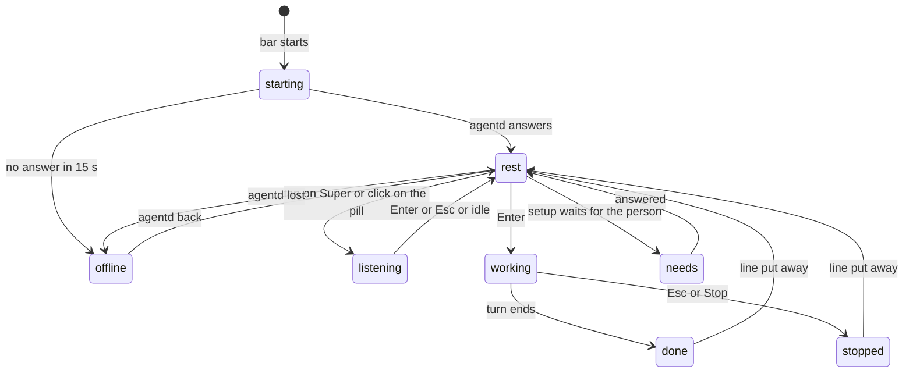
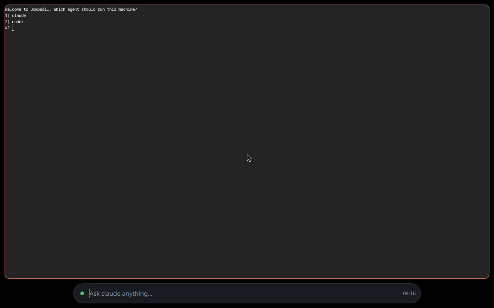
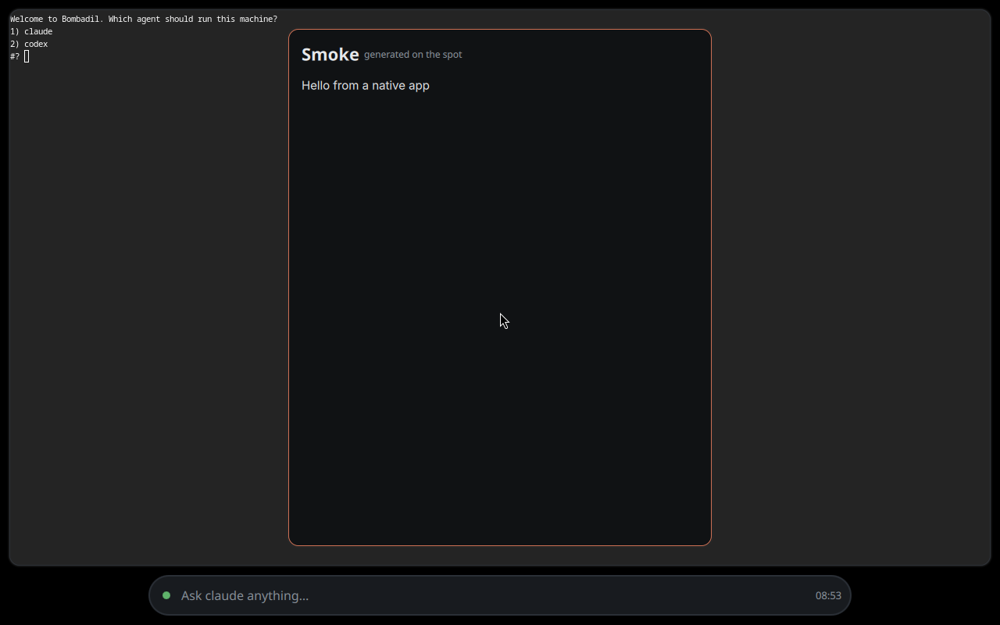
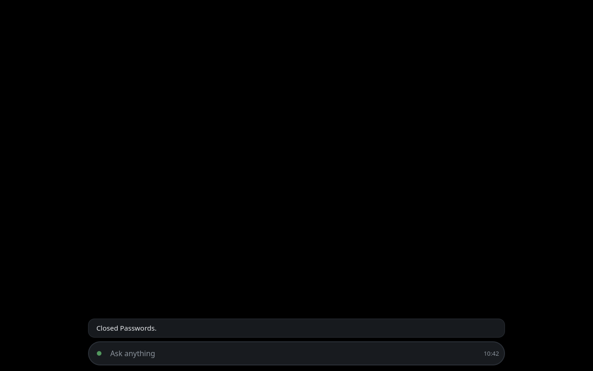
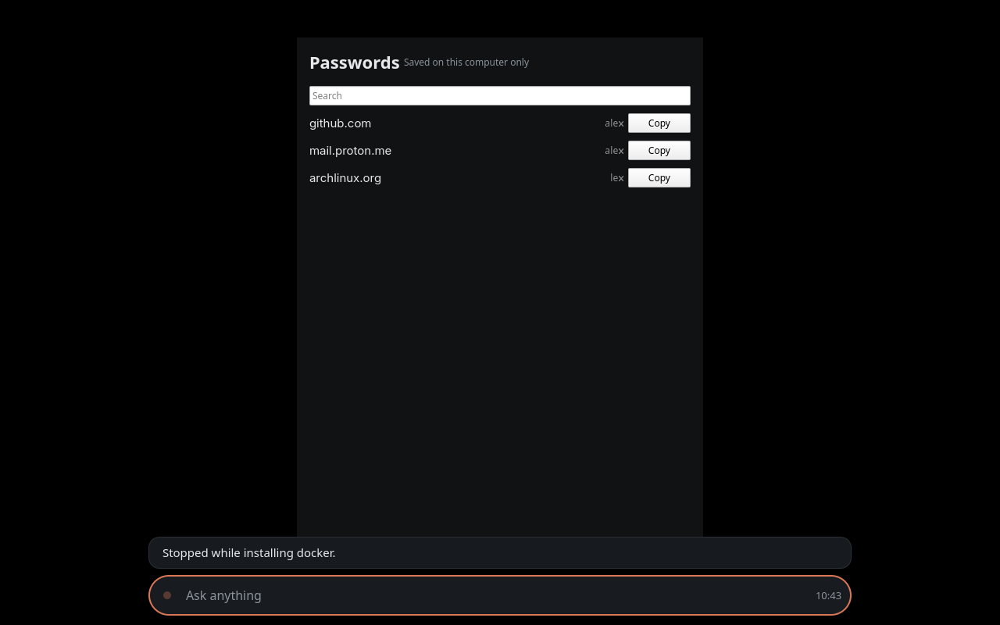
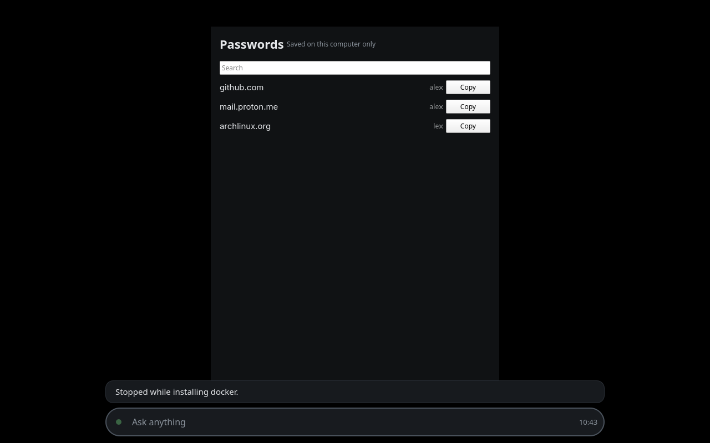
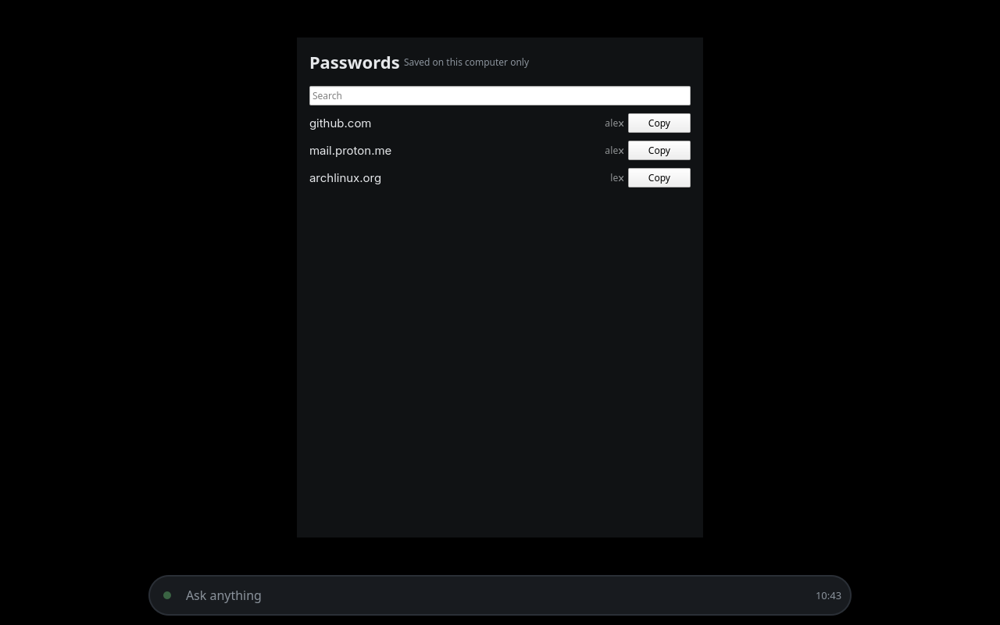
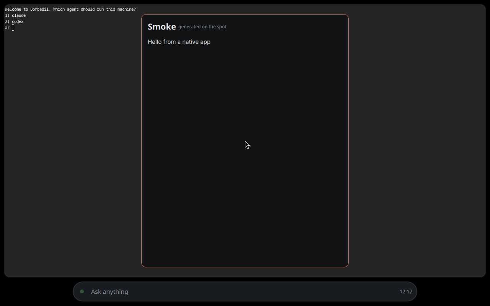

# The interaction model

> **Status:** Partly shipped
> **Code:** `shell/shell.qml`, `shell/PillState.qml`, `shell/StatusLine.qml`, `shell/Stone.qml`, `shell/QueueChips.qml`, `shell/SetupChips.qml`, `shell/CardHost.qml`, `shell/DeskState.qml`, `src/bombadil/launcher.py`, `src/bombadil/agentd.py`, `src/bombadil/narrate.py`, `iso/airootfs/etc/skel/.config/hypr/hyprland.lua`
> **Design:** [How Bombadil should feel](../design/ux-brief.md#the-rules), [The Bombadil mark](../design/identity-brief.md#the-rules), [Riding with Bombadil](../design/passenger-brief.md#the-rules), [The desk](../design/widgets-brief.md#the-rules), [Bombadil's voice](../design/voice-brief.md#the-rules), [Design system](../design-system/README.md)
> **Verified:** 2026-10-01 against `main` at `6150431`

The whole interface is one pill at the bottom of every screen, a line above it that says what the machine is doing, and a stone at the pill's left end that shows its state. Everything else appears when something calls it and leaves when the thing is done: a picture, a chip, a card in a side rail, a panel, a native app, a terminal drawer. One conversation runs, one turn at a time, and the person learns three things: tap Super to talk, press Esc to stop, say "undo" to go back. This page maps what is on screen, when it shows and why. Keys and timings are in [keys-and-timings.md](keys-and-timings.md), step-by-step flows in [flows.md](flows.md), colours and sizes in the [design system](../design-system/README.md). Anything designed but not on `main` is marked as such and linked to its brief.

## The surfaces

Every surface, with whether it is on `main`. The bar process (`shell/shell.qml`) draws all of them except the panels, the app windows and the details drawer, which are ordinary windows that Hyprland places.

| Surface | What it is for | When it shows | Code |
|---|---|---|---|
| The pill | Where the person types and where the launcher answers. One per screen, at the bottom, with the stone at its left end and the clock at its right. While the typed text is an exact launcher word it shows `↵ Passwords`, and Tab completes a name. | Always. It takes the keyboard after a tap on Super, a click on it or `bombadil pill` (Alt+Space). It gives the keyboard back on Enter, on Esc when nothing runs and nothing is typed, on a click elsewhere, or after 20 s idle (60 s with text typed). | `shell/shell.qml`, `shell/PillState.qml`, `iso/airootfs/etc/skel/.config/hypr/hyprland.lua` |
| The stone | The machine's state, as a shape and a motion. While a turn can be stopped, the pointer over it turns it into `Stop`. | Always, in the pill. | `shell/Stone.qml`, `shell/shell.qml` |
| The line above the pill | The one voice. It says what the machine is doing, then what it did, and carries `Undo` and `Details`. It also carries the one-line answers of the launcher and the errors. | From Enter until it fades or Esc puts it away. A closing line fades after 12 s unless the turn changed something or the pointer is on it. | `shell/StatusLine.qml`, `shell/LineButton.qml`, `shell/PillState.qml` |
| Cards | An answer drawn as a picture: a chain, layers, a comparison or a timeline. The only card type is `diagram`. | Above the line. The machine draws one for an exact picture word (`how am i connected`), the agent draws one with `show_card` while it works, and a receipt appears after a turn that changed a part of the machine. | `shell/CardHost.qml`, `src/bombadil/cards.py`, `src/bombadil/sysmap.py` |
| Queue chips | A grey `next` chip for each prompt typed while a turn runs. The `×` drops it. | While a prompt waits. | `shell/QueueChips.qml` |
| Setup chips | The choices under the setup line: `Claude` and `Codex`, `Sign in`, `Show sign-in`, `Open it again`, `Wi-Fi`, `Try again`, `Cancel`, `Use <title> instead`. | While the machine has no AI to answer: first boot, signed out, offline, a sign-in under way. | `shell/SetupChips.qml`, `src/bombadil/agentd.py` |
| App chips | One chip per running app. A click slides the app in or out, the `×` quits it. | While an app runs. | `shell/shell.qml`, `src/bombadil/appkit/placement.py` |
| Session chips | A dot per coding session. In progress on an unmerged branch; there is no `SessionChips.qml` on `main`. | Not on `main`. See the [desk brief](../design/widgets-brief.md#the-rules) and the [coding sessions brief](../design/dev-brief.md#the-rules). | none |
| The details drawer | What a turn ran and printed, the history, a service's status, a package's details, a text file, a folder, the Wi-Fi list. A `foot` window titled `Details`, app id `bombadil-details`, on the `special:details` workspace. | The `Details` button, a tap on a finished line, a click on a picture box that names a thing, the words `history` and `wifi`. Esc in the drawer, Esc in the pill or a second click on `Details` closes it. | `src/bombadil/launcher.py`, `src/bombadil/watch.py`, `iso/airootfs/etc/skel/.config/hypr/hyprland.lua` |
| Desk rails | Cards beside the pill. `Now` is the route of a turn, `Watching` is the list of jobs and timers, `Needs you` is the list of coding sessions that wait. Two rails, one on each side, on the `Bottom` layer. | Only with something to say. `Now` shows for a turn with a plan of two steps or more, or one that touches the system, and for as long as the closing line stays. `Watching` shows while agentd lists a job. `Needs you` shows for two waiting sessions or more, and nothing on `main` fills it. | `shell/DeskRails.qml`, `shell/DeskRail.qml`, `shell/DeskCard.qml`, `shell/NowCard.qml`, `shell/RowsCard.qml`, `shell/DeskState.qml` |
| Desk strips | A folded card as a chip beside the pill: `step 2 of 5`, `2 counting`, `2 need you`. | When a window covers a card, after the word `desk`, or on a narrow screen. A full-screen window turns the pill into a capsule with only the stone and the clock. | `shell/DeskStrips.qml`, `shell/DeskStrip.qml`, `shell/HyprCover.qml` |
| Panels | The browser, the terminal and the file manager, each on a special workspace that slides in over the desk. | Super+B, Super+T, Super+F, the words `browser`, `terminal` and `files`, the agent's `show_panel`, and the browser when a sign-in needs a page. | `iso/airootfs/etc/skel/.config/hypr/hyprland.lua`, `src/bombadil/launcher.py`, `src/bombadil/hypr.py` |
| App windows and drawers | The native apps the agent makes. Each floats, centred, and slides in from its own special workspace, `special:app-<name>`, which the app kit calls its drawer. | When an app is created or opened by name, or its chip is clicked. | `src/bombadil/appkit/placement.py`, `src/bombadil/launcher.py`, `iso/airootfs/etc/skel/.config/hypr/hyprland.lua` |
| The wallpaper | The ground under every window, card and the pill. It takes no clicks. The path in `~/.config/bombadil/wallpaper` replaces the standard picture. | Always, on every screen. | `shell/Wallpaper.qml`, [boot and the wallpaper](../design/boot-and-wallpaper.md) |

Registered on the desk but with no card and no feed on `main`: `alive`, `away` and `machine` (`src/bombadil/desk.py`, `shell/DeskState.qml`). The cards of the desk fold toward their strips when a window covers their place, and come back after the cover leaves; the rules are in [desk.md](../architecture/desk.md).

Designed or in progress, and not on `main`:

- The chip that says what "this" means, the three example chips and the first-day hint line: Designed. [How Bombadil should feel, build these first](../design/ux-brief.md#build-these-first), pieces 4 and 6.
- A notification line, voice input, drop and paste onto the pill, music controls and the battery beside the clock, the Rewind app, the rescue page: Designed. [How Bombadil should feel](../design/ux-brief.md#everything-else-by-moment) and [its decisions](../design/ux-brief.md#decisions-i-picked-a-default-for).
- Session chips with a dot per coding session: In progress. [Building on Bombadil](../design/dev-brief.md#the-rules), [the desk brief](../design/widgets-brief.md#the-rules).
- The `Away` and `Machine` cards, `Alive`, dragging a card by its title, hover and click on a strip, and widgets the agent makes: Designed. [The desk](../design/widgets-brief.md#the-rules).
- Card types other than `diagram` (lists, checklists, timers, controls, a reader): Designed. [How Bombadil should feel, build these first](../design/ux-brief.md#build-these-first), piece 5, and [cards-and-pictures.md](../architecture/cards-and-pictures.md).
- The Merry, Plain and Quiet voices and the welcome line: In progress on a branch. [Bombadil's voice](../design/voice-brief.md#the-rules).

## The stone and the pill's states

`PillState.face` picks the stone's face, first match wins. `shell/shell.qml` adds `listening` for the screen whose pill holds the keyboard. Colours and sizes are in [the pill's states](../design-system/README.md#the-pills-states).

| Face | Trigger | What the person sees | Without colour | Defined in |
|---|---|---|---|---|
| `starting` | agentd has not answered since the bar started and the 15 s boot window is open | An orange stone rolling, and the placeholder `Starting` | It rolls, and the word says why | `shell/PillState.qml`, `shell/shell.qml` |
| `rest` | Connected and nothing else applies, including a closing line that ended in an error | A green stone, still | Still | `shell/PillState.qml`, `shell/Stone.qml` |
| `listening` | This screen's pill holds the keyboard and the face would be `rest` | A green stone leaning toward the text | Leans 6 degrees | `shell/shell.qml`, `shell/Stone.qml` |
| `working` | A turn runs, `On it` is showing, or a sign-in is under way | An orange stone turning about the b, which stays level; the line says what | Turns a third of a turn a second | `shell/PillState.qml`, `shell/Stone.qml` |
| `needs` | Setup waits for the person (which AI, signed out, offline). A waiting coding session also gives it, but nothing on `main` reports one. | An amber stone with a soft glow behind it | Knocks twice, waits, and the glow breathes | `shell/PillState.qml`, `shell/Stone.qml`, `shell/DeskState.qml` |
| `done` | A turn ended, was not stopped and did not end in an error | A green stone | Hops once, then sits as at rest | `shell/PillState.qml`, `shell/Stone.qml` |
| `stopped` | A turn ended because it was stopped | A grey square, the Stop button's own shape | A square, not a stone | `shell/PillState.qml`, `shell/Stone.qml` |
| `offline` | agentd was there and is gone, or did not answer within the boot window | The stone's outline alone, broken, in red, with the b still in place | A broken outline, not a filled stone | `shell/PillState.qml`, `shell/Stone.qml` |

The line above the pill has its own modes, set by `shell/PillState.qml`:

| Mode | When | What the line holds |
|---|---|---|
| `idle` | Nothing to say | No line |
| `working` | A turn runs, from the optimistic `On it` | The step in plain words, the seconds after the first, and for a marked step the exact command |
| `closing` | A turn ended | The result or a summary, `Undo` and `Details` when something changed, `can’t be undone` when nothing can bring it back |
| `local` | An answer that needed no model: a launcher word, `why`, `undo`, a job that ended, an error | One line that fades by itself |
| `setup` | The machine has no AI to answer yet | The setup line and its chips |

Three more rules shape what the person sees:

- A turn can be stopped from the moment Enter shows `On it`, before agentd has confirmed it, and while a sign-in is under way (`PillState.stoppable`). Under the pointer the stone gives way to `Stop`, except in the capsule.
- A closing line that changed something is sticky: it stays with `Undo` until the next prompt. A stopped turn is never sticky.
- Under a full-screen window the pill is a capsule, the field is disabled and nothing can be typed blind. The stone's knock for a waiting coding session stays even there, because the desk never puts that mark away. Nothing on `main` reports a waiting session yet.

Reduced motion: `BOMBADIL_REDUCE_MOTION=1` makes the stone pulse instead of rolling and holds the glow still, and makes the wallpaper appear without its fade (`shell/shell.qml`, `shell/Stone.qml`, `shell/Wallpaper.qml`). Nothing on `main` sets the variable.

## One conversation

There is one machine and one conversation. The bar keeps no history of it: the line holds the current turn and the past is in the details drawer.

**One turn at a time.** agentd runs a single turn and keeps the rest in an ordered list (`self.current` and `self.pending` in `src/bombadil/agentd.py`). Words the launcher knows never become a turn: `match` in `src/bombadil/launcher.py` answers them locally, and a line that starts with `!` runs as a shell command with no model.

**The queue.** A prompt typed while a turn runs is accepted at once, shown as a grey `next` chip and run when the turn ends. The `×` on the chip sends `unqueue`. A prompt typed before the machine can reach an AI waits the same way, and when the person is signed out agentd starts the sign-in and the prompt runs after it.

**Stop.** Esc, the `Stop` under the pointer, the word `stop` and Super+Escape all do the same thing, and none of them waits for the model. Each turn runs in its own systemd scope when the session has a user manager, and stopping ends everything the turn started, `sudo` commands included. Windows the turn opened stay, because they belong to the person from then on (`src/bombadil/procs.py`). The line says `Stopping`, then `Stopped while installing docker.`, or `Stopped.` before any step. A turn stopped while its restore point is being saved ends before the provider starts. A queued prompt starts at once, and the stopped line stays on the line for a moment over the next turn's. While a sign-in is under way, Esc cancels it.

**Undo.** The word `undo` and the `Undo` button on a changed turn's line both ask `Launcher._undo` to roll the system back one turn, and each further undo goes one turn further back until the next turn runs. The answer is plain about what it covers: `Undone. System files go back to before “<the prompt>” when you restart. Your home folder and apps stay as they are.` Undo while a turn runs ends that turn first, and `undo`, `restart` and `shutdown` hold the queue until they are done, so no queued turn takes the snapshot the undo needs. Without restore points the answer is `Undo is off here: this system keeps no restore points.`, and on the live image it is `Undo starts once Bombadil is installed. The live system keeps no restore points.` Undo that takes back an app or the home folder in a second is Designed; see [piece 3 of the brief](../design/ux-brief.md#build-these-first).

**Restore points.** When the machine keeps restore points, each turn is preceded by one, named `turn:<n>: <prompt>`. agentd says `turn_start` first and takes the restore point after it, so something true is on screen before snapper runs, and the line reads `Saving a restore point` while it is taken. How restore points are made, kept and pruned is in [restore-points.md](../architecture/restore-points.md).

**How the person is told what happened.**

- **Why lines.** The reason is the agent's own sentence from just before a step, kept instead of discarded (`reason_from` in `src/bombadil/narrate.py`, at most 140 characters). It shows when the pointer rests on the line, and always on a marked step. Typing `why` during a turn is answered from that record with no model (`Narrator.why_text`); outside a turn `why` goes to the agent.
- **Marked steps.** A step that touches the system gets an amber edge and one that cannot be undone gets a red edge, each with the exact command in monospace. Nothing pauses: the agent is told to act without asking, and the marks are there so Esc is in reach. After an outside read, the step also says so by order, for example `after reading wireguard.com/quickstart`, never by guessed cause.
- **The closing line.** One sentence for what the turn did: the agent's reply, or the narrator's summary such as `Installed ffmpeg and made Passwords.`. `Undo` and `Details` come with it when something changed, and `can’t be undone` when nothing can.
- **Pictures.** An answer with parts, order or change is drawn. A picture the machine drew from real commands says `from this machine`, one the agent drew says `drawn by the agent`, and one still being written says `drawing…`. A click on a box that names a file, a service, a package, a page or a turn opens it in the drawer or the browser.
- **Receipts.** After a turn that changed the network, the disks, the sound, the screens or a service, a before and after comparison appears under the closing line. It is skipped when nothing changed, when the agent drew its own picture, when another turn has started, and when the config key `explain` is `brief`. The line and its receipt fade together.

## What the machine does on its own and how it shows it

| What it does on its own | How the person sees it | Code |
|---|---|---|
| Takes a restore point before each turn | The step `Saving a restore point`, then `Undo` on the closing line | `src/bombadil/agentd.py`, `src/bombadil/snapshots.py` |
| Starts the next queued prompt when a turn ends or is stopped | The `next` chip leaves and the line reads `On it` again | `src/bombadil/agentd.py`, `shell/QueueChips.qml` |
| Starts the sign-in when a prompt needs it, and waits for a network when there is none, then starts it | The `needs` face, the setup line and its chips | `src/bombadil/agentd.py`, `shell/SetupChips.qml` |
| Notices a provider that has gone quiet | After 30 s without output (six times that for Codex, which prints nothing while it reasons) the line reads `<Provider> is not answering; check the connection` | `src/bombadil/agentd.py`, `src/bombadil/providers.py` |
| Captures the network, disks, sound and screens before a turn, and draws the difference after | A before and after card under the closing line | `src/bombadil/agentd.py`, `src/bombadil/sysmap.py` |
| Runs jobs and timers as `systemd-run --user` units and watches them | The `Watching` card, the strip `2 counting`, and one line in the pill when one ends | `src/bombadil/jobs.py`, `src/bombadil/agentd.py`, `shell/DeskState.qml` |
| Folds desk cards when a window covers them and brings them back after it leaves | Cards slide to strips and back | `shell/DeskState.qml`, `shell/HyprCover.qml` |
| Fades a finished line nobody is looking at, and gives the keyboard back when the pill is left alone | The line leaves and the stone stops leaning | `shell/StatusLine.qml`, `shell/shell.qml` |
| Keeps trying the socket until agentd answers | `Lost touch with the agent. Reconnecting.` during a turn, then the `offline` face once the boot window has passed | `shell/shell.qml`, `shell/PillState.qml` |
| Reloads an app when its files change, and keeps the last good window when a load fails | A `Reload failed` banner in the app, or `<title> could not load` | `src/bombadil/appkit/runtime.py`, `share/qml/Bombadil/AppWindow.qml` |

What it never does on its own: start a model turn without a typed or queued prompt, and rearrange the desk, which the agent may do only in a turn whose words asked for it (`asked_for_desk` in `src/bombadil/desk.py`). The desk's own layout is kept in `desk.toml`, outside the restore points, so an undo never moves it. The desk and the jobs behind `Watching` are described in [desk.md](../architecture/desk.md).

## Words

The words of the interface are part of its look. The rules are in the [design system](../design-system/README.md#content-fundamentals) and [the voice brief](../design/voice-brief.md#the-rules); this table shows where the code keeps them.

| Rule | In the code | Real strings |
|---|---|---|
| Full sentences in sentence case | `shell/shell.qml`, `src/bombadil/launcher.py` | `Ask anything`, `Opened Passwords.`, `Closed Passwords.` |
| Present tense while working, past tense at the end | `src/bombadil/narrate.py` | `Installing ffmpeg`, then `Installed ffmpeg.`; `Building Passwords, 12 lines` |
| Name what changed and how to take it back | `src/bombadil/launcher.py`, `shell/StatusLine.qml` | `Undone. System files go back to before “…” when you restart.`, `can’t be undone` |
| Say what is wrong and what to do | `src/bombadil/agentd.py`, `src/bombadil/launcher.py` | `No internet. Connect to a network to sign in to Claude.`, `Nothing can lock the screen yet: hyprlock is not installed.` |
| Say what stopped | `src/bombadil/narrate.py` | `Stopped while installing docker.` |
| No emoji, no exclamation marks, no "Oops" in system text | A search of `shell/*.qml` and `src/bombadil/narrate.py` for a string ending in `!` finds none; `reason_from` strips a trailing `!` from the agent's reason | none |
| One line while working, at most four after | `maximumLineCount` in `shell/StatusLine.qml`; the system prompt in `src/bombadil/providers.py` asks for one or two plain sentences with no markdown | none |
| Plain in every voice: `On it`, the narrated steps, `Undo`, `Details`, provider trouble, offline | `shell/PillState.qml`, `src/bombadil/narrate.py` | `On it`, `Stopping`, `Not connected to the agent yet.`, `Lost touch with the agent. Reconnecting.` |
| The product is "Bombadil" in prose, and `bombadil` is the command | `src/bombadil/launcher.py` | `Undo starts once Bombadil is installed.` |

The Merry, Plain and Quiet voices and the welcome line are In progress on a branch. On `main` nothing selects a voice and every string is fixed or comes from the narrator ([voice brief](../design/voice-brief.md#the-rules)).

## Screens

These pictures are in `docs/screens/`. The logs beside them (`docs/screens/pill/checks.log`, `docs/screens/pill/driver.log`, `docs/screens/vm-fixes/drawer-smoke.log`) list the checks that ran when they were taken. The pictures in `pill/`, `first-boot/` and `vm-fixes/` show a dot at the pill's left end where `shell/Stone.qml` draws the stone, so they are earlier than the stone. The two desk pictures were taken in the headless desktop test, whose driver injects the `dev` messages that fill the `Needs you` card (`tests/desktop/driver.py`).

### From power-on to the desk

*A text console on a black screen. It reads `:: Pre-mount break requested, type 'exit' to resume operation`, then `sh: can't access tty; job control turned off`, then a prompt `[rootfs ~]#` and a cursor.*

*The same three lines of text on a dark grey ground instead of black.*

*A text screen on black. An outline made of letters fills the top, and below it are lines starting `WARN` and `DEBUG` about creating managers and reading a config file named `hyprland.lua`.*

*A dark grey screen with nothing on it but a mouse pointer near the middle.*

*A black screen with a pointer in the middle. At the bottom a line reads `Which AI should run this computer?`, two outlined chips read `Claude` and `Codex`, and the pill below has a small amber mark, `Ask anything` and `00:42`.*

*The same question, chips and pill on a dark grey ground. A large faint stone shape with a lowercase b cut through it fills the middle of the screen.*

*The faint stone on the dark ground, and the pill at the bottom: a small green stone mark at its left end, `Ask anything` and `01:04`. There is no line and no chip.*

*The bottom strip of a screen. On the left a card titled `Watching` reads `2 counting · each ends with one line in the pill` and lists `Ubuntu 26.04 ISO` with an orange bar and `4 min 43%`, `Timer, 10 min` with `6:39 left`, and `Build the image` with a red dot, `pacman: could not resolve host` and a `Why?` button. In the middle a line with a red edge reads `Needs you cannot be hidden.` above the pill, which has a green stone mark and `01:06`. On the right a card titled `Needs you` reads `Tab walks these · one alone is just the line` and lists `reviewer on Bombadil` and `builder on Bombadil`, each with an `Open` button.*

### First boot

*A terminal with a thin orange edge fills the screen above the pill. It reads `Welcome to Bombadil. Which agent should run this machine?` with the options `1) claude` and `2) codex`. The pill shows a green dot, the placeholder `Ask claude anything...` and `08:16`. This is an earlier first-boot flow; `src/bombadil/agentd.py` asks `Which AI should run this computer?` in the pill.*

*A browser window fills the screen above the pill, with a tab named `New Tab`, an address bar with a text cursor and a search page. A small round `Undo` button sits under the search box. The pill shows `Ask claude anything...` and `08:18`.*

*The terminal from the first picture is behind. In front is a window with an orange edge titled `Smoke`, with `generated on the spot` beside the title and the text `Hello from a native app`. The pill reads `Ask claude anything...` and `08:53`.*

### A session at the pill

*A black screen with the pill at the bottom: a green dot, `Ask anything` in grey and `10:42`.*

*The same pill with `install ffmpeg` typed in it. The dot is still green.*

*A line above the pill reads `On it`. The pill has gone back to `Ask anything`, and its dot and border are orange.*

*The line has an amber bar on its left edge and reads `Installing ffmpeg`, with `3s` at the right and the command `sudo pacman -S --noconfirm --print ffmpeg; sleep 4` under it in monospace. The pill's dot and border are orange.*

*The line reads `Installed ffmpeg 7.1. It is ready to use from any terminal or app.` with two buttons at its lower right, `Undo` and `Details`. The pill's dot is a dim green.*

*The line reads `Building Passwords, 12 lines`, with `2s` at the right and no coloured edge. The pill's dot and border are orange.*

*A window titled `Passwords`, with `Saved on this computer only` beside the title, a search box and three rows that each end in a `Copy` button, stands in the middle of the screen. The finished line `Made Passwords. It is open now, and it keeps everything on this computer.` with `Undo` and `Details` covers the window's foot.*

*The window is gone. The line reads `Closed Passwords.` and has no buttons. The pill is at rest.*

*`pass` is typed in the pill and `words` follows it in a dimmer grey. The line above still reads `Closed Passwords.`.*

*`passwords` is typed in full. At the right end, before the clock, a small grey `↵ Passwords` appears.*

*The `Passwords` window is back in the middle of the screen. The line reads `Opened Passwords.` and the pill is empty with `10:43`.*

*Over the open window, a line with an amber bar on its left edge reads `Installing docker`, with `1s` at the right and `sudo sh -c 'echo installing docker; sleep 120'` under it. The pill's dot and border are orange.*

*The same line, at `3s`. Below it a small chip reads `next`, `tell me a joke` and `×`, between the line and the pill.*

*The line reads `Stopped while installing docker.` It has no amber bar and no buttons, and the `next` chip is not there. The pill's border is still orange and its dot is dim.*

*The line and the orange border are the same as in the previous picture.*

*The line still reads `Stopped while installing docker.`, but the pill's dot is green and its border is grey. No answer to `tell me a joke` is visible.*

*The line is gone. The pill shows a green dot and `Ask anything`, and the `Passwords` window is still there.*

*A single line of plain text reads `Linux` followed by a kernel release number, with no buttons. The pill is at rest.*

*No line above the pill. The `Passwords` window and the resting pill remain.*

*A line with a red bar on its left edge and red text reads `Undo is off here: this system keeps no restore points.` The pill is at rest.*

*A grey terminal area covers the middle of the screen. It lists `set up docker` with a time, `Setting up docker.`, `Installing docker` marked `[system]`, the command `sudo sh -c 'echo installing docker; sleep 120'`, a red `stopped`, and `Stopped while installing docker.` with `4.6 s`, then `Press any key to close.` The red-edged line and the pill are below it. As of 2026-10-01 `src/bombadil/watch.py` says `Press Esc to close.` instead.*

### The details drawer in a virtual machine

*A terminal area with a thin orange edge fills most of the screen. It lists `!sleep 300` with a time, `Waiting`, the command `sleep 300`, a red `failed (exit -2)`, and `Stopped while waiting.` with `16.5 s`, then `Press Esc to close.` The pill below shows a green dot and `Ask anything`.*

*A terminal with a thin edge is at the back, showing `Welcome to Bombadil. Which agent should run this machine?` with `1) claude` and `2) codex`. A window titled `Smoke` with an orange edge and the text `Hello from a native app` is in front. The pill below shows a green dot and `Ask anything`. No drawer is visible.*

## What would break it

A contributor checklist. Each item is an anti-goal from [principles.md](../principles.md) or from a brief, with what in the code keeps it true today and what a change must not do. Check a change against all of them before opening a pull request.

- [ ] **The pill becomes a chat window.** It keeps only the current turn: `shell/StatusLine.qml` holds one line while working and at most four after. A scrolling log, avatars, markdown or a button that starts a fresh conversation would break it. [Stupidly simple](../principles.md#stupidly-simple), [the answer is the thing](../principles.md#the-answer-is-the-thing), [ux brief](../design/ux-brief.md#what-would-make-it-feel-like-a-chat-window-instead).
- [ ] **Silence after Enter.** `PillState.submit` shows `On it` before agentd answers, and launcher words never wait for a model. A path that sends `open`, `stop` or `undo` through a turn would break it. The headless test records `turn_start` 0.006 s after Enter and a launcher answer in 0.01 s (`docs/screens/pill/checks.log`). [Something true in 200 ms](../principles.md#something-true-in-200-ms).
- [ ] **A prompt, a toast or an "Are you sure?" over the person's work.** Marked steps run and the line only marks them, with the exact command. Nothing in the bar may pause a step for permission. [Full access with undo](../principles.md#full-access-with-undo).
- [ ] **Internals on screen.** Tool names, raw JSON and stderr never reach the line; `src/bombadil/narrate.py` turns a call into plain words. A change that shows a raw event would break it. [One design language](../principles.md#one-design-language).
- [ ] **The agent explains instead of doing.** The system prompt in `src/bombadil/providers.py` says to act without asking and to reply in one or two plain sentences. Paragraphs, follow-up questions and a second voice narrating the first would break it. [ux brief](../design/ux-brief.md#what-would-make-it-feel-like-a-chat-window-instead), [passenger brief](../design/passenger-brief.md#what-would-make-it-a-chatbot-with-a-dashboard).
- [ ] **A picture the model made up.** The machine draws pictures of itself from real commands (`src/bombadil/sysmap.py`) and the card says `from this machine`; one the agent draws says `drawn by the agent`. A model must not hand-draw the state of the machine. [Records before models](../principles.md#records-before-models).
- [ ] **An answer that does not need to be a card becomes one.** An answer that is a single number is a sentence. [The answer is the thing](../principles.md#the-answer-is-the-thing).
- [ ] **A widget that is always on.** The desk shows a card only with something to say, and there is no gauge strip at rest. A card with nothing to report must not appear. [Quiet at rest](../principles.md#quiet-at-rest), [the desk brief](../design/widgets-brief.md#the-rules).
- [ ] **Background work the person cannot list or stop.** Jobs and timers are `systemd-run --user` units listed in `Watching`, each with a stop. A promise made only in words is not a promise. [Nothing runs unseen](../principles.md#nothing-runs-unseen).
- [ ] **Something moves that means nothing.** Rolling means working, a knock means waiting for the person, a hop means done, a lean means listening. An added motion, or one of these used for something else, would break it, and each needs a still version under reduced motion. [Quiet at rest](../principles.md#quiet-at-rest), [identity brief](../design/identity-brief.md#the-rules).
- [ ] **A state that colour alone tells apart.** Every face of the stone differs by shape or motion as well as colour. [Colour says who](../principles.md#colour-says-who).
- [ ] **A face, a mascot or borrowed imagery.** No face, no mascot, nothing from Tolkien's text or art, and the stone takes a colour only in the pill. The wallpaper on `main` carries a faint stone, which [boot and the wallpaper](../design/boot-and-wallpaper.md#open-choice) records as an open choice. [Original](../principles.md#original).
- [ ] **A cheerful line over an error, or a promise the machine cannot keep.** No `Oops`, no exclamation marks in system text, and no claim a receipt does not make. [Bombadil's voice](../design/voice-brief.md#what-would-make-it-feel-like-a-mascot-instead).
- [ ] **A literal colour or size.** The shell and the kit read `Theme` tokens. [Design system](../design-system/README.md).
- [ ] **Recovery that goes through the part that broke.** Stop, undo and the launcher words work without the model, the network and, for stop, the GUI (Super+Escape runs `bombadil stop`). [Recovery without the broken part](../principles.md#recovery-without-the-broken-part).
- [ ] **Anything that reaches other people without the person's own press.** [The person's press reaches people](../principles.md#the-persons-press-reaches-people).
- [ ] **A designed item described as shipped.** The lists under [the surfaces](#the-surfaces) say what is on `main`. A change that adds one of them updates this page, its brief's status and [the roadmap](../roadmap.md) together.
