# Flows

> **Status:** Partly shipped
> **Code:** `src/bombadil/agentd.py`, `src/bombadil/launcher.py`, `src/bombadil/providers.py`, `src/bombadil/signin.py`, `src/bombadil/browser.py`, `src/bombadil/hypr.py`, `src/bombadil/snapshots.py`, `src/bombadil/narrate.py`, `src/bombadil/procs.py`, `src/bombadil/watch.py`, `src/bombadil/desk.py`, `src/bombadil/appkit/tools.py`, `src/bombadil/appkit/placement.py`, `shell/shell.qml`, `shell/PillState.qml`, `shell/StatusLine.qml`, `shell/QueueChips.qml`, `shell/SetupChips.qml`, `shell/DeskState.qml`, `bin/bombadil`, `bin/bombadil-browser`, `iso/airootfs/usr/local/bin/bombadil-setup`, `iso/airootfs/usr/local/bin/bombadil-install`, `iso/airootfs/usr/local/bin/bombadil-rollback`, `iso/airootfs/etc/skel/.config/hypr/hyprland.lua`
> **Design:** [How Bombadil should feel](../design/ux-brief.md#the-rules), [Riding with Bombadil](../design/passenger-brief.md#the-rules), [The desk](../design/widgets-brief.md#the-rules), [Bombadil, installed](../design/installed-os-brief.md#the-rules)
> **Verified:** 2026-10-01 against `main` at `6150431`

A flow is one thing a person does, followed from the first key to the last thing they see. This page follows thirteen: first boot, signing in, asking for something, a package step, stopping, queueing, undo, building an app, the browser, the details drawer, the launcher words, the desk and installing. Each section says what the person wants, draws the components and messages that carry it, lists what is on screen at each step and then lists what the person sees when it goes wrong. The surfaces and the stone's states are described once, in [the interaction model](README.md#the-surfaces), and the keys and timings behind them in [keys and timings](keys-and-timings.md); this page links to them instead of repeating them. The pictures in `docs/screens/pill/` and `docs/screens/vm-fixes/` come from a scripted run: the desktop test starts the real bar, agentd and the Claude Code CLI in a headless compositor against a scripted stand-in for the API (`tests/desktop/driver.py`, `tests/desktop/fake_api.py`), so the model's side of every picture is scripted (`install ffmpeg`, `make me a password manager`, `set up docker` and `tell me a joke` each have a script), while the launcher words and the `!` command in them are answered by the real agentd. They show a plain dot at the pill's left end where `shell/Stone.qml` draws the stone. A step that is only designed says Designed and links its brief.

## 1. First boot and setup

**The person wants** to turn the computer on and start using it with an AI account they already have.

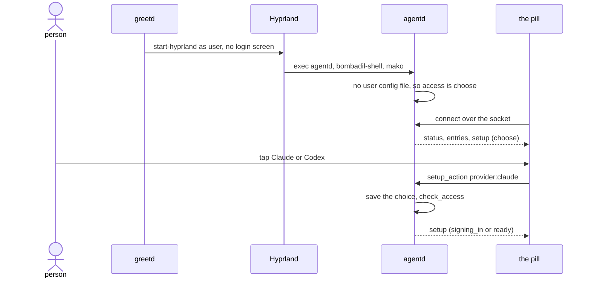
```mermaid
sequenceDiagram
    actor U as person
    participant G as greetd
    participant H as Hyprland
    participant A as agentd
    participant P as the pill
    G->>H: start-hyprland as user, no login screen
    H->>A: exec agentd, bombadil-shell, mako
    A->>A: no user config file, so access is choose
    P->>A: connect over the socket
    A-->>P: status, entries, setup (choose)
    U->>P: tap Claude or Codex
    P->>A: setup_action provider:claude
    A->>A: save the choice, check_access
    A-->>P: setup (signing_in or ready)
```

1. The image starts the desktop as the user `user` without a login screen (`iso/airootfs/etc/greetd/config.toml`; `iso/airootfs/etc/systemd/system/bombadil-live.service` creates the user with an empty password). `iso/airootfs/etc/skel/.config/hypr/hyprland.lua` starts `agentd`, `bombadil-shell` and `mako`.
2. The pill appears with the placeholder `Starting` and the stone in its `starting` face until agentd answers.
3. agentd has no user config file (`~/.config/bombadil/config.toml`) and `BOMBADIL_PROVIDER` is not set, so it is not "chosen" and its setup state is `choose`. The line reads `Which AI should run this computer?`, two big chips read `Claude` and `Codex`, the stone is in its `needs` face and the placeholder is `Ask anything`.

   

   *The question, the two chips and the pill on a black ground. The picture is from the boot work in [boot and the wallpaper](../design/boot-and-wallpaper.md).*

4. The person taps a chip, or types `claude` or `codex` into the pill: while the state is `choose`, `AgentD.handle` reads a provider name as the answer. agentd writes `provider = "<name>"` to `~/.config/bombadil/config.toml` (`config.save_user`, which keeps only `explain` of the other keys), and checks whether that provider's CLI is signed in.
5. Signed in: the line reads `Claude is ready. Ask me for anything.` and fades by itself. Not signed in: the sign-in starts at once and the person is in [flow 2](#2-signing-in-to-a-provider-from-the-pill).
6. The terminal fallback is `bombadil-setup`, run by hand from a terminal (Super+Return). It asks `Which AI should run this computer?` with a numbered list, installs the CLI with `sudo npm install -g` if it is missing, asks agentd to pick and sign in (`bombadil provider <name>`), and, when agentd does not answer, writes the config file itself and runs the CLI's own login with `BROWSER=bombadil-browser`. Nothing on `main` starts it.

Wi-Fi networks as chips with the password typed in the pill, three example chips and a first-day hint line are Designed ([How Bombadil should feel, build these first](../design/ux-brief.md#build-these-first)). The two earliest pictures of the desk, `docs/screens/first-boot/desktop-bar.png` and `docs/screens/vm-fixes/drawer-closed-by-esc-in-pill.png`, show an earlier terminal wizard instead of this question; [the interaction model](README.md#screens) says so.

### Where it breaks and what the person sees

| What goes wrong | What the person sees | Code |
|---|---|---|
| agentd has not started yet | `Starting` and a rolling stone for the length of the boot window, then the `offline` face and the placeholder `Waiting for agentd…`. The bar keeps trying the socket ([keys and timings](keys-and-timings.md#the-bar)). Enter shows `Not connected to the agent yet.` and the text stays in the field | `shell/shell.qml`, `shell/PillState.qml` (`submit`, `_offline`) |
| The chosen CLI is not installed (the image installs both, a development machine may not) | Nothing at the choice: the state goes to `ready` with no line. The first ask ends with the error `claude is not installed yet: press Super+Return and run bombadil-setup` | `src/bombadil/agentd.py` (`check_access`, `turn`), `scripts/build-iso.sh` |
| The person types something else while the question is up | The text is queued as a prompt and the setup line stays. It runs after the choice and the sign-in | `src/bombadil/agentd.py` (`handle`, `_runnable`) |
| The person presses Esc or waits | The question stays: only finished lines fade or go with Esc, and a setup line is not one. A launcher answer replaces it for a few seconds and it comes back | `shell/PillState.qml` (`_putLineAway`), `shell/StatusLine.qml` |
| `bombadil-setup` when agentd does not answer, and the CLI's login fails (no network, say) | The script stops there with the CLI's own message (`set -e`), before it starts agentd and before it prints `Done. Type in the pill at the bottom of the screen.` | `iso/airootfs/usr/local/bin/bombadil-setup` |

## 2. Signing in to a provider from the pill

**The person wants** to connect their Claude or Codex account without leaving the screen and without copying a code.

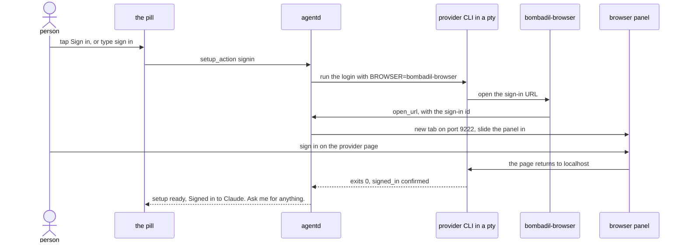
```mermaid
sequenceDiagram
    actor U as person
    participant P as the pill
    participant A as agentd
    participant C as provider CLI in a pty
    participant B as bombadil-browser
    participant W as browser panel
    U->>P: tap Sign in, or type sign in
    P->>A: setup_action signin
    A->>C: run the login with BROWSER=bombadil-browser
    C->>B: open the sign-in URL
    B->>A: open_url, with the sign-in id
    A->>W: new tab on port 9222, slide the panel in
    U->>W: sign in on the provider page
    W->>C: the page returns to localhost
    C-->>A: exits 0, signed_in confirmed
    A-->>P: setup ready, Signed in to Claude. Ask me for anything.
```

The way in is any of: the first-boot chip ([flow 1](#1-first-boot-and-setup)), the `Sign in` chip while signed out, the words `sign in`, `log in`, `login` and their variants, `use codex`, `switch to claude` and `sign in to codex`, a prompt typed while signed out (the prompt waits and the sign-in starts), and `bombadil signin [provider]` in a terminal.

1. agentd first checks that the provider's sign-in host answers (`platform.claude.com:443` or `auth.openai.com:443`). The line reads `Opening the Claude sign-in` with a `Cancel` chip, and the stone turns (`working`).
2. `signin.SignIn` runs the CLI's login in a pseudo-terminal 50 rows by 1000 columns, with `$BROWSER` set to `bin/bombadil-browser`. The CLI hands its URL to that command, which sends `open_url` to agentd; agentd opens the page in the browser panel ([flow 9](#9-the-browser-panel-and-a-link-from-the-terminal)). The browser panel slides in with the page, and the line reads `Sign in to Claude in the browser`, still with `Cancel`.

   

   *The panel as it looks when it slides in. It is a search page, not a sign-in page: no picture of a sign-in is on `main`.*

3. The person signs in on the page. Claude's automatic flow and Codex return to a small server the CLI runs on localhost; the line reads `Finishing the Claude sign-in`. Claude's manual flow ends on a page that holds a code in the tab's address (`code#state`): agentd reads the address through the debugging port and types the code into the CLI's prompt itself, so nothing is copied.
4. The CLI exits 0 and agentd confirms with the provider's own check. The panel slides away and the page's tab closes unless it is the last one. The line reads `Signed in to Claude. Ask me for anything.` and fades by itself. Prompts that waited for the sign-in run, in the order they were typed.

### Where it breaks and what the person sees

| What goes wrong | What the person sees | Code |
|---|---|---|
| No network | `No internet. Connect to a network to sign in to Claude.` in an error tone, the stone in its `needs` face, chips `Wi-Fi` and `Try again`. `Wi-Fi` opens `nmtui connect` in the details drawer (`Opened Wi-Fi.`), or says `Wi-Fi settings need NetworkManager, which is not installed.` agentd keeps looking and starts the sign-in by itself when the host answers | `src/bombadil/agentd.py` (`start_signin`, `_wait_online`, `OFFLINE_POLL`), `src/bombadil/launcher.py` (`_wifi`) |
| The person hides the panel (Super+B) | `The Claude sign-in is waiting in the browser`, chips `Show sign-in` and `Cancel` | `src/bombadil/agentd.py` (`_describe`), `src/bombadil/signin.py` (`_look`) |
| The person closes the page's tab, or the browser | `The Claude sign-in page was closed`, chips `Open it again` and `Cancel`. The CLI is still waiting; the chip opens the address in a new tab | `src/bombadil/signin.py` (`show`) |
| The browser is slow, missing or will not open the page | The sign-in waits anyway, because the CLI does. The line says the page was closed when no tab shows. If the CLI then fails, the reason names the browser trouble when the CLI said nothing | `src/bombadil/signin.py` (`_maybe_open`, `_trouble`), `src/bombadil/browser.py` |
| Cancel (the chip, Esc, the word `stop` or `cancel`) | `Cancelling the Claude sign-in`, then `Sign-in cancelled.` Prompts that waited for it are dropped and their chips go. If the stored login is still good, the state returns to ready without a line | `src/bombadil/agentd.py` (`stop`, `_run_signin`, `_drop_waiting`) |
| The sign-in waits on its page past its time limit | `The Claude sign-in timed out.` in an error tone with the chips `Sign in` and `Use Codex instead`. `BOMBADIL_SIGNIN_TIMEOUT` sets the limit ([keys and timings](keys-and-timings.md#agentd-and-the-launcher)) | `src/bombadil/signin.py` (`TIMEOUT`), `src/bombadil/agentd.py` (`_describe`, `_run_signin`) |
| The CLI exits with an error | `Could not sign in to Claude: <reason>.` and the same two chips. The page stays on screen so the person can read it | `src/bombadil/signin.py` (`run`), `src/bombadil/providers.py` (`SIGNIN_ERRORS`) |
| Codex when the person is already signed in | `You are already signed in to Codex.` A new `codex login` revokes the stored login as it starts, so agentd does not run it | `src/bombadil/agentd.py` (`signin_asked`), `src/bombadil/providers.py` (`login_replaces`) |
| The login is gone in the middle of a turn | `Claude signed you out.` and the sign-in starts. The prompt goes back to the front of the queue once and runs after the sign-in. If it runs again and gets the same answer, the CLI's own words show and agentd does not loop | `src/bombadil/agentd.py` (`_signed_out_turn`) |
| Someone runs `/login` in a terminal while agentd says signed out or offline | agentd sees the sign-in URL arrive, shows the page in the panel and watches for the login file to change. The line reads `Sign in to Claude in the browser` | `src/bombadil/agentd.py` (`open_url`, `_watch_external`) |
| The person switches provider (`use codex`) | The old sign-in ends, the choice is saved, the other provider is checked, and the conversation starts again because it belongs to the first provider | `src/bombadil/agentd.py` (`choose`) |

## 3. Asking for something

**The person wants** to say what they want in a sentence and have the machine do it, knowing it can be taken back.

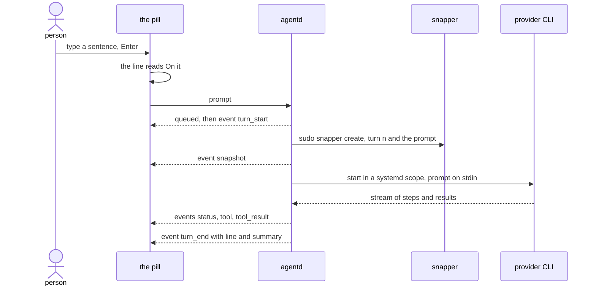
```mermaid
sequenceDiagram
    actor U as person
    participant P as the pill
    participant A as agentd
    participant S as snapper
    participant C as provider CLI
    U->>P: type a sentence, Enter
    P->>P: the line reads On it
    P->>A: prompt
    A-->>P: queued, then event turn_start
    A->>S: sudo snapper create, turn n and the prompt
    A-->>P: event snapshot
    A->>C: start in a systemd scope, prompt on stdin
    C-->>A: stream of steps and results
    A-->>P: events status, tool, tool_result
    A-->>P: event turn_end with line and summary
```

1. The person taps Super (or presses Alt+Space, or clicks the pill; the keys are in [keys and timings](keys-and-timings.md#keys)), types and presses Enter. `PillState.submit` shows `On it` before agentd has answered, and the pill gives the keyboard back.

   

   *The scripted prompt in the field, with the stone's stand-in dot still green.*

   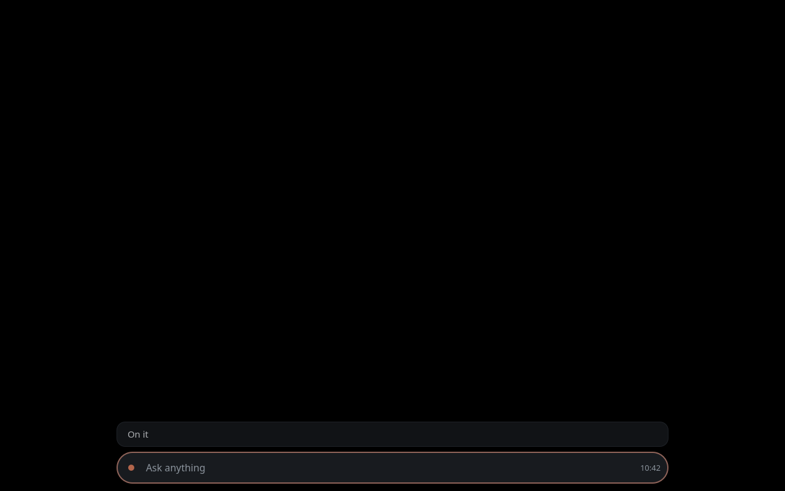

   *`On it` above the pill, a moment after Enter in the scripted run.*

2. agentd sends `turn_start` first, so something true is on screen before snapper runs. Where snapper is configured (`/etc/snapper/configs/root`), the line reads `Saving a restore point` while snapper creates `turn:<n>: <prompt>` (the start of the prompt), and `snapshot` carries its number. The restore point is the one `Undo` uses ([flow 7](#7-undo), [restore points](../architecture/restore-points.md)).
3. agentd starts the provider CLI in its own systemd scope and writes the prompt to its standard input. It sets `BROWSER`, `BOMBADIL_TURN` and `BOMBADIL_SOCKET` for the turn, and `BOMBADIL_TURN_SNAPSHOT` when a restore point was taken. The line reads `Waiting for Claude` until the first word comes.
4. The line follows the agent's work in the present tense: `Installing ffmpeg`, `Building Passwords, 12 lines`. Seconds appear after the first. A step that touches the system gets an amber edge and a step no restore point can undo gets a red edge, each with its exact command ([flow 4](#4-a-system-step-that-needs-a-package)). A plan of two steps or more, or a step that touches the system, also fills the `Now` card on the desk ([desk](../architecture/desk.md)).
5. The turn ends. The line is the first of: `Stopped while …` for a stop, the error when the turn failed or had no reply, the agent's reply, the narrator's summary (`Installed ffmpeg.`), `Done.`. When the turn changed something, the line stays until the next prompt and carries `Undo` and `Details`. When nothing changed it fades by itself ([keys and timings](keys-and-timings.md#the-line-and-the-picture)). A receipt picture follows a turn that changed the network, the disks, the sound, the screens or a service.

   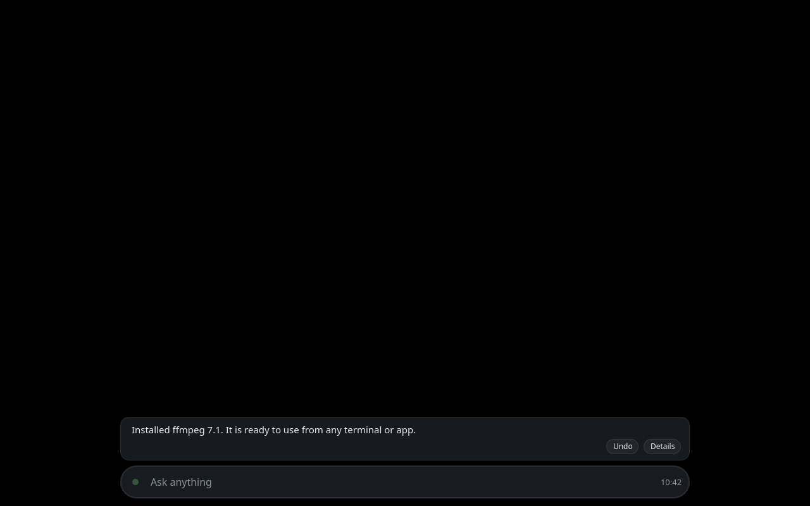

   *The scripted reply on the closing line, with `Undo` and `Details` at its lower right.*

### Where it breaks and what the person sees

| What goes wrong | What the person sees | Code |
|---|---|---|
| agentd is not there | `Not connected to the agent yet.` and the text stays in the field. Esc, `Stop` and `Undo` flash the same sentence | `shell/PillState.qml` (`submit`, `_offline`) |
| agentd is lost during a turn | `Lost touch with the agent. Reconnecting.` for a few seconds while the bar keeps retrying the socket. When it answers, the first `status` says whether a turn is running and the line reads `Working` | `shell/PillState.qml` (`lost`, `handle`), `shell/shell.qml` |
| The AI is not ready (first boot, signed out, offline) | The prompt waits as a `next` chip, the setup line stays, and the prompt runs when the state is `ready` ([flow 2](#2-signing-in-to-a-provider-from-the-pill)). A prompt that starts with `!` does not wait | `src/bombadil/agentd.py` (`_runnable`), `shell/PillState.qml` (`submit`) |
| The provider CLI is missing | The error `<binary> is not installed yet: press Super+Return and run bombadil-setup` on the closing line, with no step run | `src/bombadil/agentd.py` (`turn`) |
| snapper fails | The turn still runs, with no restore point. The error `no undo point for this turn: snapper failed (…)` reaches the line only when the turn has no reply; otherwise it is in `Details` only | `src/bombadil/agentd.py` (`turn`), `shell/PillState.qml` (`turn_end`) |
| No snapper (the live image, a development machine, `snapshots = false`) | No `Saving a restore point` step and no restore point. The `Undo` button still appears on a changed turn, because no shell file reads the `snapshots` flag of `status`, and pressing it answers as [flow 7](#7-undo) says | `src/bombadil/snapshots.py` (`available`), `shell/StatusLine.qml` |
| The provider goes quiet | After a quiet spell with no output and no tool running (six times longer for Codex): `Claude is not answering; check the connection`. The line returns to `Thinking` when output resumes | `src/bombadil/agentd.py` (`watchdog`, `NO_PROGRESS_SECS`), `src/bombadil/providers.py` (`quiet_factor`) |
| The account's limit | `This account has hit a usage or spending limit. Try again after it resets, or raise the limit.` and the first line of the provider's own message. A rate limit says `The provider is rate limiting requests; try again in a minute.` | `src/bombadil/agentd.py` (`_limit_text`) |
| The conversation is gone | The error gets the suffix `(the previous conversation is gone; the next prompt starts a new one)`. agentd keeps the conversation id in memory only, so an agentd restart starts a new conversation | `src/bombadil/agentd.py` (`_on_event`, `session_id`) |
| A command fails inside the turn | `Details` shows `│ failed (exit N)` under the step. The narrator counts a step as done when it starts, so a turn with no reply from the agent can still close with `Installed ffmpeg.` and an `Undo` button after a failed install | `src/bombadil/narrate.py` (`Narrator._set`, `summary`), `src/bombadil/watch.py` |

## 4. A system step that needs a package

**The person wants** a program the computer does not have, installed without being asked for permission and without a surprise.

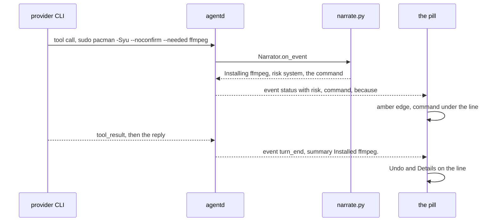
```mermaid
sequenceDiagram
    participant C as provider CLI
    participant A as agentd
    participant N as narrate.py
    participant P as the pill
    C->>A: tool call, sudo pacman -Syu --noconfirm --needed ffmpeg
    A->>N: Narrator.on_event
    N-->>A: Installing ffmpeg, risk system, the command
    A-->>P: event status with risk, command, because
    P->>P: amber edge, command under the line
    C-->>A: tool_result, then the reply
    A-->>P: event turn_end, summary Installed ffmpeg.
    P->>P: Undo and Details on the line
```

The system prompt tells the agent to install with `sudo pacman -Syu --noconfirm --needed <packages>`, never `pacman -Sy` alone, to say in one short sentence why before each step that changes the machine, to tell the person a restart is needed when an upgrade replaced the kernel, and to reply in at most four lines (`system_prompt` in `src/bombadil/providers.py`). Nothing pauses for permission: both CLIs run with full access, and the marks exist so that Esc is in reach.

1. The restore point was taken at the start of the turn ([flow 3](#3-asking-for-something)). Before the command runs, the line reads `Installing ffmpeg` with an amber edge on its left and the exact command under it in monospace, cut when it is long.

   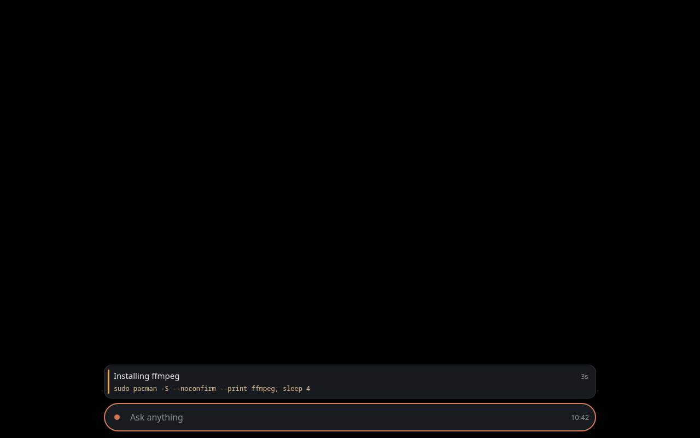

   *The scripted run's command is `sudo pacman -S --noconfirm --print ffmpeg; sleep 4`, a dry run with a pause, so nothing is installed. The line is narrated as an install all the same, as the first row of the table below says.*

2. The agent's own sentence from just before the step, kept short, shows under the command (`because`). On a marked step it is always shown; on other steps it shows when the pointer rests on the line. After the machine read something from outside (a web page, say), a marked step also says `after reading <what>`, by order and never by guessed cause.
3. A step that cannot be undone, such as `mkfs`, `dd` to a device, `wipefs`, `sgdisk -Z`, `rm` under the home folder or `git push --force`, gets a red edge. `rm` under home is marked because home is in no restore point.
4. The turn ends with the agent's reply, or `Installed ffmpeg.` when there is none. `Undo` and `Details` stay on the line. A turn with a red step also shows `can’t be undone`, and `Details` ends with `One step here cannot be undone.`

   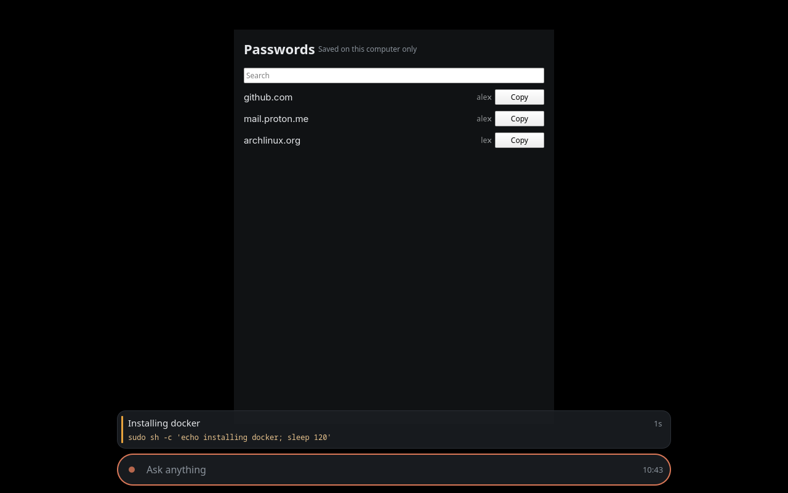

   *A second scripted system step, `sudo sh -c 'echo installing docker; sleep 120'`, read as `Installing docker`.*

### Where it breaks and what the person sees

| What goes wrong | What the person sees | Code |
|---|---|---|
| A dry run is read as an install | `pacman -S --print ffmpeg` is narrated as `Installing ffmpeg` and summarised as `Installed ffmpeg.`: `_pkg_step` does not look at `--print` | `src/bombadil/narrate.py` (`_pkg_step`) |
| The install fails (no network, no such package) | `Details` shows the output and `│ failed (exit N)`. The closing line is the agent's reply, which names the failure. With no reply it falls back to `Installed ffmpeg.` | `src/bombadil/narrate.py`, `src/bombadil/watch.py`, `shell/PillState.qml` |
| The agent runs `pacman -Sy` alone | Nothing stops it. The narrator reads it as `Refreshing the package lists`. The rule is in the system prompt only | `src/bombadil/providers.py` (`system_prompt`), `src/bombadil/narrate.py` |
| The agent runs a command the narrator has no words for | The line reads `Running <program>` or the agent's own description, still amber when `sudo` or a system path is involved | `src/bombadil/narrate.py` (`shell_step`) |
| A kernel upgrade | The agent is told to say that a restart is needed; the line shows its reply. The kernel lives on the EFI partition, outside every restore point, so an undo after a kernel update can pair a newer kernel with older modules | `src/bombadil/providers.py`, [restore points](../architecture/restore-points.md) |

## 5. Stopping a turn

**The person wants** the machine to stop now, whatever it is doing, without breaking anything.

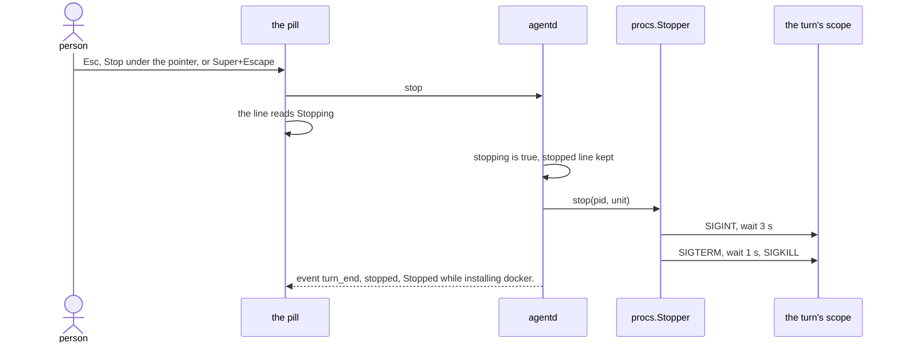
```mermaid
sequenceDiagram
    actor U as person
    participant P as the pill
    participant A as agentd
    participant S as procs.Stopper
    participant T as the turn's scope
    U->>P: Esc, Stop under the pointer, or Super+Escape
    P->>A: stop
    P->>P: the line reads Stopping
    A->>A: stopping is true, stopped line kept
    A->>S: stop(pid, unit)
    S->>T: SIGINT, wait 3 s
    S->>T: SIGTERM, wait 1 s, SIGKILL
    A-->>P: event turn_end, stopped, Stopped while installing docker.
```

The ways in: Esc in the pill, the `Stop` that the stone turns into under the pointer, the word `stop` (or `cancel`, `stop it`, `stop that`), Super+Escape (`bombadil stop`) and the setup chip `Cancel`. A turn can be stopped from the moment Enter shows `On it`, before agentd has confirmed it ([the interaction model](README.md#the-stone-and-the-pills-states)). The keys are in [keys and timings](keys-and-timings.md#keys).

1. The line reads `Stopping` at once; `PillState.stop` sets it before agentd answers, and agentd then sends its own `Stopping` status.
2. agentd signals everything the turn started. Each turn runs in a systemd scope named `bombadil-turn-<agentd pid>-<turn>-<start time>`, so the stopper finds processes that daemonized or were reparented. SIGINT goes first, so the CLI saves its conversation and `sudo` passes the signal on; after 3 s the rest gets SIGTERM, and after one more second SIGKILL.
3. If pacman is running, the line first reads `Stopping after this package`. pacman killed mid-package leaves files its database does not know, so the stopper freezes the rest of the turn with SIGSTOP, sends SIGINT to pacman alone, waits up to 900 s for it to finish the package and exit, and only then stops the rest. pacman and its hooks never get SIGTERM or SIGKILL. A lock file it leaves behind (`/var/lib/pacman/db.lck`) is removed once no pacman runs.
4. The line becomes `Stopped while installing docker.`, or `Stopped.` when no step had started. The stone shows its `stopped` face. `Undo` is not offered after a stop, because a stopped turn is not sticky; `Details` is, when the turn changed something.

   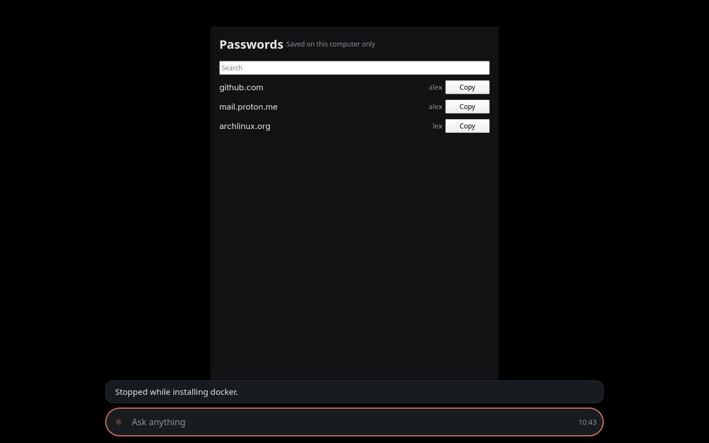

   *The stopped line of the scripted run. The queued prompt's chip is gone and no button shows. The picture before it, `docs/screens/pill/13-stopping.png`, looks the same, so no picture shows the `Stopping` moment.*

5. A queued prompt starts at once ([flow 6](#6-queueing-asks-while-one-runs)), and the stopped line stays over it for a moment.
6. Windows the turn opened are left alone, because they are the person's from then on: the browser panel (`--class=bombadil-browser`), the terminal (`--app-id=bombadil-terminal`), the details drawer (`--app-id=bombadil-details`), Files (`nautilus`) and apps (`bombadil-app run <name>`).

### Where it breaks and what the person sees

| What goes wrong | What the person sees | Code |
|---|---|---|
| Stop arrives while the restore point is being saved | The turn ends before the CLI starts, and the line reads `Stopped.` | `src/bombadil/agentd.py` (`turn`) |
| Stop arrives while the CLI is starting | The stopper runs as soon as the process exists | `src/bombadil/agentd.py` (`turn`, `_stop_proc`) |
| Nothing is running | The word `stop` answers `Nothing is running.` Esc clears typed text, and with the field empty it puts the line, the picture and the drawer away | `src/bombadil/agentd.py` (`local`), `shell/shell.qml` |
| A sign-in is under way | Esc cancels it ([flow 2](#2-signing-in-to-a-provider-from-the-pill)) | `src/bombadil/agentd.py` (`stop`) |
| A step runs as root | The stopper signals root processes with `sudo -n kill` when there is no `sudo` above them to relay the signal | `src/bombadil/procs.py` (`_signal`) |
| pacman has not stopped after 900 s | It is left alone, never killed, and the rest of the turn is stopped; its lock is not removed while it runs | `src/bombadil/procs.py` (`Stopper.stop`) |
| The stopper itself fails | The error `stop: <reason>` appears, and the CLI is killed outright so the turn never keeps running | `src/bombadil/agentd.py` (`_stop_proc`) |
| agentd is gone | In the pill, `Not connected to the agent yet.` Super+Escape prints `agentd is not running (<reason>)` to standard error and exits 1, which a key bind does not show | `bin/bombadil` (`send`), `shell/PillState.qml` |

## 6. Queueing asks while one runs

**The person wants** to think of the next thing while the machine is busy and have it happen after, without waiting at the keyboard.

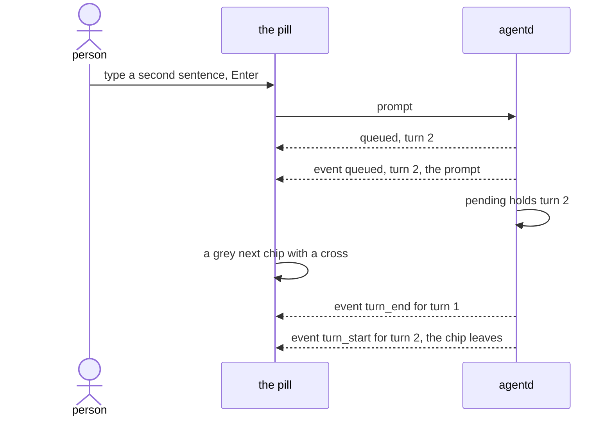
```mermaid
sequenceDiagram
    actor U as person
    participant P as the pill
    participant A as agentd
    U->>P: type a second sentence, Enter
    P->>A: prompt
    A-->>P: queued, turn 2
    A-->>P: event queued, turn 2, the prompt
    A->>A: pending holds turn 2
    P->>P: a grey next chip with a cross
    A-->>P: event turn_end for turn 1
    A-->>P: event turn_start for turn 2, the chip leaves
```

1. While a turn runs, the pill still takes text. Enter sends the prompt and the pill does not show a second `On it`.
2. agentd accepts it at once (`queued` to the sender) and tells every bar (`queued` event) because a turn is running. A grey chip reads `next`, the prompt and `×`, between the line and the pill. There is one chip per waiting prompt, in the order they will run.

   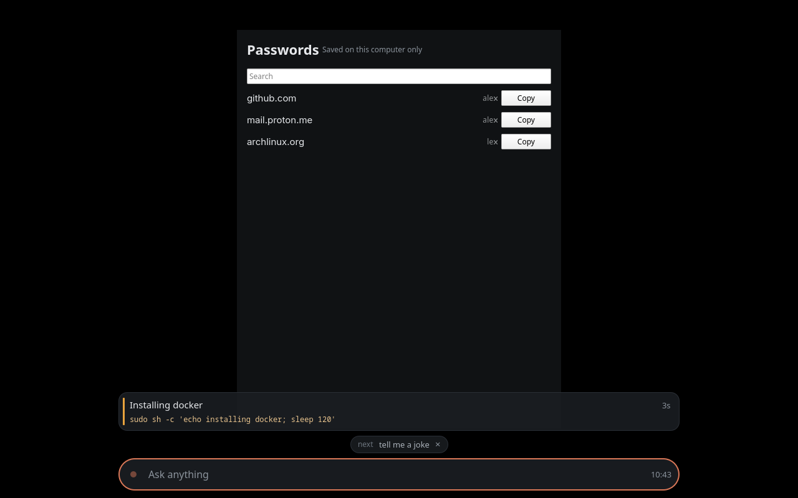

   *The scripted `tell me a joke` waiting behind the `Installing docker` step.*

3. The `×` sends `unqueue`; agentd drops the prompt and sends `unqueued`, and the bar removes the chip at once without waiting for it.
4. When the running turn ends, or is stopped, the next prompt starts at once and its chip leaves with `turn_start`.

Words the launcher knows are never queued: they are answered at once, also while a turn runs ([flow 11](#11-the-launcher-words-and-completing-with-tab)). `undo`, `restart` and `shutdown` stop the running turn first and hold the queue until they are done ([flow 7](#7-undo)).

### Where it breaks and what the person sees

| What goes wrong | What the person sees | Code |
|---|---|---|
| The AI is not ready | Prompts queue the same way, with the setup line above them. When sign-in is cancelled they are dropped and their chips go; when it succeeds they run in order | `src/bombadil/agentd.py` (`handle`, `_drop_waiting`) |
| Stop is pressed | The running turn stops and the next prompt starts. Stop does not clear the queue; each chip needs its `×` | `src/bombadil/agentd.py` (`stop`, `_worker`) |
| The login was lost in a turn | The prompt that found it lost goes back to the front of the queue once, with its chip, and runs after the sign-in | `src/bombadil/agentd.py` (`_signed_out_turn`) |
| agentd restarts | The queue is held in memory (`AgentD.pending`), so it is empty after a restart and the chips go with the first `status` | `src/bombadil/agentd.py`, `shell/PillState.qml` (`_setQueue`) |

## 7. Undo

**The person wants** to take back what the machine just did to the system.

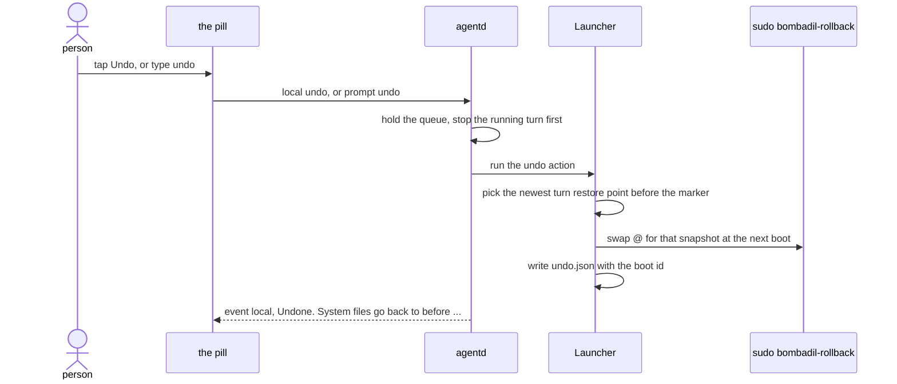
```mermaid
sequenceDiagram
    actor U as person
    participant P as the pill
    participant A as agentd
    participant L as Launcher
    participant R as sudo bombadil-rollback
    U->>P: tap Undo, or type undo
    P->>A: local undo, or prompt undo
    A->>A: hold the queue, stop the running turn first
    A->>L: run the undo action
    L->>L: pick the newest turn restore point before the marker
    L->>R: swap @ for that snapshot at the next boot
    L->>L: write undo.json with the boot id
    A-->>P: event local, Undone. System files go back to before ...
```

1. A turn that changed something ends with `Undo` and `Details` on its line. The words `undo`, `undo that`, `undo it` and `undo the last change` do the same, at any time.
2. The line reads `Undoing the last change`, then the answer, which stays longer than most lines so that it can be read: `Undone. System files go back to before “install ffmpeg” when you restart. Your home folder and apps stay as they are.` The quoted words are the prompt in the restore point's description.
3. The system keeps running as it was. `bombadil-rollback N` makes snapshot `N` the root from the next boot on, and keeps the old root as `@.undone-<time>`. The word `restart` (`Restarting.`) applies it.
4. A second undo before a new turn goes one turn further back. An undo before the restart says `Already undone: when you restart, system files go back to before “…”, and that takes back everything since too.`, once, and the undo after that goes further back.

   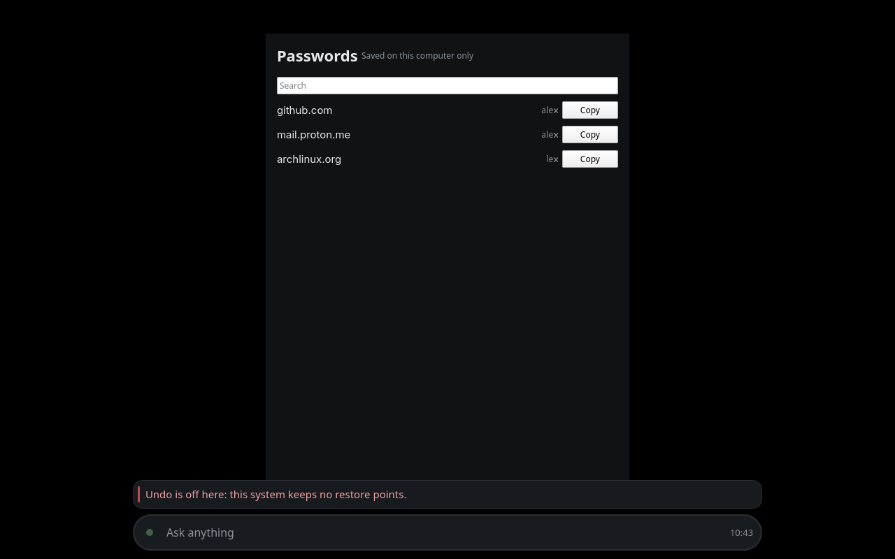

   *The answer where no restore points exist, which is the case in the scripted run. The line has a red edge.*

If the turn that is running is the one to undo, undo ends it first. While an undo runs, no queued turn starts, so it cannot take the restore point the undo needs. A sentence such as `please undo that` is not a launcher word: it goes to the agent, whose `rollback` tool takes the last turn's restore point and skips the one of its own turn (`BOMBADIL_TURN_SNAPSHOT`). Undo of an app or of a file in the home folder in a second, without a restart, is Designed ([How Bombadil should feel, build these first](../design/ux-brief.md#build-these-first), piece 3).

### Where it breaks and what the person sees

| What goes wrong | What the person sees | Code |
|---|---|---|
| The live image | In red: `Undo starts once Bombadil is installed. The live system keeps no restore points.` The `Undo` button still shows on a changed turn, and a tap on it gives this line | `src/bombadil/launcher.py` (`_undo`) |
| Installed, but snapper or its `root` config is missing, or `snapshots = false` | In red: `Undo is off here: this system keeps no restore points.` | `src/bombadil/launcher.py` (`_undo`), `src/bombadil/snapshots.py` (`available`) |
| No turn left to undo | `Nothing to undo yet.` in red | `src/bombadil/launcher.py` (`_undo`) |
| `sudo bombadil-rollback` fails | `Could not undo: <last line of its error>`, for example `no snapshot 7` | `src/bombadil/launcher.py` (`run`, `_reason`), `iso/airootfs/usr/local/bin/bombadil-rollback` |
| The turn was stopped | No `Undo` button, because a stopped turn is not sticky. The word `undo` still works | `shell/PillState.qml` (`turn_end`), `shell/StatusLine.qml` |
| The turn changed the home folder or an app | Undo says so only after the fact: `Your home folder and apps stay as they are.` `rm` under home is marked `can’t be undone` before it runs | `src/bombadil/launcher.py`, `src/bombadil/narrate.py` (`_irreversible`) |
| `bombadil undo` in a terminal | It prints `rolled back to N; reboot to apply` and does not write the marker, so two runs in a row pick the same restore point | `bin/bombadil`, `src/bombadil/snapshots.py` (`undo_last_turn`) |
| After an undo and a restart | The restore points of the turns that were taken back remain, so the next undo can pick one of them; see [restore points](../architecture/restore-points.md) | `src/bombadil/launcher.py` (`_undo`) |
| After the restart | A new conversation: the earlier one lived in agentd's memory | `src/bombadil/agentd.py` (`session_id`) |

## 8. Building an app and opening it

**The person wants** a small tool for a job, as a real window they can use again.

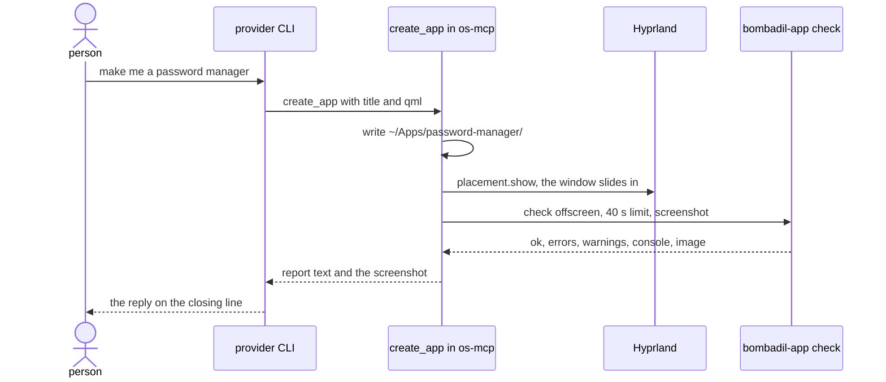
```mermaid
sequenceDiagram
    actor U as person
    participant C as provider CLI
    participant M as create_app in os-mcp
    participant H as Hyprland
    participant K as bombadil-app check
    U->>C: make me a password manager
    C->>M: create_app with title and qml
    M->>M: write ~/Apps/password-manager/
    M->>H: placement.show, the window slides in
    M->>K: check offscreen, 40 s limit, screenshot
    K-->>M: ok, errors, warnings, console, image
    M-->>C: report text and the screenshot
    C-->>U: the reply on the closing line
```

1. The line reads `On it`, then follows the `create_app` call as it streams: `Building an app`, `Building Passwords`, `Building Passwords, 2 lines`, up to `Building Passwords, 12 lines`.

   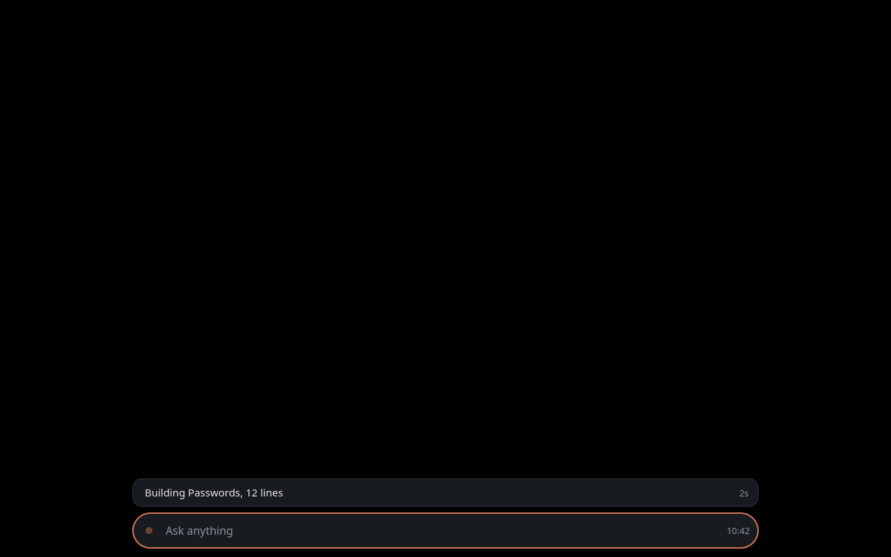

   *The line while the scripted `create_app` call streams its QML.*

2. The app is written to `~/Apps/<name>/`, where the name is the title in kebab-case (`Password Manager` becomes `password-manager`). The window slides in from its own special workspace, `special:app-<name>`, floating and centred in a slot sized for a 540 by 660 card (the next app opens a step down and to the right, so a second never hides the first's heading), before the check has finished. A chip for the app appears above the pill: a click slides the window in or out, and `×` runs `bombadil-app close <name>`.
3. The check loads the app offscreen and gives the agent the errors with file and line, the warnings, the console output and a screenshot. The agent looks at the picture and calls `create_app` again with the complete files if something is off. An app that is already running reloads in place and keeps its saved state.
4. The turn ends with the agent's reply and `Undo` and `Details`.

   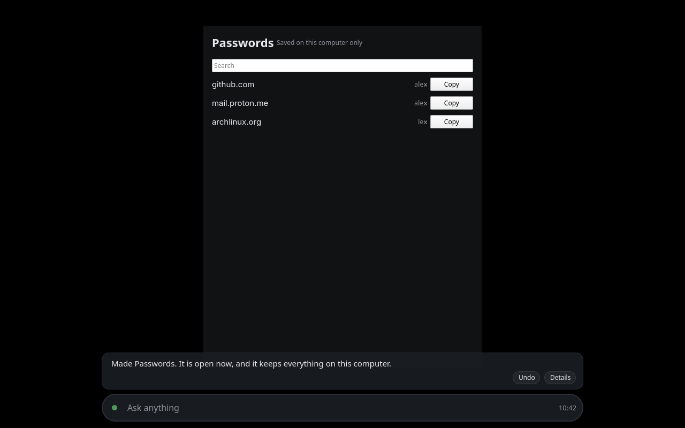

   *The scripted app, with sample entries for `alex`, and the closing line over the window's foot.*

5. Later, `passwords` or `open passwords` brings the window back (`Opened Passwords.`), `close passwords` quits it (`Closed Passwords.`) and `hide passwords` puts it away (`Put Passwords away.`). Inside the window Esc hides the app and Ctrl+W closes it. Tab completes the name ([flow 11](#11-the-launcher-words-and-completing-with-tab)).

   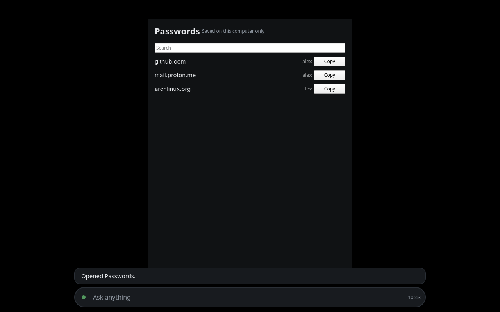

   *The window back in the middle of the screen after the word `passwords`.*

### Where it breaks and what the person sees

| What goes wrong | What the person sees | Code |
|---|---|---|
| The check fails | The agent is told `<name>: check FAILED. The files are written; a running app keeps its last good version with a red banner (or shows the error list if it never loaded)` and fixes each error. A running app shows a red banner `Reload failed` that opens to the error; an app that never loaded shows `<title> could not load` with the errors | `src/bombadil/appkit/tools.py` (`report`), `src/bombadil/appkit/runtime.py` (`ERROR_VIEW`), `share/qml/Bombadil/AppWindow.qml` |
| The check does not finish in 40 s | The agent is told `the check did not finish in 40 s` and suggests an endless loop; the turn goes on | `src/bombadil/appkit/tools.py` (`run_check`, `CHECK_TIMEOUT`) |
| The title cannot become a name | The agent gets `cannot make an app name from '<title>'` and tries another | `src/bombadil/apps.py` (`slug`, `NAME_RE`) |
| The window cannot be shown | The agent gets `could not show it: <reason>`; the files are written and the check still runs | `src/bombadil/appkit/tools.py` (`create_app`) |
| The window opens late | The tool reports `started <name>; it slides in when its window opens` and the card appears when the app has mapped | `src/bombadil/appkit/placement.py` (`show`) |
| The person says `undo` | System files go back; the app stays, because it lives in `~/Apps` and home is in no restore point | `src/bombadil/launcher.py` (`_undo`) |
| `close passwords` and the app will not quit in 3 s | It is killed (`unsaved changes are lost`), or the line says `Could not close Passwords: …` when it cannot be killed | `src/bombadil/appkit/placement.py` (`close`), `src/bombadil/launcher.py` (`_app`) |
| The app is not on screen when asked to hide | `Passwords is not on screen.` | `src/bombadil/appkit/placement.py` (`hide`), `src/bombadil/launcher.py` (`_app`) |

## 9. The browser panel and a link from the terminal

**The person wants** to see a web page without leaving the desktop, and to have every link, from anywhere, open in the same place.

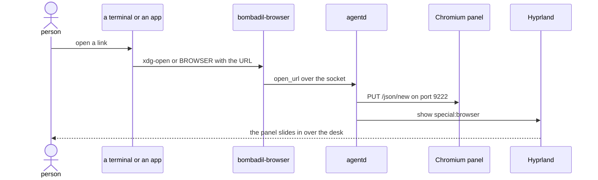
```mermaid
sequenceDiagram
    actor U as person
    participant T as a terminal or an app
    participant B as bombadil-browser
    participant A as agentd
    participant W as Chromium panel
    participant H as Hyprland
    U->>T: open a link
    T->>B: xdg-open or BROWSER with the URL
    B->>A: open_url over the socket
    A->>W: PUT /json/new on port 9222
    A->>H: show special:browser
    H-->>U: the panel slides in over the desk
```

The ways in: a link handed to `xdg-open` (`bombadil-browser.desktop` is the default handler for `http`, `https` and HTML), `$BROWSER` for every turn and for the sign-in, the agent's `show_panel` tool, a click on a picture box that names a page, Super+B ([keys](keys-and-timings.md#hyprland-binds)), and the words `browser`, `web`, `chrome`, `internet` and `google`. Whether the terminal hands a link to `xdg-open` is the terminal's own setting; this repository sets none for it.

1. `bin/bombadil-browser` repairs the argument (`example.com` becomes `https://example.com`, `localhost` becomes `http://localhost`, a path that exists becomes a `file://` address) and tells agentd.
2. agentd opens the address as a new tab through Chromium's debugging port (9222) and slides the panel in by showing `special:browser`. When Chromium is not running it starts it with that one page, in its own profile (`--user-data-dir` under the data directory, class `bombadil-browser`).

   

   *The panel over the desk, on a search page, with the pill below it.*

3. The panel is a special workspace on top of the desk. Super+B, or the words `hide the browser`, `close the browser` and `put away the browser`, slide it back (`Put the browser away.`). The word `browser` or `open the browser` slides it in (`Opened the browser.`, or `Opened the browser, it is still starting.`). Stop leaves the browser alone ([flow 5](#5-stopping-a-turn)).

### Where it breaks and what the person sees

| What goes wrong | What the person sees | Code |
|---|---|---|
| The address is not `http`, `https` or `file` | A red line: `Not opening '<address>': only web pages and files open here.` | `src/bombadil/agentd.py` (`open_url`) |
| agentd is not running | `bombadil-browser` opens the panel itself, through `browser.open_url` | `bin/bombadil-browser` |
| Chromium is not installed | A line `Could not open the link: chromium is not installed`. Without agentd, `bombadil-browser` prints `bombadil-browser: chromium is not installed` on standard error and exits 1 | `src/bombadil/browser.py` (`open_url`), `src/bombadil/agentd.py` (`open_url`), `bin/bombadil-browser` |
| A picture box names a page and it will not open | `Could not open the page: <reason>.` This route calls `browser.open_url` directly and not agentd's `open_url` | `src/bombadil/launcher.py` (`open_thing`) |
| Chromium is starting and does not answer in 20 s | `Could not open the link: the browser is still starting` | `src/bombadil/browser.py` (`open_url`) |
| The browser is up but will not open the page | `Could not open the link: the browser would not open the page` | `src/bombadil/browser.py` (`_new_tab`, `open_url`) |
| Chromium exits as it starts | `Could not open the link: the browser closed as it started` | `src/bombadil/browser.py` (`open_url`) |
| The panel cannot slide in | The page is open and nothing is said on screen; the message `browser: could not slide the panel in` goes to standard error. Super+B shows the panel | `src/bombadil/browser.py` (`open_url`) |
| The link is the sign-in page of the provider being signed in | It becomes the sign-in's own page, with the sign-in's chips ([flow 2](#2-signing-in-to-a-provider-from-the-pill)) | `src/bombadil/agentd.py` (`open_url`), `src/bombadil/signin.py` (`browser_url`) |

## 10. Opening the details drawer

**The person wants** to see exactly what the machine ran, in order, with its output.

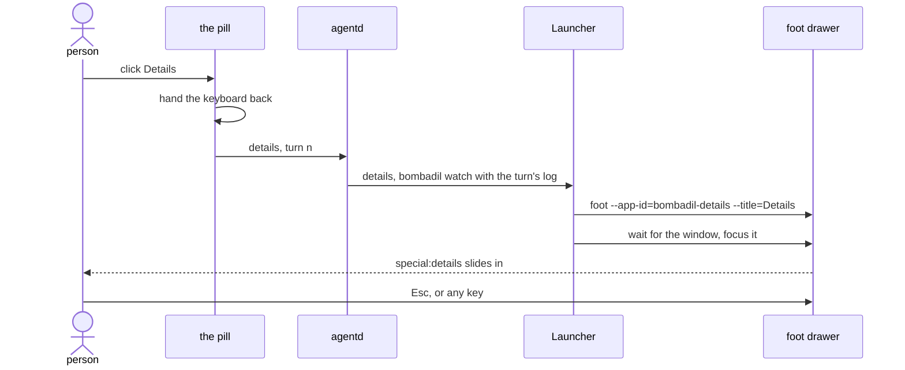
```mermaid
sequenceDiagram
    actor U as person
    participant P as the pill
    participant A as agentd
    participant L as Launcher
    participant D as foot drawer
    U->>P: click Details
    P->>P: hand the keyboard back
    P->>A: details, turn n
    A->>L: details, bombadil watch with the turn's log
    L->>D: foot --app-id=bombadil-details --title=Details
    L->>D: wait for the window, focus it
    D-->>U: special:details slides in
    U->>D: Esc, or any key
```

The ways in: the `Details` button on a finished line, a tap on a finished line, a click on a picture box that names a turn (the other boxes open a service, a package, a folder or a text file in the same drawer, or a page in the browser panel), and the words `history` (or `rewind`) and `wifi`. A second click on `Details` for the same turn closes the drawer.

1. The pill gives the keyboard back, because the drawer must take it, and sends `details` with the turn's number. agentd starts `foot --app-id=bombadil-details --title=Details` running `bombadil watch --file <the turn's log>`, adds `--follow` when the turn is still running, and waits for the window to open so that it can focus it.
2. The drawer slides in on `special:details` with the keyboard in it. It lists the prompt and the time, `restore point N`, each step as `▸ Installing docker` with `[system]` or `[cannot be undone]`, the exact command after `$`, the agent's reason after `why:`, the output after `│`, `│ failed (exit N)` or `│ stopped`, errors after `!`, and the closing line with its seconds. A turn that read things lists what was yours and what came from outside.

   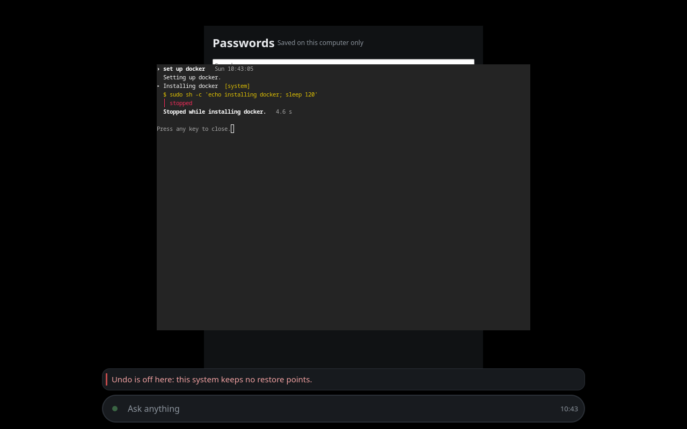

   *The scripted `set up docker` turn in the drawer. The picture's last line is `Press any key to close.`; `src/bombadil/watch.py` says `Press Esc to close.` as of 2026-10-01, and any key still closes.*

3. Any key closes a turn's details and the history, also while a running turn is followed; `Esc` or `q` closes the other views ([keys](keys-and-timings.md#in-the-details-drawer)). Esc in the pill with nothing to stop or clear closes it too (`close_details`), and the same Esc puts the line away and gives the keyboard back.

   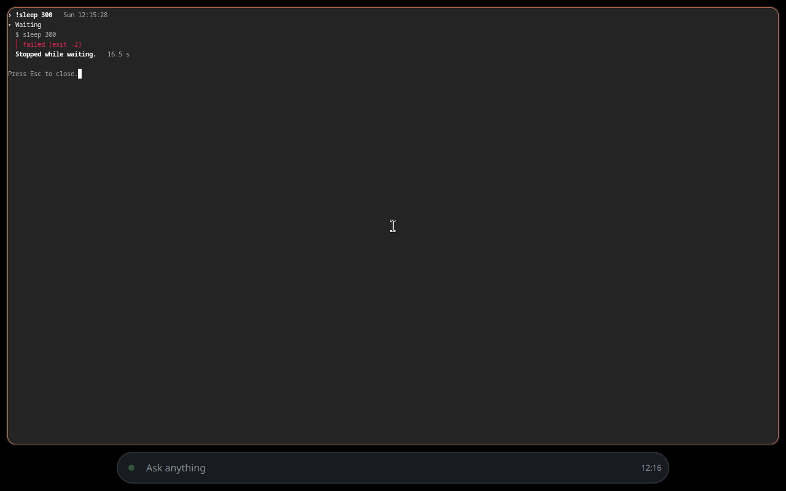

   *The drawer in a virtual machine, with `Press Esc to close.` at the bottom.*

4. `history` fills the drawer with `bombadil history`: the turns by day, with the time, the prompt, the summary and `(restore point N)`; the line says `Opened the history.` `wifi` runs `nmtui connect` in the same drawer (`Opened Wi-Fi.`).

### Where it breaks and what the person sees

| What goes wrong | What the person sees | Code |
|---|---|---|
| `foot` is not installed | `Could not show the details: foot is not installed` | `src/bombadil/launcher.py` (`details`), `src/bombadil/agentd.py` (`details`) |
| The drawer's program ends before its window shows | Nothing: `Launcher.details` returns `failed` and `AgentD.details` does not read it. The other ways in say `Could not open <what>.` | `src/bombadil/agentd.py` (`details`), `src/bombadil/launcher.py` (`_view`) |
| No turn has run | The drawer prints `No turns yet.` and waits for a key | `src/bombadil/watch.py` (`show`) |
| The turn is not one of the last 50 | A click on a box that names that turn answers `The details of turn N are not kept.` | `src/bombadil/agentd.py` (`open_thing`, `turn_logs`) |
| The person presses Esc in the pill while a turn runs, or with text typed | Esc stops the turn, or clears the text, and leaves the drawer open. The drawer closes on an Esc with the field empty and nothing to stop | `shell/shell.qml`, `src/bombadil/launcher.py` (`close_details`) |
| agentd is not there | `Not connected to the agent yet.` and the drawer does not open | `shell/PillState.qml` (`details`, `_offline`) |
| A box names a path that is gone | `<name> is not there.` | `src/bombadil/launcher.py` (`open_thing`) |

## 11. The launcher words and completing with Tab

**The person wants** to open and close things by name, and to ask the machine plain questions about itself, instantly and without waiting for a model.

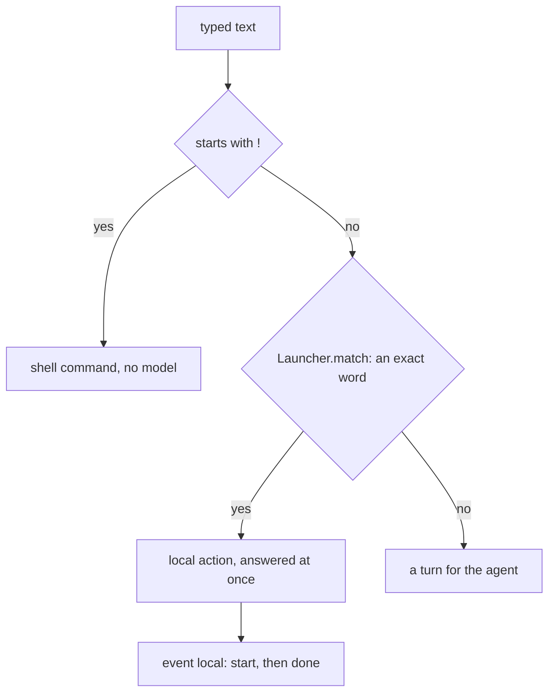
```mermaid
flowchart TD
    T["typed text"] --> B{"starts with !"}
    B -->|yes| S["shell command, no model"]
    B -->|no| M{"Launcher.match: an exact word"}
    M -->|yes| L["local action, answered at once"]
    M -->|no| Q["a turn for the agent"]
    L --> E["event local: start, then done"]
```

`Launcher.match` in `src/bombadil/launcher.py` decides, and it is exact: the line must be a whole word or phrase, after trimming signs and folding case. The words, the order in which `match` tries them and the answer to each are in [the launcher words](keys-and-timings.md#the-launcher-words); this flow does not repeat them. In short: `why` while a turn runs, a picture phrase, a sign-in word, a provider verb, a core command, an app or a panel with or without a verb, a utility, and a desk widget with a verb, in that order. Anything else goes to the agent as a turn. A text in another script, or with signs in it, matches only as an app's own title.

A line that starts with `!` is never a launcher word: it runs as a shell command in a turn of its own, with no model, and its output is the closing line.

1. The person types `pass`. The rest of a name that Tab would complete, `words`, appears after it in a dimmer grey. Tab takes it. Completion starts after a couple of characters, tries apps first, then panels, widgets and commands, and never offers `restart`, `shutdown`, `lock` or `stop`, so a stray Tab cannot land on them.

   

   *`pass` in the field with the ghost of `words`.*

2. When the text is an exact word, a small `↵ Passwords` appears at the right end of the pill. It tells the person Enter will open it and no model will be asked.

   

   *`passwords` in full, with `↵ Passwords` before the clock.*

3. Enter shows `Opening Passwords` at once, then `Opened Passwords.` for a few seconds. In the scripted run the answer needed no model call (`docs/screens/pill/checks.log`).
4. `!uname -s` shows the command's output as a single line. A `!` line also gets a restore point where snapper is configured, and it runs while the AI is not ready.

   

   *The output of a scripted `!` command: the kernel's name and release.*

### Where it breaks and what the person sees

| What goes wrong | What the person sees | Code |
|---|---|---|
| `restart?`, `shutdown?`, `desk?` or `show machine?` | The text goes to the agent as a question; the launcher does not act on it | `src/bombadil/launcher.py` (`match`), `shell/PillState.qml` (`exact`) |
| An action fails | A red line such as `Could not open Passwords: <reason>` | `src/bombadil/launcher.py` (`run`, `failed`) |
| An app has the name of a utility (`Sound`) | The app wins, because apps and panels are tried before utilities | `src/bombadil/launcher.py` (`match`) |
| `restart` or `shutdown` typed in full | They run at once, with no question: `Restarting.`, `Shutting down.` | `src/bombadil/launcher.py` (`_restart`, `_shutdown`) |
| `lock` without `hyprlock` | `Nothing can lock the screen yet: hyprlock is not installed.` | `src/bombadil/launcher.py` (`_lock`) |
| An app was just made | Its name completes a few seconds later: agentd looks at `~/Apps` at a short interval and sends a new `entries` message | `src/bombadil/agentd.py` (`_watch_apps`) |
| agentd is not there | Tab still completes from the last `entries` message. Enter shows `Not connected to the agent yet.` | `shell/PillState.qml` (`completion`, `submit`) |
| A panel's app is still starting | `Opened the browser, it is still starting.` | `src/bombadil/launcher.py` (`_panel`), `src/bombadil/hypr.py` (`panel`) |

## 12. The desk being asked for

**The person wants** a card beside the pill shown or put away, or every card folded, in their own words.

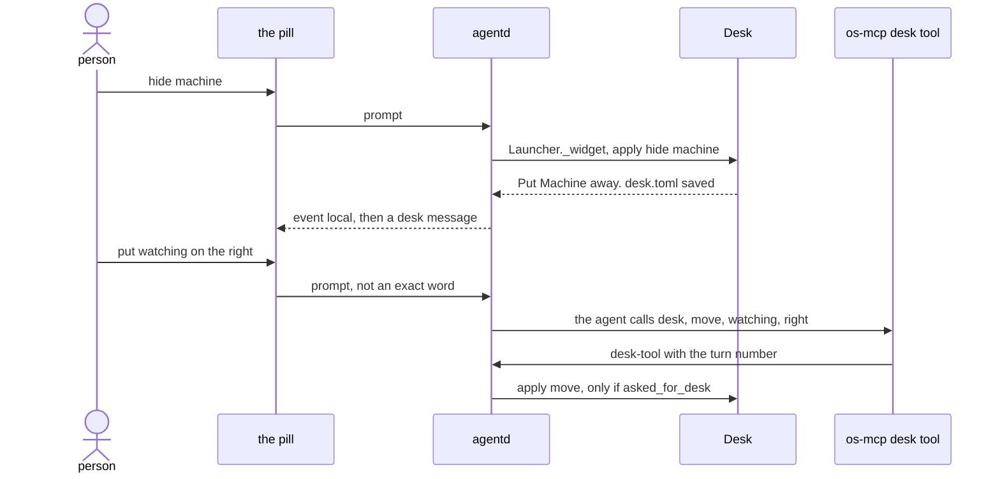
```mermaid
sequenceDiagram
    actor U as person
    participant P as the pill
    participant A as agentd
    participant D as Desk
    participant M as os-mcp desk tool
    U->>P: hide machine
    P->>A: prompt
    A->>D: Launcher._widget, apply hide machine
    D-->>A: Put Machine away. desk.toml saved
    A-->>P: event local, then a desk message
    U->>P: put watching on the right
    P->>A: prompt, not an exact word
    A->>M: the agent calls desk, move, watching, right
    M->>A: desk-tool with the turn number
    A->>D: apply move, only if asked_for_desk
```

There are two ways. The exact words (`desk`, `show machine`, `hide watching`, `put watching away`) go through `Launcher` straight to `Desk.apply`, with no model. A sentence that is not an exact word goes to the agent, which may call its `desk` tool; agentd lets that call through only when the person's own typed words for that turn ask for the desk (`asked_for_desk` in `src/bombadil/desk.py`: the word `desk` or `widget`, or a verb such as `show`, `hide`, `put`, `move` or `fold` followed at once by a widget's name).

1. `desk` folds every card to a strip beside the pill (`Folded the desk.`) and says the same word again to unfold it (`Unfolded the desk.`).
2. `hide machine` answers `Put Machine away.` and `show machine` answers `Put Machine on the desk.`, or `Machine is already on the desk.` A card appears only when its widget has something to say. On `main` that is `Now` (a plan of two steps or more, or a step that touches the system), `Watching` (while agentd lists a job) and `Needs you` (two waiting rows or more). `Alive`, `Away` and `Machine` have no card and no feed.
3. `hide needs` answers `Needs you cannot be hidden.`

   

   *A headless desk test. `Watching` on the left, the red-edged answer `Needs you cannot be hidden.` above the pill, and `Needs you` on the right. The test's driver injects the `jobs` and `dev` messages that fill the two cards (`tests/desktop/driver.py`).*

4. A sentence such as `put watching on the right` reaches the agent. Its `desk` tool sends `desk-tool` with the turn number to agentd, which checks that the turn is the running one and the person asked, then applies the move and answers `Moved Watching to the right rail.`
5. The layout is kept in `desk.toml` in the state directory, outside every restore point, so an undo never moves it.

### Where it breaks and what the person sees

| What goes wrong | What the person sees | Code |
|---|---|---|
| The agent changes the desk in a turn that did not ask | Nothing changes. The agent is told `The person did not ask for the desk in this turn, so it stays as it is. Rearrange it only when they ask.` | `src/bombadil/agentd.py` (`_desk_tool`), `src/bombadil/desk.py` (`asked_for_desk`) |
| The turn is over or is being stopped | `That turn is over, so the desk stays as it is.` goes to the agent | `src/bombadil/agentd.py` (`_desk_tool`) |
| An unknown widget or operation | `There is no widget called 'x'. The widgets are Now, Watching, Alive, Needs you, Away and Machine.` or `The desk cannot <op>. …` | `src/bombadil/desk.py` (`Desk._apply`), `src/bombadil/agentd.py` |
| `desk?` or `show machine?` | A question: it goes to the agent and the desk does not change | `src/bombadil/launcher.py` (`match`) |
| `show machine`, `show away` or `show alive` | The line says `Put … on the desk.` but no card appears, because none has rows on `main` | `shell/DeskState.qml` (`awayModel`, `machineModel`, `aliveModel`) |
| Two coding sessions wait | The `Needs you` card and the stone's knock are designed for this, but nothing on `main` sends the `dev` message that fills them | `shell/DeskState.qml` (`_applyDev`), [desk](../architecture/desk.md) |
| A window covers a card, or the screen is narrow | The card folds to a strip, whatever the person asked ([the interaction model](README.md#the-surfaces)) | `shell/DeskState.qml` |
| `desk.toml` cannot be written | The change holds until agentd stops and is not saved, so a restart brings back the earlier layout. The reason goes to standard error | `src/bombadil/desk.py` (`save`) |

## 13. Install to disk

**The person wants** to keep this system on the computer, with undo, instead of running it from the USB stick.

On `main` this is a command typed in a terminal. The install card in the pill, with the disk drawn as a bar, one password and one red button, is Designed ([the installed OS](../architecture/installed-os.md), [Bombadil, installed](../design/installed-os-brief.md#build-these-first)).

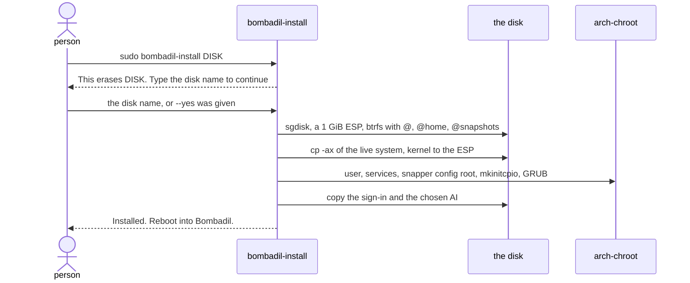
```mermaid
sequenceDiagram
    actor U as person
    participant I as bombadil-install
    participant D as the disk
    participant C as arch-chroot
    U->>I: sudo bombadil-install DISK
    I-->>U: This erases DISK. Type the disk name to continue
    U->>I: the disk name, or --yes was given
    I->>D: sgdisk, a 1 GiB ESP, btrfs with @, @home, @snapshots
    I->>D: cp -ax of the live system, kernel to the ESP
    I->>C: user, services, snapper config root, mkinitcpio, GRUB
    I->>D: copy the sign-in and the chosen AI
    I-->>U: Installed. Reboot into Bombadil.
```

1. The person opens a terminal (Super+Return) and runs `sudo bombadil-install /dev/<disk>`. The script asks `This erases /dev/<disk>. Type the disk name to continue: `; anything else exits. With `--yes` it does not ask.
2. It wipes the partition table, makes a 1 GiB EFI partition and a btrfs root with the subvolumes `@`, `@home` and `@snapshots`, and prints `Copying the system…` while it copies the running live system with `cp -ax`. The kernel is copied from `/run/archiso/bootmnt` to the EFI partition.
3. In a chroot it creates the machine id, the user `user` with no password, enables `greetd` and `NetworkManager`, creates the snapper config named `root`, builds the initramfs and installs GRUB with a hidden menu (hold Esc at power-on to see it).
4. It copies `.claude`, `.claude.json`, `.codex` and `.config/bombadil` from the live home when they exist, so the installed system starts signed in with the same AI chosen.
5. It prints `Installed. Reboot into Bombadil.` After the restart, the desk opens without a login screen. If the live system had been signed in, the pill asks nothing; otherwise it asks `Which AI should run this computer?` as in [flow 1](#1-first-boot-and-setup). From the first turn there is a restore point, and [flow 7](#7-undo) works.

Until the install, the pill says what is missing in its own words: `Undo starts once Bombadil is installed. The live system keeps no restore points.`

### Where it breaks and what the person sees

| What goes wrong | What the person sees | Code |
|---|---|---|
| The wrong disk is named | Nothing checks: the typed name is the only guard. The script does not look at whether the disk holds data or is the one the system is running from | `iso/airootfs/usr/local/bin/bombadil-install` |
| The disk name is not typed | The script exits with status 1 and the disk is untouched | `iso/airootfs/usr/local/bin/bombadil-install` |
| A tool fails part-way | The script stops with that tool's own message (`set -euo pipefail`). There is no cleanup: the new filesystems stay mounted under `/mnt` and the disk is half written | `iso/airootfs/usr/local/bin/bombadil-install` |
| The firmware is not UEFI | Not handled: the script installs GRUB for UEFI only (`--target=x86_64-efi`) and makes an EFI partition | `iso/airootfs/usr/local/bin/bombadil-install` |
| The installed system has no password | The user has none and `sudo` asks for none (`iso/airootfs/etc/sudoers.d/bombadil`); a password step is part of the Designed install card | `iso/airootfs/usr/local/bin/bombadil-install`, [installed OS](../architecture/installed-os.md) |
| Kernel updates and undo | The kernel and initramfs sit on the EFI partition, outside `@`, so an undo after a kernel update can pair a newer kernel with older modules | [restore points](../architecture/restore-points.md) |
| No baseline restore point at install | The first undo can go back only to the start of the first turn | [restore points](../architecture/restore-points.md) |
