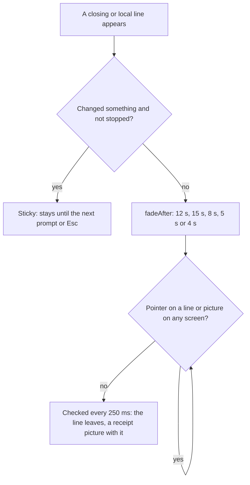

# Keys, timings and limits

> **Status:** Partly shipped
> **Code:** `iso/airootfs/etc/skel/.config/hypr/hyprland.lua`, `shell/shell.qml`, `shell/PillState.qml`, `shell/StatusLine.qml`, `shell/CardHost.qml`, `shell/Stone.qml`, `shell/DeskState.qml`, `shell/DeskTheme.js`, `shell/HyprCover.qml`, `src/bombadil/launcher.py`, `src/bombadil/agentd.py`, `src/bombadil/cards.py`, `src/bombadil/desk.py`, `src/bombadil/narrate.py`, `src/bombadil/jobs.py`, `src/bombadil/hypr.py`, `src/bombadil/pager.py`, `share/qml/Bombadil/Theme.qml`
> **Design:** [Principles](../principles.md), [How Bombadil should feel](../design/ux-brief.md#the-rules), [Design system](../design-system/README.md#motion)
> **Verified:** 2026-10-01 against `main` at `6150431`

This page lists every key the image binds or handles, every duration and polling interval, every size and limit that the bar, agentd and the launcher set, and the words the launcher answers without a model. Each row names the file and line that define it, as of the commit above, and that file is the authority when a value here has drifted. Durations are milliseconds unless a unit is written. The page is Partly shipped because every row is code on `main` but the rules in [What the rules say](#what-the-rules-say) are only partly met: that section says where. The interaction model is in [the UX page](README.md), colours and the motion tokens in the [design system](../design-system/README.md#motion).

## Keys

The only bind file on `main` is `iso/airootfs/etc/skel/.config/hypr/hyprland.lua`, and it has no `hl.bind` other than the ones below. It also sets `input = { kb_layout = "us", follow_mouse = 1 }` (line 37). Keys that reach the pill's field (`Enter`, `Esc`, `Tab`) work only while the pill holds the keyboard. On Hyprland that is while it is summoned (`WlrKeyboardFocus.OnDemand`, else `None`); on other compositors the layer is `Exclusive` while summoned and `OnDemand` otherwise (`shell/shell.qml:193-195`). Under a full-screen window the field is disabled (`enabled: !win.capsule`, `shell/shell.qml:412`), so nothing can be typed there.

### Hyprland binds

| Key | Where | What it does | Defined in |
|---|---|---|---|
| `Super`, tapped alone (left or right) | Any window. Fires when the key is released | Runs `bombadil pill`, which sends `summon` to agentd. agentd tells every bar, and the pill on the focused screen takes the keyboard. A second tap gives it back. The file's comment says Hyprland drops the tap when another key, a click or a drag happened while `Super` was down | `iso/airootfs/etc/skel/.config/hypr/hyprland.lua:51-54`, `bin/bombadil:127-128`, `src/bombadil/agentd.py:325-326`, `shell/shell.qml:125-129` |
| `Alt+Space` | Any window. Fires on press | The same `bombadil pill`, for hosts where `Super` never arrives: a VM window on Windows keeps the Windows key for its Start menu | `iso/airootfs/etc/skel/.config/hypr/hyprland.lua:55-57` |
| `Super+Escape` | Any window | Runs `bombadil stop`, which sends `stop` to agentd: the running turn ends, and everything it started | `iso/airootfs/etc/skel/.config/hypr/hyprland.lua:58-59`, `bin/bombadil:125-126`, `src/bombadil/agentd.py:307-308` |
| `Super+Ctrl+Escape` | Any window | Runs `pkill -x quickshell; bombadil-shell`: starts the bar again when it hangs. agentd is not touched | `iso/airootfs/etc/skel/.config/hypr/hyprland.lua:60-61` |
| `Super+B` | Any window | Toggles the special workspace `browser` | `iso/airootfs/etc/skel/.config/hypr/hyprland.lua:46` |
| `Super+T` | Any window | Toggles the special workspace `terminal` | `iso/airootfs/etc/skel/.config/hypr/hyprland.lua:47` |
| `Super+F` | Any window | Toggles the special workspace `files` | `iso/airootfs/etc/skel/.config/hypr/hyprland.lua:48` |
| `Super+Q` | Any window | Closes the active window | `iso/airootfs/etc/skel/.config/hypr/hyprland.lua:49` |
| `Super+Return` | Any window | Runs `foot`, a terminal | `iso/airootfs/etc/skel/.config/hypr/hyprland.lua:50` |

### In the pill

| Key | Where | What it does | Defined in |
|---|---|---|---|
| `Enter` | The pill's field | `pillState.submit(text)`. When it returns true the field is cleared and the keyboard goes back. A blank line, or one typed while the bar is not connected, sends nothing: the field and the keyboard stay, and the second case says `Not connected to the agent yet.` | `shell/shell.qml:421-426`, `shell/PillState.qml:270-298` |
| `Esc` while a turn runs, from the moment `Enter` shows `On it`, or while a sign-in is under way | The pill's field | `pillState.stop()` sends `stop`; the line reads `Stopping` and the pill keeps the keyboard | `shell/shell.qml:435-436`, `shell/PillState.qml:59, 319-323` |
| `Esc` with text typed and nothing to stop | The pill's field | Clears the text | `shell/shell.qml:437` |
| `Esc` with an empty field and nothing to stop | The pill's field | `dismiss()` puts the line and the picture away, `closeDetails()` sends `close_details` so the drawer closes, and `release()` gives the keyboard back | `shell/shell.qml:438`, `shell/PillState.qml:344, 356-360` |
| `Tab` | The pill's field | Types the rest of the suggested launcher name (`pass` then `Tab` gives `passwords`). It does nothing unless at least two characters follow an optional verb and a name is longer than that | `shell/shell.qml:429-432`, `shell/PillState.qml:392-403` |

### Pointer actions that stand in for keys

| Key | Where | What it does | Defined in |
|---|---|---|---|
| Click on the pill or its field | Hyprland only | The same as tapping `Super`: this screen's pill takes the keyboard. Elsewhere the layer takes clicks on demand by itself | `shell/shell.qml:215-217, 366, 420` |
| Click anywhere else | While the pill is summoned | The focus grab clears and `release()` gives the keyboard back, so typing meant for another window never lands in the pill | `shell/shell.qml:219-225` |
| Pointer over the stone, then a click | While a turn can be stopped | The stone becomes `Stop`; the click sends `stop`. The capsule never offers it | `shell/shell.qml:376-401` |
| Click on a finished line | Line in mode `closing` | Opens the turn's details in the drawer | `shell/StatusLine.qml:78-82` |
| `×` on a `next` chip | Queue chips | Sends `unqueue` for that turn | `shell/QueueChips.qml:45-52`, `shell/PillState.qml:325-329` |
| `Undo` button | A finished line that is `sticky` | Sends the same `undo` the word does, so it is answered without a model | `shell/StatusLine.qml:184-189`, `shell/PillState.qml:331-334`, `src/bombadil/agentd.py:315-318` |
| `Details` button | A finished line that changed something or cannot be undone | Opens the turn's details in the drawer, or closes it when it already shows that turn | `shell/StatusLine.qml:190-194`, `shell/PillState.qml:336-341` |
| `×` on a picture | The picture above the line | `dismissCard()`: puts the picture away | `shell/CardHost.qml:83-99`, `shell/PillState.qml:111` |
| Click on an app chip, and its `×` | The chips of running apps | The click slides that app's drawer in or out. The `×` runs `bombadil-app close NAME`, which quits the app | `shell/shell.qml:317-321, 335-348` |

### In the details drawer

The drawer is a `foot` window with the app id `bombadil-details` on the special workspace `special:details` (`src/bombadil/launcher.py:90, 482, 519`). The keyboard is moved into it when it opens (`src/bombadil/launcher.py:490-520`).

| Key | Where | What it does | Defined in |
|---|---|---|---|
| Any key | A turn's details and `history` (`bombadil watch`, `bombadil history`) | Closes the drawer. It does so while a running turn is still being followed, too. The text printed under the output says `Press Esc to close.` | `src/bombadil/watch.py:201-205, 268-281`, `bin/bombadil:129-136` |
| `Esc`, `q`, `Ctrl+C` or `Ctrl+D` | A service's status, a package, a folder or a text file (`bombadil view`) | Closes the drawer. A text that fits the screen closes on any key | `src/bombadil/pager.py:27-32, 71-95`, `bin/bombadil:137-138` |
| `Up`, `Down`, `j`, `k`, `Enter` (down) | `bombadil view` with a longer text | Scrolls one row | `src/bombadil/pager.py:27-32, 53-59` |
| `PageUp`, `PageDown`, `b`, `f`, `Space` | `bombadil view` | Scrolls a page less one row | `src/bombadil/pager.py:27-32, 53-59` |
| `Home`, `g`, `End`, `G` | `bombadil view` | Jumps to the start or the end | `src/bombadil/pager.py:27-32, 53-59` |
| `Esc` in the pill | The pill's field, empty | Closes the drawer (`close_details`) | `shell/shell.qml:438`, `src/bombadil/launcher.py:526-532` |

### In apps built from the kit

These belong to the kit's components in `share/qml/Bombadil/`, so every generated app has them. [The app kit page](../architecture/app-kit.md) owns the catalogue.

| Key | Where | What it does | Defined in |
|---|---|---|---|
| `Esc` | An `AppWindow`, as a window shortcut | `App.hide()`: the app slides out and keeps running | `share/qml/Bombadil/AppWindow.qml:336-340`, `src/bombadil/appkit/runtime.py:202` |
| `Ctrl+W` | An `AppWindow`, as a window shortcut | `App.close()`: the app quits | `share/qml/Bombadil/AppWindow.qml:341-345`, `src/bombadil/appkit/runtime.py:204` |
| `Ctrl+F` | A window with a `SearchField` | Focuses the field and selects its text | `share/qml/Bombadil/SearchField.qml:44-51` |
| `Esc` | A `SearchField` that has text | Clears it and keeps the window's `Esc` from hiding the app. With no text the key goes on to the window | `share/qml/Bombadil/SearchField.qml:35-42` |
| `Ctrl+S` | An `Editor` with a `path`, not read-only | Saves the file | `share/qml/Bombadil/Editor.qml:78-83` |
| `Enter`, `Return` | An `ItemList` or a `DataTable` | Activates the current row | `share/qml/Bombadil/ItemList.qml:182-183`, `share/qml/Bombadil/DataTable.qml:402-403` |
| `Home`, `End` | An `ItemList` or a `DataTable` | First or last row | `share/qml/Bombadil/ItemList.qml:184-192`, `share/qml/Bombadil/DataTable.qml:404-413` |
| `PageUp`, `PageDown` | A `DataTable` | Moves a page of rows | `share/qml/Bombadil/DataTable.qml:410-413` |

## Timings

### The bar

| Value | What it times | Defined in |
|---|---|---|
| `15000` | The "Starting" window. Until agentd first answers, the stone's face is `starting` and the placeholder reads `Starting`. If nothing has answered when the timer ends, the face is `offline` | `shell/shell.qml:34`, `shell/PillState.qml:70-74` |
| `1500`, repeating | How often the bar tries agentd's socket while it is not connected (once at start too). A Quickshell `Socket` that failed does not retry, so each try makes a fresh `Socket` | `shell/shell.qml:83-108` |
| `20000` with an empty field, `60000` with text typed | How long a summoned pill is left alone before it gives the keyboard back. Typing restarts the wait. Text already typed stays in the pill | `shell/shell.qml:227-234, 427` |
| `30000`, repeating | The clock text in the pill | `shell/shell.qml:466` |
| `150` | The border colour of an app chip. It is neither `Theme.fast` nor `Theme.normal` | `shell/shell.qml:316` |
| `300` (`Theme.slow`) | The pill's border colour change | `shell/shell.qml:365`, `share/qml/Bombadil/Theme.qml:93` |
| `120` (`Theme.fast`) | The width of the stone's box when `Stop` appears under the pointer | `shell/shell.qml:381`, `share/qml/Bombadil/Theme.qml:91` |
| `200` (`Theme.normal`) | The border colour of a setup chip | `shell/SetupChips.qml:28`, `share/qml/Bombadil/Theme.qml:92` |
| `300` (`Theme.slow`) or `0` | The wallpaper picture settling in over the ground. `0` with `BOMBADIL_REDUCE_MOTION=1` | `shell/Wallpaper.qml:77-80` |

### The line and the picture

| Value | What it times | Defined in |
|---|---|---|
| `250`, repeating while the line is shown | The seconds counter, the end of a flash, and the check that fades a finished line | `shell/StatusLine.qml:43-54` |
| `1000` | The seconds counter shows from the first full second of a turn | `shell/StatusLine.qml:19, 114` |
| `200` (`Theme.normal`) | The line's opacity in and out. The picture's opacity and its 14 px rise take the same time | `shell/StatusLine.qml:30`, `shell/CardHost.qml:37-40` |
| `120` (`Theme.fast`) | The line's height changing, `OutCubic` | `shell/StatusLine.qml:31` |
| `12000` | How long a closing line stays after `turn_end` (`fadeAfter`), unless it is sticky | `shell/PillState.qml:48, 215` |
| `15000` or more | A closing line when a receipt picture arrives: both start their time again and `fadeAfter` is raised to at least this | `shell/PillState.qml:104-107` |
| `15000` | The answer to a finished `undo` | `shell/PillState.qml:229` |
| `8000` | The answer to a finished picture word, the `Signed in` news line, and `Lost touch with the agent. Reconnecting.` | `shell/PillState.qml:230, 256, 308` |
| `5000` | Any other launcher or local answer (a `local` event) | `shell/PillState.qml:229-230` |
| `4000` | `Not connected to the agent yet.`, after `Enter` while disconnected | `shell/PillState.qml:273-276` |
| unchanged | A local error with no turn keeps the `fadeAfter` the line had before | `shell/PillState.qml:186` |
| until the next prompt or `Esc` | A closing line of a turn that changed something and was not stopped (`sticky`): it keeps `Undo` and never fades | `shell/PillState.qml:213-214` |
| `3500` (`flashFor`) | A message shown over a running turn: a launcher answer, an error with no turn, the line of a stop, `Not connected to the agent yet.` | `shell/PillState.qml:51, 185, 207, 223, 315` |
| `8000` | The same flash when it answers `why` | `shell/PillState.qml:223` |

A pointer resting on the line or on a picture, on any screen, holds a closing line (`hovers`), and a receipt picture goes when its line goes (`PillState.fade`).

### The stone

Every looping motion has a `running` condition, so nothing loops at rest. The lean is a `Behavior`, which moves only when the face changes.

| Value | What it times | Defined in |
|---|---|---|
| `240`, curve (0.16, 1, 0.3, 1) | The lean toward what is typed (`listening`). It has no reduced-motion version | `shell/Stone.qml:50` |
| `1000`, repeating | `working` and `starting`: hold `300`, turn 120 degrees in `550` on (0.55, 0, 0.3, 1), hold `150`. A third of a turn looks the same, so the loop is unseen | `shell/Stone.qml:157-169` |
| `500` and `500`, repeating | Reduced motion for `working`: opacity to `Theme.pulseLow` (0.3) and back | `shell/Stone.qml:170-177`, `share/qml/Bombadil/Theme.qml:94` |
| `1600`, repeating | `needs`: knocks tip 8 degrees for `192`, `160`, `160` and `160`, then wait `928` | `shell/Stone.qml:179-190` |
| `560` and `1040`, repeating | `needs`: the glow breathes from 0.25 to 0.6 and back, on the same 1600 beat. Reduced motion holds it at 0.45 | `shell/Stone.qml:60, 191-197` |
| `700`, once | `done`: the hop, in steps of `70`, `196`, `168`, `112` and `154` | `shell/Stone.qml:199-226` |
| `600`, once | Reduced motion for `done`: a fade in from 0.3 | `shell/Stone.qml:227-231` |

### The desk

| Value | What it times | Defined in |
|---|---|---|
| `150` (`foldMs`) | A card fading out and shrinking to 0.6 toward its outer bottom corner, and back; a strip fading in | `shell/DeskTheme.js:51`, `shell/DeskState.qml:39`, `shell/DeskRail.qml:79-80`, `shell/DeskStrips.qml:59` |
| `400` (`unfoldDelayMs`) | How long after the last window leaves a card's place the card unfolds. A window back over it in that time keeps it folded | `shell/DeskTheme.js:52`, `shell/DeskState.qml:40, 245-253` |
| `600` (`washMs`) | The colour of a row that has just arrived, washing over a card's left edge | `shell/DeskTheme.js:53`, `shell/DeskCard.qml:82-89` |
| `150` (`pillAnimMs`) | The pill's width changing between the desk's modes, `OutCubic` | `shell/DeskState.qml:151-153` |
| `230` (`foldMs` plus `80`) | A rail's window stays up this long after its last full card has gone | `shell/DeskRail.qml:32-35` |
| `2000`, repeating | The ring that breathes round a dot: the machine's turn, a session working, a live row | `shell/DeskCard.qml:43-59` |
| `1000` (`tickMs`), repeating | The clock the Watching rows read. It runs only while agentd lists a job that has not failed, so a desk with nothing counting wakes nothing | `shell/DeskState.qml:92, 96, 261-269` |
| `12000` (`doneStaysMs`) | A finished job's row leaves this long after it ended | `shell/DeskState.qml:93, 664` |
| `5000` (`goneMs`) | A row the person removed stays gone this long and comes back if agentd still lists the job | `shell/DeskState.qml:94-95, 254-260` |
| `300` (`pollMs`), repeating | `HyprCover` asks Hyprland where the windows are, while any window is on the stage. Nothing reports a drag | `shell/HyprCover.qml:14, 87-93` |
| `40` | `HyprCover` reads Hyprland's answer this long after it asked. A burst of events settles every `40` rather than waiting for the burst to end | `shell/HyprCover.qml:71-75` |
| `250` | `HyprCover` reads again once a slow answer has surely come | `shell/HyprCover.qml:76-80` |
| `100`, at most 20 times | `HyprCover` asks again when the monitor's own answer has not arrived, for example when the bar starts with windows open | `shell/HyprCover.qml:49, 81-85` |

### The compositor

| Value | What it times | Defined in |
|---|---|---|
| `speed = 4`, curve `ease` (0.16, 1) (0.3, 1), style `slide` | Windows opening and closing. The unit of `speed` is Hyprland's, not defined here | `iso/airootfs/etc/skel/.config/hypr/hyprland.lua:40-41` |
| `speed = 5`, curve `ease`, style `slidevert` | A special workspace sliding in or out: panels, app drawers and the details drawer | `iso/airootfs/etc/skel/.config/hypr/hyprland.lua:42` |
| `speed = 4`, curve `ease` | Fades | `iso/airootfs/etc/skel/.config/hypr/hyprland.lua:43` |

### In apps built from the kit

The fades, slides and colour changes of the kit's components in `share/qml/Bombadil/` take `Theme.fast` (120) or `Theme.normal` (200). These are the values they set as literals, and the timers they run.

| Value | What it times | Defined in |
|---|---|---|
| `900`, repeating | A `BusyIndicator` turn | `share/qml/Bombadil/Style/BusyIndicator.qml:49` |
| `1400`, repeating | The sweep of an indeterminate `ProgressBar` | `share/qml/Bombadil/Style/ProgressBar.qml:51` |
| `600` | How long a `ScrollBar` or `ScrollIndicator` holds before it fades out over `Theme.normal` | `share/qml/Bombadil/Style/ScrollBar.qml:40-41`, `share/qml/Bombadil/Style/ScrollIndicator.qml:37-38` |
| `500`, `600` | The tooltip delay on the error banner of an `AppWindow`, and on an `IconButton` | `share/qml/Bombadil/AppWindow.qml:284`, `share/qml/Bombadil/IconButton.qml:40` |
| `2500` | A toast stays this long | `share/qml/Bombadil/AppWindow.qml:329-333` |
| `1500` | A `DetailGrid` cell says `Copied` this long | `share/qml/Bombadil/DetailGrid.qml:74-78` |
| `30` s | A copied secret is cleared from the clipboard after this long | `share/qml/Bombadil/DetailGrid.qml:7, 70` |
| `300` | A `Store` writes its file this long after the last change | `share/qml/Bombadil/Store.qml:47-50` |
| `1000`, at least `50` | A `Series` takes a sample every `interval` ms. `0` samples on each change. `capacity` is `120` points | `share/qml/Bombadil/Series.qml:11-12, 38-43` |
| `140` | A box in a `Diagram` moving or resizing, `OutCubic` | `share/qml/Bombadil/Diagram.qml:400-402` |

### agentd and the launcher

| Value | What it times | Defined in |
|---|---|---|
| `0.03` s (`DESK_DEBOUNCE`, `JOBS_DEBOUNCE`) | Changes to the desk, or to the jobs table, that come close together go out as the state they end in | `src/bombadil/agentd.py:146, 148, 451-457, 534-540` |
| `2.0` s (`JOBS_POLL`) | How often agentd looks at the jobs table while it has anything in it | `src/bombadil/agentd.py:149, 514-527` |
| `3` s | How often agentd looks for an app that appeared or went, to tell the bar which names it can complete | `src/bombadil/agentd.py:380-392` |
| `5.0` s (`SEND_TIMEOUT`) | How long one write to a client may take before agentd drops that client | `src/bombadil/agentd.py:128, 394-401` |
| `2` s | How long a client that hung up has to receive what was already queued for it | `src/bombadil/agentd.py:267-272` |
| `1.0` s (`OUTPUT_GRACE`) | How long a turn's output may take to drain after its process exits. Longer means a job left in the background holds the pipe, and the turn ends without it | `src/bombadil/agentd.py:131, 1362-1381` |
| `30.0` s (`NO_PROGRESS_SECS`), times `quiet_factor` | With no tool running and no event for this long, the line says the provider `is not answering; check the connection`. `quiet_factor` is `1.0` for Claude and `6.0` for Codex, so 30 s and 180 s | `src/bombadil/agentd.py:134, 1346-1352`, `src/bombadil/providers.py:87, 399` |
| `5.0` s (`WATCHDOG_TICK`) | How often that check runs | `src/bombadil/agentd.py:135, 1348` |
| `5.0` s (`OFFLINE_POLL`) | While there is no way to the sign-in page, how often agentd looks again | `src/bombadil/agentd.py:143, 988-998` |
| `120.0` s (`READY_LINE_SECONDS`) | How long `Signed in to Claude` is worth saying to a bar that connects after it | `src/bombadil/agentd.py:144, 866-868` |
| `600` s, from the environment `BOMBADIL_SIGNIN_TIMEOUT` | How long a sign-in may wait on its page. agentd watches a sign-in that was started in a terminal every `2` s for this long | `src/bombadil/signin.py:38`, `src/bombadil/agentd.py:1119-1122` |
| `10` s | How long `_end_signin` waits for a cancelled sign-in's page to be put away | `src/bombadil/agentd.py:1043-1053` |
| `1.5` s (`BUDGET` plus `1.0`) | How long a turn's receipt waits for the picture of the machine taken before the turn. `sysmap.BUDGET` is `0.5` | `src/bombadil/agentd.py:776`, `src/bombadil/sysmap.py:33` |
| `0.05` s | Polls while an undo, a restart or a shutdown waits for the running turn to end, and while `_exited` waits for a process | `src/bombadil/agentd.py:661, 1538` |
| `5.0` s (`wait`), polled every `0.05` s | How long the launcher waits for the details drawer's window to map before it shows the drawer anyway | `src/bombadil/launcher.py:490-520` |
| `3` s, `10` s | The `wpctl` call behind `sound`, and the `systemctl` call behind `restart` and `shutdown` | `src/bombadil/launcher.py:608, 625, 629` |
| `20.0` s (`wait`), polled every `0.2` s | How long opening a panel waits for its app's window before the line says `, it is still starting.` | `src/bombadil/hypr.py:193, 207-212`, `src/bombadil/launcher.py:337` |
| `10` s, `15` s | One request on Hyprland's socket, and one `hyprctl dispatch`. A dispatch that misses the compositor's deadline is tried up to three times, `1` s then `2` s apart | `src/bombadil/hypr.py:126, 143-149` |
| `2` s | How long `bombadil pill` and `bombadil stop` wait on agentd's socket, so a key bind never hangs | `bin/bombadil:98` |
| `0.05` s, `15` s | The pager waits this long after `Esc` to tell it from an arrow key, and `bombadil view -- COMMAND` kills a command after `15` s | `src/bombadil/pager.py:25, 109, 136` |
| `15.0` s (`DONE_STAYS`), `1800` s (`FAILED_STAYS`), `86400` s (`KEEP`), `15.0` s (`CALL_TIMEOUT`) | The jobs table. A finished job's row stays `15.0` s. A failed one stays `1800` s or until dismissed. A record and its log are deleted `86400` s after the job ended. One systemd call may take `15.0` s | `src/bombadil/jobs.py:40-42, 49, 271, 448` |

The shell hides a finished row after `12000` ms (`doneStaysMs`) and the table drops it after `15.0` s, so a done row is listed for three seconds without being shown.

## Sizes and limits

### The pill, the line and the chips

| Value | What it limits | Defined in |
|---|---|---|
| `52` px high, radius `26`, border `1.5` px | The pill (`pillHeight`, `radiusPill`, `pillBorder`) | `share/qml/Bombadil/Theme.qml:66-67, 73` |
| `900` px | The widest the pill, the line and the chips grow (`pillMaxWidth`). On the screen the desk lives on, the pill is `deskState.pillWidth` instead | `share/qml/Bombadil/Theme.qml:71`, `shell/shell.qml:177-179` |
| `360` px | The floor of the width limit on the line, the picture and the chips (`Math.max(360, win.pillMax)`), and the pill's width while any window shares the stage (`shared`) | `shell/shell.qml:263, 273, 293`, `shell/DeskState.qml:147-149` |
| `100` px | The pill's width under a full-screen window (`immersive`): the capsule holds the stone and the clock only | `shell/DeskState.qml:131-135, 147` |
| `900` px at most, less what strips and a full card take on each side | The pill's width on a screen with nothing on the stage (`open`) | `shell/DeskState.qml:149-150` |
| `64` px, plus the app chips and `8` px when they show | The bar's exclusive zone: windows never cover the pill row | `shell/shell.qml:197` |
| `12` px margins, `8` px between rows | The column that holds the picture, the line, the chips and the pill | `shell/shell.qml:250-253` |
| `24` by `24` px, the stone `18` px wide | The stone and its slot | `shell/Stone.qml:5-6, 26-27` |
| `28` px high | A queued chip, an app chip and a desk strip (`chipHeight`, `stripHeight`) | `share/qml/Bombadil/Theme.qml:70`, `shell/QueueChips.qml:20`, `shell/shell.qml:311`, `shell/DeskTheme.js:45` |
| `260` px | The widest prompt text in a `next` chip; it elides past it | `shell/QueueChips.qml:38` |
| `180` px | The widest app title in an app chip | `shell/shell.qml:328` |
| `46` px high, at least `132` px wide, and `30` px high | A `big` setup chip, and every other setup chip | `shell/SetupChips.qml:22-23` |
| `24` px high | The `Undo` and `Details` buttons | `shell/LineButton.qml:11` |
| `1` line while a turn runs, `2` for a flash, up to `4` once it ended | The line above the pill (`maximumLineCount`) | `shell/StatusLine.qml:107` |
| `1` line each, `2` for the reason | The exact command, the `after reading` note and the reason (`because`) under a marked step | `shell/StatusLine.qml:133, 150, 167` |
| `400` characters | How much of the agent's own words `StatusLine.newest` looks through to find the newest words that fit | `shell/StatusLine.qml:56-71` |
| `200` characters | The tail of the agent's own words the narrator sends as the line | `src/bombadil/narrate.py:1737, 1745, 1752` |
| `1` line, `2` lines | An error with no turn: shown over a running turn as its first line, else as the line, up to two lines | `shell/PillState.qml:185-186` |
| none | The `next` chips. `AgentD.pending` has no cap in code, and the chips are one `RowLayout` as wide as the pill | `src/bombadil/agentd.py:169, 301`, `shell/QueueChips.qml:6-16`, `shell/shell.qml:286-294` |
| `540` by `660` px | The static window rule for every `bombadil-app-*` window: floating and centred. `hypr.APP_CARD` is the same size, and the card that `place_app` cascades: `3` slots (`APP_SLOTS`), each `48` px down and to the right of the last (`APP_STEP`), a slot held `10.0` s for an app whose window has not appeared (`PENDING_SECS`) | `iso/airootfs/etc/skel/.config/hypr/hyprland.lua:63-70`, `src/bombadil/hypr.py:31-33, 56` |
| `560` by `680` px | The size a kit app asks for when it declares none (`AppWindow` `width` and `height`, and `DEFAULT_SIZE`). The runtime clamps a declared size to between `240` by `160` and `3840` by `2160`, `placement.fit` shrinks it to the room, keeping `24` px of margin and `56` px for the line, and a window rule for that size is added for the app | `share/qml/Bombadil/AppWindow.qml:36-37`, `src/bombadil/appkit/runtime.py:33, 497-505, 559-560`, `src/bombadil/appkit/placement.py:22-24, 53-57, 168-172` |
| `12` px rounding, gaps `6` and `12`, border `1`, blur size `6` and `2` passes | Windows (`rounding` matches `Theme.radius`), the gaps between them and their blur | `iso/airootfs/etc/skel/.config/hypr/hyprland.lua:15-27` |

### Pictures

A picture that breaks a limit is refused, with an error that names the limit (`validate_diagram`). Only `note`, `time` and `key` are cut without an error.

| Value | What it limits | Defined in |
|---|---|---|
| `12` boxes (`MAX_NODES`) | Nodes in one picture | `src/bombadil/cards.py:23, 89-91` |
| `16` links (`MAX_LINKS`) | Links in one picture | `src/bombadil/cards.py:24, 185-187` |
| `60` characters (`MAX_TITLE`) | A picture's title | `src/bombadil/cards.py:25, 189-193` |
| `32` characters (`MAX_LABEL`) | A box's label | `src/bombadil/cards.py:26, 100-105` |
| `60` characters (`MAX_SUB`) | A box's `sub`, and its `note`, which is cut | `src/bombadil/cards.py:27, 113-117, 142-144` |
| `160` characters (`MAX_SAY`) | The one sentence under a picture (`say`) | `src/bombadil/cards.py:28, 194-196` |
| `24` characters (`MAX_LINK_LABEL`) | A link's label. A box's `time` is cut at `24` too | `src/bombadil/cards.py:29, 177-181, 135-136` |
| `40` characters | A box's `id` (and `key`, which is cut) | `src/bombadil/cards.py:31, 145-146` |
| `120`, `80`, `9` | A unit name, a package name, and the digits of a turn number in `opens` | `src/bombadil/cards.py:32-33, 53-71` |
| `3` lines | The `say` sentence in the picture host | `shell/CardHost.qml:132` |
| `60` percent of the screen's height | The tallest picture host (`maxHeight`). The scroll area is `maxHeight - 120` | `shell/shell.qml:265-266`, `shell/CardHost.qml:16, 106` |
| `1` picture | One at a time: a newer one replaces it, `Esc` and its `×` put it away, the next turn clears it | `shell/PillState.qml:53-55, 96-108, 165` |

### The desk

| Value | What it limits | Defined in |
|---|---|---|
| `300` px | A card's width (`cardWidth`, equal to `Theme.railWidth`) | `shell/DeskTheme.js:39`, `share/qml/Bombadil/Theme.qml:72` |
| `16`, `40`, `16`, `12` px | A rail's margin from the screen edge, its top, its bottom above the pill's row, and the gap between cards | `shell/DeskTheme.js:41-44` |
| `28` px high, `12` px apart, text at most `220` px | A strip, the gap between strips and from the pill, and the strip's text | `shell/DeskTheme.js:45-46`, `shell/DeskStrip.qml:17, 24` |
| `3` per side | Strips beside the pill; more merge into one `+N` | `shell/DeskState.qml:326-343` |
| `screenHeight - 120` px | A rail's height: from `40` below the top to `64 + 16` above the bottom | `shell/DeskState.qml:157-159` |
| `1016` px | The narrowest screen that keeps its cards in full: `2 * (300 + 16 + 12) + 360`. A narrower one keeps them as strips | `shell/DeskState.qml:138-139` |
| `68 + 26 * steps`, plus `20` for a command and `18` for a caption | The height of `Now` | `shell/DeskState.qml:108, 169-173` |
| `68` plus `34` per meter row and `44` per other row | The height of `Watching` and `Needs you` | `shell/DeskState.qml:176-179`, `shell/RowsCard.qml:84` |
| `210`, `168` | The height of `Machine` and `Alive`. `DeskRail` draws a face only for `Now`, `Watching` and `Needs you`, and nothing on `main` fills the `away`, `machine` or `alive` models, so these two heights are never used | `shell/DeskState.qml:61-63, 174-175`, `shell/DeskRail.qml:82-86` |
| `12` rows | Steps shown on `Now`: a longer plan shows the steps around the current one, and `Step 7 of 20` still counts all | `shell/DeskState.qml:525-535` |
| `36`, `44` characters | About what a card's title and its why line hold | `shell/DeskState.qml:527-529` |
| `60` characters | The prompt shown as `Now`'s title (`36` less `asked by` when a session asked) | `shell/DeskState.qml:517-519` |
| `70` characters | A `Needs you` row's second line | `shell/DeskState.qml:725` |
| `2` rows | `Needs you` is a card only from two waiting sessions; one is the line | `shell/DeskState.qml:117-118` |
| `2` steps, or a step that touches the system | `Now` shows for a plan of two steps or more, or a turn that touched the system | `shell/DeskState.qml:104-105` |
| `6` widgets, `1` always, `1` opt in | `now`, `watching`, `alive`, `needs`, `away`, `machine`. `needs` cannot be hidden, and `alive` is on the desk only after `show alive` | `src/bombadil/desk.py:41-52` |
| `1` to `40` characters | A screen name in `desk.toml` (`[A-Za-z0-9 ._:/-]`) | `src/bombadil/desk.py:241` |
| `20` jobs | Running jobs at once (`MAX_RUNNING`) | `src/bombadil/jobs.py:43, 319-320` |
| `80`, `120`, `20000` characters | A job's title, the last line of its output, and its command | `src/bombadil/jobs.py:44, 46-47` |
| `1` second to `7` days | A timer's length (`MAX_SECONDS`) | `src/bombadil/jobs.py:48, 177-178` |

### Words, records and history

| Value | What it limits | Defined in |
|---|---|---|
| `140` characters (`MAX_BECAUSE`) | The reason for a step: the agent's last sentence before it acted | `src/bombadil/narrate.py:1222, 1254-1256` |
| `90` characters | A step's words from a description, a plan step's text (`MAX_TASK_TEXT`), and a thinking line | `src/bombadil/narrate.py:82, 987, 996, 1407, 1756` |
| `24` steps (`MAX_PLAN`) | The plan the narrator keeps for the desk | `src/bombadil/narrate.py:1406, 1603, 1664, 1678` |
| `50` reads (`MAX_READS`), `60` characters a label | What the turn read, in order, for the `after reading` note. A command that prints files counts the first `3` | `src/bombadil/narrate.py:1288, 1301, 1348, 1516` |
| `300`, `280` characters | The exact command shown under a marked step; the `edit` command of a file change | `src/bombadil/narrate.py:854, 1030` |
| `40` characters | An app's title, a job's title and a quoted name in a step | `src/bombadil/narrate.py:90, 114, 118` |
| `3` changes named | The closing sentence names the first three changes and then `and N more` | `src/bombadil/narrate.py:1762-1774` |
| `16000` characters (`MAX_OUTPUT`) | One command's output kept in events and the turn's log | `src/bombadil/agentd.py:124, 1476-1477` |
| `10000` messages (`CLIENT_BACKLOG`) | What may wait for one client that stops reading. A full queue drops the client | `src/bombadil/agentd.py:127, 243, 407-416` |
| `64` MiB | One line of a provider's output: a stream line can carry a whole screenshot | `src/bombadil/agentd.py:1296` |
| `50` turns | Turn logs agentd remembers for Details. An older turn answers `The details of turn N are not kept.` | `src/bombadil/agentd.py:1228, 726-731` |
| `10` notes | What happened without the model that agentd tells the next prompt | `src/bombadil/agentd.py:481, 550, 579, 677, 715, 1157` |
| `60` characters | The prompt in a restore point's name (`turn:N: prompt`) | `src/bombadil/agentd.py:1254` |
| `200` restore points | What `undo` reads to find the turn to go back to | `src/bombadil/launcher.py:441` |
| `40` entries | What `bombadil history` shows | `src/bombadil/watch.py:245-247` |
| `24` characters | A coding session's name in `asked_by` (`[a-z][a-z0-9_-]{0,23}`) | `src/bombadil/agentd.py:123` |
| `2000`, `200` characters | The end of a provider's stderr kept for an error, and the first line of a limit message | `src/bombadil/agentd.py:1381, 1505` |
| `3` services, `2` services | Services whose facts are taken before a step, and services a receipt considers | `src/bombadil/agentd.py:772, 1443` |
| `200`, `4096` | The reason of a failed action in characters, and the bytes the launcher reads to tell a text file | `src/bombadil/launcher.py:637, 663, 666` |
| `2000000` bytes | A file shown by `bombadil view`; a larger one shows its start and says so | `src/bombadil/pager.py:24` |

## The launcher words

agentd answers these without a model. A typed line is lowercased, its whitespace is collapsed and the signs ` .!?,;:` are trimmed from both ends (`normalize`). Then only spaces, hyphens and underscores fold away (`_key`), so `wi-fi`, `wi fi` and `wifi` are one word. A line that has any other sign, or a letter outside `a-z`, matches no word in the tables. Three things get past that: an app's own title (so `Café` opens), a picture phrase, which holds its own apostrophe, and the unit name in `what does <unit> need`. A line that starts with `!` is never a word: `match` returns nothing for it (`src/bombadil/launcher.py:182-183`), and agentd runs it as a shell command turn, with no model, signed in or not (`src/bombadil/agentd.py:1166, 1217, 1268-1270`). The list is exact on purpose: a parser that guessed would give the machine two brains that sometimes disagree. The code is `src/bombadil/launcher.py`, called from `AgentD._match` (`src/bombadil/agentd.py:372-378`).

`match` tries these in order, and the first that fits wins (`src/bombadil/launcher.py:178-226`):

1. A line that is empty or starts with `!`: not a word.
2. `why`, only while a turn runs.
3. A picture phrase, unless an app has exactly that title.
4. A sign-in word.
5. A provider verb and a provider name.
6. A core command.
7. Each of the open, close and hide verbs, then no verb: an app, then a panel, then (open only) a utility command.
8. A widget with a verb. A line that ends in `?` skips this step.

Core commands, checked before app names:

| Words | What it does | Defined in |
|---|---|---|
| `stop`, `cancel`, `stop it`, `stop that` | Ends the running turn and what it started. The line says `Stopping.` or `Nothing is running.` | `src/bombadil/launcher.py:38`, `src/bombadil/agentd.py:647-651` |
| `undo`, `undo that`, `undo it`, `undo the last change` | Rolls the system back one turn; each further `undo` goes one turn further back until another turn runs. It ends a running turn first and holds the queue | `src/bombadil/launcher.py:39, 434-466`, `src/bombadil/agentd.py:652-666` |
| `history`, `rewind` | Opens the history in the details drawer | `src/bombadil/launcher.py:40, 574-576` |
| `hide`, `hide it`, `hide that`, `hide everything`, `put it away`, `put that away` | Slides away every special workspace shown on any screen: panels, app drawers and the details drawer | `src/bombadil/launcher.py:41, 380-391` |
| `desk` | Folds every desk card to its strip, and back. `desk?` goes to the agent | `src/bombadil/launcher.py:42, 207-208, 374-375` |
| `lock`, `lock screen`, `lock the screen` | Runs `hyprlock`, or says it is not installed | `src/bombadil/launcher.py:43, 617-622` |
| `restart`, `reboot`, `restart the computer` | `systemctl reboot`, after ending the running turn and holding the queue. `restart?` goes to the agent | `src/bombadil/launcher.py:44, 207-208, 624-626` |
| `shut down`, `shutdown`, `power off`, `poweroff` | `systemctl poweroff`, handled as `restart` is. `shutdown?` goes to the agent | `src/bombadil/launcher.py:45, 207-208, 628-630` |

Other words, in the order they are tried:

| Words | What it does | Defined in |
|---|---|---|
| `why`, bare, while a turn runs | Answers from the reason the agent gave just before the step, with no model. Outside a turn it goes to the agent | `src/bombadil/launcher.py:80, 191-192`, `src/bombadil/agentd.py:630-634`, `src/bombadil/narrate.py:1525-1532` |
| A picture phrase: `how am i connected`, `am i connected`, `am i online`, `how is my internet connected`, `network map`, `connection map` | Draws the network from the machine | `src/bombadil/launcher.py:63-65` |
| `what starts when i boot`, `what starts at boot`, `what starts on boot`, `what runs at boot`, `what runs when i boot`, `boot map` | Draws the boot | `src/bombadil/launcher.py:66-67` |
| `where did my disk go`, `where did my space go`, `where did my disk space go`, `my disks`, `disk map`, `what disks do i have` | Draws the disks | `src/bombadil/launcher.py:68-69` |
| `what's playing where` (also `whats playing where`, `what is playing where`), `sound map`, `where is my sound going` | Draws the sound | `src/bombadil/launcher.py:70-71` |
| `my screens`, `my monitors`, `screen map`, `what screens do i have` | Draws the screens | `src/bombadil/launcher.py:72` |
| `what does <unit> need`, `depend on` or `require`, with an optional `the` and `service` | Draws what that service needs, when `sysmap.find_unit` knows it | `src/bombadil/launcher.py:77, 164-175` |
| `sign in`, `log in`, `login`, `signin`, `sign in again`, `log in again`, `sign me in`, `log me in` | Starts the sign-in to the AI in the browser panel | `src/bombadil/launcher.py:48-49, 197-198` |
| `use`, `switch to`, `change to`, `sign in to`, `log in to`, `sign into`, `log into`, `sign in with` or `log in with`, then `claude`, `claude code`, `anthropic`, `codex`, `openai codex` or `chatgpt` | Switches the AI that runs the machine, saves the choice and signs in if needed. At first boot, when the pill asks which AI, a bare provider name answers too | `src/bombadil/launcher.py:50-52, 199-204`, `src/bombadil/agentd.py:284-287` |
| `open`, `show`, `launch`, `start`, `run`, `bring up`, `go to` or `switch to`, then an app's name or title | Opens the app, or slides its drawer in. A bare name opens it too | `src/bombadil/launcher.py:81, 210-216, 340-366` |
| `close`, `quit`, `exit` or `kill`, then an app | Quits the app | `src/bombadil/launcher.py:82, 340-366` |
| `hide` or `put away`, then an app | Slides the app out and keeps it running | `src/bombadil/launcher.py:83, 340-366` |
| `browser`, `web browser`, `web`, `chrome`, `chromium`, `google`, `internet` | Opens the browser panel (`close` and `hide` put it away) | `src/bombadil/launcher.py:27, 217-221, 332-338` |
| `terminal`, `console`, `shell` | Opens the terminal panel | `src/bombadil/launcher.py:28, 217-221` |
| `files`, `file manager`, `folders`, `my files` | Opens the Files panel | `src/bombadil/launcher.py:29, 217-221` |
| `wifi`, `wi-fi`, `wi fi`, `network`, `networks` | Opens `nmtui connect` in the drawer, when NetworkManager is installed | `src/bombadil/launcher.py:55, 578-582` |
| `sound`, `volume`, `audio` | Says the volume of the default output and whether it is muted, when `wpctl` is there | `src/bombadil/launcher.py:56, 604-613` |
| `brightness` | Says the screen's brightness in percent | `src/bombadil/launcher.py:57, 595-602` |
| `battery` | Says the charge and whether it is charging | `src/bombadil/launcher.py:58, 586-593` |
| `open`, `show` or `bring up`, then a widget: `now` or `route`, `watching`, `alive`, `needs` or `needs you`, `away` or `while you were away`, `machine` | Puts the widget on the desk. A bare widget word is a word for the agent | `src/bombadil/launcher.py:33, 86, 229-236`, `src/bombadil/desk.py:41-48` |
| `close` or `hide` or `put away`, then a widget; or `put <widget> away` | Puts the widget away. `needs` says `Needs you cannot be hidden.` | `src/bombadil/launcher.py:86, 237-242`, `src/bombadil/desk.py:177-179` |

Apps beat panels and panels beat utility words, so an app called `Sound` opens as itself. A picture phrase loses to an app with exactly that title. A widget name loses to an app with that name. Core commands beat apps. A utility word matches bare or after an open verb, so `the sound` alone goes to the agent while `the browser` opens the panel (`src/bombadil/launcher.py:222-225`).

What the pill itself offers is narrower, and only a hint: agentd decides. `launcher.entries` lists apps, then panels, then widgets, then commands with their first word only, leaving out `restart`, `shutdown`, `lock` and `stop`, then `Sign in` (`src/bombadil/launcher.py:88, 245-258`). `Tab` completes from that list once two characters follow an optional verb, and a widget's name completes only after `open`, `show`, `close` or `hide`. The grey `↵ Passwords` appears when the text is exactly one of those words. `PillState` knows seven of the launcher's verbs (`open`, `show`, `launch`, `start`, `close`, `quit`, `hide`) and not `run`, `bring up`, `go to`, `switch to`, `exit`, `kill` or `put away`, so those open the app without the hint (`shell/PillState.qml:371-373, 375-425`).

## What the rules say

The rules are in [principles](../principles.md). Each row gives the number a rule states, or the behaviour it asks for, and the constants that carry it out.

| Rule | What it states | The constants that implement it |
|---|---|---|
| [One pill, three things to learn](../principles.md#stupidly-simple) | `Super` (or `Alt+Space`) to talk, `Esc` to stop, `undo` to go back | The two `Super` taps and `Alt+Space` (`hyprland.lua:53-57`), `Keys.onEscapePressed` (`shell/shell.qml:435-439`) and the word `undo` (`src/bombadil/launcher.py:39`). The image also binds six keys the rule does not name: `Super+B`, `T`, `F`, `Q`, `Return` and `Super+Ctrl+Escape` (`hyprland.lua:46-50, 61`) |
| [Something true in 200 ms](../principles.md#something-true-in-200-ms) | Something true on screen within `200` ms of `Enter`. Open, stop and undo never wait for the model | `PillState.submit` sets `optimistic`, `mode = "working"` and the line `On it` in the same handler as `Enter`, before agentd answers (`shell/PillState.qml:288-293`). agentd says `turn_start` before it takes the restore point (`src/bombadil/agentd.py:1233, 1250-1254`) and answers a launcher word with a `local` event at once (`src/bombadil/agentd.py:288-291`). The line's fade-in is `Theme.normal`, `200` ms (`shell/StatusLine.qml:30`). A headless run measured `turn_start` `0.006` s after `Enter` (`docs/screens/pill/checks.log:2`), and the check fails above `0.2` s (`tests/desktop/driver.py:225-227`) |
| [The answer is the thing itself](../principles.md#the-answer-is-the-thing) | One or two lines while the agent works, at most four afterwards | `maximumLineCount` `1`, `2` for a flash and `4` (`shell/StatusLine.qml:107`). The system prompt asks for at most four lines of one or two plain sentences (`src/bombadil/providers.py:48-49`). A picture holds at most `12` boxes and `16` links, with the limits in [Pictures](#pictures) |
| [Quiet at rest](../principles.md#quiet-at-rest) | A screen at rest is wallpaper and one pill. Every movement means one thing and has a still version for reduced motion | Four stone movements: roll `1000`, knock and glow `1600`, hop `700`, lean `240` (see [The stone](#the-stone)). Widgets are present only with something to say: `Now` for two steps or a system step, `Watching` for a listed job, `Needs you` from two sessions (`shell/DeskState.qml:104-125`). With nothing on the stage, the one repeating timer in the shell is the clock (`30000`). `HyprCover`'s `300` poll runs only while a window is on the stage, the line's `250` timer only while it shows, the desk's clock only while a job counts, the reconnect timer only while disconnected and the idle timer only while the pill is summoned (`shell/shell.qml:102-108, 227-234, 466`, `shell/HyprCover.qml:88-93`, `shell/StatusLine.qml:43-54`, `shell/DeskState.qml:261-269`) |
| [Recovery never goes through the broken part](../principles.md#recovery-without-the-broken-part) | Stop, undo and rescue work without the model, the network or the shell | `Super+Escape` runs `bombadil stop`, which writes one line to agentd's socket with a `2` s limit (`bin/bombadil:98`). `Super+Ctrl+Escape` restarts the bar without agentd. agentd runs local actions beside its reader so a stop sent right after is read at once (`src/bombadil/agentd.py:422-424`). A client that stops reading is dropped after `5.0` s or `10000` queued messages so one hung bar holds nobody up |
| [Every piece degrades](../principles.md#degrade-and-recover) | A missing part costs a feature, not the machine | The bar retries agentd every `1500` ms and shows `Waiting for agentd…` meanwhile (`shell/shell.qml:102-108, 413`). The picture host is a `Loader` so a card that cannot draw costs the cards, never the bar (`shell/shell.qml:255-267`). The `15000` window decides between `Starting` and `offline` |
| [Nothing runs unseen](../principles.md#nothing-runs-unseen) | Background work is a unit the person can see and stop | Jobs are listed in `Watching`; agentd reads the table every `2.0` s while it has anything. At most `20` run at once. A `×` on a row stops or drops it through agentd, never the model (`src/bombadil/agentd.py:554-566`) |
| [One design language](../principles.md#one-design-language) | Things that speak are round, things that hold have 12 px corners | The pill is `52` high with radius `26`, chips are `28` high with half of that, windows round `12` (`share/qml/Bombadil/Theme.qml:58, 66-70`, `hyprland.lua:26`). Motion uses three tokens: `fast` `120`, `normal` `200`, `slow` `300` (`share/qml/Bombadil/Theme.qml:91-93`) |
| [Records answer before models](../principles.md#records-before-models) | A reason is the sentence the agent wrote just before it acted | At most `140` characters (`src/bombadil/narrate.py:1222`). The answer to `why` stays for `8000` ms (`shell/PillState.qml:223`) |

### Where the code does not yet meet a rule

Each is read from the file named.

- **A still version of every movement.** Reduced motion (`BOMBADIL_REDUCE_MOTION=1`) reaches the stone's roll, knock, glow and hop and the wallpaper's fade (`shell/Stone.qml:160-231`, `shell/Wallpaper.qml:79`). It does not reach the lean (`shell/Stone.qml:50`), the desk's `2000` ms ring (`shell/DeskCard.qml:53-58`), the fold (`shell/DeskRail.qml:79-80`) or the wash (`shell/DeskCard.qml:82-89`). Nothing in the repository sets the variable.
- **One number for one meaning.** A finished job is hidden by the shell after `12000` ms and dropped by the table after `15.0` s (`shell/DeskState.qml:93`, `src/bombadil/jobs.py:40`). The app chips' `150` ms border fade (`shell/shell.qml:316`) and a `Diagram` box's `140` ms move (`share/qml/Bombadil/Diagram.qml:400-402`) are literals that are neither `fast` nor `normal`.
- **Tokens for the desk's durations.** `foldMs`, `unfoldDelayMs` and `washMs` live in `shell/DeskTheme.js:51-53`, not in `Theme.qml`, and `tests/test_theme.py` does not compare them.
- **A key the card promises.** `Needs you` says `Tab walks these · one alone is just the line` (`shell/DeskState.qml:729`), but `Tab` in the pill only completes a launcher name (`shell/shell.qml:429-432`), and agentd has no handler for the `dev` messages that fill the card or for its `Open` button (`shell/DeskState.qml:23, 396`).
- **A hint that is narrower than the launcher.** Seven of the launcher's verbs show no `↵` hint (see [The launcher words](#the-launcher-words)).

## Which values a test pins

Most of these values are properties so that tests can shorten them: `foldMs`, `unfoldDelayMs`, `goneMs`, `tickMs` and `fadeAfter` in the QML tests, and `SEND_TIMEOUT`, `JOBS_POLL`, `OFFLINE_POLL`, `READY_LINE_SECONDS` and `NO_PROGRESS_SECS` in the agentd tests. A few are asserted as they are:

| Value | Pinned by |
|---|---|
| `flashFor` `3500` and `8000`, `fadeAfter` `8000` and at least `15000` | `tests/test_pill_qml.py:593-596, 728-733` |
| The `Super` taps and `Alt+Space` run `bombadil pill`. `bombadil pill` reaches every bar as `summon` | `tests/test_iso_profile.py:76-81`, `tests/test_agentd.py:350-361` |
| `turn_start` within `200` ms of `Enter` | `tests/desktop/driver.py:225-227` |
| `DeskTheme.js`: 18 colours, `radius`, `rowHeight`, `pillHeight`, the two font families, `cardWidth` and `stripHeight`. Not `foldMs`, `unfoldDelayMs`, `washMs` or the rail and strip margins | `tests/test_theme.py:18-25, 78-81` |
| A picture holds at most `MAX_NODES` boxes | `tests/test_sysmap.py:365, 372, 594` |
| A job's title is cut at `MAX_TITLE` | `tests/test_jobs.py:203, 596` |
